# 模块化多电平换流器快速电磁暂态仿真模型

喻锋 1 ，王西田 1 ，林卫星2 ，解大 1

（1．电力传输与功率变换控制教育部重点实验室(上海交通大学)，上海市 闵行区 200240；

2．强电磁工程与新技术国家重点实验室(华中科技大学)，湖北省 武汉市 430074）

# Fast Electromagnetic Transient Simulation Models of Modular Multilevel Converter

YU Feng1 , WANG Xitian1 , LIN Weixing2 , XIE Da1

(1. Key Laboratory of Control of Power Transmission and Conversion(Shanghai Jiao Tong University), Ministry of Education, Minhang District, Shanghai 200240, China;   
2. State Key Laboratory of Advanced Electromagnetic Engineering and Technology(Huazhong University of Science and Technology), Wuhan 430074, Hubei Province, China)

ABSTRACT: To shorten the time expended in electromagnetic transient simulation for modular multilevel converter (MMC), two kinds of fast simulation models are proposed. Through analyzing the principle of the sub-module of MMC, it is put forward to define the bridge arms of MMC as a detailed numerical calculation model, which is composed of a self-defined numerical calculation model and controlled voltage source; on the basis of this model, a simulation method for a hybrid model, which combines electromagnetic transient model of independent sub-module with numerical calculation model for common sub-module, is designed to remedy the defect that it is hard for numerical calculation model to simulate electromagnetic transient process of sub-module. To further improve simulation speed of this model, through simplifying the voltage balancing control of MMC and the difference among sub-modules an averaged model of numerical calculation is established. An MMC-HVDC model is constructed on a platform of PSCAD/EMTDC, and the effectiveness of the proposed fast numerical calculation models and hybrid simulation method are verified.

KEY WORDS：MMC; numerical calculation model; averaged model; hybrid model simulation method; electromagnetic transient simulations

摘要：针对模块化多电平换流器(modular multilevelconverter，MMC)电磁暂态仿真耗时过长的问题，提出了 2种 MMC 快速仿真模型。通过分析 MMC 子模块原理，提出将 MMC 桥臂等效为自定义数值计算模块与受控电压源组合的数值计算详细模型；并在该模型的基础上设计了一种将独立子模块电磁暂态模型和一般子模块数值计算模型结合的混合模型仿真方法，弥补了数值计算模型难以模拟子模块

电磁暂态过程的缺陷。为了进一步提高模型的仿真速度，通过简化MMC的电压均衡控制及子模块状态的差异性，建立了数值计算平均值模型。在 PSCAD/EMTDC 上搭建 MMC-HVDC模型，对所提出的快速仿真模型及仿真方法的有效性进行了验证。

关键词：模块化多电平换流器；数值计算模型；平均值模型；混合模型仿真方法；电磁暂态仿真

DOI：10.13335/j.1000-3673.pst.2015.01.039

# 0 引言

随着电力电子技术发展，模块化多电平换流器(modular multilevel converter，MMC)以其高度模块化的结构、具有公共直流母线、便于工程实现的优点 在 高 压 直 流 输 电 (high-voltage direct current ，HVDC)方向得到大力推广。采用较多电平数的模块化多电平换流器型高压直流输电(MMC-HVDC)可避免器件直接串联带来的均压问题，对交流电网的谐波影响也较小，成为了高压直流输电重点发展方向[1]。随着 MMC-HVDC 不断向更高的传输功率及直流电压等级发展，为了改善接入交流系统的波形质量、减小半导体器件的损耗以及解决器件耐压的限制，都需要提高 MMC 级联子模块数(sub-module，SM)[2]。由西门子公司承建的 MMC-HVDC 工程Trans Bay Cable Project，其额定容量为 200 MW，单个桥臂串联200个子模块，双端系统共有2 592个子模块[3]。随着级联数的增加，MMC 内部包含的电力电子器件也将相应大幅增加，这无疑将极大降低 MMC 电磁暂态仿真计算的速度。MMC-HVDC具有有功无功独立控制、无需无功补偿、潮流翻转无需改变电压极性的优点，使其适于构建多端直流

输电及直流电网[4-6]，而集合多个 MMC 的大型直流系统的仿真研究对现有模型适用性提出了新的挑战。因此设计一种适合大规模 MMC 仿真研究的计算快速、精度高及通用性强的模型具有重要意义。

国内外文献已就MMC建模问题开展了大量的研究工作。文献[7]将开关函数和瞬时功率结合，建立 MMC 的时域解析数学模型；但该模型不能用于电磁暂态仿真研究。文献[8]将绝缘栅双极型晶体管(insulated gate bipolar transistor，IGBT)与反并联二极管替换为断路器，减少了电力电子器件的数量，一定程度上实现仿真提速；但随着 MMC 电平数的增加，该方法仿真用时显著增长。文献[9]提出将MMC 串联结构分解为独立的子模块及受控电压源组合方法(本文统称为分解模型)，在保证仿真精度的前提下，仿真速度显著提升；但对于超大规模的MMC，其分解后数目巨大的电力电子器件使其电磁暂态仿真计算仍然需要较长时间。文献[10]将子模块中串联半导体器件简化为可变电阻，将 MMC转化为两端口戴维南电路，在保证仿真精度的前提下极大地提高了 MMC模型电磁暂态仿真速度；但该方法采用封装及复杂的等效使其扩展性及用户友好度受到限制，且该方法不能模拟 MMC 子模块内部故障的电磁暂态过程。文献[11]在最近电平控制(nearest level control，NLC)的基础上建立了 MMC平均值模型，然而该模型简化了子模块电容电压的波动规律，一定程度上改变了 MMC 的外特性。文献[12-13]对现有MMC模型的特性及仿真计算精度进行了比较总结，指出基于数值计算的 MMC模型具有较高的精度；而现有的平均值模型在电磁暂态过程中的精度与传统模型存在一定差距。

以上分析表明对于涉及子模块内部电磁暂态过程，或者对于多端直流输电等大规模集成系统应用场合，现有模型仿真处理能力略显不足，为此本文提出了MMC数值计算详细模型及数值计算平均值模型。这 2 种模型都完整地保留了 MMC 电容电压的波动及内部的环流特性，即与传统的 MMC 模型的外特性高度一致。为了能够模拟子模块内部电磁暂态过程，在详细数值计算模型的基础上设计了混合模型仿真方法。在 PSCAD/EMTDC 平台上搭建了MMC-HVDC仿真模型对提出仿真模型及仿真方法的仿真精度和仿真速度进行了验证。

# 1 MMC 基本原理

图 1 为MMC 通用拓扑结构，换流器由 3 个相单元组成，每相上、下桥臂各有 N个子模块配合投

切，任意时刻保持同时投入的子模块总数为 $N ,$ ，可维持直流电压 $U _ { \mathrm { d c } }$ 恒定。通过上、下桥臂投入子模块个数变化跟踪控制系统解调电压，整个桥臂可等效为受控电压源[14]。图 2 为 MMC 中常采用的半 H桥型子模块(half-bridge SM，HBSM)，每个子模块主要由 2 个 IGBT 开关 T1、T2，2 个反并联二极管D1、D2，及直流储能电容 C 组成。图 2 中 $I _ { \mathrm { R M } } \setminus$ $U _ { \mathrm { S M } } \setminus U _ { \mathrm { c } }$ 分别为桥臂电流、子模块端口电压和电容电压，K2 为晶闸管，当直流母线发生双极短路时，晶闸管导通，保护 IGBT 及二极管不被短路电流损坏[11]。

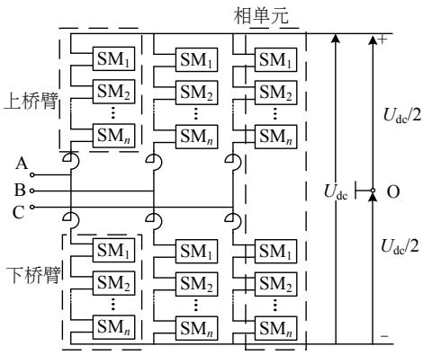  
图 1 MMC 结构图

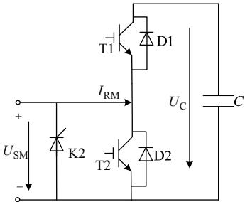  
Fig. 1 Schematic of MMC   
图2 子模块结构图  
Fig. 2 Schematic of SM

# 2 数值计算详细模型

# 2.1 数值计算详细模型

子模块中电容接入状态 $S _ { \mathrm { c } }$ 与IGBT导通的关系可归纳为：1）当 MMC-HVDC 运行于稳态时。T1导通、T2 关断，电容为接入状态，此时 $S _ { \mathrm { c } } { = } 1$ ；T1关断、T2 导通，电容为退出状态，此时 $S _ { \mathrm { c } } { = } 0 ~ ^ { \circ }$ 2）当 MMC-HVDC 发生直流线路双极短路且未闭锁时。子模块将流过较大的负电流，电容电压迅速降低至负值。此时无论T1与T2处于何种触发状态，电容均被 D2短路，电容为退出状态， $S _ { \mathrm { c } } { = } 0 ~ ^ { \circ }$

当电容处于接入状态时，子模块输出电容电压；当电容处于退出状态时，子模块输出电压为 $0 ~ \textdegree$ 则子模块端口电压与电容电压的关系可表示为

$$
U _ {\mathrm {S M}} = S _ {\mathrm {c}} U _ {\mathrm {c}} + U _ {\mathrm {c o n}}, S _ {\mathrm {c}} = 1, 0 \tag {1}
$$

式中 $U _ { \mathrm { c o n } }$ 为半导体开关器件通态压降。IGBT 和二

极管的特性参数可由厂家提供的数据提取及曲线拟合得到[15-16]，其特性可表示为

$$
U _ {\text {c o n}} = R _ {0} I _ {\text {c o n}} + U _ {0} \tag {2}
$$

式中： $R _ { 0 }$ 为半导体器件正向导通电阻； $U _ { 0 }$ 为 IGBT的擎住电压或者反并联二极管的门槛电压； $I _ { \mathrm { c o n } }$ 为流过半导体开关器件的电流。电磁暂态仿真软件PSCAD/EMTDC 中的电力电子器件由理想开关、正向压降 $U _ { \mathrm { F D } }$ 及导通时较小阻值的 $R _ { \mathrm { o n } }$ 或者关断时较大阻值的 $R _ { \mathrm { o f f } }$ 模拟。出于对比的需要，将式(2)中 $R _ { 0 }$ 取半导体材料的导通电阻 $R _ { \mathrm { o n } }$ ， $U _ { 0 }$ 取其正向压降$U _ { \mathrm { F D } }$ ，则式(2)表示的导通特性与 PSCAD/EMTDC 中的半导体器件一致。

IGBT 与二极管的导通情况可根据 $I _ { \mathrm { R M } }$ 及 $S _ { \mathrm { c } }$ 来判断：若反并联二极管导通，则式(2)中 $R _ { 0 } \setminus U _ { 0 }$ 选取为二极管特性参数，否则 $R _ { 0 } \setminus U _ { 0 }$ 选取为 IGBT 特性参数。因此子模块中半导体器件压降 $U _ { \mathrm { c o n } }$ ，随着电力电子器件开关状态及电流方向而改变，可以总结为

$$
U _ {\text {c o n}} = \left\{ \begin{array}{l} R _ {\text {o n , d i o d e}} \cdot I _ {\mathrm {R M}} + U _ {\mathrm {F D , d i o d e}}, I _ {\mathrm {R M}} > 0 \& S _ {\mathrm {c}} = 1 \\ R _ {\text {o n , I G B T}} \cdot I _ {\mathrm {R M}} - U _ {\mathrm {F D , I G B T}}, I _ {\mathrm {R M}} <   0 \& S _ {\mathrm {c}} = 1 \\ R _ {\text {o n , I G B T}} \cdot I _ {\mathrm {R M}} + U _ {\mathrm {F D , I G B T}}, I _ {\mathrm {R M}} > 0 \& S _ {\mathrm {c}} = 0 \\ R _ {\text {o n , d i o d e}} \cdot I _ {\mathrm {R M}} - U _ {\mathrm {F D , d i o d e}}, I _ {\mathrm {R M}} <   0 \& S _ {\mathrm {c}} = 0 \end{array} \right. \tag {3}
$$

式中下标 diode 与 IGBT 分别表示 diode 型及 IGBT型半导体器件。

根据电容器充放电原理，SM 中电容电压 $U _ { \mathrm { c } }$ 与 $I _ { \mathrm { R M } }$ 的关系可表示为式(4)， $I _ { \mathrm { R M } }$ 实际流向与图 2参考方向相同取正值。

$$
U _ {\mathrm {c}} (t + \Delta T) = U _ {\mathrm {c}} (t) + \frac {S _ {\mathrm {c}}}{C} \int_ {t} ^ {t + \Delta T} I _ {\mathrm {R M}} (\tau) \mathrm {d} \tau \tag {4}
$$

式中：C 为子模块的电容值； $\Delta T \cdot t$ 分别为仿真步长和仿真开始时间。桥臂电容器组输出电压 $U _ { \mathrm { R M } }$ 为串联于该桥臂的各子模块输出电压之和，可表示为

$$
U _ {\mathrm {R M}} = \sum_ {j = 1} ^ {N} U _ {\mathrm {S M} j} = \sum_ {j = 1} ^ {N} \left(U _ {\mathrm {c o n} j} + U _ {\mathrm {c} j} \cdot S _ {\mathrm {c} j}\right) \tag {5}
$$

式中： $U _ { \mathrm { c } j }$ 表示桥臂内第 j 个子模块的电容电压； $S _ { \mathsf { c } j }$ 表示其子模块接入状态。

根据以上分析可建立MMC桥臂的数值计算详细模型，如图 3 所示。该模型每个桥臂均由数字计算详细模块(numerical calculation detailed module，NCDM)及受控电压源组成。首先由电压调制策略计算投入子模块个数 $N _ { \mathrm { o n } }$ ，然后 NCDM 接收均压控制计算得到桥臂内 N 个子模块的开关指令集合 ST[N]及测量得到的各桥臂电流 $I _ { \mathrm { R M } } ( $ (其中图 3 中 $I _ { \mathrm { R M } }$ 下标up 代表上桥臂、dn 代表下桥臂，A、B、C 分别表示三相系统中的三相。桥臂电压 $U _ { \mathrm { R M } }$ 的标注方式相

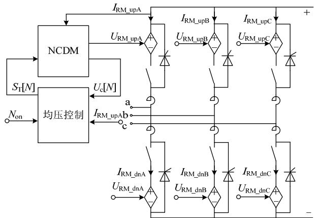  
图3 数值计算详细模型  
Fig. 3 Schematic of proposed numerical calculation detailed model

同，不再重复介绍)，根据以上信号判断电容器接入状态，然后将式(4)计算得到的桥臂内 N 个子模块电容电压集合 $U _ { \mathrm { c } } [ N ]$ 反馈给均压控制，并将式(5)计算得到的桥臂电压作为受控电压源的控制输入。

为了能够模拟 MMC 闭锁功能，在模型中增加了开关和晶闸管。当 MMC 控制系统检测到直流双极短路故障时，代表电容器组的受控电压源将被开关从电路中断开，同时触发晶闸管模拟子模块中K2 的闭锁功能[12]。

数值计算模型采用数值计算代替了子模块电磁暂态仿真，节省了大量仿真计算时间；保留了MMC 电路主体结构，具有直观性强、建模简单的特点；开放了开关控制量输入及电容电压输出，可用于桥臂间环流分析、电容均压策略等各方面的研究。

# 2.2 混合模型仿真方法

基于数值计算MMC模型若要模拟子模块内部的电容器、半导体器件故障等涉及子模块内部拓扑结构的电磁暂态过程，需要针对不同的故障建立复杂的数学模型，可行性不强。为此，本文在数值计算详细模型的基础上设计了一种可用于研究 MMC子模块内部电磁暂态过程的混合模型仿真方法。

MMC 桥臂内子模块可分为 2 类：需要研究内部故障的特殊子模块和一般子模块。MMC 桥臂可分解为独立子模块组与受控电压源的组合，不影响仿真计算的精度[9]，为了能够研究子模块内部的电磁暂态过程，本文设计一种将独立子模块的电磁暂态模型与数值计算模型相结合的混合仿真方法。对于一般子模块，其状态由 NCDM 计算得到；对于特殊子模块则分别建立其独立子模块模型，通过电磁暂态仿真软件提供的故障功能模块模拟子模块内部故障，并将独立子模块仿真计算结果替换NCDM 相应的数据。混合模型的结构如图 4 所示。具体实现方法如下：

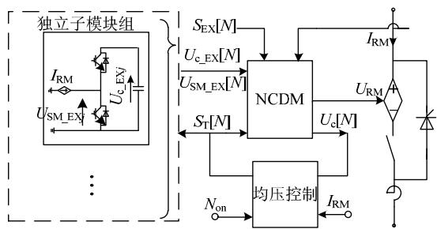  
图4 混合桥臂模型  
Fig. 4 Hybrid numerical calculation arm model

1）NCDM 增加 N 维外部数据接收端口$U _ { \mathrm { S M \_ E X } } [ M ] \setminus U _ { \mathrm { c \_ E X } } [ N ]$ 及外部控制端口 $S _ { \mathrm { E X } } [ N ]$ 。当桥臂内第 j 个子模块外部控制端口 $S _ { \mathrm { E X } j }$ 对应的数值为1 时，NCDM 的对应子模块端口电压 $U _ { \mathrm { S M } _ { \mathcal { j } } }$ 及电容电压 $U _ { \mathrm { c } \ j }$ 由其对应的外部输入数据 $U _ { \mathrm { S M } \ , \mathrm { E X } j }$ 及 $U _ { \mathrm { c } \_ E X j }$ 替换，若为 0 则采用 NCDM 内部计算数据。  
2）可选取桥臂内任意 m 个子模块作为研究对象，m的取值范围为 1~N，建立其独立子模块组模型，并根据研究需要，由电磁暂态仿真软件提供的故障功能模块模拟子模块的故障状态，然后将其仿真数据 $U _ { \mathrm { S M } \ , \mathrm { E X } j }$ 及 $U _ { \mathrm { c } \_ \mathrm { E X } j }$ 分别接入 NCDM。

# 3 数值计算平均值模型

数值计算详细模型能够模拟各个子模块的运行状态，可用于电容电压均衡控制策略研究。然而电压均衡控制算法一般需对子模块电容电压进行排序，大量子模块电容电压的排序及积分计算一定程度上降低了模型的计算速度。当 MMC 应用于多端直流输电或者直流电网时，该类问题更为严重。文献[11]提出了一种 MMC 平均值模型，具有极高的仿真速度；然而该模型的简化过程一定程度上影响了MMC的外特性，降低了仿真计算的精度[12-13]。为此，本文在数值计算详细模型的基础上，提出了一种在能够不改变 MMC 外特性的平均值模型。该模型将子模块状态划分为 2 种：导通状态和退出状态。导通状态的子模块在仿真步长内完成充放电过程；退出状态的子模块则保持其电压值不变；将调制策略计算得到的导通子模块数 $N _ { \mathrm { o n } }$ 与导通电容电压的乘积作为桥臂输出电压；最后将导通子模块吸收或者放出的能量在所有的子模块间平均，其具体的实现方法论述如下：

导通状态及退出状态的电容电压分别为 $U _ { \mathrm { c } \_ \mathrm { o n } }$ 、$U _ { \mathrm { c } _ { \perp } \mathrm { o f f } }$ ，根据式(4)可得其计算公式为

$$
\left\{ \begin{array}{l} U _ {\mathrm {c} _ {-} \text {o n}} = U _ {\mathrm {c} 0} + \frac {1}{C} \int_ {0} ^ {\Delta T} I _ {\mathrm {R M}} (\tau) \mathrm {d} \tau \\ U _ {\mathrm {c} _ {-} \text {o f f}} = U _ {\mathrm {c} 0} \end{array} \right. \tag {6}
$$

其中上一仿真周期最后得到的电容电压平均

值作为本次仿真计算的初始值 $U _ { \mathrm { c 0 } }$ 。则桥臂电容器组输出电压可以表示为

$$
U _ {\mathrm {R M}} = N _ {\mathrm {o n}} \cdot U _ {\mathrm {c} _ {-} \mathrm {o n}} \tag {7}
$$

在仿真步长内，导通子模块组储存能量的变化量E 为导通子模块吸收的能量，即

$$
\Delta E = \frac {1}{2} N _ {\mathrm {o n}} C \left(U _ {\mathrm {c} - \mathrm {o n}} ^ {2} - U _ {\mathrm {c} 0} ^ {2}\right) \tag {8}
$$

本步仿真结束时相应的桥臂内存储总能量E可以表示为

$$
E = \frac {1}{2} C \sum_ {j = 1} ^ {N} U _ {\mathrm {c j}} ^ {2} = \frac {1}{2} N C U _ {\mathrm {c 0}} ^ {2} + \Delta E \tag {9}
$$

将桥臂存储能量在所有子模块间平均可得

$$
U _ {\text {c a v g}} = \sqrt {U _ {\mathrm {c} 0} ^ {2} + (2 / C N) \Delta E} \tag {10}
$$

式中 $U _ { \mathrm { c a v g } }$ 为桥臂电容电压储存能量均值，它将作 为下一步仿真运算电容电压的初值。

而对应于直流线路短路且换流器未闭锁，电容电压值降为负值的情形，此时桥臂电容被 D2 短路，电容电压不变，桥臂电容器组输出电压为 0，即

$$
\left\{ \begin{array}{l} U _ {\mathrm {c a v g}} = U _ {\mathrm {c 0}} \\ U _ {\mathrm {R M}} = 0 \end{array} \right. \tag {11}
$$

根据以上分析可建立数值计算平均值模型，如图 5 所示，其中 R 为桥臂内所有电力电子器件的等效阻抗，可有 MMC 损耗评估得到[15]。该模型由数字计算平均值模块(numerical calculation averagedmodule，NCAM)及受控电压源组成。首先 NCAM接收电压调制策略计算得到投入子模块数 $N _ { \mathrm { o n } }$ 及桥臂电流量测信号，然后由式(7)或者式(11)计算得到的桥臂电压作为受控电压源的输入。同样在模型中增加了开关和晶闸管以模拟 MMC闭锁功能，其控制方法与详细模型相同。

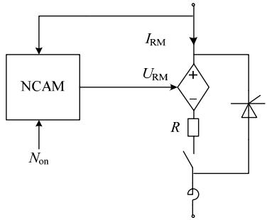  
图5 数值计算平均值桥臂模型  
Fig. 5 Schematic of proposed numerical calculation averaged arm model

图6为数值计算平均值模型电容电压及环流抑制的仿真结果，1 s 时应用文献[17]提出环流抑制技术对 MMC内部环流进行控制。图 6 中各量分别为a 相上、下桥臂电容电压及内部三相环流。由图 6可知，环流抑制策略启动后，环流成分得到有效抑

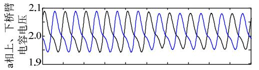

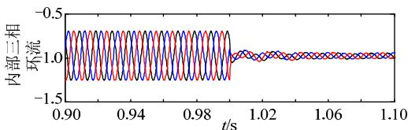  
图6 平均值模型电容电压及环流特性  
Fig. 6 Simulation results of capacitor voltages and circulating currents using proposed average simulation model

制，电容电压的波动幅度也降低了。表明平均值模型能够反映 MMC 电容电压的能量波动及环流特性，可用于环流抑制策略研究。后续章节还将对平均值模型的仿真计算精度作进一步的验证。

# 4 模型验证

为了验证本文提出MMC快速仿真模型的有效性，在 PSCAD/EMTDC 仿真平台上搭建了 21 电平双端 MMC-HVDC 输电系统，如图 7 所示，其中 $I _ { \mathrm { d c } }$ 、$U _ { \mathrm { d c } }$ 分别为直流电流、直流电压。模型控制系统采用了 $\mathrm { d } \mathsf { q }$ 解耦的控制方法，由 NLC 计算投入的子模块数逼近电压调制波[18]。两端交流系统额定电压均为 220 kV，变压器变比为 1:1，直流输电电压为200 kV，直流传送容量 600 MW。子模块电容值为$3 0 0 0 \mu \mathrm { F }$ ，环流电抗器 0.02 H，仿真步长为 $2 0 ~ \mu \mathrm { s }$ 。

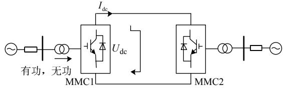  
图 7 MMC-HVDC 系统结构图  
Fig. 7 Structure of MMC-HVDC system

# 4.1 模型精度校验

分别搭建采用相同控制参数的MMC-HVDC传统模型、数值计算详细模型、数值计算平均值模型。对各模型在稳态运行及故障后暂态过程的仿真结果进行对比。

图 8 为直流系统运行于 600 MW 的额定工况下，a 相上桥臂电流及子模块投入个数的仿真结果。

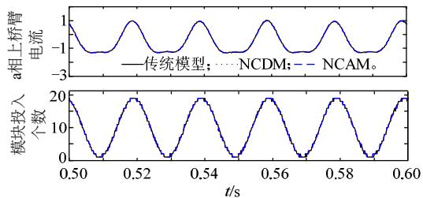  
图8 稳态对比图  
Fig. 8 Steady state comparison

由图可知在稳态运行条件下，本文提出数值计算详细模型与数值计算平均值模型都能稳定运行，且其仿真结果与传统模型基本一致。

图9为模拟交流系统经过渡电阻三相接地的暂态过程的仿真结果。1 s时 MMC1 侧交流系统侧发生三相瞬时接地故障，0.1 s 后故障消除，故障侧传输有功功率、无功功率及电容电压平均值的 3种模型的仿真结果，如图 9所示。由对比可知，数值计算详细模型、数值计算平均值模型与传统模型仿真计算结果高度一致，表明本文提出的 2 种模型能够对交流故障暂态过程进行精确模拟。

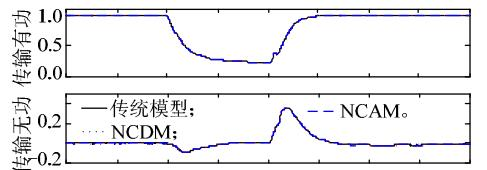

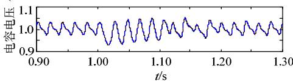  
图9 交流系统故障暂态对比图  
Fig. 9 Transient state comparison during AC system fault

图10(a)为模拟1 s时直流线路双极短路故障且换流器未闭锁时的直流电压、直流电流及 a 相上桥臂电容电压平均值仿真结果。图 10(b)为模拟直流线路双极短路且换流器闭锁时的直流电流、a 相电流及 a 相换流器输出电压的仿真结果。1 s时直流线路发生双极经过渡电阻短路，40 μs 后检测到直流系统故障，K2 闭合换流器闭锁，50 ms 后断开交流系统[19]。由以上对比可知，当直流线路发生双极闭

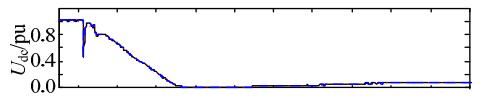

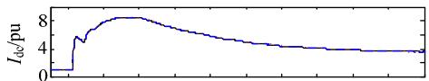

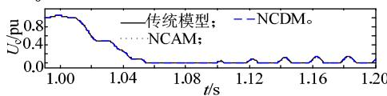  
(a)换流器未闭锁

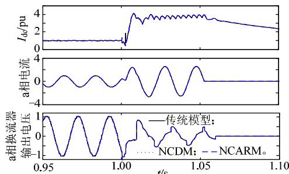  
(b)换流器闭锁   
图10 直流双极短路故障暂态对比图  
Fig. 10 Transient state comparison during dc fault between the positive and negative poles

锁故障时，无论换流器是否闭锁，数值计算详细模型、数值计算平均值模型与传统模型仿真计算结果都高度一致，表明本文提出的 2 种模型在直流系统故障情况下也具有极高的精度。

# 4.2 混合模型仿真方法精度校验

子模块故障冗余保护将少量冗余子模块置于热备用状态，当发生子模块故障时，可用冗余子模块来替换故障子模块[20]。为了验证混合模型仿真方法的可行性，搭建具备子模块故障冗余保护功能的MMC 混合模型及传统模型，并对他们冗余保护过程进行仿真研究。

建立发生故障和冗余子模块的电磁暂态模型。1 s时某子模块中电容发生短路故障而被旁路，5 ms后该子模块由冗余子模块替换。冗余子模块中电容充电，1.4 s后故障桥臂的电容电压逐步恢复正常，该过程的仿真结果如图 11 所示。由图 11 可知，两者动态过程吻合，说明混合模型仿真方法能够对子模块的电磁暂态过程进行研究。

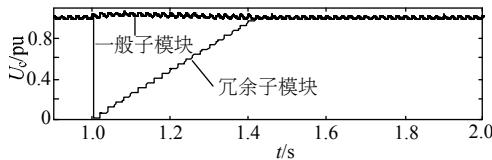

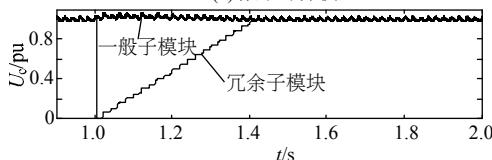  
(a) 数学计算模型  
(b) 传统模型  
图11 故障相桥臂电容电压波形图  
Fig. 11 Waveforms of capacitor voltage in the fault phase

# 4.3 数值计算模型加速效果验证

为了验证本文提出的模型的加速效果，搭建9201 电平的 MMC 传统模型、分解模型及数值计算模型，对相同条件下各模型仿真用时进行对比，如表 1 所示。其中仿真步长取 20 μs，仿真时长为5 s，程序运行于 WIN7-64 位系统，处理器为 InterCore i7-3770，内存 8.0 GB，PSCAD/EMTDC 平台的版本为 V4.2.0。

表1 各模型运行时间对比  
Tab. 1 Running time comparison   

<table><tr><td rowspan="3">电平数</td><td colspan="4">仿真用时/s</td></tr><tr><td rowspan="2">传统模型</td><td rowspan="2">分解模型</td><td colspan="2">数值计算模型</td></tr><tr><td>详细模型</td><td>平均值模型</td></tr><tr><td>9</td><td>108</td><td>33</td><td>8</td><td>6</td></tr><tr><td>21</td><td>622</td><td>124</td><td>10</td><td>6</td></tr><tr><td>51</td><td>16282</td><td>346</td><td>15</td><td>6</td></tr><tr><td>101</td><td>143579</td><td>689</td><td>34</td><td>6</td></tr><tr><td>151</td><td>394887</td><td>1181</td><td>66</td><td>6</td></tr><tr><td>201</td><td>577713</td><td>1668</td><td>118</td><td>6</td></tr></table>

由表 1 可知，本文提出的数值计算详细模型加速效果显著，相比传统模型最高可加速 5 983倍，相比分解模型平均加速 10 倍以上。平均值模型加速效果更加明显，其仿真速度能够不随电平数的变化而变化，尤其适合于高电平数的多端直流输电等多 MMC 集成应用场合。

# 5 结语

本文提出了两种适用于MMC的快速电磁暂态仿真模型。数值计算详细模型能够较完整地表现子模块内部特性，可用于电压均衡控制等涉及子模块内部状态的研究。在该模型的基础上设计了将数值计算模型与独立子模块模型结合的混合模型仿真方法，弥补了传统数值计算模型不能模拟子模块电磁暂态过程的缺陷，对该类模型的适用范围进行了扩展。数值计算平均值模型在完整地保留了 MMC外特性的前提下具有极高的仿真速度，可用于多端直流输电或者直流电网仿真研究。

在 PSCAD/EMTDC 平台上对数值计算详细模型及数值计算平均值模型的仿真计算精度及加速效果进行验证，结果表明模型在具有极高精度的情况下加速效果显著。通过对子模块冗余保护研究，验证了混合模型仿真模式对子模块的电磁暂态过程的模拟是准确可靠的。

涉及子模块内部故障的电磁暂态过程较为复杂，尚无有效的数学模型对其进行描述，这是本文后续需要开展的工作。

# 参考文献

[1] 杨晓峰，林智钦，郑琼林，等．模块组合多电平变换器的研究综述[J]．中国电机工程学报，2013，33(6)：1-15  
Yang Xiaofeng，Lin Zhiqin，Zheng Trillion Q．，et al．A review ofmodular multilevel converters[J]．Proceedings of the CSEE，2013，33(6)：1-15(in Chinese)．  
[2] Qingrui Tu，Zheng Xu．Impact of sampling frequency on harmonic distortion for modular multilevel converter[J]．IEEE Transactions on Power Delivery，2011，26(1)：298-306   
[3] Teeuwsen S P．Modeling the trans bay cable project as voltagesourced converter with modular multilevel converter design [C]//Power and Energy Society General Meeting．Detroit，Michigan， USA：IEEE，2011：1-8．   
[4] 阎发友，汤广福，贺之渊，等．基于MMC的多端柔性直流输电系统改进下垂控制策略[J]．中国电机工程学报，2014，34(3)：397-404Yan Fayou，Tang Guangfu，He Zhiyuan，et al．An improved droopcontrol strategy for MMC-based VSC-MTDC systems[J]．Proceedingsof the CSEE，2014，34(3)：397-404(in Chinese)  
[5] 汤广福，罗湘，魏晓光．多端直流输电与直流电网技术[J]．中国电机工程学报，2013，33(10)：8-17  
Tang Guangfu，Luo Xiang，Wei Xiaoguang．Multi-terminal HVDC and DC-grid technology[J]．Proceedings of the CSEE，2013，33(10)： 8-17(in Chinese)

[6] 张文亮，汤涌，曾南超．多端高压直流输电技术及应用前景[J]．电网技术，2010，34(9)：1-6Zhang Wenliang，Tang Yong，Zeng Nanchao．Multi-terminal HVDCtransmission technologies and its application protects in China[J]Power System Technology，2010，34(9)：1-6(in Chinese)  
[7] 王姗姗，周孝信，汤广福，等．模块化多电平电压源换流器的数学模型[J]．中国电机工程学报，2011，31(24)：1-8Wang Shanshan，Zhou Xiaoxin，Tang Guangfu，et al．Modeling ofmodular multi-level voltage source converter[J]．Proceedings of theCSEE，2011，31(24)：1-8(in Chinese)．  
[8] 管敏渊，徐政．模块化多电平换流器的快速电磁暂态仿真方法[J]电力自动化设备，2012，32(6)：36-40Guan Minyuan，Xu Zheng．Fast electro-magnetic transient simulationmethod for modular multilevel converter[J] ． Electric PowerAutomation Equipment，2012，32(6)：36-40(in Chinese)  
[9] 许建中，赵成勇，刘文静．超大规模MMC电磁暂态仿真提速模型[J]．中国电机工程学报，2013，33(10)：114-120Xu Jianzhong，Zhao Chengyong，Liu Wenjing．Accelerated model ofultra-large scale MMC in electromagnetic transient simulations[J]Proceedings of the CSEE，2013，33(10)：114-120(in Chinese)  
[10] Gnanarathna U N，Gole A M，Jayasinghe R P．Efficient modeling of modular multilevel HVDC converters (MMC) on electromagnetic transient simulation programs[J] ． IEEE Transactions on Power Delivery，2011，26(1)：316-324   
[11] Peralta J，Saad H，Dennetiere S，et al．Detailed and averaged models for a 401-level MMC–HVDC system[J]．IEEE Transactions on Power Delivery，2012，27(3)：1501-1508   
[12] Saad H，Peralta J，Dennetiere S，et al．Dynamic averaged and simplified models for MMC-based HVDC transmission systems[J] IEEE Transactions on Power Delivery，2013，28(3)：1723-1730   
[13] Saad H，Dennetière S，Mahseredjian J，et al．Modular multilevelconverter models for electromagnetic transients[J]．IEEE Transactionson Power Delivery，2014，29(3)：1481-1489  
[14] 赵昕，赵成勇，李广凯，等．采用载波移相技术的模块化多电平换流器电容电压平衡控制[J]．中国电机工程学报，2011，31(21)：48-55Zhao Xin ， Zhao Chengyong ， Li Guangkai ， et al ． Submodulecapacitance voltage balancing of modular multilevel converter basedon carrier phase shifted spwm technique[J]．Proceedings of the CSEE，2011，31(21)：48-55(in Chinese)  
[15]潘武略，徐政，张静，等．电压源换流器型直流输电换流器损耗分析[J]．中国电机工程学报，2008，28(21)：7-14Pan Wulüe，Xu Zheng，Zhang Jing，et al．Dissipation analysis of

VSC-HVDC converter[J]．Proceedings of the CSEE，2008，28(21)：7-14(in Chinese)  
[16] 刘栋，汤广福，贺之渊，等．基于面积等效法的模块化多电平换流器损耗分析[J]．电网技术，2012，36(4)：197-201Liu Dong，Tang Guangfu，He Zhiyuan，et al．Loss evaluation formodular multilevel converter based on equivalent-area modulation [J]Power System Technology，2012，36(4)：197-201(in Chinese)  
[17] Moon J W，Kim C S，Park J W，et al．Circulating current control in MMC under the unbalanced voltage[J]．IEEE Transactions on Power Delivery，2013，28(3)：1952-1959   
[18] 管敏渊，徐政，屠卿瑞，等．模块化多电平换流器型直流输电的调制策略[J]．电力系统自动化，2010，34(2)：48-52  
Guan Minyuan，Xu Zheng，Tu Qingrui，et al．Nearest level modulationfor modular multilevel converters in HVDC transmission[J] ．Automation of Electric Power Systems ， 2010 ， 34(2) ： 48-52(inChinese)．  
[19] 王姗姗，周孝信，汤广福，等．模块化多电平换流器 HVDC 直流双极短路子模块过电流分析[J]．中国电机工程学报，2011，31(1)：1-7．Wang Shanshan，Zhou Xiaoxin，Tang Guangfu，et al．Analysis ofsubmodule overcurrent caused by DC pole-to-pole fault in modularmultilevel converter HVDC system[J]．Proceedings of the CSEE，2011，31(1)：1-7(in Chinese)  
[20] Son G T，Lee H J，Nam T S，et al．Design and control of a modular multilevel HVDC converter with redundant power modules for noninterruptible energy transfer[J] ． IEEE Transactions on Power Delivery，2012，27(3)：1611-1619．

  
喻锋

收稿日期：2014-07-09。

作者简介：

喻锋(1985)，男，硕士研究生，主要研究方向为直流输电及电网安全稳定控制，E-mail：yufengcsh@163.com；

王西田(1973)，男，副教授，主要研究方向为电力系统机网协调及稳定控制，E-mail：x.t.wang@sjtu.edu.cn；

林卫星(1986)，男，博士，主要从事各种风电并网方式的控制及技术、经济对比研究，E-mail：weixinglin@foxmail.com；

解大(1969)，男，副教授，主要研究方向为电力系统 FACTS 研究和电力系统仿真，E-mail：xieda@sjtu.edu.cn。

（责任编辑 徐梅）