# An EMT based dynamic frequency scanning tool for stability analysis of inverter based systems

Chen Jiang a,* , Zhiqiang Liu a , Rohitha Jayasinghe a , Dharshana Muthumuni a ：a Aniruddha M. Gole b

a Manitoba Hydro International, Winnipeg, Canada   
b Department of Electrical and Computer Engineering, University of Manitoba, Winnipeg, Canada

# A R T I C L E I N F O

Keywords:

Bode plot

Electromagnetic transients (EMT) simulation

Frequency scanning

Grid forming (GFM) converter

Modular multilevel converter (MMC)

# A B S T R A C T

This paper introduces an automated dynamic frequency scanning tool designed to predict stability in power systems. The tool integrates frequency scanning and stability analysis into a single, user-friendly platform, which is validated through Electromagnetic Transients (EMT) simulations and traditional small-signal stability techniques. Case studies involving a modular multi-level converter (MMC) system are conducted using two gridforming (GFM) controller strategies: voltage-source type and current-source type virtual synchronous generators (VSGs). The effectiveness of the tool is demonstrated by comparing stability predictions from the scanning method with results from root locus analysis and EMT simulations, showing that it provides a reliable and efficient approach for predicting system stability. A key contribution of this paper is the comparative analysis of the two GFM controller types, offering valuable insights into their performance and stability characteristics. The results highlight that the current-source type VSG can operate effectively in a strong ac system, which is a challenge typically faced by the voltage-source type VSG.

# 1. Introduction

THE global focus on combating climate change and addressing energy shortages has led to a rapid increase in the integration of renewable energy sources (RES) into the power grid. As a result, voltage source converters (VSCs), which are primarily used to interface these resources with the grid, have seen a significant rise in deployment, and these systems are referred to as inverter-based resources (IBR) [1]. Among the various VSC topologies, the Modular Multi-Level Converter (MMC), originally proposed in 2001 by Prof. R. Marquardt [2], has emerged as a preferred choice due to its high efficiency, and the ability to generate near-sinusoidal output waveforms which eliminates the need for additional filtering.

VSCs can generally be classified into two control modes: gridfollowing (GFL) and grid-forming (GFM). In GFL mode, the converter synchronizes with the grid by tracking the system voltage’s phase using a Phase-Locked Loop (PLL) to generate reference signals for controlling the switching of power electronics devices, such as IGBT, etc. In contrast, GFM converters generate their own output voltage, with

magnitude and phase adjusted to meet the required active and reactive power. This approach does not rely on an external PLL, making it inherently more flexible for operation in isolated or weak grid conditions [3]. One common GFM strategy is the virtual synchronous generator (VSG), where the converter mimics the behavior of a synchronous generator (SG) to provide stable voltage and frequency control.

The concept of VSG was introduced in [4], based on the electro-mechanical swing equation and a fundamental damping mechanism. Various enhanced VSG configurations have been proposed to improve performance. For instance, an adaptive VSG (AVSG) control, which utilizes online grid impedance estimation, has been proposed to ensure robust operation [5]. Additionally, a fast current loop has been incorporated to mitigate harmonic distortion [6], and energy shaping techniques have been integrated to include a complete physical imple mentation of a SG into the controller’s behavior [7], among other improvements. Since the controller outputs are voltages signals which can be directly generated by the converters, this kind of VSG can be classified as voltage source type VSG. However, one limitation of these voltage source type VSG models is that their power-electronic switches

cannot handle the large fault currents typical with synchronous generators, necessitating the inclusion of current-limiting controls. These current limiters rely on a decoupled current loop with Proportional–Integral (PI) controllers to restrict the current references, thereby preventing overcurrent conditions. Unfortunately, as demonstrated in [8], the introduction of these PI controllers can lead to instability in VSG systems, particularly when connected to a strong ac network.

Alternatively, the current source type VSG, which more accurately models the mechanical and electrical dynamics of a real SG [9]. This strategy does not require a PI controller for current limiting, since the current reference itself generated by the VSG can be directly constrained. This approach has been shown to provide stable operation even in both weak and strong ac systems [10].

The integration of MMCs with these advanced control strategies into power systems can have significant effects on system stability. In the worst-case scenario, improper integration may lead to system insta bility. Predicting and analyzing such instability is a critical task, and this process is generally referred to as stability analysis. Different methods of investigating the system stability are shown in Fig. 1 below.

One common approach to stability analysis is the use of Electromagnetic Transient (EMT) simulations, which provide time series outputs of quantities such as instantaneous phase voltages, currents etc. This method can identify stable or unstable operating conditions by simulation but cannot directly provide insights into the stability. For example, indices such as stability margins can only be obtained by conducting a very large number of simulations and inspecting the parameter boundary at the onset of instability.

Another method involves developing linearized mathematical models of the system which are accurate for small variations around an operating point. Using these models, it becomes easy to use linearsystem theory (such as eigenvalue analysis, Nyquist plots, etc.) to determine the stability margins and oscillation frequencies.

However, often the manufacturers only provide access to black boxed models where the controller structure and parameters are not available to the end user. In such cases, an alternative approach is frequency scanning [11], in which a multi-sine current or voltage signal containing a range of frequencies is injected at a suitable point in the network. The current or voltage entering a network element (e.g., a VSG) is recorded and after applying a Discrete Fourier Transform (DFT), its spectrum can be obtained. Using this, the impedance (or admittance) response of the network element can be obtained without a complete knowledge of the component’s internal structure. Once the impedance response is obtained, the stability of the system can be determined by several different approaches. One is to fit the impedance with a rational function representation and use linear system theory directly. Alternatively, graphical approaches such as Nyquist or Bode plots can be used

[16].

In the past frequency scanning methods have been applied to various domains while achieving acceptable results. For example, the sequence admittance model of a STATCOM is derived using simulation-based frequency scanning techniques [12]. Similarly, dynamic phasor-based scanning has been used to model single-phase converter systems [13]. Frequency scanning in the dq0 domain has been demonstrated in the context of a CIGRE DCS1 system [14]. In the αβ frame, it has also been applied to a Doubly-Fed Induction Generator (DFIG) wind farm, where it facilitates a faster scanning process while maintaining similar accuracy [15]. Due to its flexibility and robustness, this paper utilizes frequency scanning in the d-q frame, which eliminates frequency coupling effects to perform analysis on state-of-the-art GFM technology.

This paper introduces an automated tool for dynamic frequency scanning and stability analysis, which simplifies the frequency scanning process and integrates stability prediction into a single workflow. While EMT-based frequency scanning is not a new concept, it has not yet been applied to the gamut of emerging GFM technologies widely. The tool developed here combines multiple steps of the process, making it more accessible and efficient. Two GFM control strategies are used as case studies to highlight the tool’s application, which are voltage source type VSG and current source type VSG. The critical short-circuit ratio (CSCR) is determined through impedance scanning and Bode plot analysis. The CSCR is the critical value of the SCR at which the system is on the borderline of stability. Results from EMT simulations and root locus analysis validate the approach. The key contribution of this paper lies in comparing the two VSG control strategies, offering new insights into their stability and performance. This comparison provides a more thorough understanding of their behavior, which has not been extensively covered in prior studies.

# 2. System layout

The proposed EMT-based dynamic frequency scanning method will be tested using a VSC of the MMC type, consisting of 20 submodules (SMs) per arm. It is connected to an ac network through an equivalent RL branch, as shown in Fig. 2 below.

Two types of VSG control structures are implemented to the MMC to validate the accuracy of the dynamic frequency scanning method and its subsequent stability analysis, which are voltage source type VSG and current source type VSG. The general control configurations for each VSG type are shown in Figs. 3 and 4 separately, with main parameters listed in Tables 1–3. Additional details for these VSG control strategies can be found in [8,10].

Additionally, a circulating current suppression controller (CCSC) is required to mitigate circulating current harmonics in the MMC’s arms

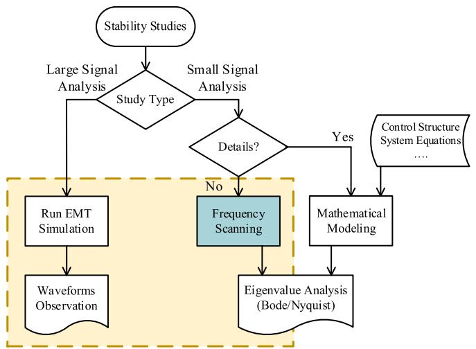  
Fig. 1. Different methods for stability studies.

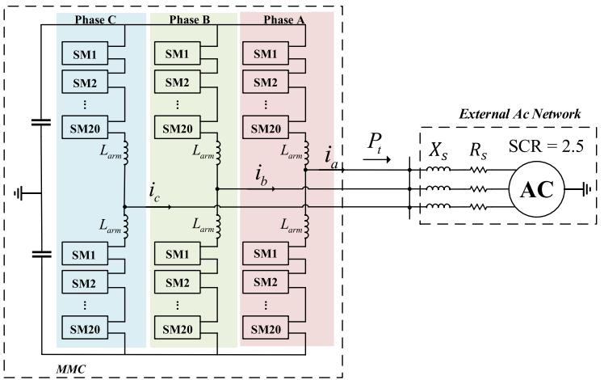  
Fig. 2. System layout.

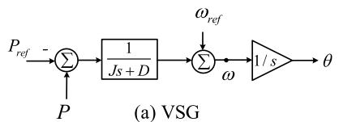

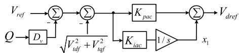

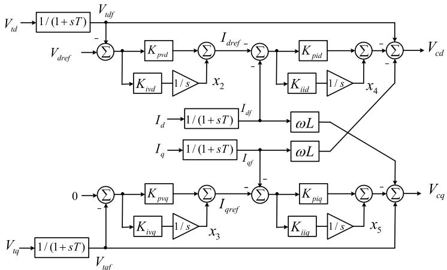  
(b) Ac Voltage Reference Generator   
(c) Embedded Current Controller   
Fig. 3. Voltage source type VSG control structure.

[17]. A widely used nearest level control (NLC) algorithm is also applied to determine the appropriate number of steps for the MMC operation [17].

# 3. Frequency scanning methodology

This section introduces the basic theory and challenges of dynamic frequency scanning of non-linear systems, e.g., non-linear loads, power electronics systems (PES), etc.

# 3.1. Dynamic frequency scanning

EMT simulations are well-suited for impedance scanning due to their ability to model non-linearities and transient dynamics in detail. This allows the small-signal frequency response of a system to be obtained at

a specific operating point [11]. It is important to note that this response is dependent on the system’s operating conditions, with the assumption that the system behaves linearly around its steady state operating point. Any change in the operating point requires a new scan to capture the system’s response under the new conditions.

The process of dynamic frequency scanning involves the following steps:

i. First, the system is ensured to reach a steady state.   
ii. Once stable, a small multi-sine disturbance signal (voltage or current) with a wide frequency range is injected into the system.   
iii. Waveforms of voltage and current are captured for the steady state operation, i.e., after the transients die out.   
iv. Using Discrete Fourier transformation (DFT), the magnitudes and phase angles of the frequency components are extracted.

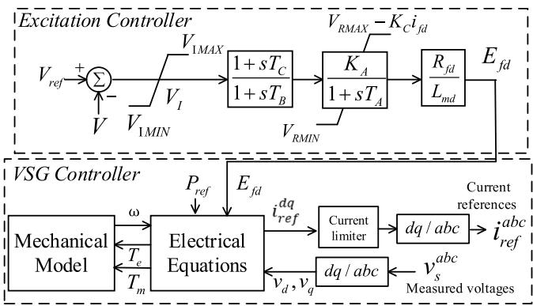  
Fig. 4. Current source type VSG control structure.

Table 1 Main system parameters.   

<table><tr><td>Dc side voltage</td><td>±150 kV</td><td>System frequency</td><td>60 Hz</td></tr><tr><td>MMC Power Rating</td><td>270MVA</td><td>MMC Voltage Rating</td><td>180 kV</td></tr><tr><td>Ac system SCR</td><td>2.5</td><td>Submodule per arm</td><td>20</td></tr></table>

Table 2 Parameters of voltage source type VSG controller.   

<table><tr><td>VSG parameters (J,D)</td><td>(0.04,1.0)</td></tr><tr><td>Ac controller gains (Kp_ac, Ki_ac)</td><td>(2.5,10)</td></tr><tr><td>Droop settings (Dv)</td><td>0.0</td></tr><tr><td>Voltage loop controller gains (Kp_vd = Kp_vq, Ki_vd = Ki_vq)</td><td>(1.0,10)</td></tr><tr><td>Current loop controller gains (Kp_id = Kp_iq, Ki_id = Ki_iq))</td><td>(0.8,10)</td></tr></table>

v. Dividing the DFTs of voltage and current gives the system’s impedance (similarly, admittance) as a function of frequency.

There are a few important considerations. It is recommended to inject disturbances only after the system has reached a steady state condition to ensure small-signal behavior. Additionally, while the disturbance should be small enough to preserve linearity, it should also be large enough to be measurable above system noise. The choice of disturbance magnitude depends on trial and error and varies from case to case. Typically, 0.5% of the rated voltage/current serves as a good starting point for tuning this magnitude. Furthermore, the number of frequencies within the multi-sine disturbance signal for each injection is also an important factor. As a rule of thumb, a maximum of 30 frequencies is typically used for IBR system.

# 3.2. Frequency scanning in different domains

Impedance scanning can be conducted in different domains, such as phase (abc), sequence (±/0 sequence), or dq0 domains.

In the phase coordinates, the impedance matrix ${ \pmb Z } ^ { a b c }$ is typically full rather than diagonally dominant. In order to capture the full set of data in the abc domain, three distinct injections (current or voltage) are required separately, each in a different phase (i.e., a, b or c).

As an illustrative example, the case of a current injection $\Delta I _ { D i s }$ at the at the Point of Common Coupling (PCC) of the MMC-ac system of Fig. 2 is presented in Fig. 5. The MMC side impedance ${ \pmb Z } _ { M M C } ^ { a b c }$ is given in (1) below. As previously mentioned, three separate injections are required, each for a different phase. The first injection is applied to phase ‘a’ only. After allowing sufficient time for the transient to die out, the voltage at the PCC bus $\nu _ { P C C } ^ { a b c } ( t )$ and the current entering the MMC $i _ { M M C } ^ { a b c } ( t )$ are measured. A DFT is then applied to convert the time-domain measurements into their corresponding frequency-domain representation $V _ { P C C } ^ { a 1 } ( f ) , V _ { P C C } ^ { b 1 } ( f ) , V _ { \mathrm { P C C } } ^ { c 1 } ( f )$ and $I _ { M M C } ^ { a 1 } ( f ) , I _ { M M C } ^ { b 1 } ( f ) , I _ { \mathrm { M M C } } ^ { c 1 } ( f )$ . The superscript $" 1 ^ { \prime }$ indicates the first injection. These frequency-domain voltage and current values would form the first column of $V _ { P C C } ^ { a b c }$ and $I _ { M M C } ^ { a b c }$ in (1). This process is repeated for the second injection on phase $\because \mathbf { b } ^ { \prime }$ and the third injection on phase $\because c ^ { \prime }$ . Once all the required elements of the matrices $V _ { P C C } ^ { a b c }$ and $I _ { M M C } ^ { a b c }$ are gathered, the impedance of the MMC at any frequency f is obtained by matrices calculation ${ \bf Z } _ { M M C } ^ { a b c } ( f ) = { \bf V } _ { P C C } ^ { a b c } ( f ) \big [ { \cal I } _ { M M C } ^ { a b c } ( f ) \big ] ^ { - 1 } .$ . Similarly, the admittance can be calculated as $Y _ { M M C } ^ { a b c } ( f ) =$

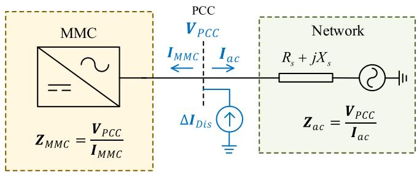  
Fig. 5. Simplified system layout with dynamic frequency scanning setting.

Table 3 Parameters of current source type VSG controller.   

<table><tr><td>Inertia Constant H</td><td>3.42</td><td>Damping constant</td><td>5.0</td></tr><tr><td>Virtual stator resistance Ra</td><td>0.0043 pu</td><td>Virtual field winding resistance Rfd</td><td>0.0008974 pu</td></tr><tr><td>Virtual d-axis damper resistance R1d</td><td>0.01823 pu</td><td>Virtual q-axis damper resistance R1q</td><td>0.0104 pu</td></tr><tr><td>Virtual leakage inductance La</td><td>0.015 pu</td><td>Virtual field winding inductance Lfd</td><td>0.119 pu</td></tr><tr><td>Virtual d-axis mutual inductance Lmd</td><td>2.0 pu</td><td>Virtual q-axis mutual inductance Lmq</td><td>1.44 pu</td></tr><tr><td>Virtual d-axis damper inductance L1d</td><td>0.1097 pu</td><td>Virtual q-axis damper inductance L1q</td><td>0.395 pu</td></tr><tr><td>The upper limit on the error VIMAX</td><td>10.0 pu</td><td>The lower limit on the error VIMIN</td><td>-10.0 pu</td></tr><tr><td>Lead time constant TC</td><td>1.0 s</td><td>Leg time constant TB</td><td>10.0 s</td></tr><tr><td>Regulator integral gain KA</td><td>200.0 pu</td><td>Regular time constant TA</td><td>0.015 s</td></tr><tr><td>Maximum regulator output VRMAX</td><td>5.64 pu</td><td>Minimum regulator output VRMIN</td><td>-4.53 pu</td></tr><tr><td>Rectifier loading factor KC</td><td>0.0</td><td></td><td></td></tr></table>

$$
I _ {M M C} ^ {a b c} (f) \left[ \mathbf {V} _ {P C C} ^ {a b c} (f) \right] ^ {- 1}.
$$

The same procedure can be applied to the network side also. In that case the PCC phase voltages $\nu _ { P C C } ^ { a b c } ( t )$ and the currents entering the network $i _ { a c } ^ { a b c } ( t )$ are reordered for subsequent impedance calculations.

$$
\begin{array}{l} \mathbf {Z} _ {M M C} ^ {a b c} (f) = \left[ \begin{array}{l l l} Z _ {M M C} ^ {a a} (f) & Z _ {M M C} ^ {a b} (f) & Z _ {M M C} ^ {a c} (f) \\ Z _ {M M C} ^ {b a} (f) & Z _ {M M C} ^ {b b} (f) & Z _ {M M C} ^ {b c} (f) \\ Z _ {M M C} ^ {c a} (f) & Z _ {M M C} ^ {c b} (f) & Z _ {M M C} ^ {c c} (f) \end{array} \right] = \mathbf {V} _ {P C C} ^ {a b c} (f) \cdot \left[ \mathbf {I} _ {M M C} ^ {a b c} (f) \right] ^ {- 1} \\ = \left[ \begin{array}{l l l} V _ {P C C} ^ {a 1} (f) & V _ {P C C} ^ {a 2} (f) & V _ {P C C} ^ {a 3} (f) \\ V _ {P C C} ^ {b 1} (f) & V _ {P C C} ^ {b 2} (f) & V _ {P C C} ^ {b 3} (f) \\ V _ {P C C} ^ {c 1} (f) & V _ {P C C} ^ {c 2} (f) & V _ {P C C} ^ {c 3} (f) \end{array} \right] \cdot \left[ \begin{array}{l l l} I _ {M M C} ^ {a 1} (f) & I _ {M M C} ^ {a 2} (f) & I _ {M M C} ^ {a 3} (f) \\ I _ {M M C} ^ {b 1} (f) & I _ {M M C} ^ {b 2} (f) & I _ {M M C} ^ {b 3} (f) \\ I _ {M M C} ^ {c 1} (f) & I _ {M M C} ^ {c 2} (f) & I _ {M M C} ^ {c 3} (f) \end{array} \right] ^ {- 1} \tag {1} \\ \end{array}
$$

A similar process is used when the frequency scanning is done in the sequence or dq0 domains. Again, three separate injections are carried out in three domains. For example, in the dq0 domain, the first injection is with only $\Delta i _ { d }$ (or $\Delta \nu _ { d }$ if it is a voltage injection), and then the other two with $\Delta \dot { \boldsymbol { \imath } } _ { \boldsymbol { q } }$ and $\Delta \dot { \boldsymbol { { \imath } } } _ { 0 }$ respectively. Often, there may not be a zero-sequence path or the zero sequence may not be of interest, so we may stop at two injections. Similarly, to determine the impedances in the sequence domain, three injections each with only one sequence are carried out. Since EMT simulations are conducted in the phase domain, all disturbances are required to be converted to the abc domain using the inverse Park’s transformation $( T _ { d q 0 } ^ { - 1 } )$ or the inverse sequence transformation $( \pmb { T } _ { + - 0 } ^ { - 1 } )$ . The measured voltage and current signals in the abc domain are then transformed into the dq0 or sequence domain for DFT and subsequent impedance calculations. The transformation matrix used are shown in the Appendix.

# 3.3. Frequency coupling problem of power electronic systems

Frequency scanning has been widely applied and well-understood in the abc and sequence domains for some time. However, the dq0 domain has gained popularity more recently due to challenges related to frequency coupling.

To ensure accurate scanning results, it is assumed that the system (e. g., MMC, ac system, etc.) remains Linear Time-Invariant (LTI) during the scanning process. This means that if a disturbance $( \boldsymbol { \mathrm { e . g . } }$ , current) contains a single frequency component, the resulting output (e.g., voltage) should correspond to that same frequency.

This assumption may not always hold. Previous studies have shown that when power electronic converters are modeled in phase or sequence variables, coupling between the positive sequence at one frequency and the negative sequence at another frequency can occur [12]. However, when dq0 coordinates are used in IBR systems, excitations at one frequency generally do not excite other frequencies in most balanced systems [18]. As a result, impedance scanning is increasingly performed in the dq0 domain.

It is important to note, however, that while the dq transformation is suitable in many scenarios, it is not ideal for systems with low-order

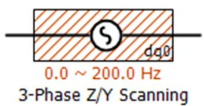

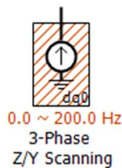  
Fig. 6. EMT-based Dynamic Frequency scanning components in PSCAD™/EMTDC™.

harmonics, individual-phase schemes, unbalanced or single-phase systems, or power electronic systems with negative-sequence controllers. In such cases, alternative scanning methods, such as dynamic phasor-based frequency scanning, are employed [18].

# 3.4. Simplifying scanning and stability analysis process using a dynamic frequency scanning component

From the discussion of section III.A, it is evident that determining the frequency scan and using it to analyze stability has many steps that have to be carried out manually. This can be inconvenient when a large number of cases have to be considered. Therefore, in this paper, a dynamic frequency scanning tool is introduced, which has been developed in PSCAD™/EMTDC™ to evaluate the system’s impedance or admittance characteristics in any desired domain, $\mathrm { i . e . }$ , the abc domain, sequence domain, or dq0 domain. The design of the scanning component, as shown in Fig. $^ { 6 , }$ allows for easy integration into any electrical system model.

There are two methods for conducting the scanning: current injection and voltage injection. The current injection method is generally more effective for systems that are dominantly controlled by current characteristics, such as those involving machine connections. On the other hand, the voltage injection method is more suitable for systems primarily characterized by voltage behavior. Users should rely on their engineering judgment to determine which method is most suitable for their specific application. All the cases in the following sections are carried out using these developed components.

# 4. Frequency domain stability analysis

This section discusses how the results obtained from the EMT-based dynamic frequency scanning can be used to identify critical operational conditions.

# 4.1. Closed-loop system representation

Assuming, as shown in Fig. 5, that the scanning component is shunt connected to the PCC to do a current injection and conduct the impedance scans of the MMC $( Z _ { M M C } ( f ) )$ and ac side $( Z _ { a c } ( f ) )$ .

Note that in a real application, the ac side may be more complex, and dynamic frequency scanning will still capture its impedance characteristics, regardless of complexity. In this example, however, a simple R-L Thevenin equivalent has been used for simplicity, so that the case can be treated analytically for comparison.

Using the scanned results from both sides of the $\mathrm { P C C } ,$ a closed-loop system representation can be constructed, as shown in Fig. 7. From this diagram, the closed-loop transfer function of the system can be expressed as in (2). The term ${ \pmb Z } _ { M M C } { \pmb Y } _ { a c }$ represents the open-loop gain. The eigenvalues of the product ${ Z } _ { M M C } { \mathbf { Y } } _ { a c }$ can then be used to predict the system’s ’Stability Margin,’ which includes the gain margin and the phase margin.

$$
\frac {\Delta \mathbf {V} _ {P C C}}{\Delta \mathbf {I} _ {D i s}} = \frac {\mathbf {Z} _ {M M C}}{1 + \mathbf {Z} _ {M M C} \cdot \mathbf {Y} _ {a c}} \tag {2}
$$

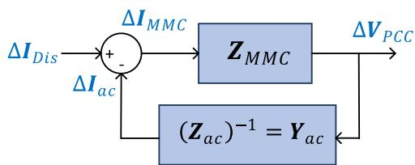  
Fig. 7. Closed-loop system representation.

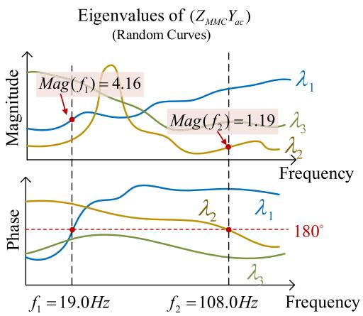  
Fig. 8. Bode plot of eigenvalue magnitudes and phases for ${ \pmb Z } _ { M M C } { \pmb Y } _ { a c }$ with random values.

# 4.2. Stability margin observation based on Bode plot

Using the open-loop gain of the system $( Z _ { M M C } \pmb { Y } _ { a c } )$ , the Bode plot of its eigenvalues can be used to predict system performance [16]. For a multi-input-multi-output (MIMO) system, ${ \pmb Z } _ { M M C } { \pmb Y } _ { a c }$ is a m-by-m square matrix. In this paper, m is equal to $^ { 3 , }$ so there are 3 eigenvalue curves, as shown in Fig. 8. The curves in Fig. 8 are merely illustrative and presented solely to facilitate explanation. The primary objective is to determine how far the eigenvalues are from − 1 = 1∠180∘ .

To determine the gain margin, the first step is to observe the phase angle curve to identify points where the angle equals 180∘ . For instance, $\lambda _ { 1 }$ has a point at 19.0 Hz, and $\lambda _ { 2 }$ has one at 108.0 Hz. Next, we refer to the magnitude plot to read the magnitude values at these frequencies, which are 4.16 and 1.19, respectively. The stability boundary occurs when the magnitude equals 1.0 and the phase shift is 180∘ . In this case, the magnitude of 1.19 is closer to 1.0 compared to 4.16. Therefore, by reducing the open loop gain magnitude by 1.19, the system will reach a magnitude of 1, indicating that it will become critically stable. This is the gain margin.

One possible parametric study is to ascertain how the short circuit ratio (SCR) of the ac system affects stability. For instance, if the initial SCR is 4.0 during the scanning process, reducing it to $\frac { 4 . 0 } { 1 . 1 9 }$ ≈ 3.36 will cause the system to become unstable, with an oscillation frequency of 108.0 Hz. This value of 3.36 represents the critical SCR (CSCR) of the system.

To validate this stability prediction based on the scanned results, two VSG applications are discussed in section V using EMT simulation and root locus analysis.

# 5. Example cases: virtual synchronous generator controlled MMC

In this section, the stability prediction using Bode plot is applied to the MMC system given in section II. All these analyses were carried out using the automated scanning and stability analysis tool developed by the authors.

# 5.1. A. root locus analysis

Based on the small signal models of the voltage source type VSG and current source type VSG presented in [8,10], the A matrices of these models are functions of the ac system impedance $Z s ,$ which is approximately inversely proportional to the SCR. Due to page limitations, the detailed equations are not repeated here. From the small signal models, the locus of the dominant eigenvalues at the operating point of MMC output active power (P ) equal to 1.0 pu, with varying system SCRs, is shown in Fig. 9.

As illustrated in Fig. 9(a), for the voltage source type VSG with an embedded current limiter [8], the eigenvalues move to the right-hand side of the imaginary axis when the SCR exceeds 3.8, indicating the CSCR is between 3.7 and 3.8. Also, the oscillation frequency is approximately 1.048 Hz. This instability is attributable to the delays inherent in the PI controllers of the embedded current controller.

In contrast, Fig. 9(b) demonstrates that the current source type VSG [10] remains stable across a wide range of SCRs from SCR = 1.2 (for a weak AC system) to SCR = 100.0 (for a very stiff ac system), with the eigenvalues staying on the left-hand side of the imaginary axis. This concluded that the current source type VSG exhibits more stable performance in large SCR systems compared to the voltage source type VSG.

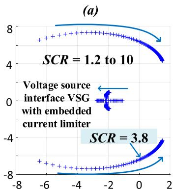

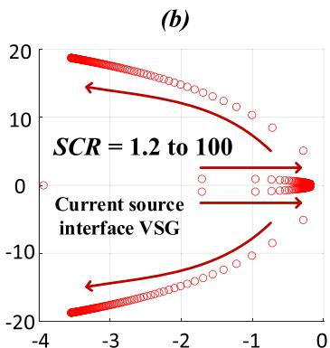  
Fig. 9. Eigenvalue Loci with variable SCR of ac system.

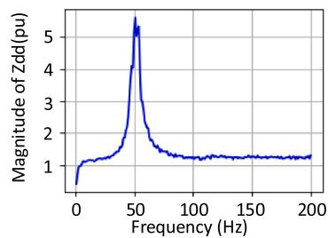

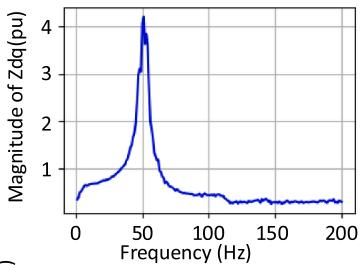

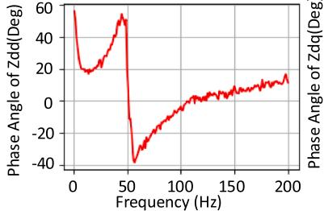

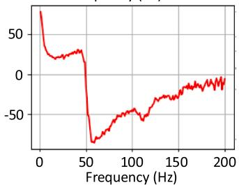  
Fig. 10. Impedance magnitude (pu) and phase angle (degree) of MMC side (element $Z _ { d d } , Z _ { d q } ) .$ .

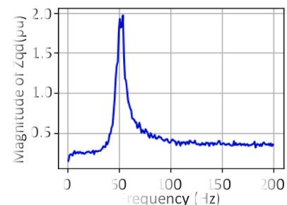

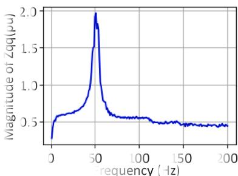

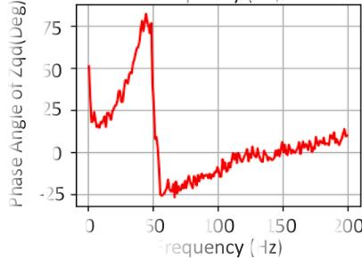

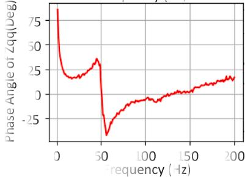  
Fig. 11. Impedance magnitude (pu) and phase angle (degree) of MMC side (element $Z _ { q d } , Z _ { q q } ) .$ .

Root locus analysis is one of the most accurate methods for stability prediction, as it accounts for the entire system and converts it into a mathematical model. Therefore, the results of the analysis presented in this section are used as a reference to validate the accuracy of the stability predictions based on the EMT-based dynamic frequency scanning, as discussed in section V.B.

# 5.2. B. EMT-based dynamic frequency scanning results in dq0 domain

An EMT-based dynamic frequency scanning in dq0 domain is conducted on the system shown in Fig. 2 with voltage source type VSG. The SCR of the ac system is 2.5 and the MMC output active power is 1.0 pu. The scanned effective dq0 domain entries of the impedance matrix $Z _ { M M ( } ^ { d q 0 }$ of MMC as seen from the PCC are presented in Figs. 10–12 below.

The frequency range of the scanner can be selected flexibly, and the 200 Hz used in this paper is sufficient to demonstrate the scanner’s performance for the proposed two VSG applications. Since the mutual impedances between the dq-axes and the 0-axis are very small, the terms $Z _ { d 0 } , Z _ { q 0 } , Z _ { 0 d } , Z _ { 0 q }$ are omitted for clarity. Please note that in the dq0 domain, the fundamental frequency component of the system (60.0 Hz in abc domain) is mapped to 0 Hz because the dq reference frame rotates

synchronously with the system steady state frequency. Thus, the impedance values near 50 Hz in Figs. 10–12 are not related to the fundamental frequency but rather to higher-order harmonic components or resonant frequencies within the system.

The impedance of the network ${ z } _ { a c } ( f )$ is similarly scanned and inverted to yield the admittance ${ \pmb Y } _ { a c } = { \pmb Z } _ { a c } ^ { - 1 }$ . Then the Bode plot of eigenvalues of ${ \pmb Z } _ { M M C } { \pmb Y } _ { a c }$ is generated as in Fig. 13. The red dashed line in the phase angle plot represents 180∘ . From Fig. 9(a), the maximum frequency of the dominant eigenvalues is approximately 8.0 rad/s (1.27 Hz), hence the Bode plot only shows the frequency range from 0.3 Hz to 1.3 Hz. From Fig. 13, it is evident that one eigenvalue has a magnitude of 0.67 when its phase is 180∘ (see vertical blue dashed line). This happens for $f = 1 . 1 5 H z$ . This means that scaling the gain by a factor $\frac { 1 } { 0 . 6 7 }$ will result in the system reaching the stability boundary. Consequently, the critical SCR is $\begin{array} { r } { C S C R = \frac { 2 . 5 } { 0 . 6 7 } \approx 3 . 7 , } \end{array}$ with the oscillation frequency being approximately 1.15 Hz at the point where the system transitions to instability. This value is in close agreement with the prediction from the analytical small signal root locus, which pegs the CSCR at 3.7 at an oscillation frequency of 1.05 Hz.

A similar process has also been applied to the current source type VSG. The Bode plot is given in Fig. 14. No potential instability is

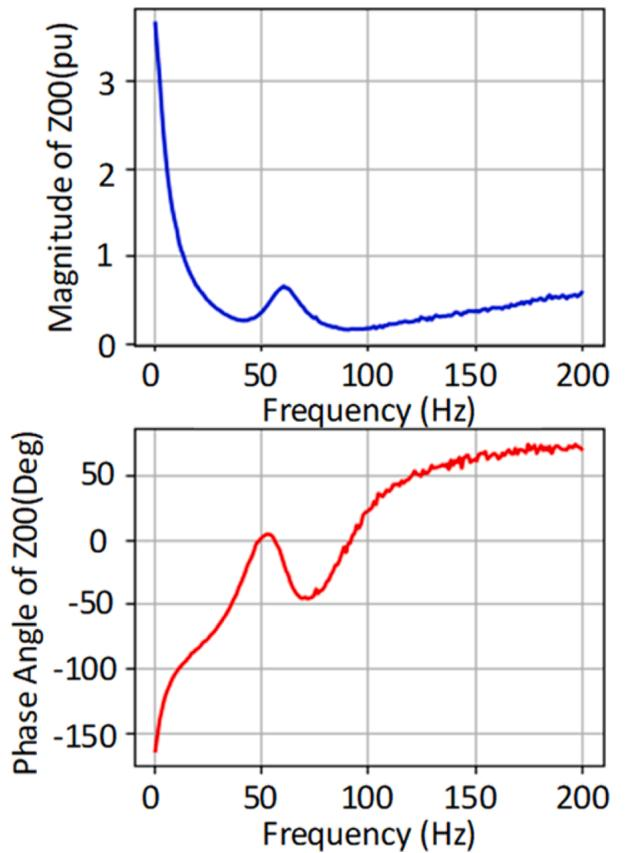  
Fig. 12. Impedance magnitude (pu) and phase angle (degree) of MMC side (element ${ Z _ { 0 0 } } )$ .

observed in this system, which means that the current source type VSG system remains stable when connected to ac system with varying SCR. This conclusion is consistent with the results of the root locus analysis in Fig. 9(b), which shows no eigenvalue in the right-hand plane.

# 5.3. System performance based on EMT simulation

In order to validate the predictions from the root locus analysis and

frequency scanning bode plot, a time-domain EMT simulation is conducted. Fig. 15 illustrates the MMC output active power in pu with the voltage source type VSG controller. The SCR of ac system is changed from 3.6 to 3.8 at 10.0 s. It is evident that the system operates stably when the SCR is 3.6, but loses stability when the SCR is 3.8, which just exceeds the CSCR of 3.7. The oscillation frequency is measured at 1.15 Hz from the waveform which agrees with the predicted frequency at the stability margin analysis which is also 1.15 Hz.

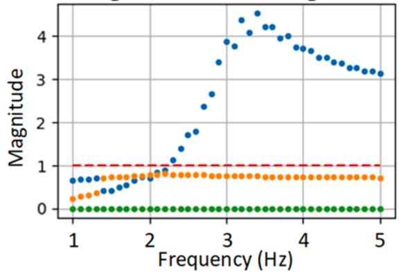  
Eigenvalue Bode Figure

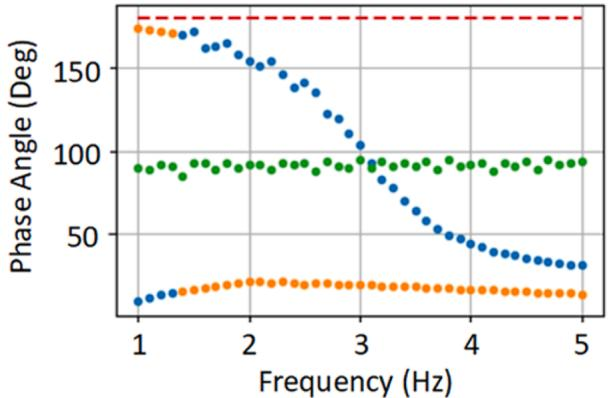  
Fig. 14. Bode plot of the eigenvalue of $Z _ { M M C } Y _ { a c }$ matrix of current source interface VSG system.

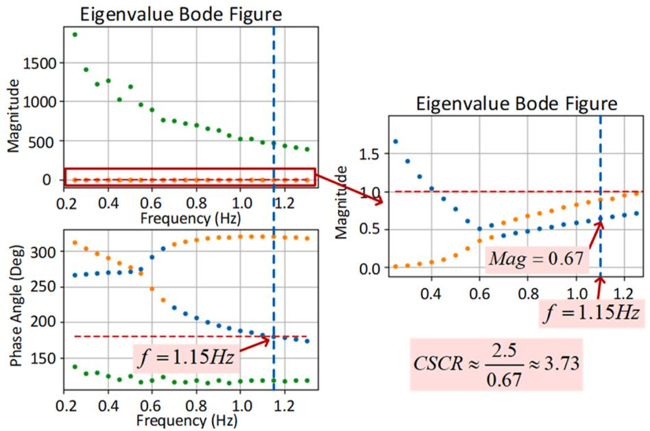  
Fig. 13. Bode plot of the eigenvalue of $Z _ { M M C } Y _ { a c }$ matrix of voltage source interface VSG system.

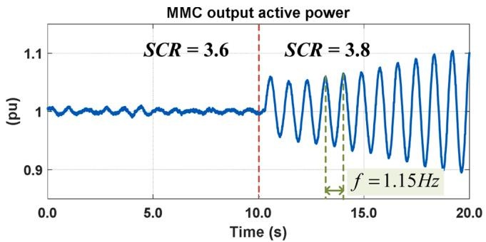  
Fig. 15. MMC output active power (Pt) waveform in EMT simulation with voltage source interface VSG controller for SCR variation from 3.6 to 3.8.

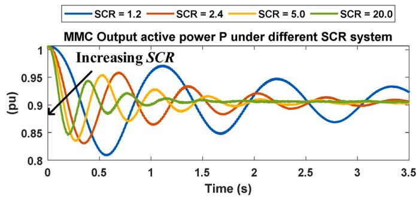  
Fig. 16. MMC output active power (P ) waveform in EMT simulation with current source interface VSG controller for varying SCR.

A similar validation of the stability predictions for the current source type VSG was conducted. Fig. 16 shows the output active power of MMC with the current source type VSG for varying ac system SCRs. As was determined in Fig. 14, the system remains stable for all SCRs. Fig. 16 confirms that choosing an SCR over a very wide ranging from 1.2 to 20.0 still results in a stable system. The small disturbance applied to the VSG was a step change at MMC active power reference from 1.0 pu to 0.9 pu.

# 6. Conclusions

This paper presents an integrated tool for EMT-simulation that automates the stability determination process using the proposed frequency scanning technique. Bode plot is then created using the scanning results to determine system’s stability margins. The proposed dynamic scanning method is sensitive to the operating point, which means the scan must be repeated if the operating point changes.

A simplified MMC-ac system with two different types of VSG control strategies is used to validate the accuracy of scanning results. The control strategies used are voltage source type and current source type VSGs. The EMT-based frequency scanning method is then conducted to obtain admittance/impedance matrices. These matrices are then used to determine stability margins via classical control theory methods $( \mathrm { i . e . , }$ , close-loop transfer function, Bode plots, etc.). The stability margins obtained are reflected in EMT simulations and agrees with analytically obtained root loci.

The results from root locus, frequency scanning and EMT simulation demonstrate that the MMC system with a voltage source type VSG controller becomes unstable when connected to a strong ac system. In contrast, the MMC with a current source type VSG controller remains stable across varying ac system strengths. Additionally, the accuracy of the EMT-based frequency scanning method is validated in this paper, confirming it as a reliable stability prediction tool.

# CRediT authorship contribution statement

Chen Jiang: Writing – original draft, Software, Methodology, Formal analysis, Visualization, Validation. Zhiqiang Liu: Writing – review & editing, Software. Rohitha Jayasinghe: Supervision, Writing – review & editing, Methodology. Dharshana Muthumuni: Writing – review & editing, Supervision. Aniruddha M. Gole: Formal analysis, Writing – review & editing, Supervision.

# Declaration of competing interest

The authors declare that they have no known competing financial interests or personal relationships that could have appeared to influence the work reported in this paper.

# Appendix

The conversion matrix between the abc and sequence domains is given by (A-1), where $\alpha = e ^ { \frac { j 2 \pi } { 3 } }$ . The abc/dq0 transformation is given by (A-2), where $\omega _ { 0 } = 2 \pi f _ { 0 }$ is the scanned system’s steady-state frequency (e.g., as would be determined by a phase-locked-loop).

$$
T _ {+ - 0} = \frac {1}{3} \left[ \begin{array}{l l l} 1 & \alpha & \alpha^ {2} \\ 1 & \alpha^ {2} & \alpha \\ 1 & 1 & 1 \end{array} \right] \tag {A-1}
$$

$$
T _ {d q 0} = \frac {2}{3} \left[ \begin{array}{c c c} \cos \left(\omega_ {0} t\right) & \cos \left(\omega_ {0} t - \frac {2 \pi}{3}\right) & \cos \left(\omega_ {0} t + \frac {2 \pi}{3}\right) \\ - \sin \left(\omega_ {0} t\right) & - \sin \left(\omega_ {0} t - \frac {2 \pi}{3}\right) & - \sin \left(\omega_ {0} t + \frac {2 \pi}{3}\right) \\ \frac {1}{2} & \frac {1}{2} & \frac {1}{2} \end{array} \right] \tag {A-2}
$$

# Data availability

No data was used for the research described in the article.

# References

[1] M.G. Dozein, B.C. Pal, P. Mancarella, ‘Dynamics of inverter-based resources in weak distribution grids, IEEE Trans. Power Syst. 37 (5) (2022) 3682–3692.   
[2] R. Marquardt, “Stromrichterschaltungen mit verteilten energiespeichern,” German Patent DE 20122923 U1, 2001.

[3] H. Zhang, W. Xiang, W. Lin, J. Wen, Grid forming converters in renewable energy sources dominated power grid: control strategy, stability, application, and challenges, J. Mod. Power Syst. Clean Energy 9 (6) (2021) 1239–1256.   
[4] J. Driesen, K. Visscher, Virtual synchronous generators, in: Proceedings of the IEEE Power and Energy Society 2008 General Meeting: Conversion and Delivery of Electrical Energy in the 21st Century, 2008, pp. 1–3.   
[5] N. Mohammed, M.H. Ravanji, W. Zhou, B. Bahrani, Online grid impedance estimation-based adaptive control of virtual synchronous generators considering strong and weak grid conditions, IEEE Trans. Sustain. Energy 14 (1) (2023) 673–687.   
[6] Z. Kustanovich, S. Shivratri, H. Yin, F. Reissner, G. Weiss, Synchronverters with fast current loops, IEEE Trans. Ind. Electron. 70 (11) (2023) 11357–11367.   
[7] C. Arghir, F. Dorfler, ¨ The electronic realization of synchronous machines: model matching, angle tracking, and energy shaping techniques, IEEE Trans. Power Electron. 35 (4) (2020) 4398–4410.   
[8] A.F. Darbandi, A. Sinkar, A. Gole, Effect of short-circuit ratio and current limiting on the stability of a virtual synchronous machine type grid-forming converter, in: Proceedings of the 17th International Conference on AC and DC Power Transmission (ACDC2021), Glasgow, UK, 2021, pp. 182–187.   
[9] C. Jiang, A.D. Sinkar, A.M. Gole, Comparative study of swing equation-based and full emulation-based virtual synchronous generators, in: Proceedings of the 11th International Conference on Power Electronics, Machines and Drives (PEMD2022) 2022, 2022, pp. 578–582.

[10] C. Jiang, A.D. Sinkar, A.M. Gole, Small signal analysis of a grid-forming modular multilevel converter with a novel virtual synchronous generator control, Electr. Power Syst. Res. 223 (2023) 109621.   
[11] X. Jiang, A.M. Gole, A frequency scanning method for the identification of harmonic instabilities in HVDC systems, IEEE Trans. Power Deliv. 10 (4) (1995) 1875–1881.   
[12] M. Mohaddes, A.M. Gole, S. Elez, Steady state frequency response of STATCOM, IEEE Trans. Power Deliv. 16 (1) (2001) 18–23.   
[13] S. Lissandron, L. Dalla Santa, P. Mattavelli, B. Wen, Experimental validation for impedance-based small-signal stability analysis of single-phase interconnected power systems with grid-feeding inverters, IEEE J. Emerg. Sel. Top. Power Electron. 4 (1) (2016) 103–115.   
[14] Y. Qi, H. Ding, Y. Zhang, X. Shi, A.M. Gole, Identification of sub-synchronous interaction in MMC systems using frequency scanning, in: Proceedings of the IEEE Power & Energy Society General Meeting (PESGM), Montreal, QC, Canada, 2020, pp. 1–5.   
[15] L. Meng, U. Karaagac, K. Jacobs, A new sequence domain EMT-level multi-input multi-output frequency scanning method for inverter based resources, Electr. Power Syst. Res. 220 (2023) 109312. ISSN 0378-7796.   
[16] K. Ogata, Modern Control Engineering, 5th ed., Pearson, Upper Saddle River, 2010.   
[17] K. Sharifabadi, et al., Design, Control, and Application of Modular Multilevel Converters for HVDC Transmission Systems, John Wiley & Sons, 2016.   
[18] M.K. Das, A.M. Kulkarni, Dynamic phasor based frequency scanning for gridconnected power electronic systems, Sadhan ¯ a ¯ 42 (2017) 1717–1740.