# RMS+: Augmenting the Traditional Circuit Model to Capture PLL Instability

Miguel Carreño , Oriol Velasco-Falguera , Josep Arévalo-Soler , and Oriol Gomis-Bellmunt , Fellow, IEEE

Abstract—Electrical circuits are modelled with a constant admittance matrix for steady-state studies and for dynamic studies involving synchronous machines. It is widely considered that this model, called RMS model, is also suitable for capturing lowfrequency oscillations in networks with inverters; however, this idea has been challenged by recent research of the Phase-Locked Loop. The EMT model, in contrast, accounts for the dynamics of all circuit components, but its high computational cost limits its application in the analysis of bulk power systems. This paper introduces RMS+, a new circuit model constructed from the raw data of the system, that captures the PLL interactions with the network while reducing the number of state variables. The theoretical framework includes the theory of dynamical systems, particularly, of slow-fast systems. The underlying assumption is that there must be a time-scale separation between the electromagnetic transients, and the PLL dynamics. In this sense, this paper discusses the advantage of the RMS+ model for the analysis of synchronization stability of networks with Gridfollowing Voltage Source Converters. The model is implemented in a modal analysis tool, and validated in three test networks: a Single Converter Infinite Bus system, a modified version of the WSCC nine-bus system; and the 39-bus system.

Index Terms—Slow-fast systems, SRF-PLL, synchronization stability, grid-following, weak grid.

# I. INTRODUCTION

V OLTAGES and currents in an electrical, passive circuit,are the sum of natural transients, originating from the are the sum of natural transients,originating from the interconnection of resistances, inductances, and capacitors, and “forced” dynamics, originating from the generators and active devices connected to the circuit. For the stability analysis of power systems dominated by synchronous machines, passive circuits are conventionally treated as algebraic restrictions. The underlying assumption is that all transients have settled down (steady-state), and the internal currents and voltages are sinusoids at constant frequency. Since the synchronous machines are voltage sources, the most convenient way of representing

Received 12 February 2025; revised 11 June 2025 and 23 September 2025; accepted 18 December 2025. Date of publication 22 December 2025; date of current version 26 January 2026. The work of Oriol Gomis-Bellmunt was supported by ICREA Academia Program. This work was supported by FEDER/Ministerio de Ciencia, Innovación y Universidades - Agencia Estatal de Investigación, under Project PID2021-124292OB-I00. Paper no. TPWRD-00197-2025. (Corresponding author: Miguel Carreño.)

The authors are with Centre d’Innovacio Tecnologica en Convertidors Estatics I Accionaments - UPC, 08034 Barcelona, Spain (e-mail: miguel.carre no@upc.edu; oriol.velasco.falguera@upc.edu; josep.arevalo@upc.edu; oriol. gomis@upc.edu).

Digital Object Identifier 10.1109/TPWRD.2025.3646818

the network is through a linear matrix equation that yields the currents of the buses as the product of their voltages times the admittances (Ybus) [1].

Bulk power systems are transitioning from being dominated by synchronous machines, to being dominated by Voltage Source Converters (VSCs). Grid-following VSCs include a Phase-Locked Loop (PLL) that synchronizes the internal control angle with the voltage angle. Nevertheless, the analysis of the closed-loop dynamics shows that the “di/dt” effect of the inductors plays a crucial role [2], and is the mechanism, behind two types of small-signal instability [3], [4].

Driven by the transition taking place in power systems, the tools for analysis have also evolved. The model based on instantaneous signals (EMT) has gained momentum, even competing with the traditional Root Mean Square (RMS) model. Nevertheless, the EMT model requires more storage space and computation time compared to the RMS model, which complicates its application for the analysis of large bulk power networks.

Historically, there have been proposals to reduce the complexity of the problem. One of the earliest consists in the equivalencing of parts of the network and interconnecting them to a small vicinity of the node where the study is focused. For instance, the elements under study can be modeled with instantaneous differential equations, other part can be modeled with the RMS circuit model, and the forced dynamics of generators; and still another part (circuit and generators) can be modeled as a frequency-dependent load [5]. This can yield good results for digital relaying studies; but its application for the stability analysis of Voltage Source Converters has shown that it is difficult to define the boundary, as it is not straightforward what is the “vicinity”, especially because it seems to change with the tuning of the controls [6].

A different approach was taken by Milano and Ortega, who first applied the theory of time-scale separation to derive the Frequency Divider Formula [7], and later, proposed a methodology to update the algebraic constraint (RMS model) in each time-step of a transient stability simulation program [8]. This way, the voltage drop in the inductive branches was better approximated with the effect of the rotor dynamics; however, the analysis did not include Voltage Source Converters.

It is convenient to clarify that the concept of dynamic phasors cannot be considered an antecedent of this study. Dynamic Phasors was a concept born in the context of Phasor Measurement Units, and has to do more with signal processing and numerical techniques, rather than the problem this paper addresses. In this theory, a given waveform is abstracted as a phasor with a

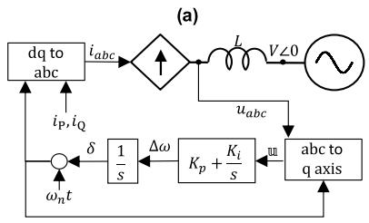

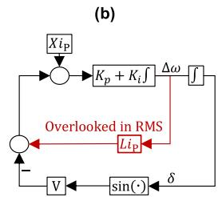  
Fig. 1. Small radial system. (a) Circuit and dynamical model (b) Non-linear block diagram of closed-loop system.

time-varying envelope. The function that the envelope follows is proposed to be polynomial, and the research focuses on different techniques to find the coefficients of the complex polynomial [9]. There have been attempts to model network components with dynamic phasors for time-domain simulation. In [10], the authors modeled transmission lines as RL branches, but they included only the fundamental frequency component, which is equivalent to an RMS model of the network.

Inspired by the theory of slow-fast systems developed by Fenichel, Tikhonov, and others [11]; this paper proposes RMS+, a new circuit model that is sensitive to the forced dynamics, while being unaffected by the natural transients of the network. The currents and voltages of the passive elements are not modeled as state variables, hence, RMS+ is simpler and less computationally costly than the EMT model. Antecedents of similar proposals can be found in the field of theoretical chemistry [12], [13]. The innovation presented here was motivated by the problem of synchronization stability of grid-following voltage source converters; hence, this paper demonstrates its validity and advantage in that context.

This paper is organized as follows: Section II discusses the limitations of the RMS model, while Section III examines the challenges in augmenting it. Section IV introduces the RMS+ model, Section V details the procedure for large RLC circuits, and Section VI analyzes the closed-loop model of multiconverter systems. Section VII presents validations across three systems of varying complexity and size. Finally, Section VIII concludes the paper.

# II. LIMITATIONS OF THE RMS CIRCUIT MODEL

This section builds upon known results to argue that representing a circuit only with impedances implies missing two mechanisms of small-signal instability of the PLL.

For understanding the essential limitation, it is enough to consider the small system of Fig. 1(a), which has been studied thoroughly in previous research (a small selection is [2], [3], [4]). The dynamical model of the converter does not include Low Voltage Ride Through logic because short circuits are not studied. The outer loop is reasonably assumed to be much slower than the PLL, hence, it is neglected, and the current commands are assumed to be constant. Finally, the current loop is assumed to be ideal, which implies that the currents follow the commands perfectly. As explained in [2], [3], [4], this is reasonable because in most realistic cases there is a clear time-scale separation between the PLL and the current loop.

In the development presented in this document $\omega _ { n }$ represents the nominal angular speed $( \ \omega _ { n } = \ 2 \pi f _ { n } ) .$ , δ denotes the PLL angle shift, Δω denotes the frequency shift in radians per second, u denotes the input signal of the PLL, and iP, $i _ { \mathrm { Q } }$ denote the current commands regulating the active power and reactive power respectively. The RMS line-line voltage of the constant voltage source is denoted with V , the inductance with $L ,$ and its reactance with X.

Fig. 1(b) shows the block diagram of the non-linear closedloop system, with emphasis on the positive feedback loop that is overlooked by the RMS model. Essentially, this is the consequence of modelling the network only with impedances. Notice that the circuit equations in complex dq variables referenced to the angle of the constant voltage source are:

$$
\operatorname {R M S}: u _ {d q} = i _ {d q} (j X) + V
$$

$$
\mathrm {E M T}: u _ {d q} = i _ {d q} (j X) + L \frac {d i _ {d q}}{d t} + V \tag {1}
$$

The linearization of the second order system in Fig. 1(b) produces an equation of the form $0 = \Delta \ddot { \delta } + 2 \zeta \omega _ { \mathrm { n a t } } \Delta \delta + \omega _ { \mathrm { n a t } } ^ { 2 } \Delta \delta ,$ , where $2 \zeta \omega _ { \mathrm { n a t } }$ is called the damping, ζ is the damping coefficient, and $\omega _ { \mathrm { n a t } }$ is the natural frequency. The symbol $" \Delta >$ behind δ denotes that we are dealing with “perturbed” or “deviation” quantities. The conditions for stability can be deduced from the inequality $2 \zeta \omega _ { \mathrm { n a t } } > 0$ . The derivation of the conditions is detailed in [4]. Here, only a comparison between the two models is presented. A step-by-step explanation of why the RMS model fails to capture PLL small-signal instability is provided in [14].

In the RMS model, the condition $2 \zeta \omega _ { \mathrm { n a t } } > 0$ implies a single condition: $V > | i _ { \mathrm { P } } X |$ . This inequality is a voltage-stability condition establishing that the magnitude of the steady-state voltage across the inductor corresponding to active power injection should be less than the RMS line-line voltage of the voltage source. On the other hand, the EMT model features three conditions of stability:

Voltage Stability: $V > | i _ { \mathrm { P } } X |$ ,

Transcritical bifurcation: $1 - K _ { p } i _ { \mathrm { P } } L > 0 .$ ,

$$
\text {H o p f b i f u r c a t i o n :} K _ {p} \left(V ^ {2} - \left(i _ {\mathrm {P}} X\right) ^ {2}\right) ^ {\frac {1}{2}} - K _ {i} i _ {\mathrm {P}} L > 0, \tag {2}
$$

Notice that inequality two and three involve both, the electrical parameters and the PLL gains. Transcritical bifurcation occurs if $K _ { p }$ surpasses a limit, while Hopf bifurcation occurs if the ratio $\dot { K _ { i } } / { K _ { p } }$ surpasses a limit. Also notice that a common feature between all three conditions of stability is that a high iP (high active power injection) and high L (large inductance) make the system more prone to instability. This confirms common knowledge about the stability of grid-following VSCs; that the active power injection and the grid strength play a fundamental role. The basic definition of the Short Circuit Ratio is the maximum short circuit power $( S _ { s c } )$ divided by the P rating of the converter. Denoting with $U _ { \mathrm { m a x } }$ the magnitude of the maximum RMS line-line voltage at terminals of the converter, the ratio for

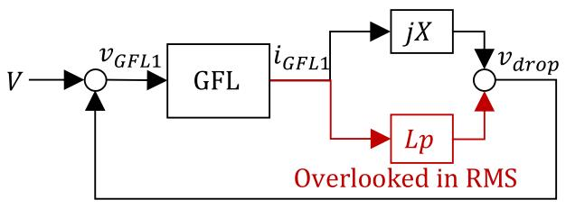  
Fig. 2. Interconnection diagram of the electrical elements.

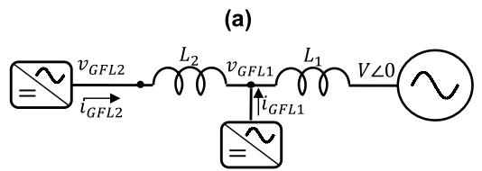

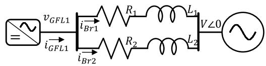  
(b)   
Fig. 3. Circuits cases (a) Example 1 (b) Example 2.

the system in Fig. 1(a) yields:

$$
S C R = \frac {S _ {s c}}{P _ {\mathrm {v s c}}} = \frac {U _ {\max} I _ {s c}}{P _ {\mathrm {v s c}}} = \frac {U _ {\max} (V / X)}{U _ {\max} i _ {\mathrm {P m a x}}} = \left(\frac {V}{i _ {\mathrm {P m a x}} X}\right). \tag {3}
$$

The Short Circuit Ratio yields valuable information about the network, but loses the dynamic interaction with the parameters of the PLL. Hence, for screening, it might be a good idea to also perform a small-signal stability analysis with simplified models of grid-following converters such as the one in Fig. 1. Nevertheless, most small-signal analysis tools are based on the RMS model that cannot capture PLL instabilities.

# III. HOW TO AUGMENT THE RMS MODEL?

The block-diagram in Fig. 2 shows an alternative connection of the system considered before. In this new representation the inputs and outputs are electrical signals, which could be 2D vectors or complex numbers referenced to a single angle in the network. In this representation $i _ { G F L 1 }$ is the current injected by the grid-following converter and $v _ { G F L 1 }$ denotes its input, the measured signal. The name GFL stands for “grid-following VSC”. Operator p is introduced to denote derivation with respect to time.

Notice that in this case it is straightforward to augment the RMS model by simply adding to $j X$ the term Lp. A similar situation occurs in larger networks such as the one in Fig. 3(a). Notice that the circuit matrix equation is:

$$
\left[ \begin{array}{c} v _ {G F L 1} \\ v _ {G F L 2} \end{array} \right] = \left(j \left[ \begin{array}{c c} X _ {1} & X _ {1} \\ X _ {1} & X _ {1} + X _ {2} \end{array} \right] + \left[ \begin{array}{c c} L _ {1} & L _ {1} \\ L _ {1} & L _ {1} + L _ {2} \end{array} \right] p\right)
$$

$$
\times \left[ \begin{array}{l} i _ {G F L 1} \\ i _ {G F L 2} \end{array} \right] + \left[ \begin{array}{l} V \\ V \end{array} \right]. \tag {4}
$$

Though the coefficient of p is now a matrix, finding it is straightforward since it is again the result of dividing the reactances by $\omega _ { n }$ . The reason behind this is that the number of branches and the number of GFL is equal (2 GFL and 2 branches); hence, the current through the branches is a linear combination of the GFL currents. Denoting with $i _ { B r 1 }$ and $i _ { B r 2 }$ the currents through inductor $L _ { 1 }$ and $L _ { 2 }$ respectively, the relationship is

$$
\left[ \begin{array}{l} i _ {B r 1} \\ i _ {B r 2} \end{array} \right] = \left[ \begin{array}{l l} 1 & 1 \\ 0 & 1 \end{array} \right] \left[ \begin{array}{l} i _ {G F L 1} \\ i _ {G F L 2} \end{array} \right]. \tag {5}
$$

It is essential to understand that in this straightforward circuit the linear relationship in (5) is fulfilled always, during the transient period and the steady-state period.

The circuit of Fig. 3(b) is a different story. In this case, there is only one GFL, and two branches. The differential and algebraic equations in this case are

$$
v _ {G F L} - V = \left(R _ {1} + j X _ {1} + L _ {1} p\right) i _ {B r 1}
$$

$$
v _ {G F L} - V = \left(R _ {2} + j X _ {2} + L _ {2} p\right) i _ {B r 2}
$$

$$
i _ {G F L 1} = i _ {B r 1} + i _ {B r 2}. \tag {6}
$$

Notice that now $i _ { G F L 1 }$ is not differentiated with respect to time, but $i _ { B r 1 }$ and $i _ { B r 2 }$ are the ones subjected to operator p. Also, notice that (6) includes two derivatives. Compared with the system of Fig. 1, the new dynamical model is larger, which translates in a higher computational cost for its transient simulation, or eigenvalue calculation.

It would be desirable to reduce the problem to a single derivation, with a coefficient L, applied directly to the GFL current, like in Fig. 2. The symbol chosen, L, points to the role of this coefficient, scalar, or matrix, to contain the equivalent inductances. In other words, it would be desirable to model the voltage drop as

$$
v _ {G F L} - V = v _ {d r o p} = \left(Z _ {e q} + \mathbb {L} p\right) i _ {G F L 1}, \tag {7}
$$

however, while it is known how to calculate $Z _ { e q }$ , the question remains on how to calculate L.

# IV. RMS+ CIRCUIT MODEL

This section presents the basics of slow-fast systems and proposes a two-step process to compute L. Then, the problem stated in the previous section is solved with this approach.

# A. Slow-Fast Systems

Slow-fast systems can be modeled with two sets of state variables, x and z (vectors), where the derivatives of z are multiplied by a small positive parameter ε:

$$
\dot {x} = f (x, z, \varepsilon),
$$

$$
\varepsilon \dot {z} = g (x, z, \varepsilon). \tag {8}
$$

The selection of state variables x and z; and of the time constant ε is not always straightforward. However, the origin

of ε are the “parasitic” parameters such as inductances and capacitances that increase the order of the model. Setting ε equal to zero degenerates in the equation $g \left( x , z , 0 \right) = 0$ , whose roots in terms of z are functions of x, hence $z \ = \ h ( x )$ . These roots represent quasi-equilibriums, because the fast states settle down not to a constant value, but to slower dynamics driven by x. The new system is restricted to the manifold $z \ = \ h ( x )$ ; the result is a slow flow, or slow model [11], [15]:

$$
\dot {x} = f (x, h (x), 0). \tag {9}
$$

The slow model is a reduced version of the original model (8), and is a valid approximation if the analysis focuses on the slow dynamics. This idea has been explored for VSC control simplification [16]; but this paper explores it for circuits with GFL converters. The states of the PLL such as δ and $\Delta \omega$ are slow, while currents of inductors and voltages of capacitors are often much faster. The transients produced by the latter are called by different names, such as electromagnetic transients, or RLC transients. While the RMS model assumes that all state variables have reached their equilibriums, it is better to consider that the fast states have reached their quasi-equilibriums, while the other variables keep changing slowly.

# B. Two-step Process

The RMS+ model is based on the idea of first expressing the inductor currents as linear combinations of the GFL currents, or any other active device, such as synchronous machine, grid-forming VSC, etc. This step is similar to finding the quasiequilibriums, and in practice the steady-state relationships are utilized.

In second place, the original expression for the voltage of the inductors is recovered; which means that their voltage is expressed as the sum of an algebraic part (RMS model), and a dynamic first order part. To find L, the branch equation must be converted to a node equation, but here a limitation arises, which is that the resulting system is not square, since there are more branches than GFL nodes (Example 2 in the previous section). This leads to an overdetermined system with more equations than variables that can be solved with least-squares approximation. As a result, L is found.

# C. Solution to Example 2

Returning to the problem that was left open in the previous section, it is shown here how to compute L. The first step is to approximate the branch currents as linear expressions of the GFL current. This is achieved with the current divider formula:

$$
i _ {B r 1} \cong \left(\frac {R _ {2} + j X _ {2}}{R _ {1 2} + j X _ {1 2}}\right) i _ {G F L 1},
$$

$$
i _ {B r 2} \cong \left(\frac {R _ {1} + j X _ {1}}{R _ {1 2} + j X _ {1 2}}\right) i _ {G F L 1}. \tag {10}
$$

In (10) $R _ { 1 2 }$ and $X _ { 1 2 }$ are the sums of the resistances and of the reactances respectively. For simplicity the complex coefficients are denoted with a1 and $^ { a _ { 2 } ; }$ hence $i _ { B r 1 } = a _ { 1 } i _ { G F L 1 }$ , and $i _ { B r 2 } =$ $a _ { 2 } i _ { G F L 2 }$ .

TABLE I COMPARISON OF CIRCUIT MODELS   

<table><tr><td></td><td>RMS</td><td>RMS+</td><td>EMT</td></tr><tr><td>Assumptions of transients (RLC)</td><td>Steady-state</td><td>Quasi-equilibrium</td><td>No assumptions</td></tr><tr><td>Assumptions over devices*</td><td>Steady-state</td><td>Slowly varying (compared to grid)</td><td>No assumptions</td></tr><tr><td>Type</td><td>Algebraic V = ZbusI</td><td>Dynamic (1storder) V = ZbusI + Lpl</td><td>Dynamic (kthorder) V = Z(pk, pk-1, ..., p)I</td></tr><tr><td>Reduces State Variables</td><td>Yes</td><td>Yes</td><td>No</td></tr></table>

*Active devices: grid-following and grid-forming ${ \mathrm { V S C s } } ,$ and synchronous machines.

The second step is to recover the original equations of the inductors:

$$
\begin{array}{l} v _ {G F L} - V = \left(R _ {1} + j X _ {1} + L _ {1} p\right) i _ {B r 1} \\ \cong \left[ \left(R _ {1} + j X _ {1}\right) a _ {1} + L _ {1} a _ {1} p \right] i _ {G F L 1}, \\ \end{array}
$$

$$
\begin{array}{l} v _ {G F L} - V = \left(R _ {2} + j X _ {2} + L _ {2} p\right) i _ {B r 2} \\ \cong \left[ \left(R _ {2} + j X _ {2}\right) a _ {2} + L _ {2} a _ {2} p \right] i _ {G F L 1}. \tag {11} \\ \end{array}
$$

As expected, the algebraic terms of the two equations coincide, and are equal to the equivalent impedance:

$$
\left(R _ {1} + j X _ {1}\right) a _ {1} = \left(R _ {2} + j X _ {2}\right)
$$

$$
a _ {2} = \frac {\left(R _ {1} + j X _ {1}\right) \left(R _ {2} + j X _ {2}\right)}{R _ {1 2} + j X _ {1 2}} = Z _ {e q} \tag {12}
$$

However, the coefficients in the dynamic parts do not coincide

$$
L _ {1} a _ {1} = \frac {\left(\boldsymbol {R} _ {2} \boldsymbol {L} _ {1} + j \omega_ {n} L _ {2} L _ {1}\right)}{R _ {1 2} + j X _ {1 2}};
$$

$$
L _ {2} a _ {2} = \frac {\left(\boldsymbol {R} _ {1} \boldsymbol {L} _ {2} + j \omega_ {n} L _ {2} L _ {1}\right)}{R _ {1 2} + j X _ {1 2}}. \tag {13}
$$

This issue can be surpassed if least-squares approximation is applied, which in this case means computing the average. Hence

$$
\mathbb {L} = \left(\frac {\left(L _ {1} R _ {2} + R _ {1} L _ {2}\right) + j 2 \omega_ {n} L _ {1} L _ {2}}{2 \left(R _ {1 2} + j X _ {1 2}\right)}\right). \tag {14}
$$

Notice that L is a complex scalar, as opposed to $L _ { 1 }$ and $L _ { 2 }$ which are real scalars.

# D. Clarifying Remarks

RMS+ is an open-loop model of the circuit, not restricting the dynamical models of the generators connected to it, though it is accurate only with the slow dynamics. It augments the RMS model by introducing the term Lp, which could be thought as adding an “inductance” effect.

Table I presents a summary of the main differences between the three models. The RMS+ model can be integrated in timedomain simulation programs and modal analysis programs.

However, it should be stressed again that it is accurate only for slow dynamics, with frequency behind the nominal frequency, since at that point is where the electromagnetic transients start having a significant impact.

# V. FINDING L IN LARGE CIRCUITS

In this section $N _ { * }$ is used to denote the number of nodes, where the subindex ∗ identifies the type of the node, i.e., $* = \{ ^ {  } \infty ^ { , \ast } , ^ { \ast } \mathrm { G F L ^ { , \ast } } , ^ { \ast \ast } 0 ^ { , \ast } \}$ . Hence, there are $N _ { \infty }$ constant voltage sources (infinite buses), $N _ { G F L }$ grid-following converters, and $N _ { 0 }$ intermediate busbars (busbars with no generation). One of the infinite buses establishes the system angle reference, which rotates at speed $\omega _ { n }$ . All voltages and currents are expressed with $2 \times 1$ column vectors whose entries are the real (d-axis), and imaginary (q- axis) components. For the infinite buses, its voltage and current vectors are denoted with $V _ { \infty } ,$ and $I _ { \infty }$ , respectively. The node voltages and currents of the grid-following VSCs, are denoted with $\boldsymbol { v } _ { G F L i }$ and $i _ { G F L i }$ for $i \ = \ 1 , 2 , . . . N _ { G F L }$ . All other nodes are assumed to have zero current injection and are denoted with $v _ { 0 j }$ and $i _ { 0 j }$ for $j ~ = ~ 1 , 2 , . . . N _ { 0 }$ . For ease of notation, the vectors $v _ { G F L i }$ are aggregated into a single column vector $V _ { G F L }$ , and the same for their currents, yielding the vector $I _ { G F L }$ . Vectors $v _ { 0 j }$ and $i _ { 0 j }$ are aggregated in a similar fashion into $V _ { 0 }$ and $I _ { 0 }$ . The number of branches is $N _ { B r }$ , and their voltages and currents are aggregated likewise. For the series RL branches (lines and transformers), their voltage and current vectors are $V _ { R L }$ and $I _ { R L }$ respectively. The loads are modeled as parallel L and R shunt branches; thus, their vectors are $V _ { L s h u n t } , V _ { R s h u n t } ,$ , and $I _ { L s h u n t } , I _ { R s h u n t } ,$ respectively. Finally, the vectors for the shunt capacitors are $V _ { C }$ and $I _ { C } .$ . In the following development, symbols 0, and 1, are used generically to denote matrices of zeros, and identity matrices of appropriate sizes in each context.

The node currents are the sum of the branch currents connected to the node, hence:

$$
\left[ \begin{array}{l} I _ {\infty} \\ I _ {G F L} \\ I _ {0} \end{array} \right] = \left[ \begin{array}{l l l l} B _ {R L} & B _ {L s h u n t} & B _ {R s h u n t} & B _ {C} \end{array} \right] \left[ \begin{array}{l} I _ {R L} \\ I _ {L s h u n t} \\ I _ {R s h u n t} \\ I _ {C} \end{array} \right], \tag {15}
$$

where $B _ { R L } , B _ { L s h u n t } , B _ { R s h u n t }$ , and $B _ { C }$ are incidence matrices of the respective branches. All of them have $( 2 + 2 N + 2 M )$ rows, and number of columns according to the number of respective branches. The full incidence matrix is denoted with $B ;$ and it also plays a role in the expression of the branch voltages:

$$
\left[ \begin{array}{c} V _ {R L} \\ V _ {L s h u n t} \\ V _ {R s h u n t} \\ V _ {C} \end{array} \right] = B ^ {T} \left[ \begin{array}{c} V _ {\infty} \\ V _ {G F L} \\ V _ {0} \end{array} \right]. \tag {16}
$$

In steady-state, it is possible to express every branch voltage as the product of the current through the branch times the impedance of the branch:

$$
\left[ \begin{array}{c} V _ {R L} \\ V _ {L s h u n t} \\ V _ {R s h u n t} \\ V _ {C} \end{array} \right] = Z _ {\text {d i a g}} \left[ \begin{array}{c} I _ {R L} \\ I _ {L s h u n t} \\ I _ {R s h u n t} \\ I _ {C} \end{array} \right]. \tag {17}
$$

Substituting and manipulating with (15) and (16), the result is a known expression for the admittance matrix $\mathrm { Y _ { b u s } }$ :

$$
\begin{array}{l} \left[ \begin{array}{c} I _ {\infty} \\ I _ {G F L} \\ I _ {0} \end{array} \right] = B Z _ {\mathrm {d i a g}} ^ {- 1} B ^ {T} \left[ \begin{array}{c} V _ {\infty} \\ V _ {G F L} \\ V _ {0} \end{array} \right] \\ = \left[ \begin{array}{c c c} Y _ {\infty \infty} & Y _ {\infty G F L} & Y _ {\infty 0} \\ Y _ {G F L \infty} & Y _ {G F L G F L} & Y _ {G F L 0} \\ Y _ {0 \infty} & Y _ {0 G F L} & Y _ {0 0} \end{array} \right] \left[ \begin{array}{c} V _ {\infty} \\ V _ {G F L} \\ V _ {0} \end{array} \right] \\ = \mathrm {Y} _ {\text {b u s}} \left[ \begin{array}{c} V _ {\infty} \\ V _ {G F L} \\ V _ {0} \end{array} \right]. \tag {18} \\ \end{array}
$$

From the $\mathrm { Y _ { b u s } }$ in (18) it is possible to express the branch currents as linear combinations of the node currents, and the infinite bus. This requires first a preprocessing to reduce matrix $\mathrm { Y _ { b u s } }$ , and express $\mathrm { V _ { G F I } }$ in terms of $\mathrm { V } _ { \infty }$ , and IGFL. Since $I _ { 0 } = 0$ , the vector $V _ { 0 }$ can be expressed in terms of the other two:

$$
\begin{array}{l} V _ {0} = - Y _ {0 0} ^ {- 1} \left(Y _ {0 \infty} V _ {\infty} + Y _ {0 G F L} V _ {G F L}\right) \\ = - Y _ {0 0} ^ {- 1} \left[ \begin{array}{l l} Y _ {0 \infty} & Y _ {0 G F L} \end{array} \right] \left[ \begin{array}{l} V _ {\infty} \\ V _ {G F L} \end{array} \right], \tag {19} \\ \end{array}
$$

Thus, the matrix can be reduced (Kron reduction):

$$
\begin{array}{l} Y _ {r e d} = \left[ \begin{array}{c c} Y _ {\infty \infty} & Y _ {\infty G F L} \\ Y _ {G F L \infty} & Y _ {G F L G F L} \end{array} \right] - \left[ \begin{array}{c} Y _ {\infty 0} \\ Y _ {G F L 0} \end{array} \right] Y _ {0 0} ^ {- 1} \left[ \begin{array}{c c} Y _ {0 \infty} & Y _ {0 G F L} \end{array} \right] \\ = \left[ \begin{array}{c c} Y _ {\infty \infty} - Y _ {\infty 0} Y _ {0 0} ^ {- 1} Y _ {0 \infty} & Y _ {\infty G F L} - Y _ {\infty 0} Y _ {0 0} ^ {- 1} Y _ {0 G F L} \\ Y _ {G F L \infty} - Y _ {G F L 0} Y _ {0 0} ^ {- 1} Y _ {0 \infty} & Y _ {G F L G F L} - Y _ {G F L 0} Y _ {0 0} ^ {- 1} Y _ {0 G F L} \end{array} \right], \\ = \left[ \begin{array}{l l} Y _ {r e d A} & Y _ {r e d B} \\ Y _ {r e d C} & Y _ {r e d D} \end{array} \right]. \tag {20} \\ \end{array}
$$

With the reduced admittance matrix, it is possible to express ${ \mathit { V } } _ { G F L }$ in terms of $V _ { \infty }$ and $I _ { G F L } \mathbf { : }$ :

$$
V _ {G F L} = Y _ {r e d D} ^ {- 1} \left(I _ {G F L} - Y _ {r e d C} V _ {\infty}\right), \tag {21}
$$

It is important to emphasize that (21) corresponds to the RMS model, since an algebraic relationship between the voltages and the currents of the converters has been established. Nevertheless, to derive the RMS+ model it is necessary to proceed further. First, the matrix that reduces the vector of voltages - derived from (19) - is denoted K:

$$
\begin{array}{l} \left[ \begin{array}{c} V _ {\infty} \\ V _ {G F L} \\ V _ {0} \end{array} \right] = \left[ \begin{array}{c c} \mathbf {1} & \mathbf {0} \\ \mathbf {0} & \mathbf {1} \\ - Y _ {0 0} ^ {- 1} Y _ {0 \infty} & - Y _ {0 0} ^ {- 1} Y _ {0 G F L} \end{array} \right] \left[ \begin{array}{c} V _ {\infty} \\ V _ {G F L} \end{array} \right] \\ = K \left[ \begin{array}{c} V _ {\infty} \\ V _ {G F L} \end{array} \right]. \tag {22} \\ \end{array}
$$

Next, substituting (21) and (22) the node voltages can be expressed in terms of $V _ { \infty }$ , and the currents of the grid-following VSCs. The new matrix is denoted $\tilde { Z } \colon$

$$
\begin{array}{l} \left[ \begin{array}{c} V _ {\infty} \\ V _ {G F L} \\ V _ {0} \end{array} \right] = K \left[ \begin{array}{c} V _ {\infty} \\ V _ {G F L} \end{array} \right] = K \left[ \begin{array}{c c} \mathbf {1} & \mathbf {0} \\ - Y _ {r e d D} ^ {- 1} Y _ {r e d C} & Y _ {r e d D} ^ {- 1} \end{array} \right] \left[ \begin{array}{c} V _ {\infty} \\ I _ {G F L} \end{array} \right] \\ = \tilde {\mathcal {Z}} \left[ \begin{array}{l} V _ {\infty} \\ I _ {G F L} \end{array} \right] \tag {23} \\ \end{array}
$$

In (23) the node voltages have been expressed in terms of the node currents and the infinite-bus voltage. Finally, substituting in (16), and in (17), the result is:

$$
\begin{array}{l} \left[ \begin{array}{c} I _ {R L} \\ I _ {L s h u n t} \\ I _ {R s h u n t} \\ I _ {C} \end{array} \right] = \mathrm {Z} _ {\mathrm {d i a g}} ^ {- 1} \left[ \begin{array}{c} V _ {R L} \\ V _ {L s h u n t} \\ V _ {R s h u n t} \\ V _ {C} \end{array} \right] = \mathrm {Z} _ {\mathrm {d i a g}} ^ {- 1} B ^ {T} \left[ \begin{array}{c} V _ {\infty} \\ V _ {G F L} \\ V _ {0} \end{array} \right] \\ = \mathrm {Z} _ {\text {d i a g}} ^ {- 1} B ^ {T} \tilde {\mathcal {Z}} \left[ \begin{array}{c} V _ {\infty} \\ I _ {G F L} \end{array} \right]. \tag {24} \\ \end{array}
$$

In (24) the branch currents have been expressed as linear combinations of the currents out of the converters, and the voltage of thein Section A. finite bus. This concludes r convenience, the matrix $Z _ { \mathrm { d i a g } } ^ { - 1 } B ^ { T } \tilde { z }$ presentedin (24) is in (24) is denoted with $C ,$ and expressed as the horizontal concatenation of two matrices:

$$
\begin{array}{l} \left[ \begin{array}{c} I _ {R L} \\ I _ {L s h u n t} \\ I _ {R s h u n t} \\ I _ {C} \end{array} \right] = \mathsf {Z} _ {\mathrm {d i a g}} ^ {- 1} B ^ {T} \tilde {\mathcal {Z}} \left[ \begin{array}{c} V _ {\infty} \\ I _ {G F L} \end{array} \right] = \left[ \begin{array}{c c} C _ {\infty} & C _ {G F L} \end{array} \right] \left[ \begin{array}{c} V _ {\infty} \\ I _ {G F L} \end{array} \right] \\ = C \left[ \begin{array}{l} V _ {\infty} \\ I _ {G F L} \end{array} \right]. \tag {25} \\ \end{array}
$$

This paper proposes that the steady-state result achieved in (25) is a reasonable approximation of the distribution of the currents if the system is not exactly in steady-state, but the forced dynamics are slow compared to the natural transients. Therefore, the next step consists in expressing the voltages of the inductive elements as the sum of an algebraic part (RMS), and a dynamic part:

$$
\left[ \begin{array}{c} V _ {R L} \\ V _ {L s h u n t} \\ V _ {R s h u n t} \\ V _ {C} \end{array} \right] = \left[ \begin{array}{c} V _ {R L} \\ V _ {L s h u n t} \\ V _ {R s h u n t} \\ V _ {C} \end{array} \right] _ {\text {R M S}} + \left[ \begin{array}{c} V _ {R L} \\ V _ {L s h u n t} \\ \mathbf {0} \\ \mathbf {0} \end{array} \right] _ {\text {D y n}}. \tag {26}
$$

To express the dynamic part, it is necessary to introduce $\mathrm { L } _ { \mathrm { d i a g } } ,$ a diagonal matrix whose entries are the inductances of each branch. The entries corresponding to shunt resistors, and shunt capacitors, are zero. Therefore, the updated expression for the branch voltages – compare with (17) - is:

$$
\left[ \begin{array}{c} V _ {R L} \\ V _ {L s h u n t} \\ V _ {R s h u n t} \\ V _ {C} \end{array} \right] = \mathrm {Z} _ {\text {d i a g}} \left[ \begin{array}{c} I _ {R L} \\ I _ {L s h u n t} \\ I _ {R s h u n t} \\ I _ {C} \end{array} \right] + \mathrm {L} _ {\text {d i a g}} \frac {d}{d t} \left[ \begin{array}{c} I _ {R L} \\ I _ {L s h u n t} \\ I _ {R s h u n t} \\ I _ {C} \end{array} \right]. \tag {27}
$$

Substituting (25), and (16) in (27) yields

$$
\begin{array}{l} \left[ \begin{array}{c} V _ {R L} \\ V _ {L s h u n t} \\ V _ {R s h u n t} \\ V _ {C} \end{array} \right] \\ = \mathrm {Z} _ {\mathrm {d i a g}} C \left[ \begin{array}{c} V _ {\infty} \\ I _ {G F L} \end{array} \right] + \mathrm {L} _ {\mathrm {d i a g}} \frac {d}{d t} \left(\left[ \begin{array}{c c} C _ {\infty} & C _ {G F L} \end{array} \right] \left[ \begin{array}{c} V _ {\infty} \\ I _ {G F L} \end{array} \right]\right). \\ = \mathrm {Z} _ {\text {d i a g}} C \left[ \begin{array}{c} V _ {\infty} \\ I _ {G F L} \end{array} \right] + \mathrm {L} _ {\text {d i a g}} C _ {\infty} \frac {d}{d t} V _ {\infty} + \mathrm {L} _ {\text {d i a g}} C _ {G F L} \frac {d}{d t} I _ {G F L} \\ \end{array}
$$

$$
= \mathrm {Z} _ {\text {d i a g}} C \left[ \begin{array}{l} V _ {\infty} \\ I _ {G F L} \end{array} \right] + \mathrm {L} _ {\text {d i a g}} C _ {G F L} \frac {d}{d t} I _ {G F L}. \tag {28}
$$

In the right-hand side of (28), the algebraic and dynamic parts are distinguishable, and they can be reorganized separately. For the algebraic part, the branch voltages are expressed in terms of the generator voltages by substituting (16) and (22):

$$
B ^ {T} K \left[ \begin{array}{c} V _ {\infty} \\ V _ {G F L} \end{array} \right] = \left[ \begin{array}{c} V _ {R L} \\ V _ {L s h u n t} \\ V _ {R s h u n t} \\ V _ {C} \end{array} \right] _ {\text {R M S}} = \mathrm {Z} _ {\text {d i a g}} C \left[ \begin{array}{c} V _ {\infty} \\ I _ {G F L} \end{array} \right]. \tag {29}
$$

The product $B ^ { T } K$ is not invertible because there are more branches than nodes in realistic circuits, hence, the system is not squared, but overdetermined; however, least-squares estimation can be applied; or in other terms, the pseudoinverse of Moore-Penrose († “dagger symbol”). As expected, for the algebraic part, the estimation yields the expression derived in (21):

$$
\begin{array}{l} \left[ \begin{array}{c} V _ {\infty} \\ V _ {G F L} \end{array} \right] _ {\text {R M S}} = \left(B ^ {T} K\right) ^ {\dagger} \mathrm {Z} _ {\text {d i a g}} C \left[ \begin{array}{c} V _ {\infty} \\ I _ {G F L} \end{array} \right] \\ = \left[ \begin{array}{c c} \mathbf {1} & \mathbf {0} \\ - Y _ {r e d D} ^ {- 1} Y _ {r e d C} & Y _ {r e d D} ^ {- 1} \end{array} \right] \left[ \begin{array}{l} V _ {\infty} \\ I _ {G F L} \end{array} \right]. \tag {30} \\ \end{array}
$$

Notice that the term relating $V _ { G F L }$ with $I _ { G F L }$ is the equivalent impedance: $Z _ { e q } = Y _ { r e d D } ^ { - 1 }$ . For the dynamic part, it is necessary first to denote with B˜ the reduced incidence matrix:

$$
\tilde {B} = \left[ \begin{array}{l l l l} B _ {R L} & B _ {L s h u n t} & \mathbf {0} & \mathbf {0} \end{array} \right]; \tag {31}
$$

hence:

$$
\tilde {B} ^ {T} K \left[ \begin{array}{c} V _ {\infty} \\ V _ {G F L} \end{array} \right] _ {\text {D y n}} = \left[ \begin{array}{c} V _ {R L} \\ V _ {L s h u n t} \\ \mathbf {0} \\ \mathbf {0} \end{array} \right] _ {\text {D y n}} = \mathrm {L} _ {\text {d i a g}} C _ {G F L} \frac {d}{d t} I _ {G F L} \tag {32}
$$

To obtain L, it is necessary to slice, or select, only the last 2N rows of the estimation. Hence, the slicing matrix $S$ is defined by the concatenation $\begin{array} { r l } { S = [ \mathbf { 0 } _ { 2 ( N _ { G F L } \times N _ { \infty } ) } } & { { } \mathbf { I } _ { 2 ( N _ { G F L } \times N _ { G F L } ) } ] } \end{array}$ . Thus,

$$
\mathbb {L} = S \left(\tilde {B} ^ {T} K\right) ^ {\dagger} \mathrm {L} _ {\mathrm {d i a g}} C _ {G F L}. \tag {33}
$$

Finally, expressing the derivative with $p ,$ the final expression relating voltages of the converters, currents of the converters, and voltage of the infinite bus is:

$$
V _ {G F L} + Y _ {r e d D} ^ {- 1} Y _ {r e d C} V _ {\infty} = \left(Z _ {e q} + \mathbb {L} p\right) I _ {G F L}. \tag {34}
$$

The term Y −1redD $Y _ { r e d D } ^ { - 1 } Y _ { r e d C } V _ { \infty }$ corresponds to the Thévenin voltages seen by each converter; hence, the left-hand side term in (34) corresponds to the voltage drop at the passive circuit elements. Matrix $Z _ { e q }$ corresponds to the equivalent steady-state impedances and L is the new term, a matrix of usually small gains that captures the sensitivity of the voltages to the derivatives of the currents. By including this new matrix L, the RMS+ model becomes apt to capture PLL small-signal instability. Some additional clarifications are:

1) Model (34) is a positive-sequence model.

# Preparation and Preprocessing:

· Prepare the individual incidence matrices:

$$
B = \left[ \begin{array}{c c c c} B _ {R L} & B _ {L s h u n t} & B _ {R s h u n t} & B _ {C} \end{array} \right]
$$

·Prepare two diagonal matrices: $\mathrm { Z _ { d i a g } , }$ containing the impedances of the branches, and $\mathrm { L _ { d i a g } }$ containing the inductances.   
·Identify thematrices thatcompsethe $Y _ { B u s }$

$$
\left[ \begin{array}{l} I _ {\infty} \\ I _ {G F L} \\ I _ {0} \end{array} \right] = \left[ \begin{array}{l l l} Y _ {\infty \infty} & Y _ {\infty G F L} & Y _ {\infty 0} \\ Y _ {G F L \infty} & Y _ {G F L G F L} & Y _ {G F L 0} \\ Y _ {0 \infty} & Y _ {0 G F L} & Y _ {0 0} \end{array} \right] \left[ \begin{array}{l} V _ {\infty} \\ V _ {G F L} \\ V _ {0} \end{array} \right]
$$

· Find the reduced admittance matrix and identify its sub-matrices

$$
\left[ \begin{array}{c} I _ {\infty} \\ I _ {G F L} \end{array} \right] = \left[ \begin{array}{c c} Y _ {r e d A} & Y _ {r e d B} \\ Y _ {r e d C} & Y _ {r e d D} \end{array} \right] \left[ \begin{array}{c} V _ {\infty} \\ V _ {G F L} \end{array} \right]
$$

Step 1: find the linear relation between branch currents and GFL currents: $I _ { B r } = C _ { \infty } V _ { \infty } + C _ { G F L } I _ { G F L } ,$ where

$$
C _ {G F L} = \mathsf {Z} _ {\mathrm {d i a g}} ^ {- 1} B ^ {T} [ \mathbf {0} _ {1}) \quad \mathbf {I} _ {2}) ] \left[ \begin{array}{c} \mathbf {I} _ {3)} \\ - Y _ {0 0} ^ {- 1} Y _ {0 G F L} \end{array} \right] Y _ {r e d D} ^ {- 1}
$$

1）Dimensions: $2 N _ { B r } \times 2 N _ { \infty }$   
2) Dimensions: $2 N _ { B r } \times 2 ( N _ { G F L } + N _ { 0 } )$   
3) Dimensions: $2 N _ { G F L } \times 2 N _ { G F L }$

# Step 2: find L

$$
\mathbb {L} = \left[ \begin{array}{c c} \mathbf {0} _ {1)} & \mathbf {I} _ {2)} \end{array} \right] \left(\bar {B} _ {3} ^ {T} K _ {4})\right) ^ {\dagger} \mathrm {L} _ {\mathrm {d i a g}} C _ {G F L}
$$

1) Dimensions: $2 N _ { G F L } \times 2 N _ { \infty }$   
2) Dimensions: $2 N _ { G F L } \times 2 N _ { G F L }$   
3) Presented in (31)   
4) Presented in (22)

Fig. 4. Summary of the procedure to find L in large RLC circuits.

2) The circuit is assumed to be composed of resistances, inductances, and capacitors.   
3) Although the voltage and current vectors of the generators were denoted $V _ { G F L }$ and $I _ { G F L }$ , all types of generators, and other active devices can be included as long as the output of their dynamic models is current.   
4) The model captures accurately the slow dynamics of the generators. If the interest is on the fast dynamics, the model might not be suitable. A diagram summarizing the process for finding L is presented in Fig. 4.

# VI. CLOSED-LOOP MODEL OF MULTI GFL SYSTEMS

The open-loop circuit system presented in (34) can be converted to a closed-loop system by substituting $I _ { G F L }$ . If all converters are modelled with the dynamical model of Fig. 1, the current of the $k ^ { t h }$ GFL is (in complex variables) $i _ { G F L k } =$ $i _ { \mathrm { P Q } k } e ^ { j ( \delta _ { k } ) }$ . Its derivative is

$$
p i _ {G F L k} = p \left(i _ {\mathrm {P Q} k} e ^ {j \delta_ {k}}\right) = j \dot {\delta_ {k}} i _ {\mathrm {P Q} k} e ^ {j \delta_ {k}} = j \dot {\delta_ {k}} i _ {G F L k} \tag {35}
$$

Hence, the real and imaginary components switch positions with one sign change, and the derivative of $\delta _ { k }$ appears as a factor. Returning to only real variables (2D vectors), the substitution of $I _ { G F L }$ in the dynamic part (Lp) yields:

$$
V _ {G F L} + Y _ {r e d D} ^ {- 1} Y _ {r e d C} V _ {\infty} = - Y _ {r e d D} ^ {- 1} I _ {G F L} + \mathbb {L} (p I _ {G F L})
$$

$$
= - Y _ {r e d D} ^ {- 1} I _ {G F L} + \mathbb {L} \mathcal {R} \left[ \begin{array}{c} i _ {G F L 1} \dot {\delta_ {1}} \\ i _ {G F L 2} \dot {\delta_ {2}} \\ \vdots \\ i _ {G F L N} \dot {\delta_ {N}} \end{array} \right]. \tag {36}
$$

Matrix ℛ in (36) is a block-diagonal matrix with the following structure:

$$
\mathcal {R} = \operatorname {b l k d i a g} \left(\left[ \begin{array}{c c} 0 & - 1 \\ 1 & 0 \end{array} \right] _ {1}, \left[ \begin{array}{c c} 0 & - 1 \\ 1 & 0 \end{array} \right] _ {2}, \dots , \left[ \begin{array}{c c} 0 & - 1 \\ 1 & 0 \end{array} \right] _ {N}\right). \tag {37}
$$

The effect of this matrix is to switch the order of the components of each $2 \times 1$ vector $i _ { G F L k } \delta _ { k }$ for $k = 1 , 2 , \ldots , N _ { G F L } ;$ relocating the negative of the second entry in the first row, and the first entry in the second row.

The relevance of (36) consists in making the voltage at the converters sensible to their own PLL dynamics. Notice that each $\dot { \delta } \ v { e } _ { \boldsymbol { k } }$ is the output of the PI block in the PLL; hence, denoting the proportional and integral gains, respectively, in the $k ^ { t { \bar { h } } }$ converter with $K _ { p k }$ and $K _ { i k } ;$ and denoting with $v _ { G F L k d }$ the d-axis component of the voltage at the $k ^ { t h }$ converter, we have:

$$
\dot {\delta_ {k}} = - K _ {p k} v _ {G F L k d} - K _ {i k} \int v _ {G F L k d}. \tag {38}
$$

Therefore, substituting (38) in (36) would close the loop of the PLL equations, making the synchronization model more accurate compared with that obtained with the RMS model because the positive feedback loop is recovered.

The RMS+ model can be included in time-domain simulation programs, or in eigenvalue analysis programs. This paper focuses on eigenvalue analysis, which is conducted for systems of different size and complexity in the next section.

# VII. VALIDATION

The tests in this section are designed to identify PLL smallsignal instability through modal analysis. The RMS+ model is benchmarked against the EMT model. The traditional RMS model is also included to highlight its inability to capture the instabilities. The software PowerFactory was used to obtain the results of modal analysis and time-domain simulation with the RMS model. The EMT and RMS+ models were implemented in Matlab and Simulink.

# A. Example 2

The system presented in Fig. 3(b) is validated first. The nominal frequency is 50 Hz; and the values of resistances and inductances in per unit are:

$$
R _ {1} = 0. 0 7 1 3, \quad R _ {2} = 0. 0 3 4 7, \quad L _ {1} = 0. 0 0 4 5,
$$

$$
L _ {2} = 0. 0 0 2 7. \tag {39}
$$

The values in (39) correspond to a SCR of 3, and an X/R ratio of 22.4, which is representative of high-voltage transmission systems. The operation point of consideration is determined by

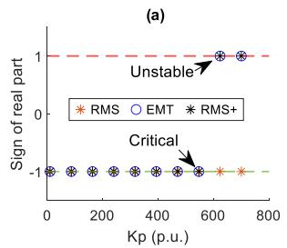

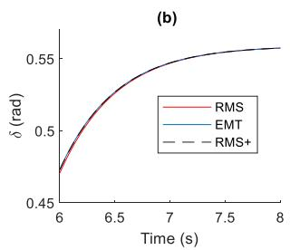

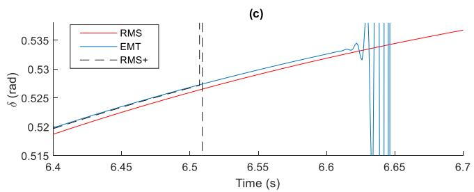  
Fig. 5. Transcritical bifurcation in Example 1. (a) Sign of real part of eigenvalues. (b) Time-response with critical pair. (c) Time-response with unstable pair (zoomed).

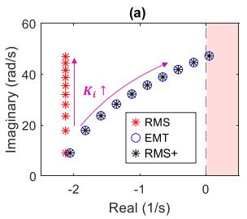

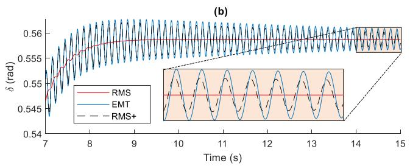

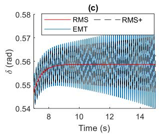  
Fig. 6. Hopf bifurcation in Minimal meshed network. (a) Root Locus. (b) Time-response with critical pair. (c) Time-response with unstable pair.

the load flow:

$$
U = 0. 8 7 \mathrm {p . u .}, \quad \delta^ {*} = - 0. 5 5 \mathrm {r a d .}, \quad i _ {q} ^ {C *} = 1. 0 \mathrm {p . u .},
$$

$$
i _ {d} ^ {C *} = 0. 0 \mathrm {p . u .} \tag {40}
$$

The objective of the tests is to reach the bifurcations described in (2) by sweeping one of the gains of the PLL. Apart from benchmarking the results of the modal analysis, for this test a time-domain simulation model was prepared based on the result obtained in (36). The objective is to show that the RMS+ model can be used for both type of studies, conventional in the analysis of power systems.

$K _ { p }$ Sweep: For this test, $K _ { i }$ is fixed in 100 p.u. while $K _ { p }$ is swept linearly from 10 to 700 p.u., in 10 steps. In Fig. 5(a) the sign of the real part of the eigenvalue closest to the positive half-plane is plotted against $K _ { p } .$ . The critical pair has $K _ { p } =$ 547 p.u, and the unstable pair has $K _ { p } = 6 2 3$ . To confirm the results, a time-domain simulation was prepared. The system initializes at a different, stable operating point, but after five seconds, it starts slowly moving towards the operating point under study. Specifically, the current commands of the converter change with first-order behavior (time constant of 0.5 seconds). The time responses of δ for the critical and unstable pairs are shown in Fig. 5(b) and (c), respectively. As discussed above, the RMS model is unable to capture the instability in both modal analysis and time-domain simulation. In contrast, the RMS+ model closely follows the EMT model and captures accurately the instability.

$K _ { i }$ Sweep: For the test, $K _ { p }$ is fixed in 5 p.u., while $K _ { i }$ increases linearly from 100 to 3000 in 10 steps. The eigenvalues are plotted in the complex plane (root-locus) in Fig. 6(a). The critical pair has $K _ { i } = 2 3 2 2 \mathrm { \ p . u . }$ ., and the unstable pair has $K _ { i }$ = 2600 p.u. The time response of δ for both pairs is shown in Fig. 6(b) and (c), respectively. The RMS model is also unable

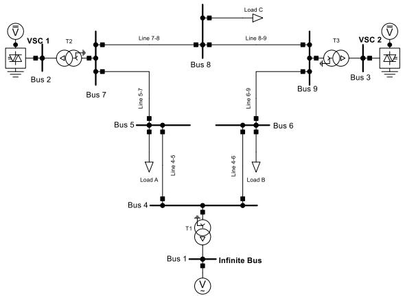  
Fig. 7. Single-line diagram of the test network.

to capture this instability, contrary to the other two models. Visually, in the complex plane, the RMS+ model demonstrates high accuracy when benchmarked against the EMT model. In the time-response, the RMS+ model closely follows the EMT model, although the peaks of the oscillations are smaller, as evidenced in the zoomed region of Fig. 6(b). It is important to note that the time-domain simulation is implemented for the full model, not the linearized model.

# B. WSCC Nine-Bus System

Example 1 only included one VSC, and did not include any capacitor or load. Therefore, a general transmission network was chosen to validate the RMS+ model. Additionally, in section III it was stated that one of the assumptions is that there is a timescale separation between the electromagnetic (RLC) transients and the GFL transients; therefore, with this network two settings of the PLL are tested: a slow PLL, and a fast PLL. The speed

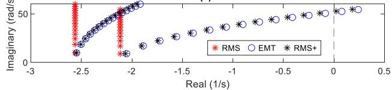  
(a)

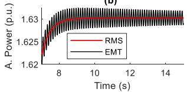  
(b)

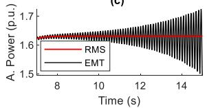  
(c)

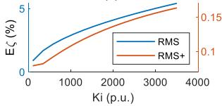  
(d)

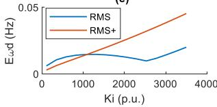  
(e)   
Fig. 8. Slow PLL (a) Root Locus. (b) Time-response of critical pair. (c) Timeresponse of unstable pair. (d) Error of damping. (e) Error of damped frequency.

of the PLL is determined by the fixed value of $K _ { p } .$ . A small $K _ { p }$ implies a slow PLL (see previous test), while a high value implies a fast PLL.

The accuracy is evaluated with two error computations, one for the damped frequency, and one for the damping coefficient. Specifically, suppose that the RMS+ yields m pairs of complex conjugate eigenvalues. Denote the eigenvalues corresponding to the three models with the following symbols:

$$
\mathbf {E M T}: A _ {i} \pm j B _ {i}, \quad \mathbf {R M S} +: a _ {i} \pm j b _ {i}, \quad \mathbf {R M S}: \alpha_ {i} \pm j \beta_ {i}. \tag {41}
$$

The damping coefficient (ζ) and damped frequency $( \omega _ { d } )$ of the ith eigenvalue from the EMT model are defined as $\zeta =$ $- A _ { i } / { ( A _ { i } ^ { 2 } + B _ { i } ^ { 2 } ) } ^ { 1 / 2 }$ , and $\omega _ { d } = B _ { i }$ . The same equations apply for the eigenvalues obtained from the RMS and RMS+ model. The errors are calculated with (also for the RMS+ model):

$$
\begin{array}{l} \mathrm{E}_{\zeta}(\%) = 100\sum_{i = 1}^{m}\left|\zeta_{i}^{\mathrm{RMS}} - \zeta_{i}^{\mathrm{EMT}}\right|, E_{\omega_{d}}(\mathrm{Hz}) \\ = \sum_ {i = 1} ^ {m} \frac {\left| \omega_ {d _ {i}} ^ {\mathrm {R M S}} - \omega_ {d _ {i}} ^ {\mathrm {E M T}} \right|}{2 \pi}; \tag {42} \\ \end{array}
$$

As shown in Fig. 7, the new test network is identical to the WSCC Nine-bus system [17], except for the generators in Bus 2 and Bus 3, which have been substituted with grid-following converters. The dynamic model of the converters is the one shown in Fig. 1; and it is assumed that both have identical PLL gains.

The generator at Bus 1 has also been substituted with an AC voltage source, that plays the role of the infinite bus, and the loads are modeled as constant parallel impedances. The steady-state operation point is identical to the original load flow in [17].

$\kappa _ { i }$ Sweep, Slow PLL: $K _ { p }$ was fixed at 5 p.u., while the integral gain was swept linearly from 100 p.u. to 3500 p.u. in 15 steps. The root-locus, shown in Fig. 8(a), evidences that the

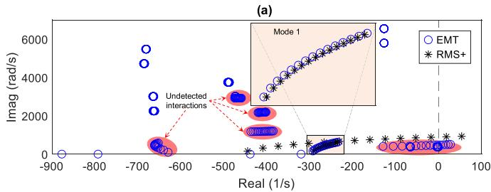

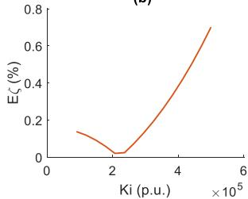  
(b)

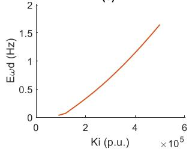  
(c)   
Fig. 9. Fast PLL. (a) Root-locus. (b) Detail of Mode 1. (c) Error of Mode 1.

RMS+ model follows the behavior of the EMT model. The importance of this is accentuated by the fact that, for this test, the EMT model is comprised of 36 state variables, while the RMS+ model is comprised of only four. The critical pair has $K _ { i } =$ 3014 p.u., and the unstable $K _ { i } = 3 2 5 7 { \mathrm { p . u } }$ . The time-responses shown in Fig. 8(b) and c) confirm the results of the root-locus.

Fig. 8(d) and (e) show the evolution of the errors. In the case of $E _ { \zeta } { \mathrm { : } }$ , the two curves exhibit similar behavior but span different scales. While the maximum error is around 0.16% for the RMS+ model, it reaches as high as 5% for the RMS model. In contrast, for the damped frequency, the error between the models is of the same scale, with a small advantage for the RMS model.

$\kappa _ { i }$ Sweep, Fast $P L L : K _ { p }$ is fixed in 500 p.u., and $K _ { i }$ is swept linearly from 90e3 p.u., to 500e3 p.u. in 15 steps. The root-locus, shown in Fig. 9(a) shows that the RMS+ model yields two modes of oscillation; however, this time only Mode 1 (zoomed region) coincides with a mode from the EMT model; the other mode is fictitious. The RMS+ model is unable to capture the interactions of the PLL with the electromagnetic transients of the network. This is coherent with the development presented above, since the assumption of time-scale separation is not fulfilled with these pair of gains.

The error metrics $E _ { \zeta }$ and $E _ { \omega _ { d } }$ were calculated only for Mode 1, as shown in Fig. 9(b) and (c). The accuracy in the damping is very high, since the error is below 0.8%. The error in the frequency is below 2 Hz; which is small compared with the frequency of the mode, which is close to 100 Hz.

Another perspective that could result useful for the analysis of the results in Fig. 9 is the frequency response of the openloop systems, i.e., converters and network. Fig. 10 shows the magnitude of the dd components in the dynamic admittances of VSC1 in both configurations, Slow and Fast PLL. Additionally, the self-admittance seen from its corresponding bus (Bus2) has been plotted for the two models, EMT and RMS+. As expected, the RMS+ model captures accurately the response of the network up to the first peak, since it is a first-order

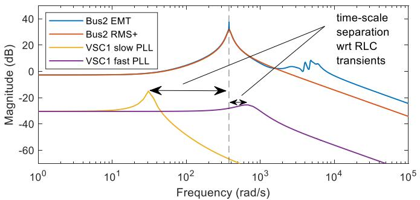  
Fig. 10. Frequency responses of Admittances (dd) for VSC1 in the 9 Bus system.

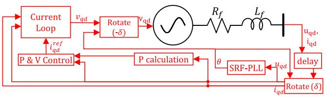  
Fig. 11. Dynamical model of VSCs in the 39-bus network. Values of parameters are reported in the Appendix.

approximation. When the PLL is slow, the dynamics of VSC1 coincide with the region where the RMS+ model is accurate, and additionally there is enough separation with respect to the natural transients of the network. In contrast, when the PLL is fast, the time-scale separation is lost, although the RMS+ model is still a good approximation. This translates in the behavior seen in the root-locus of Fig. 9, where one of the modes is still captured accurately, but for the other one the results are wrong.

# C. 39-Bus New England Test System

This network consists of 10 generators, 34 lines, 12 transformers, and 19 loads, including one load with a leading power factor. For this test all generators (except the one connected at bus 38) have been replaced with Grid-following VSCs with identical dynamical model and parameters, as shown in Fig. 11. The objective in this test is to evaluate the performance of the RMS+ model with more realistic conditions, both regarding the network and regarding the dynamical model of the converters. In specific, the objective is to test the accuracy and trustworthiness of the model at capturing the low-frequency modes. The high-frequency modes result from the interaction between the dynamics of the converters and the natural transients of the network; hence, it is known beforehand that these modes will not be captured accurately.

The steady-state operation point studied was configured by setting Bus 38 as slack bus, and configuring the other generators to PQ mode. The voltage at bus 38 coincides with the voltage of the original load flow, and the PQ injection of the other generators also coincide with the original load-flow. Nevertheless, all other variables are different because the taps of the transformers were neglected.

Fig. 12 shows a plot of the modes of oscillation obtained with the EMT model and with the RMS+ model. Instead of plotting

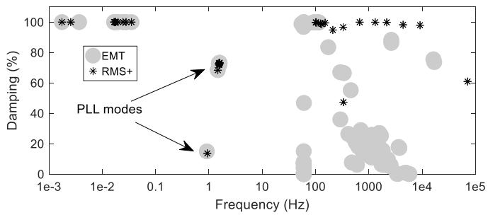  
Fig. 12. Frequency vs. damping factor of modes.

TABLE II DAMPING (%) OF PLL MODES WITH EXTREME PAIR OF GAINS IN 39-BUS SYSTEM   

<table><tr><td>Mode</td><td>1</td><td>2</td><td>3</td><td>4</td><td>5</td><td>6</td><td>7</td><td>8</td><td>9</td></tr><tr><td>EMT</td><td>7.24</td><td>5.71</td><td>6.62</td><td>6.50</td><td>7.26</td><td>6.91</td><td>7.85</td><td>7.58</td><td>7.46</td></tr><tr><td>RMS+</td><td>-0.26</td><td>5.35</td><td>6.59</td><td>6.48</td><td>7.26</td><td>6.92</td><td>7.85</td><td>7.58</td><td>7.46</td></tr></table>

the modes in the complex plane, they are plotted in the plane of the frequency (logarithmic) vs. damping factor (ζ). This figure shows evidence that for the low frequency modes (including the modes of the PLL), the RMS+ model is accurate, even though additional dynamic components were added to the VSC model. For higher frequencies, the RMS+ is not accurate due to the participation of the natural transients of the network.

In terms of performance, the closed-loop state-space representation with the EMT model is composed of 270 state variables; and computing the eigenvalues takes 2.5545 seconds. In contrast, using the RMS+ model of the network yields 108 state variables and takes 0.1812 seconds, which is roughly 14 times faster. For realistic networks with thousands of buses, the difference in performance is expected to be even more significative. All of this provides evidence that the RMS+ model is ideal for the quick identification of modes induced by the PLL of the converters in realistic networks with thousands of buses.

During this study, it was found that the RMS+ model can be overly conservative in some scenarios. For instance, with the parameters $K _ { p } = \mathrm { ~ 5 ~ p . u . }$ , and $K _ { i } = \ 1 0 0 0 \ \mathrm { p . u . }$ , the damping of the PLL modes takes the values shown in Table II. Clearly, the damping of Mode 1 with the RMS+ model is negative (unstable) while with the EMT model it is positive. One possible explanation for this mismatch lies in the fact that the RMS+ model neglects the capacitor dynamics; nevertheless, since the results are conservative instead of optimistic, the model is still a good alternative for the quick identification of the PLL modes.

# VIII. CONCLUSION

In power systems dominated by synchronous machines, representing the circuit in terms of impedances is sufficient for both steady-state studies and dynamic studies. For networks with high participation of grid-following VSCs this steady-state model becomes inadequate, one of the reasons being its “blindness” to PLL small-signal instability. This challenges the common notion that the RMS model might be appropriate if the interest is on low-frequency oscillations.

Motivated by the need for a better representation, this paper proposed to augment the RMS model with a new “equivalent inductance” matrix that serves as the coefficient of a derivative. This matrix, called L, can be computed by first finding the distribution of the converter currents in the branches of the circuit, and then considering the derivatives of the inductors and solving a least-squares problem. This procedure is based on the theory of fast-slow systems, and hence, the essential assumption is that some of the dynamics of the converter control are slow compared to the electromagnetic (RLC) transients. Benchmarking results demonstrate that RMS+ captures PLL small-signal instability, while reducing the number of state variables that an EMT model would require. On the other hand, this model is not suitable to study harmonic stability; or any other phenomena where the controls considered interact with the electromagnetic transients.

This research is introductory and there are several aspects that can be addressed in future research. One of them is to add the voltage derivatives at capacitors. Another one is its extension to the unbalanced case. Additionally, further studies could examine its use in grid-forming converter synchronization and evaluate the effects of faster control loops on system performance.

The RMS+ model represents an update to the RMS circuit model, and its implementation in tools for modal analysis and transient stability analysis is encouraged. This general model allows for the connection of converters, synchronous generators, and other active devices. Furthermore, as demonstrated in this paper, RMS+ is particularly well-suited for analyzing PLL stability in large bulk power systems, as the number of state variables is reduced compared with the EMT model.

# APPENDIX

# A. abc to qd Transformation

$$
\begin{array}{l} \left[ \begin{array}{l} u _ {d} \\ u _ {q} \end{array} \right] = \frac {\sqrt {2}}{\sqrt {3}} \left[ \begin{array}{l l l} \cos (\theta) & \cos (\theta - 2 \pi / 3) & \cos (\theta + 2 \pi / 3) \\ - \sin (\theta) & - \sin (\theta - 2 \pi / 3) & - \sin (\theta + 2 \pi / 3) \end{array} \right] \\ \times \left[ \begin{array}{l} u _ {a} \\ u _ {b} \\ u _ {C} \end{array} \right], \tag {43} \\ \end{array}
$$

The operation in (43) corresponds to a power-invariant transformation with phase a aligned with the d axis.

B. Values of Parameters for the 39-bus System Test

- SRF-PLL: $K _ { p } = \mathrm { 2 0 } \mathrm { p . u . }$ ., ad $K _ { i } = \ 2 0 0 \mathrm { p . u }$ .

Delay: Pure time-delay corresponding to a sampling rate of 1 kHz. Linear model is a Padé approximant of second order.   
- P&V Control: Proportional (0.5 p.u.) and Integral (10 p.u.) compensators.   
- Current Loop and filter: $R _ { f } = 1 { \mathrm e } { } - 3$ p.u.; and $L _ { f } = 1 { \mathrm e } { } { } \mathrm { - } 4$ p.u. The time constant of the Current Loop is 10 ms.

# REFERENCES

[1] P. S. Kundur, “Small-signal stability,” in Power System Stability and Control. Palo Alto, CA, USA: McGraw Hill, 1994, pp. 699–825.   
[2] Q. Hu, L. Fu, F. Ma, and F. Ji, “Large signal synchronizing instability of PLL-based VSC connected to weak AC grid,” IEEE Trans. Power Syst., vol. 34, no. 4, pp. 3220–3229, Jul. 2019.   
[3] M. Z. Mansour, S. P. Me, S. Hadavi, B. Badrzadeh, A. Karimi, and B. Bahrani, “Nonlinear transient stability analysis of phased-locked loopbased grid-following voltage-source converters using Lyapunov’s direct method,” IEEE J. Emerg. Sel. Topics Power Electron., vol. 10, no. 3, pp. 2699–2709, Jun. 2022.   
[4] M. Carreño, J. Song, O. Gomis-Bellmunt, and R. Griñó, “Design-oriented large-signal stability analysis of synchronous reference frame phaselocked loop,” IEEE Trans. Power Del., vol. 40, no. 3, pp. 1235–1243, Jun. 2025.   
[5] B. Kasztenny and M. Kezunovic, “A method for linking different modeling techniques for accurate and efficient simulation,” IEEE Trans. Power Syst., vol. 15, no. 1, pp. 65–72, Feb. 2000.   
[6] G. Grdeni´c, M. Delimar, and J. Beerten, “Assessment of AC network modeling impact on small-signal stability of AC systems with VSC HVDC converters,” Int. J. Elect. Power Energy Syst., vol. 119, 2020, Art. no. 105897.   
[7] F. Milano and Á. Ortega, “Frequency divider,” IEEE Trans. Power Syst., vol. 32, no. 2, pp. 1493–1501, Mar. 2017.   
[8] F. Milano and Á. O. Manjavacas, “Frequency-dependent model for transient stability analysis,” IEEE Trans. Power Syst., vol. 34, no. 1, pp. 806–809, Jan. 2019.   
[9] J. Khodaparast and M. Khederzadeh, “Least square and Kalman based methods for dynamic phasor estimation: A review,” Protection Control Modern Power Syst., vol. 2, no. 1, pp. 1–18, 2017.   
[10] T. Demiray and G. Andersson, “Optimization of numerical integration methods for the simulation of dynamic phasor models in power systems,” Int. J. Elect. Power Energy Syst., vol. 31, no. 9, pp. 512–521, 2009.   
[11] C. Kuehn, Multiple Time Scale Dynamics. Cham, Switzerland: Springer International Publishing, 2016.   
[12] M. Stiefenhofer, “Quasi-steady-state approximation for chemical reaction networks,” J. Math. Biol., vol. 36, no. 6, pp. 593–609, 1998.   
[13] A. Goeke, C. Chilli, S. Walcher, and E. Zerz, “Computing quasi-steady state reductions,” J. Math. Chem., vol. 50, no. 6, pp. 1495–1513, 2012.   
[14] M. Carreño, “The RMS model cannot capture PLL small-signal instability,” IEEE Trans. Power Syst., vol. 40, no. 5, pp. 4415–4418, Sep. 2025.   
[15] H. K. Khalil, “Singular perturbations,” in Nonlinear Systems. Saddle River, NJ, USA: Prentice Hall, 2002, pp. 485–520.   
[16] Y. Chen, M. Jiménez Carrizosa, G. Damm, F. Lamnabhi-Lagarrigue, M. Li, and Y. Li, “Control-induced time-scale separation for multiterminal high-voltage direct current systems using droop control,” IEEE Trans. Control Syst. Technol., vol. 28, no. 3, pp. 967–983, May 2020.   
[17] P. M. Anderson and A. A. Fouad, Power System Control and Stability. Ames, IA, USA: Iowa State Univ. Press, 1977.