# Low-complexity graph-based traveling wave models for HVDC grids with hybrid transmission lines: Application to fault identification

P. Verrax *,a,b , N. Alglave a , A. Bertinato a , M. Kieffer a,b , B. Raison a,c

a SuperGrid Institute, 23 rue Cyprian, BP 1321, Villeurbanne, Cedex 69611, France   
b L2S, Univ Paris-Saclay, CNRS, CentraleSupelec, Gif-sur-Yvette F-91190, France   
c Institute of Engineering Univ. Grenoble Alpes, CNRS, Grenoble INP*, G2Elab, Grenoble 38000, France

# A R T I C L E I N F O

Keywords:

Hybrid lines

Fault location

Graphs theory

Parametric model

Identification

# A B S T R A C T

Faults affecting hybrid transmission lines comprising both overhead and underground parts, generate numerous traveling waves may be difficult to describe and evaluate. This paper proposes a combined knowledge-based and behavioral modeling approach to represent the voltage and current waveform after the fault occurrence. The grid is reprensente as a graph which facilitates the selection of waves traveling through the grid for a finite timehorizon simulation. A relatively compact description of the waves is then derived. The obtained model depends explicitly on the characteristics of the grid and on the fault parameters. An application of the model to the identification of the faulty portion of an hybrid line within an HVDC grid is proposed.

# 1. Introduction

The integration of renewable electricity sources leads to the evolu tion of the existing transmission and distribution power grids into a more interconnected system. For high voltage transmission, direct current (HVDC) technology may outperform HVAC for long distance interconnections, in particular for underground or undersea cables [1]. The use of hybrid lines comprising portions of cables and overhead lines permits a better adaption to different terrains and configurations (offshore connection, populated areas, existing corridors, etc.), see for instance [2,3]. Such hybrid lines can be further integrated into larger Multi-Terminal DC grids (MTDC) to increase the overall reliability while diminishing the investment costs [4,5]. An example of a four station meshed HVDC grid comprising two overhead lines and two hybrid lines is depicted in Figure 1.

The protection of MTDC grids against faults remains a challenging topic, in particular when it comprises several portions of underground cables (UGC) and overhead lines (OHL). The differences between UGC and OHL, for instance in terms of surge impedance, makes the use of traditional rate of change of voltage (ROCOV) and current (ROCOC) algorithms ill-suited [6]. For hybrid lines, protection algorithm should be able to identify the faulty section as faults on areal section are generally temporary and can lead to the auto-reclosing of the line. Traditional protection algorithms are generally unable to perform this

task. A brief literature overview on protection algorithms for hybrid lines is given in Section 2, showing the interest of model-based approaches. This paper proposes a systematic approach for the modeling of the traveling waves appearing after a fault using a graph description of the grid. For each wave, the proposed parametric model combines a physical and a behavioral part, as detailed in Section 3. The physical part accounts for the propagation delays of the waves though the transmission lines and the reflection and transmission occurring at the nodes of the grid. The behavioral part accounts for the distortion of the waves due to the soil resistivity and the cable resistance. The obtained model depends explicitly on the parameters that characterize a fault, such as the fault distance and the fault resistance. An application example of the model to identify the faulty segment within a hybrid line is presented in Section 4. Test results using a test grid simulated in EMTP-RV [7] software are provided in Section 5.

# 2. Literature overview

The selective clearing of faults by disconnecting only the affected line is usually the preferred solution as it allows to operate the healthy parts of the grid continuously. This requires DC Circuit Breakers (DCCB) at the extremity of each line. Each DCCB is then controlled by the neighboring relay which, in case of a fault affecting the line it protects, must send a tripping order as fast as possible (typically in less than 1 ms).

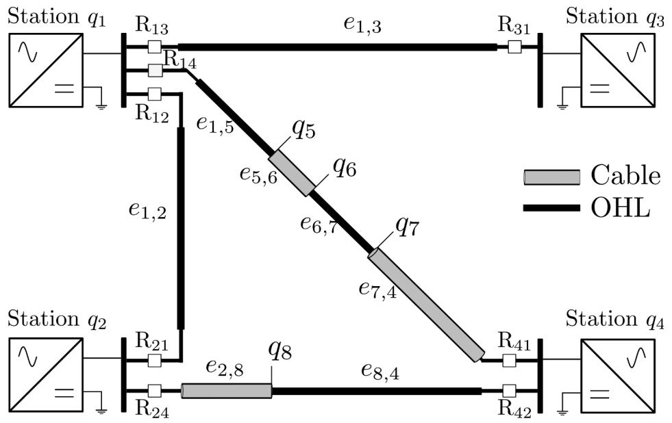  
Fig. 1. Example of a meshed HVDC grid comprising two hybrid lines and two overhead lines. DC circuit breakers located at the extremity of each line as well as at the output of the converters are omitted.

The protection algorithm at the relay must thus differentiate faults affecting the protected line (internal faults) from faults affecting other parts of the grid (external faults). Furthermore, in the case of hybrid lines, the identification of the faulty segment is of interest. While faults affecting cables are usually permanent, faults affecting OHL are often temporary and a re-closing of the line may be attempted. Nevertheless, the identification of the faulty segment within an hybrid line is a difficult task. Many existing approaches involve distributed sensors at the junction between each portion and synchronized communication between distant sub-stations at the price of a higher communication delay, see [8]. On the other hand, single-ended algorithms only require sensors at the extremity of each line and are thus less sensitive to communication issues.

In [9], a Support Vector Machine (SVM) algorithm is trained to classify the faults of a two segments hybrid line using single ended data. Voltage and current wavelet energies are used as inputs for the SVM. Once the faulty section is identified, a wavelet-based localization technique is applied. As it uses a binary classifier, this approach is limited to hybrid lines with only two segments. The SVM has also to be trained with sufficient fault scenarios. For a Point-to-Point (P2P) hybrid line, [10] showed that the presence of oscillations in the current evolution after the operation of the AC circuit breakers (ACCB) is characteristic of a fault in the overhead part of the line. This kind of approach is not suited for meshed grid where ACCBs do not operate as primary protection.

An HVAC line with an arbitrary number of junctions is considered in [11]. Based on the detection time of the first traveling wave (TW) at both ends of the line, the method is able to locate the fault, taking into account the different propagation speeds as well as possible uncertainties in the line parameters. In [12], the arrival times of multiple TW at only one end of the line are extracted and compared to pre-determined times corresponding to known fault distances. Matching the extracted with the pre-defined arrival times allows one to locate the fault. The method to obtain the pre-determined arrival times is however not detailed. The overall approach requires an observation window of 4 ms and cannot be considered as an ultra fast localization algorithm.

The presence of sensors at the junction between the aerial and underground parts is assumed in [13]. A differential protection criterion is then applied to identify the faulty section, assuming the primary protection is ensured through the control of full-bridge Modular Multilevel Converters (MMC). Distributed sensors are also considered in [8] in the

more general case of an hybrid link embedded in a MTDC grid. The primary protection is ensured by a differential current criterion evaluated at the junction points. Localization is then performed using the arrival time difference at the different sensors, measured using a wavelet transform of the current. Nevertheless, the availability of sensors at each junction is costly and communication between those would lead to additional delays.

Model-based approaches representing the transient behavior of the grid are beneficial as they allow one to exploit the information contained in the traveling waves appearing after a fault occurrence, see for instance [14]. The evaluation of the different traveling waves may however be difficult in the case of hybrid lines due to the numerous discontinuities along the line.

# 3. Systematic fault modeling

The modeling of the faults affecting hybrid transmission lines of an MTDC grid with monopolar configuration is detailed in this section. The description of the faulty network as a graph is first introduced in Section 3.1. Elements of the TW theory are briefly recalled in Section 3.2 after which the proposed approach for the systematic modeling of TW is presented. In this physical part of the model, the distortion of the TW is neglected which allows us to derive explicit expressions for the different TW. In a second stage, the behavioral part of the proposed model, whichrepresents the distortion due to the resistivity of the ground as well as the resistance of the cable is described in Section 3.3.

# 3.1. Graph description of the MTDC grid affected by a fault

The considered MTDC grid is described by an undirected graph $\mathcal { G } =$ $( \mathcal { Q } , \mathcal { E } )$ . Each vertex $q \in \mathcal { Q }$ represents an interconnection between two or more line segments. Nodes may correspond to bus-bars or junctions between overhead line and underground cable segments. Each segment is represented by an edge $e \in { \mathcal { E } }$ of the graph. The edge between the nodes qi and qj is denoted $e _ { q _ { i } q _ { j } } ,$ , or ei,j to lighten the notations. Since the graph is undirected, $e _ { i , j } = e _ { j , i }$ . The length of the segment represented by the edge $e _ { i , j }$ is $d _ { i , j }$ .

We assume that a $t = t _ { \mathrm { f } }$ a fault occurs in edge $e _ { \mathrm { f } } = e _ { i , j } \in \mathcal { E } .$ . This fault is modeled as a switch closing in series with the fault resistance $R _ { \mathrm { f } }$ and a constant voltage source. The voltage source accounts for the collapse of voltage and is set to the opposite of the pre-fault voltage $V _ { \mathrm { b f } }$ at the fault

# location.

The fault leads to a modification of the graph $\mathcal { G } , \mathtt { A }$ node q is added to $\mathcal { Q }$ and the faulty edge $e _ { \mathrm { f } } = e _ { i , j } \in \mathcal { E }$ is replaced by the edges $e _ { i , \mathrm { f } }$ and $e _ { \mathrm { f } , j }$ of lengths $d _ { \mathrm { f } , i }$ and $d _ { \mathrm { f } , j } .$ Formally, the graph $\mathcal { G } _ { \mathrm { f } } = ( \mathcal { Q } _ { \mathrm { f } } , \mathcal { E } _ { \mathrm { f } } )$ , once the fault has occurred, is such that $\mathcal { Q } _ { \mathrm { f } } = \mathcal { Q } \cup \{ q _ { \mathrm { f } } \}$ and $\mathcal { E } _ { \mathrm { f } } = \mathcal { E } \backslash \{ e _ { \mathrm { f } } \} \cup \{ e _ { i , \mathrm { f } } , e _ { j , \mathrm { f } } \}$ . The fault can thus be characterized by the vector of fault parameters $\mathbf { p } = \left( t _ { \mathrm { f } } \right.$ , $e _ { \mathrm { f } } , d _ { \mathrm { f } , i } , d _ { \mathrm { f } , j } , R _ { \mathrm { f } } )$ , where $R _ { \mathrm { f } }$ is the fault resistance between the transmission line and the ground. The two fault distances $d _ { \mathrm { f } , i }$ and $d _ { \mathrm { f } , j }$ are linked through the total length of the line $d _ { \mathrm { f } , i } + d _ { \mathrm { f } , j } = d _ { i , j }$ , which is known. Thus only one unknown fault distance is kept, for a fault located on the edge $e _ { i , j } ,$ , the fault distance is arbitrarily defined as

$$
d _ {\mathrm {f}} = \left\{ \begin{array}{l l} d _ {\mathrm {f}, i} & \text {i f} i <   j \\ d _ {\mathrm {f}, j} & \text {i f} j <   i \end{array} . \right. \tag {1}
$$

In what follows, Laplace domain or frequency domain variables are in capital letters, whereas continuous and discrete time domain variables are in small letters. The convolution is represented by $\otimes , \mathcal { F }$ and $\mathcal { F } ^ { - 1 }$ stand for the direct and inverse Fourier transform.

# 3.2. Physical part of the parametric fault model

A physical description of the transient evolution of the voltage and current after a fault is presented in this section. The main results on the propagation of TW are first recalled in Section 3.2.1. The proposed approach to describe any wave traveling from the fault through the grid is presented in Section 3.2.2.

# 3.2.1. Traveling waves

Consider an edge $e _ { i , j }$ belonging to a meshed grid as depicted in Figure 1. The temporal evolution of the voltage and current at a given point of $e _ { i , j }$ can be described using traveling waves, as shown in [15]. Current and voltage along the line satisfy the telegraph equations, formulated in the Laplace domain as

$$
\frac {\partial^ {2} V}{\partial x ^ {2}} = Z (s) Y (s) V (x, s), \tag {2}
$$

$$
\frac {\partial^ {2} I}{\partial x ^ {2}} = Y (s) Z (s) I (x, s), \tag {3}
$$

where $Z ( s ) = R + s L$ is the distributed series impedance and $Y ( s ) = G +$ $s C$ is the distributed shunt admittance. In what follows, the distributed parameters $R , L , C ,$ , and G are considered at a fixed given frequency. This assumption allows one to obtain explicit formulas for the current and voltage waves. The obtained model is then supplemented by a behavioral part to match more accurately the frequency dependent behavior of transmission lines in Section 3.3.

Consider a fault occurring on edge $e _ { i , j }$ j. Two current and voltage waves $V _ { i , 1 }$ and $V _ { j , 1 }$ propagate from the fault position through the line towards node $q _ { i }$ and $q _ { j } ,$ respectively. They are subject to distortion and attenuation described by the propagation function H

$$
V _ {i, 1} (s, d _ {\mathrm {f}, i}) = H (s, d _ {\mathrm {f}, i}) V _ {\text {i n i t}} (s) \tag {4}
$$

$$
V _ {j, 1} (s, d _ {\mathrm {f}, j}) = H (s, d _ {\mathrm {f}, j}) V _ {\text {i n i t}} (s), \tag {5}
$$

where $V _ { \mathrm { i n i t } }$ is the initial surge at fault location. For a traveled distance d along the line, H can be expressed as

$$
H (s, d) = \exp \left(- \sqrt {Y (s) Z (s)} d\right). \tag {6}
$$

The current wave associated to a voltage wave V can be computed as

$$
I (s, d) = Z _ {\mathrm {s}} ^ {- 1} (s) V (s, d), \tag {7}
$$

where

$$
Z _ {\mathrm {s}} (s) = \sqrt {Z (s) / Y (s)} \tag {8}
$$

is the surge (or characteristic) impedance. Similar computations can be performed for the current.

The assumption that losses are negligible compared to the inductive behavior of the line allows one to obtain explicit expressions of the surge impedance and propagation function. Considering a low-loss approximation, one has

$$
Z _ {\mathrm {s}} (s) \simeq \sqrt {\frac {L}{C}} \left(1 + \frac {1}{2} \frac {R}{s L}\right). \tag {9}
$$

For the propagation constant $\gamma ( s ) = { \sqrt { Y ( s ) Z ( s ) } }$ , the low-loss approximation leads to

$$
\gamma (s) \simeq s \sqrt {L C} \left[ 1 + \frac {1}{2} \frac {R}{s L} \right]. \tag {10}
$$

Considering the lossless approximation, one gets

$$
Z _ {\mathrm {s}} \simeq \sqrt {\frac {L}{C}} \tag {11}
$$

$$
\gamma (s) \simeq s \sqrt {L C}. \tag {12}
$$

In that case, the surge impedance is real and the propagation function $H ( s , d ) = \exp ( - \gamma ( s ) d )$ is a pure delay.

In practice, the lossless approximations appears to be sufficient in the considered fault localization context. Nevertheless, the characteristic impedance of underground cables still require a low-loss approximation to provide results of sufficient accuracy.

At the junction between a line and a station (or more generally at any change of propagation medium), the forward wave $V _ { \mathrm { f } }$ induces a transmitted wave $V _ { \mathrm { t } }$ and a reflected wave $V _ { \mathrm { r } } .$ . The associated voltage $V _ { \mathrm { t o t } }$ at the junction is

$$
\begin{array}{l} V _ {\text {t o t}} = V _ {\mathrm {t}} = V _ {\mathrm {f}} + V _ {\mathrm {r}} \\ = (1 + K) V _ {\mathrm {f}} \tag {13} \\ = T V _ {\mathrm {f}}. \\ \end{array}
$$

The reflection and transmission coefficients K and T depend on the characteristic admittance $Y _ { s } = Z _ { s } ^ { - 1 }$ of the media. For a node q connected to $n + 1$ edges $e _ { 0 } , e _ { 1 } , \cdots e _ { n }$ , the reflection coefficient for a wave traveling from edge $e _ { 0 } ,$ reflected at node q and traveling backwards $e _ { 0 }$ is

$$
K _ {e _ {0} \rightarrow q} = \frac {Y _ {e _ {0}} - \sum_ {\ell = 1} ^ {n} Y _ {s , e _ {\ell}}}{\sum_ {\ell = 0} ^ {n} Y _ {s , e _ {\ell}}}. \tag {14}
$$

The transmission coefficient from edge $e _ { 0 }$ through node $q , i = 1 , \cdots , n$ is

$$
T _ {e _ {0} \rightarrow q} = 1 + K _ {e _ {0} \simeq q} = \frac {2 Y _ {s , e _ {0}}}{\sum_ {\ell = 0} ^ {n} Y _ {s , e _ {\ell}}}. \tag {15}
$$

The initial surge at the fault location itself is modeled as a switch closing at $t = t _ { \mathrm { f } }$ in series with the fault resistance $R _ { \mathrm { f } }$ and a constant voltage source of amplitude − $\cdot \nu _ { \mathrm { b f } }$ , the opposite of the voltage at the fault location before the fault. The initial voltage surge at the fault location $V _ { \mathrm { i n i t } }$ is thus

$$
V _ {\text {i n i t}} = \underbrace {\frac {- 1 / R _ {\mathrm {f}}}{2 / Z _ {\mathrm {s}} + 1 / R _ {\mathrm {f}}}} _ {K _ {e _ {i, \mathrm {f}} = e _ {\mathrm {f}}}} v _ {\mathrm {b f}} \exp (- s t _ {\mathrm {f}}) \tag {16}
$$

which can also be expressed using the reflection coefficient from the line to the fault $K _ { e _ { i , \mathrm { f } }  e _ { \mathrm { f } } }$ . The voltage at the fault location just before the occurrence of the fault $\nu _ { \mathrm { b f } }$ can be approximated by the measured prefault voltage at the relay q.

For reflection and transmission at sub-stations comprising MMCs, we adopt an RLC equivalent model [16], which is valid before the blocking of the station

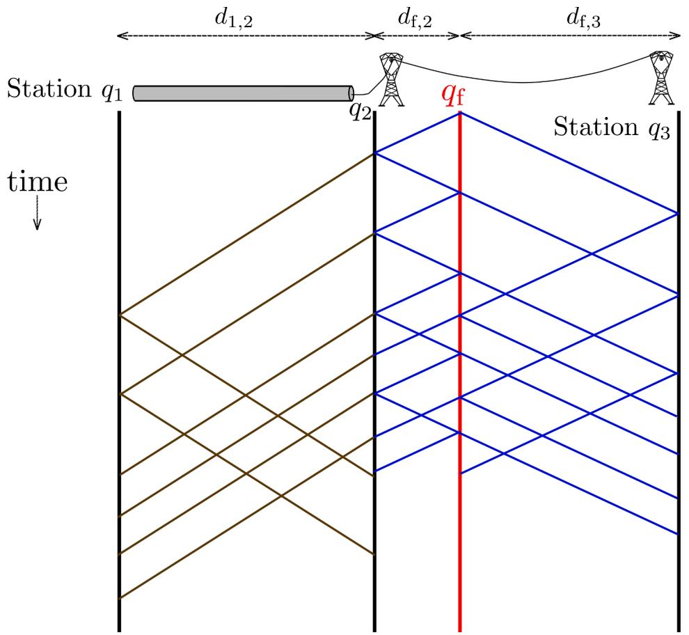  
Fig. 2. Example of Bewley lattice diagram for a hybrid point-to-point link when a fault occurs as qf located in an overhead portion of the line.

$$
Z _ {\mathrm {m m c}} (s) = R _ {\mathrm {m m c}} + s L _ {\mathrm {m m c}} + \frac {1}{s C _ {\mathrm {m m c}}}. \tag {17}
$$

The propagation Eqs. (4) and (5) combined with the reflection and transmission Eqs. (13), (14), and (15) allow one to model any particular wave traveling from the fault to the grid. Nevertheless, a faulty grid comprising hybrid lines will host many reflected waves due to the multiple junctions between aerial and underground sections. A systematic approach describing these traveling waves is required and detailed in Section 3.2.2.

# 3.2.2. Systematic description of traveling waves within a grid

Consider a node $q _ { s } \in \mathcal { Q } _ { \mathrm { f } }$ at which voltage and current are observed. This node may, for instance, connect multiple transmission lines to a converter station. The aim in what follows is to propose a physical model of the TW caused by the fault and reaching $q _ { s } .$ . A TW is entirely determined by its path, i.e., the sequence of nodes it has traversed. Formally, all possible paths from $q _ { \mathrm { f } }$ to $q _ { s }$ can be defined as

$$
\begin{array}{l}\mathcal {P} _ {q _ {\mathrm {f}} \rightarrow q _ {\mathrm {s}}} = \left\{ \right.\left(q _ {n _ {1}},.., q _ {n _ {m}}\right)\left. \right|\\q _ {n _ {1}} = q _ {\mathrm {f}}, q _ {n _ {m}} = q _ {\mathrm {s}}, \left(q _ {n _ {i}}, q _ {n _ {i + 1}}\right) \in \mathscr {E} _ {\mathrm {f}}, m > 1 \}.\end{array}\tag {18}
$$

A path π ∈ $\mathcal { P } _ { q _ { \mathrm { f } }  q _ { \mathrm { s } } }$ may comprise the same node several times, including the faulty node $q _ { \mathrm { f } }$ and the observation node $q _ { s } .$ . Due to the reflections occurring at the junctions, a TW is indeed likely to pass several times via the same nodes. Using the lossless approximation and constant distributed line parameters considered in Section 3.2.1when a wave travels on an edge, only the propagation delay has to be taken into account. Consequently, when modeling traveling waves, one has to account for

• the different delays due to the propagation along the edges,   
• the effect of junctions on the incident wave.

Consider a path $\pi = ( q _ { n _ { 1 } } , . . , q _ { n _ { m } } ) \in \mathcal { P } _ { q _ { \mathrm { f } }  q _ { s } }$ traveled by a given wave. The total propagation delay along π is

$$
\tau_ {\pi} \left(d _ {\mathrm {f}}\right) = \sum_ {i = 1} ^ {m - 1} \Delta t _ {n _ {i}, n _ {i + 1}} = \sum_ {i = 1} ^ {m - 1} \frac {d _ {n _ {i} , n _ {i + 1}}}{c _ {n _ {i} , n _ {i + 1}}} \tag {19}
$$

where $c _ { n _ { i } , n _ { i + 1 } }$ is the wave propagation speed along the edge $( q _ { n _ { i } } , q _ { n _ { i + 1 } } ) ,$ , depending on the propagation medium. The total delay $\tau _ { \pi }$ thus depends at least on the fault distances $d _ { \mathrm { f } , i }$ or $d _ { \mathrm { f } , j }$ the first traversed edge is necessarily connected to the fault.

At each junction along π, the voltage wave is subject to a transmission and a reflection. The resulting coefficient depends on the propagation direction before and after the junction. Consequently, the impact of reflections and transmissions at junctions is described by

$$
V _ {\pi , \mathrm {j}} (s, t _ {\mathrm {f}}, R _ {\mathrm {f}}) = \prod_ {i = 1} ^ {m} J _ {e _ {n _ {i - 1}, n _ {i}} \rightarrow q _ {n _ {i}}} (s, R _ {\mathrm {f}}) \frac {\exp (- t _ {\mathrm {f}} s)}{s} V _ {\mathrm {b f}} \tag {20}
$$

where J is either a reflection (14) or transmission (15) coefficient

$$
J _ {e _ {n _ {i - 1}, n _ {i}} \rightarrow q _ {n _ {i}}} = \left\{\begin{array}{l l}T _ {e _ {n _ {i - 1}, n _ {i}} \rightarrow q _ {n _ {i}}}&\text {i f} n _ {i - 1} \neq n _ {i + 1}\\K _ {e _ {n _ {i - 1}, n _ {i}} \rightarrow q _ {n _ {i}}}&\text {i f} n _ {i - 1} = n _ {i + 1}\end{array}\right.
$$

for $i = 2 , \cdots , m - 1$ . The first term in the product (20) accounts for the initial surge at the fault location $J _ { e _ { n _ { 0 } , n _ { i } } \to q _ { n _ { 1 } } } = K _ { q _ { n _ { 1 } } , q _ { n _ { 2 } } , \to q _ { \mathrm { f } } } ( R _ { \mathrm { f } } )$ and depends thus on the fault resistance, see (16). The voltage at node $q _ { s }$ due to the arrival of an incident wave corresponds to the transmitted wave to the node $q _ { s }$ (13). This transmission coefficient is thus included as the last term in the product (20), hence $J _ { e _ { n _ { m - 1 } , n _ { m } }  q _ { m } } = T _ { e _ { n _ { m - 1 } , n _ { m } }  q _ { s } }$ . Consequently, for a given path $\pi ,$ considering the propagation delay (19) and the transmissions and reflections occurring along π via (20), one gets the following physical part model of the proposed parametric model

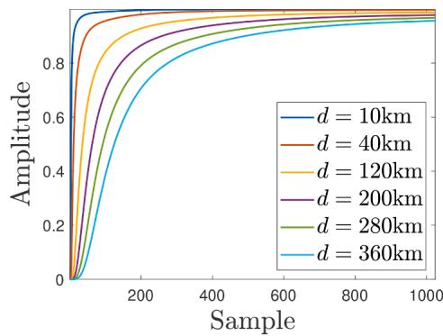

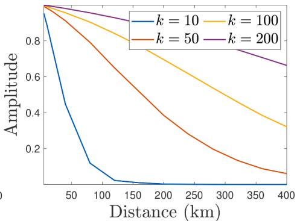

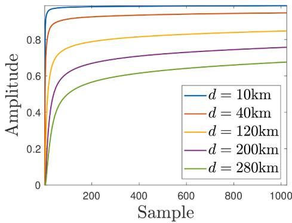

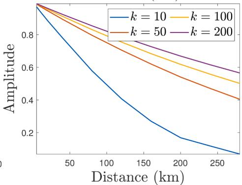  
Fig. 3. Unit step response for overhead lines (top-left) and cables (bottom-left) of different lengths; The variation of amplitude with the distance for specific sample points k is detailed for OHL (top-right) and cables (bottom-right), the sampling frequency is $f _ { s } = 1 \mathrm { M H z }$ .

$$
V _ {\pi} ^ {0} (s, \mathbf {p}) = \exp \left(- \tau_ {\pi} \left(d _ {\mathrm {f}}\right) s\right) V _ {\pi , \mathrm {j}} \left(s, t _ {\mathrm {f}} R _ {\mathrm {f}}\right) \tag {21}
$$

of the voltage at node $q _ { s }$ due to a wave traveling though the path $\pi .$

The different paths taken by the TW can be represented via a Bewley lattice diagram. Figure 2 illustrates such diagram on a point-to-point link consisting of an OHL and a cable segment. Even in this relatively simple case, the presence of the OHL-cable junction creates a large number of reflected TWs. The propagation speed of the TWs in the underground part is slower than in the overhead line.

The waveform of the voltage at node $q _ { s }$ in the time domain is obtained through the inverse Fourier transform

$$
\begin{array}{l} v _ {\pi} ^ {0} (t, \mathbf {p}) = \mathcal {F} ^ {- 1} \left\{V _ {\pi} ^ {0} (s, \mathbf {p}) \big | _ {s = j \omega} \right\} \\ = \mathcal {F} ^ {- 1} \left\{V _ {\pi_ {\mathrm {d}}} \left(\omega , R _ {\mathrm {f}}\right) \right\} \otimes \delta_ {\tau_ {\pi} \left(d _ {\mathrm {f}}\right)} (t) \tag {22} \\ = v _ {\pi , \mathrm {j}} (t, R _ {\mathrm {f}}) \otimes \delta_ {\tau_ {\mathrm {e}}} (d _ {\mathrm {f}}, t) \\ = v _ {\pi , \mathrm {j}} \left(t - \tau_ {\pi} \left(d _ {\mathrm {f}}\right), R _ {\mathrm {f}}\right) \\ \end{array}
$$

where $\delta _ { \tau _ { \pi } ( d _ { \mathrm { f } } ) } ( t ) = \delta _ { 0 } ( t - \tau _ { \pi } ( d _ { \mathrm { f } } ) )$ is the Dirac distribution corresponding to the propagation delay $\tau _ { \pi }$ along the path. In practice, $\mathcal { F } ^ { - 1 }$ is computed numerically using the inverse discrete Fourier transform. Considering a sampling period $T _ { s } ,$ , the obtained discrete-time voltage model at time $k T _ { s }$ is thus written as $\nu _ { \pi } ^ { 0 } ( k , { \bf p } )$ .

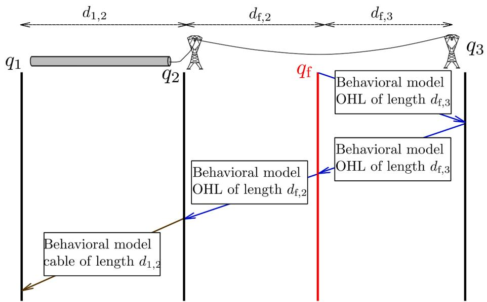  
Fig. 4. Example of cascaded behavioral model to take into account segmented transmission lines.

# 3.3. Behavioral modeling of the ground effects

The physical part of the parametric model developed in Sections 3.2.1 and 3.2.2 assumes the distributed line parameters are independent of the frequency. With this approximation, the distortion of the waves cannot be described. In particular, the soil resistivity effects for the OHL portions as well as the screen resistance for the cable portions are not taken into account.

To account for such effects, the physical part is supplemented by a behavioral part described in this section. From the geometry of the transmission lines and the characteristics of the conductors, the response for a voltage step propagating along a given edge e can be obtained using EMT simulation software. In particular, the step response depends on the length of the considered segment $d _ { e }$ and on the value of the soil resistivity ${ \boldsymbol { \rho } } _ { e }$ . The latter is considered as a known constant characteristic of the considered line. The propagation delay is removed from the step responses as it is already accounted for by the propagation constant (12).

Assume that a set of known step responses $u _ { d , \rho } ( k )$ for various edge lengths $\{ d _ { 1 } , d _ { 2 } , \cdots d _ { n } \}$ is available for a given conductor and line geometry, as presented in Fig. 3. The different step responses have smooth variations with respect to the line length. Thus, to obtain a step response $u _ { d }$ for any length d such that $d _ { i } < d < d _ { i + 1 } , i = 1 , \cdots , n - 1$ , we propose an interpolation using the step responses obtained for the fault distances di and $d _ { i + 1 }$ 1

$$
u _ {d} (k) = \frac {u _ {d _ {i + 1}} (k) - u _ {d _ {i}} (k)}{\left(d _ {i + 1} - d _ {i}\right)} \left(d - d _ {i}\right) + u _ {d _ {i}} (k). \tag {23}
$$

The step response of a given edge e is differentiated to obtain the impulse response $h _ { e }$

$$
h _ {e} (k) = \frac {u _ {d , \rho} (k + 1) - u _ {d , \rho} (k)}{T _ {\mathrm {s}}}. \tag {24}
$$

If the step response for the soil resistivity ${ \bf \nabla } \cdot \rho _ { e }$ of the edge e is unknown, it can be interpolated from the step responses at known soil resistivities $\rho _ { 1 } , \cdots , \rho _ { m }$ similarly to (23).

The evolution of a wave traveling through an edge e of length $d _ { e }$ is obtained as the output of the finite impulse response filter excited by the output of the physical part of the model (21) of the edge e

$$
\nu_ {e} ^ {\mathrm {m}} (k, \mathbf {p}) = h _ {e} (k, d _ {e}) \otimes \nu_ {e} ^ {0} (k, \mathbf {p}). \tag {25}
$$

For a wave traveling through a path π ∈ P comprising several edges, the total voltage evolution at node $q _ { s }$ is obtained by cascading the impulse responses of the different edges, see for example Fig. 4

$$
\nu_ {\pi} ^ {\mathrm {m}} (k, \mathbf {p}) = \underbrace {\bigotimes_ {e \in \pi} h _ {e} (k , d _ {e})} _ {= h _ {\pi} (k, d _ {\mathrm {f}})} \otimes \nu_ {\pi} ^ {0} (k, \mathbf {p}) \tag {26}
$$

The voltage at the node of interest $q _ { s }$ is obtained by summing the contributions of all possible traveling waves between the faulty node $q _ { \mathrm { f } }$ and $q _ { s }$

$$
\nu_ {q _ {\mathrm {s}}} ^ {\mathrm {m}} (\mathbf {p}, k) = \sum_ {\pi \in \mathcal {P} _ {q _ {\mathrm {f}} \rightarrow q _ {\mathrm {s}}}} \nu_ {\pi} ^ {\mathrm {m}} (\mathbf {p}, k). \tag {27}
$$

The obtained model (27) combines the physical and behavioral parts, and depends explicitly on the fault parameters p and is thereafter referred to as the parametric model [17].

When considering a finite observation window of duration $\tau _ { \mathrm { m a x } }$ after the occurrence of a fault, only a finite number of traveling waves may reach the node $q _ { s }$ within this time observation window. This reduces the set of paths to consider for the simulation of the TWs to

$$
\mathcal {P} _ {q _ {\mathrm {f}} \rightarrow q _ {\mathrm {s}}, \tau_ {\max }} = \left\{\pi \in \mathcal {P} _ {q _ {\mathrm {f}} \rightarrow q _ {\mathrm {s}}} \mid \tau_ {\pi} <   \tau_ {\max } \right\}. \tag {28}
$$

An alternative approach to limit the computational complexity is to simulate a maximum number $\cdot n _ { \mathrm { m a x } }$ of TWs and to consider as many paths.

# 4. Faulty segment identification

This section describes an extension to hybrid lines of the singleended fault identification method proposed in [14] for the case of overhead lines only. The estimation of the fault parameters is first summarized in Section 4.1. For hybrid lines, the fault identification algorithm must determine whether the protected line is affected by a fault and assert which of the segments is affected by the fault. This leads to a multiple hypothesis approach, as presented in Section 4.2.

# 4.1. Fault parameter estimation

Consider a relay at some node q of the grid monitoring a line L described by m edges $( e _ { 1 , 2 } , \cdots , e _ { m - 1 , m } )$ of lengths $( d _ { 1 , 2 } , \cdots , d _ { i , i + 1 } , \cdots , d _ { m - 1 , m } ) .$ . Assumes that a fault occurs at time tf in an edge $e _ { \mathrm { f } } = e _ { i , i + 1 }$ . The vector of the fault parameters to be estimated is $\mathbf { p } = ( t _ { \mathrm { f } } , d _ { \mathrm { f } } , R _ { \mathrm { f } } , e _ { \mathrm { f } } )$ . The time at which the first wave induced by the fault reaches node q is related to $t _ { \mathrm { f } }$ as

$$
t _ {\mathrm {d}, q} = t _ {\mathrm {f}} + \sum_ {k = 1} ^ {m - 1} \frac {d _ {k , k + 1}}{c _ {k}} + \frac {d _ {\mathrm {f}}}{c _ {i , i + 1}}. \tag {29}
$$

We assume that the detection time $t _ { \mathrm { d } , q } = k _ { \mathrm { d } , q } T _ { s }$ can be accurately measured at the station $q .$ This allows to remove the fault instant t from the vector of the fault parameters p as it can be deduced from $t _ { \mathrm { d } , q }$ and d using (29).

The parametric model developed in Section 3 is then employed to estimate the fault parameters. As this model requires the faulty edge to be fixed. Several hypotheses related to e have to be considered in parallel to estimate the fault parameters ${ \bf p } = ( d _ { \mathrm { f } } , R _ { \mathrm { f } } , e _ { \mathrm { f } } )$ . Under hypothesis $\mathcal { H } _ { \ell } ,$ , the fault is assumed to be located in the edge $e _ { \ell , \ell + 1 } \in \mathcal { E } _ { \ell } , \ell = 1 , \cdots$ , $, m - 1$ and the vector of parameters to be estimated boils down to $\mathbf { p } _ { \ell } =$ $( d _ { \ell , \mathrm { f } } , R _ { \mathrm { f } } )$ .

Based the current and voltage measurements $( i _ { q } ( k ) , \nu _ { q } ( k ) )$ and the model $( \nu _ { q , \ell } ^ { \mathrm { m } } ( \mathbf { p } , k ) , i _ { q , \ell } ^ { \mathrm { m } } ( \mathbf { p } , k ) )$ ) associated to the hypothesis $\mathcal { H } _ { \ell }$ , a maximum likelihood estimate $\widehat { \mathbf { p } } _ { \ell }$ of the vector of fault parameters $\mathbf { p } _ { \ell }$ is evaluated. Considering that the voltage and current measurement noises are realizations of independent and identically distributed zero-mean Gaussian variables of respective variances $\sigma _ { \nu } ^ { 2 }$ and $\sigma _ { i } ^ { 2 }$ , when n measurements are available, the evaluation of $\widehat { \mathbf { p } } _ { \ell }$ involves the minimization of the following cost function [17]

$$
\begin{array}{l} c _ {\ell} ^ {(n)} (\mathbf {p}) = \frac {1}{\sigma_ {v} ^ {2}} \sum_ {k = 1} ^ {n} \left(v _ {q, \ell} ^ {\mathrm {m}} (\mathbf {p}, k) - v _ {q} (k)\right) ^ {2} + \tag {30} \\ \frac {1}{\sigma_ {i} ^ {2}} \sum_ {k = 1} ^ {n} \left(i _ {q, \ell} ^ {\mathrm {m}} (\mathbf {p}, k) - i _ {q} (k)\right) ^ {2}. \\ \end{array}
$$

An iterative estimation of the fault parameters $\widehat { \mathbf { p } } _ { \ell }$ is performed. The estimation algorithm is launched after an abnormal behavior is detected at the relay and the estimate

$$
\widehat {\mathbf {p}} _ {\ell} ^ {(n)} = \operatorname * {a r g m i n c} _ {\mathbf {p}} c _ {\ell} ^ {(n)} (\mathbf {p})
$$

is updated when Δn new measurements are available. This minimization may be performed considering, e.g., Levenberg-Marquadt’s algorithm, which requires an evaluation of the partial derivatives of $c _ { \ell } ^ { ( n ) } ( \mathbf { p } )$ with respect to d and $R _ { \mathrm { f } } .$ This may be done by finite differences, leading to a computational cost per iteration which is three times that of evaluating the cost. More compact expressions of the derivatives can nevertheless be obtained as presented in Appendix $\mathbf { A } ,$ which reduces the computing time.

# 4.2. Identification of the faulty segment

For each hypothesis $\mathcal { H } _ { \ell } ,$ we determine after each iteration whether

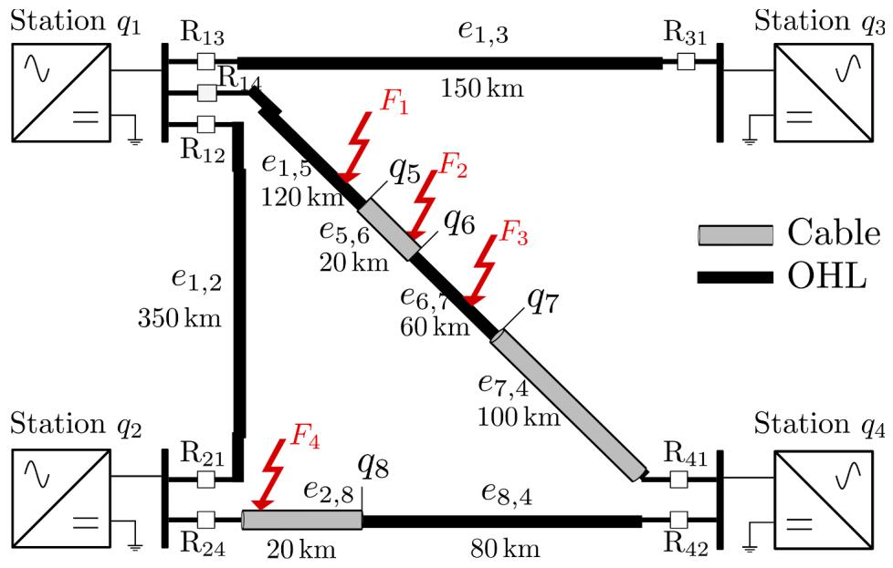  
Fig. 5. Meshed grid of four converter stations considered for the simulation tests.

$\widehat { \mathbf { p } } _ { \ell } ^ { ( n ) }$ is a satisfying estimate of the fault parameters, i.e., if it is compliant with $\mathcal { H } _ { \ell }$ regarding the geometry of the edge and if the estimate has been obtained with a sufficient level of confidence. Two tests are employed to confirm or reject the hypothesis $\mathcal { H } _ { \ell }$ that the segment $e _ { \ell }$ is faulty.

First, a validity test determines whether $\widehat { \mathbf { p } } _ { \ell } ^ { ( n ) }$ is contained in a domain of interest or not. For instance, the estimated fault distance should be less than the total length of the assumed faulty edge $e _ { \ell , \ell + 1 }$ . This domain of interest thus depends on the assumed faulty edge as well as the type of segment as. For instance, the expected fault resistance in cables are much lower than in the ones in overhead lines.

Second, an accuracy test compares the size of the confidence region of the estimated parameters with confidence level $\alpha , \mathcal { R } ^ { ( \alpha ) } ( \widehat { \mathbf { p } } _ { \ell } ^ { ( n ) } )$ to a threshold $t _ { \alpha } .$ In what follows, the $\alpha = 9 5 \%$ confidence region is considered. The confidence region is evaluated based on the Fisher information matrix, assuming the measurement noises are independent and identically distributed according to a centered normal distribution as well as other usual statistical properties, [17].

When the two tests are satisfied, the fault is presumed to potentially affect edge $e _ { \ell , \ell + 1 }$ . Otherwise, the algorithm waits until Δn additional measurements are available to update $\widehat { \mathbf { p } } _ { \ell } ^ { ( n ) }$ and $\mathcal { R } ^ { ( \alpha ) } ( \widehat { \mathbf { p } } _ { \ell } ^ { ( n ) } )$ .

After considering n measurements, several edges $e _ { \ell , \ell + 1 }$ may be deemed to be affected by a fault. Assuming there is a single fault, the algorithm determines which segment is actually faulty by considering the hypothesis with the smallest cost (30)

$$
\widehat {e} _ {\mathrm {f}} = \underset {e _ {\ell , \ell + 1}} {\arg \min } \left\{c ^ {(n)} \left(\mathbf {p}, e _ {\ell , \ell + 1}\right) | \text {f a u l t i s i d e n t i f i e d o n} e _ {\ell , \ell + 1} \right\}.
$$

If none of the considered hypotheses is confirmed, the identification algorithm stops after considering a maximum number of measurement points $n _ { \mathrm { m a x } }$ and concludes that the fault is not located on the line L. In this case, the fault may affect an other part of the grid or even be nonexistent.

# 5. Simulation results

This section presents the results of the fault identification algorithm implementing the hybrid model considering the EMT software EMTP-RV [7] to simulate the behavior of a grid affected by a fault. The test grid is described in Section 5.1. The model proposed in Section 3 is implemented in Matlab and compared against EMT simulations in Section 5.2.

Table 1 Characteristics of the MMC stations used for the EMT simulations.   

<table><tr><td>Rated power (MVA)</td><td>1000</td></tr><tr><td>DC rated voltage (kV)</td><td>320</td></tr><tr><td>Arm inductance (p.u.)</td><td>0.15</td></tr><tr><td>Capacitor energy in each submodule (kJ/MVA)</td><td>40</td></tr><tr><td>Conduction losses of each IGBT/diode (Ω)</td><td>0.001</td></tr><tr><td>Number of sub-modules per arm</td><td>400</td></tr></table>

Table 2 Equivalent parameters of the MMC stations used in the parametric model.   

<table><tr><td>Equivalent inductance (mH)</td><td>8.1</td></tr><tr><td>Equivalent resistance (Ω)</td><td>0.4</td></tr><tr><td>Equivalent capacitance (μF)</td><td>391</td></tr></table>

Illustrative examples of the fault identification approach is detailed in Section 5.3.

# 5.1. Test grid

The considered test grid is a four station meshed grid, represented in Fig. 5, implemented in the EMT software. The grid in asymmetric monopole configuration and transmission lines are composed of a single conductor. Lines $e _ { 1 , 2 }$ and $e _ { 1 , 3 }$ are overhead lines. Lines $e _ { 1 , 4 }$ and $e _ { 2 , 4 }$ are hybrid lines comprising sections of underground cables and overhead lines. Each transmission line is protected by two relays located at its extremities.

In the case of hybrid lines, short sections require, for an accurate simulation, to be able to determine the time instants of the reflection and transmission of waves. This requires considering a high sampling frequency for the simulation of the waves. Nevertheless, when evaluating the cost function, the obtained signal may be subsampled to match the current and voltage acquisition frequency. This reduces somewhat the calculation burden, even if most of the computing effort is spent in the simulation of waves. In this Section, the EMT simulation as well as the computation frequency are both set to fs = 1 MHz

The MMC stations are simulated in EMT-RV software with the average model [18] using the parameters from Table 1. An equivalent RLC model [16], whose parameters are given in Table 2, is employed to

Table 3 Underground cable characteristics for the EMT simulations.   

<table><tr><td></td><td>Core</td><td></td><td>Screen</td></tr><tr><td>Vertical distance (m)</td><td></td><td>1.33</td><td></td></tr><tr><td>Outer radius (mm)</td><td></td><td>63.9</td><td></td></tr><tr><td>Inside radius (mm)</td><td>0</td><td></td><td>56.9</td></tr><tr><td>Outside radius (mm)</td><td>32</td><td></td><td>58.2</td></tr><tr><td>Resistivity (nΩm)</td><td>17.2</td><td></td><td>28.3</td></tr></table>

Table 4 Overhead-line characteristics for the EMT simulations.   

<table><tr><td>DC resistance (mΩ/km)</td><td>24</td></tr><tr><td>Outside diameter (cm)</td><td>4.775</td></tr><tr><td>Horizontal distance (m)</td><td>5</td></tr><tr><td>Vertical height at tower (m)</td><td>30</td></tr><tr><td>Vertical height at mid-span (m)</td><td>10</td></tr><tr><td>Soil resistivity (Ωm)</td><td>100</td></tr></table>

Table 5 Transmission line distributed parameters at 1 kHz used in the parametric model.   

<table><tr><td></td><td>Underground cable</td><td>Overhead lines</td></tr><tr><td>Series resistance R (mΩ/km)</td><td>83.2</td><td>872</td></tr><tr><td>Series inductance L (mH/km)</td><td>0.129</td><td>1.84</td></tr><tr><td>Shunt capacitance C (nF/km)</td><td>241</td><td>7.68</td></tr><tr><td>Shunt conductance G (nS/km)</td><td>-0.4</td><td>0.2</td></tr></table>

compute the reflection (14) and transmission coefficients (15) in the parametric model.

The underground cables and overhead lines are simulated with the wideband model in EMTP-RV software. The characteristics of the aerial sections, see Table $^ { 4 , }$ are obtained from [19]. The characteristics of the underground sections provided in Table 3 are taken from the INELFE DC link [20]. The corresponding distributed parameters employed in the physical part of the parametric model are provided in Table 5.

The application of the method to a grid comprising DC reactors (DCR) placed at the end of each line would require the adaptation of the physical part of the model. The DCR only impacts the termination impedance and thus the value of the reflection (14) and transmission (15) coefficients. Nevertheless, as the value of the DCR is expected to be known, this would not cause any difficulty.

# 5.2. Modeling results

This section compares the accuracy of the parametric model proposed in Section 3 with EMT simulations. Faults in an underground cable section as well as in an aerial part are both investigated.

# 5.2.1. Fault in an overhead line section

Consider the fault $F _ { 1 }$ in $\mathrm { F i g . }$ 5 affecting the line between stations $q _ { 1 }$ and $q _ { 4 } ,$ on the edge $e _ { 1 , 5 }$ corresponding to an overhead line section. The fault is located at a distance $d _ { \mathrm { f } } = 1 0 0$ km from the station $q _ { 1 }$ and has a resistance $R _ { \mathrm { f } } = 5 \Omega .$ . The model of the evolution of the voltage and current at the relay $R _ { 1 4 }$ monitoring this line, located at station $q _ { 1 }$ is compared with the EMT data in Figure 6. The proposed parametric model presents a very good accuracy compared to the EMT simulations for both the current and voltage. The norm of the error in voltage and current are less than 3 kV and 40 A respectively for the considered observation window.

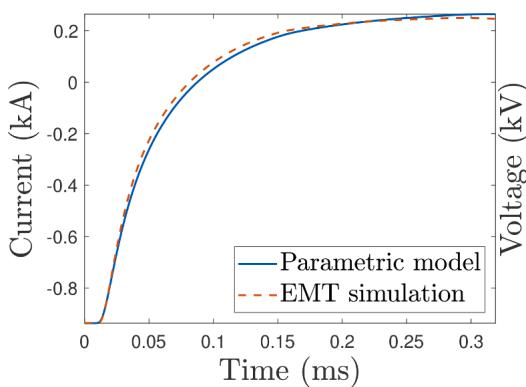

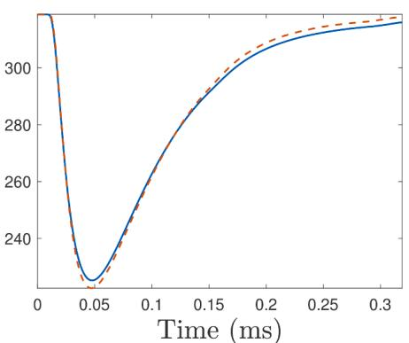  
Fig. 6. Current and voltage simulation for overhead line fault occurring at $d _ { \mathrm { f } } = 1 0 0$ km from the station $q _ { 1 } ,$ with a resistance of $R _ { \mathrm { f } } = 5 \Omega ,$ , as seen from relay $R _ { 1 4 }$ .

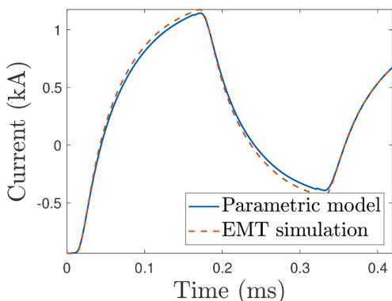

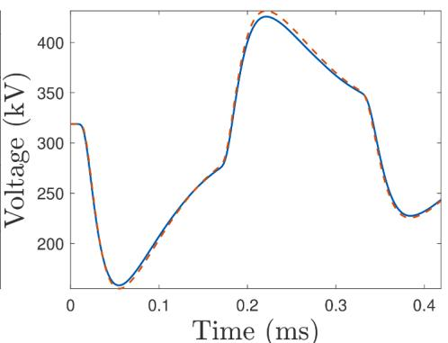  
Fig. 7. Current (left) and voltage (right) simulation for cable fault occurring at $d _ { \mathrm { f } } = 1 3 5$ km from station $^ { 1 , }$ with resistance of $R _ { \mathrm { f } } = 0 . 1 \Omega$ , as seen from relay $R _ { 1 4 }$

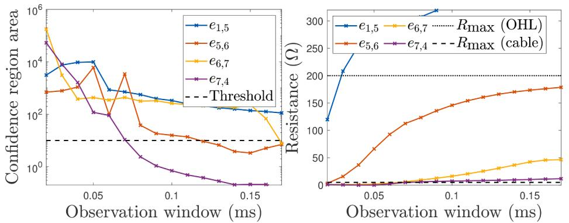  
Fig. 8. Evolution of the size of the 95% confidence ellipse (left) and value of the estimated fault resistance (right) for each hypothesis.

# 5.2.2. Fault in underground cable section

Consider the fault $F _ { 2 }$ in Fig. 5 affecting the line between stations q1 and $q _ { 4 } ,$ , on the edge $e _ { 5 , 6 }$ corresponding to an underground section. The fault is located at a distance $d _ { \mathrm { f } } = 1 5$ km from the junction $q _ { 5 }$ and has a resistance of $R _ { \mathrm { f } } = 0 . 1 \Omega .$ The obtained model of the evolution of the current and voltage at the relays $R _ { 1 4 }$ and $R _ { 4 1 }$ monitoring this line is compared with the EMT simulation result in Fig. 7. The norm of the error in voltage and current are less than 6 kV and 50 A respectively for the considered observation window. The fault located 15 km away from $q _ { 5 }$ and 5 km from $q _ { 6 }$ results in 3 significant TWs that must be taken into account in the model (the small fault resistance makes the waves reflected at the junction $q _ { 6 }$ negligible).

The model proposed in Section 3 is thus able to accurately represent the current and voltage TWs for both underground and overhead line faults.

# 5.3. Fault identification examples

This section provides illustrative examples of the fault identification algorithm introduced in Section 4. The ability of the algorithm to identify the faulty section is first detailed on an average fault case in Section 5.3.1. The behavior of the algorithm in case of an external fault is then investigated in Section 5.3.2. Finally, the specific case of a fault close to a bus-bar is considered in Section 5.3.3.

# 5.3.1. Internal fault

Consider the fault $F _ { 3 }$ in Fig. 5 affecting the line between stations $q _ { 1 }$ and $q _ { 4 }$ , on the edge $e _ { 6 , 7 }$ corresponding to an overhead section. The fault is located at $d _ { \mathrm { f } } = 5 0$ km from the node $q _ { 6 }$ and has an resistance of $R _ { \mathrm { f } } ~ =$ 70 Ω. The behavior of the fault identification approach at the relay $R _ { 1 4 }$ is analyzed. In the least-squares criterion (30) the voltage and current variances are set such that $\begin{array} { r } { \frac { \sigma _ { i } ^ { 2 } } { \sigma _ { \nu } ^ { 2 } } = 4 } \end{array}$ .

As presented in Section 4.2, four algorithms are launched in parallel

at node $q _ { 1 }$ , each corresponding to a different hypothesis relative to the faulty segment. Each algorithm operates similarly: one iteration is performed in the minimization of the cost function (30) every $\Delta n = 1 0$ available new measurements. Each algorithm may stop when the estimated fault parameters are within the domain of interest and the size of their confidence region is small enough.

The evolution of the size of the 95% confidence region for the estimated parameters for the four different hypotheses are provided in $\mathrm { F i g } ^ { \phantom { * } } .$ . 8 (left) and compared with the predetermined threshold $t _ { 9 5 } = 1 0 .$ . Three different hypotheses satisfy the accuracy test as the size of their confidence region goes below the threshold. Nevertheless, the validity test is not satisfied for the hypotheses corresponding to the faulty edges $e _ { 5 , 6 }$ and $e _ { 7 , 8 } .$ , as their estimated fault resistances are above $R _ { \mathrm { m a x } } = 5 \Omega$ Ω for the cables, see Fig. 8 (right). Considering the assumption that $e _ { 6 , 7 }$ is the faulty edge, the estimated fault parameters satisfy the validity test as the estimated resistance stays below the maximum fault resistance $R _ { \mathrm { m a x } } =$ 200 Ω for an overhead section fault.

Thus, the fault is correctly identified after 16 iterations on the edge $e _ { 6 , 7 }$ when the size of the confidence region for this hypothesis goes below the threshold, see Section 4.2. The estimated fault parameters after considering a measurement window of 160 μs are $\widehat { R } _ { \mathrm { f } } = 4 7 \Omega , \widehat { d } _ { \mathrm { f } } =$ 54 km.

Figure 9 represents the evolution with the number of iterations (and size of the observation window) of the estimated fault distance and resistance considering the hypothesis of a fault in the (actual faulty) edge e6,7. $e _ { 6 , 7 }$

The waveform of the voltage and current for the EMT simulation and parametric model with the estimated fault parameters p̂(160) $\widehat { \mathbf { p } } ^ { ( 1 6 0 ) }$ are compared in Fig. 10. The difference between the model and the EMT data is always less than 10 A for the current and 1 kV for the voltage and is mostly related to the difference between the estimated and actual fault resistance.

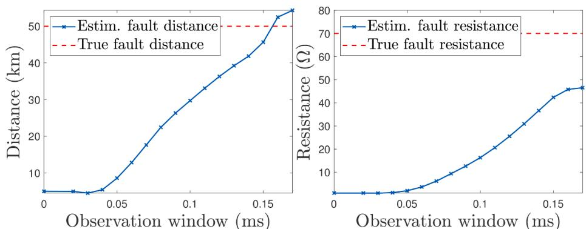  
Fig. 9. Evolution with time of the estimated fault distance (left) and resistance (right) considering the hypothesis of a fault in the edge $e _ { 6 , 7 }$ (actual faulty edge).

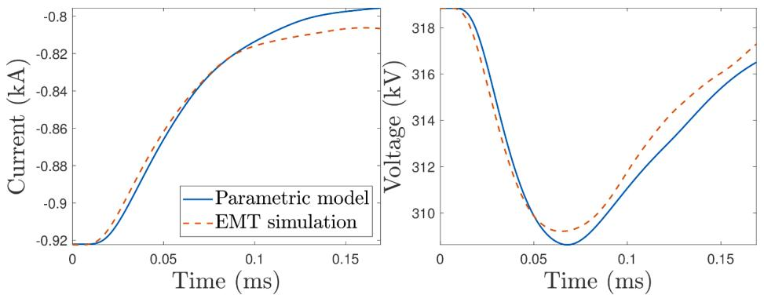  
Fig. 10. Comparison of the modeled and simulated voltage (right) and current (left) at the relay $R _ { 1 4 }$ . The fault parameters used in the parametric model are the ones obtained after 16 iterations: $\widehat { R } _ { \mathrm { f } } = 4 7 \Omega$ and $\widehat { d } _ { \mathrm { f } } = 5 4 \mathrm { k m }$ .

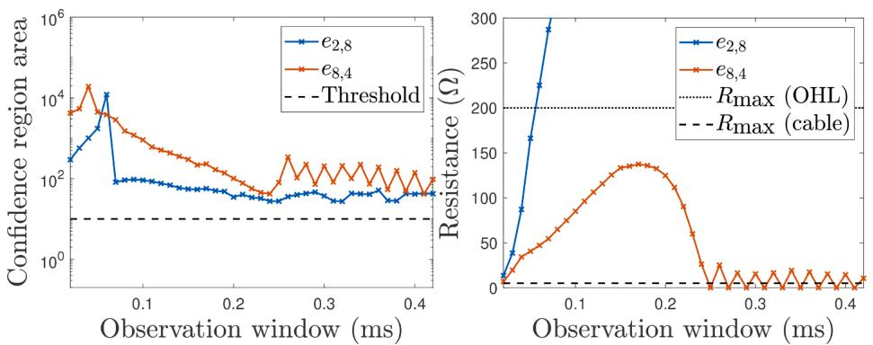  
Fig. 11. Behavior of the identification algorithm at the relay $R _ { 2 4 }$ for the fault $F _ { 3 }$ affecting line $L _ { 1 4 } .$ . Evolution of the confidence region area (left) and of the estimated fault resistance (right) for both hypotheses.

# 5.3.2. External fault

The fault $F _ { 3 }$ that affects the line $L _ { 1 4 }$ also triggers the identification algorithm at the other relays within the grid, see Fig. 5. We have verified that the fault $F _ { 3 }$ does not lead to a security failure, i.e., it is not identified as an internal fault by the relays protecting the lines $L _ { 1 2 } , L _ { 1 3 }$ , and $L _ { 2 4 }$ . The behavior of the identification algorithm at the relay $R _ { 2 4 }$ is detailed to illustrate this property.

The line $L _ { 2 4 }$ is composed of two sections, a underground part of 20 km $( e _ { 8 , 4 } )$ and an aerial part of 80 km $( e _ { 2 , 8 } )$ . Two estimation algorithms are thus launched in parallel, assuming respectively the fault is located in the underground or aerial section. The evolution of the area of the confidence region for the parameter estimate of those two hypotheses is presented in Fig. 11 (left) as well as the evolution of the estimated fault resistance (right). For both hypotheses, the confidence region area remains above the threshold. The validity test is also not satisfied for the hypothesis associated to a fault on the segment $e _ { 2 , 8 }$ as the estimated fault

resistance goes above the maximum considered fault resistance $R _ { \mathrm { m a x } } ~ =$ 200 Ω. The identification algorithm is run until a maximum observation window of 0.4 ms is reached. As none of the hypotheses satisfies the two tests, the fault is not identified on line $L _ { 2 4 }$ and is deemed to be located elsewhere in the grid.

# 5.3.3. Fault close to a bus-bar

Faults that occur close to bus-bars are particularly challenging as they generate a large number of traveling waves and may induce a high fault current. The behavior of the fault identification algorithm in case of a fault close to a bus-bar is investigated considering the fault $F _ { 4 }$ in Fig. 5 that affects the underground section $e _ { 2 , 8 }$ of line $L _ { 2 4 } ,$ , located at a distance $d _ { \mathrm { f } } = 5$ km from station 2 with an impedance of $R _ { \mathrm { f } } = 0 . 2 \Omega ,$ . The behavior of the identification algorithm at relay $R _ { 2 4 }$ which protects line $L _ { 2 4 }$ is further detailed. As in Section 5.3.2, two hypotheses are considered, corresponding to the two possible faulty segments, $e _ { 2 , 8 }$ and $e _ { 8 , 4 }$ of the

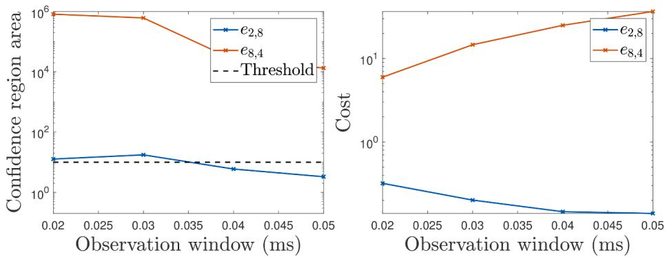  
Fig. 12. Evolution of the confidence region area (left) and value of the cost function (right) of the identification algorithm at relay $R _ { 2 4 }$ in case of the fault $F _ { 4 } .$

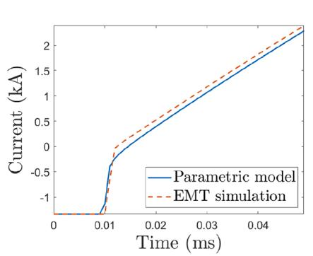

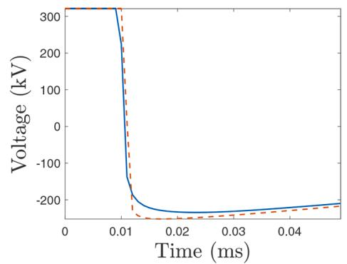  
Fig. 13. Comparison of the modeled and simulated voltage (right) and current (left) at the relay $R _ { 2 4 } .$ . The fault parameters used in the parametric model are the ones obtained after 5 iterations: $\widehat { R } _ { \mathrm { f } } = 5 \Omega$ and $\widehat { d } _ { \mathrm { f } } = 1 3 \mathrm { k m }$ .

line $L _ { 2 4 } .$ The evolution of the confidence region area and value of the cost function are displayed in Fig. 12 for both hypotheses. The algorithm stops after performing 5 iterations for each hypotheses and concludes the fault affects the underground section $e _ { 2 , 8 }$ as the confidence region for this hypotheses goes below the threshold.

The estimated fault parameters are $\widehat { d } _ { \mathrm { f } } = 1 3$ km and $\widehat { R } _ { \mathrm { f } } = 0 \Omega$ . In this situation, the measurement window required to perform the identification of the faulty segment is only 50 μs long. The output of the para metric model using the estimated fault parameters is provided in Fig. 13 and compared with the EMT simulation for the voltage and current. Despite the short measurement window employed, the mismatch between the parametric model and the EMT simulation is about 40 kV for the voltage and 200 A for the current, which represents respectively 12% and 7% of the base values.

The particularly short observation window required is especially relevant in such a case of a very close fault as it allows to initiate the fault clearing sequence quickly.

# 6. Conclusion

This paper addresses the problem of traveling wave modeling in mixed HVDC lines consisting of both overhead and underground parts. A model that describes the transient behavior of the grid is proposed for single conductor overhead lines and underground cables. The model consists in a physical part based on a simplified description of the traveling waves and in a behavioral part that accounts for the distortions of the waves. A representation of the grid and its components as a graph is considered. This allows one to formally describe the multiple traveling waves generated after the fault occurrence due to the reflections and

transmissions occurring at each junction within the grid. The obtained model depends explicitly on the grid parameters as well as on the parameters of the fault such as the fault distance and resistance.

When a fault is suspected, the model can be employed for the identification and localization of the faulty segment of the line based on the estimation of the fault parameters.

# CRediT authorship contribution statement

P. Verrax: Methodology, Software, Writing – original draft, Visualization. N. Alglave: Methodology, Software, Writing – original draft, Visualization. A. Bertinato: Conceptualization, Methodology, Writing – review & editing, Supervision. M. Kieffer: Conceptualization, Methodology, Writing – review & editing, Supervision. B. Raison: Conceptualization, Methodology, Writing – review & editing, Supervision.

# Declaration of Competing Interest

The authors declare that they have no known competing financial interests or personal relationships that could have appeared to influence the work reported in this paper.

# Acknowledgment

This work was carried out at the SuperGrid Institute, an institute for the energetic transition (ITE). It is supported by the French government under the frame of “Investissements d’ avenir” program with grant reference number ANE-ITE-002-01.

# Appendix A. Computation of the partial derivatives

In this section the computation of the partial derivatives of the voltage with respect to the fault distance and fault resistance are established in a general case. The obtained expressions can be employed in place of a finite difference approach for gradient evaluations to reduce the computational burden of the parameter estimation algorithm introduced in Section 4.1.

A fault is assumed to occur on an edge e between nodes q and qℓ within a grid. The two edges connected to the fault node q are denoted as $e _ { \mathrm { f } , k }$ and $e _ { \mathrm { f } , \ell }$ and are of lengths $d _ { \mathrm { f } , k }$ and $d _ { \mathrm { f } , \ell } .$ , respectively. Assuming, without loss of generality, that $k < \ell ,$ , according to the fault distance convention $1 \colon d _ { \mathrm { f } } = d _ { \mathrm { f } , k } .$ . The computations are detailed for a wave traveling though a path $\pi = ( q _ { n _ { 1 } } , \cdots , q _ { n _ { m } } )$ where $q _ { n _ { i } } \in \mathcal { Q } _ { \mathrm { f } } , i = 1 , \cdots ,$ m and $q _ { n _ { 1 } } = q _ { \mathrm { f } }$ .

# A1. Partial derivative with respect to the fault distance

According to (22) and (26), the model of the voltage observed at node $q _ { n _ { m } }$ resulting from a wave that traveled through the path π can be expressed in the times domain as

$$
\left. \nu_ {\pi} ^ {m} (\mathbf {p}, k) = \nu_ {\pi , j} \left(R _ {f}, \left(k - f _ {s} \tau \left(d _ {f}\right)\right)\right) \otimes h _ {\pi} \left(d _ {f}, k\right), \right.
$$

where τ corresponds to the total propagation time through the path π. The delay τ only depends on the fault distance df.

The derivative with respect to the fault distance $d _ { \mathrm { f } }$ is then given by (A.1).

$$
\begin{array}{l} \frac {\partial v _ {\pi} ^ {m} (\mathbf {p} , k)}{\partial d _ {f}} = v _ {\pi , j} \left(R _ {f}, k - f _ {s} \tau \left(d _ {f}\right)\right) \otimes \frac {\partial \left[ h _ {\pi} \left(d _ {f} , k\right) \right]}{\partial d _ {f}} \\ + h _ {\pi} \left(d _ {f}, k\right) \otimes \frac {\partial \left[ v _ {\pi , j} \left(R _ {f} , k - f _ {s} \tau \left(d _ {f}\right)\right) \right]}{\partial d _ {f}} (A.1) \\ = v _ {\pi , \mathrm {j}} \left(R _ {\mathrm {f}}, k - f _ {\mathrm {s}} \tau \left(d _ {\mathrm {f}}\right)\right) \otimes \frac {\partial \left[ h _ {\pi} \left(d _ {\mathrm {f}} , k\right) \right]}{\partial d _ {\mathrm {f}}} (A.1.1) \\ - h _ {\pi} \left(d _ {f}, k\right) \otimes f _ {s} \frac {\partial \tau}{\partial d _ {f}} \frac {\partial \left[ v _ {\pi , j} \left(R _ {f} , k - f _ {s} \tau \left(d _ {f}\right)\right) \right]}{\partial \left(k - f _ {s} \tau \left(d _ {f}\right)\right)}. \\ \end{array}
$$

The delay τ due to the propagation along the path π can be expended as

$$
\tau \left(d _ {i}\right) = \sum_ {\substack {i \\ q n _ {i} \neq q _ {f} \\ q n _ {i + 1} \neq q _ {i}}} \tau_ {e _ {n _ {i}, n _ {i + 1}}} + \sum_ {\substack {i \\ e _ {n _ {i}, n _ {i + 1}} = e _ {f, k}}} \tau_ {e _ {n _ {i}, n _ {i + 1}}} + \sum_ {\substack {i \\ e _ {n _ {i}, n _ {i + 1}} = e _ {f, e}}} \tau_ {e _ {n _ {i}, n _ {i + 1}}}, \tag{A.2}
$$

where we have isolated the delays due to propagation along the edges $e _ { \mathrm { f } , k }$ and $e _ { \mathrm { f } , \ell } .$ Introducing $m _ { \mathrm { f } , k }$ and $m _ { \mathrm { f } , \ell }$ as the number of times the wave traveled through the two edges connected to the fault $e _ { \mathrm { f } , k }$ and $e _ { \mathrm { f } , \ell } ,$ one gets

$$
\tau (d_{\mathrm{f}}) = \sum_{\substack{i\\ q_{n_{i}}\neq q_{\mathrm{f}}\\ q_{n_{i + 1}}\neq q_{\mathrm{f}}}}\tau_{e_{n_{i},n_{i + 1}}} + m_{\mathrm{f},k}\frac{d_{\mathrm{f}}}{c_{e_{\mathrm{f}}}} +m_{\mathrm{f},\ell}\frac{d_{e_{\mathrm{f}}} - d_{\mathrm{f}}}{c_{e_{\mathrm{f}}}}
$$

The first sum correspond to propagation times along edges not connected to the faulty node. Hence, assuming the propagation speed does not depend on the fault distance

$$
\frac {\partial \tau}{\partial d _ {\mathrm {f}}} = \frac {m _ {\mathrm {f} , k} - m _ {\mathrm {f} , \ell}}{c _ {e _ {\mathrm {f}}}}. \tag {A.3}
$$

Consider now the finite impulse response filter $h _ { \pi }$ that represents the total distortion along the considered path π. The filter is expressed in the frequency domain in (A.4), where the same decomposition as in (A.2) has been performed,

$$
\begin{array}{l} H _ {\pi} \left(d _ {f}, \omega\right) = \prod_ {i = 1} ^ {} H _ {\left(q _ {n _ {i}}, q _ {n _ {i + 1}}\right)} (\omega) \times \prod_ {i = 1} ^ {} H _ {\left(q _ {n _ {i}}, q _ {n _ {i + 1}}\right)} \left(d _ {f}, \omega\right) (A.4) \\ \prod_ {\substack {i = 1 \\ \times \left(q _ {n _ {i}}, q _ {n _ {i + 1}}\right) = e _ {\mathrm {f}, \ell}}} H _ {\left(q _ {n _ {i}}, q _ {n _ {i + 1}}\right)} \left(d _ {\mathrm {f}}, \omega\right) \\ = \prod_ {\substack {i = 1 \\ q _ {n _ {i}} \neq q _ {\mathrm {f}} \\ q _ {n _ {i + 1}}, \neq q _ {\mathrm {f}}}} H _ {\left(q _ {n _ {i}}, q _ {n _ {i + 1}}\right)} (\omega) \times H _ {\mathrm {e f}, k} ^ {m _ {\mathrm {f}, k}} \left(d _ {\mathrm {f}}, \omega\right) \times H _ {\mathrm {e f}, \ell} ^ {m _ {\mathrm {f}, \ell}} \left(d _ {\mathrm {f}}, \omega\right). (A.5) \\ \end{array}
$$

Taking the derivative with respect to the fault distance, and omitting the dependency in ω, one gets (A.6)

$$
\begin{array}{l} \frac {\partial H _ {\pi} \left(d _ {\mathrm {f}} , \omega\right)}{\partial d _ {\mathrm {f}}} = \prod_ {i = 1} H _ {\left(q _ {n _ {i}}, q _ {n _ {i + 1}}\right)} \left[ m _ {\mathrm {f}, k} H _ {e _ {\mathrm {f}, \ell}} ^ {m _ {\mathrm {f}, \ell}} H _ {e _ {\mathrm {f}, \ell}} ^ {m _ {\mathrm {f}, k - 1}} \frac {\partial H _ {e _ {\mathrm {f} , k}}}{\partial d _ {\mathrm {f}}} + m _ {\mathrm {f}, \ell} H _ {e _ {\mathrm {f}, \ell}} ^ {m _ {\mathrm {f}, \ell - 1}} H _ {e _ {\mathrm {f}, k}} ^ {m _ {\mathrm {f}, k}} \frac {\partial H _ {e _ {\mathrm {f} , \ell}}}{\partial d _ {\mathrm {f}}} \right] \\ \begin{array}{l} q _ {n _ {i}} \neq q _ {\mathrm {f}} \\ q _ {n _ {i + 1}} \neq q _ {\mathrm {f}} \end{array} \\ = \underbrace {\prod_ {i = 1 q n _ {i} \neq q _ {t} q _ {n _ {i + 1}} \neq q _ {\mathrm {f}}} H _ {\left(q _ {n _ {i}}, q _ {n _ {i + 1}}\right)} H _ {\mathrm {e} _ {\mathrm {f}, k}} ^ {m _ {\mathrm {f}, k}} H _ {\mathrm {e} _ {\mathrm {f}, k}} ^ {m _ {\mathrm {f}, \ell}} {} _ {H _ {\mathrm {f}, \ell}} \left[ m _ {\mathrm {e} _ {\mathrm {f}, k}} H _ {\mathrm {e} _ {\mathrm {f}, k}} ^ {- 1} \frac {\partial H _ {\mathrm {e} _ {\mathrm {f} , k}}}{\partial d _ {\mathrm {f}}} + m _ {\mathrm {e} _ {\mathrm {f}, \ell}} H _ {\mathrm {e} _ {\mathrm {f}, \ell}} ^ {- 1} \frac {\partial H _ {\mathrm {e} _ {\mathrm {f} , \ell}}}{\partial d _ {\mathrm {f}}} \right]} \tag {A.6} \\ \end{array}
$$

Moreover, we assume that a wave that travels successively through $e _ { \mathrm { f } , k }$ and $e _ { \mathrm { f } , \ell }$ is prone to the same distortion as a wave that travels through $e _ { \mathrm { f } } , i e _ { \ast }$

$$
H _ {e _ {\mathrm {f}, \varepsilon}} \left(d _ {\mathrm {f}}, \omega\right) H _ {e _ {\mathrm {f}, \varepsilon}} \left(d _ {\mathrm {f}}, \omega\right) = H _ {e _ {\mathrm {f}}} (\omega)
$$

Where $H _ { e _ { \mathrm { f } } }$ does not depend on the fault distance. Hence,

$$
\frac {\partial H _ {e _ {f , \ell}} \left(d _ {f} , \omega\right)}{\partial d _ {f}} = - \frac {\partial H _ {e _ {f , k}} \left(d _ {f} , \omega\right)}{\partial d _ {f}} \frac {H _ {e _ {f}} (\omega)}{H _ {e _ {f , k}} \left(d _ {f} , \omega\right) ^ {2}}
$$

The expression of ∂Hπ (df,ω) $\frac { \partial H _ { \pi } ( { d _ { \mathrm { f } } } , \omega ) } { \partial d _ { \mathrm { f } } }$ can thus be further simplified ∂df

$$
\begin{array}{l} \frac {\partial H _ {\pi} \left(d _ {f} , \omega\right)}{\partial d _ {f}} = H _ {\pi} \left[ m _ {e _ {f, k}} H _ {e _ {f, k}} ^ {- 1} \frac {\partial H _ {e _ {f , k}}}{\partial d _ {f}} + m _ {e _ {i, \ell}} H _ {e _ {i, \ell}} ^ {- 1} \frac {\partial H _ {e _ {i , \ell}}}{\partial d _ {f}} \right] \\ = H _ {\pi} \left[ m _ {e _ {f, k}} H _ {e _ {f, k}} ^ {- 1} \frac {\partial H _ {e _ {f , k}}}{\partial d _ {\mathrm {f}}} - \frac {m _ {e _ {f , \ell}} H _ {e _ {\ell}}}{H _ {e _ {f , \ell}} H _ {e _ {f , k}} ^ {2}} \frac {\partial H _ {e _ {f , k}}}{\partial d _ {\mathrm {f}}} \right] \\ = H _ {\pi} \left[ m _ {e _ {f, k}} H _ {e _ {f, k}} ^ {- 1} \frac {\partial H _ {e _ {f , k}}}{\partial d _ {\mathrm {f}}} - m _ {e _ {f, r}} H _ {e _ {f, k}} ^ {- 1} \frac {\partial H _ {e _ {f , k}}}{\partial d _ {\mathrm {f}}} \right] \\ = H _ {\pi} H _ {e _ {f, k}} ^ {- 1} \frac {\partial H _ {e _ {f , k}}}{\partial d _ {f}} \left[ m _ {e _ {f, k}} - m _ {e _ {f, \ell}} \right]. \\ \end{array}
$$

Taking the inverse Fourier transform

$$
\frac {\partial h _ {\pi} \left(d _ {\mathrm {f}} , k\right)}{\partial d _ {\mathrm {f}}} = \left[ m _ {e _ {\mathrm {f}, k}} - m _ {e _ {\mathrm {f}, \ell}} \right] \mathcal {F} ^ {- 1} \left\{\frac {H _ {\pi} \left(d _ {\mathrm {f}} , \omega\right)}{H _ {e _ {\mathrm {f}, k}}} \frac {\partial H _ {e _ {\mathrm {f}, k}}}{\partial d _ {\mathrm {f}}} \right\} \tag {A.7}
$$

The derivative of the impulse response $H _ { e _ { \mathrm { f } , k } } = \mathcal { F } ( h _ { e _ { \mathrm { f } , k } } )$ ) can be obtained from (24)

$$
h _ {e} (k) = f _ {\mathrm {s}} \cdot \left(u _ {d, \rho} \left(d _ {\mathrm {f}}, k + 1\right) - u _ {d, \rho} \left(d _ {\mathrm {f}}, k\right)\right)
$$

and the linear interpolation (23),

$$
u _ {d, \rho} (d _ {\mathrm {f}}, k) = \frac {u _ {d _ {2} , \rho} (k) - u _ {d _ {1} , \rho} (k)}{(d _ {2} - d _ {1})} (d _ {\mathrm {f}} - d _ {1}) + u _ {d _ {1}, \rho} (k)
$$

where $d _ { 1 } < d _ { \mathrm { f } } < d _ { 2 } .$ . Hence,

$$
\frac {\partial u _ {d , \rho} (k)}{\partial d _ {\mathrm {f}}} = \frac {u _ {d _ {2} , \rho} (k) - u _ {d _ {1} , \rho} (k)}{(d _ {2} - d _ {1})}.
$$

The last derivative to compute in (A.1) is

$$
\left. \frac {\partial v _ {\pi \mathrm {j}} \left(R _ {\mathrm {f}} , k - f _ {\mathrm {s}} \tau \left(d _ {\mathrm {f}}\right)\right)}{\partial \left(k - f _ {\mathrm {s}} \tau \left(d _ {\mathrm {f}}\right)\right)} = \frac {\partial v _ {\pi \mathrm {j}} \left(R _ {\mathrm {f}} , k ^ {\prime}\right)}{\partial k ^ {\prime}} \right| _ {k ^ {\prime} = k - f _ {\mathrm {s}} \tau},
$$

which may be approximated by the finite difference

$$
\frac {\partial v _ {\pi , \mathrm {j}} \left(R _ {\mathrm {f}} , k ^ {\prime}\right)}{\partial k ^ {\prime}} \simeq \left(v _ {\pi , \mathrm {j}} \left(R _ {\mathrm {f}}, k ^ {\prime} + 1\right) - v _ {\pi , \mathrm {j}} \left(R _ {\mathrm {f}}, k ^ {\prime}\right)\right). \tag {A.8}
$$

The final voltage derivative (A.9) is obtained combining (A.3), (A.7) and (A.8),

$$
\frac {\partial v _ {\pi} ^ {m} (\mathbf {p} , k)}{\partial d _ {f}} = v _ {\pi , j} \left(R _ {f}, k - f _ {s} \tau \left(d _ {f}\right)\right) \otimes \frac {\partial \left[ h _ {\pi} \left(d _ {f} , k\right) \right]}{\partial d _ {f}} \tag {A.9}
$$

$$
- f _ {\mathrm {s}} \frac {\partial \tau}{\partial d _ {\mathrm {f}}} h _ {\pi} \left(d _ {\mathrm {f}}, k\right) \otimes \frac {\partial \left[ v _ {\pi , \mathrm {j}} \left(R _ {\mathrm {f}} , k - f _ {\mathrm {s}} \tau \left(d _ {\mathrm {f}}\right)\right) \right]}{\partial \left(k - f _ {\mathrm {s}} \tau \left(d _ {\mathrm {f}}\right)\right)}. \tag {A.10}
$$

The evaluation of (A.3) is simple as it only requires counting how many times the wave traveled through the edges connected to the fault. Similarly, (A.8) involves a discrete differentiation. The computation of (A.7) is more demanding but still relatively efficient as hπ is already available from the computations of the voltage. This approach thus leads to a direct evaluation of the derivative with respect to the fault distance more effective than a finite difference approach.

# A2. Partial derivative with respect to the fault resistance

The parametric model (22), (26) depends on the fault resistance $R _ { \mathrm { f } }$ only through the interactions at the fault location, appearing in the reflection and transmission coefficients (14) and (15). Furthermore, in the loss–less transmission line model, the surge impedance is a real number. Since the fault impedance is considered as purely resistive, the reflection and transmission coefficients at the fault location are thus also real numbers.

The part of the model that computes the reflection and transmission at the different interfaces $V _ { \pi , \mathrm { j } } ( R _ { \mathrm { f } } , s )$ is

$$
V _ {\pi , \mathrm {j}} \left(R _ {\mathrm {f}}, s\right) = \prod_ {i = 1} ^ {n} J _ {e _ {n _ {i - 1}, n _ {i}} \rightarrow q _ {n _ {i}}} \left(s, R _ {\mathrm {f}}\right) \frac {\exp (- t _ {\mathrm {f}} s)}{s} V _ {\mathrm {b f}}
$$

where the first term accounts for the initial surge at the fault location $J _ { e _ { n _ { 0 } , n _ { 1 } } \to q _ { n _ { 1 } } } \ = K _ { q _ { n _ { 1 } } , q _ { n _ { 2 } } ,  q _ { \mathrm { f } } }$ . One can separate the reflections and transmissions at the

fault location, which involves the fault resistance, and the interactions at the other junctions

$$
\begin{array}{l} V_{\pi ,\mathbf{j}}\big(R_{\mathbf{f}},s\big) = e^{-st_{\mathbf{f}}}V_{\mathrm{bf}}K_{q_{n_{1}}\cdot q_{n_{2}},\stackrel {\leftarrow}{\circ}q_{\mathbf{f}}}\big(R_{\mathbf{f}}\big)\prod_{\substack{i\\ q^{i}\neq q_{\mathbf{f}}}}J_{e_{n_{i - 1},n_{i}}\to q_{n_{i}}} \\ \times \prod_{\substack{i = 1\\ q_{n_{i - 1}} = q_{i}\\ q_{n_{i + 1}} = q_{n_{i - 1}}}}\underbraceJ_{e_{n_{i - 1},n_{i}}\to q_{n_{i}}}{}_{= K_{q_{n_{1}},q_{n_{2}},\circ q_{\mathrm{f}}}}\times \prod_{\substack{i = 1\\ q_{n_{i}} = q_{i}\\ q_{n_{i + 1}}\neq q_{n_{i - 1}}}}\underbraceJ_{e_{n_{i - 1},n_{i}}\to q_{n_{i}}}{}_{= T_{q_{n_{1}},q_{n_{2}},\circ q_{\mathrm{f}}}}. \\ \end{array}
$$

The reflection and transmission coefficients at the fault location are noted $K _ { \mathrm { f } }$ and $T _ { \mathrm { f } }$ to lighten notations. Consider the numbers $m _ { \mathrm { K _ { f } } }$ and $m _ { T _ { \mathrm { T _ { f } } } }$ of the reflections and transmissions at the fault location. Hence,

$$
V_{\pi ,\mathbf{j}}\left(R_{\mathbf{f}},s\right) = e^{-st_{\mathbf{f}}}V_{\mathrm{bf}}K_{\mathbf{f}}^{1 + m_{K_{\mathbf{f}}}}\left(R_{\mathbf{f}}\right)T_{\mathbf{f}}^{m_{T_{\mathbf{f}}}}\left(R_{\mathbf{f}}\right)\prod_{\substack{i\\ q_{n_{i}}\neq q_{\mathbf{f}}}}J_{e_{n_{i - 1},n_{i}}\to q_{n_{i}}}.
$$

The derivative with respect to the fault resistance is detailed in (A.11)

$$
\begin{array}{l} \frac{\partial V_{\pi,j}\left(R_{\mathrm{f}},s\right)}{\partial R_{\mathrm{f}}} = \exp \bigl( - s t_{\mathrm{f}}\bigr)V_{\mathrm{bf}}\prod_{i}J_{e_{n_{i - 1},n_{i}}\to q_{n_{i}}}\\ q^{i}\neq q_{\mathrm{f}} \\ \times \left[\left(1 + m _ {K _ {\mathrm {f}}}\right) K _ {\mathrm {f}} ^ {m _ {K _ {\mathrm {f}}}} \frac {\partial K _ {e _ {\ell \rightarrow f}}}{\partial R _ {\mathrm {f}}} \times T _ {\mathrm {f}} ^ {m _ {T _ {\mathrm {f}}}} + m _ {T _ {\mathrm {f}}} T _ {\mathrm {f}} ^ {m _ {K _ {\mathrm {f}}} - 1} \frac {\partial T _ {e _ {\ell \rightarrow f}}}{\partial R _ {\mathrm {f}}} \times K _ {\mathrm {f}} ^ {1 + m _ {T _ {\mathrm {f}}}} \right] \\ = \underbrace {\exp \left(- s t _ {\mathrm {f}}\right) V _ {\mathrm {b f}} * \prod_ {i q ^ {i} \neq q _ {\mathrm {f}}} J _ {e n _ {i - 1} , n _ {i} \rightarrow q m _ {i}} \times K _ {\mathrm {f}} ^ {1 + m K _ {\mathrm {f}}} \times T _ {\mathrm {f}} ^ {m T _ {\mathrm {f}}}} _ {= V _ {\pi , \mathrm {j}} \left(R _ {\mathrm {f}}, s\right)} \\ \times \left[ \left(1 + m _ {K _ {\mathrm {f}}}\right) K _ {\mathrm {f}} ^ {- 1} \frac {\partial K _ {\mathrm {f}}}{\partial R _ {\mathrm {f}}} + m _ {T _ {\mathrm {f}}} T _ {\mathrm {f}} ^ {- 1} \frac {\partial T _ {\mathrm {f}}}{\partial R _ {\mathrm {f}}} \right]. \tag {A.11} \\ \end{array}
$$

Hence, one gets

$$
\frac {\partial V _ {\pi , \mathrm {j}} \left(R _ {\mathrm {f}} , s\right)}{\partial R _ {\mathrm {f}}} = V _ {\pi , \mathrm {j}} \left(R _ {\mathrm {f}}, s\right) \left[ \left(1 + m _ {K _ {\mathrm {f}}}\right) K _ {\mathrm {f}} ^ {- 1} \frac {\partial K _ {\mathrm {f}}}{\partial R _ {\mathrm {f}}} + m _ {T _ {\mathrm {f}}} T _ {\mathrm {f}} ^ {- 1} \frac {\partial T _ {\mathrm {f}}}{\partial R _ {\mathrm {f}}} \right]
$$

The reflection and transmission at the fault location are

$$
\begin{array}{l} K _ {\mathrm {f}} = \frac {R _ {\mathrm {f}}}{0 . 5 Z _ {\mathrm {s} , e f} + R _ {\mathrm {f}}} \\ T _ {\mathrm {f}} = \frac {- Z _ {\mathrm {s} , e \mathrm {f}}}{Z _ {\mathrm {s} , e \mathrm {f}} + 2 R _ {\mathrm {f}}} \\ \end{array}
$$

whose derivatives are

$$
\frac {\partial T _ {\mathrm {f}}}{\partial R _ {\mathrm {f}}} = \frac {0 . 5 Z _ {e _ {\mathrm {f}}}}{\left(0 . 5 Z _ {e _ {\mathrm {f}}} + R _ {\mathrm {f}}\right) ^ {2}} = \frac {K _ {\mathrm {f}} T _ {\mathrm {f}}}{R _ {\mathrm {f}}}
$$

$$
\frac {\partial K _ {\mathrm {f}}}{\partial R _ {\mathrm {f}}} = \frac {\partial (T _ {\mathrm {f}} - 1)}{\partial R _ {\mathrm {f}}} = \frac {\partial T _ {\mathrm {f}}}{\partial R _ {\mathrm {f}}}
$$

Hence the previous expressions can be even further simplified

$$
\frac {\partial V _ {\pi , \mathrm {j}} \left(R _ {\mathrm {f}} , s\right)}{\partial R _ {\mathrm {f}}} = V _ {\pi , \mathrm {j}} \left(R _ {\mathrm {f}}, s\right) \frac {\left[ \left(1 + m _ {K _ {\mathrm {f}}}\right) T _ {\mathrm {f}} + m _ {T _ {\mathrm {f}}} K _ {\mathrm {f}} \right]}{R _ {\mathrm {f}}}.
$$

The voltage derivative with respect to the fault resistance hence amounts to a multiplication by a real coefficient of the voltage expression. Thus the same coefficient can be applied in time domain, i.e.,

$$
\frac {\partial v _ {\pi} ^ {m} (\mathbf {p} , t _ {k})}{\partial R _ {f}} = v _ {\pi} ^ {m} (\mathbf {p}, t _ {k}) \frac {\left[ \left(1 + m _ {K _ {f}}\right) T _ {f} + m _ {T _ {f}} K _ {f} \right]}{R _ {f}}. \tag {A.12}
$$

# References

[1] A. Kalair, N. Abas, N. Khan, Comparative study of HVAC and HVDC transmission systems, Renew. Sustain. Energy Rev. 59 (2016) 1653–1675, https://doi.org/ 10.1016/j.rser.2015.12.288.   
[2] O. Vestergaard, P. Lundberg, Maritime link the first bipolar VSC HVDC with overhead line. 2019 AEIT HVDC International Conference, AEIT HVDC 2019, 2019, pp. 2–5, https://doi.org/10.1109/AEIT-HVDC.2019.8740513.   
[3] L. Reed, M. Granger Morgan, P. Vaishnav, D.E. Armanios, Converting existing transmission corridors to HVDC is an overlooked option for increasing transmission capacity, Proc. Natl. Acad. Sci. U.S.A. 116 (28) (2019) 13879–13884, https://doi. org/10.1073/pnas.1905656116.   
[4] D.P. Schlachtberger, T. Brown, S. Schramm, M. Greiner, The Benefits of Cooperation in a Highly Renewable European Electricity Network, Energy 134 (2017) 469–481.   
[5] E. Pierri, O. Binder, N.G. Hemdan, M. Kurrat, Challenges and opportunities for a European HVDC grid, Renew. Sustain. Energy Rev. 70 (2017) 427–456, https:// doi.org/10.1016/j.rser.2016.11.233.   
[6] P. Tünnerhoff, C. Brantl, R. Puffer, Impacts of the mixed usage of cables and overhead lines on selective fault detection methods in multi-terminal HVDC grids. Proc. CIGRE International Symposium: Going Offshore - Challenges of the Future Power Grids, Aalborg, 2019, pp. 1–9.   
[7] J. Mahseredjian, S. Denneti`ere, L. Dub´e, B. Khodabakhchian, L. G´erin-Lajoie, On a new approach for the simulation of transients in power systems, Electr. Power Syst. Res. 77 (11) (2007) 1514–1520.   
[8] D. Tzelepis, G. Fusiek, A. Dysko, P. Niewczas, C. Booth, X. Dong, Novel fault location in MTDC grids with non-homogeneous transmission lines utilizing distributed current sensing technology, IEEE Trans. Smart Grid 9 (5) (2018) 5432–5443, https://doi.org/10.1109/TSG.2017.2764025.   
[9] H. Livani, C.Y. Evrenosoglu, A machine learning and wavelet-based fault location method for hybrid transmission lines, IEEE Trans. Smart Grid 5 (1) (2014) 51–59, https://doi.org/10.1109/TSG.2013.2260421.   
[10] P.T. Lewis, B.M. Grainger, H.A. Al Hassan, A. Barchowsky, G.F. Reed, Fault section identification protection algorithm for modular multilevel converter-based high

voltage dc with a hybrid transmission corridor, IEEE Trans. Ind. Electron. 63 (9) (2016) 5652–5662, https://doi.org/10.1109/TIE.2016.2582458.   
[11] E.J.S. Leite, F.V. Lopes, F.B. Costa, W.L.A. Neves, Closed-form solution for traveling wave-based fault location on non-homogeneous lines, IEEE Trans. Power Deliv. 34 (3) (2019) 1138–1150, https://doi.org/10.1109/TPWRD.2019.2900674.   
[12] A. Burek, P. Balcerek, H. Bjorklund, J. Rezmer, T. Sikorski, New single ended fault locator for HVDC lines. Proc. IEEE International Conference on Environment and Electrical Engineering and 2018 IEEE Industrial and Commercial Power Systems Europe, EEEIC/I and CPS Europe, IEEE, 2018, pp. 1–6, https://doi.org/10.1109/ EEEIC.2018.8493737.   
[13] P. Tünnerhoff, M. Stumpe, A. Schnettler, Fault analysis of HVDC systems with partial underground cabling. Proc. 13th IET International Conference on AC and DC Power Transmission (ACDC 2017), 2017, pp. 1–6, https://doi.org/10.1049/ cp.2017.0019.   
[14] P. Verrax, A. Bertinato, M. Kieffer, B. Raison, Transient-based fault identification algorithm using parametric models for meshed HVDC grids, Electr. Power Syst. Res. 185 (April) (2020), https://doi.org/10.1016/j.epsr.2020.106387.   
[15] M. Wang, J. Beerten, D. Van Hertem, Frequency domain based DC fault analysis for bipolar HVDC grids, J. Mod. Power Syst. Clean Energy 5 (4) (2017) 548–559, https://doi.org/10.1007/s40565-017-0307-y.   
[16] W. Leterme, D. Van Hertem, Reduced modular multilevel converter model to evaluate fault transients in DC grids. Proc. 12th IET International Conference on Developments in Power System Protection (DPSP), Copenhagen, 2014, https://doi. org/10.1049/cp.2014.0107.   
[17] E. Walter, L. Pronzato, Identification of Parametric Models from Experimental Data, Springer-Verlag London, 1997.   
[18] H. Saad, S. Dennetiere, J. Mahseredjian, P. Delarue, X. Guillaud, J. Peralta, S. Nguefeu, Modular multilevel converter models for electromagnetic transients, IEEE Trans. Power Deliv. 29 (3) (2014) 1481–1489, https://doi.org/10.1109/ TPWRD.2013.2285633.   
[19] CIGRE WG B2/B4/C1.17, Impacts of HVDC Lines in the Economics of HVDC Projects. Technical Report, CIGRE, 2009.   
[20] G. Auran. Full selective protection strategy for multi-terminal cable HVDC grids based on HB-MMC converters, Universit´e Grenoble Alpes, 2017. Phd thesis.