Received 1 November 2023; accepted 26 November 2023. Date of publication 30 November 2023; date of current version 4 January 2024. The review of this paper was arranged by Associate Editor Jennifer Bauman.

Digital Object Identifier 10.1109/OJPEL.2023.3337888

# Numerically Efficient Average-Value Model for Voltage-Source Converters in Nodal-Based Programs

SEYYEDMILAD EBRAHIMI (Member, IEEE), TALEB VAHABZADEH (Graduate Student Member, IEEE), AND JURI JATSKEVICH (Fellow, IEEE)

Electrical and Computer Engineering Department, The University of British Columbia, Vancouver, BC V6T 1Z4, Canada

CORRESPONDING AUTHOR: SEYYEDMILAD EBRAHIMI (e-mail: ebrahimi@ece.ubc.ca.)

This work was supported by the Natural Science and Engineering Research Council (NSERC) of Canada under the Collaborative Research and Development Grant.

ABSTRACT Discrete detailed models of high-frequency switching voltage source converters (VSCs) are accurate but computationally expensive in simulations of large power-electronics-based systems. For fast/efficient studies, the average-value models (AVMs) of VSCs have proven indispensable, which conventionally utilize controlled voltage/current sources to interface with external circuits. In nodal-analysis-based electromagnetic transient (EMT) simulation programs with a non-iterative solution, the interfacing variables are computed based on the values of input voltages/currents calculated at the previous time step. This delay may cause numerical inaccuracy and/or instability at large simulation time steps. Recently, a so-called directly-interfaced AVM (DI-AVM) has been developed for VSCs that avoids this delay. In this article, the formulation of the DI-AVM is generalized for an arbitrary configuration of the interfacing nodes. This is done by formulating the extended equivalent conductance matrix for the VSC AVM, assuming all nodes are floating. The generalized conductance matrix is then merged into the overall network nodal equation. The extended DI-AVM is verified in PSCAD/EMTDC against the traditional dependent-source-based AVMs under both balanced and unbalanced conditions and is demonstrated to outperform the conventional AVMs in terms of numerical accuracy at large time steps.

INDEX TERMS Average-value model (AVM), conductance matrix, interfacing, nodal, numerical, PSCAD/EMTDC, simulation, voltage source converters (VSCs).

# I. INTRODUCTION

Voltage-source converters (VSCs) possess various advantageous properties, including (but not limited to) independent control of active and reactive power [1], low harmonic distortions, etc. As a result, VSCs are dominantly utilized in many power-electronics-based applications, e.g., wind energy conversion systems, FACTS devices, HVDC light systems [2], modern vehicular, marine, aircraft systems, etc.

Design, study, and analysis of such systems rely on many electromagnetic transient (EMT) simulations [3] that are conducted offline and/or in real-time, e.g., for stability analysis [4], dynamic design/tuning of controllers, etc. In such studies, it is desirable to use time steps as large as possible for simulations to conduct the studies in a shorter amount of time

and/or to be able to simulate more extensive networks on a given computational hardware [5], [6].

Depending on the power level, the VSCs may typically operate with switching frequency in the order of several kilo-Hertz (for high-power applications) to tens or hundreds of kilo-Hertz (for low-power applications). The detailed switching models of VSCs capture every discrete switching event and, therefore, accurately reconstruct the input and output waveforms of voltages and currents. Such switching models are also easy to build using conventional library components that are available in many standard EMT simulators. However, switching models require accordingly small time steps and/or interpolations for correctly handling the actual discrete switching events [7], [8]. Processing all discrete switching events puts a heavy computational burden on the simulators

and limits the size of systems that may be practically implemented in a given EMT tool. Detailed switching models are also not conducive to stability analysis of interconnected VSC-based power grids [9], [10].

The average-value models (AVMs) have been developed for power-electronic converters to capture the slower average dynamics [10], [11]. This is achieved by formulating the AVMs based on the average values of the variables where the discrete switching phenomena are neglected (averaged out) [10], [11]. Since the AVMs are independent of the switching events, they can be simulated with much larger time steps and are computationally more efficient than their switching model counterparts. The AVMs are also continuous models and can be readily linearized for small-signal analysis [9], [10].

Generalized averaging methods [12], [13] were also developed to include the switching ripples in addition to the average values while retaining the faster simulation speeds associated with AVMs. A piecewise state-space averaging method was also developed in [14] with improved accuracy under large ripple and disturbance conditions.

The AVMs have also been developed for different types of VSC-based converters, including two-level [11], three-level neutral-point clamped [15], etc. An AVM for three-level VSCbased HVDC systems was presented in [16]. Average-value modeling for the VSC-based direct-driven permanent-magnet synchronous generator wind energy conversion systems was developed in [17]. An AVM for active front-end rectifiers based on VSCs was proposed in [18]. An enhanced timeaverage model was presented in [19] to account for distortions and low-frequency harmonics due to the dead-times between the upper and lower switches. A universal converter model has been developed by RTDS based on descriptor state-space [20]; however, details of the formulations of the model are not disclosed and remain proprietary.

The AVMs have also been established for modular multilevel converters (MMCs) quite extensively. In [21], [22], [23], AVMs were developed for VSC-based MMC-HVDC systems. The modified/unified AVMs were developed in [24], [25], and with embedded storage in [26] to consider blocking mode operation of MMCs. An AVM for power-electronic-based substations in hybrid ac–dc distribution systems was proposed in [27].

Despite having different formulations, features, and applications, the typical widely-used AVMs of VSCs [11], [12], [13], [14], [15], [16], [17], [18], [19], [21], [22], [23], [24], [25], [26], [27], [28] are conventionally implemented in the EMT simulation programs using dependent current/voltage sources and/or ideal transformers [14] to interface with the external networks. In the EMT programs with a noniterative solution (e.g., PSCAD/EMTDC [8] or RTDS [5]), a one-time-step relaxation delay is needed to compute the interfacing variables (based on the values of the calculated inputs from the previous time-step) [28]. This delay in the so-called indirect interfacing may lead to numerical inaccuracy and/or instability for solutions at large time steps, which defies the benefits of using AVMs for transient studies of

power-electronic-based power systems. Implementing control feedback loops in VSC-based systems may also necessitate a time-step relaxation delay in non-iterative solutions [29].

Recently, a methodology for the so-called directlyinterfaced AVMs (DI-AVMs) has been developed in [30], [31], [32] for power-electronic converters implemented in nodal-analysis-based simulators. The new approach avoids the artificial interfacing time-step delay inherent to the traditional dependent-source-based AVMs. However, the DI-AVMs in [30], [31], [32] have been formulated with simplifying assumptions on the structure of the converter terminal nodes. Specifically, they require the negative terminal of the dc-side system and the neutral point of the ac-side subsystem to be grounded. This modeling limitation imposes constraints, requiring the ac subsystem not to have any zero-sequence voltages; otherwise, unwanted zero-sequence currents can flow due to the node structure of the DI-AVM. Additionally, the implementation of multiple AVMs of converters also becomes more difficult.

Inspired by [30], [31], [32], in this article, an extended DI-AVM is developed for VSCs with a generalized and versatile interfacing capability with external circuits in nodal-based EMT programs. This is achieved by formulating the VSC AVM relations in the general nodal form, assuming all ac-side and dc-side nodes as floating, and obtaining a generalized conductance matrix for the VSC AVM. This generalized conductance sub-matrix of the DI-AVM is then merged into the conductance matrix of the rest of the network nodal equation. As a result, the extended AVM relations are solved simultaneously as part of the overall network with the external system. This method avoids the need for a relaxation time-step delay (as is the case when using dependent/controlled sources for the interface) without having any simplifying/limiting assumptions on the structure of the terminal nodes. Due to its versatile formulation, the proposed extended DI-AVM can be configured arbitrarily to accommodate any VSC circuit topology and combination of required terminal nodes. This has not been possible with the previous DI-AVM [30], [31], [32].

The numerical accuracy of the new extended DI-AVM is investigated under balanced and unbalanced transient conditions on a sample VSC-based energy conversion system implemented in PSCAD/EMTDC where the effect of voltage/power/current control loops is also considered. It is demonstrated that the proposed generalized DI-AVM outperforms the alternative/classic AVM of VSCs, and it can be simulated with relatively large time steps while maintaining good accuracy and numerical stability without the need for simplifying/limiting constraints on the terminal nodes structure of the VSC. This advancement is desirable for many offline and real-time EMT simulations of VSC-based systems.

It is worth mentioning that in this article, the proposed DI-AVM is compared with the classic AVM and the detailed switching models of VSCs to verify the numerical performance and generality of the proposed methodology. It is noted that these are industry-standard models of VSCs, which have

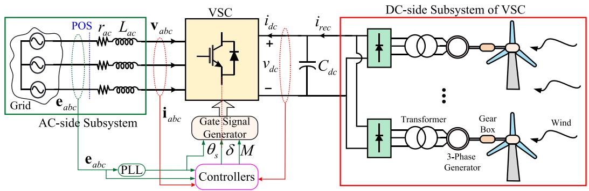  
FIGURE 1. Simplified power-electronic-based wind energy generation system.

been experimentally verified and are widely used in many studies and simulations of power-electronics-based systems and are also available as standard library components in most commercially available simulation programs; therefore, they can be regarded as reference for verifications.

# II. VSC-BASED AC–DC SYSTEM

In this article, a generic wind power generation system shown in Fig. 1 is considered without loss of generality. Therein, the ac-side subsystem electric grid is represented by its Thévenin equivalent circuit composed of the three-phase source voltages $\mathbf { e } _ { a b c }$ and the series impedances $r _ { a c }$ and $L _ { a c }$ (which may also represent the series filter of the converter). The dc-side terminals of the VSC are connected to a dc-link capacitor $C _ { d c }$ and a dc-side subsystem, which may be composed of ac–dc rectifiers (e.g., six-pulse diode bridges) fed by a cluster of three-phase generators (e.g., permanent magnet synchronous generator, induction generator, doubly-fed induction generator, etc.) driven by wind turbines.

As shown in Fig. 1, the ac- and dc-side variables of the VSC are measured and used in the controller block, which establishes the input variables for the VSC gate signal generator block. The controllers comprise outer active/reactive power (and/or voltage-level) control loops and inner current control loops, typically implemented in the qd coordinates [33]. The schematic of the controllers is shown in Fig. 2, where (without loss of generality) the dc voltage and reactive power control loops are adopted.

VSCs are typically controlled with respect to their local point-of-synchronization (POS) [34], [35]. The abc/qd transformations in the controller block, as well as the gate signal generator, require the angle of the fundamental frequency components of the voltages at POS, i.e., $( \mathbf { e } _ { a b c }$ in Fig. 1) denoted by $\theta _ { s } ,$ , with respect to which the VSC output ac voltages are established. The angle $\theta _ { s }$ is typically obtained using a phase-locked-loop (PLL) [34], [35]. The abc/qd transformations are performed as

$$
\mathbf {e} _ {q d} = \left[ \begin{array}{c} e _ {q} \\ e _ {d} \end{array} \right] = [ \mathbf {K} (\theta_ {s}) ] \mathbf {e} _ {a b c}, \tag {1}
$$

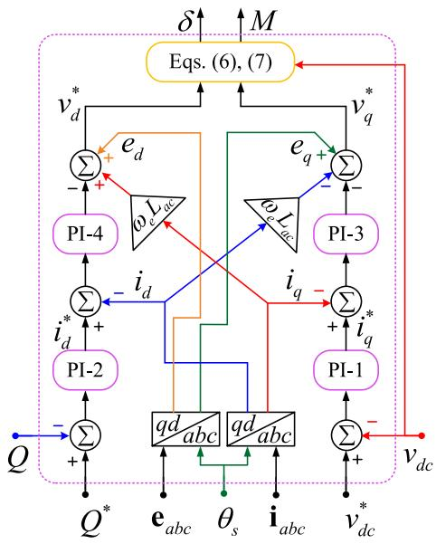  
FIGURE 2. Schematic of the outer voltage/power and inner current control loops for the voltage-source converter using four PI controllers.

$$
\mathbf {i} _ {q d} = \left[ \begin{array}{l} i _ {q} \\ i _ {d} \end{array} \right] = [ \mathbf {K} (\theta_ {s}) ] \mathbf {i} _ {a b c}, \tag {2}
$$

using Park’s transformation matrix K(θs) defined as [36]

$$
\mathbf {K} \left(\theta_ {s}\right) = \frac {2}{3} \left[ \begin{array}{l l l} \cos \left(\theta_ {s}\right) & \cos \left(\theta_ {s} - 2 \pi / 3\right) & \cos \left(\theta_ {s} + 2 \pi / 3\right) \\ \sin \left(\theta_ {s}\right) & \sin \left(\theta_ {s} - 2 \pi / 3\right) & \sin \left(\theta_ {s} + 2 \pi / 3\right) \end{array} \right]. \tag {3}
$$

The transformations are also graphically illustrated with vector diagrams in Fig. 3. As seen in Fig. 3, the q-axis of the qd frame is assumed to be aligned with the phase a source voltage $e _ { a }$ (at time zero), which results in having $e _ { d } = 0$ . As seen in the control diagram in Fig. 2, the transformed qd variables $\mathbf { e } _ { q d }$ and $\mathbf { i } _ { q d }$ are used along with the measured currents/voltages as well as the set-points for the dc voltage $v _ { d c } ^ { \ast }$ and reactive power $Q ^ { * }$ to compute the set-points for the qd voltages $( \mathrm { i } . \mathrm { e } _ { \cdot \cdot } , v _ { q } ^ { * }$ and $v _ { d } ^ { * } )$ through the four PI controllers. The VSC produces the required voltages $\mathbf { v } _ { q d } ^ { * }$ with high-frequency switching. The fundamental frequency components of the

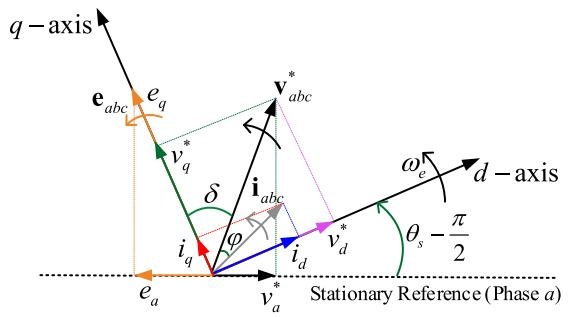  
FIGURE 3. Vector diagram of the three-phase ac voltages and currents in stationary and rotating qd reference frames.

VSC output ac voltages can be expressed as

$$
\mathbf {v} _ {a b c} ^ {1} = \left[ \begin{array}{l} v _ {a} ^ {1} \\ v _ {b} ^ {1} \\ v _ {c} ^ {1} \end{array} \right] = A \left[ \begin{array}{c} \cos (\theta_ {s} - \delta) \\ \cos (\theta_ {s} - \delta - 2 \pi / 3) \\ \cos (\theta_ {s} - \delta + 2 \pi / 3) \end{array} \right], \tag {4}
$$

where

$$
A = \sqrt {\left(v _ {q} ^ {*}\right) ^ {2} + \left(v _ {d} ^ {*}\right) ^ {2}}, \tag {5}
$$

and

$$
\delta = \tan^ {- 1} \left(v _ {d} ^ {*} / v _ {q} ^ {*}\right). \tag {6}
$$

Here, δ is the phase shift between the fundamental frequency components of the VSC output voltages and the fundamental frequency components of the Thévenin equivalent ac sources.

In addition to the angles $\theta _ { s }$ and δ, the VSC gate signal generator requires the so-called modulation index M, which specifies the amplitude of the VSC ac output voltages with respect to its dc terminal voltage. Various switching strategies require different modulation indices [11]. Here, it is assumed that sinusoidal-pulse-width-modulation (SPWM) is adopted, for which the modulation index is defined as

$$
M = \frac {A}{(1 / 2) v _ {d c}} = \frac {\sqrt {\left(v _ {q} ^ {*}\right) ^ {2} + \left(v _ {d} ^ {*}\right) ^ {2}}}{(1 / 2) v _ {d c}}. \tag {7}
$$

It is worth mentioning that the methodology presented in this article is applicable to other switching methods [11] with different definitions of M, and the formulations can be readily updated/modified accordingly.

# III. AVERAGE-VALUE MODELS OF VSCS

In the average-value models (AVMs), the switching ripples are neglected, and the relations of the terminal variables of the VSC are established between the fast average values of the dcside waveforms and the fundamental frequency components of the ac-side abc variables (or average values of transformed qd variables). The fast averaging is defined over a switching

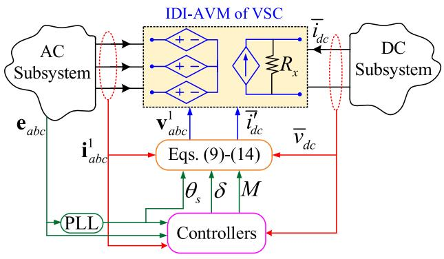  
FIGURE 4. Implementation of the conventional IDI-AVM of VSCs and its circuit interface with external subsystems using dependent current/voltage sources.

period $T _ { s w }$ as

$$
\bar {x} (t) = \frac {1}{T _ {s w}} \int_ {t - T _ {s w}} ^ {t} x (\tau) d \tau , \quad T _ {s w} = \frac {1}{f _ {s w}}, \tag {8}
$$

where $f _ { s w }$ is the switching frequency of the VSC; the variable x denotes the dc or transformed qd currents and/or voltages; and ¯x denotes the average value of x.

To establish the AVM, it is assumed that the (fundamental frequency components of the) ac currents are transformed to the qd coordinates similar to (2) as

$$
\bar {\mathbf {i}} _ {q d} = \left[ \begin{array}{l} \bar {i} _ {q} \\ \bar {i} _ {d} \end{array} \right] = [ \mathbf {K} (\theta_ {s}) ] \left[ \begin{array}{l l l} i _ {a} ^ {1} & i _ {b} ^ {1} & i _ {c} ^ {1} \end{array} \right] ^ {T}, \tag {9}
$$

which results in averaged $\bar { \mathbf i } _ { q d }$ currents. In (9), superscript T denotes the transposed vector. Afterward, the averaged qd variables $( \mathrm { i } . \mathrm { e } . , \bar { \mathbf { i } } _ { q d }$ and then computed $\bar { \bf v } _ { q d } )$ , which correspond to the fundamental frequency components of the abc variables $( \mathrm { i } . \mathrm { e } . , \ \mathbf { i } _ { a b c } ^ { 1 }$ and ${ \bf v } _ { a b c } ^ { 1 } )$ are related to the average values of the dc-side variables $( \mathrm { i } . \mathrm { e } . , \bar { i } _ { d c }$ and $\bar { v } _ { d c } )$ .

# A. CONVENTIONAL INDIRECTLY-INTERFACED AVM

In conventional so-called indirectly-interfaced AVMs (IDI-AVMs) of VSCs [11], the semiconductor switches are replaced with dependent current/voltage sources, as depicted in Fig. 4. A snubber resistor $R _ { x }$ may be needed in parallel with the dc-side current source for numerical damping depending on the composition of the dc subsystem. Assuming a lossless converter and using the input/output power balance, the controlled dc current source can be computed as [11]

$$
\bar {i} _ {d c} ^ {\prime} = \frac {3}{4} M \cos (\varphi) \| \overline {{\mathbf {i}}} _ {q d} \|, \tag {10}
$$

where ϕ is the so-called power factor angle of the VSC and is obtained as

$$
\varphi = \tan^ {- 1} \left(\bar {i} _ {d} / \bar {i} _ {q}\right) - \delta . \tag {11}
$$

The averaged $\bar { \mathbf { v } } _ { q d }$ voltages can also be expressed based on (6), (7) as

$$
\bar {\mathbf {v}} _ {q d} = \left[ \begin{array}{l} \bar {v} _ {q} \\ \bar {v} _ {d} \end{array} \right] = \frac {1}{2} M \left[ \begin{array}{l} \cos (\delta) \\ \sin (\delta) \end{array} \right] \bar {v} _ {d c}. \tag {12}
$$

Therefore, the controlled ac voltage sources V $\mathbf { v } _ { a b c } ^ { 1 }$ at the interface in Fig. 4 can be obtained by transforming the $\bar { \mathbf { v } } _ { q d }$ voltages in (12) to the abc coordinates as

$$
\mathbf {v} _ {a b c} ^ {1} = \left[ \begin{array}{l l l} v _ {a} ^ {1} & v _ {b} ^ {1} & v _ {c} ^ {1} \end{array} \right] ^ {T} = [ \mathbf {K} (\theta_ {s}) ] ^ {- 1} \bar {\mathbf {v}} _ {q d}, \tag {13}
$$

where $[ \mathbf { K } ( \theta _ { s } ) ] ^ { - 1 }$ is the 3-by-2 pseudo inverse of Park’s transformation matrix defined as [36]

$$
[ \mathbf {K} (\theta_ {s}) ] ^ {- 1} = \left[ \begin{array}{c c} \cos \left(\theta_ {s}\right) & \sin \left(\theta_ {s}\right) \\ \cos \left(\theta_ {s} - 2 \pi / 3\right) & \sin \left(\theta_ {s} - 2 \pi / 3\right) \\ \cos \left(\theta_ {s} + 2 \pi / 3\right) & \sin \left(\theta_ {s} + 2 \pi / 3\right) \end{array} \right]. \tag {14}
$$

The ac currents $\mathbf { i } _ { a b c } ^ { 1 }$ and the dc voltage $\bar { v } _ { d c }$ that are used in (9)–(14) for the calculation of the interfacing variables v1abc an i $\mathbf { v } _ { a b c } ^ { 1 }$ d $\bar { i } _ { d c } ^ { \prime }$ in Fig. 4 need to be computed by the ac and dc subsystems. Therefore, in nodal-analysis-based programs with non-iterative solutions, e.g., in PSCAD/EMTDC, the solution for inputs $\mathbf { i } _ { a b c } ^ { 1 }$ and $\bar { v } _ { d c }$ will only become available at the next time step. As a result, the program needs to use their values calculated at the previous time-step [i.e., $\bar { v } _ { d c } ( t - \Delta t )$ ) and $\mathbf { i } _ { a b c } ^ { 1 } ( t - \Delta t ) ]$ for calculating $\mathbf { v } _ { a b c } ^ { 1 } ( t )$ and $\bar { i } _ { d c } ^ { \prime } ( t )$ as

$$
\begin{array}{l} \left[ \begin{array}{c c c} v _ {a} ^ {1} (t) & v _ {b} ^ {1} (t) & v _ {c} ^ {1} (t) \end{array} \right] ^ {T} \\ = \left[ \mathbf {K} \left(\theta_ {s}\right) \right] ^ {- 1} \frac {1}{2} M \left[ \begin{array}{l} \cos (\delta) \\ \sin (\delta) \end{array} \right] \bar {v} _ {d c} (t - \Delta t), \tag {15} \\ \end{array}
$$

$$
\bar {i} _ {d c} ^ {\prime} (t) = \frac {3}{4} M \cos \left(\tan^ {- 1} \left(\bar {i} _ {d} / \bar {i} _ {q}\right) - \delta\right) \left\| \bar {\mathbf {I}} _ {q d} \right\|,
$$

$$
\left[ \begin{array}{l} \bar {i} _ {q} \\ \bar {i} _ {d} \end{array} \right] = \left[ \mathbf {K} \left(\theta_ {s}\right) \right] \left[ \begin{array}{l} i _ {a} ^ {1} (t - \Delta t) \\ i _ {b} ^ {1} (t - \Delta t) \\ i _ {c} ^ {1} (t - \Delta t) \end{array} \right]. \tag {16}
$$

This one-time-step t delay for the dependent sources at the interface is inherent/inevitable in the IDI-AVMs, which may lead to numerical errors and/or instability in the solutions when the time-step size t is large [30].

# B. PROPOSED DIRECTLY-INTERFACED AVM

In the directly-interfaced AVM (DI-AVM) of VSCs, the relations of the terminal variables of the VSC are established in the nodal form as

$$
\mathbf {G} _ {\mathrm {V S C}} (t) \cdot \mathbf {v} _ {\mathrm {V S C}} (t) = \mathbf {i} _ {\mathrm {V S C}} (t), \tag {17}
$$

where

$$
\mathbf {v} _ {\mathrm {V S C}} (t) = \left[ \begin{array}{l} v _ {a} ^ {1} (t) \\ v _ {b} ^ {1} (t) \\ v _ {c} ^ {1} (t) \\ \bar {v} _ {d c} (t) \end{array} \right], \quad \mathbf {i} _ {\mathrm {V S C}} (t) = \left[ \begin{array}{l} i _ {a} ^ {1} (t) \\ i _ {b} ^ {1} (t) \\ i _ {c} ^ {1} (t) \\ \bar {i} _ {d c} (t) \end{array} \right], \tag {18}
$$

and $\mathbf { G } _ { \mathrm { V S C } } ( t )$ is the conductance matrix of the converter. Having a separate sub-matrix for the VSC conductance allows

merging it into the overall network conductance matrix. Consequently, the nodal equations of the VSC would be solved simultaneously as part of the overall network nodal equations; and the one t interfacing delay existing in the IDI-AVMs would be eliminated, allowing the use of large time-steps for simulations.

To obtain the VSC formulation in the form of (17), the dcside voltage is expressed based on (10) and Fig. 4 as

$$
\begin{array}{l} \bar {v} _ {d c} (t) = R _ {x} \left(\bar {i} _ {d c} ^ {\prime} (t) + \bar {i} _ {d c} (t)\right) \\ = R _ {x} \left(\frac {3}{4} M \sqrt {\left(\bar {i} _ {q} (t)\right) ^ {2} + \left(\bar {i} _ {d} (t)\right) ^ {2}} \cos (\varphi) + \bar {i} _ {d c} (t)\right). \tag {19} \\ \end{array}
$$

The ac-side transformed qd voltages can also be expressed based on (12), (19) as

$$
\left\{ \begin{array}{l} \bar {v} _ {q} (t) = \frac {1}{2} M R _ {x} \cos (\delta) \left(\frac {3}{4} M \sqrt {\left(\bar {i} _ {q} (t)\right) ^ {2} + \left(\bar {i} _ {d} (t)\right) ^ {2}} \cos (\varphi) + \bar {i} _ {d c} (t)\right) \\ \bar {v} _ {d} (t) = \frac {1}{2} M R _ {x} \sin (\delta) \left(\frac {3}{4} M \sqrt {\left(\bar {i} _ {q} (t)\right) ^ {2} + \left(\bar {i} _ {d} (t)\right) ^ {2}} \cos (\varphi) + \bar {i} _ {d c} (t)\right). \end{array} \right. \tag {20}
$$

In (19), (20), the term cos(ϕ ) can be written based on (11) and after trigonometric manipulations as

$$
\begin{array}{l} \cos (\varphi) = \cos \left(\tan^ {- 1} \left(\bar {i} _ {d} (t) / \bar {i} _ {q} (t)\right) - \delta\right) \\ = \frac {\bar {l} _ {q} (t)}{\sqrt {\left(\bar {i} _ {q} (t)\right) ^ {2} + \left(\bar {i} _ {d} (t)\right) ^ {2}}} \cos (\delta) \\ + \frac {\bar {i} _ {d} (t)}{\sqrt {\left(\bar {i} _ {q} (t)\right) ^ {2} + \left(\bar {i} _ {d} (t)\right) ^ {2}}} \sin (\delta). \tag {21} \\ \end{array}
$$

Therefore, (19), (20) can be simplified using (21) and rewritten in the following form as

$$
\left[ \begin{array}{l} \bar {v} _ {q} (t) \\ \bar {v} _ {d} (t) \\ \bar {v} _ {d c} (t) \end{array} \right] = \mathbf {Z} _ {\mathrm {V S C}} ^ {\prime} \left[ \begin{array}{l} \bar {i} _ {q} (t) \\ \bar {i} _ {d} (t) \\ \bar {i} _ {d c} (t) \end{array} \right], \tag {22}
$$

where $\mathbf { Z } _ { \mathrm { { V S C } } } ^ { \prime }$ is defined in (23) shown at the bottom of the next page.

Afterwards, the voltages $\bar { \mathbf { v } } _ { q d } ( t )$ and the currents $\bar { \mathbf { i } } _ { q d } ( t )$ in (22) are transformed to the abc coordinates similar to (13). This results in the following form of relations for the VSC terminal variables

$$
\mathbf {v} _ {\mathrm {V S C}} (t) = \mathbf {Z} _ {\mathrm {V S C}} (t) \cdot \mathbf {i} _ {\mathrm {V S C}} (t), \tag {24}
$$

where $\mathbf { Z } _ { \mathrm { V S C } } ( t )$ is the VSC impedance matrix defined as

$$
\mathbf {Z} _ {\mathrm {V S C}} (t) = \left[ \begin{array}{c c} \mathbf {Z} _ {4} (t) & \mathbf {Z} _ {5} (t) \\ \bar {\mathbf {Z}} _ {5} ^ {T} (t) & \bar {\mathbf {Z}} _ {3} \end{array} \right]. \tag {25}
$$

The sub-matrices in (25) are expressed in (26) shown at the bottom of this page and (27) as

$$
\mathbf {Z} _ {5} (t) = \left[ \mathbf {K} \left(\theta_ {s}\right) \right] ^ {- 1} \mathbf {Z} _ {2} = \frac {1}{2} M R _ {x} \left[ \begin{array}{c} \cos \left(\theta_ {s} - \delta\right) \\ \cos \left(\theta_ {s} - \delta - 2 \pi / 3\right) \\ \cos \left(\theta_ {s} - \delta + 2 \pi / 3\right) \end{array} \right], \tag {27}
$$

and $Z _ { 3 } = R _ { x }$ as shown in (23)

Finally, the conductance matrix of the VSC, i.e., $\mathbf { G } _ { \mathrm { V S C } } ( t )$ used in (17) can be computed based on (24) as

$$
\mathbf {G} _ {\mathrm {V S C}} (t) = \left[ \mathbf {Z} _ {\mathrm {V S C}} (t) \right] ^ {- 1}. \tag {28}
$$

However, it should be noted that one cannot obtain the inverse of matrix $\mathbf { Z } _ { \mathrm { V S C } } ( t )$ defined in (25) due to $\mathbf { Z } _ { 4 } ( t )$ defined in (26) not being a full-rank matrix [37]. For this purpose, here a small number ε is added to the diagonal terms in $\mathbf { Z } _ { 4 } ( t )$ i n order to obtain a full-rank ZVSC(t ) as expressed in (29) shown at the bottom of the next page. This is equivalent to adding a very small resistance ε to the three-phase ac terminals of the VSC for numerical purposes. It has been verified that as long as ε is chosen reasonably small compared to the discretized ac-side impedances, it should not introduce much error in the solution.

Based on (28), (29), the conductance matrix of the VSC can be obtained as (30) shown at the bottom of the next page. It is noted that if one does not use a parallel snubber $R _ { x }$ or if its value is much larger than ε, then the term $\varepsilon / R _ { x }$ in (30) can be safely ignored (compared to the term $3 M ^ { 2 } / 8 )$ , making $\mathbf { G } _ { \mathrm { V S C } } ( t )$ independent from the value of the snubber resistance.

It is also noted that the conductance matrix $\mathbf { G } _ { \mathrm { V S C } } ( t )$ in (30) is a 4 4 matrix and has been obtained assuming three nodes on the ac-side and one node on the dc-side denoted by{a, b, c, d}, as shown in Fig. 5(I). Therein, the common point of the VSC equivalent conductance branches and the neutral point of the dc-side terminal are grounded. This may be sufficient for some studies, depending on the structure of the ac- and dc-side subsystems, which results in a conductance matrix with a minimum number of nodes and complexity. Fig. 5(II) shows the case when the dc-side terminal needs to have both of the nodes accessible, denoted as {d, e}. Also, when the ac-subsystem has zero-sequence voltages, the conductance matrix should

have the configuration shown in Fig. 5(III) on the ac-side with the floating neutral point denoted by node {n}. This prevents the unwanted zero-sequence currents that should not flow into the VSC. A general case is shown in Fig. 5(IV), where both of the neutral points have been considered for the ac- and dc-side terminals. The selection of the proper configuration of the conductance matrix in Fig. 5 depends on the interfacing requirements of the circuit and the number of nodes required.

To obtain a generalized extended form of $\mathbf { G } _ { \mathrm { V S C } } ( t )$ given in (30) based on Fig. 5(I), one has to consider the two extra nodes in Fig. 5(IV). Assuming {a, $b , c , d , n , e \}$ for the order of the nodes, the nodal equations can be expressed as

$$
\mathbf {G} _ {\mathrm {V S C}} ^ {\text {g e n}} (t) \cdot \mathbf {v} _ {\mathrm {V S C}} ^ {\text {g e n}} (t) = \mathbf {i} _ {\mathrm {V S C}} ^ {\text {g e n}} (t), \tag {31}
$$

where

$$
\mathbf {v} _ {\mathrm {V S C}} ^ {\text {g e n}} (t) = \left[ \begin{array}{l} v _ {a} ^ {1} (t) \\ v _ {b} ^ {1} (t) \\ v _ {c} ^ {1} (t) \\ \bar {v} _ {d} (t) \\ v _ {n} ^ {1} (t) \\ \bar {v} _ {e} (t) \end{array} \right], \quad \mathbf {i} _ {\mathrm {V S C}} ^ {\text {g e n}} (t) = \left[ \begin{array}{l} i _ {a} ^ {1} (t) \\ i _ {b} ^ {1} (t) \\ i _ {c} ^ {1} (t) \\ \bar {i} _ {d} (t) \\ i _ {n} ^ {1} (t) \\ \bar {i} _ {e} (t) \end{array} \right]. \tag {32}
$$

In (31) , Ggen $\mathbf { G } _ { \mathrm { V S C } } ^ { \mathrm { g e n } }$ denoted by the superscript “gen”, is the generalized conductance matrix of the proposed extended DI-AVM of VSC and can be expressed as

$$
\mathbf {G} _ {\mathrm {V S C}} ^ {\text {g e n}} (t) = \left[ \begin{array}{c c c c} \left[ \begin{array}{c c c c} g _ {a a} & g _ {a b} & g _ {a c} & g _ {a d} \\ g _ {b a} & g _ {b b} & g _ {b c} & g _ {b d} \\ g _ {c a} & g _ {c b} & g _ {c c} & g _ {c d} \\ g _ {d a} & g _ {d b} & g _ {d c} & g _ {d d} \end{array} \right] & \left[ \begin{array}{c c} g _ {a n} & g _ {a e} \\ g _ {b n} & g _ {b e} \\ g _ {c n} & g _ {c e} \\ g _ {d n} & g _ {d e} \end{array} \right] \\ \left[ \begin{array}{c c c c} g _ {n a} & g _ {n b} & g _ {n c} & g _ {n d} \\ g _ {e a} & g _ {e b} & g _ {e c} & g _ {e d} \end{array} \right] & \left[ \begin{array}{c c} g _ {n n} & g _ {n e} \\ g _ {e n} & g _ {e e} \end{array} \right] \end{array} \right], \tag {33}
$$

where the (red) submatrix is $\mathbf { G } _ { \mathrm { V S C } }$ defined in (30). To obtain the other three block submatrices of (33) (in blue and purple brackets), one has to express the nodal equations (17), (18), (30) based on the potential difference of the nodes. For example, $\bar { v } _ { d c } ( t )$ is equal to $( \bar { \boldsymbol { v } } _ { d } ( t ) - \bar { \boldsymbol { v } } _ { e } ( t ) ) ;$ and similar relations for the ac voltages considering the potential of the node {n}. Also, the current injected into the node {n} is the negative sum of the three-phase ac currents (i.e., $i _ { n } ^ { 1 } ( t ) =$

$$
\mathbf {Z} _ {\mathrm {V S C}} ^ {\prime} = \left[ \begin{array}{l l} \mathbf {Z} _ {1} & \mathbf {Z} _ {2} \\ \mathbf {Z} _ {2} ^ {T} & Z _ {3} \end{array} \right] = \left[ \begin{array}{c c c} \frac {3}{8} M ^ {2} R _ {x} \cos^ {2} (\delta) & \frac {3}{1 6} M ^ {2} R _ {x} \sin (2 \delta) & \frac {1}{2} M R _ {x} \cos (\delta) \\ \frac {3}{1 6} M ^ {2} R _ {x} \sin (2 \delta) & \frac {3}{8} M ^ {2} R _ {x} \sin^ {2} (\delta) & \frac {1}{2} M R _ {x} \sin (\delta) \\ \dots & \dots & \dots \\ \frac {3}{4} M R _ {x} \cos (\delta) & \frac {3}{4} M R _ {x} \sin (\delta) & R _ {x} \end{array} \right]. \tag {23}
$$

$$
\mathbf {Z} _ {4} (t) = \left[ \mathbf {K} \left(\theta_ {s}\right) \right] ^ {- 1} \mathbf {Z} _ {1} \left[ \mathbf {K} \left(\theta_ {s}\right) \right] = \frac {1}{8} M ^ {2} R _ {x} \left[ \begin{array}{c c c} 3 / 2 + \cos \left(2 \theta_ {s} - 2 \delta\right) & \cos \left(2 \theta_ {s} - 2 \delta - 2 \pi / 3\right) & \cos \left(2 \theta_ {s} - 2 \delta + 2 \pi / 3\right) \\ \cos \left(2 \theta_ {s} - 2 \delta - 2 \pi / 3\right) & 3 / 2 + \cos \left(2 \theta_ {s} - 2 \delta + 2 \pi / 3\right) & \cos \left(2 \theta_ {s} - 2 \delta\right) \\ \cos \left(2 \theta_ {s} - 2 \delta + 2 \pi / 3\right) & \cos \left(2 \theta_ {s} - 2 \delta\right) & 3 / 2 + \cos \left(2 \theta_ {s} - 2 \delta - 2 \pi / 3\right) \end{array} \right]. \tag {26}
$$

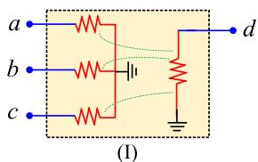

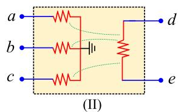

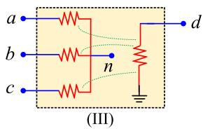

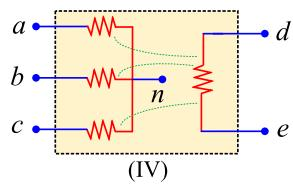  
FIGURE 5. Different possible configurations of the accessible nodes for the equivalent conductance matrix of the proposed DI-AVM of VSC: (I) Grounded neutral point on ac side and one of the dc terminals; (II) grounded neutral point on ac side and floating dc terminals; (III) floating neutral point on ac side and one grounded dc terminal; and (IV) all ac side and dc nodes are floating.

$- ( i _ { a } ^ { 1 } ( t ) + i _ { b } ^ { 1 } ( t ) + i _ { c } ^ { 1 } ( t ) ) )$ ; and the current flowing into the {e} is the opposite of the current flowing into the node {d}(i.e., $\bar { i } _ { e } ( t ) = - \bar { i } _ { d } ( t ) )$ . After algebraic manipulations based on the configuration in Fig. (ships for the entries of $\mathbf { G } _ { \mathrm { V S C } } ^ { \mathrm { g e n } }$ we obtain the following relation-in (33) as

$$
\left\{ \begin{array}{l} g _ {a n} = - \left(g _ {a a} + g _ {a b} + g _ {a c}\right) \\ g _ {b n} = - \left(g _ {b a} + g _ {b b} + g _ {b c}\right) \\ g _ {c n} = - \left(g _ {c a} + g _ {c b} + g _ {c c}\right) \\ g _ {d n} = - \left(g _ {d a} + g _ {d b} + g _ {d c}\right) \end{array} , \left\{ \begin{array}{l} g _ {n a} = - \left(g _ {a a} + g _ {b a} + g _ {c a}\right) \\ g _ {n b} = - \left(g _ {a b} + g _ {b b} + g _ {c b}\right) \\ g _ {n c} = - \left(g _ {a c} + g _ {b c} + g _ {c c}\right) \\ g _ {n d} = - \left(g _ {a d} + g _ {b d} + g _ {c d}\right) \end{array} , \right. \right. \tag {34}
$$

$$
\left\{ \begin{array}{l} g _ {a e} = - g _ {a d} \\ g _ {b e} = - g _ {b d} \\ g _ {c e} = - g _ {c d} \\ g _ {d e} = - g _ {d d} \\ g _ {n e} = - g _ {n d} \end{array} , \left\{ \begin{array}{l} g _ {e a} = - g _ {d a} \\ g _ {e b} = - g _ {d b} \\ g _ {e c} = - g _ {d c} \\ g _ {e d} = - g _ {d d} \\ g _ {e n} = - g _ {d n} \end{array} , \right. \right. \tag {35}
$$

$$
g _ {e e} = g _ {d d}, \tag {36}
$$

$$
\begin{array}{l} g _ {n n} = \left(g _ {a a} + g _ {a b} + g _ {a c}\right) + \left(g _ {b a} + g _ {b b} + g _ {b c}\right) \\ + \left(g _ {c a} + g _ {c b} + g _ {c c}\right). \tag {37} \\ \end{array}
$$

Using GVSC(t ) in (30) and based on the relations in (34)– (37) and neglecting tconductance matrix $\varepsilon / R _ { x }$ , the generalized form of the the proposed extended DI-$\mathbf { G } _ { \mathrm { V S C } } ^ { \mathrm { g e n } } ( t )$ of the next page.

Having GVSC(t ) in (30), or $\mathbf { G } _ { \mathrm { V S C } } ^ { \mathrm { g e n } } ( t )$ expressed in (38), the DI-AVM of VSCs can be readily implemented using a conductance matrix and interfaced with the external subsystems as presented in Fig. 6. Therein, the conductance matrix is calculated directly using the inputs $\theta _ { s } , \delta ,$ , and M based on (30) or (38) without the need for inputs from $\mathbf { i } _ { a b c } ^ { 1 }$ and $\bar { v } _ { d c }$ (hence, one time-step delay is avoided) as opposed to Fig. 4 for IDI-AVM.

It is worth mentioning that, regardless of the method and point-of-synchronization, the angle of the voltages of the ac subsystem, i.e., $\theta _ { s } ,$ is obtained similarly when the detailed switching model, the conventional IDI-AVM, and the proposed DI-AVM are used, as demonstrated in Figs. 1, 4, 6, respectively.

$$
\mathbf {Z} _ {\mathrm {V S C}} (t) =
$$

$$
\left[ \begin{array}{c c c c} \frac {1}{8} M ^ {2} R _ {x} & \frac {1}{8} M ^ {2} R _ {x} (\cos (2 \theta_ {s} - 2 \delta - 2 \pi / 3)) & \frac {1}{8} M ^ {2} R _ {x} (\cos (2 \theta_ {s} - 2 \delta + 2 \pi / 3)) & \frac {1}{2} M R _ {x} \cos (\theta_ {s} - \delta) \\ \frac {1}{8} M ^ {2} R _ {x} & \frac {1}{8} M ^ {2} R _ {x} & \frac {1}{8} M ^ {2} R _ {x} (\cos (2 \theta_ {s} - 2 \delta)) & \frac {1}{2} M R _ {x} \cos (\theta_ {s} - \delta - 2 \pi / 3) \\ (\cos (2 \theta_ {s} - 2 \delta - 2 \pi / 3)) & \left(3 / 2 + \cos (2 \theta_ {s} - 2 \delta + 2 \pi / 3)\right) + \varepsilon & \frac {1}{8} M ^ {2} R _ {x} & \frac {1}{2} M R _ {x} \cos (\theta_ {s} - \delta + 2 \pi / 3) \\ \frac {1}{8} M ^ {2} R _ {x} & \frac {1}{8} M ^ {2} R _ {x} (\cos (2 \theta_ {s} - 2 \delta)) & \left(3 / 2 + \cos (2 \theta_ {s} - 2 \delta - 2 \pi / 3)\right) + \varepsilon & \frac {1}{2} M R _ {x} \cos (\theta_ {s} - \delta + 2 \pi / 3) \\ (\cos (2 \theta_ {s} - 2 \delta + 2 \pi / 3)) & & & \\ \hline \frac {1}{2} M R _ {x} \cos (\theta_ {s} - \delta) & \frac {1}{2} M R _ {x} \cos (\theta_ {s} - \delta - 2 \pi / 3) & \frac {1}{2} M R _ {x} \cos (\theta_ {s} - \delta + 2 \pi / 3) & R _ {x} \\ \end{array} \right].
$$

$$
\mathbf {G} _ {\mathrm {V S C}} (t) = \frac {1}{\varepsilon} \left[ \begin{array}{c c c c} 1 & 0 & 0 & - \frac {M}{2} \cos \left(\theta_ {s} - \delta\right) \\ 0 & 1 & 0 & - \frac {M}{2} \cos \left(\theta_ {s} - \delta - 2 \pi / 3\right) \\ 0 & 0 & 1 & - \frac {M}{2} \cos \left(\theta_ {s} - \delta + 2 \pi / 3\right) \\ \dots & \dots & \dots & \dots \\ - \frac {M}{2} \cos \left(\theta_ {s} - \delta\right) & - \frac {M}{2} \cos \left(\theta_ {s} - \delta - 2 \pi / 3\right) & - \frac {M}{2} \cos \left(\theta_ {s} - \delta + 2 \pi / 3\right) & \frac {3 M ^ {2}}{8} + \frac {\varepsilon}{R _ {x}} \end{array} \right]. \tag {30}
$$

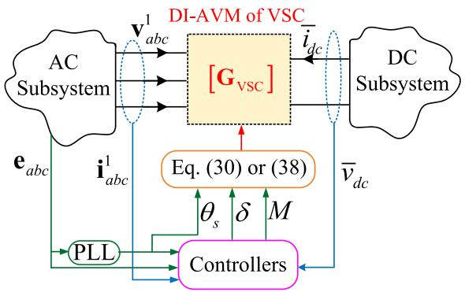  
FIGURE 6. Implementation of the proposed DI-AVM of VSCs and its circuit interface with external subsystems using a conductance matrix.

# IV. COMPUTER STUDIES

To verify the numerical performance of the proposed extended DI–AVM of VSCs compared to the classic IDI–AVM, the ac–dc energy conversion system in Fig. 1 has been implemented in PSCAD/EMTDC environment. Three different representations of the VSC are considered as in Fig. 7(a)–(c); i.e., the detailed switching model, the IDI–AVM according to Fig. 4, and the proposed extended DI–AVM based on Fig. 6. Herein, the DI–AVM in Fig. 7(c) is implemented as a user-defined block whose conductance submatrix is added to the conductance matrix of the rest of the system using the subroutine EMTDC_ADDGM2 internal to PSCAD. The system parameters are summarized in the Appendix and ε 0.2 for the DI–AVM. For comparisons, the solution of the classic IDI–AVM obtained with a small time-step of 1 μs is considered as the reference AVM. Subsequently, transient studies are conducted with the subject models of the VSC under balanced and unbalanced conditions.

# A. TRANSIENTS UNDER BALANCED CONDITIONS

Here, without loss of generality, it is assumed that the dc-side subsystem of the VSC in Fig. 1 injects the dc current irec whose profile undergoes oscillations as shown in Fig. 8(a) due to fluctuations in the wind power. The simulations start up from zero initial conditions while the modulation index M and angle δ for the VSC are set manually (i.e., $M = 0 . 8 6$ and

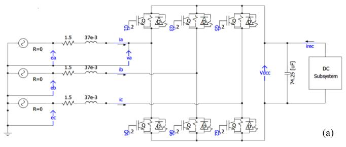

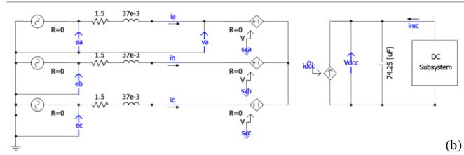

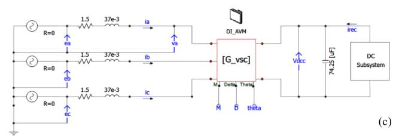  
FIGURE 7. Implementation and circuit interfacing of the subject models of VSC in PSCAD/EMTDC environment: (a) Detailed switching model, (b) IDI-AVM, and (c) proposed extended DI-AVM.

δ 15°) to achieve 200 kV at the dc bus and zero reactive power before the start of the fluctuations at t 2 s.

Consequently, the VSC variables undergo fluctuations similar to the wind profile of Fig. 8(a) until t 7 s. At t 7 s, the controllers are activated to regulate the dc-link voltage at 200 kV and the reactive power to zero. The transient response of the system is shown in Fig. 8(b)–(d) for the VSC terminal variables as obtained by the subject models where both IDI–AVM and DI–AVM are executed with a time-step of t 10μs.

As shown in Fig. 8, with such relatively small time steps, both the IDI– and DI–AVMs obtain accurate results compared to the reference AVM. The results of the AVMs are also

$$
\mathbf {G} _ {\mathrm {V S C}} ^ {\mathrm {g e n}} (t) =
$$

$$
\frac {1}{\varepsilon} \left[ \begin{array}{c c c c c c} 1 & 0 & 0 & - \frac {M}{2} \cos \left(\theta_ {s} - \delta\right) & - 1 & \frac {M}{2} \cos \left(\theta_ {s} - \delta\right) \\ 0 & 1 & 0 & - \frac {M}{2} \cos \left(\theta_ {s} - \delta - 2 \pi / 3\right) & - 1 & \frac {M}{2} \cos \left(\theta_ {s} - \delta - 2 \pi / 3\right) \\ 0 & 0 & 1 & - \frac {M}{2} \cos \left(\theta_ {s} - \delta + 2 \pi / 3\right) & - 1 & \frac {M}{2} \cos \left(\theta_ {s} - \delta + 2 \pi / 3\right) \\ - \frac {M}{2} \cos \left(\theta_ {s} - \delta\right) & - \frac {M}{2} \cos \left(\theta_ {s} - \delta - 2 \pi / 3\right) & - \frac {M}{2} \cos \left(\theta_ {s} - \delta + 2 \pi / 3\right) & \frac {3 M ^ {2}}{8} & 0 & - \frac {3 M ^ {2}}{8} \\ - 1 & - 1 & - 1 & 0 & 3 & 0 \\ \frac {M}{2} \cos (\theta_ {s} - \delta) & \frac {M}{2} \cos (\theta_ {s} - \delta - 2 \pi / 3) & \frac {M}{2} \cos (\theta_ {s} - \delta + 2 \pi / 3) & - \frac {3 M ^ {2}}{8} & 0 & \frac {3 M ^ {2}}{8} \end{array} \right] \tag {38}
$$

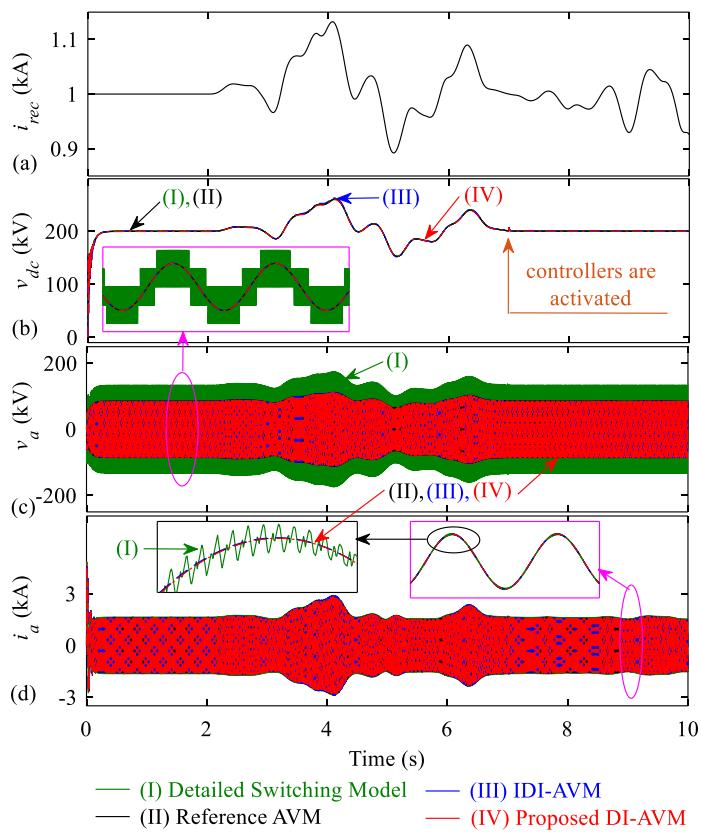  
FIGURE 8. Transient response of the system to wind power fluctuations when at t 7 s controllers are activated, as obtained by the subject models for the VSC terminal variables: (a) Dc subsystem current, (b) dc-link voltage, (c) VSC phase a voltage, and (d) VSC phase a current.

consistent with the ones obtained from the detailed switching model (when switching ripples are neglected).

The same transient study shown in Fig. 8 is repeated with a medium time-step of $\Delta t = 1 5 0 ~ \mu \mathrm { s }$ chosen for IDI–AVM and a very large time-step of $\Delta t = 5 0 0 ~ \mu \mathrm { s }$ for the proposed DI–AVM. Some representative dc and ac waveforms from the VSC terminal variables are presented in Fig. 9.

As can be observed in Fig. 9, the IDI–AVM entirely loses its accuracy with $\Delta t = 1 5 0 ~ \mu \mathrm { s }$ , while the proposed DI–AVM remains very accurate compared to the reference solution even at $\Delta t = 5 0 0 ~ \mu \mathrm { s }$ . It can also be observed in Fig. 9 that the deviations in the IDI–AVM initiate from the startup due to the inaccuracy caused by the one-time-step delay at such a fairly medium-large step size.

It is worthwhile to mention that after the activation of the controllers at t 7 s, the error in the IDI–AVM is somewhat compensated by the PI controllers, and the solution follows the reference more accurately. However, the compensation is less effective for the ac variables, as shown in Fig. 10, for the magnified view of ac current after the controllers are activated. As seen in Fig. 10, the solution of the IDI–AVM has visibly deviated from the reference even with the compensation from the PI controllers. It is also noted that the compensation phenomenon cannot avoid/mitigate the numerical inaccuracy/instability at larger time steps. It was verified

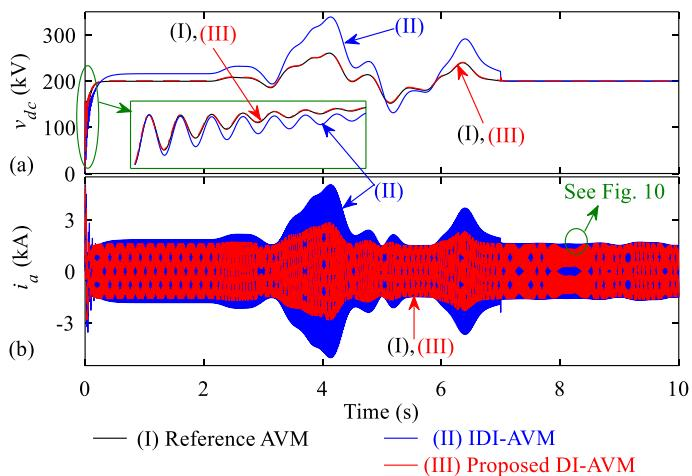  
FIGURE 9. Transient response of the dc-link voltage and the VSC phase a current as obtained by the AVMs with large time-steps: (I) Reference AVM with 1 µs, (II) IDI–AVM with 150 µs, and (III) proposed DI–AVM with 500 µs.

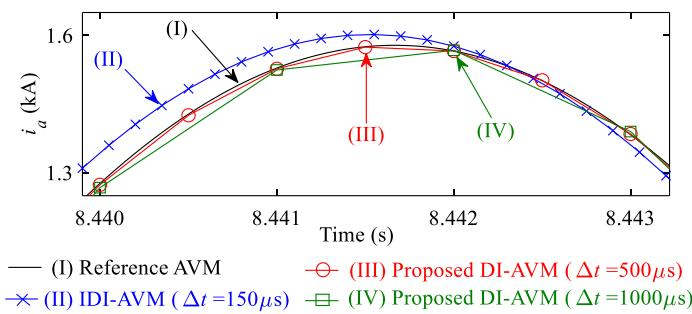  
FIGURE 10. Magnified view of the ac current in Fig. 9 as obtained by the IDI–AVM and DI–AVM at different time-steps compared to the reference AVM.

that for this study and given system parameters, the IDI–AVM can produce acceptable results only with time steps not greater than 10 20 μs.

Meanwhile, the proposed DI–AVM provides very accurate results that exactly land on the reference solution even with very large time-steps, as demonstrated in Fig. 10. Therein, the results of the DI–AVM run with $\Delta t = 1 0 0 0$ μs are also superimposed, which verify the excellent numerical accuracy of the proposed DI–AVM at very large time-steps.

# B. TRANSIENTS UNDER UNBALANCED CONDITIONS

Here, the performance of the proposed extended DI–AVM is investigated under unbalanced conditions in the ac network. Specifically, it is verified that the DI–AVM implemented according to Fig. 5(III), (IV) does not allow the flow of zerosequence currents (which would not exist due to a floating neutral point).

For this purpose, it is assumed that simulations start up from zero initial conditions with M 0.86 and $\delta = 1 5 ^ { \circ }$ , similar to Subsection IV-A. Also, it is assumed that the dc-side subsystem of the VSC injects constant dc current $i _ { r e c } = 1 \mathrm { k A }$ . The simulations continue until $t = 1 . 5 \mathrm { s } ,$ after which an unbalanced

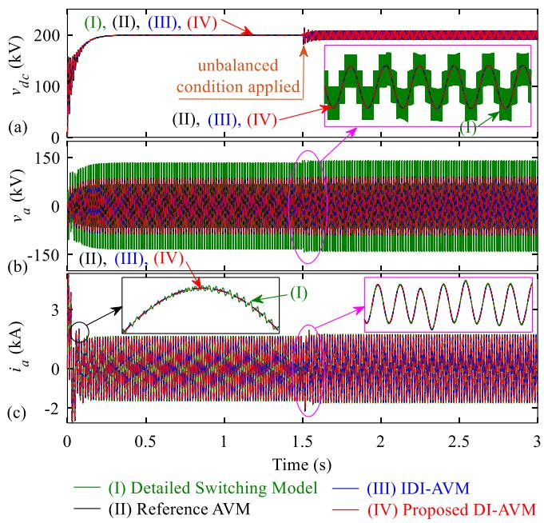  
FIGURE 11. Transient response of the system, when at t 1.5 s an unbalanced condition is introduced to the ac network, as obtained by the subject models for the VSC terminal variables: (a) Dc-link voltage, (b) VSC phase a voltage, and (c) VSC phase a current. Here, both IDI–AVM and proposed DI–AVM are executed with a time-step of $\varDelta t = 5 \mu \leq .$

condition is introduced to the ac-side network. Without loss of generality, it is assumed that 10% negative-sequence and 10% zero-sequence components are added to the positive-sequence components of the Thévenin equivalent source voltages $\mathbf { e } _ { a b c }$ . Simulations continue until t 3 s, and the transient responses of the system variables obtained by the subject models are shown in Fig. 11.

As seen in Fig. 11, the imbalance in the source voltages results in more pronounced ripples in the dc voltage and causes fluctuations in the ac currents, which are observable from the magnified waveforms. In Fig. 11, the IDI–AVM and the proposed extended DI–AVM are both executed with a small time-step of $\Delta t = 5 \ \mu \mathrm { s }$ . As observed in Fig. 11, with such small time steps, the IDI– and DI–AVMs obtain results similar to the reference AVM (run with $\Delta t = 1 ~ \mu \mathrm { s } )$ . The results of the AVMs under the unbalanced condition are also consistent with the results of the detailed switching model.

The same transient study under unbalanced conditions shown in Fig. 11 is repeated with a medium-large time-step of $\Delta t = 1 5 0 ~ \mu \mathrm { s }$ chosen for IDI–AVM and a very large timestep of $\Delta t = 5 0 0 ~ \mu \mathrm { s }$ for the proposed DI–AVM. The dc-link voltage and phase a current are depicted in Fig. 12 as representative waveforms.

As can be observed in Fig. 12, the IDI–AVM cannot provide accurate results with $\Delta t = 1 5 0 ~ \mu \mathrm { s } .$ , while the proposed extended DI–AVM is very accurate compared to the reference solution under unbalanced conditions even with $\Delta t = 5 0 0 \mu \mathrm { s }$ .

The negative- and zero-sequence components of the Thévenin equivalent source voltages and the ac line currents

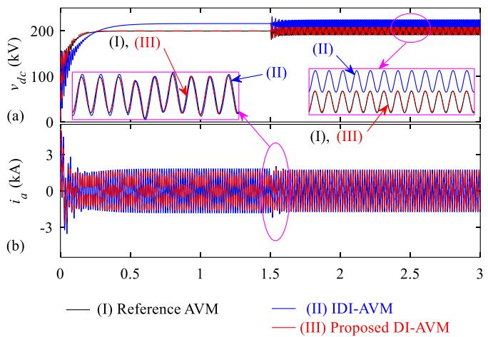  
FIGURE 12. Transient response of the dc-link voltage and the VSC phase a current as obtained by the AVMs with large time-steps: (I) Reference AVM with 1 µs, (II) IDI–AVM with 150 µs, and (III) DI–AVM with 500 $\mu { \pmb 5 } .$

TABLE 1. Components of AC Variables as Percentage of Their Positive Sequence Components Under Balanced and Unbalanced Conditions Obtained by the Models   

<table><tr><td></td><td></td><td>Positive Sequence</td><td>Negative Sequence</td><td>Zero Sequence</td></tr><tr><td rowspan="4">Balanced Condition</td><td>AC Source</td><td>100%</td><td>0%</td><td>0%</td></tr><tr><td>Voltage</td><td>(57 kV)</td><td>(0 kV)</td><td>(0 kV)</td></tr><tr><td>AC Line</td><td>100%</td><td>0%</td><td>0%</td></tr><tr><td>Current</td><td>(1.60 kA)</td><td>(0 kA)</td><td>(0 kA)</td></tr><tr><td rowspan="4">Unbalanced Condition</td><td>AC Source</td><td>100%</td><td>10%</td><td>10%</td></tr><tr><td>Voltage</td><td>(57 kV)</td><td>(5.7 kV)</td><td>(5.7 kV)</td></tr><tr><td>AC Line</td><td>100%</td><td>44.4%</td><td>0%</td></tr><tr><td>Current</td><td>(1.60 kA)</td><td>(0.71 kA)</td><td>(0 kA)</td></tr></table>

are also calculated as percentages of their positive-sequence components under balanced and unbalanced conditions and are summarized in Table 1. It is noted that the data in Table I correspond to the results obtained from the models run with small time steps, where all of them provide consistent results, as demonstrated in Fig. 11.

Under unbalanced conditions with zero-sequence in source voltages, one can expect zero-sequence currents when DI-AVM is implemented according to Fig. 5(I) or (II) [with grounded ac neutral] and the neutral point of three-phase sources is grounded. However, it can be observed in Table I that zero-sequence currents do not (and should not) exist under unbalanced conditions, even though the source voltages have zero-sequence components. This verifies that the proposed extended DI-AVM is able to accurately prevent the flow of zero-sequence currents when implemented according to Fig. 5(III) or (IV) when the neutral point {n} is left floating.

It is also interesting to observe that a 10% negative sequence in the source voltages results in a 44.4% negative sequence current. This is a result of the fact that the negativesequence impedance of the converter is not equal to its positive-sequence impedance.

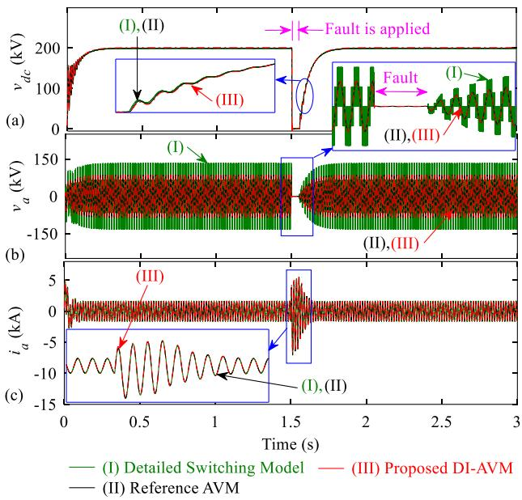  
FIGURE 13. Transient response of the system, when at t 1.5 s a three-phase fault is applied at the VSC ac terminals for 0.05 s, as obtained by the subject models: (a) Dc-link voltage, (b) VSC phase a voltage, and (c) VSC phase a current. Here, the proposed DI–AVM is run with a time-step of $\begin{array} { r } { \varDelta t = 3 0 0 \mu s . } \end{array}$ .

# C. TRANSIENTS UNDER FAULTY CONDITIONS

Here, the performance of the proposed extended DI–AVM is investigated under faulty conditions in the ac network. For this purpose, it is assumed that until t  1.5 s, the system condition is similar to Section IV-A, i.e., simulations start up from zero initial conditions with $M = 0 . 8 6 , \delta = 1 5 ^ { \circ }$ , and $i _ { r e c } = 1 \mathrm { k A }$ . Then, at $t = 1 . 5 \mathrm { ~ s ~ } _ { }$ , a three-phase fault is applied at the ac terminals of the VSC in Fig. 7 (with 0.1	 fault resistance), which lasts for 0.05 s (i.e., 3 ac cycles), after which the fault is removed. Simulations continue until $t = 3 \ \mathrm { s } .$ , and the transient responses of the system variables obtained by the subject models are shown in Fig. 13.

As seen in Fig. 13, when the three-phase fault occurs, the VSC terminal voltages become effectively zero (i.e., short circuit), resulting in a high current magnitude. After removing the fault, the dc and ac voltages recover, and the system operates in the pre-fault condition. Therein, it is also observed that the solution of the reference AVM is consistent with the results of the detailed switching model. Moreover, the proposed DI-AVM (here run with $\Delta t = 3 0 0 \mu \mathrm { s } )$ provides very accurate results compared to the reference AVM, even at such large time steps. It was also verified that the maximum time-step size that could be chosen for the IDI-AVM was $\Delta t = 2 0 \mu \mathrm { s }$ for this case study. As a representative, the VSC phase a voltage calculated by the IDI-AVM with $\Delta t = 2 5$ μs is shown in Fig. 14 compared to the reference AVM, which demonstrates that the IDI-AVM becomes numerically unstable after applying the fault.

Table II summarizes the numerical properties of the proposed DI-AVM with respect to the conventional IDI-AVM

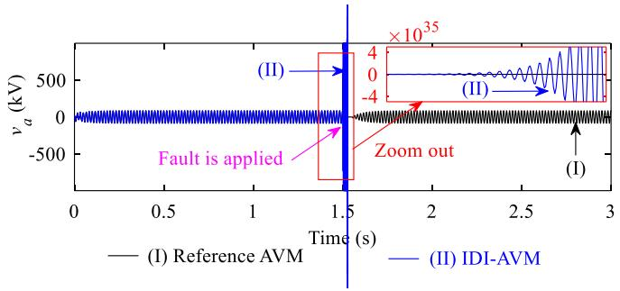  
FIGURE 14. Transient response of the VSC phase a voltage, when at t 1.5 s, a three-phase fault is applied at the VSC ac terminals for 0.05 s, as obtained by the subject models. Here, the IDI–AVM is run with a time-step of $\varDelta t = 2 5 \mu \leq .$

TABLE 2. Comparison of Computational Performance of the Subject AVMs of VSCs for the Considered System   

<table><tr><td>VSC AVM</td><td>Numerical Accuracy &amp; Stability</td><td>Max Step Size Δt</td><td>CPU Time Per Step</td></tr><tr><td>Conventional IDI-AVM</td><td>Low</td><td>~20–30 μs</td><td>~7.3 μs</td></tr><tr><td>Proposed DI-AVM</td><td>High</td><td>~500–1000 μs</td><td>~7.6 μs</td></tr></table>

of VSCs. As seen, the proposed DI-AVM offers higher numerical accuracy and stability compared to the IDI-AVM, as verified in Figs. 9–14. The DI-AVM also allows to increase the simulation time-step size to 500–1000 μs, as opposed to the IDI-AVM, which is limited to 20–30 μs. This represents 25–30 times computational gain. Table 2 presents the CPU time-per-step required for simulations of the considered system using the two subject AVMs when executed on a computer with an Intel $\mathrm { C o r e ^ { T M } }$ i7-9750H @2.60GHz processor. As seen in Table II, the DI-AVM requires only slightly more computation time than the IDI-AVM (i.e., 7.6 μs vs. 7.3 μs per step) due to having a varying conductance matrix. However, it should be noted that this difference depends on the number of nodes of the network and the excess time required for handling the varying network conductance matrix compared to the rest of the computations.

It should also be noted that various components in a system can have different time constants, e.g., the circuit, controllers, etc. To expect accurate simulation results, the constraints of all components (e.g., the sampling frequency of the controllers, delays of digital controls, etc.) should be respected when selecting the simulation time-step size. For EMTP simulations, it is typically recommended to choose a time-step size that is 10% of the minimum time-constant in the system to obtain results with adequate resolution [38].

The effectiveness of the proposed DI-AVM has also been verified for efficient EMT simulations of large-scale power-electronic-based systems, which include multiple ac– dc voltage-source converters; however, the results are not included here due to limited space.

# V. CONCLUSION

This article has developed a generalized average-value model for voltage-source power-electronic converters that is directly interfaced with external circuits as a conductance matrix in the nodal-based solution. The proposed directly interfaced AVM (DI–AVM) formulation was generalized for an arbitrary configuration of the interfacing nodes. This was done by formulating the extended equivalent conductance matrix for the VSC AVM, assuming all nodes are floating and can be connected to an external circuit as needed. The new proposed DI–AVM avoids the time-step delay inherent to the traditional dependent-source-based AVMs, thus allowing larger simulation time steps. The numerical advantages of the new DI–AVM have been demonstrated and verified in a widely used EMT program PSCAD/EMTDC. It was demonstrated that the proposed DI–AVM of VSCs can run with time steps as large as 500 μs while retaining very good accuracy under balanced, unbalanced, and faulty conditions, as opposed to the conventional indirectly-interfaced AVM, which loses its accuracy with time-steps larger than 30 μs. It is envisioned that the newly developed DI–AVM can become a beneficial asset for offline and real-time EMT simulators in system-level studies of power-electronic-based networks when larger than typical time steps may be desirable.

# APPENDIX

# A. PARAMETERS OF CASE-STUDY SYSTEM:

$| \mathbf { e } _ { a b c } | _ { p h a s e } ^ { r m s } = 5 7 \mathrm { k V } , f _ { e } = 6 0 \mathrm { H z } , r _ { a c } = 1 . 5 \Omega , L _ { a c } = 3 7 \mathrm { m H } ,$ |eabc| rmsphase $C _ { d c } \overset { \cdot } { = } 7 4 . 2 5 \ \mu \mathrm { F } .$ .

# B. PARAMETERS OF PI CONTROLLERS:

Outer loops (PI-1, PI-2): $K _ { \mathrm { p } } = 0 . 3 1 3 , \tau _ { \mathrm { I } } = 0 . 0 5 2 \mathrm { s } .$ , Inner loops (PI-3, PI-4): $K _ { \mathrm { p } } = 1 0 . 2 9 , \tau _ { \mathrm { I } } = 0 . 2 6 8 \mathrm { s } .$

# REFERENCES

[1] W. Wang, A. Beddard, M. Barnes, and O. Marjanovic, “Analysis of active power control for VSC–HVDC,” IEEE Trans. Power Del., vol. 29, no. 4, pp. 1978–1988, Aug. 2014.   
[2] S. Li, T. A. Haskew, and L. Xu, “Control of HVDC light system using conventional and direct current vector control approaches,” IEEE Trans. Power Electron., vol. 25, no. 12, pp. 3106–3118, Dec. 2010.   
[3] H. W. Dommel, “Digital computer solution of electromagnetic transients in single and multiphase networks,” IEEE Trans. Power App. Syst., vol. PAS-88, no. 4, pp. 388–399, Apr. 1969.   
[4] Y. Gu and T. C. Green, “Power system stability with a high penetration of inverter-based resources,” Proc. IEEE, vol. 111, no. 7, pp. 832–853, Jul. 2023.   
[5] RTDS Technologies Applications, Superstep, 2022. [Online]. Available: https://knowledge.rtds.com/hc/en-us/articles/360034827413- Superstep   
[6] J. Mahseredjian, V. Dinavahi, and J. A. Martinez, “Simulation tools for electromagnetic transients in power systems: Overview and challenges,” IEEE Trans. Power Del., vol. 24, no. 3, pp. 1657–1669, Jul. 2009.   
[7] M. O. Faruque, V. Dinavahi, and W. Xu, “Algorithms for the accounting of multiple switching events in digital simulation of power-electronic systems,” IEEE Trans. Power Del., vol. 20, no. 2, pp. 1157–1167, Apr. 2005.   
[8] EMTDC User’s Guide v4.6, “Chapter 4: Advanced features, Interpolation and switching,” 2018. [Online]. Available: https://www.pscad.com/ knowledge-base/article/163

[9] X. Wang and F. Blaabjerg, “Harmonic stability in power electronicbased power systems: Concept, modeling, and analysis,” IEEE Trans. Smart Grid, vol. 10, no. 3, pp. 2858–2870, May 2019.   
[10] P. T. Krein, J. Bentsman, R. M. Bass, and B. L. Lesieutre, “On the use of averaging for the analysis of power electronic systems,” IEEE Trans. Power Electron., vol. 5, no. 2, pp. 182–190, Apr. 1990.   
[11] S. Chiniforoosh et al., “Definitions and applications of dynamic average models for analysis of power systems,” IEEE Trans. Power Del., vol. 25, no. 4, pp. 2655–2669, Oct. 2010.   
[12] S. R. Sanders, J. M. Noworolski, X. Z. Liu, and G. C. Verghese, “Generalized averaging method for power conversion circuits,” IEEE Trans. Power Electron., vol. 6, no. 2, pp. 251–259, Apr. 1991.   
[13] X. Liu, A. M. Cramer, and F. Pan, “Generalized average method for time-invariant modeling of inverters,” IEEE Trans. Circuits Syst. I: Regular Papers, vol. 64, no. 3, pp. 740–751, Mar. 2017.   
[14] Y. Xu, Y. Chen, C.-C. Liu, and H. Gao, “Piecewise average-value model of PWM converters with applications to large-signal transient simulations,” IEEE Trans. Power Electron., vol. 31, no. 2, pp. 1304–1321, Feb. 2016.   
[15] A. Yazdani and R. Iravani, “A generalized state-space averaged model of the three-level NPC converter for systematic DC-voltage-balancer and current-controller design,” IEEE Trans. Power Del., vol. 20, no. 2, pp. 1105–1114, Apr. 2005.   
[16] M. M. Z. Moustafa and S. Filizadeh, “A VSC-HVDC model with reduced computational intensity,” in Proc. IEEE Power Energy Soc. Gen. Meeting, 2012, pp. 1–6.   
[17] Q. Zhang, J. He, Y. Xu, Z. Hong, Y. Chen, and K. Strunz, “Averagevalue modeling of direct-driven PMSG-based wind energy conversion systems,” IEEE Trans. Energy Convers., vol. 37, no. 1, pp. 264–273, Mar. 2022.   
[18] J. M. Cano et al., “Dynamic average-value modeling of direct powercontrolled active front-end rectifiers,” IEEE Trans. Power Del., vol. 29, no. 6, pp. 2458–2466, Dec. 2014.   
[19] A. N. Rahman, H. J. Chiu, and K. L. Lian, “Enhanced time average model of three phase voltage source converter taking dead-time distortion effect into account,” IEEE Access, vol. 9, pp. 23648–23659, 2021.   
[20] K. Sidwall and P. Forsyth, “A review of recent best practices in the development of real-time power system simulators from a simulator manufacturer’s perspective,” Energies, vol. 15, no. 3, Feb. 2022, Art. no. 1111.   
[21] J. Peralta, H. Saad, S. Dennetiere, J. Mahseredjian, and S. Nguefeu, “Detailed and averaged models for a 401-level MMC–HVDC system,” IEEE Trans. Power Del., vol. 27, no. 3, pp. 1501–1508, Jul. 2012.   
[22] H. Saad et al., “Dynamic averaged and simplified models for MMCbased HVDC transmission systems,” IEEE Trans. Power Del., vol. 28, no. 3, pp. 1723–1730, Jul. 2013.   
[23] H. Saad et al., “Modular multilevel converter models for electromagnetic transients,” IEEE Trans. Power Del., vol. 29, no. 3, pp. 1481–1489, Jun. 2014.   
[24] A. Beddard, C. E. Sheridan, M. Barnes, and T. C. Green, “Improved accuracy average value models of modular multilevel converters,” IEEE Trans. Power Del., vol. 31, no. 5, pp. 2260–2269, Oct. 2016.   
[25] X. Meng, J. Han, L. Wang, and W. Li, “A unified arm module-based average value model for modular multilevel converter,” IEEE Access, vol. 8, pp. 63821–63831, 2020.   
[26] N. Herath and S. Filizadeh, “Average-value model for a modular multilevel converter with embedded storage,” IEEE Trans. Energy Convers., vol. 36, no. 2, pp. 789–799, Jun. 2021.   
[27] H. Liu et al., “The averaged-value model of a flexible power electronics based substation in hybrid AC/DC distribution systems,” CSEE J. Power Energy Syst., vol. 8, no. 2, pp. 452–464, Mar. 2022.   
[28] M. Yu and H. Konishi, “The real time digital simulation of a single phase voltage source converter and its application,” in Proc. Int. Conf. Power Syst. Transients, 2003, pp. 1–5.   
[29] J. Mahseredjian, L. Dubé, M. Zou, S. Dennetière, and G. Joos, “Simultaneous solution of control system equations in EMTP,” IEEE Trans. Power Syst., vol. 21, no. 1, pp. 117–124, Feb. 2006.   
[30] S. Ebrahimi, H. Atighechi, S. Chiniforoosh, and J. Jatskevich, “Direct interfacing of parametric average-value models of AC–DC converters for nodal analysis-based solution,” IEEE Trans. Energy Convers., vol. 37, no. 4, pp. 2408–2418, Dec. 2022.

[31] S. Ebrahimi and J. Jatskevich, “Average-value model for voltage-source converters with direct interfacing in EMTP-type solution,” IEEE Trans. Energy Convers., vol. 38, no. 3, pp. 2231–2234, Sep. 2023.   
[32] S. Ebrahimi, T. Vahabzadeh, and J. Jatskevich, “Direct interfacing of average-value models of VSCs in PSCAD/EMTDC,” in Proc. IEEE Elect. Power Energy Conf., 2022, pp. 452–457.   
[33] W. Taha, A. R. Beig, and I. Boiko, “Design of PI controllers for a grid-connected VSC based on optimal disturbance rejection,” in Proc. IECON 41st Annu. Conf. IEEE Ind. Electron. Soc., 2015, pp. 001954–001959.   
[34] F. Blaabjerg, R. Teodorescu, M. Liserre, and A. V. Timbus, “Overview of control and grid synchronization for distributed power generation systems,” IEEE Trans. Ind. Electron., vol. 53, no. 5, pp. 1398–1409, Oct. 2006.   
[35] X. Wang, L. Harnefors, and F. Blaabjerg, “Unified impedance model of grid-connected voltage-source converters,” IEEE Trans. Power Electron., vol. 33, no. 2, pp. 1775–1787, Feb. 2018.   
[36] P. C. Krause, O. Wasynczuk, S. D. Sudhoff, and S. Pekarek, Analysis of Electric Machinery and Drive Systems. 3rd ed. Piscataway, NJ, USA: Wiley, 2013.   
[37] S. Banerjee and A. Roy, Linear Algebra and Matrix Analysis for Statistics. 1st ed. New York, NY, USA: CRC Press, 2014.   
[38] J. C. G. de Siqueira, B. D. Bonatto, J. R. Martí, J. A. Hollman, and H. W. Dommel, “Optimum time step size and maximum simulation time in EMTP-based programs,” in Proc. IEEE Power Syst. Comput. Conf., 2014, pp. 1–7.

SEYYEDMILAD EBRAHIMI (Member IEEE) received the B.Sc. and M.Sc. degrees in electrical engineering from the Sharif University of Technology, Tehran, Iran, in 2010 and 2012, respectively, and the Ph.D. degree in electrical and computer engineering from The University of British Columbia (UBC), Vancouver, BC, Canada, in 2019. He is currently a Postdoctoral Teaching and Research Fellow with the Department of Electrical and Computer Engineering, UBC. His research interests include modeling and analysis of power electronic

converters and electrical machines, application of power electronics to power systems, modeling and control of power systems, and simulation of electromagnetic transients.

TALEB VAHABZADEH (Graduate Student Member, IEEE) received the B.Sc. degree in electrical engineering from the University of Tehran, Tehran, Iran, in 2021. He is currently working toward the M.A.Sc. degree in electrical and computer engineering with The University of British Columbia, Vancouver, BC, Canada. His research interests include modeling, stability analysis, and control of power electronics-based power systems.

JURI JATSKEVICH (Fellow, IEEE) received the M.S.E.E. and Ph.D. degrees in electrical engineering from Purdue University, West Lafayette IN, USA, in 1997 and 1999, respectively. Since 2002, he has been with The University of British Columbia, Vancouver, BC, Canada, where he is currently a Professor with the Department of Electrical and Computer Engineering. His research interests include power electronic systems, electrical machines and drives, modeling and simulation of electromagnetic transients. Dr. Jatskevich was

an Associate Editor for IEEE TRANSACTIONS ON POWER ELECTRONICS during 2008–2013, the Editor-in-Chief of IEEE TRANSACTIONS ON ENERGY CON-VERSION during 2013–2019, and the Editor-in-Chief At-Large of the IEEE PES journals during 2019–2020. He is also chairing the IEEE Task Force on Dynamic Average Modeling, under Working Group on Modeling and Analysis of System Transients Using Digital Programs. He was the recipient of the 2022 IEEE PES Cyril Veinott Electromechanical Energy Conversion Award.