# Advanced DSOGI PLL with Adaptive Bandwidth for Improved Transient Performance of Grid Connected Inverter Control Systems.

Githmi Ranasinghe,

Graduate Student Member, IEEE

Department of Elect. and Comp. Engineering

University of Manitoba

Winnipeg, Manitoba, Canada

ranasing@myumanitoba.ca

Athula D. Rajapakse,

Senior Member, IEEE

Department of Elect. and Comp. Engineering

University of Manitoba

Winnipeg, Manitoba, Canada

athula rajapakse@umanitoba.ca

Lalin Kotalawala,

Power Technology Centre,

Manitoba Hydro International ,

Winnipeg, Manitoba, Canada

lalink@mhi.ca

Abstract—This paper proposes an advanced modified Double Second Order Generalized Integrator (DSOGI) Phase-Locked Loop (PLL) tailored specially for inverter-based systems which uses decoupled control systems. The proposed enhancements incorporate a transient detector for temporarily freezing the PLL frequency, which is used within the DSOGI-PLL control system, during transients. Additionally, an adaptive bandwidth technique dynamically adjusts the PLL bandwidth, ensuring swift response and reduced phase error during disturbances. The study underscores the importance of these modifications in achieving rapid and accurate synchronization, especially in inverter-based systems. Simulation results validate the effectiveness of the proposed method, showcasing its potential to mitigate instability issues and enhance system resilience when connecting inverter-based resources to weak grids.

Keywords—DSOGI-PLL, Adaptive bandwidth, Transient detector, Fault conditions, Inverter control, System stability.

# I. INTRODUCTION

Increasing integration of inverter-based renewable energy sources have underscored the critical importance of robust synchronization methods in power systems. This is because decoupled control architectures used in modern inverters, highly rely on the efficacy of the phase locked loop (PLL) to achieve the desired control performance [1], [2]. PLL performance is a factor significantly contributing to stability of inverters connected to weak grids [3]. Traditionally, techniques such as the Synchronous Reference Frame (SRF) have been employed to implement PLLs for inverter control in power systems [4]. While SRF offers simplicity in implementation, it comes with inherent drawbacks, notably its limitations in handling harmonics and unbalanced systems [5]. In response to these challenges, a surge in research to introduce alternative methodologies have been reported in literature [6], [7]. Among these, the Double Second-Order Generalized Integrator (DSOGI) PLL stands out as a noteworthy solution [8], [9].

While recognizing the strengths of DSOGI-PLL, recent experience in the field have identified opportunities for further refinement. In particular, the synchronization speed during fault conditions in inverter-based systems, specially under weak grid conditions, has been identified as a focal point for improvement. This paper attempts to address this need by introducing innovative modifications to the DSOGI-PLL,

enhancing its capabilities to ensure swift and accurate synchronization, especially in scenarios where faults can lead to system instability. The modifications introduce a transient detector to swiftly identify disturbances and temporarily freeze the PLL frequency output which is used in the DSOGI-PLL structure. Similar idea is proposed for frequency measurement in [10]. Additionally, an adaptive bandwidth technique is incorporated to dynamically adjust the PLL bandwidth, optimizing the synchronization process for enhanced performance. By minimizing phase errors and expediting the synchronization process, this enhanced PLL can significantly to improve the stability and resilience of power systems during the transient conditions arising from various disturbances. Importantly, the steady-state operation of DSOGI-PLL is not degraded with the proposed modifications, underscoring the robustness and compatibility of the introduced enhancements. The effectiveness of the modifications was validated using artificial test waveforms. Subsequently, the PLL in inverter controls was examined within the context of a solar PV plant connected to transmission a grid.

# II. ANALYSIS OF SRF-PLL AND DSOGI-PLL

# A. SRF-PLL.

Fig.1 shows the basic structure of the SRF-PLL. In this PLL, the transformation of the three-phase input voltages to the dq synchronous reference frame is achieved through a combination of Clark and Park transformations. Through the application of a feedback loop, the angular position of the dq reference frame is regulated. In Fig.1, $\omega_{n}$ is the nominal frequency of the system while $\hat{\theta}$ and $\hat{\omega}$ are the estimated angle and angular frequency respectively.

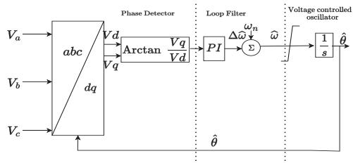  
Figure 1. Basic structurer of SRF-PLL

Most of the SRF-PLLs used in control systems directly feed $Vq$ to the PI controller. However, this direct approach introduces nonlinearity to the PLL, potentially resulting in

slower responses and system instability under specific conditions. Furthermore, the magnitude of the voltage contributes to the PLL bandwidth, leading to dynamic changes in bandwidth as the voltage magnitude varies. Taking arc tangent of $Vq / Vd$ can make the PLL linear, and the PLL can have a constant BW irrespective of the magnitude of the voltage [11]. This method is used in modifying the proposed DSOGI-PLL.

Fig.2 shows the small signal model of the SRF-PLL. If the disturbance terms are neglected by taking, $\tan^{-1}(Vq / Vd)$ , the error of the angle can be found as in (1) and the open loop transfer function of the SRF in (2) can be formulated [9]. In Fig. 2, $\varphi 1^{+}$ , $\widehat{\varphi 1^{+}}$ are the actual and estimated phase angles of the positive sequence component of the fundamental of the input voltage and $\widehat{\theta} = \widehat{\omega}\mathrm{t} + \widehat{\varphi 1^{+}}$ .

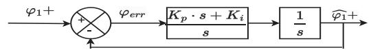  
Figure 2. Small signal model of the SRF PLL

$$
\varphi_ {e r r} = \left(\varphi 1 ^ {+} - \widehat {\varphi 1 ^ {+}}\right) \tag {1}
$$

$$
G _ {o l _ {S R F}} = \left(\frac {K _ {p} s + K _ {i}}{s}\right) \frac {1}{s} \tag {2}
$$

# B. DSOGI-PLL

Double Second-Order Generalized Integrator PLL has three main parts as DSOGI which has two Single Second-Order Generalized Integrator (SOGI) parts, a Positive Sequence Calculator (PSC) and a SRF-PLL which is the conventional PLL. Structures of the DSOGI-PLL and SOGI block are shown in Fig. 3 and Fig. 4 respectively. In the configuration shown in Fig. 3, two SOGIs are utilized to filter $\mathrm{v}_{\alpha}$ and $\mathrm{v}_{\beta}$ signals in the pre-filtering stage. Additionally, the SOGIs function as a Quadrature Signal Generator (QSG), producing quadrature filtered versions of $\mathrm{v}_{\alpha}$ and $\mathrm{v}_{\beta}$ signals $(\mathrm{qv}^{\prime}_{\alpha}$ and $\mathrm{qv}^{\prime}_{\beta})$ . Here, $\widehat{\omega}$ and $k$ represent the estimated frequency and damping factor, respectively [12]. The transient detector is a modification introduced in this paper.

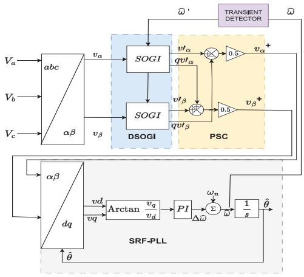  
Figure 3. Structure of modified DSOGI-PLL

The signals from the SOGI-QSG blocks are processed through the PSC to reveal the Fundamental Frequency Positive Sequence (FFPS) components. Finally, these components are fed into the SRF-PLL to extract the grid frequency and phase.

The detected grid frequency $\widehat{\omega}$ , can be fed back to the SOGI-QSG blocks to ensure the DSOGI-PLL remains frequency adaptive. And here the DSOGI -PLL act as a combination of bandpass and low pass filters, which can extract the fundamental frequency [9], [12]. According to [13], optimized $k$ value of the DSOGI-PLL to have favorable results in terms of settling time, overshoot and harmonic rejection capabilities is 1.414, which leads to 0.7 damping factor in SOGI blocks. Therefore, this value is used in the proposed DSOGI -PLL.

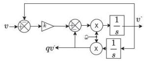  
Figure 4. SOGI block

Even though the DSOGI-PLL has a complex structure, a small signal model as shown in Fig. 5 has been proposed in [11]. Here $\omega_{p} = \frac{k\widehat{\omega}}{2}$ and $K_{p}, K_{i}$ are the paramters of the PI controller. Based on the model, the open loop transfer function of the DSOGI-PLL can be obtained as in (3).

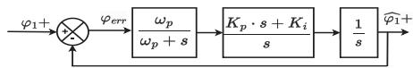  
Figure 5. Small signal model of DSOGI -PLL

$$
G _ {o l _ {D S O G I}} = \left(\frac {K _ {p} s + K _ {i}}{s}\right) \left(\frac {\omega_ {p}}{\omega_ {p} + s}\right) \frac {1}{s} \tag {3}
$$

The frequency responses of the SRF-PLL and DSOGI-PLL are compared in Fig. 6. The normal practice in selecting the cross over frequency $(\omega_{\mathrm{c}})$ is to select attenuation as $-20$ dB around $2\omega$ (where $\omega$ is the system frequency in rad/s)[11]. As depicted in Fig.6, when evaluating the DSOGI-PLL, it becomes evident that there is more flexibility for increasing the bandwidth compared to the standard PLL. To compare the bandwidths of the SRF and DSOGI PLLs, the same cross over frequency is used to develop the DSOGI-PLL. This selection yields the crossover frequency $\omega_{\mathrm{c}}$ to be $0.1\times 2\pi \times \omega$ rad/s. Therefore, the value of $\omega_{\mathrm{c}}$ is selected around $62~\mathrm{rad / s}$ for a $60~\mathrm{Hz}$ system. The values of $K_{p}$ and $K_{i}$ of the PI controller that yield the above cross over frequency and a phase margin above $50^{\circ}$ are 57.1 and 1660.1 respectively.

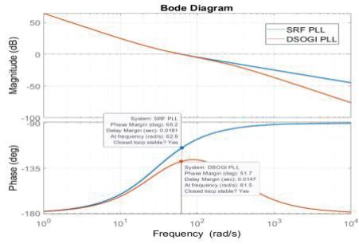  
Figure 6. Bode plots of SRF -PLL and DSOGI-PLL for normal operation

# III. ADAPTIVE BW PLL WITH TRANSIENT DETECTION.

This research proposes an Adaptive Bandwidth PLL (ABW PLL) with a built-in transient detection feature. The ABW PLL dynamically adjusts its bandwidth during transients

for rapid synchronization. The transient detection freezes PLL frequency during disturbances, minimizing disruptions, and ensuring efficient inverter operation.

# A. Design Considerations

Transient detector: Filtering of DSOGI-PLL directly relies on the frequency fed to the SOGI blocks. However, during transient events, fluctuations in the detected frequency by the PLL can occur (which become more prominent in ABW PLL), potentially impacting the filtering capability of the DSOGI-PLL. In response to this challenge, a transient detector which activates upon observing a sudden change in frequency is incorporated into the system. When a transient is identified by the transient detector, it temporary freezes the frequency at the value just before the inception of transient for a period of $T_{fz}$ . This frozen frequency is then provided to the SOGI blocks. By doing so, the DSOGI-PLL mitigates the potential undesirable outcomes associated with transient events, ensuring a more stable and effective filtering process. This adaptive mechanism contributes to the robust performance of the DSOGI-PLL, particularly in handling transient conditions, especially during the fault scenarios.

Adaptive bandwidth: The adaptive bandwidth (ABW) scheme is activated when a phase error greater than a threshold value $\varepsilon$ is detected as illustrated in Fig. 7. Upon detecting such deviations, the bandwidth is rapidly increased, allowing the PLL to respond swiftly to transient events and enhancing its capacity to track and synchronize with grid phase changes promptly. This dynamic adjustment supports system stability during crucial moments, such as fault conditions or sudden grid fluctuations. As conditions normalize, the bandwidth is gradually reduced, preventing overshooting, and minimizing the introduction of unnecessary phase errors during the transition back to steady-state operation. This is achieved by linearly changing the control gains to original values with time, offering an effective means of enhancing PLL performance in dynamic power system environments by providing a balance between precision and adaptability.

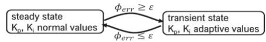  
Figure 7. Adaptive bandwidth mechanism.

When increasing the bandwidth, it is important to ensure that the system remains underdamped to avoid slow responses. According to previous research it is desirable to have 0.7 as the damping ratio of the system to have favorable operation [12]. Therefore, by considering the open loop transfer function described in (3), it is possible to derive the characteristic equation of the system as:

$$
s ^ {3} + \omega_ {p} \cdot s ^ {2} + K _ {p} \cdot \omega_ {p} \cdot s + K _ {i} \cdot \omega_ {p} = 0 \tag {4}
$$

If the system considered as underdamped, (4) can be factorized as shown in (5), and expanded to obtain (6), where A is a constant and $w_{n}$ is the natural frequency and $\xi$ is the damping coefficient.

$$
(s + A) \left(s ^ {2} + 2 \xi w _ {n} s + w _ {n} ^ {2}\right) = 0 \tag {5}
$$

$$
s ^ {3} + (2 \xi w _ {n} + A) s ^ {2} + \left(w _ {n} ^ {2} + 2 \xi w _ {n} A\right) s + A w _ {n} ^ {2} = 0 \tag {6}
$$

Equating the coefficients of (4) and (6) gives:

$$
\omega_ {p} = (2 \xi w _ {n} + A); \quad A w _ {n} ^ {2} = K _ {i} \omega_ {p};
$$

$$
\left(w _ {n} ^ {2} + 2 \xi w _ {n} A\right) = \omega_ {p} K _ {p} \tag {7}
$$

Using these equations, appropriate $K_{p}$ and $K_{i}$ values to obtain the desired damping and $\omega_{p}$ can be determined by following the procedure illustrated in Fig. 8.

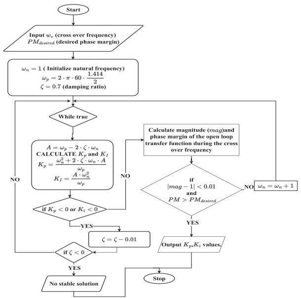  
Figure 8. Procedure for finding $K_{p}$ , $K_{i}$ values for specified bandwidths.

# B. Performance Evaluation

Proposed DSOGI-PLL is tested using two test cases (i) test waveform generator and (ii) a solar plant connected to an equivalent voltage source.

# 1) Test Waveform Generator:

The first test scenario involves the use of test waveforms, which are artificially generated by simulating a flexible test system. Such test waveforms allow for controlled experiments, enabling simulating of various grid conditions, transients, and disturbances. Fig. 9 shows the test sytem used for generating artificial test signals. It has the capability of dynamically changing the voltage magnitude, phase and frequency of the source. Harmonics can be injected to the system by connecting the resonance circuit. The system was simulated in PSCAD to generate the test signals. Grounding transformer allows flow of triplet harmonics and ground currents as the main transformer is $\Delta -\Delta$ connected.

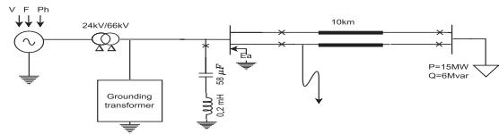  
Figure 9. System used to generate artificial test waveforms

# 2) Solar plant connected IEEE 9 bus system.

In the second test, the IEEE-9 bus system was modified by substituting one generator with a solar plant as shown in Fig. 10. In this simulation, synchronous generators were modeled

as machines, incorporating electromechanical dynamics. The solar PV inverter, operating with a decoupled control system, relies on the PLL. This system facilitates evaluating the PLL performance under realistic power system dynamics. The entire test system was simulated in PSCAD software with a 5 $\mu$ s time step.

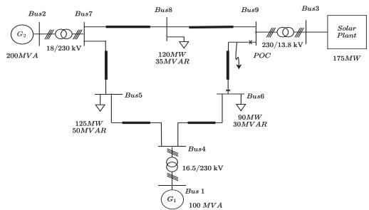  
Figure 10. IEEE 9 bus system with installed solar plant and loads.

# IV. RESULTS AND DISCUSSION.

Root mean square error (RMSE) is used to determine the phase tracking accuracy and it can be calculated using (8), where $K$ is the variable of which the error is evaluated.

$$
R M S E = \sqrt {\frac {\sum_ {k = 1} ^ {N} \left(K _ {\text {p r e d i c t e d}} - K _ {\text {a c t u a l}}\right) ^ {2}}{N}} \tag {8}
$$

# A. Comaparison of DSOGI-PLL with and without BW adjustments using a test waveform.

The presented results provide a comparative assessment of the PLL performance under various scenarios, comparing the outcomes with and without the proposed modifications. The system was subjected to various dynamics and events (harmonics, unbalanced fault, phase jump and a frequency ramp) as shown in the Fig. 11. In this work, the bandwidth is increased by 5 times during a transient compared to normal operation, with $\varepsilon$ set at $0.1\mathrm{rad}$ , and $T_{fz}$ is defined as 0.1s.

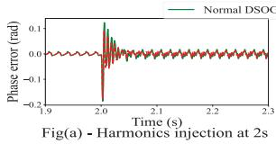

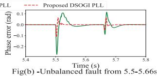

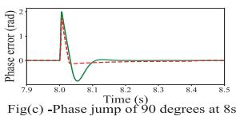

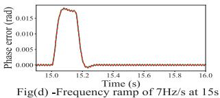  
Figure 11. Phase error vs time under different system transients.

The power system with a high penetration of renewable energy resources usually experiences a higher rate of change of frequency (ROCOF), which typically doesn't exceed $4\mathrm{Hz / s}$ [14]. To demonstrate worst-case scenarios, a frequency ramp of $7\mathrm{Hz / s}$ used to show that the system can quickly track the frequency with the proposed modifications.

The settling times and the overshoots corresponding to the unbalanced fault and the phase jump $(90^{\circ}$ jump) events are given in Table I. It can be noticed that the settling time and

overshoot of the proposed PLL are lower compared to the normal DSOGI-PLL during both unbalanced fault and phase jump conditions.

TABLE I. SETTLING TIME AND OVERSHOT   

<table><tr><td rowspan="2"></td><td colspan="2">Unbalanced fault</td><td colspan="2">Phase jump</td></tr><tr><td>Settling time (s)</td><td>Overshoot (rad)</td><td>Settling time (s)</td><td>Overshoot (rad)</td></tr><tr><td>Normal DSOGI-PLL</td><td>0.040</td><td>0.272</td><td>0.15</td><td>2.003</td></tr><tr><td>Proposed DSOGI-PLL</td><td>0.016</td><td>0.113</td><td>0.03</td><td>1.719</td></tr></table>

To compare quantitatively, in Table II, performance is presented in terms of the RMSE, which incorporates the error due to oscillations observed during the harmonic injection and frequency ramp events. It is observed that RMSE values remain identical or better for the ABW DSOGI-PLLs during harmonic injection and frequency ramp scenarios. This suggests that the steady-state operation of the ABW DSOGI-PLL is not degraded by the proposed modifications, showcasing the robustness and the enhancements are achieved without compromising the baseline performance.

TABLE II. RMSE VALUES OF PHASE ERROR (RAD)   

<table><tr><td></td><td colspan="2">Harmonics injection</td><td colspan="2">Frequency ramp (60-61) Hz</td></tr><tr><td>Time durations (s)</td><td>1.90-2.00 THD 2%</td><td>2.05-2.15 THD 4%</td><td>14.9-15.0 (No ramp)</td><td>15.0-15.15 (7Hz/s ramp)</td></tr><tr><td>Normal DSOGI-PLL</td><td>0.0040</td><td>0.0078</td><td>0.00011</td><td>0.015</td></tr><tr><td>Proposed DSOGI-PLL</td><td>0.0039</td><td>0.0063</td><td>0.00011</td><td>0.015</td></tr></table>

The variations of the frequency during the same events are shown in Fig. 12. ABW allows faster tracking of frequency but can cause larger fluctuations. These fluctuations are effectively mitigated by the transient detector before feeding to DSOGI block. The RMSE values for the normal DSOGI-PLL, the ABW DSOGI PLL, and the frequency obtained after the transient detector are presented in Table III.

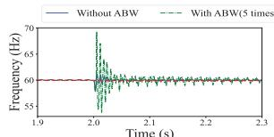

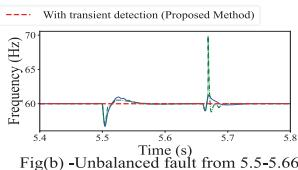

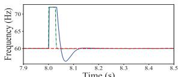  
Fig(a) - Harmonics injection at 2s   
Fig(c)-Phase jump of 90 degrees at 8s

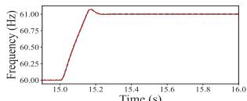  
Fig(d)-Frequency ramp of $7\mathrm{Hz / s}$ at 15s   
Figure 12. Comparison of estimated frequency under different transients.

TABLE III. RMSE VALUES (HZ) OF FREQUENCY (HZ)   

<table><tr><td>Time (s)</td><td>Frequency without ABW</td><td>Frequency with ABW</td><td>Frequency with transient detector</td></tr><tr><td>2.0-3.0</td><td>0.105</td><td>0.307</td><td>0.040</td></tr><tr><td>5.5-6.66</td><td>0.204</td><td>0.221</td><td>0.020</td></tr><tr><td>8.0-9.0</td><td>2.16</td><td>1.880</td><td>0.001</td></tr><tr><td>15.0-16.0</td><td>0.0157</td><td>0.016</td><td>0.000</td></tr></table>

While there are instances of higher RMSE values for frequency with the ABW DSOGI-PLL, the RMSE values following the use of the transient detector are markedly low. It is important to recognize that the frequency is a byproduct of the Phase-Locked Loop (PLL). Therefore, the potential adverse effects that may arise when increasing the PLL bandwidth can be effectively mitigated through the incorporation of the transient detector. This observation highlights the utility of the transient detector in enhancing the overall performance and precision of the PLL in dynamic operating conditions, particularly during transient events.

# B. Comaparison of DSOGI PLL with and without BW adjustments in a grid connected PV plant.

The impact of a balanced fault (illustrated in Fig. 10) on the solar plant-connected system is presented in Fig. 13. The SCR of the PV system used is close to 1.8. In the case where the standard DSOGI-PLL is employed, the system experiences instability after removing Line 9-6 to clear a fault. This is due to transient variations and delayed tracking of the phase angle at the point of interconnection, which adversely affects the control system that uses the phase angel for dq transformation. Contrastingly, with the proposed DSOGI-PLL, the phase angle is promptly tracked after the fault is cleared. Despite some initial overshoots in power, the system stabilizes approximately within 0.5s after clearing the fault.

The system stability under the normal DSOGI PLL is observed to be maintained down to a minimum Short-Circuit Ratio (SCR) of 2.3 for the event. Beyond this threshold, a decrease in SCR results in system instability. But with the use of the proposed PLL the SCR can be reduced even further, down to 1.0. This outcome highlights the effectiveness of the proposed modifications in ensuring swift and accurate phase detection, ultimately contributing to the stability and resilience of the system specially in post-fault scenarios. Furthermore, this modified PLL is tested under different fault scenarios including balanced and unbalanced faults and it is well performing compared to the standard DSOGI-PLL.

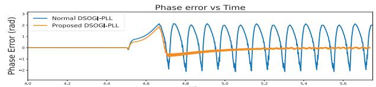

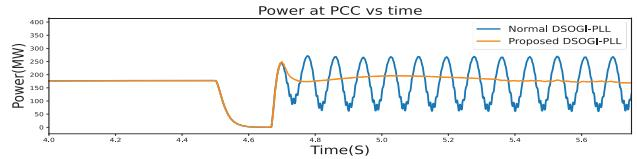  
Figure 13. Comparison of PV plant control performance with two PLLs

# V. CONCLUSIONS.

The modifications proposed to DSOGI-PLL in this paper, including the integration of a transient detector and an adaptive bandwidth scheme, combined with the utilization of the arctangent function in the PLL control loop, collectively contribute to a more robust and accurate synchronization method for converter control systems. The transient detector is a key component contributing to improved performance,

swiftly identifying, and responding to transient conditions by freezing the PLL frequency. This reduces initial overshoot, particularly during phase jumps and faults, compared to the standard DSOGI-PLL. When combined with the adaptive bandwidth scheme, the PLL's capacity to synchronize rapidly with grid voltage significantly improves, maintaining system stability. The arctangent function ensures PLL linearity, offering constant bandwidth irrespective of voltage magnitude, crucial in inverter-based systems. Simulation results confirm the effectiveness of these modifications, showing improved stability, reduced phase error, and enhanced adaptability. The adaptive bandwidth DSOGI-PLL outperforms traditional PLLs, especially in transient events and fault conditions.

# REFERENCES

[1] H. S. Kamil, D. M. Said, M. W. Mustafa, M. R. Miveh, and N. Ahmad, "Low-voltage ride-through methods for grid-connected photovoltaic systems in microgrids: A review and future prospect," International Journal of Power Electronics and Drive Systems, vol. 9, no. 4. 2018. doi: 10.11591/ijpeds.v9.i4.pp1834-1841.   
[2] M. Farraj, R. Kaluthanthrige, and A. Rajapakse, “Evaluating a Microgrid Control System Using Controller Hardware in the Loop Simulations,” in 2021 IEEE Electrical Power and Energy Conference, EPEC 2021, 2021. doi: 10.1109/EPEC52095.2021.9621626.   
[3] Q. Jia, G. Yan, Y. Cai, Y. Li, and J. Zhang, "Small-signal stability analysis of photovoltaic generation connected to weak AC grid," Journal of Modern Power Systems and Clean Energy, vol. 7, no. 2, 2019, doi: 10.1007/s40565-018-0415-3.   
[4] P. Kanjiya, B. Singh, A. Chandra, and K. Al-Haddad, ““SRF Theory Revisited” to control self-supported dynamic voltage restorer (DVR) for unbalanced and nonlinear loads,” in IEEE Transactions on Industry Applications, 2013. doi: 10.1109/TIA.2013.2261273.   
[5] A. Dash, R. K. Behera, D. P. Bagarty, and P. K. Hota, "A Novel Method for Synchronization with Unbalanced Grid: An Experimental Investigation," in 2018 20th National Power Systems Conference, NPSC 2018, 2018. doi: 10.1109/NPSC.2018.8771866.   
[6] S. V. Kulkarni and D. N. Gaonkar, "An investigation of PLL synchronization techniques for distributed generation sources in the grid-connected mode of operation," Electric Power Systems Research, vol. 223. 2023. doi: 10.1016/j.epsr.2023.109535.   
[7] P. Gawhade and A. Ojha, "Recent advances in synchronization techniques for grid-tied PV system: A review," Energy Reports, vol. 7. 2021. doi: 10.1016/j.egyr.2021.09.006.   
[8] J. G. Rueda-Escobedo, S. Tang, and J. Schiffer, “A performance comparison of PLL implementations in low-inertia power systems using an observer-based framework,” in IFAC-PapersOnLine, 2020. doi: 10.1016/j.ifacol.2020.12.1132.   
[9] S. Golestan, M. Monfared, and F. D. Freijedo, "Design-oriented study of advanced synchronous reference frame phase-locked loops," IEEE Trans Power Electron, vol. 28, no. 2, 2013, doi: 10.1109/TPEL.2012.2204276.   
[10] B. X. L. L. Lingwei Zhan, "Open Source Fault-tolerant Grid Frequency Measurement for Solar Inverters," 2021.   
[11] J. Steinkohl, X. Wang, P. Davari, and F. Blaabjerg, “Analysis of linear phase-locked loops in grid-connected power converters,” in 2019 21st European Conference on Power Electronics and Applications, EPE 2019 ECCE Europe, 2019. doi: 10.23919/EPE.2019.8915504.   
[12] F. Sevilmis and H. Karaca, "Performance enhancement of DSOGI-PLL with a simple approach in grid-connected applications," Energy Reports, vol. 8, 2022, doi: 10.1016/j.egyr.2021.11.186.   
[13] R. Izah, S. Subiyanto, and D. Prastiyanto, "Improvement of DSOGI PLL Synchronization Algorithm with Filter on Three-Phase Grid-connected Photovoltaic System," Jurnal Elektronika dan Telekomunikasi, vol. 18, no. 1, 2018, doi: 10.14203/jet.v18.35-45.   
[14] "IEEE Std 2800TM-2022 Standard for Interconnection and Interoperability of Inverter-Based Resources (IBRs) Interconnecting with Associated Transmission Electric Power Systems," IEEE power and energy society, 2022.