# Simulation of electromagnetic transients with a family of implicit multi-step oscillation-free formulas ⋆

Enrique Melgoza-Vázquez

Tecnológico Nacional de México / I. T. Morelia, Av. Tecnológico 1500, Morelia, Mich, C P 58120, México

# a r t i c l e i n f o

Keywords:

Time-domain simulation

Numerical oscillations

# a b s t r a c t

The backward differentiation formulas are a family of implicit integration rules which generalize the backward Euler finite difference formula and may be used for electromagnetic transient simulation. These multi-step formulas require a number of history terms, improving the precision as the order increases. This approach was used to implement a computation platform based on the modified nodal analysis, where the integration rule may be changed as desired. Integration rules of orders one to five were tested. The additional computer memory requirements are modest and are not an issue for modern computer equipment. The obtained response is free from numerical oscillations due to switching operations in all cases, without requiring additional checks or special control of the computation. Since the history terms enter the global equation only through the right hand vector, the scheme may be implemented in existing transients programs with only minor changes to the code base, providing a reliable simulation resource with fixed or variable time step sizes.

# 1. Introduction

The growing addition of inverter-based resources (IBR) into electrical power systems demands the analysis of complex interaction issues such as frequency and voltage stability, sub-synchronous resonances, harmonic interactions and other phenomena. Due to the nonlinearity and frequency dependence of such systems, a time-domain analysis is required in many cases [1].

Time-domain simulations have thus become an important tool in the planning and operation of electrical power systems with high penetration of IBRs. The time scales of the analyzed phenomena often reach the order of minutes; on the other hand, the detailed representation of inverter commutation and control actions call for small time-steps, of the order of microseconds. As a result, the simulation of a complete case takes a long time, generates huge data files and is cumbersome to handle. Several alternatives are being explored to circumvent the aforementioned drawbacks, among them hybrid simulation [2], multiscale approaches [3], parallel simulations [4–10], and other approaches. New integration rules and optimized implementations are also of interest [2,3,11,12].

The so-called electromagnetic transients (EMT) programs currently available generally use a single-step time discretization formula, namely the trapezoidal formula, because it fulfills the desirable characteristics of absolute stability and good precision. However, it is known that the

trapezoidal formula is prone to numerical oscillations when certain conditions are encountered in the simulation, such as the opening of an inductive branch [13]. Therefore, some corrective measures have to be taken in the implementation of time-stepping schemes based on the trapezoidal formula, with techniques such as critical damping adjustment (CDA), and interpolation [13].

In this paper, the use of multi-step formulas is explored with the purpose of adding flexibility to the time domain simulations of electrical systems. We focus particularly on the backward differentiation formulas (BDF), a class of multi-step time discretization scheme which is a generalization of the backward Euler formula (BEF). It is known that the BEF is absolutely stable and immune to numerical oscillations; in fact, in some implementations it replaces the trapezoidal rule for a few time steps in order to eliminate the numerical oscillation. The BEF, despite this desirable feature, is not generally used in EMT programs because of its low precision. However, when applied in its generalized form with multiple steps, its precision is improved. In this paper, the implementation and performance of the multi-step BDFs in the context of EMT programs is considered.

# 2. Backward differentiation formulas

For EMT analysis, the ordinary differential equation

$$
\mathbf {C} (\mathbf {x}, t) \dot {\mathbf {x}} + \mathbf {K} (\mathbf {x}, t) \mathbf {x} + \mathbf {f} (\mathbf {x}, t) = \mathbf {0} \tag {1}
$$

Table 1 The ?? coefficients for constant time step size.   

<table><tr><td>BDF order</td><td colspan="6">αi</td></tr><tr><td>1</td><td>-1</td><td>1</td><td></td><td></td><td></td><td></td></tr><tr><td>2</td><td>-3/2</td><td>2</td><td>-1/2</td><td></td><td></td><td></td></tr><tr><td>3</td><td>-11/6</td><td>3</td><td>-3/2</td><td>1/3</td><td></td><td></td></tr><tr><td>4</td><td>-25/12</td><td>4</td><td>-3</td><td>4/3</td><td>-1/4</td><td></td></tr><tr><td>5</td><td>-137/60</td><td>5</td><td>-5</td><td>10/3</td><td>-5/4</td><td>1/5</td></tr></table>

with initial condition $\mathbf { x } ( t _ { 0 } ) = \mathbf { x } _ { 0 }$ must be solved; this kind of equation also arises in other areas, such as in finite element methods [14]. A numerical approximation instead of an analytical solution is generally sought, in the form of a time-marching algorithm where the solution is approximated one step at a time. Aspects such as the stiffness of the equations, the stability of the numerical integration formula and the possibility of using step adaptation are important considerations when selecting the numerical scheme. The backward differentiation formulas (BDF) offer good performance regarding these requirements: they are well suited to solve (1), they allow changing the order of the approximation and the size of the time step, and can handle stiff problems [15]. One important feature of the BDF family is that it is a single-stage scheme [16]. The BDF method can traced to Gear [17]. The formulation we use in this paper is based on [18].

Assume we know the $x _ { n } , x _ { n - 1 } , \ldots , x _ { n + 1 - k }$ approximate solution to (1), corresponding to the instants $t _ { n } , t _ { n - 1 } , \ldots , t _ { n + 1 - k }$ . The first derivative is approximated using

$$
\dot {x} _ {n + 1} = - \frac {1}{h} \sum_ {i = 0} ^ {k} \alpha_ {i} x _ {n + 1 - i} \tag {2}
$$

where ℎ is the time step size and only $x _ { n + 1 }$ is unknown.

# 2.1. Obtaining the ?? coefficients

The ?? coefficients may be obtained solving the following equation in the case of variable time steps [14]:

$$
\left[ \begin{array}{c c c c} 1 & 1 & \dots & 1 \\ 0 & \left(\frac {t _ {n + 1} - t _ {n}}{h}\right) & \dots & \left(\frac {t _ {n + 1} - t _ {n + 1 - k}}{h}\right) \\ 0 & \left(\frac {t _ {n + 1} - t _ {n}}{h}\right) ^ {2} & \dots & \left(\frac {t _ {n + 1} - t _ {n + 1 - k}}{h}\right) ^ {2} \\ \vdots & \vdots & \ddots & \vdots \\ 0 & \left(\frac {t _ {n + 1} - t _ {n}}{h}\right) ^ {k} & \dots & \left(\frac {t _ {n + 1} - t _ {n + 1 - k}}{h}\right) ^ {k} \end{array} \right] \left[ \begin{array}{l} \alpha_ {0} \\ \alpha_ {1} \\ \alpha_ {2} \\ \vdots \\ \alpha_ {k} \end{array} \right] = \left[ \begin{array}{l} 0 \\ 1 \\ 0 \\ \vdots \\ 0 \end{array} \right]. \tag {3}
$$

When a constant time step is used the ?? coefficients are obtained from:

$$
\left[ \begin{array}{c c c c c c} 1 & 1 & 1 & 1 & \dots & 1 \\ 0 & 1 & 2 & 3 & \dots & k \\ 0 & 1 & 4 & 9 & \dots & k ^ {2} \\ \vdots & \vdots & \vdots & \vdots & \ddots & \vdots \\ 0 & 1 & 2 ^ {k} & 3 ^ {k} & \dots & k ^ {k} \end{array} \right] \left[ \begin{array}{c} \alpha_ {0} \\ \alpha_ {1} \\ \alpha_ {2} \\ \vdots \\ \alpha_ {k} \end{array} \right] = \left[ \begin{array}{c} 0 \\ 1 \\ 0 \\ \vdots \\ 0 \end{array} \right]. \tag {4}
$$

The ?? coefficients for the first 5 orders with a constant time step are shown in Table 1. The available formulas will be designated as BDF-1, BDF-2 and so on, depending on the selected order.

Regarding the stability of the BDF schemes, it is found that the schemes BDF-1 and BDF-2 are A-stable irrespective of the time step size, whereas BDF-3 to BDF-6 are conditionally stable and formulas for orders more than 6 are unconditionally unstable [16]. On the other hand, the local error of the BDF schemes is of order ?? [19]. This means that the BDF-2 scheme achieves a precision comparable to the trapezoidal rule and higher order formulas will yield smaller local errors.

# 2.2. Extension to nonlinear systems

Application of the BDF formula (2) to the system Eq. (1) results in [20]:

$$
\left(- \frac {\alpha_ {0}}{h} \mathbf {C} _ {n + 1} + \mathbf {K} _ {n + 1}\right) \mathbf {x} _ {n + 1} +
$$

$$
\left[ - \frac {1}{h} \mathbf {C} _ {n + 1} \sum_ {i = 1} ^ {k} \alpha_ {i} \mathbf {x} _ {n + 1 - i} + \mathbf {f} _ {n + 1} \right] = \mathbf {0}. \tag {5}
$$

Since this is an algebraic equation it is known as the time-discretized form of (1). Eq. (5) is a nonlinear equation which has the form

$$
\mathbf {F} (\mathbf {a}) = \mathbf {K} ^ {\prime} \mathbf {a} + \mathbf {f} ^ {\prime} = \mathbf {0}, \tag {6}
$$

where $\mathbf { a } = \mathbf { x } _ { n + 1 }$ . The solution of this equation using the Newton-Raphson method requires the Jacobian, given by

$$
\begin{array}{l} J _ {i j} = \frac {\partial F _ {i}}{\partial a _ {j}} = \frac {\partial}{\partial a _ {j}} \left[ \mathbf {K} _ {i} ^ {\prime} \mathbf {a} + f _ {i} ^ {\prime} \right] \\ = K _ {i j} ^ {\prime} + \frac {\partial \mathbf {K} _ {i} ^ {\prime}}{\partial a _ {j}} \mathbf {a} + \frac {\partial f _ {i} ^ {\prime}}{\partial a _ {j}}. \tag {7} \\ \end{array}
$$

If the C matrix is constant, as it usually is in EMT simulations, (7) results in

$$
J _ {i j} = \left(- \frac {\alpha_ {0}}{h} C _ {i j} + K _ {i j}\right) + \frac {\partial \mathbf {K} _ {i}}{\partial a _ {j}} \mathbf {a} + \frac {\partial f _ {i}}{a _ {j}}. \tag {8}
$$

The time discretization (5) and its application to nonlinear systems has been successfully implemented for fairly large circuit-field problems where the number of equations is in ther order of tens of thousands [20].

# 3. EMT program implementation

A brief review of the EMT implementation as used in this paper is required in order to explain how the multi-step BDFs fit into the formulation. The general framework we have used is the modified nodal analysis (MNA), where circuit elements are represented by so-called stamps that serve as the basis for the assembly of the network equations. It turns out that circuit element stamps take the form (1) and therefore are amenable to discretization by the multi-step BDFs. The stamps of the basic circuit elements are as follows [20].

# 3.1. Resistance

The terms contributed by resistive elements to the global circuit equations can be gathered by the stamp

$$
\left[ \begin{array}{c c} G & - G \\ - G & G \end{array} \right] \left[ \begin{array}{l} e _ {1} \\ e _ {2} \end{array} \right], \tag {9}
$$

where the element conductance is ??.

# 3.2. Capacitance

Terms corresponding to a capacitor may be grouped in the stamp

$$
\left[ \begin{array}{c c} C & - C \\ - C & C \end{array} \right] \left[ \begin{array}{l} \dot {e} _ {1} \\ \dot {e} _ {2} \end{array} \right], \tag {10}
$$

where the element capacitance is ??.

# 3.3. Inductance

The contributions due to an inductance may be identified as:

$$
\left[ \begin{array}{c c c} 0 & 0 & 0 \\ 0 & 0 & 0 \\ 0 & 0 & - L \end{array} \right] \left[ \begin{array}{l} \dot {e} _ {1} \\ \dot {e} _ {2} \\ \dot {i} _ {L} \end{array} \right] + \left[ \begin{array}{c c c} 0 & 0 & 1 \\ 0 & 0 & - 1 \\ 1 & - 1 & 0 \end{array} \right] \left[ \begin{array}{l} e _ {1} \\ e _ {2} \\ i _ {L} \end{array} \right], \tag {11}
$$

where the element inductance is ??. Since inductances are not natural elements for nodal analysis, an equation for the branch current is added.

# 3.4. Voltage source

A voltage source can be described by the relationships

$$
\left[ \begin{array}{c c c} 0 & 0 & 1 \\ 0 & 0 & - 1 \\ 1 & - 1 & 0 \end{array} \right] \left[ \begin{array}{l} e _ {1} \\ e _ {2} \\ i _ {s} \end{array} \right] + \left[ \begin{array}{c} 0 \\ 0 \\ - v _ {s} (t) \end{array} \right], \tag {12}
$$

Similarly to the case of the inductance, since the voltage source is not a natural element for nodal analysis, an extra equation representing the branch current is added.

# 3.5. Assembled circuit equation

As can be seen in the previous sections, the stamps of circuit elements take the form (1), albeit some of the arrays ??, ??, ?? may be zero. Nevertheless, once the stamp of a circuit element has been calculated, application of the time discretization formula (5) transforms the stamp into an algebraic, reduced matrix expression. Assembling the corresponding terms into a global equation produces, in the nonlinear case, an equation of the form:

$$
\mathbf {J} ^ {c} \Delta \mathbf {e} + \mathbf {g} ^ {c} = \mathbf {0}, \tag {13}
$$

where ?? is a vector containing nodal voltages and some branch currents.

# 3.6. EMT implementation

The sequence followed in the implementation of an EMT program based on the MNA can be summarized as follows: 1-for each circuit element the element stamp is set up, 2-the stamp is transformed by the time integration rule, 3-the time-discretized stamp is assembled into the global equation, 4-the global equation is solved to obtain the next time step. 5-the process is repeated. This sequence resembles procedures commonly used in the realm of finite element analysis [21]. Observe that with this approach step 2 may be changed at will, meaning that a different integration rule may be used with no impact on the rest of the program. There is great flexibility regarding the type and order of the integration rule.

The additional memory needed to store the history terms (5 previous time steps at most) is modest and it does not pose excessive demands on modern computer equipment. Moreover, the history terms are processed and enter the global equation by means of a modified excitation term (that is, the history terms modify only the right-hand vector of the global equation), while the system matrix remains unchanged if the time step is not changed. This means that the computation time to obtain the next step is practically the same as for the one step formulas.

Because of the aforementioned factors, a multi-step numerical scheme such as BDF can be implemented in existing EMT software with little changes to the existing code base.

# 4. Performance

The performance of the implemented EMT program was explored with a series of tests. The main issues of interest are the precision of the BDF rules and their responses when switching operations occur in the network.

# 4.1. Stability

Only rules BDF-1 and BDF-2 fulfill the criterion of A-stability, and therefore impose no restriction on the size of the time step. Rules of higher orders could theoretically lead to inastabilities; however, for electromagnetic transients problems the size of the time step is generally selected to correctly capture the highest frequency of the event; as a result, the time step size will most likely be smaller than the step dictated by the stability limit, meaning that the higher order formulas may be used

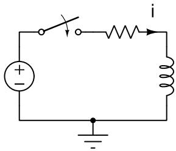  
a)

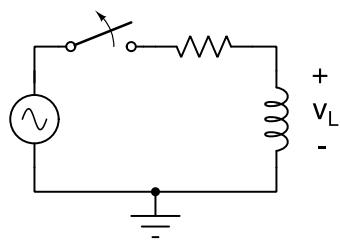  
  
Fig. 1. Test circuits for assessing the performance of the BDF schemes. a) Energization of RL circuit with a dc voltage source. b) Switching off of an RL circuit with ac voltage source.

as well. Stability issues have not been observed for the implemented tests. In case instabilities arise, they can be avoided by restricting the simulation to only using the BDF-2 rule.

# 4.2. Precision

The precision characteristic to be expected from the multi-step rules is that the precision improves with the number of steps taken into account in the scheme; however, this assumes that sufficient information is available to start the time stepping process, which is not true in general.

To illustrate this point, consider the very simple case of the series RL circuit with a dc voltage source shown in Fig. 1(a), with values $V _ { s } = 1 \mathrm { V } ,$ ?? = 1Ω, ??=1mH and a time step ℎ=0.1ms. The analytical solution for the current and the simulated values are compared. The absolute error, (the difference between the analytical solution and the simulated response) has been calculated and is shown in Fig. 2; observe that the conventional trapezoidal rule (marked as Trapezoidal-A in the figure) incurs in the highest initial error, hinting to the need to improve the initial estimates in order to harness the inherent precision of the numerical integration rule. When the trapezoidal rule is started with a step of $h / 2$ to achieve a better initial estimate, followed by full steps of size ℎ, the absolute error falls considerably; this solution is labelled as Trapezoidal-B in Fig. 2. The one-step BDF rule (BDF-1) is the well known backward Euler finite difference formula, which is known to have low precision, as confirmed in the absolute error calculated for this rule; however, notice that this rule has a better starting performance than the conventional trapezoidal rule.

The BDF-2 rule utilizes information from two previous time steps, the BDF-3 from three previous steps and so on. When starting the simulation, these previous time points are not available. This means that the first solution will have to be calculated with the BDF-1 rule, which only requires the initial condition. For the second solution, two history data vectors are available, and therefore the BDF-2 rule could be applied; however, the initial error may be relatively high and application of the two-step rule can not recover from the low precision initialization. Fig. 3 shows the absolute error for the initialized trapezoidal rule (Trapezoidal-B) and the second and third order BDF rules. Both BDF rules must start from the initial condition only, meaning that the first calculated time step is the same for both of them and comes from the one-step formula. The second calculated step comes from the two-step formula, and is the same for both schemes again. Only the third calculated step starts to differ because now the BDF-2 and BDF-3 rules are fully initialized. The precision of the BDF-2 and BDF-3 does not recover from the faulty initialization, and in fact BDF-2 eventually shows a better precision for this particular case. The absolute error for the BDF-4 and BDF-5 formulas behaves similarly to the BDF-3 scheme.

This test shows that a proper initialization is desirable for the precision characteristics of an integration formula to be exploited.

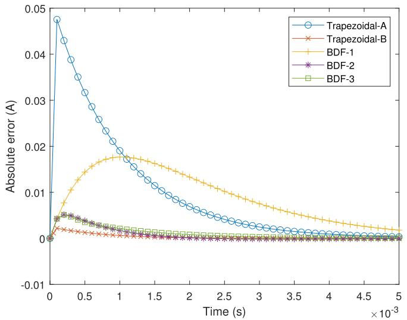  
Fig. 2. The absolute error for test case for several integration rules.

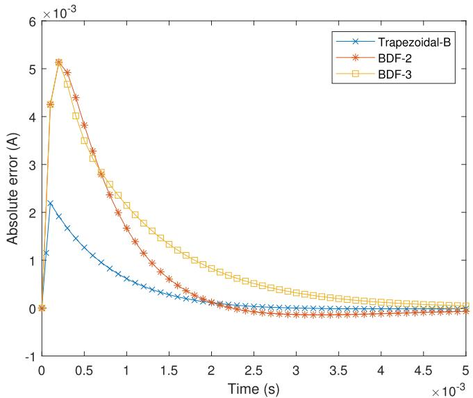  
Fig. 3. The absolute error for test case for several integration rules.

# 4.3. Switching

It is known that switching operations may result in numerical oscillations when certain conditions are met. This has led to some corrective measures in the implementation of the trapezoidal rule, for instance. In this section the performance of the multi-step BDF formulas is investigated, when switching operations occur in the network.

It is known that the backward Euler formula shows no numerical oscillation, and this is also observed for the higher order BDF formulas. Consider the switching off of the inductive circuit shown in Fig. 1(b). $\mathrm { F i g }$ . 4 shows the branch voltage for the inductance in a series RL circuit with parameters $V _ { s } = 1 \mathrm { V }$ and 60Hz, ?? = 1Ω, ??=1mH, time step $h = 1 0 \mu s ;$ the switch closes at ??=0 and is set to open at ??=25ms. The current interruption occurs some time later, at around ??=30ms when the first zero-crossing is encountered. The results for the BDF formulas up to order five are shown; observe that the voltages are practically the same (if the signals are superposed there is no discernible difference), except for the voltage at the instant of opening, which is progressively higher. Closer examination of the voltage, as shown in Fig. 5, shows that the actual values and behavior depend on the order of the integration rule. The switch in this case is modeled as ideal, and therefore the circuit topology changes when a closing or opening operation occurs; as

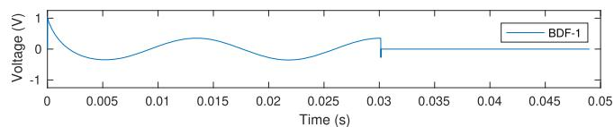

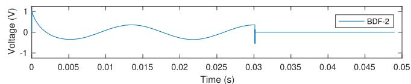

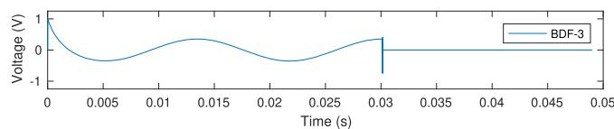

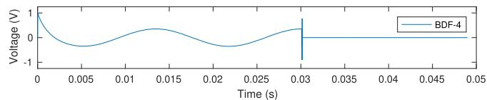

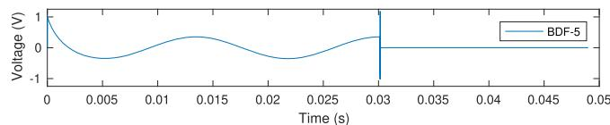  
Fig. 4. The branch voltage for the inductance, obtained with the BDF formulas of orders 1 to 5.

a result, the history terms are not strictly consistent and it takes some time steps to propagate the correct information. For the one-step formula BDF-1, the transition from closed switch to open switch requires one time step; for the two-step formula BDF-2, it takes two time steps; for the BDF-3 rule it takes three steps to reach the final value $v _ { L } = 0$ and so on. Nevertheless, notice that no numerical oscillations arise and a switching operation is handled automatically without the need for additional checks and integration rule changes. This makes the BDF rules very reliable regarding switching operations.

Since a switching operation takes some steps to propagate to a consistent set of history terms, an implementation decision could be made to revert to the one-step formula following a switching operation, since the existing history terms become inconsistent. Thus, a sensible process would be to start with BDF-1 to initiate the simulation, changing to BDF-2, BDF-3, etc. for the following time steps, up to the predefined maximum order, and reverting to BDF-1 after a switching operation, again followed by increasing orders for the subsequent steps.

# 4.4. Power electronics

Power electronics components are a growing part of modern power systems, and their simulation is therefore of great importance [22]. The power electronic switches can be modeled in varying degrees of detail, the simplest model being an ideal switch representation with added forward and blocking resistances. If such simplified model is used, the commutation results in visible spikes in the voltages. For the three-phase rectifier shown in Fig. 6, the nodal voltages $e _ { 7 }$ and $e _ { 1 0 }$ and the branch current $i _ { L 2 }$ are monitored and are shown in Fig. 7. The spikes reveal the commutation instants, and are the result of the commutation process, where the ideal switch representation introduces a change in the topology which is reflected in one or several steps where the history terms must adapt to the new circuit configuration. The third signal is the current in one of the source inductances, and it shows no spikes.

The BDF-2 rule was used in this simulation. Although the obtained voltage responses are reasonable for this case, the real response does not contain spikes because the commutation process is more smooth due to the nonlinear resistance characteristic of the electronic switches. In

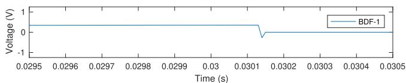

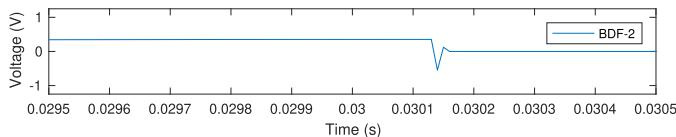

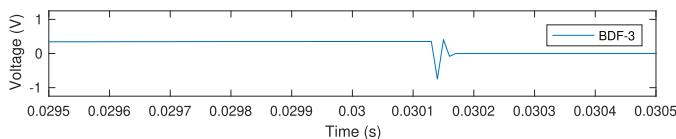

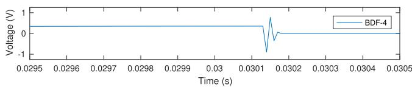

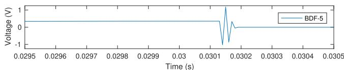  
Fig. 5. The branch voltage for the inductance (detail), obtained with the BDF formulas of order 1 to 5.

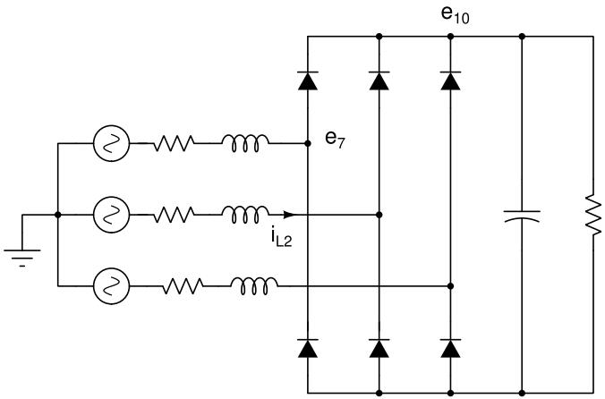  
Fig. 6. A three-phase rectifier with inductive source. The nodal voltages $e _ { 7 } , e _ { 1 0 }$ and the current $i _ { L 2 }$ will be monitored.

order to obtain a more realistic simulation, some simple changes may be implemented; one of them is to simply omit the step immediately following the commutation, so that the spike is filtered out from the reported output. The output will omit some steps in this case. Another measure could be to halve the time step size immediately following a commutation, so that the history terms adapt to the new circuit configuration and the smoothed response is recovered; the intermediate solution with a step of one half is discarded. This approach has some resemblance to the CDA technique [13], but in this case the aim is to eliminate the switching spike and not to control a numerical oscillation. When implementing any of these measures, the response is as shown in Fig. 8, where the voltages no longer contain spikes; the commutation instants are still discernible but these do not result in non-physical jumps in the signals. The current is not changed by the new computation method.

# 5. Conclusions

The family of multi-step integration rules known as backward differentiation formulas has been tested for electromagnetic transient

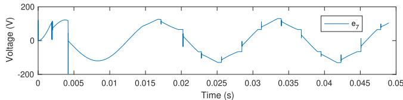

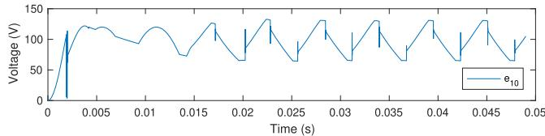

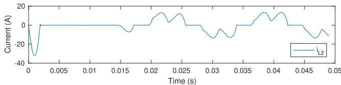  
Fig. 7. Some of the variables calculated for a three-phase rectifier. Spikes are apparent at the commutation instants.

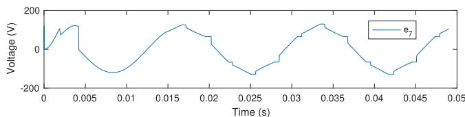

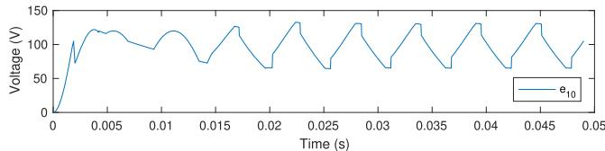

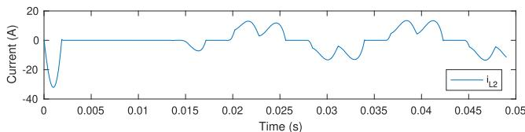  
Fig. 8. Some of the variables calculated for a three-phase rectifier. Spikes at the commutation instants are eliminated by omitting one time step from the output.

simulations. It has been found that these rules when implemented following the modified nodal analysis framework may serve as replacement for other conventional integration rules. The BDF scheme has the attractive characteristic of avoiding numerical oscillations, for instance when switching inductive currents, and this feature is observed for all the family, including formulas of order 1 to 5. The ?? coefficients have been tabulated for the special case of a constant time step, and a simple method for determining the ?? coefficients has been presented, allowing for variable time steps and eventually step adaptation. The first two BDF formulas are A-stable, which means that they pose no restrictions on the time step size. For higher order formulas the time step sizes usually employed in electromagnetic transients simulations should ensure that no instabilities arise. The precision of BDF formulas of higher order is acceptable, but proper initialization of the history terms must be done in order to fully preserve these precision characteristics; this requires reduced steps at the beginning of the simulation. The added memory requirements for keeping the history terms for higher order formulas are negligible, since only state vectors need to be stored. Moreover, the history terms only enter the global circuit equations through the right hand side vector, as for the conventional one-step formulas; therefore, the BDF formulas could fit in existing EMT programs with only slight changes to the existing code base.

The BDF rules are free from numerical oscillations when switchings occur in the network. However, the change in the topology of the circuit originates inconsistent history terms, and this is reflected as a number of jumps in the response. This jumps may be eliminated by resorting to a smaller time step size for a few calculations, in order to recover consistent history vectors. Moreover, if the time step is small enough, the unreliable calculations may be simply discarded without affecting the shape of the signal. Given these features, the BDF multi-step rules have the potential of becoming a valuable addition to the existing tool set of EMT simulation.

# CRediT authorship contribution statement

Enrique Melgoza-Vázquez: Software, Formal analysis, Visualization, Investigation, Writing – original draft, Methodology.

# Data availability

No data was used for the research described in the article.

# Declaration of competing interest

The authors declare that they have no known competing financial interests or personal relationships that could have appeared to influence the work reported in this paper.

# Acknowledgement

This work was supported by Tecnológico Nacional de México under grant 19996.24-P.

# References

[1] T.F.o. Modeling, S.o. L. P. S. w. H. P. o. I.-B. Generation, Simulation Methods, Models, and Analysis Techniques to Represent the Behavior of Bulk Power System Connected Inverter-Based Resources, IEEE Power & Energy Society Technical Report TR-113, 2023.   
[2] S. Gao, Y. Chen, Y. Song, Y. Zhang, Z. Tan, S. Huang, Shifted-frequency based electromagnetic transient simulation for power system dynamics using twostage singly diagonally implicit Runge-Kutta method, Energy Rep. 6 (2020) 701–708. The 7th International Conference on Power and Energy Systems Engineering.   
[3] L. Zhang, Z. Xu, J. Ye, A time-domain explicit integration algorithm for fast overvoltage computation of high-voltage transmission line, Math. Probl. Eng. 2020 (1) (2020) 8437617. https://doi.org/10.1155/2020/8437617

[4] J.K. Debnath, A.M. Gole, W.K. Fung, Graphics processing unit based acceleration of electromagnetic transients simulation, IEEE Trans. Power Delivery 31 (5) (2015) 2036–2044.   
[5] A. Abusalah, O. Saad, J. Mahseredjian, U. Karaagac, L. Gerin-Lajoie, I. Kocar, CPU based parallel computation of electromagnetic transients for large power grids, Electr. Power Syst. Res. 162 (2018) 57–63. https://doi.org/10.1016/j.epsr.2018. 04.017   
[6] A. Abusalah, O. Saad, J. Mahseredjian, U. Karaagac, I. Kocar, Accelerated sparse matrix-based computation of electromagnetic transients, IEEE Open Access J. Power Energy 7 (2020) 13–21. https://doi.org/10.1109/OAJPE.2019.2952776   
[7] T. Cheng, T. Duan, V. Dinavahi, Parallel-in-time object-oriented electromagnetic transient simulation of power systems, IEEE Open Access J. Power Energy 7 (2020) 296–306. https://doi.org/10.1109/OAJPE.2020.3012636   
[8] S. Cao, N. Lin, V. Dinavahi, Faster-than-real-time hardware emulation of transients and dynamics of a grid of microgrids, IEEE Open Access J. Power Energy 10 (2023) 36–47. https://doi.org/10.1109/OAJPE.2022.3217601   
[9] B. Bruned, J. Mahseredjian, S. Dennetiere, A. Abusalah, O. Saad, Sparse solver application for parallel real-time electromagnetic transient simulations, Electr. Power Syst. Res. 223 (2023) 109585. https://doi.org/10.1016/j.epsr.2023.109585   
[10] Y. Liu, B. Park, K. Sun, A. Dimitrovski, S. Simunovic, Parallel-in-time power system simulation using a differential transformation based adaptive parareal method, IEEE Open Access J. Power Energy 10 (2023) 61–72. https://doi.org/10.1109/OAJPE. 2022.3220112   
[11] W. Nzale, J. Mahseredjian, I. Kocar, X. Fu, C. Dufour, Two variable time-step algorithms for simulation of transients, in: 2019 IEEE Milan PowerTech, 2019, pp. 1–6. https://doi.org/10.1109/PTC.2019.8810892   
[12] S. Loaiza-Elejalde, J.E. Enriquez-Jamangape, J.L. Leyva, A. Diaz-Perez, J.R. Marti, J.L. Naredo, GPU implementation of MATE for ultrafast simulations of power system electromagnetic transients, in: 56th North American Power Symposium (NAPS), El Paso, 2024.   
[13] J.R. Marti, J. Lin, Suppression of numerical oscillations in the EMTP, IEEE Trans. Power Syst. 4 (2) (1989) 739–747.   
[14] E. Melgoza, Finite Element Analysis of Coupled Electromechanical Problems, Ph.D. thesis, University of Bath, 2001.   
[15] K.E. Brenan, B.E. Engquist, Backward differentiation approximations of nonlinear differential/algebraic systems, Math. Comput. 51 (184) (1988) 659–676.   
[16] M.R. Nived, S.S.C. Athkuri, V. Eswaran, On the application of higher-order backward difference (BDF) methods for computing turbulent flows, Comput. Math. Appl. 117 (2022) 299–311. https://doi.org/10.1016/j.camwa.2022.05.007   
[17] C.W. Gear, Simultaneous numerical solution of differential-algebraic equations, IEEE Trans. Circuit Theory 18 (1) (1971) 89–95.   
[18] R.K. Brayton, F.G. Gustavson, G. Hachtel, A new efficient algorithm for solving differential-algebraic systems using implicit backward differentiation formulas, Proc. IEEE 60 (1) (1972) 98–108.   
[19] E. Hairer, S.P. Norset, G. Wanner, Solving Ordinary Differential Equations I, Springer, Berlin, 2nd edition, Berlin, 1996.   
[20] E. Melgoza-Vazquez, R. Escarela-Perez, J.L. Guardado, Generalized primitive stamps for nonlinear circuit-field coupling in the transient case, IEEE Trans. Magn. 53 (5) (2017) 1–9. https://doi.org/10.1109/TMAG.2017.2665343   
[21] I. Juric-Grgi´ c,´ D. Lovric,´ I. Krolo, Analysis of power system electromagnetic transients using the finite element technique, Energies 17 (11) (2024). https://doi.org/ 10.3390/en17112517   
[22] W. Nzale, J. Mahseredjian, X. Fu, I. Kocar, C. Dufour, Improving numerical accuracy in time-domain simulation for power electronics circuits, IEEE Open Access J. Power Energy 8 (2021) 157–165. https://doi.org/10.1109/OAJPE.2021.3072369