# Coupling model for time-domain analysis of nonparallel overhead wires and buried conductors in the presence of lossy ground

Manuja Gunawardana, Behzad Kordi

Department of Electrical & Computer Engineering, University of Manitoba, Winnipeg, MB, Canada R3T 5V6

# A R T I C L E I N F O

Keywords:

Transmission line theory

Nonuniform transmission lines

Electromagnetic analysis

Time-domain analysis

Underground electromagnetic propagation

# A B S T R A C T

Buried conductors crossing paths with overhead transmission lines is a common occurrence. Interference caused by overhead lines has been found capable of affecting the safe, sustainable operation of the buried conductors. Such occurrences introduce an electromagnetic problem of a nonparallel structure with conductors present in both air and ground half-spaces. Electromagnetic transient (EMT) simulations of such structures are vital in predicting the behaviour of modern power networks. This paper develops a novel EMT compatible time-domain model for nonparallel overhead wires and conductors that are buried in a frequency-dependent lossy (finitely-conducting) ground. Analytical expressions are derived for the per-unit-length (PUL) impedance and admittance matrices based on thin-wire electromagnetic scattering theory. The closed-form formulations derived in this work can be easily incorporated in an EMT simulator to calculate the coupling effect between nonparallel overhead lines and buried conductors. The validity of the proposed approach is examined for various values of the ground conductivity, the radius of the buried conductor, the crossing angle, and burial depth of the conductor by comparing with results with those obtained using a full-wave approach. A case study on the induced voltage in buried conductors due to typical lightning transients in overhead lines has also been performed.

# 1. Introduction

Buried conductors such as pipelines or communication and power cables, that share the spatial corridor or crossing paths with overhead power transmission lines, is a common occurrence in modern power networks [1–3]. At such occurrences, overhead power lines have the potential to create induced power-frequency or transient voltages in the buried conductor [4,5]. In the case of pipelines, this arises the danger of electric shock while induced currents affect corrosion protection mechanisms in pipelines [2,6,7]. Therefore, electromagnetic transient (EMT) analysis of such structures is important for the safe and sustainable operation of the network as well as for the safety of the technical personnel.

An overhead power line crossing a buried conductor in finitely conducting ground introduces an electromagnetic problem of a nonuniform structure with conductors present in both half-spaces (i.e. air and ground). Classical transmission line models based on Telegrapher’s equations used in EMT simulators [8,9] assume the lines have a uniform cross-section. To accurately model nonuniform structures, full-wave electromagnetic techniques can be used, however, the computation burden associated with them makes them not very suitable to be used in EMT simulators [3,10]. Computational complexity of full-wave models

can be simplified by using the thin-wire approximation [11]. In order to apply the thin-wire approximation, the cross sectional radius of a wire should be much smaller than its length while the length is comparable with the minimum wavelength of interest [12]. Power transmission lines and pipelines under typical power system transients satisfy this requirement. Thin-wire scattering models along with image theory has been used to model crossing and bent overhead wires placed above perfect electric conducting (PEC) ground in [13–15]. An EMTcompatible model for nonparallel overhead conductors above finitely conducting ground, namely the dispersive scattered field transmission line model (DSFTL) was introduced by the authors in [16] based on thin-wire scattering theory and complex image theory. In [16], space-dependent, closed-form formulas for the per-unit-length (PUL) impedance and admittance matrices have been obtained in order to represent the nonparallel nature of wires. Image-theory-based models for the case of uniform buried conductors have been discussed in [17– 19]. However, to the best of our knowledge, the image-theory-based models have not been developed for the coupling between overhead wires and buried conductors.

Pollaczek developed an expression for the mutual impedance between parallel overhead and buried wires in the form of an infinite

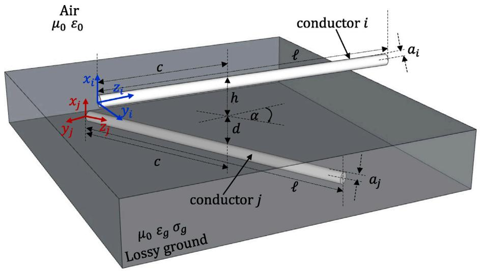  
Fig. 1. A schematic of an overhead transmission line above a conductor buried in finitely-conducting ground at a depth of ?? with a crossing angle of ??.

integral (see [20] for details). Pollaczek’s integral does not have an analytical solution and is highly unstable during numerical integration [20, 21]. Also, Pollaczek’s integral as well as Carson’s integral [22] used for overhead lines are not applicable to conductors that are nonparallel to each other. Therefore, several researchers have developed closed-form approximate formulas for Pollaczek’s formula among which, Lucca’s formulation in [23] is considered as the most accurate [21]. Mutual impedance formulation for two inclined conductors placed in the same medium is given in [24] while the same for two nonparallel conductors placed in two media is given in [25]. The formulations in both [24,25] are in the form of infinite integrals with no analytical solutions. Mesh current methods based on the quasi-static partial-element equivalentcircuit (PEEC) model have been used to model arbitrarily oriented overhead and buried thin-wires in [26]. The authors of [26] mention that this method is applicable to structures which are less than 100 m in length.

In this paper, the original DSFTL model for overhead transmission lines, which was introduced in [16] by the authors, is extended to nonparallel overhead and buried conductors. The main contribution of this work is to obtain a novel, closed-form analytical formulation for the mutual coupling between nonparallel overhead and buried conductors. In order to verify the proposed formulation, a transmission line structure where a single-conductor overhead line crosses a buried conductor is modelled. The current induced in the buried conductor due to its coupling with the overhead wire is calculated using the proposed model for different values of the crossing angle, ground conductivity, conductor radius, and burial depth. They are compared with those calculated using a commercial thin-wire full-wave electromagnetic solver. A case study is also performed on the induced voltages and currents in the buried conductor during direct lightning strikes to the overhead line.

# 2. Transmission line model for overhead and buried conductors

In this section, a closed form transmission line formulation is derived for nonparallel overhead and buried conductors. Without the loss of generality, the derivation is performed on a wire structure where a single overhead conductor crosses above a single buried conductor. The proposed formulation can be extended into multiconductor cases as explained in [14] for the case of lossless frequency-independent structures.

# 2.1. DSFTL model for overhead and buried conductors

Transmission line equations for a nonuniform wire structure in the frequency domain are [27]

$$
\frac {\partial}{\partial z} \boldsymbol {V} (z, j \omega) + \boldsymbol {Z} (z, j \omega) \boldsymbol {I} (z, j \omega) = \mathbf {0} \tag {1a}
$$

$$
\frac {\partial}{\partial z} \boldsymbol {I} (z, j \omega) + \boldsymbol {Y} (z, j \omega) \boldsymbol {V} (z, j \omega) = \mathbf {0} \tag {1b}
$$

where, ?? and ?? are the voltage and current vectors and ?? and ?? are the PUL impedance and admittance matrices at any location ??. For the topology shown in Fig. 1, where both overhead and buried conductors are present, the elements of ?? and ?? can be written as

$$
Z = \left[ \begin{array}{c c} Z _ {0} & Z _ {\mathrm {o b}} \\ Z _ {\mathrm {o b}} & Z _ {\mathrm {b}} \end{array} \right] \tag {2a}
$$

and

$$
\mathbf {Y} = \left[ \begin{array}{l l} Y _ {\mathrm {o}} & Y _ {\mathrm {o b}} \\ Y _ {\mathrm {o b}} & Y _ {\mathrm {b}} \end{array} \right] \tag {2b}
$$

where, subscript $" \boldsymbol { 0 } ^ { \dag }$ stands for overhead wires, $" \mathbf { b } ^ { , \dag }$ for buried wires, and $" { \boldsymbol \mathbf { o } } { \boldsymbol \mathbf { b } } ^ { \prime \prime }$ for the mutual coupling between overhead and buried wires. In $( ( 2 \mathrm { a } ) ) , Z _ { \mathrm { o } }$ of an overhead line of height ℎ and finite length ?? at any location $z _ { i }$ can be obtained using [16]

$$
\begin{array}{l} Z _ {0} = \frac {j \omega \mu_ {0}}{4 \pi} \left[ \ln \left(\ell + \sqrt {\left(\ell - z _ {i}\right) ^ {2} + a _ {i} ^ {2}} - z _ {i}\right) \right. \\ - \ln \left(\sqrt {\left(\ell - z _ {i}\right) ^ {2} + a _ {i} ^ {2}} - z _ {i}\right) \\ - \ln \left(\ell + \sqrt {\left(\ell - z _ {i}\right) ^ {2} + 4 (h + p) ^ {2}} - z _ {i}\right) \tag {3} \\ \left. + \ln \left(\sqrt {\left(\ell - z _ {i}\right) ^ {2} + 4 (h + p) ^ {2}} - z _ {i}\right) \right]. \\ \end{array}
$$

In (3), ?? is the complex image depth [28] given by

$$
p = \frac {1}{\sqrt {j \omega \mu_ {0} \left(\sigma_ {g} + j \omega \varepsilon_ {g}\right)}} \tag {4}
$$

where $\mu _ { 0 }$ is the permeability of free space, and $\varepsilon _ { g } ,$ and $\sigma _ { g }$ denote the permittivity and conductivity of the ground, respectively. In (2b), $Y _ { \mathbf { o } }$ of an overhead line of finite length ?? can be obtained using [16]

$$
Y _ {0} = 4 \pi \varepsilon_ {0} j \omega \xi^ {\prime} \tag {5a}
$$

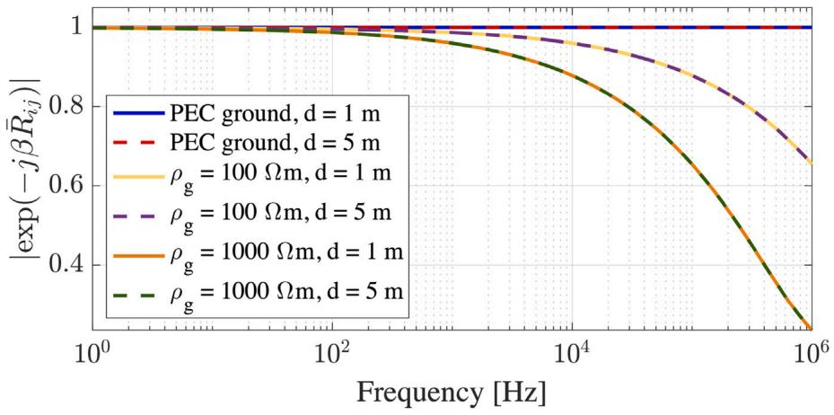  
(a)

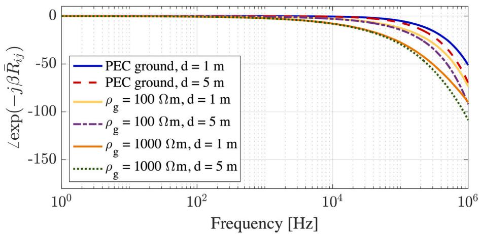  
(b)   
Fig. 2. (a) Magnitude and (b) phase of $e ^ { - j \beta _ { g } \bar { R } _ { i j } }$ for an overhead conductor and a buried conductor vs frequency for various values of ground resistivity $\rho _ { g }$ and burial depth ??.

where,

$$
\begin{array}{l} \xi^ {\prime} = \sinh^ {- 1} \left(\frac {\ell - z _ {i}}{a _ {i}}\right) - \sinh^ {- 1} \left(\frac {- z _ {i}}{a _ {i}}\right) \\ - \sinh^ {- 1} \left(\frac {\ell - z _ {i}}{2 h}\right) + \sinh^ {- 1} \left(\frac {- z _ {i}}{2 h}\right). \\ \end{array}
$$

Similarly, by following the procedure presented in [16] for overhead lines, the self impedance $( Z _ { b } )$ of a buried conductor of finite length ?? can be written as

$$
\begin{array}{l} Z _ {\mathrm {b}} = \frac {j \omega \mu_ {0}}{4 \pi} \left[ \ln \left(\ell + \sqrt {\left(\ell - z _ {j}\right) ^ {2} + a _ {j} ^ {2}} - z _ {j}\right) \right. \\ - \ln \left(\sqrt {\left(\ell - z _ {j}\right) ^ {2} + a _ {j} ^ {2}} - z _ {j}\right) \\ - \ln \left(\ell + \sqrt {\left(\ell - z _ {j}\right) ^ {2} + 4 (d + p) ^ {2}} - z _ {j}\right) \\ \left. + \ln \left(\sqrt {\left(\ell - z _ {j}\right) ^ {2} + 4 (d + p) ^ {2}} - z _ {j}\right) \right]. \\ \end{array}
$$

The self admittance $Y _ { b }$ can be obtained using [29]

$$
Y _ {\mathrm {b}} = - \omega^ {2} \mu_ {0} \left(\varepsilon_ {0} \varepsilon_ {\mathrm {g}} + \frac {\sigma_ {\mathrm {g}}}{j \omega}\right) Z _ {b} ^ {- 1}. \tag {7}
$$

If the buried conductor is insulated, the sheath capacitance needs to be added to the admittance, and the total admittance can be obtained as [29]

$$
Y _ {\mathrm {o}, \text {t o t}} = j \omega \frac {C _ {s} Y _ {\mathrm {o}}}{j \omega C _ {s} + Y _ {\mathrm {o}}} \tag {8a}
$$

where $C _ { s }$ is the capacitance of the insulation sheath given by

$$
C _ {s} = \frac {2 \pi \varepsilon_ {s}}{\ln \frac {b _ {j}}{a _ {j}}} \tag {8b}
$$

where $\varepsilon _ { s } , a _ { j }$ and $b _ { j }$ are the relative permittivity, inner radius and outer radius of the sheath, respectively. To obtain a closed-form formulation for the mutual impedance between an overhead wire and a buried conductor placed at an angle of ?? to each other one has to consider the field created in ground by a horizontal electric dipole (HED) in air. The ?? component of the Hertzian vector of the electric field in ground at a depth ?? and a horizontal distance ?? due to a HED of length ???? placed in air at a height ℎ carrying current ?? is given by [24]

$$
\varPi_ {1, z} = \frac {j \omega \mu_ {0} I d s}{4 \pi \gamma_ {1} ^ {2}} \int_ {0} ^ {\infty} \frac {2 u e ^ {- \alpha_ {0} h} e ^ {- \alpha_ {1} d}}{\alpha_ {0} + \alpha_ {1}} J _ {0} (r u) d u \tag {9a}
$$

where

$$
\alpha_ {0} = \sqrt {u ^ {2} + \gamma_ {0} ^ {2}} \tag {9b}
$$

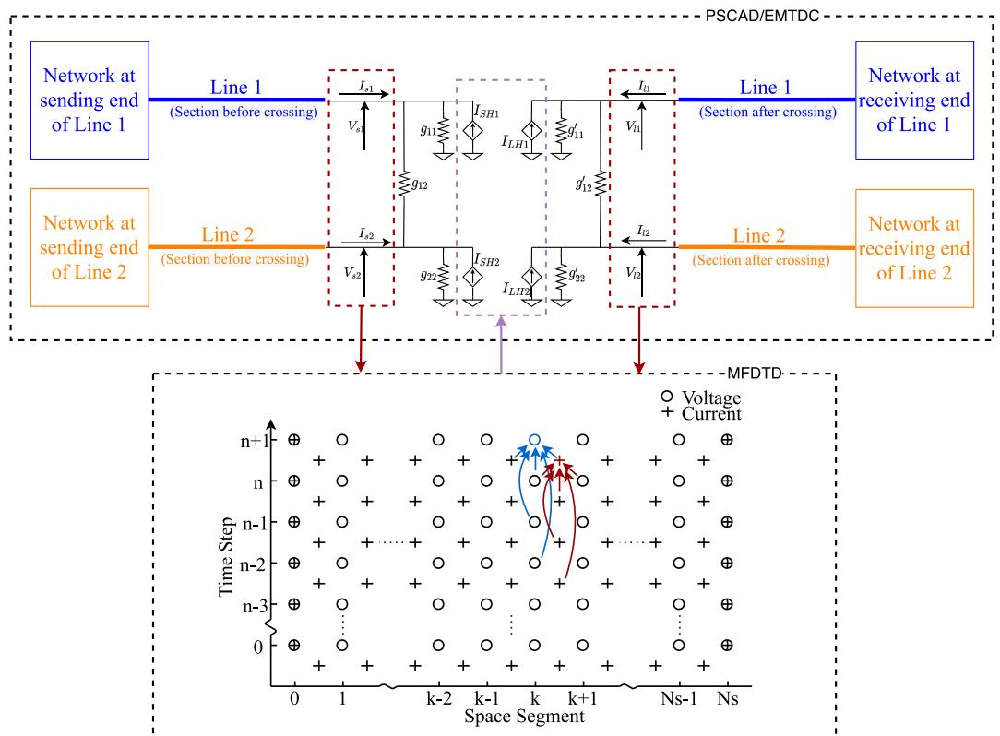

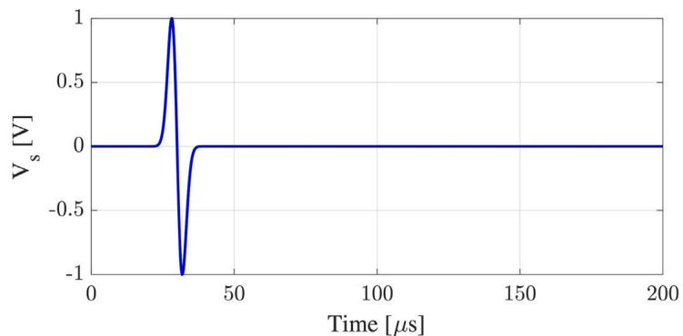  
Fig. 3. Illustration of the implementation of DSFTL model in an EMT simulator such as PSCAD/EMTDC.   
Fig. 4. Normalized waveform of the derivative of a Gaussian function whose full-width at half maximum (FWHM) is 150 kHz. This waveform is applied as the excitation voltage to the overhead wire.

and

$$
\alpha_ {1} = \sqrt {u ^ {2} + \gamma_ {1} ^ {2}}. \tag {9c}
$$

In $( 9 ) , \ \gamma _ { 0 }$ is the propagation constant of air given by $\gamma _ { 0 } ~ = ~ j \omega \sqrt { \mu _ { 0 } \varepsilon _ { 0 } }$ while $\gamma _ { 1 }$ is the propagation constant of ground given by $\gamma _ { 1 } ~ = ~ \gamma _ { g } ~ =$ $\sqrt { j \omega \mu _ { 0 } ( \sigma _ { g } + j \omega \varepsilon _ { g } ) } . ~ J _ { 0 }$ is the zeroth order Bessel function of the first kind. In order to obtain the mutual impedance between the overhead conductor (??) and the buried conductor (??), the Hertzian vector is integrated along the span of the overhead conductor as

$$
Z _ {\mathrm {o b}} = \frac {j \omega \mu_ {0} \cos \alpha}{2 \pi} \int_ {0} ^ {\ell} \int_ {0} ^ {\infty} \frac {u e ^ {- \alpha_ {0} h} e ^ {- \alpha_ {1} d}}{\alpha_ {0} + \alpha_ {1}} J _ {0} (r u) d u d z _ {i} ^ {\prime} \tag {10}
$$

where $r = { \sqrt { ( z _ { i } ^ { \prime } - z _ { j } ) ^ { 2 } + ( y _ { i } - y _ { j } ) ^ { 2 } } } .$

In [13], it was shown that for two crossing overhead transmission lines, the mutual impedance and admittance near the line ends are negligible compared to those in areas near the crossing. Also, in [11], it is explained that if the location (??) of an observation point on a transmission line is sufficiently far from its ends (i.e. by a distance

greater than twice the maximum cross-sectional dimension), then it can be considered as a point on an infinitely long transmission line. Since a crossing between an overhead wire and a buried conductor or cable generally occurs sufficiently far from their ends $Z _ { \mathrm { o b } }$ in (10) can be approximated as

$$
Z _ {\mathrm {o b}} = \frac {j \omega \mu_ {0} \cos \alpha}{2 \pi} \int_ {- \infty} ^ {\infty} \int_ {0} ^ {\infty} \frac {u e ^ {- \alpha_ {0} h} e ^ {- \alpha_ {1} d}}{\alpha_ {0} + \alpha_ {1}} J _ {0} (r u) d u d z _ {i} ^ {\prime}. \tag {11}
$$

This approximation allows the simplification of $Z _ { \mathbf { o b } }$ into a closed-form expression using well known mathematical identities. For overhead wires under typical power system transient frequencies [23]

$$
\alpha_ {0} \approx u \tag {12}
$$

and for buried wires, for low frequencies where the displacement current in the lossy ground is much smaller than the conduction current, i.e. $\sigma _ { g } \gg \omega \varepsilon _ { g }$ , the approximation $\begin{array} { r } { \gamma _ { 1 } ^ { 2 } \approx j \omega \mu _ { 0 } \sigma _ { g } = \frac { 1 } { p ^ { 2 } } } \end{array}$ [23] yields

$$
\alpha_ {1} \approx \sqrt {u ^ {2} + \frac {1}{p ^ {2}}}. \tag {13}
$$

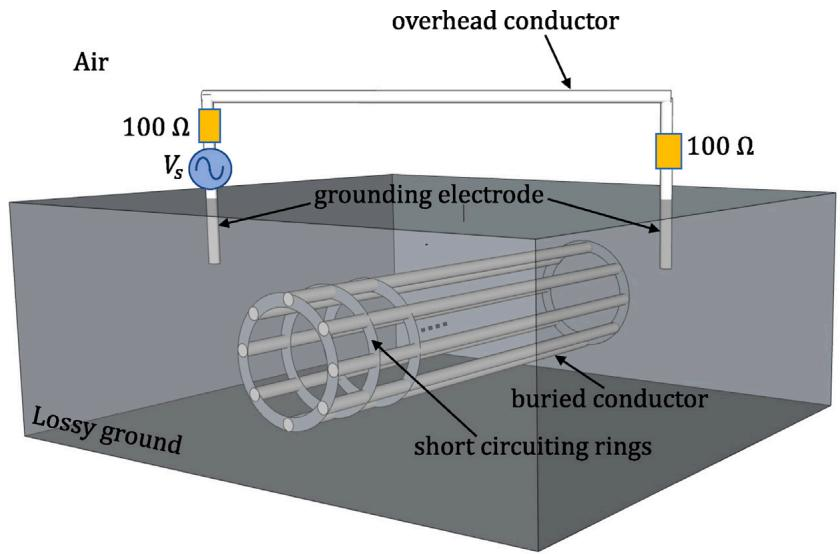

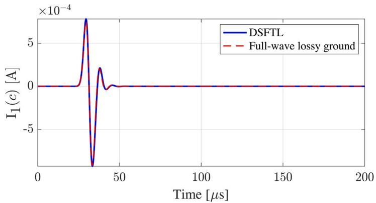  
Fig. 5. A wire model of the geometry implemented in the fullwave solver (NEC4) used to validate the proposed DSFTL model. The buried conductor is modelled as 8 straight, parallel wires that allow simulating a conductor with an arbitrary diameter.   
Fig. 6. Current at the point of crossing in the overhead wire.

Substituting (12) and (13) in (11) and converting the infinite integral into a semi-infinite integral considering symmetry gives

$$
Z _ {\mathrm {o b}} = \frac {j \omega \mu_ {0} \cos \alpha}{2 \pi} \int_ {0} ^ {\infty} \int_ {0} ^ {\infty} \frac {2 u e ^ {- h u} e ^ {- d \sqrt {u ^ {2} + \frac {1}{p ^ {2}}}}}{{u + \sqrt {u ^ {2} + \frac {1}{p ^ {2}}}}} J _ {0} (r u) d u d z _ {i} ^ {\prime}. \tag {14}
$$

In [23], it shown that an integral of the above format can be rearranged into

$$
Z _ {\mathrm {o b}} = \frac {j \omega \mu_ {0} \cos \alpha}{2 \pi} \left[ \int_ {0} ^ {\infty} \int_ {0} ^ {\infty} u \frac {e ^ {- u (h + d)} - e ^ {- u (h + d + 2 p)}}{u} J _ {0} (r u) d u d z _ {i} ^ {\prime} + C \right] \tag {15a}
$$

where

$$
C = \frac {1}{\gamma_ {g} ^ {3}} \frac {\partial^ {2} Q}{\partial \bar {y} _ {i j} ^ {2}} + \frac {3}{2 0 \gamma_ {g} ^ {5}} \frac {\partial^ {4} Q}{\partial \bar {y} _ {i j} ^ {4}} + \dots \dots \tag {15b}
$$

In (15b), $\bar { y } _ { i j }$ is the shortest horizontal distance from a point $z _ { i }$ on the overhead line to the buried line which can be written as

$$
\bar {y} _ {i j} = \left(c - z _ {i}\right) \sin \alpha \tag {16}
$$

and [23]

$$
Q = \frac {\bar {H} _ {i j}}{\bar {R} _ {i j} ^ {2}} \tag {17a}
$$

where

$$
\bar {H} _ {i j} = h + d + 2 p \tag {17b}
$$

and

$$
\bar {R} _ {i j} = \sqrt {\bar {H} _ {i j} ^ {2} + \bar {y} _ {i j} ^ {2}}. \tag {17c}
$$

For typical power line and pipeline scenarios approximating ?? using the first term of the series expansion in (15b) is sufficient [23]. Therefore, using (15b), (16) and (17), ?? can be written as

$$
C = \frac {2 \bar {H} _ {i j}}{3 \gamma_ {g} ^ {3}} \frac {\bar {H} _ {i j} ^ {2} - 3 \bar {y} _ {i j} ^ {2}}{\bar {R} _ {i j} ^ {6}}. \tag {18}
$$

The expression for ?? obtained in (18) looks identical by format to that obtained by Lucca in [23] for a parallel overhead and buried wire. However, $\bar { H } _ { i j } , \bar { y } _ { i j }$ and $\bar { R } _ { i j }$ terms are now dependent on location (?? ) at which it is calculated and the crossing angle (??) compared to constant values in Lucca’s formulation in [23]. Also, using the Sommerfeld Identity [17], the integral in (15a) can be rewritten as

$$
\begin{array}{l} \int_ {0} ^ {\infty} \int_ {0} ^ {\infty} 2 u \frac {e ^ {- u (h + d)} - e ^ {- u (h + d + 2 p)}}{u} J _ {0} (r u) d u d z _ {i} ^ {\prime} \\ = \int_ {0} ^ {\infty} 2 \left(\frac {e ^ {- j \beta_ {g} R _ {i j}}}{R _ {i j}} - \frac {e ^ {- j \beta_ {g} \bar {R} _ {i j}}}{\bar {R} _ {i j}}\right) d z _ {i} ^ {\prime}. \tag {19} \\ \end{array}
$$

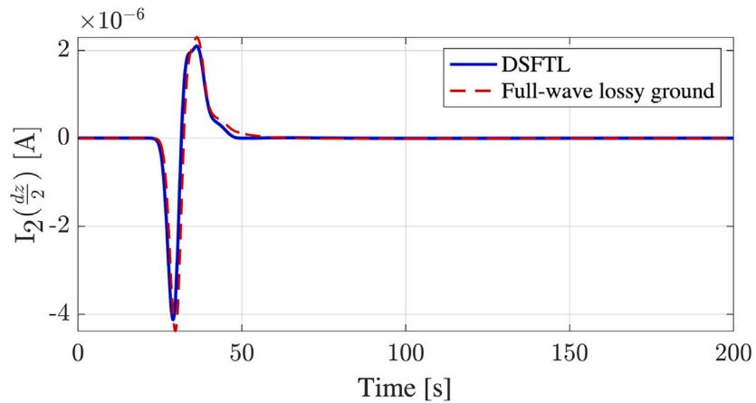  
(a)

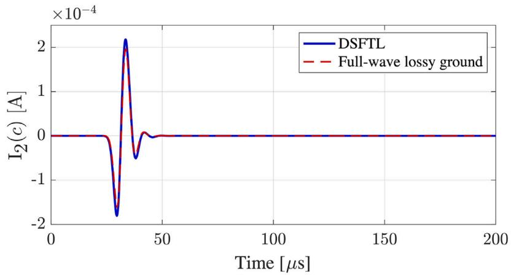  
(b)

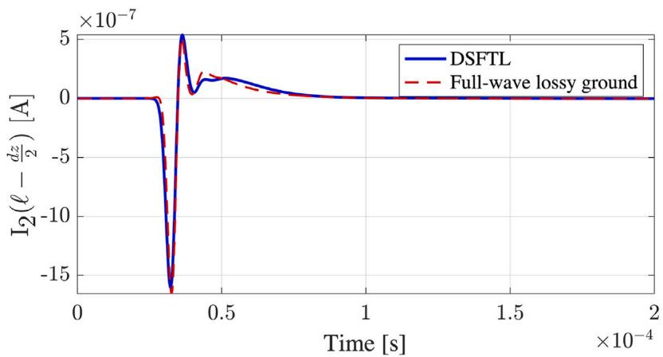  
（c）  
Fig. 7. Current at $\begin{array} { r } { \mathrm { ( a ) } ~ z = \frac { d z } { 2 } } \end{array}$ , (b) ?? = ?? and $\begin{array} { r } { \mathrm { ( c ) } ~ z = \ell - \frac { d z } { 2 } } \end{array}$ in the buried conductor.

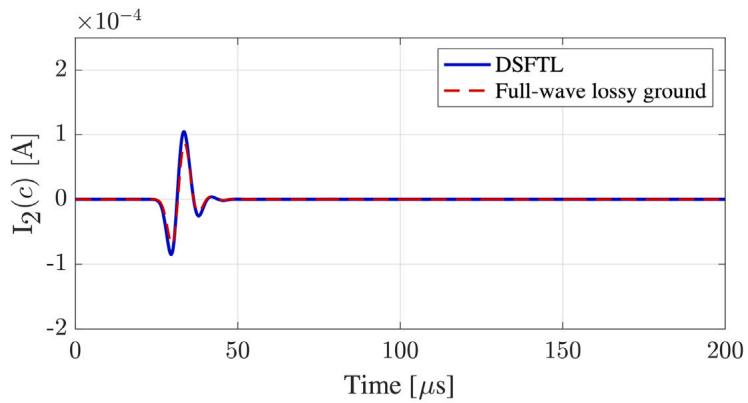  
(a)

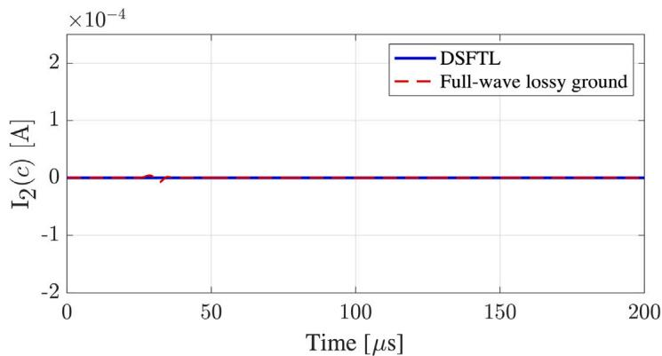  
(b)   
Fig. 8. Current at the point of crossing in the buried conductor for crossing angles of (a) 60◦and (b) 90◦.

where, $R _ { i j } = \sqrt { ( h + d ) ^ { 2 } + \bar { y } _ { i j } ^ { 2 } }$ and $\beta _ { g } = \omega \sqrt { \mu _ { 0 } \varepsilon _ { g } \varepsilon _ { 0 } }$ . Substituting (18) and (19) in (15a) gives

$$
Z _ {\mathrm {o b}} = \frac {j \omega \mu_ {0} \cos \alpha}{2 \pi} \left[ \int_ {0} ^ {\infty} \left(\frac {e ^ {- j \beta_ {\mathrm {g}} R _ {i j}}}{R _ {i j}} - \frac {e ^ {- j \beta_ {\mathrm {g}} \bar {R} _ {i j}}}{\bar {R} _ {i j}}\right) d z _ {i} ^ {\prime} + \frac {2 \bar {H} _ {i j}}{3 \gamma_ {g} ^ {3}} \frac {\bar {H} _ {i j} ^ {2} - 3 \bar {y} _ {i j} ^ {2}}{\bar {R} _ {i j} ^ {6}} \right]. \tag {20}
$$

The infinite length assumption can now be reversed for the integration term in (20) as

$$
\begin{array}{l} Z _ {\mathrm {o b}} = \\ \frac {j \omega \mu_ {0} \cos \alpha}{2 \pi} \left[ \frac {1}{2} \int_ {0} ^ {\ell} \left(\frac {e ^ {- j \beta_ {g} R _ {i j}}}{R _ {i j}} - \frac {e ^ {- j \beta_ {g} \bar {R} _ {i j}}}{\bar {R} _ {i j}}\right) d z _ {i} ^ {\prime} + \frac {2 \bar {H} _ {i j}}{3 \gamma_ {g} ^ {3}} \frac {\bar {H} _ {i j} ^ {2} - 3 \bar {y} _ {i j} ^ {2}}{\bar {R} _ {i j} ^ {6}} \right]. \tag {21} \\ \end{array}
$$

For power system transients, the first exponential term, $e ^ { - j \beta _ { g } R _ { i j } }$ in ((15)), can be assumed as 1 [30]. The variation of the second exponential term, $e ^ { - j \beta \bar { R } _ { i j } }$ , for an overhead conductor of height ℎ = 10 m and a buried conductor is shown in Fig. 2 as a function of frequency for different ground resistivities and two burial depths (?? = 1 and 5 m). It can be seen that $e ^ { - j \beta \bar { R } _ { i j } }$ can also be approximated as 1 up to an upper limit of frequencies depending on the ground conductivity and burial depth. The validity of the proposed closed-form model will be limited to the range of frequencies where $e ^ { - j \beta \bar { R } _ { i j } } \approx 1$ . Using the above approximation, obtaining an analytical solution for the integral term is possible [31]. Substituting this in ((15)), a final closed-form analytical expression for the mutual impedance between an overhead wire and a

buried conductor can be obtained as

$$
\begin{array}{l} Z _ {\mathrm {o b}} = \frac {j \omega \mu_ {0} \cos \alpha}{4 \pi} \times \\ \left[ \ln \left(\ell + \sqrt {\left[ (\ell - c) + (z _ {i} - c) \cos \alpha \right] ^ {2} + \left[ (z _ {i} - c) \sin \alpha \right] ^ {2}} + (h + d) ^ {2} \right. \right. \\ - c + \left(z _ {i} - c\right) \cos \alpha) \\ - \ln \left(\sqrt {\left[ (\ell - c) + (z _ {i} - c) \cos \alpha \right] ^ {2} + \left[ (z _ {i} - c) \sin \alpha \right] ^ {2}} + (h + d) ^ {2}\right) \\ - c + \left(z _ {i} - c\right) \cos \alpha) \\ - \ln \left(\ell + \sqrt {\left[ \ell - c + (z _ {i} - c) \cos \alpha \right] ^ {2} + \left[ (z _ {i} - c) \sin \alpha \right] ^ {2} + (h + d + 2 p) ^ {2}}\right) \\ - c + \left(z _ {i} - c\right) \cos \alpha) \\ + \ln \left(\sqrt {\left[ (\ell - c) + (z _ {i} - c) \cos \alpha \right] ^ {2} + \left[ (z _ {i} - c) \sin \alpha \right] ^ {2} + (h + d + 2 p) ^ {2}}\right) \\ - c + \left(z _ {i} - c\right) \cos \alpha) \\ \left. + \frac {4 \bar {H} _ {i j}}{3 \gamma_ {g} ^ {3}} \frac {\bar {H} _ {i j} ^ {2} - 3 \bar {y} _ {i j} ^ {2}}{\bar {R} _ {i j} ^ {6}} \right] \tag {22} \\ \end{array}
$$

The mutual admittance between overhead and buried conductors $( Y _ { \mathrm { o b } } )$ is generally assumed to be zero for typical transmission line transients [32,33].

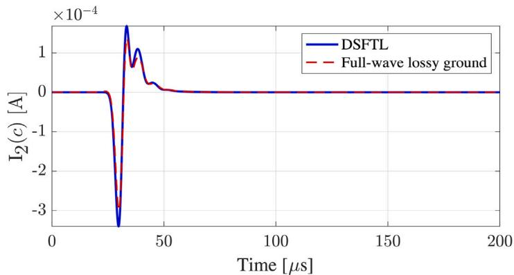  
(a)

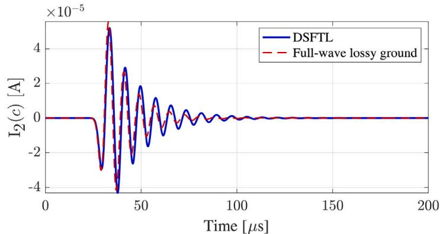  
(b)   
Fig. 9. Current at the point of crossing in the buried conductor for ground conductivity values of (a) 0.01 S/m and (b) 0.0001 S/m.

# 2.2. Time-domain implementation

Eq. (1) in the time-domain gives

$$
\begin{array}{l} \frac {\partial}{\partial z} \boldsymbol {V} (z, t) + \boldsymbol {Z} (z, t) * \boldsymbol {I} (z, t) = \mathbf {0} (23a) \\ \frac {\partial}{\partial z} \boldsymbol {I} (z, t) + \boldsymbol {Y} (z, t) * \boldsymbol {V} (z, t) = \mathbf {0} (23b) \\ \end{array}
$$

where ‘‘∗’’ denotes the convolution operator. In [34], the finite-difference time-domain algorithm has been modified (MFDTD) to incorporate the frequency-dependence of a single-conductor overhead transmission line. In the MFDTD algorithm the frequency-dependence of the PUL impedance matrix is handled by fitting it into a rational function [35]. This allows the convolution terms to be calculated recursively [34]. In [16], this method was extended into nonparallel multiconductor overhead transmission lines above finitely-conducting ground. In this work, the MFDTD algorithm is further extended to accommodate a frequency-dependent PUL admittance matrix. The admittance matrix at each location is fitted into a rational function of the format explained in [35] and voltage updating equations of the MFDTD algorithm are modified accordingly (i.e. to the same format as the current updating equation in [34]). The MFDTD algorithm of the DSFTL model is implemented in an EMT simulator as a custom component with an externally running Fortran code as shown in Fig. 3 in order to model a nonuniform region of a transmission line network. At each time step, the DSFTL model will accept the current and voltage readings $( V _ { s 1 } , ~ V _ { l 1 } . .$ . and $I _ { s 1 } , \ I _ { l 1 } )$ at the terminals of the lines, run the MFDTD calculation to calculate internal voltages and currents, and update the dependent current sources $( I _ { S H 1 } , I _ { L H 1 } . . . )$ in the EMT environment. The rest of the network components outside the nonuniform area can be

modelled in the EMT (e.g. PSCAD/EMTDC) environment using built-in components.

# 3. Results and discussion

In this section, a wire structure similar to Fig. 1 is simulated with ?? = 1 km, ?? = 0.4 km, ℎ = 10 m, and ?? = 20 mm. The buried conductor is assumed to be a bare pipeline since the frequency dependency of the admittance of buried bare conductors is more significant than insulated conductors. The relative permittivity of the ground is taken as $\varepsilon _ { g } = 1 0 .$ . Results under varying crossing angle (??), ground conductivity $( \sigma _ { g } ) _ { ; }$ , pipeline radius $( a _ { j } )$ and burial depth (??) are compared with those obtained using Numerical Electromagnetic Code - (NEC4), a thin-wire full-wave electromagnetic solver [36]. The overhead line is terminated using 100 Ω resistor loads which are grounded using 1-m long vertical electrodes with 20 mm radius to be consistent with the full-wave simulator. For the values of ground conductivity and the electrode length used in this work, the impedance of the grounding electrodes is resistive. The value of the resistive grounding impedance is in the range of 68 Ω to 6.8 kΩ when the ground conductivity varies from $\sigma _ { g } = 0 . 0 1$ to $\sigma _ { g } = 0 . 0 0 0 1$ 1 S/m [37]. The overhead line is excited using a voltage source that generates a derivative of a Gaussian pulse as shown in Fig. 4. The frequency content of the excitation waveform has a full-width at half maximum (FWHM) of 150 kHz .

In NEC4, to properly model the buried conductor and verify the accuracy of the thin-wire approximation employed in the proposed DSFTL model, the buried conductor is modelled as a cylinder made of 8 straight conductors each having a radius of 20 mm and short circuited using rings at every 100 m as shown in Fig. 5. The current in the buried

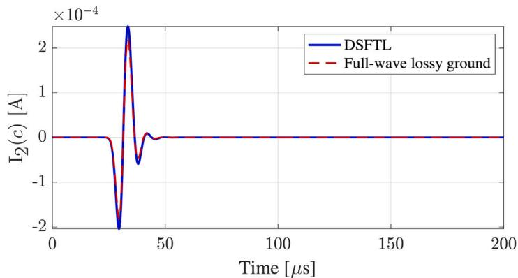  
(a)

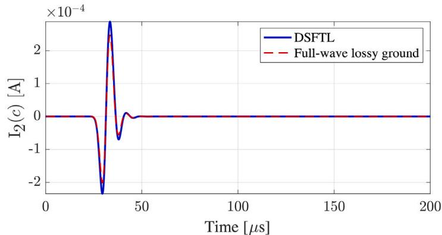  
(b)   
Fig. 10. Current at the point of crossing in the buried conductor for conductor radii of (a) 0.5 m and (b) 0.99 m.

conductor is calculated by adding the currents in all straight wires together.

The current in the overhead wire at the point of crossing, assuming $\sigma _ { g } = 0 . 0 0 1 \mathrm { ~ } \mathrm { { S } } / \mathrm { { m } } , d = 1 \mathrm { ~ m } , a _ { j } = 2 5$ cm and a crossing angle (??) of 30◦, is shown in Fig. 6, and the current in the buried wire at $\begin{array} { r } { z = \frac { d z } { 2 } , z = c } \end{array}$ and $\begin{array} { r } { z = \ell - \frac { d z } { \gamma } } \end{array}$ (where $d z = 2 5$ m is the segment size used for the MFDTD algorithm and the NEC4 simulation), are shown in Fig. 7. Note that from a transmission line perspective, at $z = 0$ and $z = \ell$ the current on the buried wire is zero since the ends are open circuited. It is seen that the currents induced in the buried conductor by the overhead wire calculated by the proposed DSFTL model agree with those obtained using full-wave techniques. The peak current induced in the buried wire is close to 1∕3 of the current in the overhead wire. Another noticeable fact is that the current in the buried conductor towards its ends are negligibly small compared to that induced at the point of crossing. This is due to the fact the current dissipates quickly to the ground due to its finite conductivity.

# 3.1. Effect of the crossing angle

The base case explained above is simulated with two other crossing angle (??) values, 60◦and 90◦and the induced current in the buried conductor at the point of crossing is shown in Fig. 8. The induced current in the buried conductor decreases in magnitude as the crossing angle increases. At a crossing angle of 90◦, since $Y _ { \mathbf { o b } }$ was assumed to be zero and $Z _ { \mathrm { o b } } = 0$ when $\alpha = 9 0 ^ { \circ }$ , the DSFTL model will calculate a zero current in the buried wire. In NEC4 simulation results, there is a small current induced in the buried wire due to capacitive coupling (i.e. the existence of a small $Y _ { \mathrm { o b } } )$ as seen in Fig. 7c. However, this current is seen to be negligibly small compared to the induced current at smaller

angles. Therefore, it can be concluded that the assumption of $Y _ { \mathrm { o b } } = 0$ is adequate for engineering purposes.

# 3.2. Effect of the conductivity of ground

The base case is simulated with two other ground conductivity $( \sigma _ { g } )$ values, 0.01 S/m and 0.0001 S/m based on the typical ground conductivity values given in [38]. The current induced in the buried conductor at the point of crossing is shown in Fig. 9(a). It is seen that results obtained using the proposed model and the full-wave solver agree for typical ground conductivity values. For larger ground conductivity values, the impedance of grounding electrodes will deviate from the purely resistive nature at lower frequencies [37]. Since, the effect of grounding electrodes are incorporated a resistor in the DSFTL model, there can be discrepancies with the full-wave results as seen in Fig. 9(b). However, a high-frequency model of the grounding electrodes can be incorporated when implementing the DSFTL model in EMT simulators as explained in [16].

# 3.3. Effect of the radius of buried conductor

The base case is simulated for buried conductor radii of 0.5 m and 0.99 m (in the latter, the buried conductor is close to the ground surface). Thin-wire approximation can be expected to hold for radii smaller than 0.25 m. The current induced in the buried conductor at the point of crossing is shown in Fig. 10(a). A slight increase is seen with increasing radii in both DSFTL and full-wave results which can be attributed to the fact that the gap between the overhead and buried conductors reduces when the buried conductor radius increases.

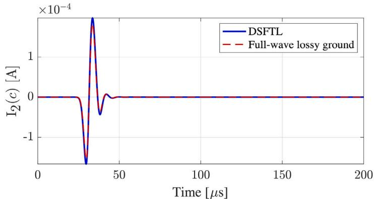  
(a)

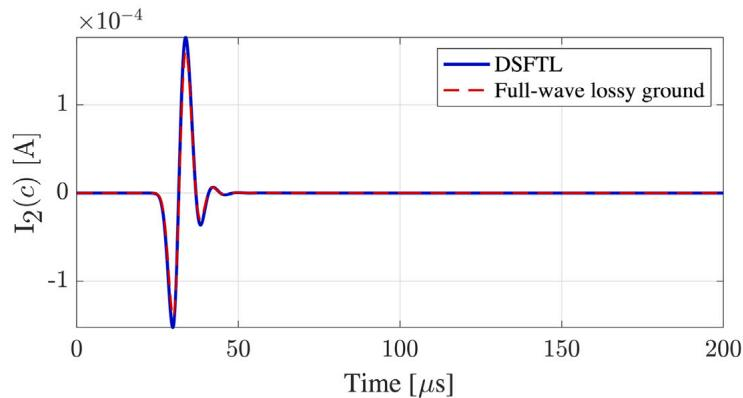  
(b)

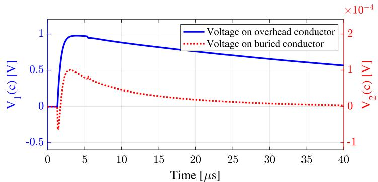  
Fig. 11. Current at the point of crossing in the buried conductor for burial depths of (a) 5 m and (b) 10 m.   
(a)

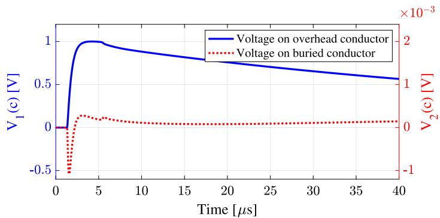  
(b)   
Fig. 12. Voltage at the crossing in the overhead line and buried conductor when the overhead line is excited with a standard lightning impulse waveform of 1.2∕50 μs assuming a ground conductivity is (a) 0.01 S/m and (b) 0.001 S/m.

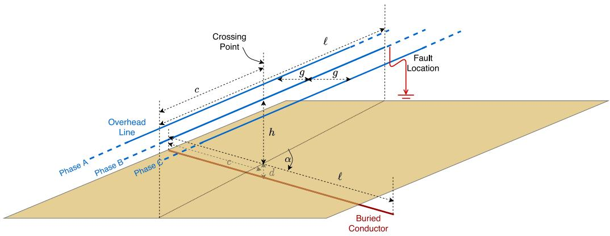  
Fig. 13. Schematic of a multi-conductor overhead line crossing above a buried conductor.

# 3.4. Effect of the burial depth

The base case is simulated with the conductor buried at depths (??) of 5 m and 10 m. The current induced in the buried conductor at the point of crossing is shown in Fig. 11(a). A slight reduction in amplitude is seen in results obtained using both the DSFTL model and the full-wave solver when the burial depth increases.

# 4. Case studies

# 4.1. Lightning induced voltages

The base case is simulated with the ends of the overhead line matched to its characteristic impedance and ?? = 0 excited with a standard lightning impulse waveform of 1.2∕50 μs [39] considering different ground conductivity values. The magnitude of the excitation waveforms is chosen such that the voltage in the overhead line at the point of crossing has a peak magnitude of unity. Voltages obtained at the location of the crossing on the overhead and buried conductors are shown in Fig. 12(a). It is seen that the peak of the voltage in the buried conductor is around 0.1% of the voltage on the overhead line when the ground conductivity is 0.001 S/m, while the induced voltage is much smaller when it is 0.01 S/m. According to [40], a direct lightning strike to a 138 kV line above a ground with a conductivity of 0.001 S/m can cause a lightning voltage of around 500 kV. This means that the induced voltage peak in the buried conductor will be a few hundred volts. According to [41] voltages as low as 50 V are dangerous for humans.

# 4.2. Effect of transmission line faults

A 230 kV three-phase overhead line crossing above a buried conductor at an angle of 30◦as shown in Fig. 13 is modelled considering ℎ = 10 m, ?? = 2 m, ?? = 3 m, ?? = 35 km, and ?? = 15 km. The dimensions of the overhead line have been selected based on the 230 kV line clearances given in [42]. A transmission line fault occurs at the location shown in Fig. 13. The voltage drop in the faulty phases is given a fall-time of 250 μs in accordance with the standard switching impulse waveform [43]. Fig. 14 shows the voltage waveforms st the crossing point on the overhead line and the buried conductor when Phase-C-to-ground and Phase-B-to-C faults occur in the overhead line. It is seen that the induced voltage on the buried conductor is close to 20 V during nonfaulty operation while it can reach voltages close to 100 V when a fault occurs in the overhead line.

# 5. Conclusions

Buried conductors coming into close proximity with overhead power transmission lines creating a nonparallel wire structure is a common

occurrence. Power frequency and transient over-voltages and currents induced in buried conductors during such situations have been found capable in affecting the safe and sustainable operation of the buried conductors. Therefore, an EMT model that can represent the coupling from conductors in air to conductors buried in ground which are nonparallel to each other is necessary.

This paper proposed a nonuniform transmission line formulation to model a system of nonparallel overhead wires and buried conductors in the presence of lossy, frequency-dependent ground. A novel closedform analytical expression was derived for the mutual PUL impedance between nonparallel overhead and buried conductors. The proposed formulation was implemented using a modified finite-difference timedomain algorithm which is compatible with EMT simulators. The validity of the results calculated using the proposed model under varying crossing angle, ground conductivity, conductor radius, and burial depth was verified by comparison with those calculated using an electromagnetic solver (NEC4). A case study on the induced transients on a buried conductor due to lightning transients on a nearby nonparallel overhead conductor was also performed.

# CRediT authorship contribution statement

Manuja Gunawardana: Conceptualization, Methodology, Software, Validation, Formal analysis, Investigation, Visualization, Writing – original draft, Writing – review & editing. Behzad Kordi: Conceptualization, Methodology, Formal analysis, Funding acquisition, Project administration, Resources, Supervision, Writing – review & editing.

# Declaration of competing interest

The authors declare that they have no known competing financial interests or personal relationships that could have appeared to influence the work reported in this paper.

# Data availability

Data will be made available on request.

# Acknowledgements

The authors would like to acknowledge the financial support from the Faculty of Graduate Studies, University of Manitoba, Canada, and Natural Sciences and Engineering Research Council of Canada (NSERC).

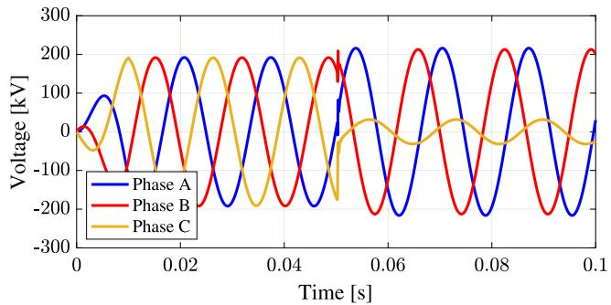

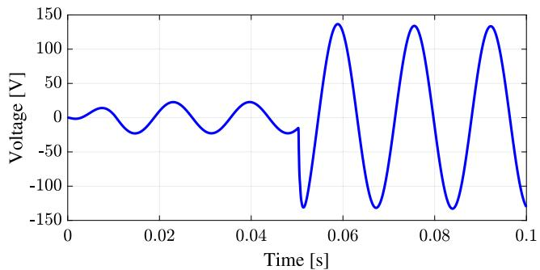  
(a)

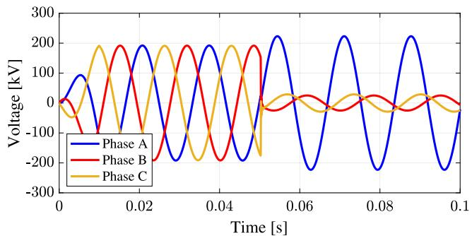  
(b)

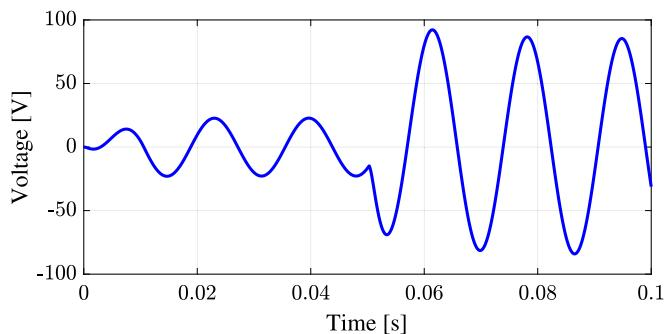  
（c）  
(d)   
Fig. 14. Voltage at the crossing point on (a) the overhead line and (b) the buried conductor when a Phase-C-to-ground fault occurs at the load end. The induced voltage at the when a Phase-B-to-Phase-C fault occurs at the load end is shown at the crossing point on (c) the overhead line and (d) the buried conductor.

# References

[1] A. Popoli, L. Sandrolini, A. Cristofolini, Inductive coupling on metallic pipelines: Effects of a nonuniform soil resistivity along a pipeline-power line corridor, Electr. Power Syst. Res. 189 (2020) 106621.

[2] M.H. Shwehdi, M.A. Alaqil, S.R. Mohamed, EMF analysis for a 380 kV transmission OHL in the vicinity of buried pipelines, IEEE Access 8 (2020) 3710–3717.   
[3] C. Wang, X. Liang, F. Freschi, Investigation of factors affecting induced voltages on underground pipelines due to inductive coupling with nearby transmission lines, IEEE Trans. Ind. Appl. 56 (2) (2020) 1266–1274.   
[4] A.G. Martins-Britto, C.M. Moraes, F.V. Lopes, Inductive interferences between a 500 kV power line and a pipeline with a complex approximation layout and multilayered soil, Electr. Power Syst. Res. 196 (2021) 107265.   
[5] K. Kopsidas, I. Cotton, Induced voltages on long aerial and buried pipelines due to transmission line transients, IEEE Trans. Power Deliv. 23 (3) (2008) 1535–1543.   
[6] C. Wang, X. Liang, R. Radons, Minimum separation distance between transmission lines and underground pipelines for inductive interference mitigation, IEEE Trans. Power Deliv. 35 (3) (2020) 1299–1309.   
[7] N.M. Abdel-Gawad, A.Z. El Dein, M. Magdy, Mitigation of induced voltages and AC corrosion effects on buried gas pipeline near to OHTL under normal and fault conditions, Electr. Power Syst. Res. 127 (2015) 297–306.   
[8] EMTDC – Transient Analysis for PSCAD Power System Simulations: User’s Guide, Manitoba HVDC Research Centre, 2005.   
[9] H. Dommel, EMTP Theory Book, Bonneville Power Administration, Protland, OR, 1986.   
[10] A. Popoli, A. Cristofolini, L. Sandrolini, A numerical model for the calculation of electromagnetic interference from power lines on nonparallel underground pipelines, Math. Comput. Simulation 183 (2021) 221–233, Special Issue: ELECTRIMACS 2019 ENERGY - Modelling and computational simulation for control and diagnosis in renewable energy systems, energy storage, innovative devices and materials.   
[11] S.V. Tkachenko, F. Rachidi, J.B. Nitsch, High-frequency electromagnetic coupling to transmission lines: electrodynamics correction to the TL approximation, in: S.V. Tkachenko, F. Rachidi (Eds.), Electromagnetic Field Interaction with Transmission Lines: From Classical Theory to HF Radiation Effects, WIT Press, 2008, p. 123.   
[12] L.D. Grcev, A. Kuhar, V. Arnautovski-Toseva, B. Markovski, Evaluation of highfrequency circuit models for horizontal and vertical grounding electrodes, IEEE Trans. Power Deliv. 33 (6) (2018) 3065–3074.   
[13] M. Gunawardana, B. Kordi, Time-domain modeling of transmission line crossing using electromagnetic scattering theory, IEEE Trans. Power Deliv. 35 (2) (2020) 1020–1027.   
[14] Ashley Ng, M. Gunawardana, B. Kordi, Simulation of transmission line bend using a non-uniform transmission line model based on scattering theory, in: IEEE PES General Meeting, 2020.   
[15] S. Tkachenko, F. Rachidi, J. Nitsch, Analytical characterization of a line bend, in: 7th International Conference on Computational and Experimental Methods in Eectrical Engineering and Electromagnetics, vol. 39, (1) 2004, pp. 599–608.   
[16] M. Gunawardana, A. Ng, B. Kordi, Time-domain coupling model for nonparallel frequency-dependent overhead multiconductor transmission lines above lossy ground, IEEE Trans. Power Deliv. 37 (4) (2022) 2997–3005.   
[17] V. Arnautovski-Toseva, L. Grcev, On the image model of a buried horizontal wire, IEEE Trans. Electromagn. Compat. 58 (1) (2016).   
[18] D. Poljak, K. El Khamlichi Drissi, K. Kerroum, S. Sesnic, Comparison of analytical and boundary element modeling of electromagnetic field coupling to overhead and buried wires, Eng. Anal. Bound. Elem. 35 (3) (2011) 555–563.   
[19] D. Poljak, V. Doric, F. Rachidi, K.E.K. Drissi, K. Kerroum, S.V. Tkachenko, S. Sesnic, Generalized form of telegrapher’s equations for the electromagnetic field coupling to buried wires of finite length, IEEE Trans. Electromagn. Compat. 51 (2) (2009) 331–337.   
[20] F.A. Uribe, Calculating mutual ground impedances between overhead and buried cables, IEEE Trans. Electromagn. Compat. 50 (1) (2008) 198–203.   
[21] A. Ametani, T. Yoneda, Y. Baba, N. Nagaoka, An investigation of earthreturn impedance between overhead and underground conductors and its approximation, IEEE Trans. Electromagn. Compat. 51 (3) (2009) 860–867.   
[22] J.R. Carson, Wave propagation in overhead wires with ground return, Bell Syst. Tech. J. 5 (4) (1926) 539–554.   
[23] G. Lucca, Mutual impedance between an overhead and a buried line with earth return, in: Ninth International Conference on Electromagnetic Compatibility, 1994. (Conf. Publ. No. 396), 1994, pp. 80–86.   
[24] E.D. Sunde, Earth Conduction Effects in Transmission Systems, Dover Publications, 1968.   
[25] K. Budnik, W. Machczyński, Mutual impedance of non-parallel conductors with earth return, Eur. Trans. Electr. Power Eng. 20 (3) (2010) 354–366.   
[26] S. Wang, J. He, B. Zhang, R. Zeng, Time-domain simulation of small thin-wire structures above and buried in lossy ground using generalized modified mesh current method, IEEE Trans. Power Deliv. 26 (1) (2011) 369–377.   
[27] C.R. Paul, Analysis of Multiconductor Transmission Lines, second ed., Wiley-IEEE Press, 2007.   
[28] P.R. Bannister, Applications of complex image theory, Radio Sci. 21 (4) (1986) 605–616.

[29] N. Theethayi, R. Thottappillil, M. Paolone, C.A. Nucci, F. Rachidi, External impedance and admittance of buried horizontal wires for transient studies using transmission line analysis, IEEE Trans. Dielectr. Electr. Insul. 14 (3) (2007) 751–761.   
[30] S. Tkatchenko, F. Rachidi, M. Ianoz, Electromagnetic field coupling to a line of finite length: Theory and fast iterative solutions in frequency and time domains, IEEE Trans. Electromagn. Compat. 37 (4) (1995) 509–518.   
[31] I.S. M. Abramowitz, Handbook of Mathematical Functions with Formulas, Graphs, and Mathematical Tables (Partially Mathcad-Enabled), U.S. Department of Commerce, NIST, 1972, p. 13.   
[32] L. Qi, H. Yuan, L. Li, X. Cui, Calculation of interference voltage on the nearby underground metal pipeline due to the grounding fault on overhead transmission lines, IEEE Trans. Electromagn. Compat. 55 (5) (2013) 965–974.   
[33] H. Isogai, A. Ametani, Y. Hosokawa, An investigation of induced voltages to an underground gas pipeline from an overhead transmission line, Electr. Eng. Japan 164 (1) (2008) 43–51.   
[34] B. Kordi, J. LoVetri, G.E. Bridges, Finite-difference analysis of dispersive transmission lines within a circuit simulator, IEEE Trans. Power Deliv. 21 (1) (2006) 234–242.   
[35] B. Gustavsen, A. Semlyen, Rational approximation of frequency domain responses by vector fitting, IEEE Trans. Power Deliv. 14 (3) (1999) 1052–1061.

[36] G. Burke, A. Poggio, J. Logan, J. Rockway, NEC - numerical electromagnetics code for antennas and scattering, in: 1979 Antennas and Propagation Society International Symposium, vol. 17, 1979, pp. 147–150.   
[37] B. Salarieh, J. De Silva, B. Kordi, High frequency response of grounding electrodes: effect of soil dielectric constant, IET Gener. Transm. Dist. 14 (15) (2020) 2915–2921.   
[38] Recommendation IT.U.-R. 832-4, World atlas of ground conductivities, 2015.   
[39] E. Kuffel, W.S. Zaengl, J. Kuffel, High Voltage Engineering Fundamentals, second ed., Butterworth-Heinemann, Boston, 2000.   
[40] F.H. Silveira, A. De Conti, S. Visacro, Lightning overvoltage due to first strokes considering a realistic current representation, IEEE Trans. Electromagn. Compat. 52 (4) (2010) 929–935.   
[41] IEEE Guide for Maintenance, Operation, and Safety of Industrial and Commercial Power Systems (Yellow Book), IEEE Std, 1998, pp. 1–160, 902-1998.   
[42] S. Kalaga, P. Yenumula, Design of Electrical Transmission Lines : Structures and Foundations, CRC Press, 2016.   
[43] S. Okabe, G. Ueta, T. Tsuboi, J. Takami, Study on switching impulse test waveform for UHV-class electric power equipment, IEEE Trans. Dielectr. Electr. Insul. 19 (3) (2012) 793–802.