# Modular Multilevel Converter Models for Electromagnetic Transients

Hani Saad, Member, IEEE, Sébastien Dennetière, Member, IEEE, Jean Mahseredjian, Fellow, IEEE, Philippe Delarue, Member, IEEE, Xavier Guillaud, Member, IEEE, Jaime Peralta, Member, IEEE, and Samuel Nguefeu, Member, IEEE

Abstract—Modular multilevel converters (MMCs) may contain numerous insulated-gate bipolar transistors. The modeling of such converters for electromagnetic transient-type (EMT-type) simulations is complex. Detailed models used in MMC-HVDC simulations may require very large computing times. Simplified and averaged models have been proposed in the past to overcome this problem. In this paper, existing averaged and simplified models are improved in order to increase their range of applications. The models are compared and analyzed for different transient events on an MMC-HVDC system.

Index Terms—Average-value model (AVM), EMT-type programs, HVDC transmission, modular multilevel converter (MMC), switching function, voltage-source converter (VSC).

# I. INTRODUCTION

T HE inclusion of high-voltage direct current (HVDC)transmission in electric power grids is expanding rapidly. transmisson in electric power grids is expanding rapidly. Two HVDC technologies are prevailing: 1) line-commutated converters (LCC) based on thyristor semiconductor devices and 2) voltage-source converter (VSC) type using insulated-gate bipolar transistors (IGBTs). VSC–HVDC systems present several advantages over the traditional LCC–HVDC links [1], such as independent control of active and reactive powers, ability to supply weak grids or passive networks, and black start capability.

The recent modular multilevel converter (MMC) topology [2] offers significant benefits compared to previous VSC technologies [3]. With a sufficient number of MMC levels per phase, the filter requirements can be eliminated. Moreover, switching frequency and transient peak voltages on IGBT devices are lower in MMCs, which reduces converter losses [4]. Scalability to higher voltages is easily achieved and reliability is improved by increasing the number of submodules (SMs) per phase [5].

Manuscript received April 07, 2013; revised September 11, 2013; accepted October 08, 2013. Paper no. TPWRD-00396-2013.

H. Saad, J. Mahseredjian, and J. Peralta are with the École Polytechnique de Montréal, Montréal, QC H3C 3A7 Canada (e-mail: hani.saad@polymtl.ca; jean.mahseredjian@polymtl.ca; jaime.peralta@polymtl.ca).

S. Dennetière and S. Nguefeu are with Réseau de Transport d’Electricité (RTE), Paris-La Défense, Paris 92068, France (e-mail: sebastien.dennetiere@rte-france.com; samuel.nguefeu@rte-france.com).

P. Delarue and X. Guillaud are with L2EP, École Centrale de Lille, Lille 59651, France (e-mail: Philippe.Delarue@univ-lille1.fr; xavier.guillaud@ec-lille.fr).

Color versions of one or more of the figures in this paper are available online at http://ieeexplore.ieee.org.

Digital Object Identifier 10.1109/TPWRD.2013.2285633

The large number of IGBTs in MMCs complicates the simulations in electromagnetic transient-type (EMT-type) simulation tools. Detailed MMC–HVDC models must include the representation of thousands of IGBTs and small numerical integration time steps are required to accurately represent fast and multiple simultaneous switching events [5]. The excessive computational burden introduced by such models requires researching more efficient models. A current trend is based on simplified and averaged value models capable of delivering sufficient accuracy [6] in dynamic simulations.

Average value models (AVMs) approximate system dynamics by neglecting switching details [7], [8]. They require significantly less computational resources and can use larger integration time steps leading to much faster computations [9]. In [10], an AVM model for a 401-level MMC-HVDC system has been presented. A phasor-domain-based model of the MMC was presented in [11].

This paper introduces a new model based on the switching function principle applied to each MMC arm. An improved AVM model is also presented.

References [12] and [13] are based on circuit reduction achieved by the replacement of IGBTs by ON/OFF resistors in the SMs. The mathematical formulation and computational performance of this approach have been already demonstrated [14]. However, the blocked state of submodules has not been previously addressed. This paper presents an iterative solution for correcting this limitation within a more efficient overall model implementation.

This paper also presents comparisons between different types of MMC models for deriving their advantages and limitations according to simulation needs.

# II. MMC TOPOLOGY

Fig. 1 shows the three-phase configuration of the MMC topology. The MMC model developed here is based on the preliminary MMC–HVDC system design for the planned interconnection between France and Spain 400-kV networks in 2013 [10]. The MMC is comprised of SMs per arm which results in a line-to-neutral voltage waveform of levels [15]. The inductor $L _ { \mathrm { a r m } }$ is added on each arm to limit arm-current harmonics and fault currents. Each SM is a half-bridge converter as depicted in Fig. 2 and includes mainly a capacitor and two IGBTs with antiparallel diodes (S1 and S2).

# III. SUBMODULE OPERATION

Since the IGBT device is controllable through gate signals and $g _ { 2 , i }$ , the SM can have three different states. In the ON state:

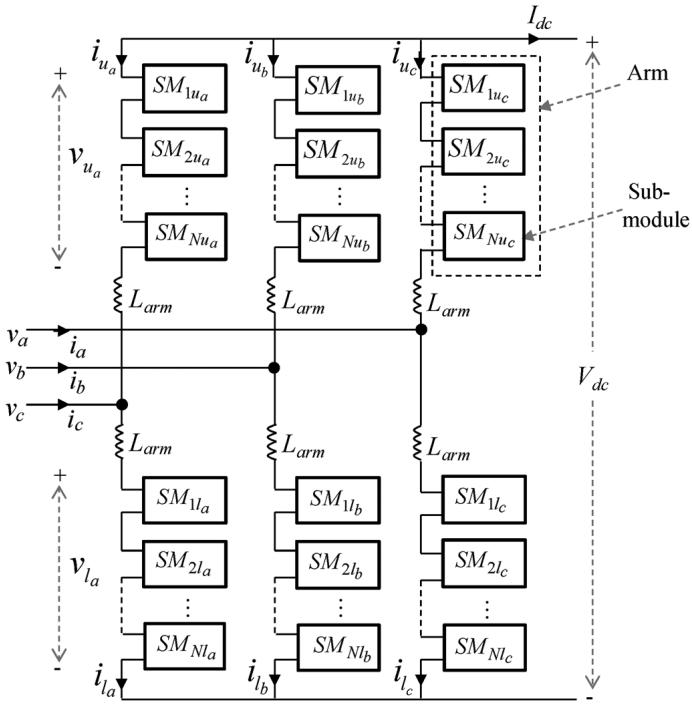  
Fig. 1. Typical MMC topology for a three-phase converter.

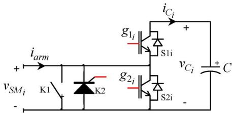  
Fig. 2. Half-bridge SM circuit for the th SM.

$g _ { 1 _ { i } }$ is on, $g _ { 2 _ { i } }$ is OFF, and the SM voltage $v _ { S M _ { i } }$ is equal to the capacitor voltage $v _ { C _ { i } }$ . In the OFF state: $g _ { 1 _ { i } }$ is off, $g _ { 2 _ { i } }$ is ON, and $v _ { S M _ { i } } = 0$ . In the blocked state: $g _ { 1 , \ast }$ is off, $g _ { 2 _ { i } }$ is off, and $v _ { S M _ { i } }$ depends on the arm current $( i _ { \mathrm { a r m } } )$ direction. The capacitor may charge through S1 and cannot discharge.

Depending on the IGBT technology used in such a converter, the high-speed bypass switch K1 (Fig. 2) is required to increase safety and reliability in case of SM failure, and the thyristor K2 (Fig. 2) is fired to protect the IGBTs against high fault currents [5].

# IV. MMC MODELS

There are many variables in an MMC model. Different models can be used according to the type of study and required accuracy. Model evolution in decreasing complexity is depicted in Fig. 3. Black boxes represent simplifications. It is expected that by decreasing model complexity, computational performance can be increased. Model 1 is the most detailed. Model 2 uses a simplified power switch circuit model. Model 3 makes a simplified arm circuit equivalent. In Model 4, the complete MMC structure is reduced to an equivalent system. The model details are presented in the next sections.

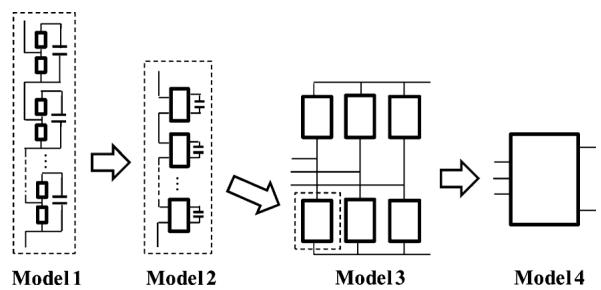  
Fig. 3. MMC model evolution in decreasing complexity.

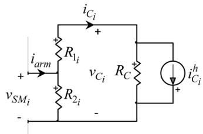  
Fig. 4. Discretized SM with simplified IGBT/diode models.

# A. Model 1: Detailed IGBT-Based Model

This model considers a detailed representation of power switches. The model presented in [10] uses an ideal controlled switch, two nonlinear (series and anti-parallel) diodes, and two snubber circuits. The nonideal diodes are modeled with nonlinear resistances using the classical V-I curve of a diode and a snubber circuit to mimic the reverse recovery condition. The nonlinear characteristics can be tuned based on manufacturer data sheets or field measurements. This model is able to account for switching and conduction losses and any topological conditions in the converter.

# B. Model 2: Equivalent Circuit-Based Model

In this model the SM power switches are replaced by ON/OFF resistors: $R _ { \mathrm { O N } }$ (small value in milliohms) and $R _ { \mathrm { O F F } }$ (large value in megaohms). This approach allows performing an arm circuit reduction for eliminating internal electrical nodes and allowing the creation of a Norton equivalent for each MMC arm. In [12] (simplified version of Fig. 2), $R _ { 1 }$ and $R _ { 2 }$ are controlled and used for replacing the two IGTB/diode combinations. With the trapezoidal integration rule, each SM capacitor is replaced by an equivalent current history source $i _ { C _ { i } } ^ { h } ( t - \Delta t )$ in parallel with a resistance $R _ { C } = \Delta t / ( 2 C )$ , where is the numerical integration time-step. The derivation of these equations can be found in [12] and [13]. However, the blocked state condition and other implementation details have not been addressed. Table I shows the algorithm used for Model 2. In Point 2.a. of Table I, it can be seen that the computation of ON/OFF states are straight forward since only gate signal values are required. When the blocked state is set, only the freewheeling diodes can conduct. The diode conduction states depend on voltage and current variables (Table I, 2.a) that are known only from the previous iteration $( v _ { S M _ { i } } ( t _ { - 1 } )$ and $v _ { C _ { i } } ( t _ { - 1 } ) )$ . The discontinuities in state variables due to the blocked state will cause numerical oscillations and in addition, the correct diode conduction states must be computed. A new implementation of Model 2 is proposed here. It uses the EMTP-RV solver

TABLE I MMC ARM ALGORITHM OF MODEL 2   

<table><tr><td>1. Retrieve varm(t) from network solution and compute
iarm(t)</td></tr><tr><td>2. For i=1,2,...,N
a) Set R1i and R2i values:
if(SMi is ON) {R1i = RON; R2i = ROFF}
elseif(SMi is OFF) {R1i = ROFF; R2i = RON}
elseif(SMi is Blocked) {
if((iarm(t) &gt; 0) and (vSMi(t-1) &gt; vCi(t-1)))
{R1i = RON; R2i = ROFF}
if((iarm(t) &lt; 0) and (vSMi(t-1) &lt; 0))
{R1i = ROFF; R2i = RON}
else{R1i = ROFF; R2i = ROFF}
b) Compute vCi(t) and iCi(t)
c) Compute Thevenin equivalent of each SM
d) Compute SM voltages for next iteration: vSMi(t)</td></tr><tr><td>3. Compute and send Norton equivalent of the arm</td></tr></table>

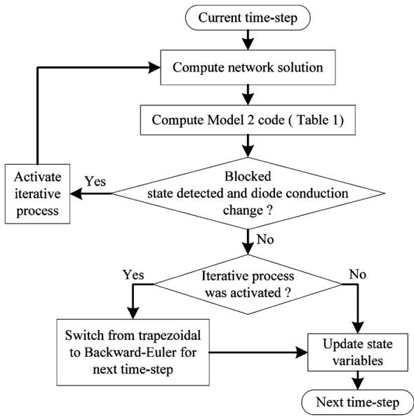  
Fig. 5. Block diagram, iterative process used for Model 2.

for nonlinear components [16]. When the blocked state is set for one of the SMs and a change in conduction state of one of the diodes is detected, an iterative process is activated in the current time-step in order to find the correct conduction states and the trapezoidal integration rule is switched to the Backward Euler method for the next timestep (Fig. 5). The latter is for eliminating numerical oscillations [17] caused by discontinuities in trapezoidal integration.

The simulation of an MMC with 401 levels showed that in average less than 3 iterations are needed for the convergence of the method in Fig. 5. It proves the efficiency of this method.

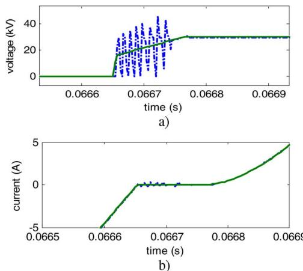  
Fig. 6. Effect of the iterative process, green solid line the iterative process is on, blue dotted line the iterative process is off.(a) Voltage $v _ { S M _ { 1 } }$ and (b) current: .

The test presented in Fig. 6 illustrates its effect on voltage and current waveforms.

The main advantage of Model 2 is the significant reduction in the number of electrical nodes in the main system of network equations. The algorithm still considers each SM separately and maintains a record for individual capacitor voltages. It is applicable to any number of SMs per arm.

# C. Model 3: MMC Arm Switching Function

In this model, each MMC arm is averaged using the switching function concept of a half-bridge converter. Let $S _ { i }$ be the switching function that takes the value 0 when the state of SM is OFF and 1 when it is ON. For each SM

$$
v _ {\mathrm {S M} _ {i}} = S _ {i} v _ {C _ {i}}
$$

$$
i _ {C _ {i}} = S _ {i} i _ {\text {a r m}}. \tag {1}
$$

Assuming that capacitor voltages of each arm are balanced [18], the average values of capacitor voltages are equal. In addition, by neglecting the voltage differences between capacitors, the following assumption can be made:

$$
v _ {C _ {1}} = v _ {C _ {2}} = \dots = v _ {C _ {i}} = \frac {v _ {C _ {\text {t o t}}}}{N} \tag {2}
$$

where $v _ { C _ { \mathrm { t o t } } }$ represents the sum of all capacitor voltages of an arm. The accuracy of assumption (2) increases when the number of SMs per arm is increased and/or when the fluctuation amplitudes of capacitor voltages are decreased. This assumption allows deducing an equivalent capacitance $C _ { a r m } = C / N$ for each arm.

By defining the switching functions of an arm as follows:

$$
\frac {1}{N} \sum_ {i = 1} ^ {N} S _ {i} = s _ {n} \tag {3}
$$

and including the linear conductivity losses $\left( R _ { O N } \right)$ for each SM, the following switching functions can be derived for each arm when the SMs are in ON/OFF states [19]:

$$
v _ {\mathrm {a r m}} = s _ {n} v _ {C _ {\mathrm {t o t}}} + (N R _ {\mathrm {O N}}) i _ {a r m}
$$

$$
i _ {C _ {\text {t o t}}} = s _ {n} i _ {\text {a r m}} \tag {4}
$$

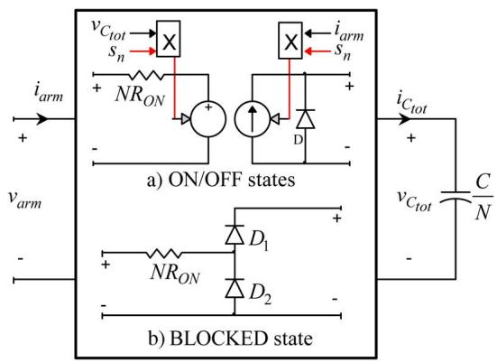  
Fig. 7. Switching function model of MMC arm. (a) ON/OFF states model and (b) blocked state model.

where $v _ { \mathrm { a r m } }$ is the arm voltage. Half-bridge converters are nonreversible in voltage. In order to avoid negative voltages, a diode D is added in parallel with the equivalent capacitor [Fig. 7(a)].

When all SMs are in blocked state, each MMC arm can be simply represented by an equivalent half-bridge diode connected to the equivalent capacitor [Fig. 7(b)].

By reducing each arm to an equivalent switching function model, power switches are no longer represented. This means that the balancing control of capacitor voltages in each arm and redundant [5] SM impacts cannot be studied using this approach. However, circulating currents and the linear conduction losses can be represented. Moreover, the energy transferred from ac and dc sides into each arm of the MMC is taken into account, which is useful for control system strategies based on internal MMC energy balance [20], [21].

Since this approach includes two circuit models (Fig. 7), its implementation in EMT-type programs is hard-coded to increase computational performance. Depending on the states of each arm, the adequate circuit is interfaced with the main network.

# D. Model 4: AVM of MMC

In the AVM, the IGBTs and their diodes are not explicitly represented and the MMC behavior is modeled using controlled voltage and current sources. The classical AVM approach is developed for 2- and 3-level VSCs in [22] and extended to MMCs in [10]. It is used in this paper by assuming that the internal variables of the MMC are perfectly controlled, that is, all SM capacitor voltages are perfectly balanced and second harmonic circulating currents in each phase are suppressed. Based on the approach presented in [10], the following equation can be derived from Fig. 1 for each phase $j = a , b ,$

$$
e _ {\operatorname {c o n v} _ {j}} = \frac {L _ {\operatorname {a r m}}}{2} \frac {d i _ {j}}{d t} - v _ {j}. \tag {5}
$$

Assuming that the total number of inserted SMs in each phase is constant and since the circulating current is assumed to be zero,

$$
v _ {u _ {j}} + v _ {l _ {j}} = V _ {\mathrm {d c}}. \tag {6}
$$

With (5) and (6), the MMC can be represented as a classical VSC (2- and 3-level topologies) [3], which was not the case

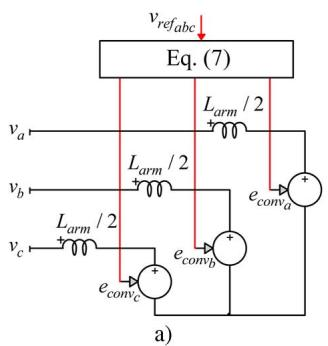

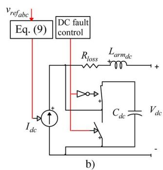  
Fig. 8. Model 4, AVM for MMC: (a) ac side and (b) dc side.

in [14]. Thus, using an approach similar to [22], the controlled voltage sources become

$$
e _ {\text {c o n v} j} = v _ {\text {r e f} j} \frac {V _ {\mathrm {d c}}}{2} \tag {7}
$$

where $v _ { \mathrm { r e f } _ { \it j } }$ are the voltage references generated from the inner controller [23]. The ac-side representation of this model is shown in Fig. 8(a).

The dc-side model [Fig. 8(b)] is derived using the principle of power balance; thus, it assumes that no energy is stored inside the MMC converter

$$
V _ {\mathrm {d c}} I _ {\mathrm {d c}} = \sum_ {j = a, b, c} e _ {\mathrm {c o n v} _ {j}} i _ {j}. \tag {8}
$$

The dc current function is derived from (6)

$$
I _ {\mathrm {d c}} = \frac {1}{2} \sum_ {j = a, b, c} v _ {\text {r e f} _ {j}} i _ {j}. \tag {9}
$$

The equivalent capacitor $C _ { \mathrm { d c } }$ (shown in Fig. 8) is derived using the energy conservation principle [10] and is given by $C _ { \mathrm { d c } } = 6 C / N$ .

Unlike the classical VSC model, an inductance is included in each arm of the MMC, thus an equivalent inductance should be also added on the dc side. Since one third of the dc current flows in each arm and the same dc current flows in upper and lower arms of each phase, the equivalent inductance is given by $L _ { \mathrm { a r m _ { d c } } } = ( 2 / 3 ) L _ { \mathrm { a r m } }$ . The total conduction losses of the MMC can be found using $R _ { \mathrm { l o s s } } = ( 2 / 3 ) N ~ R _ { \mathrm { O N } }$ .

During a dc fault, all SMs in the MMC are blocked and shorted by the thyristor K2 (see Fig. 2), thus transforming the MMC into a 6-pulse bridge diode converter. However, since only the equivalent MMC phases are represented, the blocked state behavior cannot be accurately modeled. In order to mimic this behavior, the equivalent capacitor $C _ { \mathrm { d c } }$ is disconnected and the current source control is short-circuited.

This type of model can be slightly modified to study harmonic effects. By inserting the nearest level control (NLC) [24] modulation before “Eq. (7)” block in Fig. 8, the effective number of SMs switched ON at each instant can be generated and $e _ { \mathrm { c o n v } _ { j } }$ will become a staircase waveform [10].

The above AVM model is an improvement over the one in [14]. It has a simplified ac side and the dc side has an improved circuit for more accurate computation of dc fault currents.

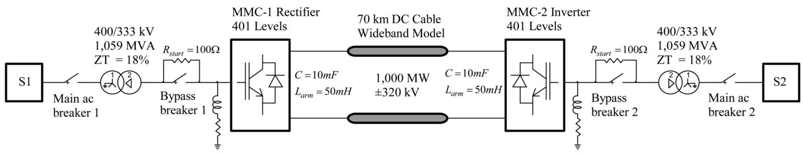  
Fig. 9. MMC–HVDC transmission test system.

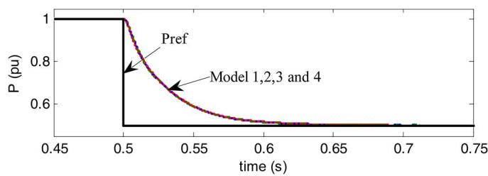  
Fig. 10. Active power responses, power flowing into MMC-1.

# V. MODEL COMPARISONS

This section compares the dynamic behaviors of models presented in Section IV. The studied system is shown in Fig. 9. The control strategy considers an active/reactive power flow control on the sending end (MMC-1 rectifier) and a dc voltage/reactive power control on the receiving end (MMC-2 inverter). The ac grids are represented as equivalent sources with a short-circuit level of 10 000 MVA. The transmission capacity of the system is 1 000 MW from S1 to S2. The dc line is modeled using a wideband line model [25] and its data are provided in the Appendix. For the considered 401-level MMC (400 SMs/arm), a switching event occurs (on average) every $1 0 \mu \mathrm { s }$ . Accuracy verification is based on a time-step of 1 s for all model types. The Model 1 (with nonlinear IGBT/diode model) constitutes the reference model. All model developments and simulations are performed using the EMTP–RV software [16].

# A. Step Change of Active Power Reference

A step change in the active power reference for MMC-1 is applied at 0.5 s of simulation. The active power reference is reduced from 1 to 0.5 p.u. In Fig. 10, all four models deliver identical results. Fig. 11 presents other variables related to the studied MMC topology. The difference current in phase A is defined as $i _ { \mathrm { d i f f } _ { a } } = ( i _ { u _ { a } } + i _ { l _ { a } } ) / 2$ [21] and the sum of all capacitor voltages of each arm (phase A) are given by $v _ { C _ { \mathrm { t o t } _ { u a } } }$ and UCtot1a $v _ { C _ { \mathrm { t o t } _ { l a } } }$ (Fig. 1). Since arm details are not represented in Model 4 (Fig. 3), only Models 1, 2 and 3 are compared here. As it can be noticed, the three models give similar and accurate results.

# B. Three-Phase AC Fault

A 200 ms three-phase-to-ground fault is applied on the ac side of MMC-2 (between the transformer’s primary winding and the grid) at 1 s of simulation time. Fig. 12 compares the dynamic responses. The results from Models 2 and 3 are similar to Model 1, and Model 4 remains sufficiently accurate. Fig. 12(d) shows an attenuated oscillation around 413 Hz during the fault, which

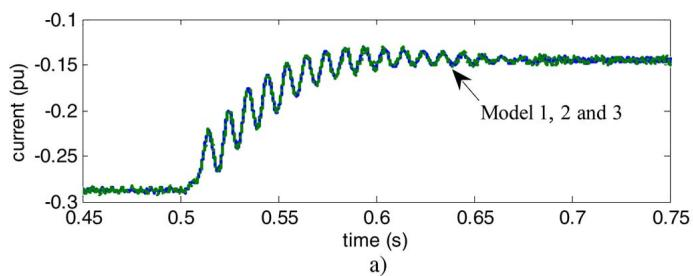

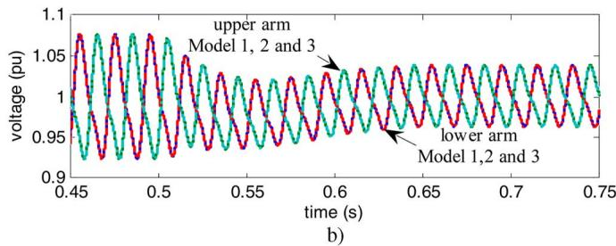  
Fig. 11. Step change in active power reference for MMC-1, 401 levels: (a) MMC-1 phase A, difference current $i _ { \mathrm { d i f f } _ { \alpha } }$ and (b) MMC-1 phase A upper and lower arms, . $v _ { C _ { \mathrm { t o t } } }$

has slightly higher amplitude (peak-to-peak mean value 0.008 p.u.) in Models 1 and 2 than in Model 3 (peak-to-peak mean value 0.001 p.u.). This oscillation is related to the interaction between the MMC and the dc cable. The current increases rapidly during the ac fault. The capacitor voltage fluctuations of each SM will also increase and the assumption of (2) will become less accurate. This transient generates harmonics in the MMC that interact with the dc cable model.

# C. Influence of MMC Levels

The number of MMC levels can vary depending on application and manufacturer. In order to evaluate the effect of MMC levels, the 401-level MMC in the test case of Fig. 9 is replaced by a 51-level MMC. SM capacitors are scaled to 50/400. All of the other parameters are kept the same.

The results on ac side are similar to those found in Fig. 12. The dc side behavior (Fig. 13) is not the same due to reduced number of levels.

It is noticed that during the ac fault, the dc voltage oscillation frequency found in Fig. 12(d), also appears in Fig. 13(b). However, this oscillation now has higher amplitude and does not attenuate in Models 1 and 2 in contrast with Model 3. In the fault interval, the dc voltage peak-to-peak mean value of Model 2 is close to Model 1 at around 0.063 p.u.; however, the peak-to-peak mean value of Model 3 is 0.01 p.u. Moreover, this oscillation has a repercussion on the dc current shown in

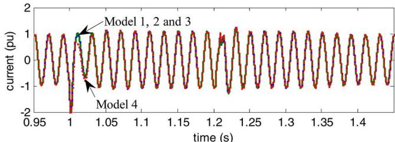  
a）

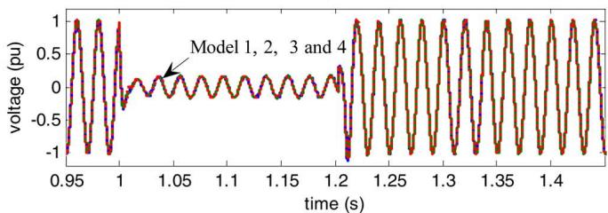

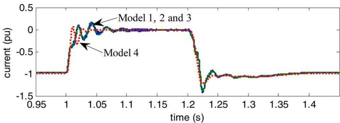

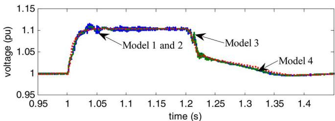  
  
Fig. 12. Three-phase ac fault, 401 levels, blue line for Models 1 and $^ { 2 , }$ green line for Model 3 and red line for Model 4. (a) MMC-2 phase A current ; (b) MMC-2 phase A voltage ; (c) MMC-2 dc current $\bar { I _ { \mathrm { d c } } }$ ; and (d) MMC-2 dc voltage $V _ { \mathrm { d c } }$ .

Fig. 13(a). Indeed there are noticeable differences between the waveforms from Models 1 to 2 and Model 3.

For an MMC of 101 levels, differences can still be found between Models 1 to 2 and Model 3. The dc voltage peak-topeak mean value for Models 1 and 2 are 0.031 p.u. and Model 3 is estimated around 0.006 p.u. However it may be considered as a precision tradeoff, since the oscillations are attenuated and the differences between current waveforms are less apparent.

This section and the previous Section V-B confirm that the assumption (2) in Model 3 depends on the number of MMC levels and capacitor voltage fluctuations.

# D. Pole-to-Pole DC Fault

The models are tested for a permanent dc fault between the positive and negative poles in the middle of the dc cable. The fault is applied at 1.9 s (Fig. 14). The fault clearing method is proposed in [26]. All thyristors (K2) are fired and all IGBTs are blocked 40 s after fault detection, and the ac breakers on the primary sides of both transformers are opened after two cycles.

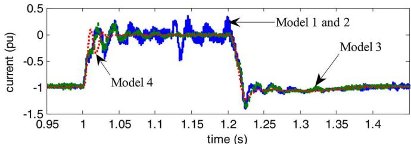  
a)

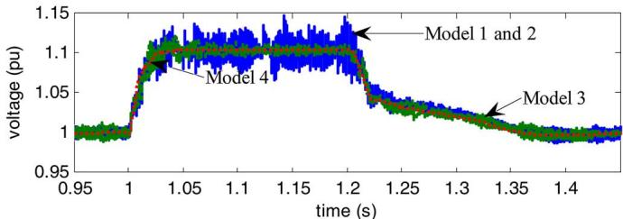  
b)

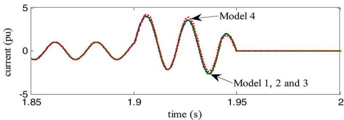  
Fig. 13. Three-phase ac fault, 51 levels, blue line for Models 1 and 2, green line for Model 3 and red line for Model 4. (a) MMC-2 dc current $I _ { \mathrm { d c } }$ and (b) MMC-2 dc voltage $V _ { \mathrm { d c } }$ .   
a)

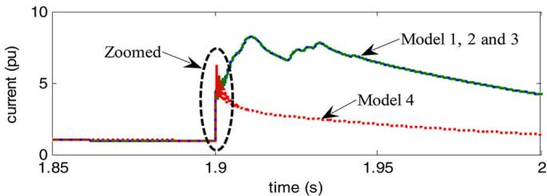  
b)   
Fig. 14. DC fault results, 401 levels, blue line for Models 1 and 2, green line for Model 3 and red line for Model 4. (a) MMC-1 ac current: $i _ { \alpha }$ and (b) MMC-1dc current: $I _ { \mathrm { d c } }$ .

The dc and ac currents in MMC-1 are compared in Fig. 14 for different models. The dc current peak during a pole-to-pole fault reaches a value of approximately 8.2 p.u. for Models 1 to 3. A peak value of 6.2 p.u. is reached [Fig. 14(b)] with Model 4. However, the ac waveforms of Model 4 are very close to the other models.

From the zoomed waveform of Fig. 15, it can be noticed, that just after the dc fault occurs, Model 4 accurately mimics the slope and peak values of $I _ { \mathrm { d c } }$ . However, after approximately 1 ms, the behavior becomes different, due to the inaccurate representation of the blocked state in Model 4.

# E. Converter Startup

This test studies the start-up procedure of the converter where all capacitor voltages are initially set to zero and all SMs are in blocked state. A resistance of 100 $( R _ { \mathrm { s t a r t } } )$ is connected

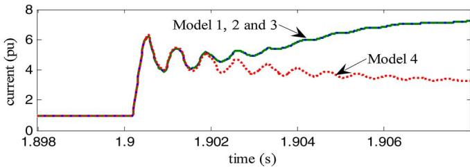  
Fig. 15. Zoomed waveform, MMC-1, $I _ { \mathrm { d c } }$

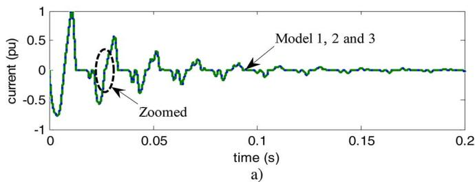

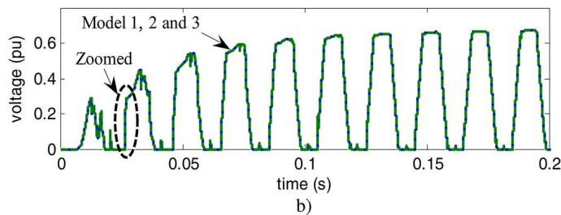

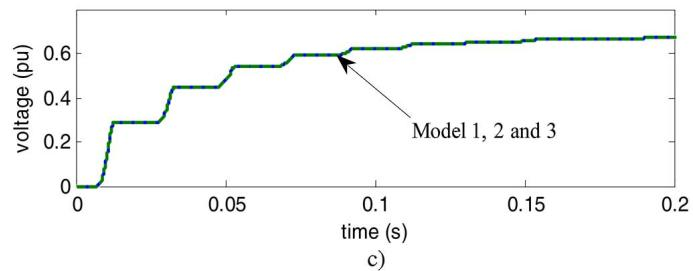  
Fig. 16. MMC-1 phase A variables, startup sequence, 401 levels. (a) MMC-1 phase A; upper arm current $i _ { u _ { a } } ; ( \mathfrak { b } )$ MMC-1 phase A; upper arm voltage $v _ { u _ { a } , }$ and (c) MMC-1 phase A; upper arm . $v _ { C _ { \mathrm { t o t } _ { u a } } }$

between the converter and its transformer in order to limit the inrush current (Fig. 16). Since arm details are not represented in Model 4 (Fig. 3), this model cannot be used to study startup. Only Models 1–3 are compared hereafter.

Since in Fig. 16, Models 2 and 3 are able to match the results from Model 1, it is concluded that these two simplified models can be used to study converter startup.

The zoomed waveforms of Fig. 17 are used to highlight the detailed modeling effect of power switches in Model 1. It is observed that Model 1 mimics the reverse recovery behavior of diodes [28], whereas in Models 2 and 3, this behavior cannot be represented due to the linear representation of power switches.

# VI. COMPUTATIONAL PERFORMANCE

Computing times are measured for a 1 s simulation period for the system of Fig. 9. The simulations were performed on a computer with a 2.80 GHz Intel Core i7-2640M processor and 8 GB of RAM. In order to study the impact of the number of MMC levels on computing time, four different levels are tested: 20,

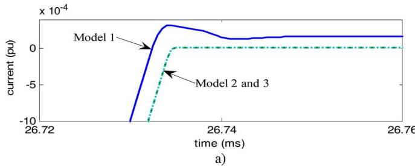

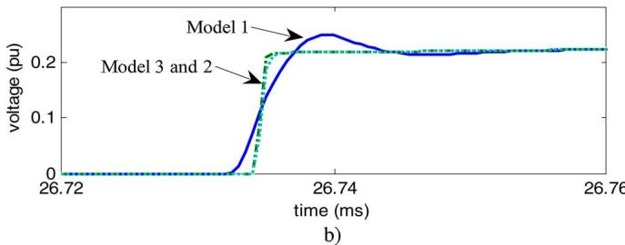  
Fig. 17. Zoomed waveform MMC-1, phase A variables for start-up sequence. (a) Zoomed waveform MMC-1 phase A, upper arm current $i _ { u _ { a } }$ and (b) zoomed waveform MMC-1 phase A, upper arm voltage $v _ { u _ { a } }$ .

TABLE II COMPUTING TIMES, SIMULATION OF 1 S, MMC-HVDC-SYSTEM OF FIG. 9   

<table><tr><td rowspan="2">Model</td><td rowspan="2">Time step (μs)</td><td colspan="4">Computing times as function of SMs/arm (s)</td></tr><tr><td>20</td><td>50</td><td>100</td><td>400</td></tr><tr><td>1</td><td>10</td><td>253</td><td>792</td><td>2,006</td><td>13,159</td></tr><tr><td>2</td><td>10</td><td>42</td><td>65</td><td>114</td><td>441</td></tr><tr><td>3</td><td>10</td><td>18</td><td>18</td><td>18</td><td>18</td></tr><tr><td>4</td><td>10</td><td>15</td><td>15</td><td>15</td><td>15</td></tr><tr><td>4</td><td>100</td><td>2</td><td>2</td><td>2</td><td>2</td></tr></table>

50, 100 and 400 SMs per arm. The computing times are compared for all models using time-steps of 10 and 100 $\mu \mathrm { s }$ (only for Model 4). The results presented in Table II show that the best computing speed is understandably achieved by Model 4. Its timestep and computing speed can be further increased without significantly affecting its accuracy. Nevertheless, the computational speed of Model 3 is very close to Model 4 when the same timestep is used. Computing times for Models 1 and 2 are related to the number of MMC levels.

Contrary to the exponential evolution of computing times for Model 2 as a function of the number of levels, presented in [12], it is observed in Table II that a linear behavior can be achieved with the implementation used in this paper. The computing time function slope for Model 1 is slightly exponential due to its iterations with nonlinear functions, which increase computing times when the number of nonlinear devices increases.

When the number of SMs in each arm increases, the gain in simulation speed for Models 3 and 4 as compared to Models 1 and 2, increases; that is, for 20 SMs per arm, the ratios are 2 and 15 when compared to Models 2 and 1, respectively. However, for 400 SMs per arm, the same ratios become 26 and 791.

The preliminary CIGRE dc Grid test system of [27] that comprises nine MMC stations has been also simulated using the models presented in this paper. The computing times are presented in Table III. The conclusions are similar to the test case of Fig. 9. However, since Model 4 presents inaccurate responses for dc faults, it should not be used to study dc transient events.

TABLE III COMPUTING TIMES, SIMULATION OF 1 S, CIGRE DC GRID BENCHMARK SYSTEM (9 MMCS)   

<table><tr><td rowspan="2">Model</td><td rowspan="2">Time step (μs)</td><td colspan="4">Computing times as function of SMs/arm (s)</td></tr><tr><td>20</td><td>50</td><td>100</td><td>400</td></tr><tr><td>1</td><td>10</td><td>2,704</td><td>7,261</td><td>14,962</td><td>101,408</td></tr><tr><td>2</td><td>10</td><td>263</td><td>415</td><td>678</td><td>2,127</td></tr><tr><td>3</td><td>10</td><td>144</td><td>144</td><td>144</td><td>144</td></tr><tr><td>4</td><td>10</td><td>104</td><td>104</td><td>104</td><td>104</td></tr><tr><td>4</td><td>100</td><td>12</td><td>12</td><td>12</td><td>12</td></tr></table>

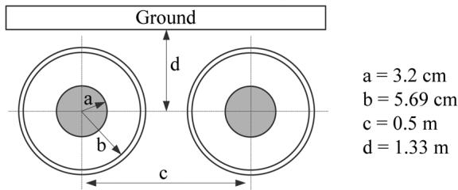  
Fig. 18. Cable data for Fig. 9.

For general analysis of dc grid dynamics with more than 101 MMC levels, Model 3 represents the best compromise between accuracy and fast computations. Due to the high computation cost of Model 1, it must be kept only for validation, calibration, and estimation of converter losses.

# VII. CONCLUSION

This paper presents and compares various electromagnetictransient (EMT)-type models for MMCs used in the simulation of MMC–HVDC systems. Practical test cases, including faults, power reference change, and even converter startup, have been used to study these models.

Model 1 is currently the most detailed model, but requires very high computing times with available numerical methods. It can be currently used as a highly accurate reference model and for calibrating simplified models.

Model 2 avoids the detailed modeling of power switches and allows reducing the converter circuit for achieving much higher computing speeds. An efficient implementation and a solution for the blocked state have been presented and validated in this paper. This model provides accurate results and can be used when redundant SMs are included in the MMC and/or when the balancing control of each capacitor has to be analyzed.

The proposed Model 3 delivers further improvements in computational performance. A blocked-state circuit has also been provided to increase the range of applications. Sufficiently accurate results can be achieved when the number of MMC levels is higher than 101. It should be used with caution when the number of levels decreases. This model can account for circulating currents and energy storage in each arm, but not for the balancing control algorithm of SM capacitors.

A more accurate average value based model (Model 4) has been presented in this paper. It enbales increasing the timestep to speed up computing times. AC system dynamics can be accurately represented, but dc-side modeling, although improved in this paper, remains less accurate.

# APPENDIX

Cable geometrical data are presented in Fig. 18. The following parameters are also required for the derivation of model equations:

Cable length: 70 km;

Outer radius of sheath: 5.82 cm;

Outer radius of insulation: 6.39 cm;

Resistivity of core: 1.72e–08 m;

Resistivity of sheath: 2.83e–08 m;

Insulator relative permittivity: 2.5

Insulator loss factor: 0.0004

# REFERENCES

[1] N. Flourentzou, V. G. Agelidis, and G. D. Demetriades, “VSC-based HVDC power transmission systems: An overview,” IEEE Trans. Power Electron., vol. 24, no. 3, pp. 592–602, Mar. 2009.   
[2] A. Lesnicar and R. Marquardt, “An innovative modular multilevel converter topology suitable for a wide power range,” presented at the IEEE Power Tech. Conf., Bologna, Italy, Jun. 2003.   
[3] B. R. Andersen, L. Xu, and K. T. G. Wong, “Topologies for VSC transmission,” in Proc. 7th Int. Conf. AC-DC Power Transm., London, U.K., Nov. 2001, pp. 298–304.   
[4] S. Allebrod, R. Hamerski, and R. Marquardt, “New transformerless, scalable modular multilevel converters for HVDC-transmission,” in Proc. IEEE Power Electron. Specialists Conf., Jun. 15–19, 2008, pp. 174–179.   
[5] B. Gemmell, J. Dorn, D. Retzmann, and D. Soerangr, “Prospects of multilevel VSC technologies for power transmission,” in Proc. IEEE Transm. Distrib. Conf. Exp., Milpitas, CA, USA, Apr. 2008, pp. 1–16.   
[6] H. Jin, “Behavior-mode simulation of power electronic circuits,” IEEE Trans. Power Electron., vol. 12, no. 3, pp. 443–452, May 1997.   
[7] S. R. Sanders, J. M. Noworolski, X. Z. Liu, and G. C. Verghese, “Generalized averaging method for power conversion circuits,” IEEE Trans. Power Electron., vol. 6, no. 2, pp. 251–259, Apr. 1991.   
[8] R. D. Middlebrook and S. Cuk, “A general unified approach to modeling switching power converter stages,” in Proc. IEEE Power Eng. Soc. Conf., 1976, pp. 18–34.   
[9] P. T. Krein, J. Bentsman, R. M. Bass, and B. L. Lesieutre, “On the use of averaging for the analysis of power electronic systems,” IEEE Trans. Power Electron., vol. 5, no. 2, pp. 182–190, Apr. 1990.   
[10] J. Peralta, H. Saad, S. Dennetière, J. Mahseredjian, and S. Nguefeu, “Detailed and averaged models for a 401-level MMC-HVDC system,” IEEE Trans. Power Del., vol. 27, no. 3, pp. 1501–1508, Jul. 2012.   
[11] S. P. Teeuwsen, “Simplified dynamic model of a voltage-sourced converter with modular multilevel converter design,” in Proc. IEEE Power Syst. Conf. Expo., Seattle, WA, Mar. 2009, pp. 1–6.   
[12] U. N. Gnanarathna, A. M. Gole, and R. P. Jayasinghe, “Efficient modeling of modular multilevel HVDC converters (MMC) on electromagnetic transient simulation programs,” IEEE Trans. Power Del., vol. 26, no. 1, pp. 316–324, Jan. 2011.   
[13] P. Le-Huy, P. Giroux, and J.-C. Soumagne, “Real-time simulation of modular multilevel converters for network integration studies,” presented at the Int. Conf. Power Syst. Transients, Delft, the Netherlands, Jun. 14–17, 2011.   
[14] H. Saad, J. Peralta, S. Dennetière, J. Mahseredjian, J. Jatskevich, J. A. Martinez, A. Davoudi, M. Saeedifard, V. Sood, X. Wang, J. Cano, and A. Mehrizi-Sani, “Dynamic averaged and simplified models for MMC-based HVDC transmission systems,” IEEE Trans. Power Del., vol. 28, no. 3, pp. 1723–1730, Jul. 2013.   
[15] M. Hagiwara and H. Akagi, “PWM control and experiment of modular multilevel converter,” in Proc. IEEE Power Electron. Specialists Conf., Tokyo, Japan, Jun. 2008, pp. 154–161.   
[16] J. Mahseredjian, S. Dennetière, L. Dubé, B. Khodabakhchian, and L. Gérin-Lajoie, “On a new approach for the simulation of transients in power systems,” Elect. Power Syst. Res., vol. 77, no. 11, pp. 1514–1520, Sep. 2007.   
[17] J. Mahseredjian, S. Lefebvre, and D. Mukhedkar, “Power converter simulation module connected to the EMTP,” IEEE Trans. Power Syst., vol. 6, no. 2, pp. 501–510, May 1991.

[18] M. Saeedifard and R. Iravani, “Dynamic performance of a modular multilevel back-to-back HVDC system,” IEEE Trans. Power Del., vol. 25, no. 4, pp. 2903–2912, Oct. 2010.   
[19] S. Norrga, L. Angquist, K. Ilves, L. Harnefors, and H.-P. Nee, “Frequency-domain modeling of modular multilevel converters,” in Proc. 38th Annu. Conf. IEEE Ind. Electron. Soc., Oct. 25–28, 2012, pp. 4967–4972.   
[20] P. Munch, D. Gorges, M. Izak, and S. Liu, “Integrated current control, energy control and energy balancing of modular multilevel converters,” in Proc. 36th Annu. Conf., IEEE Ind. Electron. Soc., Nov. 7–10, 2010, pp. 150–155.   
[21] A. Antonopoulos, L. Angquist, and H. P. Nee, “On dynamics and voltage control of the modular multilevel converter,” presented at the 13th Eur. Conf. Power Electron. Appl., Barcelona, Spain, Oct. 2009.   
[22] H. Ouquelle, L. A. Dessaint, and S. Casoria, “An average value modelbased design of a deadbeat controller for VSC-HVDC transmission link,” in Proc. IEEE Power Energy Soc. Gen. Meeting, Calgary, AB, Canada, Jul. 2009, pp. 1–6.   
[23] S. Ruihua, C. Zheng, R. Li, and X. Zhou, “VSCs based HVDC and its control strategy,” in Proc. IEEE Transm. Distrib. Conf. Exhibit., Asia Pacific, Dalian, China, 2005, pp. 1–6.   
[24] Q. Tu and Z. Xu, “Impact of sampling frequency on harmonic distortion for modular multilevel converter,” IEEE Trans. Power Del., vol. 26, no. 1, pp. 298–306, Jan. 2011.   
[25] A. Morched, B. Gustavsen, and M. Tartibi, “A universal model for accurate calculation of electromagnetic transients on overhead lines and underground cables,” IEEE Trans. Power Del., vol. 14, no. 3, pp. 1032–1038, Jul. 1999.   
[26] G. Pinares, N. Ullah, M. Lindgren, P. Brunnegård, J. C. Garcia Alonso, F. Mosallat, and R. Wachal, “Fault analysis of a multilevel-voltage-source-converter-based multi-terminal HVDC system,” in CIGRÉ Colloq. HVDC Power Electron. Syst. Overhead Line Insulated Cable, San Francisco, CA, USA, Feb. 2010.   
[27] T. K. Vrana, S. Dennetière, J. Jardini, Y. Yang, and H. Saad, “The CIGRE B4 DC grid test system version 2013,” in Electra, Mar. 2013, submitted for publication.   
[28] X. Gong, “A 3.3 kV IGBT module and application in modular multilevel converter for HVDC,” in Proc. IEEE Int. Symp. Electron., May 28–31, 2012, pp. 1944, 1949.

Hani Saad (M’07) received the B.Sc. degree in electrical engineering from the École Polytechnique de Montréal, Montréal, QC, Canada, in 2007, where he is currently pursuing the Ph.D. degree in electrical engineering.

From 2008 to 2010, he was with Techimp Spa.and in the Laboratory of Materials Engineering and High Voltages (LIMAT), University of Bologna, Bologna, Italy, working on research-and-development activities related to partial-discharge diagnostics in power systems.

Sébastien Dennetière (M’04) graduated from École Supérieure d’Electricité (Supélec), Gif-sur-Yvette, France, in 2002. He received the M.A.Sc. degree in electrical science from the École Polytechnique de Montréal, Montréal, QC, Canada, in 2003.

From 2002 to 2004, he was with IREQ (Hydro-Québec), working on researchand-development activities related to the simulation and analysis of electromagnetic transients. From 2004 to 2009, he was with the research center of EDF, Clamart, France, in the field of insulation coordination and power system simulations. In 2010, he joined the French transmission system operator Réseau de

Transport d’Electricité (RTE), where he is currently involved in power system simulation.

Jean Mahseredjian (F’13) received the M.A.Sc. and Ph.D. degrees in electrical engineering from the École Polytechnique de Montréal, Montréal, QC, Canada, in 1985 and 1991, respectively.

From 1987 to 2004, he was with IREQ (Hydro-Québec) on research-and-development activities related to the simulation and analysis of electromagnetic transients. In 2004, he joined the faculty of electrical engineering, École Polytechnique de Montréal.

Philippe Delarue (M’11) received the Ph.D. degree in electrical engineering from the University of Lille, Lille, France, in 1989.

Since 1991, he has been engaged as Assistant Professor at and at L2EP (Laboratory of Electrical Engineering of Lille). His main research interests are energetic macroscopic representation, power electronics, and multimachine systems. His collaborative works with the industry on power electronics include Siemens Transportation Systems, Schneider Electric, Toshiba Inverter Europe, and Valeo.

Xavier Guillaud (M’13) received the M.Sc. degree in electronics and the Ph.D. degree in electrical engineering from the University of Lille, Lille, France, in 1988 and 1992, respectively.

He joined the Laboratory of Electrical Engineering and Power Electronic (L2EP) in 1993 and first worked on modeling and control of power-electronic systems. He started working on the integration of distribution generation in the grid in 2001, focusing specially on the wind turbine. Since 2010, he has been involved in projects concerning multiterminal dc grid and high-power electronics connected to the grid. He supervises the development of an experimental fa-

cility composed of actual systems (photovoltaic panels and a supercapacitor) and a real-time simulator. He has been Professor with Ecole Centrale of Lille, Lille, since 2002.

Jaime Peralta (M’07) was born in Santiago, Chile, in 1969. He received the B.Sc. degree in electrical engineering from the University of Chile, Santiago, in 1994 and the M.A.Sc. degree in electrical engineering from the École Polytechnique de Montréal, Montréal, QC, Canada, in 2007, where he is currently pursuing the Ph.D. degree in electrical engineering.

Currently, he is Power Systems Manager with Alstom Grid, Philadelphia, PA, USA.

Mr. Peralta is a Registered Professional Engineer in the Provinces of British Columbia and Alberta.

Samuel Nguefeu (M’04) received the M.A.Sc. and Ph.D. degrees in electrical science from Université Pierre et Marie (Paris VI), Paris, France, in 1991 and 1993, respectively.

He was a Consultant for two years before joining THOMSON, France, in 1996. From 1999 to 2005, he was with EDF R&D, Clamart, France, in power systems and power electronics. In 2005, he joined the French transmission system operator Réseau de Transport d’Electricité (RTE), where he is currently involved in flexible ac transmission systems and HVDC projects.