# High-frequency transients in buried insulated wires: Transmission line simulations and experimental validation

Rafael Alipio a, b, * , Naiara Duarte a,b , Farhad Rachidi a

a Ecole ´ Polytechnique F´ed´erale de Lausanne (EPFL), Lausanne, Switzerland   
b Laboratory of Electromagnetic Transients (LabTEM), Federal Center of Technological Education of Minas Gerais (CEFET-MG), Belo Horizonte, Brazil

# A R T I C L E I N F O

Keywords:

Underground insulated cables

Measurements

Transients

Ground admittance

Ground impedance

# A B S T R A C T

This paper presents experimental results on the transient response of a buried insulated wire subjected to fast transient signals. It reports measurements of voltage and current at the sending end, as well as the voltage at the receiving end of the insulated wire. The obtained experimental results are utilized to assess the accuracy of recent formulations proposed for computing the ground-return impedance and admittance of underground cables, which are important for simulation of transients using models based on the transmission line theory. The good agreement between measurements and simulations bolsters confidence in incorporating these newly proposed expressions for computing the cable’s ground-return parameters into EMT-type simulators.

# 1. Introduction

In recent years, the use of underground cables in electrical power utilities has seen a notable rise [1]. This trend encompasses a variety of applications, including the construction of new underground and hybrid power lines, as well as the extensive use of underground cables in renewable energy plants for collecting power from individual solar panels or wind turbines to the interconnecting substation. These systems are susceptible to transients from both internal and external sources, underlining the importance of accurately modeling underground cables for simulations needed in defining effective protective measures and devices [2].

Electromagnetic transient (EMT) simulations are typically conducted on EMT-type platforms, which leverage circuit and transmission line theories for efficient simulations. The reliability of these simulations heavily relies on the accuracy of the implemented models within these platforms. Recent efforts have focused on refining expressions for computing the per-unit-length (pul) ground-return impedance and admittance of underground cables, required in models based on the transmission line theory [3,4]. The validity of these expressions has been assessed through comparison with full-wave 3D finite-difference time-- domain (FDTD) simulations [5,6]. However, the literature still lacks comprehensive comparisons with experimental data. Such comparisons are essential to bolster the reliability of these expressions, paving the way for their effective application and integration into commercial

EMT-type platforms.

This paper takes a step in that direction and presents a first set of measurements of the transient response of an underground cable. The presented data fill the gap in the existing literature since earlier publications lack specific measurements for validating the earth-return effect in underground cables. In the conducted experiments, a single dielectriccoated wire was considered. Given that the main objective of this paper is to address the earth-return effect in underground cables, the use of a dielectric-coated wire is adequate to demonstrate the influence of ground-return parameters on the cable transient response [7,8]. This study provides experimental data and incorporates simulation results to further validate existing expressions for computing the ground-return impedance and admittance of underground cables.

# 2. Background on underground cable modeling using transmission line theory

The pul series impedance and shunt admittance of single dielectriccoated wire buried in ground is given, respectively, by [9]:

$$
Z = Z _ {i} + Z _ {e} + Z _ {g} \tag {1}
$$

$$
Y = \left(Y _ {e} ^ {- 1} + Y _ {g} ^ {- 1}\right) ^ {- 1} \tag {2}
$$

where $Z _ { i }$ is the conductor internal impedance, $Z _ { e }$ is the external

impedance due to the magnetic field within the insulation, given by (3), $Z _ { g }$ is the ground-return impedance, $Y _ { e }$ is the external admittance due to the electric field within the insulation, given by (4), and $Y _ { g }$ is the ground-return admittance. In (3) and (4), a and b are respectively the radius of the inner conductor and the cable outer radius, and $\varepsilon _ { i n }$ is the permittivity of the insulating layer.

$$
Z _ {e} = \frac {j \omega \mu_ {0}}{2 \pi} \ln \left(\frac {b}{a}\right) \tag {3}
$$

$$
Y _ {e} = \frac {j \omega 2 \pi \varepsilon_ {\text {i n}}}{\ln \left(\frac {b}{a}\right)} \tag {4}
$$

In simulations carried out in this paper, the ground-return impedance and admittance are computed using the generalized formulation proposed by Xue et al. [4]. This formulation considers a quasi-TEM solution that incorporates a rigorous approach by utilizing both electric and magnetic Hertz vector potentials. As shown in [10], assuming a single dielectric-coated wire buried at a depth h in soil, the equations proposed by Xue et al. for determining the ground-return impedance and admittance can be equivalently expressed as

$$
Z _ {g} = \frac {j \omega \mu_ {0}}{2 \pi} \left[ \Lambda \left(\gamma_ {g}\right) + 2 \int_ {0} ^ {\infty} \frac {e ^ {- 2 h u _ {1}} \cos (b \lambda)}{u _ {0} + u _ {1}} d \lambda \right] \tag {5}
$$

$$
P _ {g} = \frac {j \omega}{2 \pi \varsigma} \left[ \Lambda \left(\gamma_ {g}\right) + 2 \int_ {0} ^ {\infty} \frac {u _ {0}}{u _ {1}} \frac {e ^ {- 2 h u _ {1}} \cos (b \lambda)}{u _ {0} + \gamma_ {0} ^ {2} \gamma_ {1} ^ {- 2} u _ {1}} d \lambda \right] Y _ {g} = j \omega / P _ {g} \tag {6}
$$

where $\begin{array} { r } { \Lambda \Big ( \gamma _ { g } \Big ) = K _ { 0 } \Big ( \gamma _ { g } b \Big ) - K _ { 0 } \Big ( \gamma _ { g } D \Big ) , D = \sqrt { h ^ { 2 } + b ^ { 2 } } , u _ { 0 } = \sqrt { \lambda ^ { 2 } + \gamma _ { 0 } ^ { 2 } } , u _ { 1 } = } \end{array}$ $\sqrt { \lambda ^ { 2 } + \gamma _ { g } ^ { 2 } , \gamma _ { 0 } } \ = j \omega \sqrt { \mu _ { 0 } \varepsilon _ { 0 } } , \gamma _ { g } \ = \sqrt { j \omega \mu _ { 0 } } ( \sigma _ { g } + j \omega \varepsilon _ { g } ) , \varsigma = \sigma _ { g } \ + j \omega \varepsilon _ { g } , \sigma _ { g }$ is the ground conductivity, $\varepsilon _ { g }$ is the ground permittivity, b is the cable outer radius, and $K _ { 0 }$ is the zero-order modified Bessel function of the second kind.

Sunde’s equation [11] for computing the ground-return impedance is a particular case of (5) if $\gamma _ { 0 } = 0 .$ , reading

$$
Z _ {g} ^ {\text {S u n d e}} = \frac {j \omega \mu_ {0}}{2 \pi} \left[ \Lambda \left(\gamma_ {g}\right) + 2 \int_ {0} ^ {\infty} \frac {e ^ {- 2 h u _ {1}} \cos (b \lambda)}{\lambda + u _ {1}} d \lambda \right] \tag {7}
$$

In his original work, Sunde did not propose any expression for the ground-return admittance. Finally, the equation for the ground-return impedance from Pollaczek [12] can be derived from Sunde’s approach by neglecting displacement currents in the ground and assuming $\gamma _ { g } =$ $\sqrt { j \omega \mu _ { o } \sigma _ { g } } .$ . Similar to Sunde, Pollaczek did not present any equation for the ground-return admittance either.

The accuracy of the Xue et al. generalized formulation was assessed through comparisons with a full-wave FDTD code [5,6]. In the same references, the accuracy of the formulation proposed by Papadopoulos et al. [3] for computing the ground-return impedance and admittance of underground cables was also verified; thus, results obtained using either Xue et al. or Papadopoulos et al. formulations might be considered essentially equivalent. It should be emphasized that Pollaczek’s formulation, despite its limitations, is still widely used for calculating the pul ground-return parameters in most underground cable models on EMT-type platforms. However, recent studies have demonstrated that Pollaczek’s formulation, and particularly the assumption of disregarding the ground admittance, is valid only for modeling low-frequency transients in cables buried in high-conductivity soils [3,4,13,14].

It is worth mentioning that in many practical scenarios, we encounter sheathed cables or, in applications involving submarine cables, typically armored cables [15]. The modeling of cables with

different internal structures can be straightforwardly performed by applying the formulation proposed by Ametani [9], which constitutes the basis of the cable constants routines in EMT-type programs. Since the main goal of our paper is to investigate the validity of ground-return parameter equations, the internal structure of the cable was simplified to a solid core surrounded by a dielectric layer.

In order to show the differences between the results obtained using each formulation to compute the ground-return parameters, Fig. 1 presents the simulated voltage at the receiving end of a 100-m long insulated cable buried in soils with resistivities of 200 Ωm (left panel) and 1000 Ωm (right panel), with a ground dielectric constant set to 10. In this simulation, an ideal voltage source with a unit step voltage was applied to the cable’s sending end, while the receiving end was left open. For simplicity, the soil’s electrical parameters were assumed to be constant and frequency-independent. Employing the transmission line theory, the cable’s transient response was calculated in the frequency domain using the nodal admittance matrix, following the approach detailed in [5], and time-domain results were obtained through an inverse numerical Laplace transform [16]. The cable parameters are given in the legend of Fig. 1.

According to the results, the transient voltages obtained using either Pollaczek or Sunde’s formulas are different compared to those obtained using Xue et al.’s approach. The difference is essentially due to the fact that the ground admittance, which is omitted in Sunde and Pollaczek’s approaches, significantly impacts the simulated voltages. It is observed that incorporating the ground admittance leads to higher damping and faster propagation of traveling waves. These effects are more pronounced in the 1000-Ωm soil, but already evident in the 200-Ωm soil. It is also interesting to observe that the use of either Pollaczek or Sunde’s expressions for the ground-return impedance results in nearly-identical simulated voltage waveforms.

# 3. Experimental setup

The experimental setup is shown in Fig. 2. The system under study consists of two 25.4-m long insulated wires, each buried at a depth of 0.3 m and separated by a 10 cm gap. The wires are composed of a copper core conductor coated with PVC insulation $( \varepsilon _ { i n } = 4 \varepsilon _ { 0 } )$ , with an internal radius a = 0.95 mm and an outer radius b = 1.75 mm (see Fig. 3). In the experiments, the insulated wires were excited through an impulse generator connected across the 10-cm gap. This setup, composed of two coated wires with a longitudinal gap excitation, was chosen to allow the cable to be excited without the need for any additional element to be connected to any terminal of the generator to provide an additional reference, for instance, a ground rod. In this way, the experiment allows us to focus on the transient behavior of the insulated wire, which is the main objective of the work, minimizing the number of elements that could influence the results.

The impulse generator used is similar to those employed in [17] for measuring the transient response of grounding wires and is primarily composed of analog multipliers (Greinacher cascades), following the classical topology outlined in [18], with a discharge capacitor and resistor of $C _ { d } = 1 0$ nF and $R _ { d } = 2 7 2 \Omega$ , respectively. An equivalent circuit of the generator, which was used in the simulations performed in this work, is shown in Fig. 4. Two distinct impulse signals, with rise times (RT) of approximately 100 ns and 400 ns, respectively, were utilized, as shown in Fig. 5. It is worth noting that the small value of the discharge capacitor was deliberately chosen to produce a signal with a steep rise and a rapid decay, specifically to enable fast excitation of the cable, allowing for the assessment of its response to high-frequency transients. As depicted in Fig. 2, one terminal of the impulse generator is directly connected to the sending end of one wire segment, and the other terminal is connected to the sending end of the opposite wire segment through a 50-Ω resistor (Rs). The receiving ends of both wire

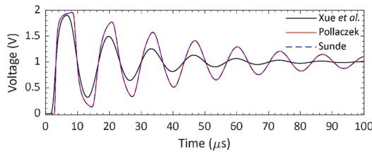  
(a)

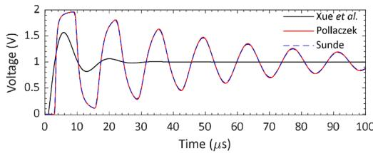  
(b)   
Fig. 1. Transient voltages at the cable’s receiving end, resulting from a unit step voltage applied at its sending end for soil resistivities of (a) 200 Ωm and (b) 1000 Ωm, using different formulations to compute the ground-return parameters. Cable parameters: h = 1 m (burial depth), a = 1 cm, $b = 1 . 5$ cm, $\rho _ { c } = 1 . 7 \times 1 0 ^ { - 8 }$ Ωm (core resistivity), $\varepsilon _ { i n } = 5 \varepsilon _ { 0 }$ .

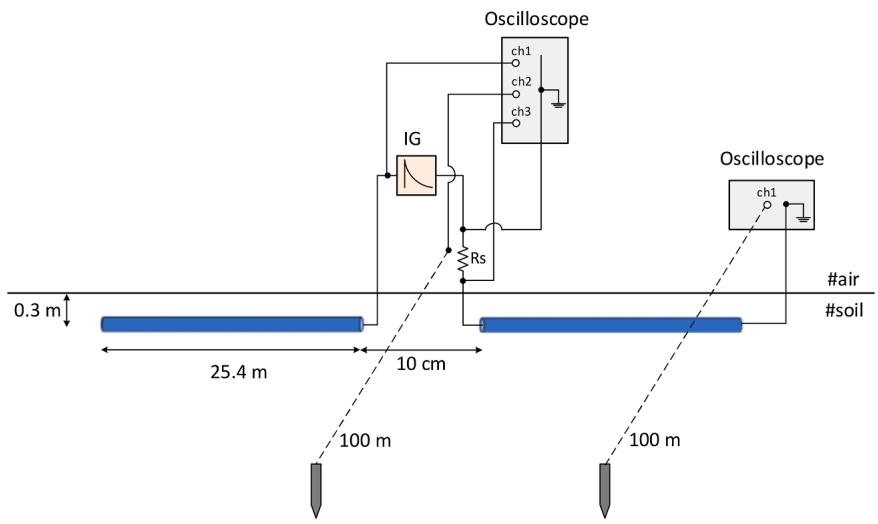  
Fig. 2. Experimental setup.

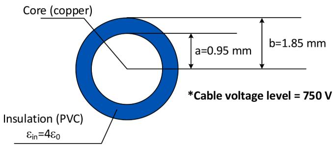  
Fig. 3. Insulated wire cross-section and main characteristics.

# segments were left open.

In the first set of experiments, voltage signals were simultaneously measured using a non-isolated four-channel oscilloscopec ; thus, the signals from each channel of the oscilloscope are referenced to a common ground. The oscilloscope was feed in field through an external battery. Aiming to assess the transient response of the insulated cable and to evaluate the validity of models for simulating such a response, the following signals were of particular interest in this first set of experiments: i) the output applied voltage of the impulse generator; ii) the transient current at the sending end of the cable, and iii) the transient voltage at the sending end of the cable in relation to the remote earth (zero potential). To capture these signals, the oscilloscope connections shown in Fig. 2 were utilized. It should be emphasized again that all channel signals are referenced to a common point (ground), which, for

this first set of experiments, was connected to the right terminal of the impulse generator (see Fig. 2). Given the oscilloscope connections, the signals of interest were obtained as follows:

• The signal on channel 1 (ch1), denoted as $\nu _ { c h 1 } ( t ) ,$ , corresponds to the measured output voltage of the impulse generator, i.e., $\nu _ { g } ( t ) =$ vch1(t).   
• The signal on channel 3 (ch3), denoted as $\nu _ { c h 3 } ( t )$ , corresponds to the measured voltage drop across the 50-Ω resistor, allowing the current at the sending end of the right wire segment to be estimated as $i _ { s } ( t ) =$ vch3(t) . The measurement of the current through the voltage drop $\frac { \nu _ { c h 3 } ( t ) } { R _ { s } }$ across the resistor Rs was carried out following the same procedures successfully applied in [19,20,21] in the measurements involving the impulse response of different grounding system configurations. Note that the current measurement could also be performed using a current monitor. The specific value of 50 Ω for the resistor was selected to obtain a voltage level suitable for oscilloscope’s sensitivity. The resistor Rs was constructed using commercial carbon film resistors connected in parallel, which exhibit negligible inductive and capacitive effects, assuming the frequency content of the measured signals (up to about a few MHz) [22]. The voltage drop across the Rs resistor was measured using a shielded cable, and to minimize any intrinsic inductance, the cable was kept as short as possible. Furthermore, to reduce electromagnetic coupling interference, the leads for measuring current and voltage were arranged orthogonally, as illustrated in Fig. 2.   
• Finally, from the signal on channel 2 (ch2), labeled as $\nu _ { c h 2 } ( t ) ,$ , the measured voltage at the sending end of the insulated wire in relation to the remote earth can be estimated as $\nu _ { s } ( t ) = \nu _ { c h 2 } ( t ) - \nu _ { c h 3 } ( t )$ . The remote earth connection was established through a voltage lead extending 100 m from the sending end of the insulated wire

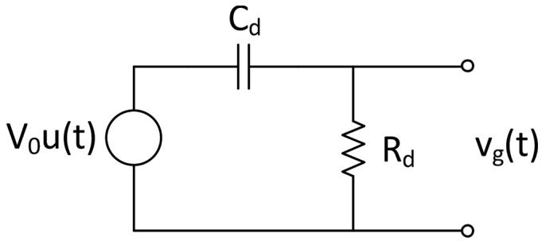  
Fig. 4. Equivalent circuit of the impulse generator.

connected to a 1-m long vertical ground rod. The remote earth corresponds to a reference of zero potential in the earth, and the distance of 100 m from the cable system proved sufficient, taking as reference full-wave simulations showing that at this distance the electric field essentially vanishes [5]. Furthermore, it is worth mentioning that this remote earth was quite stable since the experimental setup was mounted in a remote area, without nearby electrical installations that could generate interference or spurious potentials in the earth.

In the second set of experiments, the same voltage signals were applied, and the voltage at the receiving end of the right wire segment, referred to as vr(t), was measured using the same oscilloscope and voltage probes. Additionally, in both the first and second sets of experiments, the leads in the measurement setup were strategically positioned orthogonally to minimize interference from electromagnetic coupling, as shown in Fig. 2. All measurements were performed exclusively on the right side of the circuit shown in Fig. 2. Due to the circuit’s symmetrical configuration, the waveforms measured on the left side are expected to be essentially the same but with inverted polarity.

Voltage signals were captured using a Tektronix DPO 2014B oscilloscope, featuring a bandwidth of 100 MHz and a sampling rate of 1 GS/ s, with voltage probes (model Tektronix TPP0200) having a bandwidth of 200 MHz and an internal impedance of 10-MΩ/12-pF. For each of the two impulse voltage signals shown in Fig. 5, ten measurements were performed to ensure experiment repeatability and to check for any noise or parasitic signals. With this procedure, we observed stable signals, with negligible differences between the obtained waveforms across the ten repetitions. This stability presumably stems from the fact that, as previously mentioned, the experimental setup was mounted in a remote area, devoid of nearby electrical installation.

The Frank Wenner method was applied to characterize the soil resistivity along the path where the insulated wire was buried. Considering a probed depth of up to approximately 16 m, the soil was found to be relatively homogeneous, with a resistivity ranging from about 190 Ωm near the surface to 230 Ωm at deeper levels. The lower value near the surface is attributed to higher humidity following a period of rainfall in the area.

# 4. Measurement results

Fig. 6 presents comparisons between measurements and simulations conducted with the application of the impulse voltage depicted in Fig. 5, with a rise time of 100 ns. The comparative analysis includes transient voltages at both the sending and receiving ends of the insulated wire, as illustrated in Fig. 6(a) and 6(b), and the current at the sending end, as shown in Fig. 6(c). Based on the soil resistivity surveys conducted, the simulations assumed a homogeneous soil with an equivalent resistivity of 200 Ωm. These simulations followed the methodology outlined in Section 2, considering two different formulations to compute the ground-return parameters, namely the Xue et al. formulation and the classical Pollaczek formulation. In the case of the Xue et al. formulation, the soil’s electrical parameters were considered frequency-dependent, according to the Alipio-Visacro model [20].

It can be seen that the simulations assuming the Xue et al. formulation, which accounts for the ground admittance, are in a very good agreement with the experimental data, considering both the voltage and current measured signals. The minor differences observed can be attributed to uncertainties in the knowledge of soil parameters and its possible inhomogeneities, as well as to uncertainties in the insulated wire parameters. It is worth mentioning that, given the high-frequency content of the signals applied to the cable in the experiments, the ground admittance effect prevails over the insulation admittance [4,14]. Thus, although the uncertainty in the dielectric constant of the insulated wire might affect the results, this parameter can be considered more of a “fine-tuning” factor, as long as it is kept within reasonable and consistent limits. Additionally, the input impedance of the probe/oscilloscope, which was not considered in the simulations, might also contribute to the small difference observed between the measured and simulated transient signals. On the other hand, the results obtained using the Pollaczek formulation diverge from the measured signals and exhibit greater oscillations. These oscillations in the waveforms can be attributed to the multiple reflections that are less attenuated, in comparison with the results obtained using the Xue et al. formulation. Additionally, the simulated transient signals, when considering the Pollaczek formulation, propagate at a slower pace compared to both measurements and simulations employing the Xue et al. formulation. This difference is particularly evident in the arrival time of the transient voltage at the receiving end of the cable, as well as in the arrival times of the reflections. It is worth mentioning that these results are in consonance with simulations presented in Section 2. A comprehensive analysis of the differences in the propagating speed—and its impact on the travel time along the cable—assuming various soil resistivities and different soil models, can be found in [23].

It is worth mentioning that the simulation of the voltage at the receiving end of the cable assumed the same applied voltage, although these voltages were not measured simultaneously. This assumption was based on the fact that the applied voltage showed a very stable waveform across ten repeated measurements. The good agreement between the measurements and the simulated voltage at the receiving end further confirms this assumption.

Fig. 7 presents similar comparisons between measurements and simulations but considering the impulse voltage with a rise time of 400

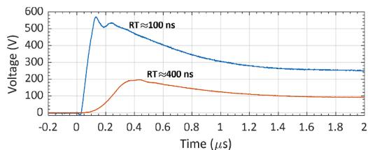  
(a)

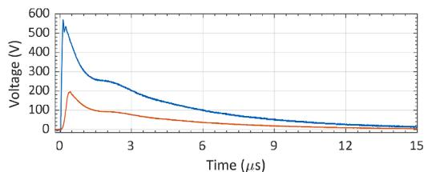  
(b)   
Fig. 5. Impulse voltages applied across the 10-cm gap between the two insulated wire segments: (a) 2-μs time window, and (b) 15-μs time window.

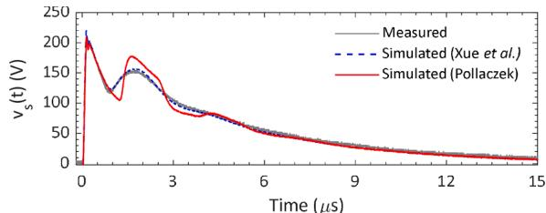

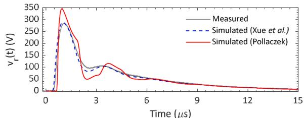  
(b)

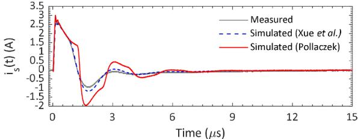  
（c)  
Fig. 6. Comparisons between experimental and simulation results, including (a) voltage at the sending end, $\nu _ { s } ( t ) _ { : }$ , (b) voltage at the receiving end, vr(t), and (c) current at the sending end, is(t). The applied signal between the two segments of insulated wire (see Fig. 2) corresponds to the impulse voltage with a rise time of 100 ns, as illustrated in Fig. 5.

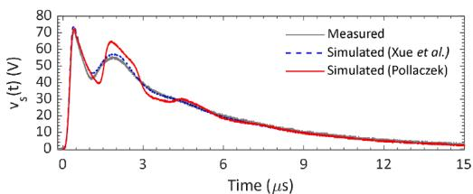  
(a)

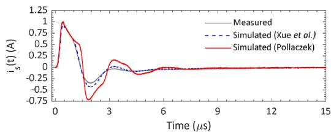  
(b)   
Fig. 7. Comparisons between experimental and simulation results, including (a) voltage at the sending end, $\nu _ { s } ( t ) ,$ and (b) current at the sending end, is(t). The applied signal between the two segments of insulated wire (see Fig. 2) corresponds to the impulse voltage with rise time of 400 ns, as illustrated in Fig. 5.

ns illustrated in Fig. 5. The comparisons consider the voltage and current at the sending end of the insulated wire. For this applied signal, the voltage at the receiving end was not measured. Again, a remarkable agreement can be observed between the simulations considering Xue et al. formulation and measurements, with the small differences attributed to the same factors mentioned previously. Conversely, the waveforms obtained using the Pollaczek formulation exhibit less attenuation and deviate from the measurements. Finally, it is worth mentioning that although the observed differences between the results obtained using the Xue et al. and Pollaczek formulations are not so significant for the 200-Ωm soil, they are expected to become quite substantial as the soil resistivity increases, as discussed in Section 2.

# 5. Summary

This paper presents experimental data of transient voltages and currents in a buried insulated wire in response to the application of fast voltage signals. Comparisons between the experimental data and simulations, utilizing the transmission line theory, further demonstrate the accuracy of the Xue et al. formulation for computing the cable groundreturn impedance and admittance. The results presented in this paper aim to contribute to the power system transients’ community, notably by providing further validation of recent expressions proposed for computing the ground-return parameters of underground cables, in view of their integration into cable models implemented in EMT-type simulators.

The authors are involved in a wide-ranging campaign of measurements of transients in underground cables, and new results are expected to be presented soon, notably including measurements in soils of high resistivity and configurations composed of at least two insulated cables

to assess mutual effects. Also, future work will aim to extend the results to multi-layered soil.

# CRediT authorship contribution statement

Rafael Alipio: Writing – review & editing, Writing – original draft, Visualization, Validation, Supervision, Software, Resources, Project administration, Methodology, Investigation, Funding acquisition, Formal analysis, Data curation, Conceptualization. Naiara Duarte: Writing – review & editing, Writing – original draft, Visualization, Validation, Software, Resources, Methodology, Investigation, Formal analysis, Data curation, Conceptualization. Farhad Rachidi: Writing – review & editing, Supervision, Resources, Methodology, Funding acquisition, Formal analysis, Conceptualization.

# Declaration of competing interest

The authors declare that they have no known competing financial interests or personal relationships that could have appeared to influence the work reported in this paper.

# Data availability

Data will be made available on request.

# Acknowledgements

Rafael Alipio would like to thank the Swiss National Science Foundation (SNSF), grant number TMPFP2_209700, and the Conselho

Nacional de Desenvolvimento Científico e Tecnologico ´ (CNPq) (grants 406177/2021–0 and 314849/2021–1). The authors would also like to express their gratitude to Mr. Magno Antonio ˆ Coelho for allowing the experiments to be conducted on his property in the Cocais district located in the state of Minas Gerais, Brazil. We would also like to thank

Mr. Roberto Duarte and Mrs. Avelina Duarte for their support in the logistics necessary for conducting the experiments. Finally, but not least, we would like to thank Prof. Listz Simoes ˜ de Araújo and undergraduate student Gustavo Alves Barbosa, both from CEFET-MG/LabTEM, for their assistance in preparing the experimental setup.

# Appendix A

Using transmission line theory, the transient response of the cable shown in Fig. 2 is calculated using the nodal admittance matrix Y given by [15]

$$
\overline {{\mathbf {Y}}} = \left[ \begin{array}{c c} Y _ {c} (1 + A ^ {2}) (1 - A ^ {2}) ^ {- 1} & - 2 Y _ {c} A (1 - A ^ {2}) ^ {- 1} \\ - 2 Y _ {c} A (1 - A ^ {2}) ^ {- 1} & Y _ {c} (1 + A ^ {2}) (1 - A ^ {2}) ^ {- 1} \end{array} \right] \tag {8}
$$

where $Y _ { c } = \sqrt { Y / Z }$ and $A = \exp \bigl ( - \angle \sqrt { Z Y } \bigr )$ . Matrix ${ \overline { { \mathbf { Y } } } } ,$ derived from the exact frequency-domain solution of telegrapher’s equations, defines the relationship between the voltages (V) and currents (I) at the cable ends: $I = { \overline { { \mathbf { Y } } } } \mathbf { V } .$ The nodal admittance matrix follows the same assembling rules as the bus admittance matrix used in power systems. For a single cable section, the dimension of Y is $2 \ \times \ 2 .$ . To simulate the series voltage source excitation depicted in Fig. 2, two cable sections are considered, and a 4 × 4 system is assembled following the assembling rules of the classical bus admittance matrix. All the calculations are performed in the frequency domain, and the time-domain response is obtained with the numerical inverse Laplace transform [16]. More details on the adopted simulating approach, especially considering the configuration depicted in Fig. 2, can be found in [5].

# Appendix B

Figs. 8 and 9 present the oscillograms for Channel 2 and Channel 3 of the oscilloscope, corresponding to the experimental results shown in Figs. 6 and 7, respectively.

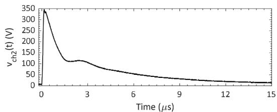

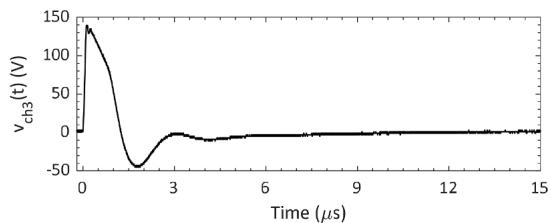

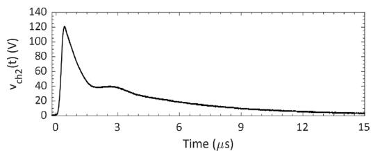  
Fig. 8. Oscillograms for (a) Channel 2 and (b) Channel 3 of the oscilloscope, corresponding to the experimental results shown in Fig. 6.   
(a)

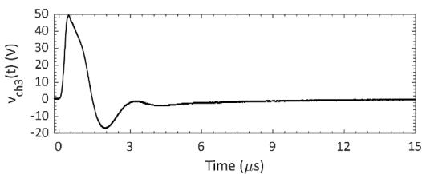  
(b)   
Fig. 9. Oscillograms for (a) Channel 2 and (b) Channel 3 of the oscilloscope, corresponding to the experimental results shown in Fig. 7.

# References

[1] G W․, B1.07, Statistics of AC underground cables in Power networks, CIGRE (2007).   
[2] N. Theethayi, Y. Baba, F. Rachidi, R. Thottappillil, On the choice between transmission line equations and full-wave maxwell’s equations for transient analysis of buried wires, IEEE Trans. Electromagn. Compat. 50 (2) (2008) 347–357, https://doi.org/10.1109/TEMC.2008.919040.   
[3] T.A. Papadopoulos, D.A. Tsiamitros, G.K. Papagiannis, Impedances and admittances of underground cables for the homogeneous earth case, IEEE Trans. Power Delivery 25 (2) (2010) 961–969, https://doi.org/10.1109/ TPWRD.2009.2034797.   
[4] H. Xue, A. Ametani, J. Mahseredjian, I. Kocar, Generalized formulation of earthreturn Impedance/Admittance and surge analysis on underground cables, IEEE Trans.Power Delivery 33 (6) (2018) 2654-2663,https://doi.org/10.1109/ TPWRD.2018.2796089.   
[5] N. Duarte, A. De Conti, R. Alipio, Assessment of ground-return impedance and admittance equations for the transient analysis of underground cables using a fullwave FDTD method, IEEE Trans. Power Delivery 37 (5) (2022) 3582–3589, https://doi.org/10.1109/TPWRD.2021.3131415.

[6] N. Duarte, A. De Conti, R. Alipio, F. Rachidi, Assessment of the transmission line theory in the modeling of multiconductor underground cable systems for transient analysis using a full-wave FDTD method, Elect. Power Syst. Res. 223 (2023) 109570, https://doi.org/10.1016/j.epsr.2023.109570.   
[7] H. Xue, A. Ametani, K. Yamamoto, A study on external electromagnetic characteristics of underground cables with consideration of terminations, IEEE Trans. Power Delivery 36 (5) (2021) 3255–3265, https://doi.org/10.1109/ TPWRD.2020.3037335.   
[8] H. Xue, A. Ametani, K. Yamamoto, Theoretical and NEC calculations of electromagnetic fields generated from a multi-phase underground cable, IEEE Trans. Power Delivery 36 (3) (2021) 1270–1280, https://doi.org/10.1109/ TPWRD.2020.3005521.   
[9] A. Ametani, A general formulation of impedance and admittance of cables, IEEE Trans. Power Appar. Syst. (3) (1980) 902–910, https://doi.org/10.1109/ TPAS.1980.319718. PAS-99.   
[10] A. De Conti, N. Duarte, R. Alipio, Closed-form expressions for the calculation of the ground-return impedance and admittance of underground cables, IEEE Trans. Power Delivery 38 (4) (2023) 2891–2900, https://doi.org/10.1109/ TPWRD.2023.3264614.

[11] E.D. Sunde, Earth Conduction Effects in Transmission Systems, Dover Publications, New York, 1968.   
[12] F. Pollaczek, Sur le champ produit par un conducteur simple infiniment long parcouru par un courant alternatif, Rev. Gen. Elec. 29 (1931) 851–867.   
[13] A.P.C. Magalhaes, M.T.C. de Barros, A.C.S. Lima, Earth return admittance effect on underground cable system modeling, IEEE Trans. Power Delivery 33 (2) (2018) 662–670, https://doi.org/10.1109/TPWRD.2017.2741600.   
[14] N. Duarte, A. De Conti, R. Alipio, Extension of Vance’s closed-form approximation to calculate the ground admittance of multiconductor underground cable systems, Electric Power Syst. Res. 196 (2021) 107252, https://doi.org/10.1016/j. epsr.2021.107252.   
[15] J.A. Martinez-Velasco, Power System Transients: Parameter Determination, CRC Press, 2010.   
[16] P. Moreno, A. Ramirez, Implementation of the numerical laplace transform: a review task force on frequency domain methods for EMT studies, working group on modeling and analysis of system transients using digital simulation, general systems subcommittee, IEEE power engineering, IEEE Trans. Power Delivery 23 (4) (2008) 2599–2609, https://doi.org/10.1109/TPWRD.2008.923404.   
[17] R. Alipio, V.L. Coelho, G.L. Canever, Experimental analysis of horizontal grounding wires buried in high-resistivity soils subjected to impulse currents, Electric Power Systems Res. 214 (2023) 108761, https://doi.org/10.1016/j.epsr.2022.108761.

[18] E. Kuffel, W.S. Zaengl, and J. Kuffel, High Voltage Engineering: fundamentals, 2nd ed. Oxford: Newnes, 2000.   
[19] S. Visacro, R. Alipio, M.H. Murta Vale, C. Pereira, The response of grounding electrodes to lightning currents: the effect of frequency-dependent soil resistivity and permittivity, IEEE Trans. Electromagn. Compat. 53 (2) (2011) 401–406, https://doi.org/10.1109/TEMC.2011.2106790.   
[20] R. Alipio, S. Visacro, Modeling the frequency dependence of electrical parameters of soil, IEEE Trans. Electromagn. Compat. 56 (5) (2014) 1163–1171, https://doi. org/10.1109/TEMC.2014.2313977.   
[21] S. Visacro, R. Alipio, C. Pereira, M. Guimaraes, M.A.O. Schroeder, Lightning response of grounding grids: simulated and experimental results, IEEE Trans. Electromagn. Compat. 57 (1) (2015) 121–127, https://doi.org/10.1109/ TEMC.2014.2362091.   
[22] C.R. Paul, Introduction to Electromagnetic Compatibility, 2nd edition, Wiley-Interscience, New Jersey, 2006.   
[23] R. Alipio, H. Xue, A. Ametani, An accurate analysis of lightning overvoltages in mixed overhead-cable lines, Electric Power Systems Res. 194 (2021) 107052, https://doi.org/10.1016/j.epsr.2021.107052.