# Improved Accuracy Average Value Models of Modular Multilevel Converters

A. Beddard, Member, IEEE, C. E. Sheridan, M. Barnes, Senior Member, IEEE, and T. C. Green, Senior Member, IEEE

Abstract—Modular multilevel converters (MMCs) have become the converter topology of choice for voltage-source converter–highvoltage direct-current systems. Excellent work has previously been conducted to develop much needed average value models (AVM) for these complex converters; however, there a number of limitations as highlighted in this paper. This paper builds on the existing models, proposing numerous modifications and resulting in an enhanced MMC-AVM, which is significantly more accurate and which can be used for a wider range of studies, including DC faults.

Index Terms—Average value model (AVM), electromagnetic transient (EMT) simulation, HVDC transmission, modular multilevel converter (MMC), voltage-source converter (VSC).

# I. INTRODUCTION

T HE demand for voltage-source converter (VSC) high-voltage direct-current (HVDC) transmission schemes has voltage direct-current (HVDC) transmission schemes has grown significantly in the last decade. This growth is mainly due to improvements in the voltage and current ratings of Insulated Gate Bipolar Transistors (IGBT) and the number of new VSC-HVDC applications such as the connection of offshore windfarms.

In 2010, the Trans Bay cable project became the first VSC-HVDC scheme to use Modular Multilevel Converter (MMC) technology. The MMC has many benefits in comparison to two or three level VSCs; chief among these is reduced converter losses. Today, the main HVDC manufacturers offer a VSC-HVDC solution which is based on MMC technology. Accurate and computational efficient models are therefore necessary for the development and understanding of these transmission systems [1]–[3].

There are many different types of MMC model and a number of them have been compared in several publications [4]–[9]. In order to accurately account for converter losses, semi-conductor physics models can be employed, however they are too complex to model an entire converter [1]. Full Detailed Models (FDM) which approximate the semi-conductors’ non-linear characteristics can however be used to model an entire MMC.

Traditional Detailed Models (TDM) represent the converter’s semi-conductors as a two-value resistance and have been shown to simulate faster than a FDM without an appreciable difference in the simulation results for the majority of studies [1]. The TDM is still however very inefficient due to the electrical connection of the MMCs components resulting in a large admittance matrix.

To address this issue, a more efficient model was proposed in [7]. This type of model, which is often referred to as a Detailed Equivalent Model (DEM), creates a Thevenin equivalent circuit for each converter arm and uses a nested fast and simultaneous solution method to significantly improve its efficiency [7]. The accuracy of this type of model has been verified in several publications [1], [8]. The disadvantage of DEM is that the Sub-Module (SM) components are not accessible to the user making this type of model unsuitable for studying internal converter faults. Variants of the DEM have also been proposed in [9]–[11].

The DEM model was simplified further in [6], [12], [13] by not considering each SM separately and therefore assuming that the all of the SM capacitor voltages are perfectly balanced. This simplification enables these types of models to simulate faster than a DEM. However, they cannot be used to study capacitor balancing controllers or variations in the individual SM capacitor voltages due to transient events.

Average Value Models (AVM) neglect the impact of capacitor ripple voltage in each arm of the converter by using a single DC side capacitance [4]–[6]. This enables the internal MMC controllers to be neglected which can improve efficiency further [6]. In addition to their efficiency, AVMs are often employed as their simplicity enables them to be implemented in a wide range of software packages and their accuracy is sufficient for many common power system studies.

One of the first and most widely used AVMs for MMC-HVDC applications was developed by Peralta et al. in [4]. This model represents the AC side of the converter with six voltage sources and the DC side with a single current source. This type of model is very efficient; however, it cannot accurately represent the blocked state of a MMC which means that it is generally unsuitable for DC fault studies. Xu et al. addressed this issue in [5] by incorporating diodes and switches in the AC side of the AVM and connecting the AC side to the DC side in the event of a DC side fault. The connection of the AC side of the AVM to the DC side also enables the offset in the converter voltages arising from a line-to-ground fault to be represented. However, this additional functionality comes with a 37% penalty in computational efficiency [5]. Furthermore, the need to connect the AC side and DC side of the AVM together during fault scenarios makes the implementation of this model challenging in some commonly used software packages.

Manuscript received August 25, 2015; revised December 1, 2015; accepted February 11, 2016. Date of publication May 4, 2016; date of current version September 21, 2016. This work was supported by the UK Engineering and Physical Science Research Council under, Grant: EPSRC EP/L021463/1. Paper no. TPWRD-01134-2015.R1.

A. Beddard is with The University of Manchester, Manchester, M13 9PL, U.K., and also with Imperial College London, London SW7 2AZ U.K. (e-mail: a.beddard@imperial.ac.uk).

C. E. Sheridan and T. C. Green are with Imperial College London, London SW7 2AZ, U.K. (e-mail: c.sheridan11@imperial.ac.uk; t.green@imperial. ac.uk).

M. Barnes is with The University of Manchester, Manchester, M13 9PL, U.K. (e-mail: mike.barnes@manchester.ac.uk).

Color versions of one or more of the figures in this paper are available online at http://ieeexplore.ieee.org.

Digital Object Identifier 10.1109/TPWRD.2016.2535410

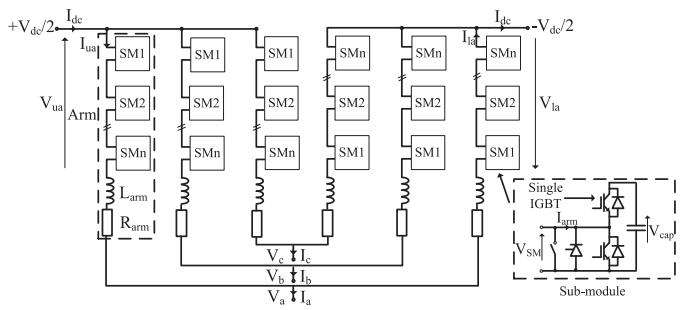  
Fig. 1. Three-phase HB-MMC.

In [6], Peralta et al. improved on their model from [4] by simplifying its AC structure to three voltage sources and improving its performance during DC faults. This should also improve its computational efficiency and make it easier to implement in a wider range of software packages. The accuracy of the model for DC faults is however not as good as the AVM developed in [5].

This paper identifies a number of limitations with the model developed in [6] which is referred to as the Standard Average Value Model (SAVM) in this paper. Each of these limitations is addressed and a solution is proposed resulting in an improved AVM which is referred to as the Modified AVM (MAVM) in this paper. The MAVM is shown to be more accurate than the SAVM while retaining the same simple structure. This enables the MAVM to be easily implemented in the same software packages as the SAVM with virtually the same efficiency. The MAVM can also account for converter losses in a similar way to the more complex models and reflects DC voltage imbalance in the AC voltages without connecting the AC and DC sides of the AVM together which is in contrast to other AVMs [4], [5]. This feature also enables the MAVM to account for the DC offset in the AC voltages that occurs in other VSC-HVDC configurations such as bi-pole operation.

In addition, this paper introduces the concept of retro-fit Blocking Modules (BM) which are shown to be able to significantly improve the MAVMs accuracy for DC fault and converter energisation (start-up) studies. Three different BMs with varying degrees of complexity are presented and compared. This enables the user to select the BM which is most suitable for their software package and study.

# II. MMC-HVDC

There are many types of MMC, including, but not limited to Half-Bridge (HB), full-bridge and alternate arm converter [14]. The HB is the focus of this paper as it is the most common type of MMC and the only type in commercial operation. The basic structure of a HB-MMC is shown in Fig. 1.

The Sub-Module (SM) terminal voltage, $\mathrm { V } _ { \mathrm { S M } }$ , is effectively equal to the SM capacitor voltage, $\mathrm { V _ { c a p } , }$ , when the upper IGBT is switched-on and the lower IGBT is switched-off; the capacitor will charge or discharge depending upon the arm current direction. With the upper IGBT switched-off, and the lower IGBT switched-on, the SM capacitor is bypassed and hence $\mathrm { V } _ { \mathrm { S M } }$ is effectively zero volts. Each arm in the converter,

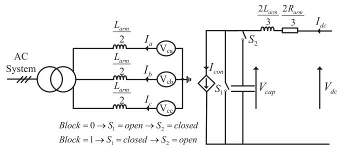  
Fig. 2. SAVM topology.

therefore, acts like a controllable voltage source with the smallest voltage change being equal to the SM capacitor voltage. The converter output voltages, $\mathrm { V _ { ( a , b , c ) } }$ , are effectively controlled by varying their respective upper and lower arm voltages, $\mathrm { V _ { u ( a , b , c ) } }$ and $\mathrm { V _ { l ( a , b , c ) } }$ as described by (1) for phase A [15]. The number of discrete voltage levels the MMC is able to produce is dependent upon the number of SMs in the converter arms.

$$
V _ {a} = \frac {V _ {\mathrm {l a}} - V _ {\mathrm {u a}}}{2} - \frac {L _ {\mathrm {a r m}}}{2} \frac {d I _ {a}}{d t} - \frac {R _ {\mathrm {a r m}}}{2} I _ {a} \qquad (1)
$$

The converter arm currents consist of three main components as given by (2), for phase A. The circulating current, ${ \mathrm { I } } _ { \mathrm { c i r c } } ,$ is due to the unequal DC voltages generated by the three converter legs. The circulating current is a negative sequence (a-c-b) current at double the fundamental frequency, which distorts the arm currents and increases converter losses [16].

$$
I _ {\mathrm {u a}} = \frac {I _ {\mathrm {d c}}}{3} + \frac {I _ {a}}{2} + I _ {\mathrm {c i r c}} \quad I _ {\mathrm {l a}} = \frac {I _ {\mathrm {d c}}}{3} - \frac {I _ {a}}{2} + I _ {\mathrm {c i r c}} \tag {2}
$$

# III. STANDARD AVERAGE VALUE MODEL (SAVM)

The topology of the Standard Average Value Model (SAVM) is shown in Fig. 2.

A brief overview of the SAVM is presented here, further information is given in [6]. The internal converter voltage for phase $\mathrm { A } , \mathrm { V } _ { \mathrm { c a } }$ , is given by (3) where $\mathrm { { V } _ { r e f c a } . }$ , is the voltage reference generated by the control system.

$$
V _ {\mathrm {c a}} = V _ {\mathrm {r e f c a}} \frac {V _ {\mathrm {d c}}}{2} \tag {3}
$$

The value for the DC current source, $\mathrm { I _ { c o n } }$ , is calculated as follows:

$$
V _ {\mathrm {d c}} I _ {\mathrm {c o n}} = \sum_ {j = a, b, c} V _ {\mathrm {c j}} I _ {j} = P _ {\mathrm {A C}} \tag {4}
$$

$$
I _ {\text {c o n}} = \frac {1}{2} \sum_ {j = a, b, c} V _ {\text {r e f c j}} I _ {j} \tag {5}
$$

The equivalent capacitance for the SAVM, $\mathrm { C _ { \mathrm { e q } } } .$ , is given by (6) and the total conduction losses for the MMC can be found using (7). n is the number of SMs in one MMC arm and $\mathrm { R _ { o n } }$ is

the on-state resistance of a diode/IGBT.

$$
C _ {\mathrm {e q}} = \frac {6 C _ {\mathrm {S M}}}{n} \tag {6}
$$

$$
R _ {\text {l o s s}} = \frac {2 n}{3} R _ {\text {o n}} \tag {7}
$$

The SAVM mimics the MMC’s behavior during a DC fault by disconnecting the equivalent capacitor and short-circuiting the current source once the converter is blocked.

# IV. SAVM LIMITATIONS

# A. Losses

At steady-state, the DC current source value for the SAVM, $\mathrm { I _ { c o n } }$ , is equal to the DC current and hence (4) becomes (8).

$$
V _ {\mathrm {d c}} I _ {\mathrm {d c}} = P _ {\mathrm {A C}} \tag {8}
$$

This equation shows that the DC power is equal to the AC power due to the way that the DC current source value is calculated. The SAVM therefore does not account for power losses.

# B. AC Converter Voltages

For the SAVM, the internal AC converter voltages are scaled by the instantaneous DC voltage measurement as described by (3). However, the instantaneous DC voltage does not impact on the internal AC converter voltages for a HB-MMC providing that the following two conditions are met: 1) the arm voltages for the MMC change instantaneously with variations in the DC voltage and 2) the internal converter voltage reference is between the positive and negative pole to ground voltages, $\mathrm { V _ { p g } }$ and $\mathrm { V _ { n g } , }$ since the arm voltages are normally limited to the DC link voltage.

MMCs have a very high dynamic bandwidth and hence the arm voltage will update rapidly based on changes in the DC voltage. It is therefore recommend that the internal AC converter voltages for an MMC-AVM be equal to the reference from the control system providing that the reference is within the $\mathrm { V _ { p g } }$ and $\mathrm { V _ { n g } }$ limits.

In the event of a DC pole to ground fault for a symmetrical monopole, the AC converter voltages will have a significant DC component, however this component is not modelled by the SAVM. In order to account for this DC offset, $0 . 5 \left( \mathrm { V _ { p g } + V _ { n g } } \right)$ is added to the AC converter voltage references.

# C. Control Signals and Measured Signal

The DC current source value for the SAVM is calculated according to (5). This equation multiplies a control signal $( V _ { \mathrm { r e f c j } } )$ with a measured signal $( I _ { j } )$ . This can introduce error in the calculation of the DC current source value, particularly when the voltage and current are out of phase and when the time-step is relatively large. This is likely to be because the computation of the DC current value at each time-step will use the control signals at the present time-step and the measured signal from the previous time-step. It is therefore advised that the instantaneous active power be calculated using the measured voltages and currents.

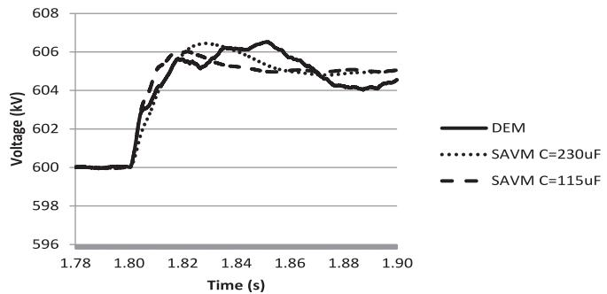  
Fig. 3. The models’ DC voltage response to a 5 kV step change in the DC voltage controller reference voltage at 1.8 s.

# D. Equivalent Capacitor Value

During normal operation, half of the SM’s capacitors are incircuit and therefore the MMC’s equivalent capacitance is given by (9). The in-circuit capacitance does not vary during normal operation since the number of SMs in each phase leg remains constant. However, the SM capacitors which are in-circuit are rotated in accordance with the capacitor balancing controller and the modulation strategy. This enables the MMC to utilise its total stored energy which results in the MMC’s equivalent capacitance value being calculated according to (6).

$$
C _ {\mathrm {e q}} = \frac {3 C _ {\mathrm {s m}}}{n} \tag {9}
$$

The impact of the AVM’s equivalent capacitance value can be highlighted by the following test case. The DC voltage step response for a 31-level DEM with 1150 μF SM capacitors is compared with the SAVM for both equivalent capacitance values of 230 $\mu \mathrm { F }$ and 115 $\mu \mathrm { F } .$ These equivalent values are calculated from SM values using (6) and (9) respectively. Fig. 3 shows that the initial response of the SAVM with a $1 1 5 \mu \mathrm { F }$ capacitor is more accurate than the SAVM with a $. 2 3 0 \mu \mathrm { F }$ capacitor. However, after the initial response the SAVM with a 230 $\mu \mathrm { F }$ capacitor is more accurate.

For the majority of studies a capacitance value based on the MMC’s total stored energy (6) was found to be more appropriate, however the user should be aware of this potential limitation.

# E. Blocking

The SAVM short-circuits the current source when the converter is blocked so that it does not impact on the DC side of the SAVM. However, creating a short-circuit within the SAVM means that SAVM introduces a DC line-to-line fault when it is blocked. It is therefore recommended that the switch shortcircuiting the current source is replaced with a diode and that the current source value is set to zero when the converter is blocked.

Blocking a HB-MMC prevents the SM capacitors from discharging; however it does not prevent them from charging. The SM capacitors can charge in the blocked state due to the rectified AC voltage and if the DC voltage is greater than the sum of the SM capacitor voltages in each converter leg. The SAVM could be modified to account for capacitor charging from the DC side by replacing the switch with a set of anti-parallel IGBTs and

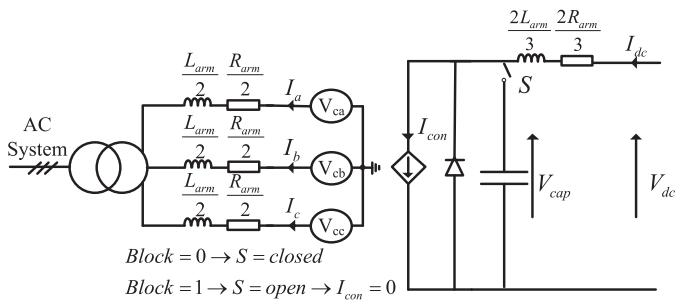  
Fig. 4. Modified AVM (MAVM) circuit.

simple control. However, the sum of the SM capacitors in each leg is normally twice the DC link voltage. Hence there are few practical scenarios where an MMC would be charged from the DC system when it is blocked. The opening of the series connected switch is therefore sufficient for most cases, but the user should be aware of this potential limitation.

# V. MODIFIED AVM (MAVM)

The potential limitations of the SAVM have resulted in a number of modifications to the model. The MAVM which is shown in Fig. 4 has the following key differences in comparison to the SAVM:

1. The capacitor voltage, rather than the DC voltage is used to calculate the DC current source value so that DC side converter losses are taken into account.   
2. The equivalent AC side arm resistance is added to the model to account for AC side converter losses.   
3. The AC converter references voltages are limited by the positive and negative DC pole to ground voltages instead of being scaled by the instantaneous DC voltage.   
4. Half of the sum of the positive and negative DC pole to ground voltages is added to the AC converter voltage references.   
5. The AC power measurement is calculated based on the measured voltage and current signals, not a mixture of measured signals and control signals.   
6. Default equivalent capacitance value is calculated based on the MMC’s total stored energy, but capacitance values as low as the MMC’s nominal in-circuit capacitance are considered where relevant.   
7. Where appropriate, a set of anti-parallel IGBTs with simple control rather than a switch is used to prevent the capacitor from discharging when the converter is blocked.   
8. The switch which short-circuits the current source when the converter is blocked is replaced with a diode.   
9. In the event the converter is blocked the DC current source value is set to zero rather than being short-circuited.

# A. Losses

The DEM is significantly more complex than an AVM. The DEM represents the MMCs semi-conductor devices by a twostate resistor and therefore accounts for conduction losses due to the devices on-state resistance. The purpose of this section of the

paper is to show how the SAVM can be modified to account for conduction losses in the same way as the more complex DEM. It should be noted that in order to accurately calculate MMC losses detailed semi-conductor models are required, which is beyond the functionality of a DEM.

1) DEM Losses: Assuming that the on-state resistance for the SM IGBTs and diodes in the DEM are equal the equivalent arm resistance is given by (10).

$$
R _ {\mathrm {a r m}} = n R _ {\mathrm {o n}} \tag {10}
$$

At steady-state, the circulating current suppressing controllers minimise MMC circulating currents and hence the arm current can be described by (11).

$$
I _ {\mathrm {a r m j}} = \frac {I _ {\mathrm {d c}}}{3} \pm \frac {I _ {j}}{2} \sin (\omega t) \tag {11}
$$

The losses in the DEM can therefore be calculated by (12), where T is the fundamental period, shown in (12).

$$
\begin{array}{l} P _ {\mathrm {M M C}} = \frac {6}{T} \int_ {0} ^ {T} R _ {\mathrm {a r m}} I _ {\mathrm {a r m}} ^ {2} \\ = 6 R _ {\mathrm {a r m}} \left(\frac {I _ {\mathrm {d c}}}{3}\right) ^ {2} + 6 R _ {\mathrm {a r m}} \left(\frac {I _ {\mathrm {c j r m s}}}{2}\right) ^ {2} \tag {12} \\ \end{array}
$$

2) Modified AVM Losses: Using the DC capacitor voltage, $\mathrm { V _ { c a p } }$ , rather than the DC voltage, $\mathrm { V _ { d c } }$ , to calculate the DC current source value, $\mathrm { { I _ { c o n } } , ( 8 ) }$ becomes (13).

$$
V _ {\text {c a p}} I _ {\text {c o n}} = P _ {\mathrm {A C}} \tag {13}
$$

Again noting that $\mathrm { I _ { d c } = I _ { c o n } }$ at steady-state:

$$
P _ {\mathrm {A C}} = V _ {\mathrm {d c}} I _ {\mathrm {d c}} - P _ {\mathrm {D C} \text {L o s s e s}} \tag {14}
$$

Where:

$$
P _ {\mathrm {D C} \text {L o s s e s}} = I _ {\mathrm {d c}} ^ {2} \frac {2 R _ {\mathrm {a r m}}}{3} \tag {15}
$$

Equation (15) is equal to the DC component of the power losses in (12). Including the equivalent arm resistance to the AC side of the AVM $\left( R _ { \mathrm { a r m } } / 2 \right)$ as shown in Fig. 4, the AC component of the power losses in (12) can also be taken into account as described by (16).

$$
P _ {\mathrm {A C} \cdot \text {L o s s e s}} = 3 \times I _ {\mathrm {c j r m s}} ^ {2} \frac {R _ {\mathrm {a r m}}}{2} = 6 R _ {\mathrm {a r m}} \left(\frac {I _ {\mathrm {c j r m s}}}{2}\right) ^ {2} \tag {16}
$$

The losses for the MAVM and the DEM are therefore the same at steady-state. The addition of the AC arm resistance to the model also improves model fidelity from a control perspective. If the diode and IGBT resistances in the DEM are different, the arm resistance in the MAVM needs to be adjusted accordingly.

# VI. SIMULATION RESULTS

The basic structure of the simulation model used as the base case is shown in Fig. 5 and has been implemented in PSCAD X4. The SM capacitance was selected to give a maximum ripple voltage of ±5% when used in conjunction with a Circulating Current Suppressing Controller (CCSC). A 45mH arm reactor

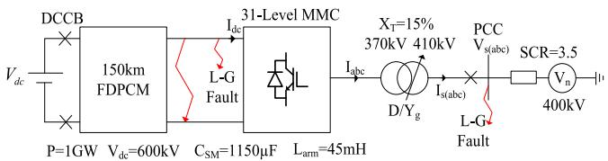  
Fig. 5. Model Structure.

is employed to limit the arm current rate of rise to tens of amps per microsecond in the event of a severe DC side fault, and the converter’s arm resistance of 0.9 Ω was selected to give converter losses of approximately 0.5% which is typical for a HB-MMC [17].

A DEM is used as the reference model for the MMC in these studies. The accuracy of the DEM model has been verified using a traditional detailed model [8]. The DEM employs nearest level control, capacitor balancing control and CCSC. All of the models being compared employ feedback PI controllers for the active and reactive power with a decoupled dq current controller. The cable is represented using a Frequency Dependent Phase Cable Model (FDPCM). More information on the model including controls and parameters can be found in [18]. A 20 μs time-step is used for all models. The simulation models for the DEM, SAVM and MAVM are identical, except for the MMC representation and the internal controls for the DEM. This approach ensures that fair comparisons between the different models can be made.

# A. Steady-State Comparison

The steady-state waveforms produced by the models for the converter operating as an inverter at 1000 MW are very similar as shown in Fig. 6. The key difference between the models is that the DEM represents the switching noise generated by the MMC and that the average DC current produced by the SAVM is smaller than the MAVM and the DEM. It should be noted that the difference between the models would increase if no feedback control systems were employed. This is because the discrete voltage levels and the SM capacitor voltage ripple which are modelled by the DEM can have an impact on the output voltage waveforms. This impact is however small since commercial MMCs employ hundreds of converter levels with a low SM capacitor ripple and some form of feedback control is normally employed in any case.

The SAVM’s DC current is less than the other two models because it does not represent any losses, as shown in Fig. 7. Fig. 7 shows that the SAVM is generating a small active power. This is due to the small error in the SAVM’s DC current source value which is caused by using the control signals for the AC voltages rather than the measured values. This figure also shows that the MAVM’s losses are very similar to the DEM’s losses, when the DEM’s CCSC is enabled. The DEM’s losses would however be much greater than the MAVM if the DEM’s CCSC was disabled.

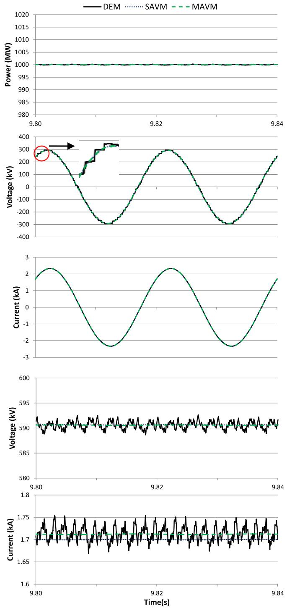  
Fig. 6. Steady state simulation results for the three models. From top to bottom: (a) Active power measured at PCC1 (b) Phase A output voltage, (c) Phase A output current, (d) DC voltage (e) DC current.

# B. Symmetrical AC Line-to-Ground Fault

The models’ response to a 140 ms symmetrical phase-toground fault is shown in Fig. 8. The models’ response during the fault is very similar, however once the fault clears their responses are significantly different. The SAVM’s response is the least accurate and this is due to the SAVM’s AC converter voltages being scaled by the DC voltage rather than limited by

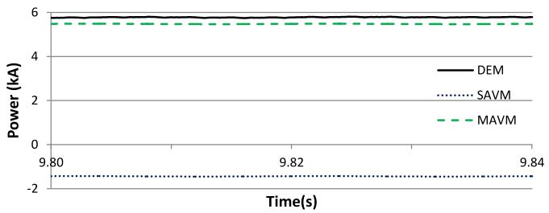  
Fig. 7. MMC losses for the three models.

the instantaneous DC pole-to-ground voltages. The difference between the DEM and the MAVM is mainly due to the fact the MAVM does not represent SM capacitor voltage ripple.

# C. DC Line-to-Ground Fault

A DC line-to-ground fault is applied at 3s to the MMC terminals. The waveforms produced by the three models with the exception of the AC converter voltage for the SAVM are similar as shown in Fig. 9. This type of fault causes an imbalance in the DC pole-to-ground voltages which offsets the AC converter voltages. Since there is no electrical connection between the DC and AC sides of AVMs, the AC converter voltages for the SAVM are unaffected by the imbalance in the DC pole-to-ground voltages. However, the MAVM accounts for this imbalance by adding $0 . 5 \left( \mathrm { V _ { p g } + V _ { n g } } \right)$ to the AC converter voltage references.

# D. DC Line-to-Line Fault

A DC line-to-line fault is applied at 4 s to the MMC terminals and the DC Circuit Breakers (DCCBs) are opened to prevent the DC voltage source contributing to the fault current. The MMC converter is blocked 200 μs after the fault, and the AC side circuit breakers are opened at 4.06 s. The waveforms produced by the three models are very similar before the converter is blocked as shown in Fig. 10. However, once the converter is blocked the difference between the DEM and the AVMs becomes significant, particularly for the DC current. This is because the AVMs are unable to represent the blocked condition for an MMC.

Fig. 11 shows the models’ DC current response when the DCCBs are not opened and hence the DC voltage sources remain connected to the cable. The current waveform produced by the SAVM is clearly incorrect. This is because the SAVM uses a parallel switch to create a short-circuit within the converter when it is blocked.

# VII. BLOCKING MODULES

The limited accuracy of the SAVM for DC fault studies due to its inability to accurately represent a blocked MMC was acknowledged in [6]. The MAVM presented in this paper also suffers with the same limitation as the SAVM. In this section, three different blocking modules are presented which are able to significantly improve the MAVMs accuracy for DC faults.

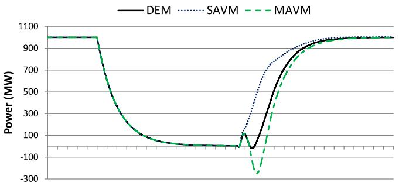

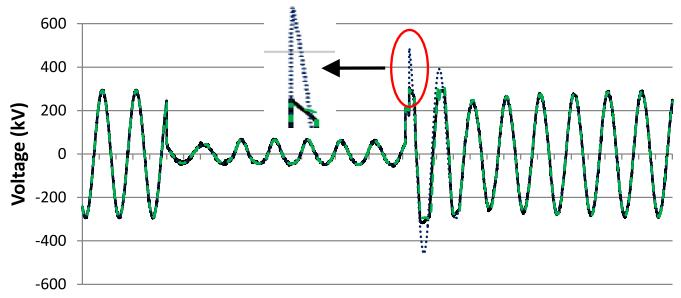

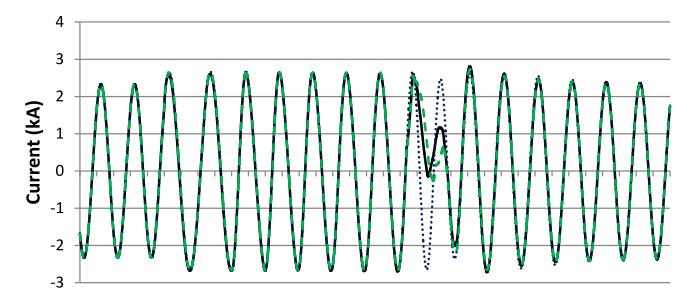

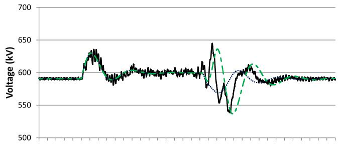

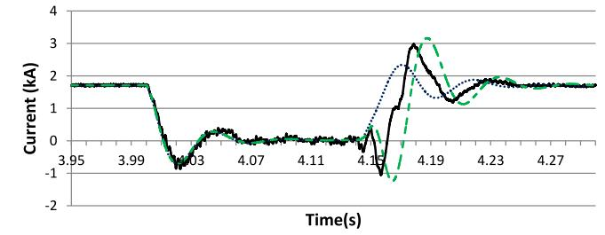  
Fig. 8. 140 ms symmetrical line-to-ground fault applied at 4 s. From top to bottom: (a) Active power measured at PCC1 (b) Phase A output voltage, (c) Phase A output current, (d) DC voltage (e) DC current.

# A. MAVM With Blocking Module

In order to improve the AVMs accuracy for DC faults a 6 pulse bridge (blocking module) is added to the AVM as shown in Fig. 12. It is should also be noted that the parallel diode which is required in the MAVM is not required when a Blocking Module (BM) is used. Under normal operation the BM does not effect the

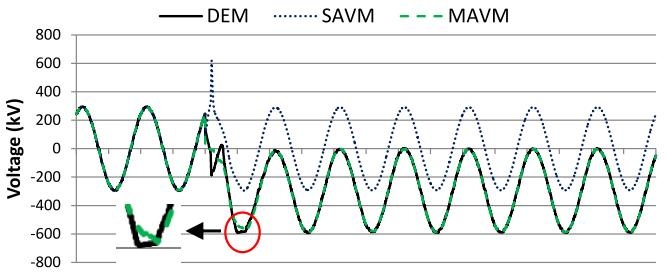

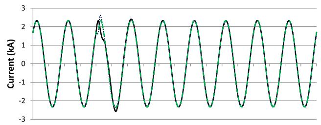

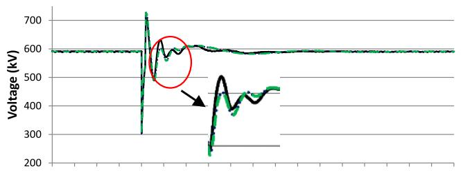

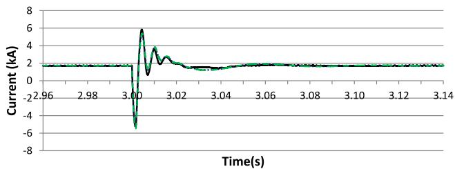  
Fig. 9. DC line-to-ground fault. From top to bottom: (a) Phase A output voltage, (b) Phase A output current, (c) DC voltage (d) DC current.

MAVM since the bridge diodes are reversed biased. The BM can also be disconnected from the MAVM during normal operation if required. However, once the converter is blocked, the AC side of the MAVM and the DC side capacitor are disconnected and the DC current source value is set to zero. The AC system then contributes to the DC current via the six-pulse bridge.

The DC line-to-line fault scenario as described in Section VI.D. is repeated to test the accuracy of the MAVM with BM (MAVM-BM). Fig. 13 shows that the MAVM-BM is able to represent the DC fault current with a good level of accuracy and significantly better than the MAVM without a BM. The key reason for the difference between the DEM and MAVM-BM is that there is no arm impedance in the 6-pulse bridge.

# B. MAVM With Arm Impedance Blocking Module

In this case, the arm impedance is added directly to the six-pulse bridge and the DC side impedance is bypassed once the MMC is blocked as shown in Fig. 14. The test from the

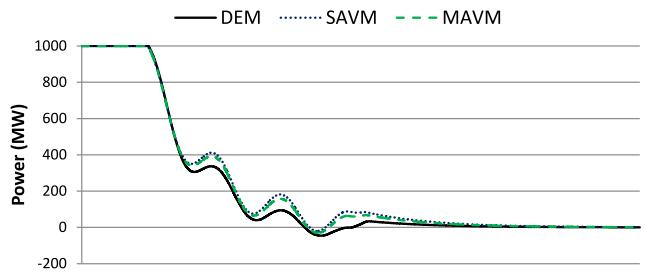

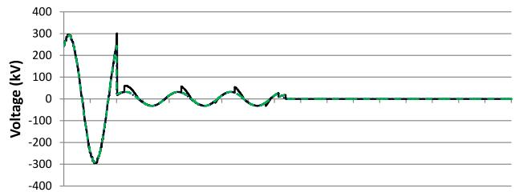

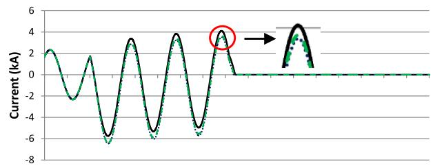

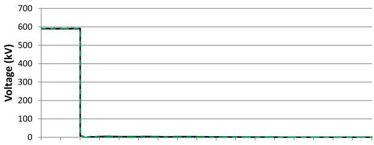

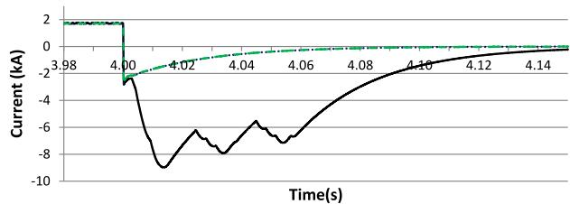  
Fig. 10. DC line-to-line fault applied at 4 s. From top to bottom: (a) Active power measured at PCC1 (b) Phase A output voltage, (c) Phase A output current, (d) DC voltage (e) DC current.

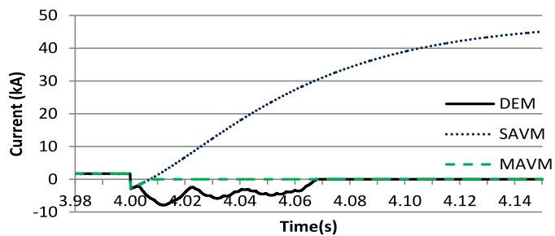  
Fig. 11. Models’ DC current response for a DC line-to-line fault when the DCCBs do not open.

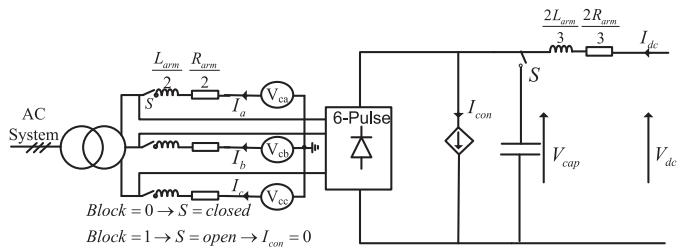  
Fig. 12. MAVM with blocking module.

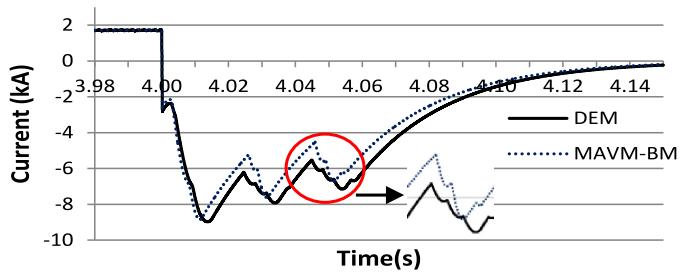  
Fig. 13. DC current for DEM, MAVM and MAVM with blocking module.

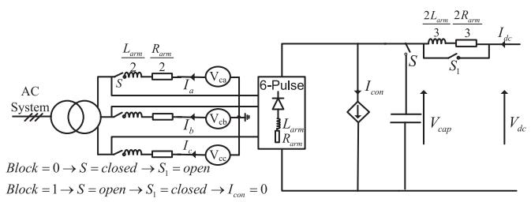  
Fig. 14. MAVM with arm impedance blocking module.

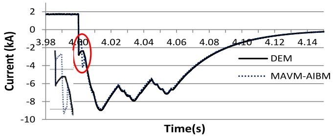  
Fig. 15. DC current for DEM, MAVM and MAVM with arm impedance blocking module.

previous section is repeated and the simulation results are shown in Fig. 15.

The overall DC current response for the MAVM with Arm Impedance BM (AIBM) is better than the MAVM-BM, however the initial response is worse as shown when comparing Figs. 13 with 15. This is because the current which was initially flowing through the DC impedance due to the capacitor is bypassed when the converter is blocked.

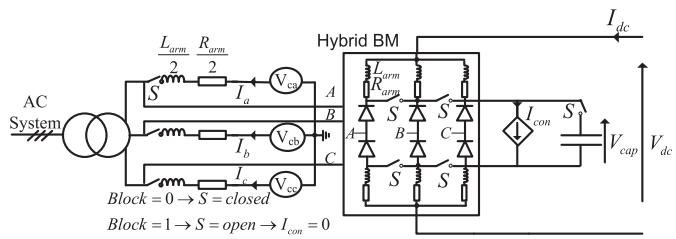  
Fig. 16. MAVM with hybrid blocking module.

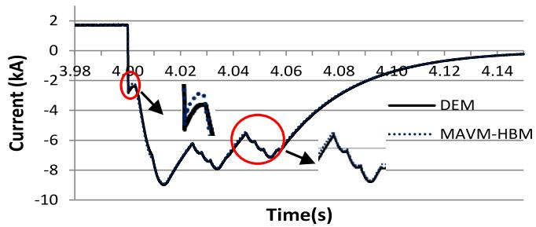  
Fig. 17. DC current for DEM, MAVM and MAVM-HBM.

# C. MAVM With Hybrid Blocking Module

In order to improve the MAVM’s blocking performance further, a Hybrid BM (HBM) is used as shown in Fig. 16. This configuration ensures that the DC current is always flowing through the same arm impedance. Fig. 17 clearly shows that the HBM is the most accurate for DC fault studies, however it may be difficult to implement in some simulation packages, hence the simpler BMs could be more suitable.

# D. MMC Energisation

BMs can also be used to significantly improve the accuracy of the MAVM for converter energisation studies. The process of charging hundreds of SM capacitors is clearly different from charging a single, fixed value capacitor via a BM, however, the following simulation results show that a reasonable level of accuracy can be obtained. In the following simulation, the MMC is de-blocked at 0.3 s and the $\mathrm { V _ { d c } }$ voltage controller increases the DC voltage to the nominal level (600 kV). The DC capacitor for the MAVM-HBM is connected between the DC poles until it is charged and then it is connected as shown in Fig. 16. Fig. 18 shows that the MAVM with BMs are able to give a similar response to the DEM. The MAVM traces are not shown in these figures because they are highly inaccurate and obscure the other traces.

# VIII. COMPUTATIONAL PERFORMANCE

A 5 second simulation was performed for the different models using a 20 μs time step. The simulations were conducted on a Microsoft windows 7 operating system with a 2.5 GHz Intel core iq7-2860 processor and 8 GB of RAM, running on PSCAD X4. Fig. 19 shows that the computational efficiency of the SAVM and MAVM is virtually the same and that the addition of the BMs

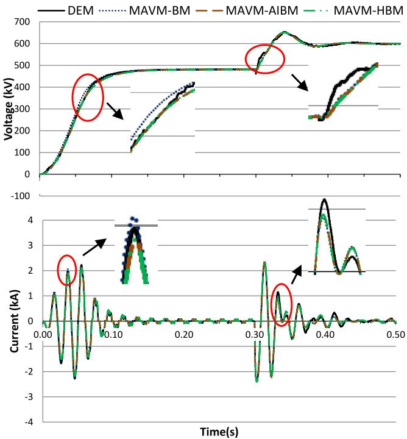  
Fig. 18. DC Voltage and phase A current during MMC energisation for different models.

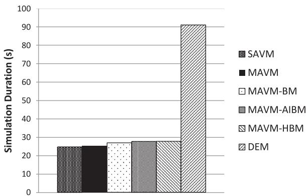  
Fig. 19. Comparison of model simulation times.

has little impact on the simulation time. This figure also shows that all of the AVMs are at least 300% more efficient than the DEM. The simulation times shown in Fig. 19 are for indicative purposes only and may vary depending upon a number of factors such as the computer’s operating system and the length of the simulation window.

# IX. SUMMARY

This paper has identified a number of limitations with the Standard Average Value Models (SAVM) for MMCs and has proposed solutions which have resulted in the Modified AVM (MAVM). To improve the AVM’s ability to represent a blocked MMC for DC faults, three Blocking Module (BM) designs were proposed. The simulation results presented show that the MAVM is significantly more accurate than the SAVM and that

the BMs greatly improve the AVMs representation of a blocked MMC, enabling the MAVM to be used for a wider range of studies. The use of BMs results in only a small reduction in computational efficiency and they can be easily removed from the model when not in use.

# ACKNOWLEDGMENT

The authors would like to thank Hani Saad and Wenyuan Wang for their very useful discussions.

# REFERENCES

[1] Cigre WG B4-57, “Guide for the development of models for HVDC converters in a HVDC grid,” WG brochure, 2014.   
[2] H. Saad et al., “Dynamic averaged and simplified models for MMCbased HVDC transmission systems,” IEEE Trans. Power Del., vol. 28, no. 3, pp. 1723–1730, Jul. 2013.   
[3] J. Beerten, O. Gomis-Bellmunt, X. Guillaud, J. Rimez, A. van der Meer, and D. Van Hertem, “Modeling and control of HVDC grids: A key challenge for the future power system,” in Proc. Power Syst. Comput. Conf., 2014, pp. 1–21.   
[4] J. Peralta, H. Saad, S. Dennetiere, J. Mahseredjian, and S. Nguefeu, “Detailed and averaged models for a 401-level MMC HVDC system,” IEEE Trans. Power Del., vol. 27, no. 3, pp. 1501–1508, Jul. 2012.   
[5] X. Jianzhong, A. M. Gole, and Z. Chengyong, “The use of averaged-value model of modular multilevel converter in DC grid,” IEEE Trans. Power Del., vol. 30, no. 2, pp. 519–528, Apr. 2015.   
[6] H. Saad et al., “Modular multilevel converter models for electromagnetic transients,” IEEE Trans. Power Del., vol. 29, no. 3, pp. 1481–1489, Jun. 2014.   
[7] U. N. Gnanarathna, A. M. Gole, and R. P. Jayasinghe, “Efficient modeling of modular multilevel HVDC converters (MMC) on electromagnetic transient simulation programs,” IEEE Trans. Power Del., vol. 26, no. 1, pp. 316–324, Jan. 2011.   
[8] A. Beddard, M. Barnes, and R. Preece, “Comparison of detailed modeling techniques for MMC employed on VSC-HVDC schemes,” IEEE Trans. Power Del., vol. 30, no. 2, pp. 579–589, Apr. 2015.   
[9] J. Xu, C. Zhao, W. Liu, and C. Guo, “Accelerated model of modular multilevel converters in PSCAD/EMTDC,” IEEE Trans. Power Del., vol. 28, no. 1, pp. 129–136, Jan. 2013.   
[10] F. B. Ajaei and R. Iravani, “Enhanced equivalent model of the modular multilevel converter,” IEEE Trans. Power Del., vol. 30, no. 2, pp. 666–673, Apr. 2015.   
[11] G. P. Adam and B. W. Williams, “Half- and full-bridge modular multilevel converter models for simulations of full-scale HVDC links and multiterminal DC grids,” IEEE J. Emerg. Sel. Topics Power Electron., vol. 2, no. 4, pp. 1089–1108, Dec. 2014.   
[12] S. Rohner, J. Weber, and S. Bernet, “Continuous model of modular multilevel converter with experimental verification,” in Proc. IEEE Energy Convers. Congr. Expo., 2011, pp. 4021–4028.   
[13] N. Ahmed, L. Angquist, S. Norrga, A. Antonopoulos, L. Harnefors, and H. P. Nee, “A computationally efficient continuous model for the modular multilevel converter,” IEEE J. Emerg. Sel. Topics Power Electron., vol. 2, no. 4, pp. 1139–1148, Dec. 2014.   
[14] M. M. C. Merlin et al., “The alternate arm converter: A new hybrid multilevel converter with DC-fault blocking capability,” IEEE Trans. Power Del., vol. 29, no. 1, pp. 310–317, Feb. 2014.   
[15] A. Antonopoulos, L. Angquist, and H. P. Nee, “On dynamics and voltage control of the modular multilevel converter,” in Proc. 13th Eur. Conf. Power Electron. Appl., 2009, pp. 1–10.   
[16] T. Qingrui, X. Zheng, and X. Lie, “Reduced switching-frequency modulation and circulating current suppression for modular multilevel converters,” IEEE Trans. Power Del., vol. 26, no. 3, pp. 2009–2017, Jul. 2011.   
[17] B. Jacobson, P. Karlsson, G. Asplund, L. Harnefors, and T. Jonsson, “VSC-HVDC transmission with cascaded two-level converters,” in Proc. CIGRE Paris Conf., 2010.   
[18] A. Beddard and M. Barnes, Modelling of MMC-HVDC Systems—An Overview. New York, USA: Elsevier Energy Procedia, 2015.

A. Beddard (S’13–M’15) received the M.Eng. and Ph.D. degrees in electrical and electronic engineering from the University of Manchester, Manchester, U.K., in 2009 and 2014, respectively.

Currently, he is a Visiting Research Associate with Imperial College London, London, U.K., from the University of Manchester.

M. Barnes (M’96–SM’07) received the B.Eng. and Ph.D. degrees from the University of Warwick, Coventry, U.K.

In 1997, he was a Lecturer with the University of Manchester Institute of Science and Technology (UMIST), now merged with The University of Manchester, Manchester, U.K., where he is currently a Professor. His research interests cover the field of power-electronics-enabled power systems.

C. E. Sheridan received the B.Eng. (Hons.) in electrical and electronic engineering from University College Cork, Cork, Ireland, in 2011 and is currently pursuing the Ph.D. degree in electrical engineering at Imperial College London, London, U.K.

Her research interests are power electronics, HVDC converters, and multiterminal HVDC networks.

T. C. Green (M’89–SM’02) received the B.Sc. degree (Hons.) in electrical engineering from the Imperial College London, London, U.K., in 1986, and the Ph.D. degree in electrical engineering from Heriot-Watt University, Edinburgh, U.K., in 1990.

He was a Lecturer at Heriot-Watt University until 1994, and is currently a Professor of electrical power engineering at the Imperial College London and the Director of the Energy Future Lab.