# Calculation of lightning-induced voltages on a large-scale distribution network using the JMarti model✩,✩✩,★

Alberto De Conti a ,∗, Osis E.S. Leal b

a Department of Electrical Engineering, Universidade Federal de Minas Gerais (UFMG), Belo Horizonte, MG, 31270-901, Brazil   
b Institute of Engineering, Science and Technology, Universidade Federal dos Vales do Jequitinhonha e Mucuri (UFVJM), Janaúba, Brazil

# A R T I C L E I N F O

Keywords:

Distribution networks

Electromagnetic transients

Lightning-induced voltages

Overhead lines

Time-domain methods

# A B S T R A C T

This paper illustrates the application of a recently proposed time-domain method in the calculation of lightninginduced voltages by nearby cloud-to-ground lightning strikes on a realistic, large-scale distribution network using the JMarti model in the Alternative Transients Program (ATP). In this method, the effect of the incident electromagnetic fields on the illuminated lines is accounted for entirely in terms of independent current sources that are calculated only once for a given lightning event using data obtained from the built-in fitting tool available in ATP. The simulated large-scale network includes laterals, grounding points, surge arresters, transformers, and loads. It is shown that frequency-dependent line losses may have a significant effect on the voltages induced on different parts of the simulated network, and that they should not be neglected in this type of study.

# 1. Introduction

One of the most important features of a computer code dedicated to the calculation of lightning-induced voltages on transmission lines is the possibility of integration with electromagnetic transient (EMT) simulation tools. The usual approach consists in writing an independent code to compute the incident electromagnetic fields on the line and solve the line equations in the time domain accounting for the influence of these fields. The line model is then interfaced with the EMT simulation tool via a Norton-type equivalent. At each time step, information coming from the external code is transferred into the EMT tool and vice-versa, so that the transients on the line and on the rest of the system are updated on an incremental basis [1].

Given the distributed nature of the incident lightning electromagnetic fields, the preferred approach for the solution of the transmission line equations including the influence of external fields is generally based on the finite-difference time-domain (FDTD) method [1, 2]. However, despite the convenience of this approach, it requires careful treatment of the line terminations for the interfacing with the EMT simulation tool. In addition, the need to satisfy the Courant– Friedrichs–Lewy condition often poses challenges for the efficient and

stable computation of lightning-induced voltages on complex systems including nonlinear elements [2].

Another possibility for dealing with the coupling of lightninggenerated fields with overhead lines is to resort to strategies based on the method of the characteristics [3–5]. However, most of the available methods rely either on the frequency-domain solution of the transmission line equations [3] or on a time-domain solution based on a lossless line [4–6]. The former approach requires the use of a numerical transform for enabling the interface with time-domainbased EMT simulation tools, while the latter is too restrictive for a rigorous analysis of the phenomenon. When line losses are included in lightning-induced voltage calculation strategies based on the method of characteristics (e.g., [7]), the solution of the transmission line equations is performed externally to the EMT tool. This does not take advantage of the line models already implemented in the EMT simulation tool and is likely to reduce the efficiency of the solution.

To circumvent the difficulties listed above, an innovative timedomain approach was proposed by the authors in which lightninginduced voltages can be calculated in any EMT simulation tool using the frequency-dependent line models already available in its library of components [8–10]. The idea is to represent the effect of the incident electromagnetic fields in terms of independent current sources

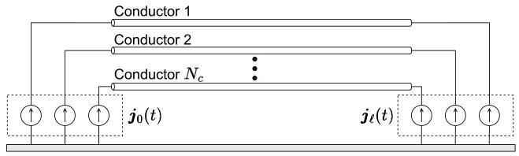  
Fig. 1. Incorporation of the influence of external electromagnetic fields on a lossy multiconductor transmission line with $N _ { c }$ conductors through independent current sources [8].

connected to the line ends. These sources are calculated only once for a given lightning event, and they do not depend on the load connected at the line ends. This means that systematic studies can be conveniently performed (e.g., by changing grounding impedance values, including or removing surge arresters etc.) in a very efficient way because the effect of the external fields on the line was already computed. The proposed method, which is compatible with both the universal line model (ULM) [11] and the JMarti model [12] (also known as fd-line), has been extensively validated through comparisons with measured data and other solution techniques [8–10,13]. The method, which is called either EPD (Extended Phase-Domain) or EMD (Extended Modal-Domain) model depending on the transmission line model taken as reference, provides stable, reliable and efficient calculations that have the advantage of making use of line models that are already implemented in EMT simulation tools.

In this paper, the feasibility of the approach proposed in [8–10] is further demonstrated with the calculation of lightning-induced voltages on a large-scale distribution network comprising both medium-voltage (MV) and low-voltage (LV) lines, transformers, surge arresters, grounding points, and consumer loads modeled in the Alternative Transients Program (ATP). The JMarti transmission line model is used as the framework for the EMD model in the calculation of the inducing current sources that incorporate the effect of the incident electromagnetic fields generated by nearby cloud-to-ground lightning strikes on the illuminated lines. It is demonstrated that neglecting the frequency-dependent line losses in the calculation of lightning-induced voltages can lead to significant errors in case of large-scale systems. It is also demonstrated that lightning-induced voltage calculations can be accurately performed with the JMarti model in ATP using the fitting data obtained from the built-in fitting tool already available in the software.

This paper is organized as follows. Section 2 gives an overview of the technique that enables the calculation of lightning-induced voltages with the JMarti model. Section 3 presents the details of the simulated distribution network. Section 4 presents the results and analyzes, followed by conclusions in Section 5.

# 2. Overview of the calculation method

For calculating lightning-induced voltages on a lossy multiconductor line of length ?? using the approach proposed in [8,9], it is necessary to determine the independent current sources shown in Fig. 1. Both the universal line model (ULM), for the EPD model, and the JMarti model, for the EMD model, can be used as reference for such a task. As both models lead to nearly equivalent results in terms of lightning-induced voltage calculations [14], the latter is preferred for being more efficient in computational terms.

The current sources ${ j _ { 0 } } ( t )$ and ${ j _ { \ell } } ( t )$ shown in Fig. 1 are calculated as

$$
\boldsymbol {j} _ {0} (t) = \boldsymbol {y} _ {c} (t) * \bar {\boldsymbol {u}} _ {0} (t), \tag {1}
$$

$$
\boldsymbol {j} _ {\ell} (t) = \boldsymbol {y} _ {c} (t) * \bar {\boldsymbol {u}} _ {\ell} (t). \tag {2}
$$

where ${ \bf y } _ { c } ( t )$ is the time-domain equivalent of the characteristic impedance of the line, ‘*’ is the convolution integral, and

$$
\bar {\boldsymbol {u}} _ {0} = \boldsymbol {u} _ {0} (t) - \boldsymbol {a} (t) * \bar {\boldsymbol {u}} _ {\ell} (t), \tag {3}
$$

$$
\bar {\boldsymbol {u}} _ {\ell} (t) = \boldsymbol {u} _ {\ell} (t) - \boldsymbol {a} (t) * \bar {\boldsymbol {u}} _ {0} (t). \tag {4}
$$

In (3) and (4), ${ \pmb a } ( t ) = ( t _ { I } ^ { - 1 } ) ^ { t } \mathcal { L } ^ { - 1 } \left\{ { \pmb A } _ { m } \right\} t _ { I } ^ { t }$ is the propagation function of the line, ${ \mathcal L } ^ { - 1 }$ is the inverse Laplace transform operator, $\pmb { A _ { m } } = d i a g$ $\left\lceil \exp \left( - \sqrt { Z _ { m } Y _ { m } } \ell \right) \right\rceil$ is a diagonal matrix containing the propagation function of each of the line modes, $Z _ { m }$ and $Y _ { m }$ are the frequencydependent modal series impedance and shunt admittance of the line per unit length, and $t _ { I }$ is a real and frequency-independent transformation matrix calculated at frequency $f _ { 0 } .$ Finally, the voltage sources ${ \pmb u } _ { 0 } ( t )$ and $\mathbf { \delta } _ { \pmb { u } _ { \ell } ( t ) }$ in (3) and (4) are given by

$$
\begin{array}{l} \boldsymbol {u} _ {0} (t) = - \int_ {0} ^ {\ell} \boldsymbol {a} _ {x} (t) * \boldsymbol {E} _ {x} (x, t) d x \\ - h \boldsymbol {E} _ {z} (0, t) + \boldsymbol {a} (t) * h \boldsymbol {E} _ {z} (\ell , t), \tag {5} \\ \end{array}
$$

$$
\begin{array}{l} \boldsymbol {u} _ {\ell} (t) = \int_ {0} ^ {\ell} \boldsymbol {a} _ {x} (t) * \boldsymbol {E} _ {x} (\ell - x, t) d x \\ - h E _ {z} (\ell , t) + a (t) * h E _ {z} (0, t), \tag {6} \\ \end{array}
$$

where ${ { a } _ { x } } \left( t \right)$ is the propagation function of an infinitesimally short line segment, $E _ { x } ( x , t )$ is the horizontal component of the incident electric field calculated along the line at the height of the line conductors, $E _ { z } \left( 0 , t \right)$ and $E _ { z } \left( \ell , t \right)$ are the vertical electric fields calculated at ground level at the line ends, and ?? is a diagonal matrix containing the conductor heights.

For the calculation of (1) and (2), it is necessary to fit the characteristic admittance and the propagation function of the line. If the ULM model is used as reference for the lightning-induced voltage calculation, both parameters can be readily obtained from the built-in fitting tool available in the EMT simulation software [14]. However, the JMarti model is originally based on the fitting of the modal characteristic impedance, not the characteristic admittance. This means that, in principle, the calculation of (1) and (2) for use with the JMarti model would depend on an additional code for calculating and fitting the characteristic admittance of the line. To avoid this, the approach proposed in [10] can be used. In this approach, the rational fitting of the characteristic admittance is no longer needed for the calculation of the inducing sources required for the lightning-induced voltage calculation with the JMarti model. Consequently, the rational fitting of the modal characteristic impedance and propagation function already available in EMT tool is all that is needed for determining the inducing current sources. The equivalency of this approach with the one based on the characteristic admittance of the line was demonstrated in [10] for simple distribution line configurations. In this paper, the same approach is used to simulate a large-scale distribution system. Details of the proposed formulation and of the numerical solution of (1)–(6) can be found in [8–10]. The validity of the EPD and EMD models is demonstrated in [8,13] through comparisons with the solution of the transmission line equations in the presence of external lightning electromagnetic fields considering the FDTD method. They are also shown in [9,15] to produce results that are equivalent to the well-known LIOV (lightning-induced overvoltage) code [1]. Finally, validation through comparisons with experimental data obtained from both reduced- and real-scale lightning-induced voltage experiments are found in [9,13].

# 3. System modeling

# 3.1. System description

The distribution network considered in this study is shown in Fig. 2. It consists of a three-phase 13.8 kV medium-voltage (MV) line with a length of 1.26 km extending from poles P1 to P9, with a 540 m lateral derived from its midpoint at pole P5. The MV line is formed by horizontally displaced phase conductors with 4.17 mm radius and DC resistance of 0.83862 Ω/km, and a multi-grounded neutral with 2.325 mm radius and DC resistance of 2.60440 Ω/km. The neutral is

Fig. 2. Evaluated system, with coordinates in meters. Transformers are located at poles P4, P6, P10, and P12. Consumer loads are represented as solid gray circles.   
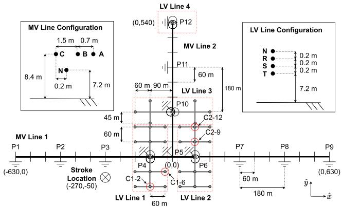  
Source: Adapted from [5].

grounded in intervals of 180 m with a single vertical grounding rod, except at poles P4, P6, P10 and P12, where three-phase distribution transformers are located. At these poles, three parallel vertical rods with 3-m separation are used.

Four three-phase low-voltage (LV) distribution networks with phaseto-neutral voltage of 127 V are connected to the MV lines. LV lines 1, 2 and 3 contain 13 consumer loads each, while line 4 contains a single consumer load. The conductors and the neutral of LV lines 1, 2, and 3 are vertically displaced and have 2.325 mm radius and DC resistance of 2.60440 Ω/km. In LV line 4, the load is connected directly to the transformer secondary through a service drop. All loads are three phase, y-connected, and each is grounded through a single grounding rod. The neutral of the MV and LV lines is continuous, multi-grounded, and interconnected at the transformer poles. Poles P1 and P9 are connected to resistive networks to avoid the occurrence of reflections at the ends of the MV line. All transformers are protected at their primary and secondary terminals by surge arresters.

# 3.2. Distribution network modeling

The distribution network of Fig. 2 is the same used in [5,6] to investigate the influence of the transformer grounding and of surge arresters on lightning overvoltages at consumer loads. However, in the analysis presented in $[ 5 , 6 ]$ line losses due to conductor impedances and the finite conductivity of the ground were neglected. Here, the whole system shown in Fig. 2 was modeled in ATP, with the MV and LV lines modeled using the JMarti model considering frequencydependent losses. The model parameters were calculated internally in ATP from 0.1 Hz to 10 MHz using 20 points per decade. For typical overhead distribution line configurations, the JMarti model is nearly insensitive to the frequency $f _ { 0 }$ selected for calculating the transformation matrix. This is demonstrated in [14] even for double-circuit and mixed distribution lines. A rule of thumb to select $f _ { 0 }$ is to fit the model considering three arbitrary values for this parameter in the range of tens to hundreds of kHz. If the predicted transient voltage and current waveforms are insensitive to $f _ { 0 } ,$ then the transformation matrix can be safely assumed real and frequency independent. If not, the use of a more rigorous model is recommended. In this paper, this procedure was followed to select $f _ { 0 }$ and a value of 60 kHz was assumed for this parameter.

The MV lines were divided into sections of 180 m, except between poles P4 and ${ \mathrm { P } } 5 ,$ and between poles P5 and P6, where line sections of 90 m were considered. This subdivision is required to allow the connection of grounding points, surge arresters, loads and transformers. The current sources shown in Fig. 1 were then calculated in MATLAB

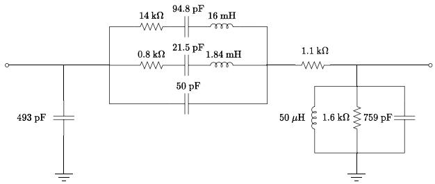  
Fig. 3. Transformer model [16].

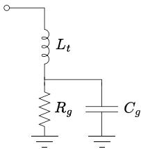  
Fig. 4. Grounding model [17].

Table 1 Parameters of the grounding models [17].   

<table><tr><td>Parameter</td><td>1 rod</td><td>3 rods</td></tr><tr><td>Rg(Ω)</td><td>0.346ρg</td><td>0.119ρg</td></tr><tr><td>Cg(nF)</td><td>0.0256εrg</td><td>0.0743εrg</td></tr><tr><td>Lt(μH)</td><td>7.2</td><td>7.2</td></tr></table>

and interfaced with ATP using a MODELS code. For each line section, four current sources (three phases plus neutral) need to be included at each of the line ends. A similar approach was followed for the modeling of the LV line, except that line sections of 60 m were considered in LV lines 1 and 2. In LV line 3, sections of 45 m, 60 m, and 90 m were used. For simplicity, insulation breakdown was neglected.

The transformer model was derived in [16] from transferred voltage measurements performed on a 13.8 kV/220–127 V three-phase distribution transformer assuming a common-mode excitation at the primary side. From the measured frequency responses, the per-phase equivalent circuit shown in Fig. 3, valid up to few MHz, was proposed. The main purpose of this simplified model was to enable the study of the effect of cloud-to-ground lightning strikes on distribution lines. In such phenomenon, voltages of nearly equal magnitudes are generated on the three phases of the illuminated line, and the common-mode excitation is the dominant effect. Although this simplified model does not take into account all possible interactions between the transformer terminals, it is considered sufficiently accurate for the analysis presented in this paper.

The grounding terminations are represented as shown in Fig. 4. The parameters for the single vertical grounding rod and for the three parallel grounding rods are obtained from the expressions given in Table 1, which depend on the ground resistivity $\rho _ { g } ,$ in Ω/m, and relative permittivity, $\varepsilon _ { r g } .$ In all cases, $\varepsilon _ { r g } ~ = ~ 1 0$ is assumed, while $\rho _ { g }$ was varied according to the cases discussed in Section 4. The expressions in Table 1 were determined in [17] from simulations performed with an electromagnetic model [18]. The inductor $L _ { t }$ in Fig. 4 is intended to represent the grounding down conductor.

The consumer units were modeled as shown in Fig. 5. They comprise three identical RLC branches representing the loads, a 15-m long service drop, and a grounding termination. Each branch of the three-phase load was represented following the high-frequency model proposed in [19]. This model was derived from the measurement of the input impedance of actual low-voltage residential installations in frequencies up to 5 MHz. The service drop was modeled as a lumped pi model

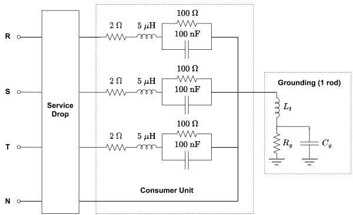  
Fig. 5. Consumer units.

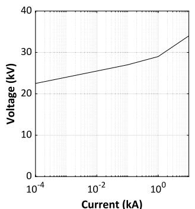

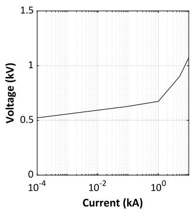  
  
Fig. 6. VxI curves of the surge arresters. (a) MV surge arrester; (b) LV surge arrester.

assuming a multiplexed line in which the phase conductors are twisted around the neutral. The parameters were calculated considering the neutral to be positioned at a height of 7.2 m, with the phase conductors symmetrically distributed around it with a center-to-center separation of 1.5 cm. Each conductor was modeled with a radius of 0.426 cm and a DC resistance of 0.852 Ω/m. For simplicity, proximity effects and the insulating layer covering the phase conductors were neglected in the parameter calculation. Finally, the grounding rod was modeled as outlined in Table 1.

The ZnO surge arresters protecting the primary and secondary sides of the transformers were modeled considering the voltage–current (VxI) curves shown in Fig. 6, following the guidelines in [20]. These VxI curves are based on standard data provided by an arrester manufacturer.

# 3.3. Lightning modeling

A cloud-to-ground lightning strike was assumed to hit a point 50 m far from the MV line 1, as shown in Fig. 2, and lightning-induced voltages were calculated at different points of the line and on selected consumer loads. In the simulations, the lightning channel was assumed to be straight and vertical. The channel-base current is shown in Fig. 7. This current waveform corresponds to the median waveform of first stroke currents associated with negative downward lightning measured at Mount San Salvatore, with a peak value of 31.1 kA and virtual front time of 3.83 μs [21]. It presents the characteristic concavity at the wavefront and the multiple peaks typically associated with such phenomenon. The current waveform shown in Fig. 7 was represented as the sum of seven Heidler functions whose parameters are given in [21].

The method described in Section 2 allows the calculation of lightning-induced voltages with the JMarti model in ATP considering any return-stroke model and any strategy for determining the electromagnetic fields that illuminate the line. In the analysis presented in this

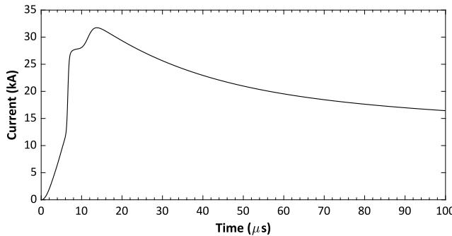  
Fig. 7. Channel-base current [21].

paper, the lightning electromagnetic fields were calculated in the time domain using the analytical formulation of Barbosa and Paulino [22, 23] including the effect of the lossy ground on the horizontal component of the incident electric fields. This formulation was preferred instead of the classical approach based on the Cooray–Rubinstein approximation [24,25] for two reasons. Firstly, it enables a more efficient calculation of the horizontal component of the incident lightning electric field because it is entirely analytical. Secondly, as demonstrated in [26], it is more general than the Cooray–Rubinstein approximation, predicting horizontal electric field components in better agreement with the solution of the exact Sommerfeld equations, especially in the vicinity of the lightning channel for a poorly conducting ground [23].

As a requirement of the Barbosa and Paulino formulation, the spatial and temporal distribution of the return-stroke current was calculated considering the transmission line (TL) model [27], with a propagation speed of $1 . 3 { \times } 1 0 ^ { 8 } \ \mathrm { m / s } .$ . Compared to other return-stroke models [28,29], the TL model has the drawback of neglecting return-stroke current attenuation and distortion. Although this can have some impact on the late-time response of lightning-induced voltage waveforms (see, e.g., [30]), in principle any return-stroke model could be used to investigate the influence of line losses on the lightning response of the distribution system shown Fig. 2. In that sense, the TL model can be considered sufficiently accurate for the purposes of this paper.

# 3.4. Source modeling

For calculating the current sources shown in Fig. 1, the vertical component of the incident electric field was calculated at the line ends as required in (5) and (6), while the horizontal electric fields were calculated in intervals of 5 m along the lines. Two propagation functions were fitted for this calculation, one corresponding to the total length of each line section, and another corresponding to line segments of 5 m. The propagation function associated with the total line length refers to ?? (??) in (3)–(6), whereas the short segments are related to ?? (??) in (5) and (6). Although the fitting of the propagation functions could be performed externally using any suitable technique assuming both real and complex-conjugate poles, in this paper the fitting was performed entirely with the built-in fitting tool available in ATP, which determines the modal propagation functions required by the JMarti model using strictly real poles.

As an example, Fig. 8 illustrates the absolute value of the original and fitted ground mode associated with the frequency-domain counterpart of ${ \pmb a } _ { x } ( t )$ for the 5-m long line segment obtained directly from the built-in fitting tool of ATP. The fitting was performed with 3 real poles considering initial and final frequencies of 0.1 Hz and 10 MHz, respectively, 20 points per decade, a real transformation matrix calculated at 60 kHz, and a ground resistivity of 1000 Ωm. As indicated in Fig. 8, an accurate fitting was possible, especially in the high-frequency range, which is most important for lightninginduced voltage calculations. Although not shown, the fitting of the aerial modes was also very accurate.

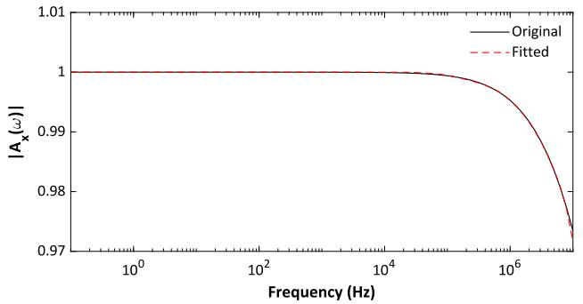  
Fig. 8. Absolute value of the ground mode of the propagation function associated with the frequency-domain counterpart of ${ \pmb a } _ { x } ( t )$ considering a line segment 5-m long.

Finally, for calculating the inducing current sources ${ j _ { 0 } } \left( t \right)$ and $j _ { \ell } \left( t \right)$ from the voltage sources $\bar { \pmb u } _ { 0 }$ and $\bar { \ b u } _ { \ell } \left( t \right)$ given in (3) and (4), the alternative approach based on the fitting of the modal characteristic impedance proposed in [10] was used instead of the characteristic admittance required in (1) and (2). By doing this, all the fitting required for the calculation of the effect of the incident fields was obtained from the built-in fitting tool available in ATP. All calculations were performed considering a time step of 10 ns and a total simulation time of 80 μs.

# 4. Results and analysis

# 4.1. MV lines

Figs. 9 and 10 illustrate the voltages induced between phase A and the ground at poles P3, P4, P9, and P11 along the MV line considering different values of ground resistivity. The results shown in Fig. 9 correspond to a ground resistivity of 100 Ωm, whereas the ones shown in Fig. 10 refer to a ground resistivity of 1000 Ωm. In both cases, the incident electric fields were calculated assuming a ground relative permittivity $\varepsilon _ { r } = 1 0 .$ . To assess the importance of line losses on the calculation of lightning-induced voltages, both figures include results obtained considering either lossless lines or lossy, frequencydependent lines represented with the JMarti model. In the former case, the DC resistance of the conductors and the ground resistivity were set to negligible values in the calculation of the per-unit-length parameters of the line in ATP.

The results shown in Figs. 9 and 10 indicate that the induced voltage waveforms at pole P3 are nearly insensitive to the consideration of line losses. This result was expected due to the strong dependence of the induced voltage waveforms on the incident electromagnetic fields caused by the proximity of pole P3 to the stroke location, and to the reduced importance of propagation losses along the line on the resulting transient waveforms in this case [31]. At pole P4, which is 180 m down the MV line, the similarity between the calculated voltage waveforms can be explained by the surge arresters protecting the transformer, which limit the resulting phase-to-neutral overvoltages to 30 kV at that point. At poles P9 and P11, which are farther away from the lightning incidence point, larger deviations are observed between the lossy and lossless line cases, especially for the 1000 Ωm soil (see Fig. 10). This can be explained by the effect of line propagation losses and the enhancement of their influence due to the multiple reflections occurring at the impedance discontinuity points along the line, which increase the distance that is effectively traveled by the propagating surges.

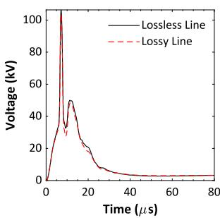

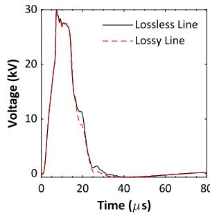  
(b)

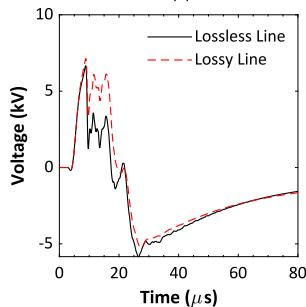

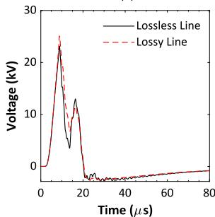  
  
Fig. 9. Phase-to-ground voltages induced at different points of the MV line for a soil resistivity of 100 Ωm; (a) Pole P3; (b) Pole P4; (c) Pole P9; (d) Pole P11.

# 4.2. LV lines

Figs. 11 and 12 illustrate the induced voltage waveforms calculated between phase A and the neutral at loads C1-2, C1-6, C2-9 and C2-12 highlighted in Fig. 2. Once again, the induced voltages were calculated considering either lossy, frequency-dependent lines or lossless lines. The analysis of both figures reveals that neglecting line losses can cause significant errors especially in the determination of the first voltage peak. The largest deviations are of 28% for the 100-Ωm soil and of 18% for the 1000-Ωm soil, occurring at loads C1-2 and C2- 9, respectively. Compared to the results obtained for the MV line, the results shown in Figs. 11 and 12 indicate that the calculation of lightning-induced voltages is more sensitive to the consideration of line losses in the case of the LV lines. This is probably related to the greater influence of successive reflections at impedance discontinuity points at the terminations of the LV lines. The overall effect is that of an apparent increase in the line length, which is likely to enhance the influence of line propagation losses on lightning-induced voltages.

# 4.3. Discussion

One of the first papers to investigate the influence of line losses on lightning-induced voltages indicated, based on the analysis of the influence of incident lightning electromagnetic fields on a straight overhead line without laterals, grounding points, transformers or surge arresters, that such effect could be neglected for lines shorter than 2 km [31]. Although this scenario is completely different from the distribution system shown in Fig. 2, it can be argued that the simulated large-scale network contains no lines that exceed this limit. However, since the induced surges travel multiple paths due to numerous reflections and refractions at impedance discontinuity points, the apparent length of each line becomes in practice greater than its actual one. Consequently, the cumulative effect of line losses becomes important for the characterization of the resulting lightning overvoltages. For this reason, line losses should not be neglected in evaluations of lightninginduced voltages on distribution lines with complex topology, even if the actual length of each individual line does not exceed the limit of 2 km suggested in [31].

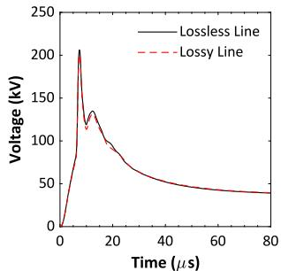  
(a)

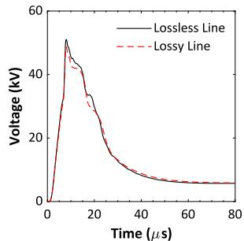

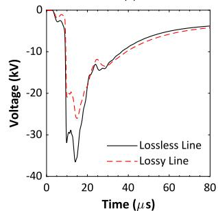

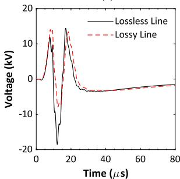

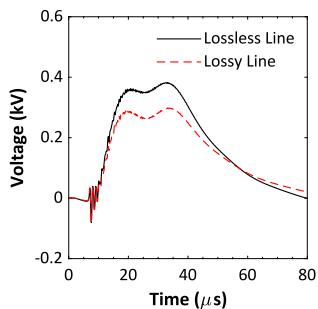  
Fig. 10. Phase-to-ground voltages induced at different points of the MV line for a soil resistivity of 1000 Ωm; (a) Pole P3; (b) Pole P4; (c) Pole P9; (d) Pole P11.

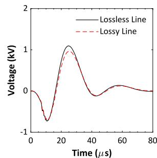

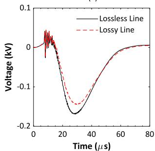

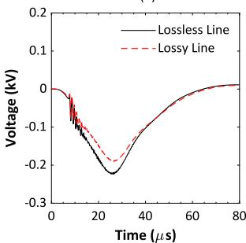  
  
Fig. 11. Phase-to-neutral voltages induced at different consumer loads for a soil resistivity of 100 Ωm; (a) C1-2; (b) C1-6; (c) C2-9; (d) C2-12.

# 5. Conclusions

This paper demonstrates the importance of including frequencydependent line losses due to the internal impedance of the conductors and the ground-return impedance in the calculation of lightninginduced voltages on a large distribution network. Neglecting the line losses might lead to significant errors in the estimation of peak voltages both on MV and LV lines. The importance of the line losses on the simulation of lightning-induced voltages on large-scale distribution networks is justified by the fact that in such networks the induced voltages are the result of multiple reflections due to impedance discontinuities

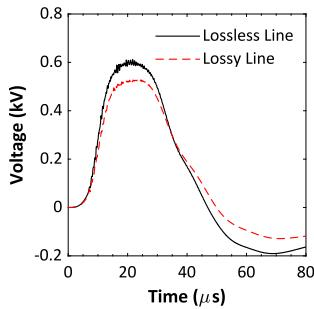

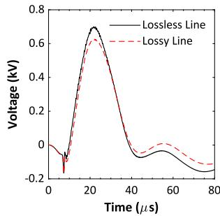  
(b)

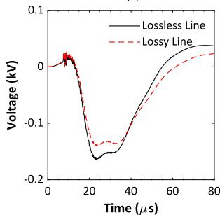  
(c)

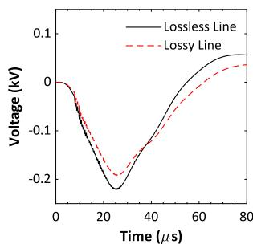  
  
Fig. 12. Phase-to-neutral voltages induced at different consumer loads for a soil resistivity of 1000 Ωm; (a) C1-2; (b) C1-6; (c) C2-9; (d) C2-12.

and complex interactions between grounding points, surge arresters, transformers, and loads, each displaying resonant characteristics in the high frequency range. All these interactions involve surge propagation through multiple paths, in which case line losses play a significant role.

It is also demonstrated that it is possible to calculate lightninginduced voltages on large-scale distribution networks using the JMarti model in ATP using fitting data taken from the built-in fitting tool available in this platform. The calculation method considered in this study, named EMD model, and its counterpart EPD model (which is based on a phase-domain solution of the transmission line equations), can be easily deployed in other EMT simulation tools. The greatest advantage of the EMD and EPD models over existing methods for calculating lightning-induced voltages is the possibility of using the lossy transmission line models already implemented in EMT-type tools, such as the JMarti model and ULM.

# CRediT authorship contribution statement

Alberto De Conti: Writing – original draft, Investigation, Writing – review & editing, Methodology, Conceptualization, Formal analysis. Osis E.S. Leal: Writing – review & editing, Validation, Software, Data curation, Formal analysis, Investigation.

# Declaration of competing interest

The authors declare that they have no known competing financial interests or personal relationships that could have appeared to influence the work reported in this paper.

# Data availability

Data will be made available on request.

# References

[1] A. Borghetti, J. Gutierrez, C. Nucci, M. Paolone, E. Petrache, F. Rachidi, Lightning-induced voltages on complex distribution systems: models, advanced software tools and experimental validation, J. Electrost. 60 (2) (2004) 163–174.   
[2] M. Brignone, F. Delfino, R. Procopio, M. Rossi, F. Rachidi, Evaluation of power system lightning performance, part I: Model and numerical solution using the PSCAD-EMTDC platform, IEEE Trans. Electromagn. Compat. 59 (1) (2017) 137–145.   
[3] A. Ramirez, J. Naredo, P. Moreno, Full frequency-dependent line model for electromagnetic transient simulation including lumped and distributed sources, IEEE Trans. Power Deliv. 20 (1) (2005) 292–299.   
[4] H. Hoidalen, Analytical formulation of lightning-induced voltages on multiconductor overhead lines above lossy ground, IEEE Trans. Electromagn. Compat. 45 (1) (2003) 92–100.   
[5] A. De Conti, F.H. Silveira, S. Visacro, Lightning overvoltages on complex low-voltage distribution networks, Electr. Power Syst. Res. 85 (2012) 7–15.   
[6] A. De Conti, F.H. Silveira, S. Visacro, On the role of transformer grounding and surge arresters on protecting loads from lightning-induced voltages in complex distribution networks, Electr. Power Syst. Res. 113 (2014) 204–212.   
[7] A. Andreotti, A. Pierno, V.A. Rakov, A new tool for calculation of lightninginduced voltages in power systems—Part I: Development of circuit model, IEEE Trans. Power Deliv. 30 (1) (2015) 326–333.   
[8] A. De Conti, O.E.S. Leal, Time-domain procedures for lightning-induced voltage calculation in electromagnetic transient simulators, IEEE Trans. Power Deliv. 36 (1) (2021) 397–405.   
[9] O.E.S. Leal, A. De Conti, Compact matrix formulation for calculating lightninginduced voltages on electromagnetic transient simulators, IEEE Trans. Power Deliv. 36 (4) (2021) 1943–1951.   
[10] O.E.S. Leal, A. De Conti, A Thévenin-Type version of the extended modal-domain model for lightning-induced voltage calculations, IEEE Trans. Power Deliv. 38 (1) (2023) 154–161.   
[11] A. Morched, B. Gustavsen, M. Tartibi, A universal model for accurate calculation of electromagnetic transients on overhead lines and underground cables, IEEE Trans. Power Deliv. 14 (3) (1999) 1032–1038.   
[12] J.R. Marti, Accurate modelling of frequency-dependent transmission lines in electromagnetic transient simulations, IEEE Trans. Power Appar. Syst. PAS-101 (1) (1982) 147–157.   
[13] A. De Conti, O.E. Leal, A.C. Silva, Lightning-induced voltage analysis on a threephase compact distribution line considering different line models, Electr. Power Syst. Res. 187 (2020) 106429.   
[14] O.E. Leal, A. De Conti, Evaluation of the extended modal-domain model in the calculation of lightning-induced voltages on parallel and double-circuit distribution line configurations, Electr. Power Syst. Res. 194 (2021) 107100.

[15] A. De Conti, O.E. Leal, Test and validation of a methodology for calculating lightning-induced voltages in electromagnetic transient programs, in: ICLP 2024 - 37th International Conference on Lightning Protection, 2024, pp. 137–143.   
[16] A. Piantini, A.G. Kanashiro, A distribution transformer model for calculating transferred voltages, in: ICLP 2002 - 26th International Conference on Lightning Protection, 2002.   
[17] A. De Conti, S. Visacro, A simplified model to represent typical grounding configurations applied in medium-voltage and low-voltage distribution lines, in: IX SIPDA - International Symposium on Lightning Protection, 2007.   
[18] S. Visacro, A. Soares, HEM: a model for simulation of lightning-related engineering problems, IEEE Trans. Power Deliv. 20 (2) (2005) 1206–1208.   
[19] W. Bassi, Input impedance characteristics and modeling of low-voltageresidential installations for lightning studies, in: ICLP 2008 - 29th International Conference on Lightning Protection, 2008.   
[20] P. Pinceti, M. Giannettoni, A simplified model for zinc oxide surge arresters, IEEE Trans. Power Deliv. 14 (2) (1999) 393–398.   
[21] A. De Conti, S. Visacro, Analytical representation of single- and double-peaked lightning current waveforms, IEEE Trans. Electromagn. Compat. 49 (2) (2007) 448–451.   
[22] C.F. Barbosa, J.O.S. Paulino, An approximate time-domain formula for the calculation of the horizontal electric field from lightning, IEEE Trans. Electromagn. Compat. 49 (3) (2007) 593–601.   
[23] C.F. Barbosa, J.O.S. Paulino, A time-domain formula for the horizontal electric field at the earth surface in the vicinity of lightning, IEEE Trans. Electromagn. Compat. 52 (3) (2010) 640–645.   
[24] V. Cooray, Horizontal fields generated by return strokes, Radio Sci. 27 (4) (1992) 529–537.   
[25] M. Rubinstein, An approximate formula for the calculation of the horizontal electric field from lightning at close, intermediate, and long range, IEEE Trans. Electromagn. Compat. 38 (3) (1996) 531–535.   
[26] J.O.S. Paulino, C.F. Barbosa, W.d.C. Boaventura, Effect of the surface impedance on the induced voltages in overhead lines from nearby lightning, IEEE Trans. Electromagn. Compat. 53 (3) (2011) 749–754.   
[27] M.A. Uman, D.K. McLain, Magnetic field of lightning return stroke, J. Geophys. Res. (1896-1977) 74 (28) (1969) 6899–6910.   
[28] V. Rakov, M. Uman, Review and evaluation of lightning return stroke models including some aspects of their application, IEEE Trans. Electromagn. Compat. 40 (4) (1998) 403–426.   
[29] A. De Conti, F.H. Silveira, S. Visacro, T.C. Cardoso, A review of return-stroke models based on transmission line theory, J. Atmos. Sol.-Terr. Phys. 136 (2015) 52–60.   
[30] A. De Conti, F.H. Silveira, S. Visacro, Influence of a nonlinear channel resistance on lightning-induced voltages on overhead lines, IEEE Trans. Electromagn. Compat. 52 (3) (2010) 676–683.   
[31] F. Rachidi, C. Nucci, M. Ianoz, C. Mazzetti, Influence of a lossy ground on lightning-induced voltages on overhead lines, IEEE Trans. Electromagn. Compat. 38 (3) (1996) 250–264.