# Inverter-Based Resources Model Verification Using Electromagnetic Transient Playback Simulation

Haoyuan "Harry" Sun $^{1,2}$ , Qiang "Frankie" Zhang $^{2}$ , Xiaochuan Luo $^{2}$ , Zachary Serritella $^{2}$ , David Hussey $^{2}$ , Bradley Marszalkowski $^{2}$

1. Department of EECS, The University of Tennessee at Knoxville, Knoxville, Tennessee, USA 2. ISO New England, Holyoke, Massachusetts, USA

Emails: hsun19@vols.utk.edu, {qzhang, xluo, zserritella, dhussey, bmarszalkowski} @iso-ne.com

Abstract—The rapidly increasing penetration of Inverter-Based-Resources into modern power systems creates an urgent need for accurate modeling, specifically in the EMT domain. In the US, model accuracy is the Generation Owners' responsibility. However, there are movements in the wider industry to require verification of EMT models. NERC has a number of SAR projects open for MOD-26, FAC-02, MOD-32, and TPL-001 to include EMT models. IEEE P2800.2 also requires EMT models to be verified in conformance with IEEE 2800. Therefore, a general approach to benchmark IBR EMT model accuracy is needed. This paper proposes a full IBR EMT model verification solution together with two initialization techniques. Both simulated data and real Point-On-Wave data were used in the study to test the proposed approach. The results demonstrate that EMT playback is an efficient and effective model verification solution. This paper also introduces the PSCAD playback module and GUI tool that ISO New England developed.

Index Terms—Playback, Inverter-based resources (IBRs), model verification, electromagnetic transient (EMT) simulation, PSCAD.

# I. INTRODUCTION

Accurate generator models play an important role throughout the planning and operation of modern power systems. For example, in the US, Reliability Coordinators (RCs) and Planning Coordinators (PCs) are both receivers and end users of the generator models. RCs and PCs use these models in simulation studies to inform technical decisions such as the choice of control settings and operating limits. Although Generation Owners (GOs) validate their models and calibrate the parameters every few years by performing field tests [1], due to the criticality and far-reaching nature of these models, an effective and efficient approach for model receivers and users to verify the accuracy of these models without performing field tests is still necessary [2] [3]. Since the focus is on whether the model adequately captures the actual equipment's performance in the field, one of the best options is to use this technique named playback simulation. The playback uses actual measurements as input signals to drive the model-based simulation and compares the simulation results with the measurements again to see if there are any discrepancies. ISO New England (ISO-NE) has implemented this approach on root-mean-square (RMS) models, also referred to as positive sequence models [4]. However, inverter-based resources (IBRs) exhibit faster dynamics and require simulations with a finer time scale. Electromagnetic

Transient (EMT) models are thus leveraged for their more accurate representation of the IBR's transient behaviors. For example, the Electric Reliability Council of Texas (ERCOT) used instantaneous voltage playback as part of their EMT model-vetting tools [5] [6].

New England is in the process of integrating GWs of renewable generation into the current pool, the vast majority being IBRs. To ensure reliability, a full EMT model verification solution and necessary tools were developed to facilitate this process. We also proposed two key techniques that enable the proposed solution: an IBR model ramp-up technique and an IBR terminal bus initialization technique. To our knowledge, this is the first time such a solution has been presented and used in practice.

This paper is organized as follows: Section II introduces the playback solution and proposes two key techniques in the process. Section III introduces the PSCAD playback module and GUI tool developed at ISO-NE. Section IV presents the results from playing back simulated data and real field data. Finally, Section V concludes the paper.

# II. THE IBR EMT MODEL PLAYBACK VERIFICATION SOLUTION AND TWO KEY TECHNIQUES

The high-level simulation setup for the IBR EMT playback is very similar to that for the positive sequence models [4]. As long as a subsystem containing the subject IBR can be isolated from the full system, the grid dynamics can be replaced by boundary measurements during the grid disturbance. In reality, most IBRs can be isolated to a radial network with only one port. Therefore, for ease of demonstration, this simple case is discussed in this paper. The multi-port-boundary case works in an exact same way.

Without loss of generality, the voltage waveform is chosen as the playback signal in the following discussions. Theoretically, the current waveform should serve the same purpose. In addition, PSCAD and PSSE are used as the simulation platform. Other comparable software platforms have similar capabilities.

# A. ThePlayback Solution

The playback setup can be thought of as a Single-Machine-Infinite-Bus (SMIB) system, as given in Fig. 1. Bus 1 is the IBR's terminal bus, and Bus 2 is the Point-of-Interconnection (POI) bus where the field recordings are available. Typically, bus 1 and bus 2 are different, with network components in between that need to be modeled, e.g.

transmission lines and/or transformers. During the playback simulation, the field voltage recordings at bus 2 are used to provide the dynamics on the boundary, replacing the bulk power system. An assumption here is that if the model accurately reflects the field equipment's performance, the playback simulation results should match the field recordings on bus 2. Section IV will verify this assumption using simulation data.

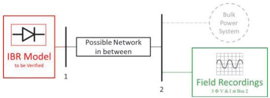  
Figure 1. IBR EMT Playback Simulation Setup

Compared with simulating the disturbance in an EMT model, the playback approach has several advantages: (1) There is no need to dispatch and simulate the whole system, because the rest of the system is replaced by actual measurements. (2) There is no need to replicate the fault characteristics, since the fault is also captured by the measurements. (3) The simulation setup is simple. (4) The results are straightforward to interpret. Any discrepancy between the playback results and the measured waveforms indicates deficiencies in the model.

There are several things to keep in mind for achieving a successful EMT playback simulation. (1) Using Point-on-Wave (POW) or similar high sample-rate data as the playback signal helps capture the details during dynamics. (2) Meters should be correctly configured in the EMT simulation environment. For example, the PSCAD multimeter's RMS voltage and current measurement mode should be set to 'analog' and the smoothing time constant should be set to '0 [s], so that no filtering is applied. (3) The control modes, e.g., voltage and power set points, Q control mode, etc., should be set to the same as in the field.

# B. IBR Model Ramp-up/Initialization Technique

An IBR EMT model usually needs a few seconds to ramp up/initialize before it reaches a steady state. Fig. 2 gives an example. This specific model takes more than 1 second to ramp up, while others may take longer time. Since the duration of pre-event waveform in POW recordings is typically less than 1s, as shown in Fig. 3, the IBR model should be properly ramped up and stabilized at its steady state before the playback process begins.

This work proposes two ramp-up techniques. The first one is named "synchroscope". It uses another set of ideal three-phase voltage sources for the ramp-up period, and then switches to the playback voltage source once the IBR model reaches a steady state. The voltage magnitude and phase angle of the ramp-up voltage source should match those of the playback voltage source to ensure a smooth transition at the time of switching. This process mimics the generator synchronization, and hence the name. Fig. 4 shows the setup for the synchroscope method in PSCAD.

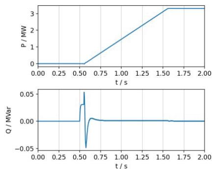  
Figure 2. Example IBR EMT model power output during the ramp-up period.

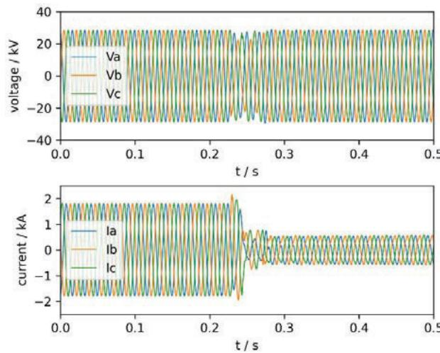  
Figure 3. Example POW recording. The pre-event segment is only 0.23s.

The second proposed ramp-up technique is "waveform extension". This method adds a piece of ideal voltage waveform data at the beginning of the POW data and uses it to ramp up the IBR model. The extended waveform's magnitude and phase angle are determined by matching those at the beginning of the POW data. Fig. 5 illustrates the idea of waveform extension. The simulation setup is the same as the basic playback, except that the voltage signals used here are extended.

The time needed for the IBR model to ramp up can be determined by referring to the documentation of the model or by running a separate simulation.

For either technique, the initial voltage magnitude and phase angle need to be determined. The method we used is given by equations (1) and (2).

$$
| V | = \sqrt {2} \times R M S (n \text {c y c l e s o f w a v e f o r m}), \tag {1}
$$

where $n$ is an integer.

$$
\angle V = \arcsin \left(\frac {\bar {v} _ {0}}{| V |}\right), \text {w h e r e} \bar {v} _ {0} \in \left[ - | V |, | V | \right]. \tag {2}
$$

Equation (1) determines the voltage magnitude using RMS value, which helps mitigate the influence of measurement noise because it takes the average over a segment of the waveform. Equation (2) determines the initial phase angle

using the arcsine function, where $\overline{\nu}_0$ is the initial voltage measurement clamped by $[-|\mathrm{V}|, |\mathrm{V}|]$ . An assumption here is that the waveforms are sinusoidal or near sinusoidal. This method works well for voltage waveforms from the transmission system, because they are typically relatively balanced and not severely distorted by harmonics or other factors. This is also one of the reasons why voltage playback is often chosen over current playback, since current waveforms are usually noticeably distorted. When dealing with distorted waveforms, for example the one shown in Fig. 6, the base frequency component will need to be extracted first before applying this method.

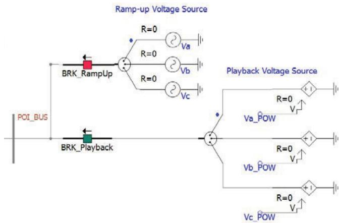

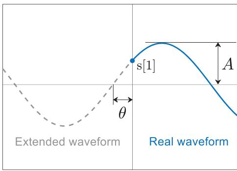  
Figure 4. "Synchroscope" ramp-up technique setup in PSCAD.

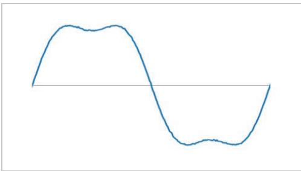  
Figure 5. Illustration of the "waveform extension" ramp-up technique.   
Figure 6. An example of a non-sinusoidal or severely distorted waveform.

The performance of the two ramp-up techniques was also compared, with the results shown in Fig. 7. These measurements are taken at the POI bus of the IBR facility. The synchoscope technique leads to a larger disturbance

following the switching, while both methods can take the model to a steady state.

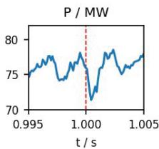

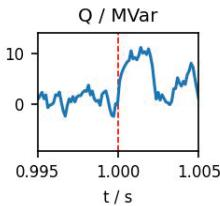

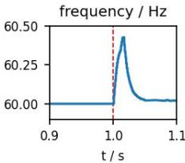

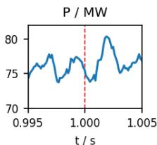

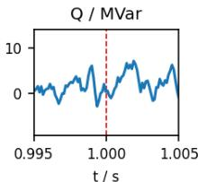

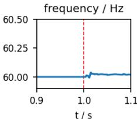  
Figure 7. Performance comparison between the two ramp-up techniques: synchroscope (upper) and waveform extension (lower). Real data playback begins at 1s.

Each of the two ramp-up techniques has its advantages. With the breaker operation, the synchroscope method makes the switching visible. Therefore, it is easier to differentiate between real and generated data. The waveform extension method has a simpler simulation circuit setup, and the transition from generated data to real recording is smoother.

# C. Initialization of the IBR Terminal Bus

In most cases, the available field measurements are taken from the POI bus, which is usually not the terminal bus of the IBR facility. However, initial set points for the IBR model, e.g., voltage, real and reactive power, are required to bring the model to a proper steady state. Since the playback subsystem is a simple network, a power flow solution is sufficient to determine these set points.

First, the voltage and real/reactive power at the POI bus are calculated from the beginning part of the POW field measurement data. Second, a positive sequence model containing the IBR facility up to the POI bus is constructed. The IBR terminal bus is set as the slack bus. Then an equivalent generator is placed at the POI bus to represent the rest of the bulk power system, with its voltage and real/reactive power output set to the calculated values from the first step. Finally, the voltage and power set points of the IBR model can be obtained by solving the power flow. Other controls should be set to be the same as in the field during the event.

# III. PSCAD PLAYBACK MODULE AND GUI TOOL

ISO-NE has developed a PSCAD playback module. Fig. 8 shows the icon of the playback module. Users simply need to connect it to the node where the field data are measured. This module also measures the playback results and displays them together with the recordings automatically, allowing for an easy comparison. The displayed data include three-phase instantaneous voltage and current, real and reactive power, and RMS voltage and current. Any number of playback modules can be used in one simulation project.

ISO-NE also developed a playback GUI tool with Python to automate the process, as shown in Fig. 9. Users can enter all the parameters and operate the whole process through this GUI. The program will interact with PSSE and PSCAD accordingly. The results with comparison plots will be saved in the specified folder. This tool not only speeds up the whole process, but also makes playback studies more accessible to people who are not so familiar with those simulation platforms.

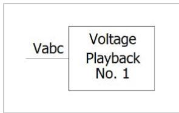  
Figure 8. The PSCAD playback module developed at ISO-NE.

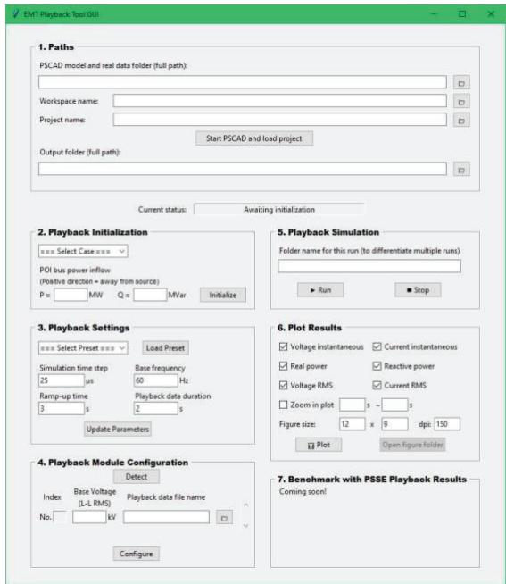  
Figure 9. The IBR EMT playback GUI developed at ISO-NE.

# IV. CASE STUDY

# A. Playback Validity Verification, using Simulated Data

A small system with an IBR and some network was used to verify the validity of the playback method and the proposed setup. A three-phase-to-ground fault was applied on a transmission line near the IBR facility. Voltage and power flow at the POI bus were recorded. The voltage was then played back to a subsystem that only contained the IBR up to its POI, i.e., the proposed playback setup. The IBR's response was collected for comparison. As expected, the playback results exactly replicated the recordings, as shown in Fig. 10, which validates the EMT playback approach in general and the proposed implementation in specific.

# B. Actual Disturbance Event, using Field Data

The subject IBR was a $\sim 80$ MW solar power plant in the ISO-NE territory. Fig. 11 provides a one-line diagram of the facility. A bus fault in a substation a few buses away caused a

voltage dip and the subject plant reduced its production to 20 MW. The plant took $\sim 50$ seconds to slowly get back to its full output capacity. The disturbance was captured by a Digital Fault Recorder (DFR) located at the POI bus (Bus 2) of the solar plant. The black squares in Fig. 11 show where the field data were available. The data included three-phase instantaneous voltage and current, as shown in Fig. 12. The duration of the data was 2s, with a sample rate of $8000\mathrm{Hz}$ . The voltage dip started at 0.23s and lasted for 0.05s.

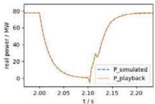

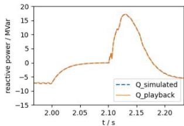  
Figure 10. EMT playback validity verification, real power (left) and reactive power (right) output of the IBR model.

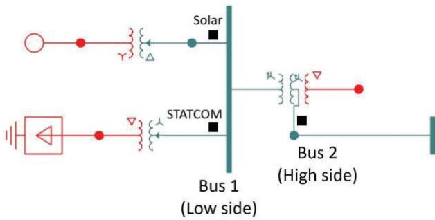  
Figure 11. One-line diagram of the solar generation facility.

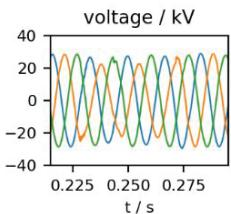

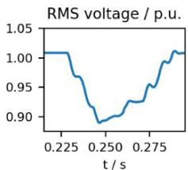

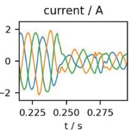  
Figure 12. Voltage and current recordings from the voltage dip event.

# 1) Plain Playback: Using the Original Model

First, the original model provided by the GO was used for the playback study, with no parameter changed, and hence the name "plain playback". This is the usual process followed at ISO-NE, since the models are provided by GOs and ISO-NE's goal is to validate the models. Figs. 13-15 show that the model quickly recovered from the fault, which is not the case in the field recordings. While not an ideal outcome, this is not entirely surprising. Modeling deficiency has been stressed in several NERC event reports because IBR facilities drop production or trip unexpectedly quite often during disturbance events [7] [8].

In this specific model, the following phenomena were not properly reflected: (1) the real power fluctuation at the beginning of the voltage dip; (2) the current drop, real power drop, and reactive power increase in the latter part of the

event; (3) the slow recovery seen in both current and real power. On the whole, the original GO model does not accurately reflect the actual protection, recovery logic, and controls during this voltage dip event.

Following ISO-NE's policy, upon identifying the discrepancy, a written response was sent to the GO. ISO does not engage in parameter tuning for model fitting. However, for demonstration and exploration purposes, a "flavored" playback was also performed in this study, to show how close the playback results can get to the real event recordings. Several model parameters and controls were tuned to fit the model to the field recordings.

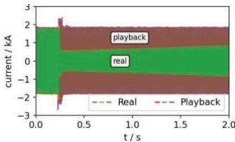

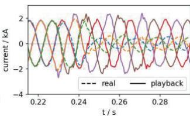  
Figure 13. The current output of the IBR from plain playback.

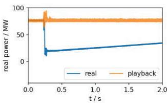

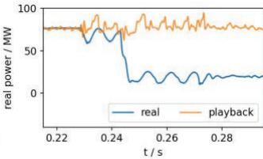  
Figure 14. The real power output of the IBR from plain playback.

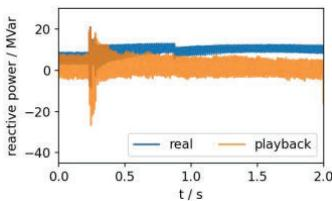

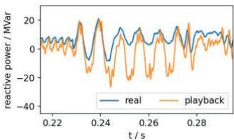  
Figure 15. The reactive power output of the IBR from plain playback.

# 2) Flavored Playback: Original Model plus Hypothetic Parameters and Controls

Table I gives a list of parameters and controls that were tuned. A combination of these settings can help better replicate the event, although may not necessarily reflect the settings used in reality.

TABLE I. IBR MODEL PARAMETERS AND CONTROLS TUNED/MODULATED   

<table><tr><td rowspan="2">Inverter</td><td>Control Mode
PF control, Q control</td></tr><tr><td>Number of Inverters</td></tr><tr><td rowspan="3">PPC
(Power Plant Control)</td><td>Control Mode
Q control, V control</td></tr><tr><td>Pref</td></tr><tr><td>Qref</td></tr></table>

As shown in Figs. 16-18, the flavored playback achieved a closer match to the real data. The phenomena not properly reflected in the plain playback are now better reflected.

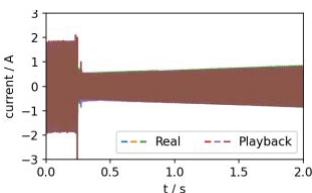

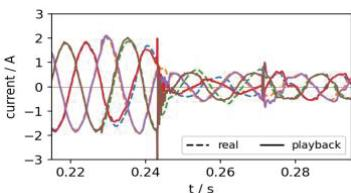  
Figure 16. The current output of the IBR from flavored playback.

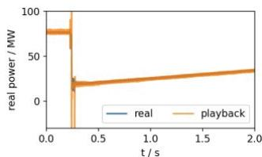

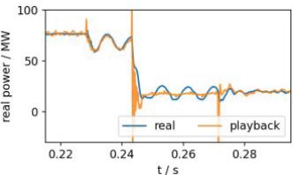  
Figure 17. The real power output of the IBR from flavored playback.

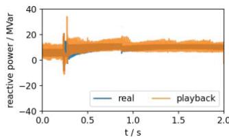

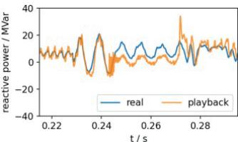  
Figure 18. The reactive power output of the IBR from flavored playback.

# V. CONCLUSION

This study proposes a full EMT model verification solution. It can help verify the EMT models' accuracy using playback simulation and field-recorded data during grid disturbance events. Two key techniques were proposed to facilitate this playback process. The novel ramp-up technique solves the initialization issue of the IBR model. The IBR terminal bus initialization technique provides the set points of the IBR model. The EMT playback solution and the setup, including the proposed two key techniques, were first verified using simulated data and then used to study the performance of an IBR during a real system disturbance event. The results show that the playback approach is efficient and effective for IBR EMT model verification.

# REFERENCES

[1] P. Pourbeik, N. Etzel, S. Wang, "Model Validation of Large Wind Power Plants Through Field Testing," IEEE Transactions on Sustainable Energy, Vol. 9, Issue 3, pp. 1212-1219, July 2018.   
[2] MOD-026-2 (draft), NERC, October 2023.   
[3] IEEE 2800-2022, IEEE SA, February 2022.   
[4] M. Wu, W. Huang, F. Q. Zhang, X. Luo, S. Maslennikov and E. Litvinov, "Power Plant Model Verification at ISO New England," 2017 IEEE Power & Energy Society General Meeting.   
[5] Y. Cheng, M. Podlaski, J. Schmall, S. -H. F. Huang and M. Khan, "ERCOT PSCAD Model Review Platform Development and Performance Comparison with PSS/e Model," 2020 IEEE Power & Energy Society General Meeting.   
[6] X. Wang, S.H. Huang, J. Schmall, J. Conto, “A Python Based EMT Model Quality Testing Tool,” 2021 IEEE PES General Meeting.   
[7] "Multiple Solar PV Disturbances in CAISO," NERC, April 2022.   
[8] “2022 Odessa Disturbance Report,” NERC, December 2022.