# On-site measurement of the hysteresis curve for improved modelling of transformers

J.L. Vel´asquez a,* , K. Vennemann b , P. Wischtukat a

a Hubert Gobel ¨ GmbH, DE, 59199 Germany   
b Amprion GmbH, DE, 70173 Germany

# A R T I C L E I N F O

Keywords:

Electromagnetic transients

Inrush currents

Harmonics

Hysteresis

Saturation

# A B S T R A C T

Transient simulations are usually carried out to analyse the behaviour of control and protection systems when performing switching action in power transformers. For this reason, the saturation curve and/or the hysteresis curve of the transformer must be properly modelled. However, in most of the cases the real saturation/hysteresis curve of a transformer is not known, because such measurements are not carried out as part of the factory tests of a transformer. This article describes a method to measure the hysteresis- and saturation curve with a portable measuring system on-site. The added value of the measured saturation curve is illustrated through an example, in which a single-phase low voltage transformer is modelled. This example shows the added value of a measurement-based modelling. An additional example illustrates measurement of the hysteresis curve of 350 MVA, 420/110 kV power transformers.

# 1. Introduction

For the analysis of the behaviour of protection and control systems, as well as for an evaluation of the transient stress of equipment in a plant, precise knowledge of the processes occurring during grid events (e.g. switching of circuit breakers, faults) is of particular interest. Against this background, usually simulation studies in EMT domain are carried out. However, the value of a simulation study depends to a large extent on the quality of the modelling of the equipment and the correct representation of the physical phenomena that are of interest.

Power transformers can cause high magnetising (inrush) currents when they are connected to the grid. These inrush currents are influenced by the switch-on time, the non-linearity of the saturation characteristic and the residual remanence of the iron core and exhibit characteristic harmonics.

Switching operations of transformers can thus excite resonances in the power system (e.g., in case of high voltage cables in the in electrical proximity) that have a negative effect on the operation of a system (stress on equipment or malfunction of protection and control systems).

For a realistic simulation of these effects, it is consequently important to model the hysteresis and saturation characteristic of the transformer as realistic as possible. In contrast to current and voltage transformers, the measurement of the saturation characteristic of a transformer is in

general not part of the factory tests. As a result, a simplified saturation curve based on factory test reports (no-load measurement) is often derived and used for modelling in the practice. Based on the results of the short-circuit impedance and measurement of the no-load losses, the saturation curve is usually estimated. In [1] it is explained how the saturation characteristic can be determined in the saturated, linear range depending on the transformer type. In addition, the manufacturer often carries out no-load loss measurements at 90%, 100% and 110% of the rated voltage of the transformer. These measured values are often used to estimate a simplified saturation characteristic based on effective values (VRMS, IRMS) [2]. For simulation studies in the EMT domain, however, the RMS values must be converted into instantaneous values. For this purpose, most EMT programs have specific routines that perform the corresponding conversion [3,4]. An exact calculation of inrush currents is not always necessary, i.e., depending on the study purpose a rough estimate might sometimes be sufficient. Nevertheless, for some applications, an exact calculation of the inrush currents of transformers can be of particular interest. This does not only include an exact calculation of the peak values, but also a correct representation of the harmonic content of inrush currents. In [5], for example, it is pointed out that the inrush of a transformer after a fault in an offshore HVDC grid can endanger both the stable operation of the HVDC grid and the stable operation of wind turbines.

In the literature, there are various studies on transformer modelling for the calculation of inrush currents. In [2] the inrush currents calculated using different transformer models were compared with each other. It is concluded that an exact modelling of the saturation characteristic is crucial to validate the model against measurements.

Since the saturation curve is usually not measured either at factory or on-site, research works in this direction are needed. Different publications dealing with the determination of saturation curves from measured data can be found in the literature. Some of these publications focus on the derivation of saturation curves from measured data during energization transients. In [6], for example, a procedure is described where the energization of the transformer is detected with the help of a Kalman filter. Subsequently, the saturation curve is calculated from the measured waveforms.

Another method is to carry out a measurement with alternating voltage (50 Hz). Depending on the application for which the transformer was designed, a powerful voltage source with a relatively large amplitude must be provided for this measurement. This should ideally be well above the nominal voltage (1.2 - 1.4 p.u.) of the respective transformer in order to take the saturation effects into account. For power transformers at high or extra-high voltage levels, this is sometimes difficult to realise, especially for on-site measurements.

To overcome this disadvantage, another measuring method can be used. This method is based on a voltage source with variable or reduced frequency to reduce the required voltage amplitude. By reducing the frequency, it is possible to evaluate the saturation range despite the low test voltages. This method is $\mathrm { e . } \mathrm { g . }$ , used in the model-based testing of transformers [7] and applicable for low and medium voltage power transformers. However, the applicability for transformers in high and extra-high voltage is limited, because extremely low frequencies are required to drive the core into saturation, which in turn leads to a very long testing time. This drawback can be overcome with the performance of measurements with direct current (DC). In the references [8–10] the use of DC excitation for the determination of the saturation characteristic of transformers are addressed. In [8] the main idea and advantage of a DC- excitation is described. It is also highlighted that the measurement is associated with some measurement and processing challenges, which affect the accuracy of a measurement. In [9] a method is proposed, which allows the determination of the saturation and hysteresis curves of multilimb power transformers. Hall effect sensors are placed in each limb of the transformer. These sensors are fixed with ferrous resin to the core. Through a procedure described in the paper, the hysteresis curve of each limb can be determined. The approach itself is promising. However, the measurement setup proposed with the use of hall sensors attached to the core are not applicable for on-site applications. The use of DC excitation for measurement was also proposed in [10]. The foundations as well as the test setups behind the use of a DC excitation is described. The use of the proposed method is illustrated by a measurement of a 25 MVA transformer. As DC excitation a 400 A gasoline-power DC welding generator was used.

It can be summarized that methods proposed in [8] and in [10] are suitable for an on-site measurement. Nevertheless, these methods involve the use of measurement systems which must be carefully designed and used to allow a safe and accurate measurement on-site.

The method proposed in this paper is based on the same foundations as presented in [8] and [10]. The main contribution of this paper concerns use of accurate and safe measuring devices. Today there are a set of very accurate and safe testing instruments in the market which allow the measurement of the DC winding resistance of transformers. In this paper the use of such instrument devices is proposed also for the measurement of the hysteresis curve without any need for additional instruments. As a result, an accurate and above all safe measurement can be carried out in a very short time on-site.

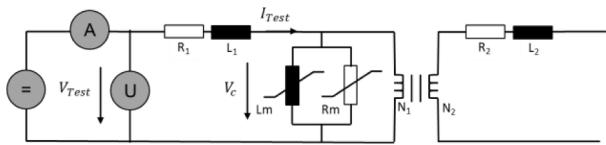  
Fig. 1. Setup for measurement of the hysteresis curve with DC.

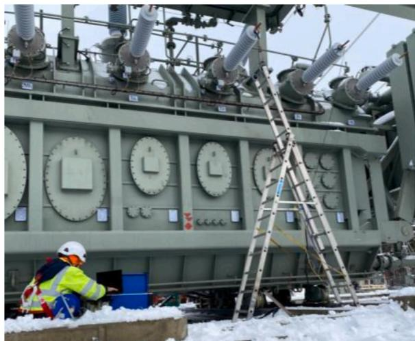  
Fig. 2. Example of an on-site measurement of the hysteresis curve.

# 2. Description of the measurement method

The designed measuring method is based on a measurement with DC quantities. In this manner, the amplitude of the test voltage as well as the required power for performing the measurement can be significantly reduced. Thus, it is possible to determine the saturation characteristic and hysteresis curve with a compact and portable measuring device, even for high-voltage and extra-high-voltage transformers.

When measuring the hysteresis curve, the transformer is measured in no-load operation and must therefore be completely disconnected. Fig. 1 shows the T-equivalent circuit diagram of a transformer with the current and voltage measurement required to record the hysteresis curve.

The longitudinal elements $R _ { 1 }$ and $L _ { 1 }$ are usually determined from the short-circuit measurement performed during the factory test. Thus, with the help of the measured voltage $U _ { T e s t } ,$ the measured current $I _ { T e s t }$ and the longitudinal elements $R _ { 1 }$ and $L _ { 1 } ,$ the voltage $V _ { C }$ applied to the core inductance $L _ { m }$ can be determined. Using the induction law in (1), the flux linkage Ψ through the iron core can thus be calculated. Assuming a sinusoidal excitation (e.g., 50 Hz), the flux linkage Ψ can be represented according to (2).

$$
\psi = \psi_ {R} + \int V _ {C} d t \tag {1}
$$

$$
\underline {{\psi}} = \psi_ {R} + j \frac {V _ {C}}{\omega} \tag {2}
$$

$\psi _ { R }$ represents the residual remanence of the iron core, which can be removed by demagnetizing the core. From (2) can be concluded that by reducing the angular frequency $\omega ,$ the voltage $V _ { C } ,$ and thus also the measuring voltage $V _ { T e s t }$ can be reduced, while the flux linkage Ψ remains the same.

To determine the hysteresis curve according to the DC-method a portable device, which is usually used for on-site testing of power transformer, is used. Fig. 2 shows a typical measurement situation. A special software is used to an automatic and safe execution of the test. The user can set the wished test current $( \boldsymbol { \mathrm { e . g . } }$ , 30 A) as well as the maximum DC voltage to be applied. For reaching the test current

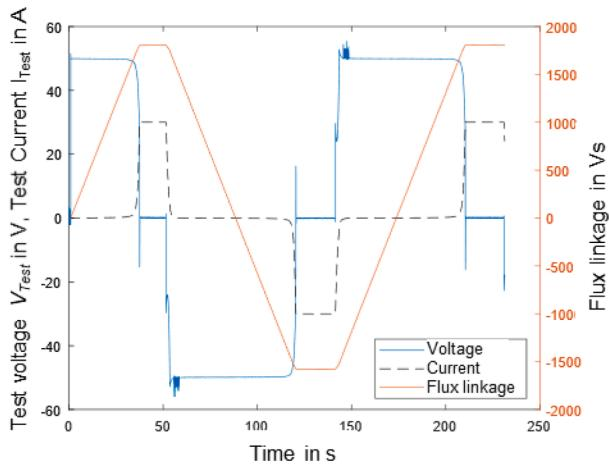  
Fig. 3. Waveforms of voltage and current and the resulting flux linkage.

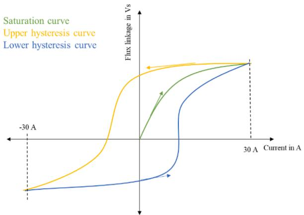  
Fig. 4. Representation of the measured hysteresis curve in three steps.

setpoint, the test device applies a DC voltage between the terminals of the transformer. Fig. 3 shows the voltage and current waveforms of a measurement where the test current was set to 30 A and the maximum DC voltage was set to 50 V.

The measured waveforms can be divided into three steps. In the first step at positive voltage (+50 V) is applied and the saturation characteristic is recorded, provided the transformer has been previously demagnetized. In the second step the polarity of the DC voltage is changed to − 50 V. This leads to a polarity reversal of the flux linkage Ψ according to the upper hysteresis curve of the core. In the third step, the polarity is reversed again to a positive voltage (+50 V) and from this condition the lower hysteresis curve is recorded. These three steps are schematically represented in Fig. 4.

From Fig. 3 it can be appreciated that the applied voltage for a very short time reaches values higher than the maximum allowed voltage (50 V). This behaviour is related to the control system of the current control system of the instrument device. It can also be observed that after applying a DC voltage the current needs some time for increasing. As soon as a DC voltage is applied, a DC current of very low amplitude flows. In Fig. 3 it seems to be that the current is zero.This is due to the scaling of the axis. Only after reaching saturation the current jumps to the set test current (30 A in this case).

By integrating the voltage $\mathrm { U _ { c } }$ over time, the flux linkage Ψ can be calculated according to (1). The measurement time can be influenced by the measurement voltage that is set by the user. According to (1), the measuring voltage $\mathrm { V _ { c } }$ must be increased in order to reach the same flux linkage Ψ in a shorter measurement time. The signals are sampled at 10 kHz. In the areas of the waveforms between the polarity reversal, where the voltage is $\mathrm { V } _ { \mathrm { c } } { = } 0 \mathrm { V }$ and the current change $\mathrm { ( d I _ { T e s t } ) / d t }$ is close to zero,

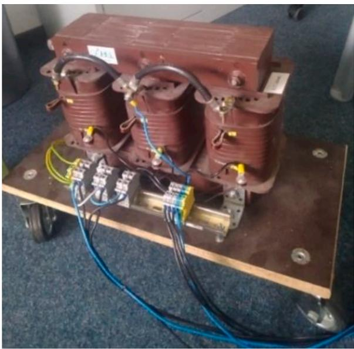  
Fig. 5. Low voltage transformer with the vector group Ynyn6.

the measuring software repeatedly calculates the winding resistance ${ \mathrm { R } } _ { 1 }$ with a frequency of 1 Hz. As soon as the change of the winding resistance falls below a threshold value given by the user, the polarity reversal takes place, and the next step starts. It must be highlighted that the measured winding resistance is constantly changing during the saturation process of the transformer. Therefore, it is important to assure that a polarity reversal is carried out, only when a fully saturation was achieved. The setting of the threshold value also influences the measuring time. The smaller the threshold value is set, the longer the measuring time is. A typical measurement time for a 110 kV transformer is around 5 min.

As already mentioned, the method allows the measurement of both the saturation characteristic and the hysteresis curve. For modelling applications, it is recommended to demagnetize the transformer before the measurement to be able to record the saturation characteristic. Many EMT programs work with the saturation characteristic. If a demagnetization is not carried out, only the hysteresis curve can be recorded.

The measurement can by carried out from any side of the transformer (primary side, secondary side, or tertiary side). By using (5) it is possible to convert a hysteresis curve measured from the secondary side to the primary side of the transformer, where a represents the turns ratio.

$$
\phi = \frac {\psi}{N} \tag {3}
$$

$$
\frac {\psi_ {\text {p r i m a r y}}}{N _ {\text {p r i m a r y}}} = \frac {\psi_ {\text {s e c o n d a r y}}}{N _ {\text {s e c o n d a r y}}} \tag {4}
$$

$$
\psi_ {\text {p r i m a r y}} = a \cdot \psi_ {\text {s e c o n d a r y}} \tag {5}
$$

For the derivation of (5) it was assumed that $\Psi _ { \mathrm { p r i m a r y } } { = } \Psi _ { \mathrm { s e c o n d a r y } } .$ . This assumption applies only to a limited extent. Due to the different winding arrangement of the primary and secondary side to the core, the influence on the magnetization is additionally dependant on other factors. Therefore, it is recommended to measure the saturation characteristics of all voltage levels and all phases of the transformer. The validity of a transformation of the measured curves to the other voltage levels, to reduce the number of measurements, is currently still under investigation.

# 3. Measurement-based parametrization of transformer models

In this section the use of the measurement-based parametrization of transformer models is illustrated. The main focus lies on the added value

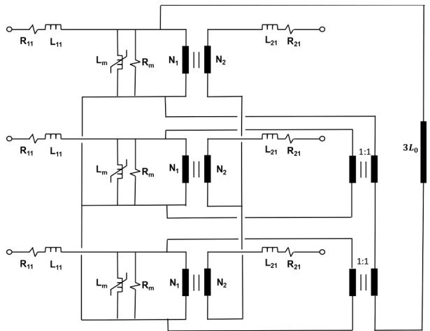  
Fig. 6. Three-phase equivalent circuit of the STC-model of a three-leg transformer.

Table 1 Parameter determination.   

<table><tr><td>Measurement</td><td>Parameter</td></tr><tr><td>Turns ratio</td><td>N1/N2</td></tr><tr><td>DC-winding resistance</td><td>R11, R21 (DC values)</td></tr><tr><td>Short-circuit impedance</td><td>R11, R21, L11, L21</td></tr><tr><td>Saturation curve (AC, rms)</td><td>Lm, Rm</td></tr><tr><td>Saturation curve (DC, peak)</td><td>Lm</td></tr><tr><td>Zero sequence impedance</td><td>3L0</td></tr></table>

Table 2 Results of parameter determination.   

<table><tr><td>Test</td><td>Parameter</td><td>Value</td></tr><tr><td rowspan="4">Turns ratio</td><td>a-Phase U</td><td>3.408</td></tr><tr><td>a-Phase V</td><td>3.380</td></tr><tr><td>a-Phase W</td><td>3.181</td></tr><tr><td>a-average</td><td>3.323</td></tr><tr><td rowspan="4">DC-winding resistance-Primary</td><td>R11-Phase U</td><td>667.49 mΩ</td></tr><tr><td>R11-Phase V</td><td>669.99 mΩ</td></tr><tr><td>R11-Phase W</td><td>674.09 mΩ</td></tr><tr><td>R11-average</td><td>670.5 mΩ</td></tr><tr><td rowspan="4">DC-winding resistance-Secondary</td><td>R21-Phase U</td><td>45.76 mΩ</td></tr><tr><td>R21-Phase V</td><td>46.07 mΩ</td></tr><tr><td>R21-Phase W</td><td>43.50 mΩ</td></tr><tr><td>R21-average</td><td>45.11 mΩ</td></tr><tr><td rowspan="4">AC winding resistance (real part of the short-circuit impedance)</td><td>R11+R21-Phase U</td><td>3.408 Ω</td></tr><tr><td>R11+R21-Phase V</td><td>3.380 Ω</td></tr><tr><td>R11+R21-Phase W</td><td>3.181 Ω</td></tr><tr><td>R11+R21-average</td><td>3.323 Ω</td></tr><tr><td rowspan="4">Stray reactance (imaginary part of the short-circuit impedance)</td><td>X11+X21-Phase U</td><td>952.720 mΩ</td></tr><tr><td>X11+X21-Phase V</td><td>939.655 mΩ</td></tr><tr><td>X11+X21-Phase W</td><td>957.163 mΩ</td></tr><tr><td>X11+X21-average</td><td>949.8 mΩ</td></tr><tr><td rowspan="2">Saturation curve (AC, rms)</td><td>Lm</td><td>See Fig. 8</td></tr><tr><td>Rm(average)</td><td>6200 Ω</td></tr><tr><td>Saturation curve (DC, peak)</td><td>Im</td><td>See Fig. 9</td></tr><tr><td rowspan="3">Zero sequence impedance</td><td>Z0</td><td>3.63 Ω</td></tr><tr><td>3L0</td><td>11.555 mH</td></tr><tr><td>R0</td><td>4.596 in kV/ H</td></tr></table>

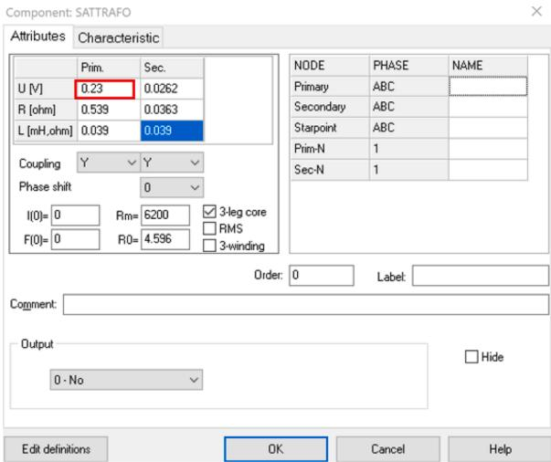  
Fig. 7. Screenshot of the parametrization of the STC-model in ATP-EMTP.

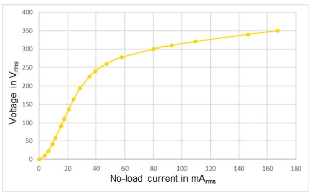  
Fig. 8. Saturation curve of the phase V measured according to the AC-method (rms-values).

of the measurement of the saturation/hysteresis curve.

# 3.1. Example 1: low voltage transformer

In this example, a low voltage transformer is considered. It has the advantage that different operating conditions of this transformer can be easily reproduced in the laboratory. A picture of the transformer is shown in Fig. 5. A measurement-based parametrization was carried out, to allow an accurate modelling in the simulation tool ATP-EMTP. In this case the STC-model (Saturable-Transformer-Component), which is described in [3] was selected. The three-phase equivalent circuit of the model is depicted in Fig. 6. When modelling a 3-leg transformer, the coupling between phases must be considered, to allow a valid representation of the zero-sequence system. In the STC-model the zero-sequence is represented by the inductance 3L0 together with two fictive 1:1 transformers, as shown in Fig. 6.

The set of measurements summarized in Table 1 were carried out with the aim of determining the parameters of the equivalent circuit of the transformer. It shall be highlighted, that according to the STC-model only the saturation curve is required. In this case, the hysteresis behaviour is neglected. For illustrating the difference between a measured saturation curve based on the AC method on the one hand and the DC method on the other hand, both measurement were carried out and compared a summary of the results of the parameter determination is given in Table 2.

In the ATP "Rule Book", on page 62 of chapter IV [11], where the model is described, it is pointed out that the calculation of R must be done according to (6). U represents the “rated equivalent phase

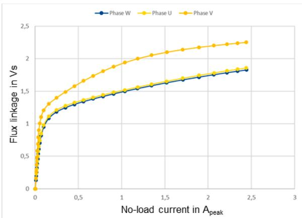  
Fig. 9. Saturation curve of all three phases measured according to the DCmethod (peak-values). For each phase against neutral point a curve was measured.

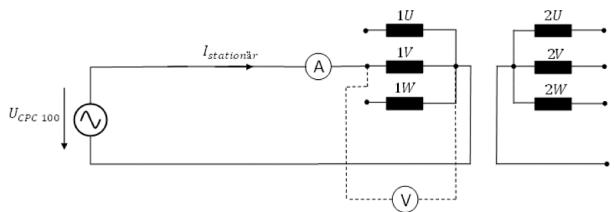  
Fig. 10. Measurement Setup for validation under 1-phase condition.

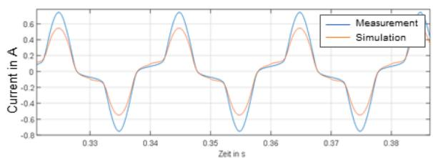

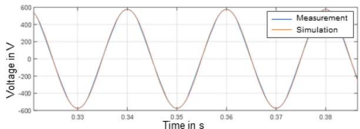  
Fig. 11. Comparison between measurement and simulation for validation of the modelling based on the saturation curve measured according to the AC-method.

voltage”, while $\mathrm { L } _ { 0 }$ corresponds to the single-phase value of the zero-sequence inductance. It must be considered, that U corresponds to the rated primary voltage to be entered in the model (see Fig. 7). This value must be entered in kV and not in V, as suggested by the input masque shown in Fig. 7.

$$
R _ {0} = \frac {U _ {R A T} {} ^ {2}}{3 L _ {0}} \tag {6}
$$

$$
L _ {0} = \frac {\operatorname {I m} \left\{\underline {{Z}} _ {0} \right\}}{2 \pi 5 0} \tag {7}
$$

Fig. 8 shows the saturation curve measured from the primary side according to the AC-method. The results are shown only for the phase V. These results are only used for a comparison between a parametrization

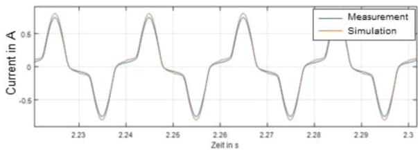

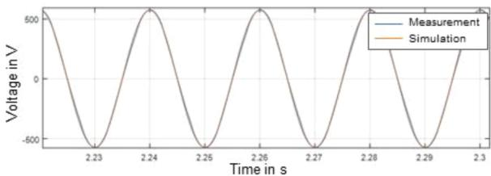  
Fig. 12. Comparison between measurement and simulation for validation of the modelling based on the saturation curve measured according to the DC-method.

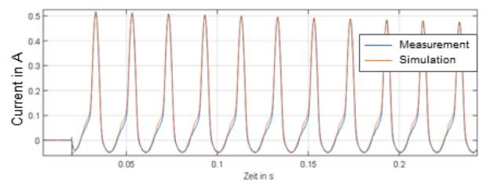

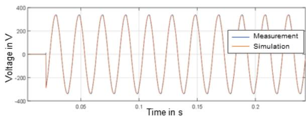  
Fig. 13. Comparison between measurement and simulation of an inrush transient.

based on the AC-method (rms values) and the parametrization based on the DC-method (peak values). Such comparison was carried out for the phase V. Fig. 9 shows the saturation curves of all three phases measured from the primary side of the transformer according to the DC-method.

For a comparison of simulations based on the AC and DC methods, first a real measurement was carried out under stationary conditions. Subsequently, the measurement results were compared to the simulation results for validation purposes. Measurements were carried out with a SIRIUS-Dewesoft recording device. The measurement setup is illustrated in Fig. 10. The validation results are reflected in Fig. 11 (for the ACmethod) and Fig. 12 (for the DC-method). As can be observed in Fig. 11, the parametrization based on the AC-method leads to considerable deviations between model and simulation, while the parametrization based on the DC-method gives a much better congruity between model and measurement. The deviations obtained by the parametrization with the AC-method can be associated to the internal calculations carried out by the ATP-EMTP (e.g., SATURA routine) for converting the measured effective values (rms) into instantaneous values. The results illustrate the added value of measuring directly the instantaneous values of the saturation curve with the DC-method.

For a further validation of the DC-method, an inrush transient was measured, and the simulation results were compared to the simulation, as shown in Fig. 13. A single-phase energization (Phase V) was carried out. The deviations between the model and the simulation are

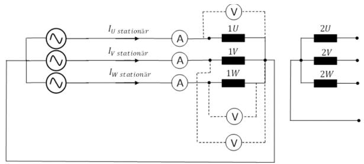  
Fig. 14. Measurement Setup for validation under 3-phase condition.

negligible, confirming again the high accuracy that can be achieved by a modelling of the saturation curve based on the DC-method.

The previous simulation results based on single phase conditions has shown a very good congruity between measurement and simulation, when the saturation curve is based on the DC-method. Nevertheless, it shall be kept in mind, that for a proper modelling of a three-phase transformer, the overlapping effects (magnetic coupling) of flux in the core must be considered. The magnetic coupling between phases is nevertheless not foreseen when modelling a transformer according to the classical T-equivalent model. To illustrate the modelling inaccuracy introduced with the use of the T-equivalent modelling under three-phase conditions, a real measurement was carried out according to the measurement setup shown in Fig. 14. The measurement and simulation results are presented in Figs. 15 and 16, correspondly.

As additional validation check, a 3-phase energization was measured, to validate the accuracy of the model under transient conditions. The measurement results are depicted in Fig. 17, while the simulation results are shown in Fig. 18. Despite of the inaccuracy of the modelling based on the T-equivalent circuit, a good congruity between the measurement and the model have been observed. Particularly the peak value and the decay rate of the inrush current are very similar. Only the harmonic content of the currents, particularly of the phases V and W differs.

# 3.2. Example 2: high voltage transformer

Fig. 19 shows the measured hysteresis curve of two 350 MVA, 420/ 110 kV transmission transformers. The legend indicates the manufacturing year of the transformers. The measurement setup as well as the measurement settings used for the measurements are the same as in the example shown in Fig. $\textrm { 3 } ( \mathrm { I _ { T e s t } } { = } 3 0 \textrm { A } , \ \mathrm { V _ { T e s t } }$ max=50 V). The experience of the authors indicates that a $\mathrm { I } _ { \mathrm { T e s t } } { = } 3 0 \mathrm { A }$ and $\mathrm { { U } } _ { \mathrm { { T e s t } } }$ max=50 V is sufficient for reaching the saturation area of power transformers. In case that these settings lead to extremely short measuring times, the setting of $\mathrm { \Delta V _ { T e s t } }$ max can be reduced (for example to 20 V).

# 4. Conclusions

Using a three-phase laboratory transformer, both single-phase and three-phase measurements were performed under steady-state and transient conditions. These measurements were used to validate the simulation models defined in this work.

The parameterization of the models is based on an electrical measurement of the transformer. A major focus was placed on modelling the magnetizing inductance as accurately as possible. This was done by measuring the saturation characteristic on the transformer.

The example 1 illustrated the added value of a transformer modelling using the measured saturation curve. It was demonstrated how very accurate simulation results could be obtained using the saturation characteristic measured with the DC-method. It was found that modelling the magnetizing inductance using an AC saturation curve with RMS values resulted in appreciable inaccuracies. The inaccuracy is on the one hand related to the conversion of rms values to peak values and on the

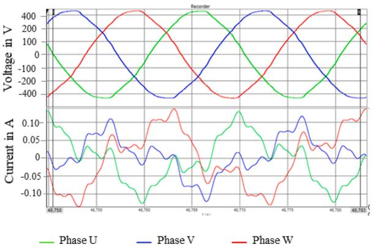  
Fig. 15. Measurement results under steady state 3-phase condition (no-load).

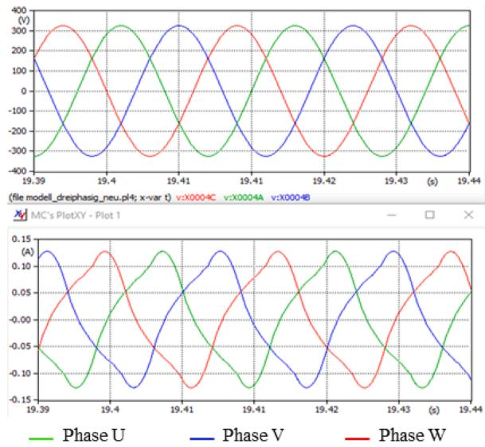  
Fig. 16. Simulation results under steady state 3-phase condition (no-load).

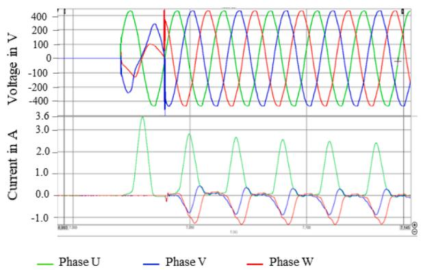  
Fig. 17. Measurement results under 3-phase energization.

other hand related to the current range of the measurement of the saturation curve. With the AC-method only a limited current range is usually measured. Therefore, the simulation tools must perform extrapolations, which lead to inaccuracies.

Although, a good match between measurement and simulation could be achieved in the laboratory tests, it shall be kept in mind that the use of the T equivalent circuit-based modelling also leads to inaccuracies. One clear limitation of the T equivalent circuit-based modelling is that the superposition of the magnetic fluxes of the three-phase system in the core cannot be correctly represented. As a result, the harmonic spectrum

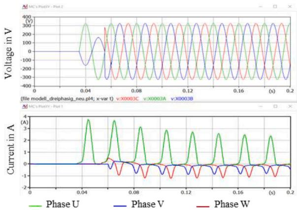  
Fig. 18. Simulation results under 3-phase energization.

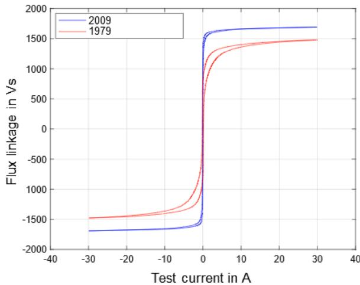  
Fig. 19. Measured Hysteresis curves of two 350 MVA, 420/110 kV Transformers.

of both no-load and inrush currents obtained from the simulation is not correct. This means that for studies where the harmonic spectrum of the currents is of interest, the accuracy of the modelling can be increased by another type of modelling approach, such as topology-based models.

# CRediT authorship contribution statement

J. L. Velasquez ´ : Conceptualization, Methodology, Supervision, Writing - review & editing. K. Vennemann: Application, requirements, Writing - review & editing. P. Wischtukat: Performance of measurements on-site and at laboratory.

# Declaration of Competing Interest

The authors declare that they have no known competing financial interests or personal relationships that could have appeared to influence the work reported in this paper.

# Data availability

Data will be made available on request.

# References

[1] Cigr´e working 33.02, “Guidelines for representation of network elements when calculating transients”, 1990.   
[2] N. Chiesa, H.K. H.øidalen, M. Lambert, M.Martínez Duro, ´ Calculation of inrush currents –benchmarking of transformer models", in: Interna-tional Conference of Power Systems Transients (IPST2011) in Delft, the Netherlands June 14-17, 2011.   
[3] J.A. M.artinez-Velasco, Power System Transients: Parameter Determination, CRC Press, Boca Raton, 2010, p. 194.   
[4] H.W. Dommel, Electromagnetic Transients Program Reference Manual (EMTP Theory Book), Bonnevile Power Administration, Portland, August 1986.   
[5] Z.S. J.oukhah, Operation of HVDC Converters For Transformer Inrush Current Reduction, Univ. Polit`ecnica de Catalunya, Barcelona, 2017. Ph.D. dissertation.   
[6] A.E. L.azzareti, et al., Modelling of the saturation curve of power transformers for electromagnetic transient programs, in: Proc. 2014 IEEE PES Transmission & Distribution Conference and Exposition – Latin America, 2014.   
[7] M. Freiburg, Testing and diagnostics of medium- and high voltage instrument transformers, Transform. Magazine 5 (4) (2018).   
[8] S. Calabro, F. Coppadoro, S. Crepaz, The measurement of the magnetization characteristics of large power transformers and reactors through dc excitation, IEEE Trans. Power Delivery 1 (Oct. 1986) 224–234.   
[9] A. Medina, et al., “Saturation and hysteresis characteristics obtained by measurements in multilimb power transformers using DC excitation”, in Proc. 2022 IEEE Power Engineering Society Winter Meeting. Conf., pp. 1389–1393.   
[10] E.P. D.ick, W. Watson, Transformer models for transient studies based on field measurements, IEEE Trans. Power Apparatus and Syst. PAS-100 (Jan. 1981) 409–419.   
[11] EMTP User Group, ATP Rule Book, 1992.