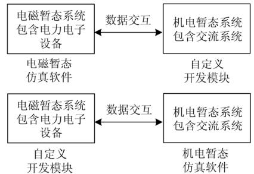
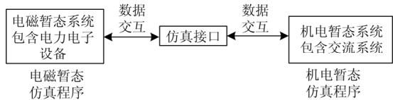
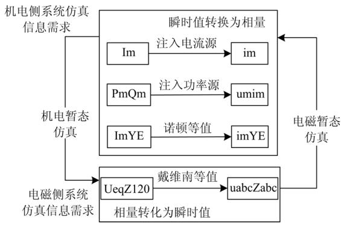
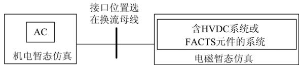
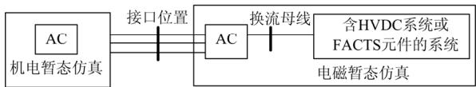

# 大规模电力电子设备接入的电力系统混合仿真接口技术综述

熊家祚 1 ，张 能 2 ，翟党国 1 ，李媛媛 1 ，刘争艳 1 ，魏建新 1

(1.西安西电电力系统有限公司，陕西 西安 710077；2.武汉大学电气工程学院，湖北 武汉 430072)

摘要：随着电网互联规模的扩大以及大量电力电子设备的接入，为更好地满足对电力电子设备接入后的复杂电力系统仿真分析的需求，采用机电暂态与电磁暂态结合的混合仿真能够很好地解决系统仿真规模、速度和精确性的问题。论述了机电-电磁暂态混合仿真技术的发展历史和现状，对现今国内外采用的混合实时仿真平台进行了归纳总结。在此基础上，就混合仿真接口技术的关键问题从等值形式、数据转换、接口位置选择和交互时序 4 个方面进行了详细讨论。论述了各个方面的内容、技术难点以及面临的主要问题。最后，提出了混合仿真技术未来可能的发展方向及相关问题。

关键词：机电暂态；电磁暂态；混合仿真；接口技术；等值模型；数据转换；交互时序

# Review of hybrid simulation interface technology for power system of large-scale power electronic equipment access

XIONG Jiazuo1 , ZHANG Neng2 , ZHAI Dangguo1 , LI Yuanyuan1 , LIU Zhengyan1 , WEI Jianxin1

(1. Xi’an XD Power Systems Co., Ltd, Xi’an 710077, China; 2. School of Electrical Engineering,

Wuhan University, Wuhan 430072, China)

Abstract: With the expansion of power grid interconnection and the access of a large number of power electronic devices, in order to fulfill the need of analysis requirements of complex power system simulation after power electronic equipment accessing, it’s shown that adopting hybrid simulation of combining electromechanical transient simulator and electromagnetic transient simulator can solve the scale, velocity and calculation precision of system simulation. The developmental history and current situation of electromechanical-electromagnetic transient hybrid simulation are discussed and the existing domestic and foreign hybrid simulation platforms are comprehensively summarized. On this basis, the interfacing technology of hybrid simulation is discussed in four aspects: equivalent model, data conversion, interfacing location selection and interaction sequence. The connotation, technological difficulties and main problems of each aspect are introduced. Finally, this paper proposes the probable development direction and relevant problems of hybrid simulation technology in future.

This work is supported by National Natural Science Foundation of China (No. 51307126).

Key words: electromechanical transient; electromagnetic transient; hybrid simulation; interface technology; equivalent model; data conversion; interaction sequence

# 0 引言

随着区域电网之间互联的增加使得电网规模变得越来越大，大量的如分布式可再生能源发电设备储能设备等电力电子设备接入到电网中，使得电网运行特性和控制特性变得非常复杂，电力系统的强

非线性特性日益突出[1]。电力系统发展的新趋势对于仿真提出了更高的要求。由于电力电子设备开关频率越来越高，从几千到几万赫兹，甚至更高。随着电力电子设备的仿真步长越来越小，而电磁暂态仿真过程一般变化很快，持续作用时间一般为毫秒级别用于分析电压电流瞬时值的变化。电磁暂态过程的响应频率能够高达几千赫兹。一般可以认为电力电子设备仿真的动态过程和电磁暂态过程基本一

样。接入了大规模电力电子设备的电力系统仿真要求在仿真过程中，既可以仿真大规模互联网络的机电暂态过程，也可以模拟局部快速变化的电力电子装置的电磁暂态过程；其次还可以准确地仿真局部电网间、大区域和局部系统的交互作用[2]。而传统的机电暂态和电磁暂态实时仿真很难同时兼顾其接入交流大电网后和交流系统的交互作用以及详细的变流器内部物理特性。传统机电暂态仿真采用准稳态模型，忽略了电力电子器件的快速动态过程，不能准确地模拟系统中局部快速变化的过程；电磁暂态仿真由于仿真速度和仿真规模的限制，很难进行全系统仿真，即使将规模较大的交流系统作等值简化处理，由于原网络失去了一些固有特性，也会降低仿真结构的准确性和精确度[3]。

机电-电磁暂态混合仿真技术兼顾了上述两种仿真方法的优点[4]，即能够对于大型电力电子器件的局部网络进行精确仿真，又可以考虑其相连的交流电网的暂态特性。因此混合仿真技术的研究成为系统仿真领域的热点问题，广大学者将其作为前端问题不断研究。混合仿真的方案基本有以下两种思路，如图1所示。

  
(a)基于自定义模块的统一软件下的混合仿真

  
(b)基于接口数据传递的跨平台混合仿真  
图 1 混合仿真的两种方案  
Fig. 1 Two schemes of hybrid simulation

第一种是在成熟的机电或电磁暂态仿真软件中开发相应的模块实现混合仿真[5]；第二种是在两种成熟仿真程序之间建立适当的接口以实现数据的转化和传递[6]。后者可以避免机电和电磁暂态软件在各自框架内建模的拘束性，更加灵活。机电-电磁暂态混合仿真的核心技术是如何正确、恰当地处理接口，所以接口技术是混合仿真成功前提[7]。本文首先总结分析了混合仿真的发展历程及现状，然后针对混合仿真接口技术问题从等值形式、数据转换方

法、接口位置的选择以及时序交互方式四个方面进行讨论。并就混合仿真未来的发展方向进行了展望。

# 混合仿真技术发展历程及现状

自 19世纪 80 年代开始，混合仿真这一课题便成为电力系统仿真分析所关注的热点问题之一。最早是由Hafferman在1981年发表了关于混合仿真的有关文章，文中利用不同的仿真程序分别对于交直流系统建模；将变流器终端母线作为接口，选择有功功率和经过FFT提取的电压基波相量作为传输变量来完成混合仿真[8-10]。这种方法综合了机电暂态仿真与电磁暂态仿真的优点在一起，成功实现了交直流系统的统一仿真。加拿大滑铁卢大学的 Reeve教授和 Adpda 教授在 1998 年又对上述混合仿真系统进一步改进，提出了原接口位置由原换流器终端母线向交流系统网络进一步延伸，这样能更好地考虑电力电子装置产生的谐波对于交流系统的影响[11]。与此同时，该方式增加了选择接口的困难程度，相应地也会增加接口母线的数目。新西兰铝业冶炼有限公司的 Anderson 提出机电侧仿真系统等值成频率相关等值阻抗接口模型，改善了接口处波形畸变的问题[12]。香港理工大学的 Chan 教授和 Snider 教授也进行了实时混合仿真的研究。文献[13-14]采用频率等值的方式，将机电暂态部分在电磁侧的接口计算模型考虑含有频率的相关量。文献[15]提出了一种新型的基于预估校正的混合仿真接口交互时序，并成功实现了混合仿真。

在国内方面，中国电科院的岳程燕于2004 年提出基于节点分裂法的电磁暂态计算方法[16]，此法的特点就是实现了电磁侧网络导纳矩阵的对称性，使得由于接口造成的电磁侧网络导纳矩阵的非对称问题得到了有效的解决；并开发了并行计算的电磁暂态仿真程序ETSDAC，成功实现了实时混合仿真[17]，但是对于交直流系统还没能实现。天津大学鄂志君等人提出将机电暂态仿真软件与成熟的电磁暂态仿真软件PSCAD/EMTDC 进行混合仿真[18]。清华大学柳勇军提出适用于交流系统的混合仿真的两侧子系统接口等值电路，提出了稳态时系统采用并行时序，暂态时系统采用并行时序的混合数据交互时序。通过自编的程序实现了基于 Myrinet 的多微机并行混合仿真[19]。但是该接口目前只适用于对称故障，而对于非对称故障仿真误差较大，由于电磁暂态程序的局限性，同样无法对于交直流混合的系统进行仿真分析。

ADPSS是由中国电力科学研究院经过8年时间的研发而成，实现了对于大规模电力系统实时仿真、

机电暂态-电磁暂态混合仿真等技术的攻克。ADPSS综合了机电暂态和电磁暂态仿真的各自优势[20]。在对于含有 FACTS 与 HVDC 的大电网进行仿真时，电磁暂态仿真网络为需要详细研究的部分，剩余网络部分采用机电暂态仿真。这样，可以在不需要等值简化的同时详细模拟 FACTS 与 HVDC 等的内部电磁暂态变化过程，增大了仿真分析的准确性和效率。

RTDS 因具有其丰富的模型库而成为电力系统实时仿真领域应用最为广泛的的仿真器。用户能够采用RTDS的用户自定义模块CBuilder进行一系列的复杂的大型计算机程序开发。文献[21]设计了基于 CBuilder 机电-电磁混合实时仿真接口从而实现了 RTDS并行计算的机电-电磁混合实时仿真。该方法受限于RTDS/CBuilder的计算能力，无法适用于大规模复杂电网的实时仿真需求。清华大学提出并构建了“RTDS+并行计算机”的电磁机电混合实时仿真平台[22](Simulation Mixed Real-Time, SMRT)。通

过国际先进的 FPGA 板卡实现进行数字化交互通信。相比于 RTDS 纯电磁暂态仿真结构，该仿真平台可以有效地减少仿真噪声、提高仿真精度。

RTLAB 作为加拿大 Opal-RT Technologies 推出的一套工业级的系统实时仿真平台软件包。具有开放、可扩展、实时性高的特点，广泛应用在电力系统实时仿真中。文献[23]采用 OPAL-RT 公司开发的ePHASORsim 程序，基于 RT-LAB 平台开发了机电-电磁混合仿真接口程序，实现了大规模 MMC-HVDC接入交流电网的机电-电磁暂态混合实时仿真建模。

表1 为上述3 个混合仿真平台的主要技术和特点。由表可知，在仿真规模方面 ADPSS 与 RTLAB的仿真规模可以达到 10 000 个节点以上。而由于RTDS处理能力的限制，RTDS公司的仿真方案目前还不能实现如此大的规模仿真。因为在对电磁侧接口电路建模时未充分考虑到机电侧负序、零序等值阻抗的因素，仿真平台在非对称故障处理方面能力还有所不足。

表 1 3 个混合仿真平台主要技术和特点  
Table 1 Main technologies and characteristics of three hybrid simulation platforms   

<table><tr><td>混合仿真平台</td><td>等值方式</td><td>接口位置</td><td>相量提取算法</td><td>仿真规模</td><td>非对称故障处理能力</td><td>是否考虑机电侧故障</td><td>存在的主要不足</td></tr><tr><td>ADPSS</td><td>机电侧为戴维南电路等值；电磁侧为诺顿电路等值</td><td>直流换流母线</td><td>离散傅里叶算法</td><td>1000台发电机，10000个节点</td><td>具备</td><td>考虑</td><td>-</td></tr><tr><td>RTDS 混合仿真方案</td><td>机电侧为电流源+FDNE技术；电磁侧为电流源等值</td><td>没有具体要求</td><td>曲线拟合法</td><td>100个节点</td><td>非对称工况准确性不足</td><td>不考虑</td><td>机电侧不同工况的适应性不足</td></tr><tr><td>RTLAB 混合仿真方案</td><td>机电侧为电流源+FDNE技术；电磁侧为电流源等值</td><td>没有具体要求</td><td>离散傅里叶算法</td><td>单核CPU仿真10000个节点</td><td>能够处理正序和不平衡网络</td><td>考虑</td><td>-</td></tr></table>

# 2 混合仿真接口技术

混合仿真是基于替代定理，将电网中需要替代的一部分利用电压源或电流源替代，来简化建模并且和替代之前有基本相同的仿真实验结果。其方法是在其中一边计算得到电压或者电流，在信息交换时刻进行信息交换，然后完成下一交互步长计算，如此循环。如图2 为混合仿真交互信息传递的示意图。机电暂态与电磁暂态仿真接口交互的问题是混合仿真技术的关键所在。

现今所做的研究工作大多在于研究对于接口方法的改良和如何提高接口算法精确度。如何实现接口交互的准确性除了保证接口算法精确性以外, 更在于每次仿真交互时刻, 各侧所提供的数据能否满足对侧仿真计算的边界条件。混合仿真接口技术需要在以下四个方面深入研究：等值形式、数据形式的转换、接口位置选择及交互时序。

  
图 2 混合仿真交互信息传递示意图  
Fig. 2 Diagram of trans-information in hybrid simulation

# 2.1 等值形式

# 2.1.1 机电侧等值

在进行电磁暂态仿真时，机电暂态网络一般采用戴维南或者诺顿等值的形式。主要由以下三种戴维南等值方式：基于基频的多端口戴维南或诺顿等

值电路、基于基频的单端口戴维南等值以及考虑机电侧系统宽频特性的 FDNE。

多端口戴维南等值的基本思路是对外部系统在接口母线出进行化简，在导纳矩阵上表现为将外部系统进行高斯消去[24]。对外部系统的三序网络在接口母线处进行缩减，能够得到三序戴维南等值电路，该等值电路能够提升非对称故障仿真的精度。这种等值形式存在着如何实现等值电路在电磁侧的方法问题。在端口数目达到一定规模且考虑正负零序等值阻抗的情况下，等值电路的规模会比较庞大、复杂，正序等值阻抗不等引起的电磁侧等值导纳矩阵的不对称问题，即违背了电磁暂态仿真原理。另外，电力系统负荷对高斯消去过程的影响为求得的等值互联支路的电阻存在负值，在现今的电磁暂态仿真环境中无法实现[25]。

单端口戴维南等值的基本方法是多个在机电侧耦合的端口能够在电磁侧自然解耦。戴维南等值电路的内阻抗为从接口母线向机电侧系统看入的自阻抗。在每个交互周期内，利用接口电压、接口电流和自阻抗完成机电侧的戴维南等值电势的计算，同时将等值电势的信息传递到电磁侧。单端口戴维南等值是一种线性网络的等值方式，故存在机电侧含有非线性元件时，无法保证等值准确性的问题，仿真会有误差，因此在选择接口母线位置时，要使得综合性负荷远离母线，防止电磁侧暂态故障下造成动态综合性负荷偏离稳定点过大的情况发生[26]。另外机电侧正负序阻抗不等也会影响戴维南等值电路的正负阻抗不等，从而使得经线性变换得到的abc相空间出现非对称矩阵，使得建立混合仿真接口变的困难。文献[27]提出基于补偿的思路，当电磁侧发生故障后，正负序网络求解差异通过引入负序戴维南电势或负序诺顿电流来进行补偿。但此计算方法的准确程度依赖前一交互步长的负序电流或负序电压的提取精度。文献[28]采用节点分裂法，将外部不对称等值导纳阵通过边界节点电压相等的约束关系并入到电磁侧的导纳矩阵中。但是需要已知电磁侧系统的节点导纳矩阵和每一个电磁计算步长对应的各个节点的历史电流。该方法不适用于电磁侧为PSCAD、RTDS这类成熟软件。文献[29]采用电流补偿的方法，能够解决由于正负序阻抗不等引起的节点导纳矩阵不对称问题。

多端口和单端口戴维南等值在建模过程中都是采用基于外部系统基频等值信息建立起来的，对于除基频以外的其他频率的响应则存在不同程度的失真，因而多端口和单端口戴维南等值方式不能精确地表示机电暂态侧的高频响应，因而不能模拟接口

处的波形畸变对电磁暂态侧直流输电系统产生的影响[30]。而FDNE方式采取在不同频率下进行多次多端口戴维南等值电路的计算，利用矢量拟合方式进行多频率参数拟合，使得FDNE方法可以在一定频率内有效地反映宽频特性。FDNE方法的主要问题是如何求取参数以及如何实现电磁侧的仿真。同时FDNE还存在无源性问题，即保证电压源或者电流源之外的等值电路不对外发出有功。文献[31]采用多次进行矢量拟合的方式，当FDNE在某频率下处于无源越界状态时，使得该频率下附近采样点的数目增加，精细拟合该频率，通过不断重复多次拟合直至FDNE达到无源性。文献[32]保证FDNE节点导纳矩阵的实部为正定矩阵，即可自动保证FDNE的无源性。

多端口、单端口戴维南等值以及FDNE，均属于外部系统在接口处的线性网络等值。传统方案中戴维南等值电势(或诺顿等值电流)的幅值和相位在每个交互步长期间保持不变，无法反映外部系统在此期间的变化过程。文献[33]通过对戴维南电势在电磁侧进行“一阶”线性保持，使得在交互过程期间考虑了戴维南电势变化，从而在一定程度上提升了接口仿真的精度。另外，在考虑电磁侧多回直流馈入后的机电侧等值电路形式，采用的方法是对于所有直流换流母线在电磁侧进行耦合，带来的结果使得电磁侧的等值电路变得非常复杂，其等值电路导纳矩阵维数将会过高，由此将会影响混合仿真的效率和仿真精度；较好的方式是将与其他母线联系不紧密，电气距离较远的直流落点在电磁侧实现解耦，只将部分耦合紧密的的直流换流母线在电磁侧实现耦合，该方式能够降低仿真建模的规模与计算开销，然而具体的解耦指标研究尚没有开展。

# 2.1.2 电磁侧等值

机电暂态仿真采用的是单相准稳态模型，计算是以相量形式进行，因此电磁子系统多以基波等值为主，一般有功率源(负荷)、注入电流源或诺顿(戴维南) 等值电路三种形式。

电流源等值基本思路是测量出接口各序基波电流相量后直接传递给机电侧，该方法简化了接口信息的获得和转换[11]。电流源将机电网络与电磁网络完全分割开。将上个交互步长得到的电流传给机电侧来进行计算，而且没有考虑到电磁网络的特性和时延问题，不满足电网分割求解的需求。其误差不可避免。对于多端口情况下，可以将电磁侧系统在单个机电仿真步长内分为多个子系统。一个交互步长内，机电侧系统特性决定了电磁侧输入功率的波动情况。对于含 HVDC 的电磁子系统而言，由于

端口功率输入输出间的强耦合作用，端口功率不完全取决于机电系统。因此多端口情况下，电流源等值的适用性会略微增强，且会随端口数目的不断增加而进一步表现出来[34]。

诺顿等值[16,19]属于线性网络的一种等值形式，它可以将外部系统与电磁侧系统联系起来，成为一个整体系统。并且可以仿真整体系统的阻尼特性和动态特性。由于一般电磁侧都含有复杂非线性元件和参数(如FACTS元件或HVDC系统)，甚至可能是一个无源系统，获取其等值电路的参数变的十分困难，因此电磁侧采用诺顿等值电路形式只能保证一定的近似性，尤其是暂态过程中会带来较大仿真误差[35]。

随着研究的深入，已逐渐明确：除谐波外，系统三相不对称、非周期分量等也成为影响接口算法准确性的不可忽视的因素。因此，混合仿真中等值形式和接口边界条件仍有以下一些问题：

1) 对于谐波、三相非对称和非周期分量在接口交互过程中使得求取边界条件困难；  
2) 还是以静态等值为主，无法反映出在一个机电步长内结边界条件实时变化情况；  
3) 电磁暂态程序中等值电路参数求取存在困难，快速等值求取方法同样有待进一步研究。

以上问题可以概括为以下两个方面。

1) 机电侧向电磁侧提供计算等值参数时，如何处理仿真系统中谐波、三相非对称和非周期分量等。由于电磁暂态、机电暂态仿真有着本质的差异。机电暂态计算时忽略设备的电磁暂态过程，没有系统谐波信息，同时机电暂态仿真在故障发生时刻也不考虑电气量非周期分量；在系统非对称情况处理方面，电磁、机电暂态仿真存在较大的差异，例如机电暂态计算处理不对称故障中电压、电流负序分量不进入发电机。  
2) 接口处包含谐波、非周期分量和三相非对称等情况下，电磁侧向机电侧提供计算的边界条件时，若电磁侧为无源系统(HVDC设备、FACTS设备、负荷等)，如何准确反映一个机电暂态步长中接口交换的全功率，而不仅是基波电压、电流产生的功率；若电磁侧为交流有源系统，如何准确反映两侧的基波电气量相位关系和幅值。

# 2.2 数据形式转换

混合仿真涉及到两种仿真程序的数据格式不同。在机电侧程序中，它提供的外部网络等值参数是基于正序、负序、零序的基波相量有效值形式，而在电磁侧程序中，网络中的元件都是基于ABC三相瞬时值形式。所以有必要进行数据转换后再传递

到相应的仿真程序中[36]。而对于机电侧数据信息多采用相序变换的方将把戴维南等值电路的阻抗和电压源从基于正、负、零序的三序有效值形式转换成相对应的基于ABC三相瞬时值的形式，再发送到电磁侧的网络方程中进行求解。下面重点分析机电侧获取电磁侧信息的主要手段——相量提取法。

相量提取法是能够将电磁侧得到的接口三相瞬时电压、电流求取得到机电侧所需要的电压、电流基波相量值。其精度和动态性能是决定混合仿真准确程度的重要因素。文献[16]采用 DFT 算法进行相量提取，但易受频率波动的影响，频率变化时会产生频谱泄漏和栅栏效应[37]，影响相量提取效果。文献[19]采用基于最小二乘法的曲线拟合方法，该方法可有效滤除整数次谐波且对于数据窗长度无特定的要求，但由于预设模型的限制，对于故障期间存在的直流分量、可能的非整数次谐波则无法有效滤除。文献[38]比较了目前的几种相量提取方法，仿真结果表明，矩阵束方法在各种情况下效果更优，具有较好的精确度；并提出了一种改进简化的矩阵束相量提取方法；dq-120 方法具有计算量小、适用于实时计算的特点。文献[39]分析了故障发生后故障电流存在的直流分量给 dq-120 方法引入误差的机理，进而结合 Prony 算法提出一种改进的 dq-120算法，该算法在故障发生 5个采样点后能够精确得到接口电气量的基波分量，能够显著提升电磁侧接近接口处发生故障后的仿真精度。

# 2.3 接口位置选择

混合仿真提出至今，如何选择接口位置一直都是混合仿真的领域的热点问题。通常，接口位置的选择主要基于以下两点考虑：仿真实现的复杂程度和仿真的准确性，在两者之间寻找一个边界使得实现的接口模型越简单的同时保证仿真结果能够达到相应的精度，目前主要的接口位置方式有两种，即交直分网和交交分网两种方式。表2 为两种分网方式的比较。

如图3 为两类接口选择方案的示意图。第一类为交流-直流分网方式，即分网选择在高压直流、电力电子设备等的换流变压器交流母线位置。基于该方式的混合仿真日趋成熟，已经初步应用在交直流大电网的特性研究、控制保护策略研究和设备测试等方面，目前许多电力系统电磁-机电暂态混合仿真程序都是采用了该分网方式[3,5,7-8]。然而该方案本质上还是存在无法克服的缺点，现有算法无法在接口量发生畸变时准确地求取接口参数并对应的转换。因此，若故障、扰动发生在靠近分网接口位置时，交互误差将对混合仿真结果影响将

表2 两种分网方式的技术比较  
Table 2 Technical comparison of two network dividing modes   

<table><tr><td>对比项</td><td>交直分网方式</td><td>交交分网方式</td></tr><tr><td>分网位置</td><td>直流系统换流母线</td><td>交流系统内部</td></tr><tr><td>接口数量</td><td>由直流系统或电力电子设备数量决定，接口相对较少。</td><td>接口形式多样，接口相对较多，甚至要处理电磁环网。</td></tr><tr><td>接口等值模型</td><td>系统形式单一，结构简单，交易获取接口等值模型。</td><td>多元件复杂耦合，较难获取接口等值模型。</td></tr><tr><td>仿真稳定性</td><td>接口相位精度要求不高，混合仿真易于稳定。</td><td>接口相位精度要求较高，混合仿真稳定性问题更突出。</td></tr><tr><td>仿真精确性</td><td>不能准确仿真换流母线附近的谐波问题，仿真精确性受限。</td><td>考虑换流母线谐波问题，仿真精确性提高。</td></tr><tr><td>应用情况</td><td>应用较广</td><td>目前应用不多</td></tr></table>

  
(a)交直分网方式接口位置  
(b)交交分网方式接口位置  
图 3 混合仿真接口位置选择方案  
Fig. 3 Location selection scheme of hybrid simulation interface

无法避免。第二类为交-交分网方式。在交直流系统混合仿真中将分网接口位置延伸到交流系统内部，以避开接口位置出现的大量谐波电流[11]。同时，当电磁暂态侧交流电网规模较大时，交流故障设置在电磁暂态侧交流系统中，则可以减小混合实时仿真的交互误差(故障、扰动远离分网接口位置)。文献[40]提出将分网位置由换流母线向交流系统延伸的同时，机电暂态侧完整地保留了电磁暂态侧子系统中的交流子网络记重叠部分的交流网络为映射子网络。在这样的分网方式下，映射子网络使得混合实时仿真的电磁、机电暂态侧均能保留同步交流网络的完整信息，并通过映射子网络有效传递分网两侧的信息。该方法能够有效地解决基于映射子网络的混合实时仿真接口等值模型和接口误差治理两大问题。

上述两种分网方式都是根据划分网络处的接口电气量波形畸变的情况。第一种忽略了由接口处突变、谐波、非正弦周期分量和三相不对称等造成的波形畸变，这种忽略会降低仿真精度，而后者这种方式无法在实际的系统中实现，与此也会相应的使分网和计算变的更复杂。由于实际系统的运行场景的复杂性，该分网方式无法保证在实际应用中接口量波形不发生畸变，同时也无法针对三相不对称、

谐波和非正弦周期分量等的因素提供相应的指导。对于实际系统中的大规模系统耦合互联问题，笔者认为分网方案首先应该找到系统中各个部分的耦合关系和耦合程度，即相应的分网方案下各系统之间的相互耦合关系和物理过程，寻找系统耦合关系最清晰的地方作为分网接口位置。开展系统耦合关系的研究可以为分网最优化制定提供理论依据，有助于了解影响混合仿真精度的原因和其他接口方案的研究重点。

# 2.4 交互时序

机电暂态仿真步长一般为毫秒级，其典型值为10 ms，而电磁暂态仿真的步长则为微秒级，其典型值为50 s。由于两者仿真步长存在很大差异，因此需要相应的交互时序策略来调控二者的数据交互。混合仿真的接口交互时序[41]一般可以分为两种：串行时序和并行时序。串行交互时序时在一侧系统进行仿真计算的同时，另一侧系统处于等待不计算状态，两侧交替等待计算。故串行时序的方式无法满足混合仿真实时性的要求。并行时序时，两侧在计算时不需要等待，在规定的交互时刻交换数据即可，可以相对独立的仿真运行下去。并行时序的方式可以满足实时性的要求。同时并行时序也有相应的缺点，由于并行时序下机电侧的戴维南等值电势的形成是由上一个交互步长的电磁侧注入电流计算得到的。在系统处于稳态情况下，并行时序不会产生误差，而在暂态、动态情况下会存在偏差[42]。基于上述两者混合仿真的优缺点，一些混合仿真方案提出一种混合时序[43]，即在稳态运行时采用并行时序保证仿真效率，而在暂态和动态波动过程中采用串行时序以提高仿真精度。该方法中如何判断扰动发生、时序切换策略以及延迟时间如何补偿等问题有待进一步解决。对于并行时序在暂态时会存误差和误差累积，文献[44]提出一种变步长交互的方法，即稳态情况下采取大步长交互的方式，而在故障或

暂态期间通过增加机电子系统与电磁子系统的交互频率来提高系统的动态响应速度即采取小步长交互。与此同时由于小步长对提升仿真精度具有饱和性，当步长过小时会使得机电暂态计算结果的波形发生振荡。关于小步长如何选取最优解问题来寻求仿真精度和仿真实时性的平衡性，有待进一步的研究。

并行时序具有很好的实时性，但在故障发生时并行时序方式存在严重的问题，对此研究的较少。故障时并行时序有两种：第一种为故障期间仍保持并行的交互时序，保证了混合仿真严格的实时性；第二种为前述故障期间变并行为串行的混合交互时序。这两种方式均有明显的局限性。首先，二者还是无法寻求混合仿真准确性与实时性的平衡点，都是采取折衷的方式进行处理：前者采用将故障前后接口电气量的突变取平均值，无法使得突变结构信息及时地反映到对侧上，降低了接口交互的准确性，后者则是由于故障后采用串行交互仿真，使得实时仿真性降低。另外在故障发生时刻和故障过后系统恢复的暂态过程中，混合仿真的全网求解一致收敛性问题会变的非常突出，由于接口交互数据波动幅度大、变化速度快，十分不利于全系统求解的一致收敛，所以会导致暂态过程仿真结果不准确。混合仿真数据交互时序不能仅仅只在交互算法层面解决，还要结合仿真模型与数值求解算法来解决该问题。在已有基本交互时序基础上进行改进不能彻底克服上述困难。

# 2.5 混合仿真未来发展趋势

对于混合仿真的未来发展方向有如下方向：电力-信息混合仿真和全过程动态数字混合仿真。

# 2.5.1 全过程动态数字混合仿真[45]

由于大容量直流线路的馈入电网，使得电力系统的动态特性变的十分复杂。全过程动态数字混合仿真[46]能够实现电磁暂态-机电暂态-中长期动态过程的连续仿真，获得系统从仿真开始后微秒级到分钟级，甚至小时级时间尺度的动态特性，实现超大规模的电力系统数模混合实时仿真。全过程动态数字混合仿真能够有效解决大规模非线性电力系统的动态特性问题，进行事故特征分析为制定相应的安全稳定措施提供支撑。

为实现全过程动态仿真，现有仿真技术分为以下两种：1) 拓宽机电暂态的仿真时间尺度，实现机电暂态与中长期的统一仿真。2) 突破机电-电磁混合仿真技术。最终在1)的基础上实现全过程动态仿真。仿真算法和模型是全过程动态仿真技术的两个核心技术问题。

由于其仿真包含三种类型的动态过程，故时间尺度跨越较大，数值算法复杂。对于数值算法的快速收敛性，精度等提出了更高的要求。现有的电力系统采用的刚性系统算法最高阶数为2阶，精度较低，无法适应系统代数方程组解在时域内的振荡特点。如何解决现有算法存在的计算速度较慢、精度不高等问题还有待进一步研究，同时更期待新型算法的出现。

交直流互联电网规模越来越大，动态模型对于计算精度的影响越来越大，建模精度对于全过程动态仿真的结果精度影响很大。现今仍存在以下几方面的建模技术难点。1) 存在发电机动力系统模型过于详细，其微分仿真组阶数太高，不适合于电力系统稳定性分析计算。需要提出合适的发电机动力系统模型方法。2) 现今影响中长期尺度仿真技术发展的因素是建模技术，对于其等效实测建模方法需要进行进一步研究。

# 2.5.2 电力-信息混合仿真[46]

随着大规模新能源接入，特高压交直流输电线路不断建设以及智能负荷、电动汽车的发展和普及，传统电力系统正在逐步由跟随负荷变化进行调整的方式向“源-网-荷”柔性互动的运行模式转变。信息通信网络技术能够为未来电力系统的“智能化”提供技术支撑。电力-信息混合仿真研究信息系统与电网机电暂态、电磁暂态之间交互影响，实现电力流和信息流的联合流动。电力仿真是基于连续系统建模，而信息仿真是基于时间的离散系统建模。将两者混合仿真时，对于两个系统的结构差异性、时间同步策略，元件组成和动态响应的差异性是电力-信息混合仿真的关键问题。电力-信息仿真现今有以下三种方式：1) 联立仿真方式；2) 非实时混合仿真方式；3) 实时混合仿真方式。关于软件接口、数据交互、时间同步问题需待进一步研究。对于机电-电磁暂态混合仿真，可以在电磁侧引入信息仿真系统，实现电磁仿真系统与信息仿真系统的联合，能够分析信息系统对电力系统的影响，进一步扩展机电-电磁暂态混合仿真的范围。

# 3 结论

本文首先综述了电力系统机电-电磁暂态混合仿真的发展历史和现状，总结了现在成熟与热门的机电-电磁暂态仿真方案，并比较分析了它们之间的特点与差异。对于混合仿真接口的技术中的关键技术：等值形式、数据转换、接口位置和交互时序，总结分析了各个关键技术的难点和解决方法及优缺点，提出了需进一步解决的问题及可能的研究思路。

对于混合仿真未来的的发展方向进行了展望。

1) 对于单端口戴维南等值，多端口戴维南等值，FDNE 方式的机电侧等值形比较分析了其实现方式、所解决的对应问题以及模型存在的问题。对于电流源等值、功率源等值、诺顿等值的电磁侧等值形式对其限制性进行了分析。存在系统三相不对称、非周期分量、谐波等情况下，如何求取两侧等值参数会是未来等值技术研究的重点方向。  
2) 总结相关的相量提取方法。对比目前主要接口位置分网的两种方案各自的特点，提出了相关改进方法。快速、精确的数据转换方法的研究将有助于混合仿真实时性精度发提高。  
3) 分析对比机电-电磁混合仿真接口的两种交互时序方案的优缺点、适用场合以及增加仿真精度和适应性的改进方法。基于系统各部分耦合关系和耦合程度的分网最优化方法能够有助于了解影响混合仿真精度的原因。  
4) 展望了混合仿真未来的发展方向：电力-信息混合仿真和全过程动态数字混合仿真。总结分析了各自的关键技术，提出当前面临的难点问题和限制其发展的因素，为未来混合仿真的发展提供了方向。

# 参考文献

[1] 田芳, 黄彦浩, 史东宇, 等. 电力系统仿真分析技术的发展趋势[J]. 中国电机工程学报, 2014, 34(13): 73-75.TIAN Fang, HUANG Yanhao, SHI Dongyu, et al.Developing trend of power system simulation andanalysis technology[J]. Proceedings of the CSEE, 2014,34(13): 73-75.  
[2] 柳勇军, 闵勇, 梁旭. 电力系统数字混合仿真技术综述[J]. 电网技术, 2006, 30(13): 38-43.  
LIU Yongjun, MIN Yong, LIANG Xu. Overview on power system digital hybrid simulation[J]. Power System Technology, 2006, 30(13): 38-43.   
[3] 刘丹, 李强, 冯承超. 小型直驱式永磁同步风力发电机快速最大功率追踪仿真研究[J]. 电力系统保护与控制, 2016, 44(5): 141-144.  
LIU Dan, LI Qiang, FENG Chengchao. A simulation study of small direct drive type permanent magnet synchronous generator fast maximum power tracking[J]. Power System Protection and Control, 2016, 44(5): 141-144.   
[4] 王哲, 张豪. 电力系统机电-电磁暂态混合仿真接口技术[J]. 电力科学与工程, 2009, 25(4): 5-10.  
WANG Zhe, ZHANG Hao. Technology of interfaces for hybrid simulation of power system electromagnetic electromechanical transient process[J]. Electric Power Science and Engineering, 2009, 25(4): 5-10.   
[5] 杨洋, 肖湘宁, 陶顺, 等. 基于 RTDS/ CBuilder 的机电电磁暂态混合仿真接口建模研究[J]. 现代电力, 2016,

33(6): 51-55.   
YANG Yang, XIAO Xiangning, TAO Shun, et al. Research on interface modeling for hybrid electromechanical and electromagnetic transient simulation based on RTDS/CBuilder[J]. Modern Electric Power, 2016, 33(6): 51-55.   
[6] HUANG Q, VITTAL V. Application of electromagnetic transient-transient stability hybrid simulation to FIDVR study[J]. IEEE Transactions on Power Systems, 2016, 31(4): 2634-2646.   
[7] 丁茂生, 王辉, 舒兵成, 等. 含风电场的多直流送出电网电磁暂态仿真建模[J]. 电力系统保护与控制, 2015,43(23): 63-70.  
DING Maosheng, WANG Hui, SHU Bingcheng, et al. Electromagnetic transient simulation model of multi-send HVDC system with wind plants[J]. Power System Protection and Control, 2015, 43(23): 63-70.   
[8] HEFFERNAN M D, TURNER K S, ARRILLAGA J, et al. Computation of AC-DC system disturbances, part I - interactive coordination of generator and convertor transient models[J]. IEEE Power Engineering Review, 1981, 1(11): 15-16.   
[9] TURNER K S, HEFFERNAN M D, ARNOLD C P, et al. Computation of AC-DC system disturbances, part II - derivation of power frequency variables from convertor transient response[J]. IEEE Power Engineering Review, 1981, 1(11): 16-16.   
[10] TURNER K S, HEFFERNAN M D, ARNOLD C P, et al. Computation of AC-DC system disturbances, part III - transient stability assessment[J]. IEEE Power Engineering Review, 1981, 1(11): 17.   
[11] REEVE J, ADAPA R. A new approach to dynamic analysis of ac networks incorporating detailed modeling of DC systems, part II[J]. IEEE Transactions on Power Delivery, 1988, 3(4): 2012-2019.   
[12] ANDERSON G W J. Hybrid simulation of AC-DC power systems[D]. Christchurch: University of Canterbury Electrical & Computer Engineering, 1995.   
[13] WU Y H, DONG X Z, MIRSAEIDI S. Modeling and simulation of air-gapped current transformer based on Preisach theory[J]. Protection and Control of Modern Power Systems, 2017, 2(2): 111-121. DOI: 10.1186/ s41601-017-0046-0.   
[14] SU H, CHAN K W, SNIDER L A, et al. A parallel implementation of electro-magnetic electromechanical hybrid simulation protocol[C] // IEEE International Conference on Electric Utility Deregulation, Restructuring and Power Technologies, 2004, Hongkong, China: 151-155.   
[15] SU H T, CHAN K W, SNIDER L A. Parallel interaction protocol for electromagnetic and electromechanical hybrid simulation[J]. IEE Proceedings—Generation, Transmission, and Distribution, 2005, 152(3): 406-414.   
[16] 岳程燕, 田芳, 周孝信, 等. 电力系统电磁暂态-机电

暂态混合仿真接口实现[J]. 电网技术, 2006, 30(4): 6-10.  
YUE Chengyan, TIAN Fang, ZHOU Xiaoxin, et al. Implementation of interfaces for hybrid simulation of power system electromagnetic electromechanical transient process[J]. Power System Technology, 2006, 30(4): 6-10.   
[17] 岳程燕, 田芳, 周孝信, 等. 电力系统电磁暂态-机电 暂态混合仿真的应用[J]. 电网技术, 2006, 30(11): 1-5. YUE Chengyan, TIAN Fang, ZHOU Xiaoxin, et al. Application of hybrid simulation of power system electromagnetic electromechanical transient process[J]. Power System Technology, 2006, 30(11): 1-5.   
[18] 鄂志君. 基于PSCAD/EMTDC的电力系统机电暂态与 电磁暂态混合仿真[D]. 天津: 天津大学, 2005: 14-29. E Zhijun. Implementation electromechanical and electromagnetic hybrid simulation for power system using PSCAD/EMTDC[D]. Tianjin: Tianjin University, 2005: 14-29.   
[19] 柳勇军. 电力系统机电暂态和电磁暂态混合仿真技术 的研究[D]. 北京: 清华大学, 2006: 34-88. LIU Yongjun. Study on power system electromechanical transient and electromagnetic transient hybrid simulation[D]. Beijing: Tsinghua University, 2006: 34-88.   
[20] 陈磊, 张侃君, 夏勇军, 等. 基于 ADPSS 的高压直流输电系统机电暂态-电磁暂态混合仿真研究[J]. 电力系统保护与制, 2013, 41(12): 136-142.CHEN Lei, ZHANG Kanjun, XIA Yongjun, et al.Electromechanical-electromagnetic transient hybridsimulation on HVDC power transmission system basedon ADPSS[J]. Power System Protection and Control,2013, 41(12): 136-142.  
[21] 王哲. 基于 RTDS 的电磁-机电暂态混合实时仿真接口研究[D]. 北京: 华北电力大学, 2010: 12-22.WANG Zhe. Research of interfaces based on RTDS forhybrid real-time simulation of electromagneticelectromechanical transient process[D]. Beijing: NorthChina Electric Power University, 2010: 12-22.  
[22] 张树卿, 童陆园, 郭琦, 等. SMRT 交直分网混合实时 仿真接口关键技术与实现[J]. 南方电网技术, 2015, 9(1): 39-46. ZHANG Shuqing, TONG Luyuan, GUO Qi, et al. Key techniques and implementation of SMRT hybrid real-time simulation employing AC /DC partitioning scheme[J]. Southern Power System Technology, 2015, 9(1): 39-46.   
[23] 朱琳, 谭伟, 王佳, 等. 基于 RT-LAB 的机电-电磁暂态混合实时仿真及其在 MMC-HVDC 中的应用[J]. 智能电网, 2016, 4(3): 312-322.ZHU Lin, TAN Wei, WANG Jia, et al.Electromechanical-electromagnetic transient real-timesimulation based on RT-LAB and its application toMMC-HVDC[J]. Smart Grid, 2016, 4(3): 312-322.  
[24] 柳勇军, 梁旭, 闵勇, 等. 电力系统机电暂态和电磁暂态混合仿真接口算法[J]. 电力系统自动化, 2006,

30(11): 44-48.   
LIU Yongjun, LIANG Xu, MIN Yong, et al. An interface algorithm in power system electromechanical transient and electromagnetic transient hybrid simulation[J]. Automation of Electric Power Systems, 2006, 30(11): 44-48.   
[25] 吴晔, 殷威扬. 用于直流系统动态性能研究的等值计 算[J]. 高电压技术, 2004, 30(11): 18-20. WU Ye, YIN Weiyang. Equivalent calculation for study of the dynamic performance of DC system[J]. High Voltage Engineering, 2004, 30(11): 18-20.   
[26] HAN X, ZHANG H. Power system electromagnetic transient and electro- mechanical transient hybrid simulation based on PSCAD[C] // International Conference on Electric Utility Deregulation and Restructuring and Power Technologies, November 26-29, 2015, Changsha, China: 210-215.   
[27] 刘文焯, 侯俊贤, 汤涌, 等. 考虑不对称故障的机电暂 态–电磁暂态混合仿真方法[J]. 中国电机工程学报, 2010, 30(13): 8-15. LIU Wenzhuo, HOU Junxian, TANG Yong, et al. Electromechanical transient/ electromagnetic transient hybrid simulation method considering asymmetric faults[J]. Proceedings of the CSEE, 2010, 30(13): 8-15.   
[28] 王天钰, 李龙源, 和鹏, 等. 直流机电暂态与电磁暂态模型在低频振荡分析中的比较[J]. 电力系统保护与控制, 2013, 41(19): 17-23.WANG Tianyu, LI Longyuan, HE Peng, et al. Comparisonbetween electro-mechanical transient model andelectromagnetic transient model of DC in low frequencyoscillation analysis[J]. Power System Protection andControl, 2013, 41(19): 17-23.  
[29] 杨洋, 肖湘宁, 陶顺, 等. 一种机电-电磁暂态混合仿 真外部系统各序等值及实现方法[J]. 电力系统保护与 控制, 2016, 44(21): 71-76. YANG Yang, XIAO Xiangning, TAO Shun, et al. A three-sequence external system equivalent and its realization for electrometrical and electromagnetic hybrid simulation[J]. Power System Protection and Control, 2016, 44(21): 71-76.   
[30] 张怡, 吴文传, 张伯明, 等. 基于频率相关网络等值的 电磁-机电暂态解耦混合仿真[J]. 中国电机工程学报, 2012, 32(16): 107-114. ZHANG Yi, WU Wenchuan, ZHANG Boming, et al. Frequency dependent network equivalent based electromagnetic and electromechanical decoupled hybrid simulation[J]. Proceedings of the CSEE, 2012, 32(16): 107-114.   
[31] LIN X, GOLE A, YU M. A wide-band multi-port system equivalent for real-time digital power system simulators[C] // IEEE Power & Energy Society General Meeting, July 26-30, 2009, Calgary, Canada, 1-1.   
[32] 张怡, 吴文传, 张伯明, 等. 电磁-机电暂态混合仿真

中的频率相关网络等值[J]. 中国电机工程学报, 2012,32(13): 61-68.  
ZHANG Yi, WU Wenchuan, ZHANG Boming, et al. Frequency dependent network equivalent for electromagnetic and electromechanical hybrid simulation[J]. Proceedings of the CSEE, 2012, 32(13): 61-68.   
[33] MEER A A V D, GIBESCU M, VAN DER MEIJDEN M A M M, et al. Advanced hybrid transient stability and EMT simulation for VSC-HVDC systems[J]. IEEE Transactions on Power Delivery, 2015, 30(3): 1057-1066.   
[34] 陈鹏伟, 陶顺, 杨洋, 等. 电磁-机电暂态混合仿真接口交互信息限制性分析[J]. 电工电能新技术, 2016,35(5): 1-7.  
CHEN Pengwei, TAO Shun, YANG Yang, et al. Analysis of transinformation limit for electromagnetic electromechanical hybrid simulation[J]. Advanced Technology of Electrical Engineering and Energy, 2016, 35(5): 1-7.   
[35] 汤涌, 易俊, 侯俊贤, 等. 基于时域仿真的戴维南等值参数跟踪计算方法[J]. 中国电机工程学报, 2010,30(34): 63-68.  
TANG Yong, YI Jun, HOU Junxian, et al. Calculation method for Thevenin equivalent parameters based on time domain simulation[J]. Proceedings of the CSEE, 2010, 30(34): 63-68.   
[36] 贾旭东. 基于 RTDS 的交直流系统实时数字仿真方法研究与实现[D]. 保定: 华北电力大学, 2009: 34-65.  
JIA Xudong. Research and implementation of real-time digital simulation method of AC-DC power system based on RTDS[D]. Baoding: North China Electric Power University, 2009: 34-65.   
[37] 许珉, 王玺, 程凤鸣. 基于加 Hanning 窗递推 DFT 算法的测频方法[J]. 电力自动化设备, 2010, 30(11): 73-74.  
XU Min, WANG Xi, CHENG Fengming. Frequency measuring based on Hanning windowed recursive DFT algorithm[J]. Electric Power Automation Equipment, 2010, 30(11): 73-74.   
[38] 杨洋, 肖湘宁, 陈鹏伟, 等. 一种快速矩阵束相量提取方法的研究[J]. 电工电能新技术, 2016, 35(2): 1-6.  
YANG Yang, XIAO Xiangning, CHEN Pengwei, et al. Research on fast matrix pencil method for phasor extraction[J]. Advanced Technology of Electrical Engineering and Energy, 2016, 35(2): 1-6.   
[39] 杨洋, 肖湘宁, 陶顺, 等. 考虑衰减直流分量的 dq-120改进算法及其在混合仿真中的应用[J]. 电力建设,2016, 37(6): 43-48.  
YANG Yang, XIAO Xiangning, TAO Shun, et al. An improved dq-120 algorithm considering decaying DC component and its application in hybrid simulation[J]. Electric Power Construction, 2016, 37(6): 43-48.   
[40] 欧开健, 张树卿, 童陆园, 等. SMRT 电磁机电混合实时仿真交流-交流分网技术研究[J]. 南方电网技术,2015, 9(1): 47-51.

OU Kaijian, ZHANG Shuqing, TONG Luyuan, et al. Research on the AC/AC interface in SMRT electromagnetic transient and electromechanical transient hybrid real-time simulation[J]. Southern Power System Technology, 2015, 9(1): 47-51.   
[41] 张景明. PSASP与MATLAB联合仿真方法及应用研究[D]. 北京: 华北电力大学, 2015: 17-40.  
ZHANG Jingming. Research on co-simulation method and applications of PSASP and MATLAB[D]. Beijing: North China Electric Power University, 2015: 17-40.   
[42] 李伟, 杨洋, 陈鹏伟, 等. 电磁-机电暂态混合仿真误差传递机理分析[J]. 南方电网技术, 2015, 9(9): 92-97.  
LI Wei, YANG Yang, CHEN Pengwei, et al. Analysis on error mechanism for electromagnetic-electromechanical transient hybrid simulation[J]. Southern Power System Technology, 2015, 9(9): 92-97.   
[43] 高苏. 基于套接字技术的机电暂态-电磁暂态混合仿真研究[D]. 广州: 华南理工大学, 2015: 38-53.  
GAO Su. Study on the electromechanical and electromagnetic transient hybrid simulation for power systems based on socket techniques[D].Guangzhou: South China University of Technology, 2015: 38-53.   
[44] 杨洋, 肖湘宁, 陶顺, 等. 多端口电磁-机电暂态混合实时仿真接口技术与应用[J]. 电工技术学报, 2017,32(4): 231-240.  
YANG Yang, XIAO Xiangning, TAO Shun, et al. Multi-port interface technique and application of electromagnetic and electromechanical transient hybrid real-time simulation[J]. Transactions of China Electrotechnical Society, 2017, 32(4): 231-240.   
[45] 汤奕, 王琦, 倪明, 等. 电力和信息通信系统混合仿真方法综述[J]. 电力系统自动化, 2015, 39(23): 33-42.  
TANG Yi, WANG Qi, NI Ming, et al. Review on the hybrid simulation methods for power and communication system[J]. Automation of Electric Power Systems, 2015, 39(23): 33-42.   
[46] 宋新立, 王皓怀, 苏志达, 等. 电力系统全过程动态仿真技的现状与展望[J]. 电力建设, 2015, 36(12): 22-28.  
SONG Xinli, WANG Haohuai, SU Zhida, et al. Status and prospect of unified dynamic simulation technology for power system[J]. Electric Power Construction, 2015, 36(12): 22-28.

收稿日期：2017-05-07； 修回日期：2017-09-12

作者简介：

熊家祚(1981—)，男，工程师，研究方向为直流输电控保系统；E-mail: powersic@foxmail.com

张 能(1994—)，男，硕士研究生，研究方向为电力系统仿真与建模；

翟党国(1987—)，男，助理工程师，研究方向为柔性直流输电以及电力系统仿真研究。

(编辑 姜新丽)