# 模块化多电平换流器戴维南等效整体建模方法

许建中 1 ，赵成勇 1 ，Aniruddha M. Gole2

(1．新能源电力系统国家重点实验室(华北电力大学)，北京市 昌平区 102206；

2．曼尼托巴大学，加拿大 曼尼托巴 温尼伯 R3T 5V6)

# Research on the Thévenin’s Equivalent based Integral Modelling Method of the Modular Multilevel Converter (MMC)

XU Jianzhong1 , ZHAO Chengyong1 , Aniruddha M. Gole2

(1. State Key Laboratory of Alternate Electrical Power System With Renewable Energy Sources (North China Electric Power University), Changping District, Beijing 102206, China; 2. University of Manitoba, R3T 5V6, Winnipeg, MB, Canada)

ABSTRACT: In order to further speed up the electromagnetic transient (EMT) model of the modular multilevel converters (MMC) over the previously developed Thévenin’s equivalent algorithms. The integral MMC model was proposed addressing the following four features: 1) assuming the switches of MMC to be ideal if they are switched off; 2) using the A-stable Backward Euler Method (BEM) to discretize the sub-module capacitors instead of the Trapezoidal Rule (TR); 3) an efficient ranking based MMC capacitor voltage balancing algorithm was proposed based on 1) and 2) to work with the MMC model; 4) using the diodes with interpolation functions to simulate the MMC blocking mode. Simulations on PSCAD/EMTDC validate its accuracy and speedup factor by testing over the fully detailed MMC model, the maximum steady and transient states errors are less than 2‰, and the proposed model is 2 770 times faster over the 121-level fully detailed model.

KEY WORDS: modular multilevel converter (MMC); Thévenin’s equivalent; integral modelling; electromagnetic transient (EMT); ranking based capacitor voltage balancing algorithm

摘要：针对模块化多电平换流器(modular multilevel converter，MMC)在电平数很高时电磁暂态离线仿真效率低下的问题，提出一种基于戴维南等效的MMC电磁暂态整体建模方法。具体而言，在建立 MMC 戴维南等效模型的过程中：1）假设 MMC 中全部开关器件都具备理想的关断特性(也即关断

电阻无穷大)；2）采用同样绝对稳定的后退欧拉法来替代通常采用的梯形积分法对子模块电容进行离散化；3）结合1）和 2），提出一种计算复杂度与 MMC 桥臂子模块数相同的高效排序均压算法；4）针对所提出模型的特点，提出一种精确的MMC 闭锁仿真方法。所提MMC整体模型的计算复杂度随着电平数的增加线性增长。在 PSCAD/EMTDC 下与MMC详细模型仿真对比表明，所提MMC 整体模型的暂稳态最大精度误差在2‰以内，并且在仿真121电平MMC时所提模型的加速比在2770倍以上。

关键词：模块化多电平换流器；戴维南等效；整体建模；电磁暂态；电容电压排序均压法

# 0 引言

截止目前，国内外在建的柔性直流输电工程大多 采 用 模 块 化 多 电 平 换 流 器 (modular multilevelconverter，MMC)或类似结构[1-5]。通常 MMC 需要达到数百电平才能满足实际工程对高电压、大容量的需求，并且 MMC 电平数有不断升高的趋势[6]。例如，美国“跨湾工程”双端 MMC 型高压直流输电(high voltage direct current，HVDC)系统包含 2 592个子模块[7]；我国舟山 5 端柔性直流输电示范工程共包含超过 8000 个子模块等。在 PSCAD/EMTDC等电磁暂态离线仿真平台中仿真如此大规模MMC-HVDC 的详细模型几乎是无法实现的，以20 μs 的步长仿真 5 s 动辄需要数月之久[8-10]。

针对这一问题，有文献提出了 MMC 电磁暂态高效仿真模型[8-15]，它们均从 MMC 的详细模型出发，在仿真精度与计算效率之间进行折中，分别适用于不同的场合。本文将已有的 MMC 提速模型按

照所建模型是否可以精确仿真桥臂中每个子模块电容电压充、放电这一本质特征作为判据，分为如下两类。

第 1 类模型：MMC 精确等效模型[8-11]。文献[8]中提出 MMC 电磁暂态戴维南等效模型，在仿真平台中搭建的2节点戴维南模型可以整体等效详细模型桥臂中 N个子模块的戴维南信息，并可以反解求出每个子模块的电容电压值，具有极高的仿真精度。文献[9-10]中提出一种基于受控源的 MMC 电磁暂态通用建模方法，它采用受控电压源和电流源分别等效 MMC 桥臂及全部子模块，通过二次信息的传递对 MMC 换流器进行了电气解耦，该模型最大的特点是实现方法简单且保持了详细模型的仿真精度。文献[11]所提出 MMC 快速仿真模型中，充分利用了MMC上、下桥臂开关状态互补的特性，在一定程度上简化了换流器模型，并可以精确仿真子模块电容的充、放电过程，但由于子模块间仍为直接串联，换流器部分的仿真效率随着电平数的增加而迅速降低。

然而，上述 3 种主要的MMC 电磁暂态等效模型都仅对换流器部分的计算复杂度进行了优化，并未涉及MMC正常运行所必备的电容电压平衡算法的优化，随着 MMC 电平数的增加，电压平衡算法的复杂度将占据很大的比重，因此上述模型在中低电平数领域的计算效率比详细模型高出1~2个数量级[8-10]，但是在仿真很高电平数 MMC 及其组成的多端直流电网时，计算效率依然较低[12]。

第 2 类模型：MMC 简化模型[12-15]。这类模型包括考虑开关函数的 MMC 平均值模型[12-13]，仅考虑基频的 MMC 平均值模型[14]和 MMC 连续模型[15]等。单就仿真效率而言，该类模型非常适合于超大规模 MMC 组成的多端直流电网。然而，文献[13]指出，MMC 简化模型通常对其所仿真的精确模型的电容参数等有一定的限制，并且仿真诸如换流器闭锁以及严重交直流故障等特殊工况时需要对模型进行改进。

针对上述两类模型各自的优缺点，本文的研究目标是提出一种基于戴维南等效的MMC电磁暂态整体模型，它仍然属于第 1 类模型(MMC 精确等效模型)，但是其计算效率与第 2 类模型(MMC 简化模型)具有可比性。具体而言，即从文献[8]中提出的MMC 戴维南等效模型出发，对 MMC 换流器部分进一步优化，进而基于优化后的 MMC 换流器模

型提出一种高效排序均压算法，使得所提出 MMC整体模型的计算复杂度随着电平数的增加而线性增长。

文献[8]仅针对半桥型MMC换流器提出了戴维南等效模型，本文将结合全桥型 MMC 的特殊拓扑及调制机制，推导出全桥型 MMC的戴维南等效模型，进而应用提出的 MMC 整体建模方法搭建全桥型 MMC 的整体模型，并进行仿真验证。

# 1 MMC换流器的戴维南等效模型

本节首先简要介绍 MMC 的基本拓扑，进而重点介绍文献[8]中所提出的 MMC 戴维南等效模型。三相 MMC 的拓扑如图 1[16]所示。它包括 3 个相单元(a、b、c)，每个相单元包含上、下两个桥臂，每个桥臂都由 N 个相同的子模块(sub-module，SM)串联连接。其中， $I _ { \mathrm { A R M } }$ 为桥臂电流(以a相上桥臂为例)，桥臂电抗器 $L _ { 0 }$ 用于控制和平衡相间环流以及抑制故障电流的上升率。MMC 可以通过文献[17-19]中所述的站级解耦控制策略以及阀级调制均压策略，实现有功和无功功率的可控传输。

MMC 换流器的戴维南等效模型的目标是从图 1 所示的MMC 出发，建立包含 N个子模块的一个 MMC 桥臂的戴维南等效模型，其核心内容是建立单个子模块的戴维南等效模型后进行代数叠加。MMC 子模块如图 2 所示。图 2(a)中每个 IGBT 开关组(即 1 个 IGBT 和 1 个二极管的反并联)可以看作在高、低电阻值间切换的可变电阻[20]。当开关组导通时，电阻值等于 $R _ { \mathrm { O N } } ( $ (非常小的值)；当开关组关断时，电阻值等于 $R _ { \mathrm { O F F } } ( $ (非常大的值)。 $R _ { 1 }$ 和 $R _ { 2 }$ 分别表示子模块中上、下两个开关组的等效电阻，它们

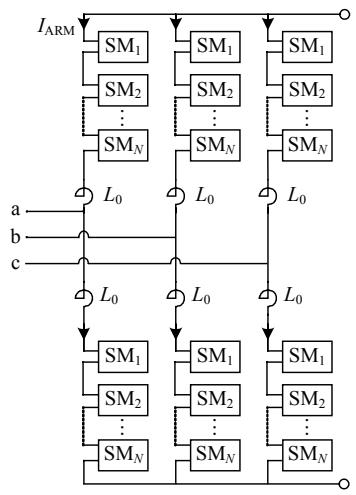  
图1 三相MMC 结构图  
Fig. 1 Schematic diagram of a three-phase MMC

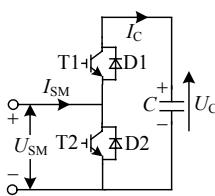  
(a) 电路结构

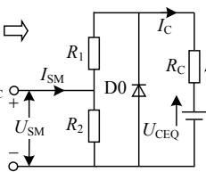  
(b) 伴随电路

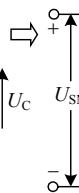  
(c) 戴维南等效电路  
图 2 MMC 子模块  
Fig. 2 MMC sub-module

均根据自身开关状态决定阻值为 $R _ { \mathrm { O N } }$ 或 $R _ { \mathrm { O F F } }$ ，其开关状态由 MMC 的控制器决定[8]。

除了上述对 IGBT 开关组的等效之外，对子模块进行戴维南等效还必须将子模块中的电容进行离散化，以使其可以在电磁暂态仿真环境中进行建模。文献[8]中采用了应用较广泛的梯形积分法(trapezoidal rule，TR)进行离散化，得到每个子模块的伴随电路如图 2(b)所示，图中二极管 D0 是为了确保等效模型的子模块电容电压不会出现负值。图 2(b)中，戴维南等效电阻 $R _ { \mathrm { C } }$ 和等效电压 $U _ { \mathrm { C E Q } }$ 整体等效子模块电容 C，它们的值均是时间的函数，如式(1)和(2)所示。电容电流 $I _ { \mathrm { C } } ( t )$ 由式(3)计算而得，它用于在每个仿真步长中更新子模块电容电压。公式中上标T表示在伴随电路的构造过程中使用了梯形积分法。

$$
R _ {\mathrm {C}} ^ {\mathrm {T}} = \frac {\Delta T}{2 C} \tag {1}
$$

$$
U _ {\mathrm {C E Q}} ^ {\mathrm {T}} (t - \Delta T) = U _ {\mathrm {C}} ^ {\mathrm {T}} (t - \Delta T) + R _ {\mathrm {C}} ^ {\mathrm {T}} I _ {\mathrm {C}} (t - \Delta T) \tag {2}
$$

$$
I _ {\mathrm {C}} (t) = \frac {I _ {\mathrm {A R M}} (t) R _ {2} - U _ {\mathrm {C E Q}} (t - \Delta T)}{R _ {1} + R _ {2} + R _ {\mathrm {C}}} \tag {3}
$$

将图 2(b)转化为如图 2(c)所示的子模块戴维南等效电路，等效参数 $R _ { \mathrm { S M E Q } }$ 和 $U _ { \mathrm { S M E Q } }$ 由式(4)、(5)可得。式(4)中， $R _ { 1 }$ 和 $R _ { 2 }$ 为 2 个状态的变量，因此$R _ { \mathrm { S M E Q } }$ 也为时变量。

$$
R _ {\mathrm {S M E Q}} (t) = R _ {2} \left(1 - \frac {R _ {2}}{R _ {1} + R _ {2} + R _ {\mathrm {C}}}\right) \tag {4}
$$

$$
U _ {\mathrm {S M E Q}} (t - \Delta T) = \left(\frac {R _ {2}}{R _ {1} + R _ {2} + R _ {\mathrm {C}}}\right) U _ {\mathrm {C E Q}} (t - \Delta T) \tag {5}
$$

将MMC桥臂中的N个子模块等效电路串联为一个桥臂等效电路，如图 3 所示，图中 $U _ { \mathrm { C } }$ 和 $T _ { \mathrm { S M } }$ 分别为桥臂输出的 N 个子模块电容电压以及控制器输入桥臂的子模块触发信号。桥臂的戴维南等效电阻 $R _ { \mathrm { A R M E Q } }$ 和 $U _ { \mathrm { A R M E Q } }$ 由式(6)、(7)可得。

$$
R _ {\mathrm {A R M E Q}} (t) = \sum_ {k = 1} ^ {N} R _ {\mathrm {S M E Q} - k} (t) \tag {6}
$$

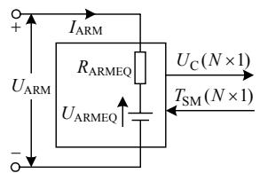  
图3 MMC 单个桥臂的戴维南等效电路  
Fig. 3 Thévenin equivalent for a single phase arm of MMC

$$
U _ {\mathrm {A R M E Q}} (t) = \sum_ {k = 1} ^ {N} U _ {\mathrm {S M E Q} k} (t - \Delta T) \tag {7}
$$

式中 $R _ { \mathrm { S M E Q } ~ k }$ 和 $U _ { \mathrm { S M E Q } ~ k }$ 分别为如图 2(c)所示的第 k个子模块的戴维南等效电阻和电压，即图 3 中的桥臂等效电路取决于其中 N 个子模块各自的导通状态和瞬时电压信息。由文献[12]可知，上述 MMC模型在仿真超高电平MMC组成的多端直流电网时仿真效率依然很低。

以下将介绍本文所提出的基于戴维南等效的MMC 整体建模方法，它比本节所介绍的 MMC 戴维南等效模型的计算效率还要高 1~2 个数量级，且不降低仿真精度。

# 2 基于戴维南等效的MMC整体建模

# 2.1 采用理想开关器件带来的 MMC仿真加速

本节将对第1节介绍的MMC戴维南模型的换流器与均压算法两个方面进行 3 个层面的整体优化，并提出一种适合于该整体模型的换流器闭锁仿真方法，最后将给出所提出整体模型的计算流程。

在工程实际中，IGBT 器件的导通电阻 $R _ { \mathrm { O N } }$ 和关断电阻 $R _ { \mathrm { O F F } }$ 会随着负载电流以及器件的正向电压降而改变。但大部分情况下， $R _ { \mathrm { O F F } }$ 要远远大于$R _ { \mathrm { O N } } .$ 。例如，在某些电磁暂态仿真程序中(如 PSCAD/EMTDC 等)，典型的默认值是 $R _ { \mathrm { O N } } = 0 . 0 1 \Omega , R _ { \mathrm { O F F } } =$ $1 0 ^ { 6 } \Omega ^ { [ 2 0 ] }$ 。对第 1 节所介绍的 MMC换流器戴维南等效模型进行求解时，电磁暂态仿真平台需要在每个仿真步长执行式(3)—(5)以更新戴维南电路并反解出每个子模块电容电压信息，尽管相应的数学计算复杂度较低，但是大量的计算也会在一定程度上降低计算效率。

为了在不损失仿真精度的前提下，为 MMC 模型的后续改进提供基础，假设每个 IGBT 开关组在关断状态时电阻为无穷大，也即假设理想的关断状态，则对式(3)—(5)在 $R _ { \mathrm { O F F } }$ 趋于无穷时求极限，可将其简化为式(8)—(10)。

$$
I _ {\mathrm {C}} (t) = \left\{ \begin{array}{l l} I _ {\mathrm {A R M}} (t), & \text {投 入} \\ 0, & \text {切 除} \end{array} \right. \tag {8}
$$

$$
R _ {\mathrm {S M E Q}} (t) = \left\{ \begin{array}{l l} R _ {\mathrm {O N}} + R _ {\mathrm {C}}, & \text {投 入} \\ R _ {\mathrm {O N}}, & \text {切 除} \end{array} \right. \tag {9}
$$

$$
U _ {\mathrm {S M E Q}} (t - \Delta T) = \left\{ \begin{array}{l l} U _ {\mathrm {C E Q}} (t - \Delta T), & \text {投 入} \\ 0, & \text {切 除} \end{array} \right. \tag {10}
$$

式(8)—(10)的计算复杂度要远小于式(3)—(5)，且没有乘法和除法运算。通常情况下，在 MMC 的详细模型中，全部子模块的结构参数是完全一致的，因此，式(6)中求解等效戴维南电阻时可以由式(11)计算而得。

$$
R _ {\mathrm {A R M E Q}} (t) = N R _ {\mathrm {O N}} + N _ {\mathrm {O N}} R _ {\mathrm {C}} \tag {11}
$$

式中 $N _ { \mathrm { O N } }$ 为在 t 时刻控制器要求 MMC 桥臂中导通的子模块数目。同时，由式(10)可知，即将处于切除状态的子模块的戴维南电压确切地为 0，这与采取这一假设之前该等效电压为极小值不同。因此，式(7)也可以通过只对即将导通的子模块的等效戴维南电压求和而得，这也会在一定程度上减少计算量。

由图 2(b)结合式(2)，可得使用梯形积分法对电容进行离散化时，每个仿真步长计算完毕后子模块电容电压的瞬时值和增量为

$$
\left\{ \begin{array}{l} U _ {\mathrm {C}} ^ {\mathrm {T}} (t) = U _ {\mathrm {C}} ^ {\mathrm {T}} (t - \Delta T) + \Delta U _ {\mathrm {C}} ^ {\mathrm {T}} (t) \\ \Delta U _ {\mathrm {C}} ^ {\mathrm {T}} (t) = \left(I _ {\mathrm {C}} (t) + I _ {\mathrm {C}} (t - \Delta T)\right) R _ {\mathrm {C}} ^ {\mathrm {T}} \\ R _ {\mathrm {C}} ^ {\mathrm {T}} = \frac {\Delta T}{2 C} \end{array} \right. \tag {12}
$$

结合式(8)、(12)可得采用梯形积分法时每个仿真步长的电容电压增量，如表 1 所示。

由表 1 可知，基于理想关断器件这一假设，采用梯形积分时，电容电压增量根据子模块当前步长与前一个步长的导通状态不同而分为 4 组，这使得进一步减少计算量成为可能。例如，当 MMC采用基于最近电平逼近控制(nearest level control，$\mathrm { N L C } ) ^ { [ 1 8 ] }$ 的排序均压算法且实时触发时，在调制波台阶不跃变时，桥臂中全部子模块在相邻两个步长

表 1 MMC 子模块电容电压增量(梯形积分)  
Tab. 1 Capacitor voltage increment in MMC (TR)   

<table><tr><td rowspan="2">(t-ΔT)时刻子模块导通状态</td><td colspan="2">t时刻子模块导通状态</td></tr><tr><td>切除</td><td>投入</td></tr><tr><td>切除</td><td>0</td><td>IRM(t)RCT</td></tr><tr><td>投入</td><td>IRM(t-ΔT)RCT</td><td>IRM(t-ΔT)+IRM(t)RCT</td></tr></table>

的导通状态必处于“切除–切除”或“投入–投入”二者之一，每个步长只需要根据桥臂电流 $I _ { \mathrm { A R M } } ( t )$ 的不同，计算 2次，即可用于全部子模块电压的更新，这大大减少了计算量。而当不采取理想关断器件这一假设时，即使处于关断状态的子模块，也会流入极小的电流对电容进行充、放电，导致任意时刻都需要对全部子模块的电容电压进行更新，这既无必要，也降低了计算效率。

# 2.2 采用后退欧拉法离散化子模块电容带来的 MMC 仿真加速

与梯形积分法相同，后退欧拉法(backwardEuler method，BEM)也是绝对稳定的(A-stable)，也即如果实际系统是稳定的，仿真结果也将是稳定的。如果采用后退欧拉法对 MMC全部子模块中的电容进行离散化，则图 2(b)中的伴随电路中参数将如式(13)—(15)所示，其中上标 E 表示采用了后退欧拉法。

$$
R _ {\mathrm {C}} ^ {\mathrm {E}} = \frac {\Delta T}{C} \tag {13}
$$

$$
U _ {\mathrm {C E Q}} ^ {\mathrm {E}} (t - \Delta T) = U _ {\mathrm {C}} ^ {\mathrm {E}} (t - \Delta T) \tag {14}
$$

$$
\left\{ \begin{array}{l} U _ {\mathrm {C}} ^ {\mathrm {E}} (t) = U _ {\mathrm {C}} ^ {\mathrm {E}} (t - \Delta T) + \Delta U _ {\mathrm {C}} ^ {\mathrm {E}} (t) \\ \Delta U _ {\mathrm {C}} ^ {\mathrm {E}} (t) = I _ {\mathrm {C}} (t) R _ {\mathrm {C}} ^ {\mathrm {E}} \end{array} \right. \tag {15}
$$

由于此处只是改变了子模块伴随电路的生成方法，因此之前的式(8)—(11)依然是适用的，结合式(8)、(15)，当采用后退欧拉法时，MMC 子模块电容电压的增量如表 2 所示。与表 1 不同，该增量只由当前时刻子模块的导通状态决定。

表 2 MMC 子模块电容电压增量(后退欧拉法)  
Tab. 2 Capacitor voltage increment in MMC (BEM)   

<table><tr><td>t时刻子模块导通状态</td><td>电容电压增量 ΔUCE(t)</td></tr><tr><td>切除</td><td>0</td></tr><tr><td>投入</td><td>IARM(t)RC</td></tr></table>

由表 2 可知，采用后退欧拉法后的一个直接好处是电容电压增量只与当前时刻有关，而与历史导通状态无关。因此，每个仿真步长只需要计算一次电压增量，即可加到全部投入状态的子模块电容电压中，而切除状态的子模块电容电压保持不变，无需更新。同时，与梯形积分法对应电容增量分 4 组不同，采用后退欧拉法时电容增量分为两组，既减少了所需存储的导通状态等信息量，也会给下文所提出的排序均压算法带来好处。

# 2.3 采用新型高效排序均压算法带来的 MMC 仿真加速

MMC 的调制均压算法必须使其在交流侧输出所期望的调制波形，同时保证直流母线电压的恒定。经过 2.1 和 2.2 节优化后的 MMC 换流器模型适用于任何已有的 MMC 调制及均压算法[18-19]。本文重点研究基于 NLC 的排序均压算法及其优化。

由 2.1 和 2.2 节可知，所提出 MMC 换流器戴维南等效模型的计算复杂度已经正比于桥臂子模块个数 N，即 O(N)。然而，MMC 的调制均压算法本身也会在很大程度上影响MMC的电磁暂态仿真效率，并且随着 MMC电平数的升高，排序算法的复杂度将成为 MMC 仿真的主要计算负荷。针对MMC 的电磁暂态仿真，2.2 节所采用的后退欧拉法对电容进行离散化恰为下文将提出的高效排序算法提供了可能。所提出排序均压算法如下所示：

仿真初始时刻，全部子模块电压都为零，假设N 个电容电压已从子模块 1 到N 按升序排列，在后续每个仿真步长中，可以按照如图 4 所示方法进行排序。步骤如下：

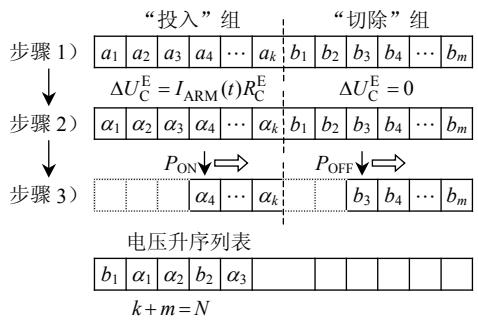  
图4 适用于采用后退欧拉法MMC 的排序均压算法  
Fig. 4 Proposed ranking based capacitor voltage balancing algorithm for BEM based MMC

1）根据前一个步长((t − ΔT)时刻)得到的电容电压升序列表以及当前时步(t 时刻)控制器要求桥臂导通的子模块数目和桥臂电流方向，按照“充电取小，放电取大”的原则[18]，将 N 个子模块分为“投入”和“切除”两组，此时每个组内子模块都是按照电容电压幅值升序排列的。假设“投入”组内的子模块电压为 $\{ a _ { 1 } , a _ { 2 } , \cdots , a _ { k } \}$ ，“切除”组内的子模块电压为 $\{ b _ { 1 } , b _ { 2 } , \cdots , b _ { m } \} ( k + m = N )$ 。  
2）在步骤 1）中“投入”组内子模块经过一次求解之后，通过加以相同的电容电压增量进行更新，假设其从 $\{ a _ { 1 } , a _ { 2 } , \cdots , a _ { k } \}$ 变为了 $\{ \alpha _ { 1 } , \alpha _ { 2 } , \cdots , \alpha _ { k } \}$ 。由于“投入”组内子模块的电压增量相同，因此$\{ \alpha _ { 1 } , \alpha _ { 2 } , \cdots , \alpha _ { k } \}$ 仍为升序排列。同时，“切除”组内

的子模块电容电压增量为 0，仍以 $\{ b _ { 1 } , b _ { 2 } , \cdots , b _ { m } \}$ 表示，其仍为升序排列。

3）如步骤 2）所述， $\{ \alpha _ { 1 } , \alpha _ { 2 } , \cdots , \alpha _ { k } \} , \{ b _ { 1 } , b _ { 2 } , \cdots , b _ { m } \}$ 均为升序排列，因此只需要少量的比较操作即可重新将这 N 个子模块电容电压按照升序排列，为下一个仿真步长做准备。为了便于编程实现，引入两个指针 $P _ { \mathrm { O N } }$ 和 $P _ { \mathrm { O F F } }$ 。在排序的初始时刻， $P _ { \mathrm { O N } } = 1$ ，$P _ { \mathrm { O F F } } { = } 1 _ { \circ }$ 。“投入”组中第 1 个元素 $\alpha _ { 1 }$ 与“切除”组中第一个元素 $b _ { 1 }$ 进行比较。如果 $b _ { 1 } < \alpha _ { 1 }$ ，则 $b _ { 1 }$ 移动到“电压升序列表”中的第一个元素位置，同时$P _ { \mathrm { O N } } = 1 , \ P _ { \mathrm { O F F } } = 2$ ，这意味着在下次比较中， $\alpha _ { 1 }$ 将和$b _ { 2 }$ 比较，反之亦反。将上述过程重复进行(N − 1)次即可填满组合列表中全部 N 个位置，且均按照电容电压幅值按升序排列。图 4 中“电压升序列表”中已有元素是假设 $b _ { 1 } < \alpha _ { 1 } < \alpha _ { 2 } < b _ { 2 } < \alpha _ { 3 }$ 时经过 5 次比较得到的。

上述高效排序方法在任意时刻与采用传统的诸如冒泡方法所得排序结果完全一致，但是复杂度从 $O ( N ^ { 2 } )$ 降为 O(N)。由于理想关断器件的概念在本文中的具体表现是对式(3)—(5)求取在 $R _ { \mathrm { O F F } }$ 趋于无穷时的极限，并未在仿真中设置该参数，且实际中也不存在关断电阻为无穷大的开关器件，因此上述新型排序算法只可与本文所提出MMC模型整体使用，无法直接应用于详细模型或实际装置中。

所提出的基于 NLC 的排序均压算法也可用于梯形积分法进行电容离散化的情形，但是由于需要分为四组，会降低算法的计算效率。因此本文只采用后退欧拉法，力求从各个角度及细节提高 MMC等效模型的仿真速度。

# 2.4 所提出 MMC 模型的闭锁实现方法

在 MMC 正常运行时，每个子模块的投入或者切除是由控制器决定的，图 3 中 MMC 桥臂戴维南等效电阻和电压由式(6)和(7)计算可得。然而，当MMC 在启动或直流故障等情形下需要进行闭锁时，全部子模块的脉冲都被封锁，MMC 进入不控整流模式，同一桥臂中的 N 个子模块由桥臂电流的方向决定是被同时投入或者切除。

基于此，本文提出如图 5 所示的 MMC 等效桥臂来精确模拟全站闭锁功能。图 5中的等效二极管Eqv._D1、Eqv._D2 和等效电容 Eqv._C 分别用来模拟MMC详细模型中同一桥臂全部子模块中的二极管 D1、D2 和电容 C(如图 2(a)所示)。

图 5 中，等效二极管 Eqv._D1 和 Eqv._D2 的导

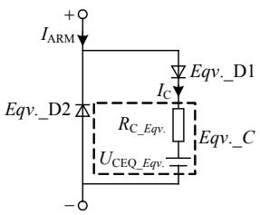  
图 5 MMC 闭锁时的等效桥臂模型  
Fig. 5 Equivalent MMC arm in blocked mode

通和关断电阻分别设置为

$$
\left\{ \begin{array}{l} R _ {\mathrm {O N} - E q v. - \mathrm {D}} = N R _ {\mathrm {O N}} \\ R _ {\mathrm {O F F} - E q v. - \mathrm {D}} = 1 0 \times 1 0 ^ {1 2} \Omega (+ \infty) \end{array} \right. \tag {16}
$$

在式(16)中关断电阻取 $1 0 ^ { 1 2 } \Omega$ 而非无穷大电阻是受仿真软件的限制，无法实际调用无穷大电阻支路。

基于后退欧拉法的等效电容 $E q \nu _ { \cdot \_ } \mathrm { { C } }$ 的戴维南等效电阻和电压分别为

$$
R _ {\mathrm {C} - E q v.} = N R _ {\mathrm {C}} ^ {\mathrm {E}} \tag {17}
$$

$$
\begin{array}{l} U _ {\mathrm {C E Q} \_ E q v.} (t - \Delta T) = \sum_ {k = 1} ^ {N} U _ {\mathrm {C E Q} \_ k} ^ {\mathrm {E}} (t - \Delta T) = \\ \sum_ {k = 1} ^ {N} U _ {\mathrm {C} _ {- k}} ^ {\mathrm {E}} (t - \Delta T) \tag {18} \\ \end{array}
$$

MMC 闭锁后更新全部电容电压按式(15)计算可得，其中所需的 $I _ { \mathrm { C } } ( t )$ 由图 5 中测量可得。如果等效二极管的关断电阻为无穷大， $I _ { \mathrm { C } } ( t )$ 的取值为 $I _ { \mathrm { A R M } }$ 或 0，这取决于桥臂电流的方向。

# 2.5 MMC 戴维南等效整体模型的求解流程

图6为MMC整体建模方法在正常运行(解锁运行)时的求解流程。

在 MMC 闭锁时，只要将图 6 所示流程图做如下 2 点修改即可：1）桥臂戴维南等效支路由用图 5替换图 3；2）全部子模块电容的投入或切除由桥臂电流方向结合闭锁状态时的等效二极管自动判断，无需排序过程参与。

图6中所示求解流程也适用于本文将提出的全桥型 MMC的整体建模，为体现通用性，未在每个求解步骤中标出具体的求解公式。同时，图 6表明所提出 MMC 整体建模方法的实现方法较简单，流程清晰，便于理解及实现。

# 3 模型验证

# 3.1 测试系统介绍

本节首先介绍对所提出的 MMC 整体建模方法进行验证所用的仿真测试系统，进而进行模型精度

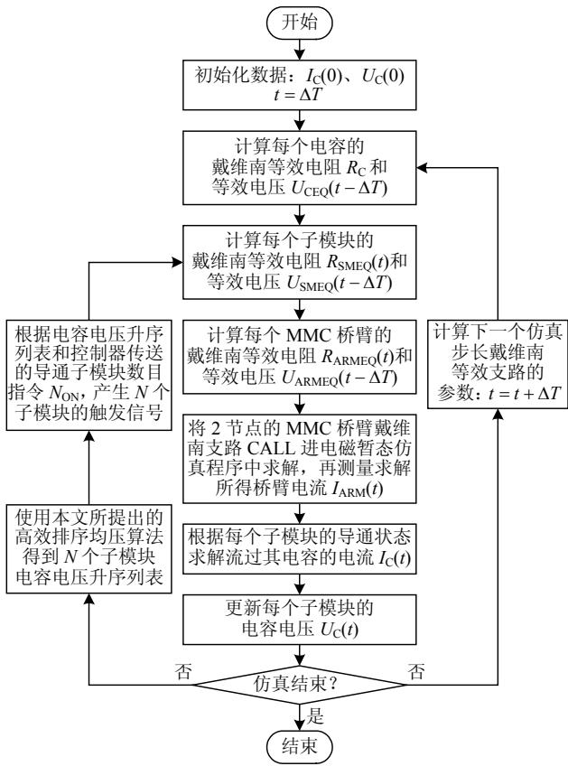  
图6 MMC 整体建模方法的求解流程  
Fig. 6 Flow chart of calculating the integral MMC model验证以及模型加速比测试。

在对所提出模型进行精度验证时，通过与采用PSCAD/EMTDC 元件库中由梯形积分法定义的电容器件搭建的 MMC 详细模型进行对比。采用图 7中 4 端 MMC-MTDC 系统中的 MMC1 和 MMC2 组成双端 11 电平 MMC-HVDC 系统，系统参数如附录 A中表 A1 所示。MMC1 采用定直流电压和定交流电压控制，MMC2 采用定有功功率和定交流电压控制。

在对所提出模型进行加速比测试时，为了检验所提出模型在超高电平(高达1001电平)的MMC型直流电网中的有效性，分别采用所提出模型和MMC 简化模型(以平均值模型为例)搭建如图 7 所示的 4 端MMC-MTDC系统，由于研究重点是对不同模型的仿真速度进行对比测试，因此此处忽略其

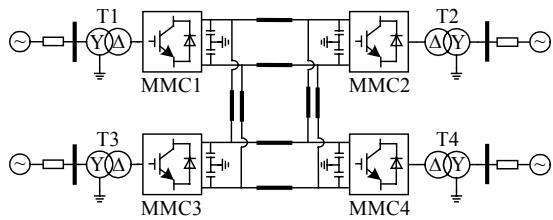  
图 7 4 端 MMC-MTDC 测试系统示意图  
Fig. 7 Schematic diagram of the MMC-MTDC system

具体控制方式和系统参数的介绍。

所用程序在电磁暂态程序 PSCAD/EMTDCProfessional V4.2.1 中搭建，运行于 4 核 Intel(R)Core(TM) i7 2.67 GHz CPU，2 GB 内存，64 位 WIN7操作系统的计算机中。仿真步长都设置为 20 μs。

# 3.2 模型精度验证

首先对所提出MMC戴维南整体模型进行稳态特性验证，进而进行系统级交、直流故障特性验证。

# 1）稳态特性。

从仿真初始时刻到系统稳定运行后，MMC1 的a 相上桥臂第一个子模块触发信号和电容电压，a相上桥臂电流以及桥臂输出电压波形如图 8 所示。

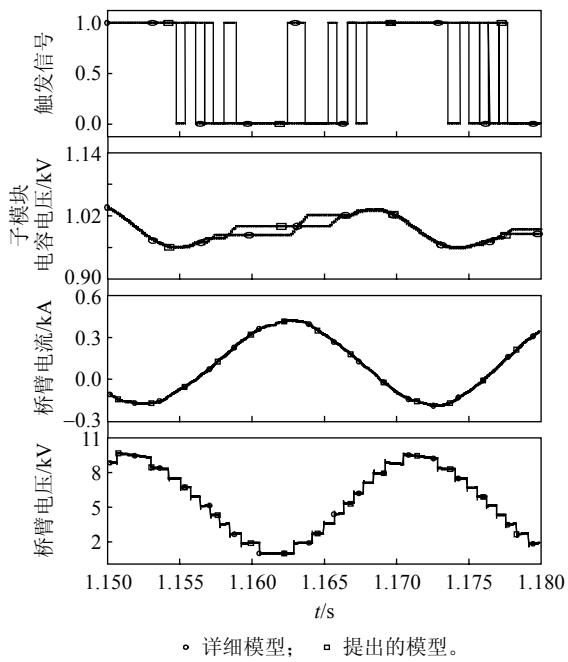  
图8 MMC 模型内部特性  
Fig. 8 Internal behaviors of the MMC model

图 8 中第 1、2 个图表明，所提出的 MMC 模型在采用 NLC 排序均压算法时，特定子模块的触发信号和电容电压波形均与详细模型有些差别，这是由排序过程对换流器模型自身非常细微的精度差别的放大引起的。如图 8 第 3、4 个图所示，即使单个子模块的电压波形不完全匹配，但是由处于导通状态子模块的电压叠加起来的桥臂电压以及相应的桥臂电流却是高度匹配的，这表明上述电容电压的误差并不影响MMC的子模块电容电压波动幅值等重要特性。

# 2）交流故障暂态特性。

在 t=1.30s时刻，在图7 所示系统图中变压器T1的高压侧引入持续50ms的交流三相短路接地故障，图 9 为流入 MMC1 的有功和无功功率以及交

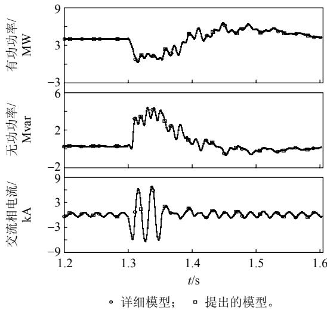  
图9 MMC 模型交流系统暂态特性  
Fig. 9 The AC transient behaviors of the MMC model流系统相电流波形。

图 9 表明，与 MMC 的详细模型相比，即使存在特定子模块的触发信号以及电容电压不完全匹配的现象，采用 NLC 排序均压算法的 MMC 整体模型仍然可以精确仿真系统级交流故障特性。

# 3）直流故障暂态特性。

在 6.0 s 时刻，MMC-HVDC 系统的 MMC1 直流母线处发生双极永久性直流短路故障，考虑 5ms的延时，6.005s 时全站闭锁。所提出模型与详细模型的 MMC1侧直流电压、a 相上桥臂电流以及流出MMC1 的直流电流对比结果如图 10 所示。

图 10 表明，本文所提出的 MMC 整体模型及其换流器闭锁方法可以精确模拟MMC详细模型的直流故障期间的暂态过程和闭锁后的不控整流过程，仿真精度误差在 0.18%左右，完全可以满足研究需求。

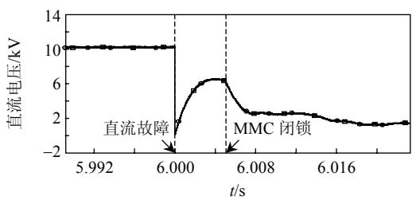  
(a) 直流电压

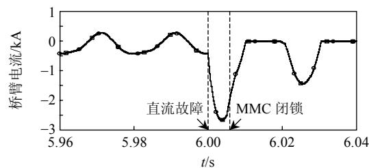  
(b) 桥臂电流

图10 MMC 模型直流系统暂态特性  
Fig. 10 The DC transient behaviors of the MMC model   
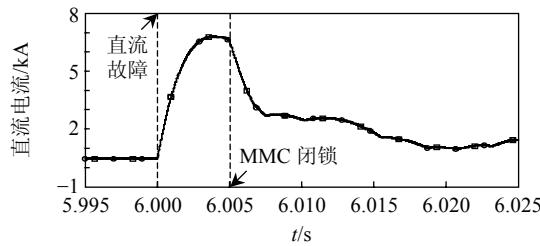  
详细模型； 提出的模型。

(c) 直流电流

# 3.3 模型加速比测试

为了评估所提出 MMC模型的加速比，首先比较 MMC 的详细模型、文献[8]中提出的 MMC 换流器戴维南等效模型以及本文所提出的 MMC 整体模型的仿真用时，所用模型均为包含上下两个桥臂的MMC 单相模型。

由于离线仿真超高电平MMC详细模型组成的大规模直流电网几乎是不可行的，分别采用所提出的模型和 MMC 的平均值模型搭建如图 7 所示的 4端网络，并比较二者的仿真用时。

# 1）MMC 单相模型。

3 种单相 MMC 模型中每个桥臂的子模块数目从 12 到 400 变化。为了减少统计误差对研究模型加速比的影响，此处仿真总时长设置为 20s。

表 3 为全部 MMC 模型的计算用时(s)及加速比(%)，加速比 1 定义为详细模型仿真用时与所提出整体模型的比，加速比 2定义为文献[8]中模型用时与所提出整体模型的比。

注意表 3 中部分数据是空白的，这是因为随着

表 3 MMC 模型的仿真用时(单相)  
Tab. 3 CPU timings of the MMC models (single phase)   

<table><tr><td>子模块数</td><td>详细模型</td><td>已有模型</td><td>提出的模型</td><td>加速比1</td><td>加速比2</td></tr><tr><td>12</td><td>49</td><td>7</td><td>5</td><td>980</td><td>140</td></tr><tr><td>24</td><td>180</td><td>10</td><td>6</td><td>3000</td><td>166</td></tr><tr><td>48</td><td>1152</td><td>24</td><td>9</td><td>12800</td><td>267</td></tr><tr><td>72</td><td>6240</td><td>52</td><td>12</td><td>52000</td><td>433</td></tr><tr><td>96</td><td>18180</td><td>101</td><td>16</td><td>113625</td><td>631</td></tr><tr><td>120</td><td>55490</td><td>179</td><td>20</td><td>277450</td><td>895</td></tr><tr><td>146</td><td>—</td><td>305</td><td>24</td><td>—</td><td>1271</td></tr><tr><td>172</td><td>—</td><td>482</td><td>28</td><td>—</td><td>1721</td></tr><tr><td>200</td><td>—</td><td>719</td><td>32</td><td>—</td><td>2245</td></tr><tr><td>250</td><td>—</td><td>1372</td><td>40</td><td>—</td><td>3430</td></tr><tr><td>300</td><td>—</td><td>—</td><td>47</td><td>—</td><td>—</td></tr><tr><td>350</td><td>—</td><td>—</td><td>54</td><td>—</td><td>—</td></tr><tr><td>400</td><td>—</td><td>—</td><td>61</td><td>—</td><td>—</td></tr></table>

子模块数目的增加，除了所提出模型外的 2 个模型的仿真都变得非常缓慢。将表 3 中数据在双对数坐标系下画出，如图 11 所示。

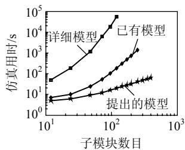  
(a) MMC 仿真用时

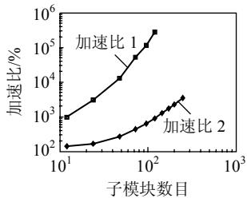  
(b) 所提出 MMC 模型的加速比  
图 11 单相 MMC 模型计算效率测试  
Fig. 11 CPU timings of the single phase MMC models

从表 3 和图 11 可知，当 MMC 模型中桥臂子模块数目为 120 时，所提MMC 整体模型的计算效率比详细模型高3个数量级(实际上快了2770倍以上)。当子模块数目为 250 时，所提出模型比文献[8]中提出的 MMC 等效模型也快了 34 倍以上，可以预见的是随着电平数的增加，该加速比将达到 2 个数量级。同时由图 11 发现，如果忽略子模块数目较少时的一些固定的模型端口读写操作带来的计算负荷，所提出 MMC整体模型的仿真用时随着子模块数目的增加线性增长，这是与模型建立部分的理论分析相一致的。

上述单相MMC模型加速比测试只是为了在控制系统尽可能简化的情况下，测试由于模型的优化带来的加速比，在实际仿真中，真正有意义的是其在包含完整控制系统的多端直流电网中的应用。以下将验证所提出 MMC 整体模型在超高电平 MMC组成的大规模直流电网中的仿真效率。

# 2）4 端 MMC-MTDC 系统。

为了节约仿真时间，本小节的仿真总时长为5s，模型的计算用时如表 4 所示。

表 4 中，当仿真 1 001 电平 4 端 MMC-MTDC系统时，所提出模型只需要 756s，虽然大于 MMC平均值模型所需的 123s，但仍可以说明本文所提出

表 4 4 端 MMC-MTDC 网络的仿真用时  
Tab. 4 CPU timings of the 4-terminal MMC-MTDC grid   

<table><tr><td>子模块数目</td><td>提出的模型</td><td>平均值模型</td></tr><tr><td>100</td><td>249</td><td>123</td></tr><tr><td>250</td><td>363</td><td>123</td></tr><tr><td>300</td><td>390</td><td>123</td></tr><tr><td>400</td><td>445</td><td>123</td></tr><tr><td>600</td><td>535</td><td>123</td></tr><tr><td>1000</td><td>756</td><td>123</td></tr></table>

的 MMC 整体模型可以胜任超高电平 MMC 组成的大规模直流电网的仿真需求。同时，表 4 中可见MMC 平均值模型的计算用时并不随着子模块数目的增加而变化，这是由于它不存在排序均压过程，属于本文引言中所述的第 2 类模型，因此其无法仿真 MMC 子模块的电容充放电特性。

# 4 全桥型MMC的戴维南等效整体建模

# 4.1 全桥型子模块的伴随电路

全桥型MMC的拓扑以及运行模式远比半桥型MMC 复杂。为节约篇幅，本节将从全桥型子模块结构出发，给出全桥型 MMC 的戴维南等效整体建模过程与半桥型 MMC 主要公式的区别。

参照图 2 中半桥型子模块的伴随电路生成方法，全桥型子模块的伴随电路如图 12(a)所示。

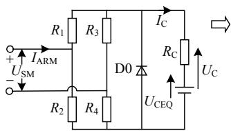  
(a) 伴随电路

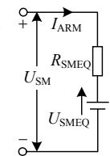  
(b) 戴维南等效电路  
图 12 全桥型子模块  
Fig. 12 Full-bridge sub-module

与半桥型子模块相似，图12(a)中全桥型子模块的伴随电路中的二极管 D0 也是为了防止电容电压出现负值。参考文献[8]中求解半桥型子模块的戴维南等效电路的方法，求解全桥型子模块的伴随电路，可得其电容充电电流以及戴维南等效电阻和等效电压分别为

$$
I _ {\mathrm {C}} (t) = \frac {C I _ {\mathrm {A R M}} (t) - B U _ {\mathrm {C E Q}} (t - \Delta T)}{A + B R _ {\mathrm {C}}} \tag {19}
$$

$$
R _ {\mathrm {S M E Q}} (t) = \frac {E + D R _ {\mathrm {C}}}{A + B R _ {\mathrm {C}}} \tag {20}
$$

$$
U _ {\mathrm {S M E Q}} (t - \Delta T) = \frac {C U _ {\mathrm {C E Q}} (t - \Delta T)}{A + B R _ {\mathrm {C}}} \tag {21}
$$

式中：

$$
\left\{ \begin{array}{l} A = R _ {1} R _ {2} + R _ {1} R _ {4} + R _ {2} R _ {3} + R _ {3} R _ {4} \\ B = R _ {1} + R _ {2} + R _ {3} + R _ {4} \\ C = R _ {2} R _ {3} - R _ {1} R _ {4} \\ D = R _ {1} R _ {3} + R _ {1} R _ {4} + R _ {2} R _ {3} + R _ {2} R _ {4} \\ E = R _ {1} R _ {2} R _ {3} + R _ {1} R _ {2} R _ {4} + R _ {1} R _ {3} R _ {4} + R _ {2} R _ {3} R _ {4} \end{array} \right.
$$

由于全桥型子模块的控制特性更加灵活，可以

在2种桥臂电流方向下可控地正向或者负向投入桥臂或者被可靠旁路，因此在假设采用理想关断器件后，式(19)—(21)分别简化为

$$
I _ {\mathrm {C}} (t) = \left\{ \begin{array}{l l} I _ {\mathrm {A R M}} (t), & \text {正 向 投 入} \\ 0, & \text {切 除} \\ - I _ {\mathrm {A R M}} (t), & \text {负 向 投 入} \end{array} \right. \tag {22}
$$

$$
R _ {\mathrm {S M E Q}} (t) = \left\{ \begin{array}{l l} 2 R _ {\mathrm {O N}} + R _ {\mathrm {C}}, & \text {正 向 投 入} \\ 2 R _ {\mathrm {O N}}, & \text {切 除} \\ 2 R _ {\mathrm {O N}} + R _ {\mathrm {C}}, & \text {负 向 投 入} \end{array} \right. \tag {23}
$$

$$
U _ {\mathrm {S M E Q}} (t - \Delta T) = \left\{ \begin{array}{l l} U _ {\mathrm {C E Q}} (t - \Delta T), & \text {正 向 投 入} \\ 0, & \text {切 除} \\ - U _ {\mathrm {C E Q}} (t - \Delta T), & \text {负 向 投 入} \end{array} \right. \tag {24}
$$

基于式(22)—(24)，可得采用后退欧拉法对电容进行离散化后全桥型子模块每个仿真步长的电容电压增量如表 5 所示。

表5 全桥型MMC 子模块电容电压增量  
Tab. 5 Capacitor voltage increment in full-bridge MMC   

<table><tr><td>t时刻子模块导通状态</td><td>电容电压增量 ΔUCE(t)</td></tr><tr><td>正向投入</td><td>IRM(t)RC</td></tr><tr><td>切除</td><td>0</td></tr><tr><td>负向投入</td><td>-IRM(t)RC</td></tr></table>

表 5 表明，与半桥型子模块不同，桥臂电流的正或负无法作为判断当前时刻处于投入状态的全桥型子模块电容将被充电或放电的唯一判据，而应该结合当前时刻控制器的触发指令。因此，对图 4所示新型排序均压算法略作修改即可用于全桥型MMC，并且图 5 所示的换流器闭锁实现方法也需要按照全桥子模块的特点进行改进，而图 6 所示的整体建模流程依然适用。

# 4.2 全桥型 MMC的仿真验证

限于篇幅，此处仅以全桥型 MMC在直流故障中切断短路电流的仿真算例，来验证所搭建模型的正确性，直流故障发生前后全桥型 MMC 的交流相电流、桥臂电流和直流电流如图 13 所示。

图 13 表明，全桥型 MMC 可以在换流器闭锁后快速切断直流短路电流，同时桥臂电流和直流短路电流均降为 0，因此所提出全桥型 MMC 整体模型可以精确仿真对应详细模型的故障暂态特性。

# 5 结论

本文提出了一种基于戴维南等效的MMC整体建模方法，并分别进行了模型精度验证和加速比测

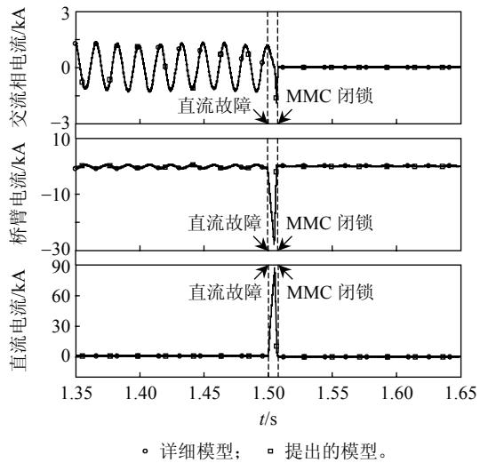  
图13 全桥型MMC 直流故障特性  
Fig. 13 DC fault behaviors of the full-bridge MMC model试，得到如下结论：

1）所提出的 MMC 整体模型对已有戴维南等效模型进行了 3 个层面上的优化，并针对所提出模型给出了精确仿真换流器闭锁的方法，使得所提模型与详细模型相比精度误差极小。  
2）所提出的 MMC 整体模型的仿真效率比详细模型高 3~4 个数量级，比已有的 MMC 戴维南等效模型高 1~2 个数量级，并且在仿真超大规模MMC-MTDC电网时与平均值模型的仿真效率具有可比性。  
3）将所提出的 MMC 整体建模方法扩展至拓扑及运行机制更复杂的全桥型 MMC 中，仿真精度与加速比完全符合预期。  
4）所得研究成果对 MMC 的实时数字仿真具有一定的借鉴意义。

# 参考文献

[1] 杨晓峰，林智钦，郑琼林，等．模块组合多电平变换器的研究综述[J]．中国电机工程学报，2013，33(6)：1-14Yang Xiaofeng，Lin Zhiqin，Zheng Qionglin，et al．Areview of modular multilevel converters[J]．Proceedingsof the CSEE，2013，33(6)：1-14(in Chinese)  
[2] 孔明，汤广福，贺之渊．子模块混合型 MMC-HVDC 直流故障穿越控制策略[J]．中国电机工程学报，2014， 34(30)：5343-5351 Ming Kong，Guangfu Tang，Zhiyuan He．A DC fault ride-through strategy for cell-hybrid modular multilevel converter based HVDC transmission systems[J] Proceedings of the CSEE，2014，34(30)：5343-5351(in Chinese)   
[3] Xue Yinglin，Xu Zheng，Tang Geng．Self-start control

with grouping sequentially precharge for the C-MMC-based HVDC system[J]．IEEE Transactions on Power Delivery，2014，29(1)：187-198   
[4] Marquardt R．Modular Multilevel Converter：An universalconcept for HVDC-networks and extended DC-bus-applications[C]//Power Electronics Conference (IPEC)，2010 International．Sapporo ：2010：502-507  
[5] Jacobson B，Karlsson P，Asplund G，et al．CIGRE B4-110VSC-HVDC transmission with cascaded two-levelconverters[C]//Paris：CIGRE，2010：1-8  
[6] Dennetière S，Nguefeu S，H．Saad，J．et al．Modeling of modular multilevel converters for the France-Spain link[C]//International Conference on Power Systems Transients．Vancouver，Canada，2013   
[7] Teeuwsen S P．Modeling the Trans. bay cable project as voltage-sourced converter with modular multilevel converter design[C]//Power and Energy Society General Meeting．Detroit，Michigan，USA：IEEE，2011：1-8   
[8] Gnanarathna Udana N，Gole Aniruddha M．，Jayasinghe Rohitha P ． Efficient modeling of modular multilevel HVDC converters(MMC)on electromagnetic transient simulation programs[J] ． IEEE Transactions on Power Delivery，2011，26(1)：316-324   
[9] 许建中，赵成勇，刘文静．超大规模MMC 电磁暂态仿真提速模型[J]．中国电机工程学报，2013，33(10)：114-120Xu Jianzhong ， Zhao Chengyong ， Liu WenjingAccelerated model of ultra-large scale MMC inElectromagnetic transient simulations[J]．Proceedings ofthe CSEE，2013，33(10)：114-120(in Chinese)  
[10] Xu Jianzhong，Zhao Chengyong，Liu Wenjing，et al Accelerated model of modular multilevel converters in PSCAD/EMTDC[J] ． IEEE Transactions on Power Delivery，2013，28(1)：129-136   
[11] 管敏渊，徐政．模块化多电平换流器的快速电磁暂态仿真方法[J]．电力自动化设备，2012，32(6)：36-40．2012，32(6)：36-40Guan Minyuan，Xu Zheng．Fast electro-magnetic transientsimulation method for modular multilevel converter[J]Electric Power Automation Equipment，2012，32(6)：36-40(in Chinese)  
[12] Peralta Jaime，Saad Hani，Dennetiere Sebastien，et al Detailed and averaged models for a 401-level MMC-HVDC system[J]．IEEE Transactions on Power Delivery，2012，27(3)：1501-1508   
[13] Xu Jianzhong，Gole A M，Zhao Chengyong．The use of averaged-value model of modular multilevel converter in DC grid[J]．IEEE Transactions on Power Delivery，2015，

30(2)：519-528．  
[14] Teeuwsen Simon P ． Simplified dynamic model of a voltage-sourced converter with modular multilevel converter design[C]//Power Systems Conference and Exposition．Seattle，WA，USA ：IEEE/PES，2009： 1-6．   
[15] Rohner Steffen，Weber Jens，Bernet Steffen．Continuous model of modular multilevel converter with experimental verification[C]//Energy Conversion Congress and Exposition．Phoenix，AZ：IEEE，2011：4021-4028   
[16] Lesnicar A ， Marquardt R ． An innovative modular multilevel converter topology suitable for a wide power range[C]//2003 Power Tech Conference Proceedings Bologna：IEEE，2003：3-6   
[17] 汤广福．基于电压源换流器的高压直流输电技术[M] 北京：中国电力出版社，2010 Tang Guangfu ． Voltage source converter based high voltage direct current technology[M]．Beijing：China Electric Power Press，2010(in Chinese)   
[18] 管敏渊，徐政．MMC 型 VSC-HVDC 系统电容电压的优化平衡控制[J]．中国电机工程学报，2011，31(12)：9-14．Guan Minyuan，Xu Zheng．Optimized capacitor voltagebalancing control for modular multilevel converter basedVSC-HVDC system[J]．Proceedings of the CSEE，2011，31(12)：9-14(in Chinese)  
[19] 李笑倩，宋强，刘文华，等．采用载波移相调制的模块化多电平换流器电容电压平衡控制[J]．中国电机工程学报，2012，32(9)：49-55Li Xiaoqian，Song Qiang，Liu Wenhua，et al．Capacitorvoltage balancing control by using carrier phase-shiftmodulation of modular multilevel converters[J]Proceedings of the CSEE，2012，32(9)：49-55(in Chinese)  
[20] PSCAD X4 user’s guide[M]．Winnipeg，MB，Canada：

Manitoba Research Center，2009

# 附录 A

表 A1 11 电平 MMC-HVDC 测试系统参数  
Tab. A1 Parameters of the 11-level MMC-HVDC system   

<table><tr><td></td><td>参数</td><td>数值</td></tr><tr><td rowspan="2">交流系统</td><td>交流电压 UBus(L-L_RMS)/kV</td><td>10</td></tr><tr><td>有功功率 PS/MW</td><td>4</td></tr><tr><td rowspan="4">变压器</td><td>接线</td><td>YN/Δ</td></tr><tr><td>容量 STN/MVA</td><td>5</td></tr><tr><td>变比 K/(kV/kV)</td><td>10/5.6</td></tr><tr><td>基波电感 LT/mH</td><td>3.6</td></tr><tr><td rowspan="3">MMC</td><td>桥臂电感 L0/mH</td><td>3.6</td></tr><tr><td>子模块电容 C/mF</td><td>12</td></tr><tr><td>子模块电压 USM/kV</td><td>1</td></tr><tr><td rowspan="3">直流系统</td><td>直流电压 Udc/kV</td><td>10</td></tr><tr><td>直流电容器 CF/μF</td><td>1</td></tr><tr><td>直流电缆</td><td>频域模型(100 km)</td></tr></table>

  
许建中

收稿日期：2014-12-11。

# 作者简介：

许建中(1987)，男，博士，主要研究方向为高压直流输电、FACTS 等，xujianzhong@ncepu.edu.cn；

赵成勇(1964)，男，博士，教授，博士生导师，主要研究方向为直流输电、电能质量分析与控制等，chengyongzhao@ncepu.edu.cn；

Aniruddha M. Gole(1955)，男，博士，加拿大工程院院士，加拿大曼尼托巴大学教授，IEEE Fellow，主要研究领域为电力系统电磁暂态仿真、HVDC 与 FACTS 技术等，Gole@ee.umanitoba.ca。

(责任编辑 张玉荣)