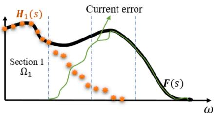
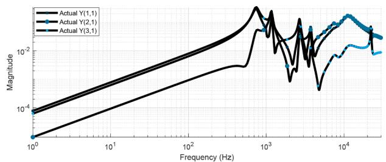
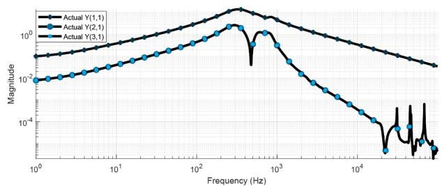
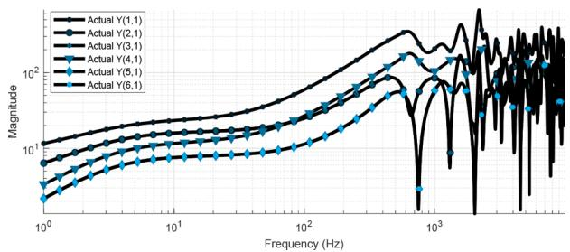

# Review and comparison of frequency-domain curve-fitting techniques: Vector fitting, frequency-partitioning fitting, matrix pencil method and loewner matrix☆

B. Salarieh * , H.M.J. De Silva

Manitoba Hydro International Ltd, Winnipeg, MB R3P 1A3, Canada

# A R T I C L E I N F O

Keywords:

Frequency dependent network equivalent

Matrix pencil method

Loewner matrix

Vector fitting

Frequency-partitioning fitting

Model order reduction

# A B S T R A C T

It is a well-known practice to approximate the frequency-domain response of an electrical component or a subsystem with rational functions for electromagnetic transient (EMT) simulations of power systems. There are a variety of curve-fitting methods developed over time that offer different levels of accuracy, speed, and complexity. In some cases, the order of rational function may get very large to meet specified error criteria. Model order reduction (MOR) methods can be used to decrease the order of the function without a considerable deterioration of the approximation error. This paper presents a thorough review and comparison of the most popular curve-fitting methods, namely, the vector fitting (VF) method along with its later developments, the frequency-partitioning fitting (FpF) methods, matrix pencil method (MPM) and loewner matrix (LM) fitting technique. First, the fundamental theories of each one are briefly reviewed. Then, their accuracy and fitting order are compared together through three case studies. Lastly, the application of two different MOR methods to the resulted rational function is investigated.

# 1. Introduction

The electromagnetic transient simulation of power systems requires accurate modeling of system components, including their wideband frequency characteristics. Once the frequency-domain behavior seen from the terminals is known, the modeling is based on fitting a rational function to the frequency-domain characteristics, which can be in the form of admittance (Y), impedance (Z), or scattering (S) parameters. This way, an efficient time-domain simulation is possible using the recursive convolution [1]. There are several applications for rational fitting in time-domain studies, such as wideband modeling of frequency-dependent network equivalents (FDNE) [2,3], high-frequency transformer modeling [4], and modeling of transmission lines [5]. The vector fitting (VF) technique [6], is robust and widely applied in EMT studies. There were enhancements of VF proposed later, known as relaxed vector fitting (RVF) [7] and modal vector fitting (MVF) [8]. Another approach is the frequency-partitioning fitting (FpF) [9–11] that overcomes the ill-conditioned equations occurring on wideband responses by subdividing the frequency range of interest into several partitions and applying rational fitting to each subrange.

Alternative techniques were proposed later, such as matrix pencil method (MPM) [12] and loewner matrix [13]. These techniques have advantages such as being non-iterative, and not requiring an initial pole set. Once the rational function approximation is obtained in the forms of poles and residues, there are two postprocessing steps that perturb the model parameters. The first one is due to the passivity requirement of rational models to guarantee a stable time-domain simulation [14]. Moreover, the large number of components in a power system requires reducing the order of state-space model of the components for an efficient time-domain simulation, while maintaining the accuracy of the original model.

In this paper, following a complete review of VF, FpF, MPM, and LM, these techniques are compared together in regard to the fitting order and accuracy through three case studies. Furthermore, the application of two different MOR methods to the models obtained by these techniques is investigated. Since non of the mentioned techniques guarantee a stable model, the passivity analysis is not covered in this paper.

# 2. Review of curve-fitting techniques

The purpose of curve-fitting techniques is to approximate the frequency response of a linear time invariant (LTI) system, F(s) with a rational function of the following form

$$
\mathbf {F} (s) = \sum_ {n = 1} ^ {N} \frac {\mathbf {R} _ {n}}{s - p _ {n}} + \mathbf {D} + s \mathbf {E} \tag {1}
$$

where $\begin{array} { r } { s = j \omega , } \end{array}$ , and N is the number of poles including the real and complex-conjugate poles. Identification of (1) is called rational fitting and different methods of calculating its parameters are described as follows.

# 2.1. Vector fitting (VF)

Vector fitting (VF) relies on introducing a set of initial poles [6]. An unknown auxiliary function $\sigma ( s )$ is introduced that results in an augmented linear problem of the following form

$$
\sum_ {n = 1} ^ {N} \frac {\mathbf {R} _ {n}}{s - p _ {n}} + \mathbf {D} + s \mathbf {E} = \underbrace {\left(\sum_ {n = 1} ^ {N} \frac {\widehat {r} _ {n}}{s - p _ {n}} + 1\right)} _ {\sigma (s)} \mathbf {F} (s) \tag {2}
$$

which is solved to find the zeros of σ(s). The new poles of $\mathbf F ( s )$ are equal to the zeros of σ(s) and are calculated as the eigenvalues of the following matrix

$$
H = A - b c ^ {T} \tag {3}
$$

where A is a diagonal matrix containing the starting poles $p _ { n }$ , b is a column vector of ones, and $c ^ { T }$ is a row vector containing the residues ${ \widehat { r } } _ { n } .$ . This procedure, known as the pole identification step, is applied in an iterative manner where the new poles replace the previous ones, and converges after a few iterations. Finally, the residues $\mathbf { R } _ { n } .$ D and E are calculated by solving (2) with known poles and $\sigma ( s ) = 1$ .

In the above procedure, a lot of computation effort is wasted on the calculation of residues $\mathbf { R } _ { n }$ in the pole identification step, which are discarded in the later steps [15]. It was shown that applying the QR decomposition to (2) results in a set of equations that only depend on $\widehat { \boldsymbol { r } } _ { n }$ . This leads to a faster pole identification step. Also in the residue identification step, the symmetry of F(s) can be utilized to only solve for the residues of the upper (or lower) triangle of the matrix. These improvements lead to a fast implemenation of VF known as fast vector fitting (FVF). Two developments of the outlined VF technique were proposed later as follows.

# 2.1.1. Fast relaxed vector fitting (FRVF)

It was realized that the asymptotic requirement of σ(s) approaching unity at high frequencies, impairs the pole relocation ability of VF and makes it dependent on the specification of the initial poles [7]. To improve the convergence of VF, σ(s) is replaced with

$$
\sigma (s) = \sum_ {n = 1} ^ {N} \frac {\widehat {r} _ {n}}{s - p _ {n}} + \widehat {d} \tag {4}
$$

where $\hat { \boldsymbol { d } }$ is a real number and results in addition of one column in the least-squares problem given by (2). There is also one row added to avoid the null solution

$$
R e \left\{\sum_ {k = 1} ^ {N _ {s}} \left(\sum_ {n = 1} ^ {N} \frac {\widehat {r} _ {n}}{s _ {k} - p _ {n}} + \widehat {d}\right) \right\} = N _ {s} \tag {5}
$$

where $N _ { s }$ is the number of frequency samples.

# 2.1.2. Fast modal vector fitting (FMVF)

With the application of VF, some properties of a system may be approximated with higher accuracy than others. As an example, when fitting the elements of an admittance matrix Y that has both large and small elements, the elements of higher magnitude are fitted with more accuracy than the small elements, depending on the error criterion. The resulting model does not necessarily provide a good fit for the impedance ${ \bf Z } = { \bf Y } ^ { - 1 }$ matrix. To have an accurate model with arbitrary terminal conditions, modal vector fitting (MVF) is introduced, where the focus is on accurate representation of eigenvalues (modes) instead of matrix elements [8]. Let’s consider a multiport system characterized by its admittance matrix Y. First, we diagonalize this matrix by a transformation matrix T and it is approximated by a rational model $\mathbf { Y _ { \mathrm { { r a t } } } }$

$$
\mathbf {Y} = \mathbf {T} \boldsymbol {\Lambda} \mathbf {T} ^ {- 1} \cong \mathbf {Y} _ {\mathrm {r a t}}. \tag {6}
$$

For each eigenpair $( \lambda _ { i } , \mathbf { t } _ { i } )$ we get

$$
\mathbf {Y} _ {\text {r a t}} \mathbf {t} _ {i} \cong \lambda_ {i} \mathbf {t} _ {i} \tag {7}
$$

where $i = 1 , . . . , n$ and n is the number of modes. Combining (7) with VF leads to MVF, where for the pole identification step we solve

$$
\frac {\lambda_ {i}}{\left| \lambda_ {i} \right|} \boldsymbol {\sigma} (s) \mathbf {t} _ {i} \cong \frac {1}{\left| \lambda_ {i} \right|} \left(\left(\sum_ {m = 1} ^ {N} \frac {\mathbf {R} _ {m}}{s - a _ {m}} \mathbf {D} + s \mathbf {E}\right) \mathbf {t} _ {i}\right) \tag {8}
$$

with $i = 1 , . . . , n .$ Finally, the residues are obtained in the same manner as VF by solving (8) with $\sigma ( s ) = 1$ . A fast implementation of MVF was later proposed in [16] known as fast modal vector fitting (FMVF) by utilizing the symmetry of the input matrix and QR decomposition, as described earlier in this paper.

# 2.2. Frequency-partitioning fitting (FpF)

If the partial fraction expansion (1) is written in compact form (assuming $\mathbf { D } = \mathbf { E } = 0 )$ , we have

$$
\mathbf {F} (s) = \frac {\mathbf {b} _ {0} + \mathbf {b} _ {1} s + \dots + \mathbf {b} _ {N - 1} s ^ {N - 1}}{1 + a _ {1} s + \dots + a _ {N - 1} s ^ {N - 1} + a _ {N} s ^ {N}}. \tag {9}
$$

When the frequency range of $\mathbf { F } ( s )$ becomes wide, the $s ^ { n }$ terms in the least-squares problem take a wide range of values whose ratio exceed the machine arithmetic accuracy [17]. This leads to ill-conditioned overdetermined equations. The ill-conditioning issue happens when some columns of A are linearly dependent. To overcome the numerical ill-conditioning problem, the frequency range of interest is partitioned into several frequency subranges, and rational fitting is applied to each section for the pole identification step. Then, the residues are identified by solving a standard least-squares problem and considering the entire frequency range [11]. Different methods can be used to divide the entire frequency range into subranges, and the most common ones are: i) considering each decade as one subrange (DE), ii) dividing in a way to have a specific number of resonant peaks in each subrange (RP), iii) the so-called Binary method, where the frequency range is recursively divided in two subranges until all subsections reach a specified accuracy [18]. In all these methods, the boundary between consecutive subranges is forced to coincide with the valleys of the frequency response. When the subranges are identified, there are three approaches to perform the rational fitting as follows.

# 2.2.1. Method of silveira

First, one of the above mentioned frequency partitioning approaches is applied to the frequency response. After partitioning the frequency range of interest into small sections, $\Omega _ { 1 } , \Omega _ { 2 } , . . . , \Omega _ { M }$ , starting with the first partition $\Omega _ { 1 } .$ , a constrained $\ell _ { 2 }$ minimization is performed on $\mathbf { F } ( s _ { \Omega _ { 1 } } )$ to compute a local approximation $\mathbf { L } _ { 1 } ( s ) \ [ 9 ]$ . The poles and residues of the first local approximation $\mathbf { L } _ { 1 } ( s )$ are examined and the unstable poles are

discarded, resulting in $\mathbf { H } _ { 1 } ( s )$ as the stable approximation of the first section. At this point, $\mathbf { F } ( s ) - \mathbf { H } _ { 1 } ( s )$ contains the higher-frequency error information and is fitted in the next step, considering the frequency points of the second section $\Omega _ { 2 }$ . If the stable approximation on the second section is $\mathbf { H } _ { 2 } ( s )$ , then $\mathbf { F } ( s ) \cong \mathbf { H } _ { 1 } ( s ) + \mathbf { H } _ { 2 } ( s )$ on $\Omega _ { 1 } \cup \Omega _ { 2 }$ . This procedure is repeated until the data in the last frequency section $\Omega _ { M }$ is fitted. Fig. 1 illustrates the FpF method of Silveira.

# 2.2.2. Method of campello

In the same way as the FpF method of Silveira, any of the frequency partitioning approaches can be used with the method of Campello, although the RP approach was used in their work [10]. The proposed method by Campello et al. consists of two main steps following the identification of the frequency partitions. The first step is to apply VF to the frequency-domain data in each partition to find the poles. Then, the identified poles are stored and used to calculate the corresponding residues, considering the whole frequency range.

# 2.2.3. Method of noda

The FpF method of Noda first applies the pole identification step to the whole frequency range. If the specified accuracy is not reached, then the frequency range is divided in two sections using the Binary partitioning method, and pole identification is applied to each subrange. This process continues until all the subranges are fitted accurately. The pole identification step of the algorithm applied to each subrange is as follows [11,19]: i) Frequency Response of Matrix Trace: the trace of $\mathbf F ( s )$

$$
f (s) = \operatorname {t r a c e} \left(\mathbf {F} (s)\right) = \sum_ {i = 1} ^ {p} f _ {i i} (s) \tag {10}
$$

is calculated and used to identify the poles, since the trace of a transfer function is known to contain information of all the poles. In (10), p is the number of ports. ii) Formulation of Linear Least-Squares Equation: the frequency response o $: f ( s )$ is fitted with rational function of the form (1) and is brought into a linear overdetermined equation

$$
A x \cong b. \tag {11}
$$

A higher accuracy can be obtained if the condition number of A is improved. To this aim, singular value decomposition (SVD) is applied to A and only the dominant rows in (11) are used to obtain the solution [20]. iii) Adaptive Weighting: in an iterative process, the error between the fitted and actual frequency-domain data is applied as weighting factors to (11) [21]. In each step, a heavier weighting is applied on frequency samples where the fitted function exhibits a larger error. For the kth frequency sample and depending on the specified error criterion, we have

$$
e _ {k} (x) = f \left(s _ {k}\right) - \widehat {f} \left(s _ {k}, x\right) \tag {12}
$$

or if relative-error is considered

$$
e _ {k} (x) = \frac {f \left(s _ {k}\right) - \widehat {f} \left(s _ {k} , x\right)}{\left| f \left(s _ {k}\right) \right|} \tag {13}
$$

  
Fig. 1. Application of frequency-partitioning fitting algorithm of Silveira to a frequency response $\mathbf { F } ( s ) .$ . H1(s) is the stable fitted function to the frequency points of the first section $\Omega _ { 1 }$ .

where $\widehat { f } ( s _ { k } , \boldsymbol { x } )$ is the identified rational function and x is the solution to (11). The weighting function in iteration step number m is defined as

$$
w _ {k} ^ {(m)} = w _ {k} ^ {(m - 1)} \left| e _ {k} \left(x ^ {(m - 1)}\right) \right| \tag {14}
$$

and at the initial step we have $w _ { k } ^ { ( 0 ) } = 1$ . Equation (11) can be written in the following form after applying the weighting factor

$$
A ^ {(m)} x ^ {(m)} \cong b ^ {(m)}. \tag {15}
$$

iv) Column Scaling: $A ^ { ( m ) }$ might be badly scaled in (15). The condition number of $A ^ { ( m ) }$ can be improved by scaling its columns to an Euclidean norm of unity [22]. v) QR Decomposition: In this step, the least squares problem in (15) is solved by applying QR decomposition [23]. vi) Iteration Step Adjustment: the QR decomposition procedure is iterated until it converges. At step (m), the best step for updating the solution is identified as a linear interpolation between the solution of steps (m-1) and (m) and it replaces the solution of step (m). It is worth noting that two improvements to the FpF method of Noda were proposed in [20]. First, an upper-limit frequency is identified above which the frequency samples are very small and those data points are removed from the pole identification step. Also, an enhancement to the adaptive weighting procedure, called practical effective weighting, was proposed for frequency responses that contain regions of very small magnitude. However, as the frequency responses considered in the examples of this paper do not contain such regions, these two steps are not considered in this paper.

When the poles are identified in all the subranges, the residue identification step is applied, which results in a linear equation of the same form as (11). Column scaling is applied in this step and the residues are calculated using QR decomposition.

# 2.3. Loewner matrix (LM)-based fitting technique

The goal of the loewner matrix method is to obtain the state-space of a model that matches the frequency response of interest and it is in the following form [13,24]:

$$
\left\{ \begin{array}{l} \mathbf {E} \dot {\mathbf {x}} (t) = \mathbf {A} \mathbf {x} (t) + \mathbf {B} \mathbf {u} (t) \\ \mathbf {y} (t) = \mathbf {C} \mathbf {x} (t) + \mathbf {D} \mathbf {u} (t) + \mathbf {Y} ^ {\infty} \dot {\mathbf {u}} (t) \end{array} \right. \tag {16}
$$

where u(t) and $\mathbf { y } ( t )$ are the input and output quantities, respectively, the matrices E $\ b , \mathbf { A } \in \mathbb { R } ^ { m \times m } , \mathbf { B } \in \mathbb { R } ^ { m \times p } , \mathbf { C } \in \mathbb { R } ^ { p \times m }$ , and D $\mathbf { J } ^ { \infty } \in \mathbb { R } ^ { p \times p }$ define the LTI system, and m is the model order. The first step in the LM method is that the frequency-domain data $\mathbf { F } ( s )$ is appended with the complex conjugates at the negative frequencies, resulting in 2N points, and the data points are divided in two groups, referred to as the left and right data sets as follows:

$$
\left\{s _ {k}, \mathbf {F} \left(s _ {k}\right)\right\}\rightarrow \left\{\lambda_ {i}, \mathbf {F} \left(\lambda_ {i}\right)\right\}, \left\{\mu_ {i}, \mathbf {F} \left(\mu_ {i}\right)\right\} \tag {17}
$$

where $k = 1 , . . . , 2 N _ { s } , i , j = 1 , . . . , N _ { s }$ and $s _ { k } .$ λi and $\mu _ { j }$ are complex frequencies. Two possible approaches for splitting the data are vector format tangential interpolation (VFTI) [25] and matrix format tangential interpolation (MFTI) [26]. In the next step, the Loewner L and shifted Loewner σL matrices are calculated as follows:

$$
\left\{ \begin{array}{l} {\left[ \mathbb {L} _ {j, i} \right] = \frac {\Phi_ {j} \mathbf {R} _ {i} - \mathbf {L} _ {j} \boldsymbol {\Omega} _ {i}}{\mu_ {j} - \lambda_ {i}}} \\ {\left[ \sigma \mathbb {L} _ {j, i} \right] = \frac {\mu_ {j} \Phi_ {j} \mathbf {R} _ {i} - \lambda_ {i} \mathbf {L} _ {j} \boldsymbol {\Omega} _ {i}}{\mu_ {j} - \lambda_ {i}}} \end{array} \right. \tag {18}
$$

where $i , j = 1 , . . . , N _ { s }$ and $\Phi _ { j }$ and $\pmb { \Omega } _ { i }$ are defined as

$$
\left\{ \begin{array}{l} \mathbf {L} _ {j} \mathbf {F} \left(\mu_ {j}\right) = \boldsymbol {\Phi} _ {j} \\ \mathbf {F} \left(\lambda_ {i}\right) \mathbf {R} _ {i} = \boldsymbol {\Omega} _ {i} \end{array} \right. \tag {19}
$$

where $\mathbf { R } _ { i }$ and $\mathbf { L } _ { j }$ are the tangential direction matrices for the right and left data sets, respectively, and the details of their calculation can be found in [13]. Furthermore, two other matrices F and W are calculated as

$$
\left\{ \begin{array}{l} \mathbb {F} = \left[ \Phi_ {1} ^ {T} \dots \Phi_ {j} ^ {T} \dots \Phi_ {N _ {s}} ^ {T} \right] ^ {T} \\ \mathbb {W} = \left[ \Omega_ {1} \dots \Omega_ {i} \dots \Omega_ {N _ {s}} \right] \end{array} \right. \tag {20}
$$

The above calculated matrices are complex and they need to be transformed to real matrices to obtain a real macromodel. To this aim, a similarity transformation is applied leading to $\mathbb { L } _ { r } , \sigma \mathbb { L } _ { r } , \mathbb { F } _ { r }$ and W [25]. The final step of the LM algorithm is to extract the macromodel. The regular part of the matrix pencil $x \mathbb { L } _ { r } - \sigma \mathbb { L } _ { r }$ is extracted using SVD decomposition:

$$
x \mathbb {L} _ {r} - \sigma \mathbb {L} _ {r} = \Lambda \Sigma \Psi^ {*} \tag {21}
$$

where x can be any value from $\{ \lambda _ { i } \} \cup \{ \mu _ { i } \}$ except the eigenvalues of the matrix pencil. Considering the m dominant singular values in (21) and storing the first m columns of Λ and Ψ in $\Lambda _ { R }$ and $\Psi _ { R }$ , respectively, the time-domain macromodel is extracted as follows:

$$
\left\{ \begin{array}{l} E = - \Lambda_ {R} ^ {*} \mathbb {L} _ {r} \Psi_ {R} \\ A = - \Lambda_ {R} ^ {*} \sigma \mathbb {L} _ {r} \Psi_ {R} \\ B = \Lambda_ {R} ^ {*} \mathbb {F} _ {r} \\ C = \mathbb {W} _ {r} \Psi_ {R}. \end{array} \right. \tag {22}
$$

Note that the matrices E and $Y ^ { \infty }$ are unknown at this stage and their contribution is embedded inside the above matrices. The procedure proposed in [13] is used in this paper to extract D and $Y ^ { \infty }$ .

# 2.4. Matrix pencil method (MPM)

The matrix pencil method (MPM) fitting technique tries to formulate a frequency-domain signal by a sum of exponentials in the first step [12]:

$$
y (f) \cong \sum_ {i = 1} ^ {m} R _ {i} e ^ {S _ {i f}} \tag {23}
$$

where y is each element of the frequency response $\mathbf { F } , f$ is the frequency, $R _ { i }$ and $S _ { i }$ are complex-valued coefficients and M is the order of approximation. To do so, y is sampled at frequency points of the form $k F _ { s }$ where $k = 0 , . . . , N _ { s } - 1$ and a data matrix Y is formed as follows:

$$
[ Y ] = \left[ \begin{array}{c c c c} y _ {0} & y _ {1} & \dots & y _ {L} \\ y _ {1} & y _ {2} & \dots & y _ {L + 1} \\ \vdots & \vdots & & \vdots \\ y _ {N _ {s} - L - 1} & y _ {N _ {s} - L} & \dots & y _ {N _ {s} - 1} \end{array} \right] \tag {24}
$$

where $y _ { k } = y ( k F _ { s } )$ and L is referred to as the pencil parameter, usually defined as $N _ { s } / 2 .$ . Next, singular value decomposition (SVD) is applied to Y as

$$
Y = U \Sigma V ^ {*}. \tag {25}
$$

The model order is obtained by taking the m dominant singular values. Then, the m dominant vectors of V are stored in $V .$ . Matrices $Y _ { 1 }$ and $Y _ { 2 }$ are constructed as follows:

$$
\left\{ \begin{array}{l} Y _ {1} = U \Sigma^ {\prime} V _ {1} ^ {\prime *} \\ Y _ {2} = U \Sigma^ {\prime} V _ {2} ^ {\prime *} \end{array} \right. \tag {26}
$$

where $V _ { 1 } ^ { ' }$ is obtained with the last row of $V ^ { ' }$ deleted, $V _ { 2 } ^ { ' }$ is obtained with the first row of $V$ deleted, and $\Sigma ^ { ' }$ contains the m columns of Σ corresponding to the m dominant singular values. The coefficients $S _ { i }$ in (23) are obtained by solving for the eigenvalues of the pencil matrix $Y _ { 1 } \mathrm { ~ \tiny ~ - ~ }$

$\lambda Y _ { 2 } .$ . Once m and coefficients $S _ { i }$ are known, the coefficients $R _ { i }$ are found from solving a least-squares problem [12]. Knowing the representation of the frequency-domain response as a sum of exponentials, one can apply the closed-form inverse Fourier proposed in [27] to obtain the time-domain representation. As a final step, the same procedure applied to the frequency-domain sample points is applied to the time-domain sample points to model the time-domain function as a sum of exponentials

$$
y (t) \cong \sum_ {j = 1} ^ {K} R _ {j} e ^ {S _ {j} t}. \tag {27}
$$

This exponential representation of y(t) finally results in rational form of (1). The above procedure can be applied to each element of the matrix function $\mathbf F ( s )$ . However, to obtain a common set of poles for all the elements, the trace of the matrix is used as the input to the pole identification step. Once the poles are known, the whole matrix is used to find the residues R, D and E coefficients [28]. The nondominant poles with positive real parts could appear when using MPM, and they should be either removed or shifted to the left side of the imaginary axis without affecting the fitting accuracy [29].

# 3. Review of model order reduction techniques

A high number of poles is needed in some instances to have an accurate fitting. As a result, there is a probability of over-fitting and passivity violations [30]. This imposes greater time and memory requirement for time-domain simulations. Model order reduction (MOR) techniques can be used to obtain a reduced-order model of the system, while preserving the fitting error below a threshold. The MOR methods are either Krylov based or truncation based [31]. Two popular truncation based methods are modal truncation (MT) and balanced truncation (BT), which are considered in this paper and explained as follows.

# 3.1. Modal truncation (MT)

In the modal truncation (MT) method, the poles and residues that satisfy

$$
\frac {\left| r _ {n} \right|}{\left| R e \left(p _ {n}\right) \right|} <   t o l \tag {28}
$$

for a small enough tolerance tol, are considered as non-dominant and they can be removed from the model without exceeding an error bound [31].

# 3.2. Balanced truncation (BT)

One of the well studied model reduction schemes is balanced truncation (BT) [32–34]. There are several balancing related model reduction methods proposed in the literature, such as, Lyapunov balancing [32], stochastic balancing [35], bounded real balancing [36], positive real balancing [35] and frequency weighted balancing [32]. In this paper, we consider the Lyapunov balancing technique, since it has an important property that the stability of the system is preserved in the reduced-order model [37]. The pole-residue form (1) can be written in the state-space form in the time-domain as follows [1]

$$
\left\{ \begin{array}{l} \dot {x} = A x + B u \\ y = C x + D u + E \dot {u} \end{array} \right. \tag {29}
$$

where $x$ and $y$ are the input and output quantities, respectively. The Lyapunov balancing method is related to the controllability and observability Gramians $\mathcal { P }$ and Q that are symmetric and positive definite solutions of the following Lyapunov equations [31]

$$
\left\{ \begin{array}{l} A \mathcal {P} + \mathcal {P} A ^ {T} = - B B ^ {T} \\ A ^ {T} \mathcal {Q} + A \mathcal {Q} = - C ^ {T} C \end{array} \right. \tag {30}
$$

Using these Gramians, one can define the Hankel singular values of system (29) which characterize the dominance of state variables. The Hankel singular values $\sigma _ { j }$ are defined as the positive square roots of the eigenvalues of the product of the Gramians $\mathcal { P } \mathcal { Q }$ . A reduced-order system can be computed by truncating the states corresponding to the small Hankel singular values in the following steps. i) Compute the Cholesky factors R and L of the Gramians $\mathcal { P } = R R ^ { T }$ and $\mathcal { Q } = L ^ { T } L . \mathrm { i i } )$ Computer the singular value decomposition (SVD) of matrix LR

$$
L R = \left[ \begin{array}{l l} U _ {1} & U _ {2} \end{array} \right] \left[ \begin{array}{l l} \Sigma_ {1} & 0 \\ 0 & \Sigma_ {2} \end{array} \right] \left[ \begin{array}{l} V _ {1} \\ V _ {2} \end{array} \right] \tag {31}
$$

where $\Sigma _ { 1 } { = } \mathrm { d i a g } ( \sigma _ { 1 } , . . . , \sigma _ { \ell } )$ and $\Sigma _ { 2 } { = } \mathtt { d i a g } ( \sigma _ { \ell + 1 } , . . . , \sigma _ { n } )$ . iii) Assuming that the Hankel singular values are ordered decreasingly, compute the projection matrices $W { = } L ^ { T } U _ { 1 } \Sigma _ { 1 } ^ { { - } 1 / 2 }$ and $T = R V _ { 1 } \Sigma _ { 1 } ^ { - 1 / 2 }$ . iv) Finally, the reduced-order system is obtained as follows:

$$
\left\{ \begin{array}{l} A _ {r} = W ^ {T} A T \\ B _ {r} = W ^ {T} B \\ C _ {r} = C T \end{array} \right. \tag {32}
$$

# 4. Numerical examples

In this section, the performance of the curve-fitting techniques are compared together considering three different case studies. Two error metrics are used to assess the accuracy of fitting, one is based on the RMS error εRMS, and the other one is the relative error $\varepsilon _ { \mathrm { R E L } }$ calculated as follows

$$
\varepsilon_ {\mathrm {R M S}} = \sqrt {\frac {\sum_ {k = 1} ^ {N _ {s}} \sum_ {i = 1} ^ {N _ {e}} \sum_ {j = 1} ^ {N _ {e}} \left| f _ {i j} \left(s _ {k}\right) - f _ {i j} ^ {\text {r a t}} \left(s _ {k}\right) \right| ^ {2}}{N _ {s} N _ {e} ^ {2}}} \tag {33}
$$

$$
\varepsilon_ {\text {R E L}} = \left[ \sum_ {k = 1} ^ {N _ {s}} \sum_ {i = 1} ^ {N _ {e}} \sum_ {j = 1} ^ {N _ {e}} \frac {\left| f _ {i j} \left(s _ {k}\right) - f _ {i j} ^ {\text {r a t}} \left(s _ {k}\right) \right|}{\left| f _ {i j} \left(s _ {k}\right) \right|} \times 1 0 0 \right] / \left(N _ {s} N _ {e} ^ {2}\right) \tag {34}
$$

where $f _ { i j } ( s _ { k } )$ and $f _ { i j } ^ { \mathrm { r a t } } ( s _ { k } )$ are the $i j ^ { \mathrm { t h } }$ element of the actual and fitted frequency response matrices at $k ^ { \mathrm { { t h } } }$ frequency sample, respectively. $N _ { s }$ is the number of frequency samples, and $N _ { e }$ is the number of rows (or columns) of the matrices. The general fitting procedure is that after considering a starting order of fitting, the order is increased until the error criterion is met, which is either based on ε or ε . Each technique is applied twice, one time based on $\varepsilon _ { \mathrm { R M S } }$ and the second time based on ε . No weighting factors are considered with the fitting techniques in this paper.

# 4.1. Case study 1: three-port electrical circuit

As the first study, we consider an arbitrary three-port electrical circuit which is adopted from [38]. The three-port admittance of the

  
Fig. 2. The magnitude of actual frequency-domain admittance of the electrical circuit adopted from [38] in the frequency range of 1 Hz to 0.03 MHz.

system in the frequency range of 1 Hz to 0.03 MHz is considered as shown in Fig. 2. Table 1 shows the required number of poles for each fitting technique to meet the specified error criterion. It can be seen that the least number of poles are obtained with FVF, FRVF, FMVF, and FpF-Noda. The methods of Silveira and Campello have their best performance with the DE partitioning method in this case and need 21 poles, which is a 24% increase in regard to the 17 poles needed by FVF, FRVF, FMVF, and FpF-Noda. The LM and MPM methods do not achieve a good tradeoff between accuracy and model order. Following the application of MOR, as shown in Table $^ { 2 , }$ the number of poles needed by all the methods, except LM and MPM, are close to each other and show less difference. The FpF methods of Silveira and Campello are more affected by MOR compared to other methods, since they represent the frequency-domain function as a sum of local approximation and introduce redundant poles.

# 4.2. Case study 2: IEEE 30-bus system

Let us consider the IEEE 30-bus system consisted of loads, capacitor banks, and transmission lines. This system is implemented in the commercial software PSCAD/EMTDC [39]. The three-port admittance of the system seen from bus 10 is considered in this paper using the interface to harmonic impedance solution of PSCAD. Fig. 3 shows the magnitude of first column of $\mathbf { Y } ,$ which are Y(1, 1), Y(2, 1), and Y(3, 1).

First, we consider the admittance in the frequency range of 1 Hz to 0.1 MHz, with $N _ { s } = 2 0 0 0$ logarithmic frequency samples and without the application of MOR methods. Table 3 shows the required number of poles for each technique, when the error criterion is defined as $\varepsilon _ { \mathrm { R M S } } =$ $1 \times 1 0 ^ { - 3 }$ and $\varepsilon _ { \mathrm { R E L } } = 1 \times 1 0 ^ { - 2 }$ . The fitting order is preferred to be as low as possible to reduce the transient simulation time. The method of Campello is seen to be the most accurate method and provides the least number of poles to meet both error criteria. When the RMS error is considered as the target, the FpF method of Campello applied with the DE partitioning method provides the least number of poles, while this method with RP partitioning is the best one in the case of relative error criterion. The FMVF and the FpF method of Silveira with the RP method of partitioning also need a relatively low number of poles. On the contrary, it is observed that the FpF method of Noda, FVF, LM and MPM need a high number of poles. The FVF, LM and MPM could not meet the relative error criterion even with 1800 poles. It is important to note that the accuracy of each method and order of fitting is highly dependent on the error criterion being defined. In this case, the magnitude of admittance varies in a wide range, which can be the reason that reaching a high accuracy in the whole frequency range, as defined in the definition of relative error, needs more poles than having accurate results based on RMS error.

Now, we concern the application of MOR methods to the fitting results. Table 4 shows the reduced order for each fitting method using MT or BT as the MOR method and based on the same set of error criteria previously defined. It can be seen that MT method of order reduction is

Table 1 Comparison of the number of required poles with different curve-fitting methods for case study 1, without the application of MOR and with $\varepsilon _ { \mathrm { R M S } } = 1 \times 1 0 ^ { - 3 }$ or $\varepsilon _ { \mathrm { R E L } } = 1 \times 1 0 ^ { - 2 }$ as the error target.   

<table><tr><td>Curve-fitting Method</td><td># Poles, εRMS</td><td># Poles, εREL</td></tr><tr><td>FVF</td><td>17</td><td>17</td></tr><tr><td>FRVF</td><td>17</td><td>17</td></tr><tr><td>FMVF</td><td>17</td><td>17</td></tr><tr><td>FpF-Silveira-DE</td><td>20</td><td>24</td></tr><tr><td>FpF-Silveira-RP</td><td>23</td><td>27</td></tr><tr><td>FpF-Campello-DE</td><td>21</td><td>25</td></tr><tr><td>FpF-Campello-RP</td><td>24</td><td>26</td></tr><tr><td>FpF-Noda</td><td>17</td><td>17</td></tr><tr><td>LM</td><td>34</td><td>46</td></tr><tr><td>MPM</td><td>42</td><td>54</td></tr></table>

Table 2 Comparison of the number of required poles with different curve-fitting methods for case study 1, with the application of MOR and with $\varepsilon _ { \mathrm { R M S } } = 1 \times 1 0 ^ { - 3 } \ \mathrm { o r } \ \varepsilon _ { \mathrm { R E I } }$ $= 1 \times 1 0 ^ { - 2 }$ as the error target.   

<table><tr><td></td><td colspan="2"># Poles, εRMS</td><td colspan="2"># Poles, εREL</td></tr><tr><td>Fitting Method\MOR Method</td><td>MT</td><td>BT</td><td>MT</td><td>BT</td></tr><tr><td>FVF</td><td>16</td><td>17</td><td>17</td><td>17</td></tr><tr><td>FRVF</td><td>16</td><td>17</td><td>17</td><td>17</td></tr><tr><td>FMVF</td><td>16</td><td>17</td><td>17</td><td>17</td></tr><tr><td>FpF-Silveira-DE</td><td>16</td><td>18</td><td>17</td><td>24</td></tr><tr><td>FpF-Silveira-RP</td><td>19</td><td>18</td><td>25</td><td>24</td></tr><tr><td>FpF-Campello-DE</td><td>16</td><td>17</td><td>23</td><td>22</td></tr><tr><td>FpF-Campello-RP</td><td>18</td><td>21</td><td>19</td><td>20</td></tr><tr><td>FpF-Noda</td><td>16</td><td>17</td><td>17</td><td>17</td></tr><tr><td>LM</td><td>30</td><td>32</td><td>42</td><td>46</td></tr><tr><td>MPM</td><td>40</td><td>42</td><td>50</td><td>50</td></tr></table>

  
Fig. 3. The magnitude of actual frequency-domain admittance of the IEEE 30- bus system seen from bus 10 in the frequency range of 1 Hz to 0.1 MHz.

Table 3 Comparison of the number of required poles with curve-fitting methods for case study 2, without the application of MOR and with $\varepsilon _ { \mathrm { R M S } } = 1 \times 1 0 ^ { - 3 } \mathrm { o r } \varepsilon _ { \mathrm { R E L } } = 1$ × $1 0 ^ { - 2 }$ as the error target.   

<table><tr><td>Curve-fitting Method</td><td># Poles, εRMS</td><td># Poles, εREL</td></tr><tr><td>FVF</td><td>230</td><td>1800</td></tr><tr><td>FRVF</td><td>48</td><td>170</td></tr><tr><td>FMVF</td><td>39</td><td>189</td></tr><tr><td>FpF-Silveira-DE</td><td>50</td><td>162</td></tr><tr><td>FpF-Silveira-RP</td><td>39</td><td>196</td></tr><tr><td>FpF-Campello-DE</td><td>34</td><td>185</td></tr><tr><td>FpF-Campello-RP</td><td>38</td><td>136</td></tr><tr><td>FpF-Noda</td><td>95</td><td>216</td></tr><tr><td>LM</td><td>268</td><td>1800</td></tr><tr><td>MPM</td><td>310</td><td>1800</td></tr></table>

Table 4 Comparison of the number of required poles with curve-fitting methods for case study 2, with the application of MOR and with $\varepsilon _ { \mathrm { R M S } } = 1 \times 1 0 ^ { - 3 } ~ \mathrm { o r } ~ \varepsilon _ { \mathrm { R E L } } = 1 ~ \times$ $1 0 ^ { - 2 }$ as the error target.   

<table><tr><td rowspan="2">Fitting Method\MOR Method</td><td colspan="2"># Poles, εRMS</td><td colspan="2"># Poles, εREL</td></tr><tr><td>MT</td><td>BT</td><td>MT</td><td>BT</td></tr><tr><td>FVF</td><td>138</td><td>230</td><td>1560</td><td>1710</td></tr><tr><td>FRVF</td><td>30</td><td>48</td><td>108</td><td>170</td></tr><tr><td>FMVF</td><td>25</td><td>39</td><td>111</td><td>189</td></tr><tr><td>FpF-Silveira-DE</td><td>42</td><td>48</td><td>105</td><td>153</td></tr><tr><td>FpF-Silveira-RP</td><td>35</td><td>39</td><td>116</td><td>190</td></tr><tr><td>FpF-Campello-DE</td><td>32</td><td>33</td><td>108</td><td>176</td></tr><tr><td>FpF-Campello-RP</td><td>34</td><td>35</td><td>105</td><td>132</td></tr><tr><td>FpF-Noda</td><td>56</td><td>87</td><td>187</td><td>210</td></tr><tr><td>LM</td><td>166</td><td>260</td><td>1680</td><td>1740</td></tr><tr><td>MPM</td><td>194</td><td>282</td><td>1708</td><td>1800</td></tr></table>

more effective than the BT in this example. A considerable reduction of the order of the system (upto 41.05% for FpF-Noda fitting method) is achieved using MT, which increases the performance of transient

simulations. The results of this section highlights the importance of applying model order reduction prior to using the rational function approximation in time domain simulations. After applying MOR, the FVF, LM, MPM and FpF-Noda still need the most number of poles for an accurate fitting. In the case of $\varepsilon _ { \mathrm { R E L } }$ , the number of poles needed for other methods are very close, with a difference of less than 7%. The most accurate methods after applying MOR are FMVF, FRVF, FpF-Campello-DE and FpF-Campello-RP for the RMS error and FpF-Silveira-DE, FpF-Campello-RP, FRVF and FpF-Campello-DE for the relative error.

# 4.3. Case study 3: IEEE 118-bus system

In this section, the IEEE 118-bus system is considered and the sixport admittance seen from busses 44 and 45 is fitted with different techniques. Fig. 4 shows the magnitude of the first column of the actual $6 \times 6$ admittance matrix.

Table 5 shows the number of required poles for an accurate fitting based on the RMS error. There is a considerable difference in the fitting results of DE and RP partitioning methods. The least number of poles is obtained with the methods of Campello and Silveira, when RP is applied. The FpF method of Noda and FRVF are the next accurate ones. The FVF, LM and MPM methods were not able to reach the specified error target even when the order was increased until 900. In general, many more poles are needed to meet the relative error criterion than the RMS error.

Based on Table 6, applying the MT method of MOR is shown to be more effective than the BT for this case. When the relative error is concerned, there is a tendency for the partitioning methods of Silveira, Campello, Noda and FRVF to result in very close number of poles for an accurate fitting. On the other hand, the methods of Silveira-RP, FRVF and Campello-RP require less number of poles for the accuracy based on the RMS error. The method of Noda is fairly improved compared to the previous case study.

# 5. Conclusions

A review and numerical comparison of some commonly-used curvefitting methods was presented in this paper. This includes fast vector fitting (FVF), fast relaxed vector fitting (FRVF), fast modal vector fitting (FMVF), three different frequency-partitioning methods (Silveira, Campello, Noda), each partitioned with three different partitioning procedures (resonance, decade, binary), loewner matrix (LM) and matrix pencil method (MPM). The application of model order reduction (MOR) techniques to the rational approximation model obtained by these curve-fitting algorithms was also investigated. The accuracy target of rational approximation was defined either based on RMS error or relative error. It was shown through three numerical examples that the order of approximation of curve-fitting techniques is highly dependent on the considered error criterion. For the first case study that needed a low order of fitting to meet the error criterion (17 poles), the FVF, FRVF, FMVF, and FpF-Noda were the most accurate ones, following with the FpF methods of Campello and Silveira, applied with DE partitioning (24

  
Fig. 4. The magnitude of actual frequency-domain admittance of the IEEE 118- bus system seen from busses 44 and 45 in the frequency range of 1 Hz to 0.01 MHz.

Table 5 Comparison of the number of required poles with curve-fitting methods for case study 3, without the application of MOR and with $\varepsilon _ { \mathrm { R M S } } = 1 \times 1 0 ^ { - 3 } \mathrm { o r } \varepsilon _ { \mathrm { R E L } } = 1 \ \mathrm { . }$ × $1 0 ^ { - 2 }$ as the error target.   

<table><tr><td>Curve-fitting Method</td><td># Poles, εRMS</td><td># Poles, εREL</td></tr><tr><td>FVF</td><td>900</td><td>900</td></tr><tr><td>FRVF</td><td>89</td><td>304</td></tr><tr><td>FMVF</td><td>460</td><td>331</td></tr><tr><td>FpF-Silveira-DE</td><td>382</td><td>803</td></tr><tr><td>FpF-Silveira-RP</td><td>49</td><td>148</td></tr><tr><td>FpF-Campello-DE</td><td>803</td><td>913</td></tr><tr><td>FpF-Campello-RP</td><td>47</td><td>149</td></tr><tr><td>FpF-Noda</td><td>73</td><td>181</td></tr><tr><td>LM</td><td>900</td><td>900</td></tr><tr><td>MPM</td><td>900</td><td>900</td></tr></table>

Table 6 Comparison of the number of required poles with curve-fitting methods for case study 3, with the application of MOR and with $\varepsilon _ { \mathrm { R M S } } = 1 \times 1 0 ^ { - 3 } ~ \mathrm { o r } ~ \varepsilon _ { \mathrm { R E L } } = 1 ~ \times$ $1 0 ^ { - 2 }$ as the error target.   

<table><tr><td></td><td colspan="2"># Poles, εRMS</td><td colspan="2"># Poles, εREL</td></tr><tr><td>Fitting Method\MOR Method</td><td>MT</td><td>BT</td><td>MT</td><td>BT</td></tr><tr><td>FVF</td><td>144</td><td>900</td><td>200</td><td>900</td></tr><tr><td>FRVF</td><td>38</td><td>86</td><td>122</td><td>284</td></tr><tr><td>FMVF</td><td>267</td><td>460</td><td>331</td><td>331</td></tr><tr><td>FpF-Silveira-DE</td><td>92</td><td>331</td><td>135</td><td>756</td></tr><tr><td>FpF-Silveira-RP</td><td>34</td><td>49</td><td>134</td><td>139</td></tr><tr><td>FpF-Campello-DE</td><td>103</td><td>723</td><td>133</td><td>719</td></tr><tr><td>FpF-Campello-RP</td><td>45</td><td>47</td><td>133</td><td>149</td></tr><tr><td>FpF-Noda</td><td>41</td><td>71</td><td>142</td><td>175</td></tr><tr><td>LM</td><td>214</td><td>900</td><td>264</td><td>900</td></tr><tr><td>MPM</td><td>288</td><td>900</td><td>320</td><td>900</td></tr></table>

poles). For the other two case studies that needed a larger number of poles, the FpF methods of Campello and Silveira were the most accurate ones (on the extreme case, needed one tenth of poles needed with FVF, FpF-Noda, LM and MPM), prior to the application of MOR. Also, the method of Noda, FVF, LM and MPM required the highest order of fitting. Comparing the resonance and decade partitioning procedures, their performance depends on the FpF method and the error criterion, but RP was generally more accurate. Further research and numerical examples are needed to reach a general conclusion on the effect of the number of decades or resonant peaks in each partition with the partitioning methods. The modal truncation (MT) method of order reduction was more effective than the Lyapunov balanced truncation (BT) method in these examples. Applying MT resulted in a considerable reduction of the order of system without exceeding the defined maximum error. Furthermore, when the relative error criterion was set as the target, there was a close agreement on the order of fitting between curve-fitting algorithms. The results presented in this paper can be used to obtain a better intuition on the accuracy of curve-fitting algorithms and model order reduction methods and their application based on the frequency response under study.

# CRediT authorship contribution statement

B. Salarieh: Conceptualization, Formal analysis, Investigation, Methodology, Validation, Visualization, Writing - original draft, Writing - review & editing. H.M.J. De Silva: Funding acquisition, Methodology, Project administration, Resources, Supervision.

# Declaration of Competing Interest

The authors declare that they have no known competing financial interests or personal relationships that could have appeared to influence the work reported in this paper.

# References

[1] B. Gustavsen, H. M. J. De Silva, Inclusion of rational models in an electromagnetic transients program: Y-parameters, Z-parameters, S-parameters, transfer funcions, IEEE Trans. Power Deliv. 28(2) (201, Winnipeg, MB, Canada3) 1164–1174.   
[2] A. Morched, J. Ottevangers, L. Marti, Multi-port frequency dependent network equivalents for the EMTP, IEEE Trans. Power Deliv. 8 (3) (1993) 1402–1412.   
[3] M. Abdel-Rahman, A. Semlyen, M.R. Iravani, Two-layer network equivalent for electromagnetic transients, IEEE Trans. Power Deliv. 18 (4) (2003) 1328–1335.   
[4] B. Gustavsen, A. Semlyen, Application of vector fitting to the state equation representation of transformers for simulation of electromagnetic transients, IEEE Trans. Power Deliv. 13 (3) (1998) 834–842.   
[5] A. Semlyen, A. Dabuleanu, Fast and accurate switching transient calculations on transmission lines with ground return using recursive convolutions, IEEE Trans. Power App. Syst. 94 (2) (1975) 561–571.   
[6] B. Gustavsen, A. Semlyen, Rational approximation of frequency domain responses by vector fitting, IEEE Trans. Power Deliv. 14 (3) (1999) 1052–1061.   
[7] B. Gustavsen, Improving the pole relocating properties of vector fitting, IEEE Trans. Power Deliv. 21 (3) (2006) 1587–1592.   
[8] B. Gustavsen, H. Christoph, Modal vector fitting: a tool for generating rationa models of high accuracy with arbitrary terminal conditions, IEEE Trans. Adv. Packag. 31 (4) (2008) 664–672.   
[9] L.M. Silveira, I. Elfadel, J.K. White, M. Chilukuri, S. Kundert, Efficient frequencydomain modeling and circuit simulation of transmission lines, IEEE Trans. Compon. Packag. Manuf. Technol. 17 (4) (1994) 505–513.   
[10] T.M. Campello, S.L. Varricchio, G.N. Taranto, A. Ramirez, Enhancements in vector fitting implementation by using stopping criterion, frequency partitioning and model order reduction, International Journal of Electrical Power & Energy Systems 120 (2020) 105905.   
[11] T. Noda, Identification of a multiphase network equivalent for electromagnetic transient calculations using partitioned frequency response, IEEE Trans. Power Deliv. 20 (2) (2005) 1134–1142.   
[12] T.K. Sarkar, R. Khazaka, Using the matrix pencil method to estimate the parameters of a sum of complex exponentials, IEEE Antennas Propag. Mag. 37 (1) (1995) 48–55.   
[13] M. Kabir, R. Khazaka, Macromodeling of distributed networks from frequencydomain data using the loewner matrix approach, IEEE Trans. Microw. Theory Tech. 60 (12) (2012) 3927–3938.   
[14] B. Gustavsen, A. Semlyen, Enforcing passivity for admittance matrices approximated by rational functions, IEEE Trans. Power Syst. 16 (1) (2001) 97–104.   
[15] D. Deschrijver, M. Mrozowski, T. Dhaene, D. De Zutter, Macromodeling of Microw. Wireless Compon. Lett. 18 (6) (2008) 383–385.   
[16] B. Gustavsen, C. Heitz, Fast realization of the modal vector fitting method for rational modeling with accurate representation of small eigenvalues, IEEE Trans. Power Deliv. 24 (3) (2009) 1396–1405.   
[17] A.O. Soysal, A. Semlyen, Practical transfer function estimation and its application to wide frequency range representation of transformers, IEEE Trans. Power Deliv. 8 (3) (1993) 1627–1637.   
[18] T. Noda, A binary frequency-region partitioning algorithm for the identification of a multiphase network equivalent for EMT studies, IEEE Trans. Power Deliv. 22 (2) (2007) 1257–1258.   
[19] T. Noda, Implementation of the frequency-partitioning fitting method for linear equivalent identification from frequency response data. 2016 IEEE Power and Energy Society General Meeting (PESGM), 2016, pp. 1–4.   
[20] T. Noda, Application of frequency-partitioning fitting to the phase-domain frequency-dependent modeling of overhead transmission lines, IEEE Trans. Power Del. 30 (1) (2015) 174–183.   
[21] T. Noda, A. Semlyen, R. Iravani, Reduced-order realization of a nonlinear power network using companion-form state equations with periodic coefficients, IEEE Trans. Power Deliv. 18 (4) (2003) 1478–1488.   
[22] A. Van der Sluis, Condition numbers and equilibration of matrices, Numer. Math. 14 (1969) 14–23.   
[23] C.L. Lawson, R.J. Hanson, Solving least squares problems. Classics in Applied Mathematics 15, 1995.   
[24] G. Gurrala, Loewner matrix approach for modelling FDNEs of power systems,   
[25] S. Lefteriu, A.C. Antoulas, A new approach to modeling multiport systems from frequency-domain data, IEEE Trans. Comput. Aided Design Integr. 29 (1) (2010) 14–27.   
[26] Y. Wang, C. Lei, G. Pang, N. Wong, MFTI: Matrix-format tangential interpolation for modeling multi-port systems. Proc. IEEE/ACM Design Automation Conf., 2010, pp. 683–686.   
[27] H. Shi, A closed-form approach to the inverse fourier transform and its applications, IEEE Trans. Electromagn. Compat. 50 (3) (2008) 669–677.   
[28] J. Morales, E. Medina, J. Mahseredjian, A. Ramirez, K. Sheshyekani, I. Kocar, Frequency-domain fitting techniques: a review, IEEE Trans. Power Del. 35 (3) (2020) 1102–1110.   
[29] K. Sheshyekani, H.R. Karami, P. Dehkhoda, M. Paolone, F. Rachidi, Application of the matrix pencil method to rational fitting of frequency-domain responses, IEEE   
[30] B.D. Schutter, Minimal state-space realization in linear system theory: an overview,   
[31]F. Ebert, T. Stykel, Rational interpolation, minimal realization and model reduction, DFG Research Center Matheon (2007).

[32] D. Enns, Model reduction with balanced realization: an error bound and a frequency weighted generalization. the 23rd IEEE Conference on Decision and Control, 1984, pp. 127–132.   
[33] B.C. Moore, Principal component analysis in linear system: controllability, observability, and model reduction, IEEE Trans. Automat. Control AC-26 (1) (1981) 17–32.   
[34] S. Gugercin, A.C. Antoulas, A survey of model reduction by balanced truncation and some new results, Int. Journal Control 77 (2004) 748–766.   
[35] U. Desai, D. Pal, A transformation approach to stochastic model reduction, IEEE Trans. Automatic Control 29 (1984) 1097–1100.

[36] E.A. Opdenacker P. C. Jonchkeere, A contraction mapping preserving balanced reduction scheme and its infinity norm error bounds, IEEE Trans. Circuits Syst. 35 (1988) 184–189.   
[37] L. Pernebo, L. Silverman, Model reduction via balanced state space representations, IEEE Trans. Automatic Control 27 (1982) 382–387.   
[38] K. Sheshyekani, B. Tabei, Multiport frequency-dependent network equivalent using a modified matrix pencil method, IEEE Trans. Power Del. 29 (5) (2014) 2340–2348.   
[39] PSCAD/EMTDC User’s Manual, [Online] Available: https://hvdc.ca/pscad/, Winnipeg, MB, Canada.