# Lightning transient response of bifurcation structure pylon and its empirical expression with high accuracy

Kai Yin a , Mohammad Ghomi a , Hanchi Zhang a , Claus Leth Bak a , Filipe Faria da Silva a , Qian Wang a,b,*

a Department of Energy, Aalborg University, Aalborg 9220, Denmark   
b School of Automation, Wuhan University of Technology, Wuhan 430070, China

# A R T I C L E I N F O

Keywords:

Composite pylon

Lightning protection

Bifurcation structure

Backflashover rate

Lattice diagram method

# A B S T R A C T

This paper studies the transient responses to a lightning surge terminating on towers with a bifurcation structure and presents new empirical formulas for estimating the respective lightning performance. The multi-stage segmentation is adopted for down-lead modeling, and mutual coupling and parasitic capacitance are considered. By discussing the influence degree of these factors, we propose a simplified down-lead system for formula expression. These formulas are derived from the lattice diagram method, and the original lattice diagram method recommended by CIGRE is also compared. Taking the simulation results as standard, the results derived from the proposed method show a good match with the simulation values, due to the consideration of the down-lead bifurcation configuration. The critical current (Ic) at the full range of front time is obtained, and the errors for the Y-shaped pylon by the new method are much less than that of the CIGRE method when the lightning front time is in the 97.5 % confidence interval. Finally, the Monte Carlo method is employed to verify the superiority of the new empirical formulas.

© 2017 Elsevier Inc. All rights reserved.

# 1. Introduction

The European Network of Transmission System Operators for Electricity (ENTSO-E) [1] reported an increasing demand for energy and cross-border transmission combined with multiple ways will be implemented to meet electricity demand and delivery to climate treaty [2]. For the cross-border transmission line to be built, projects place more and more emphasis on the environmental impact, not merely on electrical performance, as well as costs, which has given birth to various forms of alternative towers to traditional lattice towers. Fig. 1 shows several typically novel towers for electricity transmission [3,6]. One of those towers’ distinguishing features is that the unibody cross-arms form a bifurcation configuration to support and carry three-phase conductors replacing the suspended insulators in traditional towers [2]. This design makes pylons have a more compact pattern and smaller footprints, which means less right-of-way [7]. Furthermore, the components of the tower are easy to assemble and transport, and the construction period and cost are greatly reduced [7]. From the perspective of lightning protection, lower height and narrow width of towers will decrease the

probability of being struck by lightning [8]. Therefore, these novel kinds of transmission pylons are promising candidates for the next generation of towers [4,9]. Up to now, some tower prototypes are under trial stage and construction. For example, the ‘T’ shaped pylon has been built at the UK National Grid’s training academy at Eakring, Nottinghamshire [6].

Of particular concern is that the novel pylons are different from the traditional towers in many aspects. Firstly, regarding the lightning transient model of towers, this kind of novel pylons possesses the bifurcation configuration, and the electromagnetic coupling effect between two cross-arms should be taken into consideration. Secondly, for compact composite towers such as Fig. 1 (a) and (c), when the downlead going through cross-arms as the ground method [10], the relative spatial position of down-lead and phase conductors is very close, enlarging the stray capacitance among the conductors [11]. Thirdly, pylons with a Y-shape have inclined cross-arms and down-leads, and there is no existing model to express its surge impedance. Meanwhile, the down-leads are mainly wrapped by fiber-reinforced polymer (FRP), and silicon rubber, which further increases the complexity of the expression of the surge impedance.

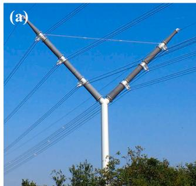

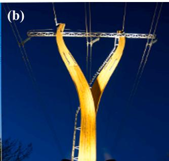

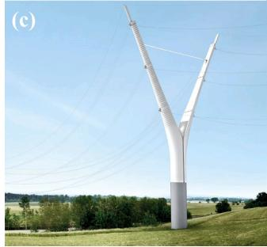

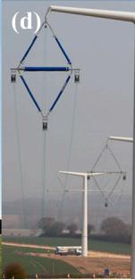

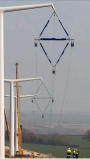  
Fig. 1. (a) The $\mathbf { \Delta } ^ { \mathrm { \mathfrak { c } } } \mathbf { Y } ^ { \prime }$ shaped pylon proposed by the European Composite Pylon project [3]. (b) Finland tower [4]. (c) Y-Pylon proposed by Knight Architects with Roughan & O’Donavon, and ESB International in association with MEGA [5]. (d) Prototypes of ‘T’ pylon [6].

At the same time, the new design of pylon structure along with using of composite materials means that empirical formulas commonly used for assessment of the lightning performance of transmission towers need to be modified. In high voltage engineering, empirical expressions play important roles in screening, precheck some solutions, and verifying behavior in some special terrain [12]. The lightning transient response can be obtained by simple calculation without the resort to the simulation software [13,14], and the cumbersome modeling process is saved. Thus, it is necessary to improve and propose new empirical formulas with acceptable errors, which can do a fast estimation for these novel pylons.

In this paper, taking the Y-shaped tower in Fig. 1 (a) as the research object, we proposed the multistage segmentation method to express the surge impedance of the down-leads. The electromagnetic transient (EMT) model in PSCAD/EMTDC has been built considering the coupling effect between the separated down-leads, as well as the stray capacitance among the down-lead and phase conductors. Meanwhile, through the simplification of the grounding system, the surge traveling process with lightning striking is investigated based on the lattice diagram method, and the derivation process for the new empirical method based on the traditional lattice diagram method is demonstrated. Furthermore, a contrastive study on the accuracy of the new and traditional methods is performed with different lengths of electrode rods buried in a frequencydependence soil model. The results show that the improved empirical formulas have higher precision in the prediction of the lightning performance of the composite tower.

# 2. Tower and ground modeling

# 2.1. Tower modeling

# 2.1.1. Y-shaped pylon structure

The composite pylon adopts two uni-body composite cross-arms and forms a symmetrical $\mathbf { \Delta } ^ { \mathrm { \mathfrak { s } } } \mathbf { Y } ^ { \mathrm { \prime } }$ pattern. The cross-arm is made of FRP to function as an insulator and each cross-arm supports three two-bundle conductors. The shielding angle of the pylon is − 60◦ [7]. Two shield wires are fixed at the tip of cross-arms. The phase-to-shield wire creepage clearance is 2.8 m [15]. Two bare conductors with the radius of

Table 1 Parameters of Y composite pylon.   

<table><tr><td>Parameter</td><td>Y pylon</td></tr><tr><td>Tower height ht [m]</td><td>22.5</td></tr><tr><td>Upper conductor (AIN) height [m]</td><td>21.1</td></tr><tr><td>Middle conductor (BIN) height [m]</td><td>19.3</td></tr><tr><td>Lower conductor (CIN) height [m]</td><td>17.5</td></tr><tr><td>Shielding distance [m]</td><td>20.78</td></tr><tr><td>Tower base radius [m]</td><td>1.5</td></tr><tr><td>Radius of conductors and wires r [m]</td><td>0.0175</td></tr><tr><td>Distances between shield wire to conductor [m]</td><td>2.8</td></tr><tr><td>Distances between conductors [m]</td><td>3.6</td></tr><tr><td>Span length [m]</td><td>250</td></tr></table>

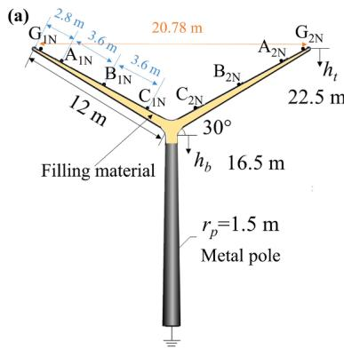

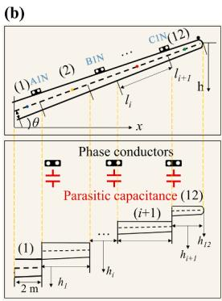  
Fig. 2. (a) The parameters of the Y-shaped composite pylon. (b) The schematic of the composite cross-arm divided by multiple segments and the rotated equivalent models. Where $\mathrm { G } _ { \mathrm { i N } } ,$ , AiN, BiN, and $\mathrm { C } _ { \mathrm { i N } }$ are the shield wires, upper, middle, and lower phase conductors $( \mathbf { i } = 1 , 2 )$ .

1.75 cm going through the inside of cross-arms are connected with the steel mast. A metal cylinder is mounted at the bottom of the mast as the ground electrode to conduct the lightning current. Table 1 shows the structure parameters of the composite tower, and the actual tower with dimensions is illustrated in Fig. 2(a).

# 2.1.2. Surge calculation of down-lead

To estimate the lightning performance of the towers, an equivalent circuit should be developed for all metal parts. For the Y-shaped pylon, because the down-lead inside the cross-arm has a tilting characteristic and composite housing, none of the available equations can be used for calculating the surge impedance at present. It is known that the surge impedance can be equal to the square root of inductance/capacitance for high frequency [16]. We can obtain the inductance and the capacitance of the down-lead by integral calculation. The derivation process of inductance (L) and capacitance (C) inside the cross-arm is in Appendix $\mathbf { A } ,$ and the correctness of the formulas is also confirmed by the Finite Element Method (FEM) simulation [17]. However, the integral form of expression is too complex for engineering practice, and the inclination of the down-lead is inconvenient to enable mutual coupling in EMT software. Thus, inspired by the multistory method, we simplify the downlead and divide it into multi-parts. In theory, the more segments, the more accurate the equivalent. However, excessive segmentation means an extremely short time step and complicates the modeling process. Thus, a unibody cross-arm is divided into 12 pieces with each piece of 1 m. We assumed that each part of the piece rotates to a horizontal state with the geometric center as the rotation axis (Fig. 2(b)). The length of the simplified segment is the projection of the real length on the horizontal level. The further simplified formulas are shown as follows:

$$
L = \frac {l \cos \theta}{2 \pi} \left(\mu_ {1} \ln \frac {b}{a} \frac {2 h - a}{2 h - b} + \mu_ {0} \ln \frac {2 h - b}{b}\right) (\mathrm {H}) \tag {1}
$$

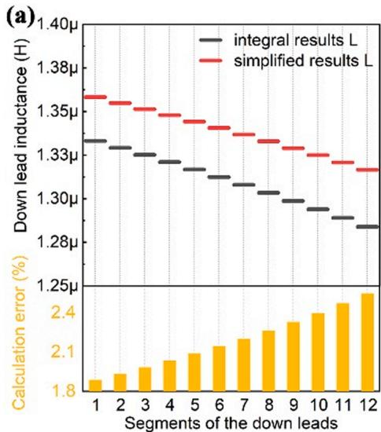

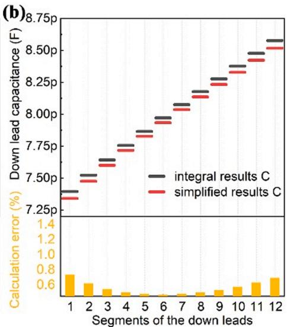  
Fig. 3. The contrast of the (a) inductance and (b) capacitance of the down-lead obtained by integral equations and simplified calculation. The yellow columns show the deviation of results from the simplified calculation.

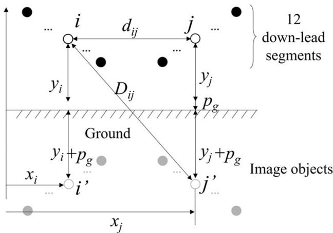  
Fig. 4. Application of the image method of calculating the mutual impedance between horizontal down-lead segments.

$$
C = \frac {2 \pi l \cos \theta}{\frac {1}{\varepsilon_ {1}} \ln \frac {b}{a} \frac {2 h - a}{2 h - b} + \frac {1}{\varepsilon_ {0}} \ln \frac {2 h - b}{b}} (\mathrm {F}) \tag {2}
$$

where l, h, and b are the length, height, and radius of the cross-arm segments. θ is the angle between the horizontal line and the crossarm. r is the radius of the down-lead. $\mu _ { 1 , }$ and $\varepsilon _ { I }$ are the permeability (approximated as vacuum permeability) and relative dielectric constant of the filling materials $( \varepsilon _ { 1 } = 2 . 6 4 \varepsilon _ { 0 } )$ .

To verify the precision of the equivalent, we obtained the L and C values from the two methods as shown in Fig. 3. Taking the result obtained by the integral method as the standard, the errors derived from the simplified model for L is no more than 2.5 %, and for C is less than 0.74 %, which are within the acceptable degree.

For the vertical metal cylinder, the surge impedance $Z _ { \nu }$ varies as the wave travels along the pole [17], and different forms of formulas are proposed for representing the transient behavior of transmission towers subjected to lightning currents [18–22]. Sargent and Darveniza proposed the expression (3) when they studied the indicial response of a ramp wave of current by a theoretical approach and experimental work [22], which is recommended by references [17,23]. Where h is the height of the vertical part and $r _ { p }$ denotes the radius of the cylinder (1.5 m). The deduction process of the formula (3) is exhibited in Appendix B.

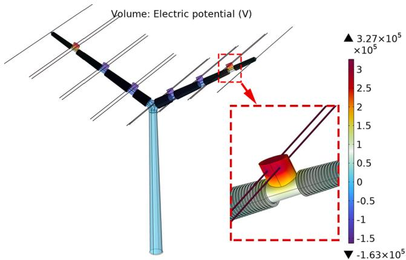  
Fig. 5. The potential distribution of tower when calculating stray capacitance between down-lead and phase conductors.

$$
Z _ {v} = 6 0 \left[ \ln \left(\frac {2 \sqrt {2} h}{r _ {p}}\right) - 1 \right] \tag {3}
$$

# 2.1.3. Mutual coupling between down-leads

When a lightning current flows through a down-lead, the other down-lead will generate the induced voltage through the mutual electromagnetic relationship between them. Based on the piecewise equivalent model of the down-lead aforementioned, the coupling effect can be established by the impedance matrix, which can be deduced from the geometric and electric characteristics of the 12 down-lead segments. Assuming i-th $( 1 \leq i \leq 1 2 )$ and j-th downlead pieces are located at different cross-arms with the same horizontal level, and current Ii and Ij conduct through i-th and j-th downlead pieces, respectively. Considering that down-lead pieces hang over a lossless conducting ground, and the image method is employed to get the series impedance matrix $Z _ { m }$ as shown in Fig. 4. The voltage $U _ { i }$ and $U _ { j }$ of down-lead segments are computed by (4). In PSCAD, Frequency Dependent (Phase) Model is adopted in the modeling of the down-lead segments, and mutual coupling can be enabled to establish the mutual coupling [18].

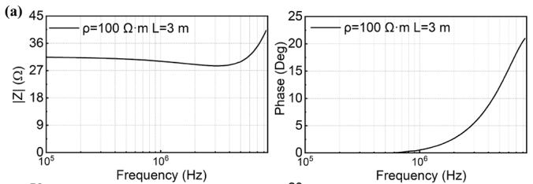

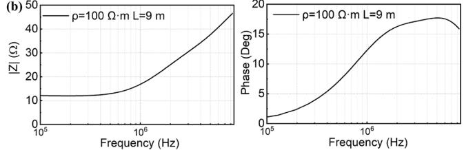

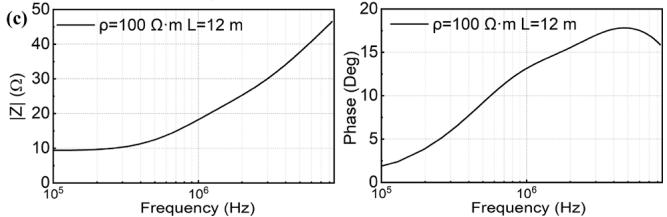  
Fig. 6. The impedance behavior of the vertical electrodes buried in the uniform soil with lengths of (a) L = 3 m, (b) L = 9 m, and (c) L = 12 m.

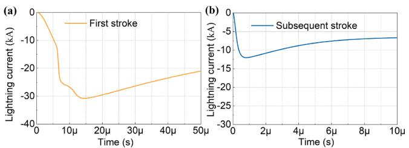  
Fig. 7. The typical first and subsequent stroke waveforms and the change rate of lightning current amplitude with time.

$$
\left[ \begin{array}{l} U _ {i} \\ U _ {j} \end{array} \right] = Z _ {m} \left[ \begin{array}{l} I _ {i} \\ I _ {j} \end{array} \right] = \frac {j \omega \mu_ {0}}{2 \pi} \left[ \begin{array}{l l} \ln \frac {D _ {i i}}{r} & \ln \frac {D _ {i j}}{d _ {i j}} \\ \ln \frac {D _ {j i}}{d _ {j i}} & \ln \frac {D _ {j j}}{r} \end{array} \right] \left[ \begin{array}{l} I _ {i} \\ I _ {j} \end{array} \right] \tag {4}
$$

where ω is the frequency $d _ { i j } = d _ { j i } = x _ { j } – x _ { i } , \mu _ { e }$ and $\sigma _ { e }$ refer to the ground permittivity and conductivity, respectively.

$$
p _ {g} = \sqrt {1 / \left(j \omega \mu_ {e} \sigma_ {e}\right)} \tag {5}
$$

# 2.1.4. Parasitic capacitance

Uni-body composite cross-arms replace the suspended insulators because the spatial distance of the down-lead and phase conductors are very close, resulting in a higher mutual parasitic capacitance between the down-lead and phase conductors compared with lattice towers. The value of parasitic capacitances also can be calculated by COMSOL (Fig. 5). In the equivalent circuit, the parasitic capacitances are represented by an external capacitor connected between the down-leads and conductors.

# 2.2. Ground system

In this paper, the single-layer soil model with soil resistance ρ of 100 Ω per meter is considered the ground model [14,24]. The concentrated rods with a length of 3, 9, and 12 m are adopted as electrodes and buried in the ground. The input impedance of tower footing can be obtained by

Table 2 First and subsequent lightning waveform parameters [26].   

<table><tr><td>Stroke type</td><td>k</td><td>I0(kA)</td><td>nk</td><td>τ1(μs)</td><td>τ2(μs)</td></tr><tr><td rowspan="7">First stroke</td><td>1</td><td>3</td><td>2</td><td>3</td><td>76</td></tr><tr><td>2</td><td>4.5</td><td>3</td><td>3.5</td><td>25</td></tr><tr><td>3</td><td>3</td><td>5</td><td>5.2</td><td>20</td></tr><tr><td>4</td><td>3.8</td><td>7</td><td>6</td><td>60</td></tr><tr><td>5</td><td>13.6</td><td>44</td><td>6.6</td><td>60</td></tr><tr><td>6</td><td>11</td><td>2</td><td>10</td><td>600</td></tr><tr><td>7</td><td>5.7</td><td>15</td><td>11.7</td><td>48.5</td></tr><tr><td rowspan="2">Subsequent stroke</td><td>1</td><td>10.7</td><td>2</td><td>0.25</td><td>2.5</td></tr><tr><td>2</td><td>6.5</td><td>2</td><td>2</td><td>230</td></tr></table>

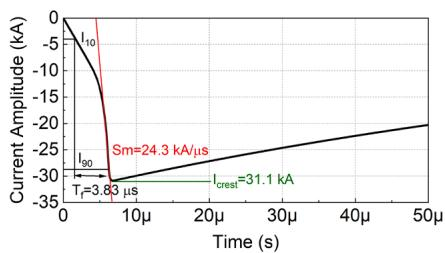  
Fig. 8. A typical CIGRE lightning waveform with median values of parameters.

the electrical field integral equation which can be solved by the Method of Moment [14]. The magnitude and phase of the input impedance are shown in Fig. 6. The ground impedance data can be embedded into the FDNE1 module in PSCAD and used as the ground model.

# 2.3. Lightning strokes

The typical lightning waveforms compose of the first and subsequent return strokes, which can be characterized as a function of time t by Heidler’s, defined as (6)–(7) [14]. Alberto De Conti and Silverio Visacro modified the expression using a sum of multiple Heidler functions that can reproduce the concave shape and multi-peaks of the first stroke [25] and match well with the measured actual waveform (Fig. 7) [26], which is recommended to investigate the transient response of the Y-shaped pylon being struck by lightning. The parameters of the typical first and subsequent return strokes to reproduce the lightning waveform observed at Mount San Salvatore [16] are given in Table 2.

$$
I = \frac {I _ {0}}{\eta} \left\{\left(\frac {t}{\tau_ {1}}\right) ^ {n _ {k}} e ^ {- \frac {t}{\tau_ {2}}} / \left[ 1 + \left(\frac {t}{\tau_ {1}}\right) ^ {n _ {k}} \right] \right\} \tag {6}
$$

where $\tau _ { 1 } , \tau _ { 2 } ,$ and nk are constants, η is expressed as:

$$
\eta = e ^ {\left(- \frac {\tau_ {1}}{\tau_ {2}} \left(n _ {k} \frac {\tau_ {2}}{\tau_ {1}}\right) ^ {- n _ {k}}\right)} \tag {7}
$$

In this work, the CIGRE waveform is also employed as the lightning waveform to investigate the critical current (I ) causing the backflash of the composite tower at a different front time $( T _ { f } ) .$ . The concavity is not reflected in the CIGRE lightning model, but the other important parameters such as lightning steepness $( S _ { m } )$ at the initial state and the crest point, time to 10 % crest $( I _ { 1 0 } ) ,$ and 90 % $\left( I _ { 9 0 } \right)$ are retained. The CIGRE model is packaged and ready to use in PSCAD and the parameters are easy to be controlled, which is recommended to perform the sensitivity analysis considering currents with different $T _ { f }$ and amplitudes in simulation [26]. The median values for $T _ { f }$ and tail time $T _ { t }$ are 3.83/77.5 μs and crest current $I _ { c r e s t } , S _ { m }$ are 31.1 kA and 24.3 kA/μs, separately [23]. The CIGRE waveform with the corresponding parameters is shown in Fig. 8. Due to $T _ { t }$ having an insignificant impact on the $I _ { c }$ [16]. In the simulation setting, the lightning waveform with the same $T _ { t }$ of 77.5 μs. The correlation between $S _ { m }$ and its crest current $I _ { c r e s t }$ follows [23]

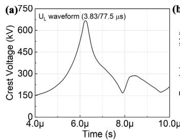

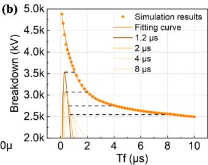  
Fig. 9. (a) Lightning waveform with $T _ { f }$ of 3.83 μs stressed on the cross-arm. (b) The V-T curve waveform as a function of the different $T _ { f } .$ .

$$
S _ {m} = 1. 4 I _ {\text {c r e s t}} ^ {0. 7 7} \tag {8}
$$

In addition, the surge impedance of the lightning current discharge channel is set to 1000 Ω [16].

# 2.4. Flashover criteria

To obtain the $I _ { c } ,$ the withstand voltage of the cross-arm corresponding to a 50 % probability of flashover should be determined first. The leader progression model (LPM) based on the physical discharge development process, is a widely used and accepted method for flashover criterion. The model sums up the time taken for corona inception, streamer propagation, and leader propagation process to take place. All the stages are developed based on laboratory environment tests. According to the CIGRE WG 33–01, the leader propagation process is dominant and can be expressed by the differential equation [16]:

$$
\frac {d s}{d t} = g u (t) \left(\frac {u (t)}{D - s} - E _ {0}\right) \tag {9}
$$

where s is the length of the leader, u(t) is the voltage across the air gap. D is the gap length. $E _ { O }$ is the threshold electric field of leader progression and g is the coefficient of the leader progression speed. $E _ { O }$ and g depend on the type of the insulators and the polarity of the lightning impulse voltage. Due to the similar material composition and insulator length, the flashover characteristics along the composite insulator can be regarded as that of a post insulator [17,27]. The g and $E _ { O }$ for negative discharge are recommended to be $1 . 0 \times 1 0 ^ { 6 } \mathrm { \ m } ^ { 2 } / \mathrm { V } ^ { 2 } / s$ and 670 kV/m [16].

When the leader progresses continually until the remaining gap distance is less than $h _ { f } ,$ the leader will jump, resulting in gap breakdown. The jump threshold h is given by [28]

$$
h _ {f} = 3. 8 9 / (1 + 3. 8 9 / D) \tag {10}
$$

The volt-time curve (V-T curve) used for empirical formulas can be determined according to the LPM model. The lightning waveform with

$T _ { f }$ of 3.83 μs is exhibited in Fig. 9(a). In fact, when standard lightning strikes on the shield wires, the $T _ { f }$ and tail time (Tt) of the overvoltage across the cross-arm is sharply shortened. Therefore, considering the real waveform stressed on the cross-arm and the flashover voltage against the different Tf is plotted as Fig. 9(b). Wherein, four curves in the bottom right corner of the figure are the real waveform on the cross-arm when lightning with Tf of 1.2 μs, 2 μs, 4 μs, 8 μs terminates on the top of the pylon, and scatter fitting camber line denotes the lowest voltage triggered flashover corresponding to different range of $T _ { f } .$

# 2.5. EMT model for the composite pylon

In this paper, a double-circuit transmission line with seven pylons is modeled as the base of the simulation with a lightning flash hitting on one shield wire of the middle pylon. Frequency Dependent (Phase) Model with a frequency range of 0.5–10 MHz is used for modeling the transmission lines. Considering 5 % voltage fluctuation on the phase conductors, the rated line voltage is set to be 420 kV, and the transmission capacity is 1000 MVA. The modeling of the transmission lines and down-lead system of the Y composite pylon in PSCAD has been completed and depicted in Fig. 10.

# 2.6. BFR calculation

According to the statistical data from Berger [23], the amplitude and front time of the lightning current follow the lognormal distribution in (11).

$$
f (x) = \frac {1}{\sqrt {2 \pi} \beta x} e ^ {- \frac {1}{2} \left(\frac {\ln (x / M)}{\beta}\right) ^ {2}} \tag {11}
$$

The mean value μ of the lightning parameter can be determined by the two coefficients M and $\beta .$ They are recommended to be 31.1 and 0.484 for lightning amplitude, and 3.83 and 0.553 for $T _ { f } ,$ respectively [23].

$$
\mu = M e ^ {\frac {\beta^ {2}}{x}} \tag {12}
$$

Where variable x is the lightning front duration $T _ { f } ,$ the critical current for flashover corresponding to T is I (T ). P(T ) is the probability of a lightning current with a front $T _ { f } .$ . The BFR can be obtained by [16]

$$
B F R = 0. 6 N _ {L} \int_ {0} ^ {\infty} P \left(T _ {f}\right) \left[ 1 - \int_ {0} ^ {t _ {c}} f (x) \mathrm {d} x \right] \mathrm {d} T _ {f} \tag {13}
$$

$N _ { L }$ estimates the number of strikes to the line per year per 100 km, which can be calculated according to (14) [29–31].

$$
N _ {L} = \frac {N _ {g}}{1 0} \left(2 8 h _ {t} ^ {0. 6} + W\right) \tag {14}
$$

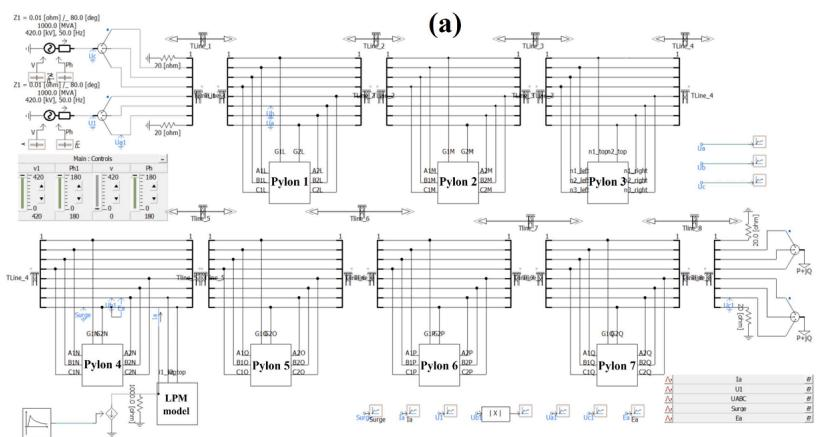

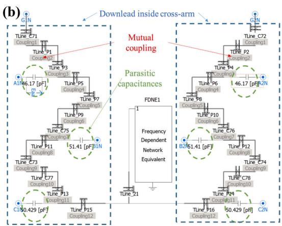  
Fig. 10. The modeling of (a) transmission lines and (b) the down-lead system in PSCAD considering the mutual coupling and parasitic capacitance.

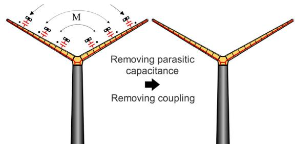  
(a)

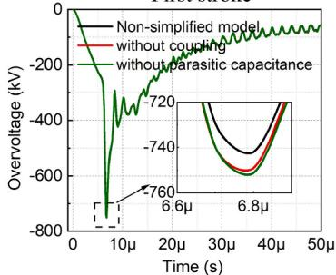  
First stroke

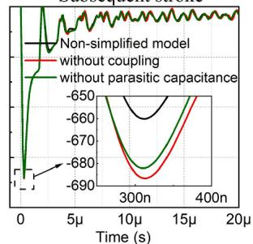  
Subsequent stroke

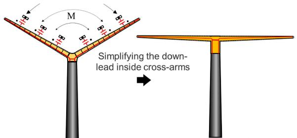  
(b)

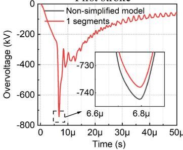  
First stroke

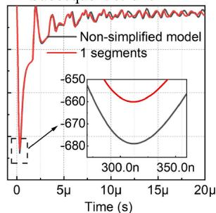  
Subsequent stroke   
Fig. 11. (a) The schematic of pylon down-lead system simplification, and the overvoltage waveform on the top of the pylon with the first stroke and subsequent stroke when coupling effect and parasitic capacitance is no longer considered. (b) The schematic of the simplified pylon model with horizontal down-lead, and the overvoltage response on the shield wire to the first and return stroke.

where W is the horizontal distance between two shielding wires. Taking the lightning flash density in Denmark as an example, the worst $N _ { g }$ for the last decade is equal to 1.39 flashes/km2 •year [29].

In practical calculation, the first step is to determine the discrete $T _ { f }$ as well as the corresponding $I _ { c } .$ According to the lognormal distribution, when $T _ { f }$ exceeds 12 μs, the cumulative backflash probability is calculated to be less than $1 \times 1 0 ^ { - 6 } ,$ , which has little impact on the total BFR. Thus, I considering a number n of 120 discrete $T _ { f }$ values (in the range of 0.1–12 μs and an increment ΔT of 0.1 μs) has been used. C(Ic) is the cumulative probability function of the lightning current less than $I _ { c } .$ Then the probability of $T _ { f }$ and $I _ { c }$ can be obtained by (11). The corresponding probability of each $T _ { f }$ is P(T )ΔT. Finally, the total BFR considering the $T _ { f }$ range can be obtained by (15) [32].

$$
B F R = 0. 6 N _ {L} \sum_ {i = 1} ^ {n} \left\{\left[ P \left(T _ {f}\right) \Delta T \right] \left[ 1 - C \left(I _ {c} \left(T _ {f}\right)\right) \right] \right\} \tag {15}
$$

# 3. Modeling simplification

Although the simulation results are of high accuracy, too many components and electromagnetic phenomena should be built, which is not conducive to formula expression and fast assessment. The formula expression should be simple as possible on the premise of acceptable accuracy. It is necessary to discuss the influence of the modeling modes mentioned above on the precision of the lightning transient performance, and then ignore the factors with low influence degree. In this section, the transient voltage of the pylon includes all modeling mentioned above with first and return lightning striking on the top of the tower is used as a standard, then the modeling of mutual coupling, parasitic capacitances, and down-lead segments are removed or simplified step by step. The simplest model with sufficient precision is obtained by comparing the overvoltage difference before and after simplification. Finally, the simplest model is the base for empirical formula deduction in the next section.

# 3.1. Effect of the coupling and parasitic capacitance

In the PSCAD model, we remove the mutual coupling and the parasitic capacitances separately. The top voltages of the tower with first and subsequent strokes are shown in Fig. 11(a). Without coupling and

parasitic capacitance, the overvoltage amplitude increases slightly by 4.5 %, and the waveforms are almost coincident. It can be concluded that the coupling effect and the capacitances between the phase conductors and down-lead are not significant. The reason for weak coupling is that the space angle between the two down-lead is 120◦, and the magnetic flux derived from one down-lead through another one is limited. Besides, the maximum coupling distance between them is more than 20 m. For the parasitic capacitances, though their values are much higher than that of steel lattice towers, they are still too small (tens of pF) to impact the overvoltage.

# 3.2. Down-lead simplification

For down-lead modeling, there are considered 12 short transmission lines, and each connection point is a discontinuity. The complicated lightning surge traveling process is almost impossible for hand calculation. However, surge impedance variation of each segment is limited, and the formula expression of the model can be realized by reducing the number of segments. Fig. 11(b) depicts the overvoltage wave pattern on the top of the towers with time. As the number of the down-lead segment decreases, the overvoltage amplitude decreases gradually. The maximum error of the crest voltage of 1 segment is about 2.74 % compared with 12 segments. The error derived from a simplification of the down-lead offset part errors of removal of coupling and parasitic capacitance.

By the means of EMT simulation, we obtain the preliminary downlead model that only two horizontal down-leads connect with the steel mast in PSCAD. That means the surge traveling along the down-leads can be analyzed manually and it is possible to propose simplified formulas to evaluate the lightning performance.

# 4. Empirical formula deduction

In this section, the empirical formulas for evaluating the critical current of the composite pylon are deduced based on the lattice diagram. First, the CIGRE recommended lattice diagram method is introduced, then the deduction process for the Y composite pylon based on the simplified down-lead model is displayed.

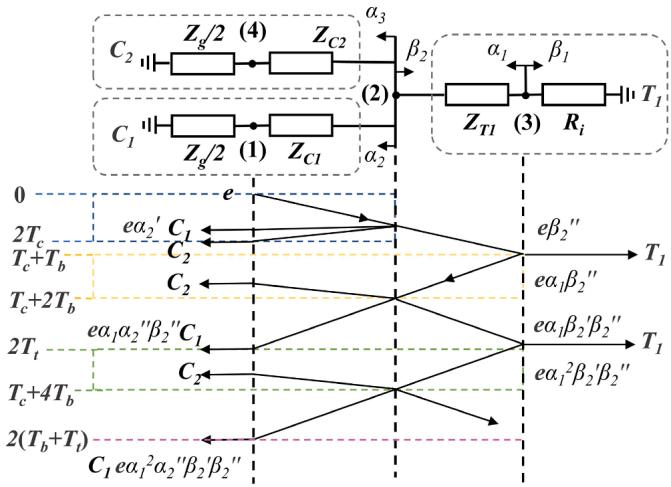  
Fig. 12. The lattice diagram for the surge traveling of the Y-shaped pylon. (1) and (4) indicate the top of the pylon, (2) is the connection point of the crossarm and pylon body, and (3) is the bottom of the pylon. $C _ { 1 }$ and $C _ { 2 }$ are the cross-arms, and $T _ { 1 }$ is the pylon body.

# 4.1. Original CIGRE method

The original lattice diagram method suggested by CIGRE considers the wave traveling process along one pole between the shield wire and ground impedance. This method assumes that there is no reflection at the conjunction point of the shield wire and tower body, and only discontinuity at the ground position is considered $[ 1 6 , 2 3 ]$ . In addition, the wave shape of the voltage is defined as a linear rising front and an infinite tail. The critical current $I _ { c }$ is given by

$$
I _ {c} = V _ {T T} / K _ {T T} K _ {S P} \tag {16}
$$

$V _ { T T }$ is the voltage at the top of the pylon when lightning strikes on the tower, which is equal to the sum of $U _ { L }$ and induced voltage on the conductor $U _ { c } .$

$$
U _ {c} = k V _ {T T} - h _ {c} (1 - k) I _ {c} / T _ {f} \tag {17}
$$

where k is the coupling coefficient between shield wire and phase conductor, and $h _ { c }$ is the height of the upper phase conductor. KTT and $K _ { S F }$ are

$$
K _ {T T} = R _ {e} + \frac {Z _ {g} - 2 R _ {i}}{Z _ {g} + 2 R _ {i}} \frac {L}{T _ {f}} \tag {18}
$$

$$
R _ {e} = \frac {R _ {i} Z _ {g}}{Z _ {g} + 2 R _ {i}} \tag {19}
$$

$$
K _ {S P} = 1 + \alpha_ {R} \left(1 + \alpha_ {T}\right) \left[ \left(1 - \frac {2 T _ {s}}{T _ {f}}\right) - \alpha_ {R} \alpha_ {T} \left(1 - \frac {4 T _ {s}}{T _ {f}}\right) - \dots \right] \tag {20}
$$

where L is the total inductance of down-lead and lattice tower, and $T _ { s }$ is the travel time on the span. $\alpha _ { T }$ is the reflection coefficient at the point of tower footing impedance and pylon body, and $\alpha _ { R }$ is the reflection coefficient at the point of transmission line and adjacent towers. Then, $I _ { c }$ can be calculated accordingly (16).

# 4.2. New lattice diagram method

The newly proposed method is also based on the lattice diagram method, and the specific bifurcation configuration is considered in the inference process. To facilitate the formula expression, here are four assumptions suggested.

(1) The effect of the reflection from adjacent towers is neglected to simplify the formula expression. The empirical results show that

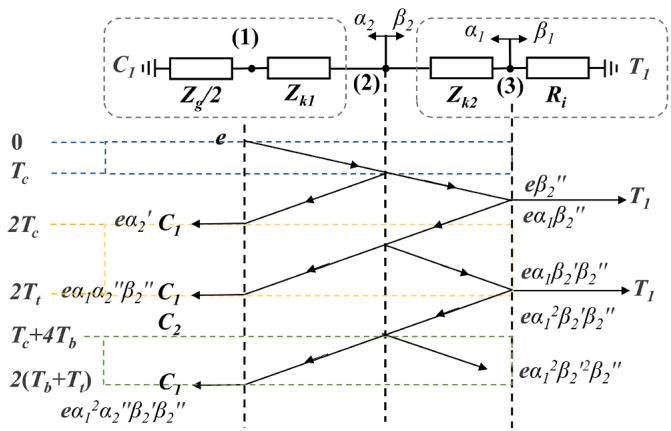  
Fig. 13. The simplified lattice diagram applied for Y-shaped pylon.

the adjacent tower can decrease the crest voltage but is less effective [23].

(2) In PSCAD model, the ground impedance is frequency-dependent and varies with lightning waveform. To simplify the expression, the ground resistance is represented by a fixed resistance at impulse conditions. According to the formula in (21) [30], the solid values are given for different length conditions.

$$
R _ {i} = \left(\rho_ {0} / 2 \pi L\right) \left[ \ln \left(4 L / r _ {0}\right) - 1 \right] \tag {21}
$$

(3) The results concluded in section 3 show that the down-lead inside the cross-arm with a horizontal position has relatively high accuracy. Thus, the composite materials wrapped on the down-lead are neglected and take their geometric center position as the height, and the surge impedance can be calculated by $Z _ { c } = 6 0 \mathrm { l n } ( 2$ h/r) [16].

Currently, there are four discontinuity points in the equivalent circuit. The lattice diagram for the surge traveling of a Y-shaped pylon is depicted in Fig. 12.

(4) We follow the assumptions of the previous empirical formula: $z _ { g }$ $= 2 \times Z _ { C 1 } [ 2 3 ]$ . $Z _ { C 1 }$ is the surge impedance of the down-lead inside the cross-arm. Namely, $e \ = \ Z _ { g } \ \times \ I / 4 ,$ , and the surge impedance discontinuities at (1) and (4) are neglected.

Subsequently, we define the reflection and refraction coefficients. When the lightning current passes point (2) from the cross-arm side to the pylon body side, the reflection coefficient is $\alpha _ { 2 } ^ { \prime }$ , and the refraction coefficient is $\alpha _ { 2 } ^ { \prime } { } ^ { \mathrm { , } }$ ’. While the voltage from tower footing impedance passes through point (2) from the pylon body side to the cross-arm side, the reflection coefficient is $\beta _ { 2 } ^ { ' } ,$ , and the refraction coefficient is $\beta _ { 2 } ^ { { \prime } } { ^ { \prime } }$ ’. This case is a multi-outgoing line system.

$$
\alpha_ {2} ^ {\prime} = \frac {Z _ {k 2} - Z _ {C 1}}{Z _ {k 2} + Z _ {C 1}} \tag {22}
$$

$$
\beta_ {2} ^ {\prime} = \frac {Z _ {k 1} - Z _ {T 1}}{Z _ {k 1} + Z _ {T 1}} \tag {23}
$$

$$
\alpha_ {2} ^ {\prime \prime} = \frac {2 Z _ {k 1}}{Z _ {k 1} + Z _ {k 2}} \tag {24}
$$

$$
\beta_ {2} ^ {\prime \prime} = \frac {2 Z _ {k 2}}{Z _ {k 2} + Z _ {T 1}} \tag {25}
$$

wherein, $\beta _ { 2 } ^ { \prime } \cdot _ { \cdot \alpha _ { 2 } ^ { \prime } = 1 }$ , and $\alpha _ { 2 } ^ { \prime \prime } { } ^ { * } { - } \beta _ { 2 } ^ { \prime } { = } 1 . \ : Z _ { k 1 } = Z _ { C 1 } / 2$ and $Z _ { k 2 } = Z _ { C l } Z _ { T 1 } / ( Z _ { C 1 }$ + ZT1). We found that the cross-arm $C _ { 2 }$ has no impact on the overvoltage on the $C _ { 1 }$ in this circuit. If the branch of $C _ { 2 }$ is not considered. The lattice

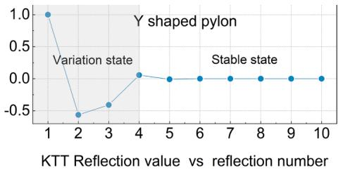

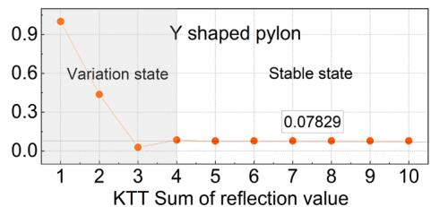  
Fig. 14. The real and absolute value of parts in $K _ { T T } ,$ and the sum of the first n parts in $K _ { T T }$ .

process can be further simplified as Fig. 13 shown. The crest tower top voltage is

$$
V _ {T T} = Z _ {g} K _ {T T} I _ {c} / 4 \tag {26}
$$

$$
\begin{array}{l} K _ {T T} = 1 + \alpha_ {2} ^ {\prime} \left(1 - 2 T _ {c} / T _ {f}\right) + \sum_ {n = 3} ^ {\infty} \alpha_ {2} ^ {\prime} n - 2 \alpha_ {2} ^ {\prime \prime} \beta_ {2} ^ {\prime} n - 3 \beta_ {2} ^ {\prime \prime} \{1 - 2 \left[ T _ {t} \right. \\ + (n - 3) T _ {b} ] / T _ {f} \} \tag {27} \\ \end{array}
$$

where $T _ { t } , T _ { c } ,$ and $T _ { b }$ are travel time from top to bottom, traveling time in the cross-arm, and time in the pylon body, respectively. Where n is the number of the voltage on the cross-arm in the process of surge traveling. As $K _ { T T }$ is an infinite coefficient, it cannot be fully expressed by empirical formulas. Thus, (27) should be replaced by a finite expression. The real values and absolute values of the individual components of $K _ { T T }$ are shown in Fig. 14. It can be seen that the absolute values of the $K _ { T T }$ parts exhibit an attenuation trend. The sum of the first n parts is also shown in Fig. 14. When the $n = 4 ,$ , the whole value of $K _ { T T }$ reaches a constant status. Thus, the first four parts are given as expressions of $K _ { T T } .$ .

# 5. Results and discussion

In this section, we use the proposed formulas to estimate the critical current (Ic) and BFR of the Y-shaped pylon. We also perform a comparative study on the results from the original and new methods and simulations. The CIGRE lightning waveform is adopted for simulation. In the process of the formula calculation, the equivalent lightning waveform with a triangle front (Tf) and the constant tail is used for both original and new empirical formulas. The $S _ { m }$ is equal to $I _ { c r e s t } / T _ { f }$ . The simulation results are taken as a standard reference with all modules in Section 2 considered, and the $I _ { c }$ curves as the function of $T _ { f }$ are illustrated in Fig. 15(a)-(c). We can find that the Ic vs Tf curve from the new method has a similar shape to the reference curve compared with that of the original CIGRE method. It is noteworthy that the error becomes larger when the $T _ { f }$ is very short or long. However, the probability of lightning front time appearing in this interval is very low. Thus, we introduce the concept of the confidence interval. For example, a 95 %

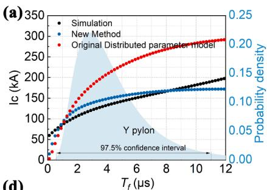

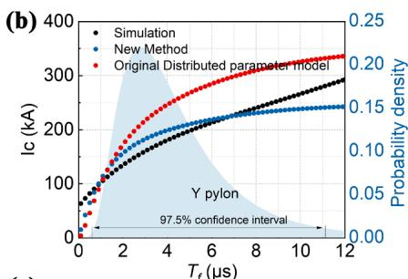

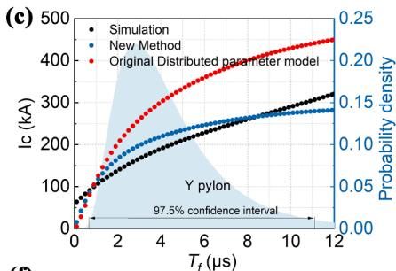

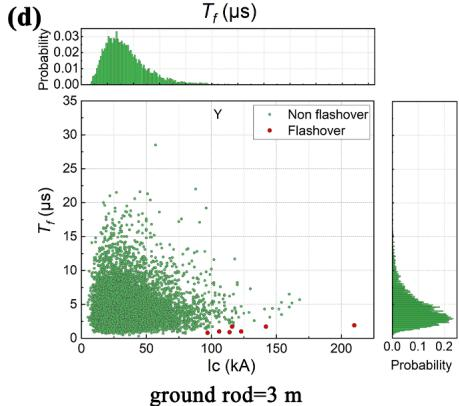

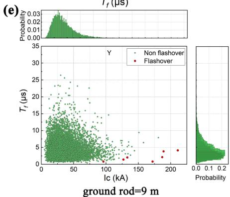

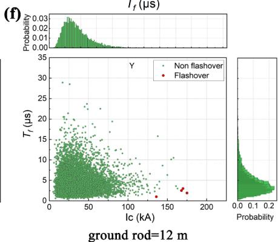  
Fig. 15. The non-simplified simulation, new and original method results for Y-shaped pylon with the Tf range between 0.1 and 12 μs when electrode length is (a) 3 m, (b) 9 m, and (c) 12 m. Statistics of flashover caused by10000 set random lightning currents for Y-shaped pylon with electrode length of (a) 3 m, (b) 9 m, and (c) 12 m.

Table 3 Calculation errors under different T confidence intervals (%).   

<table><tr><td rowspan="2">Confidence interval</td><td rowspan="2">Tf1(μs)</td><td rowspan="2">Tf2(μs)</td><td colspan="3">Original CIGRE method</td><td colspan="3">New Method</td></tr><tr><td>L = 3 m</td><td>L = 9 m</td><td>L = 12 m</td><td>L = 3 m</td><td>L = 9 m</td><td>L = 12 m</td></tr><tr><td>97.50 %</td><td>0.70</td><td>11.4</td><td>52.14</td><td>28.13</td><td>50.07</td><td>7.99</td><td>8.45</td><td>9.49</td></tr><tr><td>95 %</td><td>0.83</td><td>9.65</td><td>52.24</td><td>29.69</td><td>51.32</td><td>7.99</td><td>7.64</td><td>9.95</td></tr><tr><td>90 %</td><td>1.00</td><td>7.97</td><td>51.73</td><td>30.96</td><td>52.63</td><td>9.52</td><td>8.02</td><td>12.12</td></tr></table>

Table 4 Calculation of BFR with whole range of $T _ { f }$ (flash/100 km per year).   

<table><tr><td>Length of electrodes</td><td>Original</td><td>New</td><td>Monte Carlo</td></tr><tr><td>3</td><td>0.0128</td><td>0.0510</td><td>0.0379</td></tr><tr><td>9</td><td>0.0058</td><td>0.0062</td><td>0.0084</td></tr><tr><td>12</td><td>0.0025</td><td>0.0033</td><td>0.0070</td></tr></table>

confidence interval means the 95 % probability of lightning with $T _ { f }$ in this range. The calculation errors corresponding to different confidence intervals are listed in Table 3. In a 97.5 % confidential interval, the new method possesses relatively high accuracy. Along with the increase of the electrode length, the ground resistivity drops, and the estimation accuracy slightly decreases. The resulting curve calculated from the original method does not coincide with the simulation reference from $T _ { f }$ greater than $2 \mu \mathrm { s } .$ . The BFR results in a full range of $T _ { f }$ are also calculated by the original and new proposed methods, meanwhile, the Monte Carlo procedure is employed to simulate the real BFR case in the PSCAD model [27,33] as the BFR reference, through the random generation, 10 thousand sets of lightning with $T _ { f }$ and $I _ { c }$ accord with the lognormal distribution are generated. This series of data are then input into the PSCAD model, and the flashover and non-flashover data can be plotted in Fig. 15(d)-(f) for pylon with different ground rod lengths. The BFR results from the calculation and Monte Carlo method are given in Table 4. The new method results are closer to the simulation results used Monte Carlo procedure, which verifies that it would be highly advantageous for the new method applied for the Y-shaped pylon.

# 6. Conclusion

This paper presents the EMT model of the transmission tower with a

Y structure and its new empirical formulas for lightning performance. Firstly, the EMT model for the Y composite pylon is built in PSCAD and the multi-stage segmentation method is adopted for modeling the downlead. Mutual coupling and parasitic capacitances of the pylon have also been considered. The impact of the mutual coupling, parasitic capacitances, and segmentation as well as the position of the down-lead on transient response to first and return strokes have been evaluated. Based on that, the simple model of the down-lead system that two horizontal down-leads connected with the steel mast has been proposed. Then, the empirical formulas aiming at the pylon with a bifurcation structure are deduced. The new method has sufficient evaluation accuracy in the assessment of the lightning performance of the Y-shaped pylon. Taking the simulation results as standard, the maximum error of $I _ { c }$ is no more than 9.49 % when the lightning front time is in the 97.5 % confidence interval. The new method also has higher prediction accuracy than the original empirical formulas proposed in the CIGRE brochure, which can be attributed to consideration of the multi-discontinuities caused by the bifurcation structure. In summary, it would be highly advantageous for the new method applied to the Y-shaped pylon.

# Declaration of Competing Interest

The authors declare that they have no known competing financial interests or personal relationships that could have appeared to influence the work reported in this paper.

# Data availability

No data was used for the research described in the article.

# Appendix A

Here the integral forms of the expression of downlead inductance L and capacitance C are shown in this section. Meanwhile, the simulation is used to verify the correctness of the formulas. The mirror image method was employed as the method to deduce the inductance and capacitance of the segmented cross-arm. The detailed parameters of the down-lead inside the cross-arm are shown in the cross-section interface (Fig. A1 (a)) and external structure (Fig. A1 (b)).

# The inductance of down-lead inside the cross-arm

In linear media, the self-induction flux linkage of the coil $\psi$ is proportional to the excitation current I. At high frequencies, the skin depth becomes shallower. Thus, the inner inductance $L _ { i }$ can be neglected. This self-induction coefficient L consists of external inductance $L _ { e }$ [34,35].

$$
L = \frac {\Psi_ {e}}{I} = L _ {e} \tag {A1}
$$

The external flux linkage of cross-arm core $\psi _ { e } .$

$$
\Psi_ {e} = \int d \Phi = l \mu \int H _ {e} d x \tag {A2}
$$

$$
\boldsymbol {H} _ {e} = \boldsymbol {H} _ {1} + \boldsymbol {H} _ {2} + \boldsymbol {H} _ {3} \tag {A3}
$$

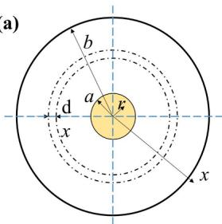  
（

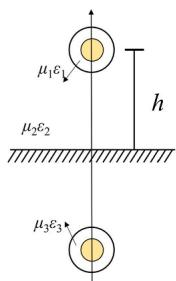

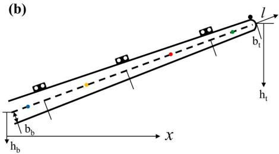  
  
Fig. A1. (a) The cross-section of the cross-arm and the mirror image of overhead down-lead inside the cross-arm. (b) The schematic of a real composite cross-arm.

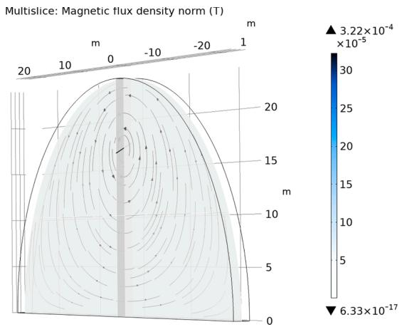  
Fig. A2. The magnetic flux density norm of a single down-lead section when 1 A current passes through it.

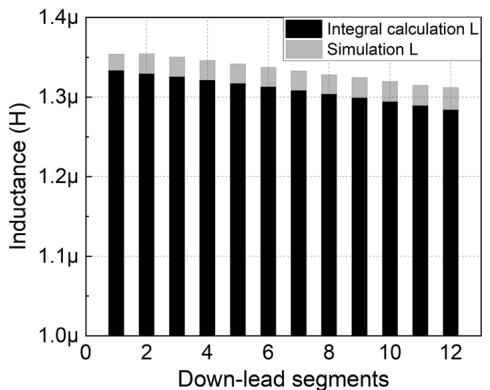  
Fig. A3. The comparison of calculated inductance and simulated inductance values of downlead segments.

where $H _ { 1 } , H _ { 2 } ,$ and $\mathbf { { \mathit { H } } _ { 3 } }$ denote the magnetic field intensity in cross-arm, air, and mirror cross-arm as shown in Fig. A1(a). The magnetic field strength of one point is the superposition of the $H _ { \mathrm { e } }$ produced by the cross-arm and its image, and the number of turns is 1.

$$
\Psi_ {e} = \frac {I l}{2 \pi} \left[ \mu_ {1} \int_ {a} ^ {b} \left(\frac {1}{x} + \frac {1}{2 h - x}\right) d x + \mu_ {2} \int_ {b} ^ {2 h - b} \left(\frac {1}{x} + \frac {1}{2 h - x}\right) d x + \mu_ {3} \int_ {2 h - b} ^ {2 h} \left(\frac {1}{x} + \frac {1}{2 h - x}\right) d x \right] \tag {A4}
$$

$$
\Psi_ {e} = \frac {I l}{2 \pi} \left[ \mu_ {1} (\ln \frac {b}{a} + \ln \frac {2 h - a}{2 h - b}) + 2 \mu_ {2} (\ln \frac {2 h - b}{b}) + \mu_ {3} (\ln \frac {b}{a} + \ln \frac {2 h - a}{2 h - b}) \right] \tag {A5}
$$

Due to $\mu _ { 1 } = \mu _ { 3 } , \mu _ { 2 }$ is equal to the μ0. Ψ e is

$$
\Psi_ {e} = \frac {I}{\pi} \left(\mu_ {1} \ln \frac {b}{a} \frac {2 h - a}{2 h - b} + \mu_ {0} \ln \frac {2 h - b}{b}\right) \tag {A6}
$$

Note that dx = dlcos30◦, assuming lcos30◦=ĺ, á=a/cos30◦. The length of the whole cross-arm is $l _ { c } .$

$$
b = b _ {b} - \left(b _ {b} - b _ {t}\right) x / \left(l _ {c} \cos 3 0 ^ {\circ}\right) \tag {A7}
$$

$$
h = h _ {b} + x \tan 3 0 ^ {\circ} \tag {A8}
$$

The unit inductance for a segment of down-lead is

$$
L = \int_ {l _ {1}} ^ {l _ {2}} \frac {\Psi_ {e}}{2 I} \mathrm {d} l \tag {A9}
$$

$$
L = \int_ {l _ {1} ^ {\prime}} ^ {l _ {2} ^ {\prime}} \frac {1}{2 \pi} \left(\mu_ {1} \ln \frac {b}{a ^ {\prime}} \frac {2 h - a ^ {\prime}}{2 h - b} + \mu_ {0} \ln \frac {2 h - b}{b}\right) d x \tag {A10}
$$

The calculation can be validated by FEM simulation. The whole cross-arm is built in COMSOL software, and the ground is set as a magnetic insulation interface, then cutting the cross-arm into 12 segments, and each segment is defined as a coil with a 1 A current flowing through it. The magnetic flux density norm is obtained after computing the program (Fig. A2). The coil inductance can be derived in Global Evaluation. Fig. A3 exhibits the comparison between the simulation and calculation results of the inductance of 12 down-lead sections, the maximum relative error is less than 2.2 %, verifying the correctness of the integral formula of the inductance of the downlead.

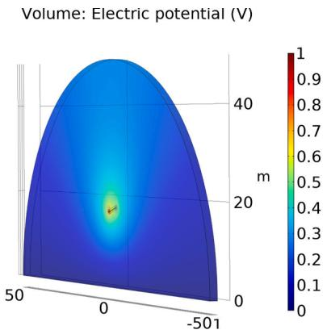  
Fig. A4. The potential distribution (side view) of a single downlead segment when 1 V voltage is applied to it.

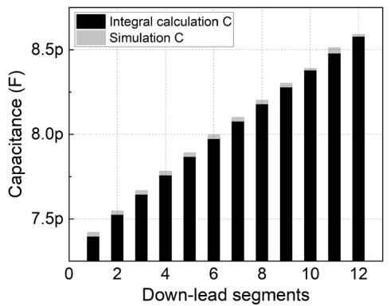  
Fig. A5. The comparison of calculated capacitance and simulated capacitance values.

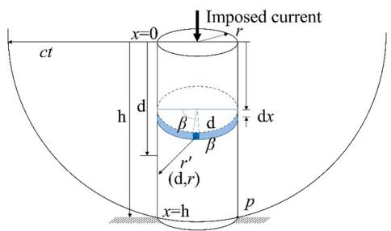  
Fig. A6. Metal cylindrical is used by field theory to calculate the surge impedance.

Capacitance of down-lead inside the cross-arm

Then the capacitance to the ground of the cross-arm can be calculated. The conductor charge density of the down-lead inside the cross-arm is ρ. The electric field at a certain point between the image and the object is

$$
\boldsymbol {E} (x) = \frac {\rho}{2 \pi \varepsilon} \left(\frac {1}{x} + \frac {1}{2 h - 1}\right) \boldsymbol {e} _ {x} \tag {A11}
$$

Due to $\varepsilon _ { 1 } = \varepsilon _ { 3 } , \varepsilon _ { 2 }$ is equal to ε0. U is

$$
U = \frac {\rho}{\pi} \left(\frac {1}{\varepsilon_ {1}} \ln \frac {b}{a} \frac {2 h - a}{2 h - b} + \frac {1}{\varepsilon_ {0}} \ln \frac {2 h - b}{b}\right) \tag {A12}
$$

The unit capacitance for a segment of down-lead is

$$
C = \int \frac {2 r}{U} \mathrm {d} l = \int_ {l _ {1}} ^ {l _ {2}} \frac {2 \pi}{\frac {1}{\varepsilon_ {1}} \ln \frac {b}{a ^ {\prime}} \frac {2 h - a ^ {\prime}}{2 h - b} + \frac {1}{\varepsilon_ {0}} \ln \frac {2 h - b}{b}} \mathrm {d} x \tag {A13}
$$

Similarly, the capacitance formula can be validated by FEM simulation. The full-scale cross-arm is modeled in COMSOL and the permittivity of the

filling material FRP is set to be 2.64. The down-lead segment is applied on 1 V voltage, and the potential distribution can be obtained as a simulation result depicted in Fig. A4. The capacitance values are derived from the Maxwell Matrix. The same simulation is carried out for 12 down-lead segments in sequence, and the comparison of the results from calculation and simulation is shown in Fig. A5. The very limited difference between them (less than0.42 %) validates the formula (A13) for calculating the capacitance.

# Appendix B

According to M. A. Sargent’s work [22], the responses of a cylindrical tower to lightning current can be calculated through field analysis. Assuming I = Kt and considering the cylindrical tower of Fig. A6, with a ramp current wave impressed at × = 0, at time t = 0. Then the time retarded, the surface density of current is

$$
J _ {s} \left(x, t - \frac {r ^ {\prime}}{c}\right) = \frac {K}{2 \pi r} \left(t - \frac {x}{c} - \frac {r ^ {\prime}}{c}\right) \tag {A14}
$$

Where c is the velocity of lightning propagation. The vector magnetic potential at a point $( \mathsf { d } , r )$ is

$$
\boldsymbol {A} = \frac {\mu_ {0}}{4 \pi} \int_ {0} ^ {2 \pi} \int_ {0} ^ {y} \frac {K}{2 \pi r} \left(t - \frac {x}{c} - \frac {r ^ {\prime}}{c}\right) \frac {r d x d \beta}{r ^ {\prime}} \vec {d} \tag {A15}
$$

Where the limit of integration y accounts for retardation effects and is calculated as

$$
y = \frac {1}{2} (d + c t) + \frac {r ^ {2}}{2 (d - c t)} \tag {A16}
$$

Therefore,

$$
\mathbf {A} = \frac {\mu_ {0} K}{4 \pi} \left[ (c t - d) \ln (c t - d) - c t - (c t - d) \ln \left(- d + \sqrt {d ^ {2} + r ^ {2}}\right) - \sqrt {d ^ {2} + r ^ {2}} \right] \overrightarrow {d} \tag {A17}
$$

$$
\frac {\partial \mathbf {A}}{\partial t} = \frac {\mu_ {0} K}{4 \pi} \left[ \ln (c t - d) - \ln (- d + \sqrt {d ^ {2} + r ^ {2}}) \right] \overrightarrow {d} \tag {A18}
$$

Integrating the electric field due to currents over the height of the cylinder,

$$
\int_ {d = 0} ^ {d = p} E _ {i} d s = - \frac {\mu_ {0} K}{4 \pi} [ - (c t - p) \ln (c t - p) - p - \sqrt {p ^ {2} + r ^ {2}} - p \ln (- p + \sqrt {p ^ {2} + r ^ {2}}) + c t \ln (c t) + r ] \tag {A19}
$$

Due to p = ct-r2 /2ct [36]

$$
\int_ {0} ^ {p} E _ {i} d s = - K t \left\{6 0 \left[ \ln \left(\frac {\sqrt {2} c t}{r}\right) - 1 + \frac {r}{2 c t} + \left(\frac {r}{2 c t}\right) ^ {2} \right] \right\} \tag {A20}
$$

The surge impedance of a cylindrical tower of a lightning current impressed is calculated as a function of traveling time t:

$$
Z = 6 0 \left[ \ln \left(\sqrt {2} \frac {c t}{r}\right) - 1 + \frac {r}{2 c t} + \left(\frac {r}{2 c t}\right) ^ {2} \right] \tag {A21}
$$

The maximum tower top potential will occur at time t = 2 h/c, for ct≫ r, h≫ r,

$$
Z = 6 0 \left[ \ln \left(\sqrt {2} \frac {2 h}{r}\right) - 1 \right] \tag {A22}
$$

# References

[1] ENTSO-E. Ten-Year Network Development Plan 2020. At a glance: Power system needs in 2030 and 2040; 2020. Available:< https://tyndp.entsoe.eu/>.   
[2] Jahangiri T, Wang Q, Bak CL, da Silva FF, Skouboe H. Electric stress computations for designing a novel unibody composite cross-arm using finite element method. IEEE Trans Dielectr Electr Insul 2017;24(6):3567–77.   
[3] Zhang H, Wang Q, Da Silva FF, Bak CL, Yin K, Skouboe H. Backflashover performance evaluation of the partially grounded scheme of overhead lines with fully composite pylons. IEEE Trans Power Deliv 2022;37(2):823–32.   
[4] Sørensen TK. Composite based EHV AC overhead transmission Lines. Technical University of Denmark; 2010. PhD thesis.   
[5] Wang Q. Experimental investigation on electrical behaviors of an innovative 400- kv double-circuit composite tower. Denmark: Aalborg University; 2018. PhD thesis.   
[6] Gutman I, Lundengård J, Fairhurst M. Three-phase pollution test of diamondshaped “suspension” insulator arrangement for T-pylon tower. 2017 INSUCON - 13th International Electrical Insulation Conference (INSUCON), IEEE; 16-18 May 2017. p. 1-5.   
[7] Jahangiri T, Wang Q, Da Silva FF, Bak CL. Overview of Composite-Based Transmission Pylons. In: Electrical Design of a 400 kV. Composite Tower: Springer; 2020. p. 1–13.   
[8] Wang Q, Jahangiri T, Bak CL, Da Silva FF, Skouboe H. Investigation on Shielding Failure of a Novel 400-K Double-Circuit Composite Tower. IEEE Trans Power Deliv 2017;33(2):752–60.

[9] Yin K, Ghomi M, Da Silva FF, Bak CL, Zhang H, Wang Q, et al. Lightning performance and formula description of a Y-shaped composite pylon considering the effect of tower-footing impedance. 2021 35th International Conference on Lightning Protection (ICLP) and XVI International Symposium on Lightning Protection (SIPDA); 2021. p. 1-6.   
[10] Yin K, Da Silva FF, Bak CL, Zhang H, Wang Q, Skouboe H, Electric Field Computation and Optimization for A 400 kV Y-shaped Composite Cross-arm. In: 2021 International Conference on Electrical Materials and Power Equipment (ICEMPE); 2021. p. 1-4.   
[11] Zhang H, Wang Q, Yin K, Bak CL, Da Silva FF. Transient modelling and backflashover rate analysis of a fully composite pylon. The 16th IET International Conference on AC and DC Power Transmission (ACDC 2020); 2020. p. 460-466.   
[12] Costa ECM, Lourenco LFN, Pereira CEM, et al. Evaluation of analytic formulations for surge impedance calculation of tall transmission towers. Int J Electric Power Energy Syst 2020;114:105407.   
[13] Gomez ´ P, Escamilla JC. Frequency domain modeling of nonuniform multiconductor lines excited by indirect lightning. Int J Electric Power Energy Syst 2013;45(1):420–6.   
[14] Ghomi M, Zhang H, Bak CL, et al. Integrated model of transmission tower surge impedance and multilayer grounding system based on full-wave approach. Electr Power Syst Res 2021;198:107355.   
[15] Jahangiri T, Bak CL, Da Silva FF, and Endahl B. Determination of Minimum Air Clearances for a 420kv Novel Unibody Composite Cross-Arm, In: 2015 50th International Universities Power Engineering Conference (UPEC); 2015.

[16] CIGRE WG C4.23: Procedures for estimating the lightning performance of transmission lines – New aspects. CIGRE Technical Brochure 839; 2021.   
[17] Yin K, Ghomi M, Zhang H, et al. The Design and Optimization of the Down-Lead System for a Novel 400 kV Composite Pylon. IEEE Trans Power Deliv; 2022.   
[18] Martinez-Velasco JA. Power system transients: parameter determination. CRC Press; 2017.   
[19] Moreno P, Naredo JL, Bermúdez JL, et al. Nonuniform transmission tower model for lightning transient studies. IEEE Trans Power Deliv 2004;19(2):490–6.   
[20] De Conti A, Visacro S, Soares A, et al. Revision, extension, and validation of Jordan’s formula to calculate the surge impedance of vertical conductors. IEEE Trans electromagn compat 2006;48(3):530–6.   
[21] Hara T, Yamamoto O. Modelling of a transmission tower for lightning-surge analysis. IEE Proc Gener Transm Distrib 1996;143(3):283–9.   
[22] Sargent M A, Darveniza M. Tower surge impedance. IEEE Trans Power App Syst 1969; PAS-88 (5): 680-687.   
[23] Hileman AR. Insulation Coordination for Power Systems. CRC Press; 2018.   
[24] Asadpourahmadchali M, Niasati M, Alinejad-Beromi Y. Improving tower grounding vs. insulation level to obtain the desired back-flashover rate for HV transmission lines. Int J Electric Power Energy Syst 2020;123:106171.   
[25] Visacro S. A representative curve for lightning current waveshape of first negative stroke. Geophys Res Lett 2004;31(7):1–3.   
[26] De Conti A, Visacro S. Analytical representation of single-and double-peaked lightning current waveforms. IEEE Trans Electromagn Compat 2007;49(2):448–51.   
[27] Hu H, Fang M, Zhang Y, et al. Int J Electric Power Energy Syst 2021;128:106728.

[28] Rizk FAM. A model for switching impulse leader inception and breakdown of long air-gaps. IEEE Trans Power Deliv 1989;4(1):596–606.   
[29] Enno SE, Sugier J, Alber R, et al. Lightning flash density in Europe based on 10 years of ATDnet data. Atmos Res 2020;235:104769.   
[30] Piliˇski´c S, Ugleˇsi´c I, Juriˇsi´c B. Evaluating the overvoltage performance of an overhead line taking into account the frequency-dependence of its tower’s grounding electrodes with high soil resistivity. Int J Electric Power Energy Syst 2020;116:105547.   
[31] Olason D, Ebdrup T, Pedersen K, Da Silva FF, Bak CL. A comparison of the lightning performance of the newly designed Eagle pylon and the traditional Donau pylon, based on tower geometry. In: CIGRE Int Colloq Lightn Power Syst; 2014.   
[32] Banjanin MS. Application possibilities of special lightning protection systems of overhead distribution and transmission lines. Int J Electric Power Energy Syst 2018;100:482–8.   
[33] Gonos IF, Ekonomou L, Topalis FV, et al. Probability of backflashover in transmission lines due to lightning strokes using Monte-Carlo simulation. Int J Electric Power Energy Syst 2003;25(2):107–11.   
[34] Zhang X, Zhang Y, Xiao X. An improved approach for modeling lightning transients of wind turbines. Int J Electric Power Energy Syst 2018;101:429–38.   
[35] Chen H, Zhang Y, Du Y, et al. Comprehensive transient analysis for low-voltage system in a wind turbine under direct lightning. Int J Electric Power Energy Syst 2020;121:106131.   
[36] Wagner CF, Hileman AR. A new approach to the calculation or the lightning perrormance or transmission lines III-a simplified method: stroke to tower. AIEE Trans Power App Syst 1960;79(3):589–603.