# Multi-rate real time hybrid simulation of controllable line commutated converter based HVDC

Guoqing Li a , Mingcheng Yang a,* , Wei Wang a , Guobin Jin a , Jun Yang b , Yahu Gao b

a Key Laboratory of Modern Power System Simulation and Control & Renewable Energy Technology, Ministry of Education, Northeast Electric Power University, Jilin 132012, China   
b State Key Laboratory of Advanced Power Transmission Technology, China Electric Power Research Institute Co., Ltd., Beijing 102200, China

# A R T I C L E I N F O

# Keywords:

Controllable line-commutated converter HVDC systems

CPU–FPGA collaborative architecture

Real-time simulation

Multi-rate simulation

Parameter optimization

# A B S T R A C T

This paper proposes a CPU-FPGA collaborative multi-rate real-time simulation framework tailored for controllable line-commutated converter high-voltage direct current systems (CLCC-HVDC), addressing the core demands of small-time step modeling parameter optimization and high-efficiency real-time simulation for this complex hybrid topology. First, a discrete inductor decoupling method is presented that treats inductors as natural decoupling boundaries and implements topology segmentation using latency and controlled voltage sources. Second, an analytical parameter selection strategy for the associated discrete circuit model is established: the strategy decomposes the characteristic operating intervals of the CLCC converter, solves the corresponding circuit differential equations to determine the voltage and current stresses of each valve group as rated parameters, and then derives the optimal equivalent admittance based on the minimum loss error criterion. Finally, experimental verification results demonstrate that the proposed framework operates on the FPGA platform with a time step of 2 μs, achieving a normalized root mean square voltage error of less than 7% and reducing computation time by approximately 77% compared with the CPU-only offline simulation scheme. This study establishes a robust and efficient digital simulation paradigm for the verification of emerging hybrid HVDC topologies.

# 1. Introduction

High-voltage direct current (HVDC) transmission systems are increasingly important for integrating large-scale renewable energy over long distances [1]. Among converter topologies, the controllable linecommutated converter (CLCC) has emerged as a promising alternative to traditional LCCs due to improved commutation stability and cost efficiency [2]. By combining fully controlled insulated-gate bipolar transistors (IGBTs) with thyristors, CLCCs enhance controllability in weak AC networks and effectively reduce the risk of commutation failures. Furthermore, CLCC-HVDC has been applied in practical engineering, proving its effectiveness in resisting commutation failure [3].

Despite these advantages, achieving high-precision modeling of CLCC-HVDC systems remains challenging. The hybrid topology and integrated multi-semiconductor device characteristics of such systems readily induce nonlinear electromagnetic transients, coupled with complex and variable switching behavior. High-precision electromagnetic transient (EMT) simulation is crucial for verifying controller

performance, testing protection strategy logic, and optimizing system topology design. However, the coupled effects of the system's multitimescale dynamics and complex switching actions significantly increase the computational complexity and processing load of simulations. This poses challenges to the computational power and timing response capabilities of real-time simulation platforms.

Current real-time simulation methods rely primarily on multi-core CPUs or FPGAs [4,5]. Multi-core CPUs offer software flexibility but require small time steps to accurately capture switching events, increasing computational load and limiting scalability [6–9]. FPGAbased platforms offer higher processing speed and lower latency, while associated discrete-circuit (ADC)-based switch models maintain nodal admittance-matrix consistency, thereby improving real-time performance [10–13]. However, FPGA-only methods are constrained by sequential EMT algorithms and high resource consumption when modeling complex circuits [14].

To address the limitations of single-platform simulations, multi-rate co-simulation on heterogeneous processors has emerged as a promising

Table 1 Comparison of mainstream real-time simulation platforms.   

<table><tr><td>Platform type</td><td>Advantages</td><td>Limitations</td><td>Typical applications</td></tr><tr><td>CPU-based [6-9]</td><td>·High flexibility and easy software modification ·Wide compatibility with modeling tools</td><td>·Requires a heavy computational source to capture switching transients ·Larger simulation step(e.g.,20-50 μs)</td><td>·EMT simulation of medium- and large-scale power networks(e.g., LCC-HVDC)</td></tr><tr><td>FPGA-based [10-14]</td><td>·High computation speed and low latency ·ADC-based switch models ensure nodal admittance consistency ·Small simulation step(e.g.,100 ns-2 μs)</td><td>·Limited by the sequential EMT algorithm structure ·High hardware resource usage ·Model modification requires re-synthesis</td><td>·Hardware-in-the-loop (HIL) controller testing ·Fast-switching converter simulation ·EMT simulation of topology</td></tr><tr><td>CPU-FPGA co-simulation [15-19]</td><td>·Parallel multi-rate processing ·Flexible task allocation between heterogeneous processors ·Improved real-time performance and scalability</td><td>·Interface decoupling errors may cause numerical oscillation ·Synchronization management is complex</td><td>·Large-scale converter-based power system (e.g., MMC-HVDC) ·Real-time EMT simulation and system-level verification</td></tr></table>

solution. For instance, reference [15] proposed a CPU–FPGA framework that assigns distinct tasks to different processors, significantly reducing the computational burden. However, the ideal transformer model (ITM), despite its structural simplicity and theoretical accuracy, has a stability region constrained by impedance matching and simulation latency. In practice, variations in the system's equivalent impedance can easily breach these limits, leading to simulation divergence. Other studies [16,17] improved the ITM by integrating filters to expand the stable operating region of photovoltaic and energy storage systems. However, selecting filter parameters requires iterative tuning, thereby increasing implementation complexity and compromising the method's generality. Further advancements [18,19] have provided insights into DC transmission planning, but are insufficient for the engineering verification of CLCCs. First, CLCC valves are equipped with metal oxide arresters (MOVs), and accurately capturing their nonlinear dynamics is critical for validation tasks such as voltage stress analysis. Second, traditional interface algorithms are constrained by equivalent impedance matching conditions and cannot meet the requirements of multi-condition operation. Furthermore, existing improved solutions often require iterative parameter adjustments, which significantly increase the complexity of engineering implementation.

To provide an intuitive and systematic comparison of performance differences and applicability boundaries among various technical solutions, Table 1 comprehensively reviews the mainstream real-time simulation methods currently used in the power system field. It systematically summarizes and contrasts the technical advantages, limitations, and typical engineering application scenarios for each platform, offering clear and reliable reference criteria for the scientific selection and optimized design of subsequent simulation solutions.

The innovation of this paper is a CPU-FPGA collaborative multi-rate real-time simulation framework for CLCC-HVDC systems. This framework employs a task-sharing model, wherein the CPU handles lowfrequency dynamic process simulation, while the FPGA captures highfrequency switching transients. This approach enables high-precision waveform reproduction with a 2 μs step size. The present study analyzes the voltage and current stresses of the CLCC converter valve. The analysis is then combined with the minimum-loss error target to propose a selection strategy for the equivalent admittance parameter. The experimental results demonstrate that, compared with a CPU-only

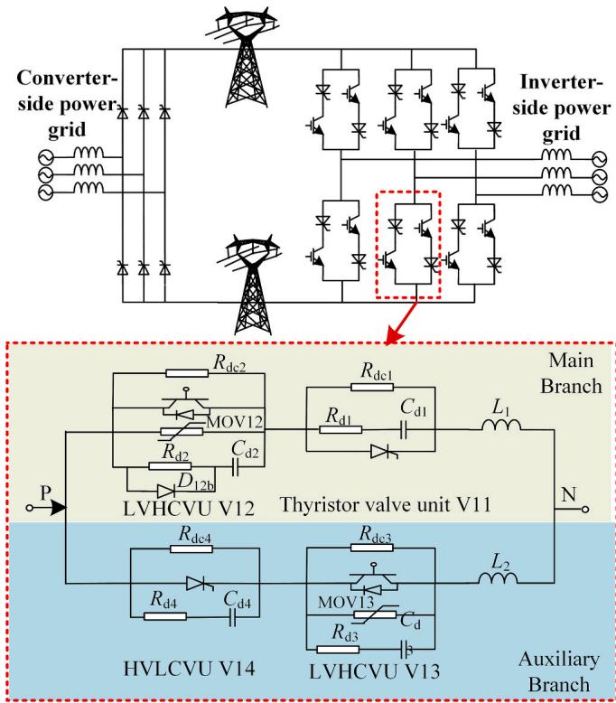  
Fig. 1. Scheme of CLCC-HVDC real-time simulation.

offline simulation scheme, the framework achieves a normalized root mean square error (NRMSE) of less than 7% and reduces computation time by 77%, thereby substantiating its high accuracy and efficiency.

The main contributions of this paper are summarized as follows:

1. A discrete inductor decoupling method is proposed that uses inductors as decoupling boundaries and implements topology segmentation through latency and controlled voltage sources. This method ensures the simulation accuracy of the entire system and the integrity of the control and main circuits, facilitates modification and analysis of each part, and enhances the portability and adaptability of the models.   
2. A parameter selection strategy for the ADC model is established. The strategy decomposes the operating intervals of the CLCC converter, solves the corresponding circuit differential equations to determine the voltage and current stresses of each valve group as rated parameters, and then derives the optimal equivalent admittance based on the minimum loss error. This approach eliminates reliance on trial-and-error methods and significantly enhances the simulation fidelity for hybrid switching devices.   
3. A CPU-FPGA collaborative multi-rate real-time simulation framework tailored for the CLCC-HVDC system is established. Experimental verification shows that the framework runs on the FPGA platform with a time step of 2 μs, achieving a voltage NRMSE of less than 7% and reducing computation time by approximately 77% compared with the CPU-only offline simulation scheme.

The rest of this paper is organized as follows. Section 2 analyzes the structure of the CLCC–HVDC system and its simulation requirements. Section 3 describes the real-time modeling process and hardware implementation. Section 4 details the modular decomposition and component modeling. Section 5 validates the proposed framework under steady-state and fault conditions. Finally, Section 6 concludes the paper.

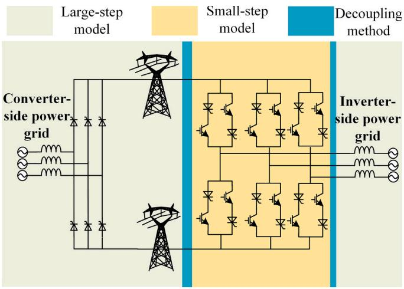  
Fig. 2. Scheme of CLCC-HVDC real-time simulation.

# 2. Structure analysis of the CLCC-HVDC system and simulation requirement

The detailed topology of the CLCC-HVDC system is shown in Fig. 1. It comprises the rectifier-side AC grid, a conventional LCC converter, the DC transmission line, the CLCC inverter, and the inverter-side AC grid.

In the CLCC converter, each bridge arm consists of a parallel configuration of a main branch and an auxiliary branch. These branches comprise series-connected valve units using different semiconductor technologies: the main branch's thyristor valve unit V11 still uses a large number of series-connected thyristors, whereas V12 and V13 are lowvoltage, high-current valve units (LVHCVU) composed of IGBTs. The auxiliary branch V14 is a high voltage, low current valve unit (HVLCVU) comprising multiple thyristors connected in series. To ensure dynamic voltage sharing during switching transitions, RC damping circuits are placed in parallel with the thyristor valves, and RCD damping circuits are similarly used with the IGBT valves. Additionally, MOVs are installed on both the main and auxiliary IGBT valves to maintain forward voltage stability during commutation, which is essential for reliable operation [3].

This hybrid structure creates a unique forced commutation mechanism. During operation, the controllable voltage from the IGBT based units (V12, V13) actively forces current transfer, resulting in a complex dynamic state in which active turn-off and line-commutated behaviors coexist. Accurately capturing the dynamic characteristics of this hybrid switching and the nonlinear characteristics of MOVs poses a significant challenge for modeling.

To address the complexity of the CLCC topology, this paper proposes a multi-rate real-time simulation strategy on a CPU-FPGA architecture. Within this framework, simulation tasks are partitioned to optimize for each subsystem's dynamic characteristics. The CPU subsystem solves slow dynamic models of the AC grid, DC transmission lines, and LCC converters and executes the system control algorithms. The simulation time step is set to 20 μs to balance the computational requirements of signal processing and control logic.

By contrast, the CLCC converter, featuring fast thyristor commutation dynamics, is implemented on the FPGA platform for high-fidelity simulation. Through a rigorous trade-off analysis of simulation accuracy, computational efficiency, and numerical stability, the time step for the main circuit simulation on the FPGA side is set to 2 μs. Specifically, an overly small-time step $( \mathrm { e } . g . , < 1$ μs) causes numerical saturation due to the precision constraints of fixed-point arithmetic; conversely, an overly large time step cannot resolve the critical microsecond-scale commutation details. On this basis, 2 μs is defined as the optimal time step for the FPGA simulation subsystem. Beyond the stringent demand for high temporal precision, strict numerical consistency at the CPU-

FPGA decoupling boundary is also imperative to ensure reliable data interaction. This consistency is achieved by maintaining the stability of the equivalent admittance matrix, thereby enabling accurate and stable data exchange between the CPU and FPGA.

# 3. Structure analysis of the CLCC-HVDC system and simulation requirement

# 3.1. Multi-rate real time hybrid simulation architecture

To meet the multi-scale simulation requirements analyzed in Section 2, a heterogeneous architecture based on the OPAL-RT platform is employed. As illustrated in Fig. 2, the system is logically partitioned into a large-time step model and a small-time step model based on the components' dynamic characteristics:

(1) CPU subsystem. The subsystem runs at a time step of 20 μs and models components with slow dynamics, including the rectifierside and inverter-side AC grids, the LCC rectifier, and the DC transmission lines. It also executes system control algorithms and protection logic.   
(2) FPGA subsystem. The CLCC converter topology, which features high-frequency switching and fast commutation transients, is modeled on the FPGA. The FPGA solver runs with a time step of 2 μs to ensure high temporal resolution.   
(3) Decoupling method. As shown by the blue bars in Fig. 2, the interface algorithm enables decoupling between the CPU and FPGA domains. As the core of the multi-rate simulation interface, it manages the exchange of key data (i.e., voltage and current) and synchronizes the multi-rate solvers via the PCIe bus.

# 3.2. Modeling workflow and implementation

The implementation process translates the theoretical analysis into a deployable real-time model. As shown in the workflow diagram in Fig. 3, the process comprises three distinct phases:

(1) FPGA configuration generation. Initially, the theoretical analysis of the CLCC topology guides the construction of the RT-XSG model. This model is compiled to produce a generic FPGA configuration file. A key advantage of this approach is that the configuration file is generic; provided the number of FPGA boards remains constant. It does not need to be regenerated even if the circuit parameters change.   
(2) Offline verification and partitioning. In parallel, a detailed offline digital model of the CLCC is built and verified against theoretical requirements. After validation, the model is partitioned by component complexity. The control system is first isolated and simulated on the CPU with a large-time step to ensure algorithmic correctness.   
(3) Real-time deployment. After successful CPU validation, the main circuit is discretized and partitioned using the decomposition method. The circuit model is configured in the electrical hardware solver (EHS) module using the previously generated FPGA configuration file. Finally, the signal transmission links between the CPU and the FPGA are established, and the code is downloaded to the RT-LAB environment for real-time execution.

# 3.3. Hardware resource assessment and Real-Time simulation platform for CLCC

Real-time simulation of the CLCC-HVDC system involves executing both control circuit computations and EHS configuration calculations on the CPU. The number of CPU cores required depends on the complexity of the control algorithms. For typical pulse-triggering control strategies, due to their algorithmic simplicity, multiple submodule controllers can

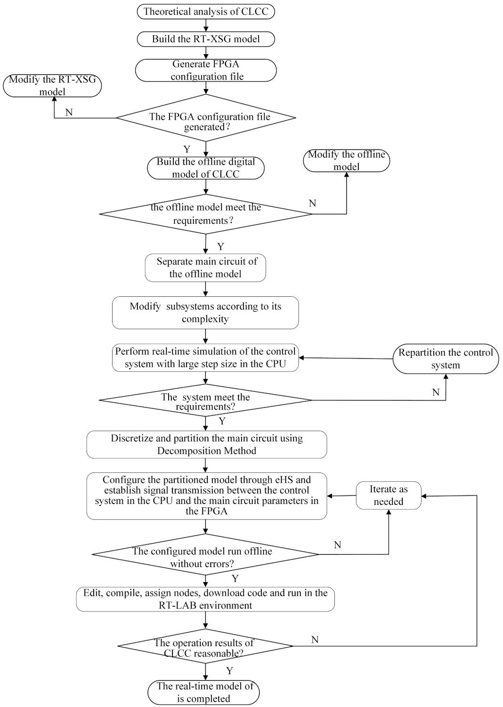  
Fig. 3. Flow chart of CLCC-HVDC real-time simulation.

be effectively aggregated and simulated on a single CPU core. In contrast, EHS configuration calculations are allocated based on hardware topology; specifically, all EHS configuration modules associated with a single FPGA board must be assigned to the same CPU core. For smaller-scale CLCC-HVDC control systems, it is also feasible to consolidate both the control system and EHS configuration modules onto a single core. Therefore, the hardware platform's CPU must have a core count sufficient to meet the aggregate requirements of both the control circuit and EHS configuration computations. Regarding the CLCC-HVDC main circuit, which requires extremely small-time step simulation within the FPGA, the number of EHS simulation modules and FPGA

boards is determined by the capacity limits of the EHS modules, specifically the number of switching devices and total components they support.

In parallel, the CLCC main circuit, which requires high temporal resolution, is implemented on the FPGA. The selection of FPGA boards and EHS functional modules depends on the scale of the circuit topology, specifically the number of switching devices and passive components. Traditionally, the required number of EHS modules, $N _ { \mathrm { E H S } } ,$ for simulating a CLCC system with n 12-pulse units is derived as

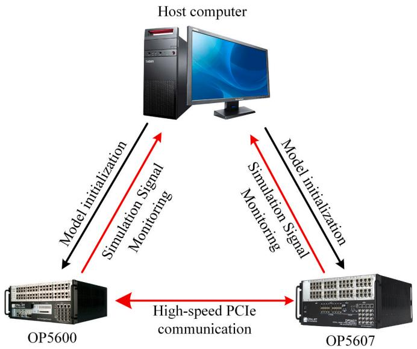  
Fig. 4. Diagram illustrating the physical hierarchy of testing device structures in the simulation system.

$$
N _ {\mathrm {E H S}} = \left[ \max  \left(\frac {N _ {\mathrm {s w}}}{C _ {\mathrm {s w}}}, \frac {N _ {\mathrm {L C}}}{C _ {\mathrm {L C}}}\right) \right] \tag {1}
$$

where $N _ { \mathrm { { s w } } }$ and $N _ { \mathrm { L C } }$ represent the aggregate counts of switching devices and total components, respectively, and $C _ { \mathrm { s w } }$ and $C _ { \mathrm { L C } }$ denote the simulation capacity of a single EHS module. This quantitative assessment ensures that the selected hardware resources are sufficient to support the complex topology without overrun.

The experimental validation employs a heterogeneous OPAL-RT platform, illustrated in ${ \mathrm { F i g . ~ } } 4 ,$ which includes an OP5600 CPU simulator alongside an OP5607 FPGA expansion unit. The OP5600 features 12 processing cores (dual 6-core Intel Xeon processors at 3.47 GHz), offering sufficient capacity for the control domain. Supporting this, the OP5607 contains a Xilinx Virtex-6 XC6VLX240T FPGA to run the EHS solver. Although the EHS explicitly requires components from the Simscape Electrical (SPS) library, resource analysis shows that a single instance of each device is enough for the 12-pulse CLCC system. Both solvers are set up with fixed-step ODE algorithms to guarantee deterministic real-time performance, with detailed software cofiguration provided in Appendix Table B1.

# 4. Decoupling method and component modeling

To meet the high-fidelity real-time simulation targets established in Section $^ { 3 , }$ precise mathematical modeling of the CLCC components is

essential. This section details the decoupling method based on discrete inductance, followed by the hybrid discretization modeling of nonlinear switching devices and MOVs. Furthermore, the derivation of the equivalent admittance parameters is presented to ensure numerical stability across various commutation states. Throughout this derivation, Δt denotes the discrete simulation time step.

# 4.1. Discrete inductor decoupling method

Because the CLCC topology inherently includes arm inductors on both the DC and AC sides, discretizing these components is an optimal strategy for decoupling. This approach preserves high simulation fidelity while avoiding significant modifications to the original circuit topology. Furthermore, provided that the characteristic deviation between the discrete and continuous models remains within acceptable limits over the target frequency range, the discretized inductor serves as a robust interface unit, ensuring both the accuracy and efficiency of the cosimulation.

Fig. 5 shows the analysis diagram of the discretized model of the inductor L. The continuous model of the inductor is defined as follows:

$$
L \frac {\mathrm {d} i _ {\mathrm {L}}}{\mathrm {d} t} = u _ {\mathrm {k}} (t) - u _ {\mathrm {m}} (t) \tag {2}
$$

where $u _ { \mathrm { k } } ( t )$ and $u _ { \mathrm { m } } ( t )$ denote the instantaneous nodal voltages, and $i _ { \mathrm { L } } ( \mathrm { t } )$ denotes the branch current. To guarantee the numerical accuracy of data exchange at the CPU-FPGA interface, this study introduces the trapezoidal integration method for discretization processing. Integrating (2) over the time step Δt yields:

$$
\begin{array}{l} i _ {\mathrm {L}} (t) = i _ {\mathrm {L}} (t - \Delta t) + \frac {1}{L} \int_ {t - \Delta t} ^ {t} [ u _ {\mathrm {k}} (t) - u _ {\mathrm {m}} (t) ] d t \\ = i _ {\mathrm {L}} (t - \Delta t) + \frac {\Delta t}{2 L} \left[ u _ {\mathrm {k}} (t) - u _ {\mathrm {m}} (t) + u _ {\mathrm {k}} (t - \Delta t) - u _ {\mathrm {m}} (t - \Delta t) \right] \tag {3} \\ = i _ {\mathrm {L}} (t - \Delta t) + \frac {\Delta t}{2 L} [ u _ {\mathrm {k}} (t) - u _ {\mathrm {m}} (t) ] + \frac {\Delta t}{2 L} [ u _ {\mathrm {k}} (t - \Delta t) - u _ {\mathrm {m}} (t - \Delta t) ] \\ \end{array}
$$

Let the equivalent characteristic resistance be defined as $R _ { \mathrm { e q } } = L / \Delta t .$ . For notational brevity, let the superscript * denote the values at the previous time step (t-Δt) $. u _ { \mathrm { L } } ^ { \ast } = u _ { \mathrm { k } } ( t - \Delta t ) - u _ { \mathrm { m } } ( t - \Delta t )$ By substituting these definitions into (3) and rearranging the terms to express the inductor voltage $u _ { \mathrm { L } } ( t ) _ { \mathrm { : } }$ , the Thevenin equivalent model is obtained:

$$
u _ {\mathrm {L}} (t) = 2 R _ {\mathrm {e q}} i _ {\mathrm {L}} (t) - 2 R _ {\mathrm {e q}} i _ {\mathrm {L}} ^ {*} - u _ {\mathrm {L}} ^ {*} \tag {4}
$$

Equation (4) shows that the voltage drop depends on the instantaneous current and historical states. To implement the decoupling interface, (4) is further expanded into a symmetric form:

$$
u _ {\mathrm {L}} (t) = \underbrace {\left(R _ {\mathrm {e q}} i _ {\mathrm {L}} - R _ {\mathrm {e q}} i _ {\mathrm {L}} ^ {*} - u _ {\mathrm {k}} ^ {*}\right)} _ {\text {S i d e k}} + \underbrace {\left(R _ {\mathrm {e q}} i _ {\mathrm {L}} - R _ {\mathrm {e q}} i _ {\mathrm {L}} ^ {*} + u _ {\mathrm {m}} ^ {*}\right)} _ {\text {S i d e m}} \tag {5}
$$

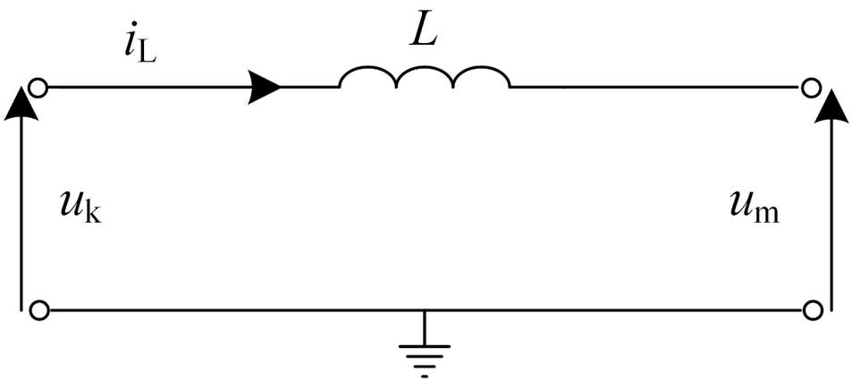  
Fig. 5. Analysis of a discrete inductor.

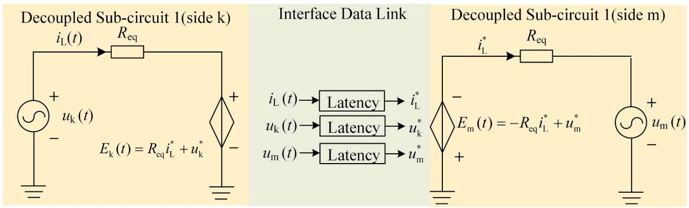  
Fig. 6. Implementation of the decoupling method.

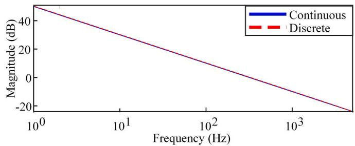

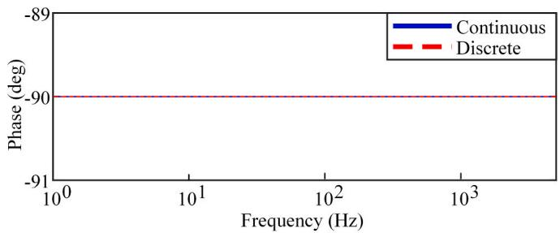

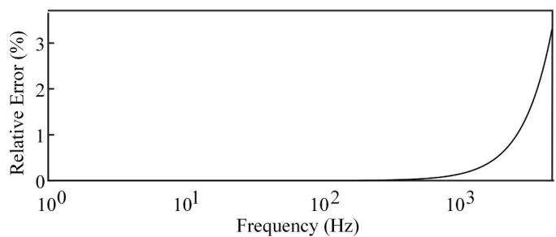  
Fig. 7. Comparison of frequency response(L is 0.5mH).

Equation (5) clarifies the fundamental principle of the discrete inductance decoupling method. The inductor model can be conveniently partitioned into two symmetric subcircuits using latency and controlled voltage sources. As shown in Fig. 6, this mathematical structure allows the global system matrix to be decoupled at the inductor terminals.

Because the decoupling method is derived using the Tustin transform, it is essential to verify its spectral fidelity. This is done by comparing the frequency response of the discrete inductor model with the continuous theoretical benchmark. The relative magnitude error E is defined as:

$$
E (f) = \frac {\left| \left| Z _ {\text {cont}} (j 2 \pi f) \right| - \left| Z _ {\text {disc}} \left(e ^ {j 2 \pi f \Delta t}\right) \right| \right|}{\left| Z _ {\text {cont}} (j 2 \pi f) \right|} \times 100 \% \tag{6}
$$

Where f denotes the frequency. Respectively, $\left| Z _ { \mathrm { c o n t } } ( j 2 \pi f ) \right|$ and |

$Z _ { \mathrm { d i s c } } ( e ^ { j 2 \pi f \Delta t } ) |$ | represent the impedance magnitudes of the inductor in the continuous and discrete domain. The comparison results are illustrated in Fig. 7.

As shown in Fig. 7, the simulation step is 20 μs, and the inductance L is 0.5 mH. Within the frequency range from 0 Hz to 5000 $\mathrm { H z } ,$ the maximum relative error does not exceed 3.3%, ensuring that the accuracy meets the error requirements for real-time simulation.

# 4.2. Modeling of switching devices

# 4.2.1. Constructing ADC model for switches

To efficiently model the switching devices within the FPGA solver, the ADC model is used to represent the switches. In this framework, a physical switch is modeled as a binary-impedance variable: a small inductance L in the ON state and a small capacitance C in the OFF state. To facilitate digital implementation, the Backward Euler method is employed to discretize these dynamic elements. Consequently, the differential equations governing the branch currents and voltages are derived as:

$$
u _ {\mathrm {s w}} (t) = \frac {L _ {\mathrm {s w}}}{\Delta t} \left[ i _ {\mathrm {s w}} (t) - i _ {\mathrm {s w}} (t - \Delta t) \right] \tag {7}
$$

$$
i _ {\mathrm {s w}} (t) = \frac {C _ {\mathrm {s w}}}{\Delta t} \left[ u _ {\mathrm {s w}} (t) - u _ {\mathrm {s w}} (t - \Delta t) \right] \tag {8}
$$

Despite their different physical forms, both states can be represented by a generalized Norton equivalent circuit:

$$
i _ {\mathrm {s w}} (t) = G _ {\mathrm {s w}} u _ {\mathrm {s w}} (t) + I _ {\mathrm {h i s t}} (t - \Delta t) \tag {9}
$$

In a real-time FPGA implementation, recalculating the global system impedance matrix whenever a switch changes state is computationally prohibitive. To maintain a constant system matrix, the constant admittance constraint is imposed, requiring the discrete conductance to be identical in both ON and OFF states:

$$
G _ {\text {o n}} = G _ {\text {o f f}} \Rightarrow \frac {\Delta t}{L _ {\text {s w}}} = \frac {C _ {\text {s w}}}{\Delta t} \tag {10}
$$

This leads to the critical parameter coupling relationship:

$$
L _ {\mathrm {s w}} C _ {\mathrm {s w}} = (\Delta t) ^ {2} \tag {11}
$$

Under this constraint, the equivalent admittance $G _ { S W }$ remains constant regardless of switching operations. The equivalent process is illustrated on the right side of Fig. 8. This feature ensures that the system matrix remains constant, thereby significantly reducing the computational burden on the hardware solver.

# 4.2.2. Parameter optimization and equivalent admittance selection

The accuracy of the ADC model depends heavily on the selection of the equivalent conductance G . A critical artifact of the ADC method is the virtual power loss induced by the discrete energy reset process.

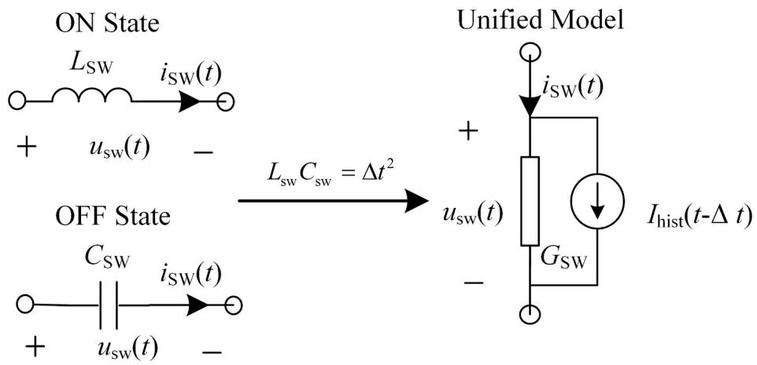  
Fig. 8. Discrete modeling of switching devices using the ADC method.

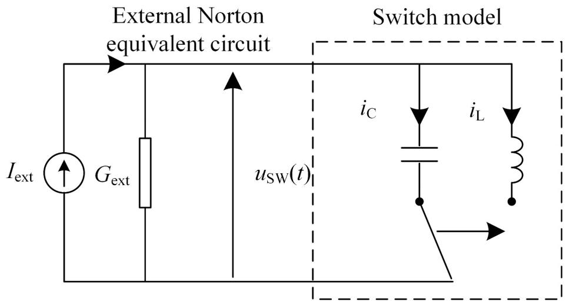  
Fig. 9. Small step switching equivalent circuit model.

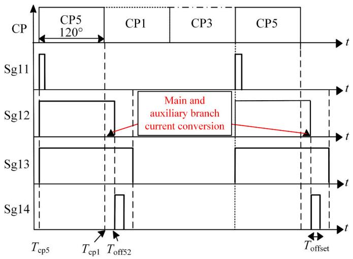  
Fig. 10. Switching signal sequence of the CLCC.

Specifically, when the switch state transitions, the energy stored in the $L _ { S W }$ or $C _ { S W }$ is instantaneously dissipated or reinitialized, creating a fictitious energy sink that deviates from the physical circuit behavior.

To quantify this effect, a simplified circuit model for a single switching period, as shown in Fig. 9, is used for analysis. In this model,

the external circuit is represented by a Norton equivalent consisting of a current source $I _ { \mathrm { e x t } }$ and conductance $G _ { \mathrm { e x } } .$ The switch model captures the physical toggling between the inductive branch (carrying current $i _ { \mathrm { L } } )$ and the capacitive branch (carrying current i ). During a switching cycle, the abrupt interruption of $\dot { \iota } _ { \mathrm { L } }$ or the voltage reset across $C _ { \mathrm { S W } }$ results in energy loss. The virtual energy loss can be derived assuming the switch operates under rated conditions, that $\mathbf { i } s ,$ with a voltage across the open switch of $V _ { \mathrm { r a t e } }$ and a current through the closed switch of $I _ { \mathrm { r a t e } } .$ To minimize loss error, the optimal equivalent conductance is derived as follows:

$$
G _ {\mathrm {s w}} \approx \frac {I _ {\text {r a t e}}}{V _ {\text {r a t e}}} \tag {12}
$$

Consequently, determining the $G _ { S W }$ for the CLCC converter requires a detailed stress analysis to identify the rated values. As shown in the timing sequence in Fig. 10, the CLCC operation process is decomposed into three characteristic intervals: (i) steady-state conduction, (ii) commutation process, and (iii) active turn-off of the main branch. In

Table 2 Equivalent Current Stress Expressions of CLCC Converter Valves for Admittance Parameter Selection.   

<table><tr><td>Switch type</td><td>Current stress (A)</td></tr><tr><td>V11</td><td>Id</td></tr><tr><td>V12</td><td>Id</td></tr><tr><td>V13</td><td>ic(Toff52)</td></tr><tr><td>V14</td><td>ic(Toff52)-imain</td></tr></table>

Table 3 Equivalent Voltage Stress Expressions of CLCC Converter Valves for Admittance Parameter Selection.   

<table><tr><td>Switch type</td><td>Voltage stress (V)</td></tr><tr><td>V11</td><td>UVT1 = Rdc1(emax - Ucd2)/(Rdc1 + Rdc2)</td></tr><tr><td>V12</td><td>UVT2 = Rdc2(emax + Ucd2)/(Rdc1 + Rdc2)</td></tr><tr><td>V13</td><td>UVT3 = Rdc3e max /(Rdc3 + Rdc4)</td></tr><tr><td>V14</td><td>UVT4 = Rdc4e max /(Rdc3 + Rdc4)</td></tr></table>

Table 4 Equivalent Admittance Parameters of CLCC Converter Valves for Real-Time Simulation.   

<table><tr><td>Switch type</td><td>Equivalent admittance (S)</td></tr><tr><td>V11</td><td>Id/UT1</td></tr><tr><td>V12</td><td>Id/UT2</td></tr><tr><td>V13</td><td>(iC(Toff52)-imain)/UT3</td></tr><tr><td>V14</td><td>(iC(Toff52)-imain)/UT4</td></tr></table>

Fig. 10, $T _ { \mathrm { c p } i }$ represents the trigger time of bridge arm i, CPi represents the conduction time of bridge arm i and $T _ { \mathrm { o f f s e t } }$ represents the pulse width of V14.

Solving the circuit differential equations for the topologies shown in Figs. A1–A2 yields the current and voltage stresses for each valve group (V11–V14). These values are used as $V _ { \mathrm { r a t e } }$ and $I _ { \mathrm { r a t e } }$ for parameter selection. The resulting analytical expressions are summarized in Tables 2 and 3. The detailed mathematical derivations for these stress parameters are provided in Appendix A. Finally, based on the criterion in (12) and the stress results from Appendix A, the specific equivalent admittance values for real-time simulation are computed and listed in Table 4. This parameter parsing process enables the reasonable selection of ADC model parameters for the CLCC-HVDC system.

The equivalent admittance selection strategy proposed in this paper is scalable and applicable to other hybrid topologies. However, in realtime simulation systems based on FPGAs, the solver's computational performance and hardware resource utilization depend heavily on the characteristics of the system matrix. Specifically, maintaining a constant system matrix avoids the need for additional computational resources for matrix reconstruction during simulation iterations. This significantly reduces data interaction latency and logic resource consumption. Thus, it meets the stringent real-time simulation requirements for computational speed and timing determinism. This approach approximates the dynamic switching characteristics of power electronic devices and accurately reflects the characteristics of CLCCs under operating conditions.

# 4.3. Modeling of MOV

MOVs are critical for overvoltage protection in power systems and are characterized by significant nonlinearity and a wide dynamic range. Precise modeling of MOVs are essential to ensure the accuracy of realtime power system simulations. In this section, using experimental data, two common modeling approaches, the look-up table (LUT) method and the linear interpolation (LI) method, are implemented and assessed systematically.

In real-time simulation, the LUT method estimates the output voltage by indexing sampled data points. For an input current $i _ { \mathrm { k } } ,$ the output corresponds to the voltage at the nearest sampled current index. However, due to the inevitable sampling and computation delay $\Delta t _ { \mathrm { d } }$ in the hardware, the output voltage VLUT effectively depends on the delayed current state:

$$
u _ {\text {o u t}} (t) = V _ {\text {L U T}} \left(i _ {\mathrm {k}} \left(t - \Delta t _ {\mathrm {d}}\right)\right) \tag {13}
$$

The computation delay, combined with discrete sampling steps, often produces step-like fluctuations in the voltage waveform. In

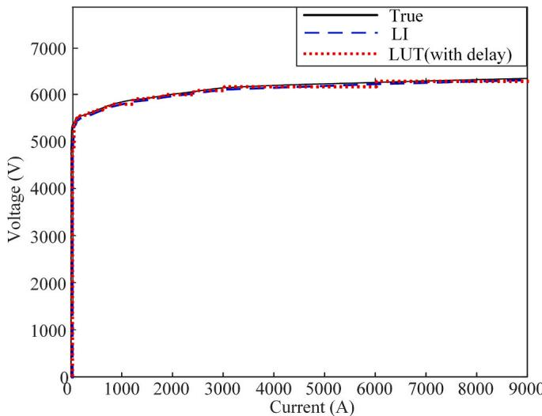  
Fig. 11. Fitting comparison of LUT with time delay and LI.

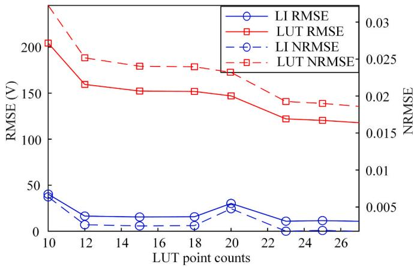  
Fig. 12. Comparison of RMSE and NRMSE between LUT and LI.

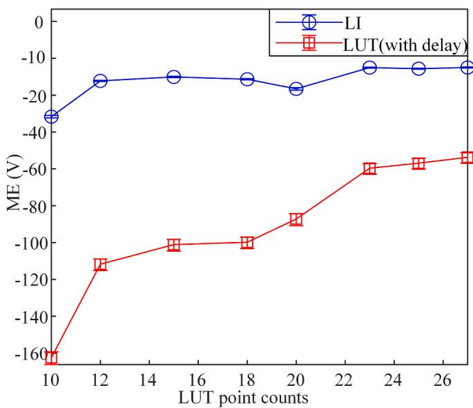  
Fig. 13. Comparison of 95% confidence intervals between LUT with time delay and LI.

contrast, the LI method can continuously characterize the curve

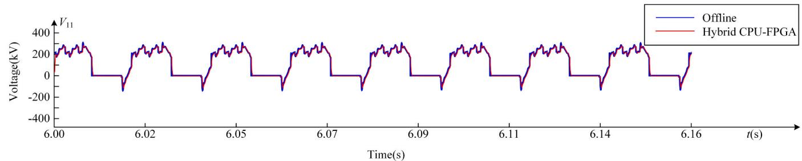

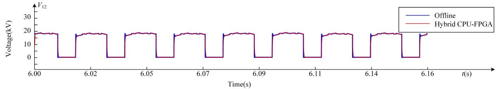

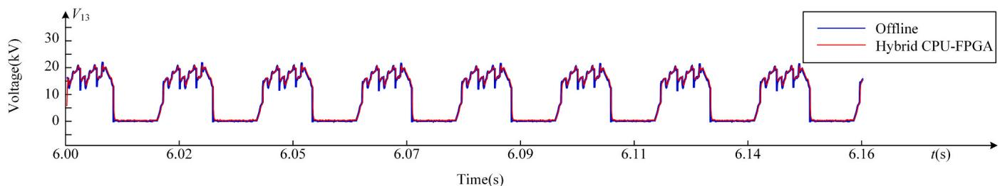

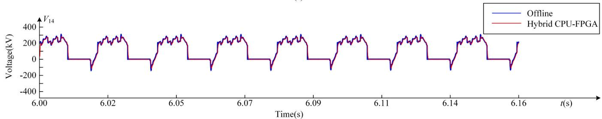  
Fig. 14. Comparison of voltage waveforms of CLCC valves under the steady-state scenario.

properties of MOV simply by linear fitting of adjacent discrete sampling points. This approach balances computational efficiency and accuracy, significantly improving the continuity of the current–voltage (I-V) characteristics and the simulation response speed.

To systematically evaluate the fidelity of both methods, a benchmark I-V characteristic curve generated by piecewise cubic interpolation is used as the “True” reference. Accuracy is quantified using the root mean square Error (RMSE) and NRMSE. Furthermore, to enhance statistical reliability, the Bootstrap resampling method is applied to compute the mean error and 95% confidence interval. Sensitivity analysis is also performed to evaluate the impact of sampling density on the accuracy of the output results, using multiple LUT point numbers (10, 12, 15, 18, 20, 23, 25, and 27) and setting a delay of 2 μs.

The experimental results are presented in Figs. 14-16. As shown in Fig. 11, when using 27 points for curve fitting, both methods can fit the actual curve well, although the LUT method exhibits obvious step fluctuations due to discretization, both methods fit the actual curve well, although the LUT method exhibits noticeable stepwise fluctuations due to discretization. Fig. 12 shows the RMSE and NRMSE, indicating that the LI method consistently yields lower, more stable errors across all sampling densities than the LUT method. Fig. 13 shows the mean error (ME) and the 95% confidence interval, further confirming the LI method's significant advantage.

Consequently, the LI method is prioritized for practical applications in this work due to the strict requirements of real-time simulation,

specifically model calculation speed and response performance. To verify the accuracy of the nonlinear MOV model, the I-V characteristic curves are compared with the reference data provided by the manufacturer. The results are shown in Fig. B1, demonstrating that the LI method can accurately reflect the dynamic characteristics of the MOV.

# 5. Real-time simulation Experiment validation

To evaluate the fidelity and efficiency of the proposed hybrid CPU-FPGA framework, a 500 kV digital CLCC-HVDC transmission system is modeled. The key electrical parameters of the inverter station are summarized in Table 5. To verify the effectiveness of the proposed method, a comparative study is conducted between the real-time hybrid CPU-FPGA model and an offline model built in MATLAB/Simulink (step size = 2 μs). The equivalent admittance parameters for the CLCC valves in the real-time model are selected using the method described in Section 4.2.2 and are listed in Table 6. Two operating conditions are simulated to assess model accuracy: steady-state operation under rated steady-state operating conditions and phase A short-circuit fault condition. The grounding impedance is set to 0.1 Ω, and the fault duration is set to 0.1 s.

Fig. 14 shows the voltage waveforms of the CLCC under steady-state operating conditions. The simulation results are highly consistent with the offline benchmark. In Fig. 15, the NRMSE for all valves remains below 7%, demonstrating the high accuracy of the proposed method.

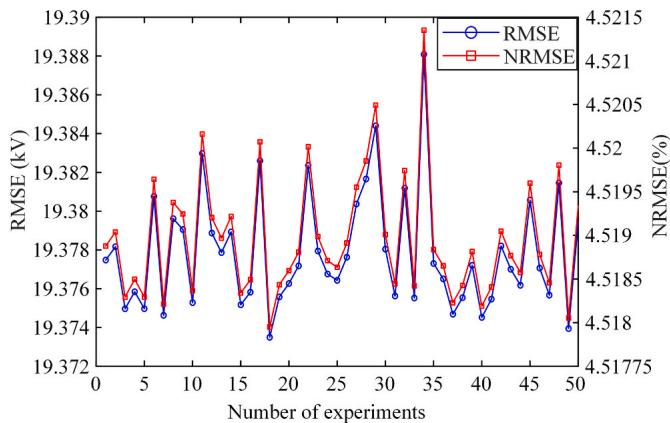  
(a) RMSE and NRMSE of V11

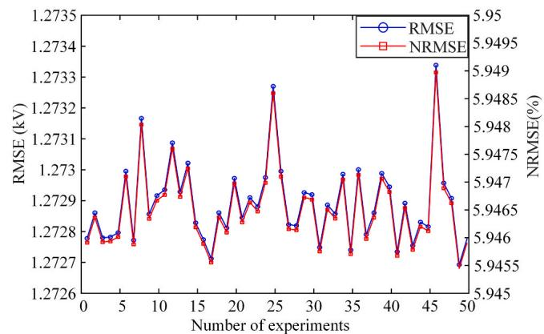  
(b) RMSE and NRMSE of V12

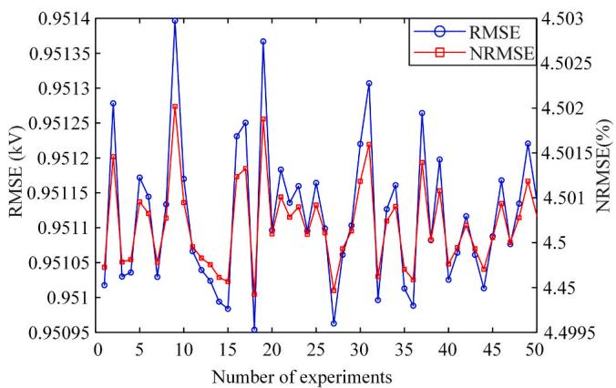  
(c)RMSE and NRMSE ofV13

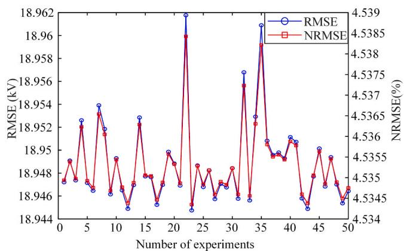  
(d)RMSE and NRMSE of V14

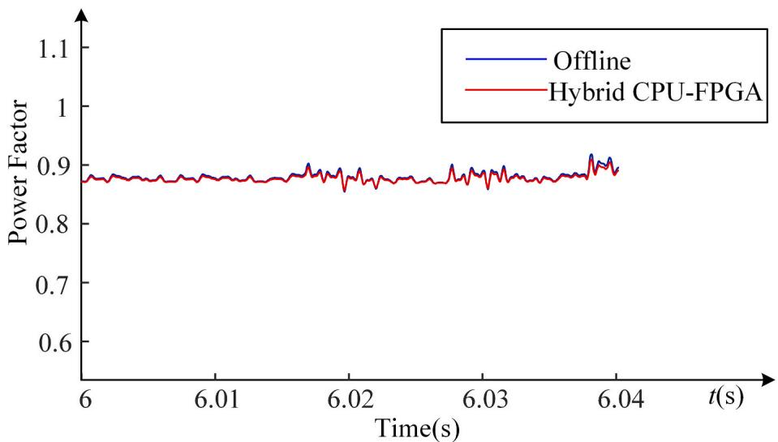  
Fig. 15. RMSE and NRMSE of CLCC Under Steady-state Scenario with Different Valves.   
Fig. 16. Comparison of Power Factor Under Steady-state Scenario.

Table 5   
Main Parameters of the Inverter.   

<table><tr><td>Parameter</td><td>Value</td></tr><tr><td>AC system Voltage</td><td>345 kV</td></tr><tr><td>Leakage reactance</td><td>0.18p.u.</td></tr><tr><td>DC inductor</td><td>0.5H</td></tr><tr><td>Firing angle</td><td>140°</td></tr><tr><td>Commutating angle</td><td>19.235°</td></tr><tr><td>SCR</td><td>2.5</td></tr></table>

Table 6   
CLCC Equivalent Admittance.   

<table><tr><td>Switch type</td><td>Equivalent admittance(S)</td></tr><tr><td>V11</td><td>0.0043</td></tr><tr><td>V12</td><td>0.0062</td></tr><tr><td>V13</td><td>0.00122</td></tr><tr><td>V14</td><td>0.00833</td></tr></table>

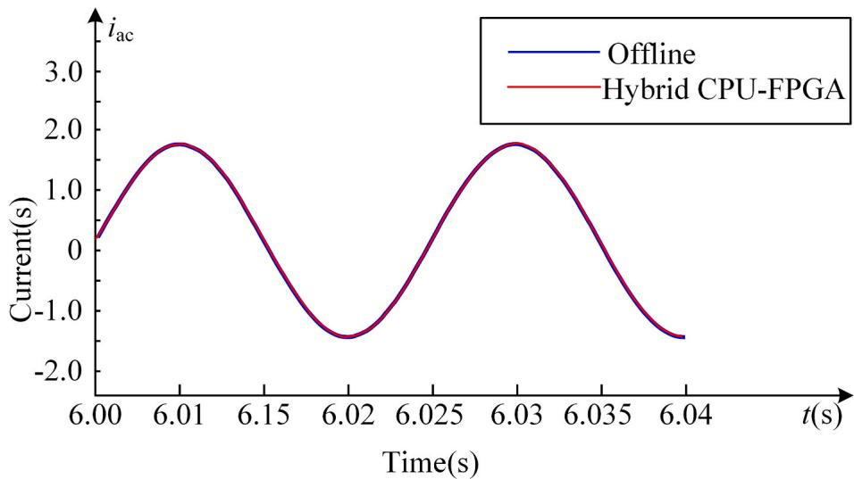  
Fig. 17. Comparison of Current Waves Under Steady-state Scenario.

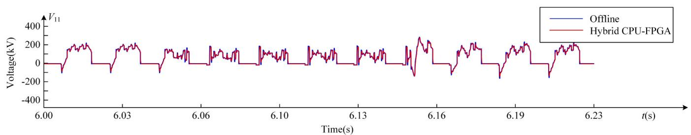

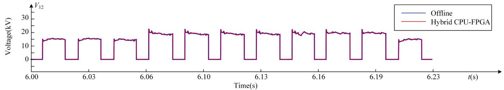

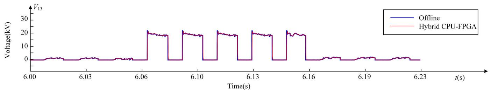

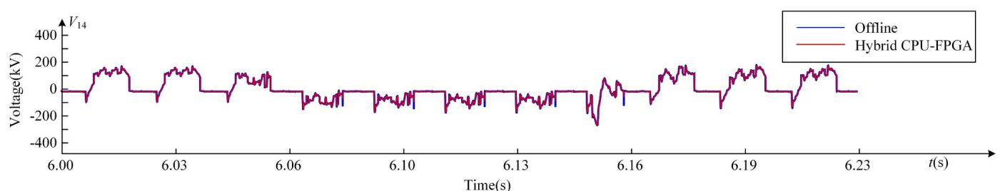  
Fig. 18. Comparison of voltage waveforms of CLCC valves under Fault conditions.

Furthermore, AC system characteristics confirm the steady-state fidelity of the proposed model. As illustrated in Figs. 16-17, the current waveforms show accurate tracking, and the AC side power factor is consistently maintained at approximately 0.88.

During the phase A short-circuit fault condition, the voltage responses of the CLCC valves under these transient conditions are illustrated in Figs. 18-19. The waveforms are highly consistent with the offline benchmark. Quantitative comparative analysis shows that the

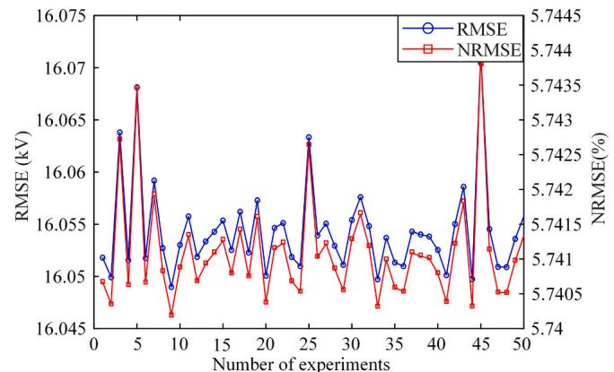

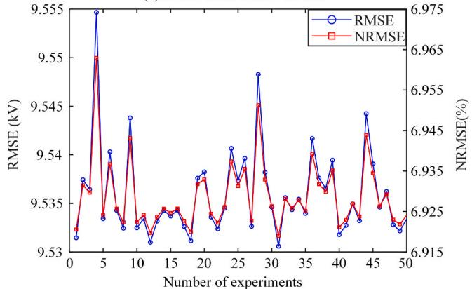  
(a)RMSE and NRMSE ofV11   
(c)RMSE and NRMSE ofV13

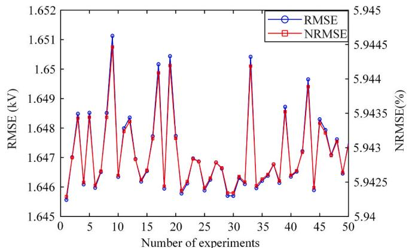

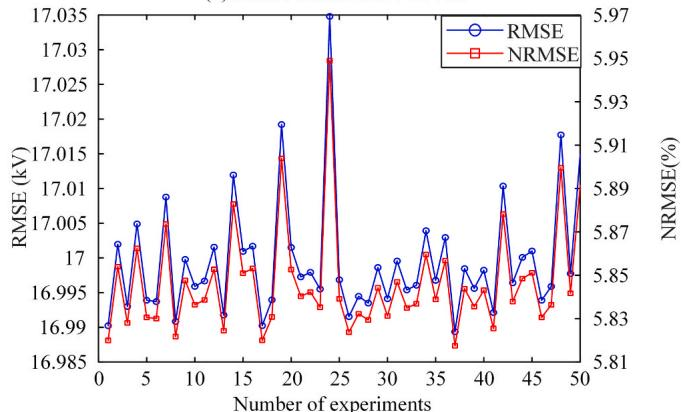  
(b)RMSE and NRMSE of V12   
(d)RMSE and NRMSE ofV14   
Fig. 19. Comparison of voltage waveforms of CLCC valves under Fault condition.

Table 7 NRMSE of Each Valve Under the Fault Condition With Different Simulation Steps.   

<table><tr><td>Switch type</td><td>Simulation Step(μs)</td><td>NRMSE (%)</td></tr><tr><td rowspan="3">V11</td><td>2</td><td>5.74</td></tr><tr><td>3</td><td>6.82</td></tr><tr><td>4</td><td>7.92</td></tr><tr><td rowspan="3">V12</td><td>2</td><td>5.94</td></tr><tr><td>3</td><td>6.62</td></tr><tr><td>4</td><td>8.93</td></tr><tr><td rowspan="3">V13</td><td>2</td><td>6.92</td></tr><tr><td>3</td><td>7.94</td></tr><tr><td>4</td><td>9.92</td></tr><tr><td rowspan="3">V14</td><td>2</td><td>5.83</td></tr><tr><td>3</td><td>7.94</td></tr><tr><td>4</td><td>9.7</td></tr></table>

NRMSE under fault conditions is less than 7%, which fully verifies the ability of the proposed simulation framework to accurately reproduce the transient switching process.

To confirm the reason for choosing a 2 μs simulation step size, this paper conducts a step-size sensitivity analysis on the FPGA real-time simulation platform. As shown in Table 7, increasing the step size is strongly negatively correlated with simulation accuracy: when the step size increases from 2 μs to 4 μs, the NRMSE exceeds 7%. Further research found that when the step size exceeds 4.8 μs, the OPAL-RT simulation platform triggers hardware resource timing constraint violations, causing the simulation to run unstably. These results demonstrate that 2 μs is the optimal step size that balances simulation accuracy and hardware feasibility. This parameter captures the subtle electrical characteristics of the thyristor commutation transient process with high fidelity while meeting the stringent timing requirements of the real-time simulation platform.

Table 8 Comparative Table of Simulation Time and Simulation Resources.   

<table><tr><td>Simulation type</td><td>Simulation time (s)</td><td>Simulation resource</td><td>Usage</td></tr><tr><td>Offline</td><td>300</td><td>/</td><td>/</td></tr><tr><td>Real-time: CPU</td><td>10</td><td>8 cores (20 μs)</td><td>64%</td></tr><tr><td>Real-time: Hybrid</td><td>10</td><td>2 cores + 1 FPGA (20 μs/2μs)</td><td>77% of the main core</td></tr><tr><td>CPU-FPGA</td><td></td><td></td><td></td></tr></table>

It is worth noting that the discrepancies between real-time and offline results during fault transients are primarily due to the fixed-timestep discretization of the real-time solver and the static admittance approximation required to maintain a constant FPGA system matrix. These factors introduce inevitable sampling errors during highfrequency oscillations and slight numerical deviations under offnominal states. However, quantitative analysis confirms that the NRMSE remains below 7% across all scenarios. Because the simulation accurately captures macroscopic dynamic trends and key waveform envelopes, these deviations are considered to fall within acceptable engineering limits.

Finally, Table 8 presents the computational performance of the proposed framework. For a 10-second simulation, the hybrid CPU-FPGA platform completes the simulation in real time, requiring exactly 10 s, whereas the offline simulation takes approximately 300 s. With FPGA resource utilization of approximately 77%, the architecture retains sufficient margin to support the simulation of larger-scale systems Figs. A1–A2.

# 6. Conclusion

This paper proposes a CPU-FPGA collaborative multi-rate real-time simulation framework for CLCC-HVDC systems, addressing the core

technical challenges of small-time step modeling parameter optimization and efficient real-time simulation for this complex hybrid topology. First, a discrete inductor decoupling method is proposed. This method uses inductors as natural decoupling boundaries and employs latency and controlled voltage sources to segment the topology under study. This approach satisfies both the overall system simulation accuracy and the integrity of the control and main circuits, facilitates modification and analysis of each part, and makes both models highly portable and adaptable. Second, an ADC model parameter selection strategy is established by decomposing the CLCC operating range and solving circuit differential equations to determine valve group voltage and current stresses as rated parameters. Subsequently, the optimal equivalent admittance is derived based on the minimum loss error criterion, thereby eliminating trial-and-error approaches and enhancing simulation fidelity for hybrid switching devices. Experimental results demonstrate that the proposed framework achieves a voltage NRMSE of less than 7% on an FPGA platform with a step size of 2 μs and reduces computation time by approximately 77% compared to a pure CPU simulation scheme. Although the necessary engineering approximation of equivalent admittance is required to meet the constant system matrix requirement of the FPGA solver, the framework still balances simulation accuracy with stringent real-time timing constraints. It should be noted that the current framework does not yet support adaptive real-time adjustment of equivalent admittance, and its adaptability under transient conditions needs further improvement. Future research will focus

on optimizing PCIe communication latency, developing adaptive realtime adjustment functions for equivalent admittance, and extending the framework to large-scale AC/DC hybrid power grids with renewable energy access.

# CRediT authorship contribution statement

Guoqing Li: Writing – review & editing, Methodology, Funding acquisition, Conceptualization. Mingcheng Yang: Writing – original draft, Methodology, Investigation. Wei Wang: Writing – review & editing, Visualization, Validation, Methodology. Guobin Jin: Software, Methodology, Data curation. Jun Yang: Project administration, Funding acquisition, Formal analysis. Yahu Gao: Software, Project administration, Investigation.

# Declaration of competing interest

The authors declare that they have no known competing financial interests or personal relationships that could have appeared to influence the work reported in this paper.

# Acknowledgement

This work is supported by the Smart Grid-National Science and Technology Major Project (No. 2024ZD0802700).

# Appendix A

Analytical Derivation of CLCC Valve Stresses.

This appendix presents the detailed mathematical derivations of the equivalent current and voltage stresses summarized in Tables 2 and 3. These derivations provide the theoretical basis for the parameter optimization method described in Section 4.2.2.

Analysis of Switching Current Stress.

(1) Steady-state conduction

During the interval $T _ { \mathrm { c p 5 } } \leq t < T _ { \mathrm { c p 1 } }$ , the main branches of bridge arms V5 and V6 are conducting while the auxiliary branches are OFF. As shown in Fig. A1, the current flowing through the main branch valves equals the DC current.

$$
i _ {\text {m a i n}} = I _ {\mathrm {d}} \tag {A.1}
$$

(2) Commutation process.

When the current transfers from bridge arm V5 (Phase C) to V1 (Phase $\mathsf { A } ) ( T _ { c p 1 } \leq t < T _ { o f f 5 2 } )$ , the circuit topology is shown in Fig. A2. Applying Kirchhoff's voltage law to the commutation loop yields

$$
L _ {\Sigma} \frac {d i _ {\mathrm {a}}}{d t} - L _ {\Sigma} \frac {d i _ {\mathrm {c}}}{d t} = e _ {\mathrm {a}} - e _ {\mathrm {c}} \tag {A.2}
$$

$$
i _ {\mathrm {a}} + i _ {\mathrm {c}} = I _ {\mathrm {d}} \tag {A.3}
$$

Where $L _ { \Sigma } { = } L _ { \gamma } + L _ { \mathrm { a r m } } .$ Let $X _ { \Sigma } = 2 \pi f _ { 1 } L _ { \Sigma }$ be the commutation reactance. Solving these equations yields the analytical expressions for the phase currents

$$
\left\{ \begin{array}{c} i _ {\mathrm {a}} = i _ {\gamma} = \frac {\sqrt {2} E}{2 X _ {\Sigma}} [ \cos \alpha - \cos (\omega_ {1} t + \alpha) ] \\ i _ {\mathrm {c}} = I _ {\mathrm {d}} - i _ {\gamma} \end{array} \right. \tag {A.4}
$$

Where $\alpha = \pi - \beta$ is the firing angle, E is the RMS line-to-line voltage, and ω1 is the grid angular frequency.

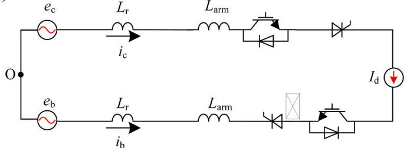  
Fig. A1. The conduction circuit of the CLCC converter bridge arms 5 and 6

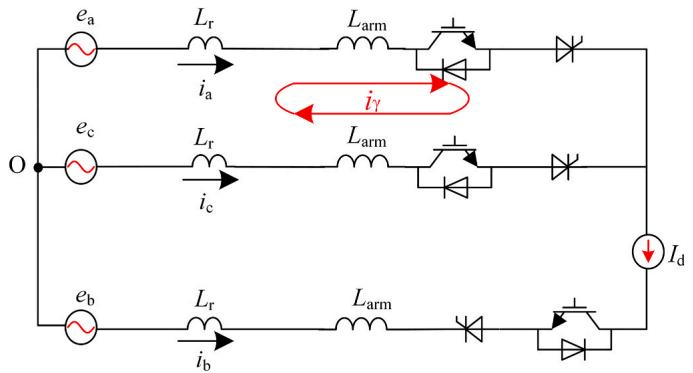  
Fig. A2. CLCC converter bridge arm 5 to bridge arm 1 phase change process (Bridge arm 5 auxiliary branch off)

# (3) Active turn-off interval.

At $t = T _ { \mathrm { o f f } 5 2 } ,$ the main IGBT of arm V5 is actively turned off. The residual current $i _ { \mathrm { c } } ( T _ { \mathrm { o f f } 5 2 } )$ transfers from the main branch $i _ { \mathrm { m a i n } }$ to the auxiliary branch iaux:

$$
\left\{ \begin{array}{c} i _ {\text {m a i n}} = C _ {\mathrm {d} 2} \frac {d u _ {C _ {\mathrm {d} 2}}}{d t} \\ i _ {\text {a u x}} = i _ {\mathrm {c}} \left(T _ {\text {o f f} 5 2}\right) - i _ {\text {m a i n}} \end{array} \right. \tag {A.5}
$$

# Analysis of Switching Voltage Stress

As shown in Fig. 1, when the CLCC valves are in the blocking state, the voltage distribution across the series-connected valve units is determined by the parallel voltage-sharing resistors $( R _ { \mathrm { d c } } ) _ { \cdot }$ . To accurately derive the voltage stress expressions listed in Table 3, the superposition theorem is applied.

Taking the main branch as a representative example, the total voltage stress on each valve is calculated as the algebraic sum of the stresses induced by the maximum external commutation voltage $\left( e _ { \mathrm { m a x } } \right)$ and the internal damping capacitor voltage $\left( U _ { \mathrm { d c 2 } } \right)$ acting independently.

(1) Maximum external commutation voltage acting alone.

When considering only the external commutation voltage $e _ { \mathrm { m a x } } ,$ the voltage distributes across V11 and V12 strictly according to the ratio of their DC grading resistors $( R _ { \mathrm { d c 1 } }$ and $R _ { \mathrm { d c 2 } } )$ . The partial voltages are:

$$
\left\{ \begin{array}{l} U _ {\mathrm {V T 1}} ^ {\prime} = e _ {\max } \frac {R _ {\mathrm {d c 1}}}{R _ {\mathrm {d c 1}} + R _ {\mathrm {d c 2}}} \\ U _ {\mathrm {V T 2}} ^ {\prime} = e _ {\max } \frac {R _ {\mathrm {d c 2}}}{R _ {\mathrm {d c 1}} + R _ {\mathrm {d c 2}}} \end{array} \right. \tag {A.6}
$$

(2) Internal damping capacitor voltage $\left( U _ { \mathrm { C d 2 } } \right)$ acting alone.

As illustrated in Fig.A3, during the active turn-off process, the damping capacitor $C _ { \mathrm { d } 2 }$ is charged by the residual current, resulting in a voltage drop. The magnitude of this transient voltage $U _ { \mathrm { C d 2 } }$ is derived by integrating the charging current over the commutation interval:

$$
u _ {\mathrm {C d} 2} = \frac {\int_ {T _ {\mathrm {o f f} 5 2}} ^ {T _ {\mathrm {o f f} 5 2} + \tau} i _ {\mathrm {m a i n}} d t}{C _ {\mathrm {d} 2}} \tag {A.7}
$$

The time constant τ depends on the parameters of the RCD damping network and is identified via Fourier fitting in the frequency domain.

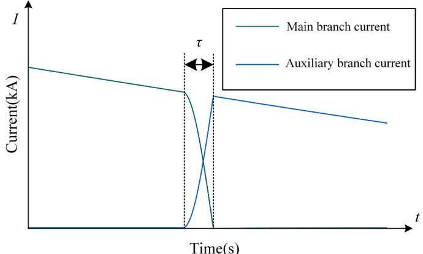  
Fig. A3. Transient charging currents determining the damping capacitor voltage during active turn-off

During the active turn-off transient, the damping capacitor $C _ { \mathrm { d } 2 }$ acts as an internal voltage source $U _ { \mathrm { C d 2 } } .$ When considering this source acting alone. For the thyristor valve V11, the polarity of UCd2 opposes the forward blocking direction, introducing a negative voltage component:

$$
U _ {\mathrm {V T 1}} ^ {\prime \prime} = - U _ {\mathrm {C d 2}} \frac {R _ {\mathrm {d c 1}}}{R _ {\mathrm {d c 1}} + R _ {\mathrm {d c 2}}} \tag {A.8}
$$

For the IGBT valve V12, the capacitor voltage creates a clamping effect that adds to the withstand stress:

$$
U _ {\mathrm {V T 2}} ^ {\prime \prime} = U _ {\mathrm {C d 2}} \frac {R _ {\mathrm {d c 2}}}{R _ {\mathrm {d c 1}} + R _ {\mathrm {d c 2}}} \tag {A.9}
$$

# (3) Total voltage stress.

According to the superposition principle, the total voltage stress is the sum of the components derived above

$$
\left\{ \begin{array}{l} U _ {\mathrm {V T 1}} = U _ {\mathrm {V T 1}} ^ {\prime} + U _ {\mathrm {V T 1}} ^ {\prime \prime} = \frac {R _ {\mathrm {d c 1}} \left(e _ {\max } - U _ {\mathrm {C d 2}}\right)}{R _ {\mathrm {d c 1}} + R _ {\mathrm {d c 2}}} \\ U _ {\mathrm {V T 2}} = U _ {\mathrm {V T 2}} ^ {\prime} + U _ {\mathrm {V T 2}} ^ {\prime \prime} = \frac {R _ {\mathrm {d c 2}} \left(e _ {\max } + U _ {\mathrm {C d 2}}\right)}{R _ {\mathrm {d c 1}} + R _ {\mathrm {d c 2}}} \end{array} \right. \tag {A.10}
$$

# Appendix B. . Software configuration and validation

Software Environment.

Table B1   
Software Configuration.   

<table><tr><td>Software</td><td>Version</td></tr><tr><td>RTLAB</td><td>11.0.8</td></tr><tr><td>RT-XSG</td><td>3.3.1.789</td></tr><tr><td>EHS</td><td>1.2</td></tr><tr><td>Efpgasim</td><td>1.5.4</td></tr></table>

# MOV Model Validation

To verify the fidelity of the nonlinear MOV model, the I-V characteristics from the LI model are benchmarked against the manufacturer’s reference datasheet (“True”). The comparison is shown in Fig. B1.

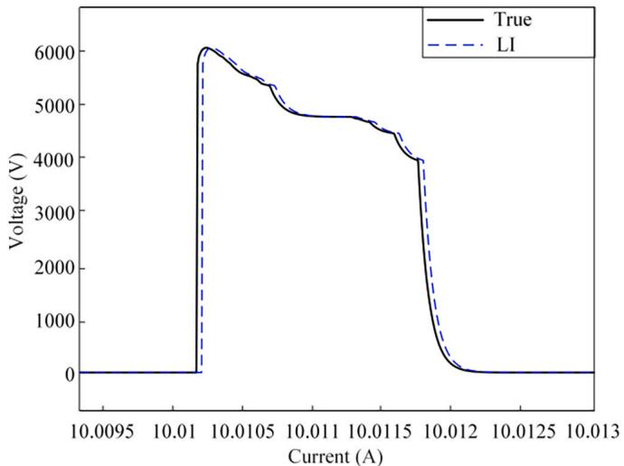  
Fig. B1. Comparison of the MOV I-V characteristics obtained from the linear-interpolation model (“LI”) and the reference datasheet (“TRUE”). (Note that the LI curve includes a sampling-induced time offset of 20 μs).

# Data availability

The authors do not have permission to share data.

# References

[1] Gao C, Yang J, He Z, Tang G, Zhang J, Li T, et al. Novel Controllable-Line-Commutated Converter for eliminating Commutation failures of LCC-HVDC System. IEEE Trans Power Delivery 2023;38:255–67.   
[2] Yang J, Gao C, He Z, He D, Zhang J. Dynamic performance of Controllable Line-Commutated Converter (CLCC) in HVDC systems with weak sending end AC network. In: 2023 IEEE 6th International Electrical and Energy Conference; (CIEEC)2023.. p. 4495–9.

[3] Zhou L, Nian H, Liu H, Yang J, Luan H, Niu Y, et al. Research and Engineering Application of Controllable Line Commutated Converter Valve-Control System. In: 2024 International Conference on HVDC; (HVDC)2024.. p. 574–9.   
[4] Wu N, Xu J, Linghu J, Huang J. Real-time optimal control and dispatching strategy of multi-microgrid energy based on storage collaborative. Int J Electr Power Energy Syst 2024;160:110063.   
[5] Li B, Zhao H, Jiang Y, Meng L. Real-time simulation for detailed wind turbine model based on heterogeneous computing. Int J Electr Power Energy Syst 2024; 155:109486.   
[6] Sun Z, Guo X, Wang S, You X. A status pre-matching method for the real-time simulation of power electronic converters. Int J Electr Power Energy Syst 2024; 155:109671.   
[7] Akbarpour M, Montaser Kouhsari S, Hossein Hesamedin Sadeghi S. Operational electricity cost reduction using real-time simulators. International Journal of Electrical Power & Energy Systems. 2024;162:110277.

[8] Soleymani M, Bigdeli N, Rahmani M. Real-time time-varying economic nonlinear model predictive control for wind turbines. Int J Electr Power Energy Syst 2024; 159:110019.   
[9] Zhang S, Yang S, He T, Liu Q, Wu M. Real-time energy management strategy for flexible traction power supply system. Int J Electr Power Energy Syst 2024;156: 109768.   
[10] Li R, Li D, Gao Y, Gu C, Sun X, Fan L. FPGA-based real-time simulation of LCC-HVDC systems with C-NAM method. J Power Electron 2023;1–10.   
[11] Liu Y, Xu J, Zhu Y, Tian Z, Zhao C, Li G. Modeling Method for DFIG-Based Wind Farm in High-Efficiency Real-Time Electromagnetic Transient (EMT) Simulations. IEEE Trans Power Electron 2025;40:13632–42.   
[12] Dagbagi M, Hemdani A, Idkhajine L, Naouar MW, Monmasson E, Slama-Belkhodja I. ADC-Based embedded Real-Time Simulator of a Power Converter Implemented in a Low-cost FPGA: Application to a Fault-Tolerant Control of a Grid-Connected Voltage-Source Rectifier. IEEE Trans Ind Electron 2016;63: 1179–90.   
[13] Mirzahosseini R, Iravani R. Small Time-step FPGA-Based Real-Time simulation of Power Systems Including Multiple Converters. IEEE Trans Power Delivery 2019;34: 2089–99.

[14] T D, Shen Z, Dinavahi V. Multi-Rate Mixed-Solver for Real-Time Nonlinear Electromagnetic Transient Emulation of AC/DC Networks on FPGA-MPSoC Architecture. 2020 IEEE Power & Energy Society General Meeting (PESGM)2020. p. 1.   
[15] Jiang Z, Gao Y, Tian X, Chen G, Wen B, Peng Z, et al. Aerodynamic load extraction in the real-time hybrid model test for floating wind turbine. Ocean Eng 2025;333: 121439.   
[16] Zhou C, Fang C, Kandic M, Wang P, Kent K, Menzies D. Large-scale hybrid real time simulation modeling and benchmark for nelson river multi-infeed HVdc system. Electr Pow Syst Res 2021;197:107294.   
[17] Bai H, Huang G, Liu C, Huangfu Y, Gao F. A Controller HIL Testing Approach of High Switching Frequency Power Converter via Slower-Than-Real-Time simulation. IEEE Trans Ind Electron 2024;71:8690–702.   
[18] Zhang F, Bieber L, Zhang Y, Li W, Wang L. A Multi-Port DC Power Flow Controller Integrated with MMC Stations for Offshore Meshed Multi-Terminal HVDC Grids. IEEE Trans Sustainable Energy 2023;14:1676–91.   
[19] Zhang C, Huang J, Song G, Dong X. Non-Unit Ultra-High-speed Line Protection for Multi-Terminal Hybrid LCC/MMC HVDC System and its Application Research. IEEE Trans Power Delivery 2021;36:2825–38.