# Extension of Vance’s closed-form approximation to calculate the ground admittance of multiconductor underground cable systems

Naiara Duarte a,* , Alberto De Conti b , Rafael Alipio

a Graduate Program of Electrical Engineering (PPGEE), Universidade Federal de Minas Gerais (UFMG), Belo Horizonte, Brazil   
b Department of Electrical Engineering, Universidade Federal de Minas Gerais (UFMG), Belo Horizonte, Brazil   
c Department of Electrical Engineering of Federal Center of Technological Education (CEFET-MG), Belo Horizonte, Minas Gerais, Brazil

# A R T I C L E I N F O

# Keywords:

Underground cables

Ground admittance

Ground-return impedance

Electromagnetic transients

Power cable modeling

# A B S T R A C T

In this paper, Vance’s closed-form approximation for the ground admittance of a single underground cable is extended to represent three-phase underground cable systems. The proposed methodology considers Sunde’s expression for the ground-return impedance calculation. The accuracy of the proposed extension is investigated taking as reference the generalized formulas of Xue et al. considering frequency-dependent soil parameters according to the Alipio-Visacro model. It is shown that the agreement between the approximate and generalized formulations is improved as the frequency increases. More importantly, it is shown that both methodologies lead to transient waveforms in good agreement for different types of excitation, different values of soil resistivity, and usual underground cable system configurations.

# 1. Introduction

THE application of underground cables in electrical power systems requires an accurate representation of cable parameters considering the influence of a finitely-conducting ground. Much attention has been given to the ground-return impedance calculation [1], but recent studies show that the ground admittance plays a significant role in the transient analysis of underground cable systems in case of high-resistivity soils and high-frequency phenomena [1-5].

Early efforts to derive correction terms to account for the effect of a finitely conducting ground on underground cables are reported in [6-8]. More recently, Papadopoulos et al. [3], Magalh˜aes et al. [9], and Xue et al. [10] proposed expressions for calculating the ground impedance and admittance of underground cables, each derived under different approximations. Their application requires the evaluation of infinite integrals that may present singularities and/or slow convergence. To overcome this problem, logarithmic approximations for the ground admittance and impedance of underground cables were proposed in [11]. However, these approximate expressions were derived assuming the air-ground interface as the reference point for calculating the cable voltages, which limits their application. The above difficulties may explain why the ground admittance is completely neglected in popular electromagnetic transient (EMT) simulation tools, which restricts the

application of such tools to the simulation of low-frequency transients in cable systems buried in low-resistivity soils.

An alternative to the solution of the complex integrals required for calculating the ground admittance of a single underground cable is the use of Vance’s expression $Y _ { g } \approx \gamma _ { g } ^ { 2 } Z _ { g } ^ { - 1 } ~ [ 8 ]$ , where $Y _ { g }$ is the ground admittance, $Z _ { g }$ is the ground-return impedance, and $\gamma _ { g }$ is the propagation constant of the soil. This expression was later recommended in [12] and [1] for including the ground admittance in the modeling of a single overhead wire or a single underground cable, respectively. In [4], it was used in the simulation of lightning overvoltages on an underground conductor considering or not the presence of an insulating layer, leading to a relatively good agreement with a rigorous full-wave model based on the finite-difference time-domain (FDTD) method. In [13], this simplified expression was used to investigate the influence of frequency-dependent soil parameters on transient voltages on an underground cable. In none of the cases, however, it was investigated whether Vance’s expression could be used to simulate transients on multiconductor cable systems.

In this paper, an extension of Vance’s formula is proposed to calculate the ground admittance of trefoil, vertical and flat three-phase cable systems considering different types of excitations and different values of soil resistivity. The validity of the proposed extension is investigated taking as reference results obtained with the generalized ground-return

impedance and ground admittance formulas derived by Xue et al. [10] considering frequency-dependent soil parameters using Alipio-Visacro model [14].

This paper is organized as follows. Section II presents modeling details. Frequency- and time-domain analyses are presented in Sections III and IV, respectively. A discussion is presented in Section V, followed by conclusions in Section VI.

# 2. Modeling

# 2.1. System geometry

The flat, vertical and trefoil cable systems investigated in this paper are shown in Fig. 1 [15]. In order to focus on the effect of the ground admittance on the resulting transients, each cable was modeled as a single insulated conductor with the characteristics shown in Fig. 1(a). The inclusion of a detailed internal cable representation is straightforward and can be performed as indicated in [16]. The cable insulation has permittivity $\varepsilon _ { i n } = \varepsilon _ { r i n } \varepsilon _ { 0 }$ , where $\varepsilon _ { r i n }$ is the dielectric constant of the insulating layer. The burial depth is h and the cable has a total length $\ell .$ The radius of the inner conductor is a and its resistivity is $\rho _ { c } .$ . The thickness of insulation is defined in terms of the outer radius b. The consideration of the frequency-dependent nature of the soil electrical parameters, which is important for a more rigorous assessment of transient overvoltages, is determined according to the causal model proposed by Alipio and Visacro [14]. The model equations are

$$
\sigma_ {g} = \sigma_ {0} + \sigma_ {0} \times h \left(\sigma_ {0}\right) \left(\frac {f}{1 \mathrm {M H z}}\right) ^ {\zeta} \tag {1}
$$

$$
\varepsilon_ {g} = \varepsilon_ {\infty} ^ {\prime} + \frac {\tan (\pi \zeta / 2) \times 1 0 ^ {- 3}}{2 \pi (1 \mathrm {M H z}) ^ {\zeta}} \sigma_ {0} \times h \left(\sigma_ {0}\right) f ^ {\zeta - 1} \tag {2}
$$

where $\sigma _ { g }$ is the soil conductivity in mS/m, $\sigma _ { 0 } = 1 / \rho _ { 0 }$ is the DC conductivity in mS/m, $\rho _ { 0 }$ is the DC soil resistivity, $\varepsilon _ { g }$ is the soil permittivity, $\varepsilon _ { \infty } ^ { ' }$ is the soil permittivity at higher frequencies, and f is the frequency in Hz. The following parameters are used to obtain mean results for the frequency variation of $\sigma _ { g }$ and $\varepsilon _ { g } [ 1 4 ] \colon \zeta = 0 . 5 4 , \varepsilon _ { \infty } ^ { ' } = 1 2 \varepsilon _ { 0 }$ and $h ( \sigma _ { 0 } ) =$

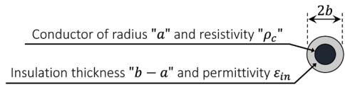  
(a)Underground cable cross-section.

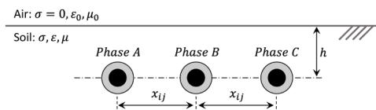

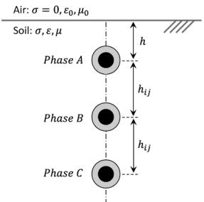  
(b）Flat configuration.   
(c）Vertical configuration.

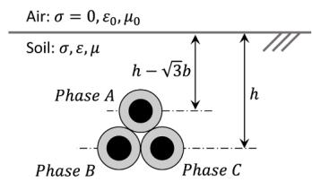  
(d） Trefoil configuration.   
Fig. 1. Underground cable systems with $a { = } 2 . 3 4 \mathrm { c m } , b { = } 3 . 8 5 \mathrm { c m } , \rho _ { c } { = } 1 , 7 \times 1 0 ^ { - 8 }$ Ωm and $\varepsilon _ { r i n } = 3 . 5 \colon ( \mathsf { a } )$ underground cable cross-section, (b) flat, (c) vertical and (d) trefoil configurations.

$1 . 2 6 \times \sigma _ { 0 } ^ { - 0 . 7 3 }$ , where $\varepsilon _ { 0 }$ is the vacuum permittivity.

The per-unit-length impedance Z and admittance Y matrices of an underground cable system are given by

$$
\mathbf {Z} = \mathbf {Z} _ {i} + \mathbf {Z} _ {e} + \mathbf {Z} _ {g} \tag {3}
$$

$$
\boldsymbol {Y} = \left(\boldsymbol {Y} _ {e} ^ {- 1} + \boldsymbol {Y} _ {g} ^ {- 1}\right) ^ {- 1}. \tag {4}
$$

The impedance given by (3) is the sum of the internal impedance $\mathbf { Z } _ { i }$ due to the magnetic field within the conductor, the external impedance ${ \mathbf { Z } _ { e } } = j \omega { \mathbf { L } }$ due to the magnetic field within the insulation, and the groundreturn impedance $\mathbf { Z } _ { g }$ due to the magnetic field penetrating in the soil [4]. The admittance given by (4) depends on the external admittance $Y _ { e } =$ jωC due to the electric field in the insulation, and the ground admittance $Y _ { g }$ due to the electric field in the soil [4].

The elements of the internal impedance matrix of the conductor are given by [17]

$$
Z _ {i i i} = \frac {\rho_ {c} m}{2 \pi a} \frac {I _ {0} (m a)}{I _ {1} (m a)} \tag {5}
$$

where $I _ { 0 } ( . )$ and $I _ { 1 } ( . )$ are modified Bessel functions of first kind and m is calculated as $m = \sqrt { j \omega \mu _ { 0 } / \rho _ { c } }$ .

The elements of the per-unit-length inductance and capacitance matrices due to the insulation are given by [17]

$$
L _ {i i} = \frac {\mu_ {0}}{2 \pi} \ln \left(\frac {b}{a}\right) \tag {6}
$$

$$
C _ {i i} = \frac {2 \pi \varepsilon_ {i n}}{\ln \left(\frac {b}{a}\right)} \tag {7}
$$

# 2.2. Ground-return impedance

In order to calculate the ground-return impedance, the following equation proposed by Sunde [18] for a system of underground cables is considered

$$
Z _ {g _ {i j}} = \frac {j \omega \mu_ {0}}{2 \pi} \left[ K _ {0} \left(\gamma_ {g} d _ {i j}\right) - K _ {0} \left(2 \gamma_ {g} D _ {i j}\right) + 2 \int_ {0} ^ {\infty} \frac {e ^ {- \left(h _ {i} + h _ {j}\right) \sqrt {\lambda^ {2} + \gamma_ {g} ^ {2}}}}{\lambda + \sqrt {\lambda^ {2} + \gamma_ {g} ^ {2}}} \cos (\lambda x _ {i j}) d \lambda \right] \tag {8}
$$

where $K _ { 0 } ( . )$ and $K _ { 1 } ( . )$ are modified Bessel functions of second kind, $h _ { i }$ and $h _ { j }$ are the depth of cables i and $j , x _ { i j }$ is the horizontal distance between cables i and j, $d _ { i j } = \sqrt { x _ { i j } ^ { 2 } + ( h _ { i } - h _ { j } ) ^ { 2 } } , D _ { i j } = \sqrt { x _ { i j } ^ { 2 } + ( h _ { i } + h _ { j } ) ^ { 2 } }$ , and $\gamma _ { g } = \sqrt { j \omega \mu _ { 0 } [ \sigma _ { g } + j \omega \varepsilon _ { g } ] }$ . For determining the self-elements o $\mathbf { \mathcal { Z } } _ { g } , d _ { i j }$ and $x _ { i j }$ are replaced by the external cable radius, $^ { b , }$ and $h _ { i } = h _ { j } = h$ .

# 2.3. Ground admittance

In this paper, it is proposed to extend Vance’s approximation [8] to simulate the configurations shown in Fig. 1. For this, it is assumed that the ground admittance can be calculated as

$$
Y _ {g} = \gamma_ {g} ^ {2} Z _ {g} ^ {- 1}, \tag {9}
$$

where

$$
\gamma_ {g} ^ {2} = \mathbf {Z} _ {g} \mathbf {Y} _ {g} \approx \left[ \begin{array}{c c c} \gamma_ {g} ^ {2} & 0 & 0 \\ 0 & \gamma_ {g} ^ {2} & 0 \\ 0 & 0 & \gamma_ {g} ^ {2} \end{array} \right] \tag {10}
$$

It can be observed that (9) and (10) assume independent wave propagation in the ground considering the intrinsic propagation constant of this medium. The validity of this assumption is investigated in

the next sections.

# 3. Analysis of the proposed methodology in frequency-domain

In this section, the validity of the proposed methodology is investigated in the frequency domain. For this, the integral equations proposed by Xue et al. [10] to calculate the ground-return impedance and the ground admittance, reproduced in the Appendix, are taken as reference. This choice is due to the generalized nature of these equations, which are based on the rigorous quasi-TEM solution of Maxwell’s equations applied to the problem of a multiconductor underground cable system. Furthermore, the soil conductivity and permittivity are treated as frequency-dependent according to (1) and (2) [14].

Two sets of analyses are performed. The first compares the selfelements of matrix $Z _ { g } Y _ { g }$ obtained with the integral equations of Xue et al. [10] with their approximate representation $\gamma _ { g } ^ { 2 }$ in (10). The second analysis calculates the ratio between the self and mutual elements of $Z _ { g } Y _ { g }$ in order to investigate whether the off-diagonal elements of this matrix could eventually be neglected as in (10). Two different soil resistivities are considered, namely 200 Ωm and 2000 Ωm. For the flat configuration shown in Fig. 1(b), different horizontal distances between the cables were assumed (12 cm and 30 cm) to assess the generality of the simplified approach (10). However, in this paper only the results obtained for the flat configuration with 30-cm separation are shown.

The results obtained for the flat configuration are shown in Figs. 2 and 3. Figs. 4 and 5 illustrate the results for the vertical configuration and, finally, Figs. 6 and 7 show the results obtained for the trefoil configuration. It is observed in Figs. 2, 4, and 6 that the self-elements of $Z _ { g } Y _ { g }$ obtained with the integral equations of Xue et al. [10] approach $\gamma _ { g } ^ { 2 }$ as the frequency increases, regardless of soil resistivity and cable configuration. In this case, the calculated ratios are close to unity, demonstrating the validity of Vance’s approach in high frequencies. Ratios larger than unity are possibly related to numerical errors in the solution of the infinite integrals of Xue et al. and to the fact that these equations are valid up to 10 MHz due to the quasi-TEM assumption adopted in [10]. In the low-frequency range, larger deviations are observed. However, the ratios are always greater than 0.77 for the trefoil configuration, while for the flat and vertical configurations the ratios are not lower than 0.85 and 0.81, respectively.

Regarding the ratio between the self and mutual elements of $Z _ { g } Y _ { g }$ calculated with Xue et al.’s expressions, it is seen in Fig. 7 that it is greater than 7 in the whole frequency range for the trefoil configuration, regardless of soil resistivity. Furthermore, the ratio increases with increasing frequency. For the flat and vertical configurations (see Figs. 3 and 5), the ratio is greater than 5 in the low-frequency range, reaching values greater than 10 in the high-frequency range.

Overall, a better agreement is observed between the simplified formula (10) and Xue et al.’s expressions as the frequency increases. This is a favorable result because the influence of the ground admittance is

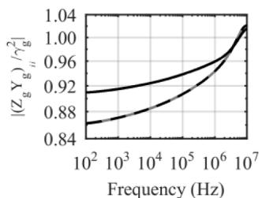  
(a)200Ωm.

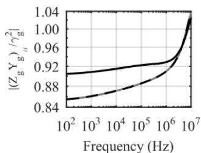  
(b)2000Ωm.

$$
- | \left(Z _ {\mathrm {g}} \mathrm {Y} _ {\mathrm {g}}\right) _ {1 1} / \gamma_ {\mathrm {g}} ^ {2} | - | \left(Z _ {\mathrm {g}} \mathrm {Y} _ {\mathrm {g}}\right) _ {2 2} / \gamma_ {\mathrm {g}} ^ {2} | - - - | \left(Z _ {\mathrm {g}} \mathrm {Y} _ {\mathrm {g}}\right) _ {3 3} / \gamma_ {\mathrm {g}} ^ {2} |
$$

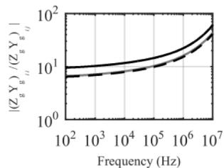  
Fig. 2. Underground cable system in flat formation, h=1.5 m and ${ x } _ { i j } { = } 0 . 3$ m. Ratio between self-elements of $\mathbf { Z } _ { g } \mathbf { { { Y } } } _ { g }$ obtained by Xue et al. [10] and $\gamma _ { g } ^ { 2 }$ for different soil resistivities: 200 Ωm (a) and 2000 Ωm (b).   
(a)200Ωm.

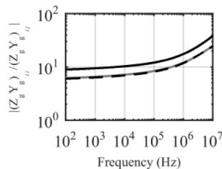  
(b）2000 Ωm.

$$
- \left| \left(\mathrm {Z} _ {\mathrm {g}} \mathrm {Y} _ {\mathrm {g}}\right) _ {1 1} / \left(\mathrm {Z} _ {\mathrm {g}} \mathrm {Y} _ {\mathrm {g}}\right) _ {1 2} \right| - \left| \left(\mathrm {Z} _ {\mathrm {g}} \mathrm {Y} _ {\mathrm {g}}\right) _ {1 1} / \left(\mathrm {Z} _ {\mathrm {g}} \mathrm {Y} _ {\mathrm {g}}\right) _ {1 3} \right| - - \left| \left(\mathrm {Z} _ {\mathrm {g}} \mathrm {Y} _ {\mathrm {g}}\right) _ {1 1} / \left(\mathrm {Z} _ {\mathrm {g}} \mathrm {Y} _ {\mathrm {g}}\right) _ {2 3} \right|
$$

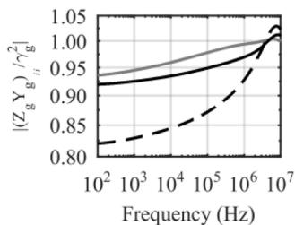  
Fig. 3. Underground cable system in flat formation, h=1.5 m and ${ x } _ { i j } { = } 0 . 3$ m. Ratio between self and mutual elements of $\mathbf { Z } _ { g } \mathbf { { { Y } } } _ { g }$ obtained by Xue et al. [10] for different soil resistivities: 200 Ωm (a) and 2000 Ωm (b).   
(a)200 Ωm.

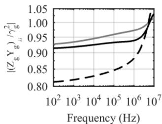  
(b)2000 Ωm.

$$
- | (Z _ {\mathrm {g}} \mathrm {Y} _ {\mathrm {g}}) _ {1 1} / \gamma_ {\mathrm {g}} ^ {2} | - | (Z _ {\mathrm {g}} \mathrm {Y} _ {\mathrm {g}}) _ {2 2} / \gamma_ {\mathrm {g}} ^ {2} | - - - | (Z _ {\mathrm {g}} \mathrm {Y} _ {\mathrm {g}}) _ {3 3} / \gamma_ {\mathrm {g}} ^ {2} |
$$

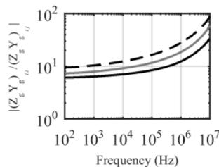  
Fig. 4. Underground cable system in vertical formation, h=1.5 m and $h _ { i j } { = } 0 . 3$ m. Ratio between self-elements of $\mathbf { Z } _ { g } \mathbf { { { Y } } } _ { g }$ obtained by Xue et al. [10] and $\gamma _ { g } ^ { 2 }$ for different soil resistivities: 200 Ωm (a) and 2000 Ωm (b).   
(a)200Ωm.

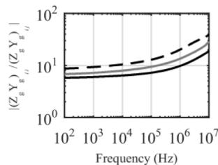  
(b)2000Ωm.

$$
- | \left(\mathrm {Z} _ {\mathrm {g}} \mathrm {Y} _ {\mathrm {g}}\right) _ {1 1} / \left(\mathrm {Z} _ {\mathrm {g}} \mathrm {Y} _ {\mathrm {g}}\right) _ {1 2} \mid - | \left(\mathrm {Z} _ {\mathrm {g}} \mathrm {Y} _ {\mathrm {g}}\right) _ {1 1} / \left(\mathrm {Z} _ {\mathrm {g}} \mathrm {Y} _ {\mathrm {g}}\right) _ {1 3} - - | \left(\mathrm {Z} _ {\mathrm {g}} \mathrm {Y} _ {\mathrm {g}}\right) _ {1 1} / \left(\mathrm {Z} _ {\mathrm {g}} \mathrm {Y} _ {\mathrm {g}}\right) _ {2 3}
$$

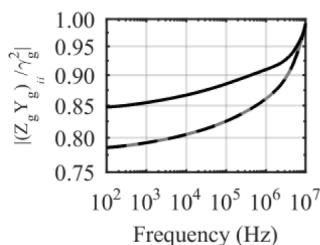  
Fig. 5. Underground cable system in vertical formation, h=1.5 m and $h _ { i j } { = } 0 . 3$ m. Ratio between self and mutual elements of $\boldsymbol { Z _ { g } } \boldsymbol { Y _ { g } }$ obtained by Xue et al. [10] for different soil resistivities: 200 Ωm (a) and 2000 Ωm (b).   
(a)200Ωm.

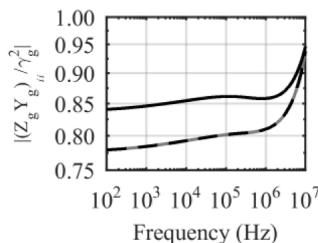  
Fig. 6. Underground cable system in trefoil formation, h=1 m. Ratio between self-elements of $\boldsymbol { Z _ { g } } \boldsymbol { Y _ { g } }$ obtained by Xue et al. [10] and $\gamma _ { g } ^ { 2 }$ for different soil resistivities: 200 Ωm (a) and 2000 Ωm (b).

(b)2000 Ωm.

$$
- | \left(\mathrm {Z} _ {\mathrm {g}} \mathrm {Y} _ {\mathrm {g}}\right) _ {1 1} / \gamma_ {\mathrm {g}} ^ {2} | - | \left(\mathrm {Z} _ {\mathrm {g}} \mathrm {Y} _ {\mathrm {g}}\right) _ {2 2} / \gamma_ {\mathrm {g}} ^ {2} | - - - | \left(\mathrm {Z} _ {\mathrm {g}} \mathrm {Y} _ {\mathrm {g}}\right) _ {3 3} / \gamma_ {\mathrm {g}} ^ {2} |
$$

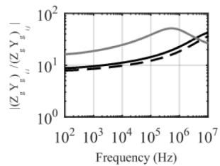  
(a)200Ωm.

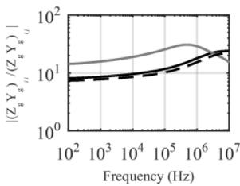  
(b)2000Ωm.

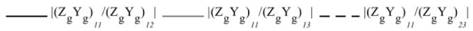  
Fig. 7. Underground cable system in trefoil formation, h=1 m. Ratio between self and mutual elements of $\boldsymbol { Z _ { g } } \boldsymbol { Y _ { g } }$ obtained by Xue et al. [10] for different soil resistivities: 200 Ωm (a) and 2000 Ωm (b).

more pronounced at high frequencies [10]. Conversely, although the observed differences are larger for low frequencies, the influence of the ground admittance is usually negligible in this range. This can be observed in Fig. 8, which illustrates the ratio $| Y _ { e } | / | Y _ { g } |$ for a single underground cable considering soil resistivities of 200 Ωm and 2000 Ωm. In the calculations, Xue et al.’s integral equations were considered. It can be seen that $| Y _ { e } | / | Y _ { g } | { \ll } 1$ in the low-frequency range. Since the per-unit-length shunt admittance is given by $Y = Y _ { e } Y _ { g } / ( Y _ { e } + Y _ { g } ) = Y _ { e }$ $/ ( Y _ { e } / Y _ { g } + 1 ) .$ , it can be concluded that $Y \approx Y _ { e }$ at low frequencies. This confirms that the ground admittance has a negligible influence in the low-frequency range. On the other hand, with increasing frequency the ratio $| Y _ { e } | / | Y _ { g } |$ increases and the influence of the ground admittance become comparatively more significant.

To conclude, according to the results presented in this section the deviations between the approximate formula and the rigorous formulation of Xue et al. increase with increasing soil resistivity. However, the observed differences are not very significant in the considered frequency range. This indicates that despite its simple nature, the proposed extension of Vance’s formula to calculate the ground admittance of three-phase underground cables seems promising. This is confirmed by the time-domain analysis presented in the next section.

# 4. Transient responses

The transient response of the underground cable systems shown in Fig. 1 is calculated in this paper using a technique based on the nodal admittance matrix $Y _ { n } ,$ given by [17]:

$$
\mathbf {Y} _ {n} = \left[ \begin{array}{c c} \mathbf {Y} _ {c} (1 + \mathbf {A} ^ {2}) (1 - \mathbf {A} ^ {2}) ^ {- 1} & - 2 \mathbf {Y} _ {c} \mathbf {A} (1 - \mathbf {A} ^ {2}) ^ {- 1} \\ - 2 \mathbf {Y} _ {c} \mathbf {A} (1 - \mathbf {A} ^ {2}) ^ {- 1} & \mathbf {Y} _ {c} (1 + \mathbf {A} ^ {2}) (1 - \mathbf {A} ^ {2}) ^ {- 1} \end{array} \right] \tag {11}
$$

where 1 is the identity matrix, $Y _ { c }$ is the characteristic admittance matrix, and A is the propagation matrix, all of order 3 × 3. Matrices $Y _ { c }$ and A are calculated as follows:

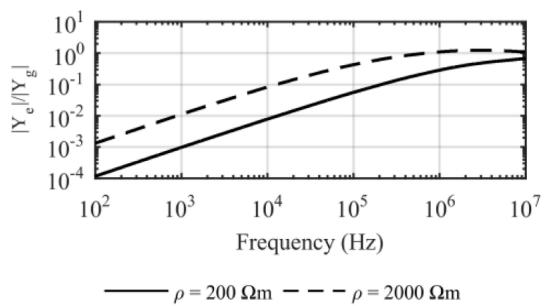  
Fig. 8. Ratio between the admittance of the insulation $( Y _ { e } )$ and the ground admittance $( Y _ { g } )$ of an underground cable with $h { = } 1 . 5 ~ \mathrm { m } ,$ for soil resistivities of 200 Ωm and 2000 Ωm and $Y _ { g }$ obtained by Xue et al. [10].

$$
Y _ {c} = Z ^ {- 1} \sqrt {Z Y} \tag {12}
$$

$$
\boldsymbol {A} = \exp \left(- \ell \sqrt {\mathbf {Z Y}}\right) \tag {13}
$$

The nodal admittance matrix is a two-port model obtained from the exact frequency-domain solution of telegrapher’s equations. All the calculations are performed in the frequency domain and the time domain response is obtained using the numerical Laplace transform [19].

# 4.1. Transient voltage responses

Fig. 9 illustrates the configuration considered for the transient simulations. A unit-step voltage is applied at the sending end of phase A (node 1) of an underground cable system with length of 100 m considering the geometries shown in Fig. 1. The sending end of phase B (node 2) was grounded through a 10-Ω resistor and the sending end of phase C (node 3) was left open. The voltages are calculated at the receiving ends of phases A and C (nodes 4 and $^ { 6 , }$ respectively) assuming a no-load condition. Calculations were performed considering the extension of Vance’s formula to multiconductor cables systems as indicated in (9) and (10). As before, the generalized formulations of ground impedance and admittance derived by Xue et al. [10] are used as reference and frequency-dependent soil parameters are considered using Alipio-Visacro model [14]. Two different values of soil resistivity are considered, namely 200 Ωm and 2000 Ωm. The results are shown in Figs. 10-12 considering the configurations of Fig. 1.

It can be seen in Figs. 10-12 that the simplified approach proposed in this paper leads to voltage and current waveforms in very good agreement with the formulations derived by Xue et al. [10]. For the soil resistivity of 200 Ωm, the agreement between the different formulations is excellent in all cases. This result is expected because for low-resistivity soils the effect of the ground admittance is less significant [20]. For the 2000-Ωm soil, minor deviations are observed in the first microseconds of the transient voltages and currents. At later times, when low frequencies are dominant, the agreement is excellent.

An interesting result is that despite the fact that the proposed approximation improves as the frequency increases, the observed deviations are greater exactly in the first microseconds. Although seemingly contradictory, this happens because the early-time transient response presents the fastest variations and, therefore, excites the range of frequencies where the ground admittance has a greater influence. In this case, any deviation between the approximated formula and Xue et al.’s equations becomes more visible in the transient voltage and current waveforms. Conversely, the larger errors associated with the proposed approximation in the low-frequency range do not lead to deviations in the late time transient response because in this frequency range the influence of the ground admittance is negligible, as discussed in Section III.

In any case, the observed deviations can be considered negligible in all investigated cases. This is a promising result because the simplified formula (9) avoids the solution of infinite integrals for the calculation of the ground admittance, as required in Xue et al.’s equations [10]. The calculation can be simplified even further if Sunde’s integral equation

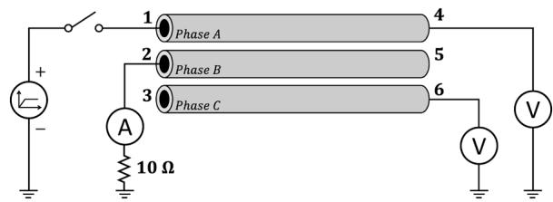  
Fig. 9. Transient simulation.

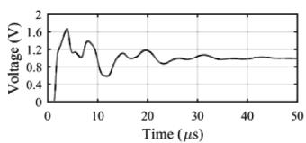

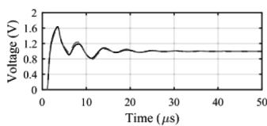

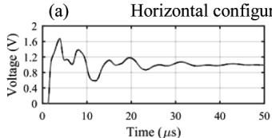

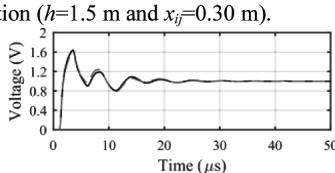

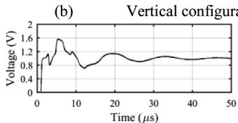

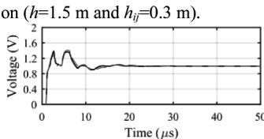  
（c）  
Trefoil configuration (h=1 m). Xue et al.[10]－--"Sunde + Vance"

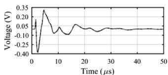  
Fig. 10. Voltages at the receiving end of phase A (node 4) for the application of a unit-step voltage at phase A considering 200 Ωm (left) and 2000 Ωm (right) soils for (a) horizontal, (b) vertical, and (c) trefoil configurations.

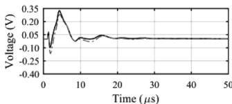

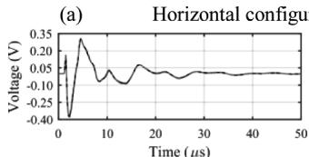

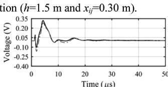

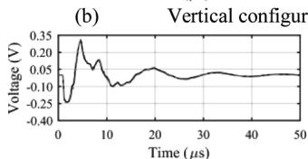

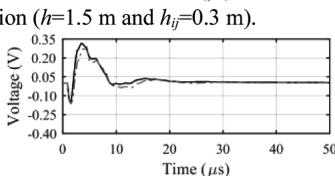  
  
Trefoil configuration (h=1 m). Xue et al.[10] -.-.-"Sunde + Vance"   
Fig. 11. Voltages at the receiving end of phase C (node 6) for the application of a unit-step voltage at phase A considering 200 Ωm (left) and 2000 Ωm (right) soils for (a) horizontal, (b) vertical, and (c) trefoil configurations.

(8) is replaced by a closed-form approximation (e.g., [2] or [21]).

# 4.2. Zero-sequence switching transients

Fig. 13 illustrates the configuration used to investigate the response of the underground cable systems to a zero-sequence switching test. The cables were assumed to be 10-km long, and this time an AC cosine voltage source with 1 p.u. magnitude and 60 Hz frequency is applied simultaneously at the sending end of phases A, B and C, with the receiving ends open. The voltages are calculated at the receiving end of phase A (node 4). Fig. 14 shows the obtained results. Once again, a good agreement is observed between the waveforms calculated with the simplified approach and those obtained with the formulas of Xue et al. [10].

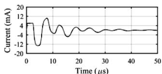

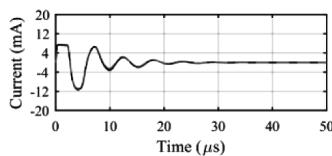

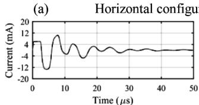

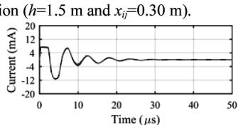

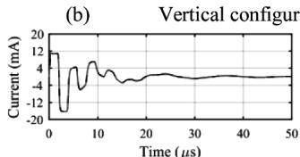

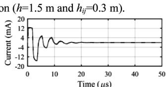  
（c） Trefoil configuration (h=1 m). Xue et al.[10]－--"Sunde+ Vance"

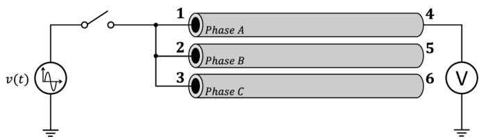  
Fig. 12. Currents at the sending end of phase B (node 2) for the application of a unit-step voltage at phase A considering 200 Ωm (left) and 2000 Ωm (right) soils for (a) horizontal, (b) vertical, and (c) trefoil configurations.   
Fig. 13. Zero-sequence switching test.

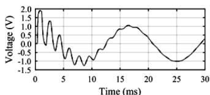

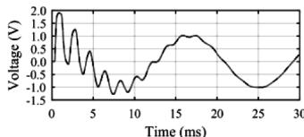

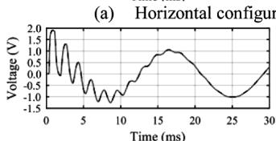

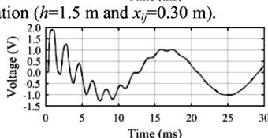

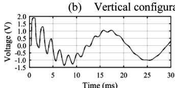

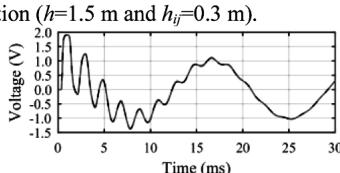  
(c）Trefoil configuration (h=1 m). Xue et al. [10]---"Sunde +Vance"   
Fig. 14. Voltages at the receiving end of phase A (node 4) for the simultaneously application of an AC cosine voltage source at the sending end of phases A, B and C considering 200 Ωm (left) and 2000 Ωm (right) soils for (a) horizontal, (b) vertical, and (c) trefoil configurations.

# 4.3. Positive-sequence switching transients

In order to complement the time-domain analysis, Fig. 15 illustrates the configuration used to investigate the response of the underground cable systems to a positive-sequence switching test. Once again, the

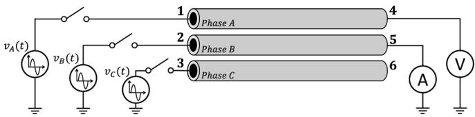  
Fig. 15. Positive-sequence switching test.

cables were assumed to be 10-km long, an AC positive sequence cosine voltage source with 1 p.u. magnitude and 60 Hz frequency is applied to the three phases at the sending ends. The receiving end of phase B (node 5) was grounded, while the receiving ends of the remaining cables were left open. The voltages and currents are calculated at the receiving ends of phases A and B (nodes 4 and 5, respectively). The obtained results are shown in Figs. 16 and 17. Once again, the simplified approach leads to results in good agreement with those obtained with the formulas of Xue et al. [10].

# 4.4. Lightning transients

Fig. 18 illustrates the configuration considered for lightning transient simulations. A lightning impulse voltage waveform that represents the effect of a typical negative downward lightning current measured at Mount San Salvatore, Switzerland, was considered. This choice is based on the fact that subsequent strokes have higher frequency content compared to first stroke currents [22, 23], which is preferred for enhancing the influence of the ground admittance on the results. The impulse voltage waveform was obtained summing two Heidler’s functions, defined in (14) and (15), where $V _ { 0 k }$ controls the amplitude, τ is the front-time constant, $\tau _ { 2 k }$ is the decay-time constant, $\eta _ { k }$ is the amplitude correction factor, and $n _ { k }$ is an exponent controlling the steepness of the waveform. The parameters of the two Heidler’s functions are summarized in Table I, considering a normalized amplitude of 1 V [24].

$$
v (t) = \sum_ {k = 1} ^ {2} \left(V _ {0 k} / n _ {k}\right) \exp \left(- t / \tau_ {2 k}\right) \left\{\left(t / \tau_ {1 k}\right) ^ {n _ {k}} / \left[ 1 + \left(t / \tau_ {1 k}\right) ^ {n _ {k}} \right] \right\} \tag {14}
$$

$$
\eta_ {k} = \exp \left[ - \left(\tau_ {1 k} / \tau_ {2 k}\right) \left(n _ {k} t _ {2 k} / \tau_ {1 k}\right) ^ {1 / n _ {k}} \right]. \tag {15}
$$

The impulse voltage characterized by (14) and (15) is applied at the

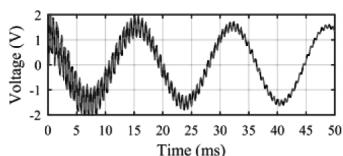

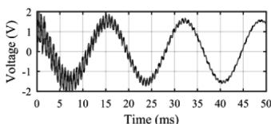  
(a)Horizontal configuration (h=1.5 m and xij=0.30 m).

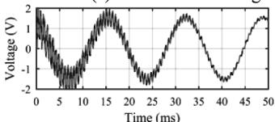

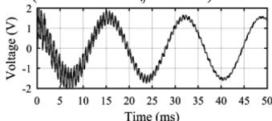  
(b)Vertical configuration (h=1.5 m and $h _ { i j } { = } 0 . 3 ~ \mathrm { m } )$

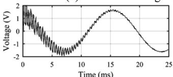

(c）Trefoil configuration (h=1 m).   
  
Xue etal.[10]－--"Sunde +Vance"

  
Fig. 16. Voltages at the receiving end of phase A (node 4) for the application of an AC cosine voltage source at the sending end of phases A, B and C considering 200 Ωm (left) and 2000 Ωm (right) soils for (a) horizontal, (b) vertical, and (c) trefoil configurations.

  
(b）Vertical configuration (h=1.5 m and $h _ { i j } { = } 0 . 3$ m).

(c）Trefoil configuration (h=1 m).   
  
Xue et al.[10]－--"Sunde + Vance"

  
Fig. 17. Currents at the receiving end of phase B (node 5) for the application of an AC cosine voltage source at the sending end of phases A, B and C considering 200 Ωm (left) and 2000 Ωm (right) soils for (a) horizontal, (b) vertical, and, (c) trefoil configurations.   
Fig. 18. Lightning simulation.

Table I Parameters used in the Heidler functions.   

<table><tr><td>k</td><td>V0k(V)</td><td>nk</td><td>τ1k(μs)</td><td>τ2k(μs)</td></tr><tr><td>1</td><td>0.94</td><td>2</td><td>0.25</td><td>2.5</td></tr><tr><td>2</td><td>0.57</td><td>2</td><td>2.1</td><td>230</td></tr></table>

sending end of phase A (node 1) of an underground cable system with length of 100 m considering the geometries shown in Fig. 1. As in Section IV-A, the sending end of phase B (node 2) was grounded through a 10-Ω resistor and the sending end of phase C (node 3) was left open. The voltages are calculated at the receiving ends of phases A and C (nodes 4 and 6, respectively) assuming a no-load condition. The results are shown in Figs. 19-21 considering the configurations of Fig. 1 and the same methodology adopted in Section IV-A.

Similarly to the results presented in Section IV-A, the simplified approach proposed in this paper leads to voltage and current waveforms in very good agreement with the formulations derived by Xue et al. [10] also for lightning transients, as shown in Figs. 19-21. The minor deviations observed for the 2000-Ωm soil can be also considered negligible in all investigated cases, whereas for the soil resistivity of 200 Ωm the agreement between the different formulations is excellent in all cases.

In fact, comparing the time-domain results obtained with both methodologies, it is noted that the differences observed in the frequency-domain analysis of Section III have little influence on the calculation of transients, becoming slightly more relevant with the increase of the soil resistivity. Although not shown in this paper, the analyses were extended to high-resistivity soils up to 5000 Ωm. Similar to

  
(a) Horizontal configuration (h=1.5 m and xij=0.30 m).

  
(b) Vertical configuration (h=1.5 m and hij=0.3 m).

  
（c） Trefoil configuration (h=1 m). Xue et al. [10]--- "Sunde + Vance"

  
Fig. 19. Voltages at the receiving end of phase A (node 4) for the application of an impulse voltage at phase A considering 200 Ωm (left) and 2000 Ωm (right) soils for (a) horizontal, (b) vertical, and (c) trefoil configurations.

  
（c） Trefoil configuration (h=1 m). Xue et al. [10] --·- "Sunde + Vance"   
Fig. 20. Voltages at the receiving end of phase C (node 6) for the application of an impulse voltage at phase A considering 200 Ωm (left) and 2000 Ωm (right) soils for (a) horizontal, (b) vertical, and (c) trefoil configurations.

the results obtained for the 2000-Ωm soil, only minor deviations were observed between the transient waveforms obtained with both tested formulations.

# 5. On the choice of expressions to calculate the ground parameters of underground cable systems

The advantages and disadvantages of the proposed approach compared with the generalized formulations of Xue et al. [10] are discussed in this section. Generally speaking, Xue et al.’s expressions [10] are recommended for the transient analysis of multiconductor underground cable systems if greater accuracy is the foremost concern. However, their expressions are not easily implemented due to the need of solving a number of Sommerfeld’s integrals (see the Appendix). In view of this, the approach proposed in this paper, based on the extension of Vance’s closed-form approximation, can be used with sufficient

  
(c） Trefoil configuration (h= Xue et al.[10]－--"Sunde + Vance"   
Fig. 21. Currents at the sending end of phase B (node 2) for the application of an impulse voltage at phase A considering 200 Ωm (left) and 2000 Ωm (right) soils for (a) horizontal, (b) vertical, and (c) trefoil configurations.

accuracy but with a much simpler and much more efficient implementation. The proposed methodology can be further simplified if closed-form approximations of Sunde’s integral equation as proposed by Saad et al. [21] and Theethayi [2] are used. Based on these comments, it is possible to claim that the investigated methodologies are not concurrent, but complementary and can be adopted according to the required accuracy to analyze the transient response of multiconductor underground cable systems.

# 6. Conclusion

An assumption based on the extension of Vance’s closed-form approximation [8] to calculate the ground admittance of typical three-phase underground cable systems is proposed in this paper. It is shown, considering frequency-dependent soil parameters according to the Alipio-Visacro model [14], that the proposed formula leads to good agreement with the formulations derived by Xue et al. [10], especially in the high-frequency range. Both switching and lightning transient simulations considering typical three-phase underground cable system configurations, different values of soil resistivity, and different types of excitation demonstrate that the proposed approach is able to lead to voltage and current waveforms in good agreement with the rigorous model used as reference. It is concluded that Vance’s simplified expression can be used for the calculation of the ground admittance of typical three-phase underground cable configurations without significant loss of accuracy, and with greater efficiency than the integral equations required for a more rigorous analysis of the problem.

# CRediT authorship contribution statement

Naiara Duarte: Conceptualization, Methodology, Software, Validation, Formal analysis, Investigation, Writing - original draft, Writing - review & editing, Visualization. Alberto De Conti: Conceptualization, Methodology, Formal analysis, Investigation, Writing - original draft, Writing - review & editing, Visualization, Supervision. Rafael Alipio: Conceptualization, Methodology, Validation, Formal analysis, Investigation, Writing - review & editing, Supervision.

# Declaration of Competing Interest

The authors declare that they have no known competing financial

interests or personal relationships that could have appeared to influence

the work reported in this paper.

# Appendix

The generalized formulations of Xue et al. to calculate the ground-return impedance and ground admittance for underground cables are given by [10]

$$
Z _ {g _ {i j}} = \frac {j \omega \mu_ {0}}{2 \pi} \left[ K _ {0} \left(j k _ {e} d _ {i j}\right) - K _ {0} \left(j k _ {e} D _ {i j}\right) + 2 \Delta_ {4} ^ {Q T} - 2 k _ {e} ^ {2} \Delta_ {6} ^ {Q T} \right] \tag {A.1}
$$

$$
Y _ {g _ {i j}} = j \omega P _ {e _ {i j}} ^ {- 1} \tag {A.2}
$$

$$
P _ {e i j} = \frac {j \omega}{2 \pi \left(\sigma_ {1} + j \omega \varepsilon_ {1}\right)} \left[ K _ {0} \left(j k _ {e} d _ {i j}\right) - K _ {0} \left(j k _ {e} D _ {i j}\right) + 2 \Delta_ {5} ^ {Q T} - 2 k _ {e} ^ {2} \Delta_ {6} ^ {Q T} \right] \tag {A.3}
$$

$$
\Delta_ {4} ^ {Q T} = \int_ {0} ^ {\infty} \left[ \frac {e ^ {- (h _ {i} + h _ {j}) u _ {1}}}{u _ {0} + u _ {1}} \right] \frac {\lambda^ {2}}{u _ {1} ^ {2}} \cos (\lambda x _ {i j}) d \lambda \tag {A.4}
$$

$$
\Delta_ {s} ^ {Q T} = \int_ {0} ^ {\infty} \left[ \frac {e ^ {- (h _ {i} + h _ {j}) u _ {1}}}{u _ {0} + k _ {a} ^ {2} k _ {e} ^ {- 2} u _ {1}} \right] \frac {\lambda^ {2}}{u _ {1} ^ {2}} \cos (\lambda x _ {i j}) d \lambda \tag {A.5}
$$

$$
\Delta_ {6} ^ {Q T} = \int_ {0} ^ {\infty} \left[ \frac {e ^ {- (h _ {i} + h _ {j}) u _ {1}}}{u _ {0} + u _ {1}} \right] \frac {1}{u _ {1} ^ {2}} \cos (\lambda x _ {i j}) d \lambda \tag {A.6}
$$

$$
u _ {0} = \sqrt {\lambda^ {2} - k _ {a} ^ {2}}, u _ {1} = \sqrt {\lambda^ {2} - k _ {e} ^ {2}} \tag {A.7}
$$

where $K _ { 0 } ( . )$ and $K _ { 1 } ( . )$ are modified Bessel functions of second kind, $h _ { i }$ and $h _ { j }$ are the depth of cables i and j, $x _ { i j }$ is the horizontal distance between cables i and $j , d _ { i j } = \sqrt { x _ { i j } ^ { 2 } + ( h _ { i } - h _ { j } ) ^ { 2 } , D _ { i j } \ } = \sqrt { x _ { i j } ^ { 2 } + ( h _ { i } + h _ { j } ) ^ { 2 } , k _ { a } = \omega \sqrt { \mu _ { 0 } \varepsilon _ { 0 } } }$ and $k _ { e } = \sqrt { - j \omega \mu _ { 1 } [ \sigma _ { 1 } + j \omega \varepsilon _ { 1 } ] }$ . For determining the self-elements of $\mathbf { Z } _ { g }$ and $Y _ { g } , d _ { i j }$ and xij are replaced by the external cable radius, b, and $h _ { i } = h _ { j } = h .$ .

# References

[1] N. Theethayi, R. Thottappillil, M. Paolone, C. Nucci, F. Rachidi, External impedance and admittance of buried horizontal wires for transient studies using transmission line analysis, IEEE Trans. Dielectr. Electr. Insul. 14 (3) (2007) 751–761. Jun.   
[2] N. Theethayi, Electromagnetic Interference in Distributed Outdoor Electrical Systems, with An Emphasis on Lightning Interaction with Electrified Railway Network, Uppsala University, 2005. Ph.D. ThesisISBN 91–554–6301–0.   
[3] T.A. Papadopoulos, D.A. Tsiamitros, G.K. Papagiannis, Impedances and admittances of underground cables for the homogeneous earth case, IEEE Trans. Power Deliv. 25 (2) (2010) 961–969. Apr.   
[4] N. Theethayi, Y. Baba, F. Rachidi, R. Thottappillil, On the choice between transmission line equations and full-wave Maxwell’s equations for transient analysis of buried wires, IEEE Trans. Electromagn. Compat. 50 (2) (2008) 347–357. May.   
[5] E. Petrache, F. Rachidi, M. Paolone, C.A. Nucci, V. Rakov, M. Uman, Lightning induced disturbances in buried cables—part i: theory, IEEE Trans. Electromagn. Compat. 47 (3) (2005) 498–508. Aug.   
[6] J.R. Wait, Electromagnetic wave propagation along a buried insulated wire, Can. J. Phys. 50 (20) (1972) 2402–2409. Oct.   
[7] G.E. Bridges, Transient plane wave coupling to bare and insulated cables buried in a lossy half-space, IEEE Trans. Electromagn. Compat. 37 (1) (1995) 62–70.   
[8] E.F. Vance, Coupling to Shielded Cables, Wiley, 1978.   
[9] A.P.C. Magalhaes, J.C.L.V. Silva, A.C.S. Lima, M.T. Correia de Barros, Validation limits of quasi-TEM approximation for buried bare and insulated cables, IEEE Trans. Electromagn. Compat. 57 (6) (2015) 1690–1697. Dec.   
[10] H. Xue, A. Ametani, J. Mahseredjian, I. Kocar, Generalized formulation of earthreturn impedance/admittance and surge analysis on underground cables, IEEE Trans. Power Deliv. 33 (6) (2018) 2654–2663. Dec.   
[11] J.P.L. Salvador, A.P.C. Magalhaes, A.C.S. Lima, M.T.C. de Barros, Closed-form expression for ground return admittance in underground cables, IEEE Trans. Power Deliv. 34 (6) (2019) 2251–2253. Dec.

[12] F. Rachidi, S. Tkachenko. Electromagnetic field interaction with transmission lines - from classical theory to HF radiation effects, WIT Press, 2008.   
[13] N. Duarte, A.D. Conti, R. Alipio, Transient analysis of buried cables considering a nodal admittance matrix approach, in: Proceedings of the 15th International Symposium on Lightning Protection, SIPDA, 2019.   
[14] R. Alipio, S. Visacro, Modeling the frequency dependence of electrical parameters of soil, IEEE Trans. Electromagn. Compat. 56 (5) (2014) 1163–1171. Oct.   
[15] CIGRE WG B1.07, Statistics of AC underground cables in power networks, Tech. Brochure 338 (2007). December.   
[16] A. Ametani, A general formulation of impedance and admittance of cables, IEEE Trans. Power App. Syst. 99 (1980) 902–910.   
[17] J.A. Martinez-Velasco, Power System Transients: Parameter Determination, CRC Press, 2010.   
[18] E.F. Sunde, Earth Conduction Effects in the Transmission Systems, Van Nostrand, New York, 1949.   
[19] P. Moreno, A. Ramirez, Implementation of the numerical Laplace Transform: a review task force on frequency domain methods for EMT Studies, Working Group on modeling and analysis of system transients using digital simulation, general systems subcommittee, IEEE power Engineering, IEEE Trans. Power Deliv. 23 (4) (2008) 2599–2609. Oct.   
[20] T.A. Papadopoulos, Z.G. Datsios, A.I. Chrysochos, P.N. Mikropoulos, G. K. Papagiannis, Wave propagation characteristics and electromagnetic transient analysis of underground cable systems considering frequency-dependent soil properties, IEEE Trans. Electromagn. Compat. (2020) 1–9.   
[21] M. Saad, Gaba O., Giroux G., A closed-form approximation for ground return impedance of underground cables. IEEE Trans. Power Deliy.11 (1996) 1536-1545.   
[22] K. Berger, R.B. Anderson, H. Kroninger, Parameters of lightning flashes, Electra (80) (1975) 223–237.   
[23] CIGRE WG C4.407, Lightning parameters for engineering applications, Tech. Brochure 549, vol. 269, August (2013).   
[24] A. De Conti, S. Visacro, Analytical representation of single- and double-peaked lightning current waveforms, IEEE Trans. Electromagn. Compat. 49 (2) (2007) 448–451. May.