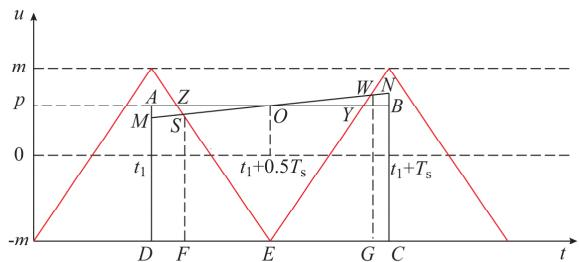
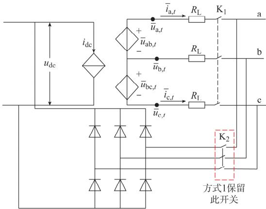
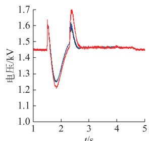
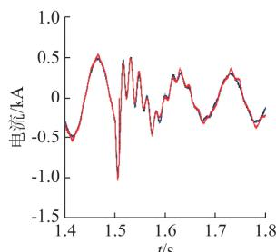
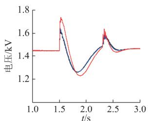
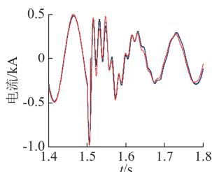

# 双馈风力发电机组快速电磁暂态仿真模型

穆世霞1， 侯俊贤1， 王虹富1， 王铁柱1， 董毅峰2

（1．电网安全与节能国家重点实验室（中国电力科学研究院有限公司） 北京市100192；

2．电力规划设计总院 北京市100120）

摘要 ： 双馈风电机组含变换器等电力电子设备 电磁暂态仿真步长小 速度慢 为实现双馈风电机组的快速电磁暂态仿真 ，利用开关函数平均化的思想 ，建立了考虑Crowbar保护电路投切、变换器闭锁暂态过程的受控源型变换器统一简化等效模型 并提出一种预测校正的调制量计算方法 基于该等效模型构建了完整的双馈风电机组快速电磁暂态仿真模型。 最后，以1．5MW 双馈风力发电机组为例，基于PSCAD／EMTDC仿真软件搭建模型 ， 从正确性、仿真步长适应性和仿真速度三方面对快速电磁暂态仿真模型进行验证 通过仿真结果比对分析 证明了该快速电磁暂态仿真模型不同应用场合的适用性

关键词 ： 双馈风力发电机组； 电磁暂态； 变换器； 快速电磁暂态仿真模型 ； 统一简化等效模型

# 0 引言

风能以其清洁 蕴含量大等优势成为各国绿色能源利用的首选 按照发电机类型划分 常见的风电机组包括鼠笼异步式 可变转子电阻异步式 全功率型永磁直驱式 双馈异步式 其中双馈异步风力发电系统应用较为广泛［1］ 由于风能间歇性出力的特性给电网运行控制带来了极大困难 ， 要分析双馈风电机组并网运行电磁暂态过程 研究其电磁暂态模型成为基础和关键 双馈风电机组包括气动 机械 电气 电力电子设备和控制及保护系统等多个环节 采用详细电磁暂态仿真存在模型复杂、仿真步长受限、仿真速度慢等问题 若多个机组同时仿真该问题将更加突出 因此，有必要研究其简化的快速电磁暂态仿真模型。

目前，在各种风电机组动态建模方面 ， 国际上WECCIEC GE等组织和研究机构已开展相关研究［2］ 其中对双馈风电机组本体部分进行了较大简化 无法对 Crowbar保护的动作进行正确判定 其结果直接影响模型的外特性 国内有关双馈风电机组的简化研究大多在简化过程中改变了风电系统内部连接结构， 重点模拟风电机组的外特性［3－5］ 文献［6］建立了考虑Crowbar保护投切的双馈风电机

组变换器组简化模型用于暂态稳定分析 忽略了磁链的动态过程 ，同时简化模型未考虑直流母线部分 ，无法直接用于电磁暂态仿真 文献［7］提出了双馈异步发电机和平均值换流器模型等效的双馈风电机组仿真模型 但是该模型无法详细模拟转子电流的暂态过程及 Crowbar保护投入时转子侧换流器闭锁过程 文献［8－9］将变换器及相连电容部分等效为受控电压源 ，但是忽略了直流电容部分 ，同时无法对直流母线的暂态特性及Chopper保护电路控制Crowbar保护投切过程进行仿真

采用变换器详细电磁暂态模型仿真时必须进行反复插值处理［10］ 同时仿真步长小 大大增加了仿真时间 为了提高变换器模型的仿真速度 大多数文献是进行等效简化［11－12］ 或平均化处理， 典型的平均化模型有 电路平均模型 动态相量平均模型和动态平均模型［13］ 其中 电路平均模型多用于DC－DC变换器 动态相量平均模型通常用于机电暂态仿真动态平均模型是在平均化周期内对变换器进行积分得到平均化的状态方程 可用于电磁暂态仿真 但是该方法对平均周期的选取及仿真步长均较为敏感文献［13－14］均基于动态平均模型原理进行了模型改进和优化 分别提出了基于幅值分布函数的脉宽调制（PWM）换流器平均化模型 分段平均化模型二者对平均周期的选取有了改进 但是每个周期内获取开关函数平均值的方法复杂 仿真步长最大不能超过50 s 同时 上述文献中均未对变换器闭锁情况进行处理

针对现有研究的不足，本文提出了双馈风电机组快速电磁暂态仿真模型 ， 该快速模型不仅能够模拟机 组 外 特 性， 同 时 能 够 模 拟 考 虑 Chopper保 护、Crowbar保护电路投切的内部各环节的机械及电气特 性 。

# 1 双馈风电机组电磁暂态仿真简化环节分析

为了实现双馈风电机组的快速电磁暂态仿真 ，可采取的方法包括 降低非电气模型阶数 减少电气量仿真计算节点 减少仿真模型导纳阵修改次数 减少反复插值或迭代次数 增大仿真步长等 在不改变整体连接结构的基础上 可从轴系模型 转子变换器控制 变换器及其PWM 调制环节三个方面考虑降阶或简化方法 轴系模型常见的包括单质量块模型 双质量块模型；转子变换器控制可简化为不考虑电流内环电压交叉补偿项（见附录 A 图 A1虚框部分）的控制模型；变换器及其调制环节可由元件级详细模型简化为基于拓扑结构的等效模型

# 1）仿真速度分析

变换器采用基于元件的详细模型 分别采用双质量块轴系模型及考虑交叉项的转子变换器控制模型 单质量块轴系模型及考虑交叉项的转子变换器控制模型 单质量块轴系模型及不含交叉项的转子变换器控制模型3种情况进行仿真 设置仿真时间为124s 仿真步长 $2 0 ~ \mu \mathrm { s }$ 对仿真用时进行统计从附录 A图A2可看出 将轴系模型由双质量块模型简化为单质量块模型 转子侧控制电流内环简化电压补偿交叉补偿项 ，并未从实质上提高仿真速度

# 2）转子侧变换器控制简化模型特性分析

分别采用考虑磁链动态过程的电压交叉补偿项控制（方案 A）和消除电压交叉补偿项控制（方案B）两种模型进行仿真 1．5s电网侧发生三相短路故障 仿真结果见附录 A图 A3 从仿真结果可看出方案 A控制模型能够在短路故障时抑制转子电流增加 其作用与Crowbar保护及低电压穿越控制策略相同 分别在 Crowbar保护定值为0．78kA 和0．65kA两种情况下进行测试 可发现保护定值0．75kA时 方案 A 中 Crowbar保护未动作； 保护定值为0．65kA时 方案 A中Crowbar保护动作滞后于方案B（具体仿真结果见附录 A图 A4） 由此可见 在不同 Crowbar保护动作定值下 转子换流器控制模型的简化可能会出现与详细控制模型Crowbar保护动作差异的情况

综上分析可知 轴系降阶 转子侧变换器控制模型简化没有大幅提高仿真速度 同时转子侧变换器

控制的简化会降低对转子短路电流的抑制作用 因此以上两部分简化并不是提高仿真速度的关键 下面从变换器及其PWM 调制环节入手进行简化模型研 究 。

# 2 变换器及其调制环节简化模型

# 2．1 变换器开关函数等效模型

为了与详细模型进行比对 只将变换器本体模型采用开关函数模型处理 ，直流电容环节 滤波环节不包含在内 其中， 将变换器模型中的损耗和寄生的无功功率元件等效为电阻与电感串联支路 并将其前移与相连的交流支路合并

假设上 下桥臂交替导通 可得不包含损耗及寄生无功功率元件等效支路部分的开关函数变换器等效模型交直流侧电压关系为 ：

$$
\left\{ \begin{array}{l} u _ {\mathrm {a b}} = \left(S _ {\mathrm {a}} - S _ {\mathrm {b}}\right) u _ {\mathrm {d c}} \\ u _ {\mathrm {b c}} = \left(S _ {\mathrm {b}} - S _ {\mathrm {c}}\right) u _ {\mathrm {d c}} \\ u _ {\mathrm {c a}} = \left(S _ {\mathrm {c}} - S _ {\mathrm {a}}\right) u _ {\mathrm {d c}} \end{array} \right. \tag {1}
$$

式中 $: u _ { \mathrm { { a b } } } , u _ { \mathrm { { b c } } } , u _ { \mathrm { { c a } } }$ 分别为交流侧三相线电压 ； $S _ { \textrm { a } } , S _ { \textrm { b } }$ ，为开关函数（1为导通 0为关断） 由PWM 调制环节输出 $\div u  { d c }$ 为直流侧电压

根据功率守恒原则得

$$
i _ {\mathrm {d c}} = \frac {u _ {\mathrm {a}} i _ {\mathrm {a}} + u _ {\mathrm {b}} i _ {\mathrm {b}} + u _ {\mathrm {c}} i _ {\mathrm {c}}}{u _ {\mathrm {d c}}} \tag {2}
$$

式中 $\ : \dot { \iota } _ { \mathrm { \scriptsize ~ d c } } \ :$ 为直流侧电流 $\mathbf { ; } i _ { \mathrm { a } } \mathbf { , } i _ { \mathrm { b } } \mathbf { , } i$ c 分别为交流侧相电流 ${ \dag } u _ { \textrm { a } } , u _ { \textrm { b } } , u _ { \textrm { i } }$ c 分别为交流侧相电压

根据式（1）和式（2）可得 AC／DC变换器开关函数等效模型 ，如附录 A图A5所示。

# 2．2 基于开关函数平均值的简化模型

变换器开关函数等效模型解决了详细模型中二极管部分反复插值计算的问题 但是其PWM 调制的载波频率一般要数千赫兹 要保证仿真精确 仿真步长与详细模型一样至少是载波周期的1／10 同时计算正弦调制信号与三角载波的交点需要求解超越方程 运算量大［15］ 因此 在满足仿真精度的情况下 简化PWM 调制部分可提高仿真效率

从附录 A图 A6可以看出 在电网正常运行时双馈风电机组的网侧及转子侧变换器载波周期内调制波成线性 假设以 A 相为例 调制信号为 $M _ { \mathrm { a } , t }$ 等腰三角载波周期为 $T _ { \textrm { s } }$ 幅值为 m 载波与调制波关系如图1所示 在载波周期内 $M _ { \mathrm { a } , t }$ 为曲线 MN与三角载波的交点分别为 S 和 W 从 S 和 W 处作垂线交经最小值平行于横轴的直线 F 和 G 在$t _ { 1 } + 0 . 5 T$ 刻度处 对应曲线 MN 的点为O 点 过 O点作与横坐标平行的直线 AB Z Y 为与三角载波的交点 P 为直线AB 与纵坐标的交点 其与横坐标

的直线距离为 $\boldsymbol { \phi }$ 。

  
图1 载波与调制波关系  
Fig．1 Relationshipbetweencarrierwaveand modulationwave

曲线 SW 段经调制后一个载波周期内的脉冲面积 S 为 ：

$$
S = \bar {l} _ {F G} \approx \frac {p + m}{2 m} T _ {\mathrm {s}} \tag {3}
$$

式中 $\mathrm { ~ : ~ } l _ { \mathrm { ~ } _ { F G } }$ 为点F到点G的距离。

根据图1中的几何关系 可得矩形 ABCD 的面积 为 ：

$$
S _ {A B C D} = (p + m) T _ {\mathrm {s}} \tag {4}
$$

由于

$$
S _ {A B C D} \approx S _ {M N C D} = \int_ {0} ^ {T _ {\mathrm {s}}} \left(M _ {\mathrm {a}, t} + m\right) \mathrm {d} t \tag {5}
$$

式中 $\ d R : { \cal S } _ { \cal M N C D }$ 为矩形MNCD 的面积

所以，将式（4）和式（5）代入式（3）可得 ：

$$
S = \int_ {0} ^ {T _ {\mathrm {s}}} \frac {1}{2 m} (M _ {\mathrm {a}, t} + m) \mathrm {d} t \tag {6}
$$

载波周期内的开关函数平均值为 $S _ { a }$ 假设仿真步长为 h 采用分为 n 段平均化的处理 可表示为 ：

$$
\begin{array}{l} \bar {S} _ {\mathrm {a}} = \frac {1}{2 m} \left[ \frac {1}{T _ {\mathrm {s}}} \int_ {0} ^ {h} \left(M _ {\mathrm {a}, t} + m\right) \mathrm {d} t + \dots + \right. \\ \left. \int_ {n h} ^ {T _ {\mathrm {s}}} \left(M _ {\mathrm {a}, t} + m\right) \mathrm {d} t \right] \tag {7} \\ \end{array}
$$

由于调制信号为非状态量 ，采用后退欧拉法进行差分化 可有效降低非状态量突变造成的非特征谐波 开关函数平均值在每个仿真时刻 t 的值可表示 为 ：

$$
\bar {S} _ {\mathrm {a}, t} = \frac {1}{2 m} \left(M _ {\mathrm {a}, t + h} + m\right) \tag {8}
$$

式中 ： $M _ { a , t + h }$ 是t 时刻下一时步的a相调制量

同理 可以得到 t 时刻b和c相开关函数平均值 $\bar { S } _ { \mathrm { ~ b } , t }$ 和 $\bar { S } _ { \mathrm { \scriptsize ~ c } , t }$ 开关函数之间的关系可表示为 ：

$$
\left\{ \begin{array}{l} \bar {S} _ {\mathrm {a}, t} - \bar {S} _ {\mathrm {b}, t} = \frac {1}{2 m} \left(M _ {\mathrm {a}, t + h} - M _ {\mathrm {b}, t + h}\right) \\ \bar {S} _ {\mathrm {b}, t} - \bar {S} _ {\mathrm {c}, t} = \frac {1}{2 m} \left(M _ {\mathrm {b}, t + h} - M _ {\mathrm {c}, t + h}\right) \\ \bar {S} _ {\mathrm {c}, t} - \bar {S} _ {\mathrm {a}, t} = \frac {1}{2 m} \left(M _ {\mathrm {c}, t + h} - M _ {\mathrm {a}, t + h}\right) \end{array} \right. \tag {9}
$$

若载波信号幅值为1，则

$$
\left\{ \begin{array}{l} \bar {u} _ {\mathrm {a b}, t} = \frac {u _ {\mathrm {d c}}}{2} \left(M _ {\mathrm {a}, t + h} - M _ {\mathrm {b}, t + h}\right) \\ \bar {u} _ {\mathrm {b c}, t} = \frac {u _ {\mathrm {d c}}}{2} \left(M _ {\mathrm {b}, t + h} - M _ {\mathrm {c}, t + h}\right) \\ \bar {u} _ {\mathrm {c a}, t} = \frac {u _ {\mathrm {d c}}}{2} \left(M _ {\mathrm {c}, t + h} - M _ {\mathrm {a}, t + h}\right) \end{array} \right. \tag {10}
$$

式中 $\mathbf { \Psi } : \bar { u } _ { \mathrm { \ a b } , t } \ , \bar { u } _ { \mathrm { \ b c } , t } \ , \bar { u } _ { \mathrm { \ c a } , t }$ 分别为t 时刻交流侧三相线电压的平均值。

根据功率守恒得 ：

$$
i _ {\mathrm {d c}} = \frac {\bar {u} _ {\mathrm {a} , t} \bar {i} _ {\mathrm {a} , t} + \bar {u} _ {\mathrm {b} , t} \bar {i} _ {\mathrm {b} , t} + \bar {u} _ {\mathrm {c} , t} \bar {i} _ {\mathrm {c} , t}}{u _ {\mathrm {d c}}} \tag {11}
$$

式中 $\mathbf { \Psi } : \bar { u } _ { \mathrm { ~ a ~ } , t } \mid \bar { u } _ { \mathrm { ~ b ~ } , t } \mid \bar { u } _ { \mathrm { ~ c ~ } , t }$ 分 别 为 t 时 刻 交 流 侧 三 相 相 电压的平均值 $\mathbf { ; } \bar { i } _ { \mathrm { ~ a ~ } , t } \ , \bar { i } _ { \mathrm { ~ b ~ } , t } \ , \bar { i } _ { \mathrm { ~ c ~ } , t }$ 分别为 t 时刻交流侧三相相电流的平均值

根据式（10）和式（11）可建立 AC／DC变换器平均等效模型 该等效模型可以直接表示成一个多端口受控源网络 在受控信号求解中没有开关函数 直接省去了PWM 调制环节 消除了该环节对仿真步长的限制，同时也没有详细模型在步长增大时反复插值或积分的数值算法 从而大大提高了仿真速度

其中， 对 每 个 仿 真 时 步 的 未 知 量 $M _ { \mathrm { a } , t + h }$ ，$M _ { \mathrm { b } , t + h } \ , M _ { \mathrm { c } , t + h }$ 采用外推插值与预测校正的方法处理 具体方法如下

步骤1：采用线性外推插值法预测得到 t＋h 时刻的调制 信 号 ： ${ M _ { i , t + h } } ^ { \prime } { = } 2 M _ { i , t } - M _ { i , t - h } \mathrm { ~ ( ~ } i \in \{ \mathrm { ~ a ~ , ~ b ~ } $ ，c｝ ）

步骤2：利用式（10）求解 t 时刻交流侧受控源$\bar { u } _ { \mathrm { ~ a b } , t }$ 和 $\bar { u } _ { \mathrm { ~ b c } , t }$ 。

步骤3 求解 t 时刻整个网络的节点电压和支路电流及t＋h 时刻的注入历史电流源 控制系统滞后电气系统一个仿真步长 因此利用电气量求解各控制系统 得到实际 t＋h 时刻变换器控制输出的调制信号 $M _ { i , t + h }$ 。

步骤4 比较 $M _ { i , t + h }$ 与预测值 $M _ { i , t + h } ^ { \prime }$ 之间的误差 是 否 满 足 设 定 值 ε 的 要 求 ， 即 $\left| \begin{array} { l l } { \begin{array} { r l r } { M _ { i + h } } & { - } & { } \end{array} } \end{array} \right.$ ${ M _ { i , t + h } } ^ { \prime } \vert < \varepsilon ;$ 若不满足则对 $M _ { i , t + h }$ 重新进行校正，${ M _ { i , t + h } } = { M _ { i , t + h } } + \alpha ( { M _ { i , t + h } } ^ { \prime } - { M _ { i , t + h } } )$ （其中α为阻尼系数 $0 { < } \alpha { < } 1$ 本文取0．8） 然后返回步骤2重新计算 反复迭代 知道满足设定误差 ε 要求或达到最大迭代次数限制

电网正常运行时 由于载波周期内调制波成线性 因此外插值结果基本满足需求 不需要额外的校正计算时间 当电网发生故障 低电压穿越控制策略投入时 调制波在载波周期内会出现不满足线性关系的情况（如附录 A图 A7所示） 因此需要对预测

值适当做校正处理

以上等效模型是基于上、下桥臂不同时导通和关断的假设条件 由于电网发生短路故障时 双馈风电机组转子侧变换器会因 Crowbar保护电路投入而闭锁 以上模型在该情况下不成立 需要做特殊处 理 。

# 2．3 考虑闭锁的变换器统一简化等效模型

# 1）统一简化等效模型建立

在短路故障时，Crowbar保护电路投入防止转子侧变换器过流和直流过压 Crowbar保护电路投入后 此时转子侧变换器等效为由二极管组成的不可控三相整流桥等效电路 ，并联的Crowbar保护电路经二极管三相整流桥并联电阻短接

在变换器闭锁时开关函数均为零 由式（1）和式（2）可得 ：

$$
\left\{ \begin{array}{l} u _ {\mathrm {a b}} = 0 \\ u _ {\mathrm {b c}} = 0 \\ u _ {\mathrm {c a}} = 0 \end{array} \right. \tag {12}
$$

$$
i _ {\mathrm {d c}} = 0 \tag {13}
$$

然而 实际Crowbar保护电路投入时转子侧变换器闭锁交流侧电流变成零 但电压不为零 因此采用式（1）已不能准确表示交直流侧的电压关系

为了保证变换器正常工作及闭锁时简化等效电路的一致性， 可建立统一的变换器简化等效模型在变换器正常工作时 采用开关函数受控电压源及基于功率守恒的受控电源形式可以直接描述变换器交 直流两侧的电流电压关系 此时 若在交 直流之间保留二极管三相整流电路 该电路中二极管仍是非导通状态 在变换器闭锁时 不改变原有开关函数等效模型中交直流电流 电压表达式的基础上 ，断开平均等效模型的交流侧支路以保证支路电流$i _ { \textrm { a } } , i _ { \textrm { b } } , i _ { \textrm { c } }$ 为零 根据式（12） 式（13） 和 Crowbar保护投入时转子侧等效电路 可以采用2种方式构建变换器统一简化等效模型 ，Scrowbar为Crowbar投入标志位 当其等于1时为投入 等于0时为切出

方式1 采用2个切换开关 $\mathrm { K } _ { 1 }$ 和 $\mathrm { K } _ { 2 }$ 交替投切实现正常工作时受控源模式与闭锁状态下不可控三相整流电路模式的切换 Scrowbar等于零时 切换开关 $\mathrm { K } _ { 1 }$ 闭合 K2 断开 Scrowbar等于1时 切换开关 K1 断开 K2 闭合

方式2 采用1个切换开关 $\mathrm { K } _ { 1 }$ 实现受控电压源支路 的 投 切 始 终 保 留 不 可 控 三 相 整 流 电 路Scrowbar等于1时 $\mathrm { K } _ { 1 }$ 断开 Scrowbar等于零时K1 闭合

两种方式下的统一简化等效模型示意见图2

  
图2 变换器统一简化等效模型  
Fig．2 Unifiedandsimplifiedequivalent modelofconverter

# 2）两种统一简化等效模型的特性分析

两种统一简化等效模型的主要差别是不可控三相整流电路是一直存在还是以开关切换的方式投入 变换器正常工作时 方式2等效模型中的不可控整流电路一直处于闭锁状态 两种方法的等效模型外部输出特性是等效的 同时 方式2中的整流电路并未反复修正导纳矩阵或插值计算从而增加额外的仿真时间

对于采用小电阻／大电阻来模拟开关闭合和断开 状 态 的 电 磁 暂 态 仿 真 程 序 （ 例 如 ： PSCAD／EMTDC仿真软件） 由于串联分压 变换器正常工作时方式1的等效模型中不可控整流电路交流侧电压是外部接口电压的一半 与实际情况存在差异在Crowbar保护投入变换器闭锁瞬间 方式1等效模型中判断不可控整流电路的导通条件存在误差可能导致绝缘栅双极型晶体管（IGBT）闭锁时二极管无法及时导通 当出现变换器反复闭锁时 该误差将更加明显 以双馈风电机组1．5s发生短路故障 ，Crowbar保护投入为例 如附录 A图 A8所示 采用方式2等效模型的仿真结果与采用详细模型结果完全吻合 在转子侧变换器闭锁两次之后 方式1等效模型的交流侧电流与方式2及详细模型之间出现明显误差 该算例中采用详细模型与方式1的等效模型变换器仿真转子侧变换器闭锁7次 采用方式1等效模型仿真转子侧变换器闭锁6次

综上比较分析 本文建议选取方式2的变换器统一简化等效模型

变换器统一简化等效模型保证了其完整的外部特性 可直接替换详细双馈风电机组整体结构中的网侧和转子侧的详细变换器及其PWM 调制环节与其他模块连接可构成完整的双馈风电机组快速电磁暂态仿真模型（模型结构见附录 A图 A9）

# 3 模型验证

以1．5 MW 某风电机组为例 基于 PSCAD／EMTDC仿真软件分别搭建完整的基于变换器统一简化等效模型的双馈风电机组快速电磁暂态仿真模型（以下简称快速模型） 双馈风电机组详细模型（以下简称详细模型）以及基于变换器开关函数等效电路的双馈风电机组仿真模型（以下简称开关函数模型） ，仿真系统结构如附录B图B1所示 具体参数见附录B表B2

快速模型测试从正确性 仿真步长适应性 仿真速度三个方面进行验证分析

# 3．1 快速模型正确性验证

为了验证快速模型的正确性 理想的做法是将快速模型的仿真结果与实测曲线进行对比 但是，由于实测工况较为单一 ， 本文采用的技术路线是先将详细电磁暂态仿真模型与某1．5MW 风机实测仿真曲线进行对比证明模型的正确性 ， 然后用详细模型与快速模型在不同工况下进行比对

# 3．1．1 详细模型与实测结果比对

从附录C图C1结果可看出 双馈风电机组详细模型的仿真结果与实测数据能够很好拟合 下面以详细电磁暂态模型作为参考 对快速模型进行验证分析

# 3．1．2 快速模型与详细模型结果比对

从不同故障深度进行仿真分析 以验证快速模型的正确性 1．5s发生短路故障，故障持续0．8s详细模型仿真步长为5 μs， 快速模型仿真步长为50 s 仿真结果分析见附录D，结果表明在从不同故障深度 有无Crowbar保护影响等情况下快速模型均能在误差允许范围内与详细模型很好拟合

# 3．2 仿真步长适应性验证

分别对详细模型和快速模型在不同步长下以3．1．2节中短路故障电压跌至25％的工况进行仿真 如图3和图4所示

  
(a)直流母线电压

(b)流出转子变换器a相电流  

图3 详细模型在不同仿真步长下的仿真结果  
Fig．3 Simulationresultsofdetailedmodelunder differentsimulationstepsizes   
(a)直流母线电压   
  
50us;100 us:--250 us

  
(b)流出转子变换器A相电流   
图4 快速模型在不同仿真步长下的仿真结果  
Fig．4 Simulationresultsoffastmodelunderdifferent simulationstepsizes

详细模型载波频率2kHz 从图3可看出 详细模型在仿真步长增大至50 μs时， 仿真结果已明显振荡 同时转子电流 直流母线电压暂态过程出现误 差 。

从图4可看出 快速模型能够反映转子电流的电磁暂态过程 直到仿真步长增大至250 s时 转子电流 直流母线电压暂态过程才开始有误差 ，但正常运行时未出现数值振荡 经比较可知 快速模型的仿真步长可以达到详细模型步长的5倍以上

# 3．3 仿真速度验证

以3．1．2节中短路故障电压跌至25％的工况为例 采用双馈风力发电机组详细模型 开关函数模型和快速模型分别在不同步长下进行仿真 仿真时间比较见表1

表1 仿真时间比较  
Table1 Comparisonofsimulationtime   

<table><tr><td rowspan="2">模型</td><td colspan="4">不同步长下的仿真时间/s</td></tr><tr><td>20 μs</td><td>50 μs</td><td>100 μs</td><td>250 μs</td></tr><tr><td>详细</td><td>17.440</td><td>13.640</td><td></td><td></td></tr><tr><td>开关函数</td><td>14.580</td><td>8.050</td><td></td><td></td></tr><tr><td>快速</td><td>7.660</td><td>3.257</td><td>1.667</td><td>0.910</td></tr></table>

从表1可看出 开关函数模型较详细模型的仿真速度有所提高 快速模型的仿真速度最快 随着仿真步长增大 双馈风电机组快速模型的仿真速度优势越突出 在保证仿真精度条件下 快速模型采用的步长为100μs，详细模型采用20μs，仿真速度可提高10倍以上

# 4 结语

本文所建立的双馈风电机组快速电磁暂态仿真模型未附加任何条件限制 适用于电网不平衡 不对称故障等不同运行状态 保留了直流母线环节及Chopper和Crowbar保护电路 不仅能够模拟机组的外部特性 同时能够模拟机组内部特性 包括短路故障Crowbar保护投切的暂态过程 在满足仿真精

度的条件下仿真速度可提高10倍以上，满足双馈风力发电机组运行控制、电磁暂态特性分析需求 ，同时变换器统一简化等效模型也适用于直驱式风力发电系统 光伏发电系统电磁暂态快速仿真

本文研究仅涉及风电机组的快速电磁暂态仿真 未考虑风电场快速电磁暂态仿真方法 但是该模型为风电场快速电磁暂态仿真研究奠定了基础 ，下一步将继续研究风电场通用建模与聚类方法 实现大量风电场接入的电力系统快速全电磁暂态仿 真 。

附录见本刊网络版 （http： ／／www．aeps－infocom／aeps／ch／index．aspx）

# 参 考 文 献

［1］ 顾卓远 汤涌 刘文焯 等．双馈风力发电机组的电磁暂态－机电暂态混合仿真研究［J］．电网技术 201539（3） 615－620  
GU Zhuoyuan， TANG Yong， LIU Wenzhuo， et alElectromechanicaltransient－electromagnetic transient hybridsimulationofdoubly－fedinductiongenerator［J］．PowerSystemTechnology， 2015， 39（3） ： 615－620  
［2］ 陈武晖 王龙 谭伦农 等．WECC风力发电机组／场通用动态模型研究进展［J］．中国电机工程学报 201737（3） ：738－750  
CHEN Wuhui， WANG Long， TAN Lunnong， etal．Recentprogressofdeveloping WECCgenericmodelsofwindturbinegenerators／plantsfordynamicsimulation［J］．ProceedingsoftheCSEE 2017 37（3） ： 738－750  
［3］ 栗然 唐凡 刘英培 等．基于自适应变异粒子群算法的双馈风电［J］． 201236（4） 2227  
LIRan TANGFan LIU Yingpei etal．Equivalentmodelof doubly－fed wind turbine generator system based on auto－ mutationparticleswarmoptimizationalgorithm［J］．Automation ofElectricPowerSystems 2012 36（4） 22－27   
［4］ 张慧玲 郝思鹏 袁越 等．基于实测数据的双馈风电机组外特性研究及简化建模［J］．电力系统保护与控制 201341（17） 8287  
ZHANGHuiling HAOSipeng YUAN Yue etal．ResearchonexternalcharacteristicsofDFIG andsimplified modelingbasedontestingdata［J］．PowerSystemProtectionandControl，2013 41（17） ： 82－87  
［5］ 夏安俊 鲁宗相 闵勇 等．双馈异步发电机风电场聚合模型研究［J］．电网技术 201539（7） 1879－1885  
XIAAnjun， LUZongxiang， MIN Yong， etal．Anaggregatedmodelofwindfarmcomposedofdoublyfedinductiongenerators［J］．PowersystemTechnology 2015 39（7） 1879－1885  
[6]张琛，李征，蔡旭，等.面向电力系统暂态稳定分析的双馈风电机组动态模型［J］．中国电机工程学报 201636（20） 5449－5460  
ZHANGChen LIZheng CAIXu etal．Dynamicmodelof DFIGwindturbinesforpowersystemtransientstabilityanalysis ［J］．ProceedingsoftheCSEE 2016 36（20） 5449－5460   
「7]刘其辉，韩贤岁.双馈风电机组模型简化的主要步骤和关键技术分析［J］．华东电力 201442（5） 839－845  
LIUQihui， HANXiansui．Mainstepsandkeytechnologyofthe simplified modelfordoubly－fedinductiongenerator［J］．East

ChinaElectricPower， 2014， 42（5） ： 839－845  
［8］ 韩贤岁 刘其辉．双馈风力发电机组变流器模型简化研究［J］．电测与仪表 201552（23） 23－28  
HANXiansui， LIU Qihui．ThesimplificationandanalysisofDFIG converter model［J］． Electrical Measurement andInstrumentation， 2015， 52（23） ： 23－28  
［9］ AMIRI N， EBRAHIMI S， JATSKEVICH J． Efficientsimulationof windgenerationsystemsusingvoltage－behind－reactancemodelofdoubly－fedinductiongeneratorsandaverage－valuemodelofswitchingconverter［C］／／ IEEEFirstUkraineConferenceonElectricalandComputerEngineering， May29－June2， 2017， Kiev， Ukraine  
［10］ 舒德兀 张春朋 姜齐荣 等．电力电子仿真中开关时刻自校正插值算法［J］．电网技术 201640（5） ：1455－1461  
SHU Dewu， ZHANG Chunpeng， JIANG Qirong， etal．Aswitching point self－correction interpolation algorithm forpowerelectronicsimulations［J］．PowerSystem Technology，2016， 40（5） ： 1455－1461  
［11］ 范新凯 王艳婷 张保会．柔性直流电网的快速电磁暂态仿真［J］．电 力 系 统 自 动 化 ， 2017， 41（4） ： 92－97．DOI： 10．7500／AEPS20160623003  
FAN Xinkai WANG Yanting ZHANG Baohui．Fast electromagnetictransientsimulationforflexibleDCpowergrid ［J］．AutomationofElectricPowerSystems 2017 41（4） 92－97．DOI 10．7500／AEPS20160623003   
［12］ 王成山 高菲 李鹏 等．电力电子装置典型模型的适应性分析［J］．电力系统自动化 ，2012，36（6） ：63－68  
WANGChengshan， GAOFei， LIPeng， etal．Adaptabilityoftypicalpowerelectronicdevice models［J］．Automation ofElectricPowerSystems 2012 36（6） 63－68  
［13］ 舒德兀 李琰 张春朋 等．基于幅值分布函数的换流器平均化［J］． 201640（15） 7378  
SHU Dewu， LIYan， ZHANG Chunpeng， etal．Converteraveragedmodelbasedonamplitudedistributionfunctionanditsapplication［J］．AutomationofElectricPowerSystems 201640（15） ： 73－78  
［14］ 许寅 陈颖 陈来军 等．基于平均化理论的 PWM 变流器电磁暂态快速仿真方法 （二）适用PWM 变流器分段平均模型的改进EMTP算法［J］．电力系统自动化 201337（12） 5156  
XU Yin， CHEN Ying， CHEN Laijun， et al． Fastelectromagnetic transient simulation method for PWMconvertersbasedonaveragingtheory： Parttwo improvedEMTPalgorithm suitableforpiecewiseaveraged modelofPWMconverters［J］．AutomationofElectricPowerSystems2013 37（12） ： 51－56  
［15］ 肖运启 徐大平 吕跃刚．一种基于SPWM 的交 直 交型变频器系统简化模型［J］．系统仿真学报 200820（8） 21852189  
XIAOYunqi， XUDaping， LYuegang．SimplifiedmodelforAC－DC－ACconvertersystembasedonSPWM［J］．JournalofSystemSimulation 2008 20（8） 21852189

电力系统仿真计算及相关软件开发

王虹富（1984—） ， 男 ， 高级工程师 ， 主要研究方向 ： 电力

系统仿真计算模型与算法及相关软件开发

（编辑 鲁尔姣）

# FastElectromagneticTransientSimulationModelofDoubly－fedInductionGeneratorBasedWindTurbine

Hongfu1 ， WANG Tiezhu1 ， DONG Yifeng2

（1．StateKeyLaboratoryofPowerGridSafetyandEnergyConservation （ChinaElectricPowerResearchInstitute），Beijing100192， China；

2．ChinaElectricPowerPlanningandEngineeringInstitute， Beijing100120， China）

Abstract：Becauseoftheconverterinpowerelectronicequipment，thestepandspeedofelectromagnetictransientsimulationfor doubly－fedinductiongenerator （DFIG ）basedwindturbineissmallandslow．Inordertorealizetherapidelectromagnetic transientsimulationofDFIGbasedwindturbine， theunifiedsimplifiedequivalentmodelofcontrolledsourceconverteris proposedwithconsiderationofaveragedswitchingfunction， Crowbarprotectioncircuitswitchingandconverterlocking transientprocesses．Apredictivecorrection methodformodulationisputforward， thentherapidelectromagnetictransient simulationmodelofDFIGbasedwindturbineisestablishedbasedontheequivalentmodel．Finally， taking1．5 MW DFIG basedwindturbineasanexample， thevalidationofproposedmodeliscarriedoutbyPSCAD／EMTDCsimulationsoftware from modelcorrectness， simulationstepadaptabilityandsimulationspeed．Thesimulationresultsarecomparedandanalyzed， whichprovetheapplicabilityoftherapidelectromagnetictransientmodelindifferentapplicationscenarios

ThisworkissupportedbyStateGridCorporationofChina

Keywords： doubly－fedinduction generator （DFIG ） based wind turbine； electromagnetictransient； converter； fastelectromagnetictransientsimulationmodel； unifiedsimplifiedequivalentmodel

（上接第139页 continuedfrompage139）

# PhotovoltaicTradingMechanismDesignBasedonBlockchain－basedIncentiveMechanism

QI Bing1,XIA Yan1,LI Bin1,LI Dezhi² ,ZHANG Yang³,XI Peifeng4

（1．Energy－savingPowerEngineeringResearchCenteroftheMinistryof

Education （NorthChinaElectricPowerUniversity） ， Beijing102206， China；

2．BeijingKeyLaboratoryofDemandSideMulti－energyCarriersOptimizationand

InteractionTechnique （ChinaElectricPowerResearchInstitute）， Beijing100192， China；

3．StateGridZhejiangElectricPowerCo．Ltd．， Hangzhou330106， China；

4．ShanghaiKeyLaboratoryofSmartGridDemandResponse （ShanghaiElectricalApparatus

ResearchInstitute （Group） Co．Ltd．）， Shanghai200063， China）

Abstract： TherearelotsofproblemsinChinasphotovoltaictradingmarketsuchasthesubsidydefault，theincreasingnumber ofusersandthedifficultyofsettlement．Blockchaintechnologyhasbecomeanewtypeofdistributedaccountbookwithits featuresofownsecurity， decentralizationanddifficulttampering．Domesticandforeignscholarshaveproposedarchitectural ideasfortheapplicationofblockchaintechnologyintheenergyfield．Thispaperproposesaphotovoltaictradingmechanism basedonblockchainincentives， whichprovidesatradingmethodthatencouragesuserstobefree，flexible， andperformsingle settlement．Thesmartcontract， encryptionmechanism， consensusmechanismandtransactionprocessofthedynamictrading systemaredesigned．Thetradingmechanismbasedonreputationvaluecaneffectivelyrestraintheselfishbehaviorofeachnode andencouragethenodestotransmitactivelyinthepeer－to－peer （P2P ）network．Finally， a21－nodenetworktopologyis simulated．Theresultsshowthat， withthetradingmechanismbasedonreputationvalue， userscanobtainmoresatisfactory transactions

ThisworkissupportedbyStateGridCorporationofChina

Keywords：blockchain；photovoltaictrading； smartcontract； reputationvalue