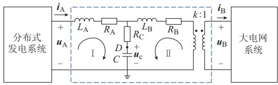
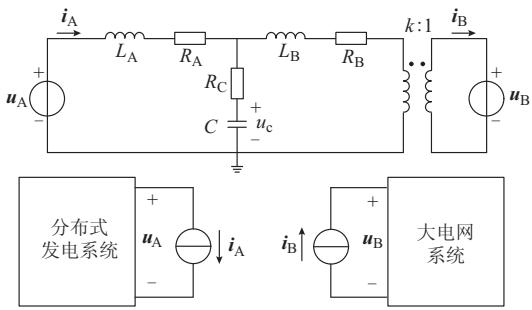
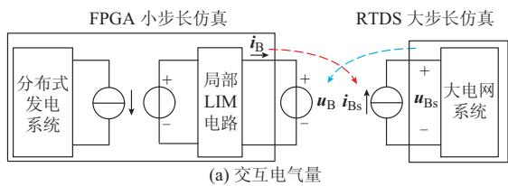
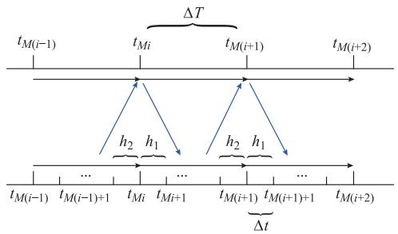
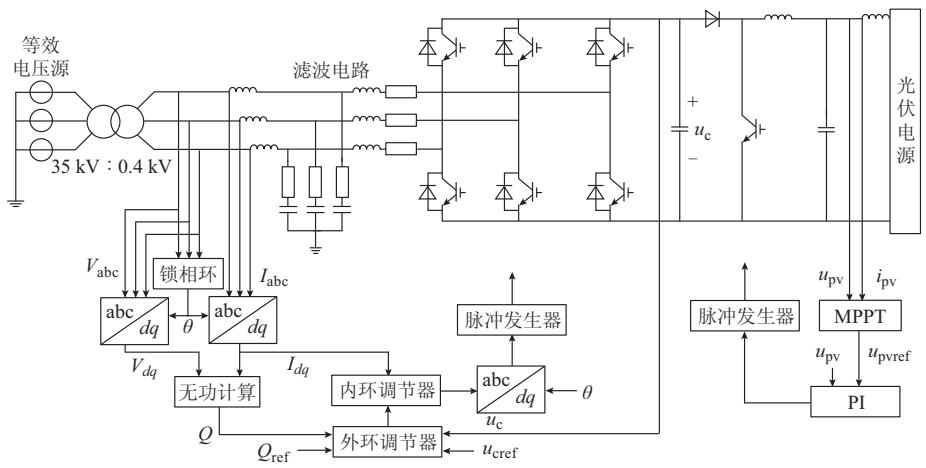
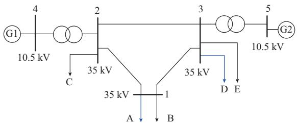
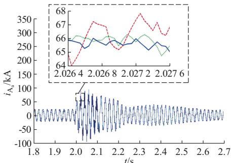
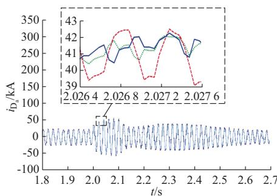
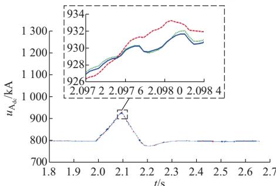
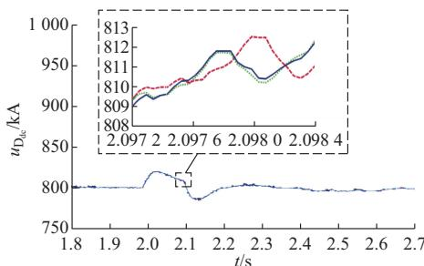

# 基于RTDS和FPGA联合仿真平台的多速率实时仿真方法

王 潇,张炳达,陈 铭

智能电网教育部重点实验室 天津大学 天津市

摘要:为实现含分布式电源的电力系统实时仿真,研究了一种基于实时数字仿真器( )和现场可编程门阵列( )联合仿真平台的多速率实时仿真方法.采用局部延迟插入方法分解电力系统网络,并利用拟合法和外插法实施并行多速率接口电气量交互.为减小通信延时对仿真精度的影响,提出了一种 数据发送适当早于 数据发送的接口电气量异步交互方法.在和 联合仿真平台上以 / 混合仿真步长实时仿真了一个含 个光伏发电的节点电力系统,并与 平台下的仿真数据进行对比,验证了所提联合仿真平台的可行性和实时仿真方法的准确性.

关键词:电磁暂态;实时仿真;多速率仿真;延迟插入方法;异步交互

# 0 引言

随着越来越多的分布式电源并入电力系统 其对电力系统的影响也日益严重[1] 为保证电力系统安全运行 研究用于测试和验证各种电力控制设备的含分布式电源的电力系统实时仿真平台是十分必要的.

在分布式发电并网设备中 电力电子设备的开关频率通常在几千赫兹到几十万赫兹 为使电磁暂态仿真较精确地模拟电力电子设备 要求其仿真步长小至微秒级 甚至亚微秒级 但是 如果对整个电力系统都采用小步长进行电磁暂态仿真 其仿真规模受到很大限制 为解决这个问题 通常采用多速率实时仿真.

文献 最早将求微分方程的多速率方法应用于电力系统仿真领域 并给出了具体计算流程 在此基础上 变量分组的多速率仿真方法在电力系统仿真领域取得了许多实质性进展 文献 阐述了电力系统微分方程和代数方程的多速率求解方法给出了计算快慢变量步长比例的实用公式 文献[ ]提出了用于电力系统稳定性分析的多速率仿真方法 给出了自适应的变量分组策略 然而 组之间存在着大量数据交互 这种方法不易实现多机联合仿真.

除此以外,也可直接根据物理特性将电力系统分解为多个子系统来实现多速率仿真 文献 在多区戴维南等效方法的基础上提出了一种电磁暂态过程的多速率仿真算法,给出了快慢系统分区联立求解方法 文献 针对含有电力电子设备的电力系统提出双时步交替混合仿真算法 采用外推 插值 平滑的算法进行接口电气量交换 文献 将延迟插入方法 引入电磁暂态仿真 证明了其稳定条件 并提出快慢系统交替求解的多速率算法但是 这些串行的多速率方法难以保证小步长仿真的实时性

文献[]提出了并行的多速率电磁暂态仿真算法 利用传输线模型的自然延迟特性实现快慢系统之间并行计算 实时数字仿真器 利用传输线原理 用 接口变压器 将分布式发电系统从大电网中独立出来 但牺牲了部分仿真精度[10]

针对含电力电子设备的电力系统实时仿真Opal-RT公司的RT-LAB 和RTDS公司的RTDS等商业实时仿真装置提供了小步长仿真功能 最新的 和 中模块化多电平换流器的仿真步长可达亚微秒级[11G12]

随着现场可编程门阵列 技术不断成熟 越来越多的学者开始利用 研发含电力电子设备的电力系统实时仿真系统 其仿真步长能够达到几百纳秒甚至几十纳秒[13G15] 相比于和 的小步长仿真 这种方式编程灵活且具有成本优势

利用 良好的通用性和 高度的并

行性 本文研究了一种基于 和 联合仿真平台的多速率仿真方法 以实现含分布式电源的电力系统实时仿真 为将整个电力系统分解成多个可独立求解的子系统 用 求解滤波电路和隔离变压器电气方程 并用拟合法和外插法确定并行多速率下的接口电气量 为减小通信延时对仿真精度的影响 提出了一种以尽早使用对方仿真数据为原则的接口电气量交互方法 为提高 承担的分布式发电系统的仿真速度 引入 小步长开关模型[15],采用导纳逆矩阵仿真方法,并通过硬件描述语言 来开发

# 1 联合仿真平台

在 与 组成的联合仿真平台中承担大电网系统仿真任务 承担分布式发电系统仿真任务

的运算部件采用 板卡. 板卡有多个小型可插拔( )光电收发接口,支持与其他板卡或外部设备的数据交互

采用含 光电 收发接口的开 发 板 其 核 心 芯 片 拥 有万个逻辑单元 万块随机存储器和 个数字信号处理器( )等.

用传输速率为 的光纤连接 和的 光电收发接口 并采用点到点的高速串行传输的 协议进行数据通信 在此基础上，以RTDS公司提供的RTDS_InterfaceModule进行数据交互 经测试 传输 个 的通信延时在 之内.

# 2 基于局部LIM 的网络求解

最初应用于印刷电路板的电路仿真[16]它将支路电流 i 的仿真时间结点相对于节点电压u的仿真时间结点迟半个步长

分布式电源 如光伏电池 微型燃气轮机 燃料电池等)通常经换流装置、滤波电路、隔离变压器与大电网系统连接 为了方便地分析这种含分布式电源的电力系统 把分布式电源和换流装置部分称为分布式发电系统,如图 所示.本文对图 虚线框内的滤波电路和隔离变压器实施 算法 并把这部分电路称为局部 电路

将局部 电路中电容 C 两端电压 $\pmb { u } _ { \textup { c } }$ 与分布式发电系统相连的接口电压 $\pmb { u } _ { \mathrm { ~ A ~ } }$ 和与大电网系统相连的接口电压 $\pmb { u } _ { \mathrm { ~ B ~ } }$ 按 n n n n n,??时间结点进行仿真计算, $L _ { \mathrm { { A } } }$ 支路电流 $\mathbf { \delta } _ { i _ { \mathrm { ~ A ~ } } }$ 和 $L _ { \mathrm { ~ B ~ } }$ 支路电流 $i _ { \textrm { B } }$ 按 $\cdots , n - 1 / 2 - 1 , n - 1 / 2 , n + 1 / 2$

𝑛十1/2十1,时间结点进行仿真计算。

  
图1 仿真模型  
Fig．1 Simulationmodel

列出局部 电路中回路 和 的电压方程

$$
\begin{array}{l} \boldsymbol {u} _ {\mathrm {A}} ^ {n} = \frac {L _ {\mathrm {A}}}{\Delta t} \left(\boldsymbol {i} _ {\mathrm {A}} ^ {n + \frac {1}{2}} - \boldsymbol {i} _ {\mathrm {A}} ^ {n - \frac {1}{2}}\right) + R _ {\mathrm {A}} \boldsymbol {i} _ {\mathrm {A}} ^ {n + \frac {1}{2}} + \\ R _ {\mathrm {C}} \left(\boldsymbol {i} _ {\mathrm {A}} ^ {n + \frac {1}{2}} - \frac {\boldsymbol {i} _ {\mathrm {B}} ^ {n + \frac {1}{2}}}{k}\right) + \boldsymbol {u} _ {\mathrm {c}} ^ {n} \tag {1} \\ \end{array}
$$

$$
\begin{array}{l} k \boldsymbol {u} _ {\mathrm {B}} ^ {n} = - \frac {L _ {\mathrm {B}}}{\Delta t} \left(\frac {\boldsymbol {i} _ {\mathrm {B}} ^ {n + \frac {1}{2}}}{k} - \frac {\boldsymbol {i} _ {\mathrm {B}} ^ {n - \frac {1}{2}}}{k}\right) - R _ {\mathrm {B}} \frac {\boldsymbol {i} _ {\mathrm {B}} ^ {n + \frac {1}{2}}}{k} + \\ R _ {\mathrm {C}} \left(\boldsymbol {i} _ {\mathrm {A}} ^ {n + \frac {1}{2}} - \frac {\boldsymbol {i} _ {\mathrm {B}} ^ {n + \frac {1}{2}}}{k}\right) + \boldsymbol {u} _ {\mathrm {c}} ^ {n} \tag {2} \\ \end{array}
$$

整理后可得

$$
\begin{array}{l} \boldsymbol {i} _ {\mathrm {A}} ^ {n + \frac {1}{2}} = \frac {L _ {1} L _ {\mathrm {A}}}{\Delta t R _ {\mathrm {C}} L _ {3}} \boldsymbol {i} _ {\mathrm {A}} ^ {n - \frac {1}{2}} + \frac {L _ {\mathrm {B}}}{k L _ {3}} \boldsymbol {i} _ {\mathrm {B}} ^ {n - \frac {1}{2}} + \frac {L _ {1}}{R _ {\mathrm {C}} L _ {3}} \boldsymbol {u} _ {\mathrm {A}} ^ {n} - \\ \frac {k \Delta t}{L _ {3}} \boldsymbol {u} _ {\mathrm {B}} ^ {n} + \frac {\Delta t R _ {\mathrm {C}} - L _ {1}}{R _ {\mathrm {C}} L _ {3}} \boldsymbol {u} _ {\mathrm {c}} ^ {n} \tag {3} \\ \end{array}
$$

$$
\begin{array}{l} \boldsymbol {i} _ {\mathrm {B}} ^ {n + \frac {1}{2}} = - \frac {k L _ {\mathrm {A}}}{L _ {3}} \boldsymbol {i} _ {\mathrm {A}} ^ {n - \frac {1}{2}} - \frac {L _ {2} L _ {\mathrm {B}}}{\Delta t R _ {\mathrm {C}} L _ {3}} \boldsymbol {i} _ {\mathrm {B}} ^ {n - \frac {1}{2}} \frac {k \Delta t}{L _ {3}} \boldsymbol {u} _ {\mathrm {A}} ^ {n} + \\ \frac {k ^ {2} L _ {2}}{R _ {\mathrm {C}} L _ {3}} \boldsymbol {u} _ {\mathrm {B}} ^ {n} + k \frac {\Delta t R _ {\mathrm {C}} - L _ {2}}{R _ {\mathrm {C}} L _ {3}} \boldsymbol {u} _ {\mathrm {c}} ^ {n} \tag {4} \\ \end{array}
$$

式中: $L _ { 1 } = L _ { \mathrm { B } } + \Delta t R _ { \mathrm { B } } + \Delta t R _ { \mathrm { C } } ; L _ { 2 } = L _ { \mathrm { A } } + \Delta t R _ { \mathrm { A } } +$ $\Delta t R _ { \mathrm { c } } ; L _ { 3 } = \frac { L _ { 1 } L _ { 2 } } { \Delta t R _ { \mathrm { c } } } - \Delta t R _ { \mathrm { c } } ; \Delta t$ 为仿真步长.

列出局部 电路中节点 D 的电流方程:

$$
\boldsymbol {i} _ {\mathrm {A}} ^ {n - \frac {1}{2}} - \frac {\boldsymbol {i} _ {\mathrm {B}} ^ {n - \frac {1}{2}}}{k} = C \frac {\boldsymbol {u} _ {\mathrm {c}} ^ {n} - \boldsymbol {u} _ {\mathrm {c}} ^ {n - 1}}{\Delta t} \tag {5}
$$

整理后可得:

$$
\boldsymbol {u} _ {\mathrm {c}} ^ {n} = \boldsymbol {u} _ {\mathrm {c}} ^ {n - 1} + \frac {\Delta t}{C} \left(\boldsymbol {i} _ {\mathrm {A}} ^ {n - \frac {1}{2}} - \frac {\boldsymbol {i} _ {\mathrm {B}} ^ {n - \frac {1}{2}}}{k}\right) \tag {6}
$$

由于 $\mathbf { \delta } _ { i _ { \mathrm { ~ A ~ } } }$ 和 $i _ { \textrm { B } }$ 的计算相对于 $\pmb { u } _ { \mathrm { ~ A ~ } }$ 和 $\pmb { u } _ { \mathrm { ~ B ~ } }$ 的计算存在半个步长的延迟 故在求解局部 电路时 可将两侧系统等效成 个理想电压源 求解两侧系统电气量时 可将局部 电路中电感支路的电流等效成理想电流源,如图 所示.

两侧系统的电气量求解可利用节点电压法或状态变量法 为方便表示 这里采用状态变量法 设分布式发电系统的状态变量为 $x _ { \mathrm { ~ A ~ } }$ 、大电网系统的状态变量为 $x _ { \mathrm { ~ B ~ } }$ 两侧系统的状态变量方程和输出方程为:

$$
\begin{array}{l} \left\{ \begin{array}{l} \boldsymbol {x} _ {\mathrm {A}} ^ {n} = \boldsymbol {C} _ {\mathrm {A}} \boldsymbol {x} _ {\mathrm {A}} ^ {n - 1} + \left[ \boldsymbol {D} _ {\mathrm {A}} \quad \boldsymbol {D} _ {\mathrm {A} 1} \right] \left[ \boldsymbol {i} _ {\mathrm {A}} ^ {n - \frac {1}{2}} \quad \boldsymbol {I} _ {\mathrm {S A}} ^ {n} \right] ^ {\mathrm {T}} \\ \boldsymbol {u} _ {\mathrm {A}} ^ {n} = \boldsymbol {E} _ {\mathrm {A}} \boldsymbol {x} _ {\mathrm {A}} ^ {n} + \left[ \boldsymbol {F} _ {\mathrm {A}} \quad \boldsymbol {F} _ {\mathrm {A} 1} \right] \left[ \boldsymbol {i} _ {\mathrm {A}} ^ {n - \frac {1}{2}} \quad \boldsymbol {I} _ {\mathrm {S A}} ^ {n} \right] ^ {\mathrm {T}} \end{array} \right. (7) \\ \left\{ \begin{array}{l} \boldsymbol {x} _ {\mathrm {B}} ^ {n} = \boldsymbol {C} _ {\mathrm {B}} \boldsymbol {x} _ {\mathrm {B}} ^ {n - 1} + \left[ \boldsymbol {D} _ {\mathrm {B}} \quad \boldsymbol {D} _ {\mathrm {B l}} \right] \left[ \boldsymbol {i} _ {\mathrm {B}} ^ {n - \frac {1}{2}} \quad \boldsymbol {I} _ {\mathrm {S B}} ^ {n} \right] ^ {\mathrm {T}} \\ \boldsymbol {u} _ {\mathrm {B}} ^ {n} = \boldsymbol {E} _ {\mathrm {B}} \boldsymbol {x} _ {\mathrm {B}} ^ {n} + \left[ \boldsymbol {F} _ {\mathrm {B}} \quad \boldsymbol {F} _ {\mathrm {B l}} \right] \left[ \boldsymbol {i} _ {\mathrm {B}} ^ {n - \frac {1}{2}} \quad \boldsymbol {I} _ {\mathrm {S B}} ^ {n} \right] ^ {\mathrm {T}} \end{array} \right. (8) \\ \end{array}
$$

式中: $\ , C _ { \mathrm { A } } , D _ { \mathrm { A } } , D _ { \mathrm { A l } } , E _ { \mathrm { A } } , F _ { \mathrm { A } } , F _ { \mathrm { A l } } , C _ { \mathrm { B } } , D _ { \mathrm { B } } , D _ { \mathrm { B l } } , E _ { \mathrm { B } }$ ,$ { \boldsymbol { F } } _ { \mathrm { ~ B ~ } }$ 和 ${ \bf F } _ { \mathrm { B l } }$ 为系数矩阵; $\pmb { I } _ { \mathrm { S A } }$ 和 $\pmb { I } _ { \mathrm { S B } }$ 分别为分布式发电系统和大电网系统内部的电流源

  
图2 网络分块的等效模型  
Fig．2 Equivalentmodelofnetworkblocking

因此 整个网络的求解分为 步 计算局部电路的 $\pmb { u } _ { \textup { c } }$ 和 个网络的电气量 即计算式至式(); 更新局部 电路的电感支路电流,即计算式()和式().

# 3 多速率交互方法

# 31 同步交互

设图 中的大电网系统和分布式发电系统的仿真步长为 $\Delta T$ 与 $\Delta t$ ,且 $\Delta T$ 与 $\Delta t$ 之比为 M(M 为正整数

由于分布式发电系统中换流装置的交流侧电压会随着功率开关动作发生大幅度的变化 故将局部电路采用小步长仿真 当大步长仿真时间结点为 Mi (i 为正整数),小步长仿真时间结点为$M i + j ( 0 { \leqslant } j { < } M )$ 时，多速率仿真的交互电气量及其仿真时间结点如图 所示

于是 将式 至式 分别改写为

$$
\begin{array}{l} \boldsymbol {i} _ {\mathrm {A}} ^ {M i + j + \frac {1}{2}} = \frac {L _ {1} L _ {\mathrm {A}}}{\Delta t R _ {\mathrm {C}} L _ {3}} \boldsymbol {i} _ {\mathrm {A}} ^ {M i + j - \frac {1}{2}} + \frac {L _ {\mathrm {B}}}{k L _ {3}} \boldsymbol {i} _ {\mathrm {B}} ^ {M i + j - \frac {1}{2}} + \\ \frac {L _ {1}}{R _ {\mathrm {C}} L _ {3}} \boldsymbol {u} _ {\mathrm {A}} ^ {M i + j} - \frac {k \Delta t}{L _ {3}} \boldsymbol {u} _ {\mathrm {B}} ^ {M i + j} + \frac {\Delta t R _ {\mathrm {C}} - L _ {1}}{R _ {\mathrm {C}} L _ {3}} \boldsymbol {u} _ {\mathrm {c}} ^ {M i + j} \tag {9} \\ \end{array}
$$

$$
\begin{array}{l} \boldsymbol {i} _ {\mathrm {B}} ^ {M i + j + \frac {1}{2}} = - \frac {k L _ {\mathrm {A}}}{L _ {3}} \boldsymbol {i} _ {\mathrm {A}} ^ {M i + j - \frac {1}{2}} - \frac {L _ {2} L _ {\mathrm {B}}}{\Delta t R _ {\mathrm {C}} L _ {3}} \boldsymbol {i} _ {\mathrm {B}} ^ {M i + j - \frac {1}{2}} - \\ \frac {k \Delta t}{L _ {3}} \boldsymbol {u} _ {\mathrm {A}} ^ {M i + j} + \frac {k ^ {2} L _ {2}}{R _ {\mathrm {C}} L _ {3}} \boldsymbol {u} _ {\mathrm {B}} ^ {M i + j} + \\ k \frac {\Delta t R _ {\mathrm {C}} - L _ {2}}{R _ {\mathrm {C}} L _ {3}} \boldsymbol {u} _ {\mathrm {c}} ^ {M i + j} \tag {10} \\ \end{array}
$$

  
图3 交互电气量及其仿真时间结点  
Fig．3 Interactiveparametersandsimulationtimenode

$$
\begin{array}{l} \text {大 步 长} \frac {\mathbf {u} _ {\mathrm {B s}} ^ {M (i - 1)}}{|} \quad \begin{array}{c c c} \mathbf {u} _ {\mathrm {B s}} ^ {M i} & \mathbf {u} _ {\mathrm {B s}} ^ {M (i + 1)} \\ | \mathbf {i} _ {\mathrm {B s}} ^ {M (i - \frac {1}{2})} & | \mathbf {i} _ {\mathrm {B s}} ^ {M (i + \frac {1}{2})} \end{array} \\ \text {小 步 长} \frac {\mathbf {u} _ {\mathrm {B}} ^ {M (i - 1)} \mathbf {u} _ {\mathrm {B}} ^ {M (i - 1) + 1} \dots \mathbf {u} _ {\mathrm {B}} ^ {M i - 1} \mathbf {u} _ {\mathrm {B}} ^ {M i} \mathbf {u} _ {\mathrm {B}} ^ {M i + 1} \dots \mathbf {u} _ {\mathrm {B}} ^ {M (i + 1) - 1} \mathbf {u} _ {\mathrm {B}} ^ {M (i + 1)}}{\left| \begin{array}{c c c c c c c c c} \vert & \vert & \vert & \vert & \vert & \vert & \vert & \vert \\ \mathbf {i} _ {\mathrm {B}} ^ {M (i - 1) + \frac {1}{2}} & \dots & \mathbf {i} _ {\mathrm {B}} ^ {M i - \frac {1}{2}} & \mathbf {i} _ {\mathrm {B}} ^ {M i + \frac {1}{2}} & \mathbf {i} _ {\mathrm {B}} ^ {M i + \frac {3}{2}} & \dots & \mathbf {i} _ {\mathrm {B}} ^ {M (i + 1) - \frac {1}{2}} \end{array} \right.} \\ (b) \text {仿 真 时 间 结 点} \\ \end{array}
$$

$$
\begin{array}{l} \boldsymbol {u} _ {\mathrm {c}} ^ {M i + j} = \boldsymbol {u} _ {\mathrm {c}} ^ {M i + j - 1} + \frac {\Delta t}{C} \left(\boldsymbol {i} _ {\mathrm {A}} ^ {M i + j - \frac {1}{2}} - \frac {\boldsymbol {i} _ {\mathrm {B}} ^ {M i + j - \frac {1}{2}}}{k}\right) (11) \\ \left\{ \begin{array}{l} \boldsymbol {x} _ {\mathrm {A}} ^ {M i + j} = \boldsymbol {C} _ {\mathrm {A}} \boldsymbol {x} _ {\mathrm {A}} ^ {M i + j - 1} + \left[ \boldsymbol {D} _ {\mathrm {A}} \quad \boldsymbol {D} _ {\mathrm {A} 1} \right] \left[ \boldsymbol {i} _ {\mathrm {A}} ^ {M i + j - \frac {1}{2}} \quad \boldsymbol {I} _ {\mathrm {S A}} ^ {M i + j} \right] ^ {\mathrm {T}} \\ \boldsymbol {u} _ {\mathrm {A}} ^ {M i + j} = \boldsymbol {E} _ {\mathrm {A}} \boldsymbol {x} _ {\mathrm {A}} ^ {M i + j - 1} + \left[ \boldsymbol {F} _ {\mathrm {A}} \quad \boldsymbol {F} _ {\mathrm {A} 1} \right] \left[ \boldsymbol {i} _ {\mathrm {A}} ^ {M i + j - \frac {1}{2}} \quad \boldsymbol {I} _ {\mathrm {S A}} ^ {M i + j} \right] ^ {\mathrm {T}} \end{array} \right. (12) \\ \left\{ \begin{array}{l} \boldsymbol {x} _ {\mathrm {B}} ^ {M (i + 1)} = \boldsymbol {C} _ {\mathrm {B}} \boldsymbol {x} _ {\mathrm {B}} ^ {M i} + \left[ \boldsymbol {D} _ {\mathrm {B}} \quad \boldsymbol {D} _ {\mathrm {B l}} \right] \left[ \boldsymbol {i} _ {\mathrm {B s}} ^ {M (i + \frac {1}{2})} \quad \boldsymbol {I} _ {\mathrm {S B}} ^ {M (i + 1)} \right] ^ {\mathrm {T}} \\ \boldsymbol {u} _ {\mathrm {B s}} ^ {M (i + 1)} = \boldsymbol {E} _ {\mathrm {B}} \boldsymbol {x} _ {\mathrm {B}} ^ {M i} + \left[ \boldsymbol {F} _ {\mathrm {B}} \quad \boldsymbol {F} _ {\mathrm {B l}} \right] \left[ \boldsymbol {i} _ {\mathrm {B s}} ^ {M (i + \frac {1}{2})} \quad \boldsymbol {I} _ {\mathrm {S B}} ^ {M (i + 1)} \right] ^ {\mathrm {T}} \end{array} \right. (13) \\ \end{array}
$$

由前面分析可知,大步长仿真侧的接口电压 $\pmb { u } _ { \mathrm { ~ B s ~ } }$ 需发送给小步长仿真侧 小步长仿真侧的接口电流$\mathbf { \sigma } _ { i _ { \mathrm { ~ B ~ } } }$ 需发送给大步长仿真侧。为降低FPGA与的通信开销,在一个 $\Delta T$ 内仅交互一次,且规定交互时间结点为仿真时间结点 Mi.

大步长仿真侧没有直接提供小步长仿真侧所需的 $\pmb { u } _ { \mathrm { ~ B ~ } } ^ { M i + j }$ .同样,小步长仿真侧也没有直接提供大步长仿真侧所需的 $\pmb { i } _ { \mathrm { B s } } ^ { M ( i + 1 / 2 ) }$ ).当直接用 $\pmb { u } _ { \mathrm { B s } } ^ { M i }$ 替代 $\pmb { u } _ { \mathrm { ~ B ~ } } ^ { M i + j }$ 和用 $\pmb { i } _ { \mathrm { B } } ^ { M i }$ 替代 $\pmb { i } _ { \mathrm { B s } } ^ { M ( { i + 1 / 2 } ) }$ 时,式( )和式( )的计算误差会增大 甚至造成不稳定计算的发生[8] 因此 根据大步长仿真侧的 uMiBs 和 uM(i－1)Bs ,采用外插法估算$\pmb { u } _ { \mathrm { ~ B ~ } } ^ { M i + j }$ Mi+j，即

$$
\boldsymbol {u} _ {\mathrm {B}} ^ {M i + j} = \left\{ \begin{array}{l l} \boldsymbol {u} _ {\mathrm {B s}} ^ {M i} + \frac {j}{M} \left(\boldsymbol {u} _ {\mathrm {B s}} ^ {M i} - \boldsymbol {u} _ {\mathrm {B s}} ^ {M (i - 1)}\right) & 1 \leqslant j <   M \\ \boldsymbol {u} _ {\mathrm {B s}} ^ {M i} & j = 0 \end{array} \right. \tag {14}
$$

根据仿真时间结点 Mi 至 M(i )的 $\pmb { i } _ { \mathrm { B } } ^ { M i - 1 / 2 }$ ,$\pmb { i } _ { \mathrm { B } } ^ { M i - 3 / 2 } , \cdots , \pmb { i } _ { \mathrm { B } } ^ { M ( i - 1 ) + 1 / 2 }$ iB ,利用最小二乘法拟合一条直线 且视直线上仿真时间结点为 M i 的电流值为 $\pmb { i } _ { \mathrm { B s } } ^ { M ( i + 1 / 2 ) }$ ,即

$$
\boldsymbol {i} _ {\mathrm {B s}} ^ {M (i + \frac {1}{2})} = S \left[ \begin{array}{l l l l} \boldsymbol {i} _ {\mathrm {B}} ^ {M i - \frac {1}{2}} & \boldsymbol {i} _ {\mathrm {B}} ^ {M i - \frac {3}{2}} & \dots & \boldsymbol {i} _ {\mathrm {B}} ^ {M (i - 1) + \frac {1}{2}} \end{array} \right] ^ {\mathrm {T}} \tag {15}
$$

式中 向量 S 中各元素 s 为

$$
s _ {l} = \frac {\sum_ {j = 0} ^ {M - 1} \left(j + \frac {1}{2}\right) ^ {2} + \frac {1}{4} M ^ {3} - M ^ {2} \left(l + \frac {1}{2}\right)}{M \sum_ {j = 0} ^ {M - 1} \left(j + \frac {1}{2}\right) ^ {2} - \frac {1}{4} M ^ {4}} \quad 0 \leqslant l <   M
$$

# 32 异步交互

式 和式 是在不考虑通信延时的理想同步交互条件下给出的.传统的解决方法[17]是使用更前交互时间结点的交互电气量 即式 和式 中等号右边的 i 用 i 代替 当 T 较大时 这种同步方法会造成更大的计算误差 计算不稳定问题很容易发生

本文以 的仿真时间结点作为参考点 分别以小步长仿真尽可能早地使用大步长仿真的接口信息和尽可能晚地发送本地的接口信息为原则 确定 的接收时间点和发送时间点 这种考虑最大通信延迟 包括通信数据的整理时间 的接口电气量异步交互时序如图 所示

  
图4 异步交互时序  
Fig．4 Timesequenceofasynchronousinteraction

图中 h 为大步长仿真数据发送至小步长系统

延迟的 t 个数 h 为小步长仿真数据发送至大步长系统延迟的 t 个数.由于大步长仿真的接口信息延后到达 $h _ { 1 }$ 个 $\Delta t$ ,估算 uMi＋j 的式( )改为:

$$
\boldsymbol {u} _ {\mathrm {B}} ^ {M i + j} = \left\{ \begin{array}{l l} \boldsymbol {u} _ {\mathrm {B s}} ^ {M i} + \frac {j}{M} \left(\boldsymbol {u} _ {\mathrm {B s}} ^ {M i} - \boldsymbol {u} _ {\mathrm {B s}} ^ {M (i - 1)}\right) & h _ {1} \leqslant j <   M \\ \boldsymbol {u} _ {\mathrm {B s}} ^ {M (i - 1)} + \frac {M + j}{M} \left(\boldsymbol {u} _ {\mathrm {B s}} ^ {M (i - 1)} - \boldsymbol {u} _ {\mathrm {B s}} ^ {M (i - 2)}\right) & \\ & 0 \leqslant j <   h _ {1} \end{array} \right. \tag {16}
$$

同样 由于小步长仿真的接口信息提前发送$h _ { \mathrm { ~ 2 ~ } }$ 个 $\Delta t$ ，估算 $\pmb { i } _ { \mathrm { B s } } ^ { M ( { \it i } + 1 / 2 ) }$ 的式( )改为:

$$
\begin{array}{l} \mathbf {i} _ {\mathrm {B s}} ^ {M} \left(i + \frac {1}{2}\right) = \\ \boldsymbol {S} \left[ \begin{array}{l l l l} \boldsymbol {i} _ {\mathrm {B}} ^ {M i - \frac {1}{2} - h _ {2}} & \boldsymbol {i} _ {\mathrm {B}} ^ {M i - \frac {1}{2} - 1 - h _ {2}} & \dots & \boldsymbol {i} _ {\mathrm {B}} ^ {M (i - 1) + \frac {1}{2} - h _ {2}} \end{array} \right] ^ {\mathrm {T}} \tag {17} \\ \end{array}
$$

在本文所提的联合仿真平台条件下 当式和式( )的计算由小步长仿真侧完成,且式( )的计算分散到每个小步长内时 h 和 $h _ { \mathrm { ~ 2 ~ } }$ 远小于 MB 和 iM(i＋1/2)Bs 的估算值与式(14)和式(15)的计算结果相近 因此 这种异步交互方法能最大限度地降低通信延时对仿真精度的影响

# 4 仿真实例

在 上搭建 个典型的光伏发电系统[18]每个系统的电气结构和控制结构均相同,如图 所示 其中 光伏电源采用光生电流源 二极管和光伏电池损耗电阻组成的单二极管等效电路模型,光生电流源和二极管电流与光照强度、温度有关并呈强非线性[15]

  
图5 光伏发电系统  
Fig．5 Photovoltaicpowergenerationsystem

为提高计算速度 采用分段线性法将单二极管等效电路模型等效为一个诺顿电路 为提高计算并行性,采用导纳矩阵逆矩阵与注入电流向量相乘的方法求解节点电压方程 为减轻逆矩阵的存储压力 功率开关采用 小步长开关模型 开关闭合时使用 $5 . 5 ~ \mu \mathrm { H }$ 的电感模拟 开关断开时使用的电容串联 的电阻模拟 根据换流装置交流侧电压和 给出的大电网等效电压源 参照式 至式 计算滤波电路 隔离变压器的电压和电流 变换器开关管采用最大功率点跟踪(MPPT)策略控制，开关频率为100 kHz;DC/AC逆变器开关管采用恒直流电压恒无功功率策略控制 开关 频率为 直 流 电 压 参 考 值 设 为无功参考值设为 由于控制系统的时间常数较电子开关周期长得多 在电气系统与控制系统之间 以及控制系统内部反馈点增加延迟环节 以提高仿真计算速度[19]

在 上搭建一个 节点电力系统如图 所示 图中 母线 上的负荷 和母线 上的负荷 是图 中的光伏发电系统 简称光伏发电系统 光伏发电系统 台同步发电机采用RTDS_SHARC_MACM2 模块，其机械功率都是,励磁电压设为常数. 台升压变压器采用RTDS_SHARC_TRF3P2W模块，其分接头位置保持不变 不考虑励磁饱和 为了模拟不同的运行方式和短路故障 在所有线路两端和变压器两侧设置断路器 在各母线处设置接地故障模型

  
图 节点系统  
Fig．6 IEEE5Gbussystem

仿真步长的选取除考虑实际需要 还应保证联合仿真的数值稳定性 经状态转移矩阵法[8]估计在 仿真步长为 仿真步长为和通信时间为 的条件下 图 和图 所示的实时仿真系统具有计算稳定性.为了验证实时仿真系统的可行性和仿真准确性 不采用局部 网络分块技术和多速率实时仿真技术 在离线仿真软件 上搭建相同参数的仿真模型 仿真步长设为 .

在电力系统稳定运行情况下 在母线 处设置

三相接地短路故障 并经 后故障切除 该实验分别在 仿真平台,通信延迟为 和的联合实时仿真平台上进行 其实验结果如图所示.

  
(a) 	+24A,E+#(a,)"   
(b) 	+24D,E+#(a,)"

  
(c) 	+24A,E	,#+	"   
(d) 	+24D,E	,#+	"   
PSCAD- RTDS&FPGA 3 μsE   
RTDS&FPGA 50 μsE   
图7 仿真结果比较   
Fig．7 Comparisonofsimulationresults

从这些实验数据可以看出 短路故障对光伏发电系统 的影响更大,其变流装置直流侧电压和注入电网电流在短路时发生了严重的畸变 但短路电流并不是很大 这恰好说明了光伏电源的 IGV 特

性、 / 的最大功率策略、 / 的恒直流电压恒无功功率策略.

为观测多速率方法和通信延迟对仿真精度的影响 将图 进行局部放大 从放大图可以看出 故障时的 通信延时的实时仿真波形与 仿真波形的误差在 以内 仍具有一定的仿真精度其误差产生的主要原因是:对于光伏发电系统,采用了 小步长开关模型 而 采用了理想开关模型 对于 节点电力系统采用了 仿真步长 而 采用了仿真步长 从图 中还可看出 所提多速率方法对仿真精度影响随着通信延迟的增加而变坏 其原因是 仿真步长足够反映大电网系统的电磁暂态过程 通信延迟已成为影响仿真精度的主要因素.

# 5 结论

采用局部的 可方便地实现网络分割 利用拟合法和外插法可实现多速率并行计算 为建立联合实时仿真平台奠定了理论基础.  
以直接交换数字量的 光纤作为联合实时仿真平台的通信媒介 并采用异步交互方法传递接口电气量 提高了联合实时仿真平台的仿真精度  
联合仿真平台不仅可以准确地模拟含分布式电源的电力系统 而且可进行含多个分布式发电系统并网控制器的硬件在环测试.

# 参 考 文 献

[1] CHAKRABORTY C，HO-CHING I H，DAH-CHUAN L D.Power converters， control， and energy management fordistributed generation [J].IEEE Trans onIndustrialElectronics，2015，62(7)：1552-1554.  
[2] CROW ML，CHENJG.The multirate method for simulation of power system dynamics[J]. IEEE Trans on Power Systems, , ():   
[3]CHENJJ,CROW ML.A variable partitioning strategy for the multirate method in power systems[J].IEEE Trans on Power Systems，2008，23(2)：259-266.   
[4]CHANG Y J，YU JL.A long term dynamic simulation method of power system based on variables grouping and seceding [ ]// , , , , China: 5p.   
高毅 李继平 王成山 基于变量自适应分组的电力系统多速率仿真算法 电力自动化设备GAO Yi，LI Jiping，WANG Chengshan.Multi-rate method forpowersystem simulation based onself-adaptive variablegrouping[J].Electric Power Automation Equipment，2011,31(2):1-6.  
[6] MOREIRA F A，MARTI J R. Latency techniques for time domain power system transients simulation[J].IEEE Trans on

, , ():   
[7]PEKAREKSD，WASYNCZUKO，WALTERSEA，etal.An efficient multirate simulation technique for power-electronic based systems[J].IEEE Trans on Power Systems，2004, 19(1):399-409.   
[8]BENIGNI A，MONTI A，DOUGAL R A.Latency-based approach to the simulation of large power electronics systems [J]．IEEE Trans on Power Electronics，2014， 29(6)： 3201-3213.   
穆清 李亚楼 周孝信 等 基于传输线分网的并行多速率电磁暂态仿真算法 电力系统自动化10.7500/AEPS20130221001.MU Qing，LI Yalou，ZHOU Xiaoxin，et al.A parallel multi-rate electromagnetic transient simulation algorithm based onnetwork division through transmission line[J].Automation ofElectric Power Systems，2014，38(7)：47-52.DOI：10.7500/AEPS20130221001.  
[10]VENERDINIG DG，ZINI HC，RATTAAG.Two-channel multiratenetworkequivalentaimedtoreal-time electromagnetic transient calculation [J].IET Generation, Transmission & Distribution，2012，6(8)：738-750.   
汪谦 宋强 许树楷 等 基于 的 换流器输电系统实时仿真 高压电器WANG Qian，SONG Qiang，XU Shukai，et al.Real-timesimulation of MMC based HVDC power transmission systemusing RT-LAB[J].High Voltage Apparatus，2015，51（1）：  
[12]OUKJ，MAGUIRET，WARKENTINB，etal.Research and application of small time-step simulation for MMC VSC-HVDC in RTDS[C]//Power System Technology（POWERCON), October 20-22，2014，Chengdu，China：6p.   
[13]GREGOIRE L A，FORTIN-BLANCHETTEH，AL HADDAD K，et al.Real-time simulation of modular multilevel converter on FPGA with sub-microsecond time-step[C]// Industrial Electronics Society，IECON，October 29-November , , , , :   
[14]BLANCHETTEH F，OULD-BACHIR T，DAVIDJP．A state-space modeling approach for the FPGA-based real-time simulation of high switching frequency power converters[J]. IEEETrans on Industrial Electronics， 2012， 59(12)： 4555-4567.   
王成山 丁承第 李鹏 等 基于 的光伏发电系统暂态实时仿 真 电 力 系 统 自 动 化10.7500/AEPS20140721013.WANG Chengshan，DING Chengdi，LI Peng，et al.FPGA-based real-time simulation of photovoltaic generation system[J.Automation of Electric Power Systems，20l5，39（12）：13-20.DOI；10.7500/AEPS20140721013.  
[16］ SEKINE T，ASAI H.Block-latency insertion method（block-LIM） for fast transient simulation of tightly coupled transmission lines[J]．IEEE Trans on Electromagnetic , , ():   
「17]柳勇军，闵勇，梁旭.电力系统数字混合仿真技术综述「I,电网技术，2006，30(13)：38-43.

LIU Yongjun，MIN Yong，LIANG Xu.Overview on power system digital hybrid simulation [J]. Power System , , ( ):

[18] BAE H S,PARK JH,CHO B H,et al. New control strategy for 2-stage utility-connected photovoltaic power conditioning system with a low cost digital processor[C]// IEEE Power Electronics Specialists Conference，June 16，2oo5，Recife, Brazil:5p.   
张达 江全元 直流配电网电磁暂态仿真并行算法研究 机电工程, , ():  
ZHANG Da， JIANG Quanyuan. Parallel electromagnetic transient simulation of DC distribution power system[J].

Journal of Mechanical &Electrical Engineer，2Ol4，31（9）：1185-1190.  
王 潇( —),男,博士研究生,主要研究方向:电力系统实时仿真、并行计算. :  
张炳达( —),男,通信作者,教授,主要研究方向:电能质量监测与控制、电力系统仿真等. :tju.edu.cn  
陈 铭( —),男,硕士研究生,主要研究方向:光伏发电系统与电磁暂态仿真. : _

(编辑 王梦岩)

# MultiGrateRealGtimeSimulationMethodBasedonRTDSandFPGACoGsimulationPlatform

WANG Xiao, ZHANG Bingda, CHEN Ming

(Key Laboratory of Smart Grid of Ministry of Education，Tianjin University， Tianjin 3ooo72,China)

Abstract:Fortherealizationofreal-time simulationof power system with distributed generations，this paper studies amulti rate real-time simulation method basedon thereal-time digital system(RTDS)andfield programmable gate arry(FPGA）co simulationplatform．The power network is dividedbythepartiallatency insertion method，and multi-rate interactionof interfaceelectric parameters isimplementedbythe fiting methodand theextrapolation method.Inordertoreduce the influenceofcommunicationdela onsimulationaccurac amethodofasnchronousinteractionofinterfaceelectric arameters whichenablesFPGAsdatatobetransmitted riortoRTDSsdatais roosed敭AnIEEEG5 owersstemcontainin two photovoltaicgenerationsissimulatedinreal-timeon theRTDSandFPGAco-simulation platform witha50μs/1 μs hybrid simulationstep，the result of which iscompared withthe simulation dataof PSCADplatform，and the feasibilityof the proposed co-simulation platform and accuracy of the real-time simulation method are verified.

Thisworkissu ortedb NationalNaturalScienceFoundationofChina No敭51477114 andScienceandTechnolo Planning Project of Tianjin（No.13TXSYJC40400).

Key words:electromagnetic transient;real-time simulation；multi-rate simulation；latency insertion method;asynchronous interaction