# 多样性子模块混合型MMC统一外特性高效电磁暂态模型

李亚楼1 ，孙谦浩2 ，孟经伟2 ，穆 清1 ，张 星1

（1. 中国电力科学研究院有限公司，北京市 100192；2. 清华大学电机工程与应用电子技术系，北京市 100084）

摘要：混合型模块化多电平换流器（ ）的高效电磁暂态仿真是研究相关技术的重要基础。然而，由于多种子模块可以被采用，且每种子模块中均包含了大量的开关，混合型 的详细电磁暂态模型将严重降低其仿真效率。鉴于此，文中基于开关函数的定义与电容器件的动态特性，对多样性子模块的串联结构进行了统一的动态平均化等值，并根据等值后的动态模型，提出了一种适用于直流电网高效电磁暂态仿真的混合型MMC统一外特性模型以兼顾直流电网对仿真精度及效率的双重要求。同时，所提统一模型具有良好的可移植性以满足其作为研究工具的修改便利性要求。最后，基于 仿真软件，通过与基于分立元件的详细模型进行对比，验证了所提统一外特性模型的仿真精度与效率。

关键词：混合型模块化多电平换流器；统一模型；多样性子模块；电磁暂态仿真；直流故障处理

# 0 引言

由于具有直流故障处理能力与良好的经济价值，混合型模块化多电平换流器（MMC）在中高压直流电网，尤其是基于架空线的中高压直流电网的构建中具有良好的应用前景［1-3］ 。目前，关于混合型MMC的研究主要集中于减少其成本［4-5］ 、交直流故障处理［6-7］、启停控制以及子模块（SM）拓扑选型等［8-10］，且大多数的研究主要集中于单个换流器或者“点对点”两端系统［11-12］ 。然而，随着国内外直流电网规模的不断扩大，不同 MMC之间的交互越来越密切，对直流电网系统级的运行特性分析及控制研究逐渐呈现出越来越迫切的需求［13-14］ 。

在直流电网的系统级运行特性研究中，电磁暂态仿真是其分析及验证的基础性工具之一。目前对于大规模混合型MMC的高效电磁暂态建模及仿真技术仍关注较少，尤其是既适用于多样性子模块混合型MMC的对比仿真又可以应用于包含多个换流器的直流电网高效电磁暂态仿真的统一模型几乎没有文献涉及。文献［15-19］虽然借助于戴维南等值方法提出了适用于单端口以及双端口MMC的通用仿真算法，但该方法需要进行硬编码，一定程度上降低了模型的工程移植性。同时，该模型本质上仍是

电磁暂态分析程序（EMTP）加速算法的应用，在换流器较多的直流电网电磁暂态仿真中应用时，仿真效率仍面临着挑战［20］ 。更为重要的是，戴维南等值算法虽然是一种通用性的算法，但其应用时仍需要保留子模块各方面的完整细节，需要针对不同的子模块结构进行专门的等值建模，这样在混合型MMC的多样性子模块的选型及对比分析时［21-22］ 将会导致重复性工作，模型修改便利性仍需改进。

事实上，为了改善上述情况，半桥［23-26］及全桥［27-29］ MMC的动态平均化建模方法也可以被应用于混合型 MMC的仿真中，且可以形成适用于多样性子模块混合型MMC的统一模型。通过对子模块类型参数的定义，在不改变电路结构的情况下便捷地实现了对不同类型子模块的仿真。不仅如此，由于统一模型在平均化建模过程中考虑了MMC桥臂中电容的充放电动态过程，因此不仅保证了稳态时的仿真精度，同时可以满足闭锁、环流抑制［30-31］ 、交直流故障清除和恢复时的仿真精度。进一步地，所提模型在保证仿真精度的同时兼顾了仿真的效率与模型的修改便利性，更加适合于主要关注换流器外特性的直流电网系统级特性分析及混合型MMC的子模块选型。同时，通过对每一桥臂中统一模型数量的调整，所提模型可以方便地完成对不同类型子模块数量的调整，进一步拓宽了模型的应用范围，提高了模型作为科研工具的适应性。

# 1 应用于混合型 MMC 的多样性子模块拓扑及其串联结构统一模型

# 1. 1 应用于混合型MMC的多样性子模块拓扑

如图 1（a）所示，给出了三相混合型 MMC的拓扑结构。通常情况下，混合型 MMC的桥臂由 2种子模块组成，且至少其中 1种具有直流故障处理能力。目前为止，应用于混合型 MMC的子模块拓扑主要有：半桥、全桥、钳位双子模块、五电平交叉、单极全桥、三电平交叉等，如图 1（b）所示。根据文献［ ］可知，上述子模块中，除半桥子模块外，其余拓扑都具有直流故障处理能力。

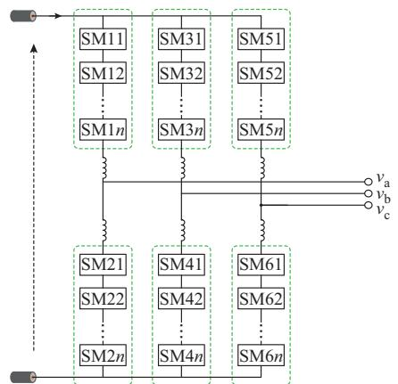

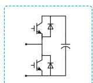  
(a) ,#	MMC3   


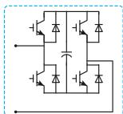  
FBSM

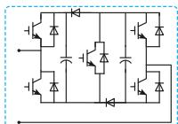  
I

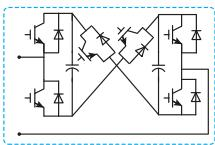  
*

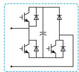  
FBSM

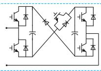  
*   
(b) *#	MMC+   
图1 混合型MMC及其多样性子模块拓扑结构  
Fig. 1 Topology structure of hybrid MMC and its various sub-modules

# 1. 2 多样性子模块串联结构动态平均化建模流程及统一模型

在混合型MMC中，无论何种子模块，都将以串联形式构成桥臂。本节以全桥子模块（FBSM）为例，对 k个子模块串联结构的动态平均化建模流程进行分析，并归纳出多样性子模块串联结构的动态平 均 化 统 一 模 型（dynamic averaging unified model，DAUM）。

1）分析串联结构在混合型MMC中应用时不同状态下的实际电路

在混合型 的应用中，子模块所组成的串联结构根据MMC运行模式的不同将呈现不同的运行状态，从而形成不同的运行电路。以FBSM的串联结构为例，在混合型MMC中应用时将具有解锁、闭锁与整流 3 种运行状态。如附录 A 图 A1（a）至（c）所示，分别给出了 3种运行状态下，FBSM 串联结构的实际运行电路。  
2）针对各运行状态的实际电路，基于动态平均化等值原理得到串联电路不同状态下的等效模型动态平均化等值原理为：借助于串联结构中电容电压与电流的循环耦合关系将电路拓扑的变化转变为不变的等效电路与变化的开关函数的组合。

以 的串联结构为例，解锁模式下，在控制及调制系统的触发脉冲下有序地导通与关断，此时 FBSM 串联结构在任意 t 时刻的实际电压为：

$$
\begin{array}{l} u _ {\mathrm {s c p}} (t) = \sum_ {i = 1} ^ {k} u _ {\mathrm {c o}, i} (t) = \sum_ {i = 1} ^ {k} \left(S _ {i} (t) u _ {\mathrm {c i}} (t)\right) = \\ \sum_ {i = 1} ^ {k} S _ {i} (t) \left(\frac {1}{C _ {i}} \int_ {t _ {0}} ^ {t} i _ {\mathrm {c i}} (t) \mathrm {d} t + u _ {\mathrm {c i}} (t _ {0})\right) = \\ \sum_ {i = 1} ^ {k} S _ {i} (t) \left(\frac {1}{C _ {i}} \int_ {t _ {0}} ^ {t} S _ {i} (t) i _ {\mathrm {s c}} (t) \mathrm {d} t + u _ {\mathrm {c i}} \left(t _ {0}\right)\right) \tag {1} \\ \end{array}
$$

式中： $u _ { \mathrm { s c p } } ( t )$ 为 t时刻的串联结构电压； $u _ { \mathrm { c o } , i } ( \mathrm { \Omega } _ { t } )$ 为第i个子模块端口t时刻的输出电压； $\textstyle \ C _ { i }$ 为第i个子模块电容的电容值； $i _ { \mathrm { c } i }$ 为 $t _ { 0 }$ 至 t时刻流过第 i个子模块的电容电流（假设 $t _ { 0 }$ 为解锁状态开始的初始时刻）；$u _ { \mathrm { c } i } ( \mathbf { \Gamma } _ { t } )$ 与 $u _ { \mathrm { c } i } ( t _ { 0 } )$ 分别为t时刻与 $t _ { 0 }$ 时刻第i个子模块的电容电压值；S（t）为第i个子模块t时刻的开关函数值 $; i _ { \mathrm { s c } }$ 为t时刻的串联结构电流；k为子模块数。

基于动态平均化等值原理，认为式（1）中的任意子模块的开关函数相等，则串联结构在混合型MMC中应用时解锁状态下的开关函数 $S _ { \mathrm { r u n } } ( t )$ 为：

$$
S _ {\text {r u n}} (t) = \left\{ \begin{array}{l l} \frac {1 - e _ {j}}{2} & \text {上 桥 臂} \\ \frac {1 + e _ {j}}{2} & \text {下 桥 臂} \end{array} \right. \tag {2}
$$

式中： ${ \mathrm { : } e _ { j } ( j = a , b , c ) }$ 为三相交流电压的调制参考波，可以通过混合型 的控制系统直接得到。

由式（ ）—式（ ）可知解锁状态下， 串联结构在动态平均化模型中的电压 $u _ { \mathrm { s c } } ( t )$ 可以表示为：

$$
\begin{array}{l} u _ {\mathrm {s c}} (t) = S _ {\mathrm {r u n}} (t) \left(\frac {\int_ {t _ {0}} ^ {t} S _ {\mathrm {r u n}} (t) i _ {\mathrm {s c}} (t) \mathrm {d} t}{C _ {\mathrm {s c}}} + u _ {\mathrm {s c}} (t _ {0})\right) = \\ S _ {\text {r u n}} (t) \left(\frac {k \int_ {t _ {0}} ^ {t} S _ {\text {r u n}} (t) i _ {\mathrm {s c}} (t) \mathrm {d} t}{C} + k u _ {\mathrm {c}} \left(t _ {0}\right)\right) \tag {3} \\ \end{array}
$$

式中： $C _ { \mathrm { s c } }$ 为串联结构的等效电容值； $u _ { \mathrm { s c } } ( t _ { 0 } )$ 为 $t _ { 0 }$ 时刻所有子模块的电容电压之和；C为所有子模块电容的平均电容值； ${ \bf ; } u _ { \mathrm { c } } ( t _ { 0 } )$ 为 $t _ { 0 }$ 时刻的所有子模块电容的平均电容电压值。

基于式（1）—式（3），可得FBSM串联电路在解锁状态下的统一模型等效电路如图2（a）所示。

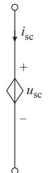  
(a) ?J'

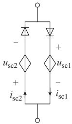  
(b) KJ'

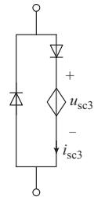  
(c) "'   
图2 FBSM串联结构不同工作状态下的动态平均化模型  
Fig. 2 Dynamic averaging model of FBSM with series structure for different working states

相似地，基于附录A图A1（b）和（c）可得闭锁状态与整流状态下的 FBSM 串联结构等效电路为图 2（b）和（c）。且图 2（b）和（c）中的等效动态电压源分别为：

$$
\left\{ \begin{array}{l} u _ {\mathrm {s c} 1} (t) = \frac {k \int_ {t _ {1}} ^ {t} \left(i _ {\mathrm {s c} 1} (t) + i _ {\mathrm {s c} 2} (t)\right) \mathrm {d} t}{C} + k u _ {\mathrm {c}} \left(t _ {1}\right) \\ u _ {\mathrm {s c} 2} (t) = u _ {\mathrm {s c} 1} (t) \end{array} \right. \tag {4}
$$

$$
u _ {\mathrm {s c} 3} (t) = \frac {k \int_ {t _ {2}} ^ {t} i _ {\mathrm {s c} 3} (t) \mathrm {d} t}{C} + k u _ {\mathrm {c}} (t _ {2}) \tag {5}
$$

式中：假设 $t _ { 1 }$ 为闭锁状态开始的初始时刻 $; t _ { 2 }$ 为整流状态开始的初始时刻； $\flat _ { } i _ { \mathrm { s c 1 } } , i _ { \mathrm { s c 2 } }$ 和 $i _ { \mathrm { s c 3 } }$ 分别为闭锁状态和整流状态的串联结构电流。

事实上，图 2（a）至（c）的电路同样适用于半桥型、钳位双子模块、五电平交叉、单极全桥以及三电平交叉子模块所组成的串联结构，且通过对比分析可知，多样性子模块串联结构在解锁状态、闭锁状态与整流状态下的统一等效电压源 $u _ { \mathrm { s c u } } ( t ) , u _ { \mathrm { s c u l } } ( t )$ ，

$u _ { \mathrm { s c u 2 } } ( t )$ 与 $u _ { \mathrm { s c u 3 } } ( t )$ 分别为：

$$
\left\{ \begin{array}{l} u _ {\mathrm {s c u}} (t) = \\ d _ {\text {t y p e 1}} S _ {\text {r u n}} (t) \left(\frac {k \int_ {t _ {0}} ^ {t} S _ {\text {r u n}} (t) i _ {\mathrm {s c}} (t) \mathrm {d} t}{C} + k u _ {\mathrm {c}} \left(t _ {0}\right)\right) \\ u _ {\mathrm {s c u 1}} (t) = \\ d _ {\text {t y p e 1}} \left[ \frac {k \int_ {t _ {1}} ^ {t} \left(d _ {\text {t y p e 2}} i _ {\mathrm {s c 1}} (t) + d _ {\text {t y p e 3}} i _ {\mathrm {s c 2}} (t)\right) \mathrm {d} t}{C} + k u _ {\mathrm {c}} \left(t _ {1}\right) \right] \\ u _ {\mathrm {s c u 2}} (t) = d _ {\text {t y p e 4}} u _ {\mathrm {s c l}} (t) \\ u _ {\mathrm {s c u 3}} (t) = d _ {\text {t y p e 1}} \left(\frac {k \int_ {t _ {2}} ^ {t} i _ {\mathrm {s c 3}} (t) \mathrm {d} t}{C} + k u _ {\mathrm {c}} \left(t _ {2}\right)\right) \end{array} \right. \tag {6}
$$

式中： $d _ { \mathrm { t y p e 1 } }$ 至 $d _ { \mathrm { t y p e 4 } }$ 为子模块类型参数，其值仅取决于子模块的拓扑结构。对于不同类型的子模块，各类型参数分别计算如表1所示。

3）整合不同状态下的动态平均化等效模型，得到多样性子模块串联结构的统一模型。

表1 多样性子模块串联结构的等效电压源类型参数 Table 1 Type parameters of equivalent voltage source for series structure based on various sub-module   

<table><tr><td>子模块类型</td><td>d_type1</td><td>d_type2</td><td>d_type3</td><td>d_type4</td></tr><tr><td>全桥</td><td>1</td><td>1</td><td>1.0</td><td>1.0</td></tr><tr><td>半桥</td><td>1</td><td>1</td><td>0</td><td>0</td></tr><tr><td>单极全桥</td><td>1</td><td>1</td><td>1.0</td><td>1.0</td></tr><tr><td>钳位双子模块</td><td>2</td><td>1</td><td>0.5</td><td>0.5</td></tr><tr><td>五电平交叉</td><td>2</td><td>1</td><td>1.0</td><td>1.0</td></tr><tr><td>三电平交叉</td><td>2</td><td>1</td><td>1.0</td><td>1.0</td></tr></table>

综合比较图2中3种运行状态的等效电路可知多样性子模块串联结构的 DAUM 如图 3所示。在图 3中，存在着 3个理想开关器件 $T _ { 1 }$ ，T 以及 $T _ { 3 }$ ，并通过不同的组合实现DAUM的运行状态切换。定义 $T _ { 1 }$ 至 $T _ { 3 }$ 的值为 0时，表示开关打开； $T _ { 1 }$ 至 $T _ { 3 }$ 的值为1时，表示开关闭合。则当 $( T _ { 1 } , T _ { 2 } , T _ { 3 } ) { = } ( 1 , 0 , 0 )$ ）时，DAUM 为解锁状态；当 $( T _ { 1 } , T _ { 2 } , T _ { 3 } ) { = } ( 0 , 1 , 0 )$ 时，DAUM 为闭锁状态；当 $( T _ { 1 } , T _ { 2 } , T _ { 3 } ) = ( 0 , 0 , 1 )$ 时，DAUM为整流状态。

基于上述 $( T _ { 1 } , T _ { 2 } , T _ { 3 } )$ 组合值对 DAUM 的状态切换控制，结合式（6）可得DAUM中的等效电压源如式（7）所示。

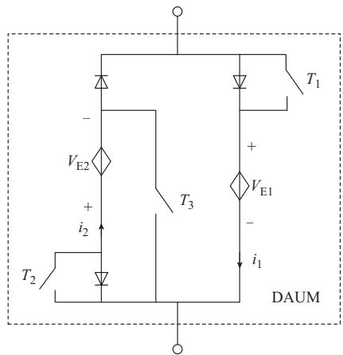  
图3 多样性子模块串联结构的DAUM  
Fig. 3 Series structure of DAUM with various sub-modules

$$
\left\{ \begin{array}{l} V _ {\mathrm {E} 1} (t) = d _ {\text {t y p e} 1} S (t) \cdot \\ \left[ \frac {k \int_ {t _ {1}} ^ {t} \left(d _ {\text {t y p e} 2} S (t) i _ {1} (t) + d _ {\text {t y p e} 3} i _ {2} (t)\right) \mathrm {d} t}{C} + k V _ {\mathrm {c} 0} \right] \\ V _ {\mathrm {E} 2} (t) = d _ {\text {t y p e} 4} V _ {\mathrm {E} 1} (t) \end{array} \right. \tag {7}
$$

式中： $V _ { \mathrm { c 0 } }$ 为所有电容的初始电压平均值； $i _ { 1 } ( t )$ 和$i _ { 2 } ( t )$ 为流过对应等效电压源的电流；S（t）为相应状态下的开关函数，可由开关信号组合数及控制系统确定，如式（8）所示。

$$
S (t) = \left\{ \begin{array}{l l} S _ {\text {r u n}} (t) & \quad (T _ {1}, T _ {2}, T _ {3}) = (1, 0, 0) \\ 1 & \quad (T _ {1}, T _ {2}, T _ {3}) = (0, 1, 0) \\ 1 & \quad (T _ {1}, T _ {2}, T _ {3}) = (0, 0, 1) \end{array} \right. \tag {8}
$$

基于图 3、式（7）、式（8）可知，DAUM通过对理想开关组合信号以及子模块类型参数定义的运行状态、子模块类型、测量信息以及混合型MMC参数。

在不改变电路结构的前提下，完成了对多样性子模块不同运行状态的外特性模拟。同时，由于DAUM 中的开关动作只是用来进行不同运行状态之间的切换，在电磁暂态仿真中DAUM将能够有效避免详细模型所包含的大量开关动作，从而避免了仿真时每一步对大规模伴随矩阵的求解，这也是DAUM能够取得理想仿真效率的主要原因之一。

# 2 基于 DAUM 的混合型 MMC统一外特性高效电磁暂态模型

由于 DAUM可以表示多样性子模块的串联结构，因此在混合型 MMC中只需要根据桥臂中子模块的类型数确定桥臂中的DAUM数目，同时采用统一的开关函数即可完成对混合型 每个桥臂的仿真。图 4给出了基于 DAUM 的混合型 MMC 统一外特性模型整体架构（通常情况下，混合型MMC的每个桥臂中子模块的类型为 2种，因此本文的通用模型以 2种为例）， $L _ { \mathrm { a r m } }$ 和 $R _ { \mathrm { a r m } }$ 分别为桥臂电感和电阻。

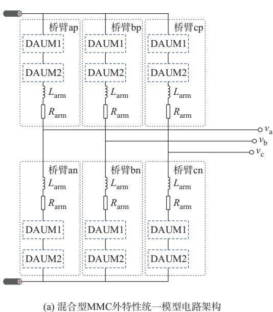

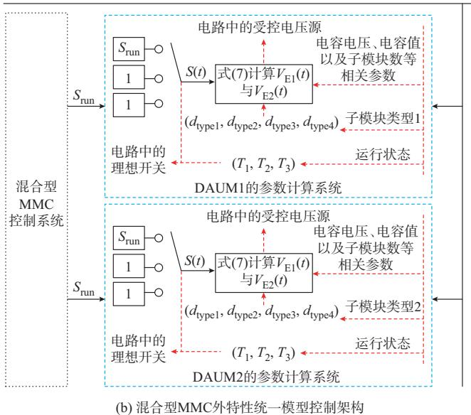  
D='-1-"F#	MMC   
图4 基于DAUM的混合型MMC统一外特性电磁暂态模型整体架构  
Fig. 4 Overall architecture of unified terminal electromagnetic transient model for DAUM -based hybrid MMC

从图 4中可知，混合型 MMC 的统一外特性模型并不涉及混合型MMC的调制系统及子模块内部

的运行过程，因此该模型不能用来对交、直流侧的高次谐波及子模块内部的运行进行分析。同时，统一

外特性模型的电路架构及控制架构均具有模块化特征，可便利地进行子模块类型的添加与不同子模块类型数目的修改，从而拓展统一外特性模型的应用范围，加强了其作为科研及工程应用工具的移植性。

# 3 仿真验证

为了验证本文所提混合型 统一外特性模型的仿真精度、仿真效率以及通用性，以1个四端真双极直接接地环状直流电网（8个换流器）为例，在ADPSS仿真软件中分别搭建了混合型 MMC的详细模型与外特性模型进行比较分析。附录A图A2及表A1给出了作为研究算例的真双极直接接地四端环网的连接结构与各换流器的参数。仿真中的硬件配置为：2.4 GHz，i5 Intel Core CPU，2 GB 内存，64位WIN7操作系统的便携式计算机。仿真步长都设置为 50 μs。

图5给出了所提模型与详细模型稳态时的仿真对比波形。

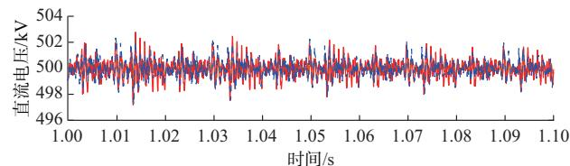  
(a) ,"*

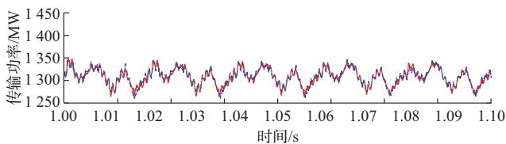  
(b) D(

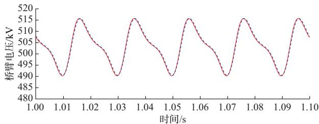  
(c) 6*

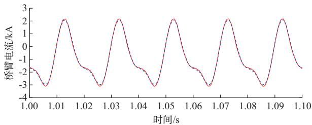  
(d) 6*"   
A3 '   
图5 混合型MMC稳态对比结果放大波形  
Fig. 5 Enlarged waveforms of steady-state comparison results for hybrid MMC

从图 5中的结果可知，无论是反映内外部交互特性的直流电压、传输功率，还是反映混合型MMC内部特性的桥臂电压与桥臂电流，外特性模型与详细模型具有很高的一致性。同时，由于外特性模型忽略了高次谐波，其纹波略有不同，这在桥臂电流中反映最为明显。更为关键的是，从桥臂电压与桥臂电流的波形中可知，不同于传统的静态平均化模型［31］ ，本文所提的模型由于在平均化过程中采用了动态等值，可以反映出桥臂电容的电压变化动态及电流动态（而不仅仅是静态正弦波），从而可以进行环流抑制、交直流解耦控制等优化控制的仿真，且使仿真精度更高。

图6给出了所提模型与详细模型在换流站二端口处（限流电抗器外侧，如附录A图A2的F点所示）发生双极接地短路故障及故障消失后的系统恢复放大波形。

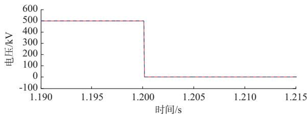

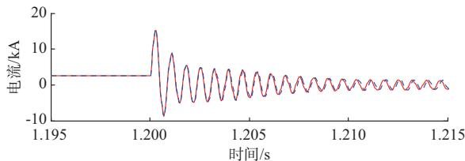  
(a) "02K,"*   
(b) "02K,"*"

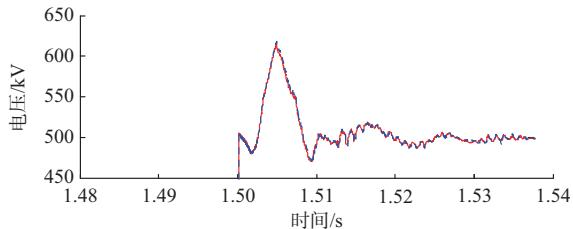  
(c) "02K,"*

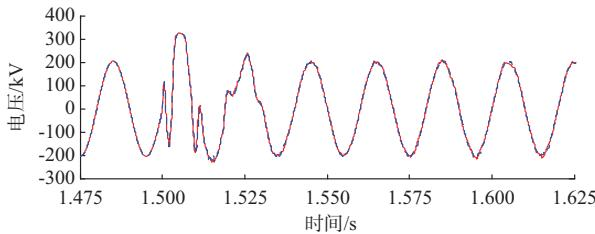  
(d) "02K"*   
A3 '   
图6 混合型MMC端口(限流电抗器外侧)发生双极接地直流故障对比结果放大波形  
Fig. 6 Enlarged waveforms of bipolar grounded DC fault comparison results for hybrid MMC (outside of current limiting reactor)

由图 6可知，不同于文献［31］的静态平均值模型，本文所提模型在故障及恢复的暂态过程中，均能较精确地模拟混合型 MMC的运行特性，电气量的最大值、暂态时间均与详细模型均相似，而不会出现较大的分散性，如故障发生及恢复过程中所提模型的直流电压的最大误差为 左右，交流电压的最大误差为 2.3% 左右，说明了所提模型在暂态过程中的应用可行性。

表2给出了所提模型与详细模型对于不同子模块数的仿真效率对比（仿真步长为 50 μs，单个混合型 MMC，仿真时间为 2 s）。从表 2中可知，外特性模型随着子模块数的增加，其仿真效率的优势更加明显。这是由于在详细模型中，随着子模块数目的增加，每一步长内所需计算的电磁暂态伴随矩阵维度将急剧增加，导致仿真计算时间急剧增大；而统一模型中，由于将子模块数目的增加与开关过程均等效为动态电压源的数值变化，因此子模块数目的增加几乎不影响统一模型仿真时间的变化。

表2 外特性模型与详细模型仿真效率比较结果  
Table 2 Comparison results of simulation efficiency of terminal model and detailed model   

<table><tr><td>子模块数</td><td>详细模型时间/s</td><td>外特性模型时间/s</td></tr><tr><td>14</td><td>1523</td><td>121</td></tr><tr><td>20</td><td>4123</td><td>121</td></tr><tr><td>34</td><td>10356</td><td>123</td></tr><tr><td>50</td><td>超出计算范围</td><td>123</td></tr><tr><td>90</td><td>超出计算范围</td><td>124</td></tr><tr><td>160</td><td>超出计算范围</td><td>124</td></tr></table>

同时，由于所提外特性模型的仿真步长可在较大的范围内变动（如 10 μs，20 μs以及 100 μs等）且保证仿真精度的有效性，因此本文所提外特性模型尤其适用于直流电网的系统级电磁暂态高效仿真。

为了验证所提模型的通用性，本文对多样性子模块所构成的混合型MMC的仿真结果同样进行了对比验证（仿真步长为 50 μs，单个换流器，桥臂中2种子模块数量比例均为 1∶1，仿真时间为 2 s），验证结果如表 3所示。从表中可知，对于多样性子模块的电磁暂态仿真而言，所提模型与详细模型的误差均在交流侧电压中体现的较为明显，且所有误差均在 3.5% 以下，这是由于开关函数中对高次谐波的忽略所致。事实上，从表 3中可知，随着混合型MMC中桥臂子模块数的增多，所提模型与详细模型的仿真精度误差将越来越小，说明了所提模型对大规模子模块数的混合型MMC更为有效。

表3 多样性子模块外特性模型与详细模型仿真效率比较结果  
Table 3 Comparison results of simulation efficiency for detailed model and terminal model with various sub-modules   

<table><tr><td>子模块类型</td><td>子模块数</td><td>详细模型时间/s</td><td>外特性模型时间/s</td><td>交流电压最大误差/%</td><td>直流电压最大误差/%</td></tr><tr><td rowspan="3">半桥+钳位双子模块</td><td>14</td><td>1831</td><td>121</td><td>3.2</td><td>0.34</td></tr><tr><td>20</td><td>4760</td><td>122</td><td>2.1</td><td>0.28</td></tr><tr><td>34</td><td>12112</td><td>121</td><td>1.8</td><td>0.23</td></tr><tr><td rowspan="3">半桥+五电平交叉</td><td>14</td><td>1903</td><td>123</td><td>2.9</td><td>0.35</td></tr><tr><td>20</td><td>4925</td><td>122</td><td>2.2</td><td>0.26</td></tr><tr><td>34</td><td>13867</td><td>122</td><td>1.7</td><td>0.21</td></tr><tr><td rowspan="3">半桥+单极全桥</td><td>14</td><td>1516</td><td>121</td><td>3.1</td><td>0.37</td></tr><tr><td>20</td><td>4264</td><td>124</td><td>2.3</td><td>0.29</td></tr><tr><td>34</td><td>11003</td><td>120</td><td>1.8</td><td>0.24</td></tr><tr><td rowspan="3">半桥+三电平交叉</td><td>14</td><td>1745</td><td>119</td><td>3.1</td><td>0.29</td></tr><tr><td>20</td><td>4597</td><td>122</td><td>2.2</td><td>0.22</td></tr><tr><td>34</td><td>11867</td><td>120</td><td>1.6</td><td>0.19</td></tr></table>

# 4 结语

本文提出了一种基于桥臂开关函数的动态平均化多样性子模块混合型 MMC统一外特性模型，该模型无需编码，具有良好的通用性、便利性与工程移植性，是一种兼顾仿真效率与仿真精度的应用于直流电网高效电磁暂态仿真的混合型MMC统一外特性模型。相比于已有的平均值模型，所提模型在建模过程中充分考虑了混合型MMC中电容的充放电动态过程，不仅在稳态及环流抑制分析时具有良好的仿真精度，且在混合型 的暂态运行时也具有较好的仿真精度与仿真效率，因此更加适用于不需要详细分析MMC桥臂及子模块内部特性的直流电网系统级电磁暂态仿真。

然而，由于所提模型中对开关函数高次谐波的忽略，本文的模型对于交直流侧谐波的仿真精度仍存在不足，尤其是当混合型 MMC的桥臂子模块数较少时，该模型的仿真误差将增大，甚至难以满足仿真精度的要求。因此，后续研究将围绕如何提高所提模型对高次谐波的精确仿真进行研究，并将其与传统的能够反映混合型 交直流谐波特性的加速模型（如戴维南模型）进行理论的对比分析以探索不同仿真模型的应用范围及优劣，进一步促进混合型MMC的工程应用。

附录见本刊网络版（http：//www.aeps-info.com/aeps/ch/index.aspx），扫英文摘要后二维码可以阅读网络全文。

# 参 考 文 献

［1］仉雪娜，赵成勇，庞辉，等.基于MMC的多端直流输电系统直流侧故障控制保护策略［］ 电力系统自动化， ， （ ）：140-145.  
ZHANG Xuena， ZHAO Chengyong， PANG Hui， et al. Acontrol and protection scheme of multi-terminal DC transmissionsystem based on MMC for DC line fault[J]．Automation ofElectric Power Systems，2013，37（15）：140-145.  
［2］WANG H，YANG J，CHEN Z，et al. Model predictive control of PMSG-based wind turbines for frequency regulation in an isolated grid ［J］. IEEE Transactions on Industry Applications， 2018，54（4）：3077-3089.   
［3］王永平，赵文强，杨建明，等.混合直流输电技术及发展分析［J］.电力系统自动化，2017，41（7）：156-167.  
WANG Yongping，ZHAO Wenqiang，YANG Jianming，et al. Hybrid high-voltage direct current transmission technology and its development analysis ［J］. Automation of Electric Power Systems，2017，41（7）：156-167.   
［ ］梅勇，史尤杰，周剑，等 特高压柔性直流阀组投入过程中混合型MMC启动充电策略[J].电力系统自动化，2018,42(24)：113-119.DOI:10.7500/AEPS20180602001.  
MEI Yong，SHI Youjie，ZHOU Jian，et al. Start-up chargingstrategy for hybrid MMC in valve switching-on process of VSC-UHVDC system［J］. Automation of Electric Power Systems，2018，42（24）：113-119. DOI：10.7500/AEPS20180602001.  
「5]许义佳，罗映红，史彤彤，等.具有直流故障自清除能力的新型MMC 子模块及其混合拓扑［J］.电力系统保护与控制，2018，（ ）： -  
XU Yijia，LUO Yinghong，SHI Tongtong，et al. A new MMC sub-module with DC fault self-clearing ability and its hybrid topology［J］. Power System Protection and Control， 2018， 46（7）：129-137.   
［6］郭晓茜，崔翔，齐磊.架空线双极MMC-HVDC系统直流短路故障分析和保护［］中国电机工程学报， ，（ ）： -  
GUO Xiaoqian， CUI Xiang， QI Lei. DC short-circuit faultanalysis and protection for the overhead line bipolar MMC-HVDC system［J］. Proceedings of the CSEE，2017，37（8）：2177-2185.  
［ ］董旭，张峻榤，王枫，等 风电经架空柔性直流输电线路并网的交直流故障穿越技术[J].电力系统自动化，2016，40(18)：48-55.  
DONG Xu，ZHANG Junjie，WANG Feng，et al. AC and DC fault ride-through technology for wind power integration via VSC-HVDC overhead lines ［J］. Automation of Electric Power Systems，2016，40（18）：48-55.   
［ ］常非，杨中平，林飞 具备直流故障清除能力的 多电平子模块拓扑[J].高电压技术，2017，43(1)：44-49.  
CHANG Fei， YANG Zhongping， LIN Fei. Multilevel sub-module topology of MMC with DC fault clearance capability［J］.High Voltage Engineering，2017，43（1）：44-49.  
［9］ZENG R，XU L，YAO L，et al. Pre-charging and DC fault ridethrough of hybrid MMC based HVDC systems ［J］. IEEE Transactions on Power Delivery，2015，30（3）：1298-1306.   
［10］PICAS R，POU J，CEBALLOS S，et al. Optimal injection of harmonics in circulating currents of modular multilevel converters for capacitor voltage ripple minimization［C］// 2013 IEEE ECCE Asia Downunder，June 3-6，2013，Melbourne， Australia.

［11］TANG G，HE Z，PANG H. R&D and application of voltage sourced converter based high voltage direct current engineering technology in China［J］. Journal of Modern Power Systems and Clean Energy，2014，2（1）：1-15.   
［12］ZHOU Z，CHEN Z，WANG X，et al. AC fault ride throughcontrol strategy on inverter side of hybrid HVDC transmissionsystems［J］. Journal of Modern Power Systems and CleanEnergy，2019，7（5）：1129-1141.  
［13］杨晓峰，郑琼林，薛尧，等.模块化多电平换流器的拓扑和工业应用综述［］电网技术， ，（ ）：-  
YANG Xiaofeng，ZHENG Qionglin，XUE Yao，et al. Reviewon topology and industry applications of modular multilevelconverter［J］. Power System Technology，2016，40（1）：1-10.  
［14］李明节.大规模特高压交直流混联电网性分析与运行控制［J］.电网技术， ，（ ）： -  
LI Mingjie. Characteristic analysis and operational control of large-scale hybrid UHV AC/DC power grids［J］. Power System Technology，2016，40（4）：985-991.   
［ ］朱良合，盛超，陈晓科，等 混合 电磁暂态高效建模和阀段故障特性分析［J］.华北电力大学学报（自然科学版），2019，（ ）： -  
ZHU Lianghe，SHENG Chao，CHEN Xiaoke，et al. High-speed electromagnetic modeling and internal valve failureanalysis of hybrid MMC［J］. Journal of North China ElectricPower University （Natural Science Edition），2019，46（1）：32-40.  
［16］许建中，赵成勇，GOLE A M.模块化多电平换流器戴维南等效整体建模方法［J］.中国电机工程学报，2015，35（8）：1919-1929.  
XU Jianzhong，ZHAO Chengyong，GOLE AM. Research on the Thévenin’s equivalent based integral modelling method of the modular multilevel converter （MMC）［J］. Proceedings of the CSEE，2015，35(8)：1919-1929.   
［17］GNANARATHNAU N， GOLE A， JAYASINGHE R.Efficient modeling of modular multilevel HVDC converters（MMC） on electromagnetic transient simulation programs［J］.IEEE Transactions on Power Delivery，2011，26(1)：316-324.  
［18］赵禹辰，徐义良，赵成勇，等.单端口子模块MMC电磁暂态通用等效建模方法[J].中国电机工程学报，2018,38(16)：4658-4667.  
ZHAO Yuchen， XU Yiliang， ZHAO Chengyong， et al.Generalized electromagnetic transient （EMT） equivalentmodeling of MMCs with arbitrary single-port sub-module［］ ， ， （ ）： -4667.  
［ ］徐义良，赵成勇，赵禹辰，等 双端口子模块 电磁暂态通用等效建模方法［J］.中国电机工程学报，2018，38（20）：6079-6090.  
XU Yiliang， ZHAO Chengyong， ZHAO Yuchen， et al.Generalized electromagnetic transient （EMT） equivalentmodeling of MMCs with arbitrary two-port sub-module［］ ， ， （ ）： -6090.  
「20］李笑倩.基于MMC的高压大容量柔性直流输电关键技术研究［D］.北京：清华大学，2015.  
LI Xiaoqian. Research on the key technologies of high voltage and high power HVDC based on MMC［D］. Beijing：Tsinghua University，2015.   
［21］AHMED N， ANGQUIST L， NORRGA S， et al. A

computationally efficient continuous model for the modular multilevel converter ［J］. IEEE Journal of Emerging and Selected Topics in Power Electronics， 2014， 2（4）： 1139- 1148.   
[22]孙谦浩.直流电网电磁暂态建模与仿真研究[D].北京：清华大学，2017.  
SUN Qianhao. Electromagnetic transient modeling andsimulation research of DC grid ［D］. Beijing： TsinghuaUniversity，2017.  
［23］QIN J， SAEEDIFARD M， ROCKHILL A， et al. Hybriddesign of modular multilevel converters for HVDC systemsbased on various submodule circuits［J］. IEEE Transactions onPower Delivery，2015，30（1）：385-394.  
［24］XU I，GOLE A，ZHAO C. The use of averaged-value modelof modular multilevel converter in DC grid ［J］. IEEETransactions on Power Delivery，2014，30（2）：519-528.  
[25]PERALTAJ，SAADH，DENNETIERE S，et al.Detailed and averaged models for a 401-level MMC-HVDC system［J］. IEEE Transactions on Power Delivery，2Ol2，27(3)：1501- 1508.   
［26］孙谦浩，李亚楼，宋强，等 . 基于桥臂基波平均开关函数的MMC 模型在直流电网仿真中的应用［J］.电力自动化设备，2018,38(8):24-30.  
SUN Qianhao，LI Yalou，SONG Qiang，et al. Application of MMC model based on arm fundamental wave average switching function in DC grid simulation［J］. Electric Power Automation Equipment，2018，38（8）：24-30.   
［27］LIN W X， JOVCIC D， NGUEFEU S， et al. Full-bridgeMMC converter optimal design to HVDC operationalrequirements ［J］. IEEE Transactions on Power Delivery，2016，31(3)：1342-1350.

［28］LI X， SONG Q， LIU W， et al. Universal terminal modelsuitable for various modular multilevel converter topologies forpower-system-level simulation application ［J］. IETGeneration， Transmission & Distribution， 2018， 12（3）：737-744.  
［29］WANG H， YANG J， CHEN Z， et al. Analysis andsuppression for frequency oscillation in a wind-diesel system［J］. IEEE Access，2019，7：22818-22828.  
「30]李笑倩，宋强，刘文华，等.应用于复杂交直流网络的箱位双子模块型 快速仿真模型［］电网技术， ， （ ）： -2853.  
LI Xiaoqian， SONG Qiang， LIU Wenhua， et al. Efficientsimulation model of MMC with clamp double sub-module forcomplex AC and DC power grid applications［J］. Power SystemTechnology，2017，41（9）：2847-2853.  
［31］SAAD H，PERALTA J，DENNETIERE S，et al. Dynamic averaged and simplified models for MMC-based HVDC transmission systems ［J］. IEEE Transactions on Power Delivery，2013，28(3)：1723-1730.

李亚楼（1974—），男，博士，教授级高级工程师，博士生导师，主要研究方向：交、直流电力系统及其关键设备建模、仿真与分析。E-mail：liyalou@epri.sgcc.com

孙谦浩（1993—），男，通信作者，博士研究生，主要研究方向：直流电网及其关键换流设备技术、电力电子设备高效电磁暂态建模及仿真技术。E-mail：sxsunqianhao@163.com

孟经伟（1990—），男，博士研究生，主要研究方向：柔性直流输电技术。E-mail：mjw15@mails.tsinghua.edu.cn

（编辑 鲁尔姣）

# Unified Terminal and Highly Efficient Electromagnetic Transient Model of Hybrid Modular Multilevel Converter with Various Sub-modules

LI Yalou1 ，SUN Qianhao2 ，MENG Jingwei2 ，MU Qing1 ，ZHANG Xing1

(1. China Electric Power Research Institute, Beijing 100192, China；

2. Department of Electrical Engineering, Tsinghua University, Beijing 100084, China)

Abstract: The highly efficient electromagnetic transient (EMT) simulation of hybrid modular multilevel converter (MMC) is an important basis for the related research about hybrid MMC. However, because there are various kinds of sub-modules (SMs) can be employed, and a lot of power electronic switches are included in each kind of SMs, the detailed EMT model of hybrid MMC will reduce the simulation efficiency seriously. In view of this background, the unified dynamic averaging equivalent model of the series structure of various SMs is proposed based on the switching function and the dynamic characteristic of capacitor. In addition, a unified terminal highly efficiency EMT model of hybrid MMC based on the proposed dynamic model of the series structure is also presented and analyzed. The proposed unified model not only is convenient but also has the great simulation accuracy and efficiency, which has good portability and is especially important for a research tool to satisfy the convenience demand of modification. Finally, the simulation accuracy and efficiency of the proposed model are validated by the comparison with the detailed model based on the simulation components in ADPSS.

This work is supported by State Grid Corporation of China (No. XT71-18-030).

Key words: hybrid modular multilevel converter (MMC); unified model; various sub-module (SM); electromagnetic transient simulation; DC fault handling

