# Analysis and general calculation of DC fault currents in MMC-MTDC grids

Zhuoya Wang , Liangliang Hao * , Le Wang , Jinghan He

College of Electrical Engineering, Beijing Jiaotong University, Beijing 100044, China

# A R T I C L E I N F O

Keywords:

Modular multilevel converter

Short-circuit fault characteristics

Short-circuit current calculation

Multi-terminal direct current of modular multilevel converter

# A B S T R A C T

The short-circuit fault of MMC-MTDC has great influence on the safe and stable operation of the MMC-HVDC transmission system. To analyze the changing trend of short-circuit current after fault, this paper studies the short-circuit fault mechanism based on the analytical formula of MMC short-circuit current, and analyzes the influence of capacitance, inductance and resistance on short-circuit current. Subsequently, the discharge characteristics of each converter station in multi-terminal complex power grid under different fault conditions are investigated. Based on the above research, a general calculation method for short-circuit current of multiterminal complex direct power grid is proposed. Then, a four-terminal power grid and a six-terminal power grid are built based on the PSCAD/ EMTDC electromagnetic transient simulation platform to verify the fault characteristics of MMC and discharge characteristics of multi-terminal network converter stations respectively. Finally, a digital-physical hybrid simulation experiment platform is erected to verify the effectiveness of the analytical calculation method for short-circuit current. The results demonstrate that the theoretical solution method can accurately characterize the fault current variation trend, which has an extremely important guiding significance for the engineering design and control protection of MMC–HVDC transmission network.

# 1. Introduction

Modular multilevel converter multi-terminal direct current (MMC-MTDC) transmission system can flexibly absorb large-scale renewable energy. Compared with traditional DC transmission system, it has many advantages such as lower harmonic level, wider application range, etc., which has great application prospects in the future DC power grid [1,2]. As a new converter of the MMC-HVDC transmission system, the modular multilevel converter has the characteristics of strong fault-tolerant operation capability, easy expansion of voltage and capacity levels [3–5]. And it has been widely used in offshore wind farms and grid connected new energy power generation projects.

In the past decades, a number of multi-terminal direct current projects based on MMC have been completed and put into operation [6,7]. The continuous development and application of MMC-MTDC not only greatly improve the installed capacity, transmission distance and networking scale of the system, but also noticeably increase the occurrence probability of short-circuit fault of DC system. In addition, the inherent weak damping characteristics of MMC easily lead to problems such as fast rising rate of fault current and large overcurrent amplitude, which makes it difficult to switch off the DC circuit breaker and subsequently cause a serious accident of "local failure and shutdown of the

whole network", which restricts the further promotion and application of the MMC-HVDC power grid [8–10]. Therefore, it is urgent to carry out relevant research to explore the accurate and effective general solution method of DC side fault short-circuit current before MMC locking, so as to provide theoretical basis for the protection design of transmission system [11,12].

Fault transient characteristics analysis is the basis of the research on the dynamic characteristics of short-circuit current. In order to explore the accurate calculation method of short-circuit current at the DC side of MMC-MTDC, experts and scholars have conducted in-depth and detailed research on the fault transient characteristics of MMC [13–15]. The analysis methods can be divided into circuit topology method and electromagnetic transient simulation method. Geng Tang et al. used the equal-area criterion method to analyze the transient stability characteristics of DC faults based on half-bridge submodules, clamp twin modules and hybrid HVDC systems, and proposed the critical AC transmission power index [16]. Xue Han et al. based on the ±500 kV bipolar MMC-HVDC transmission engineering model, studied the system circuit topology and fault transient characteristics under different fault conditions, and compared the ability of AC and DC circuit breakers to clear and restore various faults [17].

The above studies are based on the topology of the MMC fault circuit,

and certain assumptions and approximations are made in the process. To accurately present the fault characteristics of the DC side short-circuit before sub-module blocked, some scholars adopted electromagnetic transient simulation to establish a complete transmission system model including AC and DC sides, and analyzed the fault waveform of shortcircuit current on the DC side of MMC and transient characteristics of the fault system [18–20].

The analysis of the transient characteristics of the DC side fault of the MMC-MTDC system lays a theoretical foundation for the analytical so lution of the short-circuit current. In order to further research the overall variation trend of the short-circuit current after a fault, researchers adopt the method of establishing an equivalent circuit network model to solve the short-circuit fault current [21,22]. By establishing the corresponding high-order multi-dimensional matrix equations for different transmission system structures, the connection relationship of each part of the multi-terminal complex transmission network is described in detail, and the accurate and effective calculation method of short-circuit current is studied. Based on such solving methods, in [23], the author build the ring network circuit model of pseudo bipolar MMC-HVDC transmission system for different types of short-circuit faults, and proposed a general short-circuit current calculation method for any fault location based on the multi-dimensional matrix solution. [24] Proposed a fault current calculation method based on coupled differential equations. The short-circuit currents with MMC blocked and unblocked are calculated by complex differential equations. [25] Presented the calculation method of short-circuit current before MMC blocked, but the model has different manifestations under different fault forms. In [26], researchers derived the pre-fault matrix of multi-terminal converter station based on the RLC equivalent model of a single converter station, and established the modified fault matrix according to different fault locations to solve the DC fault current of each branch. This method is not universal to deal with all kinds of faults in MTDC grids. Its efficiency is restrained by the heavy time consumption of numerical integration.

Some researchers consider MMC controllers to calculate short-circuit current. A companion circuit-based method is proposed to estimate the short-circuit currents of asymmetric bipolar MTDC grids in [27]. The current is obtained from the point of view of power reference values in [28]. But MMC has several control modes, which leads to the practicality of this method in engineering limited. Besides, the calculation method of short circuit current with DC circuit breaker is studied in some literatures [29,30]. The above researches proposed a method to accurately solve the short circuit current of MMC-MTDC, but the structure of the network model built is complex, or the high-order multidimensional matrix needs to be solved when calculating the fault current, or the calculation method is not universal.

To overcome the above shortcomings, a general analytical calculation method for DC side fault short-circuit current of multi-terminal complex power grid is presented. The main contributions of this work can be summarized as follows:

a) A simple analytical expression with physically meaningful for shortcircuit current has been proposed.   
b) The discharge current from each converter to the fault point is divided into clockwise and counterclockwise types, and a simplified method is proposed to simplify the multi terminal complex power grid into a dual terminal model.   
c) A universal calculation method for short-circuit current in MMC-MTDC power grid is proposed. The effectiveness of characteristic research and the correctness of the calculation method for short circuit current were verified through simulation and experiments.

The organization of the rest of this paper is: Section 1 introduces the basic operating principle of MMC and deduce the analytical formula of short-circuit current. Section 2 studies the discharge principle of each converter station in multi-terminal power network. Section 3 proposes the general calculation method of MMC-MTDC. Finally, the

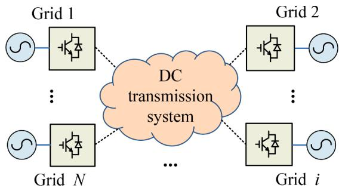  
Fig. 1. MMC-MTDC transmission network.

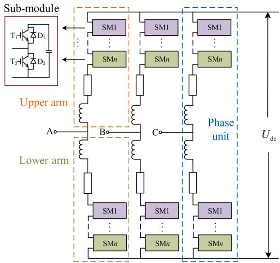  
Fig. 2. Topology structure of MMC and sub-module.

characteristics and calculation method presented above are verified in Section 4.

# 2. Fault characteristics analysis based on analytical formula of MMC short-circuit current

Since the American Trans Bay Cable project was put into operation in 2010, a number of HVDC transmission projects based on modular multilevel converter have been put into operation worldwide. For example, Shanghai Nanhui MMC-HVDC transmission project, Zhoushan five-terminal MMC-HVDC transmission project, Xiamen true bipolar MMC-HVDC transmission project, France - Spain MMC-HVDC network project, etc. Compared with the traditional DC transmission system, the MMC based transmission mode has the advantages of low harmonic level, no reversing failure, etc., and it is more suitable for large-capacity, long-distance transmission and multi-terminal transmission and distribution network.

The typical structure of a multi-terminal MMC-HVDC system is shown in Fig. 1. Both ends of the positive and negative transmission lines of each converter station are equipped with DC circuit breakers and wave reactors. When any line fails and reaches the set value of the protection device, the circuit breakers at both ends of the pole line will be switched off to ensure the normal operation of the rest of the system.

The submodule of the converter station in the multi-terminal symmetrical bipolar MMC-HVDC transmission network adopts the halfbridge topology. The structure of MMC and submodule is shown in Fig. 2. Each MMC consists of six three-phase bridge arms, each of which contains an arm reactor, an arm equivalent resistance, and N half bridge sub-modules (HBSM). Each HBSM consists of a capacitor $C _ { 0 } ,$ insulated gate bipolar transistors $\mathrm { T } _ { 1 }$ and $\mathrm { T } _ { 2 } ,$ and anti-parallel diodes $\mathrm { D } _ { 1 }$ and $\mathrm { D } _ { 2 } .$

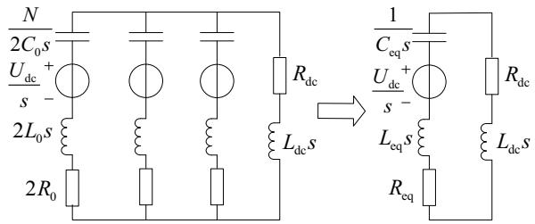  
Fig. 3. Equivalent discharge path of MMC sub-module capacitance.

The MMC controls the on-off and off-off of $\mathrm { T } _ { 1 } , \mathrm { T } _ { 2 } , \mathrm { D } _ { 1 }$ and $\mathbf { D } _ { 2 }$ based on the quicksort voltage equalization strategy and the nearest level approximation modulation mode, so that the output voltage of the submodule is $U _ { \mathrm { c } }$ or 0. When $\mathrm { T } _ { 1 }$ is on and $\mathrm { T } _ { 2 }$ is off, the submodule is in the input state. When both $\mathrm { T } _ { 1 }$ and $\mathrm { T } _ { 2 }$ are shut off, the submodule is in the locked state. When $\mathrm { T } _ { 1 }$ is off and $\mathrm { T } _ { 2 }$ is on, the submodule is in bypass state. The sinusoidal AC voltage is fitted by switching three different states of submodule: input, lock and bypass. In addition, the total number of submodules with the upper and lower bridge arms in the input state of each phase is always $N ,$ so as to ensure that the DC bus voltage $U _ { \mathrm { d c } }$ is in a constant state.

Based on the working principle of MMC, the feed current on the AC side is converted into the current on the DC line through the nonlinear charge-discharge process. At this time, MMC can be regarded as being in discharge state on the DC side. The modulation strategy makes the submodules input by the upper and lower bridge arms in series, and then the discharge circuit of the MMC submodule can be obtained, as shown in Fig. 3.

Where, $U _ { \mathrm { d c } }$ is the DC bus voltage, $C _ { 0 }$ the capacitance value of the submodule, R equivalent resistance of bridge arm, $L _ { 0 }$ the bridge arm inductance, $R _ { \mathrm { d c } }$ the equivalent resistance on the DC side, $L _ { \mathrm { d c } }$ the equivalent inductance on the DC side. And $C _ { \mathrm { e q } } = 2 C _ { 0 } / 3 N , L _ { \mathrm { e q } } = 2 L _ { 0 } / 3 ,$ , $R _ { \mathrm { e q } } = 2 R _ { 0 } / 3$ .

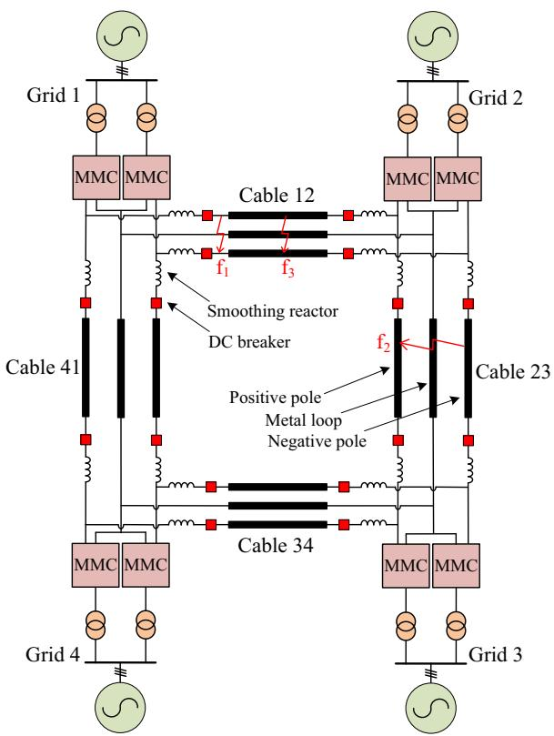  
Fig. 4. Four-terminal symmetrical bipolar MMC–HVDC transmission network.

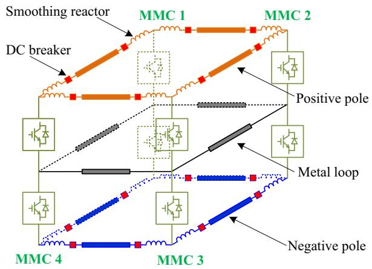  
Fig. 5. Schematic diagram of a four-terminal MMC-MTDC transmission system.

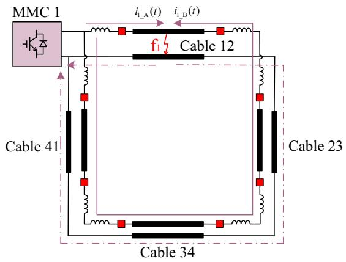  
Fig. 6. Diagram of pole to pole short-circuit fault discharge current.

Analyzing the discharge process of sub-module capacitor energy storage after fault, MMC can be regarded as a linear steady-state circuit. According to the equivalent circuit of sub-module capacitor discharge as

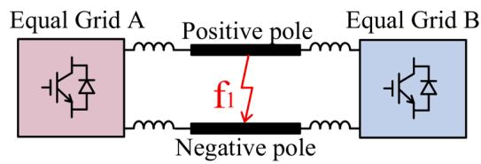

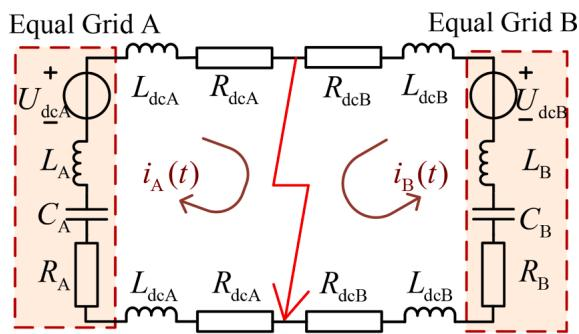  
(a)   
(b)   
Fig. 7. Two-terminal equivalent discharge circuit for 4-terminal MMC-MTDC transmission system; (a) Two-terminal equivalent discharge model, (b) Twoterminal equivalent model circuit structure.

shown in Fig. 3, the circuit equation can be formed, and the discharge current of sub-module capacitor energy storage can be obtained as follows:

$$
i _ {\mathrm {d c l}} (t) = U _ {\mathrm {d c}} \cdot \exp (- t / \tau_ {\mathrm {d c}}) \cdot \sin (\omega_ {\mathrm {d c}} t) / R _ {\text {a l l}} \tag {1}
$$

On the other hand, after the fault, the energy fed into the DC side of the AC side can approximately maintain the normal operating current $I _ { \mathrm { d c } 0 } .$ Therefore, the expression of short-circuit current at the DC side of MMC is:

$$
\begin{array}{l} i _ {\mathrm {d c \_ f a u l t}} (t) = i _ {\mathrm {d c 1}} (t) + I _ {\mathrm {d c 0}} \\ = \frac {U _ {\mathrm {d c}}}{R _ {\text {a l l}}} \mathrm {e} ^ {- \frac {t}{\tau_ {\mathrm {d c}}} \sin \left(\omega_ {\mathrm {d c}} t\right)} + I _ {\mathrm {d c} 0} \tag {2} \\ \end{array}
$$

Therein, $\tau _ { \mathrm { d c } } = 4 L _ { 0 } + 6 L _ { \mathrm { d c } } / 2 R _ { 0 } + 3 R _ { \mathrm { d c } _ { \mathrm { j } } }$

$$
\omega_ {\mathrm {d c}} = \sqrt {\frac {2 N (2 L _ {0} + 3 L _ {\mathrm {d c}}) - C _ {0} (2 R _ {0} + 3 R _ {\mathrm {d c}}) ^ {2}}{4 C _ {0} (2 L _ {0} + 3 L _ {\mathrm {d c}}) ^ {2}}},
$$

$$
R _ {\text {a l l}} = \sqrt {\frac {2 N (2 L _ {0} + 3 L _ {\mathrm {d c}}) - C _ {0} (2 R _ {0} + 3 R _ {\mathrm {d c}}) ^ {2}}{3 6 C _ {0}}}
$$

Where, $R _ { \mathrm { a l l } }$ the sum of all resistance values on the DC side, t the time after the failure.

It can be seen from Eq. (2) that the capacitor discharge current of the submodules is the main part of the short-circuit current. The working principle of MMC makes the submodules quickly switch on and $\operatorname { o f f } ,$ resulting in a large number of dynamic components in the converter station, and the different parameters of each dynamic component have different influences on the short-circuit current. In order to study the influence of internal parameters in detail, the partial derivatives of short-circuit current on capacitance, inductance and resistance are obtained. Let $L _ { \mathrm { e q } } = 2 L _ { 0 } + 3 L _ { \mathrm { d c } } , R _ { \mathrm { e q } } = 2 R _ { 0 } + 3 R _ { \mathrm { d c } } .$ :

$$
\begin{array}{l} \frac {\partial i _ {\mathrm {d c . f a u l t} (t)}}{\partial C _ {0}} = - \frac {U _ {\mathrm {d c}}}{R _ {\mathrm {a l l , f 1 , 2}} ^ {2}} e ^ {- \frac {t}{\tau_ {\mathrm {d c , f 1 , 2}}}} \sin \left(\omega_ {\mathrm {d c , f 1 , 2}} t\right) \cdot \frac {1}{2} \sqrt {\frac {2 N L _ {\mathrm {e q}} - C _ {0} \left(R _ {\mathrm {e q}} + 3 R _ {\mathrm {f 1 , 2}}\right) ^ {2}}{4 C _ {0} L _ {\mathrm {e q}} ^ {2}}} \cdot \frac {- N}{2 C _ {0} ^ {2} L _ {\mathrm {e q}}} \\ + \frac {U _ {\mathrm {d c}}}{R _ {\text {a l l . f 1 , 2}}} e ^ {- \frac {t}{\tau_ {\mathrm {d c . f 1 , 2}}}} \cos \left(\omega_ {\mathrm {d c . f 1 , 2}} t\right) \cdot \frac {1}{2} \sqrt {\frac {2 N L _ {\mathrm {e q}} - C _ {0} \left(R _ {\mathrm {e q}} + 3 R _ {\mathrm {f 1 , 2}}\right) ^ {2}}{4 C _ {0} L _ {\mathrm {e q}} ^ {2}}}, \frac {- N L _ {\mathrm {e q}}}{1 8 C _ {0} ^ {2}} \tag {3} \\ \end{array}
$$

By analyzing Eqs. (3), (4) and (5), it can be concluded that ∂idc fault(t) < 0 $\frac { \partial i _ { \mathrm { d c . f a u l t } ( t ) } } { \partial L _ { \mathrm { e q } } } < 0 ,$ ∂Leq $\frac { \partial i _ { \mathrm { d c . f a u l t } ( t ) } } { \partial R _ { \mathrm { e q } } } < 0 ,$ , and the value of ∂idc fault(t) is less than 0 in the first 5.3 ms and $\frac { \partial i _ { \mathrm { d c . f a u l t } ( t ) } } { \partial C _ { 0 } }$ greater than 0 after 5.3 ms. The analysis shows that the short-circuit decreases with the increase of resistance and inductance, while the capacitance decreases firstly and then increases with to the time when the fault occurs.

Before the MMC is locked, the system discharge circuit is composed of the bridge arm inductor, the flat wave reactor and the submodule capacitance. Therefore, the discharge circuit can be regarded as an underdamped second-order oscillation circuit, and the critical resistance of the system is shown in formula (6), which provides a theoretical basis for parameter setting and protection control of the system.

$$
R _ {\Delta} = 2 \sqrt {L _ {\Delta} / C _ {\Delta}} \tag {6}
$$

Where, $L _ { \Delta }$ represents the sum of all inductors of the equivalent loop, $C _ { \Delta }$ represents the equivalent loop capacitance value.

# 3. Study on discharge characteristics of converter station with multi-terminal complex network

Firstly, taking the four-terminal MMC-HVDC transmission project shown in Fig. 4 as the research object, explore the network simplification method and analytical calculation method of short-circuit current. The network structure is shown in Fig. 5. The transmission system is composed of eight converter stations at four ends. Both ends of each line are connected with smoothing reactors and DC circuit breakers. Orange lines represent the positive line, blue lines represent the negative line, and gray lines represent the metal return line.

Taking the bipolar short-circuit fault at the end of line 12 and the outlet of grid 1 as an example, the discharge characteristics of converter station in MMC-HVDC transmission system are explored. When bipolar short-circuit fault occurs at $\mathbf { f } _ { 1 } ,$ the discharge current loop of converter station 1 is shown in the arrow direction in Fig. 6. Since the transmission system is a ring network structure, the discharge curren ${ \cal I } _ { 1 }$ of MMC 1 can flow clockwise and anticlockwise to the fault point, as shown by the solid line in the figure After the discharge current reaches the fault point, there are also two paths for the short-circuit current flowing back to MMC 1 from the negative line, as shown by the dotted line in the figure.

Using the same analysis method, the discharge current circuits of MMC 2, MMC 3 and MMC 4 can be obtained respectively. See Appendix A for the schematic diagram of the discharge current of the converter

$$
\begin{array}{l} \frac {\partial i _ {\mathrm {d c} - \text {f a u l t}} (t)}{\partial L _ {\mathrm {e q}}} = - \frac {U _ {\mathrm {d c}}}{R _ {\mathrm {a l l} - \mathrm {f} 1 , 2} ^ {2}} e ^ {- \frac {t}{\tau_ {\mathrm {d c} - \mathrm {f} 1 , 2}}} \sin \left(\omega_ {\mathrm {d c} - \mathrm {f} 1, 2} t\right) \cdot \frac {1}{2} \sqrt {\frac {2 N L _ {\mathrm {e q}} - C _ {0} \left(R _ {\mathrm {e q}} + 3 R _ {\mathrm {f} 1 , 2}\right) ^ {2}}{3 6 C _ {0}}} \cdot \frac {N}{1 8 C _ {0}} \\ + \frac {U _ {\mathrm {d c}}}{R _ {\text {a l l - f 1 , 2}}} e ^ {- \frac {t}{\tau_ {\mathrm {d c} - \mathrm {f l} , 2}}} \sin \left(\omega_ {\mathrm {d c} - \mathrm {f l}, 2} t\right) \frac {t}{\tau_ {\mathrm {d c} - \mathrm {f l} , 2} ^ {2}} \cdot \frac {2}{R _ {\mathrm {e q}} + 3 R _ {\mathrm {f l} , 2}} \tag {4} \\ \end{array}
$$

$$
+ \frac {U _ {\mathrm {d c}}}{R _ {\mathrm {a l l} - \mathrm {f l} , 2}} e ^ {- \frac {t}{\tau_ {\mathrm {d c} - \mathrm {f l} , 2}}} \cos \left(\omega_ {\mathrm {d c} - \mathrm {f l}, 2} t\right) \cdot \frac {1}{2} \sqrt {\frac {2 N L _ {\mathrm {e q}} - C _ {0} \left(R _ {\mathrm {e q}} + 3 R _ {\mathrm {f l} , 2}\right) ^ {2}}{4 C _ {0} L _ {\mathrm {e q}} ^ {2}}} \cdot \left(- \frac {N}{2 C _ {0} L _ {\mathrm {e q}} ^ {2}} + \frac {\left(R _ {\mathrm {e q}} + 3 R _ {\mathrm {f l} , 2}\right) ^ {2}}{4 L _ {\mathrm {e q}} ^ {3}}\right)
$$

$$
\begin{array}{l} \frac {\partial i _ {\mathrm {d c} - \text {f a u l t}} (t)}{\partial R _ {\mathrm {e q}}} = - \frac {U _ {\mathrm {d c}}}{R _ {\text {a l l} - \mathrm {f} 1 , 2} ^ {2}} e ^ {- \frac {t}{i _ {\mathrm {d c} - \mathrm {f} 1 , 2}} \sin \left(\omega_ {\mathrm {d c} - \mathrm {f} 1, 2} t\right) \cdot \frac {1}{2}} \sqrt {\frac {2 N L _ {\mathrm {e q}} - C _ {0} \left(R _ {\mathrm {e q}} + 3 R _ {\mathrm {f} 1 , 2}\right) ^ {2}}{3 6 C _ {0}}}, \frac {R _ {\mathrm {e q}} + 3 R _ {\mathrm {f} 1 , 2}}{1 8} \\ + \frac {U _ {\mathrm {d c}}}{R _ {\mathrm {a l l} - \mathrm {f} 1 , 2}} e ^ {- \frac {t}{\tau_ {\mathrm {d c} - \mathrm {f} 1 , 2}}} \sin \left(\omega_ {\mathrm {d c} - \mathrm {f} 1, 2} t\right) \frac {t}{\tau_ {\mathrm {d c} - \mathrm {f} 1 , 2} ^ {2}} \cdot \frac {- 2 L _ {\mathrm {e q}}}{\left(R _ {\mathrm {e q}} + 3 R _ {\mathrm {f} 1 , 2}\right) ^ {2}} \tag {5} \\ + \frac {U _ {\mathrm {d c}}}{R _ {\mathrm {a l l} - \mathrm {f} 1 , 2}} e ^ {- \frac {t}{\tau_ {\mathrm {d c} - \mathrm {f} 1 , 2}}} \cos \left(\omega_ {\mathrm {d c} - \mathrm {f} 1, 2} t\right) \cdot \frac {1}{2} \sqrt {\frac {2 N L _ {\mathrm {e q}} - C _ {0} \left(R _ {\mathrm {e q}} + 3 R _ {\mathrm {f} 1 , 2}\right) ^ {2}}{4 C _ {0} L _ {\mathrm {e q}} ^ {2}} \cdot \frac {\left(R _ {\mathrm {e q}} + 3 R _ {\mathrm {f} 1 , 2}\right)}{2 L _ {\mathrm {e q}} ^ {2}}} \\ \end{array}
$$

Table 1 System parameters of MMC in the DC grid.   

<table><tr><td></td><td>Grid 1</td><td>Grid 2</td><td>Grid 3</td><td>Grid 4</td></tr><tr><td>Converter station capacity /MVA</td><td>750</td><td>750</td><td>1500</td><td>1500</td></tr><tr><td>Sub-module capacitance /mF</td><td>10</td><td>10</td><td>15</td><td>15</td></tr><tr><td>Bridge arm reactance /H</td><td>0.075</td><td>0.075</td><td>0.04</td><td>0.04</td></tr><tr><td>Equivalent resistance of bridge arm /Ω</td><td>0.5</td><td>0.5</td><td>0.5</td><td>0.5</td></tr><tr><td>Number of bridge arm submodules</td><td>244</td><td>244</td><td>244</td><td>244</td></tr><tr><td>Operation mode</td><td>Bipolar</td><td>Bipolar</td><td>Bipolar</td><td>Bipolar</td></tr></table>

Table 2 Parameters of DC transmission lines.   

<table><tr><td></td><td>Cable 12</td><td>Cable 23</td><td>Cable 34</td><td>Cable 41</td></tr><tr><td>Line length /km</td><td>204</td><td>190.4</td><td>214.9</td><td>49.2</td></tr><tr><td>Smoothing reactor /H</td><td>0.2</td><td>0.2</td><td>0.2</td><td>0.3</td></tr></table>

station. Therefore, the current $I _ { \mathrm { f a u l t } }$ flowing into the fault point is the sum of the current $I _ { \mathrm { A } }$ flowing clockwise to the fault point and the current $I _ { \mathrm { B } }$ flowing anticlockwise to the fault point of all converter stations:

$$
i _ {\text {f a u l t}} (t) = i _ {\mathrm {A}} (t) + i _ {\mathrm {B}} (t) \tag {7}
$$

Where:

$$
i _ {\mathrm {A}} (t) = i _ {1 - \mathrm {A}} (t) + i _ {2 - \mathrm {A}} (t) + i _ {3 - \mathrm {A}} (t) + i _ {4 - \mathrm {A}} (t) \tag {8}
$$

$$
i _ {\mathrm {B}} (t) = i _ {1 - \mathrm {B}} (t) + i _ {2 - \mathrm {B}} (t) + i _ {3 - \mathrm {B}} (t) + i _ {4 - \mathrm {B}} (t) \tag {9}
$$

Where, i1 $_ { \mathrm { \Delta } A } ( t ) , i _ { 2 , \mathrm { A } } ( t ) , i _ { 3 , \mathrm { A } } ( t ) , i _ { 4 , \mathrm { A } } ( t )$ is the clockwise discharge current of each converter station. $i _ { 1 \_ \mathrm { B } } ( t ) , i _ { 2 \_ \mathrm { B } } ( t ) , i _ { 3 \_ \mathrm { B } } ( t ) , i _ { 4 \_ \mathrm { B } } ( t )$ is the anticlockwise discharge current of each converter station.

# 4. Calculation method of short-circuit current in multi-terminal complex network

It can be seen from the analysis in the previous section that the discharge paths of each converter station cross each other on line 23, line 34 and line 41, and the discharge currents of converter stations are coupled with each other. Only the faulty line (line 12) has no coupling.

Consequently, a new equivalent simplification method is proposed. In the process of equivalent simplification of the model, the anticlockwise discharge of MMC 1, MMC 4 and MMC 3 on the fault point is approximately attributed to the anticlockwise discharge of MMC $^ { 2 , }$ which jointly maintains the normal operating current Idc0 and voltage $U _ { \mathrm { d c } }$ of the DC side port of MMC 2. At the same time, the clockwise discharge of MMC $; 2 ,$ MMC 3 and MMC 4 to the fault point is attributed to the clockwise discharge of MMC 1, which jointly maintains the normal operating current Idc0 and voltage $U _ { \mathrm { d c } }$ of the DC side port of MMC 1.

In order to solve the fault current more quickly and conveniently, the converter station and transmission line under clockwise and anticlockwise discharge are further combined and reduced, equivalent to converter station A and converter station B. The equivalent model and circuit topology are shown in Fig. 7.

In the figure, $L _ { \mathrm { d c A } }$ and $R _ { \mathrm { d c A } }$ are the equivalent inductance and resistance values between converter station A and the fault point respectively. $L _ { \mathrm { d c B } }$ and $R _ { \mathrm { d c B } }$ are the equivalent inductance and resistance values between converter station B and the fault point respectively.

Through the above simplification, the multi-terminal complex power grid of any structure can be simplified as a two-terminal network with only the equivalent converter stations on the left and right sides of the fault point, and the discharge circuits of the equivalent converter stations on both sides are independent, so the short-circuit current can be calculated separately. Due to the simplification process, the discharge in the clockwise direction of all converter stations is equivalent to equal grid A. Similarly, the anticlockwise discharge of all converter stations is equivalent to equal grid B. So that the DC side voltage $U _ { \mathrm { d c } }$ can be kept

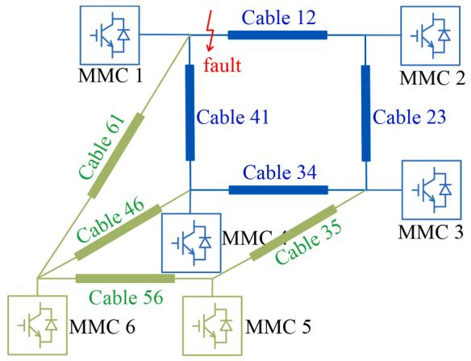  
Fig. 8. Schematic diagram of a six-terminal MMC-MTDC transmission system.

without dropping in several milliseconds. While the actual situation in simulation or project is that during the rapid discharge of the submodules, the voltage decreases with the decrease of stored energy. Our simplified method makes the voltage higher than actual situation. Therefore, analytical value is greater than simulation value. The specific calculation steps are as follows, and a flowchart is drawn in Appendix B to introduce the calculation method more clearly.

(1) The multi-terminal complex power grid is simplified as a twoterminal equivalent model according to the location of the fault point. The converter stations on the left and right sides of the fault point represent the equivalent converter stations for clockwise and anticlockwise discharge of all converter stations respectively.   
(2) From formula (2) to formula (5), it can be seen that the influence of short-circuit current and various electrical parameters on short-circuit current is proportional to the DC side voltage of the circuit. Therefore, the value of the voltage at both ends of the equivalent converter station is the same as the voltage of the nearest converter station at the left and right sides of the fault point.   
(3) Calculate the impedance value of discharge circuit of equivalent converter station A and equivalent converter station B respectively.   
(4) The discharge circuits of the equivalent converter stations on both sides of the fault point are independent, and the short-circuit current can be calculated by formula (2).

# 5. Simulation and experimental verification

In order to verify the correctness of the MMC short-circuit fault characteristics and the discharge characteristics of converter stations in multi-terminal complex power grids, a four-terminal symmetrical bipolar MMC–HVDC transmission system is built. The system structure is shown in Fig. 4. According to the influence law of MMC internal parameters on short-circuit current and the restriction of critical resistance value, the operation parameters are set as shown in Tables 1 and 2, the impedances of DC transmission lines is 0.86 mH/km, the resistances of DC transmission lines is 0.00995Ω/km, and the simulation step is 20 us. Converter station 2 adopts constant DC bus voltage and reactive power control mode, converter station 3 adopts constant active power and reactive power control mode, converter station 1 and converter station 4 both adopt constant AC voltage and active power control mode.

In addition, in order to verify the universality of short-circuit current calculation methods, a six-terminal MMC-HVDC transmission system is constructed, which is more representative in different grid structures, as shown in Fig. 8. The parameters and control methods of MMC 5 in the figure are the same as those of MMC 3, and those of MMC 6 are the same as those of MMC 4, cable 35 and cable 56 are the same as those of cable

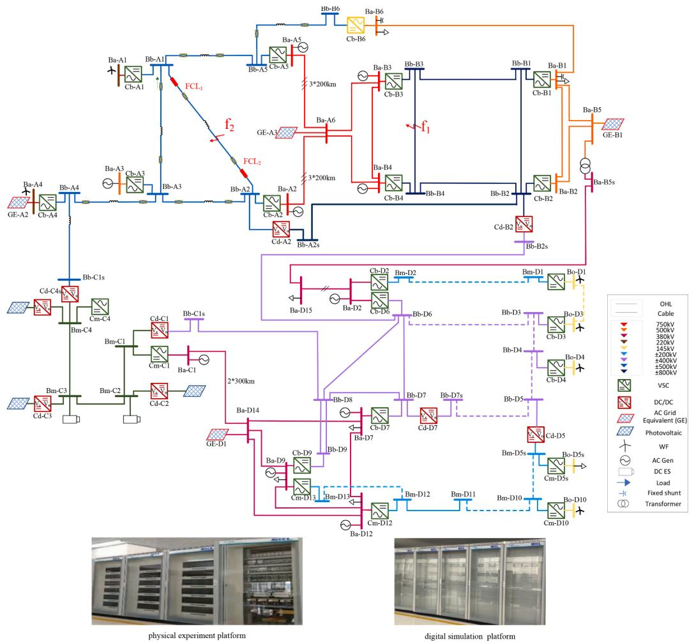  
Fig. 9. Digital - physical hybrid test model converter station.

Table 3 Parameters of digital - physical hybrid test model converter station.   

<table><tr><td></td><td colspan="2">Physical terminal</td><td colspan="2">Digital terminal</td></tr><tr><td></td><td>Cb-A1</td><td>Cb-A2</td><td>Cb-B3</td><td>Cb-B4</td></tr><tr><td>Converter station capacity</td><td>8107 VA</td><td>8107 VA</td><td>4400 MW</td><td>3600 MW</td></tr><tr><td>Number of bridge arm submodules</td><td>54</td><td>54</td><td>350</td><td>350</td></tr><tr><td>Sub-module capacitance</td><td>4400 μF</td><td>4400 μF</td><td>16.3 μF</td><td>16.3 μF</td></tr><tr><td>Bridge arm reactance</td><td>21 mH</td><td>21 mH</td><td>38 mH</td><td>38 mH</td></tr><tr><td>Equivalent resistance of bridge arm</td><td>0.441 Ω</td><td>0.441 Ω</td><td>350 Ω</td><td>350 Ω</td></tr></table>

Table 4 Major parameters of lines.   

<table><tr><td></td><td>Physical terminal</td><td>Digital terminal</td></tr><tr><td>Voltage level between positive and negative poles</td><td>±500 V</td><td>±800 kV</td></tr><tr><td>Line length /km</td><td>200</td><td>150</td></tr><tr><td rowspan="2">Line impedance value</td><td>R = 0.0158 Ω/km,</td><td>R = 0.01 Ω/km,</td></tr><tr><td>L = 0.416 mH/km</td><td>L = 0.82 mH/km</td></tr><tr><td>Smoothing reactor /mH</td><td>0</td><td>L34= 259, L43= 239</td></tr></table>

34 in the original four-terminal transmission model, and cable 46 and cable 61 are the same as those of cable 41 in the original four-terminal transmission model. It is assumed that a bipolar short-circuit fault occurs at the end of line 12 and the outlet of MMC 1.

Furthermore, the digital physical hybrid experimental platform is built as shown in Fig. 9. The physical experiment platform and the digital simulation platform are connected through the digital-to-analog conversion device and the power interface. The connection structure

diagram is shown in Appendix C. The physical platform is composed of primary main circuit and hierarchical control system. The main circuit mainly includes converter transformer, AC/DC system model, reactor, converter, DC line model and measurement system. The digital platform mainly includes AC/DC system model, MMC and controller A nonmetallic bipolar short-circuit fault with a transition resistance of 20 Ω is set at the midpoint of the line of the digital terminal Cb-B3 converter station and Cb-B4 converter station, as shown at $\mathrm { f } _ { 4 }$ in Fig. 9. The

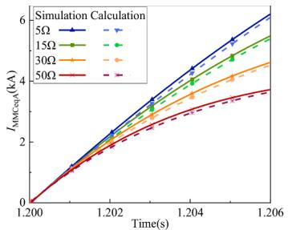

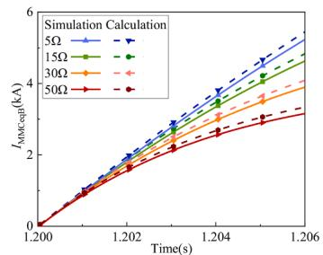

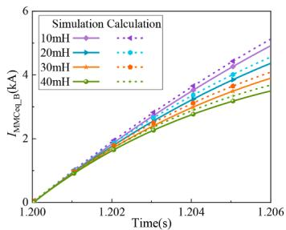

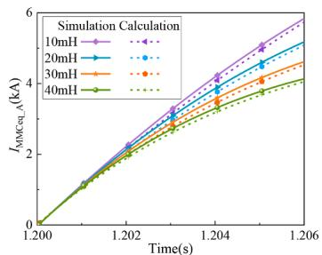  
  
Fig. 10. Effection of resistance and inductance on MMC short-circuit current; (a) Influence of resistance variation on short-circuit current of left equivalent converter station, (b) Influence of resistance variation on short-circuit current of right equivalent converter station, (c) Influence of inductance variation on short-circuit current of left equivalent converter station, (d) Influence of inductance variation on short-circuit current of right equivalent converter station.

converter station parameters are shown in Table 3 and the line parameters are shown in Table 4. The DC side of physical terminal is grounded through large resistance, R = 200 kΩ. The DC side of digital terminal is grounded through small resistance, R = 0.03 Ω.

# 5.1. Simulation and verification of MMC fault characteristics

Taking the non-metallic short-circuit fault occurring at model $\mathbf { f } _ { 1 }$ in Fig. 4 as an example. And grid 1 is equivalent to verify the short-circuit characteristics of MMC. According to the system parameters, the critical resistance of the discharge circuit of converter stations on both sides can

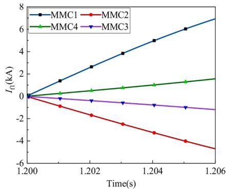

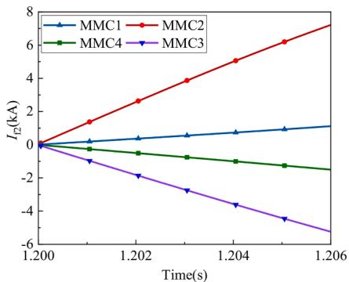  
(a) Outlet current of converter station at fault $\mathrm { f _ { l } }$

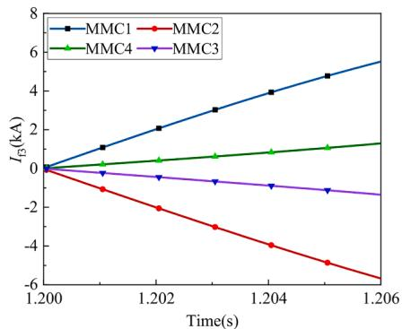  
(b) Outlet current of converter station at fault f2   
(c) Outlet current of converter station at fault fs   
Fig. 11. Output current of converter station; (a) Outlet current of converter station at fault $\mathrm { f _ { 1 } , }$ (b) Outlet current of converter station at fault $\mathrm { f } _ { 2 } ,$ (c) Outlet current of converter station at fault $\mathrm { f } _ { 3 } .$ .

be calculated, and the critical resistance values are about 53.68 Ω and 77.90 Ω respectively. In order to ensure that the system does not enter the overdamped discharge state after a fault, the discharge current of converter stations on both sides is calculated based on the simulation model and analytical expression during the change of the resistance value from 5 Ω to 50 Ω. The results are shown in Fig. 10.

It can be seen from Fig. 10 that with the increase of resistance and inductance parameters, the growth trend of the discharge current of the equivalent converter station after the fault gradually slows down, which is consistent with the above analysis results. In addition, in order to prevent the system from entering a non-oscillatory discharge state after a fault, the resistance should be less than the critical resistance value of the system, or the fault line should be disconnected immediately.

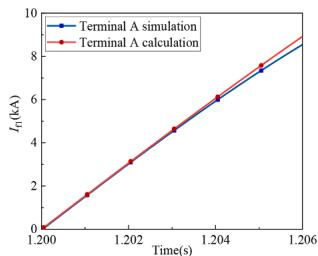  
(a)

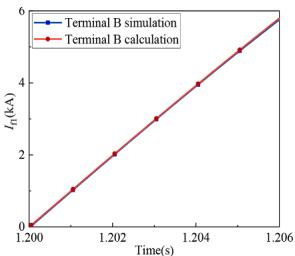  
(b)

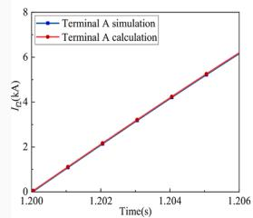

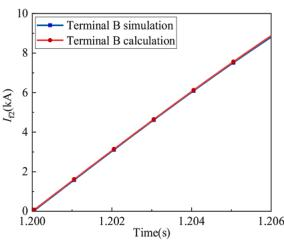

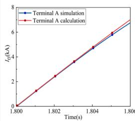  
(e)

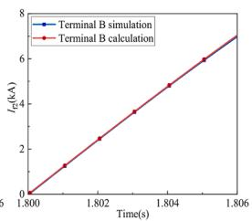  
(f)   
Fig. 12. Fault current comparison at different locations; (a) Short-circuit current of the left equivalent converter station in case of fault at f , (b) Short-circuit current of the right equivalent converter station in case of fault at $\mathrm { f } _ { 1 } , ( \mathrm { c } )$ Shortcircuit current of the left equivalent converter station in case of fault at $\mathrm { f } _ { 2 } ,$ (d) Short-circuit current of the right equivalent converter station in case of fault at $\mathbf { f } _ { 2 } ,$ (e) Short-circuit current of the left equivalent converter station in case of fault at $\mathrm { f } _ { 3 } ,$ (f) Short-circuit current of the right equivalent converter station in case of fault at $\mathbf { f } _ { 3 . }$

# 5.2. Simulation and verification of discharge characteristics of multiterminal network converter station

Three fault locations at both ends of the same line and at the midpoint of another line of the four-terminal ring transmission network are selected for analysis. Namely, $\mathbf { f } _ { 1 }$ at the outlet of converter station 1, $\mathbf { f } _ { 2 }$ at the outlet of converter station 2 and $\mathbf { f } _ { 3 }$ at the midpoint of the transmission line are demonstrated in Fig. 4. The current is measured at the outlet of each MMC, and the clockwise direction is the positive

direction. The simulation results are shown in Fig. 11.

When f or $\mathbf { f } _ { 3 }$ is in fault, the output current amplitude of MMC 3 and MMC 4 is almost the same and the direction is opposite. Therefore, under $\mathbf { f } _ { 1 }$ or $\mathbf { f } _ { 3 }$ fault conditions, the anticlockwise discharge of MMC 4 can be replaced by the anticlockwise discharge of MMC 3. Similarly, after fault at $\mathbf { f } _ { 2 } ,$ the output current amplitude of MMC 1 and MMC 4 is approximately the same and the direction is opposite. The anticlockwise discharge of MMC 4 and the clockwise discharge of MMC 1 can replace each other, which further verifies the correctness of the simplified equivalent method proposed in Section 2.

# 5.3. Experimental verification of short-circuit current calculation method

In order to verify the correctness of the simplified equivalent mode of the network and the analytical expression of short-circuit current under different fault location conditions, three fault locations of four-terminal ring transmission network, namely $\mathrm { f } _ { 1 } , \mathrm { f } _ { 2 }$ and $\mathbf { f } _ { 3 }$ in Fig. 4, are selected for analysis.

For different fault locations, based on the two-terminal equivalent discharge model, the short-circuit current of bipolar short-circuit fault is calculated. The specific process of substituting the relevant parameters into the analytical calculation formula is shown in Appendix D. The results are exhibited in Fig. 12. When the fault occurs at $\mathbf { f } _ { 1 } ,$ , the maximum error between the simulation value and the analytical calculation value of the equivalent converter station on the left side of the fault point and the equivalent converter station on the right side of the fault point are 4.53% and 0.74% respectively. The maximum errors of left and right equivalent converter stations are 0.84% and 0.69% respectively in case of the fault at $\mathbf { f } _ { 2 } .$ The maximum errors of left and right equivalent

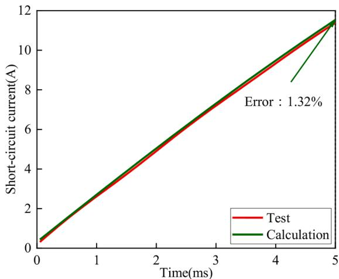  
Fig. 14. Comparison diagram of short-circuit current experimental values and calculation values at $\mathrm { f } _ { 4 } .$ .

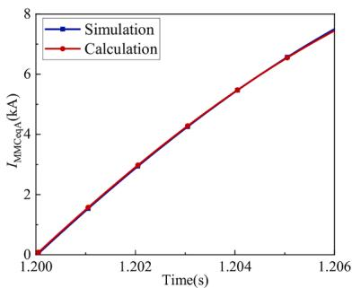  
(a)

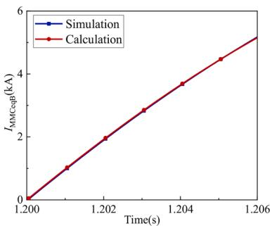  
(b)   
Fig. 13. Pole to ground fault short-circuit current in six-terminal transmission system; (a) Short-circuit current of $\mathrm { M M C _ { e q } \ A } ,$ (b) Short-circuit current of $\mathbf { M M C _ { e q } }$ B.

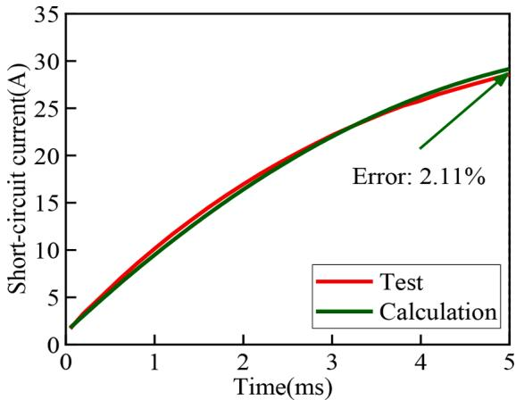  
Fig. 15. Comparison diagram of short-circuit current experimental values and calculation values at $\mathbf { f } _ { 5 } .$

converter stations are 3.70% and 1.01% respectively in case of the fault at $\mathrm { f } _ { 3 } .$ The difference between the analytical value and the simulation value of short-circuit current at three different fault points is less than 4.6%, which further proves that the analytical expression of short-circuit current proposed in this paper can accurately describe the characteristics of bipolar short-circuit fault current.

In addition, according to the comparison between the analytical value of short-circuit current and the simulation value, the short-circuit current calculated by the fault current analytical method proposed in this paper is greater than the simulation value. Therefore, in the process of power electronic device selection and parameter setting, electronic device selection based on the above analytical calculation results can more effectively ensure the safety of components and the reliability of MMC–HVDC transmission system operation.

When a pole-to-ground fault occurs at any position of the sixterminal transmission system, the discharge current of the equivalent converter stations on both sides of the fault point is calculated using the calculation method mentioned in the previous section and compared with the simulation value. The results are shown in Fig. 13. It can be seen that the simplified calculation method still has high accuracy for the complex MMC-MTDC power grid with multiple ring structures.

The digital physical hybrid experiment platform is exhibited in Fig. 9. According to the calculation method proposed in Section $^ { 3 , }$ calculate the DC line parameters Ldc1, Rdc1, Ldc2, Rdc2 in the equivalent circuit, and the equivalent parameters $L _ { 3 } , R _ { 3 } , L _ { 4 } , R _ { 4 }$ of converter stations on both sides of the fault. The digital terminal and the physical terminal are connected through the AC system, and there is no direct current flow between them. Therefore, the digital network with ± 800 kV voltage level and the physical network with ± 500 V voltage level can be separated during analytical calculation.

The converter station and fault line parameters on both sides are brought into formula (2) respectively, the current flowing through the lines on both sides of the fault is calculated, and compared with the experimental measured values. The results are shown in Fig. 14. It can be seen from Fig. 14 that the error between the analytical calculation value and the experimental value is small, which verifies the correctness of the analytical calculation method of fault current.

Further, bipolar short-circuit fault is set at the midpoint of Cb-A1 and Cb-A2 lines in the physical end experimental model converter station, as shown at $\mathbf { f } _ { 5 }$ in Fig. 9. The parameters of each converter station at the physical end are the same, they are all half bridge type MMC, and symmetrical unipolar wiring is adopted.

The analytical calculation value is compared with the physical dynamic simulation experiment value, and the result is shown in Fig. 15. It can be seen from Fig. 15 that the calculated value almost coincides with the experimental value, indicating that the decoupling calculation

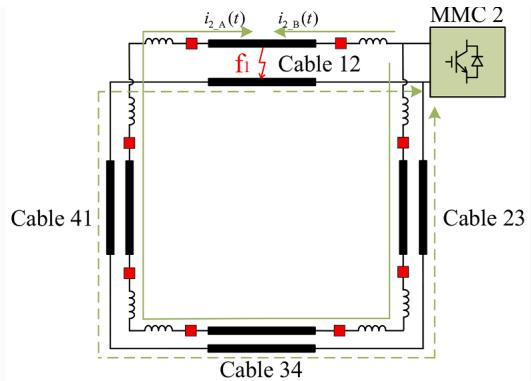

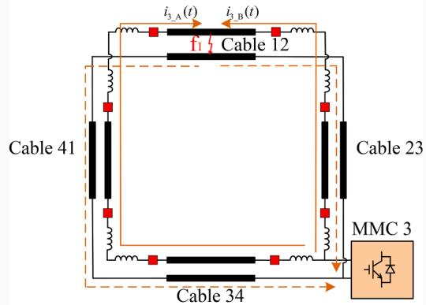  
(a)

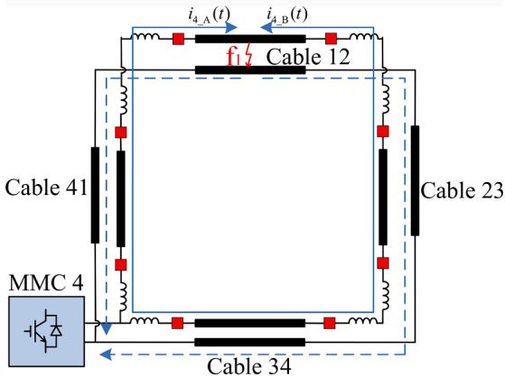  
  
（c）  
Fig. A.1. Schematic diagram of MMC discharge current circuit; (a) Schematic diagram of MMC 2 discharge current circuit, (b) Schematic diagram of MMC 3 discharge current circuit, (c) Schematic diagram of MMC 4 discharge current circuit.

method can accurately characterize the DC side short-circuit fault current characteristics of the MMC-MTDC network.

# 6. Conclusion

In view of the difficulty in solving the DC side short-circuit current of MMC-MTDC transmission system, a general calculation method of shortcircuit current based on network simplified equivalence is proposed on the basis of the existing methods for solving the short-circuit current, taking full account of the discharge effect of capacitors in the discharge circuit on the fault point and the maintenance effect of the reactor shortcircuit current. According to the mutual influence mechanism of the discharge current of each converter station when the DC side of MMC-

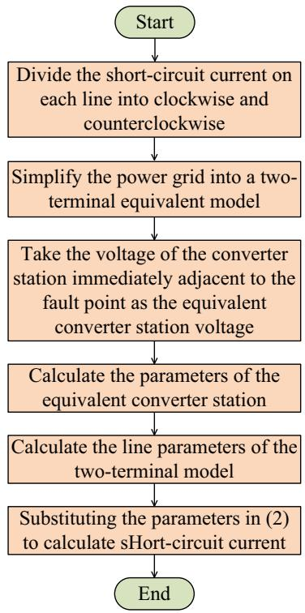  
Fig. B.1. Flowchart of short-circuit current calculation process.

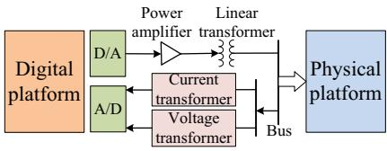  
Fig. C.1. Schematic diagram of digital - physical hybrid simulation experiment platform connection.

MTDC is short-circuited, the clockwise and anticlockwise discharge of

# Appendix A

Fig. A.1.

# Appendix B

Fig. B.1.

# Appendix C

The digital-physical hybrid simulation experiment platform is mainly composed of three parts: digital platform, physical platform and power interface, and its structure is shown in Fig. C.1.

The digital platform mainly includes an AC system connected with the MMC, which runs on a real-time digital simulator; In the process of simulation operation, the digital simulator needs to complete the acquisition of external signals, the real-time solution of the model and the excitation of the physical side converter in each simulation step. The physical platform mainly includes converter transformer, bridge arm reactor and converter valve constructed according to a certain principle of equivalence, so as to realize the dynamic physical simulation of DC system. The power interface subsystem connects the digital simulation system and the physical simulation system. It realizes the transmission and exchange of energy and signal between the two subsystems by the interface hardware device and the interface algorithm. In which the interface hardware device includes D/A(A/D) converter, four quadrant power amplifier and voltage (current) transformer and other devices.

all converter stations to the fault point is equivalent to a two-terminal model for discharge, which realizes the simplified equivalence of the multi-terminal transmission network. Further, based on the above theoretical analysis, an MMC-MTDC transmission model and a digital physical hybrid experimental platform are built through PSCAD/ EMTDC simulation platform to simulate and analyze the short-circuit current of different fault locations, different simplification methods and multi-terminal transmission networks. The experimental results show that the analytic value of fault current is consistent with the simulation value, which verifies the correctness of the analytic expression of fault current and the effectiveness of the network simplification method.

# Funding

This work was supported by the National Natural Science Foundation of China Key Project [grant number U2066210].

# CRediT authorship contribution statement

Zhuoya Wang: Conceptualization, Data curation, Formal analysis, Methodology, Resources, Validation, Writing – original draft, Writing – review & editing. Liangliang Hao: Conceptualization, Investigation, Project administration, Supervision, Writing – review & editing. Le Wang: Conceptualization, Writing – review & editing. Jinghan He: Conceptualization, Funding acquisition, Supervision, Writing – review & editing.

# Declaration of Competing Interest

The authors declare the following financial interests/personal relationships which may be considered as potential competing interests: Liangliang Hao reports financial support and article publishing charges were provided by The National Natural Science Foundation of China Key Project (No.U2066210).

# Data availability

Data will be made available on request.

# Appendix D

In Fig. $^ { 4 , }$ a short-circuit fault occurs at $\mathbf { f } _ { 1 } ,$ and the specific process of solving the short-circuit current by using the general calculation method proposed in this paper is as follows.

Firstly, the multi-terminal complex power grid is simplified to a two-terminal equivalent model, as shown in Fig. 7. Thus, equal grid A and equal grid B represent clockwise and anticlockwise discharge of all converter stations respectively. And then, the equal parameters are calculated. The following shows the parameter calculation process of equal grid A.

$$
U _ {\mathrm {d c A}} = U _ {\mathrm {d c l}} = 2 \times 5 0 0 = 1 0 0 0 \mathrm {k V} \tag {D.1}
$$

$$
L _ {\mathrm {A}} = 2 \times 0. 0 7 5 = 0. 0 5 \mathrm {H} \tag {D.2}
$$

$$
R _ {\mathrm {A}} = 2 \times 0. 5 = 1 \Omega \tag {D.3}
$$

$$
C _ {\mathrm {A}} = \frac {1}{2} \times 1 0 = 5 \mu \mathrm {F} \tag {D.4}
$$

$$
L _ {\mathrm {d c}} = 2 \times 0. 2 \times 2 = 0. 8 \mathrm {H} \tag {D.5}
$$

$$
R _ {\mathrm {d c}} = 2 \times 0. 0 0 1 = 0. 0 0 2 \Omega \tag {D.6}
$$

Substitute the parameters into formula (2).

$$
\begin{array}{l} i _ {\mathrm {A}} (t) = \frac {1 0 0 0}{\sqrt {\frac {2 \times 2 4 4 \times (2 \times 0 . 0 5 + 3 \times 0 . 8) - 0 . 0 0 5 \times (2 \times 1 + 3 \times 0 . 8) ^ {2}}{3 6 \times 0 . 0 0 5}}} e ^ {- \frac {t}{\frac {4 \times 0 . 1 5 + 6 \times 0 . 2}{2 \times 1 + 3 \times (0 . 8 + 5)}}}. \\ \sin \left(\sqrt {\frac {2 \times 2 4 4 \times (2 \times 0 . 0 5 + 3 \times 0 . 8) - 0 . 0 0 5 \times (2 \times 1 + 3 \times 0 . 8) ^ {2}}{4 \times 0 . 0 0 5 \times (2 \times 0 . 0 5 + 3 \times 0 . 8) ^ {2}}} t\right) \\ \end{array}
$$

The short-circuit current of equal grid B can be obtained in the same way.

# References

[1] W. Sima, Z. Fu, M. Yang, et al., A novel active mechanical HVDC breaker with consecutive interruption capability for fault clearances in MMC-HVDC systems, IEEE Trans. Ind. Electron. (2018), 1-1.   
[2] J. Hu, J. Zhu, M. Wan, Modeling and analysis of modular multilevel converter in DC voltage control timescale, IEEE Trans. Ind. Electron. 66 (8) (2019) 6449–6459.   
[3] P. Wang, X.P. Zhang, P.F. Coventry, et al., Start-up control of an offshore integrated MMC multi-terminal HVDC system with reduced DC voltage, IEEE Trans. Power Syst. 31 (4) (2015) 1–12.   
[4] J. Liu, N. Tai, C. Fan, et al., A hybrid current-limiting circuit for DC line fault in multi-terminal VSC-HVDC system, IEEE Trans. Ind. Electron. (2017). 1-1.   
[5] E. Kontos, P. Bauer, Reactor design for DC fault ride-through in MMC-based multiterminal HVDC grids, in: 2016 IEEE 2nd Annual Southern Power Electronics Conference, IEEE, 2016.   
[6] T. Westerweller, K. Friedrich, U. Armonies, et al., Transbay cable world’s first HVDC system using multilevel voltage sourced converter, in: Proceedings of CIGRE, Paris, France, CIGRE, 2010.   
[7] S. Dennetiere, H. Saad, B. Clerc, et al., Validation of a MMC model in a real-time simulation platform for industrial HIL tests, in: Proceedings of 2015 IEEE Power & Energy Society General Meeting, Denver, USA, 2015.   
[8] P. Lewis, B. Grainger, H. Hassan, et al., Fault section identification protection algorithm for modular multilevel converter based high voltage DC with a hybrid transmission corridor[J], IEEE Trans. Ind. Electron. (2016), 1-1.   
[9] F. Deng, Y. Tian, R. Zhu, et al., Fault-tolerant approach for modular multilevel   
[10] B. Li, S. Zhou, D. Xu, et al., An improved circulating current injection method for modular multilevel converters in variable-speed drives, IEEE Trans. Ind. Electron. 63 (11) (2016), 1-1.   
[11] P.T. Lewis, B.M. Grainger, H.A.A. Hassan, et al., Fault section identification protection algorithm for modular multilevel converter-based high voltage DC with a hybrid transmission corridor, IEEE Trans. Ind. Electron. 63 (9) (2016) 5652–5662.   
[12] Y. Xue, Z. Xu, On the bipolar MMC-HVDC topology suitable for bulk power overhead line transmission: configuration, control, and DC fault analysis, IEEE Trans. Power Deliv. 29 (6) (2014) 2420–2429.   
[13] W. Leterme, J. Beerten, D.V Hertem, Equivalent circuit for half-bridge MMC dc fault current contribution, in: Energy Conference, IEEE, 2016.   
[14] Z. Zhang, Z. Xu, Short-circuit current calculation and performance requirement of HVDC breakers for MMC-MTDC systems, IEEJ Trans. Electr. Electron. Eng. 11 (2) (2016) 168–177.

[15] Z. Xu, Q. Tu, M. Guan, et al., Voltage Source Converter Based HVDC Power Transmission Systems (Second Edition), China Machine Press, Beijing, 2016, pp. 212–218, in Chinese.   
[16] G. Tang, Z. Xu, Y. Zhou, Impacts of three MMC-HVDC configurations on AC system stability under DC line faults, IEEE Trans. Power Syst. 29 (6) (2014) 3030–3040.   
[17] X. Han, W. Sima, M. Yang, et al., Transient Characteristics under ground and shortcircuit faults in a 500 kV MMC-based HVDC system with hybrid DC circuit breakers, IEEE Trans. Power Deliv. (99) (2018), 1-1.   
[18] U.N. Gnanarathna, A.M. Gole, R.P Jayasinghe, Efficient modeling of modular multilevel HVDC converters (MMC) on electromagnetic transient simulation programs, IEEE Trans. Power Deliv. 26 (1) (2011) 316–324.   
[19] G. Li, J. Liang, C.E. Ugalde-Loo, et al., Dynamic interactions of DC and AC grids Control Conference, IEEE, 2016.   
[20] J. Chen, B. Li, B. Dong, et al., Simulation and analysis of fault characteristics of the MMC-HVDC system under bipolar connection mode, in: Power & Energy Engineering Conference, IEEE, 2016.   
[21] E. Kontos, P. Bauer, Analytical model of MMC-based multi-terminal HVDC grid for normal and DC fault operation, in: Power Electronics & Motion Control Conference, IEEE, 2016.   
[22] M. Bucher, C. Franck, Analytic approximation of fault current contribution from AC networks to MTDC networks during pole-to-ground faults, IEEE Trans. Power Deliv. 31 (1) (2016) 20–27.   
[23] X. Pei, G. Tang, S. Zhang, et al., Analysis on transient characteristics of short-circuit current for bipolar VSC-based DC grid, J. Global Energy Interconnection (04) (2018) 403–412. Chinese.   
[24] P. Torwelle, A. Bertinato, B. Raison, et al., Fault current calculation in MTDC grids considering MMC blocking, Electric Power Syst. Res. (2022) 207. Jun.   
[25] P. Sun, Z. Jiao, H. Gu, Calculation of short-circuit current in DC distribution system based on MMC linearization, Front. Energy Res. (2021).   
[26] C. Li, C. Zhao, J. Xu, et al., A pole-to-pole short-circuit fault current calculation method for DC grids, IEEE Trans. Power Syst. (2017), 1-1.   
[27] G. Shilin, Y. Hua, L. Yutian, Accurate and efficient estimation of short-circuit current for MTDC grids considering MMC control, IEEE Trans. Power Deliv. 35 (3) (2019) 1541–1552.   
[28] Z. Zheren, X. Zheng, et al., Short-circuit current calculation and performance requirement of HVDC breakers for MMC-MTDC systems, IEEJ Trans. Electr. Electron. Eng. 11 (2) (2015) 168–177.   
[29] H. Jia, J. Yin, T. Wei, et al., Short-circuit fault current calculation method for the multi-terminal DC grid considering the DC circuit breaker, Energies (2020) 13.   
[30] M. Langwasser, G. De Carne, M. Liserre, et al., Fault current estimation in multiterminal HVDC grids considering MMC control, IEEE Trans. Power Syst. (3) (2018), 1-1.