ORIGINAL RESEARCH OPEN ACCESS

# Transient Electromagnetic Power Compensation-Based Adaptive Inertia Control Strategy for Parallel Energy Storage VSC

Denghui Hu1 Xiaoling Su1 Zhengkui Zhao1 Laijun Chen1,2

1 Key Laboratory of Smart Operation of New Energy Power System, Ministry of Education, Qinghai University, Xining, China 2Department of Electrical Engineering, Tsinghua University, Beijing, China

Correspondence: Xiaoling Su (suxiaoling@qhu.edu.cn)

Received: 7 July 2025 Revised: 10 October 2025 Accepted: 17 November 2025

# ABSTRACT

Voltage Source Converter-based Energy Storage System (VSC-ESS) integration face technological obstacles like active power oscillations during the frequency regulation process for power system frequency management. Such problems are more prominent in parallel VSC-ESS. To address this, this paper introduces a transient electromagnetic power compensation control strategy for parallel VSC-ESS to suppress the overshooting and oscillations during the frequency response. First, a comprehensive investigation of the state-space equations and transfer functions for parallelled VSC-ESS elucidates the influence of key control parameters on both system stability and frequency response characteristics. Then, in order to improve the dynamic response performance, an adaptive inertia control approach is devised. Simulation and experimental results verify the effectiveness and feasibility of the proposed control.

# 1 Introduction

As synchronous generators (SGs) are being replaced by new energy generation gradually, power system sees an increasing number of problems caused by low inertia and weak damping [1–3]. For a weak system, where frequency deviation (FD) and the rate of change of frequency (RoCoF) are significantly high. It is inevitable for power electronic devices like VSC-ESS achieve a rapid frequency response [4, 5] and provide active support capability [6–8].

Grid-connected VSC-ESS incorporates the rotor mechanical equations of SGs, exhibiting operational characteristics similar to SGs. This strategy with configurable parameters offers superior operational flexibility and dynamic response capabilities [9, 10]. It also brings the oscillation characteristic of the SGs, because it incorporates the rotor mechanical equations of SGs [11, 12]. As SGs utilise materials with superior electrical conductivity

and thermal dissipation properties, their overload capacity gives significant merits to suppress the oscillations [13]. However, VSC with power electronics at its interface has a restricted overload capacity, making it susceptible to active power oscillations [14], which in turn impacts its frequency support capabilities due to its active power-frequency characteristics [15]. Parallel VSC-ESS have higher redundancy and scalability when compared to individual converters, making them a vital enabling technology for supporting future power grids [16, 17]. However, angular acceleration differences between parallel VSC units during frequency response might predispose them to frequency oscillation problems [10, 18, 19].

FD and RoCoF are two critical indicator factors for VSC-ESS; overlarge FD and RoCoF frequently activate anti-islanding protection, resulting in parallel VSC-ESS disconnection [20]. The inertia of the system has a significant impact on these two essential factors [16].

To alleviate the frequency instability. The small-signal dynamics of active power and frequency oscillations in a parallel VSC are analysed by a rigorous methodology comprising statespace modelling, pole locus analysis, and droop characteristic assessment in [14]. A recognised method whereby oscillation suppression via an increased damping coefficient can compromise primary frequency regulation. Subsequent strategies like transient damping control alleviate this compromise and improve damping but fail to resolve concomitant challenges of power overshoot and extended transient response [21, 22]. References [23, 24] improve the dynamic response capabilities of parallel VSC-ESS by improving the communication architecture and the linkages between nearby units’ control parameters; as a result, the linked systems are more complicated and prone to instability. The active feedforward compensation strategy in Reference [25], while effective in damping transient active power oscillations, has the counterproductive effect of generating new oscillations in the steady-state frequency. A transient electromagnetic power control strategy is introduced within the parallel VSC-ESS to suppress active power oscillations in [26]. Beyond effectively mitigating active power oscillations, this strategy confers significant improvements in the system’s dynamic response, notably achieving a faster response time and enhanced transient power output. However, the analysis of its frequency response characteristics under grid frequency disturbances has not been conducted. The aforementioned control strategies primarily address the overshoot and oscillation issues, which are related to active power frequency, but ignore the impact of the RoCoF on VSC.

In addition to feedback control, adaptive inertia control is an approach for improving the dynamic frequency response of parallel VSCs [27, 28]. But an adaptive algorithm requires accurate grid frequency detection. However, frequency is a spatially distributed variable in large-scale power systems [29]; thus, a localised measurement may not accurately reflect the global dynamic state required for effective control. The work in [30, 31] introduces a coordinated control framework based on multi-parameter adaptation that aims to reduce active power oscillations in parallel VSC configurations. In addition, according to References [30, 31], a weak grid has little effect on the transient recovery speed of parallel VSC systems during frequency disturbances, but it dramatically increases the amplitude of active power and frequency overshoot. An adaptive method based on the 2-norm is proposed in [16], reflecting the coupling relationship between virtual inertia and damping coefficients of each VSC during the frequency response process. Consequently, the coordinated control of virtual inertia and damping, guided by this method, yields improvements in both the dynamic stability and frequency response of parallel VSC systems. The approaches discussed above are usually characterised by elaborate designs, and their adaptive control schemes have inherent limits in suppressing overshoot and oscillations under frequency disturbances, failing to achieve total transient stability for parallel VSC systems.

In summary, in the event of grid disturbances, longer reaction times, overlarge frequency nadir, and RoCoF all necessarily reduce the efficiency of frequency support. [32]. Current research on the frequency dynamics of parallel VSC systems suffers from two fundamental limitations: a lack of understanding of the inter-converter frequency coupling mechanisms, and the frequency response should consider more key indicators, such

as response time, frequency deviation, and RoCoF. To overcome these restrictions, the primary contributions of this study are as follows:

1. A mathematical model of the parallel VSC-ESS is established; utilising the state space small-signal model of the parallel VSC-ESS, the impact of virtual inertia damping, compensation coefficients, and time constants on the system’s frequency response characteristic is analysed.   
2. Based on the amplitude-frequency characteristic curve and pole locus of the parallel VSC-ESS, this paper analyses the interactions between parameters of different VSC-ESSs and their impacts on system frequency response.   
3. By comparing the system frequency response characteristics before and after implementing transient electromagnetic control. An adaptive coefficient is designed to adjust the inertia parameter dynamically during the frequency response process. It is revealed that the proposed adaptive inertia control can reduce the maximum RoCoF and frequency response time.

# 2 Stability of Parallel VSC-ESS

# 2.1 Topology of Parallel VSC-ESS

Figure 1 depicts the primary circuit and control topology of the parallel VSC-ESS. $L _ { i }$ and $R _ { i }$ are the equivalent inductance and resistance of the VSC-ESS to the grid, respectively; $V _ { \mathrm { d c } i }$ is the DC side voltage of the energy storage system; $I _ { \mathrm { c } i }$ is the VSC-ESS output current; $U _ { \mathrm { c } i }$ and $\delta _ { i }$ are the VSC-ESSi output voltage and voltage phase, respectively; and $U _ { \mathrm { g } }$ is the grid voltage.

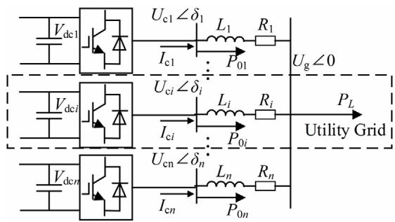

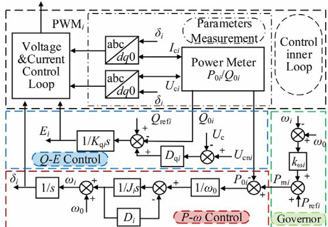  
(a) Simplified main circuit of parallel VSC-ESS   
(b) Control block diagram of parallel VSC-ESS   
FIGURE 1 Topology of parallel VSC-ESS.

The VSC-ESSi control system is made up of two major components: active-frequency control in Equation (1) replicates inertial damping characteristics as SGs, and reactive-voltage control in Equation (2) performs voltage regulation by modelling the excitation characteristics as SGs.

$$
\left\{ \begin{array}{l} J _ {i} \frac {\mathrm {d} \Delta \omega_ {i}}{\mathrm {d} t} = \frac {P _ {\mathrm {m} i}}{\omega_ {0}} - \frac {P _ {0 i}}{\omega_ {0}} - D _ {i} \left(\omega_ {i} - \omega_ {0}\right) \\ P _ {\mathrm {m} i} = P _ {\text {r e f} i} + k _ {\omega i} \left(\omega_ {0} - \omega\right) \end{array} \right. \tag {1}
$$

where $J _ { i } , D _ { i } ,$ and $k _ { \omega i }$ are the virtual inertia, virtual damping, and frequency modulation coefficient, respectively. $\omega _ { i } , \omega _ { 0 }$ , and $\Delta \omega _ { i }$ are the output angular frequency, rated frequency, and the difference between them of the VSC-ESSi, respectively; $P _ { \mathrm { r e f } i }$ is the active power reference value, $P _ { { \mathrm m } i }$ is the mechanical power, and $P _ { 0 i }$ is the output active power of VSC-ESS .

$$
E _ {i} = \frac {1}{K _ {\mathrm {q i}} s} \left[ Q _ {\text {r e f} i} - Q _ {0 i} + D _ {\mathrm {q i}} \left(U _ {\mathrm {c n} i} - U _ {\mathrm {c}}\right) \right] \tag {2}
$$

where $K _ { \mathfrak { q } i }$ is the integration coefficient, $Q _ { \mathrm { { r e f } } i }$ is the reference value of reactive power, $Q _ { 0 i }$ is the output reactive power of VSC-$\mathrm { E S S } _ { i } . \ D _ { { \mathrm { q } } i }$ is the reactive voltage regulation coefficient, $U _ { \mathrm { c n } i }$ is the reference value of voltage magnitude, and $E _ { i }$ is the internal potential.

# 2.2 Stability Analysis of Parallel VSC-ESS

According to Figure 1(a), the VSC-ESS output power $P _ { 0 i }$ is [29]:

$$
\left\{ \begin{array}{l} P _ {0 i} = \frac {3 U _ {\mathrm {c} i} U _ {\mathrm {g}} \sin \delta_ {i}}{2 \omega_ {0} L _ {i}} \approx \frac {3 U _ {\mathrm {c} i} U _ {\mathrm {g}}}{2 X _ {i}} \delta_ {i} \approx K _ {i} \delta_ {i} \\ \delta_ {i} = \int \left(\omega_ {i} - \omega_ {\text {b u s}}\right) d t \end{array} \right. \tag {3}
$$

where $\omega _ { \mathrm { b u s } }$ is the AC bus frequency, $K _ { i } = 1 . 5 U _ { \mathrm { c } i } U _ { \mathrm { g } } / X _ { i } ;$ ; in the case of a small perturbation, the phase $\delta _ { i }$ varies less, and sinδ ≈ $\delta _ { i } .$ .

Combining Equation (1) and Equation (3), s is the complex frequency in the Laplace domain, and a is a small-signal quantity. The Taylor expansion of the equation at the rated state is obtained and subsequently linearised, and the DC and quadratic differential components on both sides of the equation are ignored. The small-signal expression of the parallel VSC-ESS can be obtained.

$$
\left\{ \begin{array}{l} J _ {i} \omega_ {0} s \Delta \omega_ {i} = - \Delta P _ {0 i} - \left(D _ {i} \omega_ {0} + k _ {\omega i}\right) \Delta \omega_ {i} \\ \Delta P _ {0 i} = K _ {i} \Delta \delta_ {i} = K _ {i} \frac {\Delta \omega_ {i} - \Delta \omega_ {\mathrm {b u s}}}{\Delta \omega_ {i}} \end{array} \right. \tag {4}
$$

Figure 2 depicts an active closed-loop equivalent control block diagram of VSC-ESS based on Equations (3) and (4).

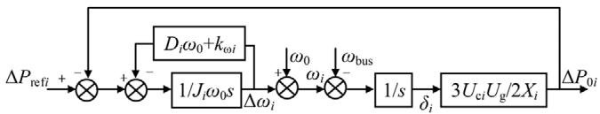  
FIGURE 2 Structure of active closed-loop control of VSC-ESS .

From Equation (4), the transfer functions $\Delta \omega _ { i } ( s ) / \Delta \omega _ { \mathrm { b u s } } ( s )$ and $\Delta P _ { L } \left( s \right) / \Delta \omega _ { \mathrm { b u s } } ( s )$ are expressed as:

$$
\left\{\begin{array}{l}\frac {\Delta \omega_ {i} (s)}{\Delta \omega_ {\mathrm {b u s}} (s)} = \frac {K _ {i}}{J _ {i} \omega_ {0} s ^ {2} + \left(D _ {i} \omega_ {0} + k _ {\omega i}\right) s + K _ {i}}\\\Delta P _ {L} = \Delta P _ {0 1} + \dots \Delta P _ {0 i} + \dots \Delta P _ {0 n}\\\frac {\Delta P _ {L} (s)}{\Delta \omega_ {\mathrm {b u s}} (s)} = - \left[ \right. \sum_ {i = 1} ^ {n} \frac {K _ {i} \left(J _ {i} \omega_ {0} s + D _ {i} \omega_ {0} + k _ {\omega i}\right)}{J _ {i} \omega_ {0} s ^ {2} + \left(D _ {i} \omega_ {0} + k _ {\omega i}\right) s + K _ {i}}\end{array}\right. \tag {5}
$$

where $\Delta P _ { L }$ is the sum of the output power of all VSC-ESSs.

According to Figure 2 and Equation (5), the frequency response closed-loop transfer function $\Delta \omega _ { i } ( s ) / \Delta P _ { L } ( s )$ of the VSC-ESS is rearranged as

$$
\left\{ \begin{array}{l} \frac {\Delta \omega_ {i} (s)}{\Delta P _ {L} (s)} = - \frac {G _ {i} (s)}{\sum_ {m = 1} ^ {n} G _ {m} (s) \left(J _ {m} \omega_ {0} s + D _ {m} \omega_ {0} + k _ {\omega m}\right)} \\ G _ {i} (s) = \frac {K _ {i}}{J _ {i} \omega_ {0} s ^ {2} + \left(D _ {i} \omega_ {0} + k _ {\omega i}\right) s + K _ {i}} \\ G _ {m} (s) = \frac {K _ {m}}{J _ {m} \omega_ {0} s ^ {2} + \left(D _ {m} \omega_ {0} + k _ {\omega m}\right) s + K _ {m}} \end{array} \right. \tag {6}
$$

Finally, the parallel system state-space model containing the complete line parameters is expressed as follows (7)

$$
\left\{ \begin{array}{l} \frac {\mathrm {d} \boldsymbol {x} _ {1}}{\mathrm {d} t} = \boldsymbol {A} _ {1} \boldsymbol {x} _ {1} + \boldsymbol {B} _ {1} \boldsymbol {u} _ {1} \\ \boldsymbol {y} _ {1} = \boldsymbol {C} _ {1} \boldsymbol {x} _ {1} + \boldsymbol {D} _ {1} \boldsymbol {u} _ {1} \end{array} \right. \tag {7}
$$

where state variable $\begin{array} { r } { \pmb { x } _ { 1 } = [ \Delta \omega _ { 1 } \ \Delta \omega _ { 2 } \ \Delta \delta _ { 1 } \ \Delta \delta _ { 2 } ] ^ { \mathrm { T } } ; } \end{array}$ ; input variable $\begin{array} { r } { \pmb { u } _ { 1 } = [ \Delta \omega _ { \mathrm { b u s } } ] ; } \end{array}$ output variable $\mathbf { y } _ { 1 } = [ \Delta \boldsymbol { \omega } _ { 1 } \Delta \boldsymbol { \omega } _ { 2 } \Delta P _ { 0 1 } \Delta P _ { 0 2 } ] ^ { \mathrm { T } }$ . where the coefficient matrix

$$
\boldsymbol {A} _ {1} = \left[ \begin{array}{c c c c} - \frac {D _ {1} \omega_ {0} + k _ {\omega 1}}{J _ {1} \omega_ {0}} & 0 & - \frac {K _ {1}}{J _ {1} \omega_ {0}} & 0 \\ 0 & - \frac {D _ {2} \omega_ {0} + k _ {\omega 2}}{J _ {2} \omega_ {0}} & 0 & - \frac {K _ {2}}{J _ {2} \omega_ {0}} \\ 1 & 0 & 0 & 0 \\ 0 & 1 & 0 & 0 \end{array} \right];
$$

$$
\boldsymbol {B} _ {1} = \left[ \begin{array}{c} 0 \\ 0 \\ - 1 \\ - 1 \end{array} \right]; \boldsymbol {C} _ {1} = \left[ \begin{array}{c c c c} 1 & 0 & 0 & 0 \\ 0 & 1 & 0 & 0 \\ 0 & 0 & K _ {1} & 0 \\ 0 & 0 & 0 & K _ {2} \end{array} \right]; \boldsymbol {D} _ {1} = \left[ \begin{array}{c} 0 \\ 0 \\ 0 \\ 0 \end{array} \right].
$$

Figure 3 depicts the pole trajectories of the transitive space model of the parallel VSC-ESS as $J _ { 1 }$ and $D _ { 1 }$ are varied; there are four poles, including $\mathrm { S } _ { 2 1 }$ and $\mathrm { S } _ { 2 2 } ,$ which are a pair of invariant conjugate complex poles.

Figure 3 demonstrates that the larger the $J _ { 1 }$ introduced by the ${ \mathrm { V S C - E S S } } _ { 1 } ,$ , the closer the pole is to the imaginary, and the stability of the parallel VSC-ESS deteriorates throughout the frequency response. As $D _ { 1 }$ increases, the two conjugate poles, $\mathrm { \Delta S _ { 1 1 } }$ and $\mathrm { S } _ { 1 2 }$ , migrate closer to the real axis and farther from the imaginary axis, increasing the system’s stability. It is worth noting that when $D _ { 1 }$ is excessively large, $\mathrm { S } _ { 1 2 }$ moves closer and closer to the imaginary

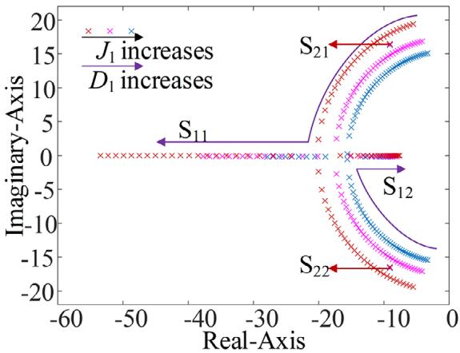  
FIGURE 3 Distribution of pole trajectories as $J _ { 1 }$ and $D _ { 1 }$ increase in parallel VSC-ESS.

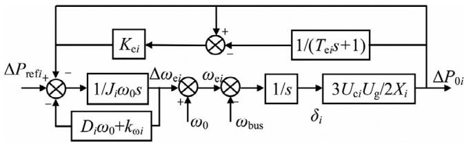  
FIGURE 4 Structural diagram of active closed-loop control with incorporation of transient electromagnetic power.

axis, eventually becoming the dominating pole of the system, which leads to poorer system stability. Similarly, the influence on the stability of the system can be obtained by varying $J _ { 2 }$ and $D _ { 2 }$ of the VSC-ESS .

# 2.3 Stability Analysis of Parallel VSC-ESS Incorporating Transient Electromagnetic Power

The transient electromagnetic power adds a transiently present power in the active control loop, which incorporates a first-order hysteresis link that is introduced in the output power feedback [25]. Figure 4 depicts the block diagram for active closed-loop equivalent control of VSC-ESS with the addition of transient electromagnetic power.

As shown in Figure 4, Equation (8) illustrates the VSC-ESSi active control loop after incorporating transient electromagnetic power.

$$
\left\{ \begin{array}{l} s \Delta \omega_ {\mathrm {e} _ {i}} = \frac {- \Delta P _ {0 i} - \left(D _ {i} \omega_ {0} + k _ {\omega i}\right) \left(\omega_ {\mathrm {e} _ {i}} - \omega_ {0}\right) - \Delta P _ {0 i} G _ {\mathrm {e} i} (s)}{J _ {i} \omega_ {0}} \\ G _ {e l} (s) = \frac {K _ {e l} T _ {e l} s}{\left(T _ {e l} s + 1\right)} \end{array} \right. \tag {8}
$$

where $\omega _ { \mathrm { e } i }$ denotes the angular frequency under transient electromagnetic power compensation control, $K _ { \mathrm { e } i }$ is the compensation coefficient, and $T _ { \mathrm { e } i }$ is the time constant of the first-order lag link.

Figure 4 shows that VSC-ESS experiences active variation $\Delta P _ { 0 i }$ due to transient electromagnetic power $\omega _ { \mathrm { b u s } }$ fluctuations. The transfer function equation for the active variation $\Delta P _ { L }$ of the

parallel VSC-ESS is as follows:

$$
\left\{ \begin{array}{l} \Delta \omega_ {\mathrm {e} _ {i}} (s) = \frac {K _ {i} \left(1 + G _ {\mathrm {e} i} (s)\right)}{N _ {i}} \Delta \omega_ {\text {b u s}} (s) \\ \Delta P _ {L} = \Delta P _ {0 1} + \dots \Delta P _ {0 i} + \dots \Delta P _ {0 n} \\ \Delta P _ {L} (s) = - \left[ \sum_ {i = 1} ^ {n} \frac {M _ {i}}{N _ {i}} \right] \Delta \omega_ {\text {b u s}} (s) \end{array} \right. \tag {9}
$$

where $M _ { i }$ and $N _ { i }$ are determined as follows:

$$
\left\{ \begin{array}{l} M _ {i} = K _ {i} (J _ {i} \omega_ {0} s + D _ {i} \omega_ {0} + k _ {\omega i}) \\ N _ {i} = J _ {i} \omega_ {0} s ^ {2} + (D _ {i} \omega_ {0} + k _ {\omega i}) s + K _ {i} (1 + G _ {\mathrm {e f}} (s)) \end{array} \right.
$$

According to (9), the frequency response closed-loop transfer function $\Delta \omega _ { \mathrm { e } i } ( s ) / \Delta P _ { L } ( s )$ i s

$$
\left\{ \begin{array}{l} \frac {\Delta \omega_ {\mathrm {e} _ {i}} (s)}{\Delta P _ {L} (s)} = - \frac {G ^ {\prime} _ {i} (s)}{\sum_ {m = 1} ^ {n} G ^ {\prime} _ {m} (s) \left(J _ {m} \omega_ {0} s + D _ {m} \omega_ {0} + k _ {\omega m} \omega_ {0}\right)} \\ G ^ {\prime} _ {i} (s) = \frac {K _ {i} \left(1 + G _ {\mathrm {e} i} (s)\right)}{N _ {i}} \\ G ^ {\prime} _ {m} (s) = \frac {K _ {m}}{N _ {m}} \end{array} \right. \tag {10}
$$

where $N _ { m }$ is determined as

$$
N _ {m} = J _ {m} \omega_ {0} s ^ {2} + \left(D _ {m} \omega_ {0} + k _ {\omega m}\right) s + K _ {m} \left(1 + G _ {\mathrm {e i}} (s)\right)
$$

Combining Equations (9) and (10) to establish the small-signal state control mode of the two VSC-ESSs parallel system with the incorporation of transient electromagnetic power, as illustrated in Equation (11).

$$
\left\{ \begin{array}{l} \frac {\mathrm {d} \boldsymbol {x} _ {2}}{\mathrm {d} t} = \boldsymbol {A} _ {2} \boldsymbol {x} _ {2} + \boldsymbol {B} _ {2} \boldsymbol {u} _ {2} \\ \boldsymbol {y} _ {2} = \boldsymbol {C} _ {2} \boldsymbol {x} _ {2} + \boldsymbol {D} _ {2} \boldsymbol {u} _ {2} \end{array} \right. \tag {11}
$$

where the coefficient matrix

$$
\boldsymbol {A} _ {2} = \left[ \begin{array}{c c c c c} - \frac {D _ {1} \omega_ {0} + k _ {\omega 1}}{J _ {1} \omega_ {0}} & 0 & - \frac {K _ {1} (K _ {\mathrm {e} 1} + 1)}{J _ {1} \omega_ {0}} & \frac {K _ {\mathrm {e} 1}}{J _ {1} \omega_ {0} T _ {\mathrm {e} 1}} & 0 \\ 0 & - \frac {D _ {2} \omega_ {0} + k _ {\omega 2}}{J _ {2} \omega_ {0}} & \frac {K _ {1} (K _ {\mathrm {e} 2} + 1)}{J _ {2} \omega_ {0}} & 0 & \frac {K _ {\mathrm {e} 2}}{J _ {1} \omega_ {0} T _ {\mathrm {e} 2}} \\ \frac {K _ {2}}{K _ {1} + K _ {2}} & - \frac {K _ {2}}{K _ {1} + K _ {2}} & 0 & 0 & 0 \\ 0 & 0 & K _ {1} & - \frac {1}{T _ {\mathrm {e} 1}} & 0 \\ 0 & 0 & - K _ {1} & 0 & - \frac {1}{T _ {\mathrm {e} 2}} \end{array} \right];
$$

$$
\boldsymbol {B} _ {2} = \left[ \begin{array}{c} - \frac {K _ {1} (K _ {\mathrm {e} 1} + 1)}{J _ {1} \omega_ {0} (K _ {1} + K _ {2})} \\ - \frac {K _ {2} (K _ {\mathrm {e} 2} + 1)}{J _ {2} \omega_ {0} (K _ {1} + K _ {2})} \\ 0 \\ \frac {K _ {1}}{K _ {1} + K _ {2}} \\ \frac {K _ {2}}{K _ {1} + K _ {2}} \end{array} \right];   \boldsymbol {C} _ {2} = \left[ \begin{array}{c c c c c} 1 & 0 & 0 & 0 & 0 \\ 0 & 1 & 0 & 0 & 0 \\ 0 & 0 & K _ {1} & 0 & 0 \\ 0 & 0 & K _ {1} & 0 & 0 \end{array} \right];   D _ {2} = \left[ \begin{array}{c} 0 \\ 0 \\ \frac {K _ {1}}{K _ {1} + K _ {2}} \\ \frac {K _ {2}}{K _ {1} + K _ {2}} \end{array} \right].
$$

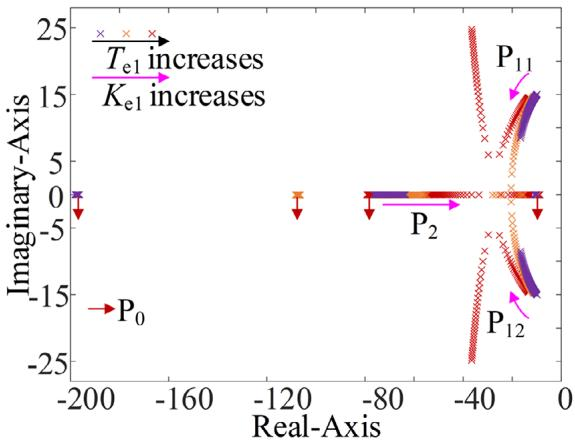  
FIGURE 5 Distribution of pole trajectories as $T _ { \mathrm { e 1 } }$ and $D _ { \mathrm { e 1 } }$ increase in parallel VSC-ESS.

$$
\left\{ \begin{array}{l} \Delta P _ {\mathrm {e} 1} = \frac {T _ {\mathrm {e} 1}}{T _ {\mathrm {e} 1} s + 1} \Delta P _ {0 1} \\ \Delta P _ {\mathrm {e} 2} = \frac {T _ {\mathrm {e} 2}}{T _ {\mathrm {e} 2} s + 1} \Delta P _ {0 2} \end{array} \right. \tag {12}
$$

where state variable $\pmb { x } _ { 2 } = [ \Delta \omega _ { 1 } \Delta \omega _ { 2 } \Delta \delta _ { 1 - } \Delta P _ { L } / ( K _ { 1 } + K _ { 2 } ) \Delta P _ { \mathrm { e l } } \Delta P _ { \mathrm { e 2 } } ] ^ { \mathrm { T } } ;$ ; input variable ${ \bf u } _ { 2 } ~ = ~ [ \Delta P _ { L } ] ;$ output variable $y _ { 2 } ~ = ~ [ \Delta \omega _ { 1 }$ Δω2 $\Delta P _ { 0 1 } \ \Delta P _ { 0 2 } ] ^ { \mathrm { T } } ;$ where $\Delta P _ { \mathrm { e l } }$ and $\Delta P _ { \mathrm { e } 2 }$ are the active low-frequency oscillatory components generated by the parallel VSC-ESS.

Figure 5 shows the pole trajectories of the parallel VSC-ESS statespace model for variations in $T _ { \mathrm { e 1 } }$ and $K _ { \mathrm { e 1 } } \mathrm { : }$ ; there are five poles, one of which is $\mathrm { { P } } _ { 0 } ,$ , a negative real pole positioned almost invariantly on the real axis.

Figure 5 indicates that after including transient electromagnetic power compensation in the parallel VSC-ESS, $T _ { \mathrm { e 1 } }$ and $K _ { \mathrm { e l } }$ may be modified to improve the parallel VSC-ESS’s dynamic stability with constant inertia damping. According to the hysteresis time constant property [22], a lower hysteresis time constant is beneficial to system stability because it causes transitory electromagnetic power to vanish when the system enters steady state. According to Figure $5 ,$ the poles $\mathrm { P _ { 1 1 } }$ and $\mathrm { P } _ { 1 2 }$ do not fall on the real axis as the oversized $T _ { \mathrm { e 1 } }$ and $K _ { \mathrm { e 1 } }$ increase, and the dynamic stability of the system is not improved; as $K _ { \mathrm { e 1 } }$ increases, the poles $\mathrm { P _ { 1 1 } }$ and $\mathrm { P } _ { 1 2 }$ move closer to the real axis, and parallel VSC-ESS will reach a negative damping state at the appropriate $T _ { \mathrm { e 1 } } ,$ , which can effectively suppress oscillations.

# 3 Parallel VSC-ESS Frequency Response Characterisation

# 3.1 Conventional Parallel VSC-ESS Frequency Response Characterisation

Equation (6) produces the transfer function $\Delta \omega _ { 1 } ( s ) / \Delta P _ { L } ( s )$ of the two VSC-ESSs parallel system. The influence of $J _ { 1 , 2 }$ and $D _ { 1 , 2 }$ on the frequency response of the ESS-VSC is analysed when the J and D of the VSC-ESS and VSC-ESS are varied in the diagrams. The amplitude-frequency characteristics of $\Delta \omega _ { 1 } ( s ) / \Delta P _ { L } ( s )$ are shown in Figures 6(a), 6(b), 6(e), and 6(f); Figures 6(c) and $6 ( \mathrm { g ) }$ show the pole trajectories of $\Delta \omega _ { 1 } ( s ) / \Delta P _ { L } ( s )$ as $J _ { 1 , 2 }$ and $D _ { 1 , 2 }$ increase.

As $J _ { 1 }$ increases, the low-frequency resonance point of the VSC-$\mathrm { E S S } _ { 1 }$ moves toward the lower left corner of the Bode diagram, indicating that increasing $J _ { 1 }$ affects the stability of the frequency response of the VSC-ESS . However, increasing $J _ { 1 }$ has an obvious effect on the high-frequency band, and the lower the amplitude ${ \mathrm { i } } \mathbf { s } ,$ the lower the effect of $\Delta P _ { \mathrm { I } }$ on $\Delta \omega _ { 1 }$ is, and the maximal RoCoF will be reduced as $J _ { 1 }$ increases. The low-frequency resonance point of the VSC-ESS moves toward the lower right corner of the Bode diagram as $D _ { 1 }$ increases. The amplitude-frequency curves of different $D _ { 1 }$ do not significantly affect the RoCoF. However, increasing the $D _ { 1 }$ decreases the amplitude of the low-frequency band (<1 Hz), which affects the equilibrium point under the frequency response.

Figure 6(c) shows that as $J _ { 1 }$ and $D _ { 1 }$ increase, $\Delta \omega _ { 1 } ( s ) / \Delta P _ { L } ( s )$ has a total of five poles, of which $\mathrm { S } _ { 1 1 } , \mathrm { S } _ { 1 2 } , \mathrm { S } _ { 2 1 } ,$ and $\mathrm { S } _ { 2 2 }$ are a pair of conjugate complex poles, whose direction of change is as shown by the arrow. Figure $6 ( \mathrm { c } )$ , and $\mathrm { S } _ { 3 }$ is located in the real axis, and the direction of change is in the form of the arrow; with the increase of $J _ { 1 } ,$ the five poles are all converging to the imaginary axis, and the VSC-ESS frequency response under the stability decreases. As $D _ { 1 }$ increases, all five poles move further away from the imaginary axis, indicating that increasing $D _ { 1 }$ will improve the frequency response stability of the VSC-ESS . However, $\mathrm { i f } J _ { 1 }$ is small, with the increase of $D _ { 1 }$ , the initial values of the characteristic poles $\mathrm { S } _ { 2 1 }$ and $\mathrm { S } _ { 2 2 }$ will move closer to the imaginary axis, reducing the frequency response stability of the VSC-ESS1.

The low-frequency resonance point of the VSC-ESS moves to the lower left corner of the Bode diagram as J increases, which shows that for the same load fluctuation, the increase of $J _ { 2 }$ affects the stability of the frequency response of the VSC-ESS , and the amplitude-frequency curves are almost overlapped in the high-frequency region as $J _ { 2 }$ changes, implying there is no significant effect on the RoCoF of the VSC-ESS . The lowfrequency resonance point and the high-frequency resonance point of the VSC-ESS are weakened as $D _ { 2 }$ increases, indicating that the stability of the frequency response of the VSC-ESS is improved by increasing $D _ { 2 } ,$ , while both $D _ { 2 }$ and $D _ { 1 }$ affect the equilibrium point under the frequency response of the VSC-ESS .

From Figure 6(f), when $J _ { 2 }$ and $D _ { 2 }$ increase, $\Delta \omega _ { 1 } ( s ) / \Delta P _ { L } ( s )$ also has five poles: $\mathrm { \Delta S _ { 1 1 } }$ and $\mathrm { S } _ { 1 2 }$ are invariant conjugate complex poles, $\mathrm { S } _ { 2 1 }$ and $\mathrm { S } _ { 2 2 }$ are conjugate complex poles, and $\mathrm { S } _ { 3 }$ is placed on the real axis. The arrow indicates the direction of the poles’s changes. $\mathrm { S } _ { 2 1 }$ and $\mathrm { S } _ { 2 2 }$ converge to the left side of the complex plane, and the stability of the VSC-ESS is improved as $J _ { 2 }$ increases. However, when $J _ { 2 }$ is too large, $\mathrm { S } _ { 3 }$ converges to the right side of the complex plane, and the stability margin is reduced; $\mathrm { S } _ { 2 1 } , \mathrm { S } _ { 2 2 }$ , and $\mathrm { S } _ { 3 }$ converge to the left side of the complex plane as $D _ { 2 }$ increases, and it can be seen that the increase of $\dot { \mathbf { D } } _ { 2 }$ improves the stability of the frequency response of the $\mathrm { V S C - E S S _ { 1 } }$ to a greater extent.

# 3.2 Parallel VSC-ESS Frequency Response Characterisation With the Incorporation of Transient Electromagnetic

From Equation (10), the transfer function $\Delta \omega _ { \mathrm { e l } } ( s ) / \Delta P _ { L } ( s )$ of the two VSC-ESSs parallel system with transient electromagnetic power. Because the effects of J and D of the two VSC-ESSs parallel

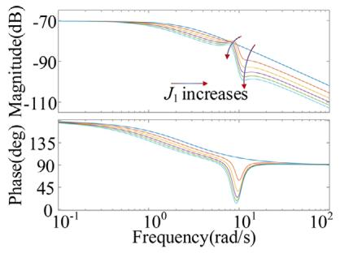

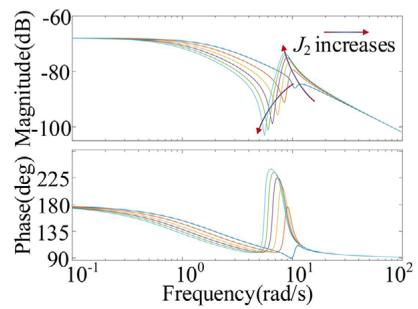  
(a)Bode diagram with Ji variation   
（d）Bode diagram with J variation

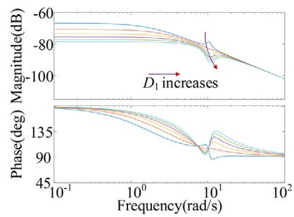

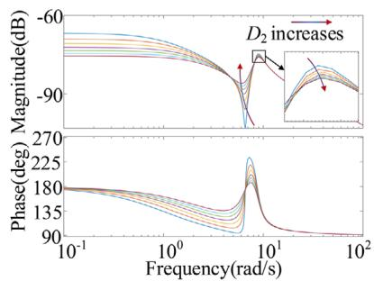  
(b) Bode diagram with Dl variation   
（e）Bode diagram with D variation

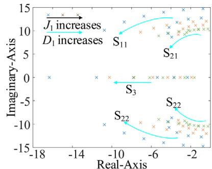

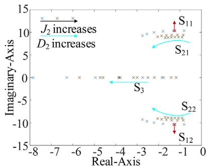  
(c)Pole distributions with J and D variation   
（f）Pole distributions with Jl and D variation

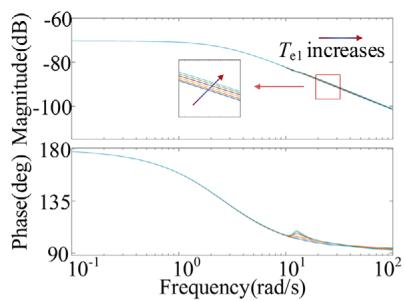  
FIGURE 6 Influence diagrams for changes in $J _ { 1 , 2 }$ and $D _ { 1 , 2 }$ .

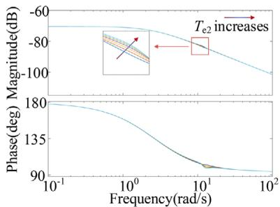  
(a) Bode diagram with $T _ { \mathrm { e l } }$ variation   
(d) Bode diagram with $T _ { \mathrm { e } 2 }$ variation

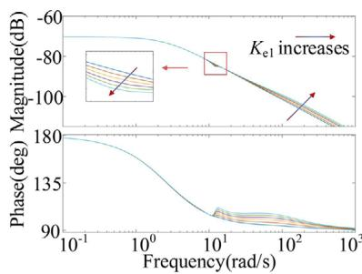

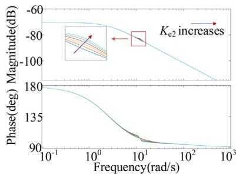  
(b) Bode diagram with $K _ { \mathrm { e l } }$ variation   
(e) Bode diagram with $K _ { \mathrm { c } 2 }$ variation

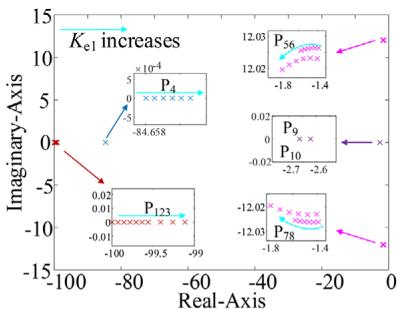

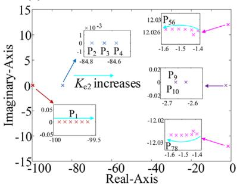  
(c) Pole distributions with $K _ { \mathrm { e l } }$ variation   
(f) Pole distributions with $K _ { \mathrm { e } 2 }$ variation   
FIGURE 7 Influence diagrams for changes in T and K . $T _ { \mathrm { e 1 , e 2 } }$ $K _ { \mathrm { e l } , \mathrm { e } 2 } .$

system with the incorporation of transient electromagnetic power are similar to the results of the analysis of the conventional two VSC-ESSs parallel system in Section 2.1, only the effects of $T _ { \mathrm { e 1 } } , T _ { \mathrm { e 2 } }$ , $K _ { \mathrm { e 1 : } }$ , and $K _ { \mathrm { e } 2 }$ parameters are analysed in this section, and the Bode diagrams and pole trajectories are shown in Figure 7.

Figure 7 reveals that $T _ { \mathrm { e 1 } }$ has little influence on the middle frequency band (>10 Hz, <50 Hz), and the amplitude-frequency characteristic curves almost overlap in the low-frequency band

and the high-frequency band, with no significant change. There will be a low-frequency resonance point slightly shifted upward to the right as $T _ { \mathrm { e } 2 }$ increases. It shows that larger $T _ { \mathrm { e } 2 }$ is conducive to increasing the RoCoF of VSC-ESS ,

It is evident from Figure 7(b) that the amplitude of the frequency response in the high-frequency band increases significantly, indicating that a larger compensation coefficient $K _ { \mathrm { e 1 } }$ leads to a larger RoCoF of VSC-ESS . A similar trend is observed when

increasing the compensation coefficient $T _ { \mathrm { e 1 } }$ . Besides Figures 7(c) and 7(f), the trajectories of the dominant poles remain almost unchanged with variations in $K _ { \mathrm { e 1 } }$ and $K _ { \mathrm { e } 2 }$ . It shows that these parameters have little influence on the stabilisation of VSC-ESS during frequency response.

# 4 Optimised Control Strategy for Inertial Self-Regulation

To analyse the specific effect of J on the frequency response of the VSC-ESS . The VSC-ESS transfer function Δω ${ \bf \Phi } _ { i } ( s ) / \Delta P _ { 0 i } ( s )$ and $\Delta \omega _ { \mathrm { e } i } ( s ) / \Delta P _ { 0 i } ( s )$ for the incorporation of transient electromagnetic power can be obtained from Equations (4) and (8), respectively.

$$
\left\{ \begin{array}{l} \frac {\Delta \omega_ {i} (s)}{\Delta P _ {0 i} (s)} = - \frac {1}{J _ {i} \omega_ {0} s + D _ {i} \omega_ {0} + k _ {\omega_ {i}}} \\ \frac {\Delta \omega_ {\mathrm {e} _ {i}} (s)}{\Delta P _ {0 i} (s)} = - \frac {1 + G _ {\mathrm {e} _ {i}} (s)}{J _ {i} \omega_ {0} s + D _ {i} \omega_ {0} + k _ {\omega_ {i}}} \end{array} \right. \tag {13}
$$

The frequency step response expression is shown below:

$$
\left\{ \begin{array}{l} \Delta f _ {i} (t) = - \frac {\Delta P _ {0 i}}{2 \pi D _ {k i}} \left(1 - \mathrm {e} ^ {- \frac {D _ {k i}}{J _ {i} \omega_ {0}} t}\right) \\ \Delta f _ {\mathrm {e} _ {i}} (t) = - \frac {\Delta P _ {0 i}}{2 \pi} \left(\frac {1}{D _ {k i}} - \frac {K _ {\mathrm {e} _ {i}} T _ {\mathrm {e} _ {i}}}{J _ {i} \omega_ {0} - T _ {\mathrm {e} _ {i}} D _ {k i}} \mathrm {e} ^ {- \frac {\mathrm {t}}{T _ {\mathrm {e} _ {i}}}} \right. \\ \left. - \frac {D _ {k i} \left(1 + K _ {\mathrm {e} _ {i}}\right) T _ {\mathrm {e} _ {i}} - J _ {i} \omega_ {0}}{D _ {k i} \left(T _ {\mathrm {e} _ {i}} D _ {k i} - J _ {i} \omega_ {0}\right)} \mathrm {e} ^ {- \frac {D _ {k i}}{J _ {i} \omega_ {0}} t}\right) \\ D _ {k i} = D _ {i} \omega_ {0} + k _ {\omega_ {i}} \end{array} \right. \tag {14}
$$

For $\Delta f _ { \mathrm { e } i } ( \mathrm { t } )$ of Equation (14), it can be converted into

$$
\Delta f _ {\mathrm {e} i} (\mathrm {t}) = \Delta f _ {i} (\mathrm {t}) + \frac {\Delta P _ {0 i} D _ {k i} K _ {\mathrm {e} i} T _ {\mathrm {e} i}}{2 \pi D _ {k i} \left(T _ {\mathrm {e} i} D _ {k i} - J _ {i} \omega_ {0}\right)} \left(\mathrm {e} ^ {- \frac {D _ {k i}}{J _ {i} \omega_ {0}} \mathrm {t}} - \mathrm {e} ^ {- \frac {\mathrm {t}}{T _ {\mathrm {e} i}}}\right) \tag {15}
$$

Equation (15) demonstrates that including transient electromagnetic power control changes the frequency regulation stabilisation time of the VSC-ESS .

Through Equation (14), the maximum RoCoF can be expressed as:

$$
\left\{ \begin{array}{l} \mathrm {R o C o F} _ {\max } = \frac {\mathrm {d} \Delta f _ {i} (\mathrm {t})}{\mathrm {d t}} \mid_ {\mathrm {t} = 0 ^ {+}} = - \frac {\Delta P _ {0 i}}{2 \pi J _ {i} \omega_ {0}} \\ \mathrm {R o C o F} _ {\operatorname {e m a x}} = \frac {\mathrm {d} \Delta f _ {\mathrm {e} i} (\mathrm {t})}{\mathrm {d t}} \mid_ {\mathrm {t} = 0 ^ {+}} = - \frac {\Delta P _ {0 i} \left(K _ {\mathrm {e} i} + 1\right)}{2 \pi J _ {i} \omega_ {0}} \end{array} \right. \tag {16}
$$

The analysis of Equation (17) shows that it indicates that the maximum RoCoF at the very beginning of the disturbance that occurs for each VSC-ESS is mainly determined by its own virtual inertia. After incorporating transient electromagnetic power control, the maximum RoCoF under the frequency response of the VSC-ESS is still affected by its own $J _ { i } ;$ in addition, the compensation coefficient $K _ { \mathrm { e } i }$ also affects its maximum RoCoF. The preceding study demonstrates that the ${ \bf \nabla } _ { : } J _ { i }$ remains the primary factor influencing the RoCoF in the frequency response of VSC-ESS . By analysing the output power, power angle, frequency, and grid frequency of the VSC-ESSi, it can determine how the output power changes in relation to the output frequency as

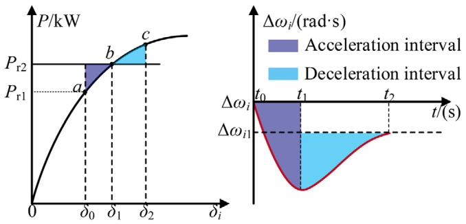  
FIGURE 8 Angular velocity fluctuation and active output characteristics.

TABLE 1 Virtual inertia for different cases.   

<table><tr><td>Scheme</td><td>RoCoF</td><td>Rotor state</td><td>Time period</td><td>\(J_i\)</td></tr><tr><td>Stage 1</td><td>\(\mathrm{d}\Delta \omega_{i}/\mathrm{dt}&lt;0\)</td><td>Deceleration</td><td>\(t_0\sim t_1\)</td><td>Increase</td></tr><tr><td>Stage 2</td><td>\(\mathrm{d}\Delta \omega_{i}/\mathrm{dt}&gt;0\)</td><td>Acceleration</td><td>\(t_1\sim t_2\)</td><td>Decrease</td></tr></table>

the frequency decreases due to disturbances on the grid side. Because this research employs transient electromagnetic power regulation to effectively suppress oscillation, it splits the active and frequency oscillation process of VSC-ESSi affected by the grid side into two distinct phases, as illustrated in Figure 8.

As depicted in Figure 8, the phase defining ${ \mathrm { d } \Delta \omega _ { i } } / { \mathrm { d t } } < 0$ is the rotor angular velocity deceleration part, whereas the phase defining $\mathrm { d } \Delta \omega _ { i } / \mathrm { d t } > 0$ is the rotor angular velocity acceleration part. The system operates at a power angle of $\delta _ { 0 } .$ The grid-side angular frequency $\omega _ { \mathrm { b u s } }$ is reduced due to the grid-side disturbance, causing the output power to increase from $P _ { \mathrm { r 1 } }$ at point a to $P _ { \mathrm { r } 2 }$ at point b.

In phase $t _ { 0 } { \sim } t _ { 1 }$ , the angular acceleration of the virtual rotor will be reduced, and $\mathrm { d } \Delta \omega _ { i } / \mathrm { d t } < 0 ;$ at this time, it is necessary to increase the $J _ { i }$ to attenuate the angular velocity decay rate induced by the output power of the VSC-ESS being larger than that of the reference power and to attenuate the maximum RoCoF. In the stage of $t _ { 1 } { \sim } t _ { 2 } , \ \mathrm { d } \Delta \omega _ { i } / \mathrm { d t } > 0$ , when $\omega _ { i } < \omega _ { \mathrm { b u s } } ,$ , the $J _ { i }$ has to be lowered to make the rotor angular velocity follow the grid frequency as soon as feasible. This enhances the frequency recovery capabilities of the VSC-ESS [33]. Table 1 shows the relationship between $\mathrm { d } \Delta \omega _ { i } / \mathrm { d t }$ and $J _ { i } .$

Equation (17) shows the angular frequency correlation of the adaptive inertia management technique when the virtual inertia $J _ { i }$ from Table 1 is combined with VSC-ESS .

$$
J _ {i} = \left\{ \begin{array}{l} J _ {0 i} \left| \frac {\mathrm {d} \omega_ {i}}{\mathrm {d} t} \right| \leqslant M \\ J _ {0 i} + k _ {J i} \frac {\left| \omega_ {i} - \omega_ {0} \right|}{\omega_ {i} - \omega_ {0}} \frac {\mathrm {d} \omega_ {i}}{\mathrm {d} t} \left| \frac {\mathrm {d} \omega_ {i}}{\mathrm {d} t} \right| > M \end{array} \right. \tag {17}
$$

where $k _ { J i }$ is the inertia adjustment coefficient and M is the frequency threshold utilised to avoid system oscillation due to repetitive changes in $J _ { i } .$ .

According to the analysis of Equation (15), if $J _ { i }$ is less than zero throughout the VSC-ESS frequency response, $\Delta f _ { \mathrm { e } i } ( \mathrm { t } )$ will not converge, resulting in system instability. A larger $k _ { J i }$ can more effectively adjust the maximum RoCoF, which contributes to the improvement of the frequency response. However, if the inertia adjustment coefficient $k _ { J i }$ is too large, the analysis of Equation (15). Consequently, the minimum $J _ { i }$ must be strictly positive; that is, $J _ { i , \operatorname* { m i n } } > 0$ . The smallest expression of $k _ { J i }$ can be calculated as follows:

$$
k _ {J i} > \frac {J _ {0 i} \left(\omega_ {0} - \omega_ {i}\right)}{\left| \omega_ {i} - \omega_ {0} \right| \left(\mathrm {d} \omega_ {i} / \mathrm {d} t\right)} \tag {18}
$$

As shown in Figure 4 and Equation (8), the closed-loop transfer function of VSC-ESS is calculated as follows:

$$
\left\{ \begin{array}{l} \frac {\Delta P _ {0 i} (s)}{\Delta P _ {\mathrm {r e f i}} (s)} = - \frac {K _ {i} \left(1 + T _ {\mathrm {e} i} s\right)}{T _ {\mathrm {e} i} J _ {i} \omega_ {0} s ^ {3} + m _ {i} s ^ {2} + n _ {i} s + K _ {i}} \\ m _ {i} = D _ {k i} T _ {\mathrm {e} i} + J _ {i} \omega_ {0} \\ n _ {i} = K _ {e i} K _ {i} \left(1 + T _ {\mathrm {e} i} s\right) + D _ {k i} T _ {\mathrm {e} i} \end{array} \right. \tag {19}
$$

$T _ { e i }$ has little influence on the system when using the orderreduction mechanism described in [22]. Neglecting terms containing $T _ { e i }$ but not $K _ { e i }$ in Equation (19) results in the comparable second-order model $\Delta P _ { 0 i \_ r } ( s ) / \Delta P _ { \mathrm { r e f } i } ( s )$ in Equation (20).

$$
\frac {\Delta P _ {0 i \_ r} (s)}{\Delta P _ {r e f i} (s)} = - \frac {K _ {i}}{J _ {i} \omega_ {0} s ^ {2} + \left(K _ {e i} K _ {i} T _ {e i} s + D _ {k i}\right) s + K _ {i}} \tag {20}
$$

According to Equation (20), the corresponding damping ratio $\xi _ { i }$ and natural oscillation frequency $\omega _ { \mathrm { n } i }$ can be obtained as shown in Equation (21).

$$
\left\{ \begin{array}{l} \xi_ {i} = \frac {D _ {k i} + K _ {i} T _ {e i} K _ {e i}}{2 \sqrt {K _ {i} J _ {i} \omega_ {0}}} \\ \omega_ {\mathrm {n} i} = \sqrt {\frac {K _ {i}}{J _ {i} \omega_ {0}}} \end{array} \right. \tag {21}
$$

According to Equation (21), ξ is negatively correlated with $J _ { i } ,$ that is, $\mathrm { d } \xi _ { i } / \mathrm { d } J _ { i } < 0$ . Based on control theory, setting $\xi _ { i }$ to the critical damping ratio of 1 yields a better response characteristic. In this case, there exists a maximum value for $J _ { i } .$ The optimal value ranges of $\mathbf { \dot { J } } _ { i }$ and $k _ { J i }$ can be obtained as follows:

$$
\left\{ \begin{array}{l} 0 <   J _ {i} <   \frac {\left(D _ {k i} + K _ {i} T _ {e i} K _ {e i}\right) ^ {2}}{4 K _ {i} \omega_ {0}} \\ \frac {J _ {0 i} \left(\omega_ {0} - \omega_ {i}\right)}{\left| \omega_ {i} - \omega_ {0} \right| \left(\mathrm {d} \omega_ {i} / \mathrm {d} t\right)} <   k _ {J i} \leq \frac {\left(J _ {i , \max } - J _ {0 i}\right) \left(\omega_ {i} - \omega_ {0}\right)}{\left| \omega_ {i} - \omega_ {0} \right| \left(\mathrm {d} \omega_ {i} / \mathrm {d} t\right)} \end{array} \right. \tag {22}
$$

Figure 9 presents the flowchart of the adaptive inertia algorithm.

# 5 Simulation and Experimental Verification

# 5.1 Simulation Verification

A simulation model of two parallel ESS-VSCs in Figure 1 is developed on the MATLAB/Simulink platform; the simulation parameters are shown in Table 2.

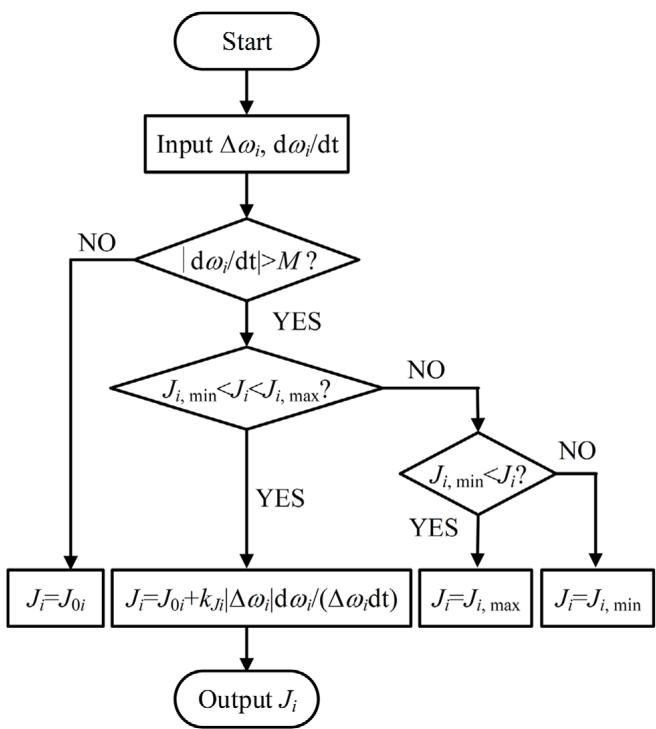  
FIGURE 9 Flowchart of the adaptive control algorithm.

TABLE 2 Simulation model parameters $( \mathrm { V S C } _ { 1 } / \mathrm { V S C } _ { 2 } ) .$ .   

<table><tr><td>Parameters</td><td>Values</td><td>Parameters</td><td>Values</td></tr><tr><td>Pref/kW</td><td>150/100</td><td>J/(kg·m2)</td><td>4/2</td></tr><tr><td>(Uc= Ug)/V</td><td>311/311</td><td>X1,2/Ω</td><td>0.19/0.19</td></tr><tr><td>ω0/rad</td><td>314/314</td><td>Ke</td><td>0.096/0.052</td></tr><tr><td>D/(N·ms/rad)</td><td>40/30</td><td>Te</td><td>0.002/0.002</td></tr><tr><td>Dq</td><td>1000/1000</td><td>Kq</td><td>0.02/0.02</td></tr><tr><td>M</td><td>0.5</td><td>kJ</td><td>2/1.5</td></tr></table>

Figure 10 and Figure 11 show the frequency and active output waveforms of the two parallel VSC-ESS under the J and D on its grid-side frequency perturbation in the conventional control mode, respectively, where the grid frequency drops by 0.2 Hz at t = 2 s and the grid frequency recovers at t = 4 s.

Figures 10(a) and 10(b) indicate that as $J _ { 1 }$ increases, the maximum RoCoF of $f _ { 1 }$ decreases; however, the stabilisation time lengthens, the amount of overshooting significantly increases, and the output power $P _ { 0 1 }$ also experiences a large overshoot. In contrast, Figures 10(c) and 10(d) show that while the maximum RoCoF of $f _ { 1 }$ does not change significantly with an increase in $D _ { 1 }$ , its stabilisation time shortens and its overshoot is reduced. Additionally, increasing $D _ { 1 }$ results in a higher steady-state value for its output power $P _ { 0 1 }$ . Figure 11(a) and (b) show that increasing $J _ { 2 }$ reduces the amount of overshooting and response time of f and $P _ { 0 1 }$ but does not improve the maximum RoCoF of the VSC-ESS , while increasing $D _ { 2 }$ mainly reduces the amount of overshooting $\mathrm { o f } f _ { 1 }$ and $P _ { 0 1 }$ .

Figure 12 and Figure 13 show the frequency and active output waveforms of the parallel VSC-ESS under the incorporation of

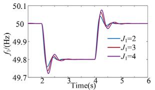  
（a）Waveform off as $J _ { 1 }$ changes

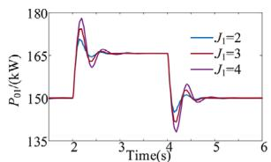  
（b）Waveform of $P _ { 0 1 }$ as $J _ { 1 }$ changes

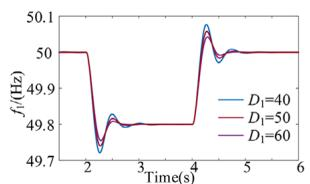  
(c）Waveform offi as $D _ { 1 }$ changes

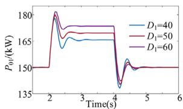  
（d）Waveform of $P _ { 0 1 }$ as $D _ { 1 }$ changes

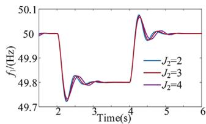  
FIGURE 10 Diagram of the effect of changes in $J _ { 1 }$ and $D _ { 1 }$ .   
(a）Waveform offi as $J _ { 2 }$ changes

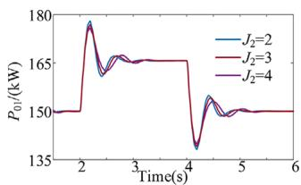  
（b）Waveform of $P _ { 0 1 }$ as $J _ { 2 }$ changes

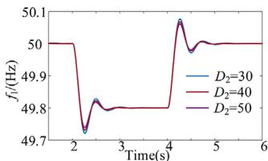  
(c） Waveform offi as $D _ { 2 }$ changes

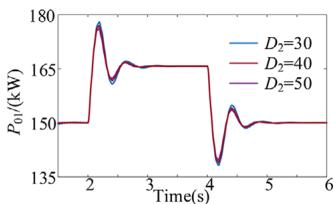  
（d）Waveform of $P _ { 0 1 }$ as $D _ { 2 }$ changes

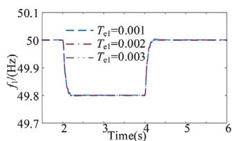  
FIGURE 11 Diagram of the effect of changes in $J _ { 2 }$ and $D _ { 2 } .$ .   
（a）Waveform of f as $T _ { \mathrm { e l } }$ changes

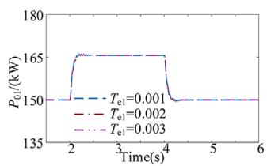  
（b）Waveform of $P _ { 0 1 }$ as $T _ { \mathrm { e l } }$ changes

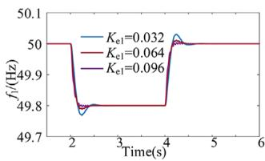  
(c）Waveform offi as $K _ { \mathrm { e l } }$ changes

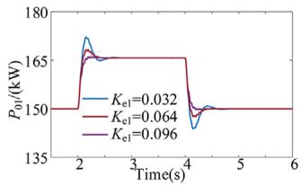  
（d）Waveform of $P _ { 0 1 }$ as $K _ { \mathrm { e l } }$ changes  
FIGURE 12 Diagram of the effect of changes in $T _ { \mathrm { e 1 } }$ and $K _ { \mathrm { e l } }$ .

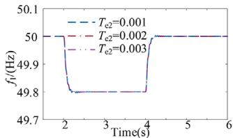  
（a）Waveform off as $T _ { \mathrm { e } 2 }$ changes

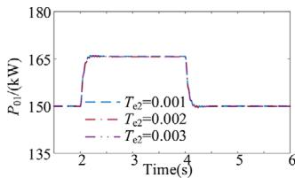  
（b）Waveform of $P _ { 0 1 }$ as $T _ { \mathrm { e } 2 }$ changes

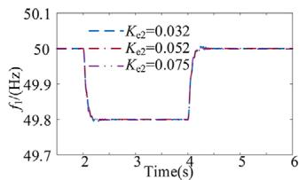  
（c）Waveform offi as $K _ { \mathrm { e } 2 }$ changes

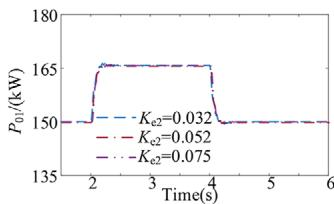  
（d）Waveform of $P _ { 0 1 }$ as $K _ { \mathrm { e } 2 }$ changes

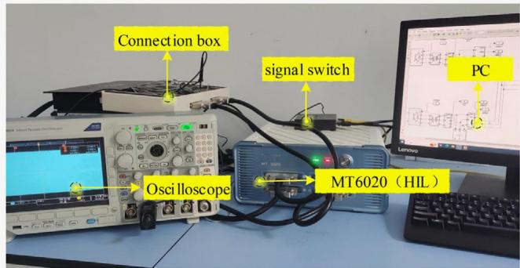  
FIGURE 13 Diagram of the effect of changes in $T _ { \mathrm { e } 2 }$ and $K _ { \mathrm { e } 2 }$   
FIGURE 14 Picture of the HIL platform.

a transient electromagnetic power model with a 0.2 Hz drop in the grid frequency at the moment of t = 2s and the compensation coefficients and time constants on its grid-side frequency perturbation, respectively.

According to Figures 12(a) and (b), there is no significant effect on the frequency response characteristics of the VSC-ESS1 as $T _ { \mathrm { e 1 } }$ increases; Figures 12(c) and (d) show that the maximum RoCoF of $f _ { 1 }$ increases as $K _ { \mathrm { e 1 } }$ increases, the stabilisation time decreases, the amount of overshooting decreases significantly, and the output power $P _ { 0 1 }$ has no steady state deviation. Figure 13 shows that the variations in $T _ { \mathrm { e } 2 }$ and $K _ { \mathrm { e } 2 }$ have no significant effect on the frequency response characteristics of the VSC-ESS . The analysis in Figure 12 and Figure 13 shows that adding transient electromagnetic power in parallel VSC-ESS can significantly improve its frequency response. The frequency response characteristics of each VSC-ESS are mostly determined by its own $K _ { \mathrm { e } i }$ .

# 5.2 Experimental Verification

The experimental validation model depicted in Figure 14 is constructed using the StarSim simulation platform. The upper computer is a PC, and the lower computer is an HIL realtime emulator. A signal switch connects the two computers. The main circuit runs in HIL’s FPGA, and the control circuit runs

TABLE 3 Quantitative indicators (VSC1/ VSC2).   

<table><tr><td>Methods
Indexes</td><td>T</td><td>E</td><td>A-E</td></tr><tr><td>FDmax(Hz)</td><td>0.05/0.04</td><td>0/0</td><td>0/0</td></tr><tr><td>RoCoFmax(Hz/s)</td><td>-1.6/-2.3</td><td>-3.6/-4.1</td><td>-3.2/-3.5</td></tr><tr><td>Power overshoot (%)</td><td>5.1/5.7</td><td>0/0</td><td>0/0</td></tr><tr><td>Power settling time (s)</td><td>2.14/1.56</td><td>1.06/0.83</td><td>0.94/0.75</td></tr></table>

in HIL’s multi-core CPUs. The main circuit interacts with the control circuit’s backplane bus signals. In this HIL setup, the computational tasks were divided up so that the multi-core CPUs worked with a 25 µs macro-time step and the FPGA worked with a 1 µs micro-time step for more detailed dynamic calculations.

Figure 14 shows the experimental output waveforms of the parallel VSC-ESS under three different control methods: conventional control (T), incorporation of transient electromagnetic power compensation (E), and adaptive inertia with transient electromagnetic power compensation (A-E), respectively.

Combining the information from Table 3 and Figure 15, it is evident that oscillations occur in both the active power output and the frequency of the parallel VSC-ESS when operating under T control during grid frequency disturbances and recovery. The E control strategy effectively suppresses active frequency oscillations and significantly shortens the frequency response time of the parallel VSC-ESS. However, this comes at the cost of a marked increase in the maximum RoCoF during frequency perturbations. When employing the A-E control strategy, as demonstrated in Figure 15(c), the virtual inertia increases during frequency disturbances, which helps reduce the maximum RoCoF while also shortening the frequency response time, as indicated by the output power frequency. Upon recovery from the disturbance, the virtual inertia decreases, which supports the frequency restoration of the parallel VSC-ESS.

# 6 Conclusion

This paper investigates the problem of overshooting and oscillation under the frequency response of parallel VSC-ESS. It discusses the effects of the main control parameters on the frequency response of parallel VSC-ESS, as well as the coupling relationship between them. In addition, in this paper, an adaptive inertia control strategy is proposed for parallel VSC-ESS. The following conclusions were drawn.

1. In parallel VSC-ESS, the virtual inertia and damping parameters of each VSC-ESS are coupled to a certain extent, and the maximum RoCoF of the VSC-ESS is still mainly determined by its own virtual inertia, while the stability under the frequency response is related to both its own and other VSC-ESS.   
2. The incorporation of transient electromagnetic power compensation in parallel VSC-ESS can effectively suppress the overshooting and oscillations and response time under the frequency response, which can improve the frequency

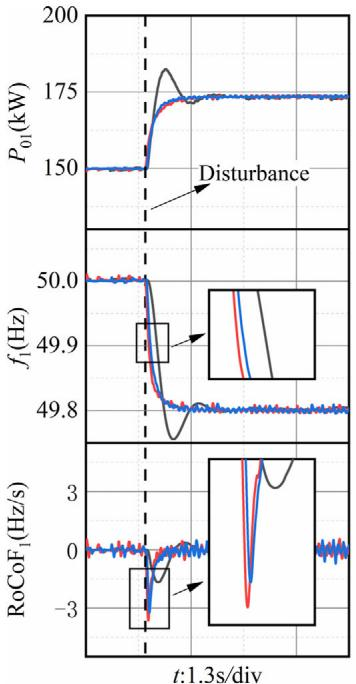  
（a）Experimental results of VSC-ESSi -ESS1

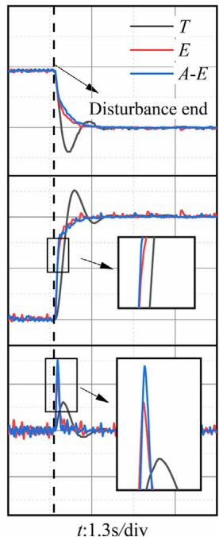

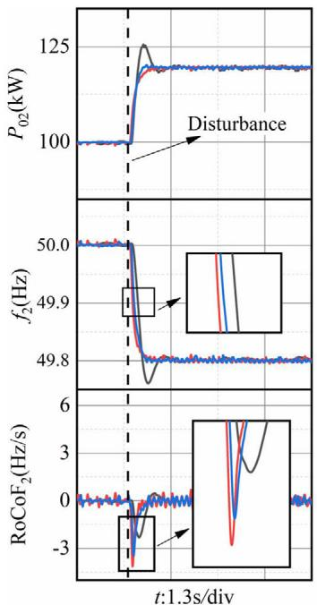  
（b）Experimental results 5of VSC-ESS2

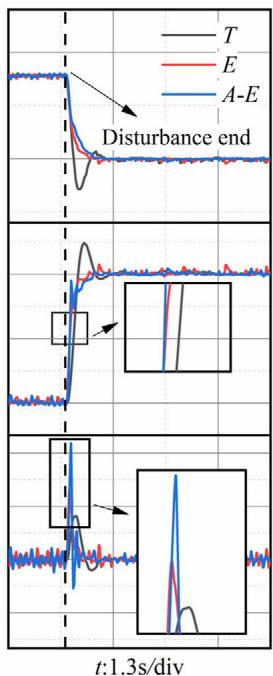

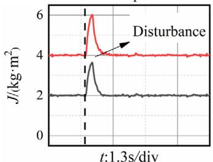  
（c）Experimental results ofJadaptive

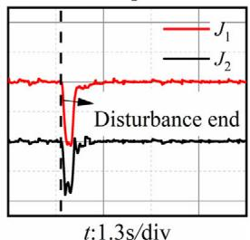  
FIGURE 15 Experimental results.

support characteristics of parallel VSC-ESS. However, the introduced compensation coefficient increases the maximum RoCoF.   
3. This paper proposes an adaptive inertia control strategy with a simple and reliable design, which can effectively mitigate the problem of excessive RoCoF caused by the introduction of transient electromagnetic power by VSCs and further shorten the frequency response time of parallel VSC-ESS.

# Author Contributions

Denghui Hu: methodology, visualisation, writing – original draft, writing – review and editing. Xiaoling Su: conceptualisation, formal analysis, investigation, project administration, validation, writing – review and editing. Zhengkui Zhao: conceptualisation, formal analysis, project administration, supervision, validation, writing – review and editing. Laijun Chen: conceptualisation, formal analysis, project administration, resources, supervision, validation, writing – review and editing

# Acknowledgements

This work is supported by the National Natural Science Foundation of China (52167022).

# Conflicts of Interest

The authors declare no conflicts of interest.

# Data Availability Statement

The data used to support the findings of this study are included within the article.

# References

1. B. Zhang, X. Zhang, J. Jia, Y. Zeng, and X. Yan, “Configuration Method for Energy Storage Unit of Virtual Synchronous Generator Based on Requirements of Inertia Support and Primary Frequency Regulation,” Dianli Xitong Zidonghua/Automation of Electric Power Systems 43, no. 23 (2019): 202–209.   
2. L. Zhang, G. Fan, N. Huang, L. Lü, G. Cai, and X. Wang, “Adaptive VSG Control Strategy for Interlinking Converter in an AC/DC Hybrid Microgrid,” Dianli Xitong Baohu Yu Kongzhi/Power System Protection and Control 49, no. 14 (2021): 45–54.   
3. J. Liang, H. Fan, Z. Deng, et al., “Generic Synthetic Inertia Scheme for Voltage Source Inverters,” IET Renewable Power Generation 17, no. 3 (2023): 696–705, https://doi.org/10.1049/rpg2.12625.   
4. P. He, L. Kong, M. Wang, C. Li, Z. Li, and Z. Guo, “Multi-Area System Frequency Response Modelling Considering VSG-Based Energy Storage,” IET Generation, Transmission and Distribution 19 (2025): e70083, https:// doi.org/10.1049/gtd2.70083.   
5. T. S. Das, U. D. Annakkage, D. Muthumuni, and I. K. Park, “Robust Higher Order Sliding Mode Control of Grid-Forming Converters With LCL Filter in Weak Grid Scenarios for Fast Frequency Support,” IET Generation, Transmission and Distribution 18 (2024): 3851–3862, https:// doi.org/10.1049/gtd2.13263.   
6. R. Rosso, X. Wang, M. Liserre, X. Lu, and S. Engelken, “Grid-Forming Converters: Control Approaches, Grid-Synchronization, and Future Trends—A Review,” IEEE Open Journal of Industry Applications 2 (2021): 93–109, https://doi.org/10.1109/OJIA.2021.3074028.   
7. D. B. Rathnayake, M. Akrami, C. Phurailatpam, et al., “Grid Forming Inverter Modeling, Control, and Applications,” IEEE Access 9 (2021): 114781–114807, https://doi.org/10.1109/ACCESS.2021.3104617.

8. Y. Wang, Y. Fu, L. Sun, and H. Xue, “Ultra-Short Term Prediction Model of Photovoltaic Output Power Based on Chaos-RBF Neural Network,” Dianwang Jishu/Power System Technology 42, no. 4 (2018): 1110– 1116.   
9. D. Sun, H. Liu, F. Zhao, L. Wu, P. Song, and X. Cheng, “Comparison of Inverter Generators With Different Support Control Methods,” Dianwang Jishu/Power System Technology 44, no. 11 (2020): 4359–4367.   
10. W. Cao, H. Qin, J. Lu, B. He, K. Zhuang, and G. Li, “Orientation and Application Prospect of Virtual Synchronous Generator in New Power System,” Dianli Xitong Zidonghua/Automation of Electric Power Systems 47, no. 4 (2023): 190–207.   
11. X. Meng, J. Liu, and Z. Liu, “A Generalized Droop Control for Grid-Supporting Inverter Based on Comparison Between Traditional Droop Control and Virtual Synchronous Generator Control,” IEEE Transactions on Power Electronics 34, no. 6 (2019): 5416–5438, https://doi.org/10.1109/ TPEL.2018.2868722.   
12. X. Zou, X. Zhong, D. Zhu, L. Fan, T. Wen, and Y. Kang, “Optimized Design of Power Loops for Virtual Synchronous Generator to Enhance Transient Stability,” IET Renewable Power Generation 19 (2022): e12516.   
13. M. V. Glazyrin, “Study of Synchronous Overload Capacity in Interloading System,” Russian Electrical Engineering 82, no. 6 (2011): 324–327, https://doi.org/10.3103/S1068371211060071.   
14. J. Liu, Y. Miura, H. Bevrani, and T. Ise, “Enhanced Virtual Synchronous Generator Control for Parallel Inverters in Microgrids,” IEEE Transactions on Smart Grid 8, no. 5 (2017): 2268–2277, https://doi.org/10. 1109/TSG.2016.2521405.   
15. Z. Shuai, W. Huang, Z. J. Shen, A. Luo, and Z. Tian, “Active Power Oscillation and Suppression Techniques Between Two Parallel Synchronverters During Load Fluctuations,” IEEE Transactions on Power Electronics 35, no. 4 (2020): 4127–4142, https://doi.org/10.1109/TPEL.2019. 2933628.   
16. S. Chen, Y. Sun, H. Han, G. Shi, Y. Guan, and J. M. Guerrero, “Dynamic Frequency Performance Analysis and Improvement for Parallel VSG Systems Considering Virtual Inertia and Damping Coefficient,” IEEE Journal of Emerging and Selected Topics in Power Electronics 11, no. 1 (2023): 478–489, https://doi.org/10.1109/JESTPE.2022.3208249.   
17. C. Zhang, X. Dou, L. Wang, Y. Dong, and Y. Ji, “Distributed Cooperative Voltage Control for Grid-Following and Grid-Forming Distributed Generators in Islanded Microgrids,” IEEE Transactions on Power Systems 38, no. 1 (2023): 589–602, https://doi.org/10.1109/TPWRS.2022. 3158306.   
18. K. Shi, W. Song, H. Ge, P. Xu, Y. Yang, and F. Blaabjerg, “Transient Analysis of Microgrids With Parallel Synchronous Generators and Virtual Synchronous Generators,” IEEE Transactions on Energy Conversion 35, no. 1 (2020): 95–105, https://doi.org/10.1109/TEC.2019.2943888.   
19. A. Karimi, Y. Khayat, M. Naderi, et al., “Inertia Response Improvement in AC Microgrids: A Fuzzy-Based Virtual Synchronous Generator Control,” IEEE Transactions on Power Electronics 35, no. 4 (2020): 4321–4331, https://doi.org/10.1109/TPEL.2019.2937397.   
20. L. Xiong, X. Liu, D. Zhang, and Y. Liu, “Rapid Power Compensation-Based Frequency Response Strategy for Low-Inertia Power Systems,” IEEE Journal of Emerging and Selected Topics in Power Electronics 9, no. 4 (2021): 4500–4513, https://doi.org/10.1109/JESTPE.2020.3032063.   
21. X. Li, G. Liu, R. Yang, and G. Chen, “VSG Control Strategy with Transient Damping Term and Seamless Switching Control Method,” Dianwang Jishu/Power System Technology 42, no. 7 (2018): 2081–2088.   
22. Z. Lan, Y. Long, J. Zeng, Z. Lü, D. He, and C. Hou, “VSG Control Strategy with Transient Electromagnetic Power Compensation,” Dianwang Jishu/Power System Technology 46, no. 4 (2022): 1421–1429.   
23. Z. Shuai, W. Huang, X. Shen, Y. Li, X. Zhang, and Z. J. Shen, “A Maximum Power Loading Factor (MPLF) Control Strategy for Distributed Secondary Frequency Regulation of Islanded Microgrid,” IEEE Transactions on Power Electronics 34, no. 3 (2019): 2275–2291, https://doi.org/10. 1109/TPEL.2018.2837125.

24. H. Hong, W. Gu, Q. Huang, L. Chen, X. Yuan, and J. Wang, “Power Oscillation Damping Control for Microgrid with Multiple VSG Units,” Zhongguo Dianji Gongcheng Xuebao/Proceedings of the Chinese Society of Electrical Engineering 39, no. 21 (2019): 6247–6254.   
25. R. Shi, C. Lan, Q. Zhang, Q. Zhou, J. Huang, and B. Wang, “Analysis and Improvement Strategy of Active Power Oscillation Characteristics for Energy Storage VSG Parallel Networking System,” Dianli Zidonghua Shebei/Electric Power Automation Equipment 44, no. 5 (2024): 51–57.   
26. Z. Lan, Z. Liu, D. He, J. Zeng, X. Yu, and Y. Long, “Active Oscillation Suppression Strategy of Paralleled Virtual Synchronous Generators Based on Transient Electromagnetic Power Compensation,” Dianwang Jishu/Power System Technology 47, no. 1 (2023): 23–30.   
27. C. Cheng, H. Yang, Z. Zeng, S. Tang, and R. Zhao, “Rotor Inertia Adaptive Control Method of VSG,” Dianli Xitong Zidonghua/Automation of Electric Power Systems 39, no. 19 (2015): 82–89.   
28. S. Chandak, P. Bhowmik, and P. K. Rout, “Robust Power Balancing Scheme for the Grid-Forming Microgrid,” IET Renewable Power Generation 14, no. 1 (2020): 154–163, https://doi.org/10.1049/iet-rpg.2019. 0905.   
29. J. Zhang and Z. Xu, “Regional Inertia Configuration Method of Renewable Energy Power System Considering RoCof Constraint,” Taiyangneng Xuebao/Acta Energiae Solaris Sinica 44, no. 9 (2023): 18–28.   
30. Z. Wang, F. Meng, Y. Zhang, W. Wang, G. Li, and J. Ge, “Cooperative Adaptive Control of Multi-Parameter Based on Dual-Parallel Virtual Synchronous Generators System,” IEEE Transactions on Energy Conversion 38, no. 4 (2023): 2396–2408, https://doi.org/10.1109/TEC.2023.3283048.   
31. Z. Wang, Y. Zhang, L. Cheng, and G. Li, “Improved Virtual Synchronization Control Strategy With Multi-Parameter Adaptive Collaboration,” Dianwang Jishu/Power System Technology 47, no. 6 (2023): 2403–2413.   
32. Q. Ma, L. Chen, L. Li, Y. Min, and Y. Shi, “Effect of Grid-Following VSCs on Frequency Distribution of Power Grid,” IET Renewable Power Generation 18, no. 14 (2024): 2619–2628, https://doi.org/10.1049/rpg2.13112.   
33. K. Shi, C. Chen, Y. Sun, P. Xu, Y. Yang, and F. Blaabjerg, “Rotor Inertia Adaptive Control and Inertia Matching Strategy Based on Parallel Virtual Synchronous Generators System,” IET Generation, Transmission and Distribution 14, no. 10 (2020): 1854–1861, https://doi.org/10.1049/ietgtd.2019.1394.