# MMC-MTDC系统的电磁-机电暂态建模与实时仿真分析

唐亚南 1，2 ，叶 华 1，2 ，裴 玮 1，2 ，孔 力 1，2

（1. 中国科学院电工研究所，北京 100190；2. 中国科学院大学 电子电气与通信工程学院，北京 100049）

摘要：提出了基于希尔伯特变换的移频建模方法，并建立了基于模块化多电平换流器的多端柔性直流输电（ ）系统的电磁 机电暂态移频相量模型，进一步地在实时仿真器上实现了电磁 机电暂态分区并行计算。相较于传统电磁 机电暂态联合仿真方法，该建模方法与仿真平台的电磁 机电暂态仿真适用性强，接口简单实用。分别建立了模块化多电平换流器单端系统、 五端柔性直流输电系统接入 节点交流系统的移频相量模型，并且完成了电磁 机电暂态分区并行实时仿真测试。通过对多种暂态现象的模拟及其与电磁暂态模型结果的对比，验证了所提电磁 机电暂态移频相量建模与实时仿真的准确性、有效性和灵活性。

关键词：移频； ；多端柔性直流输电；交直流电网；电磁 机电仿真；并行计算； - 实时仿真

中图分类号：TM 743；TM 721.1

文献标志码：A

DOI：10.16081/j.epae.201910003

# 0 引言

基于模块化多电平换流器的多端柔性直流输电（MMC-MTDC）正逐渐成为大规模风电及光伏发电接入传统交流电网的一种有效方式［1‐2］。随着含- 的交直流电网规模的扩大以及电力电子装置广泛应用于电力系统，相互独立的电力系统电磁暂态仿真和机电暂态仿真工具，已不能满足电力电子化交直流电网对仿真性能的需求。作为研究大规模交直流电网的有效手段之一，电磁-机电暂态混合仿真受到学术界和工程界越来越多的关注［3‐4］ 。同时，为了提高仿真效率，亟需更有效的交直流电网建模仿真方法与实时仿真工具［5‐6］ 。

目前电磁-机电暂态混合建模与仿真的主要思路是将系统分为进行电磁暂态和机电暂态仿真的子系统，分别采用电磁暂态仿真和机电暂态仿真程序模拟，在各个子系统的交界处进行不同软件或硬件间的信息交互。然而，机电暂态和电磁暂态仿真程序在建模机理和仿真方法等方面都存在很大差异，使得电磁-机电暂态混合仿真在模拟含柔性直流输电（ - ）的交直流电网方面面临诸多挑战。

为解决上述问题，国内外学者在电磁-机电暂态建模方面开展大量研究。动态相量法通过选取不同

的傅里叶系数进行电磁-机电暂态混合仿真［7］ 。但是进行电磁暂态仿真时，因为方程数目、矩阵维数增多导致计算量繁重，并且存在接口不准确等问题，导致动态相量模型难以应用于实时仿真。移频（ ）理论为解决上述电磁-机电多尺度暂态建模问题提供了新思路［8‐9］。该理论以希尔伯特变换（Hilbert）为基本原理，基于相同的建模机理建立电力系统电磁-机电多尺度暂态模型。文献［10‐12］建立了交流系统分布参数传输线、同步发电机等元件的移频多尺度暂态仿真模型。但上述文献主要针对纯交流系统，并局限于离线仿真。文献［13］采用移频理论开展了含 - 交直流电网电磁-机电暂态模型与仿真研究，但其仅介绍了基于电压源换流器（ ）平均值模型的移频多尺度暂态模型，该模型无法获悉内部模块的暂动态特性，并且无法模拟高次谐波［14］ 。

在进行交直流电网实时仿真时，一方面，通常对规模较大的交流系统进行等值简化处理，这就造成了部分信息的丢失，从而影响了仿真结果的准确性；另一方面，基于 - 、 、 等成熟的全数字实时仿真器实现混合仿真，这种方法需要增加特定的 ／ 类板卡和高速通信接口，以完成机电侧的基波相量和电磁侧的三相瞬时值之间的数据形式转换及其交互［5］ 。采用该方法在增加硬件成本的同时，又带来了数据交互误差。文献［ ］介绍了基于- 的交直流电网机电-电磁混合实时仿真，其交流系统由机电暂态仿真模块ePHASORsim完成，电磁暂态仿真过程由 模块完成。该方法需要通过高速I／O接口进行数据交互，并且需要和 配合完成机电-电磁暂态混合仿真。

本文将移频方法应用于含模块化多电平换流器

（MMC）交直流电网电磁-机电多尺度暂态建模，并基于 - 实现了电磁-机电暂态多 实时仿真，实现了大规模电力系统准确、高效实时仿真。首先介绍了移频方法的基本概念，然后建立核心设备的移频相量模型，进而在RT-LAB仿真平台上建立了 MMC 单端系统及±200 kV 五端 VSC-HVDC 接入节点交流系统的移频相量模型，并通过对多种暂态现象的模拟以及与电磁暂态模型结果的对比，验证了所提模型与实时仿真的准确性、有效性和灵活性，为进一步研究交直流电网的复杂暂动态特性提供了必要的实验依据。

# 1 移频方法

由实信号及其希尔伯特变换构建的解析信号的复数包络，在通信调制与解调理论中发挥着重要作用。将实信号 s（t）作为实部，其希尔伯特变换作为虚部，构成解析信号s(t)如下：

$$
\underline {{s}} (t) = s (t) + \mathrm {j} H [ s (t) ] \tag {1}
$$

其中， $H \left[ s \left( t \right) \right] = \frac { 1 } { \pi } \int _ { - \infty } ^ { + \infty } \frac { s \left( \mu \right) } { t - \mu } \mathrm { d } \mu ;$ ；下划线表示该信号为复数值函数。

当电力系统处于稳态时，电压及电流波形表现为纯正弦波形式，频率及幅值保持恒定。当系统遭受扰动处于机电暂态时，电压及电流的频率和幅值发生波动，通常可表达为：

$$
x (t) = A (t) \cos \left[ \left(\omega_ {0} - \Delta \omega (t)\right) t + \varphi_ {0} \right] \tag {2}
$$

其中， $\omega _ { 0 }$ 为稳态角频率，即50 Hz或60 Hz工频对应的角频率； $A \left( t \right)$ 为波动的幅值； ${ { \omega } _ { \mathrm { s } } } \left( t \right) = { { \omega } _ { \mathrm { 0 } } } - \Delta \omega \left( t \right)$ 为波动的角频率； $; \varphi _ { 0 }$ 为初始相位角。

对式（）进行三角变换后整理得：

$$
x (t) = x _ {\mathrm {R}} (t) \cos (\omega_ {0} t) - x _ {1} (t) \sin (\omega_ {0} t) \tag {3}
$$

$$
x _ {\mathrm {R}} (t) = A (t) \cos (\Delta \omega (t) t + \varphi_ {0})
$$

$$
x _ {1} (t) = A (t) \sin (\Delta \omega (t) t + \varphi_ {0})
$$

对x(t)做希尔伯特变换并构建解析信号如下：

$$
\begin{array}{l} \underline {{x}} (t) = x _ {\mathrm {R}} (t) \cos (\omega_ {0} t) - x _ {\mathrm {I}} (t) \sin (\omega_ {0} t) + \\ \mathrm {j} H \left[ x _ {\mathrm {R}} (t) \cos \left(\omega_ {0} t\right) - x _ {1} (t) \sin \left(\omega_ {0} t\right) \right] \tag {4} \\ \end{array}
$$

当电力系统发生机电暂态如低频振荡时，即$\Delta \omega \left( t \right)$ 变化较小时， $x _ { \mathrm { I } } ( t )$ 和 $x _ { \mathrm { R } } \left( t \right)$ 变化缓慢。由希尔伯特变换性质知 $H \left[ x _ { \mathrm { R } } \left( t \right) \cos \left( \omega _ { 0 } t \right) \right] = x _ { \mathrm { R } } \left( t \right) \sin \left( \omega _ { 0 } t \right)$ 、$H \left[ x _ { \mathrm { I } } \left( t \right) \sin \left( \omega _ { \mathrm { 0 } } t \right) \right] = - x _ { \mathrm { I } } \left( t \right) \cos \left( \omega _ { \mathrm { 0 } } t \right)$ ，解析信号可整理如下：

$$
\begin{array}{l} \underline {{x}} (t) = \left[ x _ {\mathrm {R}} (t) + \mathrm {j} x _ {\mathrm {I}} (t) \right] [ \cos (\omega_ {0} t) + \mathrm {j} \sin (\omega_ {0} t) ] = \\ [ x _ {\mathrm {R}} (t) + \mathrm {j} x _ {\mathrm {I}} (t) ] \mathrm {e} ^ {\mathrm {j} \omega_ {0} t} \tag {5} \\ \end{array}
$$

将式（）等号两边同乘以 $\mathrm { e } ^ { - \mathrm { j } \omega _ { 0 } t }$ 滤除基频正弦波$\mathrm { e } ^ { \mathrm { j } \omega _ { 0 } t }$ ，得到一个低频相量信号 $D \left[ x \left( t \right) \right.$ ，本文将其定义为移频相量：

$$
D [ x (t) ] = x _ {\mathrm {R}} (t) + \mathrm {j} x _ {\mathrm {I}} (t) \tag {6}
$$

D[x(t) ]保留了原始实信号除基频外的其他所有频率信息，其傅里叶变换频谱在0值附近，相较于原始实信号，其模拟低频现象采样率更低。图1分别给出了原始实信号、解析信号以及移频信号的傅里叶频谱。根据香农采样定理， $D \left[ x \left( t \right) \right.$ ]可以采用更大的时间步长模拟。

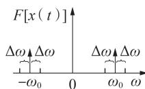  
（a）原始实信号

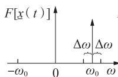  
（b）解析信号

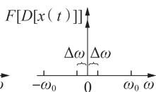  
（c）移频信号  
图1 信号频谱比较  
Fig.1 Signal spectrum comparison

# 交直流电网核心设备模型

# 2.1 MMC 建模

本节将建立 的移频相量模型。 的桥臂采用半桥或者全桥子模块级联的方式构成，如附录 中图 所示。为阐述方便，本文基于半桥子模块级联 ，建立其移频相量模型。该建模方法同样适用于全桥子模块级联 。

首先建立 的开关函数模型，并基于开关函数模型建立其移频相量模型。用 $u \left( t \right)$ 表示调制波，$U _ { \mathrm { c } }$ 表示子模块电容的额定电压。采用最近电平调制（ ）策略，将 输出的电压与调制波电压之差控制在 $: U _ { \mathrm { c } } / 2$ 以内。实际电容电压在额定值附近有微小波动，考虑子模块电容电压均衡控制，因此假设子模块电容电压相等，用 $v _ { \mathrm { c } } \left( t \right)$ 表示。以有 N 电平 的 相为例，假设调制波 $u \left( t \right) =$ $m \left( t \right) \sin \left( \omega t \right)$ ，则其下桥臂最多接入的模块数 $n _ { \mathrm { d o w n } } =$ $N + \mathrm { r o u n d } ( m \left( t \right) / U _ { \mathrm { c } } ) { = } N + n$ ，第 $i ( i \leqslant 2 n )$ ）个模块输出电压为：

$$
v _ {i} (\omega t) = \left\{ \begin{array}{l l} v _ {\mathrm {c}} (t) & \omega t \in [ 2 K \pi + \theta_ {i}, (2 K + 1) \pi + \theta_ {i}) \\ 0 & \omega t \in [ (2 K + 1) \pi + \theta_ {i}, (2 K + 2) \pi + \theta_ {i}) \end{array} \right. \tag {7}
$$

其中，K为自然数；θ 为开关角，其值可以通过计算获得。MMC 开关函数如图 2 所示。当 i ≤ n 时， $\theta _ { i } =$

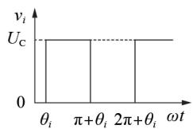  
（a）子模块输出电压

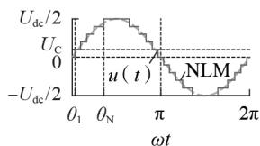  
（b）MMC的NLM  
图2 MMC开关函数  
Fig.2 Switching function of MMC

$\arcsin { \frac { 2 i - 1 } { 2 n } }$ ；当 $\scriptstyle n < i \leqslant 2 n$ 时， $\scriptstyle \theta _ { i } = 2 \pi - \theta _ { i - n } \quad$ 。下桥臂其余$2 N - 2 n$ 个模块中，N-n 个模块输出电压一直为 $U _ { \mathrm { c } }$ ，而剩余的模块输出电压一直为 。

假设 $v _ { i } ^ { ' } ( \omega t ) { = } 2 v _ { i } ( \omega t ) { - } v _ { \mathrm { c } } ( t )$ ，则：

$$
v _ {i} ^ {\prime} (\omega t) = \left\{ \begin{array}{l l} v _ {\mathrm {c}} (t) & \omega t \in [ 2 K \pi + \theta_ {i}, (2 K + 1) \pi + \theta_ {i}) \\ - v _ {\mathrm {c}} (t) & \omega t \in [ (2 K + 1) \pi + \theta_ {i}, (2 K + 2) \pi + \theta_ {i}) \end{array} \right. \tag {8}
$$

根据傅里叶级数展开，可以得到：

$$
v _ {i} ^ {\prime} (\omega t) = \frac {4 v _ {\mathrm {c}} (t)}{\pi} \sum_ {h = 1, 3, \dots} ^ {\infty} \frac {1}{h} \sin [ h (\omega t - \theta_ {i}) ] \tag {9}
$$

其中， $, \omega t = \omega _ { \mathrm { o } } t + \Delta \theta _ { \mathrm { P L L } } ( t ) + \Delta \theta _ { d q } ( t ) , \Delta \theta _ { \mathrm { P L I } }$ 为锁相环（PLL）检测到的三相交流电压累计相位角度差， $\Delta \theta _ { d q } =$ $\arctan ( m _ { q } / m _ { d } ) , m _ { d } , m _ { \phi }$ 分别为调制信号的 $d , q$ 轴分量。

对式（）进行希尔伯特变换，构建其解析信号可得：

$$
\begin{array}{l} \underline {{v}} _ {i} ^ {\prime} (\omega t) = \frac {4 v _ {c} (t)}{\pi} \sum_ {h = 1, 3, \dots} ^ {\infty} \frac {1}{h} \left\{\sin [ h (\omega t - \theta_ {i}) ] - \right. \\ \left. \mathrm {j} \cos [ h (\omega t - \theta_ {i}) ] \right\} = \frac {4 v _ {\mathrm {c}} (t)}{\pi} \sum_ {h = 1, 3, \dots} ^ {\infty} - \mathrm {j} \frac {1}{h} \mathrm {e} ^ {\mathrm {j} h (\omega t - \theta_ {i})} (1 0) \\ \end{array}
$$

式（ ）左右两边同乘以 $\mathrm { e } ^ { - \mathrm { j } \omega _ { \mathrm { s } } t }$ ，其中ω 为移频参数，通过对移频参数的设置可以分别进行电磁或者机电暂态仿真，得到移频相量如下：

$$
D \left[ v _ {i} ^ {\prime} \right] = \underline {{v}} _ {i} ^ {\prime} \mathrm {e} ^ {- \mathrm {j} \omega_ {s} t} = \frac {4 v _ {\mathrm {c}} (t)}{\pi} \sum_ {h = 1, 3, \dots} ^ {\infty} - \mathrm {j} \frac {1}{h} \mathrm {e} ^ {\mathrm {j} [ h (\omega t - \theta_ {i}) - \omega_ {s} t ]} \tag {11}
$$

由式（11）和 $v _ { i } ^ { ' } ( \omega t ) { = } 2 v _ { i } ( \omega t ) { - } v _ { \mathrm { c } } ( t )$ 可得第 i 个子模块的输出电压的移频相量如下：

$$
\begin{array}{l} D [ v _ {i} ] = \frac {1}{2} D [ v _ {i} ^ {\prime} ] + \frac {1}{2} v _ {c} (t) = \\ \frac {2 v _ {\mathrm {c}} (t)}{\pi} \sum_ {h = 1, 3, \dots} ^ {\infty} - \mathrm {j} \frac {1}{h} \mathrm {e} ^ {\mathrm {j} [ h (\omega t - \theta_ {\mathrm {i}}) - \omega_ {\mathrm {s}} t ]} + \frac {1}{2} v _ {\mathrm {c}} (t) \tag {12} \\ \end{array}
$$

根据式（12）和 $\theta _ { i } = 2 \pi - \theta _ { i - n } \big ( n < i \leqslant 2 n \big )$ 得到下桥臂 $1 \sim 2 n$ 个子模块输出电压之和的移频相量为：

$$
D [ v ] = \sum_ {h = 1, 3, \dots} ^ {\infty} - j f (h, v _ {\mathrm {c}}) \mathrm {e} ^ {\mathrm {j} (h \omega t - \omega_ {\mathrm {s}} t)} + n v _ {\mathrm {c}} (t) \tag {13}
$$

其中， $, f ( h , v _ { \mathrm { c } } ) { = } \frac { 4 v _ { \mathrm { c } } ( t ) } { \pi } \sum _ { i = 1 } ^ { n } \frac { 1 } { h } \cos ( h \theta _ { i } ) _ { \odot }$ ∑i h 。式（ ）的具体推导过程见附录 。则下桥臂的桥臂电压的移频相量为：

$$
\begin{array}{l} D [ v _ {\mathrm {a l}} ] = \sum_ {i = 1} ^ {2 n} D [ v _ {i} ] + (N - n) v _ {\mathrm {c}} (t) = \\ \sum_ {h = 1, 3, \dots} ^ {\infty} - j f (h, v _ {\mathrm {c}}) \mathrm {e} ^ {\mathrm {j} (h \omega t - \omega_ {\mathrm {s}} t)} + N v _ {\mathrm {c}} (t) \tag {14} \\ \end{array}
$$

上桥臂的模块与下桥臂的模块一一对应，当下桥臂的一个模块进入投入状态时，上桥臂相应模块就进入切除状态；而当下桥臂的一个模块进入切除状态时，上桥臂相应模块则进入投入状态。因此，类

似地，可以得到上桥臂的桥臂电压的移频相量为：

$$
D [ v _ {\mathrm {a u}} ] = \sum_ {h = 1, 3, \dots} ^ {\infty} \mathrm {j} f (h, v _ {\mathrm {c}}) \mathrm {e} ^ {\mathrm {j} (h o t - \omega_ {\mathrm {s}} t)} + N v _ {\mathrm {c}} (t) \tag {15}
$$

根据上文分析，可以得到MMC的等效电路如图3所示。

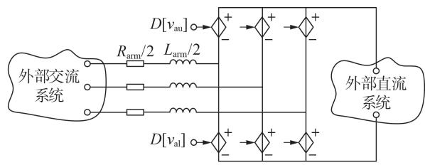  
图3 MMC等效电路  
Fig.3 Equivalent circuit of MMC

根据 MMC 的工作原理可知，MMC 交流侧输出电压的移频相量为：

$$
\begin{array}{l} D [ v _ {\mathrm {a}} ] = \frac {1}{2} D [ v _ {\mathrm {a l}} ] - \frac {1}{2} D [ v _ {\mathrm {a u}} ] = \\ \sum_ {h = 1, 3, \dots} ^ {\infty} - j f (h, v _ {\mathrm {c}}) \mathrm {e} ^ {\mathrm {j} (h \omega t - \omega_ {\mathrm {s}} t)} = v _ {\mathrm {a R}} + \mathrm {j} v _ {\mathrm {a l}} \tag {16} \\ \end{array}
$$

其中， ${ , v _ { \mathrm { a R } } } \setminus { v _ { \mathrm { a I } } }$ 分别为移频相量的实部和虚部，其表达式如式（17）所示。

$$
\left\{ \begin{array}{l} v _ {\mathrm {a R}} = \sum_ {h = 1, 3, \dots} ^ {\infty} f \left(h, v _ {\mathrm {c}}\right) \sin \left(h \omega t - \omega_ {\mathrm {s}} t\right) \\ v _ {\mathrm {a I}} = \sum_ {h = 1, 3, \dots} ^ {\infty} - f \left(h, v _ {\mathrm {c}}\right) \cos \left(h \omega t - \omega_ {\mathrm {s}} t\right) \end{array} \right. \tag {17}
$$

将 $\theta _ { i } { = } \arcsin { \frac { 2 i - 1 } { 2 n } }$ 代入 $f ( h , v _ { \mathrm { c } } )$ ，可以得到基波幅2n值为：

$$
\begin{array}{l} U _ {\mathrm {a l}} = \frac {4 v _ {\mathrm {c}} (t)}{\pi} \left[ \sqrt {1 - \left(\frac {1}{2 n}\right) ^ {2}} + \sqrt {1 - \left(\frac {3}{2 n}\right) ^ {2}} + \dots + \right. \\ \left. \sqrt {1 - \left(\frac {2 n - 1}{2 n}\right) ^ {2}} \right] \approx n v _ {\mathrm {c}} (t) \approx m (t) \tag {18} \\ \end{array}
$$

当进行电磁暂态仿真时，设置移频参数 $\omega _ { \mathrm { s } } { = } 0$ ，采用微秒级仿真步长仿真获得交直流信号的瞬时值；当进行机电暂态仿真时，设置移频因子 $\omega _ { \mathrm { s } } { = } \omega _ { \mathrm { 0 } }$ ，采用较大的时间步长进行仿真获得交直流信号包络线（即均方根值）。当只考虑基频信号，即h 时，移频相量为：

$$
\left\{ \begin{array}{l} v _ {\mathrm {a R}} = n v _ {\mathrm {c}} (t) \sin \left(\Delta \theta_ {\mathrm {P L L}} + \Delta \theta_ {d q}\right) \\ v _ {\mathrm {a I}} = - n v _ {\mathrm {c}} (t) \cos \left(\Delta \theta_ {\mathrm {P L L}} + \Delta \theta_ {d q}\right) \end{array} \right. \tag {19}
$$

式（ ）所示移频相量的频率在 值附近波动，远小于系统额定频率。根据香农采样定理，可以采用毫秒级时间步长进行仿真。本文模型也可以根据实际需要选取所关心的高次谐波进行电磁-机电宽频域多尺度暂态仿真。

在仿真进程中，假设在t时刻之前的各变量的值

已知换流器交直流侧变量的计算步骤如下。

（1）由控制系统得到 $\Delta \theta _ { \mathrm { P L L } } ( t ) , \Delta \theta _ { d q } ( t )$ 和 m (t)。  
（）根据式（ ）和式（ ）计算在t时刻换流器交流侧上下桥臂电压源移频相量。  
（）将图 中 等效电路转换为诺顿等效电路，计算在t时刻交流侧电流源移频相量的实部与虚部，并联立外部系统方程，根据节点电压法 $Y _ { v } = i$ 计算系统各节点电压。  
（）由式（）的结果计算流经子模块电容的电流$i _ { \mathrm { c } } ( t ) { = } s D [ i ]$ ，当子模块为投入状态时， $, s = 1$ ；当子模块为切除状态时，s=0。  
（）根据流经子模块电容的电流以及电容微分方程可以计算得到在t时刻子模块电容电压。  
（）根据历史值预测在 $t + \Delta t$ 时刻子模块电容电压值 $\widetilde { v } _ { \mathrm { c } } \left( t + \Delta t \right) = 2 v _ { \mathrm { c } } \left( t \right) - v _ { \mathrm { c } } \left( t - \Delta t \right)$ ，其中 $\Delta t$ 为仿真步长，“~”表示该变量值为预测值。

（）进入t t时刻，重复步骤（）—（）。

# 交直流输电线建模

本文采用输电线集中参数三相 型等值电路推导输电线移频相量模型。假设输电线两端口用 和表示，其集中参数为电阻、电感和电容，则输电线暂态特性微分方程可表达为：

$$
\frac {\mathrm {d} \boldsymbol {x} _ {1}}{\mathrm {d} t} = \boldsymbol {A} _ {1} \boldsymbol {x} _ {1} + \boldsymbol {B} _ {1} \boldsymbol {u} _ {1} \tag {20}
$$

其中， $\pmb { x } _ { 1 } \mathrm { = } \left[ \pmb { i } _ { 1 2 } , \pmb { v } _ { 1 } , \pmb { v } _ { 2 } \right] ^ { \mathrm { T } } ; \pmb { u } _ { 1 } \mathrm { = } \left[ \pmb { i } _ { 1 } , \pmb { i } _ { 2 } \right.$ T ；状态空间系数矩阵 $A _ { \mathrm { l } }$ 和输入矩阵B 如附录C所示。

通过希尔伯特变换构建电压、电流的解析信号，则式（ ）可转变为解析信号：

$$
\frac {\mathrm {d} \underline {{x}} _ {1}}{\mathrm {d} t} = A _ {1} \underline {{x}} _ {1} + B _ {1} \underline {{u}} _ {1} \tag {21}
$$

将移频相量 $D \left[ \mathbf { \nabla } x _ { \mathrm { l } } \right] = \underline { { \mathbf { x } } } _ { \mathrm { \perp } } \mathrm { e } ^ { - \mathrm { j } \omega _ { \mathrm { s } } t } = x _ { \mathrm { l { R } } } + \mathrm { j } x _ { \mathrm { l } \mathrm { l } }$ 代入式（21）并整理为：

$$
\frac {\mathrm {d} D [ \boldsymbol {x} _ {1} ]}{\mathrm {d} t} = \left(\boldsymbol {A} _ {1} - \mathrm {j} \omega_ {\mathrm {s}} \boldsymbol {E}\right) D [ \underline {{\boldsymbol {x}}} _ {1} ] + \boldsymbol {B} _ {1} D [ \underline {{\boldsymbol {u}}} _ {1} ] \tag {22}
$$

式（ ）可进一步分解成实部和虚部如下：

$$
\frac {\mathrm {d}}{\mathrm {d} t} \left[ \begin{array}{l} \boldsymbol {x} _ {\mathrm {I R}} \\ \boldsymbol {x} _ {\mathrm {I I}} \end{array} \right] = \left[ \begin{array}{c c} \boldsymbol {A} _ {\mathrm {I}} & \omega_ {\mathrm {s}} \boldsymbol {E} \\ - \omega_ {\mathrm {s}} \boldsymbol {E} & \boldsymbol {A} _ {\mathrm {I}} \end{array} \right] \left[ \begin{array}{l} \boldsymbol {x} _ {\mathrm {I R}} \\ \boldsymbol {x} _ {\mathrm {I I}} \end{array} \right] + \boldsymbol {B} _ {\mathrm {I}} \left[ \begin{array}{l} \boldsymbol {u} _ {\mathrm {I R}} \\ \boldsymbol {u} _ {\mathrm {I I}} \end{array} \right] \tag {23}
$$

其中， $\pmb { { \cal E } } \mathrm { = d i a g } ( 1 , 1 , 1 )$ 。

由于直流输电线上的电压电流信号不含有基波，故将移频参数设置为 ，即可得到直流输电线的移频相量模型为：

$$
\frac {\mathrm {d}}{\mathrm {d} t} \left[ \begin{array}{l} \boldsymbol {x} _ {\mathrm {I R}} \\ \boldsymbol {x} _ {\mathrm {I I}} \end{array} \right] = \left[ \begin{array}{l l} \boldsymbol {A} _ {1} & 0 \\ 0 & \boldsymbol {A} _ {1} \end{array} \right] \left[ \begin{array}{l} \boldsymbol {x} _ {\mathrm {I R}} \\ \boldsymbol {x} _ {\mathrm {I I}} \end{array} \right] + \boldsymbol {B} _ {1} \left[ \begin{array}{l} \boldsymbol {u} _ {\mathrm {I R}} \\ \boldsymbol {u} _ {\mathrm {I I}} \end{array} \right] \tag {24}
$$

# 风电场与光伏发电站建模

风电场与光伏电站多尺度暂态建模均由多台机组聚合简化等值为单元机组。本文采用的风电单元机组为永磁直驱机组，其中 采用文献［ ］中的

移频相量模型。风电场输出功率经两级升压变压器输送至多端直流的风电场侧电压源换流站，其中变压器与汇集传输线采用 节的输电线移频相量建模。光伏发电经过 - 变换器汇入柔性直流电网，因 - 变换器信号不含有基波，故直接采用其平均值模型。

# 2.4 交流同步发电机建模

同步发电机电磁部分的电磁暂态方程，通常在$d q$ 坐标系下表达为电压方程：

$$
\frac {1}{\omega_ {\text {b a s e}}} \frac {\mathrm {d} \boldsymbol {\psi} _ {d q}}{\mathrm {d} t} = \boldsymbol {Z} _ {d q} \boldsymbol {i} _ {d q} + \boldsymbol {v} _ {d q} \tag {25}
$$

将 ${ \pmb { \psi } } _ { d q } = { \pmb { L } } _ { d q } { \pmb { i } } _ { d q }$ 代入式（25），可得磁链状态空间方程如下：

$$
\frac {\mathrm {d} \boldsymbol {\psi} _ {d q}}{\mathrm {d} t} = \omega_ {\text {b a s e}} Z _ {d q} L _ {d q} ^ {- 1} \boldsymbol {\psi} _ {d q} + \omega_ {\text {b a s e}} \boldsymbol {v} _ {d q} \tag {26}
$$

其中， $\boldsymbol { Z } _ { d q }$ 与 $L _ { d q }$ 表达式详见文献［16］。本文根据考虑的阻尼绕组数可改变 $\psi _ { \it d q } \mathrm { \bf ~ , } i _ { \it d q }$ 和 ${ \pmb v } _ { d q }$ 的维数。采用梯形数值积分法，获得式（ ）的离散形式为：

$$
\boldsymbol {\psi} _ {d q} (k) = \boldsymbol {A} _ {\mathrm {g}} \boldsymbol {\psi} _ {d q} (k - 1) + \boldsymbol {B} _ {\mathrm {g}} (\boldsymbol {v} _ {d q} (k) + \boldsymbol {v} _ {d q} (k - 1)) \tag {27}
$$

其中， ${ } , A _ { \mathrm { g } }$ 与 $B _ { \mathrm { g } }$ 如附录D所示。通过历史数据与此刻采样的发电机端电压，能够方便计算出此刻的磁链，进而获得发电机定子电流为：

$$
\boldsymbol {i} _ {d q} (k) = \boldsymbol {L} _ {d q} ^ {- 1} \boldsymbol {\psi} _ {d q} (k) \tag {28}
$$

一般将发电机电磁部分建模获得的三相交流电流源 $( \dot { \pmb { { \imath } } } _ { d q }$ 经Park变换）接入外部交流系统，而本文将$d q$ 坐标系下发电机模型经移频相量变换，与外部交流电网移频多尺度暂态模型相连。将式（28）中 $i _ { d q }$ 经文献［ ］中移频相量矩阵变换，计算多尺度暂态模型中的同步发电机定子电流如下：

$$
\boldsymbol {i} _ {\mathrm {R I}} (k) = \boldsymbol {T} _ {d q / \mathrm {R I}} (\Delta \theta) \boldsymbol {i} _ {d q} (k) \tag {29}
$$

其中，θ由附录 中发电机转子运动方程求取。

# 算例分析

本节首先基于 - 建立了 单端系统的移频相量模型，并与基于PSCAD／EMTDC的详细电磁暂态模型仿真结果进行了对比。同时，建立了五端 - 接入 节点交流系统的移频相量模型和电磁暂态模型。通过仿真对比分析验证了基于 - 的移频建模方法及其实时仿真模拟电磁-机电暂态的准确性、有效性和灵活性。

# 仿真环境设置

- 仿真器是一个基于 ／与SimPowerSystem，适用于电力系统电磁暂态的高精度实时数字仿真器。如果仿真模型比较复杂，可以将模型分割成多个子系统在不同的 处理器上并行计算。

- 实时仿真实验平台主要包括以下三部

分：实时仿真平台上位机，基于此建立交流系统、多端 - 以及风电场多尺度实时仿真模型，并对仿真运行状态进行实时监控；实时仿真平台下位机，将上位机建立的移频相量模型编译下载到下位机，由多CPU进行实时计算仿真；有功-无功四象限运行线性功率放大器，主要开展功率硬件在环的动模系统实验与测试。

# 3.2 单端MMC系统

单端MMC系统交流侧额定电压为10 kV，直流侧额定电压为±10 kV。MMC 控制系统内环采用典型的正、负序 $d q$ 解耦控制，外环采用定直流电压与无功功率控制。本节分别建立了该单端系统的详细电磁-机电暂态模型与移频模型，并开展了交直流故障仿真。2 种模型均采用 $5 0 ~ \mu \mathrm { s }$ 的时间步长进行电磁暂态仿真。为对 种模型仿真结果进行对比分析，设置了以下3种工况。

工况 ：交流侧单相接地故障。假设系统运行到 0.1 s 时，换流站交流侧发生单相接地故障，该故障持续 后被清除。采用移频模型和电磁-机电暂态模型对上述暂态现象进行仿真。图 （）分别给出了采用电磁-机电暂态模型和移频模型输出的交流侧三相电压瞬时值与包络线和直流电压曲线。

工况 ：交流侧三相接地故障。在 时交流系统发生三相接地故障，故障持续时间为0.1 s。图（）分别给出了采用 种模型输出的 交流侧电压瞬时值与包络线和直流侧电压瞬时值。

工况 ：直流侧单极接地故障。假设系统运行到0.1 s时，直流侧发生单极接地故障，故障持续后被清除。图 （）分别为采用 种模型输出的交流侧电压瞬时值与包络线和直流侧电压瞬时值。

由图 可以看出，采用移频模型输出的交流电压信号的幅值，能够很好地包络电磁-机电暂态模型输出的交流侧电压瞬时波形。对于直流侧电压，种模型的输出结果也高度一致。以上结果验证了本文所提模型在模拟 换流器暂态过程中的准确性。

# 五端 - 接入 节点交流系统

本文提出的基于多 计算的含风电场与多端直流交直流系统电磁-机电暂态仿真模型与参数设置如附录 中图 所示。风电场与多端直流电网设为主计算子系统（ ），采用微秒级时间步长（如 $4 0 ~ \mu \mathrm { s } { } )$ 进行电磁暂态仿真。交流系统设为从计算子系统（ ），采用毫秒级时间步长（如 ）进行机电暂态仿真。若交流系统规模过大，可对其进行分割，设置多个从计算子系统，由多 并行计算以加快仿真速度。若考虑交流系统电磁暂态仿真，

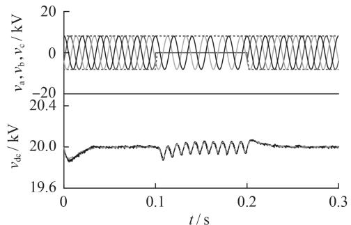

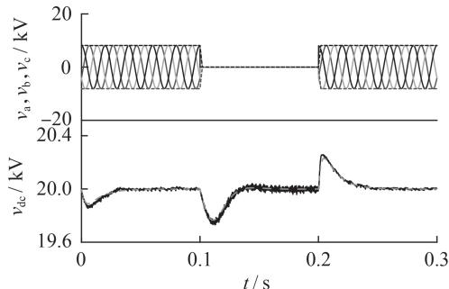  
（a）交流侧单相接地故障

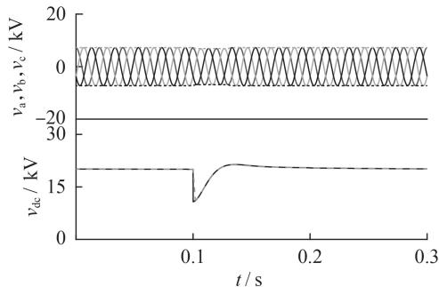  
（b）交流侧三相接地故障  
（c）直流侧单极接地故障  
EMT模型，----SF模型  
图4 单端MMC系统暂态响应对比  
Fig.4 Transient response comparisons of single-terminal MMC system

亦可采用微秒级时间步长仿真输出瞬时值。

本节采用如附录 中图 所示的五端 -接入 节点交流系统，基于移频相量法建立多尺度暂态模型开展电磁-机电暂态混合实时仿真，并与详细电磁模型进行对比。五端直流电网包括1座光伏发电站和2座风电场 $\mathrm { W F } _ { 1 } , \mathrm { W F } _ { 2 }$ ，额定容量均为 · ，有功设定均为 。直流电网电压等级为 ，风电场母线电压等级为／ ／ ，经两级变压器升压由电压源换流站接入直流电网。五端柔性直流电网的 $\mathrm { A } _ { 2 }$ 、$\mathrm { A } _ { 5 }$ 端换流站分别接到交流系统的 号与 号母线。其中 端换流站为定有功控制， 端换流站为定直流电压控制。直流系统采用 的时间步长进行电磁暂态仿真，交流系统采用 的时间步长进行机电暂态仿真。

为验证所提模型的准确性、有效性与灵活性，首

先进行了风功率波动的实验仿真，然后进行了故障特性仿真，分别开展直流侧单极接地故障和交流侧单相接地故障特性模拟。

# 3.3.1 风功率波动

在仿真过程中，通过控制台子系统（SC）输入风速数据。图 为由风功率波动引起的交直流电网暂动态特性。图中，由上至下依次为风速v、直流母线电压 $v _ { \mathrm { d c } }$ 、交流系统发电机角速度ω的变化曲线。由图5可见，随着风速波动，直流电压以及发电机角速度都有微小的波动，且风速波动较大时，直流电压和发电机角速度波动随之变大；风速较平稳时，直流电压和发电机角速度也平稳变化。而由于机电暂态采用毫秒级仿真步长，相比全电磁暂态仿真加快了仿真速度。

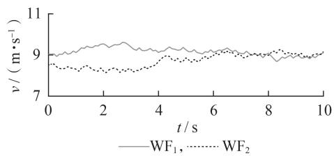

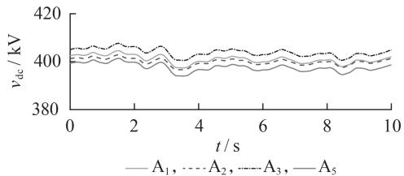  
（a）风电场WFi、WF风速

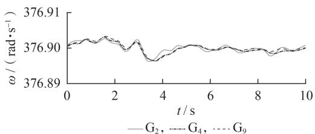  
（b）直流母线电压  
（c）发电机转子角速度  
图5 风功率波动引起的交直流电网暂态特性  
Fig.5 Transient performance of AC／DC power grid caused by wind power fluctuation

# 直流单极接地故障

假设在 时直流侧 ${ \mathrm { A } } _ { 2 } { - } { \mathrm { A } } _ { 4 }$ 线路中间点发生单极接地故障， 后故障被清除。图 （）给出了电磁-机电暂态模型和移频模型下的换流站 直流侧电压。图 $6 ( \mathrm { b } )$ 给出了 种模型下交流系统 号母线 相电压 $v _ { \mathrm { 1 6 b } } ($ 。为清晰对比 种模型的仿真结果，图 （）给出了采用 种模型在故障期间所获得交流电压对比的放大图。由图 $6 ( \mathrm { a } )$ 可知，2种模型下输出的直流电压值高度一致。由图 （）和 （）可知，移频模型下输出的交流电压峰值包络线完全包络电

磁-机电暂态模型输出的瞬时值。

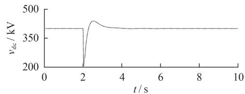

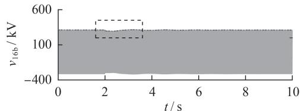  
（a）换流站 $\mathrm { A } _ { 2 } .$ 直流侧电压

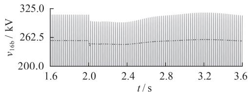  
（b）交流系统16号母线b相电压  
（c）局部放大图  
.E.MT模型，—SF模型  
图6 直流侧单极接地故障下2种模型仿真结果对比  
Fig.6 Comparison of simulative results for two models under DC-side unipolar grounding fault

附录F中图F1给出了移频模型下直流母线电压、交流母线电压（标幺值）以及发电机转子角速度变化曲线。由图可知，发生直流单极接地故障后，直流母线电压降至 ，交流母线电压和发电机同步角速度都有所下降。这是因为发生直流故障导致注入交流系统的功率减少，造成发电机电磁功率增加，而机械功率不变。同时，由图可知换流站接入交流点（节点 和 ）交流电压波动幅度比系统其他节点交流电压波动幅度大，位于弱交流区域的发电机 $\mathrm { G } _ { 9 }$ 比其他发电机功角特性易受直流故障等扰动的影响。

# 交流系统单相接地故障

假设交流区域 号母线在 时发生单相（相）接地故障，故障持续时间为 。图 （）给出了电磁-机电暂态模型和移频模型下的交流系统号母线 相电压。为清晰对比 种模型下的仿真结果，图 （）为图 （）的局部放大图。图 （）给出了种模型下换流站 直流侧电压。由图可见，采用种模型输出的直流电压值高度一致，采用移频模型输出的交流电压峰值包络线完全包络电磁-机电暂态模型输出的瞬时值。

附录 中图 给出了移频模型下故障点交流电压的包络线（标幺值）、直流侧电压以及发电机角速度的波形图。由图可知，故障发生后，故障点 相电压降为 ，直流电压抬升，发电机同步角速度下

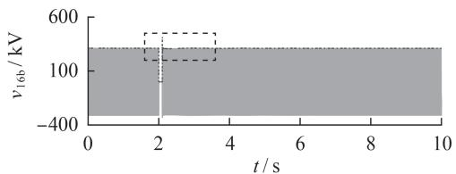  
（a）交流系统16号母线b相电压

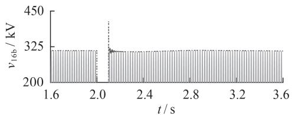  
（b）局部放大图

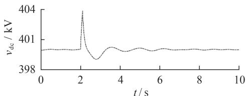  
（c）换流站A直流侧电压  
·EMT模型，—SF模型  
图7 交流侧单相接地故障下2种模型仿真结果比较  
Fig.7 Comparison of simulative results for two models under AC-side single-phase grounding fault

降。这主要是由于故障发生后，直流注入交流系统的功率减少，而负荷短时间内不变，对应地，发电机电磁功率变大，而机械功率不变。故障发生后被切除，交流母线电压及直流母线电压开始恢复，同时发电机同步角速度开始变大。同步机的角速度经过一段时间的波动后趋于稳定。相应地，交流电压与直流电压经过短时间的波动后也达到稳定值。

根据 节及 节仿真结果对比可知，所提基于移频法的电磁-机电暂态混合仿真模型在不影响仿真精度的条件下，相较于全电磁暂态仿真模型，由于采用了更大的仿真时间步长，仿真速度得到提升。

# 4 结论

本文提出了基于希尔伯特变换的移频方法，建立了交直流电网电磁-机电暂态移频相量模型，并在同一仿真平台上，实现了电磁-机电暂态分区并行实时仿真，相较于传统建模方法及不同平台联合仿真技术，具有以下优势：

（）提出的交直流电网移频相量建模方法，基于电磁暂态建模框架，在保证电磁暂态仿真精度的同时，提高了机电暂态仿真的速度；  
（）基于移频相量方法建立了 电磁-机电多尺度暂态模型，通过设置移频参数，可以方便地实现电磁-机电宽频域多尺度暂态仿真；  
（）电磁、机电仿真子系统均采用同一平台和同一底层算法仿真，两者数据交互简单、易于实现，克

服了传统电磁-机电暂态联合仿真中需要硬件接口且接口程序设计复杂等问题。

本文通过仿真算例也分析了 - 系统与交流系统的暂动态特性交互影响。仿真结果表明，建立的仿真模型与平台能够满足实际VSC-HVDC工程与大规模交流系统互联的仿真需求，为进一步研究交直流电网的复杂暂动态特性提供了必要的实验依据。

附录见本刊网络版（http：∥www.epae.cn）。

# 参考文献：

［ ］刘振亚，张启平，董存，等 通过特高压直流输电实现大型能源基地风、光、火电力大规模高效率安全外送研究［］ 中国电机工程学报， ，（ ）： -  
LIU Zhenya，ZHANG Qiping，DONG Cun，et al. Efficient and security transmission of wind，photovoltaic and thermal power of large-scale energy resource bases through UHVDC projects ［J］. Proceedings of the CSEE，2014，34（16）：2513-2522.   
［ ］李亚楼，穆清，安宁，等 直流电网模型和仿真的发展与挑战［］ 电力系统自动化， ，（）： -  
LI Yalou，MU Qing，AN Ning，et al. Development and chal‐ lenge of modeling and simulation of DC grid［J］. Automation of Electric Power Systems，2014，38（4）：127-135.   
［ ］汤涌 交直流电力系统多时间尺度全过程仿真和建模研究新进展［J］. 电网技术，2009，33（16）：1-8.  
TANG Yong. New progress in research on multi-time scale unified simulation and modeling for AC／DC power system［J］. ， ，（ ）：-   
［4］杨洋，肖湘宁，王昊，等. 电力系统数字混合仿真技术综述及展望［J］. 电力自动化设备，2017，37（3）：203-210.  
YANG Yang，XIAO Xiangning，WANG Hao，et al．Review and prospect of power system digital hybrid simulation tech‐ nology[J]. Electric Power Automation Equipment,2017,37(3): 203-210.   
[5］GUILLAUD X,FARUQUEM O,TENINGE A,et al.Applications of real-time simulation technologies in power and energy systems［J］. IEEE Power and Energy Technology Systems， ，（）： -   
［6］DUFOUR C，MAHSEREDJIAN J，BELANGER J. A combinedstate-space nodal method for the simulation of power systemtransients［J］. IEEE Transactions on Power Delivery，2011，26（）： -  
［ ］鲁晓军，林卫星，安婷，等． 电气系统动态相量模型统一建模方法及运行特性分析［］．中国电机工程学报， ，（ ）： -  
LU Xiaojun，LIN Weixing，AN Ting，et al．A unified dynamicphasor modeling and operating characteristic analysis of elec‐trical system of MMC［J］．Proceedings of the CSEE，2016，36（ ）： -  
［8］ STRUNZ K，SHINTAKU R，GAO F. Frequency-adaptive network modeling for integrative simulation of natural and envelope waveforms in power systems and circuits[J].IEEE Transactions on Circuits and SystemsI:Regular Papers,2006.53 （ ）： -   
「9]MARTI JR,DOMMEL H W,BONATTO B D,et al.Shifted Frequency Analysis(SFA）concepts for EMTP modelling and simulation of power system dynamics［C］∥Proceedings of the 18th Power Systems Computation Conference. Wroclaw，Poland：

， ：-  
［10］ GAO F，STRUNZ K. Frequency-adaptive power system modeling for multi-scale simulation of transients［J］. IEEE Transactions on Power Systems，2009，24（2）：561-571.   
［11］ YE H. Multi-scale frequency and location adaptive simulation of power system transients［D］. Berlin，Gemany：Technical University of Berlin，2013.   
［12］ FAN S，DING H. Time domain transformation method for acce-lerating EMTP simulation of power system dynamics[J].IEEETransactions on Power Systems，2012，27（4）：1778-1787.  
［13］叶华，安婷，裴玮，等. 含VSC-HVDC交直流系统多尺度暂态建模与仿真研究［］ 中国电机工程学报， ， （）： -1908.  
YE Hua，AN Ting，PEI Wei，et al. Multi-scale modeling and simulation of transients for VSC-HVDC and AC systems［J］. Proceedings of the CSEE,2017,37(7):1897-1908.   
［14］ JEF B，ORIOL G B，XAVIER G，et al. Modeling and controlof HVDC grids：a key challenge for the future power system［C］∥Power Systems Computation Conference（PSCC）. Wroclaw，Poland：IEEE，2014：1-21.  
［ ］朱琳，谭伟，王佳，等 基于 - 的机电-电磁暂态混合实

时仿真及其在MMC-HVDC中的应用［J］. 智能电网，2016，4（）： -  
ZHU Lin,TAN Wei,WANG Jia,et al. Electromechanical-electromagnetic transient real-time simulation based on RT-LAB and its application to MMC-HVDC［J］. Smart Grid，2016，4（3）： 312-322.   
［16］ KUNDUE P. Power system stability and control［M］. New， ： ， ： -

# 作者简介：

  
唐亚南

唐亚南（ —），女，山东烟台人，博士研究生，主要研究方向为电力系统建模与仿真（E-mail：tangyanan@mail.iee.ac.cn）；

叶 华（ —），男，湖北随州人，副研究员，博士，主要研究方向为电力系统建模、仿 真 算 法 、大 规 模 风 电 并 网（E-mail：ye‐hua@mail.iee.ac.cn）;

裴 玮（ —），男，江西南丰人，研究员，博士，主要研究方向为分布式发电与微

网运行控制与保护（E-mail：peiwei@mail.iee.ac.cn）。

# Electromagnetic-electromechanical transient modeling and real-time simulation analysis of MMC-MTDC system

TANG Yanan1，2 ，YE Hua1，2 ，PEI Wei1，2 ，KONG Li1，2

（1. Institute of Electrical Engineering，Chinese Academy of Sciences，Beijing 100190，China；

2. School of Electronic，Electrical and Communication Engineering，

University of Chinese Academy of Sciences，Beijing 100049，China）

Abstract：The SF（Shifted-Frequency） modeling method based on Hilbert transform is proposed，and an elec‐ tromagnetic-electromechanical transient SF model of MMC-MTDC（Multi-Terminal Direct Current based on Modular Multilevel Converter） system is established. The electromagnetic-electromechanical transient simula‐ tion based on multi-area parallel computation is further implemented on a real-time simulator. Compared with traditional electromagnetic-electromechanical transient simulation approaches，the proposed modeling ap‐ proach combined with the simulation platform has stronger applicability，simple and practical interface. The SF models of the single-terminal MMC system and the ±200 kV five-terminal MMC-MTDC connected to the IEEE 39-bus system are established. Based on this，the real-time electromagnetic-electromechanical tran‐ sient simulation is complemented. Through the simulation of various transient phenomena and its compari‐ son with the results obtained from electromagnetic transient models，the accuracy，effectiveness and flexibili‐ ty of the proposed electromagnetic-electromechanical transient SF models and real-time simulation are veri‐ fied.

Key words：frequency shifting；MMC；MTDC power transmission；AC／DC power grid；electromagnetic-electro‐ mechanical simulation；parallel computation；RT-LAB real-time simulation