# The Use of Averaged-Value Model of Modular Multilevel Converter in DC Grid

Jianzhong Xu, Student Member, IEEE, Aniruddha M. Gole, Fellow, IEEE, and Chengyong Zhao, Member, IEEE

Abstract—This paper investigates the applicability of averagedvalue models (AVMs) for modular multilevel converters (MMCs) operating in a voltage-sourced converter-based-high-voltage dc (VSC-HVDC) grid. The AVM models are benchmarked by comparison with a detailed electromagnetic transient model of the grid, including a fully detailed MMC model. Analysis results show that the AVM is only effective as long as the capacitors are large enough to maintain nearly constant voltage across each MMC submodule. This paper also shows that previously developed MMC averaged models are not able to accurately simulate the transients under dc fault conditions. This paper introduces topology changes to a previously proposed averaged model that results in much improved simulation for such conditions. This paper also shows that the model can be used effectively to study HVDC grids with significant time savings.

Index Terms—Averaged-value model (AVM), detailed model (DM), electromagnetic transient (EMT), modular multilevel converter (MMC), submodule (SM).

# I. INTRODUCTION

R ECENTLY, voltage-sourced converters (VSC) arebeing increasingly used in high-voltage direct-current being increasingly used in high-voltage direct-current (HVDC) transmission applications. The modular multilevel converter (MMC) is proposed for its improved waveforms, reduced switching losses and easy expansion, etc. [1]–[4]. This topology uses a series of identical capacitor submodules (SMs) that can be switched in and out of a phase in a controlled manner to create a near-sinusoidal waveform as shown in Fig. 1. However, the MMC-HVDC converter uses a large number of submodules. Detailed models (DM) for the MMC that provide completely faithful representations of converter and system

Manuscript received May 03, 2013; revised February 12, 2014 and May 19, 2014; accepted June 08, 2014. This work was supported in part by the Chinese Scholarship Council (CSC), in part by the Natural Science Foundation of China ( 51177042), in part by National High Technology Research and Development Program of China (863 Program) (No. 2013AA050105), and in part by the Natural Sciences and Engineering Council (NSERC) of Canada. Paper no. TPWRD-00534-2013.

J. Xu is with the State Key Laboratory of Alternate Electrical Power System with Renewable Energy Sources, North China Electric Power University, Beijing 102206, China, and also with the University of Manitoba, Winnipeg, MB R3T 5V6 Canada (e-mail: xujianzhong@ncepu.edu.cn).

A. M. Gole is with the Electrical and Computer Engineering Department, University of Manitoba, Winnipeg, MB R3T 5V6 Canada (e-mail: gole@ee. umanitoba.ca).

C. Zhao is with the State Key Laboratory of Alternate Electrical Power System with Renewable Energy Sources, North China Electric Power University, Beijing 102206, China (e-mail: chengyongzhao@ncepu.edu.cn).

Color versions of one or more of the figures in this paper are available online at http://ieeexplore.ieee.org.

Digital Object Identifier 10.1109/TPWRD.2014.2332557

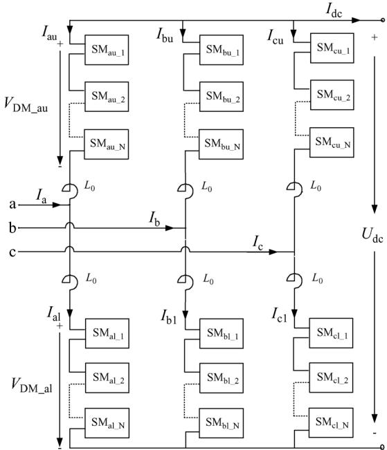  
Fig. 1. Schematic detailed MMC structure.

characteristics are very complex and computationally challenging for electromagnetic-transient (EMT) programs, given the large number of switching elements, such as insulated-gate bipolar transistors (IGBTs) [5], [6].

For accelerating the simulation of MMCs, several approaches are proposed [7]. Each is suitable for a particular operating aspect of the MMC and is described as follows.:

• Highly accurate models based on Thevenin equivalents have been developed [5], [6], which can simulate each level separately and run significantly faster than the conventional DM of the MMC. However, these models are still computationally inefficient for simulating cases with a large number of MMCs, such as HVDC grids.   
• The continuous model, which is derived from the converter’s ordinary differential equations, can be used for the controller design [8], [9].   
• The averaged-value models (AVM), which consider the fundamental frequency behavior on the ac side, are used for system-level analysis [10], [11].   
• An extension to the AVM is to introduce a stepped waveform on the ac side, more representative of the actual converter waveform [12]. This waveform is not derived from the actual individual capacitor voltages, but instead, a simple quantization of a sine wave is carried out, which is based on the control algorithm being used, and superposes

staircase steps on the underlying fundamental frequency waveform.

In the AVM, the large-scale dynamic behavior is accurately modeled although the individual capacitor voltages are not calculated. Instead, a single dc-side voltage is calculated. Hence, this type of model is significantly more efficient than models which consider the detailed MMC converter topology and has been proposed for studying the dynamic behavior of large systems, such as dc grids [7], [12], [13].

This paper focuses on the analysis and improvements of the AVM. Although the previously developed AVMs [7], [12], are quite adequate for a large range of VSC studies, as shown in this paper, their performance under dc faults and some other contingencies is not sufficiently accurate. This paper presents an approach to improve the model to remedy this inefficiency. Using EMT simulation, it also generally investigates the applicability of AVMs to different types of contingencies and suggests guidelines on when it can be used and how to use it.

# II. AVERAGED-VALUE MMC MODEL

This section discusses the topology of the modular multilevel converter (MMC) and existing work on the AVM of the MMC.

# A. Modular Multilevel Converter (MMC)

The structure of the MMC [1] is shown in Fig. 1. It includes three phase modules, each with upper and lower arms. Each arm has identical submodules connected in series. The arm reactor $L _ { 0 }$ helps to control and balance the circulating currents among the phase modules and limits the rising-rate of the fault currents. The other variables in Fig. 1 are defined as follows:

i=phase index $= \{ { \mathrm { a } } , { \mathrm { b } } , { \mathrm { c } } \} ; j =$ upper/lower arms = $\{ \mathrm { u } , l \} ; k = \mathrm { S M }$ index $\mathbf { \Sigma } = \{ 1 , 2 , \dots , \mathrm { N } \} ; I _ { \mathrm { i j } }$ : arm current in arm $j$ of phase- $\cdot i ; \mathrm { S M _ { i j \_ k } } .$ : the th SM in arm of phase- ; $V _ { \mathrm { D M \mathrm { - } i j } }$ : Sum of capacitor voltages in arm- of phase- ; $I _ { \mathrm { i } } \mathrm { \cdot }$ phase- ac current; $I _ { \mathrm { d c } } \mathrm { : }$ MMC dc current; $U _ { \mathrm { d c } } \colon$ MMC line-to-line dc voltage.

As shown in Fig. 2, each submodule of the detailed MMC contains two IGBT/DIODE switches (T1 and D1, T2 and D2) and a capacitor $C _ { \mathrm { D M } }$ . Three different modes of operation are possible [5]:

Inserted Mode: T1 is on and T2 is off, allowing the capacitor to charge or discharge, and submodule voltage $U _ { \mathrm { S M } }$ is equal to the capacitor voltage $U _ { \mathrm { C } }$ .

Bypassed Mode: T1 is off and T2 is on, the capacitor voltage remains constant, and the submodule voltage $U _ { \mathrm { S M } }$ is zero.

Blocked Mode: Both T1 and T2 are off, this condition could occur at startup and during MMC protective actions. Normally the capacitor voltage $U _ { C }$ remains constant and under abnormal conditions of high ac voltage, $\mathrm { C _ { D M } }$ may still charge through D1.

The high-speed bypass switch K1 is used to increase safety and reliability of the MMC in case of the submodules failure, and the press-pack thyristor K2 is used to protect the other semiconductors from large surge currents [12].

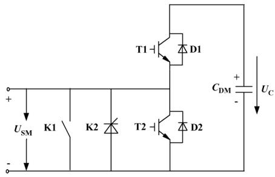  
Fig. 2. Schematic MMC submodule structure.

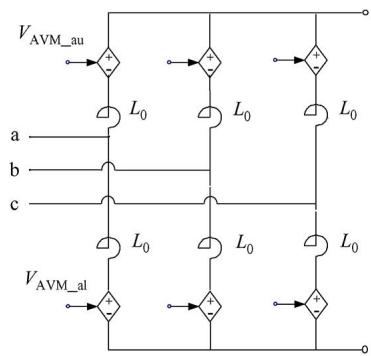  
(a)

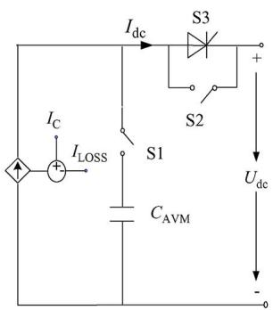  
  
Fig. 3. AVM representations: (a) ac side, (b) dc side [12].

# B. Previous Work on AVM

As mentioned in the introduction, the AVM is computationally superior to more detailed models of the MMC. This subsection summarizes the previous work on the MMC AVM. Reference [12] proposed the structure and basic principles of AVM, which is composed of 6 controlled voltage sources to represent its ac side and a controlled current source to represent its dc side, as shown in Fig. 3.

The upper and lower controlled voltage sources $( V _ { \mathrm { A V M \_ i u } }$ and $V _ { \mathrm { A V M \_ i l } }$ , respectively) of phase- , $i \in \{ a , b , c \}$ in Fig. 3 are as shown in (1) and (2). Here, $U _ { \mathrm { d c } }$ is the measured dc voltage shown in Fig. 3(b); $V _ { \mathrm { r e f } - 1 }$ represents the reference ac voltage of phase- which is obtained from the inner decoupled current control [14]. Mod[] is a quantizing function representing the specific modulation scheme used

$$
V _ {\mathrm {A V M} - \mathrm {i u}} = \operatorname {M o d} \left[ \frac {\frac {U _ {\mathrm {d c}}}{2} - V _ {\mathrm {r e f} - \mathrm {i}}}{\frac {U _ {\mathrm {d c}}}{N}} \right] \cdot \frac {U _ {\mathrm {d c}}}{N} \tag {1}
$$

$$
V _ {\mathrm {A V M} - \mathrm {i l}} = \operatorname {M o d} \left[ \frac {\frac {U _ {\mathrm {d c}}}{2} + V _ {\mathrm {r e f} - \mathrm {i}}}{\frac {U _ {\mathrm {d c}}}{N}} \right] \cdot \frac {U _ {\mathrm {d c}}}{N}. \tag {2}
$$

Reference [12] considered the nearest level control (NLC). An alternative scheme, also discussed in this paper is the carrier phase shifted sinusoidal pulse width modulation (CPS-SPWM).

The dc-side current source in the AVM in Fig. 3(b), $I _ { \mathrm { d c } }$ is calculated from a component $I _ { \mathrm { C } }$ as calculated in (3) and as in (4) derived using the principle of power balance

$$
I _ {\mathrm {C}} = \sum_ {i = a, b, c} \frac {V _ {\text {r e f} - i} I _ {\mathrm {i}}}{U _ {\mathrm {d c}}} \tag {3}
$$

$$
I _ {\text {L O S S}} = R _ {\text {L O S S}} \frac {I _ {\mathrm {C}} ^ {2}}{U _ {\mathrm {d c}}} \tag {4}
$$

$$
I _ {\mathrm {d c}} = I _ {\mathrm {C}} - I _ {\mathrm {L O S S}}. \tag {5}
$$

The current $I _ { \mathrm { L O S S } }$ responsible for resistive loss must be subtracted from the current $I _ { C }$ to yield the current transferred to the external dc network $I _ { \mathrm { d c } } ,$ as shown in (5). $R _ { \mathrm { L O S S } }$ is the equivalent resistance of the MMC representing both switching and resistive losses, whose value is selected using the losses from MMC which are close to 1% per converter.

Using the energy conservation principle a single equivalent capacitance $C _ { \mathrm { A V M } }$ that represents the total capacitance of the MMC can be calculated as in (6), where $C _ { \mathrm { D M } }$ is the individual submodule capacitance:

$$
C _ {\mathrm {A V M}} = \frac {6 C _ {\mathrm {D M}}}{N}. \tag {6}
$$

The following method is used for the AVM to imitate the freewheeling function of MMC under line-to-line dc fault:

1) All of the controlled voltage sources are set to zero.   
2) Disconnect the dc capacitor $C _ { \mathrm { A V M } }$ by opening S1.   
3) Switch the series thyristor S3 into the dc busbar by opening S2 and triggering S3 to force the dc current flow direction from the ac to dc side.

# III. CONTROL ALGORITHMS AND TEST SYSTEM

This section briefly describes a 4-terminal dc grid test system and the internal modulation and capacitor voltage balancing schemes used in the paper. The purpose of the test system is to compare the behavior of the AVM with a detailed model and identify any deficiencies.

# A. Nearest Level Control

The schematic diagram of the nearest level control (NLC)- based MMC capacitor voltage balancing scheme is shown in Fig. 4 [6]. The modulation module is to calculate the required number of conducting submodules by quantizing the ratio of the reference $V _ { \mathrm { r e f } }$ and the average capacitor voltage $U _ { \mathrm { C A V } }$ . The capacitor voltage sorting/balancing module ranks the MMC capacitor voltages $( U _ { \mathrm { C 1 } } , U _ { \mathrm { C 2 } } , \dots , U _ { \mathrm { C N } } )$ in ascending order and depending on the arm current $I _ { \mathrm { A R M } }$ direction, generates the firing signals $( T _ { \mathrm { S M 1 } } , T _ { \mathrm { S M 2 } } , \dots , T _ { \mathrm { S M N } } )$ for the submodules. When the modulation module orders a capacitor to be switched on $( \mathrm { i . e . ~ } N ( \mathrm { t } )$ increments by 1), if $I _ { \mathrm { A R M } } ~ ( { \bf e . g . } ~ I _ { \mathrm { a u } } , I _ { \mathrm { b u } } $ , etc. in Fig. 1) is positive, that is in a direction increase the capacitor charge, then the off capacitor with lowest voltage is switched on. Similar logic is used for $I _ { \mathrm { A R M } }$ is negative or decrementing.

The capacitor voltages can be controlled in a narrow band by applying the above method for all of the MMC arms [5].

# B. Carrier Phase-Shifted SPWM

The carrier phase shifted SPWM (CPS-SPWM) scheme uses triangular carrier signals to reduce the MMC output harmonic

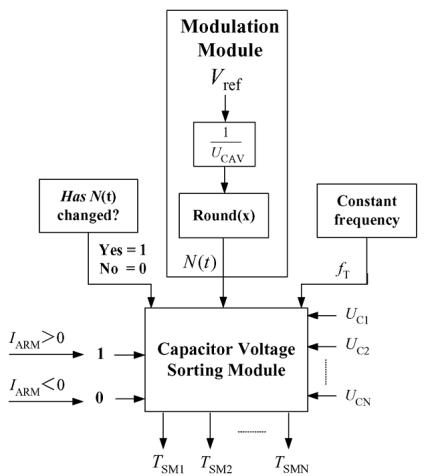  
Fig. 4. Schematic diagram of the NLC-based MMC modulation and capacitor voltage balancing schemes.

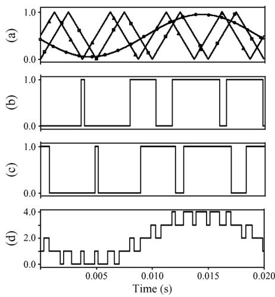  
Fig. 5. Carrier phase-shifted SPWM waveforms: (a) sinusoidal reference and carriers, (b) first submodule triggering signal, (c) second submodule triggering signal, and (d) 5-level MMC arm reference.

content. Each carrier is shifted by an angle equal to $2 \pi / \mathrm { N }$ from the previous one. By comparing a sinusoidal reference waveform with the carrier waveforms, the firing signals for each submodule are generated.

In Fig. 5, with $N = 4 ,$ , the reference sinusoidal voltage waveform, two of the four phase shifted carrier signals, the firing signals for the first two submodules and the summation of the signals for all the four submodules are shown. Assuming constant capacitor voltages, the MMC output voltage would be a scaled replica of the 5-level staircase waveform in Fig. 5(d).

The above basic scheme uses the same sinusoidal reference waveform for all of the submodules. Capacitor voltage balancing is achieved by shifting the reference waveform up or down (i.e. adding/subtracting a dc component), depending on the difference of the corresponding capacitor voltage from the average capacitor voltage of all capacitors in the arm [15], [16]. Therefore, the computation complexity of CPS-SPWM is larger than NLC in EMT-type simulations.

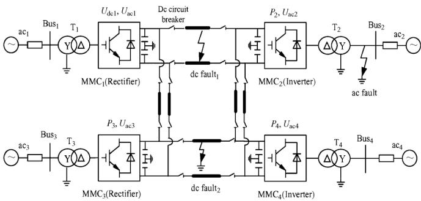  
Fig. 6. Four-terminal MMC-MTdc test system.

# C. Test System

The 11-level 4-terminal MMC-MTdc system shown in Fig. 6 is used to ascertain the applicability of the AVM for HVDC studies. For this purpose, the AVM can be compared with the full-detail MMC model. $\mathrm { M M C _ { 1 } }$ is the dc voltage controlling converter and regulates its dc voltage $U _ { \mathrm { d c 1 } }$ . The other three converters regulate their own dc powers. All converters also regulate their own ac-side voltage magnitudes. A symmetrical monopole configuration is assumed [5], [12], and the resonant dc circuit breaker [17] is installed in the dc terminal of each MMC converter.

Normally, $\mathrm { M M C _ { 1 } }$ and $\mathrm { M M C _ { 3 } }$ work in rectification mode and feed real power from the neighboring ac systems into the dc line. $\mathrm { M M C _ { 2 } }$ and $\mathrm { M M C _ { 4 } }$ work in inverter mode by transferring real power from the dc line to the neighboring ac systems.

All converters have the same ac voltage and power ratings, which are given in Fig. 18 and Table III. Several tests are carried out on the test system. These include steady state operation with varying magnitudes of the capacitance, and dc- and ac-side faults. All models were implemented on the PSCAD/EMTDC program (V4.21).

# IV. RANGE OF APPLICABILITY OF AVM AND ITS COMPUTATIONAL EFFICIENCY

The applicability of the AVM is analyzed by comparing its dynamic performances against the detailed model. This section shows that the AVM is only valid as long as the submodule capacitance is sufficiently large to guarantee good voltage balancing performance. It also shows that the efficiency (time savings) of the AVM as compared to the DM depend on the control method being used.

# A. Dependence of AVM Accuracy on Module Capacitance

In the detailed MMC, all the capacitors are distributed in phase modules. In the AVM, these are represented by only one equivalent capacitor located between the positive and negative poles, resulting in a state equation of reduced order as compared with the detailed model. Hence, it is possible to have situations in which the AVM may not be able to reproduce the MMC dynamic behavior. Although earlier research indicates that the AVM and the DM have essentially the same dynamic behavior in non-faulted situations [12], this section shows that this is only true when $C _ { \mathrm { D M } }$ is sufficiently large.

1) Setpoint Changes: The power setpoint on converter 2 in Fig. 6 is changed from $P _ { \mathrm { r e f } } = 3 ~ \mathrm { M W }$ to $P _ { \mathrm { r e f } } ~ = ~ - 3$ MW at

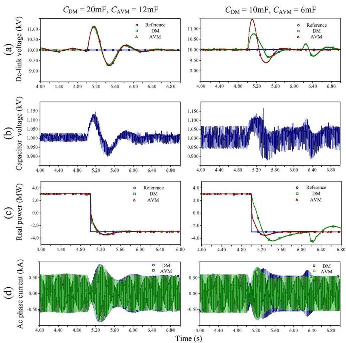  
Fig. 7. Transient responses of the real power controller setpoint change: (a) dc-link voltage, (b) capacitor voltage, (c) real power, (d) ac phase current. The left-hand column refers to $\mathrm { C } _ { \mathrm { D M } } = \overline { { 2 0 } }$ mF, $\dot { \mathrm { C } } _ { \mathrm { A V M } } = 1 \dot { 2 }$ mF, and the right-hand column refers to $\mathrm { C _ { D M } } = 1 0 \mathrm { m F } , \mathrm { C _ { A V M } } = 6 \mathrm { m F }$ .

$t = 5 ~ \mathrm { s }$ . Fig. 7 shows waveforms of dc voltage of $\mathrm { M M C _ { 1 } }$ (the dc voltage controlling converter), single submodule capacitor voltage of $\mathrm { M M C _ { 1 } }$ , the real power of $\mathrm { M M C _ { 2 } }$ and ac phase current of $\mathrm { M M C _ { 2 } }$ . Simulations are conducted with $C _ { \mathrm { D M } } = 2 0 $ m F and 10 mF, respectively, these correspond to an averaged capacitance of $C _ { \mathrm { A V M } }$ of 12 mF and 6 mF respectively from (6).

Fig. 7 shows that for the larger $C _ { \mathrm { D M } } = 2 0$ mF, the responses of the detailed model and the AVM are identical. However, for the smaller $C _ { \mathrm { D M } } ~ = ~ 1 0 $ mF, the dynamic performance of the AVM is inadequate.

2) Symmetrical Ac-Side Fault: A 50 ms three phase to ground ac fault is applied to the primary side (high voltage side) of transformer $\mathrm { T _ { 2 } }$ of converter 2 in Fig. 6 at 5.0 s. The dc voltage of $\mathrm { M M C _ { 1 } }$ and real power of $\mathrm { M M C _ { 2 } }$ are shown in Fig. 8.   
Again, when the submodule capacitance is high, the AVM can faithfully reproduce the dynamic behavior of the MMC, but this is not the case with the smaller $C _ { \mathrm { D M } }$ .   
3) Asymmetrical AC-Side Fault: A 50 ms single-phase-toground ac fault is applied to the primary side (high voltage side) of transformer $\mathrm { T _ { 2 } }$ of converter 2 in Fig. 6 at 8.0 s. The dc voltage of $\mathrm { M M C _ { 1 } }$ and real power of $\mathrm { M M C _ { 2 } }$ are shown in Fig. 9.   
As shown in Fig. 9, under asymmetrical ac-side fault, the averaged-value MMC model shows satisfactory agreement with the full detailed model if the capacitance $C _ { \mathrm { D M } }$ is high enough.   
4) Comment on Capacitor Size: One of the necessary conditions for proper operation of the MMC-VSC is that all submodule capacitor voltages must be relatively ripple free and nearly equal (balanced) in all submodules. These assumptions are also necessary in the derivation of the AVM. It is easier to achieve both these objectives with a larger submodule capacitance $C _ { \mathrm { D M } }$ . Hence, it is not surprising that the AVM is able to

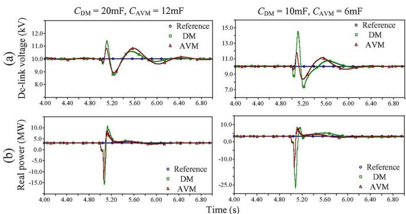  
Fig. 8. Transient responses of the three phase to ground ac fault: (a) dc-link voltage, (b) real power. The left-hand column refers to $\mathrm { C } _ { \mathrm { D M } } \ = \ 2 0$ mF, $\mathrm { C _ { A V M } } = 1 2 \ : \mathrm { m F } .$ , and the right-hand column refers to $\mathrm { C _ { D M } } = 1 0 \mathrm { m F , C _ { A V M } } =$ 6 mF.

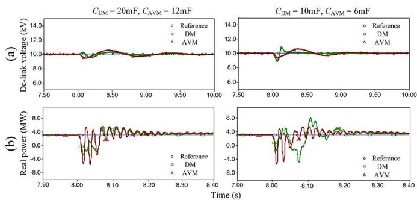  
Fig. 9. Transient responses of the single-phase-to-ground ac fault: (a) dc-link voltage, (b) real power. The left-hand column refers to $\mathrm { C } _ { \mathrm { D M } } \ = 2 0 $ mF, $\mathrm { C _ { A V M } } = 1 2$ mF, and the right-hand column refers to $\mathrm { C } _ { \mathrm { D M } } = 1 0$ mF, $\mathrm { C _ { A V M } = }$ 6 mF.

reproduce the MMC dynamics for large $C _ { \mathrm { D M } }$ values. Generally, in real-world MMCs, $C _ { \mathrm { D M } }$ will be sufficiently large for operational reasons and so the averaged model should work well.

However, the model user should be aware of the potential non-applicability of the AVM. For example reference [12] also introduces the capacitance estimation method to ensure that the ripple of the submodule voltage is kept within a range of $\pm 5 \%$ . In the example in this paper, this corresponds to $C _ { \mathrm { D M } } = 8$ mF. The above simulations show that even for $C _ { \mathrm { D M } } = 1 0 $ mF, the AVM is not usable. Thus, an MMC designed with a ripple value of 5% will not be properly represented by an AVM. The 20 mF capacitance in the above simulations, for which the AVM was usable, corresponds to a ripple of 2%.

# B. Use of AVM With Different Voltage Balancing Algorithms

Previous AVM models were presented with only the NLC control method for voltage control and capacitor balancing mentioned in Section III. The discussion in the previous subsection showed that the AVM requires balanced and constant submodule voltages to be valid. In addition to capacitor size, this is also a function of the voltage balancing algorithm. Hence it is interesting to investigate the applicability of the AVM with different control methods. This section will show that the computation time of the DM simulation is significantly impacted by the control method, but the computation time of the AVM is less affected. Thus the potential savings from using an AVM

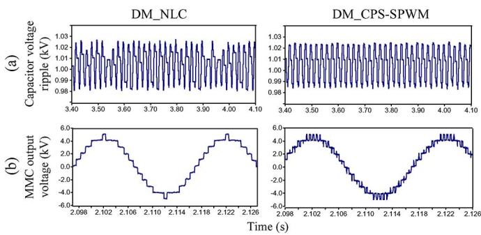  
Fig. 10. Characteristics comparisons: (a) capacitor voltage ripple and (b) MMC output voltage. The left-hand column refers to DM_NLC, and the right-hand column refers to DM_CPS-SPWM.

can be different depending on the control method. The NLC and CPS-SPWM methods are used in this demonstration.

The two control methods were implemented using the DM as well as the AVM. Note that in the AVM, the control algorithms are only used to generate a stepped waveform on the ac side so that the harmonic behavior is loosely represented in the model. Individual capacitor balancing is not carried out, because of the assumption of equal capacitor voltages. The DM explicitly considers voltage balancing and, hence, models each of the 11-level capacitors separately (with $C _ { \mathrm { D M } } = 2 0 \mathrm { m F }$ , and approximately the same switching frequency of 200 Hz), whereas the AVM assumes an average capacitor voltage. Fig. 10 shows the dc capacitor voltage ripple and ac voltage waveforms for the two control methods. Although the capacitor ripple is of the same magnitude, the CPS-SPWM shows a more regular waveform. The CPS-SPWM also shows an ac output voltage with fewer ripples as compared to the NLC as shown by the spectral plots in Fig. 11. This results in a lower total harmonic distortion (THD) as seen in Table I. However, the CPS-SPWM switching pattern results in a much larger computation time for the DM as shown in the table. Hence the AVM speedup factor (ratio of CPU times of DM and AVM) is significantly larger when the switching method is more complex. This speedup will be even larger with a larger number of levels.

# V. LIMITATIONS OF THE PREVIOUSLY DEVELOPED AVM AND IMPROVED AVERAGED-VALUE MODEL

This section shows that the previously developed AVM models are deficient in simulating certain types of dc faults and converter blocking behavior. A new AVM model is proposed to overcome some of these deficiencies. Validation of the new model is the subject of Section VI.

# A. Limitations of Previously Developed AVM Models

1) One of the Problems in the Approach of [12] is that $C _ { \mathrm { A V M } }$ must be disconnected during a fault using S1 (see Fig. 3). Thus the charging of $C _ { \mathrm { A V M } }$ is not considered during dc faults or converter blocking. Also as the single current source representation on the dc side is unable to accurately account for freewheeling effects of D2 in Fig. 2. Also, diode D2 ensures that the capacitor voltage $U _ { \mathrm { C } }$ of each

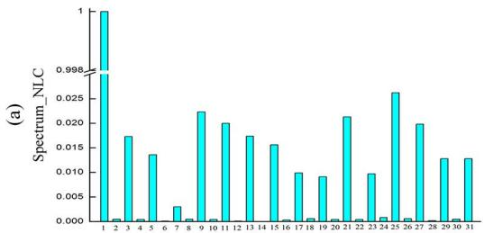

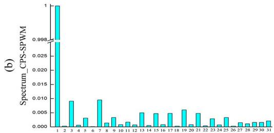  
Fig. 11. MMC output ac voltages spectrum: (a) NLC. (b) CPS-SPWM.

TABLE I THD AND COMPUTATION TIME OF CONTROL METHODS   

<table><tr><td></td><td>THD</td><td>CPU time (DM)</td><td>CPU time (AVM)</td><td>AVM speedup factor</td></tr><tr><td>NLC</td><td>6.79%</td><td>3355s</td><td>123s</td><td>27.3</td></tr><tr><td>CPS-SPWM</td><td>2.07%</td><td>9802s</td><td>139s</td><td>70.5</td></tr></table>

submodule as well as the total dc voltage of the MMC will never go negative. However, this cannot be guaranteed in AVM under long-duration dc and ac faults.

2) During a line-to-line dc fault, the equivalent capacitor $C _ { \mathrm { A V M } }$ is discharged through the on-state resistances of S1 and S3 (see Fig. 3). In the detailed model, the submodule capacitors discharge through arm reactors and through other IGBT/DIODE switches, creating a significantly different response.   
3) In the case of a symmetrical monopole (as is the case in the test system of Fig. 6), a line to ground fault does not immediately interrupt the converter operation, and the line-to-line voltage $U _ { \mathrm { d c } }$ remains unchanged, but it does create a dc offset voltage on the dc line, and consequently on the ac busbar. As the AVM in Fig. 3 uses only the measured $U _ { \mathrm { d c } }$ to derive the ac-side voltage, it errs by not showing the dc offset on the ac busbar.

An improved AVM of the MMC is proposed in the next subsection which overcomes the above listed drawbacks of the previously developed AVM.

# B. Improved Averaged-Value Model

The proposed AVM is shown in Fig. 12. In normal (unfaulted, unblocked) operation, switches S3, S4 and ganged switches S1 are closed and ganged switches S2 are open. The circuit therefore degenerates into the previous model of Fig. 3.

1) Blocked State: To improve the simulation of the blocked state, so that startup and postfault blocking can be accurately represented (see Section V-A limitation 1), the following switching actions are simultaneously implemented:

a) Controlled voltage sources $( \mathrm { e . g . , \it V _ { A V M \mathrm { - a u } } ) }$ are set to zero. Hence, the waveforms generated by the IGBT switching of the MMC capacitors are no longer present.   
b) Ganged switch S1 and switch S3 are opened. Switch S2 is closed. This inserts diode D1 in the circuit. D1 represents all forward conducting diodes in the bridge arm that form a freewheeling path when ac-side voltage exceeds the capacitor voltage.   
c) Controlled current source $J _ { \mathrm { d c } }$ is set to zero. As the converter is blocked, there is no more controlled current injection. Instead, the connection between the dc and ac sides is through the diodes D1 and D2. Closing of S2 ensures this.   
d) After the switch actions in b) above are implemented, diode D3 ensures that the capacitor voltage never goes negative. It can be easily verified by looking at Fig. 2 of a submodule, that no capacitor voltage can go negative, as then the submodule switch diodes would turn on.

2) Line-to-Line Dc Fault Behavior: To get the right response with a line-to-line dc fault ( , in Fig. 6), switch S4 is opened. All other switches are as in the normal operating conditions described at the start of this subsection. The equivalent capacitor now discharges into this fault through equivalent resistor and inductor $R _ { \mathrm { E Q } }$ and $L _ { \mathrm { E Q } }$ , as in (7) and (8). Here $R _ { 0 }$ is the sum of all on state arm resistances and $L _ { 0 }$ is the MMC arm reactor. The 2/3 ratio comes from the 3 parallel legs and two arms in each leg (series). With these changes, the AVM provides the same transient dc voltage behaviors as the detailed model.

$$
R _ {\mathrm {E Q}} = \frac {2 R _ {0}}{3} \tag {7}
$$

$$
L _ {\mathrm {E Q}} = \frac {2 L _ {0}}{3}. \tag {8}
$$

3) Line-to-Ground DC Fault Behavior: The presence of S2 (i.e., ganged switches S2 are open) essentially connects the dc and ac sides together (unlike the previous AVM in Fig. 3(a) and (b)). This allows the proper offset voltage to appear on the ac side following a single-line-to-ground fault ( , in Fig. 6), on the symmetrical monopole.

# VI. VALIDATIONS OF THE PROPOSED AVM

This section validates the improved AVM by comparing the proposed AVM against the previous AVM and detailed MMC models for various scenarios.

# A. Accuracy Validation of the Proposed AVM

In the simulations to follow, the capacitor size is as before, that is, $\mathrm { C } _ { \mathrm { D M } } = 2 0$ mF (detailed model); which corresponds to $C _ { \mathrm { A V M } } = 1 2$ mF in the AVM.

Scenario 1: Startup Charging of MMC Capacitors: The MMC valves are blocked to charge the capacitors in uncontrolled rectification mode via the freewheeling anti-parallel diodes. The dc voltage and ac phase a current of the first converter (i.e., $\mathrm { M M C } _ { 1 } )$ in the 4-terminal grid are shown in Fig. 13. The traces

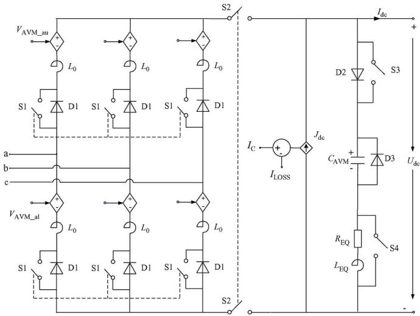  
Fig. 12. Schematic diagram of the proposed AVM.

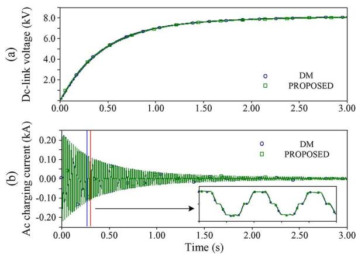  
Fig. 13. Waveforms of $\mathrm { M M C _ { 1 } }$ during converter startup: (a) dc-link voltage and (b) phase a charging current.

from the detailed model are compared with the proposed AVM. Comparison with the previous AVM models [12] is not possible, because as discussed in Section V-A-1, the action of the freewheeling diodes cannot be properly accounted for in those models.

Results show that as the dc voltage is increased (Fig. 13(a)), the ac charging current decreases gradually (Fig. 13(b)). The curves for the detailed model and AVM are virtually identical, thereby validating the proposed AVM’s capability to model startup charging. The maximum dc voltage error is 0.08 kV (1% of rated value of 8 kV) and maximum ac charging current error is 0.002 kA (less than 1% of rated value of 0.22 kA).

Scenario 2: Application of a Line-to-Line DC Fault: A dc (as shown in Fig. 6) is applied to the MMC-MTdc system at 3.5 s. The dc voltage, ac voltage, real power and dc current of $\mathrm { M M C _ { 2 } }$ are shown in Fig. 14. No dc circuit breaker is present, neither are the valves blocked in this scenario. The detailed model simulations are compared against the previous and proposed AVMs.

Fig. 14 shows that the proposed AVM closely reproduces the detailed model’s results except for some oscillations in measured instantaneous power (Fig. 14(c)). The maximum error in the dc-link voltage is 0.25 kV (2.5% of rated value of 10 kV),

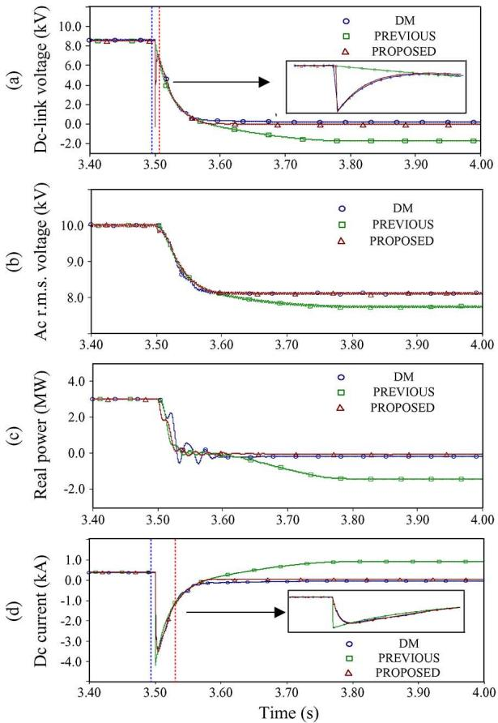  
Fig. 14. behaviors under dc : (a) dc-link voltage, (b) ac voltage (rms. value), (c) real power, and (d) dc current.

in ac voltage it is 0.2 kV (2% of rated value of 10 kV). The maximum error in the instantaneous power trajectory during the oscillatory response phase is 20% of the rated value. However, the proposed model follows the average power response well, whereas the results for the previous AVM are entirely wrong. At the very beginning of dc fault, all the capacitors in the detailed model are discharged rapidly which generates large arm currents and, hence, a voltage drop $\mathrm { L _ { 0 } d i } / \mathrm { d t }$ across the arm reactor and corresponding dc current drop [see insets in Fig. 14(a) and (d)]. The proposed AVM can simulate such detailed transients by switching $R _ { \mathrm { E Q } }$ and $L _ { \mathrm { E Q } }$ into the $C _ { \mathrm { A V M } }$ branch. With respect to ac voltage and power plots, Diode D3 in the proposed AVM (Fig. 12) clamps the dc voltage to zero.

The previous model lacks this feature, and so exhibits a negative dc voltage and, hence, manifests incorrect simulations for ac voltage, ac power and dc current.

Scenario 3: Application of A Line-to-Line DC Fault Followed by MMC Valve Blocking: As before, a dc fault is applied at 3.5 s, but all converters are blocked 5 ms later (at 3.505 s). Dc breaker clearing is not considered, so the fault continues to be fed via the anti-parallel freewheeling diodes. Fig. 15 shows plots of dc voltage, ac voltage, real power and dc current. It confirms that the proposed AVM reproduces the detailed model results for the dc fault very accurately (the maximum error is below 2% of the rated values for all traces), whereas the previous model shows incorrect dc voltage (because the dc capacitor in Fig. 3 is disconnected and not available for further

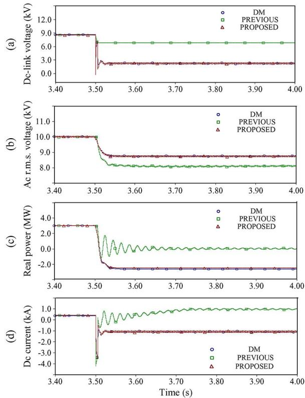  
Fig. 15. behaviors under dc and MMCs blocking: (a) dc-link voltage, (b) ac voltage (rms value), (c) real power, and (d) dc current.

charging/discharging). Similarly, the model also does not accurately represent the freewheeling action, thereby causing errors in dc current, voltage, and power simulations. Scenarios 2 and 3 are not the normal way in which a dc grid would be operated, but demonstrate that the proposed model works well even for these abnormal scenarios. This is important for a general-purpose model, which may be called upon to simulate normal as well as abnormal cases.

Scenario 4: Application of a Line-to-Line DC Fault and Clearing with a Resonant Circuit Breaker; This is the more realistic scenario for a dc grid, where the dc fault would be cleared by a circuit breaker.

As before, the fault is applied at 3.5 s, and the circuit breakers are asked to open 5 ms later. They eventually open when the resonant ac current equals the dc current [17], clearing the dc fault. The dc circuit breakers are reclosed at 5.0 s and the system resumes normal operation. The dc and ac voltages, real power, and dc current plots for $\mathrm { M M C _ { 1 } }$ are shown in Fig. 16. In this case, the proposed and previously developed AVMs can provide excellent performance compared to the detailed MMC model, and both model errors are below 2% of the rated values.

Scenario 5: A Line-to-Ground DC fault is applied on the DC Line; Fig. 17 shows the ac phase voltage of the proposed AVM for a single-line-to-ground fault. Since the configuration is a symmetrical monopole, it does not disrupt power transfer, but does impose a dc offset on the dc conductors (one conductor voltage goes to zero, and other increases to twice the rated voltage) retaining the same dc line-to-line voltage. All models show this correctly, but the previous model does not show the offset on the ac voltage whereas the proposed model

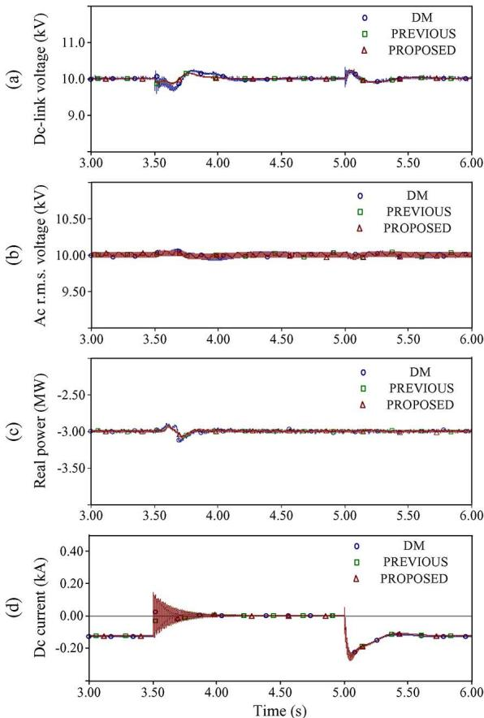  
Fig. 16. behaviors after dc fault clearing with a resonant dc circuit breaker: (a) dc-link voltage, (b) ac voltage (rms value), (c) real power, and (d) dc current.

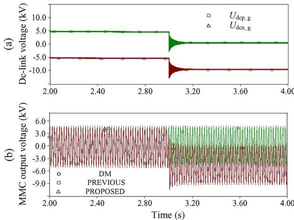  
Fig. 17. Line-to-ground dc fault behaviors: (a) $\mathrm { M M C _ { 1 } }$ single-line-to-ground dc-link voltage $U _ { \mathrm { d c p - g } }$ and $U _ { \mathrm { d c n \mathrm { \bf - g } ; \mu } }$ , (b) output ac voltage.

shows this correctly [Fig. 17(b)], with maximum error below 1% of the rated values.

# B. Error Analysis of the Proposed AVM

In subsection A, various scenarios, including the startup and dc fault transients with and without MMC blockings and dc circuit breakers (CBs), are presented. Most ac- and dc-side quantities can be accurately simulated by the proposed AVM due to the topology modifications and the corresponding switching logic that were introduced. In general, the errors are less than 2.5% of

TABLE II CPU TIMES OF THE MODELS   

<table><tr><td>Model</td><td>CPU time</td><td>AVM speedup factor</td></tr><tr><td>Proposed AVM</td><td>193s</td><td>17.4</td></tr><tr><td>Previous AVM</td><td>123s</td><td>27.3</td></tr><tr><td>DM</td><td>3355s</td><td>1</td></tr></table>

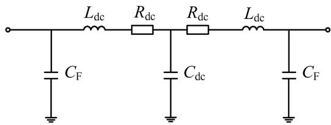  
Fig. 18. Detailed structure of the dc line.

TABLE III PARAMETERS OF THE MMC–MTDC TEST SYSTEM   

<table><tr><td>Ac system</td><td>Ac voltage
Real power</td><td>UBus(L-L_RMS) = 10kV
P = 3MW</td></tr><tr><td rowspan="4">Transformer</td><td>Capacity</td><td>STN=3.5MVA</td></tr><tr><td>Winding type</td><td>YN/△</td></tr><tr><td>Turn ratio</td><td>K = 10kV/5.6kV</td></tr><tr><td>Leakage reactance</td><td>LT=0.004H</td></tr><tr><td rowspan="3">MMC</td><td>Arm reactance</td><td>L0=0.002H</td></tr><tr><td>SM capacitance</td><td>CDM=20mF, 10mF</td></tr><tr><td>SM voltage</td><td>USM=1kV</td></tr><tr><td rowspan="3">Dc system</td><td>Dc voltage</td><td>UDc=10kV</td></tr><tr><td>Dc filter</td><td>CF=1uF</td></tr><tr><td>Dc line (Fig. A.1)</td><td>Ldc=40mH; Rdc=1.0Ω; Cdc=10.0uF</td></tr></table>

rated values for any simulated quantity, with the detailed model considered as a reference.

The only response which could not be perfectly simulated by the proposed AVM was the instantaneous power response of Fig. 14(c), where small instantaneous real power oscillations are seen in the detailed response, although the average power responses were essentially identical. This is because the 6N capacitors of the DM are represented by only one equivalent capacitor in the AVM model, resulting in a state equation of reduced order compared with the DM. However, the proposed AVM follows the average power response accurately and should be adequate for system-level studies. Note that accuracy figures for the previous AVM are not meaningful, because the model is wrong and will give arbitrary error for various situations.

# C. Computation Efficiency Test of the Proposed AVM

The largest system simulated is the 4-terminal dc grid in Fig. 6, with its full complement of converter controls. The simulation platform was a 4 core, 2.67 GHz Intel i7 CPU; with 2 GB of RAM and a 64-b Windows 7 operating system. The total simulation duration was 5 s and the solution time step was 20 . The CPU times for the three models (proposed AVM, previous AVM and detailed model) and the corresponding speedup factors (in comparison with the detailed model) are presented in Table II.

The CPU times shown in Table II indicate that the proposed and previous AVM models are significantly faster than the full detailed MMC model. Due to the additional features required for accurately modeling the response to severe dc faults and blocking conditions, the proposed model is about 37% slower than the previous model.

# VII. CONCLUSION

This paper analyzed the applicability of the averaged-value model (AVM) of the MMC and showed that any AVM is only effective as long as the submodule capacitance in the detailed model is sufficiently large to make the capacitor voltages well balanced. This is considered not to be a serious drawback for system-level studies, as it is likely that any actual MMC installation would satisfy this condition. The type of voltage balancing scheme does not appear to have significant impact on the validity of the model, but the speedup afforded by the AVM is more when a more complex control scheme is in effect.

Due to its topology, the previously developed AVM cannot simulate dc faults and MMC blocking behaviors properly, as would be required for multiterminal dc grid simulations. To address this issue, the paper has proposed the improved AVM which changes the model topology to include continued charging of the dc capacitor and the freewheeling diode operation during abnormal operating conditions. This model is shown to work well simulating all operating conditions.

# ACKNOWLEDGMENT

The authors would like to thank the University of Manitoba Postdoctoral Fellows Dr. H. Ding and Dr. S. Fan for providing many useful suggestions.

# REFERENCES

[1] A. Lesnicar and R. Marquardt, “An innovative modular multilevel converter topology suitable for a wide power range,” in Proc. IEEE Bologna Power Tech Conf., 2003, pp. 3–6.   
[2] S. Rohner, S. Bernet, M. Hiller, and R. Sommer, “Modulation, losses, semiconductor requirements of modular multilevel converters,” IEEE Trans. Ind. Electron., vol. 57, no. 8, pp. 2633–2642, Aug. 2010.   
[3] A. Antonopoulos, L. Angquist, and H. P. Nee, “On dynamics and voltage control of the modular multilevel converter,” in Proc. 13th Eur. Conf. Power Electron. Appl., 2009, pp. 1–10.   
[4] L. Harnefors, A. Antonopoulos, S. Norrga, L. Angquist, and H. Nee, “Dynamic analysis of modular multilevel converters,” IEEE Trans. Ind. Electron., vol. 57, no. 8, pp. 2633–2642, Aug. 2013.   
[5] U. N. Gnanarathna, A. M. Gole, and R. P. Jayasinghe, “Efficient modeling of modular multilevel HVDC converters (MMC) on electromagnetic transient simulation programs,” IEEE Trans. Power Del., vol. 26, no. 1, pp. 316–324, Jan. 2011.   
[6] J. Xu, C. Zhao, W. Liu, and C. Guo, “Accelerated model of modular multilevel converters in PSCAD/EMTDC,” IEEE Trans. Power Del., vol. 28, no. 1, pp. 129–136, Jan. 2013.   
[7] H. Saad, J. Peralta, S. Dennetiere, J. Mahseredjian, J. Jatskevich, J. A. Martinez, A. Davoudi, M. Saeedifard, V. Sood, X. Wang, J. Cano, and A. Mehrizi-Sani, “Dynamic averaged and simplified models for MMC-based HVDC transmission systems.,” IEEE Trans. Power Del., vol. 28, no. 3, pp. 1723–1730, Jul. 2013.   
[8] S. Rohner, J. Weber, and S. Bernet, “Continuous model of modular multilevel converter with experimental verification,” in Proc. Energy Convers. Congr. Expo., 2011, pp. 4021–4028.   
[9] N. Ahmed, L. Angquist, S. Norrga, and H. Nee, “Validation of the continuous model of the modular multilevel converter with blocking/deblocking capability,” in Proc. IET Int. Conf. AC DC Power Transm., 2012, pp. 1–6.

[10] S. P. Teeuwsen, “Simplified dynamic model of a voltage-sourced converter with modular multilevel converter design,” in Proc. IEEE Power Energy Soc. Power Syst. Conf. Expo., 2009, pp. 1–6.   
[11] D. C. Ludois and G. Venkataramanan, “Simplified dynamics and control of modular multilevel converter based on a terminal behavioral model,” in Proc. IEEE Energy Convers. Congr. Expo., 2012, pp. 3520–3527.   
[12] J. Peralta, H. Saad, S. Dennetiere, J. Mahseredjian, and S. Nguefeu, “Detailed and averaged models for a 401-Level MMC-HVDC system,” IEEE Trans. Power Del., vol. 27, no. 3, pp. 1501–1508, Jul. 2012.   
[13] J. Peralta, H. Saad, S. Dennetiere, and J. Mahseredjian, “Dynamic performance of averaged-value models for multi-terminal VSC-HVDC systems,” in Proc. IEEE Power Energy Soc. Gen. Meeting, 2012, pp. 1–8.   
[14] G. Bergna, M. Boyra, and J. H. Vivas, “Evaluation and proposal of MMC-HVDC control strategies under transient and steady state conditions,” in Proc. 14th Eur. Conf. Power Electron. App., 2011, pp. 1–10.   
[15] M. Hagiwara and H. Akagi, “Control and experiment of pulsewidthmodulated modular multilevel converters,” IEEE Trans. Power Electron., vol. 24, no. 7, pp. 1737–1746, Jul. 2009.   
[16] X. Li, Q. Song, W. Liu, and J. Li, “Capacitor voltage balancing control by using carrier phase-shift modulation of modular multilevel converters,” Proc. CSEE, vol. 32, no. 9, pp. 49–55, Mar. 2012.   
[17] C. Peng, J. Wen, X. Wang, Z. Liu, and K. Yu, “Application research and prototype development of 800 kV UHVDC breaker,” in Proc. 2nd Int. Intell. Syst. Design Eng. Appl., 2012, pp. 1387–1391.

  
transmission systems.

Jianzhong Xu (S’12) was born in Shanxi Province, China. He received the B.S. and Ph.D. degrees in power system and its automation from North China Electric Power University (NCEPU), Beijing, China, in 2009 and 2014, respectively.

Currently, he is a Lecturer of the State Key Laboratory of Alternate Electrical Power Systems with Renewable Energy Sources, NCEPU. He was a Visiting Scholar at the University of Manitoba, Winnipeg, MB, Canada from 2012 to 2013. His research interests include HVDC and flexible ac

Aniruddha M. Gole (S’77–M’82–SM’04–F’10) received the B.Tech. degree in electrical engineering from the Indian Institute of Technology, Bombay, India, in 1978 and the Ph.D. degree in electrical engineering from the University of Manitoba, Winnipeg, MB, Canada, in 1982, where he is currently a Distinguished Professor.

Dr. Gole is a member of the original development team for the PSCAD/EMTDC program. He is the 2007 recipient of the IEEE PES Nari Hingorani FACTS Award. He is a Registered Professional

Engineer in the Province of Manitoba, Canada.

Chengyong Zhao (M’05) was born in Zhejiang, China. He received the B.S., M.S., and Ph.D. degrees in power system and its automation from North China Electrical Power University (NCEPU), Beijing, China, in 1988, 1993, and 2001, respectively.

Currently, he is the Professor and Deputy Director of the New Energy Power Grid Institute in Electrical and Electronic Engineering School of NCEPU, "111" project member of "Introducing Talents of Discipline to Universities Program" of Ministry of Education and State Administration of Foreign Experts Affairs,

and Commissioner of the power quality Specialization Committee of the China Power Supply Society. His research interests include HVDC, flexible ac transmission systems, and power quality.