# Computation of ground potential rise and grounding impedance of simple arrangement of electrodes buried in frequency-dependent stratified soil☆

Anderson R.J. de Araújo a,* , Jaimis S.L. Colqui b , Claudiner M. de Seixas c , S´ergio Kurokawa b Bamdad Salarieh d , Jos´e Pissolato Filho a , Behzad Kordi d

a University of Campinas, SP, Brazil   
b Sao ˜ Paulo State University, SP, Brazil   
c Federal Institute of Sao ˜ Paulo-IFSP, SP, Brazil   
d University of Manitoba, Winnipeg, MB, Canada

# A R T I C L E I N F O

# Keywords:

Electromagnetic transients

Lightning

Grounding impedance

Stratified soil

Frequency-dependent soil

# A B S T R A C T

Grounding electrodes are used to provide a low-impedance dissipation path for the excess lightning or fault currents. Several studies have been dedicated to the computation of the grounding impedance of different electrode arrangements considering either the frequency dependence of soil parameters (resistivity ρ and relative permittivity εr) or the multi-layer nature of soil. This paper aims at the calculation of the grounding impedance and the ground potential rise (GPR) of simple electrode arrangements (vertical and cross electrodes) due to the injection of first and subsequent lightning currents in various configurations of soil, considering a frequencydependent stratified soil.

A frequency-domain full-wave electromagnetic solver based on the Method of Moment (MoM) that employs a stratified medium Green’s function is used to compute the grounding impedance in a frequency range of 100 Hz to 10 MHz. The transient GPRs are computed using the equivalent circuit of the grounding system, obtained through the application of the Vector Fitting (VF) technique and recursive convolution method.

The simulation results show that considering the frequency dependence of the soil parameters has no effect on the low-frequency grounding impedance up to ≈ 10 kHz. However, the frequency dependence of soil parameters leads to a considerable variation of the grounding impedance at higher frequencies especially for soils of higher resistivity. Furthermore, it is shown that considering the layers of soil has a more significant impact on the GPR of the vertical electrode than that of the cross electrode.

# 1. Introduction

Grounding systems play a fundamental role for the protection and stability of electrical power systems. Power systems are subjected to several transient events such as lightning strikes or faults with highamplitude currents and grounding systems must properly dissipate the excess current into the soil. Furthermore, grounding electrodes provide protection for humans in the surrounding area of the affected structure and prevent damage to the facilities and equipment during transients or faulty operational conditions. A grounding system having a low impedance is required to mitigate the surge overvoltages caused by

lightning strikes in transmission lines [1,2]. Additionally, it is necessary to dissipate the fault current in a way to minimize the step and touch voltages around the affected structure [3,4]

In this context, there are several factors to be taken into account to accurately compute the grounding impedance in power systems, such as: (i) arrangement of the grounding conductors; (ii) frequency dependence of the soil electrical parameters; (iii) multi-layer structure of soil; (iv) mutual coupling between the segments of grounding system; and (v) the soil ionization effect [5,6]. Concerning the grounding arrangement, cylindrical conductors buried either as driven vertical electrodes (rods) or horizontal electrodes (counterpoises) or combination of these are

used to achieve a low grounding impedance. As an example, the cross topology that combines the vertical and horizontal electrodes is described and analysed in [7–9]. Long vertical electrodes have the advantage of reaching deep layers of soil with lower resistivity [10]. Any electrode arrangement should guarantee that the ground potential rise (GPR) is below a threshold to avoid danger to equipment and personnel working nearby these grounding systems.

An important characteristic of soil is the frequency dependence of the its electrical parameters (relative permittivity $\varepsilon _ { r }$ and resistivity ${ \boldsymbol \rho } )$ [2, 11–14]. These electrical parameters are significantly affected by the frequency, especially at the high frequencies and for soil of high resistivity and water content $[ 2 , 1 5 , 1 6 ]$ . The frequency dependence of soil parameters has been extensively investigated in the literature and several formulae have been developed based on measurements on soil samples in laboratory and field experiments [12,13,17]. As a consequence of considering the frequency dependence of soil parameters in the grounding performance, the waveform of the GPR is modified, presenting reduced peaks if frequency dependence of soil is taken into account compared to those obtained with soil of constant parameters [14,17,18].

Many works have presented methods to compute the apparent soil resistivity of stratified ground with experimental measurements or numerical methods [4,19]. The main difficulties are the determination of the exact number of soil layers and the thickness of each layer to properly represent the soil. Equations are proposed in the literature to compute the equivalent resistance of layers based on parallel rods inserted in a multilayer soil, such as Blattner’s equation that requires a reflection factor k and a correction factor B [20]. Another approach estimates the grounding impedance based on two-parallel impedances, where each one is inserted in a different soil layer and requires a correction factor η to conserve the conditions predicted in Tagg’s equation [21].

This paper investigates the grounding impedance of different simple arrangement of electrodes buried in a frequency-dependent stratified soil. This is an extension of a recent paper by the authors [6], and uses a full-wave electromagnetic software based on the Method of Moments (MoM) that employs a stratified medium Green’s function in a frequency range of 100 Hz to 10 MHz. Vertical and cross electrode arrangements buried in homogeneous, 2-layer, and 3-layer frequency-independent or -dependent soil are considered. The time-domain GPR waveforms are computed based on an equivalent circuit synthesized using the Vector Fitting (VF) technique [22] followed by a recursive convolution method [23]. The time-domain GPR waveforms are computed for both first and subsequent lightning stroke currents injected into the electrodes. Numerical results demonstrate a significant reduction of the grounding impedance above a certain frequency due to the frequency dependence of soil parameters. This effect also results in a noticeable modification of GPR waveforms, especially in homogeneous and 2-layer soils of high-resistivity.

# 2. Frequency dependence of soil electrical parameters

The frequency dependence of soil electrical parameters has been investigated by many authors in the literature. Based on laboratory measurements of soil samples, different formulae have been proposed to take this effect into account, e.g. Longmire and Smith [24], Messier [25], Portela [26], and Alípio and Visacro [12,18]. A complete review and comparison of such models can be found in [17]. In this work, the Visacro and Alipio’s (VA) formula for the frequency dependence of soil is adopted. This model proposed a curve-fitted expression to calculate $\rho ( f )$ and $\varepsilon _ { r } ( f )$ based on a large number of field measurements in different locations in Brazil, and are given by Visacro and Alipio [12]

$$
\rho (f) = \rho_ {0} \left\{1 + \left[ 1. 2 \times 1 0 ^ {- 6} \left(\rho_ {0}\right) ^ {0. 7 3} \right] \left[ (f - 1 0 0) ^ {0. 6 5} \right] \right\} ^ {- 1} \tag {1}
$$

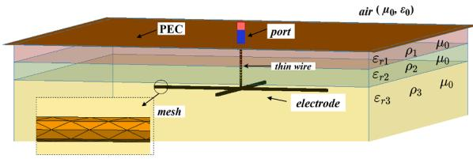  
Fig. 1. View of the cross electrode in the simulation software FEKO.

$$
\varepsilon_ {r} (f) = \left\{ \begin{array}{l l} 7. 6 \times 1 0 ^ {3} f ^ {- 0. 4} + 1. 3 0 & f \geqslant 1 0 \mathrm {k H z} \\ 1 9 2 & f <   1 0 \mathrm {k H z} \end{array} \right. \tag {2}
$$

where $\rho _ { 0 }$ is the DC resistivity measured at a frequency of 100 Hz. These expressions are used in this paper to compute the grounding impedance where each layer of soil is modeled as having frequency-dependent $\rho ( f )$ and $\varepsilon _ { r } ( f )$ . To investigate the effect of the frequency-dependence of soil electrical parameters for a multi-layer soil, two different grounding electrodes are buried in various configurations of stratified soil, as explained in the following section.

# 3. Computation of grounding impedance

# 3.1. Simulation model using FEKO

In this paper, the simulation of grounding systems are performed employing the full-wave electromagnetic solver of FEKO/Altair Engineering® [27] commercial software. FEKO employs the Method of Moments (MoM) to solve an electric field integral equation (EFIE) in the frequency domain to calculate the radiation of electromagnetic fields and impedance of an antenna of a given topology. The simple arrangement of grounding electrodes can be interpreted as an antenna embedded in a frequency dependent, stratified lossy medium (soil). For the problem studied in this paper, planar multilayer Green’s function has been employed to represent the soil topology and then, the grounding impedance are computed. Once the current distribution along an object is known, several quantities such as the induced/radiated electromagnetic fields and the scattering (S) parameters can be calcu lated. To compute the grounding impedance of a given grounding system, an infinite perfect electric conductor (PEC) sheet is considered on the top of the soil medium. Fig. 1 shows the PEC sheet above a 3-layer

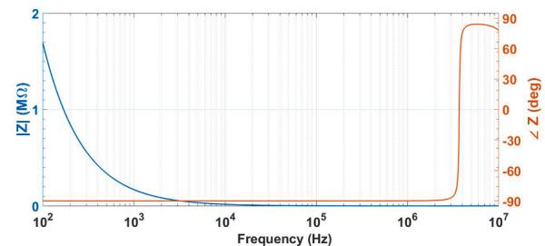

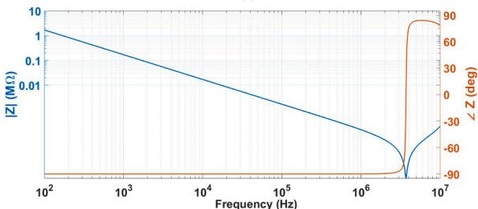  
  
(b)   
Fig. 2. Magnitude and phase of the impedance $z$ of the 5-m cross electrode 2.5 m below the PEC surface in lossless medium assuming $\varepsilon _ { r } = 1 0 ; \mathsf { a } )$ linear-scale y axis, b) log-scale y axis.

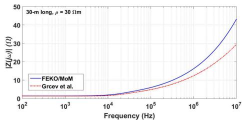  
(a)

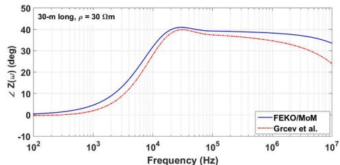

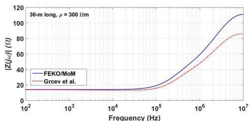

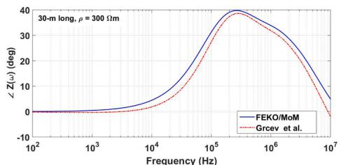  
(d)

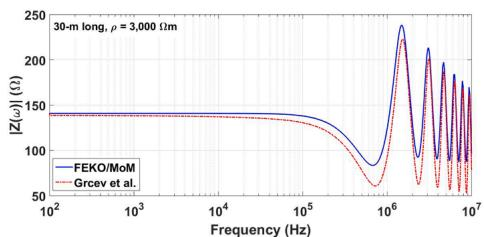  
(e)

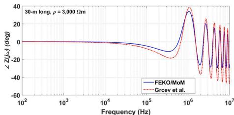  
  
Fig. 3. Comparison of the grounding impedance of a 30-m long rod buried in homogeneous soils of 30 Ωm, 300 Ωm and 3, 000 Ωm resistivity and relative permissivity of 10 obtained with the proposed full-wave EM model based on MoM and a model proposed in [28]: Magnitude (left) and phase angle (right).

soil and the cross electrode. Unlike FEM and FDTD, using the EFIE/MoM does not require the simulation domain to be truncated. Each layer of soil is characterized by the magnetic permeability of vacuum $\mu _ { 0 } ,$ , a relative permittivity $\varepsilon _ { r } ,$ and a resistivity $\rho ,$ with the last two being considered as constant or frequency-dependent parameters. A port is defined between the electrode and the PEC sheet (reference) to excite the electrode arrangement and to cause a current to flow. This port applies a 1 V voltage difference between its two terminals. Additionally, in the case of cross electrodes, a thin-wire is connected from the port to the center of the electrode. The steps to construct this grounding topology is presented in Appendix (Fig. 20).

To evaluate the influence of the PEC surface on the top of the stratified medium (soil) and the parasitic impedance between the PEC surface and the electrode, the grounding impedance of the cross electrode is computed using FEKO. For this computation, the 5-m cross electrodes with a 12.5 mm of radius whose center is located at 2.5 m below the PEC surface and immersed in lossless medium with a relative permittivity of 10 is considered in a frequency range of 100 Hz up to 10 MHz. The grounding impedance (magnitude, in blue and phase, in red) is plotted in Fig. 2. As shown in this figure, the impedance of the cross-electrode behaves as a capacitor for almost all frequency range where a resonance frequency is observed at 4 MHz. The magnitude of this (parasitic)

impedance that is in parallel with the grounding impedance of the electrode is very large. This means that the impact of the PEC surface on the computation of the grounding impedance can be neglected.

# 3.2. Validation

To validate the accuracy of the proposed simulation model, the grounding impedance of a vertical rod with a length of 30 m buried in homogeneous soil with a resistivity of 30, 300, and 3, 000 Ωm and relative permittivity of 10 is calculated and compared with the results obtained using the electromagnetic approach proposed by Grcev et al. (Fig. 11 in [28]). The comparison is shown in Fig. 3, where the results are in a good agreement for soils of moderate and high resistivity value. At lower frequencies, it can be seen that the impedance of the rod matches with the results of [28] due to the predominant resistive behaviour of the vertical rods in such frequency range. The results are slightly different around the resonances that could be due to the definition of voltage in the two methods. Further, the impedance of a 30-m long horizontal electrode buried at a depth of 0.5 m in homogeneous, frequency-independent soil with a resistivity of 1, 000 Ωm has been calculated using the proposed simulation model and compared with those determined by the hybrid electromagnetic model (HEM) from [15]

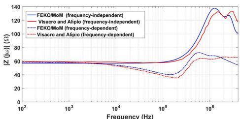  
（a)

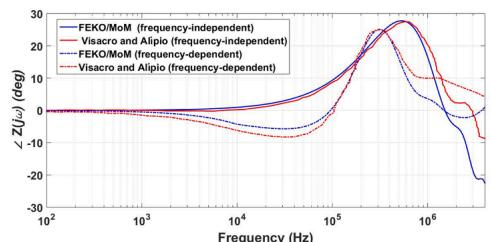  
(b)   
Fig. 4. Comparison of the grounding impedance of a 30-m long horizontal electrode buried in a homogeneous soil of 1, 000 Ωm resistivity and relative permittivity of 10 obtained with the proposed full-wave EM model based on MoM and HEM model proposed in [15]: Magnitude (left) and phase angle (right).

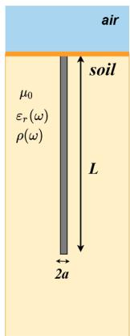

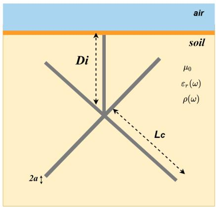  
  
Fig. 5. Studied grounding electrodes: (a) vertical rod; (b) cross electrode.

as illustrated in Fig. 4 where an acceptable agreement is observed.

# 4. Simulation results

In this section, the frequency-domain impedance of different grounding arrangements buried in frequency-independent and -dependent stratified soil is calculated using the proposed simulation model. Next, the Vector Fitting technique will be used to obtain time-domain GPR waveforms as a result of injecting two types of lightning stroke currents.

# 4.1. Frequency-domain grounding impedance

In this section, the influence of the frequency dependence of soil electrical parameters is included in the computation of the grounding impedance of two arrangements of grounding electrodes shown in Fig. 5. The detailed dimensions of the grounding electrodes are as follows:

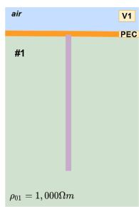

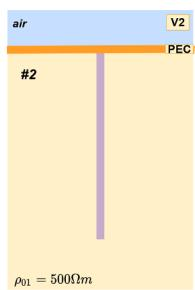

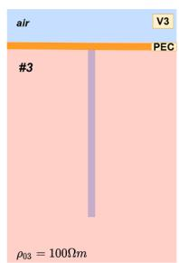

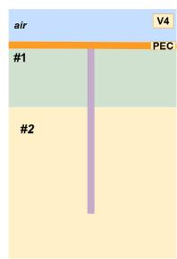

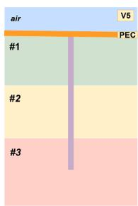  
Fig. 6. Vertical rod buried in different soil configurations. The resistivity of soil #1, #2, and #3 is 1,000, 500, and 100 Ωm, respectively.

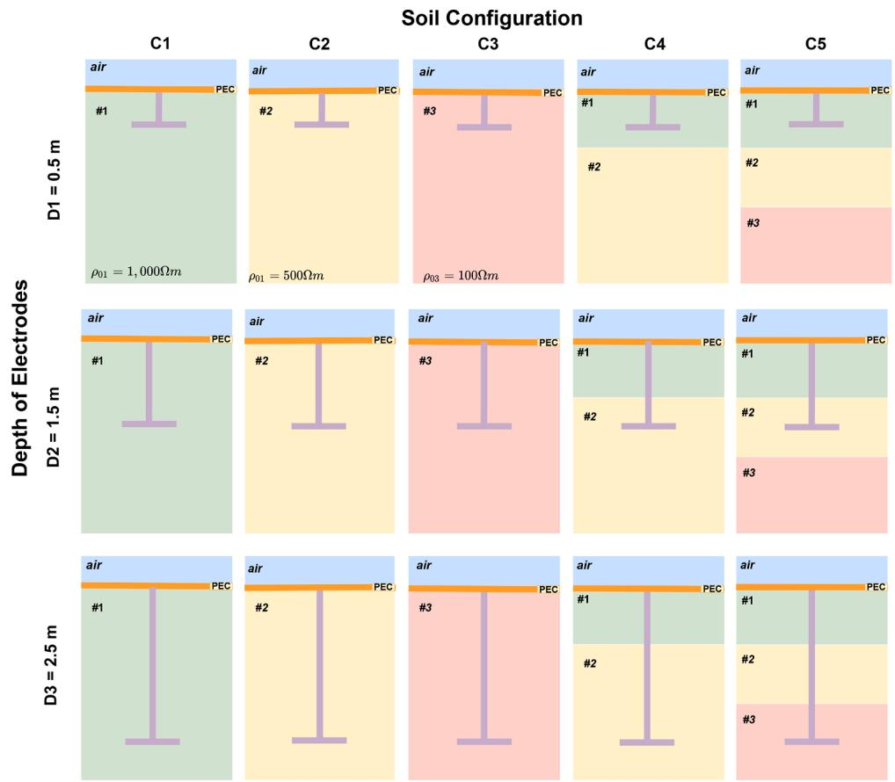  
Fig. 7. Configurations of the cross electrode buried in different soil topologies. The thickness of layers #1 and #2 in Cases C4 and C5 is 1 m.

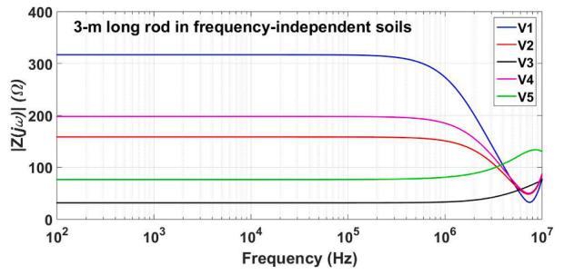  
(a)

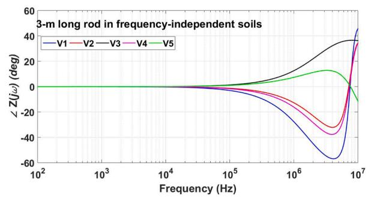  
(b)

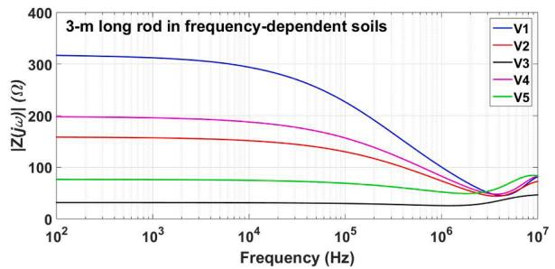  
Fig. 8. a) Magnitude and b) phase of the impedance of the 3-m long rod buried in a frequency-independent soil for topologies V1, V2, V3, V4 and V5 (see Fig. 6 for details of the configurations).

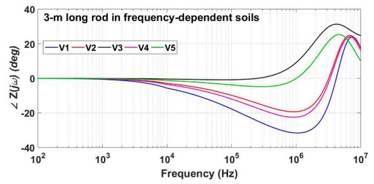  
(b)   
Fig. 9. a) Magnitude and b) phase of the impedance of the 3-m long rod buried in a frequency-dependent soil for topologies V1, V2, V3, V4 and V5 (see Fig. 6 for details of the configurations).

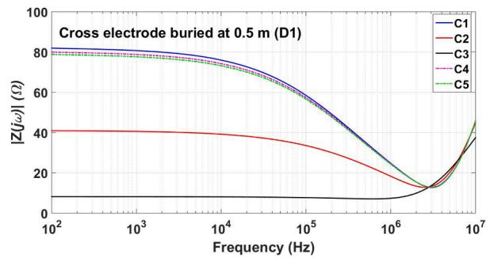

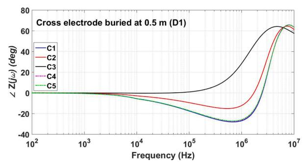  
(b)

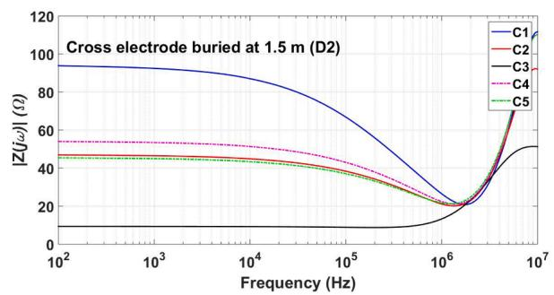  
Fig. 10. a) Magnitude and b) phase of the impedance of the cross electrode buried at a depth of D1=0.5 m in a frequency-dependent soil for topologies C1, C2, C3, C4 and C5 (see Fig. 7 for details of the configurations).

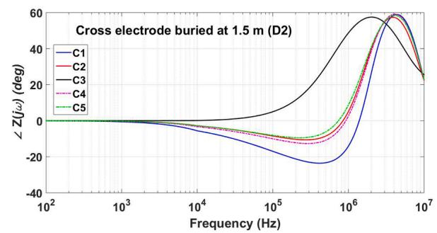  
(b)   
Fig. 11. a) Magnitude and b) phase of the impedance of the cross electrode buried at a depth of D2=1.5 m in a frequency-dependent soil for topologies C1, C2, C3, C4 and C5 (see Fig. 7 for details of the configurations).

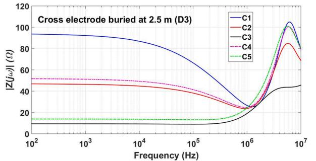

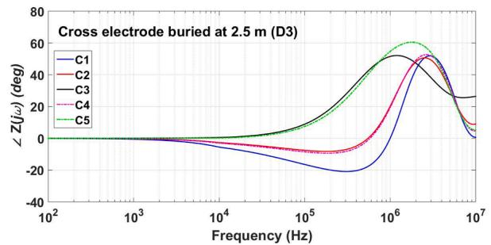  
  
(b)   
Fig. 12. a) Magnitude and b) phase of the impedance of the cross electrode buried at a depth of D3=2.5 m in a frequency-dependent soil for topologies C1, C2, C3, C4 and C5 (see Fig. 7 for details of the configurations).

• Vertical electrode with a radius of a = 12.5 mm and a length of $L =$ 3 m,   
• Cross electrodes buried at different depths Di $( D 1 ~ = ~ 0 . 5 ~ \mathrm { m } , ~ D 2 =$ 1.5 m and $D 3 = 2 . 5 $ m) with a radius of a = 12.5 mm, and a length of $L _ { c } = 2 . 5 \ : \mathrm { m }$ .

These simple arrangements of grounding electrodes are buried in different soil topologies (from homogeneous to stratified soils). For the vertical rod, 5 different soil configurations, named V1, V2, V3, V4 and V5 are considered, as illustrated in Fig. 6. For the cross electrodes, the 3 different electrode depths of D1, D2 and D3 are combined with 5 soil configurations, named C1, C2, C3, C4 and C5, as illustrated in Fig. 7. The frequency dependence of each layer of soil is modelled using (1) and (2). The DC resistivity (at 100 Hz) of layers is $\rho _ { 0 1 } = 1$ , 000 Ωm, $\rho _ { 0 2 } =$ 500 Ωm, and $\rho _ { 0 3 } = 1 0 0$ Ωm. The grounding impedance of the vertical rod is also computed considering frequency-independent soil electrical parameters, where a relative permittivity of $\varepsilon _ { r } = 1 0$ was considered for all layers of the ground. The grounding impedance is computed using the proposed model in a frequency range of 100 Hz to 10 MHz.

The grounding impedance of vertical rods buried in frequencyindependent and frequency-dependent soils is presented in Figs. 8 and $^ { 9 , }$ respectively. As seen from these figures, the grounding impedance is considerably reduced when the frequency dependence of the soil parameters is considered, especially at high frequencies and for electrodes buried at high resistivity soils. It is observed that for both frequencyindependent and -dependent soils, the grounding impedance is purely resistive at low frequencies and is equal to the so-called low-frequency resistance $R _ { L F }$ , which is proportional to the soil resistivity. Above a certain frequency, called the characteristic frequency $F _ { c } ,$ the grounding impedance may be inductive or capacitive, depending on the frequency, length of the electrode, and value of soil parameters [11]. The value of Fc

Table 1 Parameters for lightning stroke currents [30].   

<table><tr><td>Impulsive Current</td><td>I0</td><td>τ1(μs)</td><td>τ2(μs)</td><td>n</td><td>η</td></tr><tr><td>First stroke (F1)</td><td>28</td><td>1.80</td><td>95</td><td>2</td><td>0.8231</td></tr><tr><td>Subs. stroke (S1)</td><td>10.7</td><td>0.25</td><td>2.5</td><td>2</td><td>0.6394</td></tr><tr><td>Subs. stroke (S2)</td><td>6.5</td><td>2</td><td>230</td><td>2</td><td>0.8765</td></tr></table>

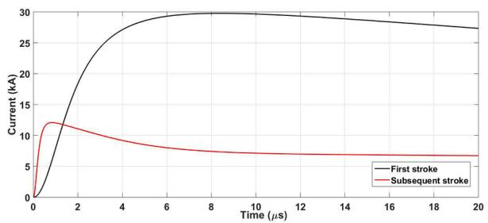  
Fig. 13. Waveforms of the first and subsequent lightning stroke currents.

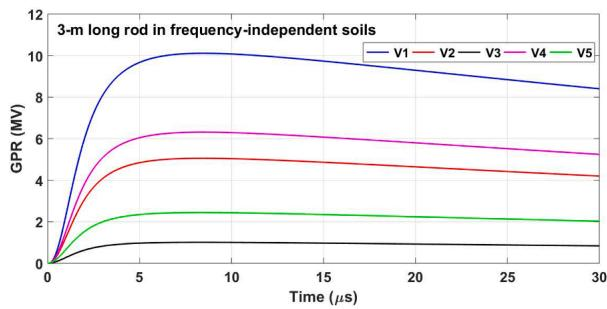  
(a)

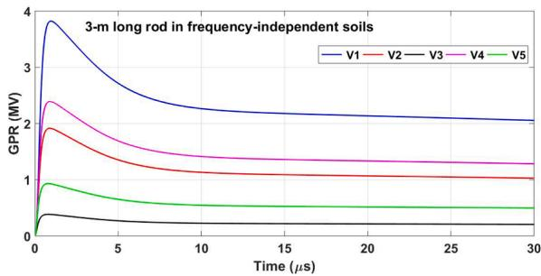  
(b)   
Fig. 14. GPR waveforms for the 3-m long electrode buried in frequencyindependent soil for: a) first stroke and b) subsequent stroke (see Fig. 6 for details of the configurations).

is dependent on the rod length, low-frequency soil resistivity and soil water content [2]. As seen, the associated value $F _ { c }$ of a vertical rod is higher for frequency-independent model of the soil in all of the studied cases.

The grounding impedance of the cross electrode for the burial depths of D1, D2 and D3 are illustrated in Figs. 10, 11 and 12, respectively. As seen in these figures, the grounding impedance is significantly influenced by the position of the cross electrodes in a given layer of soil. In Fig. 17, the impedance of cross electrodes buried in the first layer is not

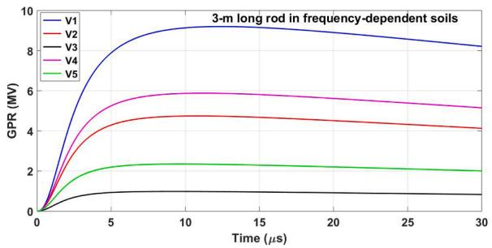

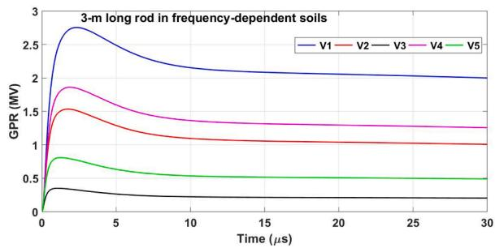  
  
Fig. 15. GPR waveforms for the 3-m long electrode buried in frequencydependent soil for: a) first stroke and b) subsequent stroke (see ${ \mathrm { F i g . } }$ 6 for details of the configurations).

influenced by the 2-layer or 3 layer structure of the soil, due to the higher soil resistivity in the first layer, which predominates in all cases. For a burial depth of D2, the cases C2, C4, and C5 show almost the same grounding impedance, specially at higher frequencies. This is expected as the attenuation is higher at higher frequencies that reduces the effect of neighboring layers. For the burial depth of D3, the impedance for cases C2 and C4 are very close as in both of them the electrode is located in the same layer. The same applies to cases C3 and C5. In conclusion, the soil parameters of the layer that the cross electrode is buried in have the main influence on its frequency-domain impedance (specially at higher frequencies), whereas this is not true for a vertical rod.

# 4.2. Transient grounding potential rise

To investigate the effect of the frequency dependence of soil electrical parameters in a stratified soil on the time domain transient voltages, the ground potential rise (GPR) of the electrodes is analyzed. First, each frequency response computed using MoM is approximated by a rational function using Vector Fitting (VF) technique [22]. Next, a recursive convolution method as described in [23] is used to obtain time domain GPR waveforms. The typical first and subsequent lightning stroke currents are adopted and they are modelled as impulse current sources injected at the top of each electrode arrangement. These current waveforms are described by the Heidler’s function given by Heidler [29]

$$
I (t) = \frac {I _ {0}}{\eta} \frac {\left(t / \tau_ {1}\right) ^ {n}}{1 + \left(t / \tau_ {1}\right) ^ {n}} e ^ {- t / \tau_ {2}} \tag {3}
$$

where $I _ { 0 }$ is the amplitude of the lightning current, τ is the front time constant, and $\tau _ { 2 }$ is the decay time constant. Integer n is a coefficient that varies between 2 and 10 and $\eta$ is a correction factor which depends on $\tau _ { 1 } ,$ ,

Table 2 Values of α for the first and subsequent strokes for the 3-m vertical rod buried in the V1, V2, V3, V4 and V5 configurations.   

<table><tr><td></td><td>V1</td><td>V2</td><td>V3</td><td>V4</td><td>V5</td></tr><tr><td>First stroke</td><td>0.9101</td><td>0.9387</td><td>0.9735</td><td>0.9316</td><td>0.9627</td></tr><tr><td>Subsequent stroke</td><td>0.7207</td><td>0.8011</td><td>0.9117</td><td>0.7785</td><td>0.8630</td></tr></table>

$\tau _ { 2 }$ and n. The parameters for first (F) and subsequent $( S _ { 1 } { _ { : } }$ , and ${ \bf S } _ { 2 } )$ strokes are given in Table 1 [30]. These current waveforms are shown in Fig. 13. The major frequency spectrum of the first stroke (steepness of 12 kA/μs) is below 1 MHz, while that of the subsequent stroke (steepness of 40 kA/μs) is up to 10 MHz [30].

A time step of Δt = 10 ns is adopted for all time-domain calculations. The transient GPR waveforms computed for the vertical rods buried in the frequency-independent and frequency-dependent soils are illustrated in Figs. 14 and 15. The transient GPR waveforms obtained in case V1 present the highest voltage peaks due to the higher soil resistivity. It can be seen that a higher reduction is obtained in the peak value of the GPR waveform when a frequency-dependent soil is considered compared to the results obtained with the frequency-independent soils. These reductions are more pronounced when a subsequent stroke is injected at the top of the vertical electrode, specially for homogeneous soil of high and moderate resistivities. The presence of high resistivity layers above the low-resistivity layer in case V5 has a very strong impact on the GPR waveform where the peak value is more than doubled.

To quantify the difference between the GPR peaks obtained with the frequency-independent and frequency-dependent soils for the vertical rod buried in the V1, V2, V3, V4 and V5 configurations, a coefficient α is defined as follows

$$
\alpha = \frac {V _ {p (\omega)}}{V _ {p c}} \tag {4}
$$

where $V _ { p ( \omega ) }$ and $V _ { p c }$ are the GPR peak obtained for the frequencydependent and frequency-independent soils, respectively. The value of α calculated in the case of first and subsequent strokes are depicted in Table 2. As seen in Table 2, for soils of moderate and high resistivities (cases V1 and V2 and V4), the value of α is smaller than those computed for cases V3 and V5, for both types of lightning currents. As the number of the layers of soil increases, the coefficient α approaches 1 due to smaller equivalent soil resistivity. Additionally, the impact of frequencydependence of the soil parameters is more pronounced for the subsequent strokes due to a higher frequency content in comparison with those of the first stroke. Additionally, in cases V1 and ${ \mathrm { V } } 2 ,$ the equivalent soil resistivity is high and moderate, respectively, in comparison with the 3-layer soil. As known in the literature, frequency dependence of soil parameters has a significant effect in soil of high and moderate resistivity, as described in [12]. However, the effect of the frequency dependence of the soil parameters is less pronounced, as observed in the transient GPRs obtained in case V3, specially when the first stroke is injected. Thus, the differences between the GPR peaks obtained for the frequency-independent and frequency-dependent soil decreases as the number of the layer in the stratified soil increases. To derive a general conclusion, the length of the vertical electrode is varied between 3 to 30 m. Fig. 16 shows the dependence of α on the length of vertical electrode for various scenarios. As seen in this figure, the reduction of the GPR peak by considering the frequency dependence of soil resistivity and permittivity is almost independent from the length of the vertical electrode except for the cases of subsequent strokes (i.e. wider spectrum) or low soil resistivity.

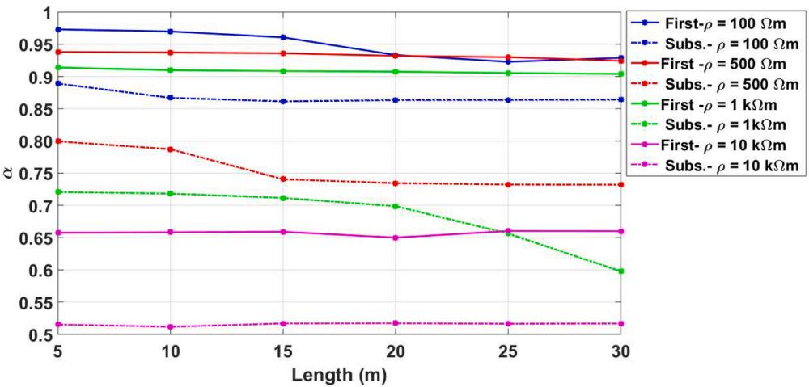  
Fig. 16. Variation of α as a function of the vertical rod length for different soil resistivity.

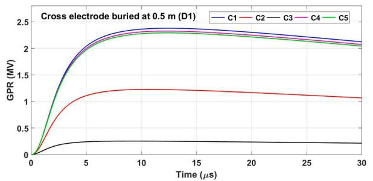

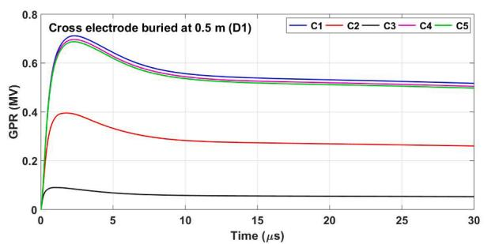  
(b)   
Fig. 17. GPR waveforms for the cross electrode buried at depth ${ \bf D } 1 { = } 0 . 5$ m in frequency-dependent soil for: a) first stroke and b) subsequent stroke (see Fig. 7 for details of the configurations).

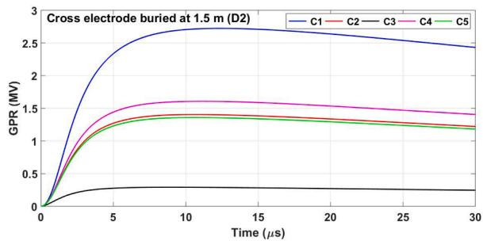

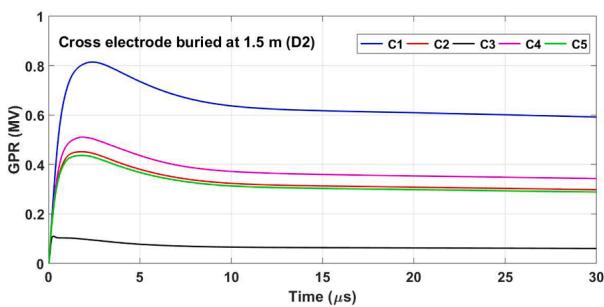  
(b)   
Fig. 18. GPR waveforms for the cross electrode buried at depth ${ \bf D } 2 { = } 1 . 5$ m in frequency-dependent soil for: a) first stroke and b) subsequent stroke (see $\mathrm { F i g . } 7$ for details of the configurations).

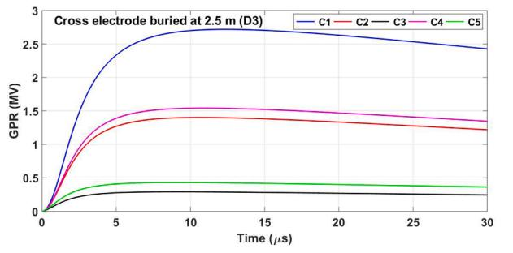

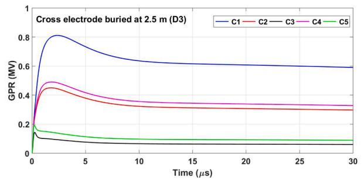  
(b)   
Fig. 19. GPR waveforms for the cross electrode buried at depth D3=2.5 m in frequency-dependent soil for: a) first stroke and b) subsequent stroke (see Fig. 7 for details of the configurations).

The time-domain GPR responses of cross electrodes for the burial depths of D1, D2 and D3 are shown in Figs. 17, 18 and 19, respectively. A general conclusion based on these figures is that the layer where the cross electrode is located at is the main factor influencing the peak of the GPR waveform. For example, in Fig. 19, where the electrode is 2.5 m below the surface of the ground, cases C3 and C5 (and C2 and C4) have almost the same GRP waveform. Further analysis of the peak of the GPR waveforms is presented in Tables 3 and 4. One can observe that peak of the GPR is proportional to the resistivity of the layer where the electrode is located. As expected, in a multilayer soil configuration, the layers above the location of the cross electrode have an impact on the peak of the GPR.

Table 3 Peak of the GPR waveforms computed for the cross electrodes buried at a frequency-dependent configurations for the first lightning stroke current.   

<table><tr><td colspan="6">First stroke (MV)</td></tr><tr><td></td><td>C1</td><td>C2</td><td>C3</td><td>C4</td><td>C5</td></tr><tr><td>D1</td><td>2.3787</td><td>1.2260</td><td>0.2545</td><td>2.3246</td><td>2.2916</td></tr><tr><td>D2</td><td>2.7232</td><td>1.4041</td><td>0.2913</td><td>1.6068</td><td>1.3580</td></tr><tr><td>D3</td><td>2.7185</td><td>1.4012</td><td>0.2902</td><td>1.5418</td><td>0.4293</td></tr></table>

Table 4 Peak of the GPR waveforms computed for the cross electrodes at a frequencydependent configurations for the subsequent lightning stroke current.   

<table><tr><td colspan="6">Subsequent stroke (MV)</td></tr><tr><td></td><td>C1</td><td>C2</td><td>C3</td><td>C4</td><td>C5</td></tr><tr><td>D1</td><td>0.7116</td><td>0.3953</td><td>0.0902</td><td>0.6963</td><td>0.6872</td></tr><tr><td>D2</td><td>0.8140</td><td>0.4513</td><td>0.1146</td><td>0.5106</td><td>0.4365</td></tr><tr><td>D3</td><td>0.8112</td><td>0.450</td><td>0.1445</td><td>0.4904</td><td>0.1973</td></tr></table>

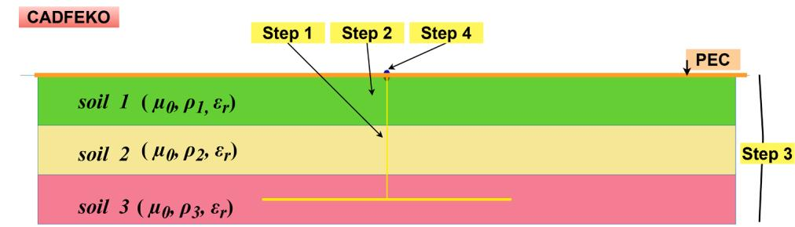

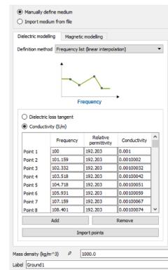  
Step 2

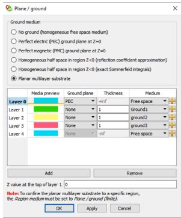  
Step 3

  
Step 4

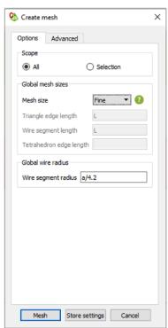  
Step 5

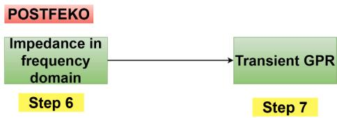  
Fig. 20. Steps to compute the grounding impedance in FEKO.

# 5. Conclusions

This paper investigated the effect of the frequency dependence of soil parameters considering different arrangements of electrodes buried in stratified soil. A full-wave MoM electromagnetic software using that uses the stratified medium Green’s function was employed to compute the grounding impedance of each electrode arrangement. The developed simulation model was verified by comparing the impedance of simple arrangements of electrodes (i.e. vertical and horizontal) with the results available in the literature. The model is capable of considering the fre quency dependence of soil parameters. It was shown that for all arrangements of electrodes, regardless of frequency dependence or independence of the soil model, the low-frequency grounding impedance is constant up to a frequency of around 10 kHz and starts showing an inductive or capacitive behaviour at higher frequencies. Considering the frequency dependence of the soil will result in a reduction of this starting frequency. The simulation results show that the impedance of a vertical electrode is more sensitive to the layers of the soil, whereas the impedance of the cross electrode mostly depends on the layer where it is located. The effect of the frequency-dependence of the soil parameters was also studied in the transient GPR waveforms. A significant reduction in the peaks of the GPR waveform was shown if the frequencydependence of the soil parameters were considered. These reductions are more significant for homogeneous or 2-layer soils composed of moderate and high soil resistivity. Additionally, GPRs computed due to a subsequent stroke lightning current has presented higher differences in comparison with the GPRs computed with the first strokes. These differences are due to the higher frequency content of the subsequent stroke. Comparing the peak of GPR waveforms for a vertical electrode showed that the reduction in the peak by considering the frequency

dependence of the soil parameters is almost independent of the length of the electrode, except for the cases where the resistivity of soil is low. The value of the peak of the GPR waveform for the cross electrode is dependent on the layer where the electrode is located and almost independent of the soil configuration.

# CRediT authorship contribution statement

Anderson R.J. de Araújo: Conceptualization, Methodology, Software, Validation, Formal analysis, Writing - original draft, Writing - review & editing, Visualization. Jaimis S.L. Colqui: Software, Validation, Formal analysis. Claudiner M. de Seixas: Conceptualization, Formal analysis, Writing - original draft. Sergio ´ Kurokawa: Conceptualization, Writing - original draft, Supervision, Funding acquisition. Bamdad Salarieh: Writing - review & editing, Formal analysis. Jose´ Pissolato Filho: Funding acquisition, Supervision. Behzad Kordi: Conceptualization, Methodology, Validation, Formal analysis, Writing - review & editing.

# Declaration of Competing Interest

The authors declare that they have no known competing financial interests or personal relationships that could have appeared to influence the work reported in this paper.

# Acknowledgement

The authors are thankful to Prof. L. D. Grcev for providing the data from Grcev et al. [28] that was used for the validation of the simulation results.

# Appendix A. Details of the simulation model

To compute the grounding impedance of electrode buried in a stratified soil, the steps to build the simulation model are as follows:

1. Construct the electrode geometry in CADFEKO (Step 1);   
2. Insert each medium (soil) with the frequency-independent or frequency-dependent electrical parameters (permeability $\mu _ { 0 } ,$ , resistivity ρ and relative permittivity $\varepsilon _ { r } )$ (Step 2);   
3. Build the planar multilayer substrate grouping all the mediums with the thickness of each layer (Step 3);   
4. Establish the numerical port (1 V voltage source) at the top of the grounding electrode system (Step 4);   
5. Choose the proper size of the mesh based on the frequency range (100 Hz to 10 MHz) (Step 5);   
6. Compute the grounding impedance in frequency domain, in POSTFEKO;   
7. Compute the GRP using the vector fitting technique and recursive convolution method in [23].

# References

[1] S. Chiheb, O. Kherif, M. Teguar, A. Mekhaldi, N. Harid, Transient behaviour of grounding electrodes in uniform and in vertically stratified soil using state space representation, IET Sci. Meas. Technol. 12 (4) (2018) 427–435.   
[2] B. Salarieh, H.M.J. De Silva, B. Kordi, Electromagnetic transient modeling of grounding electrodes buried in frequency dependent soil with variable water content, Electr. Power Syst. Res. 189 (2020) 106595.   
[3] S. Gholami Farkoush, T. Khurshaid, A. Wadood, C.-H. Kim, K.H. Kharal, K.-H. Kim, N. Cho, S.-B. Rhee, Investigation and optimization of grounding grid based on lightning response by using ATP-EMTP and genetic algorithm, Complexity 2018 (2018).   
[4] O.E. Gouda, T. El-Saied, W.A.A. Salem, A.M.A. Khater, Evaluations of the apparent soil resistivity and the reflection factor effects on the grounding grid performance in three-layer soils, IET Sci. Meas. Technol. 13 (4) (2019) 572–581.   
[5] L. Yang, G. Wu, X. Cao, An optimized transmission line model of grounding electrodes under lightning currents, Science China Technological Sciences 56 (2) (2013) 335–341.   
[6] A.R.J. Araújo, J.S.L. Colqui, S. Kurokawa, C.M. Sexias, B. Kordi, Computing towerfooting grounding impedance and GPR curves of grounding electrodes buried in multilayer soils. 2019 International Symposium on Lightning Protection (XV SIPDA), 2019, pp. 1–8.

[7] R. Xiong, B. Chen, J.-J. Han, Y.-Y. Qiu, W. Yang, Q. Ning, Transient resistance analysis of large grounding systems using the FDTD method, Prog. Electromagn. Res. 132 (2012) 159–175.   
[8] D. Sekki, B. Nekhoul, K. Kerroum, K.E.K. Drissi, D. Poljak, Transient behaviour of grounding system in a two-layer soil using the transmission line theory, automatika 55 (3) (2014) 306–316.   
[9] F.M. Gatta, A. Geri, S. Lauria, M. Maccioni, Generalized pi-circuit tower grounding model for direct lightning response simulation, Electr. Power Syst. Res. 116 (2014) 330–337, https://doi.org/10.1016/j.epsr.2014.07.006.http://www.sciencedirect. com/science/article/pii/S0378779614002399   
[10] R. Batista, C.E.F. Caetano, J.O.S. Paulino, W.C. Boaventura, I.J.S. Lopes, E. N. Cardoso, A study of grounding arrangements composed by vertical electrodes for two-layered stratified soil models, Electr. Power Syst. Res. 180 (2020) 106129, https://doi.org/10.1016/j.epsr.2019.106129.https://www.sciencedirect.com/sci ence/article/pii/S0378779619304481   
[11] B. Salarieh, J.D. Silva, B. Kordi, High frequency response of grounding electrodes: effect of soil dielectric constant, IET Gener. Transm. Distrib. 14 (15) (2020) 2915–2921.   
[12] S. Visacro, R. Alipio, Frequency dependence of soil parameters: experimental results, predicting formula and influence on the lightning response of grounding electrodes, IEEE Trans. Power Deliv. 27 (2) (2012) 927–935, https://doi.org/ 10.1109/TPWRD.2011.2179070.

[13] D. Cavka, N. Mora, F. Rachidi, A comparison of frequency-dependent soil models: application to the analysis of grounding systems, IEEE Trans. Electromagn. Compat. 56 (1) (2013) 177–187.   
[14] M.A.O. Schroeder, M.T.C. de Barros, A.C.S. Lima, M.M. Afonso, R.A.R. Moura, Evaluation of the impact of different frequency dependent soil models on lightning overvoltages, Electr. Power Syst. Res. 159 (2018) 40–49.   
[15] R. Alipio, S. Visacro, Frequency dependence of soil parameters: effect on the lightning response of grounding electrodes, IEEE Trans. Electromagn. Compat. 55 (1) (2013) 132–139, https://doi.org/10.1109/TEMC.2012.2210227.   
[16] M. Akbari, K. Sheshyekani, A. Pirayesh, F. Rachidi, M. Paolone, A. Borghetti, C. A. Nucci, Evaluation of lightning electromagnetic fields and their induced voltages on overhead lines considering the frequency dependence of soil electrical parameters, IEEE Trans. Electromagn. Compat. 55 (6) (2013) 1210–1219, https:// doi.org/10.1109/TEMC.2013.2258674.   
[17] CIGRE ´ Working Group C4.33, Impact of soil-parameter frequency dependence on the response of grounding electrodes and on the lightning performance of electrical systems. Technical Brochure 781, 2019.   
[18] S. Visacro, R. Alipio, M.H.M. Vale, C. Pereira, The response of grounding electrodes to lightning currents: the effect of frequency-dependent soil resistivity and permittivity, IEEE Trans. Electromagn. Compat. 53 (2) (2011) 401–406, https:// doi.org/10.1109/TEMC.2011.2106790.   
[19] H. Karami, K. Sheshyekani, Harmonic impedance of grounding electrodes buried in a horizontally stratified multilayer ground: a full-wave approach, IEEE Trans. Electromagn. Compat. 60 (4) (2017) 899–906.   
[20] C. Caetano, R. Batista, J. Paulino, W.C. Boaventura, I. Lopes, E.N. Cardoso, A simplified method for calculating the impedance of vertical grounding electrodes

buried in a horizontally stratified multilayer ground. 2018 34th International Conference on Lightning Protection (ICLP), IEEE, 2018, pp. 1–7.   
[21] R. Batista, J.O.S. Paulino, A practical approach to estimate grounding impedance of a vertical rod in a two-layer soil, Electr. Power Syst. Res. 177 (2019) 105973.   
[22] B. Gustavsen, A. Semlyen, Rational approximation of frequency domain responses by vector fitting, IEEE Trans. Power Deliv. 14 (3) (1999) 1052–1061, https://doi. org/10.1109/61.772353.   
[23] J.S.L. Colqui, A.R.J. de Araújo, C.M. de Seixas, S. Kurokawa, J. Pissolato Filho, Performance of the recursive methods applied to compute the transient responses on grounding systems, Electr. Power Syst. Res. 196 (2021) 107281.   
[24] C.L. Longmire, K.S. Smith, A Universal Impedance for Soils. Technical Report, Mission Research Corp Santa Barbara CA, 1975.   
[25] M. Messier, Another Soil Conductivity Model. internal rep., JAYCOR, 1985.   
[26] C. Portela, Measurement and modeling of soil electromagnetic behavior. 1999 IEEE International Symposium on Electromagnetic Compatibility. Symposium Record (Cat. No. 99CH36261) vol. 2, IEEE, 1999, pp. 1004–1009.   
[27] Altair-Hyperworks, Altair Feko 2019.3.3-User Guide, Altair Engineering, 2019.   
[28] L.D. Grcev, A. Kuhar, V. Arnautovski-Toseva, B. Markovski, Evaluation of highfrequency circuit models for horizontal and vertical grounding electrodes, IEEE Trans. Power Deliv. 33 (6) (2018) 3065–3074.   
[29] H. Heidler, Analytische blitzstromfunktion zur LEMP-berechnung. 18th ICLP, Munich, Germany, 1985, 1985.   
[30] F. Rachidi, W. Janischewskyj, A.M. Hussein, C.A. Nucci, S. Guerrieri, B. Kordi, J.- S. Chang, Current and electromagnetic field associated with lightning-return strokes to tall towers, IEEE Trans. Electromagn. Compat. 43 (3) (2001) 356–367.