# An improved high-accuracy interpolation method for switching devices in EMT simulation programs✩

J. Na a,d, H. Kim b, H. Zhao c, A.M. Gole c, K. Hur a,∗

a School of Electrical and Electronic Engineering, Yonsei University, Seoul 03722, South Korea   
b R&D Center, Pion Electric, Gyeonggi-do 14348, Republic of Korea   
c Department of Electrical and Computer Engineering, University of Manitoba, Winnipeg, MB R3T 2N2, Canada   
d R&D Center, Korea Grid Forming, Gyeonggi-do 14348, Republic of Korea

# A R T I C L E I N F O

Keywords:

Backward Euler

Discontinuity

Interpolation

Power-electronic switches

Trapezoidal

# A B S T R A C T

This paper presents an interpolation with Backward Euler (BE) method that enhances the switching simulations accuracy in an electromagnetic transient (EMT) simulation with a fixed time-step. Because of the switching operations on discrete instants, the simulations can show artificial voltage spikes and numerical oscillations (chatter), compromising the accuracy and producing misleading results. We thus present a method that eliminates the spurious switching losses and improves the accuracy by combining interpolation and extrapolation with a half-time-step BE solution over existing interpolation-based approaches to resolve the issues above. In addition, this improved method requires the same calculation steps as the industry-accepted instantaneous interpolation. Analytical discussion reinforced by the simulation studies for a simple and complex power electronic circuits demonstrates the accuracy and efficacy of the proposed interpolation with BE method.

# 1. Introduction

Electromagnetic transient (EMT) simulation programs are widely used for modeling electric power systems with power electronic devices such as high-voltage dc (HVdc) converters, flexible ac transmission systems (FACTS), and renewable energy source (RES) converters [1,2]. These power electronic switching devices are generally modeled as bivalued resistors or ideal switches in the EMT [3]. The programs create a companion circuit of the network by applying numerical integration methods such as the Trapezoidal rule with a fixed time-step value and then solve the circuit using nodal analysis (or modified nodal analysis) [4,5].

Fixed time-step simulation presents critical issues when modeling semiconductor switches such as thyristors, gate turn-off thyristors (GTO), insulated gate bipolar transistors (IGBT), etc. Without mitigation measures, switching operations can result in:

• Numerical oscillation (chatter)   
• Voltage spike   
• Inaccurate simulation results

Numerical chatter is usually initiated by the opening of a switch in a branch containing inductor. This phenomenon comes from the

characteristic of the Trapezoidal method, employing the current state and past state in the same differential equation. This numerical chatter happens when the switching occurs between time-steps, even at a natural zero current [6]. Voltage spikes can also arise across inductor branches due to the current chopping. Finally, inaccurate representation of the switching timing decreases accuracy of the simulation results. To improve accuracy, a very small time-step (e.g., 0.1 μs) can be applied, which, however, significantly increases the execution time; A trade-off between accuracy and execution time should be balanced.

There are several previously reported approaches to overcome the limitation of fixed time-step simulation with the Trapezoidal method. Snubber circuits across switches were parameterized to reduce the effect of chatter [3,5]. However, the artificial parameters of the snubber circuit may adversely affect the simulation accuracy. Critical damping adjustment (CDA) has also been widely used to suppress the chatter [7–10]. Two advantages of the CDA are as follows: (1) the Backward Euler (BE) method suppresses numerical oscillation, and (2) the admittance matrix of the half time-step BE method is the same as that of the one-step Trapezoidal method. However, CDA cannot cope with inaccurate representation of the switching timing. Variable timestep simulation is another alternative solution for accurate simulation

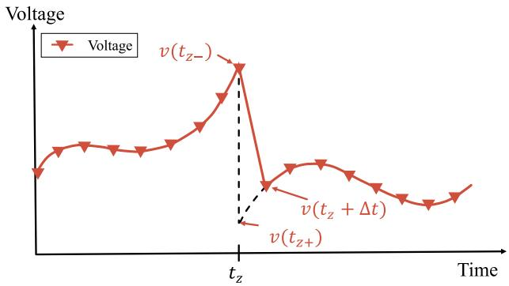  
Fig. 1. Discontinuous inductor voltage due to switching.

results [11–14]; However, it is highly challenging to set the optimal variable time-step size. In addition, 2s-DIRK, TR-BDF2, and matrix exponential methods have been proposed to remove numerical oscillation and improve accuracy. These are difficult to implement and show slower performance compared to the Trapezoidal rule [15–17]. Therefore, the interpolation method was introduced to improve the simulation accuracy without significantly increasing the execution time and affecting the overall structure of programs $[ 6 , 1 8 \small - 2 0 ]$ . The interpolation method estimates the actual switching time $t _ { z } \in ( t - \Delta t , t ) .$ , and the voltage and current at $t _ { z } ,$ by linearly interpolating states between solutions at ?? and $t - \Delta t$ . Interpolation can also be used to eliminate chatter with an additional half-step interpolation.

Even with interpolation, some problems still remain. The inductor voltage is discontinuous as labeled $v _ { L } ( t _ { z - } )$ and $v _ { L } ( t _ { z + } )$ just before and after the switch opening instant $( t _ { z } ) ,$ respectively, for clarity in Fig. 1. The calculation of the network solution at the next time instant $( t _ { z } + \varDelta t )$ by the Trapezoidal method requires knowledge of the inductor voltage and current at the previous time $t _ { z }$ . As the switch is assumed to open at $t _ { z } ,$ the correct value to use for the voltage is $v _ { L } ( t _ { z + } ) ,$ but the interpolation step calculates the value before the switch opened, which is $v _ { L } ( t _ { z - } )$ . To address this issue, NETOMAC, one of the EMT programs, applies a half time-step BE after the switch operation. The half timestep BE solution for the inductor voltage (non-continuous) is close to the correct value of the state at $t _ { z + }$ and so the program sets the voltage to this value [18,21–23]. Programs like PSCAD/EMTDC use a modification of basic interpolation (referred to as ‘‘instantaneous solution interpolation’’), which includes additional steps for removing spurious loss of forced commutated switches [24]. The instantaneous solution method updates the admittance matrix reflecting the post-switching state, but does not update the current input vector when calculating the post switching state at $t _ { z + }$ . It is effective in eliminating spurious losses in the switches caused by a straightforward implementation of interpolation. However, this method manifests numerical error as will be shown in Section 2.2. This error produces a phase delay in energy storage elements such as inductors, resulting in spurious inductor loss as reported in [25]. Other alternative methods are presented in [26–28] for improving numerical accuracy with the Trapezoidal method and interpolation. These methods show good accuracy but do not interpolate to the original time grid afterward. In addition, recent literature provides a comparison of numerous alternative solutions for treating discontinuities associated with simultaneous switching [29]. These solutions are based on the CDA approach, and utilize two halftime step BE methods for post-switching. However, it is worth noting that the BE method is generally less accurate than the Trapezoidal method, except immediately after switching.

Motivated by the aforementioned research efforts in dealing with switching discontinuity in the EMT simulation, this paper presents an interpolation with BE method by combining half-time step BE with additional interpolation and extrapolation steps to return to the original time grid. This method enhances the simulation accuracy by effectively

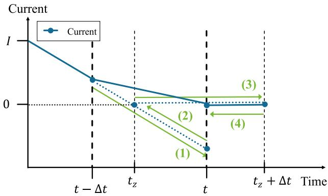  
Fig. 2. The ordinary interpolation process of natural-commutation.

eliminating spurious switch losses and suppressing numerical chatter without sacrificing execution time. The outline of this paper is as follows. The interpolation and instantaneous interpolation methods are described in Section 2. Section 3 introduces the proposed method. Simulation results of the proposed method are presented in Section 4 followed by concluding remarks in Section 6. Additionally, the detailed mathematical equations of the Trapezoidal and BE methods, as well as an analysis of chatter, can be found in Appendix.

# 2. Review of interpolation methods

# 2.1. Ordinary interpolation

Fig. 2 shows the diode current with the switching interpolated to the correct instant $t _ { z } .$ . The bold line represents the final output displayed to EMT program users, while the dotted line denotes the internal calculation results that remain concealed from the user interface. The green arrow and numbering provide a visual depiction of the computational sequence employed during the interpolation process. The aforementioned explanation applies uniformly to all figures presented in this paper. The switch should open when the current goes to zero, but this point falls inside a time-step, i.e., between $t - \Delta t$ and ??. Without using interpolation, the program only calculates the solution at $t - \Delta t$ and ??. A linear interpolation allows estimating the turn-off time to be $t _ { z }$ for the current zero. All the voltages and currents are also interpolated to the switching instant. The admittance matrix is re-triangulaized, and the solution continues with the original time-step, yielding the new solution one time-step later at $t _ { z } + \Delta t$ . One additional interpolation step between $t _ { z }$ and ???? + ???? yields the original time grid solution at ??.

# 2.2. Instantaneous solution interpolation

The interpolation technique was initially proposed for naturally commutated power-electronic switches such as diodes and thyristors [18]. However, numerical losses occur especially when fully controllable power-electronic switching devices (e.g., IGBTs) are simulated. These numerical device losses result from an interpolated solution point at which both the voltage and current in a switching device are non-zero as shown in Fig. 3.

The instantaneous interpolation method was proposed to remove the spurious numerical loss in the device [24]. Consider the simulation of the circuit in Fig. 4(a), this circuit consists of a voltage source, an inductor, an IGBT (S1), and a diode (D1). The command to turn switch S1 ‘‘OFF’’ is issued at a time $t _ { z }$ between time-step grid points $t - \Delta t$ and ??. The calculation steps in instantaneous interpolation are described below and illustrated in Fig. 5:

(1) The solution at ?? is found using the known solution at $t - \Delta t ,$ with the existing admittance matrix $Y _ { o l d }$ .

$$
V (t) = Y _ {o l d} ^ {- 1} \left[ I _ {\text {s o u r c e}} (t) + I _ {\text {h i s t o r y}} (t - \Delta t) \right] \tag {1}
$$

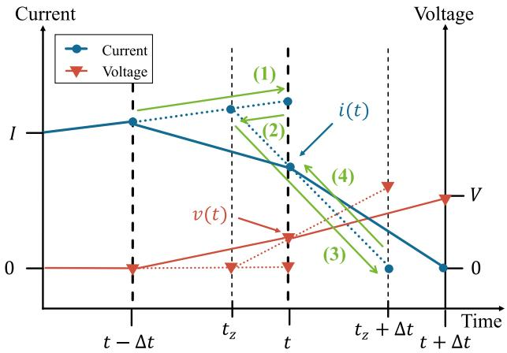  
Fig. 3. Voltage and current of S1 with a direct implementation of interpolation.

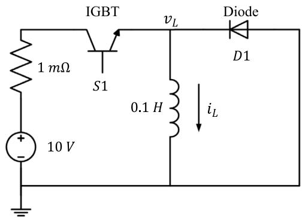  
(a)

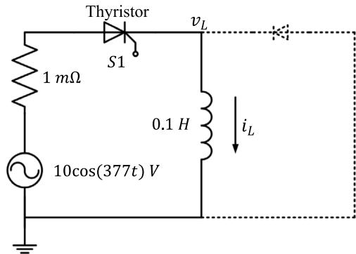  
  
Fig. 4. Configuration of simple test circuit (a) to demonstrate accuracy, execution time, switching loss (b) to verify chatter removal.

(2) All node voltages, currents, and history terms are interpolated to the switching instant $t _ { z }$ (same as $t _ { z - } )$ .

$$
V \left(t _ {z -}\right), I \left(t _ {z -}\right), a n d I _ {\text {h i s t o r y}} \left(t _ {z -} - \Delta t\right) \tag {2}
$$

(3) The solution at $t _ { z + }$ is approximated using the known solution at $t _ { z - }$ with post switching admittance matrix $Y _ { n e w : }$ , the same current injection vector at $t _ { z - }$ , and the Trapezoidal method.

$$
V \left(t _ {z +}\right) = Y _ {\text {n e w}} ^ {- 1} \left[ I _ {\text {s o u r c e}} \left(t _ {z -}\right) + I _ {\text {h i s t o r y}} \left(t _ {z -} - \Delta t\right) \right] \tag {3}
$$

(4) The solution at $t _ { z } + \Delta t$ is found using the solution at $t _ { z + }$ (from step 3 above) and the history current updated using the voltage and current at $t _ { z + }$ .

$$
V \left(t _ {z} + \Delta t\right) = Y _ {\text {n e w}} ^ {- 1} \left[ I _ {\text {s o u r c e}} \left(t _ {z} + \Delta t\right) + I _ {\text {h i s t o r y}} \left(t _ {z +}\right) \right] \tag {4}
$$

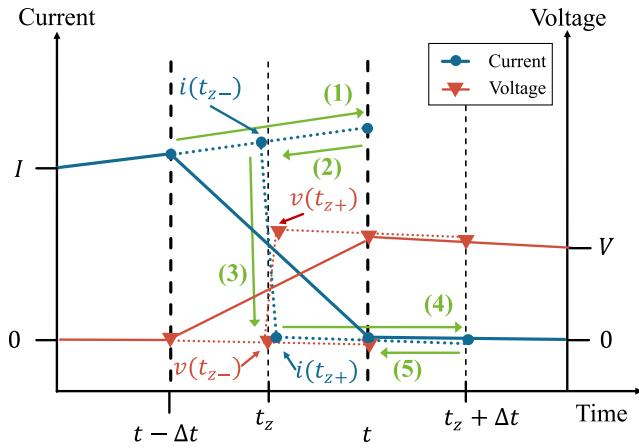  
Fig. 5. Voltage and current of S1 with the instantaneous interpolation method.

(5) All node voltages, currents, and history terms are interpolated to the original time grid ??.

$$
V (t), I (t), a n d I _ {\text {h i s t o r y}} (t - \Delta t) \tag {5}
$$

Note that $V , \ I , \ I _ { h i s t o r y } , \ I _ { s o u r c e } , \ Y _ { o l d } ,$ , and $Y _ { n e w }$ are the voltage vector, current vector, history current vector, source current vector, network admittance matrix before switching, and network admittance matrix after switching, respectively. It is worth noting that the instantaneous solution only updates the admittance matrix at $t _ { z - } ,$ but does not update the history current vector. Nevertheless, the current at $t _ { z + }$ is immediately zero, unlike the ordinary interpolation method shown in Fig. 3, where the current zero occurs later at $t _ { z } + \Delta t$ .

In step 3, the instantaneous interpolation method has a slight error, because the post switching matrix $Y _ { n e w }$ is used to obtain the solution at $t _ { z + }$ using history terms from $t _ { z } - \Delta t$ . This is tantamount to an assumption that the matrix change occurred at $t _ { z } - \Delta t$ and not at $t _ { z } ,$ i.e., one time-step earlier.

This ‘‘one time-step advance’’ error has not been noticed and reported before this paper, probably because the error is not cumulative, as the time-step advance applies to both the turn on and turn off of the switch, and has a minimal impact on the conduction time of the switch. To overcome this error, an interpolation with BE method with enhanced accuracy is proposed in the next section.

# 3. Interpolation with BE method

To overcome the drawbacks of the conventional interpolation methods, this paper proposes an interpolation with BE method, described next and illustrated using Fig. 6. The first and second steps are the same as in the instantaneous interpolation method, so they are omitted:

(3) The solution at $t _ { z } + \frac { \Delta t } { 2 }$ is found using the known solution at $t _ { z - }$ with post-switching admittance matrix $Y _ { n e w }$ and the BE method (the history current source is updated using the voltage and current at $t _ { z - } )$ .

$$
V \left(t _ {z} + \frac {\Delta t}{2}\right) = Y _ {\text {n e w}} ^ {- 1} \left[ I _ {\text {s o u r c e}} \left(t _ {z} + \frac {\Delta t}{2}\right) + I _ {\text {h i s t o r y}} ^ {B E} \left(t _ {z -}\right) \right] \tag {6}
$$

(4) The solution at $t _ { z } + \frac { 3 \Delta t } { 2 }$ is found using the known solution at $t _ { z } + \frac { \Delta t } { 2 }$ and the Trapezoidal method.

$$
V \left(t _ {z} + \frac {3 \Delta t}{2}\right) = Y _ {\text {n e w}} ^ {- 1} \left[ I _ {\text {s o u r c e}} \left(t _ {z} + \frac {3 \Delta t}{2}\right) + I _ {\text {h i s t o r y}} \left(t _ {z} + \frac {\Delta t}{2}\right) \right] \tag {7}
$$

(5) All node voltages, currents, and history terms are interpolated (or extrapolated) to the original time grid ??.

$$
V (t), I (t), a n d I _ {\text {h i s t o r y}} (t - \Delta t) \tag {8}
$$

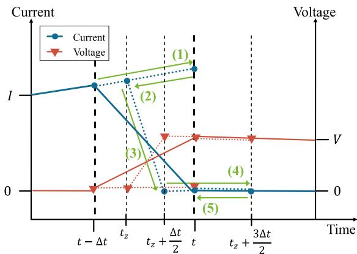  
(a)

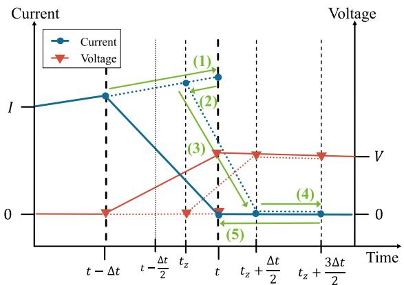  
(b)   
Fig. 6. Voltage and current of S1 with proposed interpolation with BE method. (a) Interpolation. (b) Extrapolation.

where ?????? $I _ { h i s t o r y } ^ { B E }$ is the history current vector of the BE method. The proposed method aims to address the ‘‘one time-step advance’’ error by implementing the BE method to find the network solution at $t _ { z } + \frac { \Delta t } { 2 } .$ further in Appendix. However, it is worth noting that the BE method is less accurate than the Trapezoidal method and does not accurately reflect the stability region of a continuous system [20,30]. At the postswitching instant $\dot { t } _ { z } + \dot { \frac { 3 \Delta t } { 2 } }$ 3???? , the proposed algorithm switches back to the Trapezoidal method for accuracy and stability. Note that the extrapolation in step (5) is sometimes needed because the post-switching instant $\begin{array} { r } { t _ { z } + \frac { \Delta t } { \gamma } } \end{array}$ can be later than the original time grid point ?? as shown in $\mathrm { F i g . 6 \mathrm { \bar { ( b ) } } }$ .

Compared to the previous researches, this approach has the following advantages:

Firstly, since BE integration is used after switching, there is no need to calculate the state values after switching (i.e., at $t _ { z + } ) _ { - }$ . This is because, during the switching, all state variables are continuous functions of time. With the BE method, the history current source in the companion model has only state variable quantities (e.g., only inductor current in the above example). Therefore, the history current source has the same value before and after switching. In contrast, as seen from the above example, the history current in instantaneous interpolation, which uses the Trapezoidal integration, is composed of inductor current and inductor voltage. The latter is not a continuous function of time, and this creates the numerical error in estimating the history current at ?? . $t _ { z + } .$

Secondly, for ordinary interpolation the switching loss at ?? actually results from the interpolation procedure for synchronizing back to the original time grid as shown in Fig. 3. This is due to the fact that when the switch is turned off, the current across the switch should immediately drop to zero. Without special treatment, ordinary interpolation interpolates voltages and current using a linear combination of their values from $t _ { z - }$ when the switch is $\because \mathrm { O N } ^ { \mathrm { { \circ } } }$ to $t _ { z } + \Delta t$ when the switch is $" \mathrm { O F F } ?$ . As shown in Fig. 3, both the switch current and voltage at ?? from this step are usually non-zero, which causes the spurious switching loss. In contrast, this method solves this issue by utilizing the variables at $t _ { z } + \frac { \Delta t } { 2 }$ and $t _ { z } + \frac { 3 \varDelta t } { 2 }$ 3???? to interpolate (or extrapolate) variables to ??. Since both $t _ { z } + \frac { \Delta t } { 2 }$ and $t _ { z } + { \frac { 3 \Delta t } { 2 } }$ are calculated using the post-switching admittance matrix the resultant current (see Fig. 6) is essentially zero at ?? and so the spurious switching loss is avoided. Instantaneous interpolation (Fig. 5) also mitigates this loss at the cost of slightly less accuracy and additional steps for removing the numerical chatter.

Finally, as the half time-step BE uses the same admittance matrix as a full time-step Trapezoidal method, there is no computational disadvantage from re-triangulizing the admittance matrix. It also has the bonus advantage of suppressing numerical chatter.

# 4. Comparison of approaches by simulation

# 4.1. System configuration

The circuit in Fig. 4(a) is used to examine the accuracy, execution time, and spurious loss of the proposed with reference to other approaches. When S1 is turned on, the inductor current $( i _ { L } )$ starts to increase. When the S1 is turned off, D1 conducts immediately, and the inductor current circulates in the diode-inductor loop. The time-step ???? is 50 μs for the proposed, non-interpolated, ordinary interpolated, instantaneous interpolated methods. The system is also simulated using a very small time-step of 0.1 $\mu { s } ,$ which is considered as an accurate template for comparison. S1 is turned on at $t = 0 . 4 0 0 1 5$ s and turned off at $t = 0 . 5 9 9 8 5 \ s$ .

The circuit in Fig. 4(b) is for verifying chatter removal. This circuit is basically the same as that in Fig. 4(a), but the IGBT is changed to thyristor, and the diode is removed so that numerical chatter is generated. The voltage source is a 60 Hz ac source.

# 4.2. Simulation results

# 4.2.1. Accuracy

Simulation studies on the test system are conducted by turning on and off the operation of the S1. Fig. 7 shows the inductor voltage $( v _ { L } )$ when the switch is turned on (a) and turned off (b). As the switching instants are not on the 50 μs time-step grid, the program initially sees these events as occurring on the subsequent time-grid points of 0.04005 and 0.06 s. For the ‘‘no-interpolation’’ case (1), this results in a delayed response. With ordinary interpolation case (2), the voltage at the timestep immediately after switch operation is close, but not precisely equal to the correct voltage. The ‘‘instantaneous interpolation’’ (3) and the proposed (4) methods both give a precise response for all points on the time grid.

Fig. 8 shows inductor current $( i _ { L } ) .$ . There is an error in the current in the case of (1) ‘‘no-interpolation’’ and (2) ordinary interpolation, which is primarily due to the incorrect voltage calculations as in Fig. 8. The instantaneous interpolation is similar to switching the current one time-step earlier as in graph (3) for both the turn on and turn off cases, as was pointed out in Section 2.2. Finally, with the proposed method, the current very closely matches the correct result. Therefore, the interpolation with BE method shows the best accuracy performance.

# 4.2.2. Execution time

The execution time of simulations on a personal computer (AMD Ryzen 7 2700X CPU running at 3.7 GHz with 32 GB RAM) is shown in Fig. 9 for the various methods for time-steps ranging from 10 μs

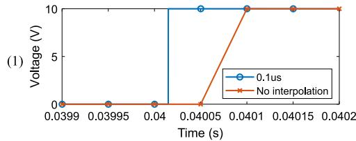

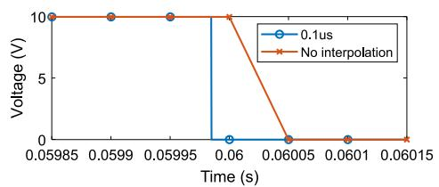

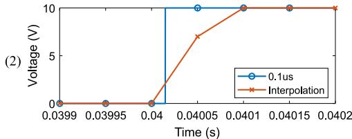

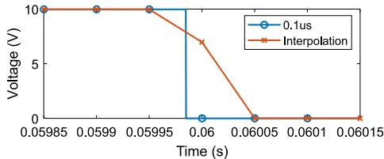

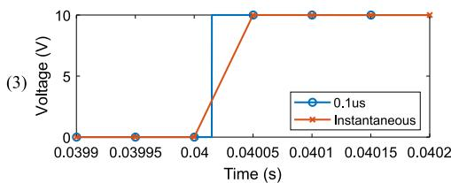

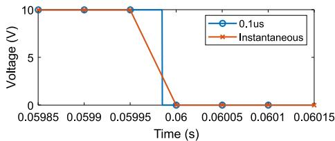

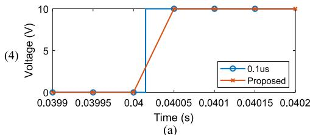

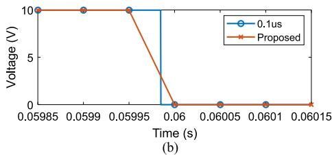  
Fig. 7. Inductor voltage when (a) turn-on and (b) turn-off.

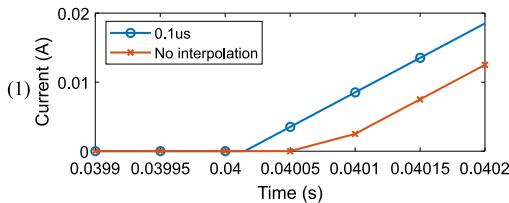

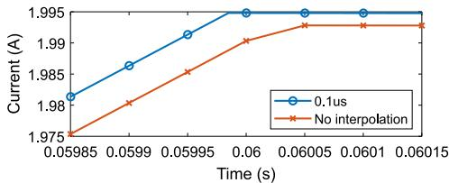

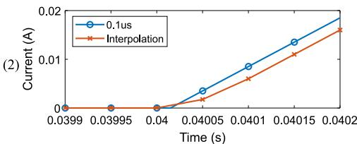

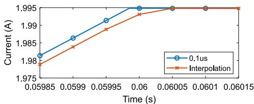

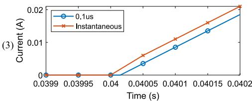

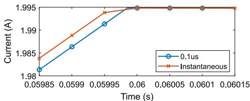

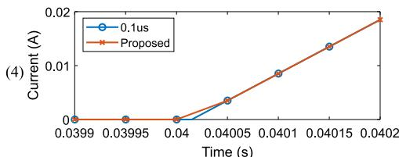

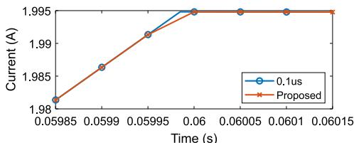  
  
  
Fig. 8. Inductor current when (a) turn-on and (b) turn-off.

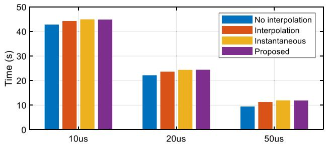  
Fig. 9. Execution time for one second simulation at various simulation time-step.

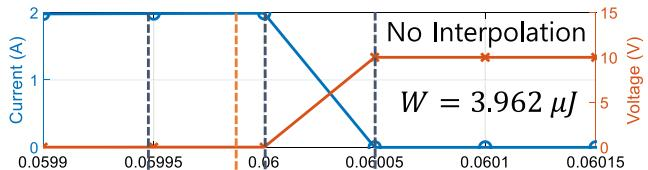

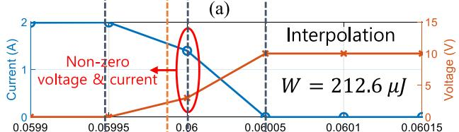

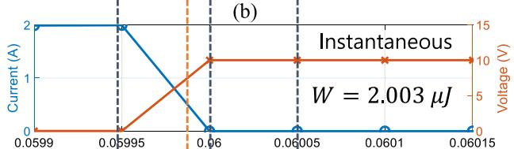

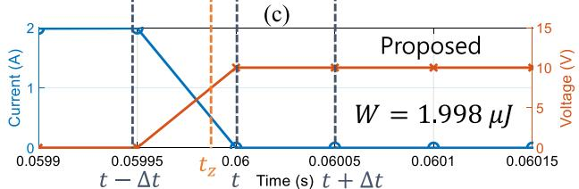  
(d)   
Fig. 10. Simulation results of energy loss of S1. (a) No-interpolation. (b) Interpolation. (c) Instantaneous interpolation. (d) Proposed interpolation with BE.

to 50 μs. The IGBT is switched on and off with a 1 kHz switching frequency. Instantaneous interpolation and the proposed method result in virtually identical run times, which are only marginally larger than ordinary interpolation. Thus, the proposed method has negligible run time penalties compared to the instantaneous interpolation method.

# 4.2.3. Spurious switching loss

The voltage, current, and energy loss of S1 when turning off are shown in Fig. 10. The ‘‘no-interpolation’’ case (a) has zero current after switching and very low energy loss (3.962 μJ), but it shows a delayed response. With the interpolation case (b), S1 has a large spurious energy loss (212.6 μJ) because of non-zero voltage and current at the original time-step grid, as has already been shown theoretically from Fig. 3. The instantaneous interpolation (c) and proposed (d) methods both have zero current value at ?? = 0.06 s, which means the spurious energy loss of S1 is negligible (about 2 μJ).

# 4.2.4. Chatter suppression

The chatter removal effects are shown in Fig. 11 for the circuit in Fig. 4(b). Each case shows inductor voltage (????) over one cycle.

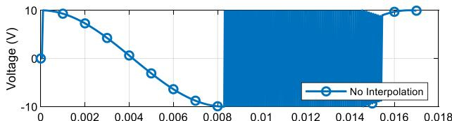

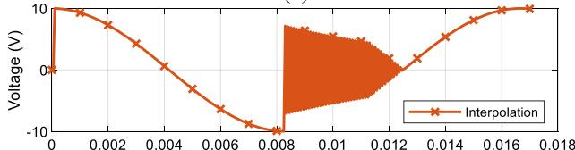

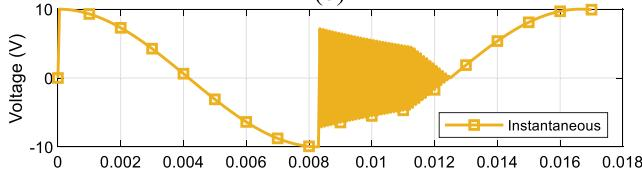  
(b)   
（c）

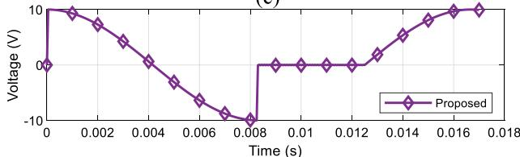  
  
Fig. 11. Simulation results of chatter removal effects. (a) No-interpolation. (b) Interpolation (without chatter removal) (c) Instantaneous interpolation (without chatter removal). (d) Proposed interpolation with BE.

S1 is naturally turned off at near 0.008 s due to the current zerocrossing. The other methods, except the proposed method, all show the numerical chatter so that they would require an additional chatter removal interpolation step [6]. However, the proposed method naturally suppresses the occurrence of chatters.

# 5. Expanded test cases

The basics of the approach were explained with the above simple IGBT/diode/inductor example shown in Fig. 4. The examples in this section demonstrates that it can be used in complex power electronic circuits with multiple switches which generate a complicated set of switching time instant data points due to the possibility of simultaneous switchings in a time-step. These complicated cases consist of single-phase two-level inverter and dual active bridge (DAB). However, the multiple switches provide complicated time information about switching instants. Therefore, the algorithm that can handle simultaneous switching is required. The Algorithm I is applied among several algorithms presented in [31] in this paper.

# 5.1. Simultaneous switching algorithm

The simultaneous switching algorithm flow chart is shown in Fig. 12. First switching check is simple, check natural commutated switching and force commutated switching by firing pulse, time information, and current direction. However, later switching checks are more difficult to handle. If there are simultaneous switchings (e.g., diode turn on or turn off) due to changes in the circuit topology, the EMT program must reflect theses simultaneous switching event. After the interpolation process with simultaneous switching, the EMT program checks for additional switching events that occur at different time instants during one solution time step, and proceeds with interpolation. The interpolation process is repeated until no more switching events occur.

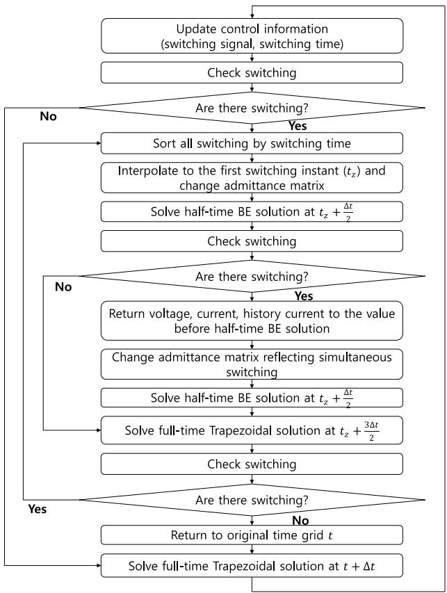  
Fig. 12. Flowchart of simultaneous switching algorithm.

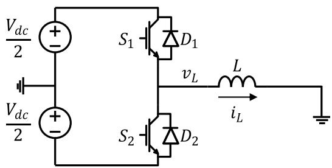  
Fig. 13. Single-phase two-level inverter test circuit diagram.

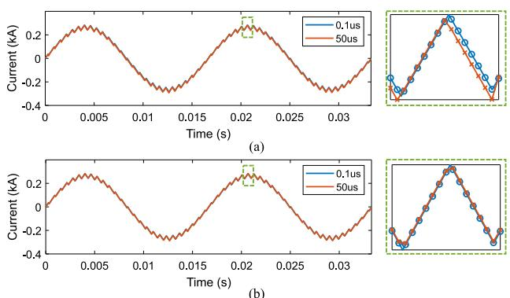  
Fig. 14. The inductor current with (a) instantaneous interpolation (b) proposed interpolation with BE.

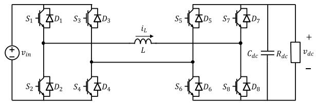  
Fig. 15. DAB test circuit diagram.

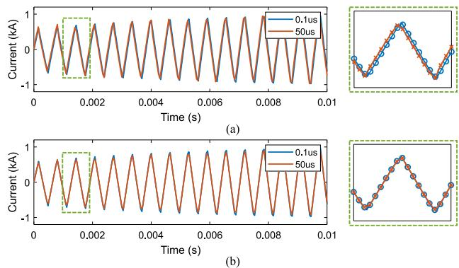  
Fig. 16. The inductor current with (a) instantaneous interpolation (b) proposed interpolation with BE.

# 5.2. Single-phase two-level inverter case

The circuit shown in Fig. 13 is a single-phase two-level inverter in order to validate the interpolation with BE method in multiple switching situations. The modulation index, switching frequency, dc voltage, and inductance are 0.8, 1560 Hz, 1.2 kV, and 5 mH, respectively. Fig. 14(a) shows the inductor current $( i _ { L } )$ simulated by instantaneous interpolation with 50 μs and 0.1 μs time-step. As expected, this result shows an error. In contrast, the current simulated by the proposed method matches the correct result as shown in Fig. 14(b). This case study validates that the interpolation with BE method and simultaneous switching algorithm can be available in circuits with four switches (two diodes and two IGBTs).

# 5.3. Dual active bridge case

The circuit in Fig. 15 is DAB in order to validate the interpolation with the BE method in a more complicated situation with a dc voltage source, dc capacitor, dc resistor, and 16 switches (8 diodes and 8 IGBTs). The dc source voltage, inductance, dc capacitance, and dc resistance are 750 V, 0.2 mH, 1000 μF, and 6 Ω, respectively. The DAB transfers power from the left side to the right side by phase difference between the PWM carrier signals. The switching frequency and phase shift are 1560 Hz and 25 degrees, respectively. As expected, the results of instantaneous interpolation show one time-step advance error of the inductor current as shown in Fig. 16(a). However, the results of interpolation with BE closely matches the 0.1 μs result as shown in Fig. 16(b). This case study demonstrates that the proposed method can be applied to practical simulation cases with multiple switches, such as the DAB circuit.

# 6. Conclusions

We have improved the accuracy of the interpolation method adopted in the EMT simulation programs. During the switching event, the proposed method combines interpolation and extrapolation with a half time-step backward Euler (BE) solution. This avoids computational errors and spurious power losses in switches, resulting from

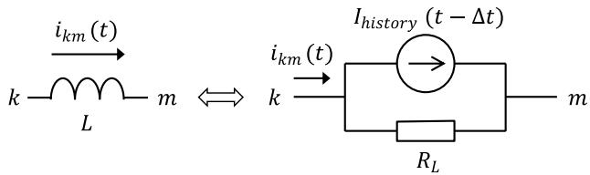  
Fig. 17. The companion model of the inductor in EMT simulation.

estimation of the correct history term, as is the case with instantaneous interpolation using Trapezoidal integration. Furthermore, the method intrinsically eliminates numerical chatter without additional steps as required with ordinary interpolation and instantaneous interpolation methods. Theoretical and simulation studies demonstrate the improved performance and computational benefits of the proposed method, even when simulating high-frequency switching operations.

# CRediT authorship contribution statement

J. Na: Conceptualization, Data curation, Formal analysis, Investigation, Methodology, Software, Validation, Visualization, Writing - original draft. H. Kim: Conceptualization, Formal analysis, Investigation, Validation, Writing - review & editing. H. Zhao: Formal analysis, Investigation, Software, Writing - original draft. A.M. Gole: Project administration, Resources, Supervision, Validation, Writing - review & editing. K. Hur: Funding acquisition, Project administration, Resources, Supervision, Validation, Writing - review & editing.

# Declaration of competing interest

The authors declare the following financial interests/personal relationships which may be considered as potential competing interests: Kyeon Hur reports financial support was provided by Korea Institute of Energy Technology Evaluation and Planning. Kyeon Hur reports financial support was provided by National Research Foundation of Korea.

# Data availability

No data was used for the research described in the article.

# Acknowledgments

This work was supported by ‘‘Human Resources Program in Energy Technology’’ of the Korea Institute of Energy Technology Evaluation and Planning (KETEP) granted financial resource from the Ministry of Trade, Industry & Energy, Republic of Korea (No. 20194010000060). This work was supported by the National Research Foundation of Korea (NRF) grant funded by the Korea government (MSIT) (No. 2021R1A2C209550313).

# Appendix

The differential equation of the inductor can be formulated by a numerical integration methods. The differential equation for the inductor is given as follows:

$$
v _ {k} - v _ {m} = L \frac {d i _ {k m}}{d t} \tag {9}
$$

where $v , i ,$ and ?? are the voltage, current, and inductance, respectively. The above equation can be described in integral form as:

$$
i _ {k m} (t) = i _ {k m} (t - \Delta t) + \frac {1}{L} \int_ {t - \Delta t} ^ {t} \left(v _ {k} - v _ {m}\right) d t. \tag {10}
$$

If Trapezoidal method is applied, (10) is reformulated as:

$$
i _ {k m} (t) = i _ {k m} (t - \Delta t) + \frac {\Delta t}{2 L} \left(\left(v _ {k} (t) - v _ {m} (t)\right) + \left(v _ {k} (t - \Delta t) - v _ {m} (t - \Delta t)\right)\right) \tag {11}
$$

$$
i _ {k m} (t) = I _ {\text {h i s t o r y}} (t - \Delta t) + \frac {1}{R _ {L}} \left(v _ {k} (t) - v _ {m} (t)\right) \tag {12}
$$

where $\begin{array} { r } { R _ { L } = \frac { 2 L } { { \cal A } t } , I _ { h i s t o r y } ( t - \varDelta t ) = i _ { k m } ( t - \varDelta t ) + \frac { 1 } { { \cal R } _ { L } } ( v _ { k } ( t - \varDelta t ) - v _ { m } ( t - \varDelta t ) ) , } \end{array}$ , and ???? is the solution time step, respectively. The companion model is shown in Fig. 17.

If BE method is applied, (10) is reformulated as:

$$
i _ {k m} (t) = i _ {k m} (t - \Delta t) + \frac {\Delta t}{L} \left(v _ {k} (t) - v _ {m} (t)\right) \tag {13}
$$

$$
i _ {k m} (t) = I _ {\text {h i s t o r y}} ^ {B E} (t - \Delta t) + \frac {1}{R _ {L}} \left(v _ {k} (t) - v _ {m} (t)\right) \tag {14}
$$

where $\begin{array} { l l l } { R _ { L } } & { = } & { { \frac { L } { { \varDelta } t } } } \end{array}$ and IBE ?? ????ℎ????????????(?? − ????) = ??????(?? − ????). Similar with the ${ \cal I } _ { h i s t o r y } ^ { B E } ( t - \Delta t ) \ = \ i _ { k m } ( t - \Delta t )$ Trapezoidal method, the BE method can be represented by a companion model as shown in Fig. 17. There are two differences between the two methods: the value of the effective resistance $( R _ { L } )$ and whether the history voltage value is included in the history current $( I _ { h i s t o r y } )$ .

In the Trapezoidal method, chatter is caused by the history voltage value. When the turn-off switching occurs at a point where the current becomes zero, the inductor history voltage (??(?? − ????)) changes negative, and an equal magnitude of the inductor present voltage (??(??)) to make the current value zero, as described in (15) (16).

$$
\frac {\Delta t}{2 L} \left(\left(v _ {k} (t) - v _ {m} (t)\right) + \left(v _ {k} (t - \Delta t) - v _ {m} (t - \Delta t)\right)\right) = 0 \tag {15}
$$

$$
\left(v _ {k} (t) - v _ {m} (t)\right) = - \left(v _ {k} (t - \Delta t) - v _ {m} (t - \Delta t)\right). \tag {16}
$$

However, there is no history voltage in the history current of BE method; thus, BE method is inherently chatter-free. If a half solution time step is applied, the effective resistance of the BE method becomes the same as that of the Trapezoidal method, with a value of $\frac { 2 L } { \Delta t }$ ???? . Therefore, the simulation program does not need to compute a new ?? matrix. As a result, the difference in computation time between the proposed method and the instantaneous interpolation method is negligible because $Y _ { n e w }$ matrix in (6) is the same as that in the Trapezoidal method.

# References

[1] A.M. Gole, A. Keri, C. Kwankpa, E.W. Gunther, H.W. Dommel, I. Hassan, J.R. Marti, J.A. Martinez, K.G. Fehrle, L. Tang, M.F. McGranaghan, O.B. Nayak, P.F. Ribeiro, R. Iravani, R. Lasseter, Guidelines for modeling power electronics in electric power engineering applications, IEEE Trans. Power Deliv. 12 (1) (1997) 505–514.   
[2] A.M. Gole, Electromagnetic transient simulation of power electronic equipment in power systems: challenges and solutions, in: 2006 IEEE Power Engineering Society General Meeting, 2006, p. 6.   
[3] N. Watson, J. Arrillaga, Power Systems Electromagnetic Transients Simulation, IET, 2003.   
[4] H.W. Dommel, Digital computer solution of electromagnetic transients in singleand multiphase networks, IEEE Trans. Power Appar. Syst. PAS-88 (4) (1969) 388–399.   
[5] H.W. Dommel, Electromagnetic Transient Program (EMTP) Theory Book, Bonnevile Power Administration, 1986.   
[6] A.M. Gole, I.T. Fernando, G.D. Irwin, O.B. Nayak, Modeling of power electronic apparatus: Additional interpolation issues, in: Proc. International Conference on Power Systems Transients (IPST), 1997.   
[7] J.R. Marti, J. Lin, Suppression of numerical oscillations in the EMTP power systems, IEEE Trans. Power Syst. 4 (2) (1989) 739–747.   
[8] J. Lin, J.R. Marti, Implementation of the CDA procedure in the EMTP, IEEE Trans. Power Syst. 5 (2) (1990) 394–402.   
[9] A.-R. Sana, J. Mahseredjian, X. Dai-Do, H. Dommel, Treatment of discontinuities in time-domain simulation of switched networks, Math. Comput. Simulation 38 (4) (1995) 377–387.   
[10] J. Mahseredjian, S. Dennetière, L. Dubé, B. Khodabakhchian, L. Gérin-Lajoie, On a new approach for the simulation of transients in power systems, Electr. Power Syst. Res. 77 (11) (2007) 1514–1520, Selected Topics in Power System Transients - Part II.

[11] A.M. Gole, V.K. Sood, A static compensator model for use with electromagnetic transients simulation programs, IEEE Trans. Power Deliv. 5 (3) (1990) 1398–1407.   
[12] T.L. Maguire, A.M. Gole, Digital simulation of flexible topology power electronic apparatus in power systems, IEEE Trans. Power Deliv. 6 (4) (1991) 1831–1840.   
[13] A.M. Gole, J. Martinez-Velasco, A.J.F. Keri, Modeling and Analysis of System Transients using Digital Programs, in: IEEE PES special publication, IEEE Operations Center, Piscataway, NJ, 1998.   
[14] W. Nzale, J. Mahseredjian, I. Kocar, X. Fu, C. Dufour, Two variable time-step algorithms for simulation of transients, in: 2019 IEEE Milan PowerTech, 2019, pp. 1–6.   
[15] T. Noda, K. Takenaka, T. Inoue, Numerical integration by the 2-stage diagonally implicit Runge-Kutta method for electromagnetic transient simulations, IEEE Trans. Power Deliv. 24 (1) (2009) 390–399.   
[16] P. Li, Z. Meng, X. Fu, H. Yu, C. Wang, Interpolation for power electronic circuit simulation revisited with matrix exponential and dense outputs, Electr. Power Syst. Res. 189 (2020) 106714.   
[17] J. Tant, J. Driesen, On the numerical accuracy of electromagnetic transient simulation with power electronics, IEEE Trans. Power Deliv. 33 (5) (2018) 2492–2501.   
[18] B. Kulicke, NETOMAC digital program for simulating electromechanical and electromagnetic transient phenomena in ac systems, ElektrizitÄTswirtschaft 78 (1979) 18–23.   
[19] P. Kuffel, K. Kent, G. Irwin, The implementation and effectiveness of linear interpolation within digital simulation, Int. J. Electr. Power Energy Syst. 19 (4) (1997) 221–227.   
[20] J. Tant, J. Driesen, On the numerical accuracy of electromagnetic transient simulation with power electronics, IEEE Trans. Power Deliv. 33 (5) (2018) 2492–2501.   
[21] K.H. Kruger, R.H. Lasseter, HVDC simulation using NETOMAC, in: Proc. IEEE Montech’86, Conference on HVDC Power Transmision, 1986.

[22] P. Lehn, J. Rittiger, B. Kulicke, Comparison of the ATP version of the EMTP and the NETOMAC program for simulation of HVDC systems, IEEE Trans. Power Deliv. 10 (4) (1995) 2048–2053.   
[23] X. Lei, E. Lerch, D. Povh, O. Ruhle, A large integrated power system software package-NETOMAC, in: Proc. POWERCON ’98. 1998 International Conference on Power System Technology, Vol. 1, 1998, pp. 17–22.   
[24] G. Irwin, D.A. Woodford, A.M. Gole, Precision simulation of PWM controllers, in: Proc. International Conference on Power Systems Transients (IPST), 2001.   
[25] J. Na, H. Kim, C. Lee, K. Hur, Spurious inductor loss of high switching power converter in EMT simulation study, in: Proc. International Conference on Power Systems Transients (IPST), 2017.   
[26] M. Zou, J. Mahseredjian, G. Joos, B. Delourme, L. Gérin-Lajoie, Interpolation and reinitialization in time-domain simulation of power electronic circuits, Electr. Power Syst. Res. 76 (8) (2006) 688–694.   
[27] M. Zou, J. Mahseredjian, G. Joos, B. Delourme, L. Gérin-Lajoie, Interpolation and reinitialization for the simulation of power electronic circuits, in: Proc. International Conference on Power Systems Transients (IPST), 2003.   
[28] W. Nzale, J. Mahseredjian, X. Fu, I. Kocar, C. Dufour, Improving numerical accuracy in time-domain simulation for power electronics circuits, IEEE Open Access J. Power Energy 8 (2021) 157–165.   
[29] W. Nzale, J. Mahseredjian, X. Fu, I. Kocar, C. Dufour, Accurate time-domain simulation of power electronic circuits, Electric Power Systems Research (ISSN: 0378-7796) 195 (2021) 107156.   
[30] H. Zhao, S. Fan, A.M. Gole, Stability evaluation of interpolation, extrapolation, and numerical oscillation damping methods applied in EMT simulation of power networks with switching transients, IEEE Trans. Power Deliv. (2020) 1.   
[31] M. Faruque, V. Dinavahi, W. Xu, Algorithms for the accounting of multiple switching events in digital simulation of power-electronic systems, IEEE Trans. Power Deliv. 20 (2) (2005) 1157–1167.