# Interface Displacement and Dynamic Phasor Mapping Equivalence Based Hybrid Simulation for HVAC/DC Power Grids

Yanan Zhu, Student Member, IEEE, Shuqing Zhang, Member, IEEE, Siqi Yu, Yingdong Wei, Jinfeng Zhang, Jianbing Xu, Jingsen Zhou

Abstract—In the electromagnetic transient (EMT) and transient stability (TS) hybrid simulation, the entire power system is artificially split into two sub-grids, and sub-grids interact with each other via an interface. Thus interface distortions emerge, including latency and errors. The influence of interface latency is quantitated based on a demo circuit containing delayed interaction. Moreover, the principles of improving hybrid simulation interface accuracy are concluded. Inspired by the principles, a novel interface displacement (ID) and dynamic phasor mapping equivalence (DP-ME) interface scheme is proposed. The scheme makes sub-grids at opposite sides of an interface loosely coupled and avoids interface variable form conversion by applying two techniques. 1) Displacement of the partition interface from the converter buses to the control loops and interior of the EMT sub-grid to utilize the built-in inertias. 2) Construction of the DP-ME model to calculate the injected power from EMT to TS sub-grid. Tests based on designed cases and an actual HVAC/DC power grid give credibility to the proposed ID & DP-ME scheme in comparison with full electromagnetic simulation.

Index Terms—electromagnetic and electromechanical, hybrid simulation, interface latency, mapping equivalent model

# I. INTRODUCTION

Because of advantages in long-distance large-capacity transmission, HVDC transmission systems have been widely used in modern power systems. With the concentration of the HVDC terminals in heavy-load districts and large amounts of generators connected through converters, electromechanical processes all through the entire power grid intertwine with fast transients of switching circuits and fast control dynamics [1, 2], which has profound effects on the system stability patterns and evolving processes. An urgent demand emerges for accurate and efficient simulation of such power grids [3, 4].

Electromagnetic transient (EMT) simulation and transient stability (TS) simulations have been widely applied to the analysis of power grids and power electronics. However, neither of them are sufficient for efficient simulation of large HVAC/DC power grids. EMT simulation focuses on detailed and fast transients in circuits and grids but is time-consuming and inapplicable to large power grids. TS simulation focuses on system stabilities but ignores detailed and fast characteristics. To overcome the weaknesses of conventional EMT and TS simulations, a hybrid simulation method interfacing and combining both simulation types emerged and attracted

attention in recent years [5, 6]. It can efficiently accommodate extra-large power grids and offer an approach for detailed observation of a partial network during one test [5, 6].

In the hybrid simulation, an entire power grid is split into two sub-grids, and two sub-grids are modeled and simulated by the EMT and the TS simulations. They are correlated as a whole by an interface. The two types of simulations are fundamentally different in modeling, bandwidth, equation types, variable forms, and solving methods as well as time-steps. Therefore, a substantial research effort has been undertaken to improve the interface and remove the interface errors.

Generally, the interface errors fall into three categories, and relevant research is summarized below.

1) Loss of high-frequency characteristics when passing boundary conditions from the TS side to the EMT side by fundamental frequency equivalent Thevenin/Norton model. One effective solution is overlaying the frequency-dependent network equivalence onto the fundamental-frequency model [7, 8].

2) Latency induced by artificially splitting and interfacing the originally-coupled system. In the traditional hybrid simulation, subsystems interact by converting and exchanging AC electrical quantities at the interface. Under the parallel interaction protocol, interface latency is inevitably induced by the exchange procedure. To mitigate the impact of latency, previous studies have started from improving interaction protocols at the expense of complicating the data exchange process and increasing the computation and communication burdens [9-12]. Based on the relaxation and latency insertion method, the study [13-15] treated the integrated circuit as two loosely coupled subsystems and solved them via alternating iteration. Nevertheless, it is hard to find a loosely coupled interface in actual power grids. The study [7, 16] have employed a few hundred microseconds as a solving step for TS simulation and interface, to decouple the EMT and TS sub-grids through transmission lines and eliminate the influence of interface latency. However, the computational burden increases due to the necessary iterations. Although this solution cannot decouple the subsystems when the time-step is at the millisecond level, it offers a new approach to reducing the influence of interface latency.

3) Latency and errors caused by form conversion of electric interface variables. For TS and EMT subsystems, the forms of their variables are different. When instantaneous waveforms of EMT variables are transformed into phasor forms by the FFT

based method, a latency of one fundamental frequency cycle is induced. Besides, conversion error tends to appear when the instantaneous waveform is disturbed during the conversion procedure [6]. The least-squares fitting method can avoid the type conversion latency, but it cannot effectively deal with the waveform fitting with the DC component [17]. The study [18] proposed that relocating the interface deep into the TS subsystem can reduce waveform distortion and conversion error. However, form conversion is inevitable through this method, so the latency caused by form conversion remains unsolved in traditional hybrid simulation schemes.

Aiming at the challenges from the latter two error categories, this paper gives a quantitative analysis and proposes a novel EMT/TS hybrid simulation scheme, which is based on interface displacement (ID) and dynamic phasor mapping equivalence (DP-ME) techniques. The remainder of this study is organized as follows. Section II quantitates the interface distortions and concludes the influence rules of interface latency on simulation accuracy. Inspired by the rules, Section III proposes the ID & DP-ME based hybrid simulation scheme. Then, Section IV describes the scheme in three cases and thoroughly tests and validates the proposed scheme. Finally, conclusions and perspectives are presented in Section V.

# II. ERROR MECHANISM IN HYBRID SIMULATION

# A. Mechanism analysis on latency

The latency in hybrid simulation comes from two aspects. 1) Interface latency. Non-iterative interaction protocols, e.g., parallel ones, are widely used due to its balance of efficiency and accuracy, but they always introduce one time-step delay between the two subsystems. 2) Latency from interface variable form conversion. EMT simulation is based on instantaneous waveforms, while in the TS simulation, electric variables are expressed using fundamental frequency phasors. When converting waveforms to fundamental frequency phasors, a time window (Fourier transformation, curve fitting, et al.) or a low-pass filter is applied to produce phasor estimates. These procedures bring delays to the interface.

Previous studies pointed out that latency under non-iterative interaction protocol is a leading reason that affects the interface stability [10]. Under severe disturbances, latency can lead to response deviation or even convergence failure. Therefore, reducing the latency induced by network partitioning or variable form conversion is the key to further improving the performance of the hybrid simulation [3].

Although studies pointed out that latency based errors had a significant influence on the hybrid simulation accuracy, neither quantitative analysis nor instructive rules on how latency influenced hybrid simulation were reported. Because the characteristic equation of a system with time-delay is transcendental, it is difficult to get the eigenvalue directly. Approximation or transformation is usually applied to represent the transcendental terms in the time-delay equation. such as Pade Approximation [19], Rekasius transform [20], Lambert W function [21], etc.

To quantitatively analyze the effect of latency on interface accuracy and stability, authors condense and abstract the hybrid simulation object into a circuit, as shown in Fig. 1(a). The

characteristic equations are solved with the help of the Lambert W function.

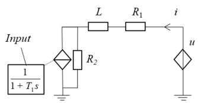  
(a)Reduced power grid

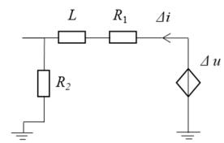  
(b) Linearized power grid

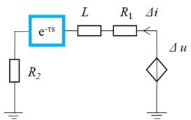  
(c) Simulated power grid   
Fig. 1 A demo system for EMT-TS hybrid simulation

The TS subsystem generally consists of an AC system with a large number of conventional power supplies. It can be represented by a voltage source with internal impedance, where u is the internal potential, and $R _ { 1 }$ and L are the resistance and inductance, respectively. The EMT subsystem generally consists of the DC power converter, etc., which can be equivalent to a controllable current source, where i is the output of the current source, and $R _ { 2 }$ is the internal resistance. The equivalent models of both subsystems mentioned above are widely used in hybrid simulation schemes interfacing at the converter buses. So this simplified demo system is representative. The response time constant in the control system is much larger than that of primary circuits. So the controllable current source output can be considered as constant during the electromagnetic transient process of the circuit. Further, the system shown in Fig. 1(a) is linearized to a linear system, as shown in Fig. 1(b). The dynamic equation of the system is:

$$
u (s) = \left(R _ {1} + s L + R _ {2}\right) i (s) \tag {1}
$$

The system eigenvalue is:

$$
\lambda_ {0} = - \frac {R _ {1} + R _ {2}}{L} \tag {2}
$$

As shown in Fig. 1(c), considering the latency induced by the primary network partition and interface variable form conversion, the total latency across the interface is . The system characteristic equation of the system in hybrid simulation with latency is:

$$
u (s) = \left(R _ {1} + s L\right) \times i (s) + R _ {2} \times i (s) \times e ^ {- \tau s} \tag {3}
$$

The analytical solution of first-order differential equations with delay can be written in terms of Lambert W function [22]. Then, the eigenvalues of the system expressed by equation (3) are obtained by:

$$
\lambda^ {\prime} = - \frac {R _ {1}}{L} + \frac {1}{\tau} W \left(- \frac {\tau e ^ {\tau R _ {1} / L}}{L / R _ {2}}\right) = - \frac {R _ {1}}{L} + \frac {1}{\tau} W (z) \tag {4}
$$

Among them, the Lambert W function $W ( z ) ( z { < } 0 )$ is an implicit function of z. When $z \geq - e ^ { - 1 }$ , ??ሺ??ሻ has and only has two real solution branches $W _ { 0 } ( z )$ and $W _ { - 1 } ( z )$ , as shown in Fig. 2. When $z < - e ^ { - 1 }$ , the Lambert W function gives the values of the other plural solution branches.

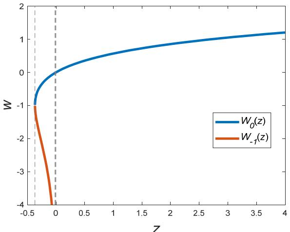  
Fig 2 Solution branches $W _ { 0 } ( z )$ and $W _ { - 1 } ( z )$ of Lambert W Function in real number field

Fig 3 Interface current after a step change occurs at the equivalent voltage source (Line A: R1=0.5, R2→0, L=5mH, τ=10ms, z→0-;   
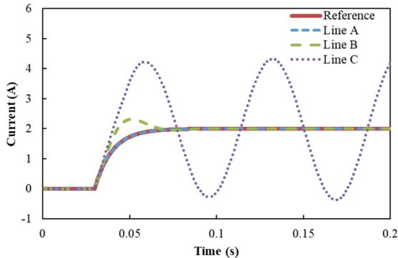  
Line B: $R _ { I } { = } 0 . 1 9 \Omega , R _ { 2 } { = } 0 . 3 1 \Omega , L { = } 5 \mathrm { m H } , \tau { = } 5 \mathrm { m s } , z { = } 0 . 3 7 4 9 ;$   
$\mathrm { L i n e } \mathrm { C } ; R _ { I } = 0 . 0 6 \Omega , R _ { 2 } = 0 . 4 4 \Omega , L = 5 \mathrm { m H } , \tau ^ { - 1 } 0 \mathrm { m s } , z = 0 . 9 9 2 2 )$

When a voltage step u excites the system, the response is observed by the interface current and is shown in Fig.3. Letting T=0ms,we get the reference response curve.By comparing the responses under diverse parameters, we get the following noteworthy phenomena. If R2 approaches 0, z approaches 0 and $\lambda ^ { \prime }$ approaches $\lambda _ { 0 }$ .The system response in the simulation approaches that of the original system, and the simulation results are accurate and effective, as shown by Line A. When z is reduced and less than $- e ^ { - 1 }$ , the system characteristics change substantially, and the oscillation mode appears, as shown by Line B. When z is further reduced, latency may cause unstable oscillation, and the simulation result is completely unauthentic, as shown by Line C.

According to the properties of the Lambert W function, enhanced interfacing performance requires $z \in ( - e ^ { - 1 } , 0 )$ . So

$$
R _ {2} <   L e ^ {- 1 - \frac {\tau R _ {1}}{L}} / \tau \tag {5}
$$

Under the condition that the parameters of the TS subsystems $( R _ { 1 } , L )$ are unchanged, expanding the feasible region to obtain stable simulation results requires 1) reducing the latency as much as possible. Considering that the latency is determined by

the simulation time-steps and the interface variable conversion method, the latency cannot be arbitrarily changed. 2) Reducing R2 close to 0. Because $R _ { 2 }$ is brought in by locating the interface in the circuit, relocating the interface may lower the interface impact.

# B. Errors from interface variable form conversion

The instantaneous waveform yielded by EMT simulation always consists of both fast and slow transient processes and can include singularity signals and complex harmonics. Failure to process these components results in errors during variable form conversion.

For the FFT algorithm, spectral leakage errors, aliasing errors, and initial phase errors occur when the waveform is distorted [23]. For the curve-fitting and projection on a rotating reference frame followed by a low-pass filtering method, conversion errors are also introduced under diverse conditions [5, 6, 24, 25]. EMT subsystem expansion has been proposed to alleviate form conversion errors [18]. By expanding the EMT subsystem and relocating the interface deep into the TS subsystems, the interface waveforms are less distorted, and errors are reduced. However, only utilizing electric variables that do not require waveform-to-phasor conversion can avoid this kind of errors.

# C. Principles of improving hybrid simulation interface accuracy

According to the above analysis, to reduce inherent latency and introduced errors emerging at the interface, two principles of improving hybrid simulation accuracy are obtained.

1) Keep the primary circuit of the system intact on the TS subsystem side to reduce the influence of the interface latency.   
2) Try to avoid the conversion of interface variables, especially the conversion from instantaneous waveforms to phasors.

According to the above principles, this paper proposes the following hybrid simulation scheme.

# III. THE ID & DP-ME BASED INTERFACE SCHEME FOR HYBRID SIMULATION

# A. Basic interface principles and ID & DP-ME scheme

Power systems containing large power electronic devices are one of the main objects of hybrid simulation, e.g., HVAC/DC power grids. As shown in Fig. 4, in the traditional hybrid simulation scheme (blue arrows), power electronic devices are arranged into the EMT subsystem because of fast dynamic responses; and AC grids are enclosed in the TS subsystem. The originally close-coupled primary networks are divided into subsystems, which changes the network structure and causes aberration in coupling characteristics. During the simulation, while one subsystem is solved, the other one is represented by a set of equivalent models at the interface. At a specified interaction interval (e.g., several milliseconds), two sub-grids interact with each other by sending and receiving electric interface variables to update the states of equivalent models dynamically. At the TS-to-EMT interface, Thévenin equivalent voltage source and reactance are taken as the electric interface variables. Because power electronic devices affect the AC networks by injection of fundamental frequency power, three-

phase currents are taken as the electric interface variables at the EMT-to-TS interface. Such interface variables require waveform-to-phasor form conversion. Therefore, when the traditional interface scheme is adopted, latency will inevitably be induced by network partitioning and variable form conversion.

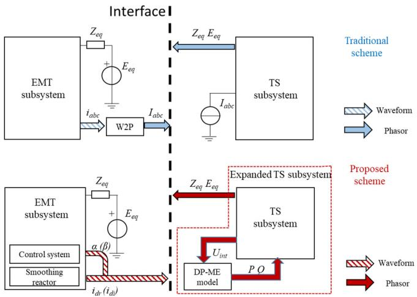  
Fig. 4 Traditional and proposed interface scheme with the DP-ME model

In the ID & DP-ME scheme (red arrows), the electric interface variables at the TS-to-EMT interface are the same as the traditional scheme. At the EMT-to-TS interface, DC variables, including the DC current and control variables, are taken as interface variables, to avoid form conversion. These DC variables are transferred to the expanded TS subsystem, which consists of the original TS subsystem and the DP-ME model. Thus, the TS subsystem encloses the whole electrical power grids with converters.

The DP-ME model is involved in the iterative solution of the TS subsystems. During the iteration, the DP-ME model receives $\mathbf { V } _ { i n t } ^ { ( \mathrm { i } ) }$ and inputs from the EMT subsystems to determine the injection power. After updating the injection power to the TS subsystems, the equation of the network is used again to update the voltage of AC buses in TS subsystems and obtain $\mathbf { V } _ { i n t } ^ { ( \mathrm { i + 1 } ) }$ . When the voltage of AC buses in TS subsystems changes during the iteration, the injection power of the EMT subsystem varies correspondingly instead of remaining constant. Thereby, the interactive effects on the power electronic equipment are fully considered. The iteration process proceeds until convergence is achieved.

Three key components exist in the ID & DP-ME scheme, the control system of the power electronic devices, the smoothing reactor on the DC lines, and the DP-ME model blocks.

Take LCC-HVDC systems as an example. Firing angle ɑ of an LCC converter has a response time constant at the millisecond level. The smoothing reactor of DC line can limit the change rate of the DC, which means that the response time is relatively long. Because the change of the control module's variable and DC current is relatively slow compared to a change in electrical quantities at the primary AC network, the influence of a TS time step on the interface stability is smaller than that of the traditional interface scheme. The state of the converter valves determines the DP-ME model, and the DP-ME model can determine the injection fundamental frequency power. No

variable form conversion blocks exist to obtain the fundamental frequency phasors from the instantaneous electrical variables at the interface buses, which can avoid form conversion errors. This DP-ME model is discussed in detail in the following section.

In general, compared to the traditional hybrid simulation scheme, the proposed ID & DP-ME scheme includes an additional ME block to model the EMT subsystem and interface with the TS subsystem. Without partitioning at the primary circuits and without variable form conversion processes, in the proposed scheme, no additional latency is induced. By exploring the built-in inertia of the control system and DC lines in the EMT subsystem, the impact of interface latency is significantly reduced.

# B. DP-ME model for the HVDC system

In the HVDC links and FACTS devices, the converter modulates the DC current via the state change of the valves to realize the transformation between AC energy and DC energy. Despite the variety of power electronic devices, converters share two common features: a) they consist of switching devices which switch at high frequency, b) their control systems have relatively larger inertia time constant comparing to that of the primary circuits, which can help reduce the influence of the latency.

Switching elements of power electronic devices induce a large number of discrete states, and the circuit topology is constantly changing, which increases the difficulty of modeling the equivalent model for the EMT subsystem. Sanders S R first proposed the dynamic phasor theory in 1991 [26]. As a timevarying Fourier Transform method, dynamic phasor theory can establish a unified and continuous model for switch type components and can adjust the complexity and accuracy according to research concerns. At present, dynamic phasor modeling methods have been used to model equipment or systems such as DC / DC converters, active filters, LCC-HVDC systems, VSC-HVDC, etc. [27-35]. Among them, studies [31- 35] proposed the dynamic phasor model for LCC-HVDC under symmetric/asymmetric conditions or commutation failures.

In the hybrid simulation, the internal details of the EMT subsystem, such as the operation of a specific switching element is not essential for the simulation of the TS subsystem. The EMT subsystem is usually presented by an equivalent current/power source to model energy conversion behavior and its influence on AC networks. In the proposed scheme, the dynamic phasor based DP-ME block is applied to calculate the injected current.

The core of the DP-ME model is based on the fact that the waveform x  can be approximated by individual timevarying Fourier series, as shown in Eq. (6), with arbitrary precision [36]. The computation burden can be reduced since only several coefficients of concern must be determined.

$$
X _ {k} (t) = \frac {1}{T} \int_ {t - T} ^ {t} x (\tau) e ^ {- j k \omega_ {k} \tau} d \tau \tag {6}
$$

In the equation, $X _ { k } ( t )$ is the complex time-varying Fourier coefficient and is also treated as the dynamic phasor. k is a positive integer. T refers to the width of the time window. And

x( )  is a time-varying signal. Besides, ${ \omega _ { s } } = 2 \pi / T$ .

According to references in [27]-[30], diverse kinds of power electronic devices can be presented to current/power sources by switching function based dynamic phasor models. Therefore, the transform between waveforms and dynamic phasors is the general part of the DP-ME block. The specific DP-ME model to calculate the injected AC current is dependent on switching functions of diverse converters.

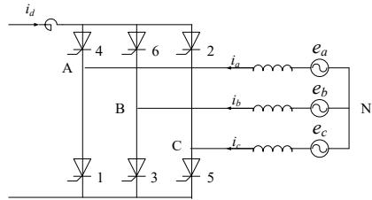  
Fig.5 Structure of a six-pulse thyristor bridge

Here is an example of a typical six-pulse thyristor converter in the HVDC link. The structure of it is shown in Fig. 5.

Assuming that valves of an LCC converter have three working states: on-state, commutation-state, and off-state. And the current linearly changes during the commutation process. For the three-phase six-pulse thyristor bridge shown in Fig.5, $S _ { i 1 } , S _ { i 2 } , \ldots S _ { i 6 }$ correspond to the current switching function of the 6 bridge arms. The function values 1 or 0 respectively correspond to the on-state or off-state, and the value between 1 and 0 corresponds to the commutation-state. Take Valve 1 as an example [35]:

$$
S _ {i 1} = \left\{ \begin{array}{l l} \frac {\theta - \alpha}{\mu} & [ \alpha + 2 k \pi , \alpha + \mu + 2 k \pi ] \\ 1 & [ \alpha + \mu + 2 k \pi , \alpha + \frac {2 \pi}{3} + 2 k \pi ] \\ 1 - \frac {\theta - \alpha - 2 \pi / 3}{\mu} & [ \alpha + \frac {2 \pi}{3} + 2 k \pi , \alpha + \mu + \frac {2 \pi}{3} + 2 k \pi ] \\ 0 & [ \alpha + \mu + \frac {2 \pi}{3} + 2 k \pi , \alpha + 2 (k + 1) \pi ] \end{array} \right. \tag {7}
$$

where ɑ is the firing angle, μ is the commutation overlap angle.

As shown in Fig. 6, under normal conditions, the overlap angles $\mu _ { a b } ,$ $\mu _ { b c } , \mu _ { c a }$ are the same.

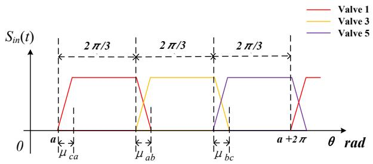  
Fig. 6 Switching function under normal condition

The phasor-form switching function for the valve currents can be expressed as follows

$$
\left\langle \mathrm {S} _ {i l} \right\rangle_ {0} = \frac {1}{3} \quad \left\langle S _ {i 1} \right\rangle_ {k} = - \frac {e ^ {- j k \alpha}}{2 \pi k ^ {2} \mu} \left(e ^ {- j k \mu} - 1\right) \left(e ^ {- j k \frac {2 \pi}{3}} - 1\right)
$$

$$
\left\langle \mathrm {S} _ {i 3} \right\rangle_ {0} = \frac {1}{3} \quad \left\langle S _ {i 3} \right\rangle_ {k} = - \frac {e ^ {- j k \left(\alpha + \frac {2 \pi}{3}\right)}}{2 \pi k ^ {2} \mu} \left(e ^ {- j k \mu} - 1\right) \left(e ^ {- j k \frac {2 \pi}{3}} - 1\right) \tag {8}
$$

$$
\left\langle \mathrm {S} _ {i 5} \right\rangle_ {0} = \frac {1}{3} \quad \left\langle S _ {i 5} \right\rangle_ {k} = - \frac {e ^ {- j k (\alpha + \frac {4 \pi}{3})}}{2 \pi k ^ {2} \mu} \left(e ^ {- j k \mu} - 1\right) \left(e ^ {- j k \frac {2 \pi}{3}} - 1\right)
$$

where $k = \pm 1 , \pm 2 \ldots$ . According to a previous report [36], assuming the voltage of Phase X and Phase Y are $V _ { \scriptscriptstyle X } \sin ( \omega t ) , V _ { \scriptscriptstyle Y } \sin ( \omega t + \varphi )$ . Without considering harmonics, if the commutation process is successful, the overlap angle between Phases X and Y can be calculated as follows:

$$
\alpha_ {X Y} = \alpha - \phi_ {X Y} + \frac {5 \pi}{6} (9)
$$

$$
\phi_ {X Y} = \arctan \left(\frac {V _ {Y} \sin \varphi}{V _ {X} - V _ {Y} \cos \varphi}\right) + k \pi , \phi_ {X Y} \in [ 0, \pi) \tag {10}
$$

$$
\frac {U _ {X Y}}{2 X _ {B}} \left[ \cos \alpha_ {X Y} - \cos \left(\alpha_ {X Y} + \mu_ {X Y}\right) \right] = i _ {d} \tag {11}
$$

$$
\gamma_ {X Y} = \pi - \alpha_ {X Y} - \mu_ {X Y} \tag {12}
$$

In the equations, $U _ { \chi }$ and $X _ { B }$ are the commutation voltage and reactance between Phases X and Y, respectively, and αXY is the angle on phase X when phase Y thyristor is fired. According to the proposed scheme illustrated in Fig. 4. $U _ { \chi \gamma }$ can be obtained from the TS subsystems during the forward and backward substitution block, $\mathbf { \alpha } \mathbf { 0 } \mathit { r d e r }$ and id in Eq. (11) are provided by the EMT side interface.

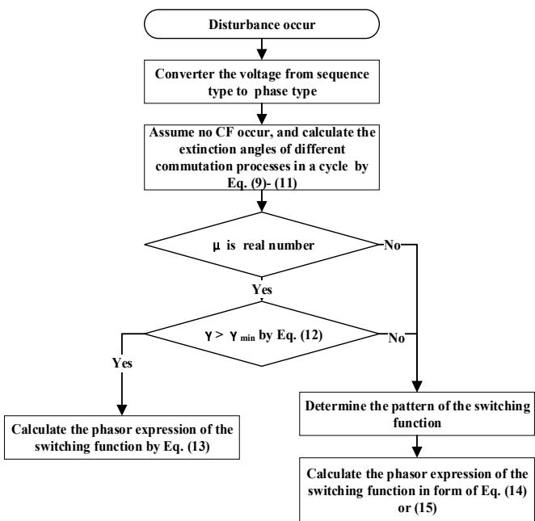  
Fig. 7 procedure for phasor switching function calculation

During the transient excited by disturbances, the overlap angles between phases are diverse. And the switching function pattern correspondingly changes if commutation failure happens in the HVDC converters. Under these conditions, phasor-form switching functions for valve currents can be calculated according to the procedure in Fig. 7.

If there is no commutation failure, switching functions for valve currents are similar to those illustrated in Fig. 6. However, μca, μab, μbc are diverse. So the phasor-form switching functions can be calculated by Eq. (12). If commutation failure is identified between phase X and phase Y, the switching function model should be changed to a commutation failure model, as shown in Fig. 8 (a) or (b). The phasor-form switching functions under commutation failure can be calculated by Eq. (13) or (14).

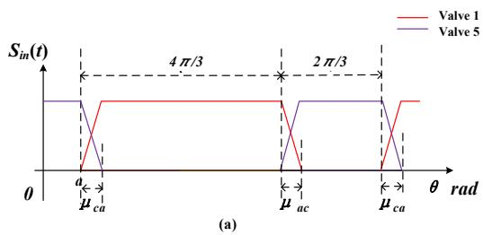

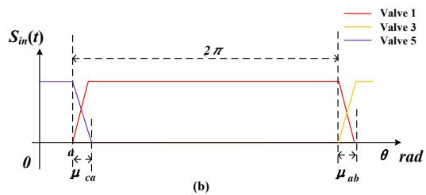  
Fig. 8 Switching functions of three valves when commutation failure occurs

$$
\left\{ \begin{array}{l} \langle S _ {i 1} \rangle_ {k} = \frac {e ^ {- j k \alpha_ {c a}}}{2 \pi k ^ {2} \mu_ {c a}} \Big (e ^ {- j k \mu_ {c a}} + j k \mu_ {c a} e ^ {- j k \frac {2 \pi}{3}} - 1 \Big) - \\ \frac {e ^ {- j k \big (\alpha_ {a b} + \frac {2 \pi}{3} \big)}}{2 \pi k ^ {2} \mu_ {a b}} (e ^ {- j k \mu_ {a b}} + j k \mu_ {a b} - 1) \\ \langle S _ {i 3} \rangle_ {0} = \frac {1}{3} - \frac {\mu_ {c a} - \mu_ {a b}}{2} \\ \langle S _ {i 3} \rangle_ {0} = \frac {1}{3} - \frac {\mu_ {a b} - \mu_ {b c}}{2} \\ \langle S _ {i 5} \rangle_ {0} = \frac {1}{3} - \frac {\mu_ {b c} - \mu_ {c a}}{2} \\ \end{array} \right\} \langle S _ {i 3} \rangle_ {k} = \frac {e ^ {- j k \big (\alpha_ {a b} + \frac {2 \pi}{3} \big)}}{2 \pi k ^ {2} \mu_ {a b}} \Big (e ^ {- j k \mu_ {a b}} + j k \mu_ {a b} e ^ {- j k \frac {2 \pi}{3}} - 1 \Big) - \\ \frac {e ^ {- j k \big (\alpha_ {b c} + \frac {4 \pi}{3} \big)}}{2 \pi k ^ {2} \mu_ {b c}} (e ^ {- j k \mu_ {b c}} + j k \mu_ {b c} - 1) \\ \langle S _ {i 5} \rangle_ {k} = \frac {e ^ {- j k \big (\alpha_ {b c} + \frac {4 \pi}{3} \big)}}{2 \pi k ^ {2} \mu_ {b c}} \Big (e ^ {- j k \mu_ {b c}} + j k \mu_ {b c} e ^ {- j k \frac {2 \pi}{3}} - 1 \Big) - \\ \frac {e ^ {- j k \alpha_ {c a}}}{2 \pi k ^ {2} \mu_ {c a}} (e ^ {- j k \mu_ {c a}} + j k \mu_ {c a} - 1)
$$

(13)

$$
\left\{ \begin{array}{l} \langle S _ {i 1} \rangle_ {k} = \frac {e ^ {- j k \alpha_ {c a}}}{2 \pi k ^ {2} \mu_ {c a}} \Big (e ^ {- j k \mu_ {c a}} + j k \mu_ {c a} e ^ {- j k \frac {4 \pi}{3}} - 1 \Big) - \\ \frac {e ^ {- j k \big (\alpha_ {a c} + \frac {4 \pi}{3} \big)}}{2 \pi k ^ {2} \mu_ {a c}} (e ^ {- j k \mu_ {a c}} + j k \mu_ {a c} - 1) \\ \langle S _ {i 3} \rangle_ {k} = 0 \\ \langle S _ {i 5} \rangle_ {k} = \frac {1}{3} - \frac {\mu_ {a c} - \mu_ {c a}}{2} \\ \end{array} \right. \left\{ \begin{array}{l} \langle S _ {i 1} \rangle_ {k} = 0 \\ \langle S _ {i 3} \rangle_ {k} = 0 \\ \langle S _ {i 5} \rangle_ {k} = 0 \\ \langle S _ {i 5} \rangle_ {k} = \frac {e ^ {- j k \big (\alpha_ {a c} + \frac {4 \pi}{3} \big)}}{2 \pi k ^ {2} \mu_ {a c}} \Big (e ^ {- j k \mu_ {a c}} + j k \mu_ {a c} e ^ {- j k \frac {2 \pi}{3}} - 1 \Big) - \\ \frac {e ^ {- j k \alpha_ {c a}}}{2 \pi k ^ {2} \mu_ {c a}} (e ^ {- j k \mu_ {c a}} + j k \mu_ {c a} - 1) \\ \end{array} \right.
$$

(14)

$$
\left\{ \begin{array}{l} \langle S _ {i 1} \rangle_ {0} = 1 - \frac {\mu_ {c a}}{2} \\ \langle S _ {i 3} \rangle_ {0} = 0 \\ \langle S _ {i 5} \rangle_ {0} = \frac {\mu_ {c a}}{2} \end{array} \right. \quad \left\{ \begin{array}{l} \langle S _ {i 1} \rangle_ {k} = \frac {e ^ {- j k \alpha_ {c a}}}{2 \pi k ^ {2} \mu_ {c a}} (e ^ {- j k \mu_ {c a}} + j k \mu_ {c a} - 1) \\ \langle S _ {i 3} \rangle_ {k} = 0 \\ \langle S _ {i 5} \rangle_ {k} = - \frac {e ^ {- j k \alpha_ {c a}}}{2 \pi k ^ {2} \mu_ {c a}} (e ^ {- j k \mu_ {c a}} + j k \mu_ {c a} - 1) \end{array} \right. \tag {15}
$$

After the phasor-form switching functions are determined, the AC current can be calculated as shown in Eq. (16).

$$
\begin{array}{l} <   i _ {a} > _ {k} = \left\langle S _ {1} i _ {d} \right\rangle_ {k} - \left\langle S _ {4} i _ {d} \right\rangle_ {k} = \sum_ {i + j = k} \left(\left\langle S _ {1} \right\rangle_ {i} - \left\langle S _ {4} \right\rangle_ {i}\right) \left\langle i _ {d} \right\rangle_ {j} \\ <   i _ {b} > _ {k} = \left\langle S _ {3} i _ {d} \right\rangle_ {k} - \left\langle S _ {6} i _ {d} \right\rangle_ {k} = \sum_ {i + j = k} \left(\left\langle S _ {3} \right\rangle_ {i} - \left\langle S _ {6} \right\rangle_ {i}\right) \left\langle i _ {d} \right\rangle_ {j} \tag {16} \\ <   i _ {c} > _ {k} = \left\langle S _ {5} i _ {d} \right\rangle_ {k} - \left\langle S _ {2} i _ {d} \right\rangle_ {k} = \sum_ {i + j = k} \left(\left\langle S _ {5} \right\rangle_ {i} - \left\langle S _ {2} \right\rangle_ {i}\right) \left\langle i _ {d} \right\rangle_ {j} \\ \end{array}
$$

The DC component and second-order component are the major components at the DC side of a six-pulse converter. Thus, we determine only these components and ignore others to reduce the computation burden.

Since elements of three-phase variables and three- sequence variables are both fundamental frequency variables, no errors appear during the conversion procedure.

The DP-ME model is based on the dynamic phasor method but features substantial improvements. First, accompanying the EMT subsystems, the DP-ME model treats DC currents as an input supplied by the EMT subsystems. Second, for LCC converter, a practical criterion is proposed to report the commutation failure. With these improvements, the computation required to determine the phases of commutation failure and the commutation overlap angles is reduced. This characteristic of the DP-ME model ensures that the impact of the EMT subsystems on the TS subsystems is described in detail during the transient process. Thus, the valid injected current/power can be calculated. The proposed scheme offers a real sense of practicability for the dynamic phasor method in simulation of a complex large-scale system. It is also applicable to different types of transient conditions.

In addition, because diverse power electronic devices can be presented by switching function based dynamic phasor method, the DP-ME model has broad application prospects in the field of hybrid simulation.

# IV. TEST SYSTEMS AND VALIDATION

Three test groups are presented in this section to validate the proposed ID & DP-ME scheme. The full EMT simulation result provides a reference for validation. In the following cases, the EMT time-step is 50 µs, whereas the TS time-step is 10 milliseconds.

# A. Case 1: DP-ME model for LCC-HVDC

To verify the accuracy of the proposed DP-ME model, we perform the case studies on the well-known CIGRE HVDC model. This model is built in detail using the EMT model, dynamic phasor model without considering commutation failures (DP model) and the DP-ME model in PSCAD-EMTDC [37].

Each of the two converters in the CIGRE benchmark system is composed of two six-pulse thyristor bridges. At the inverter bus of the HVDC system, a two-phase grounding fault occurs. Under this fault, different types of commutation failure

processes appear. To make an intuitive comparison between the EMT, DP and the DP-ME model, the results of DP and DP-ME model are converted into instantaneous waveforms from the original fundamental frequency phasors.

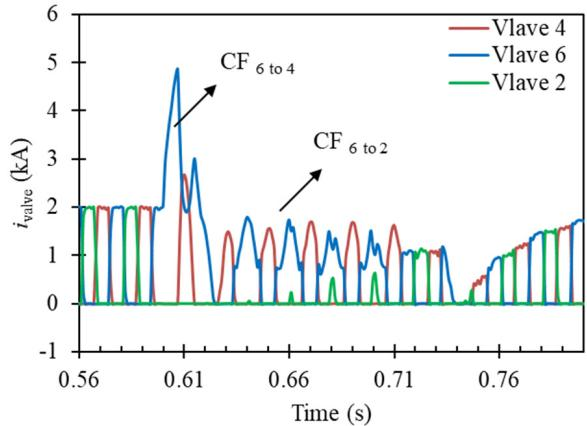

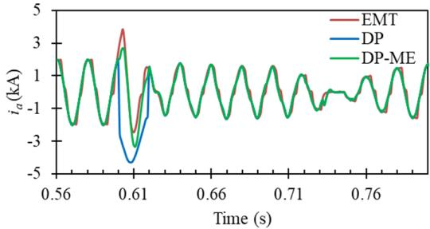

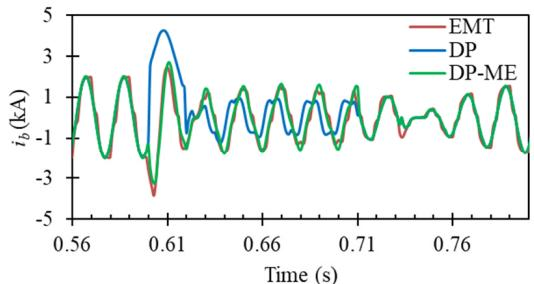

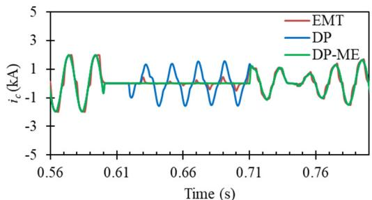  
  
Fig. 9 (a) Currents of three valves in the inverter simulated by the full EMT (b) Three-phase current of the inverter by diverse models

In Fig. 9(a), $\mathrm { C F } _ { M \mathrm { t o } N }$ refers to the commutation failure process from Valve M to Valve N.

During this fault, Valves 2 in Phase C are always in the off state. From 0.62 s to 0.70 s, the commutation failure processes occur between Phases B and C.

In this case, two types of commutation failures occur: the

continuous commutation failure that lasts for approximately one cycle $\left( \mathrm { C F } _ { 6 \mathrm { t o } 4 } \right)$ and the non-continuous commutation failure that occurs only between two valves and lasts for two-thirds of a cycle $\left( \mathrm { C F } _ { 6 { \bmod { 2 } } } \right)$ . Fig. 9(b) shows that the AC current calculated by the DP-ME model coincides well with that of the full EMT model in different types of commutation failures, which means that the DP-ME model can describe the transient process in detail during and after the fault.

Expressly, we assume that Valve N is not switched on if the commutation process from Valve M to Valve N is unsuccessful, although a period exists during which a small circulating current passes through Valve N, which is why a slight difference appears between the full EMT and DP-ME model results.

# B. Case 2: Modified IEEE 14-bus system case

This case is based on the well-known IEEE 14-bus system, as shown in Fig. 10. An HVDC system replaces line 13-6. The control strategy is the same as that of the CIGRE benchmark HVDC system. Selected parameters of the HVDC links are adjusted to fit the capacity of the entire system, as shown in Table I.

Table I Modified parameters in Case 2   

<table><tr><td>Name</td><td>Parameter</td></tr><tr><td>Resistor</td><td>0.125 Ω</td></tr><tr><td>DC reactance</td><td>0.06 H</td></tr><tr><td>DC capacitor</td><td>1.3 μF</td></tr><tr><td>Transformer capacity at the rectifier side</td><td>60.73 MVA</td></tr><tr><td>Transformer capacity at the inverter side</td><td>59.79 MVA</td></tr></table>

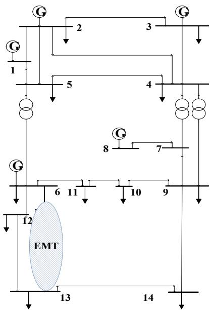  
Fig. 10 Modified IEEE 14-bus system case

A 3-phase short circuit fault occurs at the beginning of Line 13-14 and lasts for 0.07 s.

In the hybrid simulation, both in the hybrid simulation under the traditional interface scheme (Hybrid) and the proposed scheme (ID-Hybrid), the HVDC link is divided into the EMT subsystem, and other networks are divided into the TS subsystem. Bus 6 and Bus 13 are interface buses. The direction

of the power flow at the inverter is from the TS subsystem to the EMT subsystem.

Based on a computer with an Intel (R) Core (TM) i5-6200U 2.3 GHz and running memory of 16G, the simulation performance comparison between the full EMT simulation, the hybrid simulation under traditional interface scheme, and the proposed interface displacement scheme is as follows.

Table II Simulation performance comparison for Case 2   

<table><tr><td>simulation method</td><td>full-EMT</td><td>Hybrid</td><td>ID-Hybrid</td></tr><tr><td>CPU time(s)</td><td>81.94</td><td>12.03</td><td>12.31</td></tr></table>

Table II shows that the performance of diverse hybrid simulation methods is significantly promoted comparing to that of the full EMT simulation. In addition, because only algebraic expressions are involved in the complementary mapping equivalent module in the expanded TS subsystem, the performance result of the proposed scheme is close to that of the traditional hybrid simulation.

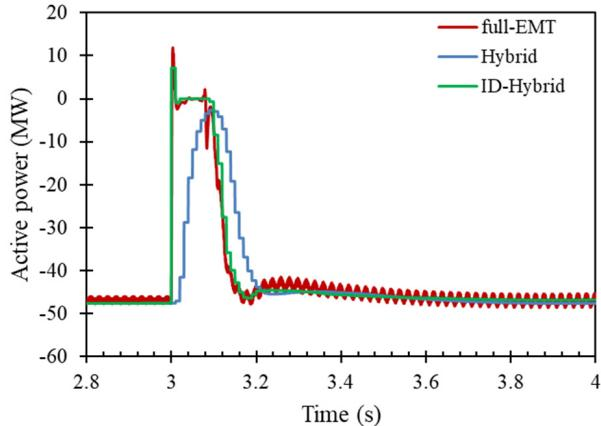

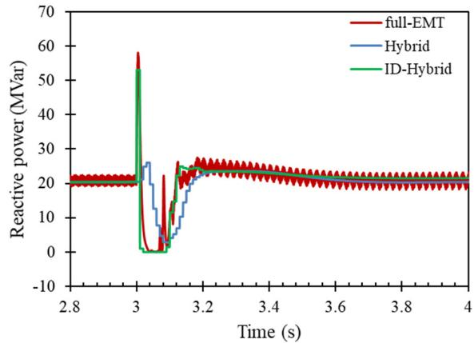  
(a)   
(b)

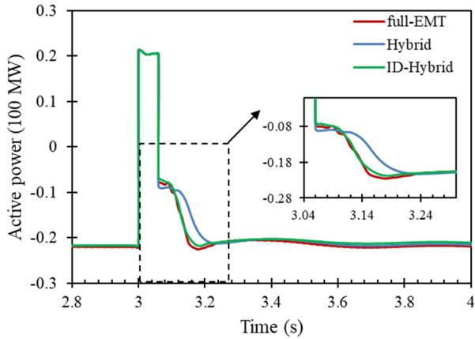

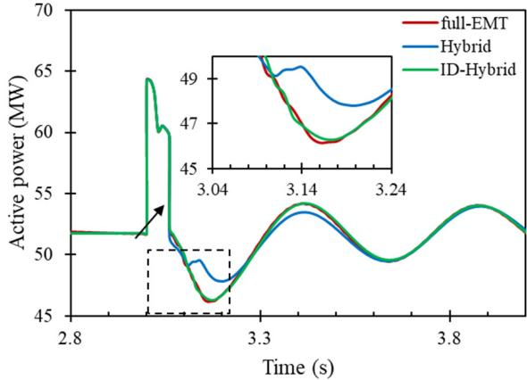  
(c)   
(d)   
Fig. 11 (a) Active and (b) reactive power at the inverter bus (c) Active power flow at line 13-14 (d) Active power of Generator 3

In this case, the results from the full EMT simulation, traditional hybrid simulation and proposed hybrid simulation scheme are compared in Fig 11. Commutation failure occurs from 3.03 s to 3.10 s. However, the traditional hybrid simulation cannot reflect the change in the active and reactive power at the interface. Thus, if the control and protection test is conducted in a traditional manner, the predicted response of the HVDC links is not credible. Additionally, in the TS subsystem, the power flows of the lines and generators are different from those of the full EMT simulation results during and after the fault period. During the first several swings, the oscillation amplitude of the load angle and power flow cannot be simulated precisely. The inaccuracy of the oscillation amplitude can lead to incorrect analysis of the network. For actual power systems, particularly if the power flows of the DC links are higher than that of the AC network, or if the short-circuit ratios are low, an exceptional interface scheme is of greater importance.

When applying the proposed scheme, the injected power and power flows through the lines and generators coincide well with those of the full EMT simulation by avoiding variable form conversion and taking advantage of the inherent time-delay process of the input variables.

# C. Case 3: A large-scale HVAC/ DC system case

The following case is an equivalent and simplified

HVAC/DC system of China Southern Power Grid [38]. This system consists of 102 generators, 1027 branches, and 5 HVDC links, and its backbone grid is shown in Fig. 12. To simplify the simulation, two of HVDC links, including Guiguang I HVDC and Guiguang II HVDC, are modeled in detail, and the other three are equivalent as current sources. The entire system is split into two subsystems. The EMT subsystem consists of the two HVDC links and interfaces with the TS subsystems by the DP-ME model, whereas the remaining portion belongs to the TS subsystem.

As a disturbance scenario, an A-phase grounded fault is applied on Bus Yandu, which is close to the inverter bus of Guiguang I HVDC. The fault begins at 0.5 s and lasts 0.1 s. The grounding impedance is 0.01 Ω.

Take the converters connected to the Y-Y commutation transformers as examples.

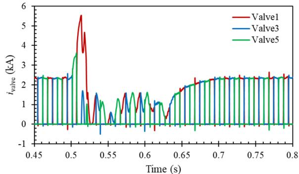  
Fig. 12 Scheme of the HVDC-AC system of China Southern Power Grid

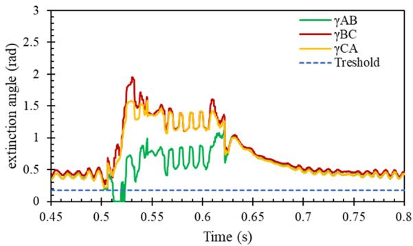  
(a)   
(b)   
Fig. 13 (a) Valve currents and (b) extinction angles of Guiguang I HVDC inverter

As shown in Fig. 13(a), during this fault, the inverter of Guiguang I suffers commutation failures from Valve 1 to Valve

3 and 5 during 0.51 to 0.53 seconds. As shown in Fig.13 (b), the calculated extinction angles can be exploited not only to judge whether a commutation failure occurs but also to determine the valves suffering commutation failures: during 0.5 ~ 0.51 seconds, according to the firing sequence of valves, because $\gamma _ { \mathrm { b c } } > \gamma _ { m i n } . ~ \mathrm { } \mathrm { \gamma } _ { \mathrm { c a } } > \gamma _ { m i n }$ , the current is successfully commutated from Valve 1 to Valve 3, then to Valve 5. After that, during the commutation process from Valve 1 to Valve 3, the calculated extinction angle between Phase A-B is lower than the threshold value (corresponding to 7 degrees), the valves at phase A which refers to Valve 1 are expected to stay on until $\gamma _ { \mathrm { { a b } } } > \gamma _ { m i n }$ . By comparing Fig 13(a) and (b), we can draw the following conclusion that according to the calculation result of the extinction angle, the commutation failure form can be accurately determined. And based on this, the DP-ME model of the EMT subsystem is constructed to be a part of the expanded TS subsystem.

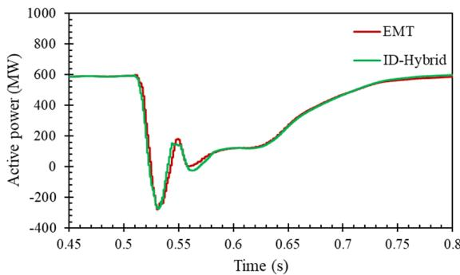

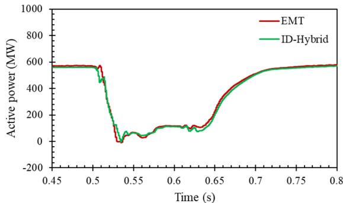  
(a)

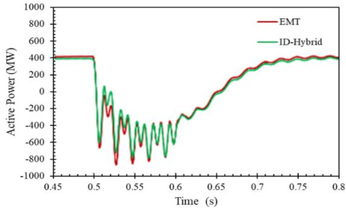  
  
(c)

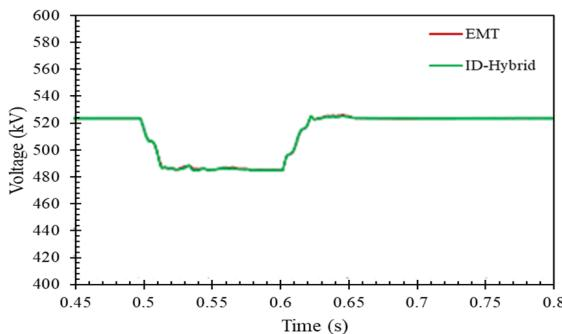  
(d)   
Fig. 14 (a) active power of the Guiguang I Y-Y connected rectifier and (b) active power of the Guiguang I Y-Y connected inverter (d) active power of Line Yandu-Xijiang and (e) voltage of Bus Xijiang

At the TS subsystem side of this case, based on the calculated extinction angles, the switching function of the converter can be determined by the DP-ME model. As shown in Fig. 14, active power at the interfaces, nearby lines, and voltages of buses coincide with those of the full EMT simulation result, which proves that the method can be used for hybrid simulation of large-scale power grids. In the actual multi-infeed system, the inverters are always located close to the load zone. Capable of precisely modeling the power at interfaces between the EMT and TS subsystems, the proposed scheme can accommodate this scenario.

This scheme is also applicable to the converters connected to the Y-D connected commutation transformers by increasing or decreasing 30 degrees to the commutation voltage phase. The simulation results are not covered here.

# V. CONCLUSION

Two error sources impose difficulties to EMT/TS hybrid simulation of HVAC/DC power systems: 1) the interface latency, and 2) the variable form conversion.

The impacts of the two error sources on the interface accuracy are quantitatively analyzed, and rules and hints for designing hybrid simulation interface are concluded: 1) model a primary circuit of the power system in the TS subsystem; 2) avoid the form conversion from instantaneous waveforms to phasors.

Then, the ID & DP-ME scheme is proposed, which consists of two core techniques:

1) The interface is displaced from the strong-coupled AC side to the control loops and DC side, so that the latency and interface variable form conversion are avoided.   
2) The DP-ME model block is built to restore the crucial characteristics of the power at the interface. The attributes of converters under the transient process can be precisely described by exploring the dynamic phasor method and applying a novel criterion for the commutation failure, particularly during the fault-clearance time.   
The proposed scheme and model are tested and verified in the CIGRE HVDC system case, the modified IEEE 14-bus system case under both symmetric and asymmetric faults and the actual large scale power system case. The results of this scheme coincide well with those from the full EMT simulation. The ID & DP-ME scheme offers a new method for hybrid simulation. In further study, the authors will apply the proposed scheme to diverse systems with power electronic devices,

including the FACT equipment and renewable energy source devices. And more in-depth research will be conducted on accuracy and performance.

# REFERENCES

[1] E. Rahimi, A. Gole, B. Davies, I. Fernando, and K. Kent, "Commutation failure analysis in multi-infeed HVDC systems," 2011 IEEE Power and Energy Society General Meeting, San Diego, CA, 2011, pp. 1-1.   
[2] F. Blaabjerg, Zhe Chen, and S. B. Kjaer, "Power electronics as efficient interface in dispersed power generation systems," in IEEE Transactions on Power Electronics, vol. 19, no. 5, pp. 1184-1194, Sept. 2004.   
[3] D. Shu; X. Xie; Q. Jiang; Q. Huang; C. Zhang, "A Novel Interfacing Technique for Distributed Hybrid Simulations Combining EMT and Transient Stability Models," in IEEE Transactions on Power Delivery, vol.PP, no.99, pp.1-1   
[4] Q. Huang and V. Vittal, "Integrated Transmission and Distribution System Power Flow and Dynamic Simulation Using Mixed Three-Sequence/Three-Phase Modeling," in IEEE Transactions on Power Systems, vol. 32, no. 5, pp. 3704-3714, Sept. 2017.   
[5] M. O. Faruque et al., "Interfacing Issues in Multi-Domain Simulation Tools," in IEEE Transactions on Power Delivery, vol. 27, no. 1, pp. 439-448, Jan. 2012.   
[6] V. Jalili-Marandi, V. Dinavahi, K. Strunz, J. A. Martinez, and A. Ramirez, "Interfacing Techniques for Transient Stability and Electromagnetic Transient Programs IEEE Task Force on Interfacing Techniques for Simulation Tools," in IEEE Transactions on Power Delivery, vol. 24, no. 4, pp. 2385-2395, Oct. 2009.   
[7] X. Lin, A. M. Gole and M. Yu, "A Wide-Band Multi-Port System Equivalent for Real-Time Digital Power System Simulators," in IEEE Transactions on Power Systems, vol. 24, no. 1, pp. 237-249, Feb. 2009.   
[8] M. Matar and R. Iravani, “A modified multi-port two-layer network equivalent for the analysis of electromagnetic transients,” in IEEE Trans. Power Del., vol. 25, no. 1, pp. 177–186, Jan. 2010.   
[9] F. Tian, C. Yue, Z. Wu, et al, "Realization of Electromechanical Transient and Electromagnetic Transient Real-Time Hybrid Simulation in Power System," 2005 IEEE/PES Transmission & Distribution Conference & Exposition: Asia and Pacific, Dalian, 2005, pp. 1-6.   
[10] A. A. van der Meer, M. Gibescu, M. A. M. M. van der Meijden, W. L. Kling and J. A. Ferreira, "Advanced Hybrid Transient Stability and EMT Simulation for VSC-HVDC Systems," in IEEE Transactions on Power Delivery, vol. 30, no. 3, pp. 1057-1066, June 2015.   
[11] Y. Zhang, W. Wu, B. Zhang, and A. M. Gole, "A decoupled interface method for electromagnetic and electromechanical simulation," 2011 IEEE Electrical Power and Energy Conference, Winnipeg, MB, 2011, pp. 187-191.   
[12] Q Huang, V Vittal, "Application of electromagnetic transient-transient stability hybrid simulation to FIDVR study ," in IEEE Transaction on Power Systems, vol. 31, no. 4, pp. 2634–2646, 2016,   
[13] P. Aristidou, C. Geuzaine, and T. Van Cutsem, “Co-simulation of electromagnetic transients and phasor models: A relaxation approach,” in IEEE Transactions on Power Delivery, vol. 31, no. 5, pp. 2360–2369, Oct. 2016.

[14] F. Plumier, P. Aristidou, C. Geuzaine and T. Van Cutsem, "Co-Simulation of Electromagnetic Transients and Phasor Models: A Relaxation Approach," in IEEE Transactions on Power Delivery, vol. 31, no. 5, pp. 2360- 2369, Oct. 2016.   
[15] S. P. Panda and A. M. Kulkarni, "Waveform relaxation based hybrid simulation of power systems," 2016 National Power Systems Conference (NPSC), Bhubaneswar, 2016, pp. 1-6.   
[16] Y. Liang, X. Lin, A. M. Gole and M. Yu, "Improved Coherency-Based Wide-Band Equivalents for Real-Time Digital Simulators," in IEEE Transactions on Power Systems, vol. 26, no. 3, pp. 1410-1417, Aug. 2011.   
[17] H. Su, L. A. Snider, K. W. Chan, et al., "A new approach for integration of two distinct types of numerical simulator," Proc. Int. Conf. Power Syst. Transients, 2003, pp. 1–6.   
[18] J. Reeve and R. Adapa, "A new approach to dynamic analysis of AC networks incorporating detailed modeling of DC systems. I. Principles and implementation," in IEEE Transactions on Power Delivery, vol. 3, no. 4, pp. 2005-2011, Oct. 1988.   
[19] H.Ye, J. Huo, Y. Liu, "A Method for computing eigenvalue of timedelayed power systems based on Pade Approximation," Automation of Electric Power Systems, Vol 37, No.7, pp:25-30,2013.   
[20] N. Olgac and R. Sipahi, "An exact method for the stability analysis of time-delayed linear time-invariant (LTI) systems," in IEEE Transactions on Automatic Control, vol. 47, no. 5, pp. 793-797, May 2002.   
[21] Yi S, Ulsoy A G. Solution of a system of linear delay differential equations using the matrix Lambert function. Proc. of the 26th American Control Conference, 2006: 2433-2438.   
[22] F.M. Asl, and A.G. Ulsoy, "Analysis of a System of Linear Delay Differential Equations, " in Journal of Dynamic System Measurement and Control, Vol. 125, No. 2, pp 215-223, 2003   
[23] M. Meunier and F. Brouaye, "Fourier transform, wavelets, Prony analysis: tools for harmonics and quality of power," 8th International Conference on Harmonics and Quality of Power. Proceedings (Cat. No.98EX227), Athens, 1998, pp. 71-76 vol.1.   
[24] B. Kasztenny and M. Kezunovic, “A method for linking different modeling techniques for accurate and efficient simulation,” in IEEE Trans. Power Syst., vol. 15, no. 1, pp. 65–72, Feb. 2000.   
[25] F. J. Plumier, P. Aristidou, C. Geuzaine and T. Van Cutsem, "A relaxation scheme to combine phasor-mode and electromagnetic transients simulations," 2014 Power Systems Computation Conference, Wroclaw, 2014, pp. 1-7.   
[26] S. R. Sanders, J. M. Noworolski, X. Z. Liu and G. C. Verghese, "Generalized averaging method for power conversion circuits," in IEEE Transactions on Power Electronics, vol. 6, no. 2, pp. 251-259, April 1991.   
[27] P. Mattavelli and A. M. Stankovic, "Dynamical phasors in modeling and control of active filters," 1999 IEEE International Symposium on Circuits and Systems (ISCAS), Orlando, FL, 1999, pp. 278-282 vol.5.   
[28] P. Mattavelli, A. M. Stankovic and G. C. Verghese, "SSR analysis with dynamic phasor model of thyristor-controlled series capacitor," in IEEE Transactions on Power Systems, vol. 14, no. 1, pp. 200-208, Feb. 1999.   
[29] M. Parimi, M. Monika, M. Rane, S. Wagh and A. Stankovic, "Dynamic phasor-based small-signal stability analysis and control of solid state

transformer," 2016 IEEE 6th International Conference on Power Systems (ICPS), New Delhi, 2016, pp. 1-6.   
[30] W.Yao, J. Wen, H. He, et al., "Modeling and simulation of VSC-HVDC with dynamic phasors," 2008 Third International Conference on Electric Utility Deregulation and Restructuring and Power Technologies, Nanjing, 2008, pp. 1416-1421.   
[31] Luo G, Liu C, Qian F, et al.., "Three-phase dynamic phasor model of HVDC systems," in The Journal of Engineering, vol. 2017, no. 13, pp. 2251- 2256, 2017.   
[32] A. Bagheri-Vandaei and S. Filizadeh, "Generalised extended-frequency dynamic phasor model of LCC-HVDC systems for electromagnetic transient simulations," in IET Generation, Transmission & Distribution, vol. 12, no. 12, pp. 3061-3069, 10 7 2018.   
[33] M. Daryabak, S. Filizadeh and A. Bagheri Vandaei, "Dynamic Phasor Modeling of LCC-HVDC Systems: Unbalanced Operation and Commutation Failure," in Canadian Journal of Electrical and Computer Engineering, vol. 42, no. 2, pp. 121-131, Spring 2019.   
[34] C. Liu, A. Bose and P. Tian, "Modeling and Analysis of HVDC Converter by Three-Phase Dynamic Phasor," in IEEE Transactions on Power Delivery, vol. 29, no. 1, pp. 3-12, Feb. 2014.   
[35] Q. Qi, L. Jiao, Z. Yan, et al., "Modeling and Simulation of HVDC with Dynamic Phasors, " Proceedings of the CSEE, Vol. 23, No. 12, pp. 31-35,2003   
[36] A. Emadi, "Modelling and analysis of multi-converter DC power electronic systems using the generalized state space averaging method," Industrial Electronics Society, 2001. IECON '01. The 27th Annual Conference of the IEEE, Denver, CO, 2001, pp. 1001-1007 vol.2.   
[37] Manitoba HVDC Research Centre, Inc. PSCAD-EMTDC version 4.5, The Professional’s Tool for Electromagnetic Transients Simulation.Winnipeg, MB, Canada: Manitoba HVDC Research Centre, Inc, 2008.   
[38] S. Zhang, Y. Zhu, K. Ou, et al, "A practical real-time hybrid simulator for modern large HVAC/DC power systems interfacing RTDS and external transient program," 2016 IEEE Power and Energy Society General Meeting (PESGM), Boston, MA, 2016, pp. 1-5.