# FPGA-Based Sub-Microsecond-Level Real-Time Simulation for Microgrids With a Network-Decoupled Algorithm

Jin Xu, Keyou Wang , Member, IEEE, Pan Wu, and Guojie Li, Senior Member, IEEE

Abstract—The real-time simulation based on the field programmable gate array (FPGA) is receiving more and more attention. However, up to now, the simulation scale for the power electronic system is not so satisfactory due to the real-time requirement and the FPGA resource limitation. This paper proposes a sub-microsecond level real-time simulation method for microgrids. The power converters are modeled with fixed-admittance models and simulated with a compact electromagnetic transients program (EMTP) algorithm. In the meanwhile, the distribution lines/cables are modeled with π-circuit models and simulated with a distributed circuit solution method, called the latency insertion method (LIM). As a result, the distribution generation (DG) systems are decoupled with each other and can be simulated in parallel. The case study shows that the proposed simulation method consumes much fewer FPGA resources compared with the traditional one. Besides, the time step can be much smaller and doesn’t need to increase with the simulation scale. With these advantages, the real-time simulation of a microgrid consisting of three three-phase converters, three boost circuits and 21 three-phase lines can be achieved on the Xilinx Kintex-7 410T FPGA with a minmum time-step of 380 ns.

Index Terms—Field programmable gate array (FPGA), latency insertion method (LIM), microgrid, real-time simulation.

# I. INTRODUCTION

able energy integration in the power distribution system [1], [2]. The control, protection and operation strategy of microgrids are technically required to pass the hardware-in-the-loop (HIL) test before being applied in actual projects [3], [4]. However, as the real-time simulation techniques for power electronic systems are not so matured, few HIL tests of microgrids are performed in practice. The challenges mainly come from the fast discrete characteristic of power electronic switches, which causes great computing burden in the electromagnetic simulation. Some work has been done to minimize the operations

Manuscript received January 21, 2019; revised April 25, 2019; accepted July 15, 2019. Date of publication August 19, 2019; date of current version March 24, 2020. This work was supported in part by the National Natural Science Foundation of China under Grants 51877133, 51477098, in part by the National Key R&D Plan under Grant 2016YFB0900601, and in part by the State Grid Corporation of China Science and Technology Project under Grant 52094017000Z. Paper no. TPWRD-00094-2019. (Corresponding author: Keyou Wang.)

The authors are with the Department of Electrical Engineering, School of Electronic Information and Electrical Engineering, Shanghai Jiao Tong University, Shanghai 200240, China (e-mail: xujin20506@sjtu.edu.cn; wangkeyou@sjtu.edu.cn; w20131501@163.com; liguojie@sjtu.edu.cn).

Color versions of one or more of the figures in this article are available online at http://ieeexplore.ieee.org.

Digital Object Identifier 10.1109/TPWRD.2019.2932993

of the interpolation technique for power electronic switches in real-time simulation [5]. However, the interpolation algorithm in the real-time simulation still has some problems to be solved, such as multiple switching problem. Therefore, most of the existing real-time simulators have to adopt small time-steps to reflect the switching moments accurately [6]. For a switching frequency of 20 kHz, a time-step smaller than 500 ns is usually required [7]. Achieving real-time simulations with such small time-steps requires not only the great computing power of hardware platforms but also the high efficiency of simulation models and simulation algorithms.

Commercial real-time simulators, such as RTDS and RT-LAB, can reach a small time-step of 0.5 μs-2 μs by virtue of their powerful FPGA modules. In recent years, more and more researchers are trying to implement the simulation on the FPGA, due to its high degree of parallelism and low latency of communication. Reference [8], [9] develop the FPGA-based real-time simulators for traditional power systems and electrical machines. Reference [7], [10], [11] develop the FPGAbased real-time simulators for power converters. Reference [12] achieves the real-time simulation of a microgrid with four FP-GAs working in parallel. Reference [13] achieves the real-time simulation of the CIGRÉ DC grid on a Mpsoc-FPGA-Based platform. In most of the aforementioned real-time simulators for power electronic systems, an efficient switch model is adopted to meet the real-time requirement. It is known as the fixedadmittance model, the associated discrete circuit (ADC) model [7], [14] or the small time-step model [15]. The authors also have made an improvement of this switch model to solve the virtual power loss problem [11].

Despite the powerful hardware platform and the efficient switch model mentioned above, the real-time performance and hardware resource consumption of the FPGA-based real-time simulator will still come to an unacceptable level quickly as the simulation scale increases. As a result, few researchers or manufacturers, have ever achieved the real-time simulation of a normal scale microgrid on the sub-microsecond-level with one FPGA device. To realize this goal, this paper proposes a submicrosecond-level real-time simulation method for microgrids with a network-decoupled algorithm, which has the following advantages:

1) Larger simulation scales: The proposed simulation method consumes much fewer FPGA resources. Thus more complicated microgrids can be simulated.

2) Smaller time steps: The time step can be smaller and doesn’t need to increase with the simulation scale. Thus simulation results can be more accurate especially in the high switching frequency situations.   
3) Better extendibility: The DG systems are decoupled with each other and simulated in parallel. New DG integrations can be easily achieved in the FPGA-based platform.

These advantages imply that the FPGA-based real-time simulator is no longer limited to the device-level simulation, but also has the potential to perform the system-level simulation with a sub-microsecond-level time step. This work also provides the possibility of real-time simulation for much larger power systems, which can be achieved by the multi-FPGA-based simulation or the co-simulation of FPGA modules and commercial simulators.

This paper is organized as follows. The basic idea of the network-decoupled simulation is illustrated in Section II and further elaborated in Section III. The resource/speed performance are discussed in Section IV. The simulation accuracy and simulation scale are discussed in Section V. The conclusion is given in Section VI.

# II. BASIC IDEA OF NETWORK-DECOUPLED SIMULATION

As we know, the calculation quantity of the nodal analysis method (NAM) is of quadratic proportion to the simulation scale [16]. As a result, the actual execution time per step and the FPGA resource consumption will increase quickly as the simulation scale increases. That severely limits the simulation scale of the FPGA-based simulator. Then a distributed circuit solution method called the latency insertion method (LIM) comes into our sight [17], [18]. Different from the centralized NAM, the calculation quantity of the LIM is of linear proportion to the simulation scale. However, this distributed method has some limitations in modeling power converters, as the converter models cannot be transformed into the topologies solvable for this distributed method. Switch-level modeling of converters is not compatible with the LIM for the moment.

Therefore, we come up with a hybrid solution to realize the real-time simulation for microgrids as shown in Fig. 1. The power converters in distributed generation (DG) systems (including the energy storage systems) are modeled with fixedadmittance switch model and solved with the NAM, thus called the NAM networks. The distribution lines/cables are modeled with π-circuit model and solved with the LIM, thus called the LIM network. Both the LIM and the NAM are slightly modified for better efficiency when implemented on FPGA. The interfaces between the LIM network and NAM network are designed, and the numerical stability is discussed. Details about the LIM-NAM solution of microgrid circuit will be further elaborated in Section III.

# III. PROCEDURE OF NETWORK-DECOUPLED SIMULATION

# A. LIM Network Solution

Before a network is solved with the latency insertion method (LIM), its topology is transformed into the form in Fig. 2.

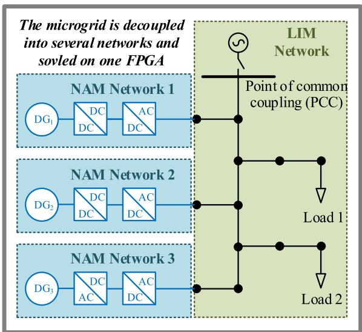  
Fig. 1. The basic idea of the network-decoupled simulation for microgrids.

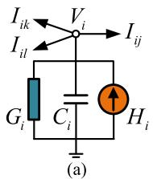

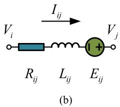  
Fig. 2. Basic units of the LIM network (a) LIM node (b) LIM branch.

1) Each node is represented by the parallel combination of a current source $H _ { i } ,$ , a conductance $G _ { i }$ and a capacitance $C _ { i }$ to the ground as shown in Fig. 2(a), which is called the LIM node in this paper;   
2) Each branch is represented by the serial combination of a voltage source $E _ { i j }$ , a resistance $R _ { i j }$ and an inductance $L _ { i j }$ between two nodes as shown in Fig. 2(b), which is called the LIM branch in this paper.

The differential equations of the LIM nodes and LIM branches are discretized with a semi-implicit difference scheme called the leap-frog method [19], which is second-order accurate [20]. The nodal voltage $V _ { i }$ is discretized at the $n - { \cal I } / 2$ and $n + { \cal I } / 2$ timesteps as shown in (1) while the branch current $I _ { i j }$ is discretized at the n and $n + l$ time-steps as shown in (2):

$$
C _ {i} \left(\frac {V _ {i} ^ {n + 1 / 2} - V _ {i} ^ {n - 1 / 2}}{\Delta t}\right) G _ {i} V _ {i} ^ {n + 1 / 2} - H _ {i} ^ {n} = - \sum_ {k \in S _ {i}} I _ {i k} ^ {n} \tag {1}
$$

$$
L _ {i j} \left(\frac {I _ {i j} ^ {n + 1} - I _ {i j} ^ {n}}{\Delta t}\right) + R _ {i j} I _ {i j} ^ {n} - E _ {i j} ^ {n + 1 / 2} = V _ {i} ^ {n + 1 / 2} - V _ {j} ^ {n + 1 / 2} \tag {2}
$$

where $\Delta t$ is the time step, $S _ { i }$ is the set of the LIM nodes connected to Node i.

From (1) and (2), we can obtain the updating expressions of the nodal voltage Vi and the branch current $I _ { i j }$ :

$$
\begin{array}{l} V _ {i} ^ {n + 1 / 2} = \left(\frac {C _ {i}}{\Delta t} + G _ {i}\right) ^ {- 1} \frac {C _ {i}}{\Delta t} V _ {i} ^ {n - 1 / 2} \\ - \left(\frac {C _ {i}}{\Delta t} + G _ {i}\right) ^ {- 1} \left(\sum_ {k \in N _ {i}} I _ {i k} ^ {n} - H _ {i} ^ {n}\right) \tag {3} \\ \end{array}
$$

$$
\begin{array}{l} I _ {i j} ^ {n + 1} = \left(1 - \frac {\Delta t}{L _ {i j}} R _ {i j}\right) I _ {i j} ^ {n} + \frac {\Delta t}{L _ {i j}} \\ \times \left(V _ {i} ^ {n + 1 / 2} - V _ {j} ^ {n + 1 / 2} + E _ {i j} ^ {n + 1 / 2}\right) \tag {4} \\ \end{array}
$$

Equation (3) and (4) can be rewritten in the vector-matrix form as follows:

$$
V _ {n o d a l} ^ {n + 1 / 2} = P _ {+} V _ {n o d a l} ^ {n - 1 / 2} - P _ {-} \left(M _ {L I M} I _ {b r a n c h} ^ {n} - H _ {n o d a l} ^ {n}\right) (5)
$$

$$
I _ {\text {b r a n c h}} ^ {n + 1} = Q _ {+} I _ {\text {b r a n c h}} ^ {n} + Q _ {-} \left(M _ {\text {L I M}} ^ {T} V _ {\text {n o d a l}} ^ {n + 1 / 2} + E _ {\text {b r a n c h}} ^ {n + 1 / 2}\right) \tag {6}
$$

where $V _ { n o d a l }$ is the $N _ { n 1 } \times 1$ nodal voltage vector, Ibranch is the $N _ { b 1 } \times 1$ branch current vector, $H _ { n o d a l }$ is the $N _ { n 1 } \times 1$ current source vector of LIM nodes, and $\mathbf { \mathit { E } } _ { b r a n c h }$ is the $N _ { b 1 } \times 1$ voltage source vector of LIM branches. $N _ { n 1 }$ is the total number of LIM nodes and $N _ { b 1 }$ is the total number of LIM branches.

The coefficient matrices $P _ { \mathrm { + } } , P _ { \mathrm { - } } , Q _ { \mathrm { + } }$ , and Q in (5) and (6) are defined as follows:

$$
\boldsymbol {P} _ {+} = \left(\frac {\boldsymbol {C}}{\Delta t} + \boldsymbol {G}\right) ^ {- 1} \left(\frac {\boldsymbol {C}}{\Delta t}\right) \quad \boldsymbol {P} _ {-} = \left(\frac {\boldsymbol {C}}{\Delta t} + \boldsymbol {G}\right) ^ {- 1} \tag {7}
$$

$$
\boldsymbol {Q} _ {+} = \left(\frac {\boldsymbol {L}}{\Delta t}\right) ^ {- 1} \left(\frac {\boldsymbol {L}}{\Delta t} - \boldsymbol {R}\right) \quad \boldsymbol {Q} _ {-} = \left(\frac {\boldsymbol {L}}{\Delta t}\right) ^ {- 1} \tag {8}
$$

where C, G are the $N _ { n 1 } \times N 1 _ { n }$ diagonal matrices composed of $C _ { i } , G _ { i } . L ,$ R are the $N _ { b 1 } \times N _ { b 1 }$ diagonal matrices composed of $L _ { i j } , R _ { i j }$ .

The $N _ { n 1 } \times N _ { b 1 }$ incidence matrix $M _ { L I M }$ in (5) and (6) is defined as follows:

$M _ { L I M } ( q , p ) = 1$ if Branch p is incident at Node $q$ and the branch current flows away from Node q.

$M _ { L I M } ( q , p ) = - 1$ if Branch $p$ is incident at Node $q$ and the branch current flows into Node q.

$M _ { L I M } ( q , p ) = 0$ if Branch $p$ is not incident at Node $q .$

# B. NAM Network Solution

Nodal analysis method (NAM) including its modified versions may be the most widely used circuit solution methods. The famous Electro-Magnetic Transient Program (EMTP) developed by Dommel is based on the NAM [16]. Similar to the EMTP, in this paper, all the branches are transformed into Norton’s equivalent circuit as shown in Fig. $3 . V _ { b r a n c h } , I _ { b r a n c h }$ are the branch voltage and branch current; $I _ { s o u r c e }$ is the equivalent current source of the voltage/current source branch; $I _ { h i s t o r y }$ is the history current of the inductance/capacitance/switch branch, which is determined by the branch voltage and branch current of the last step.

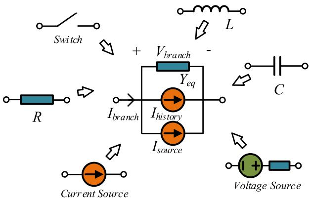  
Fig. 3. Norton’s equivalent circuit in the EMTP.

In this paper, the history current sources of all branch types are represented in the unified form:

$$
I _ {\text {h i s t o r y}} ^ {n + 1} = \alpha Y _ {e q} V _ {\text {b r a n c h}} ^ {n} + \beta I _ {\text {b r a n c h}} ^ {n} \tag {9}
$$

where $Y _ { e q }$ is the equivalent admittance of the branch, α and $\beta$ are the voltage coefficient and current coefficient of the history current expression, respectively. For example, if the backward Euler method is adopted, for the inductance branch L, we have

$$
\alpha = 0, \quad \beta = 1, \quad Y _ {e q} = \Delta t / L \tag {10}
$$

For the capacitance branch $C ,$ we have

$$
\alpha = - 1, \quad \beta = 0, \quad Y _ {e q} = C / \Delta t \tag {11}
$$

For the switch branch, which is regarded as a small inductance $L _ { s m l }$ when it’s ON, and regarded as a small capacitance $C _ { s m l }$ when it’s OFF [7], we have

$$
\left\{ \begin{array}{l} \alpha = 0, \quad \beta = 1, \quad Y _ {e q} = \Delta t / L _ {s m l}, \quad \text {w h e n i t ^ {\prime} s O N} \\ \alpha = - 1, \quad \beta = 0, \quad Y _ {e q} = C _ {s m l} / \Delta t, \quad \text {w h e n i t ^ {\prime} s O F F} \end{array} \right. \tag {12}
$$

That means, for the switch branch, α and $\beta$ are updated according to the switch state.

By the proper setting of $L _ { s m l }$ and $C _ { s m l }$ , we can make sure

$$
Y _ {e q} = \Delta t / L _ {s m l} = C _ {s m l} / \Delta t \tag {13}
$$

In this way, the equivalent admittance of the switch branch will not change with the switch state. That’s why this switch model is called the fixed-admittance model.

Rewrite (9) in the vector-matrix form, we have

$$
I _ {\text {h i s t o r y}} ^ {n + 1} = \alpha Y _ {e q} V _ {\text {b r a n c h}} ^ {n} + \beta I _ {\text {b r a n c h}} ^ {n} \tag {14}
$$

where $\scriptstyle { I _ { h i s t o r y } } ,$ , V branch, $\pmb { I _ { b r a n c h } }$ are the $N _ { b 2 } \times 1$ vector forms of $I _ { h i s t o r y } , \ V _ { b r a n c h } , \ I _ { b r a n c h }$ , respectively; $\boldsymbol { Y } _ { e q }$ is the $N _ { b 2 } \times N _ { b 2 }$ diagonal matrix composed of $Y _ { e q } ;$ α and $\beta$ are the $N _ { b 2 } \times N _ { b 2 }$ diagonal matrices composed of α and $\beta ,$ respectively. $N _ { b 2 }$ is the total number of branches in the NAM network.

Similarly, we can obtain the expressions of the $N _ { n 2 } \times 1$ injection current vector $I _ { i n j e c t i o n }$ , the $N _ { n 2 } \times 1$ nodal voltage vector $V _ { n o d a l }$ , the $N _ { b 2 } \times 1$ branch voltage vector $V _ { b r a n c h }$

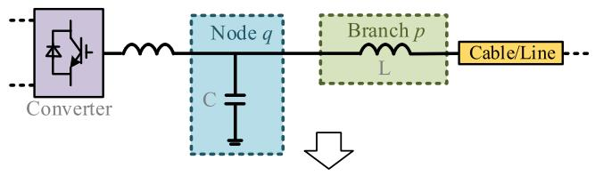

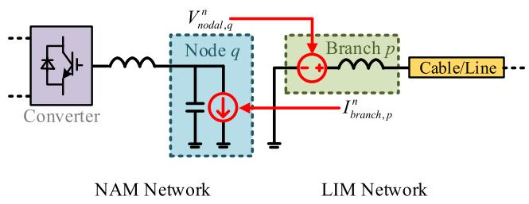  
Fig. 4. The interface between the LIM network and the NAM network.

and the $N _ { b 2 } \times 1$ branch current vector $\pmb { I _ { b r a n c h } }$ as follows:

$$
I _ {\text {i n j e c t i o n}} ^ {n + 1} = - M _ {N A M} \left(I _ {\text {h i s t o r y}} ^ {n + 1} + I _ {\text {s o u r c e}} ^ {n + 1}\right) \tag {15}
$$

$$
V _ {n o d a l} ^ {n + 1} = Y _ {n o d a l} ^ {- 1} I _ {i n j e c t i o n} ^ {n + 1} \tag {16}
$$

$$
V _ {\text {b r a n c h}} ^ {n + 1} = M _ {N A M} ^ {T} V _ {\text {n o d a l}} ^ {n + 1} \tag {17}
$$

$$
I _ {b r a n c h} ^ {n + 1} = Y _ {e q} V _ {b r a n c h} ^ {n + 1} + I _ {h i s t o r y} ^ {n + 1} + I _ {s o u r c e} ^ {n + 1} \tag {18}
$$

where $\pmb { I _ { s o u r c e } }$ is the $N _ { b 2 } \times 1$ equivalent current source vector; $M _ { N A M }$ is the $N _ { n 2 } \times N _ { b 2 }$ incidence matrix defined in the same way with $M _ { L I M } ; Y _ { n o d a l }$ is the $N _ { n 2 } \times N _ { n 2 }$ nodal admittance matrix. $N _ { n 2 }$ is the total number of nodes in the NAM network.

Equation (14)–(18) constitute the standard simulation loop of the EMTP. However, in practice, implementing (14)–(18) directly on the FPGA is not the best choice. There are too many computations in series, which may lead to the low simulation speed and the error diffusion in the FPGA. Therefore, we derived a compact simulation loop from (14)–(18) as follows. The detailed derivation is given in the Appendix.

$$
\left[ \begin{array}{l} V _ {n o d a l} ^ {n} \\ I _ {b r a n c h} ^ {n} \end{array} \right] = \left[ \begin{array}{l} K \\ L \end{array} \right] \left(I _ {h i s t o r y} ^ {n} + I _ {s o u r c e} ^ {n}\right) \tag {19}
$$

$$
\begin{array}{l} I _ {h i s t o r y} ^ {n + 1} = (\alpha + \beta) \times L \times \left(I _ {h i s t o r y} ^ {n} + I _ {s o u r c e} ^ {n}\right) \\ - \alpha \left(I _ {\text {h i s t o r y}} ^ {n} + I _ {\text {s o u r c e}} ^ {n}\right) \tag {20} \\ \end{array}
$$

where the $N _ { n 2 } \times N _ { b 2 }$ coefficient matrices K and $N _ { b 2 } \times N _ { b 2 }$ coefficient matrices L in (19) and (20) are defined as follows:

$$
\boldsymbol {K} = - \boldsymbol {Y} _ {\text {n o d a l}} ^ {- 1} \boldsymbol {M} _ {\text {N A M}} \tag {21}
$$

$$
\boldsymbol {L} = - \boldsymbol {Y} _ {e q} \boldsymbol {M} _ {N A M} ^ {T} \boldsymbol {Y} _ {\text {n o d a l}} ^ {- 1} \boldsymbol {M} _ {N A M} + \boldsymbol {I} \tag {22}
$$

where I is the $N _ { b 2 } \times N _ { b 2 }$ unit matrix.

# C. Interfaces Between LIM Network and NAM Networks

As shown in Fig. 4, the LCL filter of the AC/DC converter is selected as the interface between the LIM network and the NAM network in this paper. In the NAM network, the LIM network is equivalent to a current source connected to the Node q. In the LIM network, the NAM network is equivalent to a voltage source

in Branch p. The equivalent voltage sources $E _ { e q , L I M }$ and equivalent current sources ${ \cal I } _ { e q , N A M }$ of the network interfaces can be represented in vector-matrix form as follows:

$$
E _ {e q, L I M} ^ {n + 1 / 2} = M _ {N A M - L I M} V _ {\text {n o d a l}, N A M} ^ {n} \tag {23}
$$

$$
I _ {e q, N A M} ^ {n} = M _ {L I M - N A M} I _ {b r a n c h, L I M} ^ {n} \tag {24}
$$

where the mutual incidence matrix $M _ { N A M - L I M }$ is defined as follows according to Fig. 4:

$$
M _ {N A M - L I M} (p, q) = 1, \quad \text {t h e r e s t e l e m e n t s a r e z e r o .} \tag {25}
$$

Similarly, $M _ { L I M - N A M }$ is defined as follows:

$$
M _ {L I N - N A M} (q, p) = 1, \quad \text {t h e r e s t e l e m e n t s a r e z e r o .} \tag {26}
$$

$$
\begin{array}{l} V _ {n o d a l, L I M} ^ {n + 1 / 2} = P _ {+} V _ {n o d a l, L I M} ^ {n - 1 / 2} \\ - P _ {-} \left(M _ {L I M} I _ {b r a n c h, L I M} ^ {n} \right. \\ \left. - H _ {\text {n o d a l}, L I M} ^ {n}\right) \tag {27} \\ \end{array}
$$

$$
\begin{array}{l} I _ {b r a n c h, L I M} ^ {n + 1} = Q _ {+} I _ {b r a n c h, L I M} ^ {n} \\ + Q _ {-} \left(M _ {L I M} ^ {T} V _ {n o d a l, L I M} ^ {n + 1 / 2}\right) \\ \left. + E _ {\text {b r a n c h}, L I M} ^ {n + 1 / 2} + E _ {e q, L I M} ^ {n + 1 / 2}\right) \tag {28} \\ \end{array}
$$

$$
\begin{array}{l} \left[ \begin{array}{c} V _ {n o d a l, N A M} ^ {n} \\ I _ {b r a n c h, N A M} ^ {n} \end{array} \right] = \left[ \begin{array}{c} K \\ L \end{array} \right] \left(I _ {h i s t o r y, N A M} ^ {n} \right. \\ \left. + \boldsymbol {I} _ {\text {s o u r c e}, N A M} ^ {n} + \boldsymbol {I} _ {\text {e q}, N A M} ^ {n}\right) \tag {29} \\ \end{array}
$$

$$
\begin{array}{l} I _ {h i s t o r y, N A M} ^ {n + 1} = (\alpha + \beta) \times L \times \left(I _ {h i s t o r y, N A M} ^ {n} \right. \\ \left. + I _ {s o u r c e, N A M} ^ {n} + I _ {e q, N A M} ^ {n}\right) \\ - \alpha \left(I _ {h i s t o r y, N A M} ^ {n} + I _ {s o u r c e, N A M} ^ {n} \right. \\ + I _ {e q, N A M} ^ {n}) \tag {30} \\ \end{array}
$$

Then, the LIM network solution with the equivalent voltage sources can be rewritten as (27) and (28). The NAM network solution with the equivalent current sources can be rewritten as (29) and (30). All the voltage variables and current variables are added with the subscript of “LIM” or “NAM” to distinguish which network they belong to. Based on the above equations, the simulation loop of the entire microgrid is shown in Fig. 5.

From (23) and Fig. 5 we can see that the interface between the LIM network and the NAM network introduces a time-step delay. Given that the time-step is sub-microsecond level and the dynamics of a microgrid are much slower, its impact on the simulation accuracy is quite small as long as the LIM-NAM simulation is numerically stable. As for its impact on numerical stability, it will be discussed next.

# D. Numerical Stability Criteria

The numerical stability of LIM has been fully discussed in many works. Reference [19] gives the numerical stability criterion of a basic cell consisting of one LIM node and one LIM branch. Criteria under different integration schemes, including

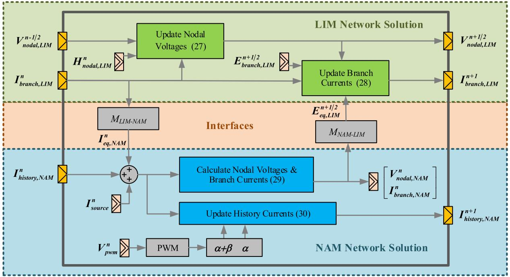  
Fig. 5. The simulation loop of the entire microgrid.

forward Euler method, leapfrog method and backward Euler are further discussed in [21]. Reference [22] and [23] give the numerical stability criterion of non-uniform GLC circuits and RLC circuits as shown in (31).

$$
\Delta t <   \sqrt {2} \min  _ {i = 1} ^ {N _ {n}} \left(\sqrt {\frac {C _ {i}}{N _ {b} ^ {i}} \min  _ {p = 1} ^ {N _ {b}} \left(L _ {\langle i , p \rangle}\right)}\right) \tag {31}
$$

However, this criterion is only for the LIM network. In this subsection, a generalized stability criterion of the LIM-NAM simulation is explored using discrete time system theory.

If we rewrite the LIM network solution of (27) and (28) with the state space description, we have:

$$
\begin{array}{l} \left[ \begin{array}{c} V _ {n o d a l, L I M} ^ {n + 1 / 2} \\ I _ {b r a n c h, L I M} ^ {n + 1} \end{array} \right] = A _ {L I M} \left[ \begin{array}{c} V _ {n o d a l, L I M} ^ {n - 1 / 2} \\ I _ {b r a n c h, L I M} ^ {n} \end{array} \right] \\ + B _ {L I M} \left(\left[ \begin{array}{c} E _ {b r a n c h, L I M} ^ {n + 1 / 2} \\ H _ {n o d a l, L I M} ^ {n} \end{array} \right] \right. \\ \left. + \left[ \begin{array}{c} E _ {e q, L I M} ^ {n + 1 / 2} \\ 0 \end{array} \right]\right) \tag {32} \\ \end{array}
$$

where the state matrix $A _ { L I M }$ and the input matrix $B _ { L I M }$ are defined as:

$$
A _ {L I M} = \left[ \begin{array}{c c} P _ {+} & - P _ {-} M _ {L I M} \\ Q _ {-} M _ {L I M} ^ {T} P _ {+} & Q _ {+} - Q _ {-} M _ {L I M} ^ {T} P _ {-} M _ {L I M} \end{array} \right] \tag {33}
$$

$$
B _ {L I M} = \left[ \begin{array}{c c} 0 & P _ {-} \\ Q _ {-} & Q _ {-} M _ {L I M} ^ {T} P _ {-} \end{array} \right] \tag {34}
$$

If we rewrite the NAM network of (29) and (30) with the state space description, we have:

$$
\begin{array}{l} I _ {h i s t o r y, N A M} ^ {n + 1} = A _ {N A M} I _ {h i s t o r y, N A M} ^ {n} \\ + B _ {N A M} \left(I _ {\text {s o u r c e}, N A M} ^ {n} + I _ {\text {e q}, N A M} ^ {n}\right) \tag {35} \\ \end{array}
$$

$$
\begin{array}{l} \left[ \begin{array}{c} V _ {n o d a l, N A M} ^ {n} \\ I _ {b r a n c h, N A M} ^ {n} \end{array} \right] = C _ {N A M} I _ {h i s t o r y, N A M} ^ {n} \\ + D _ {N A M} \left(I _ {\text {s o u r c e}, N A M} ^ {n} + I _ {e q, N A M} ^ {n}\right) \tag {36} \\ \end{array}
$$

where the state matrix $A _ { N A M }$ and the input matrix $B _ { N A M }$ are defined as:

$$
\boldsymbol {A} _ {N A M} = \boldsymbol {B} _ {N A M} = (\alpha + \beta) \boldsymbol {L} - \alpha \tag {37}
$$

$$
C _ {N A M} = D _ {N A M} = \left[ \begin{array}{l} \boldsymbol {K} \\ \boldsymbol {L} \end{array} \right] \tag {38}
$$

After reorganizing the state space expressions of LIM network and NAM network, we can obtain the state equation of the entire LIM-NAM network:

$$
X _ {S Y S} ^ {n + 1} = A _ {S Y S} X _ {S Y S} ^ {n} + B _ {S Y S} U _ {S Y S} ^ {n} \tag {39}
$$

where the state vector $X _ { S Y S }$ and the input vector $U _ { S Y S }$ are defined as:

$$
X _ {S Y S} ^ {n + 1} = \left[ \begin{array}{c} V _ {\text {n o d a l}, L I M} ^ {n + 1 / 2} \\ I _ {\text {b r a n c h}, L I M} ^ {n + 1} \\ I _ {\text {h i s t o r y}, N A M} ^ {n + 1} \end{array} \right] \quad U _ {S Y S} ^ {n} = \left[ \begin{array}{c} H _ {\text {n o d a l}, L I M} ^ {n} \\ E _ {\text {b r a n c h}, L I M} ^ {n + 1 / 2} \\ I _ {\text {s o u r c e}, N A M} ^ {n} \end{array} \right] \tag {40}
$$

The state matrix $A _ { S Y S }$ and the input matrix $B _ { S Y S }$ are defined as:

$$
\begin{array}{l} A _ {S Y S} = \\ \left[ \begin{array}{c c} A _ {L I M} + B _ {L I M} M _ {N - L} ^ {\prime} & B _ {L I M} M _ {N - L} ^ {\prime} C _ {N A M} \\ D _ {N A M} M _ {L I M - N A M} & \\ B _ {N A M} M _ {L I M - N A M} & A _ {N A M} \end{array} \right] \tag {41} \\ \end{array}
$$

$$
B _ {S Y S} = \left[ \begin{array}{c c} B _ {L I M} & B _ {L I M} M ^ {\prime} N - L D _ {N A M} \\ 0 & B _ {N A M} \end{array} \right] \tag {42}
$$

where the augmented mutual incidence matrix $M ^ { \prime } _ { N - L }$ is defined according to:

$$
\left[ \begin{array}{c} E _ {e q, L I M} ^ {n + 1 / 2} \\ 0 \end{array} \right] M _ {N - L} ^ {\prime} \left[ \begin{array}{l} V _ {n o d a l, N A M} ^ {n} \\ I _ {b r a n c h, N A M} ^ {n} \end{array} \right] \tag {43}
$$

The entire microgrid circuit model can be seen as a discrete linear time-invariant system described by (39). This discrete system is asymptotically stable if and only if the magnitudes of all the eigenvalues of the state matrix are strictly smaller than one. In another word, the spectral radius of the state matrix should be smaller than one as shown in (44).

$$
\rho \left(\boldsymbol {A} _ {\boldsymbol {S Y S}}\right) <   1 \tag {44}
$$

Both (31) and (44) are important criteria for the numerical stability of the LIM-NAM simulation. Equation (31) helps to select a proper time step which can make sure the LIM network is numerically stable, while (44) helps to validate the global numerical stability of the entire microgrid circuit under the selected time step.

# IV. RESOURCE CONSUMPTION AND EXECUTION TIME

# A. FPGA Implementation of Matrix Multiplications

The main loop of the proposed LIM-NAM simulation in Fig. 5 is implemented on the FPGA. Compared with the traditional EMTP algorithm, the matrix-form LIM-NAM algorithm is easier to be programmed, as it is almost completely composed of matrix additions and matrix multiplications. All the constant coefficient matrices in (27)–(30) are pre-calculated and pre-stored, including the diagonal coefficient matrices $P _ { + }$ , $P _ { - } , Q _ { + } , Q _ { - }$ , the non-diagonal coefficient matrices K, L, the sparse incidence matrices $M _ { N A M } , M _ { L I M } , M _ { N A M - L I M }$ , $M _ { L I M - N A M }$ . Besides, the time-variant diagonal coefficient matrices $\alpha + \beta$ and α of history current sources are updated in real time according to the PWM generator, which is mainly achieved by a comparator.

Given that the incidence matrices $M _ { N A M } , ~ M _ { L I M }$ , $M _ { N A M - L I M }$ , $M _ { L I M - N A M }$ and coefficient matrices $\alpha + \beta$ and α of history current sources only consists of 0, 1 and 1, the matrix multiplications involving these matrices are achieved with logic resources instead of multipliers in LabVIEW, which is a high-level computer language used in this simulation platform development. That’s confirmed by the FPGA hardware consumption report. As for the diagonal coefficient matrices $P _ { + } , P _ { - } , Q _ { + } , Q _ { - }$ and the non-diagonal coefficient

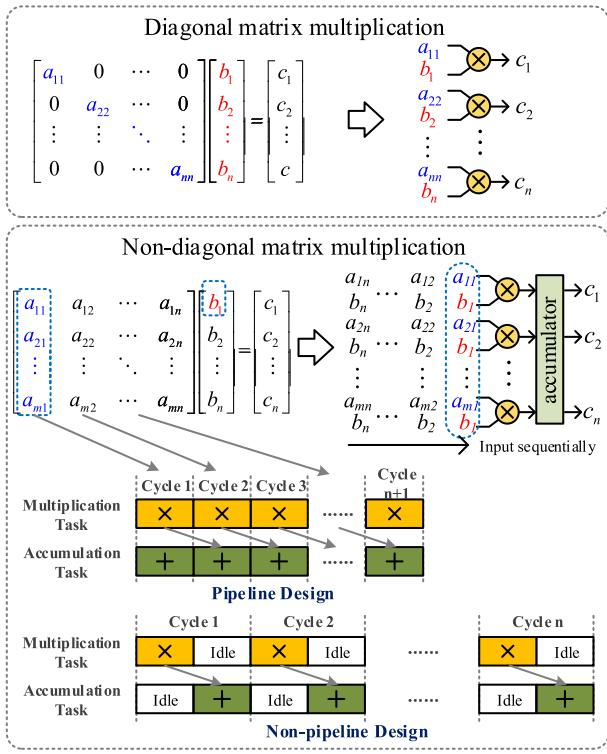  
Fig. 6. FPGA implementation of the matrix multiplications.

TABLE I MULTIPLIER CONSUMPTION AND EXECUTION TIME OF THE MATRIX MULTIPLICATIONS   

<table><tr><td></td><td>Multiplier Consumption</td><td>Execution Time (Clock Cycles)</td></tr><tr><td>Non-diagonal Matrix</td><td rowspan="2">m</td><td rowspan="2">n+1</td></tr><tr><td>Multiplication (m×n)</td></tr><tr><td>Diagonal Matrix</td><td rowspan="2">n</td><td rowspan="2">1</td></tr><tr><td>Multiplication (n×n)</td></tr></table>

matrices K, L, the fixed-point format of the matrix elements is set to $< \pm , 3 6 , 1 6 >$ (signed, 36 total bit number and 16 bits in the integral part, range from $- 2 ^ { 1 5 } \tan 2 ^ { 1 5 } - 2 ^ { - 2 0 } )$ . The fixed-point format of the voltage/current variables is set to <±, 25, 12>. In these formats, one multiplier can be achieved with two DSP slices, which is an FPGA hardware resource for the 25 bits  18 bits multiplication. The typical FPGA implementation schemes of the matrix multiplication involving these matrices are shown in Fig. 6, respectively. The diagonal matrix multiplication is designed to multiply the diagonal elements and vector elements at once. On the other hand, the non-diagonal matrix multiplication is achieved by the multiplications and accumulations of the kth column elements in the non-diagonal matrix and the kth element in the multiplied vector in sequence. By adopting the pipeline design, these multiplication tasks and accumulation tasks are performed in parallel and can be completed at a higher frequency, which will eventually reduce the execution time of each simulation loop.

According to the FGPA implementation schemes, the multiplier consumption and execution time of these matrix multiplications can be summarized in Table I. Both the

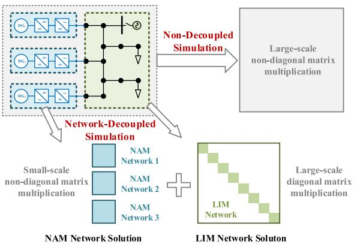  
Fig. 7. Coefficient matrices of the network-decoupled algorithm.

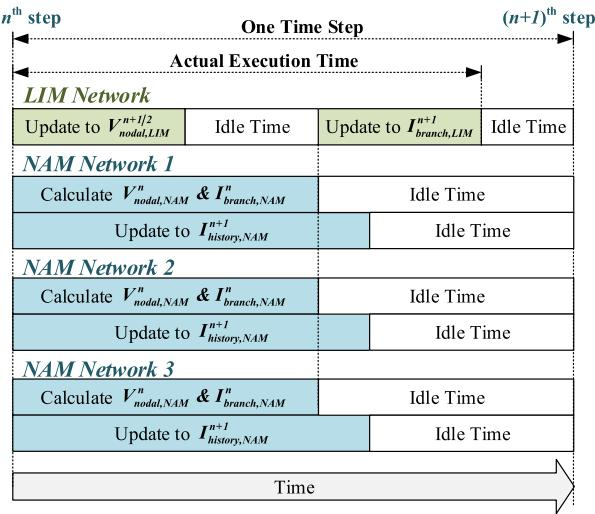  
Fig. 8. The timing diagram of the network-decoupled simulation.

multiplier consumption and execution time of the non-diagonal matrix multiplication grow linearly with the matrix order. As for the diagonal matrix multiplication, the multiplier consumption grows linearly with the matrix order, while the execution time is constant.

# B. FPGA Implementation of LIN-NAM Simulation

In an actual application, the microgrid may have multiple DG systems as shown in Fig. 7. These DG systems are decoupled with each other by the distribution lines which are solved with the LIM. Thus, these DG systems can be solved with NAM independently. The NAM network 1, 2, 3 in Fig. 7 are corresponding to the DG system 1, 2, 3, respectively. Compared with the non-decoupled NAM-based simulation, the proposed network-decoupled simulation only involves small-scale nondiagonal matrix multiplications and large-scale diagonal matrix multiplications, thus avoids the large-scale non-diagonal matrix multiplications. Besides, the small-scale non-diagonal matrix multiplications of each NAM network and large-scale diagonal matrix multiplications of the LIM network can be performed in parallel as shown in Fig. 8.

At the beginning of a time-step, the LIM nodal voltages, NAM nodal voltages & branch currents and NAM history current

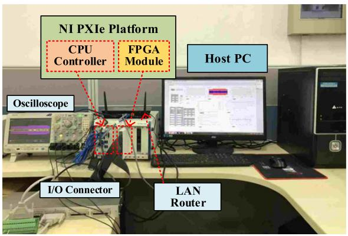  
Fig. 9. Hardware platform for the real-time simulation.

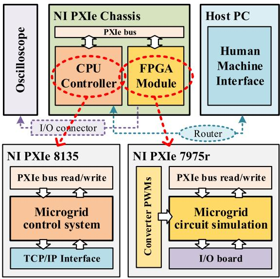  
Fig. 10. Functional structure of the hardware platform.

sources are updated simultaneously. The updating of the NAM nodal voltages & branch currents usually takes more time than the LIM nodal voltages according to (27) and (29) and Table I. As a result, the LIM network solver has to wait for the results of NAM network solvers before updating the LIM branch currents. From Fig. 8 we also know that the new integration of DG systems will not increase the actual execution time of each network-decoupled simulation loop due to the parallel structure, as long as the newly-integrated DG system scale is no larger than the previous ones. Besides, the execution time of the LIM solver will not increase with the number of lines/cables according to Table I. Therefore we can say that the actual execution time of the proposed network-decoupled simulation will not increase with the simulation scale.

# V. IMPLEMENTATION ON THE CPU-FPGA PLATFORM

Considering the openness and flexibility of model and algorithm, we developed a real-time simulation system on the National Instruments (NI) PXIe-based platform as shown in Fig. 9 instead of using commercial simulators. This platform has been tested with the real-time simulation of two-level converters

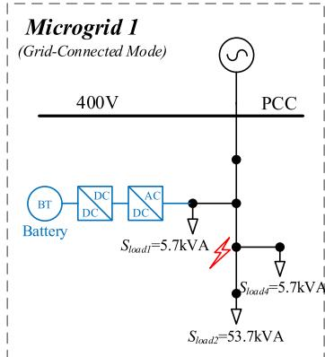

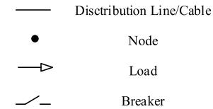  
LEGEND

System Scale   
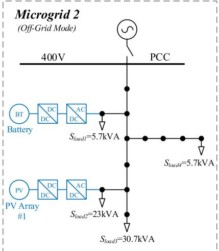  
Microgrid 1: 8 three-phase lines,2 converters; Microgrid 2:15 three-phase lines,4converters; Microgrid 3:21 three-phase lines,6 converters;

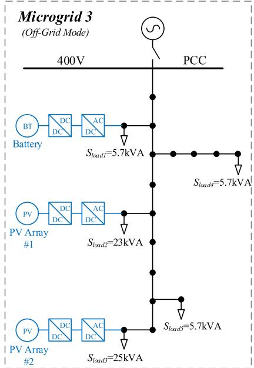  
Fig. 11. Single line diagrams of the tested microgrids.

and three-level converters in our previous work. In this paper, the real-time simulation of the microgrid will also be performed on this platform.

This simulation platform mainly consists of a host-PC, a real-time CPU controller, an FPGA module and other external devices. The functional structure of the hardware platform is shown in Fig. 10. The FPGA module performs the real-time simulation of microgrid circuit and the generation of PWM switch signals. The real-time CPUs perform the control systems of DG converters, which receives the instantaneous circuit solution results from the FPGA module and sends the modulating signals back to the FPGA through PXIe bus. As for the host PC, it serves as the human-machine interface (HMI) during the simulation, where the simulation results are observed and recorded. This simulation platform also provides FPGA I/O interfaces. Thus part of the simulation results can also be observed instantaneously on the oscilloscope.

All the software components of the real-time simulation platform are developed in the LabVIEW development environment, including the HMI in the host PC, the control simulation in the real-time CPUs, the circuit simulation in the FPGA module and the different communication interfaces between them.

# VI. CASE STUDY

# A. Configurations of the Tested Microgrids

The three tested microgrids are modified from the benchmark distribution system of CIGRE [24], [25] as shown in Fig. 11. Microgrid 1 is a small distribution network integrated with a battery system. Microgrid 2 is a medium distribution network integrated with a battery system and a photovoltaic (PV) system. Microgrid 3 is the benchmark system integrated with a battery system and two PV systems.

The external utility grid is equivalent to a three-phase 60 Hz voltage source with internal impedance. The RMS of the lineline voltage is 380 V, and the impedance is 0.05 Ohm and 38.5 uH. The distribution lines are modeled with the uncoupled three-phase π-circuit model. The resistance, inductance and shunt capacitance of each line model are 0.05 Ohm, 38.5 uH, and 35 nF, respectively. Each ac/dc converter is equipped with an LCL filter on the ac side, whose LCL parameters are 0.75 mH, 50 uF and 0.75 mH, respectively. All the loads are modeled with fixed-impedance models, whose impedances are calculated according to the load power under the nominal voltage.

In the grid-connected mode, the ac/dc converter of battery system works under PQ control, which determines the charging and discharging state of the battery. The PV systems work under the maximum power point tracking (MPPT) control. In the offgrid mode, the PV systems still work under the MPPT control, while the battery system switches to V/f control.

# B. Accuracy Test of Network-Decoupled Simulation

The accuracy of the network-decoupled simulation is tested by comparing with the off-line results of PSCAD/EMTDC. Microgrid 1 is selected as the tested system, which works in the grid-connected mode. Both the real-time and off-line simulations adopt the same model parameters, the same control strategies in Section VI-A and the same time step of 1 μs.

Scenario 1: At the beginning, the battery system works at the discharging state with the output power of 10 kW. At 0.1 second, it switches to the charging state with the input power of 10 kW. The results of both the PSCAD simulation and the LIM-NAM simulation are displayed in Fig. 12.

Scenario 2: A single-phase earth fault occurs at 0.1 second and is cleared 0.05 seconds later as shown in Microgrid 1 of Fig. 11.

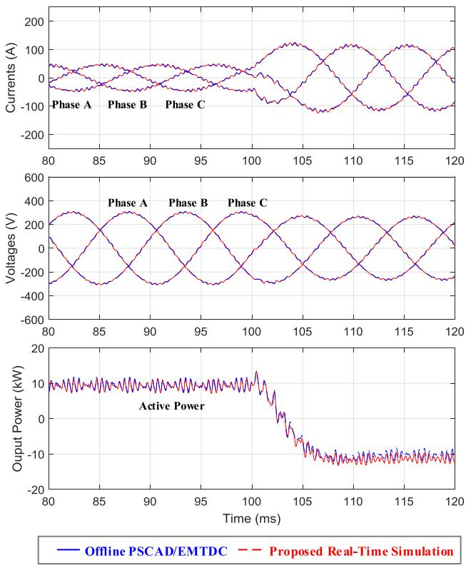  
Fig. 12. Waveforms of the battery system converter in Microgrid 1 when it switches to charging state from discharging state.

The results of both the PSCAD simulation and the networkdecoupled simulation are displayed in Fig. 13.

From Fig. 12 and Fig. 13, we can see that the simulation results of the LIM-NAM simulation are very close to those of the PSCAD simulation. For the most time, the relative errors remain below 3% even during the single-phase earth fault.

# C. Real-Time Validation of Microgrid Control Strategies

The control strategies of the three DG systems in Microgrid 3 are tested by the network-decoupled real-time simulation. The microgrid works in the off-grid mode. The battery system maintains the microgrid voltage; thus its ac/dc converter works under the V/f control. The PV systems work under the MPPT mode. All these converter controls are simulated in the real-time CPUs as shown in Fig. 10.

Scenario 3: The area of the microgrid is temporarily shadowed by a moving cloud. The solar irradiance at the spot of the PV array #1 reduces from 1000 $\mathrm { W } / \mathrm { m } ^ { 2 }$ to 800 $\mathrm { W } / \mathrm { m } ^ { 2 }$ at 75th second and returns to 1000 $\mathrm { W } / \mathrm { m } ^ { 2 }$ at the 90th second. The solar irradiance at the spot of the PV array #2 reduces from 1000 $\mathrm { W } / \mathrm { m } ^ { 2 }$ to 800 $\mathrm { W } / \mathrm { m } ^ { 2 }$ at 80th second and returns to 1000 $\mathrm { W } / \mathrm { m } ^ { 2 }$ at the 95th second. The active power waveforms of the three DG systems observed from the host-PC are shown in Fig. 14. The output voltage of the battery system and the output currents of the PV systems observed from the oscilloscope are shown in Fig. 15.

From Fig. 14 we can see that, the output powers of the PV system #1 and #2 decrease to the new maximum power points instantly after the solar irradiance decreases, and return

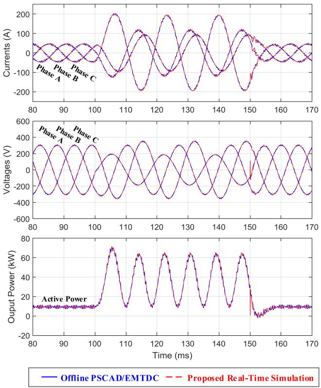  
Fig. 13. Waveforms of the battery system converter in Microgrid 1 when a single-phase earth fault occurs.

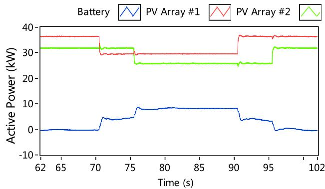  
Fig. 14. Active power waveforms of the three DG systems in Mirogrid 3.

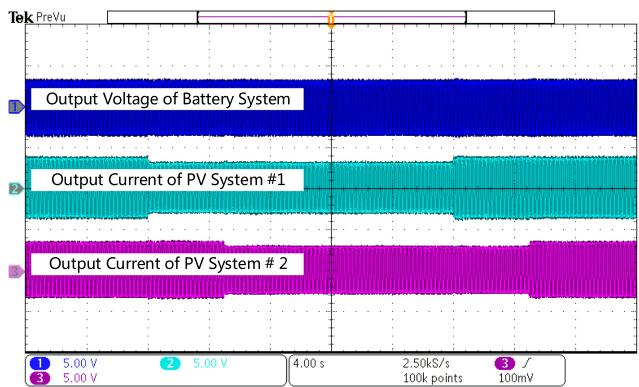  
Fig. 15. The output voltage of the battery system and output currents of PV systems in Microgrid 3.

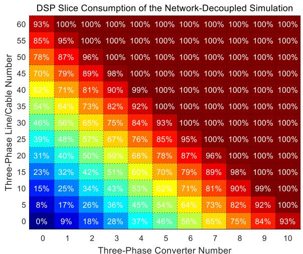  
(@)

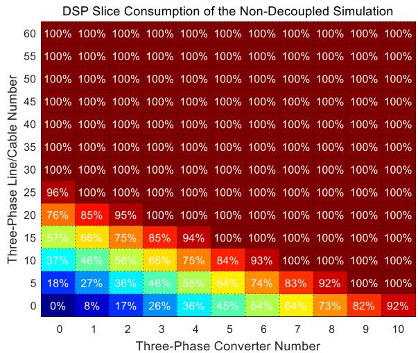  
  
Fig. 16. DSP slice consumption under different microgrid configurations (a) network-decoupled simulation (b) traditional NAM-based simulation.

TABLE II RESOURCE CONSUMPTION AND EXECUTION TIME OF THE MICROGRIDS   

<table><tr><td></td><td colspan="2">Network-decoupled simulation</td><td colspan="2">Traditional NAM-based simulation</td></tr><tr><td></td><td>DSP slice consumption</td><td>Latency (execution time)</td><td>DSP slice consumption</td><td>Latency (execution time)</td></tr><tr><td>Microgrid</td><td>348</td><td>38 ticks</td><td>628</td><td>83 ticks</td></tr><tr><td>1</td><td>(22.6%)</td><td>(380ns)</td><td>(40.8%)</td><td>(830ns)</td></tr><tr><td>Microgrid</td><td>672</td><td>38 ticks</td><td>1232</td><td>143 ticks</td></tr><tr><td>2</td><td>(43.6%)</td><td>(380ns)</td><td>(80.0%)</td><td>(1430ns)</td></tr><tr><td>Microgrid</td><td>972</td><td>38 ticks</td><td>1776 (over</td><td>197 ticks</td></tr><tr><td>3</td><td>(63.1%)</td><td>(380ns)</td><td>100%)</td><td>(Estimated)</td></tr></table>

to the original maximum power points instantly after the solar irradiance restores. During the low solar irradiance period, the unbalanced power is provided by the battery system. From Fig. 15 we can see that the output currents of the PV systems decrease synchronously with the active power, and the output voltage of the battery system is well maintained during the solar irradiance disturbance. The MPPT controls of the PV systems and the V/f control of the battery system are proved to work well in this real-time simulation.

# D. Resource Consumption and Execution Time

The real-time simulations of three microgrids in Fig. 11 are implemented on the FPGA, respectively. The resource consumption and actual execution time per step are analyzed.

The FPGA resources mainly include the DSP slices, lookup tables (LUTs), flip-flops and RAM blocks. DSP slices are used to implement the multiplication and are the most heavily consumed in these real-time simulations. The DSP slice consumption and actual execution time of the three microgrids are displayed in Table II. The adopted FPGA is Xilinx XC7K410T with total 1540 DSP slices. As for the rest hardware resources, the network-decoupled simulation of Microgrid 3 uses 248048 (48.8%) flip-flops, 126034 (49.6%) LUTs, and 97 (12.2%) RAM blocks.

Besides, the total latencies of both the network-decoupled simulation and the traditional simulation are also listed in

Table II. The system clock of FPGA is 100 MHz, which means one tick of the clock costs 10 ns. The time steps of both simulations are 2 μs.

From this table, we can see that when the microgrids are simulated with the network-decoupled algorithm, DSP slice consumption almost grows linearly with the system scale and the execution time is constant. When the microgrid is simulated with the traditional NAM algorithm, both the DSP slice consumption and execution time grow linearly with the system scale. Especially when trying to simulate Microgrid 3 with the traditional algorithm, the DSP slice consumption exceeds the FPGA resource capacity. However, when simulating Microgrid 3 with the network-decoupled algorithm on the same FPGA, only 63% of the DSP slices are consumed.

We can also know that the time step of the network-decoupled simulation can be as small as 380 ns, while the time-step of the traditional NAM-based simulation has to be much larger to meet the real-time requirement.

# E. Further Discussion on the Simulation Capability

As supplementary, more microgrids with different threephase line/cable numbers and different three-phase ac/dc converter numbers are simulated on the same FPGA. The DSP slice consumption and actual execution time of these microgrids are shown in Fig. 16 and Fig. 17, respectively. The X-axes and Y-axes represent the three-phase ac/dc converter number and the three-phase line/cable number, respectively.

From Fig. 16 we can see that, if only the hardware resources are considered, the maximum number of three-phase ac/dc converters can be simulated on a single FPGA is about 10 for both simulation methods. However, if the line/cable number increases, the converters number of the traditional algorithm decreases faster than that of the network-decoupled algorithm. If there is no converter in the distribution network, the maximum number of three-phase lines/cables can be simulated on a single FPGA is about 64, almost three times the network scale of the benchmark system of CIGRÉ.

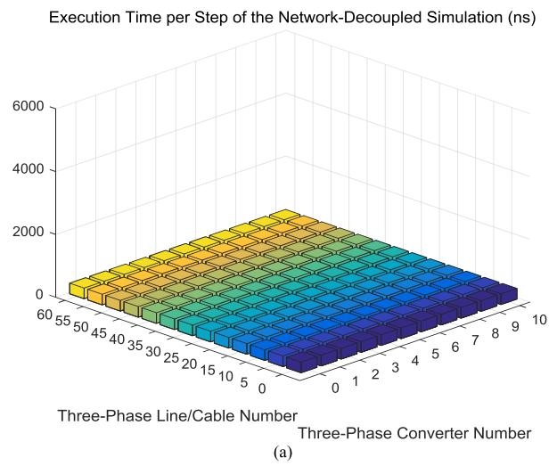

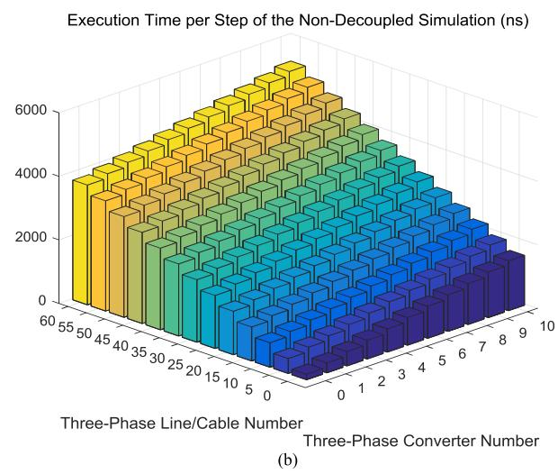  
Fig. 17. Execution time per step under different microgrid configurations (a) network-decoupled simulation (b) traditional NAM-based simulation.

From Fig. 17 we can see that the execution time of the network-decoupled simulation is constant and independent of the simulation scale while the execution time of the traditional NAM-based simulation grows with the converter number and the line/cable number. As the common time-step of real-time simulation for power electronic system is $0 . 5 \mu \mathrm { s } - 2 \mu \mathrm { s } .$ , the simulation scale of the traditional NAM algorithm will also be limited by the time-step in addition to the resource limitations

The simulation capacity analysis in this paper is based on a medium-performance FPGA of Xilinx Kintex-7 series with 1540 DSP slices. Up to now, the high-performance FPGA of Xilinx Virtex-7 series is embedded with 3600 the DSP slices. With this high-performance FPGA, the simulation capacity of the network-decoupled algorithm will be doubled. However, the improvement of the traditional NAM algorithm will be not so remarkable due to the limitation of time-step.

# VII. CONCLUSION

The proposed real-time simulation method for microgrids is proved to have a good accuracy compared with the off-line simulation of PSCAD. The proposed simulation method also consumes much fewer FPGA resources and has a smaller time step, which doesn’t need to increase with the simulation scale, compared with the traditional NAM-based simulation. As the implementations of both the proposed simulation and NAMbased simulation are based on the same FPGA and in the same development environment, the simulation capability improvements mainly benefit from the simulation algorithm aspect. That implies better simulation capability can be achieved with higherperformance FPGAs and specialized programming skills.

Furthermore, to achieve the real-time simulation of a much larger power system, the multi-FPGA-based simulation and the co-simulation with commercial simulators are in our study plan. The fully electromagnetic transient simulation framework of large power system including power electronics simulating at small time-steps and traditional power devices considering the non-linearity will be established in the further.

# APPENDIX

Here we will derive the (19) and (20) from (14)–(18) in details. First, substitute (15) into (16):

$$
\begin{array}{l} V _ {n o d a l} ^ {n + 1} = Y _ {n o d a l} ^ {- 1} I _ {i n j e c t i o n} ^ {n + 1} \\ = - Y _ {n o d a l} ^ {- 1} M _ {N A M} \left(I _ {h i s t o r y} ^ {n + 1} + I _ {s o u r c e} ^ {n + 1}\right) \tag {A1} \\ \end{array}
$$

Substitute (17) into (18), then substitute (16) and (15) into it:

$$
\begin{array}{l} I _ {b r a n c h} ^ {n + 1} = Y _ {e q} V _ {b r a n c h} ^ {n + 1} + I _ {h i s t o r y} ^ {n + 1} + I _ {s o u r c e} ^ {n + 1} \\ = Y _ {e q} M _ {N A M} ^ {T} V _ {n o d a l} ^ {n + 1} + I _ {h i s t o r y} ^ {n + 1} + I _ {s o u r c e} ^ {n + 1} \\ = Y _ {e q} M _ {N A M} ^ {T} Y _ {n o d a l} ^ {- 1} I _ {i n j e c t i o n} ^ {n + 1} \\ + I _ {h i s t o r y} ^ {n + 1} + I _ {s o u r c e} ^ {n + 1} \\ = - Y _ {e q} M _ {N A M} ^ {T} Y _ {n o d a l} ^ {- 1} M _ {N A M} \\ \times \left(I _ {\text {h i s t o r y}} ^ {n + 1} + I _ {\text {s o u r c e}} ^ {n + 1}\right) + I _ {\text {h i s t o r y}} ^ {n + 1} + I _ {\text {s o u r c e}} ^ {n + 1} \tag {A2} \\ \end{array}
$$

After combining (A1) and (A2), we obtain (A3), i.e., (19):

$$
\begin{array}{l} \left[ \begin{array}{c} V _ {n o d a l} ^ {n} \\ I _ {b r a n c h} ^ {n} \end{array} \right] = \left[ \begin{array}{c} - Y _ {n o d a l} ^ {- 1} M _ {N A M} \\ - Y _ {e q} M _ {N A M} ^ {T} Y _ {n o d a l} ^ {- 1} M _ {N A M} + I \end{array} \right] \\ \left(I _ {\text {h i s t o r y}} ^ {n} + I _ {\text {s o u r c e}} ^ {n}\right) \tag {A3} \\ \end{array}
$$

Then, substitute (17) into (14), and substitute (A1) and (A2) into it:

$$
\begin{array}{l} I _ {h i s t o r y} ^ {n + 1} = \alpha Y _ {e q} V _ {b r a n c h} ^ {n} + \beta I _ {b r a n c h} ^ {n} \\ = \alpha Y _ {e q} M _ {N A M} ^ {T} V _ {n o d a l} ^ {n + 1} + \beta I _ {b r a n c h} ^ {n} \\ = - \alpha Y _ {e q} M _ {N A M} ^ {T} Y _ {n o d a l} ^ {- 1} M _ {N A M} \\ \times \left(\boldsymbol {I} _ {\text {h i s t o r y}} ^ {n + 1} + \boldsymbol {I} _ {\text {s o u r c e}} ^ {n + 1}\right) \\ + \beta \left(- Y _ {e q} M _ {N A M} ^ {T} Y _ {n o d a l} ^ {- 1} M _ {N A M} \right. \\ \end{array}
$$

$$
\begin{array}{l} \times \left(I _ {\text {h i s t o r y}} ^ {n + 1} + I _ {\text {s o u r c e}} ^ {n + 1}\right) \\ + \beta \left(I _ {\text {h i s t o r y}} ^ {n + 1} + I _ {\text {s o u r c e}} ^ {n + 1}\right) \tag {A4} \\ \end{array}
$$

After resorting (A4), we obtain (A5), i.e., (20):

$$
\begin{array}{l} I _ {h i s t o r y} ^ {n + 1} = - (\alpha + \beta) Y _ {e q} M _ {N A M} ^ {T} Y _ {n o d a l} ^ {- 1} M _ {N A M} \\ \times \left(\boldsymbol {I} _ {\text {h i s t o r y}} ^ {n} + \boldsymbol {I} _ {\text {s o u r c e}} ^ {n}\right) \\ + \beta \left(\boldsymbol {I} _ {\text {h i s t o r y}} ^ {n} + \boldsymbol {I} _ {\text {s o u r c e}} ^ {n}\right) \tag {A5} \\ \end{array}
$$

# REFERENCES

[1] S. Haider, G. Li, and K. Wang, “A dual control strategy for power sharing improvement in islanded mode of AC microgrid,” Protection Control Modern Power Syst., vol. 3, no. 3, pp. 111–118, Apr. 2018.   
[2] O. Dharmapandit, R. K. Patnaik, and P. K. Dash, “A fast time-frequency response based differential spectral energy protection of AC microgrids including fault location,” Protection Control Modern Power Syst., vol. 2, no. 2, pp. 331–358, Aug. 2017.   
[3] J. Jeon et al., “Development of hardware in-the-loop simulation system for testing operation and control functions of microgrid,” IEEE Trans. Power Electron., vol. 25, no. 12, pp. 2919–2929, Dec. 2010.   
[4] J. Wang, Y. Song, W. Li, J. Guo, and A. Monti, “Development of a universal platform for hardware In-the-Loop testing of microgrids,” IEEE Trans. Ind. Informat., vol. 10, no. 4, pp. 2154–2165, Nov. 2014.   
[5] V. Q. Do, D. McCallum, P. Giroux, and B. De Kelper, “A backwardforward interpolation technique for a precise modelling of power electronics in HYPERSIM,” in Proc. Int. Conf. Power Syst. Transients, Rio de Janeiro, Brazil, 2001, pp. 337–342.   
[6] Y. Zhang, H. Ding, and R. Kuffel, “Key techniques in real time digital simulation for closed-loop testing of HVDC systems,” CSEE J. Power Energy Syst., vol. 3, no. 2, pp. 125–130, Jun. 2017.   
[7] M. Dagbagi, A. Hemdani, L. Idkhajine, M. W. Naouar, E. Monmasson, and I. Slama-Belkhodja, “ADC-based embedded real-time simulator of a power converter implemented in a low-cost FPGA: Application to a fault-tolerant control of a grid-connected voltage-source rectifier,” IEEE Trans. Ind. Electron., vol. 63, no. 2, pp. 1179–1190, Feb. 2016.   
[8] Y. Chen and V. Dinavahi, “FPGA-based real-time EMTP,” IEEE Trans. Power Del., vol. 24, no. 2, pp. 892–902, Apr. 2009.   
[9] N. Roshandel Tavana and V. Dinavahi, “A general framework for FPGAbased real-time emulation of electrical machines for HIL applications,” IEEE Trans. Ind. Electron., vol. 62, no. 4, pp. 2041–2053, Apr. 2015.   
[10] M. Matar and R. Iravani, “FPGA implementation of the power electronic converter model for Real-Time simulation of electromagnetic transients,” IEEE Trans. Power Del., vol. 25, no. 2, pp. 852–860, Apr. 2010.   
[11] K. Wang, J. Xu, G. Li, N. Tai, A. Tong, and J. Hou, “A generalized associated discrete circuit model of power converters in real-time simulation,” IEEE Trans. Power Electron., vol. 34, no. 3, pp. 2220–2233, Mar. 2019.   
[12] P. Li, Z. Wang, C. Wang, X. Fu, H. Yu, and L. Wang, “Synchronisation mechanism and interfaces design of multi-FPGA-based real-time simulator for microgrids,” IET Gener., Transmiss. Distrib., vol. 11, no. 12, pp. 3088–3096, Aug. 24, 2017.   
[13] Z. Shen, T. Duan, and V. Dinavahi, “Design and implementation of realtime Mpsoc-FPGA-based electromagnetic transient emulator of CIGRÉ DC grid for HIL application,” IEEE Power Energy Technol. Syst. J., vol. 5, no. 3, pp. 104–116, Sep. 2018.   
[14] Q. Mu, J. Liang, X. Zhou, Y. Li, and X. Zhang, “Improved ADC model of voltage-source converters in DC grids,” IEEE Trans. Power Electron., vol. 29, no. 11, pp. 5738–5748, Nov. 2014.   
[15] T. Maguire and J. Giesbrecht, “Small time-step (-2 µs) VSC model for the real time digital simulator,” in Proc. Int. Conf. Power Syst. Transients, Montreal, QC, Canada, 2005, pp. 1–6.   
[16] N. Watson and J. Arrillaga, Power Systems Electromagnetic Transients Simulation, 1st ed. London, U.K.: Institution of Engineering & Technology, 2003.   
[17] T. Sekine and H. Asai, “Block-Latency insertion method (Block-LIM) for fast transient simulation of tightly coupled transmission lines,” IEEE Trans. Electromagn. Compat., vol. 53, no. 1, pp. 193–201, Feb. 2011.   
[18] M. Milton and A. Benigni, “Latency insertion method based real-time simulation of power electronic systems,” IEEE Trans. Power Electron., vol. 33, no. 8, pp. 7166–7177, Aug. 2018.

[19] J. E. Schutt-Aine, “Latency insertion method (LIM) for the fast transient simulation of large networks,” IEEE Trans. Circuits Syst. I, Fundam. Theory Appl., vol. 48, no. 1, pp. 81–89, Jan. 2001.   
[20] W. Thiel and L. P. B. Katehi, “Some aspects of stability and numerical dissipation of the finite-difference time-domain (FDTD) technique including passive and active lumped elements,” IEEE Trans. Microw. Theory Techn., vol. 50, no. 9, pp. 2159–2165, Sep. 2002.   
[21] Z. Deng and J. E. Schutt-Aine, “Stability analysis of latency insertion method (LIM),” in Proc. Elect. Perform. Electron. Packag., Portland, OR, USA, 2004, pp. 167–170.   
[22] S. N. Lalgudi and M. Swaminathan, “Analytical stability condition of the latency insertion method for nonuniform GLC circuits,” IEEE Trans. Circuits Syst. II, Express Briefs, vol. 55, no. 9, pp. 937–941, Sep. 2008.   
[23] S. N. Lalgudi, M. Swaminathan, and Y. Kretchmer, “On-chip power-grid simulation using latency insertion method,” IEEE Trans. Circuits Syst. I, Reg. Papers, vol. 55, no. 3, pp. 914–931, Apr. 2008.   
[24] S. Papathanassiou, N. Hatziargyriou, and K. Strunz, “A benchmark low voltage microgrid network,” in Proc. CIGRE Symp. Power Syst. Dispersed Gener., 2005.   
[25] P. Kotsampopoulos et al., “A benchmark system for Hardware-in-the-Loop testing of distributed energy resources,” IEEE Power Energy Technol. Syst. J., vol. 5, no. 3, pp. 94–103, Sep. 2018.

Jin Xu received the B.S. degree in electrical engineering from Sichuan University, Chengdu, China, in 2013. He is currently a Ph.D. Student with the Department of Electrical Engineering, Shanghai Jiao Tong University, Shanghai, China.

His research interests include power system stability analysis and real-time simulation of power electronics.

Keyou Wang (S’05–M’09) received the B.S. and M.S. degrees in electrical engineering from Shanghai Jiao Tong University, Shanghai, China, in 2001 and 2004, respectively, and the Ph.D. degree from Missouri S&T (formerly University of Missouri-Rolla), Rolla, MO, USA, in 2008.

He is currently a Professor and the Vice Department Chair of Electrical Engineering with the Shanghai Jiao Tong University. His research interests include power system dynamic and stability, renewable energy integration, and converter dominated

power systems. Dr. Wang is currently an Associate Editor of IET Generation, Transmission & Distribution.

Pan Wu received the B.S. degree in electrical engineering from Shanghai Jiao Tong University, Shanghai, China, in 2017. He is currently pursuing the M.S. degree in electrical engineering with Shanghai Jiao Tong University, Shanghai, China.

His research interests include renewable energy control and real-time simulation.

Guojie Li (M’09–SM’12) received the B.Eng. and M.E. degrees from Tsinghua University, Beijing, China, in 1989 and 1993, respectively, and the Ph.D. degree from Nanyang Technological University, Singapore, in 1999, all in electrical engineering.

He was an Associate Professor with the Department of Electrical Engineering, Tsinghua University. He is currently a Professor with the Department of Electrical Engineering, Shanghai Jiaotong University, Shanghai, China. His research interests include power system analysis and control, wind and PV

power control and integration, and microgrid.