# EMT Model Boundary Determination Using Floquet Theory-based Participation Factors

Mahsa Sajjadi, Member, IEEE, Kai Sun, Fellow, IEEE, and Deepak Ramasubramanian, Senior Member, IEEE

Abstract—To accelerate electromagnetic transient (EMT) simulations for power systems with inverter-based resources (IBRs), this paper proposes a new approach for determining the EMT model boundary using Floquet theory-based participation factors (PFs). The approach can significantly reduce the computational burden of EMT simulation to focus on a localized area whose components highly participate in the dynamics of interest such as sub-synchronous oscillations (SSOs), while the rest of the grid is represented using a simple Norton equivalent. Floquet theory enables the calculation of participation factors over a single cycle of the system in an EMT model, where the vector field exhibits periodic behavior around the synchronous frequency. A data-driven method is also proposed for estimating participation factors directly from the system’s responses. The proposed EMT model boundary determination approach is first demonstrated on a two-area system and then validated on a 39-bus system with multiple IBRs.

Index Terms-- Electromagnetic transient, EMT, Floquet theory, inverter-based resource, IBR, participation factor, power system simulation, sub-synchronous oscillation.

# I. INTRODUCTION

OWER systems with high penetration of inverter-based resources (IBRs) face new challenges in dynamic analysis,P oscillations (SSOs), ride-through dynamics, and converterinduced stability issues. The electromagnetic transient (EMT) simulation offers the detailed time-domain analysis needed to capture the fast and complex dynamics associated with IBRs. However, EMT simulations are computationally intensive, especially when applied to large-scale power systems. This makes it impractical to simulate the entire system using EMT models, leading to the need for boundary determination strategies that combine EMT modeling for critical zones with simplified models for less critical parts of the system. There have been numerous studies on hybrid EMT-phasor simulation, with most approaches using a predetermined EMT zone and mainly focusing on improving data exchange between the EMT and phasor domains while enhancing the accuracy of hybrid simulations compared to full EMT simulations. Relatively few studies have addressed EMT boundary determination. One common method in literature is to intuitively include areas near

the fault in the EMT zone, as discussed in [1]-[6]. While this method is simple, it lacks precision and a solid theoretical foundation. Another strategy, presented in [7], involves detailed modeling of HVDC converters using EMT while representing the AC network with a phasor model to capture the complex dynamics and rapid transients of HVDC systems accurately. This approach is simple, but it ignores the dynamic interaction between HVDC converters and AC network. In [8], it is recommended to include buses with significant harmonic distortion in the EMT zone, considering the system configuration and the disturbance being analyzed. This harmonic distortion criterion provides good accuracy in case of high distortion in the system; however, it cannot capture lowfrequency dynamic issues. The approach in [9] uses voltage drops as a criterion for selecting buses to include in the EMT zone. A voltage drop is easy to measure and monitor, though this approach is heavily influenced by the specific fault, and it lacks depth in dynamic system interaction. Lastly, [10] suggests applying EMT models to regions with a low shortcircuit ratio (SCR), a widely used method which focuses on critical areas prone to instability, However, it is primarily relevant when converters are present in the system and does not capture the critical parts of the network, such as key buses or branches that influence system dynamics.

Each approach for EMT zone boundary determination suits specific system properties and simulation objectives. The components involved, the type of possible disturbances, and the intended trade-off between computational efficiency and simulation detail all influence the choice of approach.

To add new insights into existing EMT boundary determination methods, particularly when capturing specific dynamic phenomena or an SSO mode is of interest, this paper presents a novel participation factor-based EMT boundary determination method using Floquet theory to identify and include critical elements—such as IBRs, generators, transmission lines, and other network components—within the EMT zone. Unlike hybrid EMT-phasor simulations, the proposed approach employs an EMT zone connected to a Norton equivalent, offering a simpler yet effective representation that preserves the dynamics of interest.

The participation factor (PF) quantifies the relative two-way participation of an oscillation mode in a state variable of the

system model and of the state variable in the oscillation mode. It has been extensively used in electrical power systems and other fields as a powerful index for stability analysis [11], model reduction [12]-[14], controller and sensor placement [15], [16] and EMT boundary determination [17]. Unlike phasor-based models, which are based on a fixed equilibrium point and assume linear time-invariant (LTI) behaviors, EMT models operate around a near steady-state periodic trajectory where system variables exhibit continuous oscillations due to fast system dynamics. As a result, the system matrix in EMT modeling is time-varying and periodic, requiring a more general analytical framework. To accurately capture these dynamics, this paper employs Floquet theory, a powerful tool for the small-signal analysis of systems with periodic coefficients [18], [19]. References [20]-[23] apply stability and small-signal analysis techniques for linear time-periodic (LTP) systems within the context of power system applications.

For LTP systems—such as a linearized EMT model— Floquet theory enables the computation of eigenvalues and PFs by solving the system over a single period. In the case of power systems operating at 60 Hz, this corresponds to a window of just 1/60 seconds, offering a substantial reduction in the computational burden compared to that for a full EMT simulation. Importantly, an LTP system has an infinite number of harmonics associated with integer multiples of the fundamental frequency. The proposed Floquet-based PF approach captures this behavior by identifying not only the IBRs and synchronous generators most involved in SSO modes, but also the bus voltages and branch currents that contribute significantly to higher-frequency harmonics.

In contrast, phasor-domain PFs, including those based on 0dq transformation, are derived under the assumption of operation around a single frequency and fixed equilibrium point. While effective for modal analysis on phasor-based models, these approaches are inherently limited in EMT applications. Traditional phasor-based PFs are typically limited to the internal states of generators or IBRs and do not extend to buses or branches, making them insufficient for identifying critical coupling paths or high-frequency contributors in systems with complex EMT dynamics. Moreover, as shown in this paper, phasor-based PFs can be interpreted to correspond only to the harmonic-zero component in the context of Floquet theory, thus failing to represent higher-order harmonics and time-varying dynamics—key features of EMT dynamics. These limitations become especially significant in systems with high IBR penetration, where fast control loops and wide spectral content dominate. Moreover, the 0dq transformation may locally yield a fixed equilibrium for well-synchronized components, but its effectiveness depends on a strong and coherent phase reference, which may not exist in electrically remote parts of the system.

The proposed method extracts modal information directly from the EMT domain and extends PF analysis to include buses and branches, enabling the identification of dynamic elements and critical coupling interfaces, offering an advancement over traditional phasor-based approaches. After applying the

proposed boundary determination method, the simulation results from the full EMT model are compared with those from the reduced EMT-zone simulation, where only the critical zone is modeled in EMT, and the remainder of the system is replaced with a multi-port Norton equivalent. The multi-port Norton equivalent offers a practical and widely used approach for modeling the external system in EMT simulations. Compared to phasor-based models in hybrid simulations, the multi-port Norton equivalent is simpler and more efficient, as it is derived once under steady-state conditions and reused across fault scenarios without requiring time-step updates. By including mutual coupling among boundary buses, it offers a straightforward yet sufficiently accurate representation of the external network. While similar equivalents exist in the literature, its integration here contributes to the boundary determination framework.

This paper has the following main contributions. First, a novel PF-based EMT model boundary determination method is developed based on Floquet theory to identify highly participating IBRs in SSO modes, as well as branches and buses contributing to higher-frequency harmonics. In the Floquet analysis of EMT simulations, modal information and PFs for SSOs are extracted by analyzing the system’s ordinary differential equation (ODE) model over a single 60 Hz cycle. This allows Floquet analysis to identify modal behaviors without requiring a long simulation time. Second, a criterion is proposed to retain only the critical harmonics that dominate the system's response. Third, a data-driven approach is given for obtaining PFs using Floquet theory, requiring the system responses only for a single cycle of the system. Fourth, this paper establishes a mathematical connection between PFs in LTI and LTP systems, demonstrating that LTI PFs (e.g. phasorbased PFs) represent a special case corresponding to the harmonic-zero component in the Floquet-based PF framework. The validation studies on the modified Kundur’s two-area system and IEEE 39-bus system demonstrate that the proposed PF-based EMT model boundary determination method can accurately capture important dynamics while improving computational efficiency.

The structure of this paper is as follows. Section II presents the proposed EMT boundary determination framework, which includes EMT model linearization, Floquet theory analysis, a discussion on participation factors in Floquet theory connecting LTI and LTP systems, validation of the linearized model, criteria for harmonic selection, a data-driven extension, and the use of a multi-port Norton equivalent. Section III provides simulation results for the Floquet-theory-based EMT boundary determination method, applied to a two-area system with a single SSO mode and the IEEE 39-bus system with four SSO modes. Several case studies are considered, including different fault locations, various PF thresholds, multi-mode scenarios, and a comparison with the SCR-based approach for EMT boundary selection. Conclusions are drawn in Section VI.

# II. PROPOSED BOUNDARY DETERMINATION FRAMEWORK

This section presents the proposed EMT boundary determination framework for analyzing EMT simulation through Floquet theory. The framework comprises several key steps as shown in Fig.1, beginning with Floquet-based PF calculation and model validation. In this step, the linearization of the EMT model around its periodic steady-state trajectory is done. Once linearized, Floquet-based PFs are computed to identify the highly participating devices such as IBRs and branches in the mode of interest within the SSO, as well as their critical harmonics.

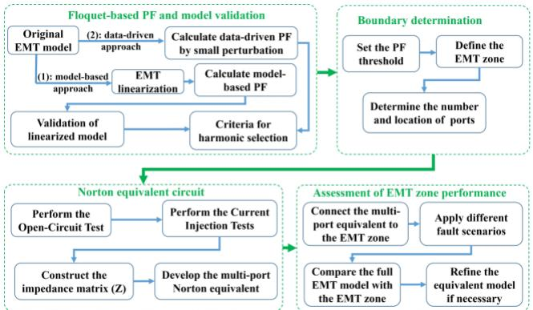  
Fig. 1.Proposed framework

To validate the accuracy of the linearized model, its responses are compared against those of the original nonlinear system. Since the analysis of EMT simulation through Floquet theory inherently introduces numerous harmonics, a selection criterion is proposed to retain only the key harmonics with large magnitudes that significantly impact system responses, thereby reducing computational complexity. A data-driven approach is introduced for cases where a mathematical model is unavailable, enabling PFs calculations based purely on observed system data. In the next step, by considering a threshold for PF, the EMT boundary and the boundary buses are identified. Norton equivalent is then obtained for the less critical part of the system by applying open-circuit and current injection tests for the steady-state conditions. The last step involves the assessment of EMT zone performance by connecting it to the simple Norton equivalent and considering several fault scenarios. The following sections outline the proposed framework in detail.

# A. Linearization of EMT Model

Consider the EMT model of a power system in the form of a nonlinear system:

$$
\dot {x} (t) = f (t, x (t)) \quad x (0) = x _ {0} \tag {1}
$$

where x and f are respectively its n-dimensional state vector and nonlinear vector field. Unlike a power system’s phasor model, which assumes a fixed equilibrium point, the EMT model exhibits a periodic steady-state orbit as its equilibrium. Thus, the first essential step is to linearize f to derive a time-periodic system matrix A(t) from its Jacobian in order to analyze its stability and modal dynamics near the equilibrium using Floquet theory. Fig. 2 illustrates the equilibrium as a periodic steady-state trajectory in the state space, which is reflected from periodically changing three-phase voltages and currents in the

network of the EMT model.

There are three groups of state variables when deriving the Jacobian for EMT model: (1) periodically varying three-phase state variables, (2) the synchronous angle θ used in the Park’s transformation and (3) non-periodic state variables.

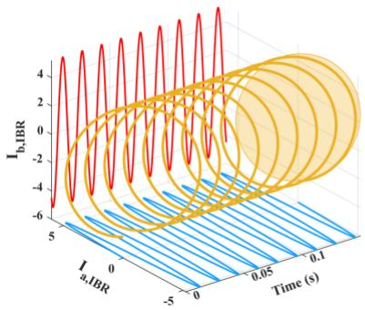

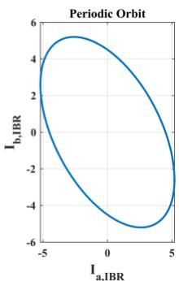  
Fig. 2. Periodic steady-state trajectory in EMT simulation

For non-periodic state variables, their steady-state values derived from the power flow solution are inserted in Jacobian. For three-phase state variables like bus voltages, line currents and load currents insert (2) in Jacobian.

$$
x _ {3 p h, e q} = X _ {m} \left[ \sin \left(\omega t + \theta_ {0}\right), \sin \left(\omega t + \theta_ {0} - 1 2 0\right), \sin \left(\omega t + \theta_ {0} + 1 2 0\right) \right] ^ {T} \tag {2}
$$

where $x _ { 3 p h , ~ e q }$ is the steady-state equilibrium trajectory for three phases state variables and $X _ { m }$ is its magnitude.

For the angle of generators and IBRs used in Park’s transformation, insert (3) in Jacobian:

$$
x _ {\theta , e q} = \omega t + x (0) \tag {3}
$$

where $x ( \theta )$ is the initial condition. By incorporating the steadystate equilibrium trajectories of EMT model into the Jacobian matrix, a time-periodic matrix A(t) is obtained. This matrix comprises constant components, corresponding to non-periodic states, as well as sinusoidal terms (sine and cosine functions) arising from (2) and (3).

# B. Floquet Theory Analysis

In nonlinear systems that exhibit a periodic orbit—such as power systems modeled for EMT simulations—the linearized perturbation dynamics around the orbit result in a system of linear ODEs with periodic coefficients A(t). This structure aligns with the framework of Floquet theory, which is a tool for analyzing the stability and dynamic behavior of such complex systems. Floquet theory offers a comprehensive framework for capturing linear time-periodic (LTP) system dynamics, particularly using modal participation factors. Consider the LTP system of the form:

$$
\dot {x} = A (t) x \quad A (t + T) = A (t) \tag {4}
$$

where $\ b { A } ( t ) \ b { \in } \ b { R } ^ { n \times n }$ is a matrix-valued function that is periodic with period T, and $x ( t ) \in R ^ { n }$ is the state vector. Floquet theory states that the solution of an LTP system can be expressed as a product of a periodic matrix and an exponential term involving the so-called Floquet exponents, which generalize the concept of eigenvalues in time-invariant systems. These exponents offer insight into the growth, decay, or oscillatory nature of perturbations over time [18], [19]. Therefore, the solution of (4) takes the form:

$$
x (t) = V (t) e ^ {\eta_ {h} t} V ^ {- 1} (0) x (0) \tag {5}
$$

where η are the floquet exponents, $x ( \theta )$ are initial conditions and $V ( t )$ are the periodic eigenvectors, $V ( 0 ) { = } V ( T )$ .

To analyze an LTP system, the state transition matrix can typically be formed through numerical solution of (4) using linearly independent set of initial conditions such that:

$$
x (t) = \Phi (t) x (0) \tag {6}
$$

By (5) and (6), the following results are obtained:

$$
\Phi (t) = V (t) e ^ {\eta_ {k} t} V ^ {- 1} (0) \tag {7}
$$

$$
V ^ {- 1} (0) \Phi (T) V (0) = \Lambda_ {k} = e ^ {\eta_ {k} T}
$$

Therefore, the eigenvalues of Φ(T) (i.e., the Floquet multipliers) are the exponentials of $\eta _ { k } T$ and the eigenvectors of Φ(T) are the periodic eigenvectors $V ( t )$ evaluated at $t = 0$ .

This work leverages Floquet theory to obtain periodic eigenvectors and associated PFs from the linearized EMT model, enabling the identification of critical states and components that influence dynamic behaviors for determining the EMT zone. The steps to calculate a periodic eigenvector using Floquet theory are following [18], [19]:

First, obtain the state transition matrix (t) by solving (8) for one period and evaluate Φ(T) as the Floquet transition matrix.

$$
\dot {\Phi} (t) = A (t) \Phi (t) \quad \Phi (0) = I \tag {8}
$$

Second, solve $\Phi ( T ) ^ { \ast } \mathbf { s }$ eigenvalues and right eigenvectors as the entries of diagonal matrix Λ and columns of V(T), respectively.

$$
\Phi (T) V (T) = V (T) \Lambda \tag {9}
$$

The eigenvalues are referred to as Floquet multipliers. If all Floquet multipliers lie within the unit circle in the complex plane, the system is stable. The logarithm of a Floquet multiplier is called the Floquet exponent, whose real and imaginary parts respectively indicate stability (i.e. the rate of divergence or convergence over time) and the oscillation frequency of the mode. The Floquet exponent $\eta _ { k }$ associated with the $k ^ { t h }$ mode is computed as:

$$
\eta_ {k} = \frac {1}{T} \log \left(\Lambda_ {k}\right) = \frac {1}{T} \log | \Lambda_ {k} | + \frac {i}{T} \angle \Lambda_ {k} \tag {10}
$$

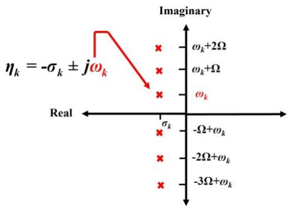  
Fig. 3. Floquet exponent

Unlike an LTI system, an LTP system analyzed using Floquet theory has its response exhibiting an infinite number of frequencies associated with each mode, leading to multiple harmonics of the base frequency. Each Floquet exponent $\eta _ { k }$ characterizes the frequency ωk of the harmonic at zero order, while harmonics of other orders have frequencies that differ

from $\omega _ { k }$ by an integer multiple of the fundamental frequency Ω, as illustrated in Fig. 3.

All harmonics are labeled as $[ . . . , - 3 , - 2 , - 1 , 0 , + 1 , + 2 , + 3 , . . . \ ]$ for harmonics at $\lbrack . . . , \quad - 3 \Omega + \omega _ { k } , \quad - 2 \Omega + \omega _ { k } , \quad - \Omega + \omega _ { k } ,$ , ωk $, \omega _ { k } \mathrm { + } \Omega , \omega _ { k } \mathrm { + } 2 \Omega , \omega _ { k } \mathrm { + } 3 \Omega , \ldots \mathrm { ] }$ . The periodic eigenvector matrix $V ( t )$ can be computed as:

$$
V (t) = \Phi (t) V (T) \left[ \begin{array}{c c c} \ddots & & \\ & e ^ {- \eta_ {k} t} & \\ & & \ddots \end{array} \right] \tag {11}
$$

The periodic eigenvector matrix $V ( t )$ is key to reconstructing the system’s state trajectory and understanding its modal behavior. When evaluated at $\scriptstyle { t = 0 }$ and $t { = } T ,$ it corresponds to the eigenvector matrix of the Floquet transition matrix ${ \cal { V } } ( T )$ .

Each periodic eigenvector element $V _ { j , k } ( t )$ with the state j and mode k can be expanded into its corresponding complex Fourier series with complex coefficient $C _ { j , k , n }$ for the $n ^ { t h }$ harmonic up to $N _ { H } \mathrm { : }$

$$
V _ {j, k} (t) = \sum_ {n = - N _ {H}} ^ {n = + N _ {H}} C _ {j, k, n} e ^ {i n \Omega t} \tag {12}
$$

C. PFs in Floquet Theory: A Connection Between LTI and LTP Systems

For an LTI system, the participation factor $p _ { j , k }$ of the state j in mode k is computed from the mode shape of the state’s response to a unit excitation only in this state [24]. The statespace solution to ${ \dot { x } } = A x$ given the initial condition $x ( 0 ) { = } e _ { j } = [ 0 $ $0 , . . . , 1 | _ { j } , 0 , . . . ] ^ { \mathrm { T } } $ , is:

$$
x _ {j} (t) = \sum_ {k = 1} ^ {n} V _ {j, k} W _ {k} x (0) e ^ {\lambda_ {k} t} = \sum_ {k = 1} ^ {n} V _ {j, k} W _ {k} e _ {j} e ^ {\lambda_ {k} t} = \sum_ {k = 1} ^ {n} p _ {j, k} e ^ {\lambda_ {k} t} \tag {13}
$$

where V and W are the right and left eigenvectors of A, respectively.

For an LTP system governed by $\dot { x } \ = \ A ( t ) x$ , the state transition matrix Φ(t) defined by (8) has its $j ^ { \mathrm { t h } }$ column $\phi ^ { ( j ) } ( t )$ correspond to the state j’s solution with initial condition $x ( 0 ) { = } e _ { j } { : }$

$$
\phi^ {(j)} (t) = x _ {j} (t) \quad \text {w h e r e} \quad x _ {j} (0) = e _ {j} \tag {14}
$$

Thus, solving Φ(t) with Φ(0)=I is equivalent to solving the system for n times, each with a unit excitation in one of the canonical directions. This directly ties the structure of $\Phi ( t )$ to the initial-excitation-based modal analysis, just as done for an LTI system. According to Floquet theory, the state response can be written as (5). With the initial condition $x ( O ) { = } e _ { j } ,$ the state response becomes:

$$
x _ {j} (t) = \sum_ {k = 1} ^ {n} V _ {j, k} (t) e ^ {\eta_ {k} t} W _ {k, j} \tag {15}
$$

where $W { = } V ^ { { \mathrm { - 1 } } } ( 0 )$ and $V _ { j , k } \left( t \right)$ can be expanded using a Fourier series as (12). Substituting it into the response for state j gives:

$$
x _ {j} (t) = \sum_ {k = 1} ^ {n} \left(\sum_ {n = - N _ {H}} ^ {n = + N _ {H}} C _ {j, k, n} e ^ {i n \Omega t}\right) e ^ {\eta_ {k} t} W _ {k, j} \tag {16}
$$

which shows how the mode k and harmonic n contribute to the trajectory of state j.

Define the normalized contribution of the $n ^ { t h }$ harmonic of mode k to state $j ,$ as follows:

$$
P F _ {j, k, n} ^ {\text {N o r m}, 1} = \frac {\left| C _ {j , k , n} \right|}{\max \left| C _ {j , k , n} \right|} \tag {17}
$$

where PFj,k,nNorm $P F _ { j , k , n } ^ { N o r m , I }$ is called the normalized harmonic PFs purely based on the eigenvector. This normalization is performed with respect to the maximum magnitude among all states for the same mode and harmonic. The state variable in (16) can be written as:

$$
x _ {j} (t) = \sum_ {k = 1} ^ {n} \sum_ {n = - N _ {H}} ^ {n = + N _ {H}} C _ {j, k, n} W _ {k, j} e ^ {(i n \Omega + \eta_ {k}) t} \tag {18}
$$

Therefore, the PF and its normalized value across states are:

$$
P F _ {j, k, n} = \left| C _ {j, k, n} W _ {k, j} \right|\rightarrow P F _ {j, k, n} ^ {\text {N o r m}, 2} = \frac {\left| C _ {j , k , n} W _ {k , j} \right|}{\max \left| C _ {j , k , n} W _ {k , j} \right|} \tag {19}
$$

Just as in the LTI case, PF is grounded in the canonical excitation $x ( 0 ) { = } e _ { j } ,$ but now extended to the richer spectral content of LTP systems via the Floquet modal structure. These PFs provide insight into which state variables (e.g., voltages, currents, PLL dynamics) are most involved in each mode, helping to identify the critical areas of the system that are most influenced by specific dynamic behaviors.

Theorem: Let $A ( t )$ be a constant matrix A (i.e., LTI). In this case, the Floquet decomposition yield a single harmonic $\scriptstyle n = 0$ and the harmonic-0 participation factor from Floquet theory equals the standard LTI participation factor:

$$
P _ {j, k, 0} = V _ {j, k} W _ {k, j} \tag {20}
$$

In the special case, the Floquet formulation simplifies to the LTI case, with the Floquet exponents equal to the eigenvalues of A, and the periodic eigenvectors reducing to constant vectors. From Fourier theory, if a function is constant in time, then:

$$
V _ {j, k} (t) = V _ {j, k} \rightarrow C _ {j, k, 0} = V _ {j, k}, \quad C _ {j, k, n} = 0 \text {f o r} n \neq 0 \tag {21}
$$

Therefore, considering n=0 in (19), which corresponds to the zero-order harmonic, we have:

$$
P _ {j, k, 0} = \left| C _ {j, k, 0} W _ {k j} \right| = \left| V _ {j, k} W _ {k j} \right| \tag {22}
$$

where $W { = } V ^ { - 1 } { = } V ^ { - 1 } ( 0 )$ because the eigenvector is constant. (22) coincides exactly with the definition of the PFs for LTI systems, confirming that phasor-based PFs can be interpreted as the harmonic-0 case of the more general Floquet PFs, providing a rigorous mathematical bridge between LTI and LTP analyses.

# D. Validation of linearized model

To validate that the linearized EMT model accurately represents the original nonlinear EMT model under small disturbances, their time-domain responses are compared. This validation is performed by running two nonlinear EMT simulations: one to obtain the steady-state trajectory and another subjected to a small perturbation. The difference between these two responses is compared to the linearized model response. If they have a good match, the linearized EMT model is validated. The procedure is shown in Fig. 4.

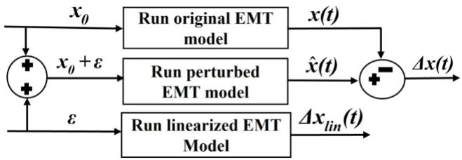  
Fig. 4. Validation process for the linearized EMT model

The error between the $j ^ { t h }$ original nonlinear EMT and linearized EMT responses can be quantified using the MSE defined by:

$$
M S E ^ {j} = \frac {1}{N} \sum_ {i = 1} ^ {N} \left(\Delta x ^ {j} \left(t _ {i}\right) - \Delta x _ {\text {l i n}} ^ {j} \left(t _ {i}\right)\right) ^ {2} \tag {23}
$$

where N is the total number of samples. $\Delta x ^ { j } ( t _ { i } )$ represents the value of the $j ^ { t h }$ state variable at time ti for the nonlinear EMT model. $\Delta x ^ { j } { } _ { l i n } ( t _ { i } )$ represents the corresponding value of the $j ^ { t h }$ state variable at time ti for the linearized EMT model. ti is the $i ^ { t h }$ sample within the time horizon of interest. A smaller MSE indicates that the linearized EMT model accurately approximates the original nonlinear EMT model, while a larger MSE suggests greater deviation between the two models.

# E. Criteria for harmonic selection

# Algorithm 1: Sate Reconstruction

Require: $V _ { j , k } ( t ) , V _ { 0 } , x _ { 0 } , \eta _ { k } , \epsilon , \epsilon _ { j } , \omega _ { 0 } , N , M$   
1: Initialization: $\scriptstyle f _ { 0 } = { \frac { \omega _ { 0 } } { 2 \pi } } , T _ { 0 } = { \frac { I } { f _ { 0 } } } , M S E _ { j }$   
2: For $k = I { : } M$   
3: For $\cdot _ { j } = I . N$ 4: $\begin{array} { r } { C _ { j , k , n } { \longleftarrow } \frac { I } { T _ { 0 } } \int _ { 0 } ^ { T _ { 0 } } V _ { j , k } ( t ) e ^ { - i 2 \pi n f _ { 0 } t } } \end{array}$ dt, n∈Z   
$\mathbf { 5 } { \mathrm { : } }$ $C { \gets } \{ | C _ { j , k , 0 } ^ { ' } | , | C _ { j , k , I } | , . . . . , | C _ { j , k , N _ { H } } | \}$   
6: $C _ { s o r t } {  } \bar { S } o r t ( C )$   
7: $\widetilde { C } _ { j , k , n } { \gets } \frac { | C _ { j , k , n } | } { C _ { s o r t , 1 } }$ Csort,1   
8: While $M S E _ { j } { \geq } \epsilon$   
9: $\widetilde { N } _ { H } {  } \{ n \ \vert \ \widetilde { C } _ { j , k , n } { \geq } \epsilon _ { j } \}$   
10: $\begin{array} { r } { \widetilde { V } _ { j , k } ( t ) \gets \sum _ { n \in \widetilde { N } _ { H } } C _ { j , k , n } ^ { ' } e ^ { i 2 \pi n f _ { 0 } t } } \end{array}$   
11: $\tilde { x } _ { j } ( t ) {  } \widetilde { V } _ { j , k } ( t ) ( \begin{array} { c c c } { \dot { } \ddots } & { } & { } \\ { } & { e ^ { \eta _ { k } t } } & { } \\ { } & { } & { \ddots } \end{array} ) V _ { 0 } ^ { I } x _ { 0 }$   
12: $\begin{array} { r } { M S E _ { j } {  } \frac { l } { N } \sum _ { i = 1 } ^ { n } ( x _ { j } ( t _ { i } )  – \tilde { x } _ { j } ( t _ { i } ) ) ^ { 2 } } \end{array}$   
13: $\epsilon _ { j } \epsilon - 5 \epsilon _ { j }$   
14: end While   
15: end For   
16: end For   
17: $C _ { j , k , n } {  } \{ C _ { j , k , n } \mid n { \in } \widetilde { N } _ { H } \}$   
18: return $C _ { j , k , n } , \widetilde { N } _ { H }$

The decomposition of the periodic eigenvector into its components using a complex Fourier series may theoretically involve an infinite number of harmonics. However, the focus should be on selecting only those harmonics that have a significant impact on the system’s responses.

Algorithm 1 shows the proposed method to filter harmonics and reconstruct the state variables. In this algorithm, for each eigenvector $V _ { j , k } ( t )$ , the Fourier coefficients $C _ { j , k , n }$ are calculated for different harmonics over one period. The Fourier coefficients are then sorted in descending order, and each is normalized relative to the maximum value. A set of significant harmonics $\tilde { N } _ { H }$ is identified by applying a threshold $\epsilon _ { j } ,$ to retain only the influential harmonics. The eigenvector is reconstructed using only the selected harmonics and subsequently utilized to reconstruct the system states $\tilde { x } _ { j } ( t )$ . The MSE between the original and reconstructed states is computed. If the error exceeds the predefined threshold $\epsilon ,$ the harmonic selection criterion $\epsilon _ { j }$ is adjusted, and the process repeats until the threshold ϵ for the MSE between reconstructed states and the original states is met. Finally, the set of Fourier coefficients corresponding to significant harmonics is stored for further analysis. The inputs to the algorithm are the time-varying

periodic eigenvectors $V _ { \mathrm { j , k } } ( t ) .$ , the eigenvector matrix at $\scriptstyle { t = 0 }$ denoted as $V _ { 0 } ,$ the initial state $x _ { \theta } ,$ the Floquet exponents $\eta _ { k }$ , the MSE threshold for the reconstructed state trajectory $\epsilon ,$ the threshold used to select significant harmonics $\epsilon _ { j } ,$ the nominal angular frequency $\omega _ { 0 } ,$ the number of states N and modes M.

# F. Data-driven approach

For a system whose detailed EMT model is unavailable, a data-driven approach is proposed to obtain state transition matrix (t) over one period, which collects system responses for small perturbations to estimate Floquet-based PFs, providing an alternative to model-based PFs calculation. In both model-based and data-driven approaches, the goal is to estimate the PFs and identify a small group of devices that highly participate in contingencies or dynamic phenomena.

Consider the nonlinear continuous-time system as (1). Apply a small perturbation ε to the $i ^ { t h }$ state in initial condition as $\hat { x } ( 0 ) =$ $\varepsilon e _ { j } ,$ , where $e _ { j } \mathrm { = } [ 0 , 0 , . . . , 1 | _ { j } , 0 , . . . ] ^ { \mathrm { T } }$ . Define x(t) as a solution from unperturbed initial condition x0, x̂ (t) solution from perturbed initial condition x0+εej and $\varDelta { x } ( t ) . { = } \hat { x } ( t ) { - } x ( t )$ , the difference between the two trajectories at time t. Subtract the two system trajectories by inserting in (1):

$$
\frac {d}{d t} \Delta x (t) = f (t, \hat {x} (t)) - f (t, x (t)) \tag {24}
$$

Use a first-order Taylor expansion of $\boldsymbol { \mathscr { f } } ( t , { \hat { x } } ( t ) )$ around $x ( t ) \colon$

$$
f (t, \hat {x} (t)) \approx f (t, x (t)) + \frac {\partial f}{\partial x} (t, x (t)). \Delta x (t) \tag {25}
$$

Therefore,

$$
\frac {d}{d t} \Delta x (t) \approx A (t) \Delta x (t), \quad A (t) := \frac {\partial f}{\partial x} (t, x (t)) \tag {26}
$$

So, the linearized dynamics of the response difference are:

$$
\frac {d}{d t} \Delta x (t) = A (t) \Delta x (t) \quad \Delta x (0) = \varepsilon e _ {j} \tag {27}
$$

The solution is given by $\varDelta x ( t ) { = } \Phi ( t ) \varDelta x ( 0 )$ , where $\Phi ( t )$ is the state transition matrix. Therefore, the state transition matrix can be obtained as:

$$
\Phi (t) = \Delta x (t) \Delta x ^ {- 1} (0) \tag {28}
$$

If use multiple independent perturbations corresponding to different states $\varepsilon e _ { I } , \varepsilon e _ { 2 } . . . , \varepsilon e _ { n } .$ then define matrices:

$$
X _ {l i n} (0) = \left[ \varepsilon e _ {1}, \dots , \varepsilon e _ {j}, \dots , \varepsilon e _ {n} \right] = \varepsilon I _ {n} \tag {29}
$$

$$
\mathrm {X} _ {\text {l i n}} (t) = \left[ \Delta x _ {1} (t) \dots , \Delta x _ {j} (t), \dots , \Delta x _ {n} (t) \right]
$$

Then:

$$
\Phi (t) = X _ {l i n} (t) X _ {l i n} ^ {- 1} (0) \tag {30}
$$

Therefore, the data-driven state transition matrix can be estimated by evaluating the response difference caused by perturbations along each direction $e _ { j } ,$ and scaling by $X _ { l i n } { } ^ { - l } ( O )$ .

The summary of the procedure for Floquet-based PF calculation for both model-based and data-driven approaches is shown in Fig. 5. The key difference between these approaches lies in how the state transition matrix is obtained. In the modelbased approach, the state transition matrix is determined by solving ODEs over one period of the system, given a known time-periodic $A ( t )$ . In contrast, the data-driven approach estimates the linearized system response by applying small perturbations to the state variables and subsequently using the resulting data to compute the state transition matrix over one

period. Beyond this step, both approaches follow the same procedure to calculate eigenvalues, eigenvectors, and PFs.

Note that in a black-box model, the underlying mathematical equations describing the internal dynamics of devices such as IBRs are not accessible. However, each device has observable input and output states that interact with other components in the system. Small perturbations can be applied to these accessible states through the inputs, and the resulting outputs can be observed to analyze the system’s response. By focusing on the accessible states, the relevant dynamics can still be captured without requiring direct access to the internal equations of the devices.

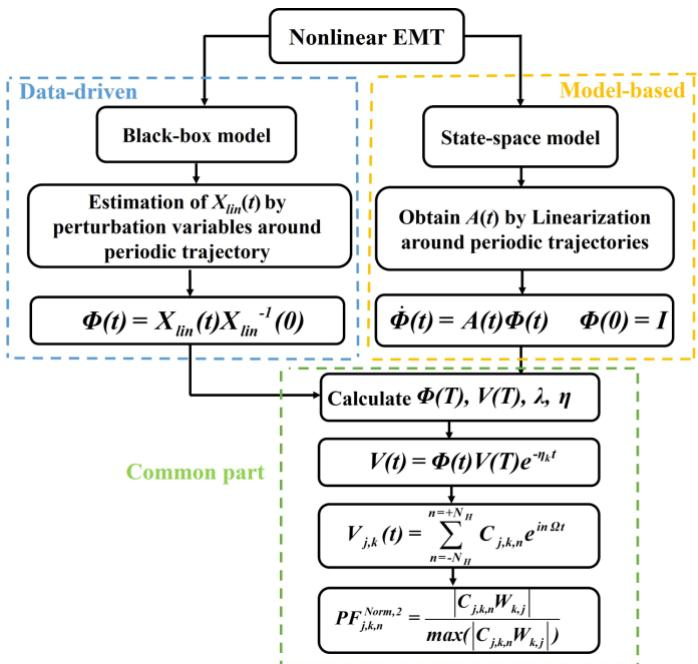  
Fig. 5. Flowchart of model-based and data-driven approaches for PFs

While the proposed method supports both model-based and data-driven frameworks for PF calculation and EMT boundary determination, practical systems often involve partially known models. In such cases, a hybrid approach can be employed, where analytical expressions are used for components with known models, and data-driven techniques are applied to unknown or black-box elements. Then both approaches can be integrated for boundary determination using PF-based analysis. This approach enables efficient PF evaluation and boundary selection when complete system models are unavailable.

# G. Multi-Port Norton Equivalent

After calculating the PFs and determining the EMT boundary based on a threshold, the boundary buses are identified. In this work, multiple boundary buses are present, requiring a multi-port Norton equivalent. The multi-port equivalent serves as a mathematical representation of the external system, enabling the EMT simulation to focus on the most critical elements. This ensures that the simulation remains computationally feasible while still accurately capturing the important dynamics at the boundary between the detailed EMT zone and the rest of the network. The coupling between boundary buses is accounted through the impedance matrix Z. The multi-port Norton equivalent is derived under steady-state

conditions, eliminating the need to update the impedance matrix at each time step. This equivalent network is then connected to the detailed EMT zone for integrated simulation. This process involves conducting open circuit and current injection tests on the boundary buses, which are the points that separate the detailed EMT simulation zone from the simplified equivalent model. The voltage at each port can be described by:

$$
V = V _ {0} + Z I _ {\text {e m t}}, \quad Z = \left[ \begin{array}{c c c c} Z _ {1 1} & Z _ {1 2} & \dots & Z _ {1 k} \\ Z _ {2 1} & Z _ {2 2} & \dots & Z _ {2 k} \\ \vdots & \vdots & \ddots & \vdots \\ Z _ {k 1} & Z _ {k 2} & \dots & Z _ {k k} \end{array} \right] \tag {31}
$$

where $I _ { e m t }$ is the vector of currents injected from the EMT zone into the external system. The port voltage vector is V. Additionally, $V _ { 0 }$ is the open-circuit voltage vector, $Z _ { i i }$ is the self-impedance of a port, and $Z _ { i j }$ is the mutual impedance between two ports [25]. $V _ { 0 }$ and Z are the variables to be determined.

To obtain the open-circuit voltages, the current injection from the EMT zone to the ports is set to zero, and the measured voltages at each port correspond to the open-circuit voltages. To determine the impedances, a current is injected into each port individually while keeping all other injections zero, and the system of equations in (31) is solved. Once the open circuit voltages and impedance matrix parameters are obtained, the Norton equivalent model is constructed which simplifies the analysis when dealing with currents directly [25]. The Norton equivalent uses the admittance matrix Y, which is the inverse of the impedance matrix. The open-circuit current injection is obtained as:

$$
I _ {0} = Y V _ {0}, \quad I _ {e m t} = Y V - I _ {0} \tag {32}
$$

Fig. 6 shows the EMT zone connected to the Norton equivalent.

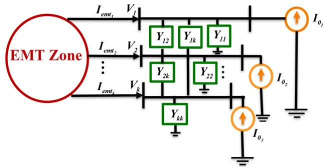  
Fig. 6. Norton equivalent connected to the EMT zone

# H. Applicability of Floquet-Based PFs Compared with Phasor-based PFs

The linear model used in this paper is obtained by linearizing the nonlinear EMT system around its 60-Hz periodic steadystate solution. Floquet theory is then applied to this linearized periodic model to extract eigenvalues and participation factors. Similar Floquet-based and small-signal techniques have been used in previous studies to analyze oscillatory behavior and SSO phenomena in converter-dominated systems [26], [27], and our work extends this methodology to boundary determination for EMT simulations. For the case studies considered, it is verified that this linearized model accurately reproduces the SSO frequency, damping characteristics, and the

dominant state- and branch-variable behavior observed in the full nonlinear EMT simulations. This indicates that, for small to moderate trajectory distortions near the operating point, the Floquet-based linear EMT model is sufficiently accurate to characterize the onset and local dynamics of SSOs and to identify the most relevant network elements for EMT modeling. In operating conditions where SSOs grow into very large, strongly nonlinear limit cycles or where severe waveform distortion occurs, the accuracy of any small-signal linearization (including the Floquet-based model) will degrade, and more general nonlinear stability tools would then be required; such cases are outside the scope of this work and are left for future research.

Building on this linearized periodic model, the Floquetbased PFs used in this work provide modal information that cannot be obtained from fundamental-frequency phasor models. First, phasor-domain PFs are restricted to the 0th harmonic and become inaccurate for SSO modes above approximately 7–10 Hz, where harmonic coupling and fast converter-control interactions play an essential role. Recent studies comparing RMS and EMT models [28]–[30] show that positive-sequence models can capture a 7-Hz mode (h = 0) but fail to represent higher-frequency modes such as the 65-Hz component (h = ±1). Second, Floquet analysis provides access to these higher-order harmonic components of each mode, which are necessary for identifying the dominant branch-level contributors to the SSO mechanism. Because boundary selection requires ranking the influence of individual lines and network elements—not only generators or IBR states—the ±1 harmonic PFs are essential and cannot be obtained from a phasor-based PFs. Third, the Floquet-based PFs need to be computed only once per study scenario as part of an offline preprocessing step, making the additional computational cost justified. Taken together, these points justify the use of Floquetbased PFs for accurate SSO characterization and for the EMT boundary-determination framework considered in this paper.

# III. CASE STUDIES

The proposed method is first demonstrated on a two-area system and then validated on a modified IEEE 39-bus system.

# A. Kundur's Two-Area System

In this work, the volage-behind-reactance model [31], is used to model synchronous generators. The synchronous generator on bus 1 is replaced by a grid following IBR which consists of an outer-loop current regulator, an inner-loop power regulator, a frequency droop controller, and a voltage droop controller, as described in [31]. The EMT model of this system has 107 state variables. By changing the gain of PI controller in the PLL, a sub-synchronous oscillation (SSO) mode around 5 Hz is excited in the system response following a 1-cycle temporary short-circuit fault at t=1 s as shown in Fig. 7.

Using Prony analysis on the response of the IBR, an SSO mode is identified at 4.957 Hz with an estimated damping ratio of 0.134%. After the linearization of the EMT model as described in Section II.A, its response is tested by applying a perturbation to ωPLL with the magnitude of 0.05 pu, i.e. 0.013% of its nominal value. Figs. 8-10 compare the responses from the original EMT model and the linearized EMT model, which

match accurately, confirming the accuracy of the linearized EMT model on small disturbances near the equilibrium.

The MSE between two responses for each state variable is calculated to be in the order of 10−7 and less. The specific MSE threshold can be chosen based on the desired accuracy of the linearized model for small-signal analysis. In the cases considered, the MSE values remain within an acceptable range, indicating that the linearized models accurately replicate the behavior of the original nonlinear systems under small disturbances.

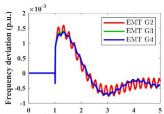

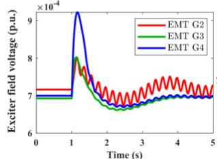  
(a) State variables of generator

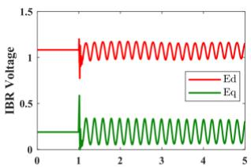

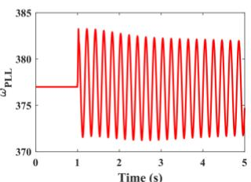  
(b) State variables of the IBR

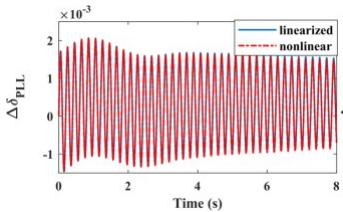  
Fig. 7. System responses for generators and IBR

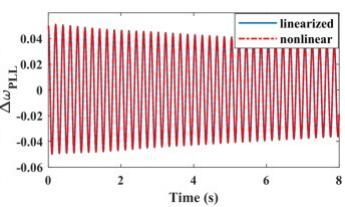

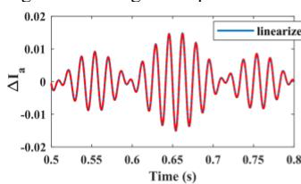  
Fig. 8. Comaring the responses of the original and linearized EMT models   
(a) Phase-a current

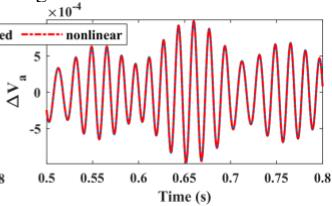  
(b) Phase-a voltage

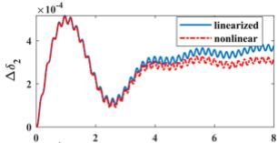  
Fig. 9. Comparing the responses of the original and linearized EMT models at bus 5

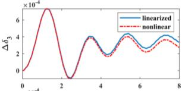

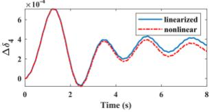

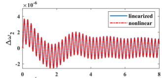

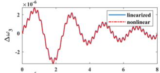

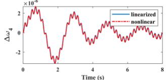  
b) ωgen   
Fig. 10. Generators’ responses from the original and linearized EMT models

The Floquet exponents are calculated by the procedure in II.B and a mode with a 4.95 Hz frequency and a 0.14% damping ratio is identified corresponding to the mode found by the Prony analysis. This low-damping mode is selected to study PFs.

Computing the Floquet state-transition matrix Φ(T) requires simulating the EMT model over one fundamental cycle from each basis vector. This procedure uses the same numerical settings as the underlying EMT simulation and does not introduce additional numerical challenges. In our case studies, a standard EMT time step (83 μs) and default solver tolerances were sufficient to obtain a well-conditioned Φ(T). To reduce computation when forming participation factors, Fourier analysis is applied only to the relevant state entries. For very large systems, standard iterative eigenvalue algorithms (e.g., Arnoldi or Krylov) can be used to efficiently extract the dominant Floquet multipliers, but such techniques were not required for the systems studied here.

By the procedure in Algorithm 1, the smaller Fourier coefficients are dropped, and the state variables are reconstructed using the new periodic eigenvector, including only significant harmonics. This process reduces the complexity of the system by focusing only on the harmonics that have a significant impact on the system's dynamic behavior. The MSE between the original and reconstructed states is in the order of 10-5, indicating that the original state variables can be accurately reconstructed by dropping the Fourier coefficients less than a threshold. For the mode of interest, only harmonics 0, -1, and 1 are retained based on Algorithm 1, as they dominate the system's response. These correspond to frequencies of 4.95 Hz, 55.05 Hz, and 64.95 Hz. Higher-order harmonics are discarded.

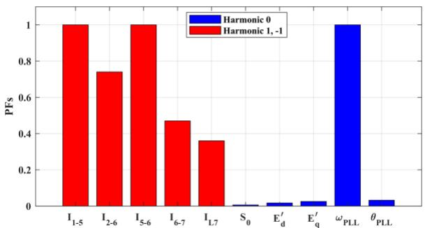  
Fig. 11. PFs for SSO at 4.95 Hz

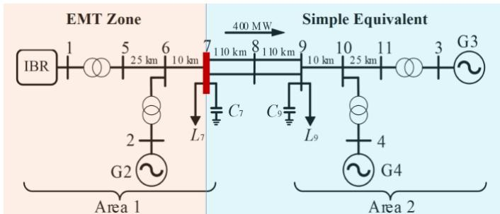  
Fig. 12. EMT zone for two-area system with 1 IBR

PFs for the mode of interest are subsequently calculated. For harmonic zero, as shown in Fig. 11, only ωPLL shows significant participation in the mode. This implies that PLL’s dynamics are a key driver for this harmonic. For harmonics -1 and 1 at

frequencies 55.05 Hz, and 64.95 Hz, state variables representing network variables are the major contributors as shown in Fig. 11. These state variables correspond to branch currents near the IBR. This indicates that the interaction between the IBR and its surrounding network, particularly the branch currents, plays a critical role in these frequencies. The region with large state participation, which significantly influences the system's dynamic response, is highlighted as the EMT zone. The rest of the system, which should be a simplified equivalent, is shown in a different color in Fig. 12. The boundary bus separating the two regions is identified as bus 7.

By leveraging the approach in Section II.F, the responses of linearized EMT model are estimated from the responses of original EMT model through small perturbations and the state transition matrix is obtained for one period of the system, allowing for the calculation of Floquet modes and PFs in a datadriven framework. Two entries of state transition matrix for model-based and data-driven approaches under small perturbation of ωPLL for 0.013% of its nominal value are compared in Fig. 13, which show a perfect match and result in the same modes and PFs. Data-driven approach identifies a Floquet mode at 4.95 Hz with a damping ratio of 0.135%, which is consistent with the results from the model-based approach. Both model-based and data-driven approaches indicate that the same parts of the system in Fig. 12 have significant participation in the 4.95 Hz mode.

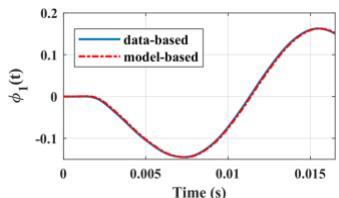

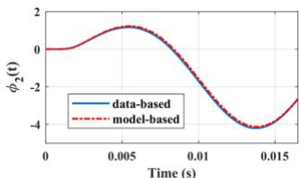  
Fig. 13.Comparison of data-driven and model-based approaches

# B. Modified IEEE 39-bus System

A modified IEEE 39-bus system is used to validate the proposed method. Four of the ten generators at buses 32, 35, 37, and 39 are replaced by IBRs [31]. The generator and IBR models are similar to those used in a two-area system. By adjusting the gain of the PI controller in the PLL, several IBRinvolved SSO are excited. These SSO modes are observable in the system responses, as shown in Fig. 14, which a temporary 5-cycle three-phase fault is applied at bus 10. These modes have frequencies in the range of 7-9 Hz with damping ratios near zero as estimated from Prony analysis.

The responses of the linearized EMT model can accurately match those from the original EMT model for small perturbation with MSE around 10-4. The Floquet exponents are computed using the procedure in section II. B, resulting in a total of 416 modes. The results identify four SSO modes with the frequencies 7.67 Hz, 8.70 Hz, 8.92 Hz and 9.13 Hz with damping ratio of 0.085, 0.066, 0.070 and 0.072, respectively. These low-damping SSO modes are the primary focus for further PF calculations. By concentrating on these specific modes, the analysis aims to determine which state variables or system components are most involved in the oscillatory

behavior at these frequencies.

The data driven approach obtained from Section II. F identifies SSO modes at frequencies of 7.67 Hz, 8.69 Hz, 8.92 Hz, and 9.13 Hz, all exhibiting near-zero damping ratios. These frequencies align with the model-based Floquet modes, confirming the consistency between the two approaches. Table I shows the normalized PFs for each IBR in four poorly damped SSO modes in their harmonic zero. As observed, two or three IBRs contribute significantly to each SSO.

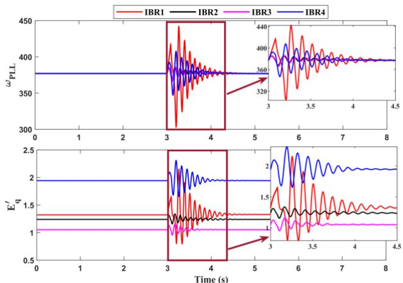  
Fig. 14. IBRs’ responses TABLE I

PFS FOR EACH IBR IN FOUR POORLY DAMPED SSO MODES   

<table><tr><td>Frequency IBRs</td><td>7.67 Hz</td><td>8.70 Hz</td><td>8.92 Hz</td><td>9.13 Hz</td></tr><tr><td>IBR 1</td><td>0.6311</td><td>1.0000</td><td>0.4358</td><td>0.0886</td></tr><tr><td>IBR 2</td><td>0.1970</td><td>0.3804</td><td>1.0000</td><td>0.2047</td></tr><tr><td>IBR 3</td><td>0.3928</td><td>0.0818</td><td>0.2296</td><td>1.0000</td></tr><tr><td>IBR 4</td><td>1.0000</td><td>0.3416</td><td>0.0473</td><td>0.0511</td></tr></table>

The following sections present simulation results for various scenarios, including: (1) SSO at 7.67 Hz with a fault at bus 39, (2) comparison of multiple fault locations for the 7.67 Hz SSO mode, (3) analysis under different PF thresholds for the 7.67 Hz SSO mode, (4) results from multi-mode consideration, and (5) a comparison with the SCR-based boundary selection method.

# 1) SSO 7.67 Hz- PF Threshold 0.2

The 7.67 Hz SSO shows the highest participation from all IBRs compared to the other modes listed in Table I. This case suggests the worst case for EMT boundary determination and therefore is the most challenging case to be studied.

According to Algorithm 1, harmonics 0, -1, and 1, corresponding to frequencies of 7.67 Hz, 52.33 Hz, and 67.67 Hz are identified as significant for this SSO. IBRs 4, 3, and 1 show larger participation in harmonic 0, indicating their strong involvement in the oscillation. By selecting a threshold for the PFs, an EMT zone can be identified, consisting of the components with the highest PFs contributing to oscillation. This threshold can be tuned to have a balance between accuracy and computational efficiency. For this section, a threshold of 0.2 was chosen, striking a balance between accuracy and computational efficiency. With a PF threshold of 0.2 applied to

harmonics 0, 1, and –1, the EMT zone and the equivalent region are highlighted in different colors in Fig. 15. The EMT zone includes IBRs 1, 3, and 4, along with branches that exceed the threshold, while the remainder of the system is represented using an equivalent Norton circuit. The boundary buses for this case are buses 15, 18, and 26.

To obtain the equivalent circuit, the following set of equations in (33) must be solved to capture the interactions at these boundary buses and ensure accurate representation of the system dynamics across the EMT zone and the equivalent network. Since the quantities in (33) should be represented in phasor form, the Park transformation is applied to convert the three-phase signals into the d-q reference frame.

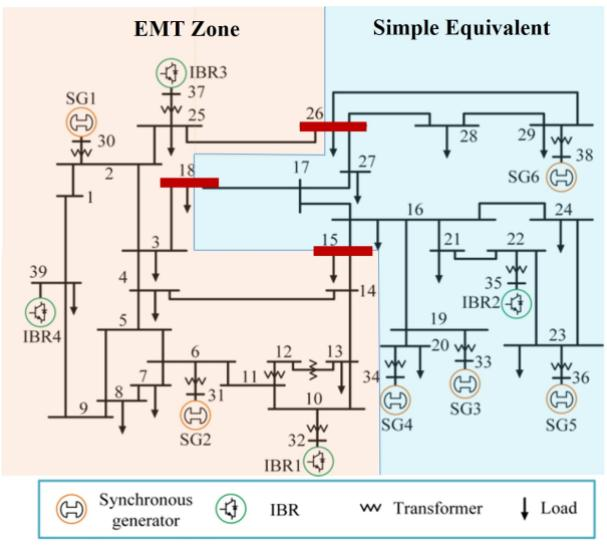  
Fig. 15. EMT zone for SSO at 7.67 Hz-39 bus system

By appropriately selecting θ, the transformed voltages and currents become DC-like in the d-q frame, ensuring that the impedance values remain constant. The Park transformation in this study is performed using the voltage phase angle (θ) at bus 38, corresponding to generator 6.

$$
\left[ \begin{array}{l} V _ {e m t _ {1 5}} ^ {d - q} \\ V _ {e m t _ {1 8}} ^ {d - q} \\ V _ {e m t _ {2 6}} ^ {d - q} \end{array} \right] = \left[ \begin{array}{l} V _ {0 1} ^ {d - q} \\ V _ {0 2} ^ {d - q} \\ V _ {0 2} ^ {d - q} \end{array} \right] + \left[ \begin{array}{c c c} z _ {1 1} & z _ {1 2} & z _ {1 3} \\ z _ {2 1} & z _ {2 2} & z _ {2 3} \\ z _ {3 1} & z _ {3 2} & z _ {3 3} \end{array} \right] \left[ \begin{array}{l} I _ {e m t _ {1 5}} ^ {d - q} \\ I _ {e m t _ {1 8}} ^ {d - q} \\ I _ {e m t _ {2 6}} ^ {d - q} \end{array} \right] \tag {33}
$$

To determine open-circuit voltages, the EMT currents injected into the equivalent circuit are set to zero, as follows:

$$
\left\{ \begin{array}{l} I _ {e m t _ {1 5}} = I _ {1 5 - 1 4} = 0 \\ I _ {e m t _ {1 8}} = I _ {1 8 - 3} = 0 \\ I _ {e m t _ {2 6}} = I _ {2 6 - 2 5} = 0 \end{array} \right. \tag {34}
$$

The voltages at the boundary buses (buses 15, 18, and 26) are measured and correspond to the open-circuit voltages. These voltages are then transformed into the d-q reference frame to calculate the equivalent impedances in the next step. In the impedance calculation process, currents are injected into each boundary bus one at a time. For example, when current is injected only at boundary bus 15, there is:

$$
\left\{ \begin{array}{l} V _ {e m t _ {1 5}} ^ {d - q} = V _ {0 1} ^ {d - q} + z _ {1 1} I _ {e m t _ {1 5}} ^ {d - q} + 0 + 0 \\ V _ {e m t _ {1 8}} ^ {d - q} = V _ {0 2} ^ {d - q} + z _ {2 1} I _ {e m t _ {1 5}} ^ {d - q} + 0 + 0 \\ V _ {e m t _ {2 6}} ^ {d - q} = V _ {0 3} ^ {d - q} + z _ {3 1} I _ {e m t _ {1 5}} ^ {d - q} + 0 + 0 \end{array} \right. \tag {35}
$$

In this case, the impedances $z _ { I I } , z _ { 2 I }$ and $z _ { 3 I }$ are derived from the d-q frame voltages and injected currents at boundary bus 15. This procedure is repeated for the other boundary buses to calculate the remaining impedance terms in the matrix. Once all the self and mutual impedance values are obtained, the Norton equivalent form is obtained through (32). The results are then compared with those obtained from the full EMT model. Note that the Norton equivalent model for the external system is derived at a steady-state operating point and is independent of the fault or EMT zone events and can therefore be computed offline and reused across a wide range of simulations. The computation time for deriving the Norton equivalent model depends on the system size and the number of boundary buses involved in the open-circuit and current injection tests. This computational cost is a general requirement across all EMT boundary determination methods that involve deriving an equivalent for the external system, and it is not specific to the Floquet-based approach. As this is a one-time offline cost, it is justified—particularly when the resulting equivalent enables significant EMT simulation time savings and can be reused across multiple fault scenarios. Furthermore, sensitivity analysis can be used to evaluate the impact of external system variations. If the impact on the boundary parameters is small, the equivalent remains valid without re-derivation. Consider a short circuit fault occurring at bus 39, initiated at 3 seconds and lasting for a duration of 2 cycles. The simulation time step is 83 μs, and the system is simulated for 10 seconds. The Norton equivalent is connected to the EMT zone for comparison with the full EMT simulation. The comparison focuses on critical dynamics, such as the ωPLL in the IBRs, boundary bus voltages and injected currents. Fig. 16 shows a comparison of the PLL frequency between the EMT zone connected to the Norton equivalent and the full EMT model for IBRs 1, 3 and 4.

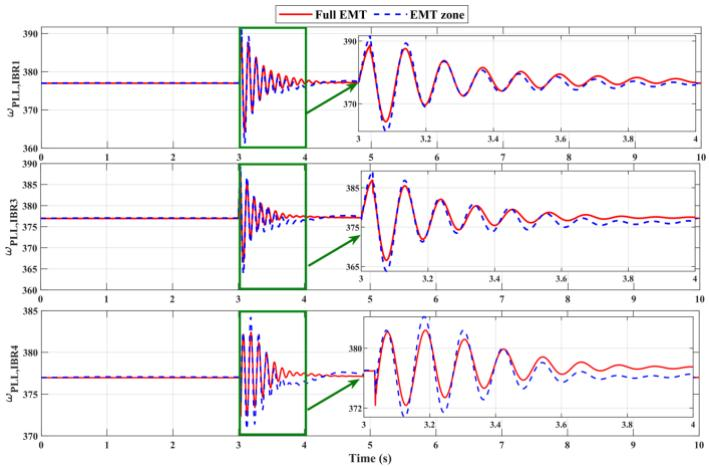  
Fig. 16. Comparison of $\dot { \omega } _ { \mathrm { P L L } }$ for full EMT and EMT zone in IBRs 1, 3 and 4

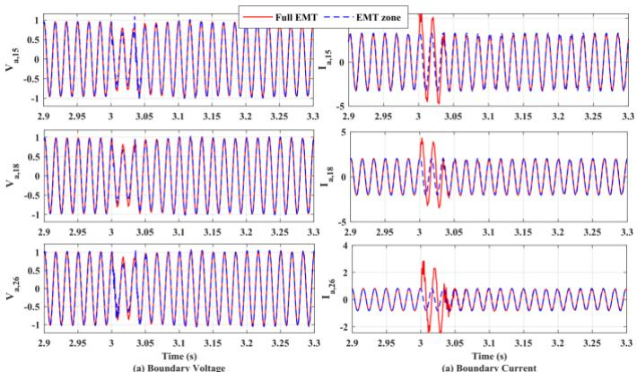  
Fig. 17. Boundary bus voltages and injected currents of phase A for a 2-cycle fault at bus 39

Fig. 17 compares the phase A bus voltages and injected currents at boundary buses 15, 18, and 26 between the EMTzone simulation and the full EMT model for a 2-cycle fault at bus 39. The figure focuses on the fault period starting at 3 seconds to highlight the mismatch during the disturbance. As illustrated, there is a good match between the two models, indicating that the EMT zone connected to the Norton equivalent circuit can capture the key dynamic responses of the full EMT simulation. This validates the ability of the EMT zone to replicate the important dynamics of interest while reducing computational complexity. The full EMT simulation takes 473.4809 seconds, while the EMT zone connected to the Norton equivalent completes in 269.7490 seconds, resulting in a 1.7× speed-up in simulation time. Note that in this 7.67 Hz SSO, all IBRs actively participate, and the selected EMT zone covers a significant portion of the system. For larger systems or more localized SSOs, the simulation speedup should be greater.

# 2) Comparison of Fault Scenarios for 7.67 Hz SSO Mode

Several other contingencies are considered in this study, including faults at bus 39 lasting for 5 and 7 cycles and faults at bus 37 lasting for 2, 5, and 7 cycles. The EMT zone connected to the Norton equivalent is compared to the full EMT simulation under these cases. Fig. 18 presents the phase A bus voltages and injected currents at boundary buses 15, 18, and 26, comparing the EMT-zone simulation with the full EMT model for a 2-cycle fault at bus 37. Fig. 19 extends this comparison by showing phase A bus voltages at the boundary buses for 7-cycle faults at buses 39 and 37.

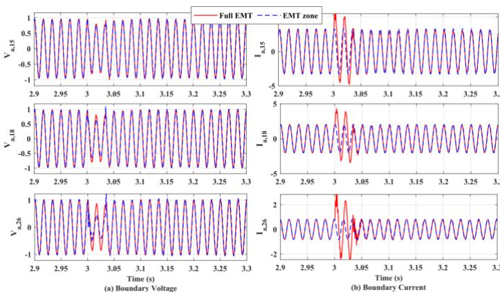  
Fig. 18. Boundary bus voltages and injected currents of phase A for a 2-cycle fault at bus 37

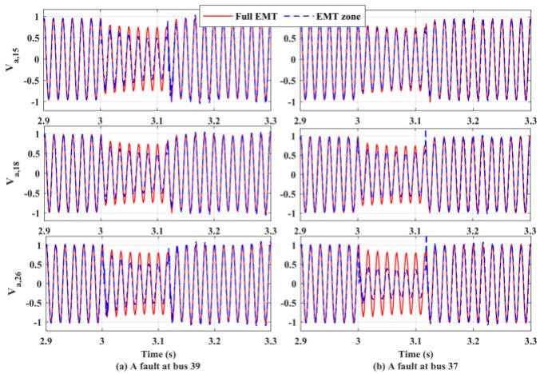  
Fig. 19. Boundary bus voltages for two 7-cycle faults

TABLE II MSE IN RAD/S FOR SEVERAL FAULT SCENARIOS   

<table><tr><td rowspan="2">IBRs</td><td colspan="3">Bus 39</td><td colspan="3">Bus 37</td></tr><tr><td>2 cycles</td><td>5 cycles</td><td>7 cycles</td><td>2 cycles</td><td>5 cycles</td><td>7 cycles</td></tr><tr><td>IBR 1</td><td>0.2332</td><td>0.9461</td><td>1.0889</td><td>0.1769</td><td>0.3763</td><td>0.6163</td></tr><tr><td>IBR 3</td><td>0.3874</td><td>0.4958</td><td>0.7866</td><td>0.2012</td><td>0.5060</td><td>0.7774</td></tr><tr><td>IBR 4</td><td>0.2395</td><td>0.6246</td><td>0.8424</td><td>0.1753</td><td>0.4579</td><td>0.7653</td></tr></table>

For the fault at bus 39, all boundary bus voltages exhibit a comparable level of mismatch compared to the full EMT simulation. However, for the fault at bus 37, which is very close to boundary bus 26, the mismatch in voltage at this boundary bus is more pronounced than at the others. For each scenario, mean square error (MSE) in rad/s between the ωPLL for the full EMT simulation and the EMT zone is calculated for three IBRs in the EMT zone and is presented in the Table II.

# 3) Analysis of PF Threshold in 7.67 Hz SSO

To assess how the participation threshold affects the tradeoff between accuracy and computational complexity, additional simulations were conducted for various PF thresholds. The corresponding results are presented in Table III and Fig. 20. For each threshold, the number of states within the EMT zone, the resulting MSE in rad/s, and the achieved speed-up are included in Table III. IBR4, exhibits the highest participation factor in 7.67 Hz SSO is consistently retained across all PF thresholds, and is used for MSE comparison. Fig. 20 compares the response of ωPLL for IBR4 under various PF thresholds against the full EMT simulation. Since the fault occurs at bus 39—where IBR4 is directly impacted—this case represents the worst-case scenario for the comparison with full EMT simulation.

The outcomes clearly illustrate the trade-off: Higher participation thresholds reduce model complexity and improve computational efficiency by limiting the EMT zone to only the most dominant elements but may exclude less significant contributors and reduce modeling accuracy. Lower thresholds, in contrast, capture more system dynamics by including additional components, improving accuracy at the cost of increased computational effort. Therefore, selecting an appropriate threshold involves balancing accuracy and efficiency based on the specific objectives of the simulation.

TABLE III COMPARISON OF EMT ZONE PERFORMANCE FOR DIFFERENT PF THRESHOLDS IN 7.67 HZ SSO   

<table><tr><td>PF</td><td># States</td><td>MSE</td><td>Runtime</td><td>Acceleration</td></tr><tr><td>Full EMT</td><td>416</td><td>---</td><td>473.4809 s</td><td>1</td></tr><tr><td>Threshold = 0.1</td><td>359</td><td>0.05715</td><td>396.1271 s</td><td>1.19×</td></tr><tr><td>Threshold = 0.2</td><td>237</td><td>0.2395</td><td>269.7490 s</td><td>1.75×</td></tr><tr><td>Threshold = 0.4</td><td>151</td><td>0.9392</td><td>174.5065 s</td><td>2.73×</td></tr><tr><td>Threshold = 0.65</td><td>35</td><td>3.8743</td><td>56.6708 s</td><td>8.35×</td></tr></table>

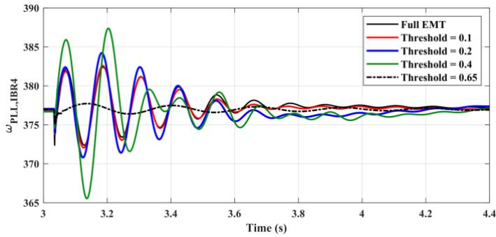  
Fig. 20. Comparison of $\omega _ { \mathrm { P L L } }$ for IBR4 in different PF threshold

# 4) Multi-Mode SSO Analysis

Consider SSO mode 8.7 Hz along with the SSO at 7.67 Hz. Using the previously selected PF threshold of 0.2, the identified boundary buses for the combined modes are buses 19, 26, and 27. This results in 338 state variables being included within the EMT zone—101 more than when considering only the 7.67 Hz mode. Table IV and Fig. 21 show the comparison of multimode and single mode. As shown, the multi-mode approach yields better accuracy and lower MSE, but this comes at the cost of increased computational burden.

TABLE IV COMPARISON OF MULTI-MODE VS SINGLE MODE   

<table><tr><td></td><td># States</td><td>MSE</td><td>Runtime</td><td>Acceleration</td></tr><tr><td>Full EMT</td><td>416</td><td>---</td><td>473.4809 s</td><td>1</td></tr><tr><td>Mode 7.67 Hz</td><td>237</td><td>0.2395</td><td>269.7490 s</td><td>1.75×</td></tr><tr><td>Mode 7.67 Hz+8.7 Hz</td><td>338</td><td>0.1543</td><td>356.1674</td><td>1.32×</td></tr></table>

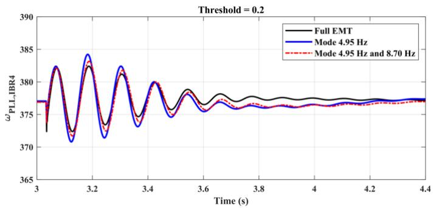  
Fig. 21. Comparison of $\Theta _ { \mathrm { P L I } }$ for IBR4 in single and multi-modes scenarios

# 5) Comparison with Short-Circuit Ratio (SCR)-Based Method

The results of the SCR-based method are compared with the proposed PF-based approach for the 7.67 Hz SSO mode in this section. Short-circuit capacity (SCC) quantifies system strength at a given bus and is defined as [32], [33]:

$$
S C C = V _ {t h} I _ {S C} = \frac {V _ {t h} ^ {2}}{Z _ {t h}} \tag {36}
$$

where $V _ { t h }$ the Thevenin voltage and $Z _ { t h }$ is the Thevenin impedance at the point of interconnection. A higher SCC implies a stronger, stiffer bus that is less sensitive to power injection changes. SCR is defined as the ratio of SCC to the rated power of the IBR connected at that bus as:

$$
S C R = \frac {S C C}{P _ {I B R}} \tag {37}
$$

where SCC is the short-circuit capacity assuming a three-phase fault, and $P _ { I B R }$ is the nominal power of the connected IBR. SCR provides a measure of system strength relative to an IBR’s rating, where values above 3, between 1.5 and 3, and below 1.5 respectively indicate a strong grid, a medium-strength grid, and a weak grid [32], [33].

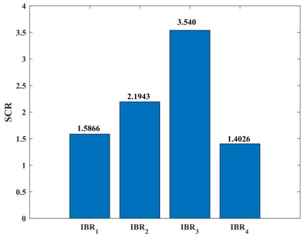  
Fig. 22. SCR values for IBRs

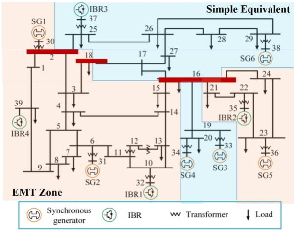  
Fig. 23. EMT zone for SCR-based approach

Fig. 22 presents the SCR values for the four IBRs in the system obtained from (37). Therefore, the SCR-based method identifies IBRs 1, 2, and 4 with low short-circuit strength and includes them in the EMT zone. To determine the EMT boundary, a sensitivity analysis is performed in this work by removing each synchronous generator one at a time and observing the impact on IBR SCR values. Significant SCR reductions indicated strong dependencies. Findings show that removing SG1, SG2, and SG5 caused major SCR drops (up to

~70%) for IBR1, IBR2, and IBR4, while other SGs had negligible influence. As a result, IBR1, IBR2, and IBR4 along with SG1, SG2, and SG5 are included in EMT zone. The corresponding EMT zone for the SCR-based approach and external region are shown in Fig. 23, where the Norton equivalent described in Section II.G is used to model the external system.

The boundary buses in Fig. 23 are buses 2, 16, and 18, leading to a total of 279 states in the EMT zone, a simulation time of 299.8443 seconds, and an MSE of 0.4239 rad/s for IBR4 as shown in Table V.

TABLE V COMPARISON OF SCR-BASED APPROACH AND THE PF-BASED APPROACH IN 7.67 HZ SSO   

<table><tr><td></td><td># States</td><td>MSE</td><td>Runtime</td><td>Acceleration</td></tr><tr><td>Full EMT</td><td>416</td><td>---</td><td>473.4809 s</td><td>1</td></tr><tr><td>Threshold = 0.2</td><td>237</td><td>0.2395</td><td>269.7490 s</td><td>1.75×</td></tr><tr><td>SCR</td><td>279</td><td>0.4239</td><td>299.8443 s</td><td>1.58×</td></tr></table>

These results indicate that although the SCR method includes a larger EMT zone, it results in a higher error, demonstrating the superior accuracy and efficiency of the proposed PF-based method. Furthermore, a key limitation of the SCR approach is its inability to identify critical branches or account for the influence of the surrounding network—it focuses solely on the IBRs, providing limited insight for comprehensive EMT boundary determination. Fig. 24 compares the response of ωPLL for IBR4 in SCR and the proposed approach with PF threshold 0.2. The proposed approach provides improved accuracy along with computational speed-up.

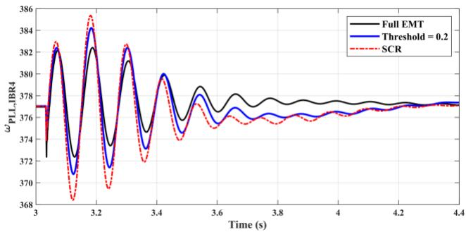  
Fig. 24. Comparison of $\Theta _ { \mathrm { P L L } }$ for IBR4 in two methods

# IV. CONCLUSION

This paper presented a novel framework for EMT boundary determination by leveraging Floquet theory applied to a single cycle of the linearized EMT model. The proposed approach efficiently identifies the key components that significantly influence the dynamics of interest. Simultaneously, the less critical parts are represented using multi-port Norton equivalents, reducing computational complexity while preserving essential system behavior. The paper establishes a theoretical connection between LTI and LTP participation factors by interpreting phasor-based PFs as the harmonic-0 case within the broader Floquet-based framework. The linearized EMT model is validated, and a criterion for harmonic selection is proposed alongside the computation of data-driven PFs,

making the approach applicable regardless of system model availability. The effectiveness of the method is demonstrated through multiple case studies, including two fault locations with three different fault durations each, varying PF thresholds, and multi-mode scenarios. A comparison with the conventional SCR-based approach is also conducted, highlighting the advantages of the proposed method in terms of accuracy and boundary selection. One direction for future work is to apply the proposed EMT boundary determination framework within hybrid simulation environments and assess its performance on large-scale, IBR-dominated power systems.

# V. REFERENCES

[1] Q. Huang, V. Vittal, “Advanced EMT and phasor-domain hybrid simulation with simulation mode switching capability for transmission and distribution systems,” IEEE Trans. Power Syst., vol. 33, no. 6, pp. 6298–6308, 2018.   
[2] D. Shu, X. Xie, Q. Jiang, Q. Huang, and C. Zhang, “A novel interfacing technique for distributed hybrid simulations combining EMT and transient stability models,” IEEE Trans. Power Deliv., vol. 33, no. 1, pp. 130–140, 2017.   
[3] H. Su, K. W. Chan, L. Snider, “Evaluation study for the integration of electromagnetic transients simulator and transient stability simulator,” Electric power systems research, vol. 75, no. 1, pp. 67–78, 2005.   
[4] K. Mudunkotuwa, S. Filizadeh, and U. Annakkage, “Development of a hybrid simulator by interfacing dynamic phasors with electromagnetic transient simulation,” IET Gener. Transm. Distrib. vol. 11, no. 12, pp. 2991–3001, 2017.   
[5] Y. Liu, R. Huang, W. Du, et al, “Highly-scalable transmission and distribution dynamic co-simulation with 10,000+ grid-following and grid-forming inverters,” IEEE Trans. Power Deliv., 2023   
[6] D. Rimorov, J. Huang, C. F. Mugombozi, T. Roudier, and I. Kamwa, “Power coupling for transient stability and electromagnetic transient collaborative simulation of power grids,” IEEE Trans. Power Syst., vol. 36, no. 6, pp. 5175–5184, 2021.   
[7] M. D. Heffernan, K. S. Turner, J. Arrillaga, and C. P. Arnold, “Computation of A.C.-D.C. System disturbances—Part I. interactive coordination of generator and convertor transient models,” IEEE Trans. Power App. Syst., no. 11, pp. 4341–4348, Nov. 1981.   
[8] J. Reeve, R. Adapa, “A new approach to dynamic analysis of AC networks incorporating detailed modeling of DC systems. Part I: principles and implementation,” IEEE Trans. Power Del, no. 3, pp. 2005–2011, 1988.   
[9] B. Zhang, S. Nie, and Z. Jin, “Electromagnetic transient-transient stability analysis hybrid real-time simulation method of variable area of interest,” Energies, vol. 11, no. 10, p. 2620, 2018.   
[10] NERC Guideline, “Performance, modeling, and simulations of BPSconnected battery energy storage systems and hybrid power plants,” North American Electric Reliability Corporation, Atlanta, GA, 2021.   
[11] B. Gao, et al, “Voltage stability evaluation using modal analysis,” IEEE Trans. Power Syst., vol. 7, no. 4, pp. 1529–1542, 1992.   
[12] Q. Cossart, et al, “A novel event- and non-projection based approximation technique by state residualization for the model order reduction of power systems with a high renewable energies penetration,” IEEE Trans. Power Syst., vol. 37, no. 4, pp. 3221–3229, Jul. 2022.   
[13] M. Sajjadi, K. Huang, K. Sun, “Participation factor-based adaptive model reduction for fast power system simulation,” in IEEE PESGM, 2022.   
[14] Y. Gu, N. Bottrell, and T. C. Green, “Reduced-order models for representing converters in power system studies,” IEEE Trans. Power Electron, vol. 33, no. 4, pp. 3644–3654, Apr. 2018.   
[15] S. Liu, A. R. Messina, V. Vittal, “Assessing placement of controllers and nonlinear behavior using normal form analysis,” IEEE Trans. Power Syst., vol. 20, no. 3, pp. 1486–1495, 2005.   
[16] S. Liu, A. Messina, V. Vittal, “A normal form analysis approach to siting power system stabilizers (PSSs) and assessing power system nonlinear behavior,” IEEE Trans. Power Syst., vol. 21, no. 4, pp. 1755– 1762, 2006.   
[17] M. Sajjadi, T. Xia, M. Xiong, K. Sun, A. Hoke, B. Wang, J. Tan., “A participation factor-based approach for defining the EMT model

boundary for power system simulations with inverter-based resources,” in IEEE IECON Conference, Chicago, 2024.   
[18] M. J. Lopez, J. V. R. Prasad, “Estimation of modal participation factors of linear time periodic systems using linear time invariant approximations,” Journal of the American Helicopter Society, vol. 61, no. 4, pp. 1–4, 2016.   
[19] D. A. Peters, S. M. Lieb, L. A. Ahaus, “Interpretation of Floquet eigenvalues and eigenvectors for periodic systems,” Journal of the American Helicopter Society, vol. 56, no. 3, pp. 1–11, 2011.   
[20] S. Zhu, et al, “Stability Assessment of Modular Multilevel Converters Based on Linear Time-Periodic Theory: Time-Domain vs. Frequency-Domain,” IEEE Trans. Power Del., vol. 37, no. 5, pp. 3980–3995, 2022.   
[21] H. Yang, H. Just, M. Eggers, and S. Dieckerhoff, “Linear time-periodic theory-based modeling and stability analysis of voltage-source converters,” IEEE J. Emerg. Sel. Topics Power Electron, vol. 9, no. 3, pp. 3517–3529, 2020.   
[22] P. D. Achlerkar and B. K. Panigrahi, “New perspectives on stability of decoupled double synchronous reference frame PLL,” IEEE Trans. Power Electron, vol. 37, no. 1, pp. 285–302, 2021.   
[23] J. Zhu, J. Hu, S. Wang, and M. Wan, “Small-Signal Modeling and Analysis of MMC Under Unbalanced Grid Conditions Based on Linear Time-Periodic (LTP) Method,” IEEE Trans. Power Del., vol. 36, no. 1, pp. 205–214, 2021.   
[24] M. Sajjadi, T. Xia, M. Xiong, K. Sun, A. Hoke, J. Tan, B. Wang, “Estimation of participation factors using the synchrosqueezed wavelet transform,” IEEE PESGM, Orlando, FL, 2023.   
[25] L. Wen-zhuo, et al, “An electromechanical/electromagnetic transient hybrid simulation method that considers asymmetric faults in an electromechanical network,” in Proc. IEEE/PES Power Systems Conf. Expo., 2011, pp. 1–7.   
[26] Y. Han, et al, “Floquet-theory-based small-signal stability analysis of single-phase asymmetric multilevel inverters with SRF voltage control,” IEEE Trans. Power Electron, vol. 35, no. 3, pp. 3221–3241, Mar. 2019.   
[27] A. H. Nayfeh, A. Harb, C.-M. Chin, A. M. A. Hamdan, and L. Mili, “A bifurcation analysis of subsynchronous oscillations in power systems,” Electr. Power Syst. Res, 47(1), pp.21-28., 1998.   
[28] D. Ramasubramanian, X. Wang, S. Goyal, M. Dewadasa, Y. Li, R. J. O’Keefe, and P. F. Mayer, “Parameterization of generic positive sequence models to represent behavior of inverter-based resources in low short circuit scenarios,” Electr. Power Syst. Res, vol. 214, p. 108622, 2022.   
[29] S. Konstantinopoulos and D. Ramasubramanian, “On the limitations of RMS IBR models: A small-signal perspective,” IEEE PESGM, 2024.   
[30] L. Fan, Z. Miao, and D. Ramasubramanian, “Transient algebraic impedance derivations and applications for PLL-synchronized IBRs,” IEEE Trans. Power Del., vol. 39, no. 1, pp. 683–686, Feb. 2024.   
[31] K. Huang, M. Xiong, Y. Liu, K. Sun, “A Heterogeneous Multiscale Method for Efficient Simulation of Power Systems with Inverter-Based Resources,” IEEE Trans. Power Syst., pp. 1–15, 2025.   
[32] Y. Zhu, T. C. Green, X. Zhou, Y. Li, D. Kong, and Y. Gu, “Impedance margin ratio: A new metric for small-signal system strength,” IEEE Trans. Power Syst., vol. 39, no. 6, pp. 7291–7303, 2024, doi: 10.1109/TPWRS.2024.3371231.   
[33] A. Boričić, J. L. R. Torres, and M. Popov, “System strength: Classification, evaluation methods, and emerging challenges in IBRdominated grids,” in Proc. IEEE PES Innov. Smart Grid Technol.–Asia (ISGT Asia), Nov. 2022, pp. 185–189.

Kai Sun (Fellow, IEEE) is a Professor in the Department of Electrical Engineering and Computer Science at the University of Tennessee, Knoxville, USA. He received his B.S. degree in Automation in 1999 and his Ph.D. degree in Control Science and Engineering in 2004, both from Tsinghua University, Beijing, China. From 2007 to 2012, he served as a Project Manager for R&D programs in grid operations, planning, and renewable integration at the

Electric Power Research Institute (EPRI), Palo Alto, CA.

Deepak Ramasubramanian (Senior Member, IEEE) received the Ph.D. degree in electrical engineering from Arizona State University, Tempe, AZ, USA, in 2017, and the M.Tech. degree in power systems from the Indian Institute of Technology Delhi, New Delhi, India, in 2013. He joined EPRI in 2017, where his work is in the area of modeling, control, and stability analysis of the bulk power system with a focus on the impacts of large-scale integration of inverter-interfaced generation and load. He

is currently a Principal Technical Leader with the Electric Power Research Institute in the Transmission Operations and Planning Group.

Mahsa Sajjadi (Member, IEEE) received the B.S. degree from Ferdowsi University of Mashhad, Mashhad, Iran, in 2014, the M.S. degree from Tarbiat Modares University, Tehran, Iran, in 2017, and the Ph.D. degree from the University of Tennessee, Knoxville, TN, USA, in 2025, all in electrical engineering. She is currently a system engineer with Siemens Energy, working in the FACTS

system engineering team. Her research interests include dynamic simulation of power systems with high penetration of inverter-based resources, electromagnetic transient simulation, and model reduction.