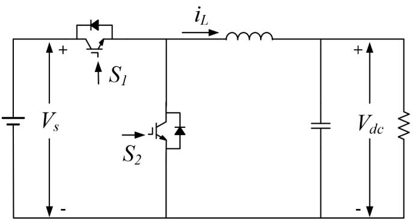
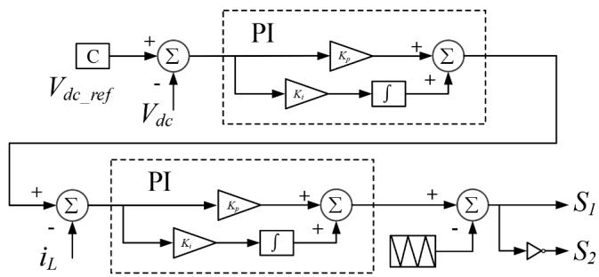
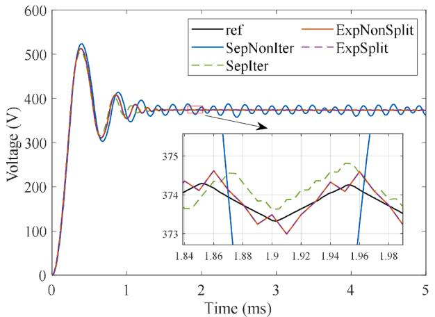
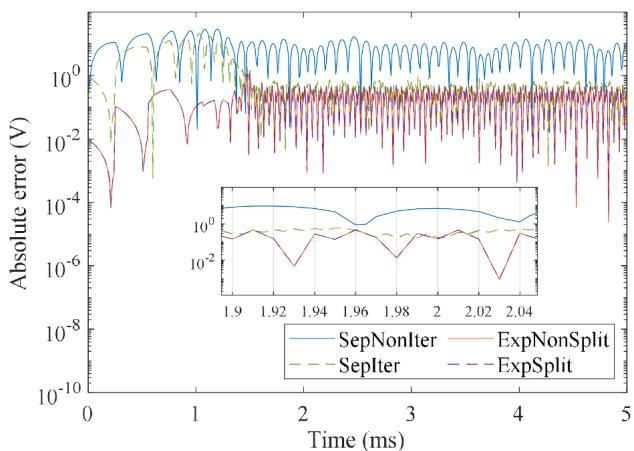
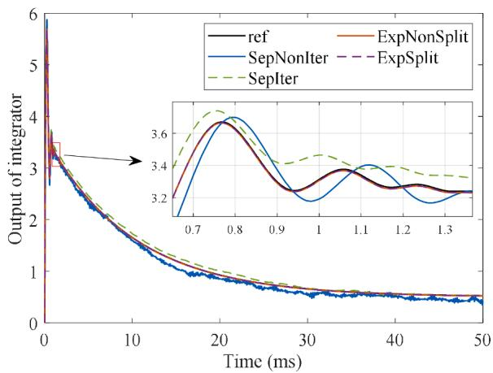
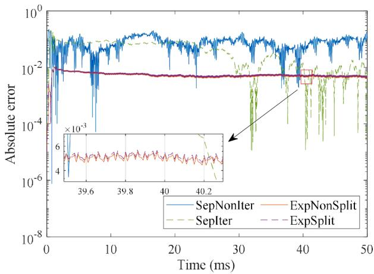
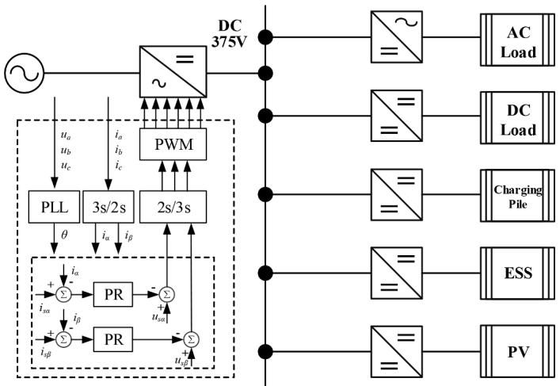
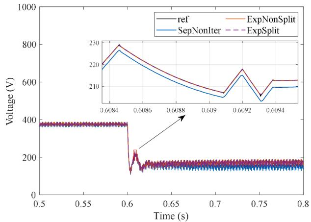
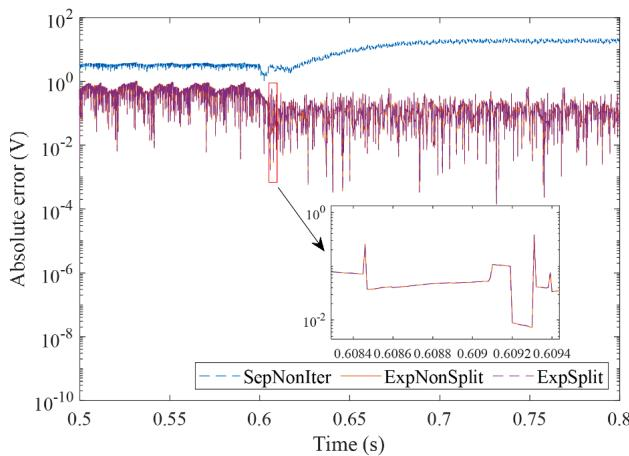

# Reduced-order and simultaneous solution of power and control system equations in EMT simulations,✰,✰✰

Jiaming Wang a , Xiaopeng Fu a,* , Peng Li a , Jean Mahseredjian b

a State Key Laboratory of Smart Power Distribution Equipment and System, Tianjin University, Tianjin 300072, China   
b Department of Electrical Engineering, Polytechnique Montr´eal, Montr´eal, Qu´ebec H3T 1J4, Canada

# A R T I C L E I N F O

Keywords:

Electromagnetic transient simulation

Exponential integrators

Simultaneous solution

Sylvester equation

# A B S T R A C T

The time-step delay between the power and control system solutions in EMT simulation may cause inaccurate results or even numerical instability in certain scenarios. A simultaneous solution is preferred theoretically, but computationally expensive and not adopted. By utilizing the triangular block structure of the state-space matrices in converter simulations, this paper achieves reduced-order implementation of simultaneous solution based on exponential integrators. The core mathematical idea is to convert the difficult matrix exponential solution problem of the off-diagonal block into a linear matrix solution process by introducing a Sylvester equation and its linear transformation, when the power and control systems are solved simultaneously with a unified state-space matrix. To address the nonexistence of solution issue of the Sylvester equation due to structure-induced repetitive eigenvalues, the paper proposes a matrix sub-block eigenvalue-shifting technique, that enables a more robust and error-free solution through the excellent properties of matrix exponential. The proposed method effectively decouples the matrix exponential solution during the simultaneous solution. Additionally, synchronized interpolation on the state variables of the power and control systems is now possible with a unified time-stepping process, improving accuracy for converter simulations. Through illustrative example and analysis, the accuracy and efficacy of the proposed method are verified.

# 1. Introduction

Accurate and efficient solution of control system equations is important for EMT simulations, considering the increasingly complex power system dynamics deeply affected by its various new components and their sophisticated control systems. Control systems usually comprise numerous types of nonlinear blocks and feedback loops, with their matrix representation often exhibiting a sparse and asymmetric structure. This is significantly different from the symmetric matrix form of power system models. As a result, traditional solution methods for control systems introduce artificial delays, which are further categorized into internal and external delays [1]. The internal delays are introduced in decoupling nonlinear feedback loops, e.g. algebraic loops. Eliminating the internal delays requires solving the control system equations simultaneously by iterative methods. This issue has been extensively studied in previous research. For example, the time-step delays in

solving the control system equations are eliminated by using the Jacobian matrix-based formulation in [2], and a comparison is made between the full iterative Newton method and its noniterative variant. On this basis, the reduced rank Jacobin matrix in a fully iterative Newton method is realized by combining the specific influence range of the feedback loops in the control system equations [3,4].

The external delays exist mainly due to the fact that the power and control system equations are solved separately. The information is transferred between the two sets of equations through an interface. The power system may transmit voltage and current values to the control system, while the control system typically transmits control values of the controlled sources and switching signals to the power system. It is the scheme of this information interface that makes it necessary to wait for one of them until the required information has been successfully transmitted. At the same time, in order to simplify the calculation process and increase the efficiency of the simulation, there is no iteration

scheme in the interface process, which results in a one-time-step delay between the solution of the power and control system. Although this delay may not be a significant source of errors in most well-behaved cases with small time-steps, the presence of an external delay may cause inaccurate results or serious numerical stability problems in certain scenarios [5]. Reduced time steps must be used in such occasions. Compared to the treatment of internal delays, there are fewer studies addressing the challenges posed by external delays.

To eliminate the external delays or mitigate the numerical stability problem, a common approach is to introduce iteration on the interface variables within the existing solution framework. The time-step delays between the power and control system can be eliminated or minimized by iteratively re-solving the control system equations until convergence is achieved within a predefined error tolerance or a maximum number of iterations [6]. Another approach to realize simultaneous solution is to construct a unified sparse asymmetric matrix by combining two sets of equations. When this approach is implemented in the nodal analysis method of EMT simulation, the inconsistency of matrix structures makes it necessary to use the relatively complex Newton’s method to solve the unified equation during the simultaneous solution [7], which is previously used to solve only the control system equations. This method will face a high-dimensional unified matrix equation containing only small portions of nonlinear elements, making the computation process an inefficient one. Interfacing techniques were also proposed, e.g. the numerical oscillations caused by interface delays were shown to be suppressed by inserting a low-pass filter composed of a resistor and an inductor [8]. The delay functions have also been analyzed using Taylor’s series and Laplace transformation for controlled source systems, and a numerical compensation method was proposed to solve the numerical stability issues [9]. However, the compensation parameters in this method are dependent on the specific component characteristics and simulation time-step size.

To obtain more accurate simulation results and eliminate potential numerical stability problems, a simultaneous yet efficient solution algorithm is desirable, which eliminates the artificial delay between the power and control systems without notable efficiency deterioration. In the state-space framework of EMT simulation, the use of exponential integrators achieves the same A-stability as the trapezoidal method while maintaining explicit solution [10]. One of the key elements of this method is to obtain the state transition matrix of the differential equation by using the matrix exponential operator. It is noted that the state matrix structure and properties of the power and control systems are different, and an alternating solution was previously used to calculate the corresponding state transition matrices separately. This paper proposes that for converter simulations, the state transition matrix of the whole system can be effectively computed with a reduced-order method, and simultaneous solution is easily realized with a unified state matrix. Meanwhile, it is also convenient to carry out precise time stepping operations such as control system interpolation with the unified model representation.

In converter simulations, the control system influence the power system through switching control signals instead of continuous variables, and triggers update of the time-varying state matrix of the power system. The power-control interaction is one-directional when conduction states of power switches are not altered. Therefore the unified state matrix will have specific matrix structure and properties. In this paper, the Sylvester equation is introduced to realize the simultaneous solution for the switching-controlled systems (without controlled sources), and the existence problem of Sylvester equation solution in EMT simulation is dealt with. On the basis of obtaining the matrix exponential of the power and control system respectively, the simultaneous solution can be realized by solving only one Sylvester equation and its related transformation equation, thus eliminating the time-step delays in the traditional method and improving the overall solution accuracy and numerical stability of the system. In addition, since the power and control system constitute a unified state matrix under the proposed

method, the interpolation of the internal states of the control system becomes easier during the switch positioning process. In order to verify the feasibility of the proposed method, the simulation accuracy and stability tests are carried out for several different examples.

# 2. Simultaneous solution

For the switching-controlled systems without controlled sources, the control system directly obtains the required input from the power system. And the switching control signal output of the control system does not act directly on the state variables of the power system, but indirectly changes the state matrix by switching the power switch conduction states. Therefore, for such a system, the state matrix is in the form of triangular block matrix when solved simultaneously.

# 2.1. The basic method

It is assumed that power and control systems are expressed in the following unified state-space equation as follows:

$$
\left[ \begin{array}{l} \dot {\mathbf {x}} _ {\mathrm {c}} \\ \dot {\mathbf {x}} _ {\mathrm {e}} \end{array} \right] = \left[ \begin{array}{l l} \mathbf {A} _ {1 1} & \mathbf {A} _ {1 2} \\ \mathbf {0} & \mathbf {A} _ {2 2} \end{array} \right] \left[ \begin{array}{l} \mathbf {x} _ {\mathrm {c}} \\ \mathbf {x} _ {\mathrm {e}} \end{array} \right] \tag {1}
$$

where xc is the state variable of the control system; $\pmb { x } _ { \mathrm { e } }$ is the state variable of the power system, and $A _ { 1 1 } , A _ { 1 2 } , A _ { 2 2 }$ are the corresponding block state matrix respectively. When using exponential integrators for simulation, it is necessary to solve the matrix exponential of the state matrix. With the increase of matrix dimension, the calculation of matrix exponential becomes more complicated. Matrix exponential function calculation is a classical numerical analysis topic with many algorithms developed. Among them, the scaling and squaring algorithm is widely used [11] for dense matrices of small to medium-size. As the dimension of the system matrix increases, the memory usage and computational time of this method increase significantly. Large-scale system state matrix exhibits sparse characteristics, and Krylov subspace algorithm can be used in reduced order approximations. This method projects the original problem into a low-dimensional subspace and fully exploit the sparsity of the matrix, thereby reducing memory requirements and enhancing computational efficiency [12].

Order reduction is an effective strategy to handle large-scale matrix exponential calculation. If the state matrix can be decoupled according to the presented block form, and the off-diagonal coupling block can be expressed efficiently, the key step of solving the matrix exponential can be simplified. The off-diagonal block represents the interaction between the control and power systems. The control system state variables can be expressed using a formula that includes a convolution term.

$$
\boldsymbol {x} _ {\mathrm {c}} (t) = \mathrm {e} ^ {t \boldsymbol {A} _ {1 1}} \boldsymbol {x} _ {\mathrm {c}} \left(t _ {0}\right) + \int_ {0} ^ {t} \mathrm {e} ^ {(t - \tau) \boldsymbol {A} _ {1 1}} \boldsymbol {A} _ {1 2} \mathrm {e} ^ {\tau \boldsymbol {A} _ {2 2}} \boldsymbol {x} _ {\mathrm {e}} \left(t _ {0}\right) \mathrm {d} \tau \tag {2}
$$

In essence, this convolution term is exactly the upper triangular block of the matrix exponential. In the one-step numerical integration algorithms of EMT simulation, direct computation of the convolution terms is complicated and involves additional approximations. Therefore, it is preferable to explore simplification methods based on the computation of the matrix exponential of the unified state-space matrix.

For this purpose, the Sylvester equation is introduced. For any complex matrix $\pmb { A } \in \mathbb { C } ^ { \mathrm { m \times m } } , \pmb { B } \in \mathbb { C } ^ { \mathrm { n \times n } }$ , and $\ b { C } \in \mathbb { C } ^ { \mathrm { m \times n } }$ , the equation can be used to find a transformation matrix X that satisfies $\pmb { A } \pmb { X } - \pmb { X } \pmb { B } = \pmb { C } .$ . For the upper triangular block matrix shown in (1), the following Sylvester equation is constructed:

$$
\boldsymbol {A} _ {1 1} \boldsymbol {X} - \boldsymbol {X} \boldsymbol {A} _ {2 2} = \boldsymbol {A} _ {1 2} \tag {3}
$$

On this basis, a combined state variable $( { \pmb x } _ { \mathrm { c } } + { \pmb X } { \pmb x } _ { \mathrm { e } } )$ is introduced, and the time derivative of this combined state variable satisfies the following relationship:

$$
\frac {\mathrm {d}}{\mathrm {d} t} \left(\boldsymbol {x} _ {\mathrm {c}} + \boldsymbol {X} \boldsymbol {x} _ {\mathrm {e}}\right) = \boldsymbol {A} _ {1 1} \boldsymbol {x} _ {\mathrm {c}} + \boldsymbol {A} _ {1 2} \boldsymbol {x} _ {\mathrm {e}} + \boldsymbol {X} \boldsymbol {A} _ {2 2} \boldsymbol {x} _ {\mathrm {e}} = \boldsymbol {A} _ {1 1} \left(\boldsymbol {x} _ {\mathrm {c}} + \boldsymbol {X} \boldsymbol {x} _ {\mathrm {e}}\right) \tag {4}
$$

The above equation indicates that the combined state variable is solely related to the matrix $\pmb { A } _ { 1 1 } .$ . Since the lower-left block of the state matrix is 0, the state variables of the power system can be directly solved through numerical integration. Based on this, the analytical solution of the control system can be derived as follows:

$$
\boldsymbol {x} _ {\mathrm {c}} (t) = \mathrm {e} ^ {t \boldsymbol {A} _ {1 1}} \boldsymbol {x} _ {\mathrm {c}} \left(t _ {0}\right) + \left(\mathrm {e} ^ {t \boldsymbol {A} _ {1 1}} \boldsymbol {X} - \boldsymbol {X} \mathrm {e} ^ {t \boldsymbol {A} _ {2 2}}\right) \boldsymbol {x} _ {\mathrm {c}} \left(t _ {0}\right) \tag {5}
$$

The above equation demonstrates that $\left( \mathrm { e } ^ { t A _ { 1 1 } } \pmb { X } - \pmb { X } \mathrm { e } ^ { t A _ { 2 2 } } \right)$ corresponds to the upper off-diagonal block of the matrix exponential for the unified state matrix. Although the systems are solved simultaneously, this method effectively decouples the calculation of the critical state transition matrix. For the diagonal block parts, their matrix exponentials are required necessarily during the decoupling operation. The most complex part of the upper triangle block is transformed into a simple matrix linear calculation process through a Sylvester equation. There are various algorithms for solving Sylvester equations, each with different computational complexities [13,14]. Nonetheless, compared to original matrix exponential computation algorithms that are designed for dense matrices, the proposed method is more efficient for large-scale sparse matrices commonly encountered in power systems. This method significantly simplifies the computation of matrix exponentials, enhancing computational efficiency.

In the above derivation, the upper triangular block of the matrix exponential for the unified state matrix is obtained through the solution of the Sylvester equation and matrix linear calculation. Let $\pmb { M } = \mathrm { e } ^ { t \pmb { A } _ { 1 1 } } \pmb { X }$ − $\pmb { X } \mathrm { e } ^ { t \pmb { A } _ { 2 2 } }$ . Based on the properties of the matrix exponential, the following equation can be derived:

$$
\boldsymbol {A} _ {1 1} \boldsymbol {M} - \boldsymbol {M} \boldsymbol {A} _ {2 2} = \mathrm {e} ^ {t \boldsymbol {A} _ {1 1}} \boldsymbol {A} _ {1 2} - \boldsymbol {A} _ {1 2} \mathrm {e} ^ {t \boldsymbol {A} _ {2 2}} \tag {6}
$$

The above equation is also a Sylvester equation, which indicates that the upper triangular block of the matrix exponential can be directly obtained by solving a single Sylvester equation. The scaling and squaring algorithm is employed for the matrix exponential function calculation. The proposed method leverages the inherent decoupling characteristics of the converter system to achieve order reduction while obtaining a simultaneous solution, thereby improve the computational performance.

# 2.2. The improvement method

The solution of the Sylvester equation requires that the two matrices involved do not have common eigenvalues. In general, the eigenvalues of the state matrices of power and control system do not coincide. However, some structure-induced eigenvalues, e.g. 0, could appear in both systems [15]. In such cases, it is not possible to solve the Sylvester equation directly.

The computation of matrix exponentials does not impose special requirements on the matrices. The matrix exponential of any square matrix is guaranteed to exist and be unique. Leveraging the properties of matrix exponentials, it is possible to decompose the matrix exponential of the sum of two matrices that commute under multiplication into the product of their individual matrix exponentials. Based on this property, the original state-space matrix can be directly processed.

At this stage, an auxiliary state variable x∗ is introduced to satisfy the following relationship:

$$
\boldsymbol {x} _ {\mathrm {e}} ^ {*} = \left(\boldsymbol {A} _ {2 2} + \lambda \boldsymbol {I}\right) \boldsymbol {x} _ {\mathrm {e}} ^ {*} \tag {7}
$$

There is:

$$
\boldsymbol {x} _ {\mathrm {e}} ^ {*} (t) = \mathrm {e} ^ {t \left(\boldsymbol {A} _ {2 2} + t \boldsymbol {I}\right)} \boldsymbol {x} _ {\mathrm {e}} ^ {*} (t _ {0}) \tag {8}
$$

For the power system, since ${ \pmb x } _ { \mathrm { e } } ^ { * } ( t _ { 0 } ) = { \pmb x } _ { \mathrm { e } } ( t _ { 0 } )$ , it follows that:

$$
\begin{array}{l} \mathbf {x} _ {\mathrm {e}} (t) = \mathrm {e} ^ {t \left(\mathbf {A} _ {2 2} + \lambda I - \lambda I\right)} \mathbf {x} _ {\mathrm {e}} (t _ {0}) \\ = \mathrm {e} ^ {- t \lambda I} \mathrm {e} ^ {t \left(A _ {2 2} + \lambda I\right)} x _ {\mathrm {e}} \left(t _ {0}\right) \tag {9} \\ = e ^ {- t \lambda} x _ {e} ^ {*} (t) \\ \end{array}
$$

For the state equation of the control system:

$$
\dot {\mathbf {x}} _ {\mathrm {c}} = \mathbf {A} _ {1 1} \mathbf {x} _ {\mathrm {c}} + \mathbf {A} _ {1 2} \mathbf {x} _ {\mathrm {e}} = \mathbf {A} _ {1 1} \mathbf {x} _ {\mathrm {c}} + \mathbf {A} _ {1 2} \mathrm {e} ^ {- t \lambda} \mathbf {x} _ {\mathrm {e}} ^ {*} \tag {10}
$$

Let $\pmb { A } _ { 2 2 } ^ { * } = ( \pmb { A } _ { 2 2 } + \lambda \pmb { I } ) \mathrm { a n d } \pmb { A } _ { 1 2 } ^ { * } = \pmb { A } _ { 1 2 } \mathrm { e } ^ { - t \lambda }$ . Introduce a state equation that has no specific physical significance:

$$
\left[ \begin{array}{l} \dot {\mathbf {x}} _ {\mathrm {c}} \\ \dot {\mathbf {x}} _ {\mathrm {e}} ^ {*} \end{array} \right] = \left[ \begin{array}{l l} \mathbf {A} _ {1 1} & \mathbf {A} _ {1 2} ^ {*} \\ \mathbf {0} & \mathbf {A} _ {2 2} ^ {*} \end{array} \right] \left[ \begin{array}{l} \mathbf {x} _ {\mathrm {c}} \\ \mathbf {x} _ {\mathrm {e}} ^ {*} \end{array} \right] \tag {11}
$$

The corresponding Sylvester equation can then be constructed as ${ \pmb A } _ { 1 1 } { \pmb X } ^ { * } - { \pmb X } ^ { * } { \pmb A } _ { 2 2 } ^ { * } = { \pmb A } _ { 1 2 } ^ { * }$ . From this, the following equation can be derived:

$$
\boldsymbol {x} _ {\mathrm {c}} (t) = \mathrm {e} ^ {t \boldsymbol {A} _ {1 1}} \boldsymbol {x} _ {\mathrm {c}} \left(t _ {0}\right) + \left(\mathrm {e} ^ {t \boldsymbol {A} _ {1 1}} \boldsymbol {X} ^ {*} - \boldsymbol {X} ^ {*} \mathrm {e} ^ {t \boldsymbol {A} _ {2 2} ^ {*}}\right) \boldsymbol {x} _ {\mathrm {e}} ^ {*} \left(t _ {0}\right) \tag {12}
$$

The analytical solution for the control system state variable has already been obtained from the above derivation. Alternatively, by letting $\pmb { M } ^ { * } = \mathrm { e } ^ { t \pmb { A } _ { 1 1 } } \pmb { X } ^ { * } - \pmb { X } ^ { * } \mathrm { e } ^ { t \pmb { A } _ { 2 2 } ^ { * } }$ , the required term can also be directly derived by solving a Sylvester equation:

$$
\boldsymbol {A} _ {1 1} \boldsymbol {M} ^ {*} - \boldsymbol {M} ^ {*} \boldsymbol {A} _ {2 2} ^ {*} = \mathrm {e} ^ {\iota A _ {1 1}} \boldsymbol {A} _ {1 2} ^ {*} - \boldsymbol {A} _ {1 2} ^ {*} \mathrm {e} ^ {\iota A _ {2 2} ^ {*}} \tag {13}
$$

For the use of discrete numerical integration method in the EMT simulation, the numerical calculation formulas for each step can be derived as follows:

$$
\boldsymbol {x} _ {\mathrm {e}} \left(t _ {n + 1}\right) = \mathrm {e} ^ {- h \lambda} \mathrm {e} ^ {t A _ {2 2} ^ {*}} \boldsymbol {x} _ {\mathrm {e}} \left(t _ {n}\right) \tag {14}
$$

$$
\begin{array}{l} \boldsymbol {x} _ {\mathrm {c}} \left(t _ {n + 1}\right) = \mathrm {e} ^ {h \boldsymbol {A} _ {1 1}} \boldsymbol {x} _ {\mathrm {c}} \left(t _ {n}\right) + \boldsymbol {M} ^ {*} \boldsymbol {x} _ {\mathrm {e}} ^ {*} \left(t _ {n}\right) \tag {15} \\ = \mathrm {e} ^ {\mathrm {h} A _ {1 1}} x _ {\mathrm {c}} \left(t _ {n}\right) + \boldsymbol {M} ^ {*} \mathrm {e} ^ {\mathrm {h} \lambda} x _ {\mathrm {e}} \left(t _ {n}\right) \\ \end{array}
$$

Where, h is the simulation time-step size, and n is the number of steps during simulation. The improved solution method derived here is applicable to a wider variety of systems. It is important to note that the parameter λ should not be set excessively large, as this may lead to numerical overflow and computational errors.

# 2.3. Synchronized interpolation

Since the power and control system are solved simultaneously, all state values can be updated synchronously. When the switch state changes, linear interpolation is usually used to locate the detailed switching action moment. At the same time, the state values of the system are updated and the control system is re-solved. The significant advantage of exponential integrators is that the interpolation method is easy to implement and does not require re-initialization step, and the lstability of the algorithm is not susceptible to numerical oscillations [16]. Then, on the basis of simultaneous solution of exponential integrators, all the state variables in power and control system can be interpolated synchronously. And the output of the control system is usually an algebraic equation related to the state variables.

For the nonlinear components such as limiter, comparator, $\mathrm { e t c . , }$ which are common in the control system, the internal state values are updated by interpolation, further discontinuities are detected and updated according to the characteristics of each component, in order to obtain the accurate output of the current time step. On one hand, the interpolation operation is performed directly on the internal state values of the control system, which makes the processing and recovery of nonlinear components state easier. On the other hand, the nonlinear components can be processed directly according to the current state values after the synchronous interpolation, eliminating the process of reading data from the power system and analysis of control interpolation propagation like in PSCAD.

# 2.4. Nonlinearity handling

Nonlinearity handling is an important aspect of the EMT simulation. Since nonlinear components are significantly less than linear ones, it is common practice to apply modified linear solutions rather than resorting to less efficient full nonlinear methods for the whole network. Consequently, the piecewise linear method is the most widely used. In this method, the computational matrix is regenerated at each segment, and this method often needs to further combine interpolation or iterative operations to avoid possible numerical problems. For the converter system studied in this paper, considering the state matrix switching induced by the piecewise linear treatment, (1) can be further expressed as:

$$
\left[ \begin{array}{l} \dot {\mathbf {x}} _ {\mathrm {c}} \\ \dot {\mathbf {x}} _ {\mathrm {e}} \end{array} \right] = \left[ \begin{array}{l l} \mathbf {A} _ {1 1 (i)} & \mathbf {A} _ {1 2 (i)} \\ \mathbf {0} & \mathbf {A} _ {2 2 (i)} \end{array} \right] \left[ \begin{array}{l} \mathbf {x} _ {\mathrm {c}} \\ \mathbf {x} _ {\mathrm {e}} \end{array} \right] \tag {16}
$$

where the subscript i denotes the state matrix corresponding to the specific operating condition. At the segmentation points of the piecewise linear components, the state matrix switches. Efficient algorithm is applied to update the computation matrices, and interpolation algorithm is applied to capture the time instant and avoid numerical issues.

It is noted that the nonlinear characteristics of the power and control systems are different. Due to rapid switching, the topology of the power system frequently changes, resulting in a state matrix that is highly timevarying, whereas the nonlinear components in the control system are generally inactive during normal operation. This difference in switching frequencies implies that if the matrices of both systems are simply merged, the unified system matrix will be dominated by the rapidly switching power component and exhibit high-frequency time-varying characteristics. Consequently, this would necessitate repeatedly computing different matrix exponentials for the exponential integration.

Fortunately, by introducing Sylvester equation, the method proposed in this paper divides the matrix exponential solution of unified matrix into two parts. In the Sylvester equation, one matrix remains largely constant while the other varies at high frequency. It is considerably more efficient than computing the matrix exponential for the full-dimensional rapidly time-varying matrix.

# 3. Case studies

In this section, the feasibility of the proposed method is verified through case studies. The proposed method is specifically designed for switching-controlled systems without controlled sources. Therefore, the test cases are set up to exclude controlled sources, ensuring that the unified state matrix of the power and control system retains the triangular block matrix form. The accuracy of the proposed method is validated by comparing the simulation results with small time-step size.

  
Fig. 1. Power system diagram of DC-DC converter case.

# 3.1. Buck converter

A simple DC buck converter, as shown in Fig. 1, is used as an example. This converter steps down a 750 V DC input to 375 V. Its control system adopts a straightforward dual-loop PI control, as depicted in Fig. 2. In this case study, the state variables of the power system include the output capacitor voltage, inductor current, and the augmented DC voltage source. The control system state variables consist of the outputs of two integrators, as well as an additional constant value. Even when the power and control system are modeled as a unified state matrix, the dimensionality of the matrix remains relatively low. This simple example is used to verify the feasibility of the proposed method.

The simulation time-step size is set to 10 μs. The reference value is the simulation result in the case of 1 μs time-step and iterative processing for simultaneous problems. Since the state matrices of the power and the control system contain the same eigenvalues in this example, an improved method is needed. The eigenvalue translation parameter λ of the power system state matrix is set to 0.1. The switches are modeled as the binary on/off resistance model. In addition, to validate the accuracy of the proposed method in decoupling the matrix exponential solution process, the simulation results are also compared with those obtained by directly solving the matrix exponential of the unified state matrix.

In this test case, since the two controlled switches operate synchronously, adopting an iterative resolution of the control system significantly affect the simulation results. In the following simulation results, SepNonIter means separate and non-iterative solution. SepIter represents separate but iterative solution, which is an available solver option in EMTP®. ExpNonSplit corresponds to direct calculation of the matrix exponential for simultaneous solution. ExpSplit represents the proposed method using the Sylvester equation-based reduced-order simultaneous solution approach in this paper.

As can be seen from the simulation results in Fig. 3 and Fig. 4, the simultaneous solution based on exponential integrators can obtain accurate results.

Furthermore, the proposed method does not compromise the precision of matrix exponential computation. Compared to separate solution, the simultaneous solution obviously gets higher accuracy under the same time-step size. The non-iterative separate solution of this case, on the other hand, produces fictitious oscillations around the steady-state value. It is noted that for this case we deliberately choose a set of parameters that are sensitive to the external delay to reveal the problem, and the non-iterative separate solution does not always lead to large errors of such extent. But the presented result shows the potential significant impact of the time-step delay between the power and control system.

In addition, to evaluate the simulation accuracy of the control system under different simulation conditions, the output waveforms of the inner-loop integrator were compared, as shown in Fig. 5 and Fig. 6. In the switching-controlled systems studied in this paper, the upper triangular block of the state matrix directly affects the solution of the control system. It can be observed that exponential integrators demonstrate a significant accuracy advantage for the simple control system in the test

  
Fig. 2. Control system diagram of DC-DC converter case.

  
Fig. 3. Capacitance voltage waveform.

  
Fig. 4. Absolute error of capacitor voltage.

  
Fig. 5. Output waveform of the inner loop integrator of the control system.

case. Furthermore, the absolute error figure indicates that the proposed Sylvester equation-based simultaneous solution method, which decouples the calculation of the matrix exponential, does not lead to notable changes in error. This stability can be attributed to two main reasons: the mature and diverse algorithms for solving Sylvester equation, and the appropriately chosen eigenvalue shift parameter, which does not cause large errors during the calculation process.

  
Fig. 6. Absolute error of the inner loop integrator of the control system.

# 3.2. DC microgrid

To demonstrate the simulation accuracy and efficiency of the proposed method, a DC microgrid test case is further developed with a larger system dimension, as shown in Fig. 7. This system includes multiple converters, which is very suitable and can fully embody the characteristics of the proposed method. The simulation settings are similar to those described in Section III.A. Specifically, the simulation time-step is set to 10 μs, and the results of iterative solution under 1us time-step are used as reference. The simulation starts from a zero initial state and ends at t = 1 s.

The simulation accuracy is analyzed in Fig. 8 and Fig. 9, which illustrate the capacitor voltage waveform and absolute error of the rectifier DC side. Specifically, a short circuit fault occurs at t = 0.6 s, resulting in a rapid voltage drop. It is evident that the simultaneous solution approach yields superior accuracy compared to the nonsimultaneous solution, and the reduced-order method proposed in this paper does not compromise simulation precision.

Furthermore, the computational time under different simulation conditions is recorded. It should be noted that the exponential integration schemes are implemented in MATLAB, which have efficiency disadvantages of the scripting language. All the conditions compared in this case are executed within the same programming environment. The detailed computational time is presented in Table I.

The overall computational time includes the matrix exponential recalculating of the system models under various topologies, as well as interpolations and other related processes. The results in Table I clearly

  
Fig. 7. DC microgrid system.

  
Fig. 8. Capacitance voltage of the rectifier.

  
Fig. 9. Absolute error of capacitor voltage of the rectifier.

Table I Computational time of DC microgrid system.   

<table><tr><td>Solving Method</td><td>Computational Time (s) 
(Overall / Matrix Exponential Calculations)</td></tr><tr><td>SepNonIter</td><td>33.8651 / 4.0338</td></tr><tr><td>ExpNonSplit</td><td>38.7151 / 6.9116</td></tr><tr><td>ExpSplit</td><td>35.5165 / 4.2959</td></tr></table>

indicate that by introducing the Sylvester equation for order reduction, the computational time for the matrix exponentials is significantly reduced for ExpSplit, down to a comparable level of the common separate solution approach (SepNonIter). This leads to an efficient simultaneous solution algorithm with improved accuracy and stability, yet consumes only slightly more computation time. Additional observation is that the matrix exponential calculation constitutes roughly 12 % of the overall computation time, and is not the bottom neck of the exponential integrator-based simulation program. It could be further reduced if caching of matrix exponential results is allowed, which increase memory requirements. Although solving the Sylvester equation is also relatively complex, on the basis of test cases, with the further expansion of the unified matrix dimensions and appropriate division according to the matrix structure, the advantages of reduced order solution will be more prominent. Therefore, different methods can be selected depending on the practical requirements for simulation accuracy and efficiency.

# 4. Conclusions

This paper presents a reduced-order and simultaneous solution method for the power and control system equations based on exponential integrators. By introducing Sylvester equation and its related linear transformation, the difficult matrix exponential solving process is transformed into a simple matrix linear calculate process, which reduces the computational complexity of the state transition matrix in the simulation process to a large extent. In this method, Sylvester equation establishes the transformation relationship between the coupling parts of the power and control system, thus transforming the key part of the simultaneous solution into a decoupling operation. Numerical examples show that the conventional non-iterative solution is potentially problematic, and the proposed method effectively achieves a power and control systems simultaneous solution and eliminates the numerical stability problem caused by the external delays. For the larger case example, the proposed method not only improves simulation accuracy, but also effectively reduces the computational cost associated with the state transition matrix of the unified system. With increased system dimensions, the efficiency advantages is expected to be even more pronounced. However, it should be noted that the solution of Sylvester equation can be further refined by leveraging the characteristics of the system state matrix to further optimize the simulation efficiency.

The observations of this paper do not imply full replacement of existing approach with a simultaneous one, instead, certain portions of the control systems, particularly the converter control systems, are shown to be better solved alongside their power counterparts, leading to more robust, accurate and still efficient simulation. On the basis of the proposed method, a hybrid approach that is built on a fine-grained analysis of the overall control system and determines sub-system solution strategies intelligently can be constructed, and is the aim of future research.

# CRediT authorship contribution statement

Jiaming Wang: Writing – original draft. Xiaopeng Fu: Validation, Conceptualization, Funding acquisition, Project administration, Writing – review & editing. Peng Li: Writing – review & editing, Funding acquisition, Supervision, Resources. Jean Mahseredjian: Investigation, Resources, Methodology, Validation.

# Declaration of competing interest

The authors declare that they have no known competing financial interests or personal relationships that could have appeared to influence the work reported in this paper.

# Data availability

Data will be made available on request.

# References

[1] A.E.A. Araujo, H.W. Dommel, J.R. Marti, Converter simulations with the EMTP: simultaneous solution and backtracking technique, in: Proceedings. Joint International Power Conference Athens Power Tech, Athens, Greece 2, 1993, pp. 941–945.   
[2] J. Mahseredjian, L. Dube, Ming Zou, S. Denneti`ere, G. Joos, Simultaneous solution of control system equations in EMTP, IEEE Trans. Power. Syst. 21 (1) (Feb. 2006) 117–124.   
[3] C.F. Mugombozi, J. Mahseredjian, O. Saad, Efficient computation of feedbackbased control system equations for electromagnetic transients, IEEE Trans. Power Deliv. 30 (6) (Dec. 2015) 2501–2509.   
[4] B. Bruned, J. Mahseredjian, S. Denneti`ere, N. Bracikowski, Optimized reduced jacobian formulation for simultaneous solution of control systems in electromagnetic transient simulations, IEEE Trans. Power Deliv. 38 (5) (Oct. 2023) 3366–3374.   
[5] Juan A. Martinez-Velasco, Transient Analysis of Power Systems: Solution Techniques, Tools and Applications, Span: Wiley-IEEE, 2015.

[6] J. Mahseredjian, "R Nonlinear Controlled Device," EMTP-EMTPWorks. [Online]. Available: https://emtp.com/documents/EMTP-Documentation/doc/nonlinear /rnonlinearcontrolled.pdf.   
[7] A.E.A. Araujo, H.W. Dommel, J.R. Marti, Simultaneous solution of power and control systems equations, IEEE Trans. Power. Syst. 8 (4) (Nov. 1993) 1483–1489.   
[8] X. Cao, A. Kurita, T. Yamanaka, Y. Tada, H. Mitsuma, Suppression of numerical oscillation caused by the EMTP-TACS interface using filter interposition, IEEE Trans. Power Deliv. 11 (4) (Oct. 1996) 2049–2055.   
[9] L. Gao, F. Ji, H. Yan, C. Lin, H. Pang, J. Li, Numerical stability and compensation method for equivalent controlled source in electromagnetic transient simulation, in: 2019 IEEE Innovative Smart Grid Technologies - Asia (ISGT Asia), Chengdu, China, 2019, pp. 2084–2089.   
[10] C. Wang, X. Fu, P. Li, J. Wu, L. Wang, Multiscale simulation of power system transients based on the matrix exponential function, IEEE Trans. Power. Syst. 32 (3) (May 2017) 1913–1926.

[11] N.J. Higham, The scaling and squaring method for the matrix exponential revisited, SIAM Rev. 51 (4) (Nov. 2009) 747–764.   
[12] X. Fu, C. Wang, P. Li, L. Wang, Exponential integration algorithm for large-scale wind farm simulation with Krylov subspace acceleration, Appl. Energy 254 (Nov. 2019) 113692.   
[13] V. Simoncini, Computational methods for linear matrix equations, SIAM Rev. 58 (3) (Aug. 2016) 377–441.   
[14] Peter Kirrinnis, Fast algorithms for the Sylvester equation AX – XBT = C,", Theor. Comput. Sci. 259 (1–2) (May. 2001) 623–638, issues.   
[15] X. Fu, W. Wu, P. Li, J. Mahseredjian, J. Wu, C. Wang, Splitting state-space method for converter-integrated power systems EMT simulations, IEEE Trans. Power Deliv. 40 (1) (Feb. 2025) 584–595.   
[16] P. Li, Z. Meng, X. Fu, H. Yu, C. Wang, Interpolation for power electronic circuit simulation revisited with matrix exponential and dense outputs, Electr. Power Syst. Res. 189 (Dec. 2020) 106714.