# Efficient Implementation of Multi-Port Frequency Dependent Network Equivalents for Electromagnetic Transient Studies using Norton Equivalent Circuits

Claudio Saldana˜ * , Graciela Calzolari

Consulting Engineer, Montevideo, Uruguay

# A R T I C L E I N F O

Keywords:

EMT

FDNE

Norton equivalent

Rational models

# A B S T R A C T

Power system electromagnetic transient studies require that a small part of the electrical network be modelled in detail. The rest of the system is represented by a network equivalent taking into account the frequency dependence of the system components (FDNE). With the purpose of getting a FDNE, this paper presents a procedure for including high-order rational models in EMTP-type simulation programs based on Norton equivalent circuits. This approach has the advantage of using few conductance branches compared to those obtained by fitting any particular circuit structure.

In relation to the work carried out, this paper presents the following issues: a) a procedure for calculating the admittance matrix of the rest of the system as a function of frequency b) this matrix is synthesized in the form of multi-terminal π-equivalent circuits, whose branches are fitted by rational functions in the pole-residue form c) each partial fraction is converted into a differential equation in time domain. The trapezoidal rule of integration is applied to that differential equation, resulting in a conductance in parallel with a history term current source. Considering all the partial fractions corresponding to a branch, a Norton equivalent circuit is obtained for that branch.

This paper also shows how the procedure is implemented in three different ways in an EMTP-type program, along with the validation of such approach through simulations in an electric utility 500 kV transmission system.

# 1. Introduction

The size and complexity of current power systems continue to grow due to the deployment of renewable energy sources and the increased interconnections using high voltage direct current (HVDC) links. Because of this, Electromagnetic Transient (EMT) simulation studies demand a large amount of data and require long computer processing times.

In order to save time and effort, it is common practice in EMT studies to model in detail a selected small area of the power system under study, denominated “study area”. The representation of the rest of the system, termed “external area”, is performed using a frequency dependent network equivalent (FDNE).

The FDNE should be able to replicate the responses of the external area to the changes in the study area with reasonable accuracy, but demanding much less computation.

With the purpose of getting a multi-port FDNE, this paper presents a procedure for including high-order rational models in EMTP-type simulation programs based on Norton equivalent circuits. This approach has the advantage of using few conductance branches compared to those based on the fitting of any particular circuit structure. It is important to note that the procedure followed does not involve the special handling of complex poles.

To validate the procedure, a few switching transient events are simulated in an electric utility 500 kV transmission system. The results obtained with a complete power system representation, along with the FDNE implementations, are compared.

The processing times of the different implementations are also compared.

# 2. External Area Admittance Matrix

The first step for getting the FDNE is to calculate the frequency dependent admittance matrix Y(ω) of the external area, as seen from its boundary. In the case of a three-phase bus bar, the admittance matrix Y (ω) is a 3 × 3 complex matrix whose elements are functions of frequency. In this work, the frequency domain characteristic of the external area is obtained by frequency scans.

The Harmonic Frequency Scan (HFS) routine of the EMTP-ATP program [1,2] is utilized. This routine performs a sequence of phasor solutions for sinusoidal voltage/current sources of various frequencies, amplitudes and angles specified by the user.

As it is well known EMTP-ATP is a free licensed program widely used by the researches who investigate in the electromagnetic transient area.

To perform frequency scans, it is necessary to have the frequency dependent model of each component of the external area. The models used are presented below.

# 2.1. Generator, Transformer and Load

Generator and transformer resistances have a significant frequency dependence. The variation of their time constants (L/R) with frequency is depicted in [3]. For the subtransient impedance of the generator, this variation is fitted by the electrical circuit shown in Fig. 1.

The leakage impedance variation of typical transformers is fitted in the same way as for generators. As an example, Fig. 2 shows the frequency dependent models for a generator and its step-up transformer.

The load model significantly affects Y(ω) matrix. In order to reduce its influence, Cigre Technical Brochure [4] advises that the load be modelled one or two voltage levels downstream with respect to the boundary bus voltage level.

The loads are modelled by constant series R-L circuits per phase, IEEE Model 1.

# 2.2. Transmission Line Procedure

Uruguay’s 500 kV transmission system is radial and has long transmission lines, which are transposed. It is important to remark that while a line may be reasonably balanced at power frequency, there may be enough unbalance at higher frequencies [2].

Each section of a transposition cycle is modeled using the JMARTI frequency-dependent line model. The JMARTI SETUP routine of the EMTP-ATP program generates the JMARTI model. The HFS routine converts the JMARTI model into an equivalent π circuit for the successive phasor solutions.

It is important to point out that the JMARTI model utilizes a real and constant modal transformation matrix calculated at a particular frequency. This particular frequency is specified as the parameter FREQ-TRAN of the JMARTI SETUP routine. Indeed, the modal matrix elements are complex and frequency-dependent, therefore, this approximation will introduce a few errors.

In order to avoid the errors mentioned above, an approach was developed by the authors, based on the following idea: to vary the parameter FREQTRAN in such a way that it takes all the frequency values corresponding to the frequency sweep. For each value of the parameter FREQTRAN the JMARTI SETUP routine generates a JMARTI model with a modal transformation matrix calculated at that frequency.

The approach mentioned above consists of two steps:

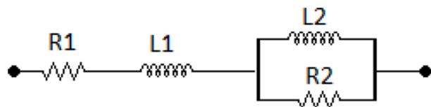  
Fig. 1. Subtransient impedance representation

a) an input data file for the JMARTI SETUP routine should be created. This file contains the geometry of the line and conductor data, three lines of frequency data and one line specifying the output file name.

The first line of the frequency data that bears parameter FREQTRAN, should be replaced by the following line: $INSERT, LINE1.INS. The $INSERT is an EMTP-ATP command that inserts the LINE1.INS file into the input data file. The LINE1.INS file contains the value of the parameter FREQTRAN as required by the frequency scan.

The line specifying the output file name should be replaced by the following line: $INSERT, LINE2.INS, where LINE2.INS is an ASCII file that bears the name of the output file. In this way the name of the output file is changed for each frequency of the frequency sweep.

a) A Fortran 2003 program was written with the purpose of generating LINE1.INS and LINE2.INS files and calling the JMARTI SETUP routine for each frequency. The program execution produces a set of output files, which will be used by the HFS routine.   
b) The program execution produces a set of output files, which will be used by the HFS routine.

# 2.3. Non-linearities in the external area

If the behavior of a nonlinear component of the external area must be taken into account, it should not be included in the FDNE.

# 2.4. Frequency sweep of the external area

The admittance matrix Y(ω) of the external area is calculated column by column in phase coordinates due to the asymmetries of the transmission lines. This is carried out executing the HFS routine as many times as there are columns.

In the HFS input data file the user should model all the sections of each transmission line. This is done by including the names of the JMARTI SETUP routine output files corresponding to all the sections and to the frequency at which the phasor solution is being executed as well. Each output file is included using the $INSERT command of the EMTP-ATP.

Also, in the HFS input data file the user should include single-phase voltage sources of 1 V amplitude whose frequencies varies according to the values of the frequency sweep. For each frequency, the voltage source is applied to one phase of the boundary bus and the remaining phases are shorted to ground. This is repeated for the remaining phases of the boundary bus. In this way, each column of the Y(ω) is obtained as a function of frequency.

A Fortran 2003 program was written with the objective of generating the ASCII files with the voltage sources mentioned above. These files should be included in the HFS input data file with the $INCLUDE command of the EMTP-ATP.

# 3. Admittance Matrix Fitting

Each element of Y(ω) is approximated by a rational function in a pole-residue form using the Matrix Fitting Toolbox package [5–9]. The routines VFdriver.m and RPdriver.m were used to obtain the rational approximations and to guarantee the passivity of the fitted matrix Y (ω). The admittance matrix of the external area is symmetric, thus it can be realized in the form of multi-terminal π-equivalent circuits, as shown in Fig. 3 for the case of a three-phase boundary bus.

The admittances of Fig. 3 are derived using (1).

$$
y _ {i i, \pi} = \sum_ {j = 1} ^ {N} Y _ {i j, f i t} \quad y _ {i j, \pi} = - Y _ {i j, f i t} \tag {1}
$$

where N is the number of phases of the boundary bus. Since $\mathrm { Y _ { i j , f i t } }$ is in the pole-residue form then (1) also leads to rational functions in the pole-

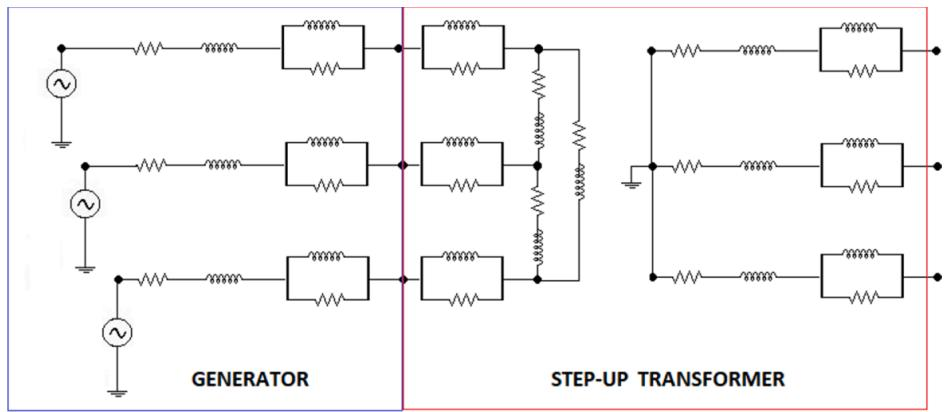  
Fig. 2. Generator and transformer representation

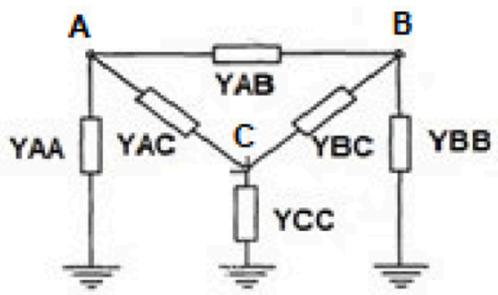  
Fig. 3. Multi-terminal π-equivalent circuits

residue form for $\operatorname { y } _ { \mathrm { i i } , \pi }$ and $\operatorname { y _ { i j , \tau } }$ π.

Matrix Fitting Toolbox creates a SER structure with the information of the fitted matrix $\mathtt { Y } _ { \mathrm { f i t } } ( \omega )$ . A routine which uses the SER structure was written to obtain the rational functions of the branches of the π circuits. This routine generates as many output files as there are branches, each file containing the total real and complex poles as well as the corresponding residues.

# 4. Norton Equivalent Circuits

Reference [10] presents a procedure that converts each partial fraction of the rational approximation of any branch of the π circuits in Laplace domain into a differential equation in time domain. The trapezoidal rule of integration is applied to that differential equation, leading to a conductance in parallel with a history term current source. Considering all the partial fractions corresponding to a branch, a Norton equivalent circuit is obtained for that branch. This procedure has the following advantages: a) no special handling of complex poles is necessary, therefore avoiding a more complicated implementation and some loss of accuracy b) a single equivalent conductance for each branch of the π circuits is computed. This means less processing time when compared to those approaches based on the fitting of any particular circuit structure with many parallel branches.

The main results presented in [10] are reproduced below. The relationship between current I(s) and voltage V(s) of any branch of the π circuits can be written in Laplace domain as:

$$
I (s) = \left(\sum_ {k} \frac {a _ {k}}{s - c _ {k}}\right) V (s) \tag {2}
$$

where: $\mathbf { a } _ { \mathrm { k } }$ is the residue and $\mathbf { c _ { k } }$ is its associated pole, which are either real quantities or come in complex conjugate pairs.

For the case of a real pole, (3) and (4) are the i-th partial fraction in the frequency and time domain.

$$
I _ {i} (s) = \frac {a _ {i}}{s - c _ {i}} V (s) \tag {3}
$$

$$
\frac {d I _ {i} (t)}{d t} = c _ {i} I _ {i} (t) + a _ {i} V (t) \tag {4}
$$

Applying the trapezoidal rule in (4) results:

$$
I _ {i} (t) = \operatorname {h i s t} _ {i} (t - \Delta t) + G _ {i} V (t) \tag {5}
$$

where hist (t-Δt) is the history term current source and $\mathrm { G _ { i } }$ is the associated parallel conductance, which are calculated as:

$$
h = \frac {\Delta t}{2}; \quad h i s t _ {i} (t - \Delta t) = \frac {(1 + h c _ {i}) I _ {i} (t - \Delta t) + h a _ {i} V (t - \Delta t)}{1 - h c _ {i}}
$$

$$
G _ {i} = \frac {h a _ {i}}{1 - h c _ {i}}
$$

For the case of a pair of complex conjugate poles, the two partial fractions can be arranged as follows:

$$
I _ {j} (s) = \left(\frac {a _ {j}}{s - c _ {j}} + \frac {a _ {j} ^ {*}}{s - c _ {j} ^ {*}}\right) V (s) = \left(\frac {M s + N}{s ^ {2} + P s + Q}\right) V (s) \tag {6}
$$

where: $\mathbf { a } _ { \mathbf { j } } = \mathbf { m } + .$ jn and ${ \bf c _ { j } = p }$ +jq; *denotes conjugate; M=2m; N=-2mp-2nq; P=-2p; ${ \mathsf { Q } } { = } { \mathsf { p } } ^ { 2 } { + } { \mathsf { q } } ^ { 2 }$

In the time domain (6) becomes:

$$
\frac {d ^ {2} I _ {j} (t)}{d t ^ {2}} + P \frac {d I _ {j} (t)}{d t} + Q I _ {j} (t) = M \frac {d V (t)}{d t} + N V (t)
$$

This second order differential equation can be converted to a firstorder system by introducing new variables:

$$
I _ {j} (t) = I _ {j} (t); \quad X _ {j} (t) = \frac {d I _ {j} (t)}{d t} - M V (t) \tag {7}
$$

$$
\frac {d I _ {j} (t)}{d t} = X _ {j} (t) + M V (t) \tag {8}
$$

$$
\frac {d X _ {j} (t)}{d t} = - Q I _ {j} (t) - P X _ {j} (t) + (N - M P) V (t) \tag {9}
$$

Applying the trapezoidal rule of integration in (8) and (9) results:

$$
I _ {j} (t) = \operatorname {h i s t} _ {j} (t - \Delta t) + G _ {j} V (t) \tag {10}
$$

$$
\begin{array}{l} X _ {j} (t) = \beta_ {1} X _ {j} (t - \Delta t) \\ + \beta_ {2} I _ {j} (t - \Delta t) \\ + \beta_ {3} V (t - \Delta t) + \beta_ {2} I _ {j} (t) \\ + \beta_ {3} V (t) \tag {11} \\ \end{array}
$$

where histj (t-Δt) is the history term current source and ${ \bf G } _ { \mathrm { j } }$ is the associated parallel conductance, which are calculated as:

$$
\begin{array}{l} h i s t _ {j} (t - \Delta t) = \frac {(1 + h \beta_ {2}) I _ {j} (t - \Delta t) + h (1 + \beta_ {1}) X _ {j} (t - \Delta t)}{1 - h \beta_ {2}} \\ + \frac {h (M + \beta_ {3}) V (t - \Delta t)}{1 - h \beta_ {2}} \\ \end{array}
$$

$$
G _ {j} = \frac {h (M + \beta_ {3})}{1 - h \beta_ {2}}
$$

$$
\beta_ {1} = \frac {1 - h P}{1 + h P}; \quad \beta_ {2} = \frac {- h Q}{1 + h P}; \quad \beta_ {3} = \frac {h (N - M P)}{1 + h P}
$$

The Norton equivalent circuit for any branch of the π circuits is obtained adding all equations (5) for all real poles on the one hand and all eqs. (10) and (11) for all complex poles on the other hand. As a result, an equivalent equation to (2) in time domain is obtained:

$$
I (t) = \operatorname {h i s t} _ {T} (t - \Delta t) + G _ {T} V (t) \tag {12}
$$

where:

$$
h i s t _ {T} (t - \Delta t) = \sum_ {i} h i s t _ {i} (t - \Delta t) + \sum_ {j} h i s t _ {j} (t - \Delta t)
$$

$$
G _ {T} = \left(\sum_ {i} G _ {i} + \sum_ {j} G _ {j}\right)
$$

It is important to remark that this procedure requires a fixed time step length.

For the case of a three-phase boundary bus the FDNE is shown in Fig. 4. The power frequency Norton current sources

IAN, IBN, ICN represent the steady state operation of the external area.

# 5. Norton Equivalent Implementation

There is no built-in model of a frequency-dependent network equivalent in the EMTP-ATP program. So, the procedure described in Section 4 is implemented using three options of the EMTP-ATP program, in order to create “user models”. These options are: Local model and Foreign submodel of the MODELS, Type-69 Device of the TACS.

# 5.1. Local model in MODELS

MODELS of the EMTP-ATP program is a general technical description language targeted to time domain simulations [11]. MODELS allows the user to develop two kinds of models: control-type components and circuit-type components.

Two procedures should be defined for each model: a) the initialization procedure (INIT) which determines the initial conditions of the model. This procedure is executed only once. b) the execution procedure (EXEC) which contains the programming of the model. This procedure is executed at every time step.

A generic model of any branch of the π circuits is written in MODELS for the calculation of the history term current source based on the equations of Section 4.

The input data of the generic model are the total number of real and complex poles and the values of the corresponding poles and residues. The output of the generic model is the history term current source, modelled as a type-60 source in the data case of the EMTP-ATP.

For each branch of the π circuits, an instance of the generic model is created using the USE statement of the MODELS language. This statement supplies the input data to the INIT procedure. After this initialization, the EXEC procedure is run at each time step in order to update the history term current source.

Due to the high number of poles arising from the fitting process, a Fortran 2003 program was written in order to generate an ASCII file containing the programming of the generic model and its multiple instances, written in MODELS language.

The program also calculates the conductance of each branch of the π circuits and writes them to another ASCII file that fullfils the EMTP-ATP formats.

Both files are included in the data case of the EMTP-ATP using the $INCLUDE command.

# 5.2. Type-69 device in TACS

TACS is a part of the EMTP-ATP program, designed for transient analysis of control systems. TACS has the Type-69 device that calls the DEVT69.f routine in which the user can write his own model in Fortran or C Language. After the user has finished the programming of his own Type-69 device he must compile it with the EMTP-ATP, to create a new executable version of the program. Reference [12] describes the different steps that must be followed in order to compile the EMTP-ATP program.

The procedure of Section 4 for each branch of the π circuits is implemented utilizing the Type-69 device.

Due to the high number of poles arising from the fitting process, a Fortran 2003 program was written with the aim of generating an ASCII file. This file contains the values of the real and complex poles, and their residues for each branch of the π circuits. This file is included in the DEVT69.f routine. The program also calculates the conductance of each branch of the π circuits and writes them to another ASCII file which is included in the data case of the EMTP-ATP with the $INCLUDE command.

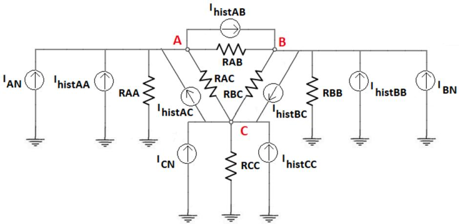  
Fig. 4. Three-phase boundary bus - FDNE

The calculation of all history term current sources corresponding to all branches of the π circuits is programmed in Fortran 77 and is performed in the DEVT69.f routine. These current sources are the outputs to TACS and are modelled as a type-60 source in the data case of the EMTP-ATP.

The Type-69 device works as a Fortran Function, therefore it returns only one current source to TACS at each time step. However, the implementation must give all the current sources to TACS. In order to overcome this difficulty, the programming includes an additional input argument to the Type-69 device that allows it to be called, in the same time step, as many times as there are outputs.

For a more efficient implementation, the programming is done in such a way that in the first call to the device 69 all the history term current sources are calculated, and their values are stored for the remaining calls to the device in the same time step.

Figure 5 shows a part of the TACS section in the data case with one call to the Type-69 device for the case of three-phase boundary bus. The name of the device is XILIN1 followed by its input arguments: time-step, simulation time, names of the nodal voltages of the bus, and finally the additional input argument named CLAVEK. The user´s name of one of the output current sources is I11.

# 5.3. Foreign submodel in MODELS

In order to implement the procedure of Section 4 for each branch of the π circuits, a foreign submodel option of the MODELS is used.

A foreign submodel is a separate program written in Fortran or C language and accessed through the programming interface FGNMOD.f of MODELS. The declaration of the foreign submodel must be included in another model (the “calling model”) into the MODELS section.

In the FGNMOD.f interface the user must program his model by fulfilling the following requirements: a) the calling arguments are four vectors: ixdata, ixin, ixout, ixvar, which contain the user model’s parameters, inputs, outputs and stored variables b) the user model must have two separate routines, one for the initialization and one for the execution of the model. The initialization routine is executed only once and the execution routine is run at every time step.

After the user has finished the programming of his own foreign submodel, he must compile it with the EMTP-ATP, in order to create a new executable version of the program [12].

Due to the high number of poles arising from the fitting process, a Fortran 2003 program was written with the aim of generating an ASCII file. This file contains the values of the real and complex poles and their residues for each branch of the π circuits. Such file is included in the initialization routine of the foreign submodel. The program also calculates the conductance of each branch of the π circuits and writes them to another ASCII file which is included in the data case of the EMTP-ATP with the $INCLUDE command.

The calculation of all history term current sources corresponding to all branches of the π circuits is programmed in Fortran 77 in the

execution routine.

Fig. 6 shows a part of the “calling model” in the MODELS section of the data case with the declaration of a foreign submodel.

The USE statement of the "calling model" provides the values of the "ixdata" and the values of the "ixin".

In the EXEC procedure of the "calling model", the foreign submodel is executed and its output variables are stored in "ixout". The "ixout" values are loaded as output variables of the “calling model”. Therefore, these output variables are the current source outputs to MODELS. These current sources are modelled as a type-60 source in the data case of the EMTP-ATP.

# 6. Case Studies

The procedure described in Section 4 is applied to a part of the 500 kV network of Uruguay shown in Fig. 7. The network behind BUS5 bus is considered as an external area, this constitutes the most severe test for the FDNE implementation. where: (1) Thevenin equivalent (2) bank of three single-phase transformers, 150/150/60 MVA and 500/150/31.5 kV (3) hydroelectric power plant with three generators, 111 MVA each and three step-up transformers, 111 MVA and 15/500 kV each (4) bank of three single-phase autotransformers, 200/200/60 MVA and 500/ 150/31.5 kV (5) thermal power plant with six aeroderivative gas turbine units, 63.5 MVA and 11.5 kV each, six step-up transformers, 64 MVA and 11.5/150 kV each (6) two banks of three single-phase autotransformers, 300/300/100 MVA and 500/150/31.5 kV each (7) two banks of three single-phase transformers, 425/425/140 MVA and 500/150/31.5 kV each, two banks of three single-phase autotransformers, 250/250/90 MVA and 500/150/31.5 kV each.

The Vector Fitting process is applied to the admittance matrix Y(ω) of the external area, seen from BUS5 bus. All the elements of the rational approximation $\mathtt { Y } _ { \mathrm { f i t } } ( \omega )$ have 4 real poles and 102 complex poles in the frequency range [5.0, 5000.] Hz.

The matrix fitting process gives a very accurate approximation of the Y(ω). As an example, Fig. 8 shows the magnitudes of the $\mathrm { Y } _ { 1 1 } ( \mathrm { \omega } )$ and $\mathtt { Y } _ { 1 1 }$ $\mathrm { f i t } ( \omega )$ elements. In this case, the maximum absolute error is equal to 8.805 $\times 1 0 ^ { - 5 }$ mho.

This section also shows how the admittance matrix depends on the transmission line model used. A few simulations of electromagnetic transients due to line and transformer energization are presented as well. The EMT simulations are carried out considering a detailed modelling of the entire sys-tem of Fig. 7 and the three different implementations of Section 5.

# 6.1. Admittance Matrix Comparison

The transmission lines have a predominant effect in the frequency response of the admittance matrix. As a result, a comparison of the effects on it due to the modelling of the transmission lines as continuously transposed and discretely transposed is done. Figs. 9 and 10 show the

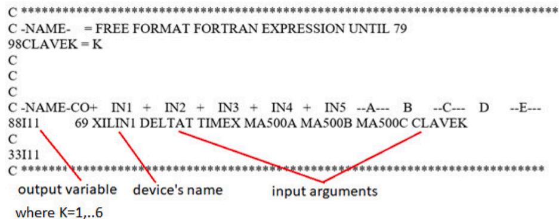  
Fig. 5. A call in TACS to Type-69 device

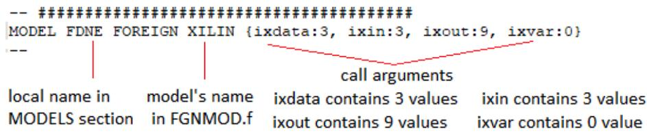  
Fig. 6. Declaration of a foreign submodel in MODELS section

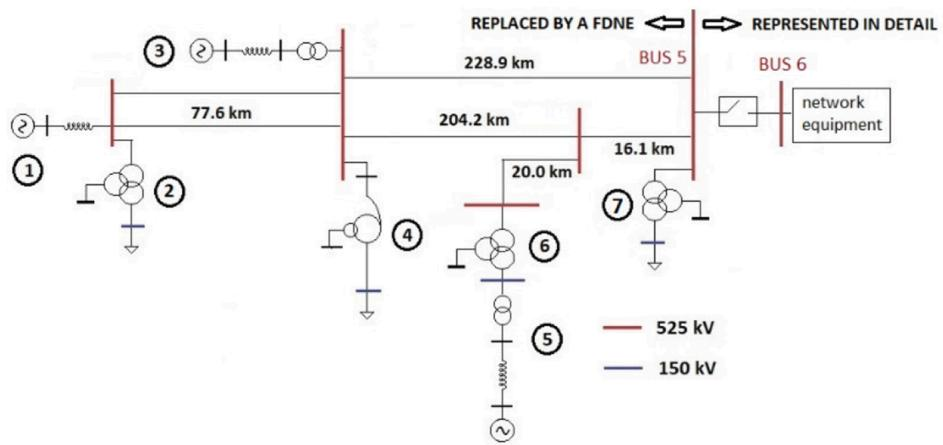  
Fig. 7. System under study

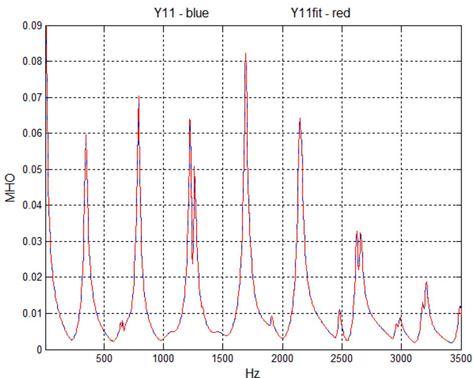  
Fig. 8. Comparison of $\mathbf { Y } _ { 1 1 }$ and $\mathbf { Y } _ { 1 1 }$ fit

magnitudes of one diagonal element and one off diagonal element of Y (ω) for both types of line modelling, in red color - discretely transposed, and in blue color - continuously transposed. Based on the results presented, the conclusion is that full symmetry between the phases leads to an inaccurate frequency response.

Fig. 11 and 12 show the magnitudes of all diagonal elements and all off diagonal elements of Y(ω) for the discretely transposed case. From these results, it can be concluded that the admittance matrix should be calculated column by column in phase coordinates instead of using

symetrical components.

# 6.2. Transmission Line Energization

In this case, the “network equipment” of Fig. 7 is a transmission line of 500 kV voltage rating, discretely transposed, length equal to 123.9 km and it has a shunt reactor bank of 50 MVAr at the receiving end.

The energization of this line is simulated with the receiving end open. The closing times of the circuit breaker poles correspond to the

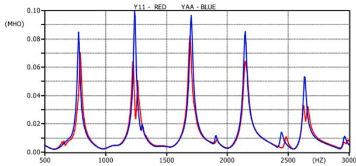  
Fig. 9. Magnitudes of one diagonal element of Y(ω)

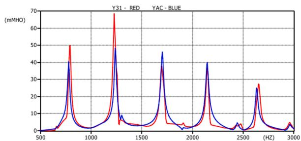  
Fig. 10. Magnitudes of one off diagonal element of Y(ω)

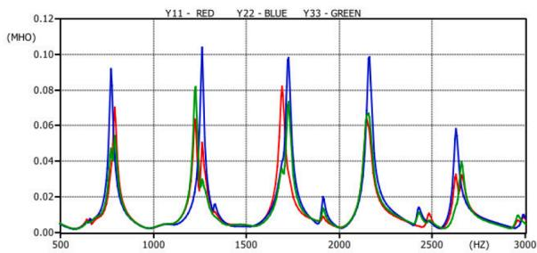  
Fig. 11. Magnitudes of all diagonal elements of Y(ω)

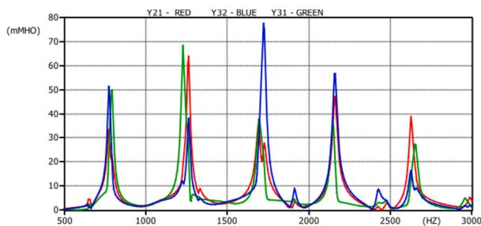  
Fig. 12. Magnitudes of all off diagonal elements of Y(ω)

voltage peaks of the respective phase-to-ground voltages. Fig. 13 shows the voltage of phase C at the receiving end resulting from the three FDNE implementations and a full system representation. The results obtained with the three different FDNE implementations show an excellent coincidence among them. These results also present a good agreement with those achieved through the detailed representation of the network.

# 6.3. Power Transformer Energization

In this case the “network equipment” of Fig. 7 is a bank of three single-phase transformers, 425/425/140 MVA and 500/150/31.5 kV. The hysteretic behavior of the magnetic core is taken into account by the nonlinear Type-96 element. Also, residual fluxes of +100%, 0%, -100% are considered.

The energization of this transformer is simulated by considering the simultaneous closing of the circuit breaker poles at the instant of time when the voltage of phase A passes through zero. Fig. 14 shows the inrush currents of phase A resulting from the three FDNE implementations and a full system representation. A coincidence can be observed among the results of the three different FDNE implementations.

It should be pointed out that the inrush currents obtained with the FDNE implementations are attenuated more than that obtained with the full system representation. This is due to the fact that the FDNE takes into account the frequency dependence of the modal matrix of the transmission line model. However, the full external area representation uses the JMARTI transmission line model, which works with a real and constant modal matrix.

It is important to note in relation to the nonlinear Type-96 element that: a) it is explicitly modeled in the “study area”. b) its performance is not affected by the fact of representing the external network with a FDNE.

# 6.4. Execution Times

The case studies are run on a notebook with Intel i5- ${ \cdot } 8 ^ { \mathrm { t h } }$ generation processor, 8 GB of RAM. For the energization of the transmission line the time step is 1.0 μs and the simulation time is 300 ms. For the energization of the power transformer the time step is 1.0 μs and the simulation time is 1.0 s.

From the CPU runtime point of view, Table 1 shows the CPU times required for the transmission line and power transformer energizations for each FDNE implementation and a full system representation.

For the transmission line energization it can be observed that: a) Local Model in MODELS consumes the most CPU time, about 56 times the CPU time consumed by the Full System Representation (FSR) b) Type-69 device consumes the least CPU time, about 38% of the CPU time consumed by the FSR c) Foreign submodel consumes 45.7% of the CPU time consumed by the FSR.

For the power transformer energization it can be observed that: a) Local Model in MODELS consumes the most CPU time, about 54 times the CPU time consumed by the FSR b) Type-69 device consumes the least CPU time, about 29% of the CPU time consumed by the FSR c) Foreign submodel consumes 35.4% of the CPU time consumed by the FSR.

An important finding is that the Type-69 device and the Foreign submodel are the most efficient ways to implement Norton Equivalent Circuits in the EMTP-ATP program.

# 7. Conclusions

This paper presents a methodology based on Norton equivalent circuits to obtain a frequency-dependent network equivalents.

This procedure consists of the following steps:

1) Calculation of the frequency dependent admittance matrix Y(ω) of the external area. The frequency domain characteristics are obtained by frequency scans using the Harmonic Frequency Scan (HFS) routine of the EMTP-ATP program.   
2) Each element of Y(ω) is approximated by a rational function in a pole-residue form using the Matrix Fitting Toolbox package.   
3) Matrix Y(ω) is symmetric, thus it can be realized in the form of multiterminal π-equivalent circuits. From the rational functions aforementioned in item 2), other rational functions corresponding to each of the branches of the π circuits are calculated.   
4) A mathematical procedure for converting each partial fraction in Laplace domain into a differential equation in time domain is described. The application of the trapezoidal rule of integration to that differential equation leads to a conductance in parallel with a history term current source. Considering all the partial fractions corresponding to a branch, a Norton equivalent circuit is obtained for that branch.

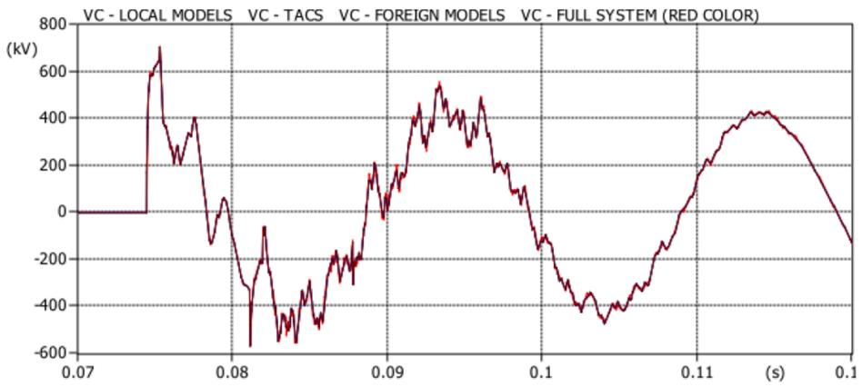  
Fig. 13. Comparison of phase C voltage transients

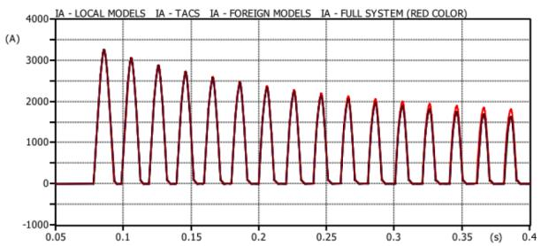  
Fig. 14. Comparison of phase A inrush currents

Table 1 Comparison of CPU Runtimes   

<table><tr><td rowspan="2">Implementation</td><td colspan="2">CPU runtime in seconds</td></tr><tr><td>Transmission Line</td><td>Power Transformer</td></tr><tr><td>Full System Representation</td><td>8.31</td><td>28.27</td></tr><tr><td>Local Model in MODELS</td><td>468.56</td><td>1583.58</td></tr><tr><td>Type-69 Device in TACS</td><td>3.17</td><td>8.20</td></tr><tr><td>Foreign Submodel in MODELS</td><td>3.80</td><td>10.00</td></tr></table>

In addition, the paper presents three different implementations of this methodology in the EMTP-ATP program.

To validate the procedure, some switching transient events are simulated in an electric utility 500 kV transmission system, considering a full system representation and the different FDNE implementations. The waveforms of the voltages and currents obtained from the simulations exhibit a very good agreement. The CPU times resulting from the simulations show significant savings in processing times when FDNE implementations B and C are used.

The following findings can be drawn from the work presented:

a) Frequency Dependent Network Equivalent is a powerful technique in order to save time and effort in EMT studies.   
b) The Matrix Fitting Toolbox Package is a robust and efficient method to approximate by rational functions a frequency-dependent admittance matrix.   
c) The procedure presented in [10] has the advantage of using few conductance branches compared to those based on the fitting of any particular circuit structure. Also, the procedure does not involve the special handling of complex poles.   
d) The Type-69 device and the Foreign submodel are the most efficient ways to implement Norton Equivalent Circuits in the EMTP-ATP program.   
e) The procedure described in this paper can be applied to any number of boundary bus bars. For example, for a ring system there are two

three-phase boundary bus bars leading to a 6 × 6 admmitance matrix.

It would be very useful to have a built-in model of a frequencydependent network equivalent in the EMTP-ATP program. In relation to this point some lines of future work are suggested:

a) The elaboration of a FDNE built-in model based on some of the implementations presented in this work. This model will have as input data the poles and residues of each of the branches of the PI circuits. Currently, this input data is obtained with the Matrix Fitting Toolbox package developed in MATLAB.   
b) To create a program equivalent to the Matrix Fitting Toolbox in Fortran or C language to be incorporated as a built-in model in EMTP-ATP. The input data will be the frequency dependent admittance matrix Y(ω). The output of the model will be the poles and residues of the rational approximations.

# CRediT authorship contribution statement

Claudio Saldana: ˜ Conceptualization, Methodology, Software, Writing – original draft, Writing – review & editing. Graciela Calzolari: Conceptualization, Methodology, Software, Writing – original draft, Writing – review & editing.

# Declaration of Competing Interest

The authors declare that they have no known competing financial interests or personal relationships that could have appeared to influence the work reported in this paper.

# References

[1] Alternative Transients Program (ATP)-Rule Book, Canadian /American EMTP User Group, 1987-92.   
[2] H.W. Dommel, EMTP Theory Book, Microtran Power System Analysis Corporation, Vancouver, Canada, 1992.   
[3] CIGRE WG 13.05, The Calculation of Switching Surges, ELECTRA N◦ 32 (1974) 17–42.   
[4] CIGRE Technical Brochure N◦ 766, “Network Modelling for Harmonic Studies”, April 2019.   
[5] B. Gustavsen, A. Semlyen, Rational Approximation of Frequency Domain Responses by Vector Fitting, IEEE Trans. Power Delivery 14 (July 1999) 1052–1061.   
[6] B. Gustavsen, Improving the Pole Relocating Properties of Vector Fitting, IEEE Trans. Power Delivery 21 (July 2006) 1587–1592.   
[7] D. Deschrijver, M. Mrozowski, T. Dhaene, D. De Zutter, Macromodeling of Multiport Systems Using a Fast Implementation of the Vector Fitting Method, IEEE Microwave and Wireless Components Letters 18 (June 2008) 383–385.   
[8] A. Semlyen, B. Gustavsen, A Half-Size Singularity Test Matrix for Fast and Reliable Passivity Assessment of Rational Models, IEEE Trans. Power Delivery 24 (January 2009) 345–351.

[9] B. Gustavsen, Fast Passivity Enforcement for Pole-Residue Models by Perturbation of Residue Matrix Eigenvalues, IEEE Trans. Power Delivery 23 (October 2008) 2278–2285.   
[10] X. Lin, System Equivalent for Real Time Digital Simulator, Dept. Electr. and Comput. Eng., Univ. of Manitoba, Winnipeg, Canada, 2010. Ph.D. dissertation.   
[11] L. Dub´e, "Users Guide to MODELS in ATP", April 1996.   
[12] O.P. Hevia, "Compilacion ´ del ATP al alcance del usuario", Revista Iberoamericana del ATP, No 2, 2002.

# Further reading

[1] B. Gustavsen, H.M. Jeewantha De Silva, Inclusion of Rational Models in an Electromagnetic Transients Program: Y-Parameters, Z-Parameters, S-Parameters, Transfer Functions, IEEE Trans. Power Delivery 28 (April 2013) 1164–1174.   
[2] T. Moreira Campello, S.L. Varricchio, G. Taranto, Representation of multiport rational models in the ATP – Lumped network results, in: Proceedings of Simposio, Brasileiro de Sistemas Eletricos, IEEE, 2018.   
[3] S. Grivet – Talocia, B. Gustavsen, Black-Box Macromodeling and its EMC Applications, IEEE Electromagnetic Compatibility Magazine 5 (2016).