# Machine-Learning-Reinforced Massively Parallel Transient Simulation for Large-Scale Renewable-Energy-Integrated Power Systems

Tianshi Cheng , Member, IEEE, Ruogu Chen , Graduate Student Member, IEEE, Ning Lin , Senior Member, IEEE, Tian Liang , Member, IEEE, and Venkata Dinavahi , Fellow, IEEE

Abstract—Renewable energy systems (RESs) are pivotal in the transition to eco-friendly smart grids. The complexity and uncertainty of RESs, driven by uncontrollable natural forces like sunlight and wind, bring challenges to integrating RESs into modern power systems. Electromagnetic transient (EMT) simulation is an effective method for studying the integration of RESs. Currently, the EMT simulation of RESs is limited to small-scale and lumped RES models due to the model complexity and nonlinearity, which cannot reflect the detailed characteristics of large-scale RESs in practice. This paper introduces a data-oriented, machine learningenhanced approach to achieve massively parallel EMT simulation on CPU-GPU, designed to efficiently model and simulate largescale, detailed RES. It incorporates data-driven machine learning modeling of RES via artificial neural networks and integrates these models using a data-oriented entity-component-system framework. The model training was based on reliable model data produced by traditional physical EMT models and the results were validated with MATLAB/Simulink. The RES components are grouped into a microgrid connected to a synthetic AC/DC system based on the IEEE 118-Bus system, achieving an acceleration performance of 400 times faster than traditional CPU nonlinear iterative computations with 2 million RES entities.

Index Terms—Artificial neural networks, data-oriented programming, entity-component-system, energy storage, electromagnetic transients, gated recurrent units, graphical processors, solar farms, wind farms, machine learning, renewable energy systems, parallel processing.

# NOMENCLATURE

ANN Artificial neural network.

CPU Central processing unit.

DFIG Doubly-fed induction generator.

Manuscript received 8 December 2023; revised 5 March 2024 and 25 April 2024; accepted 1 June 2024. Date of publication 5 June 2024; date of current version 27 December 2024. This work was supported in part by the Natural Science and Engineering Research Council of Canada (NSREC), in part by Mitacs, and in part by RTDS Technologies Inc. Paper no. TPWRS-01920-2023. (Corresponding author: Tianshi Cheng.)

Tianshi Cheng, Ruogu Chen, and Venkata Dinavahi are with the Department of Electrical and Computer Engineering, University of Alberta, Edmonton, AB T6G 2V4, Canada (e-mail: tcheng1@ualberta.ca; ruogu@ualberta.ca; dinavahi@ualberta.ca).

Ning Lin is with Powertech Labs Inc., Surrey, BC V3W 7R7, Canada (e-mail: ning3@ualberta.ca).

Tian Liang is with RTDS Technologies Inc., Winnipeg, MB R3T 2E1, Canada (e-mail: tian.liang@ualberta.ca).

Color versions of one or more figures in this article are available at https://doi.org/10.1109/TPWRS.2024.3409729.

Digital Object Identifier 10.1109/TPWRS.2024.3409729

ECS Entity-component-system.

EMT Electromagnetic transient.

GPU Graphical processing unit.

GRU Gated recurrent unit.

GSC Grid side converter.

MLP Multi-layer perceptron.

MSE Mean squared error.

PV Photovoltaic.

RES Renewable energy system.

RNN Recurrent neural network.

RSC Rotor side converter.

# I. INTRODUCTION

R ENEWABLE energy systems (RESs) are pivotal in thetransition to eco-friendly smart grids. Yet, the inherent transition to eco-friendly smart grids.Yet, the inherent complexity and uncertainty of these systems, arising from the unpredictability of natural forces such as sunlight and wind, present significant challenges in power system control and operation [1]. Detailed electromagnetic transient (EMT) simulation plays an important role in the analysis of control and operation for RES integrating power systems [2], [3]. However, there are more than 300,000 PV panels in a 100MW solar power farm [4], while each module may have an impact on the entire solar farm performance in partial shading scenarios [5], [6]. The same problem also exists for battery groups where the battery management system needs to take care of inconsistencies within the series battery array to maintain the optimal performance [7]. The traditional approach of detailed EMT simulations to address these challenges faces scalability issues due to the computational burden of modeling extensive RES components. For example, the nonlinearity of the PV model requires the Newton-Raphson method to assemble a huge global Jacobian matrix in each iteration, adding prohibitive computational complexity for largescale power systems with many PV arrays.

A common solution is to utilize massively parallel hardware: Graphical Processing Unit (GPU) to solve large groups of RES components concurrently [8], [9]. However, the nonlinearity of these models limited the solution methods and parallel efficiency as GPUs are not good at complex logics such as branch predictions; nonlinear methods such as the Newton-Raphson method are iterative and needs frequent data exchange between host and device memory, which brings significant overheads.

Furthermore, it is challenging to adapt and reimplement complex RES EMT models to highly efficient and scalable GPU codes, making it difficult to keep pace with rapidly evolving new energy and power storage technologies.

Therefore, this paper proposed to utilize ANN technologies to increase the efficiency of EMT simulation of large-scale systems with RES. ANN is a machine learning technology that can be conceptualized as a mathematical approach to multivariate nonlinear regression [10], which is suitable to reflect the nonlinear RES behaviors including partial shading of a PV array and battery charging/discharging behaviors. The recent breakthroughs and significant successes of artificial intelligence and machine learning in many areas such as weather forecasting [11], where the ANN-based model provides more accurate predictions and significantly accelerates the forecast process compared to the traditional numerical solutions. These machine-learning technologies have attracted significant attention from power system researchers as well. The deep-learning methods are popular for long-term and steady-state power system analysis such as power output forecast, stability assessments, and control [12], [13], [14]. The ANN technologies are also popular for transient stability analysis: [15] proposed an ANN-based method to approximate the nonlinear Lyapunov function which can simplify the control design for complex power systems; [16] proposed novel graph neural network structures with data-driven frameworks for transient stability assessments. However, the adoption of machine learning technologies in power system EMT simulation is still in its early stages. Some research works such as [17], [18], [19] have demonstrated the benefits of using ANN and RNN technologies to accelerate real-time EMT models on FPGAs. However these works are early explorations aimed to deal with traditional components in small-scale power systems for specific scenarios, and such research hasn’t been extended to RES modeling. Moreover, the integration of the ANN models into conventional EMT solvers is important for practical largescale simulation applications but it was not comprehensively explained in previous research works.

To apply machine learning ANN techniques in accelerating the simulation of large-scale renewable energy models and to extend the previous machine learning EMT model research towards a broader and more practical vision, this paper primarily elucidates two key propositions:

- The development and training strategies for neural network modeling of renewable energy generation and energy storage systems. Nonlinear time-variant components are modeled with the gated-recurrent unit (GRU) and timeinvariant components such as PV arrays are modeled with the feed-forward network which is also called multi-layer perceptron (MLP). The main focus is on modeling a PV array with multiple independent solar irradiance input variables since solar farms contain a lot of PV panels and each input irradiance may cause significant performance differences under partial shading scenarios. A Monte-Carlo method is proposed to serve as an effective and practical solution to generate sufficient data for training an accurate machine-learning model for these multivariate nonlinear components under simulation environments.

This paper employs data-oriented entity-componentsystem (ECS) architecture and GPU instancing strategies to incorporate the ANN model of RES into the EMT power grid simulation program, achieving a highly pragmatic and scalable CPU-GPU massively parallel computing solution. The importance of efficient implementation and integration of machine learning models is often underestimated. This oversight may obstruct the full realization of the models’ potential impact on both theoretical advancements and practical applications. Compared to previous research, the proposed design not only establishes a complex multivariate ANN model for photovoltaic panel arrays but also elevates the application of the model to a practical level. The integration of ANN models via ECS and plugin-based architectures enables seamless substitution for traditional RES models.

The model training was based on reliable model data produced by traditional physical EMT models and the results were validated with MATLAB/Simulink. The RES components are grouped into a microgrid connected to a synthetic AC/DC system based on the IEEE 118-Bus system, achieving an acceleration performance of 400 times faster than traditional CPU parallel nonlinear iterative computations with more than 2 million RES entities.

# II. RENEWABLE ENERGY SYSTEMS NEURAL-NETWORK-BASED MODELING

Traditional EMT models of RESs are mostly nonlinear and require Newton-Raphson’s nonlinear iterative method to solve a nonlinear differential-algebraic equation system. Such nonlinear characteristics not only bring heavy computational burden and convergence problems but also limit the efficiency of parallel computing. Machine-learning techniques such as neural networks can effectively capture the nonlinearity of the physics in RESs and provide an accurate approximation to reduce the complexity. It is a fully data-driven process without many human decisions. Moreover, compared to hand-crafted nonlinear or linearized equivalent models, which have various internal structures and complex computational processes, models trained using neural networks present a consistent matrix computation structure. This uniformity is particularly suited for GPU parallel computations. Thus, machine-learning reinforced RES models can efficiently leverage optimized GPU-accelerated linear algebra libraries such as CUBLAS and CUDNN, without concern for their varying types or internal structures. In addition, the ANN models use Float32 numbers which is faster than Float64 required by the Newton-Raphson method on GPUs. The following subsections introduced the basic concept of MLP and GRU neural networks used to model RESs and the training strategies of PV arrays, doubly-fed induction generator (DFIG) wind farms, and batteries.

# A. Multi-Layer Perceptron

The MLP is one of the simplest forms of feed-forward ANNs. It serves as a foundational technique in modern neural network machine learning, yet is sufficiently powerful to address many

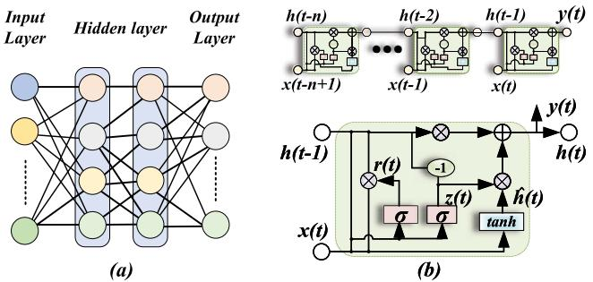  
Fig. 1. Neural network structures: (a) MLP neural network structure; (b) GRU neural network structure.

real-world nonlinear fitting problems. As shown in Fig. 1(a), it contains one input layer, multiple hidden layers, and one output layer. The state variables between hidden layers are connected by activation functions which must be nonlinear functions such as tanh, sigmod, or ReLU. MLP can be expressed by

$$
z = f (W \boldsymbol {x} + \boldsymbol {b}) \tag {1}
$$

where x is the input state vector, b is the bias vector, $W$ is the weight matrix, $f$ is an activation function and z is the output vector of each layer. Although the structure is simple, it is enough to approximate many nonlinear functions of EMT models. Training an MLP model is to solve an optimization problem defined by

$$
\min  _ {W, b} L (\boldsymbol {y}, \hat {\boldsymbol {y}}) \tag {2}
$$

where y is the output from training or validation dataset, $\hat { y }$ is the prediction data from trained model, and L is a loss function to compute the error between $\hat { y }$ and $y ,$ which can be a mean squared error (MSE) function as the following:

$$
M S E = \frac {1}{n} \sum_ {i = 1} ^ {n} \| \boldsymbol {y} _ {i} - \widehat {\boldsymbol {y}} _ {i} \| ^ {2} \tag {3}
$$

where n is the total number of samples in the dataset and $| | \pmb { y } _ { i } - \hat { \pmb { y } } _ { i } | | \ $ is the L2 normalization for ${ \bf { y } } _ { i } - \hat { \bf { y } } _ { i }$ . The MSE loss function squares the prediction errors, emphasizing larger deviations more significantly. This is particularly meaningful for training nonlinear models due to their complex and inconsistent output characteristics for different data inputs. By penalizing larger deviations more heavily, MSE helps ensure that the model does not overlook outliers, thereby enhancing its generalizability across varied data points.

Gradient descent is often used to solve this minimization problem, which is given by

$$
W _ {\text {n e w}} = W _ {\text {o l d}} - \alpha \nabla_ {W} L \tag {4}
$$

$$
\boldsymbol {b} _ {\text {n e w}} = \boldsymbol {b} _ {\text {o l d}} - \alpha \nabla_ {b} L, \tag {5}
$$

where the gradients $\nabla _ { W } L$ and $\nabla _ { b } L$ are computed by backpropagation, and α is a factor called learning rate which controls how large the old value change in the gradient direction. The principle of this MLP training process is also valid for other types of neural networks.

# B. Gated Recurrent Unit

GRU networks are based on MLP but have a more complex and specific structure for time-series inputs and outputs. As shown in Fig. 1(b), the typical GRU is expressed by

$$
\boldsymbol {z} _ {t} = \sigma \left(W _ {x z} \boldsymbol {x} _ {t} + U _ {h z} \boldsymbol {h} _ {t - 1}\right) \tag {6}
$$

$$
\boldsymbol {r} _ {t} = \sigma \left(W _ {x r} \boldsymbol {x} _ {t} + U _ {h r} \boldsymbol {h} _ {t - 1}\right) \tag {7}
$$

$$
\tilde {\boldsymbol {h}} _ {t} = \tanh  \left(W \boldsymbol {x} _ {t} + U \left(\boldsymbol {r} _ {t} \odot \boldsymbol {h} _ {t - 1}\right)\right) \tag {8}
$$

$$
\boldsymbol {h} _ {t} = \left(1 - \boldsymbol {z} _ {t}\right) \odot \boldsymbol {h} _ {t - 1} + \boldsymbol {z} _ {t} \odot \tilde {\boldsymbol {h}} _ {t} \tag {9}
$$

where ${ \boldsymbol { z } } _ { t }$ is the update gate output; $\mathbf { \nabla } _ { \mathbf { r } _ { t } }$ is the reset gate output; $\tilde { h } _ { t }$ is the output candidate hidden; $h _ { t }$ is the GRU unit output; $W _ { x z } , W _ { x r } , W$ are the input weights which are considered; $U _ { h z } , U _ { h r } , U$ are the recurrent weights and $\sigma$ is the sigmoid function. The update gate controls the degree to which the hidden state from the previous time step, $h _ { t - 1 }$ , should be updated with the new candidate hidden state, $h _ { t }$ . It is computed using the sigmoid function, which scales the output between 0 and 1. The reset gate is responsible for determining the amount of information from the previous hidden state, $h _ { t - 1 }$ , that should be retained when computing the output candidate, $\tilde { h } _ { t }$ . Similar to the update gate, it also employs the sigmoid function. The output candidate represents a new hidden state based on the input $\scriptstyle { \mathbf { - } } { \mathbf { } } { \mathbf { } } _ { t }$ and the previous hidden state $\boldsymbol { h } _ { t - 1 }$ . The reset gate, $\mathbf { \mathit { r } } _ { t } ,$ is used to control the influence of $h _ { t - 1 }$ on the output candidate. The output candidate is computed using the hyperbolic tangent function. The final output, $h _ { t } .$ , is computed by combining the previous hidden state, $h _ { t - 1 }$ , and the output candidate, $\tilde { h } _ { t } .$ , with the help of the update gate, $z _ { t } .$ . GRU networks are suitable for stateful time-variant components and can reflect more complex behaviors with the price of additional computing steps.

# C. Machine-Learning MLP Modeling for Photovoltaic Array

As shown in Fig. 2(a), a PV array is constituted by a seriesparallel connection of multiple photovoltaic panels. The major electrical characteristic of a PV array is its $I - V$ characteristic under various conditions.

The PV array has 16 independent solar irradiance $I _ { r r }$ for each PV panel and a port voltage input $V _ { t }$ . The output is chosen to $I _ { o u t }$ so that the model can be represented by a current source in EMT simulations. Unlike traditional PV panel performance rating and modeling that require ideal experimental data collected from laboratories, machine-learning methods can analyze any relevant data to capture and model PV array characteristics under various conditions, including partial shading. However, the data collected from real-world power grid operations are often insufficient for EMT simulations, as the current granularity of sampling is typically only suitable for steady-state and medium to long-term forecast purposes. In this case, previous machinelearning EMT research efforts often relied on traditional simulation systems to generate training data, which is a reliable data source and can help researchers achieve the purpose of accelerating traditional models. However, these systems usually involved fewer model inputs and scenarios, leading to a lack of emphasis on the data generation process itself. For multivariate

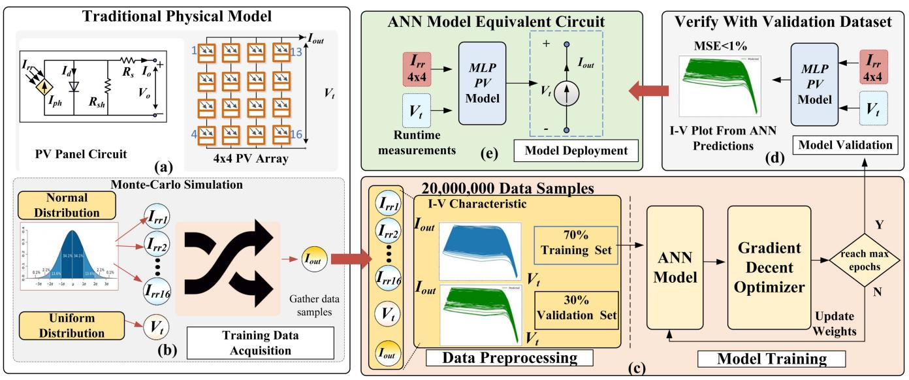  
Fig. 2. MLP modeling of a 4 × 4 PV array: (a) traditional model of nonlinear PV panel and the 4 × 4 PV array circuit; (b) Monte Carlo test setup for generating training data; (c) the data preprocessing and training processes of ANN machine learning; (d) model verification on validation dataset; (e) final PV model deploy as a voltage-controlled current source in EMT simulation.

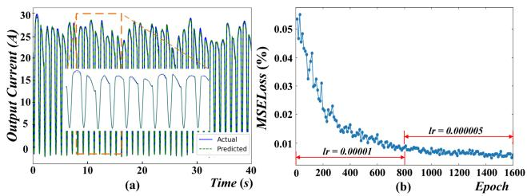  
Fig. 3. PV MLP model training results: (a) output current validation results on the validation data set; (b) MSE loss vs. training epochs.

nonlinear models such as the PV arrays, the first challenge is generating sufficient training data to cover the vast data space introduced by more and more variables.

As shown in Fig. 2(b), the Monte Carlo method is applied to effectively cover the vast state space of the PV array. Furthermore, the ability of Monte Carlo simulations to be easily parallelized enables the full exploitation of modern computing resources, greatly improving the efficiency of data generation. The training data are produced by traditional EMT simulation of the nonlinear PV model based on the methods and model parameters in [8]. Although the data are derived from simulated circuits, the accuracy of the physical model was verified with real-world experimental data [20] and can produce ideal data for training. The irradiance data for each PV array is generated randomly from a normal distribution with a mean of 1000 W/m2 and a standard deviation of 300 W/m2. Meanwhile, the port voltage is uniformly sampled from zero to the maximum operational voltage. Usually, using uniform distributions simplifies the data generation process as it ensures a consistent and even spread of data points, which are easier to manage and process. However normal distributions can better reflect real data sampling and help explore imbalanced dataset impacts on machine learning.

In practical scenarios, electrical equipment typically operates within its rated design conditions, only entering extreme operational states under exceptional conditions. Thus, employing a normal distribution to generate the data effectively reflects the real system’s general sampling characteristics, which may provide useful information for machine-learning EMT modeling research with real-world data in the future. In this imbalanced dataset, it is expected that, with the current use of the MSE loss function and associated training strategies, good model generalizability and accuracy can still be achieved. However, the prediction errors in areas with lower sampling probabilities might be greater than those in the densely sampled central regions. This results in the training dataset shown in Fig. 2(c), which covers the full range of operational voltage and a wide range of I  V characteristics under various irradiance combinations.

A training dataset with 20 million samples was obtained from the testing network. Because the model depends on many independent inputs, it is vital to use dynamic learning rates to achieve good fitting results. Meanwhile, the dropout strategy is used to improve the model’s generalization capability and with a dropout rate of 0.25, the error on the validation set was reduced by approximately 20% after using the dropout strategy.

After verifying the accuracy of the trained model with the validation dataset as shown in Fig. 2(d), the model can be deployed into the EMT simulation program to represent the original PV array. As shown in Fig. 2(e), the PV array is represented by a controlled current source for EMT circuit simulation. The output current is predicted by the MLP network comprising four hidden layers, and each layer has 64 cells.

With the proposed training data setup and machine-learning strategies, the trained MLP model yields satisfactory results as shown in Fig. 3(a) and (b). The MSE of the training dataset is

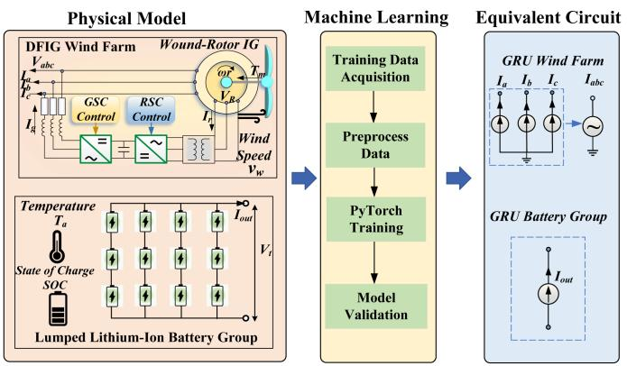  
Fig. 4. GRU-based equivalent circuit models for DFIG wind farms and Lithium-ion battery groups.

about 1e-5 while on the validation dataset, the MSE is around 7e-5, proving the feasibility of the data-driven machine-learningreinforced modeling for large-scale RESs.

# D. Machine-Learning GRU Modeling for Wind Farm and Energy Storage

The GRU models were trained using data from a DFIG wind farm and a Lithium-ion battery group simulation as shown in Fig. 4. The wind farm test circuit is from [21] and the battery is based on the model used in [9]. The models only use a single layer of GRUs to avoid error accumulations between neural networks. The general machine-learning procedure is similar to the PV array model.

The GRU models use uniformly distributed input variables for convenience. The major difference for GRU is that the GRU uses a sequence of time-series data as inputs so the continuous nature of input signals cannot be violated when generating the data. In this case, each set of parameters should produce a contiguous data series within a single Monte Carlo test execution, rather than adjusting parameters mid-run. To simulate fault scenarios, the faulty waveforms can be generated from pre-defined user cases. In this model training, an external three-phase-to-ground fault is added to the datasets used for training the wind farm’s GRU model, which takes up 5% of the total data samples.

Fig. 5 shows the MSE and validation results of the wind farm and Lithium-ion battery GRU models. Due to the uniform distributed datasets and the complexity of GRU, the training process is much shorter. It takes only 100 epochs to obtain accurate results for both models. Fig. 5(a) shows the comparison between current waveforms of a three-phase-to-ground short circuit fault, where the short circuit resistance is 0.01 Ω and the fault duration is 60 milliseconds. The short-circuit fault was applied at the grid connection port of the wind farm. It shows that the GRU model for wind farms successfully captured the fault event even though the fault waveform rarely appears in the dataset. The wind farm model needs a longer GRU input sequence to obtain an accurate GRU model as shown in Fig. 5(b). This is mainly caused by the coupled and time-varied three-phase AC electrical inputs.

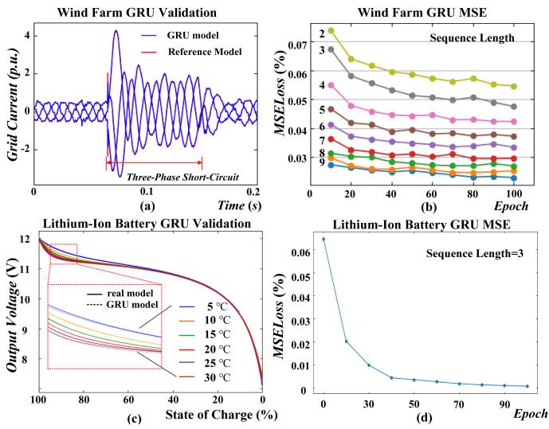  
Fig. 5. Model Results: (a) Phase-A current triggered by a three-phase-toground short circuit in the validation dataset. (b) Wind farm GRU Model MSE loss vs. epochs for varied input lengths. (c) Discharge curve validation of Lithium-ion battery GRU model. (d) Battery GRU Model MSE loss vs. epochs.

The inputs and outputs for the wind farm and battery group model are shown in Figs. 4 and 6(b) and (c).

# III. DATA-ORIENTED CPU-GPU HETEROGENEOUS PARALLEL SIMULATION FOR MACHINE-LEARNING RES MODELS

The model parameters of proposed machine-learningreinforced RES models for PV arrays, wind farms, and battery groups are summarized in Fig. 6. The following subsections will introduce a data-oriented approach for integrating these ANN models into power system transient simulations, aiming to achieve high performance through CPU-GPU heterogeneous acceleration.

# A. Data-Oriented EMT Simulation

Power system EMT simulation is based on circuit nodal analysis. The circuit nodal-voltage equation system is a distinct algebraic equation system derived from Kirchhoff’s Current Law. In the case of linear circuits composed of RLC components and sources, this equation system can be represented by

$$
\begin{array}{l} \sum \boldsymbol {i} = \boldsymbol {i} _ {L} + \boldsymbol {i} _ {C} + \boldsymbol {i} _ {R} \\ = G _ {L} \int \boldsymbol {v} d t + G _ {C} \frac {d \boldsymbol {v}}{d t} + G _ {R} \boldsymbol {v} = \boldsymbol {i} _ {s}, \\ \end{array}
$$

$$
G _ {L} = B _ {L} ^ {T} \left[ \frac {1}{\boldsymbol {L}} \right] B _ {L}, G _ {C} = B _ {C} ^ {T} [ \boldsymbol {C} ] B _ {C}, G _ {R} = B _ {R} ^ {T} \left[ \frac {1}{\boldsymbol {R}} \right] B _ {R}, \tag {10}
$$

where B is the oriented incidence matrix whose rows correspond to the physical components and columns correspond to nodes, v is the nodal voltage vector, L is the inductance, C is the capacitance and R is the resistance, is is the vector of current injections by sources and $G _ { R , L , C }$ are called admittance matrix.

If the continuous-domain integrals and differential terms in (10) are subjected to Laplace transform, the frequency-domain

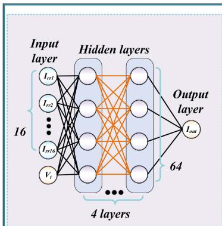

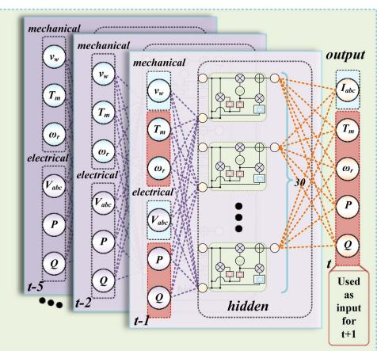

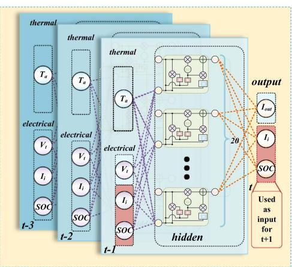

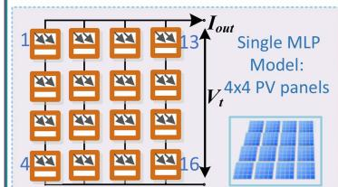

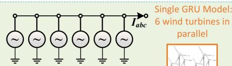  
（b）

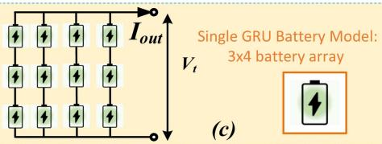  
Fig. 6. Proposed machine-learning-reinforced RES models parameters: (a) MLP model for PV arrays; (b) GRU model for DFIG wind farms; (c) GRU model for Lithium-ion battery groups.

equations required for power system steady-state and transient stability analysis are obtained. On the other hand, if discretization methods such as the Trapezoidal Rule are applied, the discrete equations for EMT simulations are derived, which can be expressed as

$$
Y \boldsymbol {v} ^ {n + 1} = \boldsymbol {I} _ {e q} ^ {n + 1}, \tag {11}
$$

$$
Y = \frac {\Delta t}{2} G _ {L} + \frac {2}{\Delta t} G _ {C} + G _ {R}, \tag {12}
$$

$$
\boldsymbol {I} _ {e q} ^ {n + 1} = \boldsymbol {i} _ {s} + \left(\frac {2}{\Delta t} G _ {C} - \frac {\Delta t}{2} G _ {L}\right) \boldsymbol {v} _ {n} - \boldsymbol {i} _ {L _ {n}} + \boldsymbol {i} _ {C _ {n}} \tag {13}
$$

where Y and In+1 ${ { I } _ { e q } ^ { n + 1 } }$ are admittance matrix and the equivalent current sources generated from Trapezoidal Rule discretization, respectively; $\Delta t$ is the time-step of simulation and n denotes the nth step of the simulation and all states at $n = 1$ should be known. Once the voltage vector $v ^ { n + 1 }$ is obtained through linear equation-solving methods such as LU Decomposition or Gaussian Elimination, the system can proceed to the next iteration using the recursive formula (13). This allows the discretized equation system to continue iterating for further time steps. More details about power system transient can be found in [22].

Based on (11)–(13), the power system EMT simulation program and solver are built using the Rust language and the Bevy ECS framework [23]. The adoption of the ECS architecture for EMT simulation was first proposed in [24]. ECS serves as a data-oriented architecture, emphasizing the efficient layout, storage, and retrieval of data.

Within the data-oriented ECS framework, data and methods are distinctly separate, reflecting the procedural style of C programming. However, this design choice is not a step

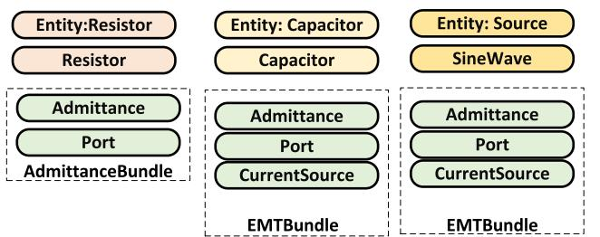

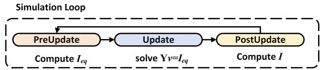

  
Fig. 7. (a) Entities of basic circuit components. (b) Basic simulation loop and plugins for proposed data-oriented EMT simulation program.

backward; rather, it provides unparalleled flexibility and performance, making it a preferred approach in modern C-style GPU programming.

As shown in Fig. 7(a), in the Bevy ECS framework, each electrical component and renewable energy source is abstracted as a unique entity, described by a set of distinct data components. For example, a “resistor” entity includes components like resistance value, admittance for circuit matrix solving, and circuit position.

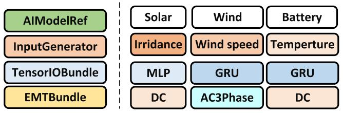  
Structure of an ANN-Based Model Entity   
Fig. 8. The entity variants for PV array, wind farm, and battery groups.

In contrast, a “capacitor” entity would have additional components like an equivalent current source, besides its capacitance value, equivalent admittance, and circuit position. Importantly, to unify the treatment in the solver for both three-phase and single-phase circuit elements, an entity with a three-phase topology component will automatically spawn three single-phase child entities to generate three-phase resistors, capacitors, inductors, and power sources. For some coupled three-phase components such as transformers and transmission lines, there is a special computing system that performs specialized computations on their three-phase components, while they still spawn singlephase child entities for interfacing with the solver. This avoids the need for special three-phase treatments, thereby maintaining solver consistency for single-line DC and three-phase AC power systems.

As shown in Fig. 7(b), the simulation loop consists of three stages, which is the same compared to traditional simulation tools such as PSCAD/EMTDC or other circuit simulators. However, the three stages are generic containers for systems and they serve as schedulers that can generate directed acyclic graphs for parallel executions of systems. All systems are grouped into plugins and users can choose the plugins they need at the runtime. This architecture highlights the ECS framework’s flexibility, promoting maximal data components and system reuse. Consequently, this makes integrating new algorithms and models more adaptable and efficient. The entity composition and the flexible plugin features in Bevy ECS will play a significant role in realizing massively parallel computing elegantly in the later subsections.

# B. ANN Model Integrations

Fig. 8 shows the entities of RES ANN building blocks for EMT simulation. Renewable sources like PV arrays also contain common components such as equivalent conductance and topological data. However, the computation of their equivalent current sources is determined by specialized components. For entities with conventional nonlinear model parameters, standard algorithms are auto-invoked to compute the PV output. Conversely, entities with artificial neural network model parameters are processed via a specialized GPU compute system, facilitated by a specific neural network plugin: GPUBatchPlugin.

Although the model inference is the same process for all ANN-modeled RES, inputs, and outputs cannot be the same due to different physical structures. Therefore, the preprocessing and postprocessing systems are implemented in specific wind, solar,

and battery plugins for convenience. In these model entities, essential environmental inputs like solar irradiance, wind speed, and ambient temperatures are managed by discrete components. These components are capable of interfacing with user-defined systems to acquire the relevant environmental data. For example, real weather data from a specific region can be integrated into a plugin that can generate these data components without caring about any detail in EMT simulation. Consequently, our proposed design ensures a smooth integration of geographical and weather information with electrical engineering simulation data.

# C. Heterogeneous Massively Parallel CPU-GPU Computing

The ECS framework stores homogeneous data components in cache-friendly contiguous arrays, making it optimal for parallel computing. However, a challenge arises since ECS component data reside on the CPU, and the GPU has its distinct memory management. Efficient data exchange between CPU and GPU is pivotal for achieving optimal performance. Executing ANN model units individually is not feasible in practice. To address this, a common strategy known as GPU instancing is employed, substantially enhancing performance. This concept of GPU instancing originates from graphical engine development. Initially, it was designed to render multiple 3D objects with identical mesh data in a single batched GPU call, such as rendering a forest composed of the same trees but with varied scales and positions. Analogously, in ANN models, the tree meshes are analogous to matrix weights, and the variations in scale and position correspond to different inputs, outputs, and scalar factors.

A GPUBatchManager is built as a singleton in this context, which manages all ANN model and IO tensor memories. At the initial stage, all ANN models will be scanned and registered in GPUBatchManager; then, Entities with the same ModelRef are grouped and allocate a global contiguous tensor memory space in GPUBatchManager to fit the inputs and outputs; all TensorIO components register their data to a specific memory address in these contiguous GPU memory space according to the type of ModelRef. Notice that all tensors must use CPU memory to communicate efficiently with the CPU EMT solver.

As shown in Fig. 9(a), in the PreUpdate stage, the CPU will process all ANN inputs and write input data to TensorIO which is a local memory pointer mapped to global tensor in GPUBatch-Manager. For GRU, due to the input being a time series, there is an additional input shift system set to store necessary data in the input tensors. Then, instead of processing TensorIO components on the entities one-by-one, the GPUBatchManager singleton will copy the global tensor to GPU and perform GPU scaling and inference by model type. Therefore, no matter how many ANN model entities are there, there is only one inter-device copy for all input and output tensors of each model type, which is the reason why tensors should be on host CPU memory to avoid expensive inter-device memory copy overhead. With the managed global tensors, batched model computation is achieved for each model type. Even when dealing with a few hundred ANN model entities, this approach provides a speed-up of more than 100 times compared to executing them individually.

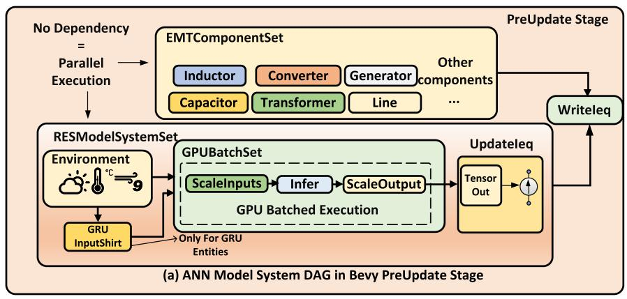

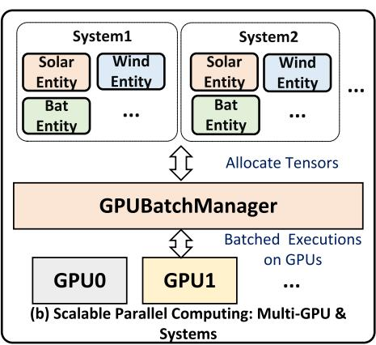  
Fig. 9. Implementation of GPUBatchPlugin: (a) Bevy system directed acyclic graph of ANN RES model computation in PreUpdate stage; (b) Parallel computing configuration for scaling to multiple circuits and GPUs.

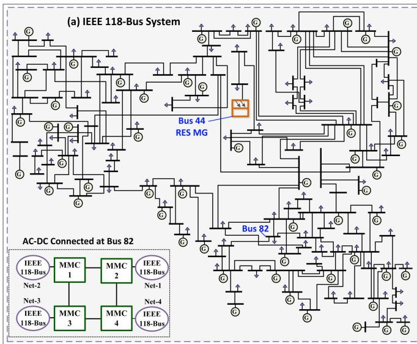

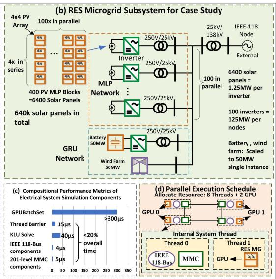  
Fig. 10. Test system: Synthetic IEEE 118-Bus-based large-scale AC-DC networks with machine-learning RES building blocks.

As shown in Fig. 9(b), it’s worth noting that the GPUBatchManager possesses the capability to associate models with multiple GPUs or streams. Furthermore, the GPUBatchPlugin can have an upgraded version to use an upper-level GPUBatch-Manager constructed above multiple ECS objects to manage multiple EMT simulation systems, further amplifying the scalability for GPU instancing. Meanwhile, the intrinsic parallel DAG scheduler of Bevy ECS allows the GPU computations for the ANN models to be executed in parallel with other traditional EMT components whenever feasible. With the power of the ECS framework and GPU instancing techniques, an elegant, adaptable, and highly scalable approach emerges for machinelearning enhanced heterogeneous CPU-GPU massively parallel EMT simulation.

# IV. STUDY CASE AND RESULTS

The study case is based on a synthetic AC-DC network based on the IEEE 118-Bus and CIGRE B4 DCS-1 MMC

systems, with a RES microgrid connected at Bus-44 as shown in Fig. 10(a). As shown in Fig. 10(b), the microgrid contains 100 PV farms, one wind farm, and one battery energy storage station. Each PV farm contains 400 MLP-modelled 4  4 PV arrays and is 6400  100 = 640, 000 PV panels in total. The microgrid is connected at Bus-13 with the 25 kV/138 kV transformer, which is typical in the transmission grid.

As shown in Fig. 10(c), due to the highly optimized EMT simulation program, the computing of AC/DC components, matrix equations solving, and thread synchronization processes only take 20% of overall computation time. The systems in GPUBatchSet take a minimal 300 μs regardless of the neural network type. This is not only due to heavy computing loads but also caused by much higher overhead to call GPU drivers and move data between CPU and GPU. Therefore, with finegrained parallel scheduling, the final computing performance is determined by this GPU ANN computing process. This is why tensor components must be on CPU and batch computing must be applied to minimize the overhead.

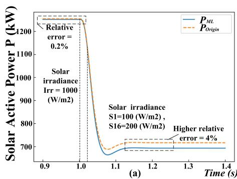

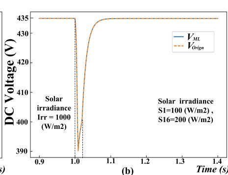

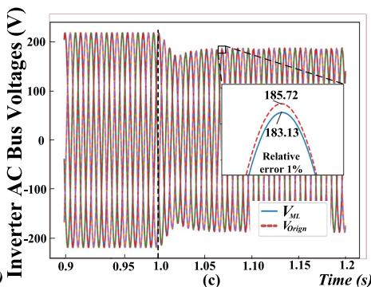

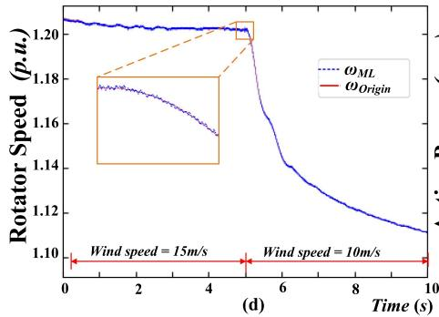

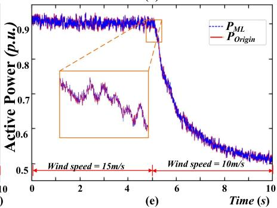

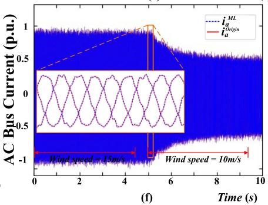  
Fig. 11. Simulation results of test scenarios: Scenario 1: (a) Active power output comparison between MLP and original PV model; (b) DC bus voltage of PV array inverter; (c) AC bus voltages of inverter. Scenario 2: (d) Rotor speed comparison between GRU and original DFIG wind farm model; (e) Active power output. (f) Phase-A AC bus current output.

To extend the scale and complexity of the simulation study case, four IEEE-118 systems are connected together with MMCs as shown in Fig. 10. This extends the scale to 2,560,000 machinelearning modeled PV panels and can demonstrate the full power of CPU-GPU massively parallel computing performance under the proposed data-oriented architecture. However, this is only used to extend the system scale and evaluate the parallel performance and the test results will be focused on the RES-related scenarios.

As shown in Fig. 10(d), 8 CPU threads and 2 GPUs are allocated to execute the test system cluster, which can be handled solely by a computing node in the ComputeCanada Cedar cluster. Due to the advanced data-oriented design, this heterogeneous complex computational resource allocation and scheduling are achieved without difficulty.

The test scenarios are mainly related to RES which is a partial shading scenario for PV farms and a wind speed change scenario for wind farms. The results will focus on RES model performance and related system voltage or current changes.

# A. Scenario 1: Partial Shading

This scenario sets the rated irradiance of $1 0 0 0 \mathrm { W / m ^ { 2 } }$ for all PV panels at the beginning of the simulation. At the 1 s of simulation time, irradiance of PV panels S1 and S16 to $1 0 0 \mathrm { { W / m ^ { 2 } } }$ and $2 0 0 \mathrm { { W / m ^ { 2 } } }$ , respectively. This data point is selected in a very sparsely sampled region and is not presented in the training data set, which is used to verify the generalizability of the ANN model deployed in EMT simulation environments. The solar irradiance decreased over 0.02 s, not instantaneously. With EMT simulation

steps between 20 to 50 μs, linear interpolation was used to reflect this gradual change, indirectly verifying the model’s smoothness and robustness during this dynamic process. Due to the 4x4 PV arrays being serial-connected and S1 and S16 being in separated columns, the power output should be approximately 50% of the rated power due to the output of serial-connected PV panels being determined by the panel with the lowest output current.

Results are shown in Fig. 11(a)–(c), which are measured from the inverter AC side of one PV farm. The PV array achieved very high accuracy with rated irradiance inputs, which only has a relative error of 0.2%. Under the partial shading scenario, the active power of the MLP PV array model drops from 1.25 MW to 0.69 MW, which has a 4% relative error compared to the original model output. The errors are acceptable for simulation and they highlight the effects of the imbalanced dataset with a normal distribution and the MSE loss function. In the dataset of 20 million training samples, the probability of sampling within the central rated area is $0 . 6 8 2 7 ^ { 1 6 } \approx 0 . 0 0 2 .$ , resulting in approximately 40,000 samples, whereas the partial shading data point in the region has an approximate sampling probability of $0 . 0 2 1 ^ { 2 } * 0 . 6 8 2 7 ^ { 1 4 } \approx 2 e - 6 .$ , yielding only approximately 40 samples. Consequently, the relatively higher error in the latter case is expected and aligns with previous theoretical analyses in Section II-C. Despite increased errors in the peripheral regions, the output waveform of the trained MLP model shows no significant deviation and aligns well with the characteristics of the PV model during both transient and steady states. This demonstrates the model’s robust generalization ability.

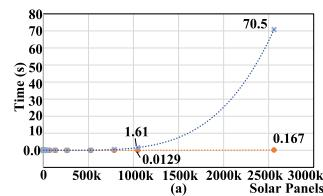

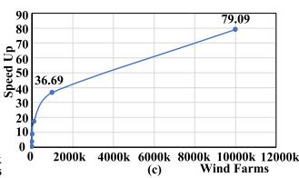

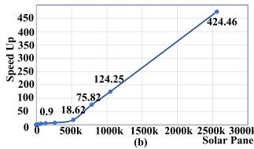

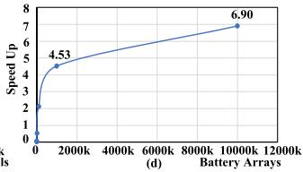  
Fig. 12. (a) Execution time per simulation step vs. number of PV panels of traditional serial CPU nonlinear model and GPU accelerated model; (b) GPU speedup vs. number of PV panels; (c) Wind farm GRU model GPU speed up vs. number of wind farms; (d) Battery array GRU model GPU speed up vs. number of battery arrays.

Given these findings, it is clear that merely using the dropout strategies and the choice of loss function are insufficient to deal with complex modeling problems and more complex real-world data sets. Future research should consider employing broader data science techniques, such as feature engineering, to preprocess datasets before training. This approach may be better to enhance the efficiency and precision of the models used for simulation and inference.

# B. Scenario 2: Wind Speed Step Change

This scenario sets the rated wind speed of 15 m/s for a wind farm at the beginning of the simulation. At the 5 s of simulation time, the wind speed changes from 15 m/s to 10 m/s. The results, as shown in Fig. 11(d)–(f), all exhibit low relative errors, each below 1%. This accuracy mainly comes from the wide range of data used to train the model. The more complex GRU structure also helps to increase the model accuracy for lumped DFIG wind farm systems. Although the GRU models do have better accuracy for time-series data, the current GRU models use fixed time steps due to the nature of the GRU structure, which limits its usage compared to the MLP PV array model.

# C. Performance Evaluation

The performance is measured from a node in the Cedar cluster of ComputeCanada, which has two NVIDIA Tesla V100 GPUs. Each Tesla V100 GPU has 5120 CUDA units.

The performance evaluation of the MLP PV model is performed on the test synthetic system. In Fig. 12(a) and (b), the performance metrics between the CPU-based Newton-Raphson PV array simulation and the GPU-accelerated machine learning alternative are compared. A spectrum of PV panel counts was evaluated to show the distinction between the traditional serial computing approach and the massively parallel GPUbased methodology. The conventional CPU-bound implementation retains its advantage up to the 16k PV panel threshold. Beyond this point, the GPU-facilitated solution demonstrates a consistently low execution time, outperforming the CPU-based

Newton-Raphson approach by an order of magnitude. Notably, a speed up exceeding 100 is observed when the system scales beyond 1000k PV panels, equating to approximately 62.5k MLP PV array entities.

For the extensive simulation involving 2560k PV panels, the serial CPU computation paradigm failed to deliver results within an acceptable timescale. In contrast, the machine learning-driven GPU methodology sustained its efficiency, culminating in an impressive 400x speed-up. This test was accomplished using a dual-GPU setup, as a single GPU is inadequate for managing such an expansive system.

In the evaluated test system, the limited quantity of wind farms and energy storage obscured the potential benefits of GPU acceleration. The performance of GRU models was assessed independently, as shown in Fig. 12(c) and (d). Despite the inherent nonlinearity in the physical models of wind farms and batteries, they were implemented via decoupled, non-iterative approaches, resulting in a proportional increase in speed up. However, it is noteworthy that the GRU models required approximately two to three times the execution time compared to MLPs of equivalent system scale. This disparity led to a relatively lower speed-up in Fig. 12(c) and (d).

# V. CONCLUSION

This paper explores machine-learning-based ANN models for RES components such as PV arrays, DFIG wind farms, and Lithium-ion battery groups, highlighting the significant advancements in machine-learning research and their applications in power system EMT simulations. An effective Monte Carlo simulation method based on traditional nonlinear EMT models has been proposed to address the challenges of generating training data for multivariate RES machine learning models. A data-oriented, heterogeneous CPU-GPU ECS architecture is proposed to realize flexible and fast massively parallel processing of these RES models in large-scale AC/DC power grid simulation. The proposed method has shown promising results for large-scale simulation, achieving high computational accuracy, decent GPU performance, and scalability across various system sizes.

Despite its promising results, there is considerable scope for enhancement in the model’s complexity and computational optimization. To derive machine-learning-reinforced digitaltwin models for real-world RES stations, training data can be swapped with real-world measurements, which requires collaboration with power generation enterprises for comprehensive on-site research. Moreover, although the model maintains the generalizability, the test results on imbalanced datasets indicate that there is substantial room for improvement in both the efficiency and accuracy of the machine learning process. This can be improved with state aggregation techniques, dictionary learning, and other advanced feature extraction methods which might be also useful to process real-world data sets more efficiently. Future work will focus on incorporating realworld measurements and enhancing the efficiency of large-scale RES model training with more sophisticated machine learning technologies.

The potential for practical application of this research is substantial. The RES machine learning models and the data-oriented architecture are not only applicable for EMT simulations but also useful for transient stability simulations. It is hoped that this work will serve as a foundation for future studies, continuing to push the boundaries of power system simulation methods.

# REFERENCES

[1] X. Liang, “Emerging power quality challenges due to integration of renewable energy sources,” IEEE Trans. Ind. Appl., vol. 53, no. 2, pp. 855–866, Mar./Apr. 2017.   
[2] S.-K. Kim, J.-H. Jeon, C.-H. Cho, E.-S. Kim, and J.-B. Ahn, “Modeling and simulation of a grid-connected PV generation system for electromagnetic transient analysis,” Sol. Energy, vol. 83, no. 5, pp. 664–678, 2009.   
[3] J. Marchand, A. Shetgaonkar, J. L. Rueda Torres, A. Lekic, and P. Palensky, “EMT real-time simulation model of a 2 GW offshore renewable energy hub integrating electrolysers,” Energies, vol. 14, no. 24, 2021, Art. no. 8547. [Online]. Available: https://www.mdpi.com/1996-1073/14/ 24/8547   
[4] UN Climate Change Conference, “100MW solar PV power plant at quaid-e-azam solar park, lal sohanra, cholistan, bahawalpur, Pakistan,” 2018. Accessed: Jun. 11, 2023. [Online]. Available: https://cdm.unfccc. int/Projects/DB/RWTUV1493361547.6/view   
[5] H. Oufettoul, N. Lamdihine, S. Motahhir, N. Lamrini, I. A. Abdelmoula, and G. Aniba, “Comparative performance analysis of PV module positions in a solar pv array under partial shading conditions,” IEEE Access, vol. 11, pp. 12176–12194, 2023.   
[6] A. Djalab, N. Bessous, M. M. Rezaoui, and I. Merzouk, “Study of the effects of partial shading on PV array,” in Proc. Int. Conf. Commun. Elect. Eng., 2018, pp. 1–5.   
[7] A. T. Elsayed, C. R. Lashway, and O. A. Mohammed, “Advanced battery management and diagnostic system for smart grid infrastructure,” IEEE Tran. Smart Grid, vol. 7, no. 2, pp. 897–905, Mar. 2016.   
[8] N. Lin, S. Cao, and V. Dinavahi, “Comprehensive modeling of large photovoltaic systems for heterogeneous parallel transient simulation of integrated AC/DC grid,” IEEE Trans. Energy Convers., vol. 35, no. 2, pp. 917–927, Jun. 2020.   
[9] N. Lin, S. Cao, and V. Dinavahi, “Massively parallel modeling of battery energy storage systems for AC/DC grid high-performance transient simulation,” IEEE Trans. Power Syst., vol. 38, no. 3, pp. 2736–2747, May 2023.   
[10] A. Burkov, The Hundred-page Machine Learning Book. Quebec City, QC, Canada: Andriy Burkov, 2019.   
[11] K. Bi et al., “Accurate medium-range global weather forecasting with 3D neural networks,” Nature, vol. 619, pp. 533–538, 2023.   
[12] H. Long, R. Geng, W. Sheng, H. Hui, R. Li, and W. Gu, “Small-sample solar power interval prediction based on instance-based transfer learning,” IEEE Trans. Ind. Appl., vol. 59, no. 5, pp. 5283–5292, Sep./Oct. 2023.   
[13] M. Cui, F. Li, H. Cui, S. Bu, and D. Shi, “Data-driven joint voltage stability assessment considering load uncertainty: A variational bayes inference integrated with multi-CNNs,” IEEE Trans. Power Syst., vol. 37, no. 3, pp. 1904–1915, May 2022.   
[14] Z. Yi et al., “An improved two-stage deep reinforcement learning approach for regulation service disaggregation in a virtual power plant,” IEEE Trans. Smart Grid, vol. 13, no. 4, pp. 2844–2858, Jul. 2022.   
[15] T. Zhao, J. Wang, X. Lu, and Y. Du, “Neural lyapunov control for power system transient stability: A deep learning-based approach,” IEEE Trans. Power Syst., vol. 37, no. 2, pp. 955–966, Mar. 2022.   
[16] T. Zhao, M. Yue, and J. Wang, “Structure-informed graph learning of networked dependencies for online prediction of power system transient dynamics,” IEEE Trans. Power Syst., vol. 37, no. 6, pp. 4885–4895, Nov. 2022.   
[17] S. Zhang, T. Liang, T. Cheng, and V. Dinavahi, “Machine learning based modeling for real-time inferencer-in-the-loop hardware emulation of highspeed rail microgrid,” IEEE Trans. Emerg. Sel. Topics Power Electron., vol. 3, no. 4, pp. 920–932, Oct. 2022.   
[18] S. Zhang, T. Liang, and V. Dinavahi, “Hybrid ML-EMT-based digital twin for device-level HIL real-time emulation of ship-board microgrid on FPGA,” IEEE J. Emerg. Sel. Top. Ind. Electron., vol. 4, no. 4, pp. 1265–1277, Oct. 2023.

[19] S. Cao, V. Dinavahi, and N. Lin, “Machine learning based transient stability emulation and dynamic system equivalencing of large-scale AC-DC grids for faster-than-real-time digital twin,” IEEE Access, vol. 10, pp. 112975–112988, 2022.   
[20] M. Eduard, M. Singh, and V. Gevorgian, “PSCAD modules representing PV generator,” Nat. Renewable Energy Lab. (NREL) Tech. Rep. NREL/TP-5500-58189, 2013. [Online]. Available: https://www.nrel.gov/ docs/fy13osti/58189.pdf   
[21] N. Lin and V. Dinavahi, “Exact nonlinear micromodeling for fine-grained parallel EMT simulation of MTDC grid interaction with wind farm,” IEEE Trans. Ind. Electron., vol. 66, no. 8, pp. 6427–6436, Aug. 2019.   
[22] V. Dinavahi and N. Lin, Parallel Dynamic and Transient Simulation of Large-Scale Power Systems. Berlin, Germany: Springer Nature, 2022.   
[23] Bevy Engine Contributors, “Bevy: A refreshingly simple data-driven game engine built in Rust,” 2023. Accessed: Nov. 20, 2023. [Online]. Available: https://bevyengine.org/   
[24] T. Cheng, T. Duan, and V. Dinavahi, “ECS-Grid: Data-oriented real-time simulation platform for cyber-physical power systems,” IEEE Trans. Ind. Informat., vol. 19, no. 11, pp. 11128–11138, Nov. 2023.

Tianshi Cheng ( Member, IEEE) received the B.Eng. degree in electrical engineering and automation from Southeast University, Nanjing, China, in 2017. He is currently working toward the Ph.D. degree in electrical and computer engineering with the University of Alberta, Edmonton, AB, Canada. From 2017 to 2018, he was a Substation Automation Engineer with NARI Group Corporation (State Grid Electric Power Research Institute), China. His research interests include electromagnetic transient simulation, transient stability analysis, real-time simulation, parallel processing, microgrids, and power electronics.

Ruogu Chen (Graduate Student Member, IEEE) received the B.Eng. degree in electrical engineering from the City University of Hong Kong, Hong Kong, in 2022. He is currently working toward the Ph.D. degree in electrical and computer engineering with the University of Alberta, Edmonton, AB, Canada. His research interests include real-time simulation, machine learning, digital circuit design, and field programmable gate arrays.

Ning Lin (Senior Member, IEEE) received the B.Sc. degree in applied electronics engineering and the M.Sc. degree in electrical engineering from Zhejiang University, Hangzhou, China, in 2008 and 2011, respectively, and the Ph.D. degree in energy systems from the University of Alberta, Edmonton, AB, Canada, in 2018. From 2011 to 2014, he was an Engineer in substation automation, FACTS, and HVdc control and protection. He is currently a Senior Power Systems Consultant with Powertech Labs Inc. His research interests include ac/dc grids, electromagnetic

transient simulation, hardware emulation, power system stability analysis, and heterogeneous high-performance computing of power electronics, and power systems on GPU.

Tian Liang (Member, IEEE) received the B.Eng. degree in electrical engineering from Nanjing Normal University, Nanjing, China, in 2011, the M.Eng. degree from Tsinghua University, Beijing, China, in 2014, and the Ph.D. degree in energy systems from the University of Alberta, Edmonton, AB, Canada, in 2020. He was with RTDS Technologies Inc., Winnipeg, MB, Canada. His research interests include real-time simulation of power systems, power electronics, artificial intelligence, field-programmable gate arrays, and system on chip.

Venkata Dinavahi (Fellow, IEEE) received the B.Eng. degree in electrical engineering from the Visvesvaraya National Institute of Technology, Nagpur, India, the M.Tech. degree in electrical engineering from Indian Institute of Technology Kanpur, Kanpur, India, and the Ph.D. degree in electrical and computer engineering from the University of Toronto, ON, Canada. He is currently a Professor with the Department of Electrical and Computer Engineering, University of Alberta, Edmonton, AB, Canada. His research interests include real-time simulation of

power systems and power electronic systems, electromagnetic transients, devicelevel modeling, artificial intelligence, machine learning, large-scale systems, and parallel and distributed computing. He is a Fellow of the Engineering Institute of Canada and the Asia-Pacific Artificial Intelligence Association.