# Nuclear-Powered Hybrid Energy System for Clean Hydrogen Production: Time-Step-Optimized Real-Time Multi-Domain Hardware Emulation

Weiran Chen, Member, IEEE, Xinyu Zhao, Student Member, IEEE, and Venkata Dinavahi, Fellow, IEEE.

Abstract—Increasing global emphasis on decarbonization and the proliferation of renewable energy, energy storage, and nuclear power is driving a surge of research interest into integrated sustainable energy modeling, simulation, operation and control. Traditional electromagnetic transient (EMT) methods typically discretize electrical networks using the trapezoidal rule. When coupled with the ordinary differential equations (ODEs) of other physical domains, however, the absolute stability region of the numerical integration scheme can shift, and discrepancies in time constants across subsystems further complicate integration of disparate models. While the demand for integrating EMT with multi-domain co-simulations is increasing, existing commercial EMT simulation tools either lack support for multi-domain physical coupling or are not specifically optimized for such hybrid simulations. To address this gap, this paper proposes a robust multiscale time-step estimation (RMTE) framework that enables real-time co-simulation of EMT networks and multidomain subsystems. The framework includes a fast, efficient, and adaptive approach for selecting the optimal maximum time-step across heterogeneous physical domains. The proposed method is validated through a case study involving small modular reactors (SMRs), wind farm, photovoltaics (PV) and low-temperature proton exchange membrane (PEM) electrolysis for clean hydrogen production. Real-time hardware co-emulation is achieved on a field-programmable gate array (FPGA)-based platform. The results demonstrate significant improvements in simulation efficiency and execution time.

Index Terms—Clean hydrogen, electromagnetic transients (EMT), field-programmable gate array (FPGA), hardware emulation, low-temperature electrolysis (LTE), multi-domain cosimulation, nuclear-renewable hybrid energy systems (N-RHES), photovoltaics (PV), proton exchange membrane (PEM), real-time systems, small modular reactor (SMR), wind farm.

# NOMENCLATURE

<table><tr><td>AE</td><td>Electrolyzer active area (cm2).</td></tr><tr><td>aH2O</td><td>Water activity.</td></tr><tr><td>C</td><td>Constant.</td></tr><tr><td>Cwa, Cwc</td><td>Water concentration in anode/cathode (mol/cm3).</td></tr><tr><td>Ci(t)</td><td>Delayed neutron density (1/cm3).</td></tr><tr><td>Dω</td><td>Water diffusion coefficient (cm2/s).</td></tr><tr><td>E</td><td>Open-circuit voltage (V).</td></tr><tr><td>E0</td><td>Standard electromotive force (V).</td></tr><tr><td>F</td><td>Faraday constant (C/mol).</td></tr></table>

This work was supported in part by the Alberta Innovates, Mitacs, and Natural Science and Engineering Research Council of Canada (NSERC). (Corresponding author: Weiran Chen.) W. Chen, X. Zhao, and V. Dinavahi are with the Department of Electrical and Computer Engineering, University of Alberta, Edmonton, Alberta T6G 2V4, Canada (e-mail: weiran4@ualberta.ca; xzhao22@ualberta.ca; dinavahi@ualberta.ca).

<table><tr><td>FH2ci, FH2co</td><td>Cathode inlet/outlet hydrogen flow rate (mol/s).</td></tr><tr><td>FH2Oai, FH2Oao</td><td>Anode inlet/outlet water flow rate (mol/s).</td></tr><tr><td>FH2Oci, FH2Oco</td><td>Cathode inlet/outlet water flow rate (mol/s).</td></tr><tr><td>FH2Od</td><td>Diffusive water molar flow rate (mol/s).</td></tr><tr><td>FH2Oeod</td><td>Electro-osmotic water flux (mol/s).</td></tr><tr><td>FO2ai, FO2ao</td><td>Anode oxygen flow rate (mol/s).</td></tr><tr><td>Fia, Fic</td><td>Water vapor activity at anode/cathode.</td></tr><tr><td>H2g, O2g</td><td>Cathode hydrogen/oxygen gas flow rate (mol/s).</td></tr><tr><td>Iin</td><td>Input current (A).</td></tr><tr><td>Iloss</td><td>Energy loss (W).</td></tr><tr><td>i</td><td>Current density (A/cm2).</td></tr><tr><td>i0</td><td>Exchange current density (A/cm2).</td></tr><tr><td>kao, kco</td><td>Flow coefficients for anode/cathode pipes.</td></tr><tr><td>MH2O</td><td>Molar mass of water (g/mol).</td></tr><tr><td>Mm,dry</td><td>Molar mass of dry membrane (g/mol).</td></tr><tr><td>MH2</td><td>Molar mass of hydrogen gas (g/mol).</td></tr><tr><td>n</td><td>Number of cells.</td></tr><tr><td>n(t)</td><td>Prompt neutron density (1/cm3).</td></tr><tr><td>nd</td><td>Electro-osmotic drag coefficient.</td></tr><tr><td>NH2</td><td>Net hydrogen production rate (mol/s).</td></tr><tr><td>NH2Oa, NH2Oc</td><td>Net water change rate (mol/s).</td></tr><tr><td>NO2</td><td>Net oxygen production rate (mol/s).</td></tr><tr><td>Pa, Pc</td><td>Channel pressures (Pa).</td></tr><tr><td>Pao, Pco</td><td>Outlet pressures (Pa).</td></tr><tr><td>PH2, PO2</td><td>Partial pressures (Pa).</td></tr><tr><td>PH2Oa</td><td>Water partial pressure at anode (Pa).</td></tr><tr><td>Pb</td><td>Hydrogen tank pressure (Pa).</td></tr><tr><td>Pbi</td><td>Initial hydrogen tank pressure (Pa).</td></tr><tr><td>R</td><td>Ideal gas constant (J/mol·K).</td></tr><tr><td>Relohm</td><td>Membrane resistance (Ω·cm2).</td></tr><tr><td>Tel</td><td>Electrolyzer temperature (K).</td></tr><tr><td>Tb</td><td>Hydrogen tank temperature (K).</td></tr><tr><td>tm</td><td>Membrane thickness (cm).</td></tr><tr><td>Va, Vc</td><td>Channel volumes (cm3).</td></tr><tr><td>Vh</td><td>Hydrogen tank volume (L).</td></tr><tr><td>Vel</td><td>Electrolysis voltage (V).</td></tr><tr><td>Velact</td><td>Activation overpotential (V).</td></tr><tr><td>Velohm</td><td>Ohmic overpotential (V).</td></tr><tr><td>yH2, yO2</td><td>Outlet molar fractions.</td></tr><tr><td>z</td><td>Compression factor.</td></tr><tr><td>ρ(t)</td><td>Core reactivity.</td></tr><tr><td>ρm,dry</td><td>Density of dry membrane (g/cm3).</td></tr><tr><td>λi</td><td>Decay constant (1/s).</td></tr><tr><td>λa,λc</td><td>Membrane water content.</td></tr><tr><td>λm</td><td>Membrane water content.</td></tr><tr><td>μF</td><td>Electrolysis efficiency.</td></tr><tr><td>σm</td><td>Membrane conductivity (S/cm).</td></tr><tr><td>α,α̅</td><td>Charge-transfer coefficients.</td></tr><tr><td>βi</td><td>Delayed neutron fraction.</td></tr><tr><td>Λ</td><td>Prompt neutron lifetime (s).</td></tr><tr><td>ΔGf</td><td>Gibbs free energy change (J/mol).</td></tr><tr><td>ωn,ωr,ωbw</td><td>Natural, resonant, and bandwidth frequencies (rad/s).</td></tr></table>

# I. INTRODUCTION

D RIVEN by the accelerating global deployment of renew-able energy sources, the emergence of distributed energy able energy sources, the emergence of distributed energy resources (DERs), the advancement of nuclear power technologies—particularly small modular reactors (SMRs) [1]– [4]—as well as the widespread adoption of electric vehicles and hydrogen production via electrolysis, the demand for intelligent power systems—with advanced capabilities in simulation, management, scheduling, and optimization—has grown significantly [5]–[7]. Consequently, research into increasingly complex and integrated hybrid energy systems has intensified. From the perspective of energy types, these systems span a wide range of physical domains and energy conversion processes, including nuclear energy (SMR), solar energy (photovoltaics), thermal energy (fossil fuel and geothermal power plants), mechanical energy (pumped hydro storage, wind farms, hydropower stations), and chemical energy (fuel cells, lithium-ion batteries), among others [8], [9]. Such diversity not only increases the complexity of system operation and design but also necessitates modeling and simulation techniques capable of addressing heterogeneous temporal and physical scales.

Recent initiatives from both the Natural Resources Canada and the United States Department of Energy have focused on advancing megawatt-scale, nuclear-assisted low-temperature electrolysis (LTE) for hydrogen production [10], [11]. Alongside these national efforts, increasing attention has been directed toward research on clean energy integration, hydrogen production and distribution, and their coupling with power grids from technical and economic perspectives. In particular, numerous studies have developed detailed proton exchange membrane (PEM) electrolyzer stack models, including auxiliary components such as water pumps and hydrogen storage tanks [12], [13]. In addition, [6] investigates power system scheduling strategies for hydrogen production incorporating nuclear energy, renewable sources, and the IEEE-118 bus system. Meanwhile, [14] provides a comprehensive overview of the potential, current status, and challenges associated with hydrogen production technologies. These developments highlight the need for multi-domain modeling across thermal, electrochemical, and electrical domains, prompting investigation into the capabilities of existing simulation methods, numerical frameworks, and their limitations.

In recent years, major commercial simulation platforms for power electronics and power systems have increas-

ingly expanded their capabilities to support multi-domain cosimulation. For instance, a hardware-in-the-loop (HIL) simulation platform was launched for battery management systems (BMS) [15]. Component libraries for mechanical and thermal modeling were introduced, and the functionality to include thermal simulation of semiconductor devices was extended [16]. For more complex modeling scenarios—particularly when using the aforementioned EMT tools—such as nuclear power plants or PEM electrolysis-based hydrogen production, system representations often rely on standard mathematical libraries for constructing domain-specific models [17], [18]. While various open-source tools—such as SMR simulators and the hydrogen economic evaluation programme, developed under the auspices of the International Atomic Energy Agency (IAEA)—provide simulation capabilities and offer Pythonbased interfaces for extensibility [19], they remain largely incompatible with conventional EMT simulation tools, thus limiting seamless co-simulation across domains.

Beyond the limitations of simulation tool compatibility, improvements can also be made at the level of numerical solvers. Classical EMT algorithms typically discretize the system using the Trapezoidal rule, simplify the network using Norton equivalents, and formulate node-voltage equations for resistiveinductive-capacitive-conductive (RLCG) networks [20]. However, this method is not well-suited for solving other physical systems described in ordinary or partial differential equations (ODEs or PDEs). A representative example is the Simulink® environment, where the electrical network solver operates independently from the global solver. Although global solvers are capable of handling most numerical challenges—including oscillations, divergence, and stability—they often lack the flexibility required in multi-domain coupled scenarios. Specifically, limitations arise in data exchange interfaces, time-step coordination, and numerical solutions. For instance, nuclear reactor core models typically yield stiff nonlinear ODEs that require implicit integration with iterative solvers, while thermalhydraulic systems have larger time constants, allowing for relatively coarser time-steps [21]. Photovoltaic (PV) models involve transcendental equations with strong nonlinearities that demand Newton-based iterations [22]. In contrast, the mechanical dynamics of wind turbine systems—such as doubly-fed induction generators (DFIGs)—can be solved using standard ODE methods, but their inertia constants are influenced by the rotor’s mechanical characteristics [23]. Consequently, it becomes evident that in multi-domain co-simulation scenarios, an optimized framework is urgently needed to improve the efficiency of simulation by refining the time-steps, solving methods, and data exchange protocols for each subsystem.

A representative optimization framework is the transient stability (TS)/EMT hybrid time-domain simulation framework [24]–[26], which optimizes time-step coordination and data exchange between electromechanical transients and EMT phenomena. Recent studies have explored a range of TS/EMT cosimulation strategies. The challenges and visions for intelligent grid co-simulation are outlined in [27]. A phasor-domain hybrid simulation approach for transmission and distribution networks is proposed in [28]. [29] summarizes key interfacing techniques for DER-based power systems, such as geographi-

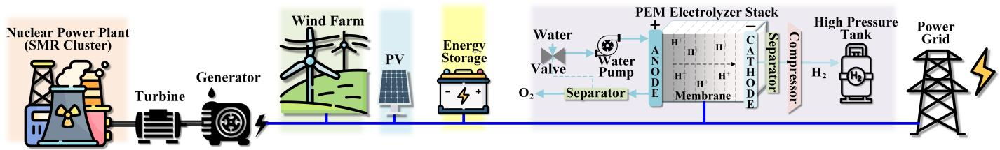  
Fig. 1. Conceptual diagram of the N-RHES illustrating multi-domain energy integration and EMT coupling.

cally distributed real-time co-simulation and power hardwarein-the-loop (PHIL) integration. Although extensive research and optimization efforts have been dedicated to TS/EMT cosimulation, the domain of EMT/multi-domain co-simulation remains relatively underexplored. In particular, nuclear power and hydrogen production models often exhibit characteristics that challenge conventional TS/EMT assumptions—such as the inability to employ ideal transformer models for V-I decoupling or to apply Thevenin-equivalent circuit representations. ´ Moreover, the disparate time constants, numerical integration schemes, and stiffness properties across different physical domains present additional barriers that warrant further systematic investigation.

To address the aforementioned research gaps, the contributions and innovations of this paper are as follows:

• Concerning simulation time-step adaptation: A frequency-scan-inspired time-domain method is proposed to determine a fast, convenient, and adaptive discrete simulation time-step. This approach approximates the absolute stability region of the current numerical integration scheme, enabling the identification of a theoretically optimal maximum time-step.   
• Concerning multi-domain interfacing: A data exchange framework for interfacing heterogeneous physical domains is developed, incorporating system identification techniques and an ω-periodic system stability criterion. To address mismatches in time constants and sampling rates, the framework employs a discrete-time adaptive step-size iteration method, ensuring robust and stable cosimulation across subsystems.   
• Concerning practical verification: The two aspects discussed above form the complete robust multiscale timestep estimation (RMTE) framework, which can be applied to multi-domain co-simulation. A case study involving EMT/nuclear-hydrogen-PV-wind farm multi-domain cosimulation is conducted and implemented on an fieldprogrammable gate array (FPGA)-based hardware platform, serving as a prototype for HIL experiments. The results demonstrate the significant acceleration and efficiency improvements enabled by the proposed methods.

The structure of this paper is organized as follows: Section II introduces the model construction and interface settings. Section III describes the proposed solution methodology. Section IV outlines the real-time hardware implementation process. Section V presents a comparative analysis of emulation results. Finally, Section VI provides the conclusion and future outlook.

# II. MULTI-DOMAIN MODELING OF AR-RENEWABLE HYBRID ENERGY SYSTEMS

The integration of nuclear energy with renewable sources for hydrogen production—collectively referred to as nuclearrenewable hybrid energy systems (N-RHES)—has been extensively investigated in both academia and industry. The incorporation of hydrogen production into energy systems not only minimizes electricity spillage, but also enhances overall economic viability [30]. Fig. 1 illustrates a high-level conceptual configuration of a nuclear-wind-PEM-based hydrogen energy system. This section details the mathematical formulations of each system and the design of their interconnection interfaces.

# A. Energy System Modeling

1) Nuclear Power Plant (Nuclear, Thermal-Hydraulic, and Mechanical Domain): The nuclear model is derived from the iPWR-based training simulator released by the IAEA, and is formulated as a power-flow-dominated 25th-order mathematical system [21]. The six-group point kinetic equation governing the nuclear thermal power is presented below:

$$
\left\{ \begin{array}{l} \dot {\boldsymbol {Y}} (t) = \boldsymbol {F} (t) \boldsymbol {Y} (t) \\ \boldsymbol {Y} (t) | _ {t = 0} = \boldsymbol {Y} _ {0} \end{array} , \right. \tag {1}
$$

$$
\boldsymbol {F} (t) = \left[ \begin{array}{c c c c} \frac {\rho (t) - \beta}{\Lambda} & \lambda_ {1} & \dots & \lambda_ {6} \\ \frac {\beta_ {1}}{\Lambda} & - \lambda_ {1} & 0 & 0 \\ \dots & 0 & \dots & 0 \\ \frac {\beta_ {6}}{\Lambda} & 0 & 0 & - \lambda_ {6} \end{array} \right], \tag {2}
$$

where $\boldsymbol { Y } \left( t \right) = \left[ n \left( t \right) , C _ { 1 } \left( t \right) , . . . , C _ { 6 } \left( t \right) \right] ^ { T }$ , F (t) is a timevarying coefficient matrix, and $Y _ { 0 }$ is the initial value. $n ( t )$ and $\rho ( t )$ can be regarded as approximately proportional to the output thermal power. The wide disparity in the magnitude of $\lambda _ { i }$ leads to significant stiffness in (1), rendering conventional numerical integration methods inadequate for solving the system. Moreover, $\rho ( t )$ is a key variable for interfacing with DERs and an external control variable that depends on multiple variables. The complete modeling procedure is not repeated here and can be found in [21]. For the purposes of the subsequent methodology, only the readily linearizable form in (2) is presented.

2) DFIGs, PV, and Battery (Electrical Domain): The DFIG is modeled using an asynchronous machine, consisting of high-order $\mathrm { ~ ( > ~ 7 ) ~ }$ electromagnetic equations and a secondorder mechanical equation. The PV model can be equivalently represented by a controlled current source using the Norton equivalent circuit. Essentially, DFIG, PV, battery and power grid fall within the TS/EMT modeling domain. As this area

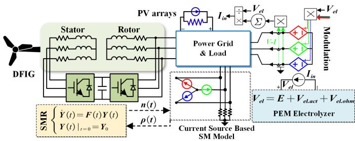  
Fig. 2. Coupling interface for multi-domain and EMT models (SM: synchronous machine).

has been extensively studied, it will not be elaborated further [23], [31].

3) Hydrogen Production via LTE and PEM Electrolysis (Electrochemical Domain): Following the modeling framework presented in [13], the electrochemical behavior of the PEM electrolyzer is described by the following electrode reactions: anode: $\mathrm { H } _ { 2 } \mathbf { O }  \frac { 1 } { 2 } \mathbf { O } _ { 2 } + 2 \mathbf { H } ^ { + } + 2 e ^ { - }$ , and cathode: $2 \mathrm { H } ^ { + } + 2 e ^ { - }  \mathrm { H } _ { 2 }$ . The anode and cathode of the PEM electrolyzer are modeled separately. First, the dynamic equations of oxygen and water at the anode are given as follows:

$$
\left\{ \begin{array}{c} N _ {O _ {2}} = F _ {O _ {2 a i}} - F _ {O _ {2 a o}} + O _ {2 g} \\ N _ {H _ {2} O _ {a}} = F _ {H _ {2} O _ {a i}} - F _ {H _ {2} O _ {a o}} - F _ {H _ {2} O _ {e o d}} - F _ {H _ {2} O _ {d}} \end{array} . \right. \tag {3}
$$

Using Faraday’s law of electrolysis, the generated oxygen is given by:

$$
O _ {2 g} = \frac {n I _ {i n}}{4 F} \eta_ {F}, \tag {4}
$$

where $\begin{array} { r } { \eta _ { F } ~ = ~ \frac { I _ { i n } - I _ { l o s s } } { I _ { i n } } . ~ N _ { O _ { 2 } } } \end{array}$ and $N _ { H _ { 2 } O _ { c } }$ further affect the pressure in the anode flow channel. According to the ideal gas law, this can be expressed as:

$$
P _ {a} = P _ {O _ {2}} + P _ {H _ {2} O _ {a}} = \frac {R T _ {e l} \left(N _ {O _ {2}} + N _ {H _ {2} O _ {a}}\right)}{V _ {a}}. \tag {5}
$$

At the anode outlet, the molar fraction of oxygen is denoted as $\begin{array} { r } { y _ { O _ { 2 } } = \frac { P _ { O _ { 2 } } } { P _ { a } } } \end{array}$ PO2 Pa . Based on the orifice flow equation, the total anode flow rate is assumed to be proportional to the pressure. Accordingly, the flow rate equations for oxygen and water at the anode outlet can be derived:

$$
\left\{ \begin{array}{c} F _ {O _ {2} a o} = y _ {O _ {2}} k _ {a o} \left(P _ {a} - P _ {a o}\right) \\ F _ {H _ {2} O a o} = \left(1 - y _ {O _ {2}}\right) k _ {a o} \left(P _ {a} - P _ {a o}\right) \end{array} . \right. \tag {6}
$$

Similarly, the modeling of the PEM cathode can be described by (7) to (9):

$$
\left\{ \begin{array}{c} N _ {H _ {2}} = F _ {H _ {2 c i}} - F _ {H _ {2 c o}} + H _ {2 g} \\ N _ {H _ {2} O _ {c}} = F _ {H _ {2} O _ {c i}} - F _ {H _ {2} O _ {c o}} + F _ {H _ {2} O _ {e o d}} + F _ {H _ {2} O _ {d}} \end{array} , \right. \tag {7}
$$

$$
P _ {c} = P _ {H _ {2}} + P _ {H _ {2} O _ {c}} = \frac {R T _ {e l} \left(N _ {H _ {2}} + N _ {H _ {2} O _ {c}}\right)}{V _ {c}}, \tag {8}
$$

$$
\left\{ \begin{array}{c} F _ {H _ {2} c o} = y _ {H _ {2}} k _ {c o} \left(P _ {c} - P _ {c o}\right) \\ F _ {H _ {2} O c o} = \left(1 - y _ {H _ {2}}\right) k _ {c o} \left(P _ {c} - P _ {c o}\right) \end{array} , \right. \tag {9}
$$

where $\begin{array} { r } { H _ { 2 g } \ = \ \frac { n I _ { i n } } { 4 F } \eta _ { F } } \end{array}$ nIin and $\begin{array} { l l l } { y _ { H _ { 2 } } } & { = } & { { \frac { P _ { H _ { 2 } } } { P _ { c } } } } \end{array}$ PH2P . Water is trans- c ported within the proton exchange membrane via both electroosmotic drag and diffusion; the former transport mode can be expressed as:

$$
F _ {H _ {2} O _ {e o d}} = n _ {d} \frac {I _ {i n}}{F} M _ {H _ {2} O} A _ {E} n, \tag {10}
$$

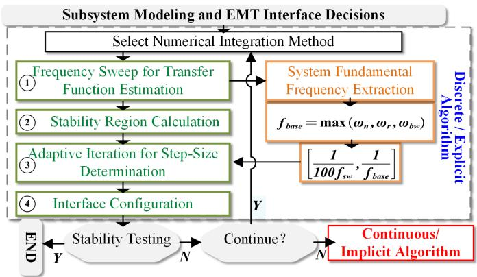  
Fig. 3. Proposed RMTE framework for multi-domain co-simulation workflow.

where $n _ { d } = 0 . 0 0 2 9 \lambda _ { m } ^ { 2 } + 0 . 0 5 \lambda _ { m } - 3 . 4 \times 1 0 ^ { - 1 9 }$ . The water transport caused by diffusion can be described by Fick’s law as follows:

$$
F _ {H _ {2} O _ {d}} = D _ {\omega} \frac {C _ {w c} - C _ {w a}}{t _ {m}} M _ {H _ {2} O} A _ {E} n, \tag {11}
$$

$\begin{array} { r l r } { \mathrm { w h e r e } } & { \textit { D } _ { \omega } } & { = \textit { D } _ { \lambda } \exp \Big ( 2 4 1 6 \times \Big ( \frac { 1 } { 3 0 3 } - \frac { 1 } { T _ { e l } } \Big ) \Big ) , } \\ { C _ { w a } } & { = } & { \frac { \rho _ { m , d r y } } { M _ { m . d r y } } \lambda _ { a } , \quad C _ { w c } \quad = \quad \frac { \rho _ { m , d r y } } { M _ { m . d r y } } \lambda _ { c } , \quad \mathrm { a n d } } \end{array}$ Cwa ρm,dry λa, Mm,dry ρm,dry λc, Mm,dry

$$
\left\{ \begin{array}{c} D _ {\lambda} = 1 e ^ {- 1 0} (\lambda_ {m} <   2) \\ D _ {\lambda} = 1 e ^ {- 1 0} \times (1 + 2 \times (\lambda_ {m} - 2)) (2 \leqslant \lambda_ {m} <   3) \\ D _ {\lambda} = 1 e ^ {- 1 0} \times (3 - 1. 6 7 \times (\lambda_ {m} - 3)) (3 \leqslant \lambda_ {m} <   4. 5) \\ D _ {\lambda} = 1. 2 5 e ^ {- 1 0} (\lambda_ {m} \geqslant 4. 5) \end{array} \right..
$$

For the sources and explanations of these constant coefficients, please refer to [13], [32]. Next, the PEM voltage model is established to simulate the relationship between the electrolysis voltage and current. The electrolysis voltage is given as:

$$
V _ {e l} = E + V _ {e l. a c t} + V _ {e l. o h m}, \text {w i t h} \tag {12}
$$

$$
\left\{ \begin{array}{c} E = E _ {0} + \frac {R T _ {e l}}{2 F} \ln \left(\frac {P _ {H _ {2}} ^ {2} P _ {O _ {2}}}{a _ {H _ {2} O}}\right), E _ {0} = \frac {\Delta G _ {f}}{2 F} \\ V _ {e l. a c t} = \frac {R T _ {e l}}{\alpha F} \sinh^ {- 1} \left(\frac {i}{2 i _ {0}}\right) \\ V _ {e l. o h m} = i R _ {e l. o h m} \end{array} , \right. \tag {13}
$$

where area-specific resistance $\begin{array} { r } { R _ { e l . o h m } = \frac { t _ { m } } { \sigma _ { m } } } \end{array}$ tm . The hydrogen σm produced by the electrolyzer is stored in a tank through compression-based storage. The corresponding dynamic equation is as follows:

$$
\dot {P} _ {b} = z \frac {N _ {H _ {2}} R T _ {b}}{M _ {H _ {2}} V _ {h}}. \tag {14}
$$

The final output pressure is given by $P _ { b } - P _ { b i }$ , and $N _ { \mathrm { H _ { 2 } } }$ can be derived from the volume of hydrogen gas $\mathrm { H _ { 2 g } }$ .

# B. Hybrid Energy System Interface Integration

The coupling mechanism of the N-RHES is illustrated in Fig. 2. The SMR generates thermal power, which is converted into mechanical power through the steam generator and turbine, and subsequently drives the synchronous machine (SM). Meanwhile, the power grid provides feedback on the generator speed to the SMR governor, which adjusts the reactivity $\rho ( t )$ accordingly to regulate the reactor core output. The PEMbased hydrogen production module is decoupled from the grid

through an ideal average AC/DC converter model. The input current $I _ { i n }$ of the electrolyzer is then adjusted based on the surplus or deficit of electrical energy in the grid. For wind farms, PV, and energy storage units, the interface is typically modeled as a controlled current source.

# III. PROPOSED RMTE FRAMEWORK

# FOR MULTI-DOMAIN CO-SIMULATION OF N-RHES

Fig. 3 illustrates the core workflow of the proposed framework. In this section, key steps highlighted as 1 to 4 will be discussed. This framework falls within the category of discrete/explicit numerical solution methods, with the continuous/implicit solver considered as a fallback option. The classic EMT algorithm employs a hybrid integration method based on the Trapezoidal rule. In discrete solution, the fixed time-step $\varDelta t$ leads to a constant admittance matrix (for linear systems), which allows efficient LU decomposition (i.e., the factorization of a matrix into a lower triangular matrix and an upper triangular matrix) and Gaussian elimination, while also reducing the need for matrix inversion. In this framework, the choice of solver is determined based on the user’s prior knowledge and experience, while selection of $\varDelta t$ and coupling strategy are the focal points.

1) Frequency Sweep for Transfer Function Estimation: For high-order, nonlinear, or irrational systems, a rational polynomial approximation of the transfer function $G ( s )$ can be obtained using the frequency sweep method [33]:

$$
G (s) = \frac {b _ {0} + b _ {1} s + b _ {2} s ^ {2} + \cdots + b _ {N} s ^ {N}}{a _ {0} + a _ {1} s + a _ {2} s ^ {2} + \cdots + a _ {N} s ^ {N}}, \tag {15}
$$

where the coefficients a and b approximate the system’s behavior. A frequency-sweep -based vector fitting (VF) method is an iterative method that approximates frequency responses with stable rational models by updating pole locations and residues. It enables accurate reduced-order representations of complex dynamical systems [34], [35]. Although analytical examination of (1) and (2) is feasible—for example, by treating $\rho ( t )$ as a constant to linearize the equations and obtain an exact statespace representation [36]:

$$
G (s) = \frac {(s + 0 . 1 1 1) (s + 0 . 0 3 0 5) (s + 0 . 0 1 2 4) (s + 3 . 0 1) (s + 1 . 1 4) (s + 0 . 3 0 1)}{s (s + 6 4 0) (s + 2 . 9) (s + 1 . 0 2) (s + 0 . 1 9 5) (s + 0 . 0 6 8 1) (s + 0 . 0 1 4 3)}. \tag {16}
$$

However, in practical simulations, $\rho ( t )$ is not a constant but a nonlinear combination of multiple variables. Extending such analysis to the complete SMR model or other complex physical subsystems becomes significantly more challenging and time-consuming. Moreover, the user-defined nature of the model further increases the analytical difficulty. Therefore, from an engineering perspective, a more practical approach is to first specify the input-output interfaces of the system, as illustrated in Fig. 2, partition the overall system into multiple subsystems, and then apply VF to approximate their behaviors. This approach remains applicable even for multi-input multioutput (MIMO) configurations.

Once a rational approximation of the equation is obtained, it can be reformulated in a successive differentiation form by substituting the operator s with $\textstyle { \frac { d } { d t } }$ . This facilitates the derivation of the corresponding state-space representation in matrix form. At this stage, the first step is now complete.

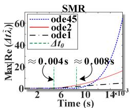

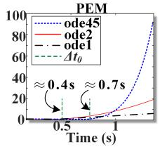

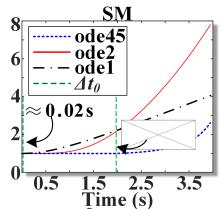

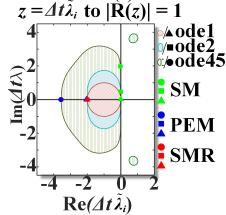

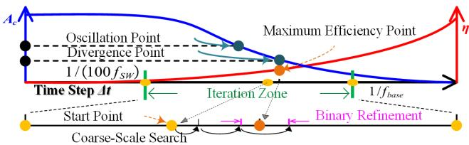  
Fig. 4. Stability regions and step-size analysis of the open-loop transfer functions of SMR/SM/PEM under different discretization methods (ode1: Euler method; ode2: Heun’s method; ode45: Runge-Kutta method).   
Fig. 5. Process diagram for multiscale adaptive step-size refinement $( A _ { c } \colon$ Accuracy; η: Computational efficiency).

2) Stability Region Calculation: Next, based on the numerical integration method selected by the user, the state-space representation is converted from the s-domain to the z-domain, resulting in the discrete-time formulation:

$$
\left\{ \begin{array}{c} x [ k + 1 ] = A _ {d} x [ k ] + B _ {d} u [ k ] \\ y [ k ] = C _ {d} x [ k ] + D _ {d} u [ k ] \end{array} , \right. \tag {17}
$$

where k represents the discrete index, $A _ { d } , B _ { d } , C _ { d } ,$ , and $D _ { d }$ are system matrices. At this point, the only variable of $A _ { d }$ is the ∆t. According to the discrete system stability criterion, the system is numerically stable if the spectral radius is less than 1. Therefore, the theoretical maximum $\varDelta t$ can be obtained through the following stability criterion:

$$
\max  _ {i} \left| \tilde {\lambda} _ {i} \left(A _ {d}\right) \right| <   1, \tag {18}
$$

where $\tilde { \lambda } _ { i }$ are eigenvalues. Fig. 4 illustrates the theoretically estimated stability boundary step-size $\varDelta t _ { 0 }$ for SMR, SM (EMT equations only), and PEM under different numerical integration methods, calculated according to (18). As shown in the figure, the system stability boundaries $\varDelta t _ { 0 }$ for different physical domains range from the millisecond to the second scale, while conventional EMT simulation time-steps are typically on the order of microseconds. Therefore, establishing appropriate co-simulation time-steps is critical for achieving efficient multi-domain integration. However, $\varDelta t _ { 0 }$ is only an estimated value and may fall within a region of numerical oscillation; therefore, further iteration on $\varDelta t _ { 0 }$ is required.

3) Adaptive Iteration for ∆t: Fig. 5, Algorithm 1, and Algorithm 2 illustrate the main procedure of step $\textcircled{3} .$

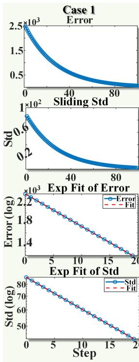

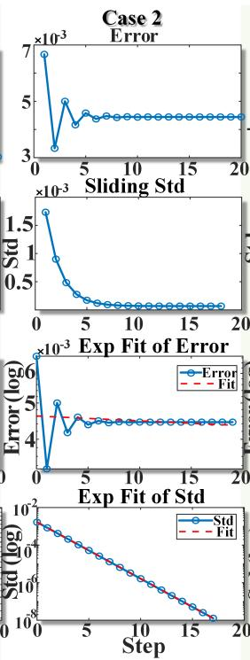

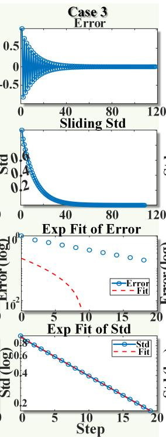

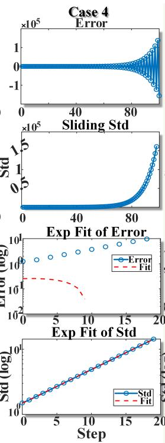

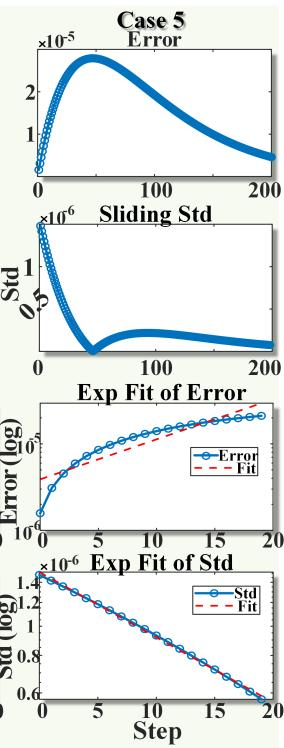  
Fig. 6. Five illustrative cases for Algorithm 2: Case 1 — Stable exponential convergence; Case 2 — Weakly oscillatory convergence; Case 3 — Numerical oscillation with convergence; Case 4 — Divergence; Case 5 — False divergence.

First, the boundaries of $\varDelta t$ must be determined. In step $\textcircled{1} .$ the system’s frequency response has been obtained, from which the frequencies corresponding to $w _ { n } , w _ { r }$ , and $w _ { b w }$ can be extracted and $f _ { b a s e } = m a x ( w _ { n } , w _ { r } , w _ { b w } )$ is taken as the upper boundary. The lower boundary is selected as $\frac { 1 } { 1 0 0 }$ of the EMT switching frequency $f _ { s w }$ . ∆t obtained in step $\textcircled{2}$ serves as the starting point $\varDelta t _ { 0 }$ for a coarse-scale search within the predefined interval $\left[ \frac { 1 } { 1 0 0 f _ { s w } } , \frac { 1 } { f _ { b a s e } } \right]$ [ 100fsw , fbase . The most critical adaptive step-size scaling procedure is illustrated in Algorithm 1 and Algorithm 2, while the details of the bisection iteration $B ( \cdots )$ are omitted, as it is no longer a novel method.

Algorithm 1 illustrates the $\varDelta t$ scaling process, starting from $\varDelta t _ { 0 }$ and adaptively scaling within $\left[ \frac { 1 } { 1 0 0 f _ { s w } } , \frac { 1 } { f _ { b a s e } } \right]$ [ 100fsw , fbase ] . The function $S ( \cdots )$ plays a key role in evaluating the stability of $\varDelta t \colon$ if it returns 1, the current step-size is considered too large and is reduced as $\varDelta t = \varDelta t _ { 0 } \cdot ( \bar { 1 } / \beta ) ^ { k - 1 } \mathrm { ~ ; ~ }$ ; if it returns 0, the stepsize is deemed acceptable (or too small) and is increased as $\varDelta t = \varDelta t _ { 0 } \cdot \beta ^ { k - 1 }$ . Once S changes, the range $[ \varDelta t _ { \mathrm { l o w e r } } , \varDelta t _ { \mathrm { u p p e r } } ]$ is determined. A bisection method is then applied to refine the final value of ∆t. Algorithm 2 illustrates the functionality of $S ( \cdots )$ . If ∆t is appropriate, the error is expected to exhibit exponential convergence, i.e., $\delta ( t ) \approx C \cdot e ^ { - \bar { \alpha } t }$ . Therefore, the error sequence $\delta ( t _ { i } )$ can be logarithmically fitted using the output under the smallest step-size as a reference:

$$
\log (\delta (t)) = \log (C) - \bar {\alpha} t. \tag {19}
$$

If $R ^ { 2 } > 0 . 9 5$ , the trend is considered significant. However, in practical applications, various challenges arise—Fig. 6 illustrates five representative cases to demonstrate this. In Case 1, the system quickly reaches its equilibrium point, the error shows no oscillation, and a high-quality fit with $R ^ { 2 } > 0 . 9 5$ is

achieved within the first five steps. Case 2 presents a scenario where the initial condition is relatively far from the steadystate operating point. In this case, due to oscillatory behavior, it becomes difficult to judge stability solely based on $\delta ( t _ { i } )$ and $R ^ { 2 }$ . Although extending the total testing duration $T$ could force a better fit, for the sake of methodological simplicity, we aim to make reliable judgments ideally within the first 10 steps. Moreover, considering the need to compute the reference yret $y _ { \mathrm { r e f } } ^ { \varDelta t _ { \mathrm { m i n } } } ( t _ { i } )$ y∆tminref (ti), such an extension would significantly increase the computational burden.

To avoid misjudgment, a sliding-window standard deviation (Std) criterion is introduced, as shown below:

$$
\sigma_ {i} = \operatorname {S t d} \left(\delta \left(t _ {i: i + W - 1}\right)\right) = \sqrt {\frac {1}{W} \sum_ {j = 0} ^ {W - 1} \left(\delta \left(t _ {i + j}\right) - \bar {\delta_ {i}}\right) ^ {2}}, \tag {20}
$$

where, ${ \bar { \delta } } _ { i }$ is the window error mean. This method effectively captures local variations of $\delta ( t )$ , making it suitable for cases where direct logarithmic fitting of $\delta ( t )$ is not appropriate. Case 3 represents a more severe scenario: as $\varDelta t$ continues to increase, numerical oscillations begin to emerge, and the system may even enter a state of no-damping stability. Although it might eventually converge to a steady point, the output becomes highly unreliable under frequent disturbances. To address this, a sign-consistency criterion $\mathrm { s i g n } ( \delta ( t _ { i } ) ) ~ =$ $\mathrm { s i g n } ( \delta ( t _ { 0 } ) )$ ), ∀i is introduced to avoid such cases.

Case 4 demonstrates a clearly divergent case, which is relatively easy to identify. Case 5, on the other hand, presents a more peculiar scenario: due to insufficient approximation accuracy in the early steps caused by a large $\varDelta t ,$ the error continues to deviate in the first few dozen steps, showing a

Algorithm 1 Adaptive Step-Size Determination   
1: Given: Real system $y(t)$ , numerical method order $p$ 2: Initialize step-size $\Delta t \gets \Delta t_0$ 3: Scaling factor $\beta \gets 1.01$ 4: Define boundary $[\Delta t_{\mathrm{min}}, \Delta t_{\mathrm{max}}] \gets [1/(100f_{\mathrm{sw}}), 1/f_{\mathrm{base}}]$ 5: Set bisection search interval $[\Delta t_{\mathrm{lower}}, \Delta t_{\mathrm{upper}}]$ 6: Set test duration $T$ 7: Initialize iteration count $k \gets 0$ 8: Maximum bisection iterations $k_2 \gets 10$ 9: Import step validation function $S(y(t), p, \Delta t, T, \Delta t_{\mathrm{min}})$ 10: Import bisection function $B(y(t), \Delta t_{\mathrm{lower}}, \Delta t_{\mathrm{upper}}, k_2, S(\dots))$ 11: $S \gets S(y(t), p, \Delta t, T, \Delta t_{\mathrm{min}})$ 12: if $S = 1$ then  
13: while $S = 1$ do  
14: $\Delta t_{\mathrm{upper}} \gets \Delta t$ 15: $\Delta t \gets \Delta t_0 \cdot (1/\beta)^{k-1}$ 16: $S \gets S(y(t), p, \Delta t, T, \Delta t_{\mathrm{min}})$ 17: $k \gets k + 1$ 18: end while  
19: $\Delta t_{\mathrm{lower}} \gets \Delta t$ 20: else  
21: while $S = 0$ do  
22: $\Delta t_{\mathrm{lower}} \gets \Delta t$ 23: $\Delta t \gets \Delta t_0 \cdot \beta^{k-1}$ 24: $S \gets S(y(t), p, \Delta t, T, \Delta t_{\mathrm{min}})$ 25: $k \gets k + 1$ 26: end while  
27: $\Delta t_{\mathrm{upper}} \gets \Delta t$ 28: end if  
29: $\Delta t \gets B(y(t), \Delta t_{\mathrm{lower}}, \Delta t_{\mathrm{upper}}, k_2, S(\dots))$ 30: return $\Delta t$

rise-then-fall trend—this is a case of false divergence. Notably, such a trend may lead to confusion between Case 4 and Case 5. To address this, the following criterion is introduced:

$$
\epsilon_ {\mathrm {t o l}} = \max  | \delta (t _ {i}) | / \left(y _ {\text {r e f}} (t _ {i}) + \epsilon\right). \tag {21}
$$

Since Case 4 exhibits true divergence, the magnitude of the error will quickly differ from that of the reference by a significant amount. In particular, within the first 5 steps, the error will exceed 1% relative to the reference. This enables fast and effective differentiation.

4) Interface Configurations: At this stage, the multidomain co-simulation system—composed of subsystems with differing ∆t and coupled via zero-order holders (ZOHs)—can be essentially regarded as a multi-rate discrete-time coupled system. However, although numerical stability has been verified, discrepancies in the data-exchange rates among subsystems may still affect the overall controllability of the system. The system exhibits an ω-periodic property, where ω denotes the least common multiple (LCM) of the sampling and holding intervals across all subsystems. Because the system is composed of multiple subsystems operating at different sampling periods, its dynamics repeat every ω-period. As a consequence, the controllability of the overall multirate periodic system is no longer determined solely by the pair $( A _ { d } , B _ { d } )$ ; rather, it

Algorithm $\textbf { 2 } S ( y ( t ) , p , \varDelta t , T , \varDelta t _ { \mathrm { m i n } } )$   
1: Fit $\Delta t_{\mathrm{min}}$ downward to nearest integer multiple of $\Delta t$ 2: Set sliding window length $W \gets 3$ 3: Zero prevention constant $\epsilon \gets 10^{-8}$ 4: Error sequence: $\delta(t_i) \gets y_{\mathrm{ref}}^{\Delta t_{\mathrm{min}}}(t_i) - y_{\mathrm{test}}^{\Delta t}(t_i)$ 5: Sliding window standard deviation: $\sigma_i \gets \mathrm{Std}(\delta(t_i : t_{i+W-1}))$ 6: Perform linear regression on $\log(\delta(t_i))$ and $\log(\sigma_i)$ 7: $[slope_1, R_1^2] \gets fit(log(\delta(t_i))), [slope_2, R_2^2] \gets fit(log(\sigma_i))$ 8: if slope $>0$ then  
9: return 1  
End if  
11: if $R_2^2 > 0.95$ and slope $< 0$ and slope $< 0$ then  
12: if sign $(\delta(t_i)) = sign(\delta(t_0)), \forall i$ then  
13: return 0  
else  
15: return 1  
end if  
end if  
if $R_2^2 > 0.95$ and slope $< 0$ and slope $>0$ then  
19: $\epsilon_{\mathrm{tol}} \gets \max |\delta(t_i)| / (y_{\mathrm{ref}}(t_i) + \epsilon)$ 20: if $\epsilon_{\mathrm{tol}} > O(h^p)$ then  
21: return 1  
End if

depends on whether the modal interactions within each ω- period lead to resonance or cancellation effects. Consequently, reachability and stabilizability can be determined using the conditions presented in Corollary 3.1 of [37], for a reachable pair $( A _ { d } , B _ { d } )$ :

$$
\begin{array}{l} \text {i f} \operatorname {R e} \left[ \tilde {\lambda} _ {i} \left(A _ {d}\right) \right] = \operatorname {R e} \left[ \tilde {\lambda} _ {i} \left(B _ {d}\right) \right] \quad \text {h a s} \\ \operatorname {I m} \left[ \tilde {\lambda} _ {i} \left(A _ {d}\right) - \tilde {\lambda} _ {i} \left(B _ {d}\right) \right] \neq \frac {2 k \pi}{T _ {\omega}}, \quad k \in \mathbb {Z}, \end{array} \tag {22}
$$

where $T _ { \omega }$ denotes the resonance period of the entire system, which will be explained in the next section.

# IV. REAL-TIME HARDWARE EMULATION OF N-RHES

This section presents the synchronization, interaction mechanisms, and clock design for subsystems with different $\varDelta t$ in FPGA-based multi-domain co-emulation. Real-time performance is further enhanced through the application of the RMTE algorithm. It is assumed that all subsystems are synchronized at the initial time t = 0.

Assume that the slower subsystem adopts a final discrete time-step of $\varDelta t _ { H }$ , while the faster subsystem uses $\varDelta t _ { h } .$ . The holding time of the ZOH is set to $\mathbf { M a x } ( \varDelta t _ { H } , \varDelta t _ { h } )$ . By selecting $\varDelta t _ { \mathrm { b a s e } }$ as the global minimum time granularity, the discrete steps $\varDelta t _ { H }$ and $\varDelta t _ { h }$ can be expressed as $\Delta t _ { H } =$ $N _ { H } \cdot \varDelta t _ { \mathrm { b a s e } }$ and $\varDelta t _ { h } = N _ { h } \cdot \varDelta t _ { \mathrm { b a s e } } .$ , respectively. Consequently, the least common multiple $\omega = \mathrm { L C M } ( N _ { H } , N _ { h } )$ determines the alignment period, indicating that the system realigns every $\omega \cdot \varDelta t _ { \mathrm { b a s e } } = T _ { \omega } = \varDelta t _ { \omega }$ . In multirate sampled-data systems, the

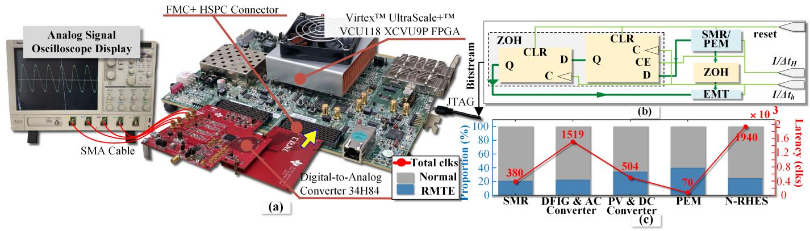  
Fig. 7. (a) Hardware emulation; (b) Clock and data interfaces flow; (c) Comparison of computation latency between proposed RMTE and conventional global solvers (Normal) for completing the same T task (Right axis: sum of the clock-cycle latency of the two algorithms; Left axis: individual proportion of each algorithm).

LCM $\varDelta t _ { \omega }$ of the sampling and hold intervals determines the system’s structural periodicity. Although data exchange occurs at specific rates, only at multiples of $\varDelta t _ { \omega }$ is a full feedbackcontrol cycle guaranteed to be complete and aligned across all subsystems. This synchronization point can thus serve as a logical anchor for analyzing or enforcing data coherence, state consistency, or coordinated updates in practical implementations such as FPGA scheduling or verification [38].

Fig. 7 (a) and (b) illustrate the hardware implementation and the clock and data flow, respectively. The realization of RMTE and the stability of the coupled model were first verified through offline simulations conducted in Matlab/Simulink®. After determining the appropriate coupling step sizes for each subsystem, the RMTE formulation was implemented in C and synthesized into hardware using Vitis HLS®. The resulting design was subsequently deployed onto the FPGA platform to enable parallelized real-time acceleration. The implementation utilizes the Xilinx® UltraScale VCU118 FPGA, with signal conversion between digital and analog domains achieved via an FMC high-speed interface and a Texas Instruments® DAC34H84, providing HIL interfaces for future engineering testing.

Fig. 7 (c) shows the computation latency of each model when completing the same ∆t, comparing the conventional global solver (Normal) and the RMTE-optimized step-sizes. The user-programmable clock frequency of the FPGA ranges from 10 MHz to 810 MHz. When set to 275 MHz, each clock cycle (clk) corresponds to approximately 3.636 ns. It can be observed that, after RMTE optimization, the computation latency is reduced by approximately 60% to 80% across different models. Specifically, the overall coupled N-RHES system achieves a real-time computation speed of approximately $1 4 5 5 \times 3 . 6 3 6 \mathrm { n s } = 5 . 2 9 \mu \mathrm { s }$ , which can be further reduced to 1.82 µs if operated at 800 MHz.

# V. EXPERIMENTAL RESULTS AND DISCUSSION

This section conducts two primary evaluations: the validation of the PEM model and the simulation-based performance assessment of the RMTE framework within N-RHES. The validation of the PEM model was performed against benchmark datasets [13], while the simulation inputs, including

solar irradiance data (courtesy of the National Aeronautics and Space Administration, NASA) [39], wind power data from the Wyoming wind farms [40], SMR supply characteristics, and load demand profiles [30], are all sourced from authoritative and verifiable references. Due to inconsistencies in the reference data, a per-unit normalization is first applied, with the original power variation trends preserved, followed by a rescaling to the nominal ratings for 24-hour dynamic simulations: 200 MW peak output for PV, 300 MW peak for wind power, 1500 MW from a cluster of five 300 MW SMR units, a load varying between 400 MW and 1000 MW, and 200 MW rated power for PEM hydrogen production [41].

1) Validation of the $H _ { 2 }$ Production System: In Fig. 8 (a) and (b) show the polarization curves under different temperatures and operating pressures, respectively. The markers in both figures are experimental reference data, providing a basis for comparative validation. It can be observed that the emulation results closely match the reference experimental points, with trends correctly capturing the influence of temperature and pressure on the cell voltage. Specifically, as the operating temperature increases from 280 K to 360 K, the cell voltage at a given current density decreases, which is consistent with thermodynamic expectations. Similarly, increasing the operating pressure from 1 bar to 350 bar results in a higher cell voltage across the current density range.

Fig. 8 (c) presents the decomposition of the stack voltage into its major components, including the $V _ { e l } , \ E , \ V _ { e l . a c t . a n }$ (anode), $V _ { e l . a c t . c a t }$ (cathode), and $V _ { e l . o h m } ,$ across varying current densities. At low current densities, the anodic activation over-potential remains significant, indicating that the oxygen evolution reaction kinetics strongly affect the overall cell efficiency even under mild loading conditions. The cathodic activation losses and electronic ohmic losses are relatively minor across the entire current range. Fig. 8 (d) shows the variation of stack voltage and electrolysis current over time. Fig. 8 (e) illustrates the corresponding evolution of $H _ { 2 }$ flow rate and $H _ { 2 }$ tank pressure under the varying electrolysis current conditions. As the electrolysis current increases, the hydrogen flow rate exhibits a proportional rise, consistent with Faraday’s law of electrolysis, while the tank pressure

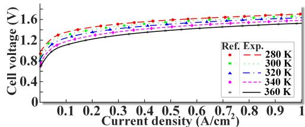

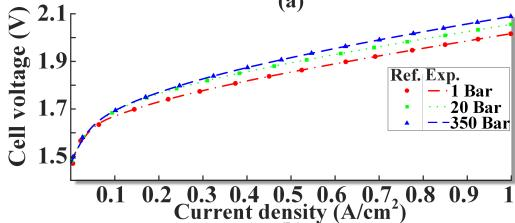  
（a)

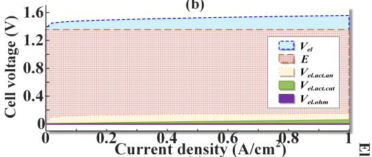

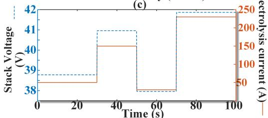

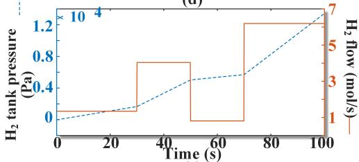  
（d）  
  
Fig. 8. (a) Polarization curves under different temperatures; (b) Polarization curves under different pressures; (c) Voltage contributions to the polarization curve; (d) Stack (21 cells) voltage under varying electrolysis current; (e) Hydrogen flow rate and storage tank pressure corresponding to the current variation in (d).

accumulates correspondingly due to the continuous hydrogen production. Fig. 8 (a), (b), and (c) validate the accuracy of the PEM model, while Fig. 8 (d) and (e) illustrate its dynamic behavior under the current power rating. With these results, all subsystems—hydrogen, nuclear, photovoltaic, and wind—are now fully prepared, enabling the verification of the proposed time-step optimization framework.

2) Experiments on the RMTE Framework based N-RHES: Fig. 9 presents the 24-hour dynamic simulation results of the N-RHES system, comparing the outcomes of the conventional global EMT solver (Normal, solid line) and the proposed RMTE framework (RMTE, dashed line). In Fig. 9 (a), the solar irradiance input over time is shown, exhibiting the typical diurnal profile with peak intensity around noon. Fig. 9 (b) displays the wind power input, characterized by stochastic

TABLE I VECTOR FITTING (VF) SETTINGS AND NUMERICAL SIMULATION ERRORS   

<table><tr><td rowspan="2">Module</td><td rowspan="2">Estimated Poles</td><td rowspan="2">Iterations</td><td rowspan="2">VF RMS Error</td><td colspan="3">Simulation Average Error</td></tr><tr><td>Ode1</td><td>Ode2</td><td>Ode45</td></tr><tr><td>SMR</td><td>30</td><td>14</td><td>9.2E-16</td><td>1.5E-3</td><td>4.8E-4</td><td>7.9E-5</td></tr><tr><td>SM</td><td>10</td><td>7</td><td>5.1E-14</td><td>2.1E-3</td><td>7.0E-4</td><td>1.5E-4</td></tr><tr><td>PEM</td><td>8</td><td>10</td><td>4.1E-14</td><td>3.8E-3</td><td>1.4E-3</td><td>3.2E-4</td></tr></table>

fluctuations due to wind variability. Fig. 9 (c) shows the dynamic behavior of the load demand and the SMR power output. The load demand exhibits rapid fluctuations, while the SMR output responds more smoothly due to control strategy constraints and the need to extend system lifespan. The resulting power mismatch is dynamically compensated by the battery energy storage system. Fig. 9 (d) depicts the battery energy storage behavior, where positive values indicate discharge and negative values indicate charging actions in response to the net energy balance from renewable inputs and load demands. Correspondingly, Fig. 9 (e) illustrates the evolution of the battery’s state of charge (SOC), showing gradual fluctuations reflecting the charge-discharge cycles. Fig. 9 (f) shows the power consumption of the PEM electrolyzer, which remains relatively stable under a controlled bus voltage strategy despite the fluctuations in energy supply. Overall, the results demonstrate that the proposed RMTE framework achieves equivalent system dynamic performance compared to the conventional solver while providing significant computational advantages. Finally, Fig. 9 (g), the bus frequency at the point of common coupling (PCC) remains well regulated around 50 Hz throughout the transient. This stability is primarily attributed to the fast response capability of the battery subsystem, which provides rapid compensation during load or generation fluctuations and thereby mitigates frequency excursions.

3) Vector-Fitting-Based Frequency-Sweep Approximation and RMTE Error: In this study, the VF was employed to construct reduced-order rational models for the SMR, SM, and PEM electrolyzer subsystems based on their complex frequency responses. As shown in Fig. 10, taking the SMR as an example, the original 25-state model was approximated using a pole-residue structure with 30 poles, which provides sufficient flexibility to capture the multi-timescale dynamic behavior inherent in the nuclear thermal-electrical coupling process. The fitting procedure was performed iteratively, with pole locations and residues updated at each iteration to progressively improve accuracy. The approximation quality was assessed using the normalized root-mean-square (RMS) error between the original frequency response and its rational approximation. Iterations were terminated once the RMS error converged to the prescribed tolerance level.

The frequency response of the SMR subsystem was evaluated over the 0.1∼1000 Hz range using the transfer function (16). Fig. 10 (a) presents the magnitude response together with the vector-fitting approximation error, indicating close agreement between the original model and the fitted rational function. The corresponding phase characteristics are shown in Fig .10 (b), demonstrating consistent alignment across the

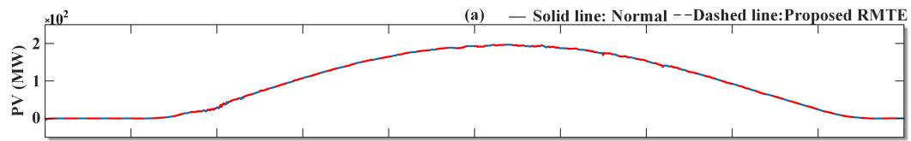

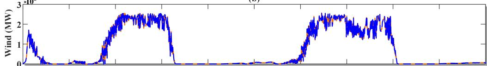  
(b)

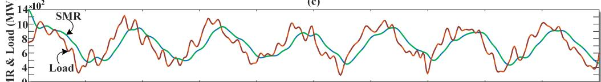

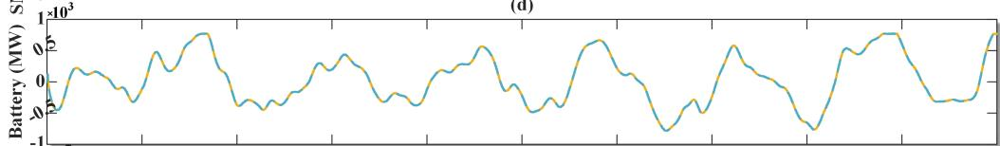

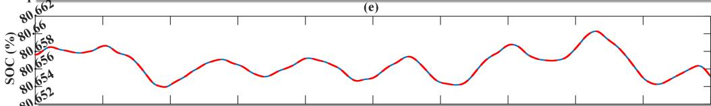

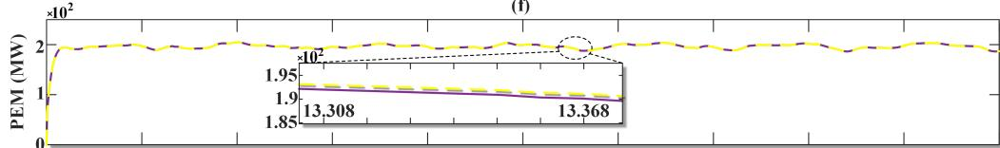  
  
(g

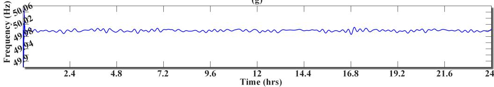  
Fig. 9. Dynamic simulation results of the N-RHES system over a 24-hour period: (a) Solar irradiance input; (b) Wind power input; (c) Load demand and SMR power output; (d) Battery power flow; (e) State of charge (SOC) evolution; (f) Power consumption of the PEM electrolyzer under controlled bus voltage conditions; (g) Bus-frequency response measured at the point of common coupling (PCC). (Normal: conventional global solvers).

frequency spectrum. The real and imaginary components of G(jω), displayed in Fig .10 (c) and Fig. 10 (d), respectively, reveal smooth and physically coherent trends that are accurately captured by the fitted model. Overall, the results confirm that the vector fitting procedure yields a stable and highfidelity reduced-order representation of the SMR subsystem dynamics.

# VI. CONCLUSION

As efforts around the world accelerate to achieve decarbonization targets in this century, clean hydrogen production and distribution is gaining prominence. Real-time modeling and simulation tools can play a pivotal role in the development and deployment of such sustainable energy networks.

This paper proposed a real-time RMTE framework to address the simulation challenges of multi-domain energy systems in EMT studies. RMTE enables domain-specific timestep optimization, ensuring real-time capability, robustness,

and fidelity under complex dynamic conditions. FPGA-based validation showed an average computational time reduction of approximately 70% compared to conventional methods. Application to an N-RHES (nuclear, solar, wind, hydrogen, and battery-integrated energy system) confirmed that RMTE ensures dynamic behavior consistency while significantly improving simulation efficiency, providing a scalable solution for future studies of complex, intelligent, and hybrid power grids. The proposed method is haslimitations for stiff problems or systems in which multiple variables are tightly coupled. It is more appropriate for long-term stability simulations. Future work may consider incorporating variable-step algorithms or mechanisms for switching to implicit schemes to address these issues.

# REFERENCES

[1] B. Poudel and R. Gokaraju, “Small modular reactor (smr) based hybrid energy system for electricity & district heating,” IEEE Trans. Energy

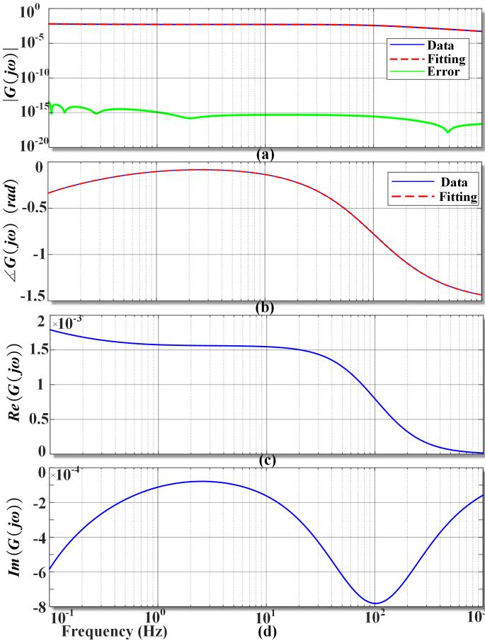  
Fig. 10. Frequency response of the SMR subsystem (16): (a) magnitude of G(jω) with fitting error curve; (b) phase response; (c) real part of G(jω); and (d) imaginary part of G(jω).

Convers., vol. 36, no. 4, pp. 2794–2802, Dec. 2021.   
[2] J. K. Nøland, M. N. Hjelmeland, C. Hartmann, L. B. Tjernberg, and M. Korpas, “Overview of small modular and advanced nuclear reactors ˚ and their role in the energy transition,” IEEE Trans. Energy Convers., pp. 1–12, Jan. 2025.   
[3] E. M. A. Hussein, “Small reactors: The promise and challenges [view point],” IEEE Electrif. Mag., vol. 12, no. 4, pp. 116–124, Dec. 2024.   
[4] J. K. Nøland, M. Hjelmeland, C. Hartmann, T. Øyvang, M. Korpas, ˚ and L. B. Tjernberg, “Running renewable-rich power grids with small modular reactors: Their grid-forming role in the future power system.” IEEE Electrif. Mag., vol. 12, no. 4, pp. 20–29, Dec. 2024.   
[5] G. Taljan, C. Canizares, M. Fowler, and G. Verbic, “The feasibility of hydrogen storage for mixed wind-nuclear power plants,” IEEE Trans. Power Syst., vol. 23, no. 3, pp. 1507–1518, Aug. 2008.   
[6] J. Rahman, R. A. Jacob, and J. Zhang, “Multi-timescale power system operations for electrolytic hydrogen generation in integrated nuclearrenewable energy systems,” Appl. Energy, vol. 377, p. 124346, Jan. 2025.   
[7] J. Bryan, A. Meek, S. Dana, M. S. Islam Sakir, and H. Wang, “Modeling and design optimization of carbon-free hybrid energy systems with thermal and hydrogen storage,” Int. J. Hydrog. Energy, vol. 48, no. 99, pp. 39 097–39 111, Dec. 2023, integrated Hydrogen Energy Systems.   
[8] R. H. Lasseter, Z. Chen, and D. Pattabiraman, “Grid-forming inverters: A critical asset for the power grid,” IEEE J. Emerg. Sel. Top. Power Electron., vol. 8, no. 2, pp. 925–935, Jun. 2020.   
[9] H. Mu, D. Yang, Y. Sun, and L. B. Larumbe, “Dynamic power tracking performance and small signal stability analysis of integrated wind-tohydrogen system,” IEEE Trans. Sustain. Energy, vol. 15, no. 4, pp. 2444– 2456, Oct. 2024.   
[10] Natural Resources Canada. (Dec. 2020) Hydrogen strategy for canada: Seizing the opportunities for hydrogen – a call to action. Government of Canada. Accessed: 2025-04-29. [Online]. Available: https://natural-resources.canada.ca/energy-sources/ clean-fuels/hydrogen-strategy

[11] U.S. Department of Energy. (2024) Department of energy hydrogen program plan. Accessed: Apr. 2025. [Online]. Available: https://www.hydrogen.energy.gov/docs/hydrogenprogramlibraries/ pdfs/hydrogen-program-plan-2024.pdf   
[12] F. Aouali, M. Becherif, H. Ramadan, M. Emziane, A. Khellaf, and K. Mohammedi, “Analytical modelling and experimental validation of proton exchange membrane electrolyser for hydrogen production,” Int. J. Hydrogen Energy, vol. 42, no. 2, pp. 1366–1374, Jan. 2017.   
[13] T. Yigit and O. F. Selamet, “Mathematical modeling and dynamic simulink simulation of high-pressure PEM electrolyzer system,” Int. J. Hydrogen Energy, vol. 41, no. 32, pp. 13 901–13 914, Aug. 2016.   
[14] M. Younas, S. Shafique, A. Hafeez, F. Javed, and F. Rehman, “An overview of hydrogen production: Current status, potential, and challenges,” Fuel, vol. 316, p. 123317, May 2022.   
[15] S. Rout and S. Das, “Online state-of-charge estimation of lithium-ion battery using a fault tolerant and noise immune threefold modified adaptive extended kalman filter,” IEEE Trans. Transp. Electrif., vol. 10, no. 4, pp. 9366–9380, Dec. 2024.   
[16] A. Francis, S. Venuturumilli, D. Moseley, S. Claridge, B. Leuw, R. Badcock, and C. Bumby, “Electrical, magnetic and thermal circuit modelling of a superconducting half-wave transformer rectifier flux pump using simulink,” Superconductivity, vol. 7, p. 100053, Sept. 2023.   
[17] Q. Jiang, J. Jin, A. Nuerlan, Y. Liu, J. Wan, and P. Wang, “A coordinate control strategy for load following operation of sodium-cooled fast reactor system,” Ann. Nucl. Energy, vol. 217, p. 111318, Jul. 2025.   
[18] D. Brezak, A. Kovac, and M. Firak, “MATLAB/Simulink simulation ofˇ low-pressure PEM electrolyzer stack,” Int. J. Hydrog. Energy, vol. 48, no. 16, pp. 6158–6173, Feb. 2023.   
[19] M. Gautam, B. Poudel, and B. Li, “Data-driven quasi-static surrogate models for nuclear-powered integrated energy systems,” in 2024 IEEE Tex. Power Energy Conf. (TPEC), College Station, TX, USA, Feb. 2024, pp. 1–6.   
[20] H. W. Dommel, “Digital computer solution of electromagnetic transients in single-and multiphase networks,” IEEE Trans. Power App. Syst., vol. PAS-88, no. 4, pp. 388–399, Apr. 1969.   
[21] W. Chen, V. Dinavahi, and N. Lin, “Detailed multi-domain modeling and faster-than-real-time hardware emulation of small modular reactor for EMT studies,” IEEE Trans. Energy Convers., vol. 39, no. 3, pp. 1644–1657, Sept. 2024.   
[22] A. Chatterjee, A. Keyhani, and D. Kapoor, “Identification of photovoltaic source models,” IEEE Trans. Energy Convers., vol. 26, no. 3, pp. 883– 889, Sept. 2011.   
[23] W. Tang, J. Hu, Y. Chang, and F. Liu, “Modeling of DFIG-based wind turbine for power system transient response analysis in rotor speed control timescale,” IEEE Trans. Power Syst., vol. 33, no. 6, pp. 6795– 6805, Nov. 2018.   
[24] C. Yang, Y. Xue, X.-P. Zhang, Y. Zhang, and Y. Chen, “Real-time FPGA-RTDS co-simulator for power systems,” IEEE Access, vol. 6, pp. 44 917– 44 926, Aug. 2018.   
[25] S. Cao, N. Lin, and V. Dinavahi, “Faster-than-real-time hardware emulation of extensive contingencies for dynamic security analysis of largescale integrated ac/dc grid,” IEEE Trans. Power Syst., vol. 38, no. 1, pp. 861–871, Jan. 2023.   
[26] ——, “Flexible time-stepping dynamic emulation of ac/dc grid for faster-than-scada applications,” IEEE Trans. Power Syst., vol. 36, no. 3, pp. 2674–2683, May. 2021.   
[27] P. Palensky, A. A. Van Der Meer, C. D. Lopez, A. Joseph, and K. Pan, “Cosimulation of intelligent power systems: Fundamentals, software architecture, numerics, and coupling,” IEEE Ind. Electron. Mag., vol. 11, no. 1, pp. 34–50, Mar. 2017.   
[28] Q. Huang and V. Vittal, “Advanced EMT and phasor-domain hybrid simulation with simulation mode switching capability for transmission and distribution systems,” IEEE Trans. Power Syst., vol. 33, no. 6, pp. 6298–6308, Nov. 2018.   
[29] E. Buraimoh, G. Ozkan, L. Timilsina, P. K. Chamarthi, B. Papari, and C. S. Edrington, “Overview of interface algorithms, interface signals, communication and delay in real-time co-simulation of distributed power systems,” IEEE Access, vol. 11, pp. 103 925–103 955, Sept. 2023.   
[30] H. A. Gabbar and O. L. A. Esteves, “Hydrogen deployment strategies with a nuclear-renewable hybrid energy system: Simulation for the evaluation of hydrogen deployment within nuclear-renewable systems,” IEEE Electrif. Mag., vol. 12, no. 4, pp. 68–74, Dec. 2024.   
[31] S. Cao, N. Lin, and V. Dinavahi, “Mitigation of subsynchronous interactions in hybrid ac/dc grid with renewable energy using faster-than-realtime dynamic simulation,” IEEE Trans. Power Syst., vol. 36, no. 1, pp. 670–679, Jan. 2021.

[32] T. E. Springer, T. Zawodzinski, and S. Gottesfeld, “Polymer electrolyte fuel cell model,” J. Electrochem. Soc., vol. 138, no. 8, p. 2334, Aug. 1991.   
[33] A. Arda Ozdemir and S. Gumussoy, “Transfer function estimation in system identification toolbox via vector fitting,” IFAC-PapersOnLine, vol. 50, no. 1, pp. 6232–6237, Jul. 2017, 20th IFAC World Congress.   
[34] J. M. Rodriguez, E. Medina, J. Mahseredjian, A. Ramirez, K. Sheshyekani, and I. Kocar, “Frequency-domain fitting techniques: A review,” IEEE Trans. Power Deliv., vol. 35, no. 3, pp. 1102–1110, Aug. 2019.   
[35] B. Gustavsen and A. Semlyen, “Rational approximation of frequency domain responses by vector fitting,” IEEE Trans. Power Deliv., vol. 14, no. 3, pp. 1052–1061, Jul. 1999.   
[36] W. Chen, N. Lin, and V. Dinavahi, “Real-Time Digital-Twin for Synergistic Interaction of SMRs and Sustainable Power Systems,” IEEE Trans. Ind. Inform., pp. 1–10, Oct. 2025, Early access.   
[37] S. Longhi, “Structural properties of multirate sampled-data systems,” IEEE Trans. Autom. Control., vol. 39, no. 3, pp. 692–696, Mar. 1994.   
[38] V. Dinavahi and N. Lin, Real-time electromagnetic transient simulation of AC-DC networks. Wiley-IEEE Press: New Jersey, USA, 2021.   
[39] “Solar radiation and climate experiment (SORCE),” https://lasp. colorado.edu/home/sorce/data/, 2020, [Online; accessed Apr. 2025].   
[40] D. T. Ingersoll and M. D. Carelli, Handbook of Small Modular Nuclear Reactors. U.K.: Woodhead: Cambridgeshire, 2022, (accessed Apr. 2025).   
[41] S. Josting, “Siemens energy – share price development anticipates ¨ the future,” H2 International, Aug. 2022, accessed: 2025-05- 07. [Online]. Available: https://www.h2-international.com/companies/ siemens-energy-share-price-development-anticipates-future

Weiran Chen (Member, IEEE) received the B.Eng. degree in electrical engineering from Harbin Engineering University, Harbin, Heilongjiang, China, in 2018. He is currently pursuing the Ph.D. degree in electrical and computer engineering at the University of Alberta, Edmonton, AB, Canada. His research interests include real-time simulation of power systems, power electronic systems, and field programmable gate arrays.

Xinyu Zhao (Student Member, IEEE) received the B.Eng. degree in electronic information science and technology from the Harbin Institute of Technology, Harbin, China, in 2021. She is currently pursuing the M.Sc. degree with the Department of Electrical and Computer Engineering, University of Alberta, Edmonton, AB, Canada. Her research interests include real-time simulation of power systems, machine learning, AI engineering, and data analysis.

Venkata Dinavahi (Fellow, IEEE) received the B.Eng. degree in electrical engineering from Visvesvaraya National Institute of Technology (VNIT), Nagpur, India, the M.Tech. degree in electrical engineering from the Indian Institute of Technology (IIT) Kanpur, India, and the Ph.D. degree in electrical and computer engineering from the University of Toronto, ON, Canada. He is currently a Professor with the Department of Electrical and Computer Engineering, University of Alberta, Edmonton, AB, Canada. His research interests include real-time sim-

ulation of power systems and power electronic systems, electromagnetic transients, device-level modeling, artificial intelligence machine learning, large-scale systems, and parallel and distributed computing. Prof. Dinavahi is a Fellow of the Engineering Institute of Canada (EIC), the Asia-Pacific Artificial Intelligence Association (AAIA), and the International Artificial Intelligence Industry Alliance (AIIA). He is a Professional Engineer (P.Eng.) in the province of Alberta, Canada.