# Determination of the saturation curve of power transformers by processing transient measurements

Toussaint Canal * , François-Xavier Zgainski, Vincent-Louis Renouard

EDF-DTG (General Technical Department), chemin de l’´etang, 38950 St-Martin-Le-Vinoux, France

# A R T I C L E I N F O

Keywords:

Transformer re-energization

Saturated inductance

Switching field tests

# A B S T R A C T

The sudden energization of large power transformers may lead to the saturation of the magnetic core and induce resonant overvoltage on weak networks due to low frequency high module inrush currents. The magnetization curve of the transformer and the value of its air-core inductance play a key role in the constraints that can be applied to the equipment due to the switching. The method set out in that document allows to identify the saturation curve of three-phase power transformers from measurements recorded during switching transients.

# 1. Introduction

To ensure Nuclear Safety, several voltage recovery schemes are defined to supply power to a nuclear power-plant facing a total loss of its electrical sources. They consist in re-energizing the auxiliary transformers of the power-plant as fast and as safe as possible in order to supply its safety systems thanks to overhead HV lines of several hundreds of kilometers and an islanded power plant available in the near area of the plant out of power (Fig. 1). Risk analysis studies (based on EMT simulations) and field tests allow to prove the feasibility and the robustness of these recovery schemes [1, 2].

The sudden energization of power transformers may lead to the saturation of the magnetic core and induce RMS-voltage drops and resonant overvoltages due to low frequency high inrush currents [3]. These high overvoltages and inrush currents may damage the involved equipment by causing the failure of the protective systems (surge arresters) [4], dielectric degradations [5] and large deformations due to electrodynamic forces on windings [6]. In the end, these phenomena can lead to the failure of the recovery process.

The magnetization curve of the transformer and the value of its aircore inductance play a key role in the stresses and constraints that can be applied to the equipment. As an example, a 10% overestimation of the saturated inductance, computed from the air-core inductance, can lead to underestimate voltages constraints during the transformer energization by a factor of 30% [7]. An analytical approach was therefore developed in [8] to determine the air-core reactance of transformers with precision, without having to engage heavy computations based on

modeling and simulations performed with finite element electromagnetic 3D software.

The method set out in that document allows to identify the saturation curve and the saturated inductance of three-phase large power transformers from several switching transients records. The simple resulting transformers model presents many interests to simulate low frequency transients (< 1 kHz).

# 2. Transformer model used in voltage recovery studies and its limitations

In this section, we try to present the well-known model of transformer that is used in voltage recovery studies [1]. The method used to identify its main parameters is also detailed. This section is mainly a presentation of the scientific literature and a reminder of the modeling of transformers for switching studies.

There are complex transformer models available to simulate transformer switching transients [9]. The model of the three-phase shell transformer used here is built from three single phase models whose terminals are connected according to the coupling of the transformer. The following figure shows the example of an Ynd11 three-phase transformer (Fig. 2).

The single phase model used is the traditional “T”-equivalent model (Kapp’s model) that is commonly used for low frequency transient studies (below 1 kHz) (Fig. 3).

This section summarizes how this model is classically established (Part A) and how the proposed method to identify the saturation curve

  
Fig. 1. Network configuration to re-energize the auxiliary transformer of a nuclear power-plant.

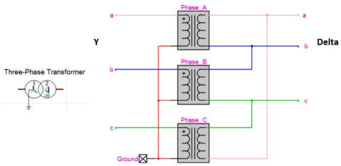  
Fig. 2. Ynd11 three-phase model built from 3 single phase models.

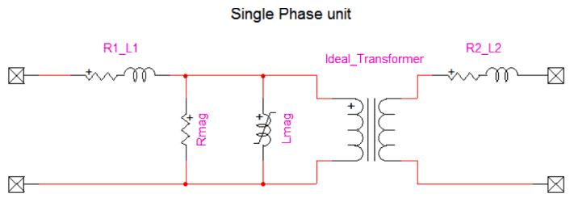  
Fig. 3. Traditional “T” equivalent model.

can improve its representativeness despite its limitations (Part B).

# 2.1. Parameters calculation of the single phase unit

The model parameters can be determined by applying the methods identified in the guide [10].

Leakage impedances and winding resistances are calculated from standard short-circuit tests:

19- The total AC winding resistance is calculated from the active power measured during the short-circuit test. This resistance is split on the HV and the LV winding $( \mathbf { R } _ { 1 }$ and $\mathrm { R } _ { 2 }$ respectively in Fig. 3) according to the DC winding resistances distribution.   
19- The leakage inductance measured during the short-circuit test is artificially split between primary and secondary winding $( \mathrm { L } _ { 1 }$ and L respectively in Fig. 3). In this model, we assume arbitrarily a 50% splitting factor, even if the leakage inductance between the HV winding and the core can be larger than the one between the LV winding and the core 0.

The saturation curve which represents the nonlinear behavior of the core, is a critical parameter to reproduce energization transients. Saturation and core losses are modelled by adding at the HV side a linear resistance in parallel with a non-linear magnetizing inductance [11]. These parameters are determined from the standard no-load test:

19- The value of the resistance can be calculated from the core losses at rated voltage.   
19- The magnetizing inductance is calculated in an iterative way, by using the no-load RMS currents measured at different excitation voltages, often limited to 90 and 120% of the rated voltage. The no-load test is reproduced on the EMTP software: for each level of

sinusoidal voltage applied at the LV side, the peak value of the magnetizing current at the corresponding flux is adjusted in the model in order to reproduce the RMS values of the no-load current measured in the physical test.

The model provides a relatively good estimation of the knee saturation curve (flux as a function of the magnetizing current) of the power transformer in the linear and possibly the low-saturated area of the curve.

The slope of the saturation curve under highly saturated conditions $\left( L _ { s a t } \right)$ is deduced from the value of the air-core inductance provided by the manufacturer. In most cases, this value is calculated by approximate formulae using a global geometry of the transformer’s coil or winding with a 10 to 20% accuracy [8]. As the core is connected to the star point, the saturated inductance is calculated by removing only the fraction of the leakage inductance placed on the HV (primary) side of the transformer $( L _ { H V } )$ , to the air-core inductance calculated for the HV winding $( L _ { a i r - c o r e , H V } )$ as in the following Eq. (1).

$$
L _ {s a t} = L _ {\text {a i r － c o r e , H V}} - L _ {H V} \tag {1}
$$

The following figure shows an example of the shape of the saturation curve that can be obtained with this method (no-load tests points are marked in orange) (Fig. 4).

# 2.2. Limitations of this model

In this model, significant uncertainties remain on the value of the final linear slope of the saturation curve, the value of the saturation flux and the non-linear behavior in the “bend zone” between the last point of the no-load test and the point of complete saturation. These uncertainties can lead to significant deviations on the estimation of the inrush currents and the harmonic overvoltage. The method set out in Section III, aims to identify more precisely the saturation curve on the basis of measurements recorded during the transformer on site switching tests.

Like any other model, the model used in this method has several limitations, the main ones are the two following ones:

19- It does not represent neither the magnetic linkage between the three phases nor the asymmetry of core for a three-phase transformer   
19- The frequency dependence of the losses in the copper windings and in the magnetic circuit are only correct at the frequency of the short-circuit tests (50 Hz). The high frequency losses and the skin effect in the copper of the coils are not taken into account. Therefore, this model is supposed to be conservative because the losses are underestimated.

Despite these limitations, a precise estimation of the saturation curve, input in this model, will allow to reproduce the higher inrush current of the three phases fairly well. Thus, the peak of the overvoltages that can occur during the energization, will be sufficiently precisely

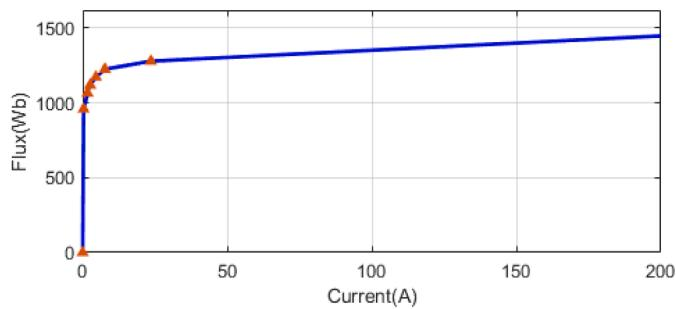  
Fig. 4. Saturation curve of a 96 MVA power transformer (ratio 410/6.8 kV).

estimated to identify the risks that are taken. However, it will remain difficult with this model to reproduce correctly the behavior of all the phases and the damping of the inrush currents (which will be more significant in the real observations of the on-site tests).

# 3. Identification of the saturation curve of a power transformer based on switching tests measurements

Field tests are performed periodically on the same model of transformer on multiple sites in order to validate the feasibility and the robustness of each recovery scheme. During these tests, depending on the initial conditions (residual flux and closing times of the circuit breaker) the power transformer which is energized, can often be forced into saturation with large magnetizing currents that can reach several times the rated value.

# 3.1. Switching transient measurements

The measurement of the transient 3 phase voltages and currents recorded during this switching operation can help us to estimate the saturation curve of the transformer. The following figure shows the location of the measuring points (voltages V and currents I) and the sampling rate chosen for the data acquisition during the tests (Fig. 5) [1].

The voltages on the EHV side of the transformer are measured by on site voltage transformers generally located upstream of the switching device. The currents are measured with on-site current transformers dedicated to protection circuits which are preferred to the current transformers that are dedicated to measurements in order to ensure a low saturation of the sensor during the first periods after the switching. The voltages and the currents of each phase are recorded with a 5 kHz sampling rate.

# 3.2. Determination of the magnetizing current

To obtain the saturation curve of the transformer, it is necessary to deduce from the phase current measurements $( J ) ,$ , the values over time of the magnetizing current $( I _ { m a g } ) \ : ( \mathrm { F i g . ~ } 6 )$ .

For three-phase Ynd11 transformer in no-load conditions (Fig. 7), the LV-side imposes the same delta current $\left( I _ { d e l t a } \right)$ in the three phases. As the current flowing through the $\mathrm { R } _ { \mathrm { m a g } }$ resistance is negligible, the magnetizing current of each phase $( i = 1 , 2 o r 3 )$ can be given by the following formula (2):

$$
I _ {\text {m a g}, i} = J _ {i} - I _ {\text {d e l t a}} \tag {2}
$$

The determination of the delta current is based on the following observation: in practice, we observe that, at any time, there is always at least one of the three phases which is not saturated. The unsaturated phase has a very weak magnetizing current which is negligible in comparison to the other currents. So, for this particular phase, we can approximate that the delta current is equal to the phase current J. Thus, at any moment, the delta current is equal to one of the phase current.

The following figure (Fig. 8) shows the temporal pattern of phase currents which clearly highlights different behaviours over time.

In Part 1, the three line currents are equal. Therefore, we can deduce

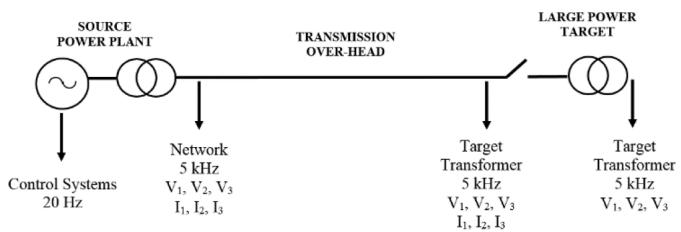  
Fig. 5. Location of the measurements during field tests.

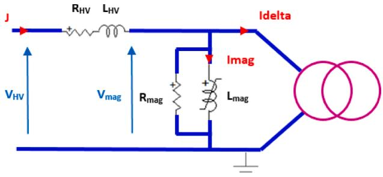  
Fig. 6. HV side of the single phase model.

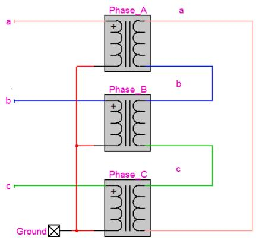  
Fig. 7. Three-phase Ynd11 transformer in no-load conditions.

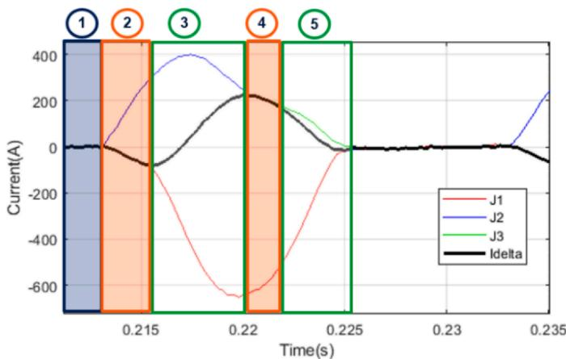  
Fig. 8. Example of phase currents measured after the switching of a transformer and the delta current calculation.

that none of the three phases is saturated. Thus the $\mathrm { I _ { d e l t a } }$ current is equal to the three phase currents $J _ { 1 } , J _ { 2 }$ and $J _ { 3 } .$

In part 2, one of the currents (J2) becomes different from the others. That means the phase 2 has just saturated, the $\mathrm { { I _ { d e l t a } } }$ current is equal to the currents of phase $J _ { 1 }$ and $J _ { 3 } .$ We find a similar situation in part 4 where the phase 1 is saturated.

In part 3, none of the currents are equal. That means, there are two saturated phases. The unsaturated phase through which the $\mathrm { { I _ { d e l t a } } }$ current flows, is the one that is not saturated in either part 2 or part 4, i.e. phase 3. Thus the current delta is equal to $J _ { 3 } .$ In part 5, by the same reasoning, the current delta is equal to $J _ { 2 } .$ .

The delta current can therefore be easily estimated by an algorithm that takes into account these notable properties (3).

∀t , $i f \exists k \neq$ i so that $J _ { k } ( t ) = J _ { i } ( t )$ ) then $I _ { d e l t a } ( t ) = J _ { k } ( t )$

On the contrary, $i f \exists t _ { 1 } a n d t _ { 2 } s o t h a t , f o r t _ { 1 } < t < t _ { 2 }$

J1(t) ∕= J2(t) ∕= J3(t), (3)

then $I _ { d e l t a } ( t ) = J _ { k } ( t )$

with k so that $J _ { k } ( t _ { 1 } ) = I _ { d e l t a } ( t _ { 1 } ) a n d J _ { k } ( t _ { 2 } ) = I _ { d e l t a } ( t _ { 2 } )$

Then, the magnetizing currents in each phase can be deduced from the delta current by using (2) (Fig. 9).

We have checked the correct operation of this algorithm on signals computed by the EMTP software. The delta and magnetizing currents estimated by the algorithm are very closed to the currents calculated with EMTP Fig. 10): the total error defined by ((4) is 0.6% in this case.

$$
e = \frac {\left\| I _ {\text {m a g} - \text {d l g o}} - I _ {\text {m a g} - \text {E M T P}} \right\|}{\left\| I _ {\text {m a g} - \text {E M T P}} \right\|} \quad \text {w i t h} \| v \| = \sqrt {\sum_ {k} | v _ {k} | ^ {2}} \tag {4}
$$

# 3.3. Determination of the transformer fluxes

In order to build the saturation curve $( \phi$ as a function of $I _ { m a g } ) .$ , the flux $\phi _ { i }$ must be determined from the measurements of the primary HV voltages VHV,i and of the currents that flows through the primary HV windings $J _ { i }$ as shown in Fig. 6.

The flux is obtained via the integration of $V _ { m a g , i } ,$ given by the following $\mathrm { E q . ~ } ( 5 )$ , from the first maximum following the switching (6) [12]:

$$
V _ {\text {m a g}, i} (t) = V _ {H V, i} (t) - L _ {H V} \times \frac {d J _ {i}}{d t} - R _ {H V} \times J _ {i} (t) \tag {5}
$$

$$
\varphi_ {i} (t) = - \int V _ {\text {m a g}, i} (t) d t + C _ {i} \tag {6}
$$

where L and R are the HV inductance and resistance shown in Fig. 6 and $C _ { i }$ an integration constant.

For each phase i, the constant $C _ { i } .$ – which is a kind of vertical offset on the first computed curve (see Fig. 11) – depends on the circuit breaker closing times and on the residual flux in each leg of the transformer. In order to determine this constant, the cloud of the points ϕ as a function of $I _ { m a g }$ is plotted (Fig. 11). As the number of the points in the cloud can be quite large, it is first filtered to obtain an average curve (blue curve). The integration constant $C _ { i }$ is determined to adjust vertically this curve so that it passes through the last point deduced from of the no-load test.

A new cloud of points is computed with the value of $\cdot _ { C _ { i } }$ and it becomes consistent with the theoretical curve resulting from the no-load tests (Fig. 12).

# 3.4. Determination of the saturation inductance

The phase which is the most saturated (that is to say with the highest current) during the test is chosen to determine the saturated inductance (slope of the saturation curve under highly saturation conditions).

First of all, it is necessary to define the flux beyond which we can consider that the magnetic core is totally saturated, i.e. the saturation curve becomes totally linear. Then, a least square regression is

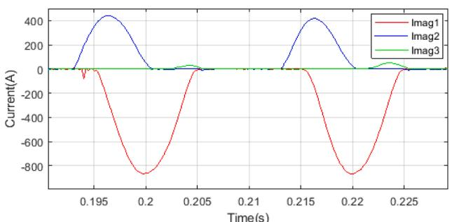  
Fig. 9. Magnetization current deduced from phase currents measurements.

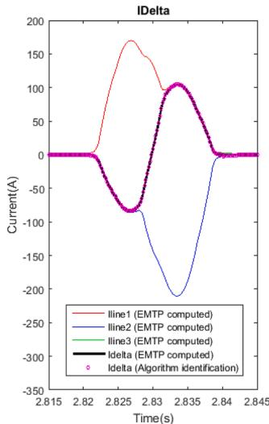

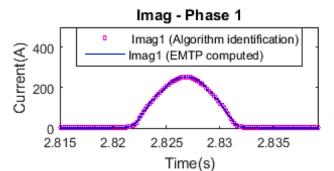

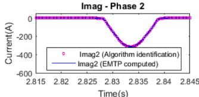

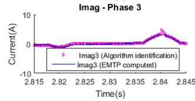  
Fig. 10. Comparison between the delta and magnetizing currents identified by the algorithm and the currents computed with EMTP.

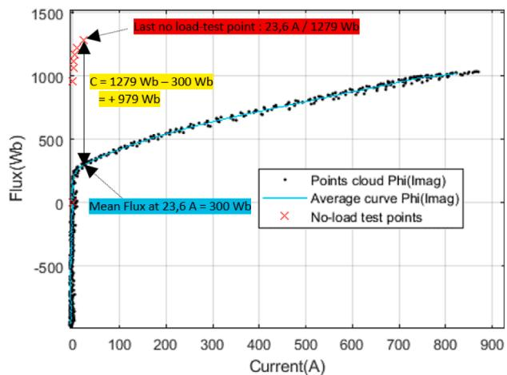  
Fig. 11. Flux as a function of Magnetizing Current Imag, computed from the first five period following the switching.

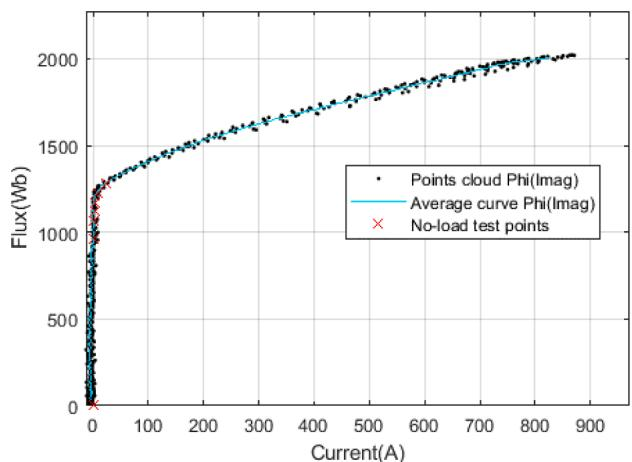  
Fig. 12. Flux as a function of Magnetizing Current – Vertically adjusted with the no-load factory test measurements.

performed on all points ϕ(I) located above the saturation flux to determine the saturation slope (using MATLAB’s polyfit() function with a 1st–order polynomial [15]).

Fig. 13 shows the estimated slope as a function of the point chosen as the start of complete saturation. It allows to underline that the choice of this point is crucial to:

19- estimate the slope (for example, the green and blue curves have a slope much closer to the asymptote of the real curve than the red curve).   
19- better represent the bend of the curve since the last point of the no-load tests is often not located in the saturated zone.

The value of the flux at saturation $( \phi _ { s a t ) }$ can be calculated from the rated induction of the transformer (Br) and the saturation induction of the steel of the magnetic core $( B _ { s a t } )$ by using (7) [13].

$$
\varphi_ {s a t} = \varphi_ {r} * \frac {B _ {s a t}}{B _ {r}} \quad w i t h \varphi_ {r} = \frac {V _ {r} \sqrt {2}}{\omega} \tag {7}
$$

Where $V _ { r }$ is the HV rated voltage of the transformer and ω the angular frequency.

To be able to determine the saturation inductance from the test data, it is necessary that the fluxes in the transformer have at least exceeded the saturation flux during the test.

Typical values for rated induction and saturation induction of the kind of power transformers studied here are [13]: B = 1.65T ± 8%and $B _ { s a t } = 2 T \pm 2 \%$

# 3.5. Precision

With this method, it is thus possible to obtain, for each test where the target transformer has saturated, a value of ${ L } _ { s a t }$ and the coordinates of the complete saturation start point. But the precision of the values obtained mainly depends on:

19- the precision of the voltage and current measurements made during the test   
19- the uncertainties introduced during the data processing (delta current and flux estimation, …)   
19- the level of saturation reached during the test

To obtain a more accurate estimation of $L _ { s a t }$ than the one calculated from the air-core inductance given by the manufacturer, it is necessary to treat several switching transient recordings made at different dates and locations on the type of power transformer we want to model.

The mean value and the standard deviation of the set of saturated inductances $L _ { s a t , i }$ calculated from n independent tests can be respectively estimated by $\overline { { L _ { s a t } } } \mathrm { e t } \sigma ,$ defined in (8).

$$
\overline {{L _ {s a t}}} = \frac {1}{n} \sum_ {i = 1} ^ {n} L _ {s a t, i} \quad a n d \quad \sigma = \sqrt {\frac {1}{n - 1} \sum_ {i = 1} ^ {n} \left(L _ {s a t , i} - \overline {{L _ {s a t}}}\right) ^ {2}} \tag {8}
$$

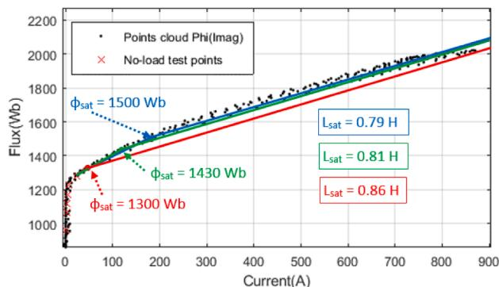  
Fig. 13. Influence of the choice of the flux at saturation on the calculation of the saturated inductance and the representation of the bend of the curve.

$$
T = \frac {L _ {\text {s a t}} - \overline {{L _ {\text {s a t}}}}}{\sigma} \sqrt {n} \tag {9}
$$

Assuming that $L _ { s a t }$ computed values follow a Gaussian law, the quantity T defined in (9) has a Student’s t-distribution with n-1 degrees of freedom and can be used to determine:

19- a confidence interval for $L _ { s a t }$ mean value given by (10)   
19- a prediction interval for a new ${ { L } _ { s a t } }$ observation given by (11)

$$
\overline {{L _ {s a t}}} - \frac {k \sigma}{\sqrt {n}} \leq L _ {s a t, m e a n} \leq \overline {{L _ {s a t}}} + \frac {k \sigma}{\sqrt {n}} \tag {10}
$$

$$
\overline {{L _ {s a t}}} - k \sigma \sqrt {1 + \frac {1}{n}} \leq L _ {s a t} \leq \overline {{L _ {s a t}}} + k \sigma \sqrt {1 + \frac {1}{n}} \tag {11}
$$

where k is given on the following Student’s table (Table 1) as a function of the confidence interval and the number of tests.

In probability and statistics, Student’s t-distribution is any member of a family of continuous probability distributions that arise when estimating the mean of a normally-distributed population in situations where the sample size is small and the population’s standard deviation is unknown. In the Table 1, one can see that for a given confidence interval, the more you have samples or tests, the more your confidence interval can be reduced (small values of k).

# 4. Application

We have applied this method to obtain the model of the 96 MVA auxiliary transformer (410 kV / 6.8 kV) which is in operation in all the 1300 and 1450 MW French nuclear power-plants. The basic model of this three-phase power transformer (Ynd11), established with the method explained in section II, is given on the Table 2.

Since the $2 0 0 0 ^ { \prime } s ,$ about twenty switching on site tests have been performed on different 1300 and 1450 MW power-plants. The measurements recorded during these tests were processed. Among these tests, nine switching led one or more phases to saturation (Table 3).

The histogram on Fig. 14. shows the distribution of the $L _ { s a t }$ calculated values.

With the air-core inductance given by the manufacturer (Table 1), we could estimate that the saturated inductance is within:

Table 1 Student’s Table: k values as a function of the confidence interval and the number of tests.   

<table><tr><td>Confidence Interval Number of tests</td><td>90.0%</td><td>95.0%</td><td>98.0%</td><td>99.0%</td><td>99.9%</td></tr><tr><td>2</td><td>6.31</td><td>12.71</td><td>31.82</td><td>63.66</td><td>636.58</td></tr><tr><td>3</td><td>2.92</td><td>4.30</td><td>6.96</td><td>9.92</td><td>31.60</td></tr><tr><td>4</td><td>2.35</td><td>3.18</td><td>4.54</td><td>5.84</td><td>12.92</td></tr><tr><td>5</td><td>2.13</td><td>2.78</td><td>3.75</td><td>4.60</td><td>8.612</td></tr><tr><td>6</td><td>2.02</td><td>2.57</td><td>3.36</td><td>4.03</td><td>6.87</td></tr><tr><td>7</td><td>1.94</td><td>2.45</td><td>3.14</td><td>3.71</td><td>5.96</td></tr><tr><td>8</td><td>1.89</td><td>2.36</td><td>3.00</td><td>3.50</td><td>5.41</td></tr><tr><td>9</td><td>1.86</td><td>2.31</td><td>2.90</td><td>3.36</td><td>5.04</td></tr><tr><td>10</td><td>1.83</td><td>2.26</td><td>2.82</td><td>3.25</td><td>4.78</td></tr><tr><td>11</td><td>1.81</td><td>2.23</td><td>2.76</td><td>3.17</td><td>4.59</td></tr><tr><td>13</td><td>1.78</td><td>2.18</td><td>2.68</td><td>3.05</td><td>4.32</td></tr><tr><td>15</td><td>1.76</td><td>2.14</td><td>2.62</td><td>2.98</td><td>4.14</td></tr><tr><td>18</td><td>1.74</td><td>2.11</td><td>2.57</td><td>2.90</td><td>3.97</td></tr><tr><td>21</td><td>1.72</td><td>2.09</td><td>2.53</td><td>2.85</td><td>3.85</td></tr><tr><td>31</td><td>1.70</td><td>2.04</td><td>2.46</td><td>2.75</td><td>3.65</td></tr><tr><td>41</td><td>1.68</td><td>2.02</td><td>2.42</td><td>2.70</td><td>3.55</td></tr><tr><td>51</td><td>1.68</td><td>2.01</td><td>2.40</td><td>2.68</td><td>3.50</td></tr><tr><td>101</td><td>1.66</td><td>1.98</td><td>2.36</td><td>2.63</td><td>3.39</td></tr><tr><td>100,001</td><td>1.64</td><td>1.96</td><td>2.33</td><td>2.58</td><td>3.29</td></tr></table>

Table 2 Characteristics of the 96 MVA auxiliary transformer.   

<table><tr><td>Characteristic</td><td colspan="2">Value</td></tr><tr><td>Three-phase rated Power</td><td colspan="2">Sn = 96 MVA</td></tr><tr><td>EHV | HV Voltage</td><td colspan="2">V1= 410/√3 kV | V2= 6.8 kV</td></tr><tr><td>Primary-side | Secondary-side Inductance</td><td colspan="2">L1= 1.56 × 10-3H | L2= 1.28 × 10-4H</td></tr><tr><td>Primary-side | Secondary-side Resistance</td><td colspan="2">R1= 3.11 Ω | R2= 2.43 × 10-3Ω</td></tr><tr><td>Core-Losses Resistance</td><td colspan="2">Rmag = 1.64 × 10^6 Ω</td></tr><tr><td>Saturation curve established from the no-load test</td><td>I</td><td>φ</td></tr><tr><td></td><td>0.33 A</td><td>959.03 Wb</td></tr><tr><td></td><td>1.66 A</td><td>1065.59 Wb</td></tr><tr><td></td><td>2.6 A</td><td>1118.86 Wb</td></tr><tr><td></td><td>4.58 A</td><td>1172.14 Wb</td></tr><tr><td></td><td>7.70 A</td><td>1225.42 Wb</td></tr><tr><td></td><td>23.6 A</td><td>1278.70 Wb</td></tr><tr><td>Air-core inductance</td><td colspan="2">1.115 H (0.2 p.u.) ± 20%</td></tr></table>

Table 3 Results for the 96 MVA auxiliary transformer.   

<table><tr><td>Date</td><td>Maximum Magnetization Current (A)</td><td>Maximum Flux (Wb)</td><td>Lsat (H)</td></tr><tr><td>2001</td><td>415.3</td><td>1659.7</td><td>8.86E-01</td></tr><tr><td>2003</td><td>456.6</td><td>1649.2</td><td>8.31E-01</td></tr><tr><td>2008</td><td>407.0</td><td>1621.9</td><td>8.07E-01</td></tr><tr><td>2009</td><td>452.8</td><td>1680.5</td><td>8.32E-01</td></tr><tr><td>2012</td><td>333.4</td><td>1567.3</td><td>8.24E-01</td></tr><tr><td>2013</td><td>408.3</td><td>1632.0</td><td>8.26E-01</td></tr><tr><td>2013</td><td>557.8</td><td>1712.6</td><td>8.28E-01</td></tr><tr><td>2014</td><td>680.2</td><td>1865.3</td><td>8.39E-01</td></tr><tr><td>2014</td><td>870.5</td><td>2022.3</td><td>8.25E-01</td></tr></table>

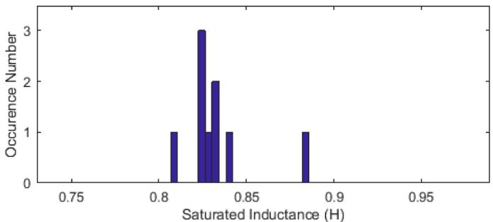  
Fig. 14. Histogram of the $\mathrm { L } _ { \mathrm { s a t } }$ calculated values.

$$
L _ {s a t} = 0. 9 5 9 \pm 0. 2 2 3 H
$$

From these 9 tests, we finally obtain the following 95% prediction interval for the saturated inductance:

$$
L_{sat} = 0.833\pm 0.053H \text{or} L_{sat} = 0.833\pm 6.3\%
$$

This method gives us a more precise estimation of the saturated inductance of the transformer. Furthermore, we can establish three saturation curves by taking into account the uncertainties [14] depending on the number of the studied switching. These three curves can be built from:

19- the no-load test points,

19- the saturation flux (that gives the level over which the magnetic circuit is linear)   
19- the low, mean and high values of the current measured at the saturated flux   
19- the low, mean and high values of the saturated inductance

These curves are plotted on Fig. 15. with the cloud of the points obtained from the tests measurements. We can observe that these curves provide a much more precise approximation of the real behavior of the transformer at saturation than the theoretical curve built from the noload tests points and the air-core inductance given by the manufacturer (blue curve).

In order to better visualize the difference in slopes, the theoretical curve is also plotted using the minimum value of the saturated inductance computed from the field tests (orange curve).

In a particular case, we have simulated the switching of this transformer using the saturation curves shown in Fig. 15. We can see in Fig. 16. how much the saturated inductance and the saturation starting point can affect the peak values of the inrush current and the phase-tophase overvoltage.

The transient overvoltages computed in this case are very sensitive to the saturation curve used. One can note that the current peak is 9% lower and the overvoltage peak is 4% lower with the identified curve. Therefore the transient currents and voltages are less restrictive for the electrical devices.

# 5. Conclusions

The developed method allows to take advantage of the measurements carried out during switching tests made on power transformers.

Despite its limitations (non-representation of the magnetizing linkage, the frequency dependent losses and the asymmetry of the three phases), this original method and the relatively simple resulting model presents many interests to simulate low frequency transients (below 1 kHz).

For transformers that have already been switched on regularly, such as the auxiliary transformer of the French 1300 MW and 1450 MW power-plants, it offers a better knowledge of the transformer’s behavior at saturation and allows the creation of much more realistic and less conservative models. Inrush currents and overvoltage estimations can be therefore much less pessimistic and give a better idea of the real risks taken during the switching operation of the voltage recovery schemes.

For the other transformers, for which the risk analysis is performed using the conservative theoretical model, each future switching tests

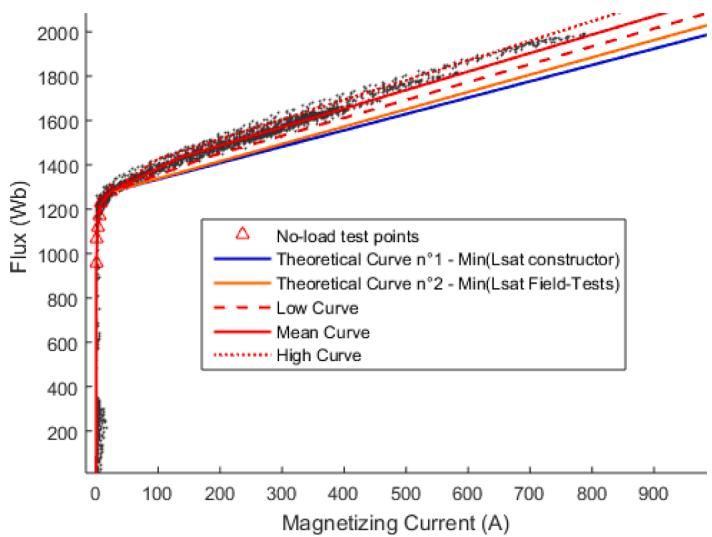  
Fig. 15. Saturation Curves computed from 20 switching tests performed be tween 1999 and 2018 on a 96 MVA auxiliary transformer.

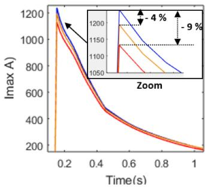

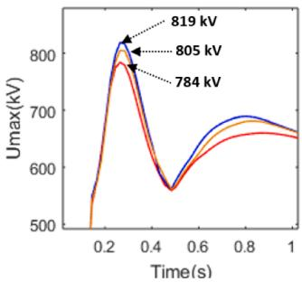  
Fig. 16. Switching of a 96 MVA auxiliary transformer: Peak values of the inrush currents and the phase-to-phase voltage computed respectively with the theoretical curve n◦1 (blue curve), the theoretical curve n◦2 (orange curve) and the low curve computed from fields tests measurements (red curve).

will improve the model that will become more and more representative.

In the future, this method could be adapted to a model that better represents the distribution of the leakage inductance between the two windings and the frequency dependence of the losses.

# CRediT author statement

Toussaint CANAL: Methodology, Software, Formal analysis, Writing - Original Draft, Writing - Review & Editing

François-Xavier ZGAINSKI: Conceptualization, Validation, Supervision

Vincent-Louis RENOUARD: Investigation, Resources

# Declaration of Competing Interest

The authors declare that they have no known competing financial interests or personal relationships that could have appeared to influence the work reported in this paper.

# References

[1] F.X. Zgainski, B. Caillault, V.L. Renouard, Validation of power plant transformers re-energization schemes in case of black-out by comparison between studies and field tests, in: Proceedings of the IPST International Conference on Power Systems Transients (IPST’07), Lyon, France, 2007.   
[2] B. Zouch, F.X. Zgainski, B. Caillault, Network parameters identification using a comparison between on site tests and simulations, in: Proceedings of the IPST International Conference on Power Systems Transients (IPST’15), Cavtat, Croatia, 2015.   
[3] D. Povh, W. Schultz, Analysis of overvoltages caused by transformer magnetizing inrush current, IEEE Trans. Power Apparat. Syst. PAS-97 (4) (1978).   
[4] M.M. Adibi, R.W. Alexander, B. Avramovic, Overvoltage control during restoration, IEEE Trans. Power Syst. 7 (4) (1992) 1464–1470.   
[5] A. Ketabi, A.M. Ranjbar, R. Feuillet, Analysis and control of temporary overvoltages for automated restoration planning, IEEE Trans. Power Deliv. 17 (4) (2002) 1121–1127.   
[6] M. Steurer, K. Frohlich, The Impact of Inrush Curents on the Mechanical Stress of High Voltage Power Transformer Coils, IEEE, 2002.   
[7] M. Rioual, C. Sicre, “Energization of a no-load transformers for power restoration purposes. Impact of the sensitivity of the parameters”, in Proceedings of the IPST International Conference on Power Systems Transients, pp 221–227.   
[8] M. Rioual, Y. Guillot, C. Crepy, Determination of the air-core reactance of transformers by analytical formulae for different topological configurations and its comparison with an electromagnetic 3D approach, in: Proceedings of the IEEE Power & Energy Society General Meeting, Calgary, AB, 2009, pp. 1–8.   
[9] N. Chiesa, H.K. Hoidalen, Systematic switching study of transformer inrush current: simulations and measurements, in: Proceedings of the International Conference on Power Systems Transients, Kyoto, Japan, 2009.   
[10] CIGRE WG C4.307, Transformer energization in power systems: a study guide, CIGRE TB 567 (2014).   
[11] J.A. Martinez, R. Walling, B.A. Mork, J. Martin-Arnedo, D. Durbak, Parameter determination for modeling system transients - part III: transformers, IEEE Trans. Power Deliv. 20 (3) (2005) 2051–2062.   
[12] S.V. Kulkarni, S.A. Khaparde, Transformer Engineering (Design and Practice), ed. par Marcel Dekker, New York., pp. 478, 2004.   
[13] M. Martínez-Duro, “idTRAN, a transformer model for engineering studies with incomplete input data”, in Proceedings of the IPST International Conference on Power Systems Transients, paper#: 19IPST120.   
[14] M. Martínez-Duro, ´ F.X. Zgainski, B. Caillault, Transformer energization studies with uncertain power system configurations, in: Proceedings of the IPST International Conference on Power Systems Transients (IPST’13), Vancouver, Canada, 2013.   
[15] V. Rovenski, Modeling of Curves and Surfaces with MATLAB, Springer, 2010, pp. 53–55.