# 基于 MMC 平均值仿真模型的损耗快速评估方法

孙正东，郝全睿*

(电网智能化调度与控制教育部重点实验室(山东大学)，山东省 济南市 250061)

# Fast Loss Evaluation Method Based on MMC Average Simulation Model

SUN Zhengdong, HAO Quanrui*

(Key Laboratory of Power System Intelligent Dispatch and Control of Ministry of Education (Shandong University),

Jinan 250061, Shandong Province, China)

ABSTRACT: To address the problem that the calculation accuracy and speed of MMC losses are difficult to balance, a fast online evaluation method of losses is proposed. First, based on the determined modulation and capacitor voltage balance strategy, the switching frequency surface is constructed to reflect the switching frequency under any steady-state working condition. Next, the upper limit of switching frequency and the upper limit of switching losses are calculated by using the average value model. Once again, combined with the calculation results and the switching frequency surface, the rapid calculation of the actual losses is realized with high accuracy. Then, considering the impact of losses on the simulation results, the energy absorbed by a controlled voltage source connected in series on the bridge arm is used to characterize the losses. A switching loss injection method based on attenuation function is proposed to avoid injection voltage spikes and improve injection efficiency. Finally, an MMC average simulation model considering loss injection is built in PSCAD to verify the computational efficiency and accuracy of the proposed method.

KEY WORDS: modular multilevel converter (MMC); power loss calculation; average value model; loss injection

摘 要 ： 针 对 模 块 化 多 电 平 换 流 器 (modular multilevelconverter，MMC)损耗计算精度和速度难以兼顾的问题，提出一种 MMC 损耗快速在线评估方法。首先，基于确定的调制和电容电压平衡策略，构建开关频率曲面以反映任意稳态工况下的开关频率；其次，利用平均值模型计算开关频率上限和开关损耗功率上限；再次，结合计算结果和开关频率曲面，近似快速计算实际开关损耗，兼顾计算精度和计算效率；然后，考虑到损耗对仿真结果的影响，利用串联在桥臂上的

受控电压源吸收的能量表征损耗，同时提出一种基于衰减函数的开关损耗注入方法，避免产生注入电压尖峰并改善注入效果。最后，在PSCAD中搭建计及损耗注入的MMC平均值仿真模型，验证所提方法的计算效率和准确性。

关键词：模块化多电平换流器；损耗计算；平均值模型；损耗注入

# 0 引言

模 块 化 多 电 平 换 流 器 (modular multilevelconverter，MMC)因其结构易拓展、波形质量高、故障处理能力强而被广泛应用于直流输电领域[1-3]。MMC 损耗是直流输电系统运行过程中损耗的主要组成部分。对于损耗的准确评估关系到散热系统的设计、电力电子器件选型和直流输电系统的经济性、可靠性评估，具有重要的现实意义和研究价值[4-5]。

MMC 损耗主要包括开关器件的导通损耗和开关损耗：导通损耗与器件导通期间流过的电流和导通数目相关，评估难度较小；开关损耗则与器件开断前的电流、电压和开断状态相关。实际工程中，MMC 单个桥臂子模块多达数百个且投切状态受电容电压平衡策略影响，动态特性复杂，开关损耗评估难度大。

现有的 MMC 损耗计算方法大体可分为 2 类。

第1类方法通过详细电磁暂态仿真模型获得电压、电流波形与开关器件的导通信号，通过对数据二次处理得到损耗的计算结果。文献[6]结合详细模型电磁暂态仿真数据与热电路模型，迭代计算损耗，在计算损耗时考虑了器件结温的影响，并不关注计算效率；文献[7]提出了一种基于结温预估的计算方法，该方法考虑到实际情况中散热器热阻较小，进而对文献[6]所提的计算过程进行简化。

第 2 类方法根据解析公式直接计算损耗[8-11]。文献[8]分段解析计算损耗。其中开关损耗只解析计算由于参考电压变化而产生的部分，对于由电容电压平衡策略和调制方法引起的开关损耗只给出了简易、保守的估算；文献[9]提出了一种基于桥臂电流绝对值和平均值的简化解析计算方法，该方法只针对文献[12]提出的电压平衡策略计算开关损耗，缺乏通用性；文献[10]引入桥臂子模块投入占空比的概念并以此为基础计算损耗，对于开关损耗的计算提出了一种开关频率越高、误差越小的近似计算方法；文献[11]采用数值计算得出电压、电流和开关器件的导通信号，进而计算损耗，但数值计算采用的 MMC模型过于简单。

在计算精度方面，第 1类方法通过详细电磁暂态仿真模型获得精确的数据，特别是开关器件的导通信号，因此计算精度较高；第 2类方法可以准确计算导通损耗，但对于开关损耗，由于其受电容电压平衡策略和调制方式的影响，解析计算困难，计算精度不高。

在计算效率方面，第 1类方法所需数据要利用能反映MMC子模块开关动态的详细电磁暂态模型获得，但 MMC 中子模块数目众多，详细模型仿真速度慢，计算效率低；第 2 类方法建立了损耗的解析表达式，计算效率高。

为了提高损耗尤其是开关损耗计算的精确度并降低计算耗时，文献[13]基于平均值模型，解析表达各子模块电容的充放电过程，并在每个仿真步长更新，一定程度上提高了数据的获取速度，但仍需将仿真数据导入 Matlab 中进行损耗计算，操作较为繁琐；文献[14]利用数值计算近似模拟仿真过程，提高了损耗计算速度，但无法计及控制环节的影响；文献[15]认为在单位功率因数下，传输功率与开关频率线性相关，并通过插值获得二者的对应关系，基于对应关系得到各工况下的子模块轮换数，进而计算开关损耗。该方法仅适用于 MMC 运行在单位功率因数的情况下，具有局限性。

综上所述，现有的 MMC 损耗评估方法很难同时兼顾准确性和计算效率，或者只针对特定情况，缺乏通用性。

此外，现有关于 MMC损耗的研究主要聚焦在损耗的精确、快速计算方面，鲜有文献考虑到损耗对 MMC 系统仿真结果的影响。文献[16]提出了一种考虑损耗的 IGBT 模型，将 IGBT 模块产生的损

耗以受控电压源的形式实时注入到仿真模型中，并将其成功应用到两电平 VSC 上；文献[17]指出，传统 IGBT 的伴随离散电路模型在损耗模拟方面存在不足，并根据 IGBT 的损耗特性，采用响应匹配的方法，分工况对伴随离散电路模型进行改进。现有研究大多通过改进 IGBT 模型使得仿真过程计及损耗的影响，但 MMC 子模块数目众多，若采用改进的 IGBT 模型，仿真速度势必会进一步降低。

为了解决上述问题，本文基于仿真和解析计算的思想，提出一种利用 MMC 平均值模型快速评估损耗的方法，兼顾损耗计算精度和计算效率。同时基于所提计算方法，构建一种计及损耗影响的MMC 快速仿真模型，将计算出的损耗注入系统中，使仿真模型更能反映实际情况。本文的创新点主要包括：

1）提出一种基于 MMC 平均值模型的损耗快速评估方法：①基于开关损耗的产生原理，构建开关损耗的近似表达式；②基于开关频率数据，二维插值生成开关频率曲面，利用开关频率曲面反映任意稳态工况下的开关频率；③提出半平均值模型的构建方法，利用半平均值模型收集开关频率数据，提高仿真效率。  
2）提出一种计及损耗影响的 MMC 损耗注入方法：①用 MMC 桥臂上串联的受控电压源吸收的能量表征损耗；②将开关损耗以衰减的形式注入系统，以避免电压尖峰的产生；③设计新的衰减函数，以获得更好的注入效果。

# 1 MMC 基本拓扑结构及平均值模型

MMC 的基本拓扑结构如图 1 所示，换流器由

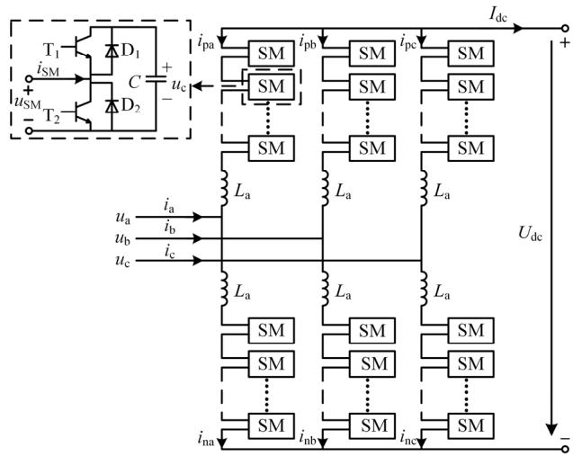  
图 1 MMC 基本拓扑结构  
Fig. 1 Basic structure of MMC

6 个桥臂组成，每个桥臂由 N 个结构完全相同的子模块和 1 个电抗器 $\left( L _ { \mathrm { a } } \right)$ 串联而成，上下 2 个桥臂构成 1 个相单元。子模块采用半桥子模块拓扑(halfbridge sub-module，HBSM)，HBSM 由 2 个 IGBT(T1、T2)、2 个反并联二极管 $( \mathrm { D } _ { 1 }$ 、 $\mathrm { D } _ { 2 } )$ 和一个电容器(C)组成。

MMC 平均值模型如图 2 所示。各相上、下桥臂等效为受控电压源 $u _ { \mathrm { p } x }$ 和 $u _ { \mathrm { n } x } ( x = \mathsf { a } , \mathsf { b } , \mathsf { c } )$ ，由等效电容 $C _ { \mathrm { e q } }$ 和受控电流源组成的外部耦合电路进行控制。与 MMC 详细模型相比，平均值模型用受控电压源、受控电流源和等效电容组成的耦合电路取代了详细模型中大量的开关器件和电容，简化了桥臂结构，在确保能反映 MMC 内部动态特性的同时，大大提高了仿真的运行速度。

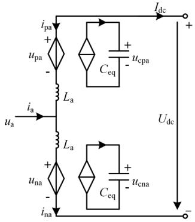  
图 2 MMC 平均值模型  
Fig. 2 Average value model of MMC

# 2 MMC 的损耗计算

# 2.1 MMC 的损耗组成

MMC 的损耗组成如图 3 所示，大体可分为主电路损耗和底层控制损耗两类。由电力电子器件的非理想特性而产生的 IGBT 损耗和二极管损耗是MMC 损耗的主要组成部分，其他损耗如储能元件

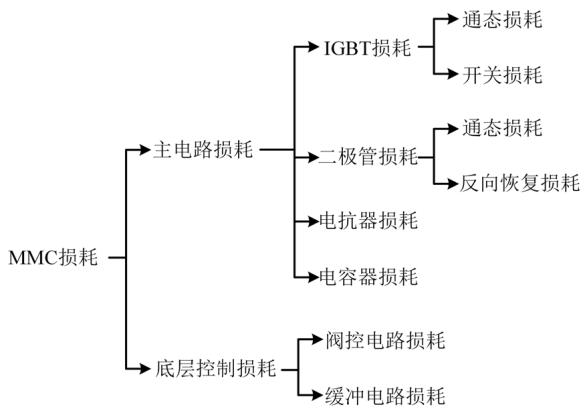  
图 3 MMC 的损耗组成  
Fig. 3 The loss constitution of MMC

损耗和底层控制损耗等相对较小，在计算损耗时通常将其忽略[18-19]，因此本文只考虑由 IGBT、二极管产生的损耗。

# 2.2 MMC 通态损耗计算

IGBT、二极管的通态损耗功率可以用通态压降与通态电流的乘积来表示：

$$
P _ {\mathrm {T} _ {\text {c o n d}}} = U _ {\mathrm {C E}} i _ {\mathrm {C E}} = \left(R _ {\mathrm {T 0}} i _ {\mathrm {C E}} + U _ {\mathrm {C E 0}}\right) i _ {\mathrm {C E}} \tag {1}
$$

$$
P _ {\mathrm {D} \_ \text {c o n d}} = U _ {\mathrm {D}} i _ {\mathrm {F}} = \left(R _ {\mathrm {D 0}} i _ {\mathrm {F}} + U _ {\mathrm {D 0}}\right) i _ {\mathrm {F}} \tag {2}
$$

式中： $P _ { \mathrm { T \_ c o n d } }$ 为 IGBT 的通态损耗功率； $P _ { \mathrm { D \_ c o n d } }$ 为二极管的通态损耗功率； $i _ { \mathrm { C E } }$ 、 $i _ { \mathrm { F } }$ 分别为流经 IGBT、二极管的电流； $U _ { \mathrm { C E 0 } }$ 、 $U _ { \mathrm { D 0 } }$ 分别为 IGBT、二极管的通态电压偏置； $R _ { \mathrm { T 0 } } .$ 、 $R _ { \mathrm { D 0 } }$ 分别为 IGBT、二极管的通态电阻。 $U _ { \mathrm { C E 0 } }$ 、 $U _ { \mathrm { D 0 } }$ 、 $R _ { \mathrm { T 0 } }$ 、 $R _ { \mathrm { D 0 } }$ 的具体数值可以基于厂商提供的数据手册中的数据，通过曲线拟合的方式得到[20]。

某一时刻，MMC 桥臂子模块的通态损耗取决于这一时刻投入、切除的子模块数目和桥臂电流方向。结合图 4中不同情况下 HBSM 的电流流通路径和式(1)、(2)，以 a 相上桥臂为例，a相上桥臂的平均通态损耗功率可以按照式(3)计算：

$$
P _ {\mathrm {p a} _ {\text {c o n d}}} = \left\{\int_ {t _ {1}} ^ {t _ {2}} P _ {\mathrm {T} _ {\text {c o n d}}} \left[ \rho_ {1} n _ {\mathrm {p a}} + \rho_ {2} \left(N - n _ {\mathrm {p a}}\right) \right] + P _ {\mathrm {D} _ {\text {c o n d}}} \cdot \right.
$$

$$
\left[ \rho_ {2} n _ {\mathrm {p a}} + \rho_ {1} \left(N - n _ {\mathrm {p a}}\right) \right] \mathrm {d} \tau \} / \left(t _ {2} - t _ {1}\right), \quad \left\{ \begin{array}{l} \left\{\rho_ {1} = 0, i _ {\mathrm {p a}} > 0 \right. \\ \left\{\rho_ {2} = 1, i _ {\mathrm {p a}} <   0 \right. \\ \left\{\rho_ {1} = 1, i _ {\mathrm {p a}} <   0 \right. \\ \left\{\rho_ {2} = 0, i _ {\mathrm {p a}} <   0 \right. \end{array} \right. \tag {3}
$$

式中： $n _ { \mathrm { { p a } } }$ 为 a 相上桥臂的子模块投入总数目； $\rho _ { 1 }$ 、

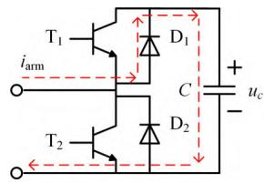  
(a) $i _ { \mathrm { a r m } } > 0 ,$ ，子模块投入

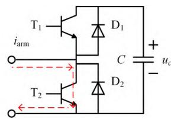  
(b) $i _ { \mathrm { a r m } } > 0 ,$ ，子模块切除

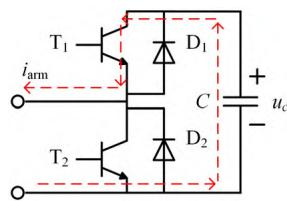  
(c) $i _ { \mathrm { a r m } } < 0 ,$ ，子模块投入

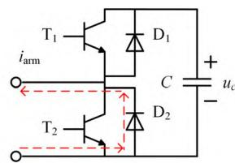  
(d) $i _ { \mathrm { a r m } } < 0 ,$ ，子模块切除   
图4 不同情况下HBSM 的电流流通路径  
Fig. 4 The current flow path of HBSM under different conditions

$\rho _ { 2 }$ 为与桥臂电流方向有关的函数； $t _ { 1 }$ $t _ { 2 }$ 为两个不同的时刻。

当 MMC 运行在三相对称条件下时，各个桥臂的通态损耗相同，则整个 MMC 的平均通态损耗功率为

$$
P _ {\text {c o n d}} = 6 P _ {\text {p a} \_ \text {c o n d}} \tag {4}
$$

# 2.3 MMC 开关损耗计算

开关器件的开关过程会产生损耗。根据生产商提供的数据手册，利用曲线拟合可以近似计算IGBT 的开通损耗 $E _ { \mathrm { o n } } .$ 、关断损耗 $E _ { \mathrm { o f f } }$ 和二极管的反向恢复损耗 $E _ { \mathrm { r e c } } ^ { [ 2 1 - 2 2 ] }$ ：

$$
\left\{ \begin{array}{l} E _ {\text {o n}} \left(i _ {\mathrm {C E}}\right) = \left(a _ {1} i _ {\mathrm {C E}} ^ {2} + b _ {1} i _ {\mathrm {C E}} + c _ {1}\right) \frac {u _ {\mathrm {c}}}{u _ {\mathrm {r e f}}} \\ E _ {\text {o f f}} \left(i _ {\mathrm {C E}}\right) = \left(a _ {2} i _ {\mathrm {C E}} ^ {2} + b _ {2} i _ {\mathrm {C E}} + c _ {2}\right) \frac {u _ {\mathrm {c}}}{u _ {\mathrm {r e f}}} \\ E _ {\text {r e c}} \left(i _ {\mathrm {F}}\right) = \left(a _ {3} i _ {\mathrm {F}} ^ {2} + b _ {3} i _ {\mathrm {F}} + c _ {3}\right) \frac {u _ {\mathrm {c}}}{u _ {\mathrm {r e f}}} \end{array} \right. \tag {5}
$$

式中： $a _ { i } \setminus b _ { i } \setminus c _ { i } ( i = 1 , 2 , 3 )$ 为拟合参数，基于数据手册中的数据，通过拟合的方式得到； $u _ { \mathrm { r e f } }$ 为参考截止电压； $u _ { \mathrm { c } }$ 为子模块电容电压。

以 a 相上桥臂为例，在 t 时刻桥臂子模块的投切状态发生改变，根据子模块的投切情况和桥臂电流方向，结合表 1 中的损耗组合类型，得到此时刻桥臂产生的开关损耗能量为

$$
E (t) _ {\mathrm {p a} \_ \mathrm {s w}} = \sum_ {i = 1} ^ {N} E (t) _ {\mathrm {p a} \_ \mathrm {s w} i} \tag {6}
$$

式中 $E ( t ) _ { \mathrm { p a } \_ \mathrm { s w } i }$ 为 t 时刻 a 相上桥臂第 i 个子模块产生的开关损耗能量。

表1 不同情况下HBSM 开关损耗组合类型  
Table 1 The switching loss combination type of HBSM under different condations   

<table><tr><td>电流方向</td><td>SM状态</td><td>T1状态</td><td>T2状态</td><td>组合类型</td></tr><tr><td rowspan="2">正</td><td>1→0</td><td>1→0</td><td>0→1</td><td>Eon+Erec</td></tr><tr><td>0→1</td><td>0→1</td><td>1→0</td><td>Eoff</td></tr><tr><td rowspan="2">负</td><td>1→0</td><td>1→0</td><td>0→1</td><td>Eoff</td></tr><tr><td>0→1</td><td>0→1</td><td>1→0</td><td>Eon+Erec</td></tr></table>

将一段时间内的开关损耗能量叠加并求平均值，就可得桥臂在这一段时间内的平均开关损耗功率：

$$
P _ {\mathrm {p a} \_ \mathrm {s w}} = \frac {1}{t _ {2} - t _ {1}} \sum E (t) _ {\mathrm {p a} \_ \mathrm {s w}}, \quad t _ {1} \leq t \leq t _ {2} \tag {7}
$$

当 MMC 在三相对称条件下运行时，各个桥臂

的开关损耗相等，则整个 MMC 的平均开关损耗功率为

$$
P _ {\mathrm {s w}} = 6 P _ {\mathrm {p a} \_ \mathrm {s w}} \tag {8}
$$

式(7)计算平均开关损耗功率时需要知道 $t _ { 1 } { - } t _ { 2 }$ 时间内开关器件的开关次数，如引言所述，现有方法主要通过仿真获取开关器件的电压波形，从而获取 $t _ { 1 } { - } t _ { 2 }$ 时间内准确的开关次数。如上文所述，因为仿真模型需要用到开关器件的详细模型，仿真耗时长，当子模块数目多时，常规仿真软件(如 PSCAD)难以适用。

# 3 基于平均值模型的 MMC 损耗快速评估方法

为了快速准确评估 MMC 损耗，本文提出了一种基于 MMC 平均值模型的 MMC 损耗快速评估方法。该方法基本思路如图 5 所示，包括 4 个基本环节：

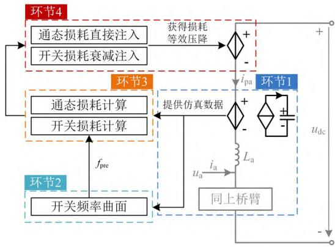  
图5 考虑损耗注入的快速平均值模型  
Fig. 5 Fast average value model considering loss injection

1）利用 MMC 平均值模型获取电容电压和桥臂电流波形；

2）根据开关频率曲面获取实际开关频率；

3）根据实际开关频率计算开关及导通损耗；

4）将损耗对应的等效压降注入平均值模型。

环节1中的MMC平均值模型已在2节做详细介绍，本文不做赘述。环节 2 和 3 的难点为如何快速计算开关损耗，环节4 的难点为如何解决开关损耗注入时存在的电压尖峰问题。下文将重点介绍开关损耗的快速计算和损耗注入方法。

# 3.1 基于开关损耗上限的开关损耗快速计算

# 3.1.1 基本思想

开关损耗的精确计算需要子模块各个时刻投切状态这一关键信息，但 MMC 平均值模型桥臂为

简化结构，并不包含子模块各时刻投切状态信息。因此，可以根据 MMC平均值模型计算出开关频率上限及对应的开关损耗上限。

由式(5)—(8)可知，在系统参数确定的情况下，开关损耗功率与电流波形和 $t _ { 1 } { - } t _ { 2 }$ 时间内的开关次数即开关频率相关。相同工况下，电流波形一致，开关损耗功率仅与开关频率相关且为正相关，即开关频率越高，开关损耗功率越大。因此，实际的开关损耗功率可以表示为

$$
P _ {\mathrm {s w}} \approx \frac {f _ {\mathrm {r e a l}}}{f _ {\mathrm {m a x}}} P _ {\mathrm {s w} - \max } \tag {9}
$$

式中： $P _ { \mathrm { s w } \setminus P _ { \mathrm { s w } \_ \mathrm { m a x } } }$ 分别为实际开关损耗功率和开关损耗功率上限； $f _ { \mathrm { r e a l } } , \ f _ { \mathrm { m a x } }$ 分别为实际开关频率和开关频率上限。

# 3.1.2 开关频率上限与开关损耗功率上限

利用式(9)计算开关损耗，首先要明确开关频率上限和开关损耗功率上限的计算方法，下文将对此进行说明。

每个控制周期时刻子模块的投切状态都尽可能的发生改变时，MMC 的开关频率将达到上限。具体来说： $t - \Delta T$ 时刻时，桥臂投入的子模块数目为 $n ( t { - } \Delta T )$ ，切除的子模块数目为 $N - n ( t - \Delta T )$ ；t时刻时，在 t − ∆T 时刻投入的 n(t − ∆T)个子模块优先被切除，切除的 $N - n ( t - \Delta T )$ 个子模块优先被投入，其中 ∆T 表示控制周期。记当前控制周期时刻由投入到切除的子模块数目为 $n _ { ( 1 - 0 ) }$ ，由切除到投入的子模块数目为 $n _ { ( 0 - 1 ) }$ 。具体可分为以下两种情况：

1） $n ( t ) \ge N - n ( t - \Delta T )$ ：在 t−∆T 时刻处于切除状态的 $N - n ( t - \Delta T )$ 个子模块在 t 时刻应该全部投入，处于投入状态的 $n ( t - \Delta T )$ 个子模块中有 n(t)−$( N - n ( t - \Delta T ) )$ 个保持不变，其他 $N - n ( t )$ 个全部切除。综上，此时 $n _ { ( 1 - 0 ) } = N - n ( t ) \cdot ~ n _ { ( 0 - 1 ) } = N - n ( t - \Delta T )$ 。  
2） $n ( t ) < N - n ( t - \Delta T )$ ：在 t−∆T 时刻处于切除状态的 N−n(t−∆T)个子模块在 t 时刻应有 n(t)个投入，其他 $N - n ( t - \Delta T ) - n ( t )$ 个保持不变，处于投入状态 $n ( t { - } \Delta T )$ 个子模块全部切除。综上，此时 $n _ { ( 1 - 0 ) } =$ $n ( t - \Delta T ) \cdot ~ n _ { ( 0 - 1 ) } = n ( t )$ 。

综合两种情况，在相邻的两个控制周期内，MMC 桥臂子模块开关次数上限的具体计算过程如图 6 所示。

开关频率为单个开关器件在一段时间内的开关次数与时间的比值。HBSM 每次动作都会有 1个

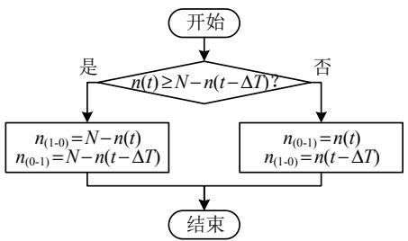  
图 6 子模块开关次数上限计算过程 $( t _ { 1 } \leq t \leq t _ { 2 } )$   
Fig. 6 Calculation process of upper limit of switching times of SM (t1 ≤ t  ≤ t2)

IGBT 开通、1 个 IGBT 关断，因此 HBSM 动作 1次，开关次数就增加 1 次。根据图 6，可按照式(10)计算开关器件的开关频率上限：

$$
f _ {\max } = \frac {\sum (n (t) _ {(1 - 0)} + n (t) _ {(0 - 1)})}{2 N \left(t _ {2} - t _ {1}\right)}, \quad t _ {1} \leq t \leq t _ {2} \tag {10}
$$

式中 2N 为一桥臂上 IGBT模块的总数。

在实际运行过程中，系统会采用电容电压平衡策略来维持子模块电容电压平衡，故一桥臂上各个子模块电容电压偏差很小，可近似认为相等并以MMC 平均值模型中桥臂等效电容电压的平均值来表示，进而 a 相上桥臂在 t 时刻的开关损耗能量上限为

$$
E (t) _ {\mathrm {p a} \text {s w} \max } = \left\{ \begin{array}{c c} \left(E _ {\mathrm {o n}} + E _ {\mathrm {r e c}}\right) n (t) _ {\mathrm {p a} (1 - 0)} + & \\ \left(E _ {\mathrm {o f f}}\right) n (t) _ {\mathrm {p a} (0 - 1)}, & i _ {\mathrm {p a}} > 0 \\ \left(E _ {\mathrm {o n}} + E _ {\mathrm {r e c}}\right) n (t) _ {\mathrm {p a} (0 - 1)} + & \\ \left(E _ {\mathrm {o f f}}\right) n (t) _ {\mathrm {p a} (1 - 0)}, & i _ {\mathrm {p a}} <   0 \end{array} \right. \tag {11}
$$

将一段时间内的开关损耗能量叠加并求平均值，可得桥臂在这一段时间内的平均开关损耗功率上限：

$$
P _ {\text {p a} \text {s w} \text {m a x}} = \frac {1}{t _ {2} - t _ {1}} \sum E (t) _ {\text {p a} \text {s w} \text {m a x}}, \quad t _ {1} \leq t \leq t _ {2} \tag {12}
$$

当 MMC 在三相对称条件下运行时，各个桥臂的开关损耗相等，则整个 MMC 的平均开关损耗功率上限为

$$
P _ {\text {s w} \text {m a x}} = 6 P _ {\text {p a} \text {s w} \text {m a x}} \tag {13}
$$

# 3.1.3 实际开关频率 $f _ { \mathrm { r e a l } }$ 的快速获取

为了快速获得任意稳态工况下的开关频率，可将 MMC 详细模型全工况网格化运行，获得工况网格点处的开关频率，通过二维插值的方式生成开关频率曲面，进而近似获得任意稳态工况下的开关频率 $f _ { \mathrm { p r e } ^ { \mathrm { o } } }$ 。为了保证一定的准确度，网格步长不能太大，开关频率数据集的体量不能太小，因此需要多次运

行详细模型，时间成本较高。本文采用半平均值模型代替详细模型获取开关频率数据集则可以降低时间成本，并保证准确度。

半平均值模型的拓扑结构如图 7 所示，其中1 个相单元中的桥臂采用文献[23]提出的结构，其余相单元桥臂子模块则用受控电压源与外部耦合电路代替。与详细模型相比，半平均值模型减少了2/3 的开关器件和电容，同时余下的子模块与桥臂在电气上解耦，大大提高了仿真运行速度。与平均值模型相比，则保留了子模块各个时刻的投切状态，可用于针对子模块动态特性的研究。

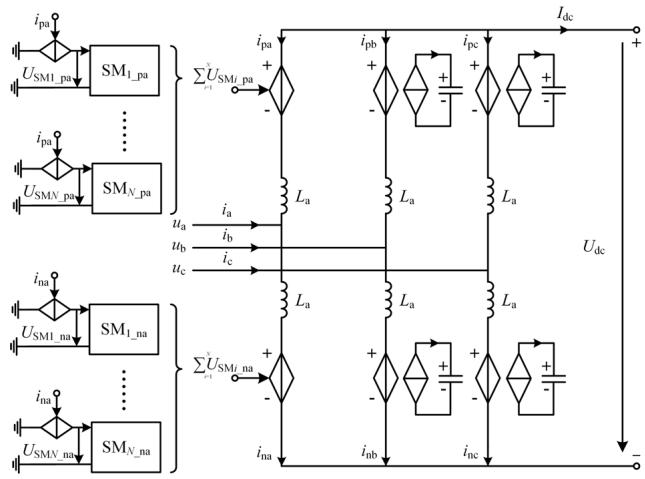  
图 7 MMC 半平均值模型  
Fig. 7 The half average value model of MMC

# 3.1.4 开关损耗快速计算总体流程

开关损耗快速计算总体流程如图8所示。首先，将运行工况网格化，利用 MMC 半平均值模型收集工况网格点处的开关频率数据，二维插值生成开关频率曲面；其次，利用MMC 平均值模型计算工况P、Q 下的开关频率、开关损耗功率上限；然后，利用开关频率曲面获得工况P、Q下的开关频率 $f _ { \mathrm { p r e } }$ ，

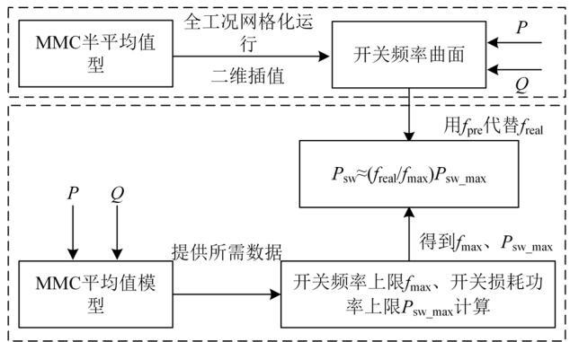  
图8 开关损耗快速计算总体流程  
Fig. 8 The overall process of fast calculation of switching losses

用以代替 $f _ { \mathrm { r e a l } } ;$ ；最后利用式(9)计算工况 P、Q 下的实际开关损耗功率。

# 3.2 MMC 损耗注入方法

为了在系统中体现 MMC 的损耗，可在桥臂上串联受控电压源，用受控电压源吸收的能量来模拟系统中的损耗。总的损耗压降为通态损耗压降和开关损耗压降之和。

# 3.2.1 通态损耗直接注入

以 a 相上桥臂为例，在 $( t , t + \Delta t )$ 这一时间段内桥臂的平均通态损耗功率为

$$
\begin{array}{l} P _ {\mathrm {p a} _ {\text {c o n d}}} = \frac {1}{\Delta t} \int_ {t} ^ {t + \Delta t} \left\{P _ {\mathrm {T} _ {\text {c o n d}}} \left[ \rho_ {1} n _ {\mathrm {p a}} + \rho_ {2} (N - n _ {\mathrm {p a}}) \right] + \right. \\ P _ {\mathrm {D} _ {-} \text {c o n d}} \left[ \rho_ {2} n _ {\mathrm {p a}} + \rho_ {1} \left(N - n _ {\mathrm {p a}}\right) \right] \} \mathrm {d} \tau \tag {14} \\ \end{array}
$$

式中 ∆t 为仿真步长。

为了能更好地模拟实际情况，∆t 通常取很小的值。因此，在 $( t , t + \Delta t )$ 时间段内可将桥臂电流视为定值，则式(14)可修改为

$$
\begin{array}{l} P _ {\mathrm {p a} \_ \text {c o n d}} (t) = P _ {\mathrm {T} \_ \text {c o n d}} \left[ \rho_ {1} n _ {\mathrm {p a}} (t) + \rho_ {2} (N - n _ {\mathrm {p a}} (t)) \right] + \\ P _ {\mathrm {D} _ {\text {c o n d}}} \left[ \rho_ {2} n _ {\mathrm {p a}} (t) + \rho_ {1} \left(N - n _ {\mathrm {p a}} (t)\right) \right] \tag {15} \\ \end{array}
$$

因此 a 相上桥臂在 $( t , t + \Delta t )$ 时间段内的通态损耗压降为

$$
u _ {\mathrm {p a} _ {\text {c o n d}}} (t) = \frac {P _ {\mathrm {p a} _ {\text {c o n d}}} (t)}{i _ {\mathrm {p a}} (t)} \tag {16}
$$

# 3.2.2 开关损耗衰减注入

以 a 相上桥臂为例，为了体现由器件开关动作产生的能量损耗，最简单的方法是将开关损耗直接注入系统，即在 $( t , t + \Delta t )$ 时间段内产生的开关损耗压降为

$$
u _ {\mathrm {p a} _ {\mathrm {s w}}} (t) = \frac {E _ {\mathrm {p a} _ {\mathrm {s w}}} (t)}{i _ {\mathrm {p a}} (t) \cdot \Delta t} \tag {17}
$$

∆t 的取值一般很小，采用这种方法计算出的开关损耗压降存在电压尖峰，特别是在桥臂电流值很小的时候。实际上，这些电压尖峰并不是真实存在的，而是为了体现由于开关动作造成的能量耗散计算得出的。所以，为了避免电压尖峰的产生，在一个步长中产生的开关损耗并不一次性注入到下一个步长，而是采用衰减注入的方式引入系统，使注入的开关损耗和计算得出的开关损耗在一个比较短的时间段内近似相等[16]。

设在 $n _ { \mathrm { t } } \Delta t$ 时刻 $( n _ { \mathrm { t } } { = } N ^ { ' } )$ 产生的开关损耗，大小为$E _ { \mathrm { p a } \_ \mathrm { s w } } ( n _ { \mathrm { t } } \Delta t )$ 。以 $n _ { \mathrm { t } } \Delta t$ 时刻为衰减函数的 0 时刻点，

$E _ { \mathrm { p a } \_ \mathrm { s w } } ( n _ { \mathrm { t } } \Delta t )$ 大小的能量将由衰减函数引入系统，即：

$$
E _ {\mathrm {p a} \_ \mathrm {s w}} ^ {\text {i n} n _ {\mathrm {t}} \Delta t} (t) = E _ {\mathrm {p a} \_ \mathrm {s w}} \left(n _ {\mathrm {t}} \Delta t\right) \int_ {0} ^ {t} f \mathrm {d} t, \quad \int_ {0} ^ {+ \infty} f \mathrm {d} t = 1 \tag {18}
$$

式中： $E _ { \mathrm { p a } \_ \mathrm { s w } } ^ { \mathrm { i n } \ n _ { \mathrm { t } } \Delta t } ( t )$ 为引入系统的开关损耗能量；f 为含参数λ的衰减函数。可以看出，随着时间的增大，$E _ { \mathrm { p a } \_ \mathrm { s w } } ^ { \mathrm { i n } \ n _ { \mathrm { t } } \Delta t } ( t )$ 与 $E _ { \mathrm { p a } \_ \mathrm { s w } } ( n _ { \mathrm { t } } \Delta t )$ 在数值上会逐渐接近。

本文采用的衰减函数(记为 $f _ { 1 } ) _ { }$ 为 $2 \lambda ^ { 2 } t \mathrm { e } ^ { - ( \lambda t ) ^ { 2 } }$ 。与文献[16]采用的指数衰减函数 $\lambda \mathrm { e } ^ { - \lambda t } ($ (记为 f2)相比，具有平均注入速度更快，即能将开关损耗更快引入系统和开关损耗压降波动峰值更小的优势。

$n _ { \mathrm { t } } \Delta t$ 时刻产生的开关损耗分别基于 f1、f2 衰减注入的示意图如图 9 所示。图 9(a)为开关损耗衰减注入的过程示意图，横轴为时间轴，纵轴为开关损耗被引入系统的比例。以开关损耗的 90%为限，计算注入所用时间， $f _ { 1 }$ 约为 1.52/λ， $f _ { 2 }$ 约为 2.3/λ，显然 $f _ { 1 }$ 的平均注入速度更快，这说明 $f _ { 1 }$ 能比 $f _ { 2 }$ 更快地将开关损耗引入系统。图 9(b)为开关损耗衰减注入的速度示意图，即 f1、 $f _ { 2 }$ 的函数图像，由图可知， $f _ { 1 }$ 的最大值约为 0.86λ，而 f 的最大值为λ，这意味着采用 f 做衰减注入函数时，开关损耗能被更均匀的引入系统，开关损耗压降的波动峰值会随之减小。

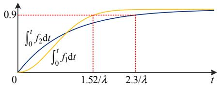  
(a) 衰减注入过程示意图

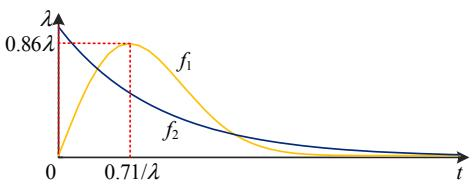  
(b) 衰减注入速度示意图  
图9 衰减注入示意图  
Fig. 9 Attenuation injection diagram

从时间的角度来看，在(t,t+∆t)这一时间段内，所要注入的开关损耗能量则为

$$
E _ {\mathrm {p a} _ {\mathrm {s w}}} ^ {\text {i n}} (t) = E _ {\mathrm {p a} _ {\mathrm {s w}}} (t) \int_ {0} ^ {\Delta t} f \mathrm {d} t + E _ {\mathrm {p a} _ {\mathrm {s w}}} (t - \Delta t) \cdot
$$

$$
\int_ {\Delta t} ^ {2 \Delta t} f d t + \dots + E _ {\mathrm {p a} _ {-} \mathrm {s w}} (\Delta t) \int_ {t - \Delta t} ^ {t} f d t \tag {19}
$$

对式(19)整理可得：

$$
E _ {\mathrm {p a} \_ \mathrm {s w}} ^ {\text {i n}} (t) = \sum_ {n _ {\mathrm {t}} \Delta t = \Delta t} ^ {t} E _ {\mathrm {p a} \_ \mathrm {s w}} \left(n _ {\mathrm {t}} \Delta t\right) \int_ {t - n _ {\mathrm {t}} \Delta t} ^ {t + \left(1 - n _ {\mathrm {t}}\right) \Delta t} f \mathrm {d} t \tag {20}
$$

采用衰减注入时，在桥臂电流值很小时计算得到的开关损耗压降依然存在尖峰。针对此问题，本文设置电流阈值 $\alpha ,$ ，当桥臂电流小于电流阈值时停止注入，当桥臂电流大于电流阈值时继续注入。当桥臂电流大于电流阈值时，所要注入的开关损耗能量由式(21)计算：

$$
E _ {\mathrm {p a} \_ \mathrm {s w}} ^ {\text {i n}} (t) = \sum_ {n _ {\mathrm {t}} \Delta t = \Delta t} ^ {t} E _ {\mathrm {p a} \_ \mathrm {s w}} \left(n _ {\mathrm {t}} \Delta t\right) \int_ {t - \left(n _ {\mathrm {t}} + j _ {n _ {\mathrm {t}}}\right) \Delta t} ^ {t + \left(1 - n _ {\mathrm {t}} - j _ {n _ {\mathrm {t}}}\right) \Delta t} f \mathrm {d} t \tag {21}
$$

式中 $j _ { n _ { \mathrm { t } } }$ 为 $E _ { \mathrm { p a } \_ \mathrm { s w } } ( n _ { \mathrm { t } } \Delta t )$ 由于桥臂电流小于电流阈值而停止注入的步长的个数。

因此，在 $( t , t + \Delta t )$ 时间段内的开关损耗压降为

$$
u _ {\mathrm {p a} _ {\mathrm {s w}}} = \frac {E _ {\mathrm {p a} _ {\mathrm {s w}}} ^ {\mathrm {i n}} (t)}{i _ {\mathrm {p a}} (t) \cdot \Delta t} \tag {22}
$$

# 4 仿真验证

为了验证所提出的 MMC 损耗计算方法，在PSCAD中搭建 MMC 详细模型、半平均值模型、平均值模型。为验证所提出的考虑损耗注入的快速平均值模型的正确性和衰减函数 f1的优越性，搭建考虑损耗注入的快速平均值模型。仿真系统的参数配置如表 2 所示。采用的调制方式为 CPS-PWM，控制周期为 100 μs，电压平衡策略为文献[24]提出的基于按状态排序与增量投切的电容电压平衡策略。

表 2 仿真参数  
Table 2 Parameters of simulation   

<table><tr><td>参数</td><td>数值</td><td>参数</td><td>数值</td></tr><tr><td>额定容量/MVA</td><td>100</td><td>电容额定电压/kV</td><td>2.5</td></tr><tr><td>额定频率/Hz</td><td>50</td><td>直流母线电压/kV</td><td>100</td></tr><tr><td>网侧额定电压/kV</td><td>50</td><td>子模块电容/mF</td><td>8</td></tr><tr><td>桥臂子模块数</td><td>40</td><td>桥臂电感/mH</td><td>24</td></tr></table>

# 4.1 半平均值模型的准确性、运行速度

图 10 比较了所搭建的详细模型、半平均值模型、平均值模型的 a 相上桥臂在 $P { = } 5 0 \mathrm { M W }$ 、 $Q =$ −30Mvar 时的稳态运行波形，由图可知，3 种模型的稳态运行波形基本一致。在 1.05s 时设置单相接地故障，故障持续时间为 0.1s，过渡电阻为 5Ω，3 种模型在 $P { = } 5 0 \mathrm { M W }$ ， $Q { = } { - } 3 0  { \mathrm { M v a r } }$ 时的暂态运行波形如图 11所示，由图可知，3 种模型的暂态运行波形同样有很好的吻合度。

表3比较了详细模型与半平均值模型在不同运行工况下的开关频率，由表可知，详细模型与半平均值模型在相同工况下运行时，两者的开关频率偏差很小。因此用半平均值模型代替详细模型获取开

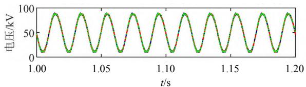

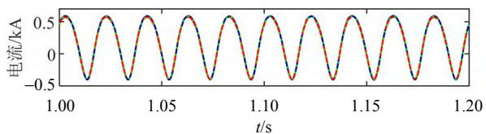  
(a) 桥臂电压比较   
(b) 桥臂电流比较

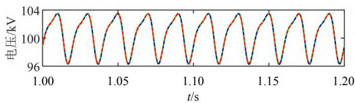

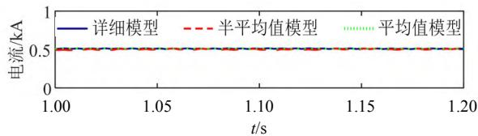  
(c) 子模块电容电压和比较   
(d) 直流电流比较   
图 10 模型稳态运行波形

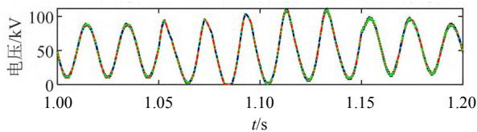  
Fig. 10 Steady-state operation waveforms of the models

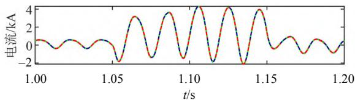  
(a) 桥臂电压比较   
(b) 桥臂电流比较

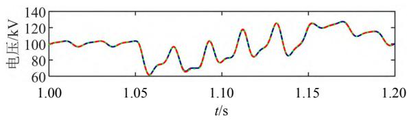  
(c) 子模块电容电压和比较

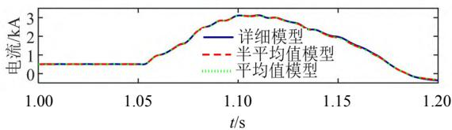  
(d) 直流电流比较   
图11 模型暂态运行波形  
Fig. 11 Transient-state operation waveforms of the models

表 3 详细模型与半平均值模型开关频率的比较  
Table 3 Comparison of switching frequency of the detailed model and the half average value model   

<table><tr><td rowspan="2">P/MW</td><td rowspan="2">Q/Mvar</td><td colspan="2">开关频率/Hz</td><td rowspan="2">偏差/%</td></tr><tr><td>详细模型</td><td>半平均值模型</td></tr><tr><td>100</td><td>0</td><td>240</td><td>237</td><td>1.25</td></tr><tr><td>0</td><td>-100</td><td>288</td><td>285</td><td>1.04</td></tr><tr><td>50</td><td>-50</td><td>196</td><td>194</td><td>1.02</td></tr><tr><td>-50</td><td>50</td><td>181</td><td>180</td><td>0.55</td></tr></table>

关频率数据集是可行的。

仿真运行于微软 Win10 操作系统，英特尔i5-11400 处理器，8GB 内存的计算机中。设定仿真运行总时长为 1s，详细模型、半平均值模型、平均值模型分别改变仿真步长运行并记录仿真所用的物理时间，比较结果如表 4 所示，由表可知，半平均值模型的仿真运行速度慢于平均值模型，但与详细模型相比则明显提高。

表 4 模型仿真运行速度的比较  
Table 4 Comparison of simulation speed of the models   

<table><tr><td rowspan="2">仿真步长/μs</td><td colspan="3">仿真运行所用物理时间/s</td></tr><tr><td>详细模型</td><td>半平均值模型</td><td>平均值模型</td></tr><tr><td>10</td><td>95.3</td><td>14.9</td><td>5.4</td></tr><tr><td>20</td><td>65.2</td><td>8.6</td><td>2.9</td></tr><tr><td>30</td><td>49.8</td><td>6.0</td><td>1.8</td></tr></table>

# 4.2 开关频率曲面估算实际开关频率的准确性

网格步长的选择关系到数据获取的时间成本和开关频率曲面的精度。本文提出试探法确定网格步长。首先，根据经验确定一个初始网格步长；其次，在一个小范围的任意稳态工况内获取数据并拟合成开关频率曲面；最后，测试开关频率曲面的精度。若精度满足要求，就选择当前网格步长，若不满足，缩小网格步长，并在新的网格步长下验证开关频率曲面的精度。按照上述方法，本文选定的网格步长为 10MW、10Mvar。得到的开关频率曲面如图 12 所示。

为方便解释开关频率曲面的形状特点，将基于按状态排序与增量投切的电压平衡策略简述如下：

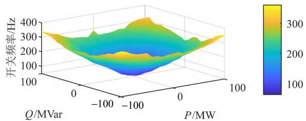  
图12 开关频率曲面  
Fig. 12 Switching frequency surface

计算当前时刻子模块电压不平衡度δ(δ定义为子模块电容电压间最大偏差与电容电压额定值之比，本文取 0.03)。δ大于设定值 $\delta _ { \mathrm { m } }$ 时，根据电容电压排序结果和电流方向，投入 N 个子模块中电压最大或最小的 n 个子模块。δ小于设定值 $\delta _ { \mathrm { m } }$ 时，当需要投入子模块的数目增加(减少)时，保持已投入(切除)的子模块不再动作，将处于切除(投入)的子模块根据子模块总投入数的变化情况动作。

传输的容量越大，δ大于 $\delta _ { \mathrm { m } }$ 的概率越大，因此“根据电容电压排序结果和电流方向，投入 N 个子模块中电压最大或最小的 n 个子模块”这一投切策略更容易被触发，开关频率随之增大，所以，开关频率曲面的整体形状为一下凹的曲面。

为了验证开关频率曲面对实际开关频率的反应准确性，随机选择多种工况，比较开关频率曲面和详细模型的开关频率，比较结果如表 5 所示。两组数据间的平均误差为 1.57%，误差来源主要有：1）采用MMC半平均值模型代替平均值模型获取开关频率数据所带来的误差；2）采用二维插值方法来获取任意稳态工况下的开关频率所带来的误差。

表5 开关频率曲面和详细模型开关频率比较  
Table 5 Comparison of switching frequency between switching frequency surface and detailed model   

<table><tr><td rowspan="2">P/MW</td><td rowspan="2">Q/Mvar</td><td colspan="2">开关频率/Hz</td><td rowspan="2">偏差/%</td></tr><tr><td>详细模型</td><td>开关频率曲面</td></tr><tr><td>55</td><td>72</td><td>204</td><td>208</td><td>1.96</td></tr><tr><td>-29</td><td>84</td><td>236</td><td>233</td><td>1.27</td></tr><tr><td>-49</td><td>-45</td><td>180</td><td>184</td><td>2.22</td></tr><tr><td>-30</td><td>68</td><td>202</td><td>205</td><td>0.55</td></tr><tr><td>13</td><td>60</td><td>173</td><td>170</td><td>1.73</td></tr><tr><td>94</td><td>13</td><td>237</td><td>233</td><td>1.69</td></tr></table>

# 4.3 MMC损耗计算方法准确度验证

为了验证所提出的 MMC 损耗计算方法的准确度，在表 6所示的不同工况下，比较详细模型和所提计算方法的损耗计算结果。所采用的 IGBT 模块型号为 5SNE 1000E330300。

表 6 不同工况  
Table 6 Different working conditions   

<table><tr><td>工况</td><td>P/MW</td><td>Q/Mvar</td></tr><tr><td>1</td><td>82</td><td>0</td></tr><tr><td>2</td><td>-17</td><td>-31</td></tr><tr><td>3</td><td>66</td><td>-17</td></tr><tr><td>4</td><td>-77</td><td>17</td></tr><tr><td>5</td><td>87</td><td>23</td></tr></table>

损耗计算结果的比较如图 13 所示。定义相对误差为|详细模型值-所提方法值/详细模型值，计算相对误差并在图中标注。图中： $P _ { \mathrm { c o n d } }$ 为通态损耗功率， $P _ { \mathrm { s w } }$ 为开关损耗功率。由图 13 可知，对于通态损耗，详细模型和所提计算方法的损耗计算结果差别很小，平均相对误差仅为 0.87%。开关损耗计算结果的平均误差相对较大，为 2.94%，但也在可接受的范围内。

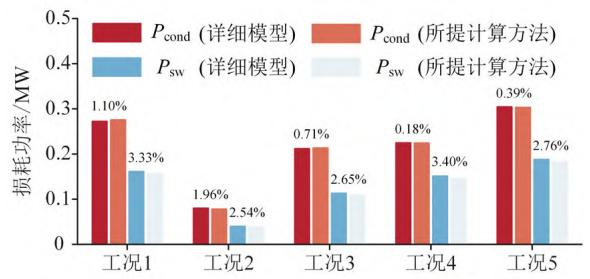  
图13 所提计算方法与详细模型的损耗计算结果比较  
Fig. 13 Loss calculation results comparsion of the proposed calculation method and the detailed model

# 4.4 MMC 损耗注入方法验证

考虑损耗注入的平均值模型运行在表6中的工况 1 下，衰减函数为 f1，参数λ 取 10 000，阈值α取 0.008。得到的 a 相上桥臂通态损耗、开关损耗的注入结果分别如图 14、15 所示。为了方便展示，损耗注入是从仿真时刻 1s时开始的。

通态损耗注入结果如图 14 所示。在直接注入的方式下通态损耗压降如图 14(a)所示，可见直接注

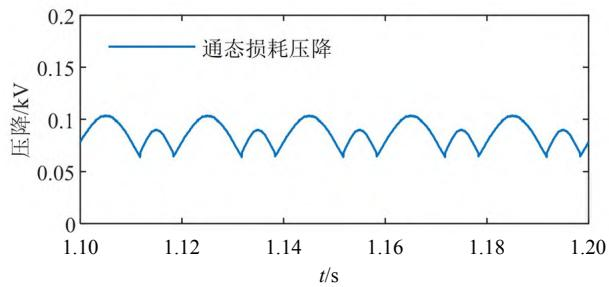  
(a) 通态损耗直接注入压降计算结果

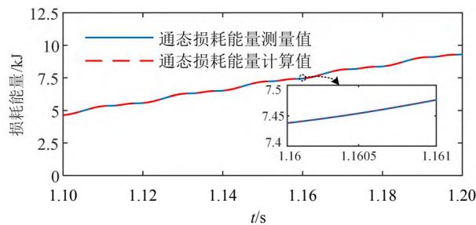  
(b) 通态损耗能量测量值与计算值的比较  
图 14 通态损耗注入结果  
Fig. 14 Conduction loss injection results

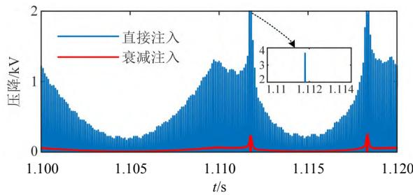  
(a) 开关损耗压降计算结果

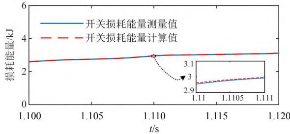  
(b) 开关损耗能量测量值与计算值的比较  
图 15 开关损耗注入结果  
Fig. 15 Switching loss injection results

入方式下通态损耗压降曲线是平滑且连续的。在仿真系统中测量出通态损耗能量并和通态损耗能量的计算值比较，比较结果如图 14(b)所示，由图可知，两条能量曲线完全重合，这意味着通态损耗被准确的注入到了系统中。

开关损耗注入结果如图 15 所示。在直接注入、衰减注入两种注入方式下的开关损耗压降如图 15(a)所示。由图可知，开关损耗采用直接注入的方式引入系统时，开关损耗压降会出现电压尖峰，且在桥臂电流接近 0 时尖峰现象尤为严重，影响仿真模型正常运行。而采用衰减注入则可以很好的避免电压尖峰的出现。在系统中测量开关损耗能量并和开关损耗能量计算值比较，比较结果如图 15(b)所示，由图可知，由于开关损耗采用了衰减注入的方式，所以两条能量曲线并不完全重合，但二者在一个比较短的时间段内是近似相等的。

由于 MMC 仿真模型采用定 PQ 控制，由直流侧向交流侧传输功率，因此与未考虑损耗的仿真模型相比，考虑损耗影响后的仿真模型为补偿器件的能量损耗，直流侧传输功率增大，进而导致直流电流抬升。考虑损耗影响前后的直流侧传输功率、电流分别如图 16、17 所示。

# 4.5 衰减函数 f 的优越性验证

分别采用 f1、f2 进行开关损耗的衰减注入，将两种衰减函数下的开关损耗能量测量值和计算值进行比较，比较结果如图 18 所示。显然，采用 f1

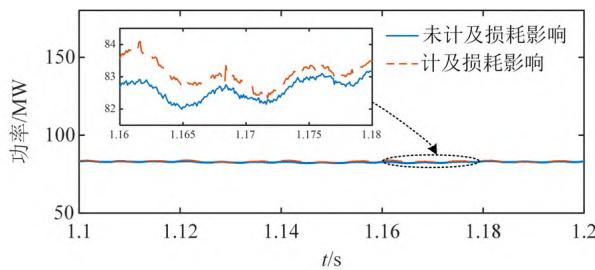  
图16 直流侧传输功率对比

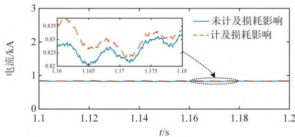  
Fig. 16 Comparison of transmission power on the DC side   
图17 直流侧电流对比

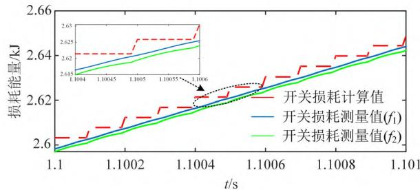  
Fig. 17 Comparison of current on the DC side   
图18 开关损耗能量比较  
Fig. 18 Switching loss energy comparison

时的开关损耗能量测量值曲线比采用f2时的更加靠近计算值曲线，这意味着 f1的平均注入速度更快，注入效果更好。

两种衰减函数下的开关损耗压降比较如图 19所示。由图可知，采用 $f _ { 1 }$ 时开关损耗压降波动峰值比采用 $f _ { 2 }$ 时的波动峰值要小。

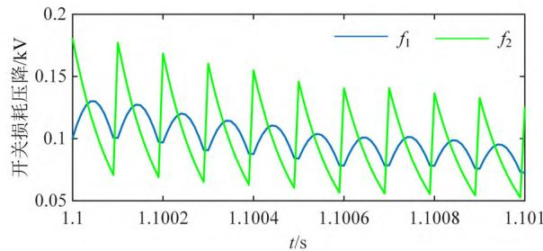  
图19 开关损耗压降比较  
Fig. 19 Switching loss voltage comparison

# 5 结论

提出了一种基于MMC平均值模型的损耗快速

评估方法。特别针对 MMC 子模块动态特性复杂，开关损耗计算困难的问题，提出利用开关频率曲面和平均值模型相结合的开关损耗计算方法。通过与详细模型的损耗计算结果比较验证，证明了所提方法可以快速计算任意稳态工况的损耗，并保证准确度。

提出了一种考虑损耗影响的MMC损耗注入方法，将损耗以受控电压源的形式注入系统。仿真结果表明，通态损耗可以采用直接注入的方式精确的注入到产生的时刻。开关损耗采用直接注入的方式则会产生电压尖峰，影响系统运行，采用衰减注入的方式则避免了电压尖峰的出现，同时使开关损耗的系统测量值和计算值在一个较短的时间段内近似相等。

# 参考文献

[1] LESNICAR A，MARQUARDT R．An innovative modular multilevel converter topology suitable for a wide power range[C]//2003 IEEE Bologna Power Tech Conference Proceedings．Bologna：IEEE，2003：6   
[2] 汤广福，庞辉，贺之渊．先进交直流输电技术在中国的发展与应用[J]．中国电机工程学报，2016，36(7)：1760-1771  
TANG Guangfu，PANG Hui，HE Zhiyuan．R&D and application of advanced power transmission technology in China[J]．Proceedings of the CSEE，2016，36(7)： 1760-1771(in Chinese)   
[3] 周孝信，鲁宗相，刘应梅，等．中国未来电网的发展模式和关键技术[J]．中国电机工程学报，2014，34(29)：4999-5008  
ZHOU Xiaoxin，LU Zongxiang，LIU Yingmei，et al Development models and key technologies of future grid in China[J]．Proceedings of the CSEE，2014，34(29)： 4999-5008(in Chinese)   
[4] 王希平，李志刚，姚芳．模块化多电平换流阀 IGBT 器件功率损耗计算与结温探测[J]．电工技术学报，2019，34(8)：1636-1646  
WANG Xiping，LI Zhigang，YAO Fang．Power Loss Calculation and junction temperature detection of IGBT devices for modular multilevel valve[J]．Transactions of China Electrotechnical Society，2019，34(8)：1636-1646(in Chinese)   
[5] 徐政．柔性直流输电系统[M]．北京：机械工业出版社，2016：89  
XU Zheng．Flexible DC transmission system[M]．Beijing：China Machine Press，2016：89(in Chinese)  
[6] 屠卿瑞，徐政．基于结温反馈方法的模块化多电平换流器型高压直流输电阀损耗评估[J]．高电压技术，2012，

38(6)：1506-1512  
TU Qingrui ， XU Zheng ． Dissipation analysis ofMMC-HVDC based on junction temperature feedbackmethod[J]．High Voltage Engineering，2012，38(6)：1506-1512(in Chinese)  
[7] 黄勇，姚志，王容，等．基于结温预估的模块化多电平换流器损耗计算方法[J]．电网技术，2019，43(11)：4115-4124  
HUANG Yong，YAO Zhi，WANG Rong，et al．Calculation method of modular multilevel converter power loss based on junction temperature estimation[J] ． Power System Technology，2019，43(11)：4115-4124(in Chinese)   
[8] 张哲任，徐政，薛英林．基于分段解析公式的MMC-HVDC 阀损耗计算方法[J]．电力系统自动化，2013，37(15)：109-116，151  
ZHANG Zheren，XU Zheng，XUE Yinglin．Valve losscalculation of MMC-HVDC based on piecewise analyticalformula[J]．Automation of Electric Power Systems，2013，37(15)：109-116，151(in Chinese)  
[9] YANG Limin，LI Yaohua，LI Zixin，et al．A simplifiedanalytical calculation model of average power loss formodular multilevel converter[J]．IEEE Transactions onIndustrial Electronics，2019，66(3)：2313-2322  
[10] 李强，庞辉，贺之渊．模块化多电平换流器损耗与结温的解析计算方法[J]．电力系统自动化，2016，40(4)：85-91  
LI Qiang，PANG Hui，HE Zhiyuan．Analytic calculating method for loss and junction temperature of modular multilevel converter[J]．Automation of Electric Power Systems，2016，40(4)：85-91(in Chinese)   
[11] 饶宏，李建国，宋强，等．模块化多电平换流器直流输电系统损耗的计算方法及其损耗特性分析[J]．电力自动化设备，2014，34(6)：101-106  
RAO Hong，LI Jianguo，SONG Qiang，et al．Loss calculation method and characteristics analysis for MMC-HVDC system[J] ． Electric Power Automation Equipment，2014，34(6)：101-106(in Chinese)   
[12] LI Zixin，GAO Fanqiang，XU Fei，et al．Power modulecapacitor voltage balancing method for a ±350 kV/1 000 MW modular multilevel converter[J] ． IEEETransactions on Power Electronics ， 2016 ， 31(6) ：3977-3984  
[13] 李程昊，谢竹君，林卫星，等．中高频模块化多电平换流器阀损耗的精确计算方法与分析平台[J]．中国电机工程学报，2015，35(17)：4361-4370  
LI Chenghao，XIE Zhujun，LIN Weixing，et al．Accurate valve loss calculation method and analyzing platform for medium and high-frequency MMC[J]．Proceedings of the CSEE，2015，35(17)：4361-4370(in Chinese)   
[14] 李探，尹诗媛，姚志，等．构建虚拟桥臂数学模型的

MMC阀损耗快速计算方法研究[J]．电网技术，2019，43(12)：4509-4516  
LI Tan，YIN Shiyuan，YAO Zhi，et al．Power losscalculation for MMC valves on virtual arm mathematicalmodel[J]．Power System Technology，2019，43(12)：4509-4516(in Chinese)  
[15] 罗永捷，宋勇辉，熊小伏，等．高压大容量MMC换流阀损耗精确计算[J]．中国电机工程学报，2020，40(23)：7730-7741  
LUO Yongjie，SONG Yonghui，XIONG Xiaofu，et al Accurate loss calculation method for bulk-power MMCs[J]．Proceedings of the CSEE，2020，40(23)： 7730-7741(in Chinese)   
[16] RAJAPAKSE A D，GOLE A M，JAYASINGHE R P．An improved representation of FACTS controller semiconductor losses in EMTP-Type programs using accurate loss-power injection into network solution [J] IEEE Transactions on Power Delivery，2009，24(1)： 381-389   
[17] 苏杭，徐晋，汪可友，等．考虑变换器损耗特性的小步长实时仿真方法[J]．中国电机工程学报，2021，41(5)：1840-1850  
SU Hang，XU Jin，WANG Keyou，et al．Small time-step real-time simulation method considering converter loss characteristics[J]．Proceedings of the CSEE，2021，41(5)： 1840-1850(in Chinese)   
[18] 赵宇含，王鑫，赵成勇，等．半桥-全桥子模块混合型MMC 的换流阀损耗分析方法[J]．电网技术，2021，45(7)：2847-2855  
ZHAO Yuhan，WANG Xin，ZHAO Chengyong，et al Converter valve loss analysis based on half bridge-full bridge sub-module hybrid MMC[J] ． Power System Technology，2021，45(7)：2847-2855(in Chinese)   
[19] 周莹坤，齐磊，姜舒婷，等．采用最近电平控制的模块化多电平换流器损耗一致性分析[J]．电网技术，2015，39(9)：2490-2497  
ZHOU Yingkun，QI Lei，JIANG Shuting，et al．Loss consistency analysis of modular multi-level converter using nearest level control[J]．Power System Technology， 2015，39(9)：2490-2497(in Chinese)   
[20] 吴锐，温家良，于坤山，等．电压源换流器开关器件损耗建模[J]．中国电机工程学报，2012，32(21)：1-7  
WU Rui，WEN Jialiang，YU Kunshan，et al．Power lossmodeling of switching devices in voltage sourceconverters[J]．Proceedings of the CSEE，2012，32(21)：

1-7(in Chinese)   
[21] 王海田，汤广福，贺之渊，等．模块化多电平换流器的损耗计算[J]．电力系统自动化，2015，39(2)：112-118WANG Haitian，TANG Guangfu，HE Zhiyuan，et alPower losses calculation of modular multilevelconverter[J]．Automation of Electric Power Systems，2015，39(2)：112-118(in Chinese)  
[22] 刘栋，汤广福，贺之渊，等．基于面积等效法的模块化多电平换流器损耗分析[J]．电网技术，2012，36(4)：197-201  
LIU Dong，TANG Guangfu，HE Zhiyuan，et al．Loss evaluation for modular multilevel converter based on equivalent-aera modulation[J] ． Power System Technology，2012，36(4)：197-201(in Chinese)   
[23] 许建中，赵成勇，刘文静．超大规模MMC 电磁暂态仿真提速模型[J]．中国电机工程学报，2013，33(10)：114-120．  
XU Jianzhong ， ZHAO Chengyong ， LIU WenjingAccelerated model of ultra-large scale MMC inelectromagnetic transient simulations[J]．Proceedings ofthe CSEE，2013，33(10)：114-120(in Chinese)  
[24] 屠卿瑞，徐政，郑翔，等．一种优化的模块化多电平换流器电压均衡控制方法[J]．电工技术学报，2011，26(5)：15-20  
TU Qingrui，XU Zheng，ZHENG Xiang，et al．An optimized voltage balancing method for modular multilevel converter[J] ． Transactions of China Electrotechnical Society，2011，26(5)：15-20(in Chinese)

在线出版日期：2023-11-20。

收稿日期：2023-06-20。

作者简介：

孙正东(1998)，男，硕士研究生，研究方 向 为 柔 性 直 流 输 电 技 术 ，zhuansunzhengdong@163.com；

  
孙正东  
郝全睿

* 通信作者：郝全睿(1984)，男，博士，教授，研究方向为 HVDC&FACTS、交直流混合电网等，haoquanrui@sdu.edu.cn。

(责任编辑 吕鲜艳)

# Fast Loss Evaluation Method Based on MMC Average Simulation Model

SUN Zhengdong, HAO Quanrui*

(Key Laboratory of Power System Intelligent Dispatch and Control of Ministry of Education (Shandong University))

KEY WORDS: modular multilevel converter (MMC); power loss calculation; average value model; loss injection

The losses of MMC are the main component of the losses during the operation of the DC transmission system. The accurate evaluation of the losses is related to the design of the heat dissipation system, the selection of power electronic devices, and the economic and reliability evaluation of the DC transmission system, which has important practical significance and research value.

The losses of MMC mainly include the conduction losses and switching losses: The conduction losses are related to the current direction and the conduction states of the devices. The conduction loss evaluation is less difficult. In practical engineering, there are hundreds of sub-modules(SMs) in a single bridge arm of MMC, and the switching states are affected by the capacitor voltage balance strategy. The dynamic characteristics are complex, and the switching loss evaluation is difficult. In addition, the existing research on MMC losses mainly focuses on the accurate and fast calculation of losses. Few literatures consider the influence of losses on the simulation results of MMC system.

Based on the idea of simulation and analytical calculation, this paper proposes a method to quickly evaluate the losses by using the MMC average value model, which takes into account the loss calculation accuracy and calculation efficiency. At the same time, based on the proposed calculation method, a fast simulation model of MMC considering losses is constructed. The calculated losses are injected back into the system so that the simulation model can better reflect the actual situation. The basic idea of the proposed method is shown in Fig. 1, which includes four steps:

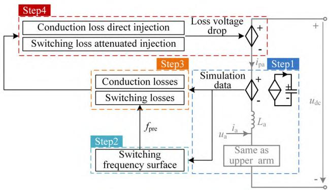  
Fig. 1 Fast average value model considering loss injection

1) Obtain the waveforms of capacitor voltage and arm current using the average value model;   
2) Obtain the actual switching frequency based on the switching frequency surface;   
3) Calculate the switching and conduction losses based on the actual switching frequency;   
4) Inject the equivalent voltage drop corresponding to the losses into the average value model.

The simulation verification of the proposed method is shown in Fig. 2. Simulation results show that the computed results of the proposed loss calculation method are very similar to the computed results of the detailed switching model(DSM). The proposed fast simulation model of MMC considering losses can reflect the impact of losses in the system.

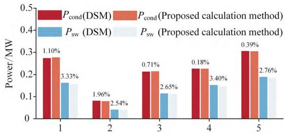  
(a) Working condition

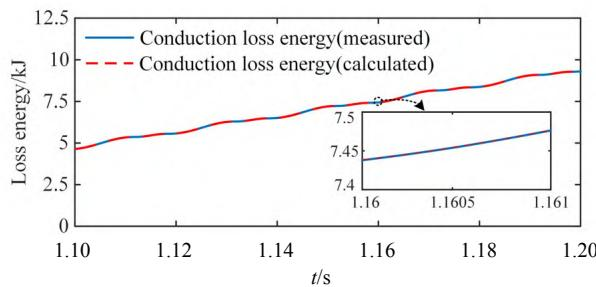

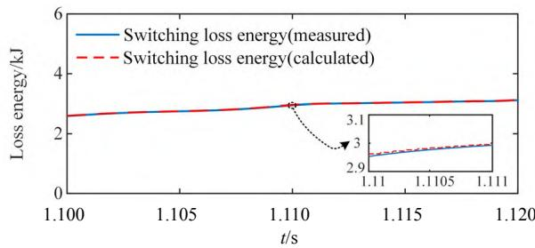  
(b) Conduction loss injection results   
(c) Switching loss injection results   
Fig. 2 Simulation results