# 特高压自耦变压器的建模和电磁暂态仿真

曾麟钧，林湘宁，黄景光，郑峰，李智

(三峡大学电气信息学院，湖北省宜昌市 443002)

# Modeling and Electromagnetic Transient Simulation of UHV Autotransformer

ZENG Lin-jun, LIN Xiang-ning, HUANG Jing-guang, ZHENG Feng, LI Zhi

(The College of Electrical Engineering and Information Technology, China Three Gorges University,

Yichang 443002, Hubei Province, China)

ABSTRACT: To correctly apply transformer differential protection in the environment of ultra high voltage (UHV), it is necessary to model the UHV power transformer reasonably and carry out the corresponding electro-magnetic transient simulations. According to the equivalent circuit of three winding autotransformer, we set up the three winding autotransformer model by means of unified magnetic equivalent circuit (UMEC) transformer model provided by EMTDC software. The parameters of UHV transformer are converted to those of the UMEC model. By this way, the UHV transformer model is built. Under the UHV environment, the excitation and internal fault current of UHV power transformer are simulated, and the simulated data are utilized to investigate the operation reliability of the well-applied differential protection combined with second order harmonic blocking. Simulation results show that the second order harmonic ratios of inrush currents through three phases of the UHV power transformer are all below $10\%$ . In this case, the mal-operation of the differential protection cannot be avoided if the strategy that one phase current is applied to restrain three phases is adopted and the threshold of second order harmonic restraint ratio is $15\% -20\%$ . Besides, in some light fault conditions, the second harmonic ratio of the fault current is relatively high in the beginning of fault inception, leading to the short time delay of operation of protection.

KEY WORDS: UHV power transformer; autotransformer; EMTDC; magnetic inrush; internal fault current; harmonic

摘要：为了在特高压环境下正确应用变压器差动保护，需要对特高压变压器进行合理建模，并进行相应的电磁暂态仿真。根据三绕组自耦变压器星型等值电路的原理，用电磁暂

态仿真软件 EMTDC 中的统一电磁等效电路(unified magnetic equivalent circuit, UMEC)普通三绕组变压器模型来模拟 $1000 \mathrm{MVA} / 1050 \mathrm{kV}$ 三绕组自耦变压器，将特高压变压器参数折算成 UMEC 模型参数，形成特高压变压器模型。在特高压环境下，分别进行励磁涌流和故障电流仿真，并用于考察应用得最为广泛的 2 次谐波闭锁的变压器差动保护的动作可靠性。分析表明：当合闸角和剩磁满足一定条件时，特高压变压器三相励磁涌流的 2 次谐波含量都会在 $10 \%$ 以下，即使采用一相制动三相的 2 次谐波闭锁策略，如果 2 次谐波门槛值维持在 $15 \% \sim 20 \%$ ，也不能避免差动保护误动；另外，在某些轻微故障的情况下，故障初期故障电流的 2 次谐波含量成分较高，会使保护动作短暂延迟。

关键词：特高压变压器；自耦变压器；EMTDC；励磁涌流；内部故障电流；谐波

# 0 引言

区分励磁涌流与内部故障电流是变压器差动保护所面临的难题，特高压变压器保护也不例外。对特高压变压器进行合理建模，并在仿真软件中再现实际的电磁暂态过程，是正确应用变压器差动保护的必要前提。

特高压变压器大多为自耦变压器，而目前大多数仿真软件中均为集成自耦变压器模型。在进行暂态仿真时，简单的做法是用普通变压器模型直接代替自耦变压器。这种处理方法仅考虑磁的耦合作用，而忽略了自耦变压器一、二次绕组之间电的联系。文献[1]提出的自耦变压器模型，选用磁通链作为状态变量，并考虑了铁心的非线性特性，物理概念清晰，但该模型计算过于复杂。文献[2]应用受控源原理建模，并用修正后的阻尼梯形算法导出自耦变压器综合友模模型，计算速度和精度都得以提高，但模型忽略了励磁阻抗非线

性。另外，如果将特高压自耦变压器的电磁暂态过程放在特高压电磁环境中，特别是包含具有分布参数的特高压输电线路的系统中进行考察，结果将更加真实可信。

PSCAD/EMTDC 是一种广泛应用于电力系统各个领域的仿真软件，具有强大的电磁暂态仿真功能，只是其中也没有包含三绕组自耦变压器的模型。本文根据三绕组自耦变压器的三端星形等值电路，利用 EMTDC 中的统一电磁等效电路( unified magnetic equivalent circuit, UMEC)普通变压器模型，建立了 $1000\mathrm{MVA} / 1050\mathrm{kV}$ 自耦变压器模型及内部故障模型，该模型能考虑特高压变压器的特殊性以及铁心的非线性。基于以上模型，在特高压环境下进行了变压器空载合闸和匝间、匝地、引出线短路等情况的仿真，并进行了波形分析，指出了2次谐波制动变压器差动保护应用于特高压变压器时需要注意的问题。

# 1 特高压变压器建模

# 1.1 特高压变压器基本结构

自耦变压器具有成本低、运行效率高和励磁功率低等优点，广泛应用于 $220\mathrm{kV}$ 及其以上的电网中。由于特高压变压器单相容量已达1000MVA，具有容量大和绝缘水平高的特点，使变压器重量与体积必然很大。出于运输等方面的考虑，采用单相结构成为必然。中国生产的特高压变压器即为单相自耦变压器[3]。

特高压变压器设有第3绕组，即低压绕组。低压绕组不带负载，以角型方式联结，流通3次谐波电流，再经低压电抗器接地。

出于绝缘和制造工艺等方面的要求，采用中性点无励磁调压，设外置式调压补偿的变压器。主变压器和调压补偿变压器通过管路母线连接。这种绕组联结的特殊性，使特高压变压器绕组间的短路阻抗比普通变压器要大得多。

由于本文关心的是变压器各侧电流，在建立模型时，将主变压器及调压补偿变压器等效为一个三绕组自耦变压器。

# 1.2 三绕组自耦变压器等值电路

无论绕组怎样布置，三绕组自耦变压器都可以等效为一个三端星型等值电路[4]。下文以串联、公共、第3绕组为基础，导出其等值电路。

将各绕组的电量均折合至公共绕组侧，设串联绕组电压、电流折算值分别为 $\dot{U}_{S}^{\prime}$ 和 $\dot{I}_{S}^{\prime}$ ；公共绕组

的电压、电流分别为 $\dot{U}_{Q}$ 和 $\dot{I}_{Q}$ ；第3绕组的电压、电流分别为 $\dot{U}_{T}^{\prime}$ 和 $\dot{I}_{T}^{\prime}$ 。

与三绕组普通变压器的方程式的推导相同，当忽略励磁电流时，可以得出

$$
\left\{ \begin{array}{l} \dot {U} _ {S} ^ {\prime} - \dot {U} _ {Q} ^ {\prime} = \dot {I} _ {S} ^ {\prime} Z _ {S} ^ {\prime} + \dot {I} _ {Q} ^ {\prime} Z _ {Q} \\ \dot {U} _ {S} ^ {\prime} - \dot {U} _ {T} ^ {\prime} = \dot {I} _ {S} ^ {\prime} Z _ {S} ^ {\prime} + \dot {I} _ {T} ^ {\prime} Z _ {T} ^ {\prime} \end{array} \right. \tag {1}
$$

式中 $Z_{S}^{\prime}$ 、 $Z_{Q}$ 、 $Z_{T}^{\prime}$ 分别为串联绕组折算到公共绕组的漏阻抗、公共绕组的漏阻抗、低压绕组折算到公共绕组的漏阻抗。由式(1)可画出其对应的三端星型等值电路，如图1所示。

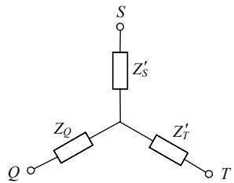  
图1 三端星型等值电路  
Fig. 1 Three-terminal Y-type equivalent circuit

等值电路中的参数也可以用三绕组普通变压器的实验方法测得，因此，可以三绕组普通变压器为基础来模拟三绕组自耦变压器。

# 1.3 特高压变压器仿真模型

# 1.3.1 正常运行时的模型

EMTDC中并无三绕组自耦变压器模型。根据1.2节的分析，考虑到自耦变压器中串联绕组、公共绕组的“电”的联系，将UMEC三绕组变压器模型中的2个绕组首尾相接，形成高压和中压绕组，来模拟特高压变压器模型。

如图2所示，第1~3绕组分别模拟低压绕组、串联绕组和公共绕组。两模型等效的前提是保证相对应的绕组的漏阻抗值相等。需要注意的是，特高压变压器的相关参数要折算到第1绕组，即低压绕组。

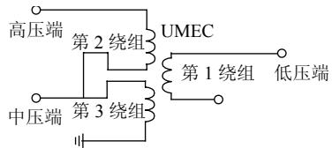  
图2 特高压变压器模型  
Fig. 2 Model of UHV transformer

UMEC 变压器模型主要是基于中心几何学建立的，不仅考虑同相绕组之间的耦合作用，还考虑了不同相绕组间的耦合作用。UMEC 模型以分段的线性 $U - I$ 曲线来描述铁心饱和特性，利用插值法，在实时计算时获得精确的结果。

# 1.3.2 内部故障模型

一台双绕组变压器发生匝间短路时，可以把短路部分看作第3绕组，这就相当于一台三绕组变压器在第3绕组发生短路[5]。

基于这种思想，本文将三绕组变压器中的短路匝用第4个绕组来模拟，如图3所示。

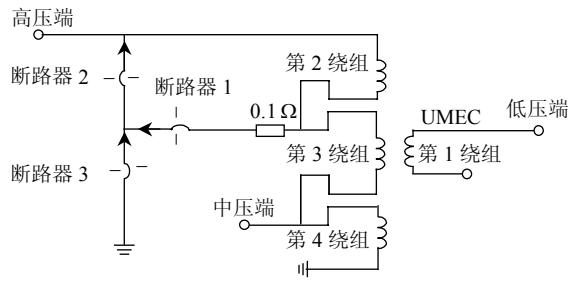  
图3 变压器内部故障模型  
Fig. 3 Internal faults model of transformer

图3中的第2绕组即短路匝，通过开关可以控制短路类型。第2绕组的漏电抗 $X_{2}$ 与第3绕组的漏电抗 $X_{3}$ 可由式(2)[6]计算。

$$
\left\{ \begin{array}{l} X _ {2} + X _ {3} = X _ {\mathrm {s}} \\ X _ {2} / X _ {3} = \left(N _ {2} / N _ {3}\right) ^ {2} \end{array} \right. \tag {2}
$$

式中： $X_{s}$ 为已知的串联绕组漏电抗； $N_{2}$ ， $N_{3}$ 分别为第2，3绕组的匝数， $N_{2} / N_{3}$ 近似等于第2和第3绕组的额定电压之比值。实际上，也正是通过设置第2和第3绕组的额定电压来控制模型中短路匝数占整个串联绕组的比值[7]。

# 1.3.3 自耦变压器模型建立方法的仿真验证

1.3.1节的自耦变压器构建模型方法的合理性和可行性可以通过以下方式进行证明。实际上，EMTDC已自带有两绕组自耦变压器的benchmark模型，也有普通的两绕组普通变压器模型，可以将普通两绕组变压器按照1.3.1节的自耦变压器构建方法，即将普通变压器模型中的2个绕组首尾相接，形成高压和中压绕组，建成自耦变压器。仿真涌流和故障的情况，同时，对两绕组自耦变压器的benchmark模型也设置同样的参数和扰动形式，将仿真得到的电流波形进行比对，如果相吻合，则本文的建模方法即可得到验证。

将一个两绕组自耦变压器参数设置如下：容量为 $100\mathrm{MVA}$ ；额定电压为 $460\mathrm{kV} / 230\mathrm{kV}$ ；漏阻抗为 $5\%$ （以高压侧为基准）；空载损耗为 $80\mathrm{kW}$ ；短路损耗为 $150\mathrm{kW}$ 。

根据保证相对应的绕组的漏阻抗值相等的原则，通过相应折算，用以模拟它的普通两绕组变压器参数应设置为：容量为 $100 \mathrm{MVA}$ ；额定电压为

230kV/230kV；漏阻抗为 $20\%$ （以模型原边为基准）；空载损耗为 $80\mathrm{kW}$ ；短路损耗为 $600\mathrm{kW}$ 。

在相同环境下，对两模型进行各种情况的仿真。图4是空载合闸、端口短路时，2种模型高压侧电流波形。

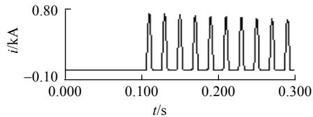

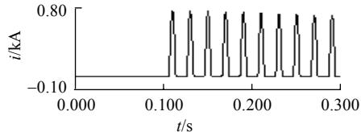  
(a) 高压端合闸时自耦变压器高压侧电流波形  
(b) 高压端合闸时普通变压器高压侧电流波形

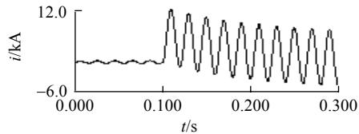

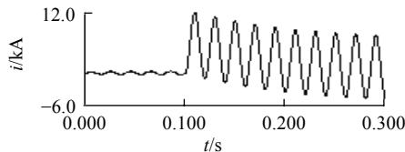  
(c)低压端端口短路时自耦变压器高压侧电流波形   
(d)低压端端口短路时普通变压器高压侧电流波形   
图42种模型的电流波形  
Fig. 4 Currents for two models

从图4可见，两模型在相同情况下的电流波形一致。实际上，低压侧电流波形同样保持一致。因此，这种自耦变压器模型搭建方式在电磁暂态仿真中是可行的。

# 2 仿真与分析

# 2.1 仿真系统及相关参数

当变压器空载合闸或外部故障切除后电压恢复时，由于铁心的饱和作用，其励磁电流的瞬时值可达到稳态空载电流的几百倍，即出现励磁涌流，极易造成差动保护误动作[8]。能否正确地鉴别励磁涌流和内部故障电流直接关系到差动保护能否正确动作。下文利用第1节建立的2种模型，分别进行特高压变压器空载合闸和内部故障的仿真与分析。

仿真系统模拟的是中国正在建设中的晋东南一南阳一荆门 $1000 \mathrm{kV}$ 交流特高压试验示范工程，系统的相关参数也都按照特高压工程数据设置。

变压器型式：单相三绕组自耦变压器(降压)；

高压、中压、低压绕组额定容量分别为1000，1000，334MVA；高压、中压、低压绕组额定电压(均方根值)分别为 $1050 / \sqrt{3}, 525 / \sqrt{3}, 110\mathrm{kV}$ ；短路阻抗(以高压绕组额定容量为基准)高压—中压为 $18\%$ ，高压—低压为 $62\%$ ，中压—低压为 $40\%$ ；空载电流为 $0.07\%$ ；空载损耗为 $155\mathrm{kW}$ 。

高压电抗器额定容量：晋东南一南阳的晋东南侧为 $960\mathrm{Mvar}$ ，南阳侧为 $720\mathrm{Mvar}$ ；南阳一荆门的南阳侧为 $720\mathrm{Mvar}$ ，荆门侧为 $600\mathrm{Mvar}$ 。电抗补偿器和电容补偿器容量都是 $240\mathrm{Mvar}$ 。

为了考虑特高压输电线路、特高压电抗器对变压器空载合闸暂态过程的影响，合闸位置设定在荆门特高压变压器高压侧。

图5为仿真系统图。图中，特高压电源先后经过晋东南一南阳和南阳一荆门特高压输电线路，连接至所仿真的特高压变压器的高压侧。变压器中压端接等效负载，低压绕组角型联结后经电抗补偿器和电容器补偿器接地。两段输电线的端部都接高压电抗器。

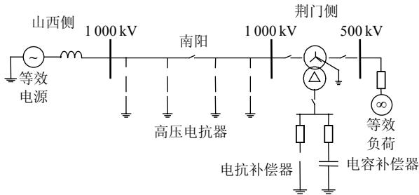  
图5仿真系统图  
Fig. 5 Simulation system

# 2.2 空载合闸仿真与分析

在不同合闸角、不同剩磁情况下分别进行空载合闸仿真。由于样本众多，不一一列举，下文给出一种典型情况下的涌流波形。图6为三相剩磁分别为 $0.5B_{\mathrm{m}}$ ， $-0.3B_{\mathrm{m}}$ ， $0.3B_{\mathrm{m}}$ ，A相合闸角为 $30^{\circ}$ 时的

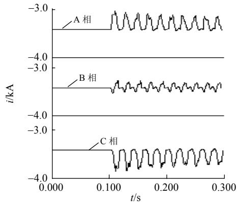  
图6典型合闸情况下的励磁涌流波形  
Fig. 6 Magnetic inrush currents in the condition of typical energization

三相涌流波形。从图中可见，由于考虑了特高压线路和特高压电抗器的因素，谐波成分更加复杂，相对于超高压及以下电压等级的变压器，波形的畸变更加明显。

变压器采用Y-d-11接线。将变压器三侧电流按变压器变比进行归一化，并进行相位补偿后，相加得到相位校正后的差动电流，即若A相高、中、低三侧流入变压器线电流为 $\dot{I}_{\mathrm{ah}}$ ， $\dot{I}_{\mathrm{am}}$ ， $\dot{I}_{\mathrm{al}}$ ，B相高、中、低三侧流入变压器线电流为 $\dot{I}_{\mathrm{bh}}$ ， $\dot{I}_{\mathrm{bm}}$ ， $\dot{I}_{\mathrm{bl}}$ ，则A相差动电流为 $(\dot{I}_{\mathrm{ah}} - \dot{I}_{\mathrm{bh}}) + \frac{525 / \sqrt{3}}{1050 / \sqrt{3}} (\dot{I}_{\mathrm{am}} - \dot{I}_{\mathrm{bm}}) + \frac{110}{1050 / \sqrt{3}}\dot{I}_{\mathrm{al}}$ 。由于此时变压器为空载合闸，另外两侧电流均为零， $(\dot{I}_{\mathrm{ah}} - \dot{I}_{\mathrm{bh}})$ 即为输入变压器差动保护的A相差流，其余类推。表1给出了在不同合闸情况下，经过相位校正的A，B，C三相差流的2次谐波含量。

表 1 励磁涌流 2 次谐波含量分析  
Tab. 1 Harmonic analysis of inrush currents   

<table><tr><td rowspan="2">剩磁</td><td rowspan="2">A相合闸角/(°)</td><td colspan="3">2次谐波含量/%</td></tr><tr><td>A相</td><td>B相</td><td>C相</td></tr><tr><td>A相: 0Bm</td><td>0</td><td>30.4</td><td>40.4</td><td>15.1</td></tr><tr><td>B相: 0Bm</td><td>30</td><td>31.8</td><td>22.6</td><td>14.8</td></tr><tr><td>C相: 0Bm</td><td>60</td><td>37.0</td><td>23.7</td><td>34.3</td></tr><tr><td>A相: 0.7Bm</td><td>0</td><td>16.0</td><td>18.9</td><td>10.1</td></tr><tr><td>B相: -0.5Bm</td><td>30</td><td>17.0</td><td>15.4</td><td>1.9</td></tr><tr><td>C相: -0.5Bm</td><td>60</td><td>30.3</td><td>15.0</td><td>3.7</td></tr><tr><td>A相: 0.9Bm</td><td>0</td><td>12.8</td><td>17.7</td><td>4.0</td></tr><tr><td>B相: 0Bm</td><td>30</td><td>9.8</td><td>6.9</td><td>6.1</td></tr><tr><td>C相: -0.9Bm</td><td>60</td><td>17.0</td><td>17.0</td><td>7.8</td></tr></table>

由表1可知：即使不考虑剩磁的情况，在A相 $30^{\circ}$ 合闸角的情况下，有一相差流的2次谐波也将低于 $15\%$ ；而当考虑一定剩磁时，如表1中的第5行对应的工况，C相2次谐波甚至低至 $1.9\%$ 。单纯通过调整门槛以避免差动保护误动已不现实。只有采用一相制动三相的方法，同时将2次谐波制动比调整到 $15\%$ 以下，才可以避免此情况下保护的误动作。即便如此，当三相剩磁分别为 $0.9B_{\mathrm{m}},0, - 0.9B_{\mathrm{m}}$ A相合闸角为 $30^{\circ}$ 时，三相差流的2次谐波含量均降到 $10\%$ 以下。

在这种最不利的合闸情况下，即当三相剩磁分别为 $0.9 B_{\mathrm{m}}$ ，0， $-0.9 B_{\mathrm{m}}$ ，A 相合闸角为 $30^{\circ}$ 时进行中压侧空载合闸，对涌流差流进行2次谐波分析，A，B，C三相差流中2次谐波含量分别为 $12.9\%$ ， $12.8\%$ ， $7.3\%$ 。此时虽然有两相高于 $10\%$ ，但三相

均低于 $15\%$ 。图7为最不利情况下的2种差流波形。

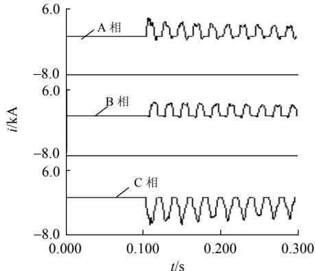  
(a) 高压侧合闸时的励磁涌流波形

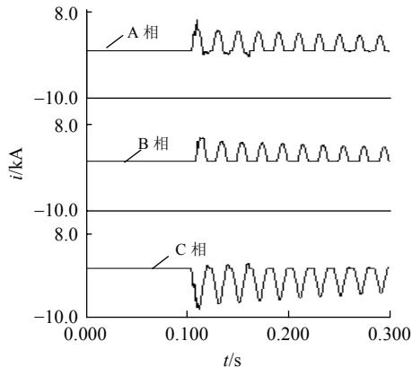  
(b) 中压侧合闸时的励磁涌流波形  
图7可能导致差动保护误动的励磁涌流波形  
Fig. 7 Magnetic inrushes leading to the mal-operation of different protection

根据以上分析，如果保持 $15\%$ 的2次谐波制动门槛不变，即使采用一相制动三相的方法，也不能避免保护误动。由于剩磁、合闸条件、系统运行工况千差万别，不可能扫描全部的可能情况，根据目前仿真的结果来看，特高压变压器的涌流2次谐波相比超高压及以下变压器有所削弱，这个情况需要在变压器差动保护投运时引起重视。

另外，励磁涌流中的高次谐波，尤其是奇次谐波含量要比普通变压器励磁涌流丰富得多。对于采用波形特征的变压器保护判据，可能也会带来一定的影响。

# 2.3 内部故障仿真与分析

在图5所示的特高压环境下，以A相变压器发生内部绕组短路故障为例，进行不同短路匝数的匝间、匝地短路仿真。

另外，还利用EMTDC中的FAULTS模块进行了变压器高压端引出线短路仿真，包括A相短路接地、AB两相短路和AB两相接地短路。

图8是几种不同短路情况下的A相电流波形。从波形来看，不论是匝地短路还是匝间短路，短路

匝数越少，一次电流越小。在引出线出口短路时，故障电流很大，波形的畸变也相对明显。

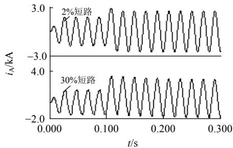

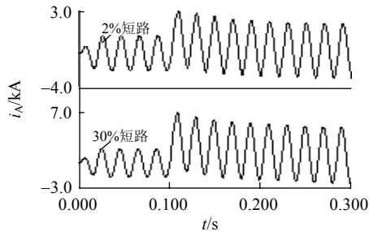  
(a) 匝间短路   
(b) 匝地短路

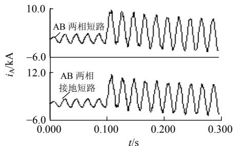  
(c) 引出线短路  
图8 内部短路时电流  
Fig. 8 Current for a internal fault

如前所述，为了考察变压器差动保护的情况，需要进行各侧电流相位校正并进行差流合成。在此基础上，分析了不同短路情况下差动电流的2次谐波含量，部分结果如表2~3所示。采用的数据窗为故障后一个周波。由于经过相位校正后，A相变压器发生内部故障时，B相差流一直为零，所以没

表 2 内部绕组矩路时故障电流谐波含量分析  
Tab. 2 Harmonic analysis of fault currents when the fault occurs at internal windings   

<table><tr><td rowspan="2">短路类型</td><td rowspan="2">短路部分/%</td><td colspan="2">2次谐波含量/%</td></tr><tr><td>A相</td><td>C相</td></tr><tr><td rowspan="4">匝间</td><td>2</td><td>22.6</td><td>22.9</td></tr><tr><td>5</td><td>8.0</td><td>8.0</td></tr><tr><td>10</td><td>3.7</td><td>3.3</td></tr><tr><td>30</td><td>2.7</td><td>2.2</td></tr><tr><td rowspan="4">匝地</td><td>2</td><td>4.6</td><td>4.6</td></tr><tr><td>5</td><td>3.8</td><td>3.6</td></tr><tr><td>10</td><td>3.6</td><td>3.3</td></tr><tr><td>30</td><td>3.1</td><td>2.9</td></tr></table>

表 3 引出线短路时故障电流谐波含量分析  
Tab. 3 Harmonic analysis of fault currents when the fault occurs at lead-out wire   

<table><tr><td rowspan="2">短路类型</td><td colspan="3">2次谐波含量/%</td></tr><tr><td>A相</td><td>B相</td><td>C相</td></tr><tr><td>A相短路接地</td><td>3.3</td><td>—</td><td>3.3</td></tr><tr><td>A、B两相短路</td><td>3.7</td><td>3.3</td><td>4.1</td></tr><tr><td>A、B两相短路接地</td><td>3.1</td><td>2.4</td><td>3.0</td></tr></table>

有对其进行谐波分析。

由表2~3可知：由于特高压长距离输电线路的分布电容作用，加上特高压变压器的固有特性，变压器内部故障时电流含有较丰富的谐波分量；但是，除了 $2\%$ 匝间短路，各种情况下的2次谐波成分均在 $15\%$ 以下，最高为 $5\%$ 匝间短路，2次谐波比为 $8\%$ 。结合对励磁涌流的分析，如果能将2次谐波制动比适当下降，如降低至 $10\%$ ，则空载合闸引起误动作的几率会显著降低，而同时也不会影响绝大部分内部故障下保护的动作速度。

2%匝间短路的情况比较特殊，此时故障相差动电流2次谐波含量达到 $22.6\%$ ，超出了传统2次谐波制动系数整定值。这种情况下对应的差流波形如图9所示。

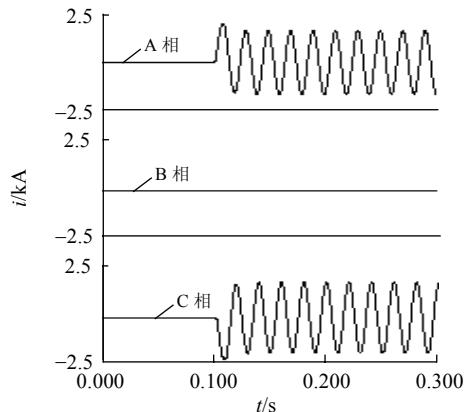  
图9 $2\%$ 匝间短路故障电流差流波形  
Fig. 9 Differential current in the case of $2\%$ interturn fault

进一步地，考察这种情况下2次谐波随含量 $(I_2 / I_1)$ %时间的衰减情况，如图10所示。

由图10可知，差流中的2次谐波衰减较快。

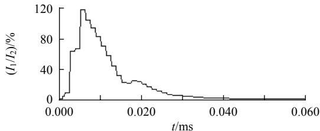  
图10 $2\%$ 匝间短路时2次谐波含量衰减曲线  
Fig. 10 Second order harmonic curve in the case of $2\%$ interturn fault

故障后第一个周波结束时，2次谐波含量为 $22.6\%$ ， $21\mathrm{ms}$ 时为 $19.0\%$ ， $22\mathrm{ms}$ 时为 $15.3\%$ ， $23\mathrm{ms}$ 时为 $12.4\%$ ， $25\mathrm{ms}$ 时为 $10.0\%$ ， $26\mathrm{ms}$ 时为 $7.4\%$ 。

从仿真结果来看，2次谐波制动的差动保护基本能满足区分涌流和故障的要求，只要合理选择制动系数，仍然可以在特高压变压器差动保护中发挥作用。

需要指出的是，特高压变压器采用了多分支结构，差动保护是在三柱并联后的差动。对每相只有一柱的变压器，理论上，当它发生少量匝间短路时，相当于励磁支路的等效电抗略有降低，使得纵差保护测到的差动电流略有增加，因此，纵差保护应该能够保护一定匝数的匝间短路。对于各分支并联后的情况，理论上与上述过程类似，因为对于3个柱上的励磁支路，2条健全支路的励磁电抗要小于故障支路，因此，不会对故障电流的测量造成太多影响。综上，在三柱并联的情况下，差动保护依然能够保护一定匝数的匝间短路。因为PSCAD仿真结构性的因素比较困难，因此，论文中没有考虑多分支变压器的建模，而用一个励磁支路等效，如前所述，这样的简化不会显著影响匝间短路故障时的仿真真实性。

在励磁涌流和故障电流的识别方面，许多文献对此做了有益的研究工作[9-13]，基于本文特高压变压器合闸模型和内部故障模型，可以考察这些方法对特高压变压器的适应性，从而进一步提高特高压变压器差动保护的运行水平。

# 3 结论

本文基于EMTDC的基本变压器模型，建立了以自耦变压器为特征的特高压变压器模型和变压器故障模型，并结合特高压环境，实现了电磁暂态过程仿真，为考察特高压变压器保护的动作行为、特别是考察其对特高压试验示范工程的适应性提供了合理的前提条件。重点关注2次谐波制动差动保护在特高压变压器差动保护中的适应性问题。研究结果表明：特高压变压器的励磁涌流2次谐波特征比超高压变压器相比，有所减弱，有可能三相2次谐波比均低于 $10\%$ ；各种故障情况下，除了小匝间短路，差流的2次谐波比均低于 $10\%$ ，综合涌流和故障的情况，2次谐波制动的差动保护在应用于特高压变压器时仍具有一定的冗余度；对于小匝间短路，虽然故障后一个周波差流2次谐波比高于 $15\%$ ，但在 $23~\mathrm{ms}$ 后降到 $15\%$ 以下、在 $26~\mathrm{ms}$ 后降

到 $10\%$ 以下，不会带来很长的动作延时。

# 参考文献

[1] 赵泽益，冯志彪．电力自耦变压器数字实时仿真模型及数字积分[J].同济大学学报，2001，29(4)：416-420.  
Zhao Zeyi, Feng Zhibiao. Digital real time simulation model and digital integral of autotransformer[J]. Journal of Tongji University, 2001, 29(4): 416-420(in Chinese).   
[2] 赵亮亮，陈超英．电力系统暂态仿真中自耦变压器模型的研究[J].电力系统及其自动化学报，2004，16(1)：83.  
Zhao Liangliang, Chen Chaoying. Study of model of three-phases autotransformer in electric system transient simulation [J]. Proceedings of the EPSA, 2004, 16(1): 83(in Chinese).   
[3] 孙树波，方明，钟俊涛．1000kV自耦变压器的开发设计[J].电力设备，2007，8(4)：6-10.  
Sun Shubo, Fang Ming, Zhong Juntao. Development and design of $1000\mathrm{kV}$ autotransformer[J]. Electrical Equipment, 2007, 8(4): 6-10(in Chinese).   
[4] 杨天民，施传立，谭显弟．电力自耦变压器及其应用[M].北京：水利电力出版社，1987：27.  
[5] 王维俭，侯炳蕴．大型机组继电保护理论基础[M].北京：水利电力出版社，1982：106.  
[6] 王雪，王增平．变压器内部故障仿真模型的设计[J].电网技术，2004，28(12)：50-52.  
Wang Xue, Wang Zengping. Study of simulation of transformer with intercal faults[J]. Power System Technology, 2004, 28(12): 50-52(in Chinese).   
[7] 黄咏容，李群湛，郝文斌，等．基于EMTDC的三相变压器励磁涌流和内部故障仿真[J].继电器，2007，35(1)：26-30.  
Huang Yongrong, Li Qunzhan, Hao Wenbin, et al. Simulation for magnetic inrush and fault current of three-phase transformer based on EMTDC[J].Relay，2007，35(1)：26-30(in Chinese).   
[8] 瓦修京斯基CB.变压器的理论与计算[M].崔立君，杜恩田，译.北京：机械工业出版社，1983：127.  
[9] 何奔腾，徐习东．波形比较法变压器差动保护原理[[J]. 中国电机工程学报，1998，18(6)：395-398.  
He Benteng, Xu Xidong. Protection based on wave comparison [J]. Proceedings of the CSEE, 1998, 18(6): 395-398(in Chinese).

[10] 焦邵华，刘万顺．区分变压器励磁涌流和短路电流的积分型波形对称原理[J].中国电机工程学报，1999，19(8)：35-38.  
Jiao Shaohua, Liu Wanshun. A novel scheme to discriminate inrush current and fault current based on integrating the waveform [J]. Proceedings of the CSEE, 1999, 19(8): 35-38(in Chinese).   
[11] 林湘宁，刘沛，杨春明，等．利用改进型波形相关法鉴别励磁涌流的研究[J].中国电机工程学报，2001，21(5)：56-60.  
Lin Xiangning, Liu Pei, Yang Chunming, et al. Studys for identification of the inrush based on improved correlation algorithm [J]. Proceedings of the CSEE, 2001, 21(5): 56-60 (in Chinese).   
[12] 陈德树，尹项根，张哲，等．虚拟三次谐波制动式变压器差动保护[J].中国电机工程学报，2001，21(8)：19-23.  
Chen Deshu, Yin Xianggen, Zhang Zhe, et al. Virtual third harmonic restrained transformer differential protection principle and practice[J]. Proceedings of the CSEE, 2001, 21(8): 19-23 (in Chinese).   
[13] 和敬涵，李静正，姚斌，等．基于波形正弦度特征的变压器励磁涌流判别算法[J].中国电机工程学报，2007，27(4)：54-59.  
He Jinghan, Li Jingzheng, Yao Bin, et al. A new approach of transformer inrush detected based on the sine degree principle of current waveforms[J]. Proceedings of the CSEE, 2007, 27(4): 54-59(in Chinese).

  
曾麟钧

收搞日期：2009-09-24。

作者简介：

曾麟钧(1983—)，男，硕士研究生，主要研究方向为电力系统继电保护，linxiangning@ hotmail.com;

林湘宁(1970—)，男，教授，主要研究方向为电力系统保护与控制，linxiangning@hotmail.com；

黄景光(1968—)，男，副教授，从事信号分析和电力系统继电保护研究；

郑峰(1983—)，男，硕士研究生，主要研究方向为电力系统继电保护；

李智(1984—)，男，硕士研究生，主要研究方向为电力系统继电保护。

(责任编辑 刘浩芳)