# 输电线路工频动态相量模型在半波长交流输电系统机电暂态仿真中的应用研究

张彦涛 $^{1}$ , 秦晓辉 $^{2}$ , 汤涌 $^{2}$ , 苏丽宁 $^{2}$ , 王义红 $^{2}$ , 孙玉娇 $^{2}$ , 姜懿郎 $^{2}$ , 董毅峰 $^{2}$ , 王毅 $^{2}$ , 葛磊蛟

(1. 天津大学，天津市 南开区 300072;

2. 电网安全与节能国家重点实验室(中国电力科学研究院), 北京市 海淀区 100192)

# Half-wavelength System Transients Stability Simulation Using Dynamic Phasor Model of AC Transmission Line

ZHANG Yantao $^{1}$ , QIN Xiaohui $^{2}$ , TANG Yong $^{2}$ , SU Lining $^{2}$ , WANG Yihong $^{2}$ , SUN Yujiao $^{2}$ , JIANG Yilang $^{2}$ , DONG Yifeng $^{2}$ , WANG Yi $^{2}$ , GE Leijiao $^{1}$

(1. Tianjin University, Nankai District, Tianjin 300072, China; 2. State Key Laboratory of Power Grid Safety and Energy Conservation (China Electric Power Research Institute), Haidian District, Beijing 100192, China)

ABSTRACT: In order to accurately simulate the wave transmission characteristics of the half wavelength AC line in the electromechanical transient simulation, this paper presents the application of AC line dynamic phasor model to the half wavelength transmission system simulation. The key to the application of the dynamic phasor model in the electromechanical transient simulation is the simulation precision and the simulation step size. When simulating external fault, half cycle simulation time step can be directly applied. While simulating internal faults of the half wavelength AC line still with half cycle time step, the approximate linear interpolation method must be used. To take account of simulation precision and speed, variable time step method was proposed. Based on the results comparison of electromagnetic transient simulation and electromechanical transient simulation, it shows that the dynamic phasor model is more accurate than the traditional AC line steady state model, and the variable time step method is superior to the approximate linear interpolation method with fixed large time step.

KEY WORDS: half wavelength; electromagnetic transient; transient stability; dynamic phasor; point to network transmission

摘要：为了在机电暂态仿真中准确模拟半波长交流线路的波传输动态特性，提出将交流线路的动态相量模型应用于半波

长输电系统仿真动态相量模型在机电暂态仿真中得以应用的关键是仿真精度和仿真步长问题。半波长线路区外故障时，可以直接应用半周波固定步长进行机电暂态仿真；而当模拟半波长线路区内故障时，若仍采用半周波固定步长，则需应用线性插值的近似方法计算注入电流源。为保证仿真精度，并兼顾仿真速度，提出采用变步长仿真方法用于半波长线路区内故障。以电磁暂态仿真结果为基准，点对网半波长交流输电系统算例表明，动态相量模型比传统的交流线路稳态模型具有更高的仿真精度，且变步长仿真方法优于线性插值近似法。

关键词：半波长；电磁暂态；机电暂态；动态相量；点对网输电

# 0 引言

随着我国西电东送战略的实施，半波输电技术作为一种具备发展前景的远距离、大容量交流输电方式[1-9]，重新成为新的研究热点。近年来，我国电力学者对特高压交流半波长输电技术的技术经济可行性进行了较为全面而详细的研究，内容涵盖半波长输电的稳态运行及潮流特性[10-14]、机电暂态特性及输送能力[10]，线路单相重合闸过程的潜供电流及其恢复电压、工频过电压、操作过电压及其限制措施[15-17]、绝缘配合、继电保护[18-21]、经济性和可靠性[22-23]等。在半波长输电系统机电暂态相关计算中，目前的处理方法仍是采用传统的稳态交流线路模型，该模型只考虑了分布参数的影响，与短线路

的稳态模型没有本质上的差别。

交流线路的功率传输本质上是电磁波的传输过程，当交流线路长度较短(远小于电磁波的波长)时，线路一端电压发生变化，沿线的电压、电流分布几乎在瞬间即可结束过渡过程达到新的稳态。对于机电暂态过程尺度而言，该过渡过程是可以忽略的，从而线路模型可近似用稳态方程描述。但是当交流线路的长度达到与电磁波的波长可比时(如半波长输电)，该过渡过程将足以影响到机电暂态仿真的结果。电磁暂态的仿真结果表明，当半波长线路末端短路时，故障点与两侧系统之间电磁波反射过程需持续 $0.8 \sim 1.0 \mathrm{~s}$ 左右沿线电压电流才能达到短路稳态。如果忽略该过渡过程，而将电气量瞬间达到稳态的模型用于机电暂态仿真，势必会造成较大的偏差。

为了弥补稳态模型的不足，同时又不像电磁暂态模型那样详细，1994年V.Venkatasubramanian把基于状态空间平均理论的“动态相量法”引入电力系统分析中[24]。动态相量法能有目的地选择系统占主导优势的频率进行相量域内的分析，与电磁暂态仿真相比，能有效减少计算量，加快仿真速度。目前关于动态相量模型的应用研究主要集中于高压直流输电[25-26]、可控串补[27]、柔性直流输电[28]等含电力电子器件系统在较宽频谱下的响应特性。文献[29-30]对交流线路的动态相量模型进行初步探索，但其研究场景仍是常规短线路的仿真分析，没有充分体现交流线路动态相量模型的价值。关于动态相量模型的应用研究已持续十余年，但尚未见到在商业化仿真工具中普及应用的报道。

半波长输电线路的特征，决定其有必要并且非常适合应用动态相量模型进行机电暂态仿真。电磁波在半波长交流输电线路的传输时间刚好可以达到半个工频周波，而通常机电暂态仿真的步长也为半个工频周波，这使得半波长交流线路的工频动态相量模型可以直接应用于机电暂态仿真。应用机电暂态仿真方法即可模拟半波长输电线路工频量的波传输过程，与其稳态模型相比，可以大大提高仿真精度。本文从交流线路的波传输方程出发，推导有损交流线路的工频动态相量模型，并将其首次应用到半波长交流线路的机电暂态仿真中，通过与精确电磁暂态仿真结果相比较，充分验证了该模型及仿真方法的有效性。

# 1 交流输电线路工频动态相量模型

均匀传输线的基本方程如式(1)所示，式中

$u = u(x,t)$ 、 $i = i(x,t)$ 分别为 $t$ 时刻位置 $x$ 处的电压、电流瞬时值， $L_{0} 、 R_{0} 、 C_{0} 、 G_{0}$ 为传输线基本电气参数，分别为单位长度的电感、电阻、电容和电导。

$$
\left\{ \begin{array}{l} \frac {\partial u}{\partial x} + L _ {0} \frac {\partial i}{\partial t} + R _ {0} i = 0 \\ \frac {\partial i}{\partial x} + C _ {0} \frac {\partial u}{\partial t} + G _ {0} u = 0 \end{array} \right. \tag {1}
$$

为了与机电暂态仿真中其他各元件保持一致，只计及网络电气量的工频分量。处于波传输过渡过程中的交流线路，其沿线各位置的电压、电流工频分量均随时间变化。 $t$ 时刻位置 $x$ 处的电压、电流瞬时值可分别用相量表示为

$$
\left\{ \begin{array}{l} u (x, t) = \operatorname {R e} \left[ \dot {U} (x, t) \mathrm {e} ^ {\mathrm {j} \omega t} \right] \\ i (x, t) = \operatorname {R e} \left[ \dot {I} (x, t) \mathrm {e} ^ {\mathrm {j} \omega t} \right] \end{array} \right. \tag {2}
$$

式中： $\omega$ 为工频角速度； $\dot{U}(x,t)$ 、 $\dot{I}(x,t)$ 分别为线路上 $x$ 位置相对于同步转速旋转相量空间的电压、电流时变相量。

将式(2)代入传输线方程(1)，可得用时变相量表示的传输线方程，如式(3)所示，该式与文献[29]基于总的平均方法理论推导出的动态相量交流线路模型具有相同的形式。需要说明的是，对于传统的稳态方程，由于忽略波传输过程中各点电气量随时间变化的过程，认为瞬间到达稳态，这相当于方程(3)中电压、电流对时间的微分项置零。

$$
\left\{ \begin{array}{l} \frac {\partial \dot {U}}{\partial x} + \left(R _ {0} + \mathrm {j} \omega L _ {0}\right) \dot {I} + L _ {0} \frac {\partial \dot {I}}{\partial t} = 0 \\ \frac {\partial \dot {I}}{\partial x} + \left(G _ {0} + \mathrm {j} \omega C _ {0}\right) \dot {U} + C _ {0} \frac {\partial \dot {U}}{\partial t} = 0 \end{array} \right. \tag {3}
$$

为了求解式(3)，通常先忽略传输线的损耗，从而得到无损传输线电气量的解析表达式，即贝瑞隆方程。然后将有损传输线处理为两段，并将电阻集中在分段线路的两侧[29-30]，此处不再重复，直接给出有损传输线的动态相量解析解递推公式，如式(4)一(5)所示，式中电流的正方向规定如图1所示。

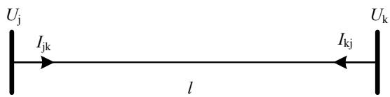  
图1 分布参数交流输电线路示意图  
Fig. 1 Distributed parameter AC transmission line

$$
\left\{ \begin{array}{l} \dot {I} _ {\mathrm {j k}} (t) = \frac {1}{Z _ {C} ^ {\prime}} \dot {U} _ {\mathrm {j}} (t) + \dot {I} _ {\mathrm {j}} (t - \tau) \mathrm {e} ^ {- \mathrm {j} \theta} \\ \dot {I} _ {\mathrm {k j}} (t) = \frac {1}{Z _ {C} ^ {\prime}} \dot {U} _ {\mathrm {k}} (t) + \dot {I} _ {\mathrm {k}} (t - \tau) \mathrm {e} ^ {- \mathrm {i} \theta} \end{array} \right. \tag {4}
$$

$$
\left\{ \begin{array}{c} \dot {I} _ {\mathrm {j}} (t - \tau) = - \frac {1 + h}{2} \left[ \frac {\dot {U} _ {\mathrm {k}} (t - \tau)}{Z _ {\mathrm {C}} ^ {\prime}} + h \dot {I} _ {\mathrm {k j}} (t - \tau) \right] - \\ \frac {1 - h}{2} \left[ \frac {\dot {U} _ {\mathrm {j}} (t - \tau)}{Z _ {C} ^ {\prime}} + h \dot {I} _ {\mathrm {j k}} (t - \tau) \right] \\ \dot {I} _ {\mathrm {k}} (t - \tau) = - \frac {1 + h}{2} \left[ \frac {\dot {U} _ {\mathrm {j}} (t - \tau)}{Z _ {C} ^ {\prime}} + h \dot {I} _ {\mathrm {j k}} (t - \tau) \right] - \\ \frac {1 - h}{2} \left[ \frac {\dot {U} _ {\mathrm {k}} (t - \tau)}{Z _ {\mathrm {C}} ^ {\prime}} + h \dot {I} _ {\mathrm {k j}} (t - \tau) \right] \end{array} \right. \tag {5}
$$

式中： $Z_{\mathrm{C}}$ 为线路波阻抗； $R$ 为线路全长电阻； $Z_{\mathrm{C}}^{\prime} = Z_{\mathrm{C}} + R / 4$ ； $h = (Z_{\mathrm{C}} - R / 4) / (Z_{\mathrm{C}} + R / 4)$ ； $\tau$ 为线路的波传输时间 $\tau = l / \nu$ ； $\theta = 2\pi f\tau$ 为延迟角度。

对于对称三相交流线路，则分别将正序、负序、零序电气量按照式(4)、(5)进行计算，波阻抗、传输时间分别取各序对应的数值。与常规的电磁暂态瞬时模型相比，动态相量模型多了一项角度延迟 $\mathrm{e}^{-\mathrm{j}\theta}$ ，其物理意义是明确的，即当 $t - \tau$ 时刻的变量传输到 $t$ 时刻时，由于时间延迟效应，其相量角度理应延迟相应的角度。

传输线方程(1)成立的前提是交流线路满足数学线性条件。这一假设对于电力系统仿真而言具有足够的精度。式(4)、(5)描述的交流线路动态相量模型，同样适用于其他频率，本质上是传输线时域方程(1)在某频率上的解；另外，其对线路的长度没有限制，既适用于较短线路，也适用于较长线路。将电阻集中在线路中间与两端的处理方法，在工程上也具有较高的精度。

# 2 交流线路动态相量模型在半波长输电线路机电暂态仿真中的处理方法

# 2.1 半波长线路区外故障的情况

机电暂态程序通常采用网络方程与动态元件微分方程组交替求解的方法。由式(4)—(5)可知，处理动态相量模型模拟的交流线路时，不仅需要修改网络导纳矩阵，还需要修改 $t$ 时刻的节点注入电流。网络导纳矩阵元素用式(6)计算，为常数。 $t$ 时刻节点j、节点k的注入电流用式(7)计算，由 $t - \tau$ 时刻的变量计算得到。

$$
Y _ {\mathrm {i j}} = Y _ {\mathrm {k k}} = 1 / Z _ {\mathrm {C}} ^ {\prime} \tag {6}
$$

$$
\left\{ \begin{array}{l} \dot {I} _ {\text {i n j - j}} (t) = - \dot {I} _ {\mathrm {j}} (t - \tau) \mathrm {e} ^ {- \mathrm {j} \theta} \\ \dot {I} _ {\text {i n j - k}} (t) = - \dot {I} _ {\mathrm {k}} (t - \tau) \mathrm {e} ^ {- \mathrm {i} \theta} \end{array} \right. \tag {7}
$$

对于半波长线路区外故障, $\tau = l / \nu$ 约为半周波时长, 对于 $50\mathrm{Hz}$ 系统, 该时长约为 $10\mathrm{ms}$ (通常半波长线路长度取略长于精确半波长, 传输时间略长于

10ms), 与通常采用的机电暂态仿真步长 $\Delta t = 1.0 / 2f_{\mathrm{N}}$ 相同。计算 $t$ 时刻变量时, 线路 $t - \tau$ 时刻的电压、电流数值为已知量, 因此可直接应用式(6)、(7)。

# 2.2 半波长线路区内故障大步长仿真的方法

当半波长线路内部发生故障时，将破坏半波长线路的整体性，必须将半波长线路在故障点处进行分段，这将使两侧每段线路的传输时间缩短。一般而言，故障点两侧线路均有 $\Delta t > \tau$ ，不能直接应用式(6)、(7)。此外，为了抑制线路单相故障时的潜供电流，文献[31]提出，半波长线路沿线每隔 $300\mathrm{km}$ 需装设快速接地开关。在发生单相接地故障线路两侧断路器跳开后，快速接地开关动作，将使半波长线路分为10个 $300\mathrm{km}$ 的短线，每段线路传输时长约为 $\tau = 1\mathrm{ms}$ ，如果取 $\Delta t \leq \tau$ ，必将大大降低机电暂态仿真的效率。

为了保持较大仿真步长的优势，当仿真步长 $\Delta t > \tau$ 时，文献[30]提出一种基于线性插值法的处理方法，并推导了无损线路的动态相量模型计算公式。本文将 $\dot{X}(t - \tau) = p\dot{X}(t) + q\dot{X}(t - \Delta t)$ 代入式(4)、(5)，其中 $p = (\Delta t - \tau) / \Delta t$ ， $q = \tau / \Delta t$ 。推导得到有损线路的大步长动态相量计算公式，如式(8)、(9)所示。

$$
\begin{array}{l} \left[ \begin{array}{l} \dot {I} _ {\mathrm {j k}} (t) \\ \dot {I} _ {\mathrm {k j}} (t) \end{array} \right] = \left[ \begin{array}{l l} A & B \\ B & A \end{array} \right] ^ {- 1} \left[ \begin{array}{l l} C & D \\ D & C \end{array} \right] \left[ \begin{array}{l} \dot {U} _ {j} (t) \\ \dot {U} _ {k} (t) \end{array} \right] + \\ \left[ \begin{array}{l l} A & B \\ B & A \end{array} \right] ^ {- 1} \left[ \begin{array}{l} q ^ {\prime} \dot {I} _ {\mathrm {j}} (t - \Delta t) \\ q ^ {\prime} \dot {I} _ {\mathrm {k}} (t - \Delta t) \end{array} \right] \tag {8} \\ \end{array}
$$

$$
\left\{ \begin{array}{c} \dot {I} _ {\mathrm {j}} (t - \Delta t) = - \frac {1 + h}{2} \left[ \frac {\dot {U} _ {\mathrm {k}} (t - \Delta t)}{Z _ {\mathrm {C}} ^ {\prime}} + h \dot {I} _ {\mathrm {k j}} (t - \Delta t) \right] - \\ \frac {1 - h}{2} \left[ \frac {\dot {U} _ {\mathrm {j}} (t - \Delta t)}{Z _ {\mathrm {C}} ^ {\prime}} + h \dot {I} _ {\mathrm {j k}} (t - \Delta t) \right] \\ \dot {I} _ {\mathrm {k}} (t - \Delta t) = - \frac {1 + h}{2} \left[ \frac {\dot {U} _ {\mathrm {j}} (t - \Delta t)}{Z _ {\mathrm {C}} ^ {\prime}} + h \dot {I} _ {\mathrm {j k}} (t - \Delta t) \right] - \\ \frac {1 - h}{2} \left[ \frac {\dot {U} _ {\mathrm {k}} (t - \Delta t)}{Z _ {\mathrm {C}} ^ {\prime}} + h \dot {I} _ {\mathrm {k j}} (t - \Delta t) \right] \end{array} \right. \tag {9}
$$

式中： $A = 1 + p'h(1 - h) / 2$ ； $B = p'h(1 + h) / 2$

$$
\begin{array}{l} C = [ 1 - p ^ {\prime} (1 - h) / 2 ] / Z _ {C} ^ {\prime}; \quad p ^ {\prime} = p e ^ {- j \theta}; \quad D = - p ^ {\prime} (1 + h) / \\ \left(2 Z _ {\mathrm {C}} ^ {\prime}\right); \quad q ^ {\prime} = q \mathrm {e} ^ {- \mathrm {j} \theta} 。 \\ \end{array}
$$

对比式(8)、(9)与式(4)、(5)可知，在这种情况下交流线路对应的导纳矩阵元素将不仅仅有对角元素，还有非对角元素。

# 2.3 半波长线路区内故障变步长仿真方法

当半波长线路内部发生故障时，另一种处理方

法是采用变步长仿真：在线路故障期间采用较小步长，其步长由较短的一段线路的传输时间决定；当故障清除一段时间后，再恢复原步长。每隔 $300 \mathrm{~km}$ 设置快速接地开关情况下，短步长取值约为 $1 \mathrm{~ms}$ 。

需要指出的是，不能在故障清除后立即恢复大步长仿真，其原因在于故障点电气状态在故障清除之前的瞬间已向两侧节点传播出去，形成了“自由波”，故障清除之后线路两端的电气状态传播与“自由波”叠加决定沿线各点的状态。只有当“自由波”衰减到一定程度后，沿线各点的状态才完全由线路两端状态决定。

假设半波长线路区内故障，并且由于快速接地开关动作使沿线新增若干节点，靠近首末端的节点分别为 $\mathrm{m}$ 、 $\mathrm{n}$ ，如图2所示。对于沿线故障均清除后的某时刻 $t$ ，根据式(4)、(5)按照线路全长计算电流 $I_{\mathrm{jk}}(\mathrm{t})$ 、 $I_{\mathrm{kj}}(\mathrm{t})$ ，并与 $I_{\mathrm{jm}}(\mathrm{t})$ 、 $I_{\mathrm{kn}}(\mathrm{t})$ 比较，当偏差值满足判据式(10)时，进行下一时刻仿真时即可采用半周波大步长。其中， $\zeta$ 为给定的正小数，如 $\zeta = 1.0 \times 10^{-4}$ 。

$$
\max  \left\{\left| I _ {\mathrm {j k}} (t) - I _ {\mathrm {j m}} (t) \right|, \left| I _ {\mathrm {k j}} (t) - I _ {\mathrm {k n}} (t) \right| \right\} <   \xi \tag {10}
$$

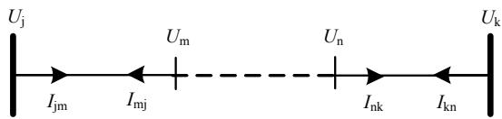  
图2半波长线路由于故障分为多段示意图  
Fig. 2 Half wavelength line divided into several segments due to fault

# 3 点对网半波长输电系统仿真验证

# 3.1 系统条件

为了验证交流线路动态相量模型的仿真精度，建立如图3所示的点对网特高压半波长输电系统模型。系统S近似模拟受端无穷大系统，额定电压为 $1000\mathrm{kV}$ ，系统三相短路电流和单相短路电流均为 $40\mathrm{kA}$ 。送端电源装机 $10\times 600\mathrm{MW}$ ，模拟发电机励磁系统及PSS的作用，升压变压器短路阻抗 $18\%$ ，交流线路参数参照特高压交流示范工程，取 $8\times 500\mathrm{mm}^2$ 导线，工频正序电气参数：阻抗 $z =$

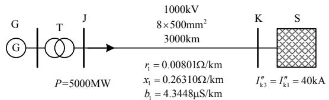  
图3点对网特高压半波长交流输电模型示意图  
Fig. 3 Point-network UHV half wavelength transmission system model

0.00801+j0.2631Ω/km，电纳 $b = 4.3448\mu \mathrm{S} / \mathrm{km}$ ；零序电气参数：阻抗 $z = 0.1563 + j0.7821\Omega / \mathrm{km}$ ，电纳 $b = 2.8133\mu \mathrm{S} / \mathrm{km}$ 。稳态时半波长线路送端功率为 $5000\mathrm{MW}$ 。仿真过程中不考虑抑制沿线过电压的措施的影响。

# 3.2 区外故障验证

假设系统S与节点K之间的短线上发生三相短路故障，故障清除时间120ms，分别采用如下3种方法进行故障仿真。

1）电磁暂态仿真，交流线路应用分布参数模型，即贝瑞隆模型，仿真步长 $0.1\mathrm{ms}$ ，节点电压、线路电流曲线结果采用FFT(fast fourier transformation)算法提取工频分量；  
2）机电暂态仿真，交流线路应用分布参数稳态等效模型[10]，仿真步长 $10\mathrm{ms}$ ；  
3）机电暂态仿真，交流线路应用本文的工频动态相量模型，仿真步长10ms。

仿真结果的发电机频率、电磁功率、送端电压、送端电流曲线如图4所示。仿真结果表明：交流线路动态相量模型在模拟半波长系统的振荡特性、短路过渡过程特性等方面比传统稳态模型更准确，更接近于电磁暂态仿真结果。

点对网半波长输电系统存在两个主要振荡模式，一个是 $1\mathrm{Hz}$ 左右的机电振荡模式，该模式与传统的短线路点对网输电系统相似；另一个是 $6\mathrm{Hz}$ 左右的机电振荡模式，该模式是由半波长线路的波动过程与发电机动态特性相互作用而产生。电磁暂态仿真与应用动态相量模型的机电暂态仿真均能模拟出这两个机电振荡模式；而应用稳态模型的传统机电暂态仿真则不能模拟 $6\mathrm{Hz}$ 左右的振荡特征。

半波长输电线路区外受端发生短路时，送端机组感受到的短路故障的时间比常规线路输电系统显著滞后，表现为送端电流、电压均存在一个缓慢变化的过程，如图4(c)、(d)所示。电磁暂态仿真与应用动态相量模型的机电暂态仿真均能模拟出该过程，而应用稳态模型的传统机电暂态仿真结果则在短路瞬间即发生电压、电流数值突变。

图4(a)发电机转速曲线中，动态相量模型的仿真结果虽然更接近电磁暂态仿真结果，但仍存在一定偏差。其原因在于机电暂态仿真只模拟了工频电气量，而电磁暂态仿真则包含全部频率的响应。这种取舍造成的偏差会随着线路长度的增加而增大。

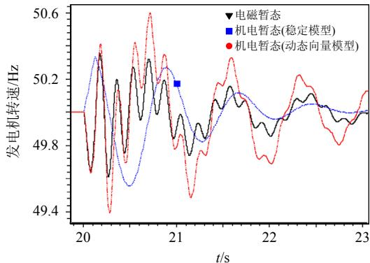

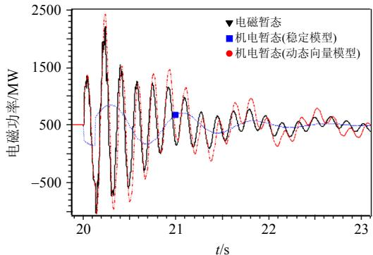  
(a) 发电机转速曲线

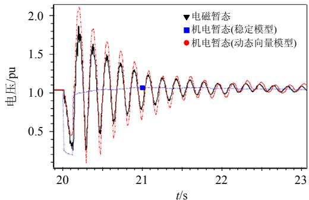  
(b) 发电机电磁功率

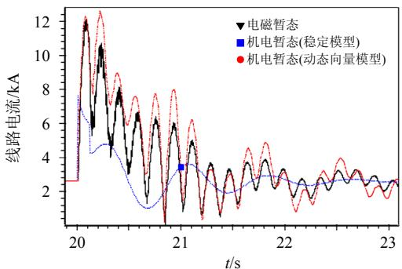  
(c) 送端电压曲线  
(d) 线路送端电流曲线   
图4区外故障仿真曲线对比  
Fig. 4 External fault simulation curves

# 3.3 区内故障验证

当半波长线路内部发生故障时，需将线路在故障处分段，前后两段线路分别应用动态相量模型。为了抑制潜供电流，半波长线路沿线可能会配置快速接地开关，故障相快速接地开关动作时，还需增加新的接地点，从而需要将线路分为多段。

文献[10]研究表明，半波长线路不同位置发生

短路故障对系统稳定性的影响不同，其最严重故障点与送端开机数量有关，大约在距离送端 $2400\sim$ $2700\mathrm{km}$ 范围处。假设距离送端 $2400\mathrm{km}$ 位置发生单相瞬时性短路故障，短路发生0.12s后线路两侧单相开关跳开，0.32s故障相快速接地开关动作，0.6s短路消失，0.8s快速接地开关断开，1.02s单相重合成功。分别用以下4种方法模拟该过程。

1）电磁暂态仿真，交流线路应用分布参数模型，即贝瑞隆模型，仿真步长0.1ms；  
2）机电暂态仿真，交流线路应用分布参数稳态等效模型[10]，仿真步长 $10\mathrm{ms}$ ；  
3）机电暂态仿真，交流线路应用本文的工频动态相量模型，仿真步长 $10\mathrm{ms}$ ，即对于各段线路均用线性插值的大步长仿真方法；  
4）机电暂态仿真，交流线路应用本文的工频动态相量模型，并应用变步长方法，最短步长为1ms，原步长为10ms。

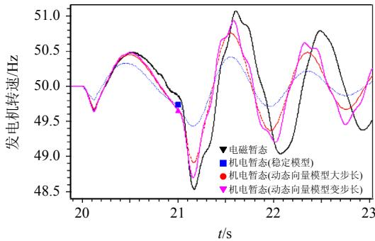  
仿真结果曲线如图5所示，以电磁暂态仿真结  
(a) 发电机转速曲线

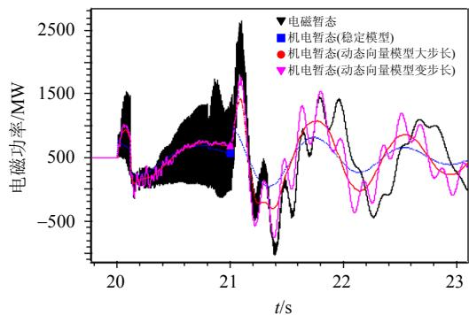

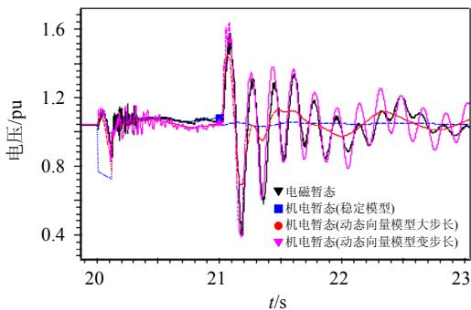  
(b) 发电机电磁功率  
(c) 送端电压曲线

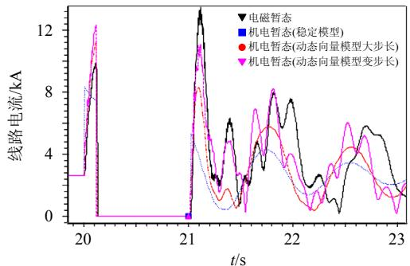  
(d) 线路送端电流曲线   
图5区内故障仿真曲线对比  
Fig. 5 Internal fault simulation curves

果作为参照，三种机电暂态仿真结果的精度比较为：应用传统稳态交流线路模型的机电暂态仿真精度最低；动态相量模型结合变步长仿真的方法最接近电磁暂态结果，其精度最高；动态相量模型并应用大步长仿真的方法则介于两者之间。

# 3.4 暂态稳定性仿真验证

为了进一步验证不同仿真方法对系统暂态稳定性的影响，分别在距离送端2100、2400、2700km位置设置单相瞬时性短路故障，故障时序与第3.3节相同，第3.3节中4种仿真方法计算的暂态稳定极限功率如表1所示。

表 1 不同仿真方法的暂态稳定极限功率  
Tab. 1 Transient stability power limit of different simulation methods   

<table><tr><td rowspan="2" colspan="2">方法</td><td colspan="3">故障位置/km</td></tr><tr><td>2100</td><td>2400</td><td>2700</td></tr><tr><td>方法1</td><td>稳定极限功率/MW</td><td>5920</td><td>5530</td><td>6030</td></tr><tr><td rowspan="2">方法2</td><td>稳定极限功率/MW</td><td>6620</td><td>4950</td><td>7120</td></tr><tr><td>稳定极限偏差/%</td><td>11.8</td><td>-10.5</td><td>16.4</td></tr><tr><td rowspan="2">方法3</td><td>稳定极限功率/MW</td><td>6200</td><td>5250</td><td>6500</td></tr><tr><td>稳定极限偏差/%</td><td>4.7</td><td>-5.1</td><td>7.8</td></tr><tr><td rowspan="2">方法4</td><td>稳定极限功率/MW</td><td>6100</td><td>5300</td><td>6350</td></tr><tr><td>稳定极限偏差/%</td><td>3.0</td><td>-4.2</td><td>5.3</td></tr></table>

表1结果表明，不同方法得到的系统稳定功率极限数值有较为显著的差异。以电磁暂态仿真(方法1)得到的稳定功率极限作为参考，3种机电暂态仿真方法精度比较与第3.2节、第3.3节结论相同；应用传统稳态交流线路模型的机电暂态仿真(方法2)精度最低，稳定极限结果偏差均超过 $10\%$ ；应用交流线路动态相量模型且采用变步长仿真的机电暂态方法(方法4)精度最接近电磁暂态仿真结果，稳定极限偏差在 $-4.2\% \sim 5.3\%$ 范围内；应用交流线路动态相量模型且保持大步长仿真的机电暂态方法(方法3)精度在两者之间，稳定极限偏差在 $-5.1\% \sim$

7.8%范围内。

# 4 结论

在暂态过程中，半波长交流输电线路具有明显的波传输特性，而传统的交流线路稳态模型不能描述这种特性，为了在大电网中准确仿真分析半波长线路的暂态过程，有必要在机电暂态仿真中开发新的交流线路数学模型。电力系统元件的动态相量模型是介于稳态模型和电磁暂态模型之间的一种数学模型。本文以交流线路传输方程为基础，推导了有损交流线路的动态相量数学模型，并首次将其应用于半波长输电线路的机电暂态仿真中；对半波长线路区外、区内故障加以区别对待，提出了不同的仿真策略，以达到既提高仿真精度又兼顾仿真速度的目的。

在半波长交流线路区外故障时，机电暂态仿真仍可以保持通常的仿真步长 $10\mathrm{ms}$ 。对于半波长线路区内故障，为了保证仿真精度和仿真速度，本文提出采用变步长方法：故障期间应用较小步长，故障清除后转为原仿真步长；较小步长由故障期间较短的一段线路传输时间决定；步长的转换时机由误差判据公式决定。

基于具有代表性的点对网半波长输电系统算例对本文提出的模型算法有效性进行了说明，并与传统的稳态模型进行了对比。算例表明，本文提出的机电暂态模型及仿真方法比传统交流线路稳态模型精度更高，可以正确模拟半波长线路波传输过程，仿真结果曲线更接近于电磁暂态仿真；此外，所提仿真方法数值稳定性好，便于在传统的机电暂态仿真流程中嵌入实现。本文所提模型及方法可用于大型电力系统中半波长线路或者较长线路的仿真，目前该模型已经在PSD-BPA中开发实现。

# 参考文献

[1] 郑健超. 智能电力设备与半波长交流输电[J]. 中国电机工程学会动力与电气工程，2009(10)：12-15.  
Zheng Jianchao. Smart power devices and half-wavelength AC transmission technology[J]. Power and Electrical Engineers, 2009(10): 12-15(in Chinese).   
[2] 周孝信．新能源变革中电网和电网技术的发展前景[J].华电技术，2011，33(12)：1-3，27.  
Zhou Xiaoxin. Development prospects of power grid and power system technology in changes with renewable energy[J]. Huadian Technology, 2011, 33(12): 1-3, 27(in

Chinese).   
[3] 王冠，吕鑫昌，孙秋芹，等．半波长交流输电技术的研究现状与展望[J].电力系统自动化，2010,34(16):13-18, 68.  
Wang Guan, Lu Xinchang, Sun Qiuqin, et al. Status quo and prospects of half-wavelength transmission technology [J]. Automation of Electric Power Systems, 2010, 34(16): 13-18, 68(in Chinese).   
[4] 孙玉娇，周勤勇，申洪．未来中国输电网发展模式的分析与展望[J]. 电网技术，2013，37(7)：1929-1935.  
Sun Yujiao, Zhou Qinyong, Shen Hong. Analysis and prospect on development patterns of China's power transmission network in future[J]. Power System Technology, 2013, 37(7): 1929-1935(in Chinese).   
[5] Hubert F J, Gent M R. Half-wavelength power transmission lines[J]. IEEE Transactions on Power Apparatus and Systems, 1965, 84(10): 965-974.   
[6] Prabhakara F S, Parthasarathy K, Ramachandra Rao H N. Analysis of natural half-wave-length power transmission lines[J]. IEEE Transactions on Power Apparatus and Systems, 1969, PAS-88(12): 1787-1794.   
[7] Prabhakara F S, Parthasarathy K, Ramachandra Rao H N. Performance of tuned half-wave-length power transmission lines[J]. IEEE Transactions on Power Apparatus and Systems, 1969, PAS-88(12): 1795-1802.   
[8] Iliceto F, Cinieri E. Analysis of half-wavelength transmission lines with simulation of corona losses [J]. IEEE Transactions on Power Delivery, 1988, 3(4): 2081-2091.   
[9] Tavares M C, Portela C M. Half-wave length line energization case test-proposition of a real test[C]// Proceedings of 2008 International Conference on High Voltage Engineering and Application. Chongqing, China: IEEE, 2008: 261-264.   
[10]秦晓辉，张志强，徐征雄，等．基于准稳态模型的特高压半波长交流输电系统稳态特性与暂态稳定研究[J].中国电机工程学报，2011，31(31)：66-76.  
Qin Xiaohui, Zhang Zhiqiang, Xu Zhengxiong, et al. Study on the steady state characteristic and transient stability of UHV AC half-wave-length transmission system based on quasi-steady model[J]. Proceedings of the

CSEE, 2011, 31(31): 66-76(in Chinese).   
[11] 王玲桃，崔翔. 特高压半波长交流输电线路稳态特性研究[J]. 电网技术，2011，35(9)：7-12.  
Wang Lingtao, Cui Xiang. Research on steady-state operation characteristics of UHV half-wavelength AC power transmission line[J]. Power System Technology, 2011, 35(9): 7-12(in Chinese).   
[12] 张志强，秦晓辉，王皓怀，等．特高压半波长交流输电线路稳态电压特性[J]. 电网技术，2011，35(9)：33-36.  
Zhang Zhiqiang, Qin Xiaohui, Wang Haohuai, et al. Steady state voltage characteristic of UHV half-wavelength AC transmission line[J]. Power System Technology, 2011, 35(9): 33-36(in Chinese).   
[13] 张志强，秦晓辉，徐征雄，等．特高压半波长交流输电技术在我国新疆地区电源送出规划中的暂态稳定性研究[J]. 电网技术，2011，35(9)：42-45.  
Zhang Zhiqiang, Qin Xiaohui, Xu Zhengxiong, et al. Research on transient stability of UHV half-wavelength AC transmission in the plan of sending out electric power from Xinjiang region[J]. Power System Technology, 2011, 35(9): 42-45(in Chinese).   
[14] 梁旭明，张彦涛，秦晓辉，等．基于特高压交流半波长技术的立体电网构建研究[J]. 电网技术，2016，40(11)：3415-3419.  
Liang Xuming, Zhang Yantao, Qin Xiaohui, et al. Study on stereoscopic power grid construction based on UHV AC half-wave-length transmission technology[J]. Power System Technology, 2016, 40(11): 3415-3419(in Chinese).   
[15] 周静姝，马进，徐昊，等．特高压半波长交流输电系统稳态及暂态运行特性[J]. 电网技术，2011, 35(9): 28-32.  
Zhou Jingshu, Ma Jin, Xu Hao, et al. Steady state and transient operational characteristics of UHV half-wavelength AC transmission system[J]. Power System Technology, 2011, 35(9): 28-32(in Chinese).   
[16] 娄颖，周沛洪，修木洪，等．特高压半波长交流输电线路电磁暂态仿真[J]. 高电压技术，2012，38(6)：1459-1465.  
Lou Ying，Zhou Peihong，Xiu Muhong，et al. Electromagnetic transient simulation of UHV half wavelength AC transmission line[J]. High Voltage

Engineering，2012，38(6)：1459-1465(in Chinese).  
[17] 韩彬，林集明，班连庚，等．特高压半波长交流输电系统电磁暂态特性分析[J]. 电网技术，2011，35(9):22-27. Han Bin，Lin Jiming，Ban Lian'geng，et al. Analysis on electromagnetic transient characteristics of UHV half-wavelength AC transmission system[J]. Power System Technology，2011，35(9):22-27(in Chinese).  
[18] 李肖，杜丁香，刘宇，等．半波长输电线路差动电流分布特征及差动保护原理适应性研究[J].中国电机工程学报，2016，36(24)：6802-6808. Li Xiao，Du Dingxiang，Liu Yu，et al.Analysis fordifferential current distribution and adaptability of differential protection of half-wavelength AC transmission line[J].Proceedings of the CSEE，2016，36(24)：6802-6808(in Chinese).  
[19] 杜丁香，王兴国，柳焕章，等．半波长线路故障特征及保护适应性研究[J]. 中国电机工程学报，2016，36(24)：6788-6795. Du Dingxiang，Wang Xingguo，Liu Huanzhang，etal．Fault characteristics of half-wavelength AC transmission line and its impaction to transmission line protection[J].Proceedings of the CSEE，2016，36(24):6788-6795(in Chinese).  
[20] 周泽昕，柳焕章，郭雅蓉，等．适用于半波长线路的假同步差动保护[J]. 中国电机工程学报，2016，36(24)：6780-6787. Zhou Zexin, Liu Huanzhang, Guo Yarong, et al. The false synchronization differential protection for half-wavelength transmission line[J]. Proceedings of the CSEE, 2016, 36(24): 6780-6787(in Chinese).  
[21] 郭雅蓉，周泽昕，柳焕章，等．时差法计算半波长线路差动保护最优差动点[J]. 中国电机工程学报，2016，36(24)：6796-6801. Guo Yarong, Zhou Zexin, Liu Huanzhang, et al. Time difference method to calculate the optimal differential point of half-wavelength AC transmission line differential protection[J]. Proceedings of the CSEE, 2016, 36(24): 6796-6801(in Chinese).   
[22] 宋云亭，周霄，李碧辉，等．特高压半波长交流输电系统经济性与可靠性评估[J]. 电网技术，2011，35(9)：1-6.

Song Yunting, Zhou Xiao, Li Bihui, et al. Economic analysis and reliability assessment of UHV half-wavelength AC transmission[J]. Power System Technology, 2011, 35(9): 1-6(in Chinese).   
[23] 孙珂. 特高压半波长交流输电经济性分析[J]. 电网技术，2011，35(9)：51-54. Sun Ke. Economic analysis on UHV half-wavelength AC power transmission[J]. Power System Technology, 2011, 35(9): 51-54(in Chinese).  
[24] Venkatasubramanian V. Tools for dynamic analysis of the general large power system using time-varying phasors [J]. International Journal on Electric Power & Energy Systems, 1994, 16(6): 365-376.   
[25] 王钢，李志铿，李海锋，等．交直流系统的换流器动态相量模型[J]. 中国电机工程学报，2010，30(1)：59-64. Wang Gang, Li Zhikeng, Li Haifeng, et al. Dynamic phasor model of the converter of the AC/DC system [J]. Proceedings of the CSEE, 2010, 30(1): 59-64(in Chinese).  
[26] 黄胜利，宋瑞华，赵宏图，等．应用动态相量模型分析高压直流输电引起的次同步振荡现象[J].中国电机工程学报，2003，23(7)：1-4. Huang Shengli，Song Ruihua，Zhao Hongtu，etal. Analysis and simulating the SSO caused by HVDC using the time-varying dynamic phasor[J]. Proceedings of the CSEE，2003，23(7)：1-4(in Chinese).  
[27] 何瑞文，蔡泽祥. 结合谐波特征的可控串补动态相量法建模与特性分析[J]. 中国电机工程学报，2005，25(5)：28-32.  
He Ruiwen, Cai Zexiang. Modeling and analysis of thyristor-controlled series capacitor with dynamic phasors considering harmonic characteristics[J]. Proceedings of the CSEE，2005，25(5): 28-32(in Chinese).  
[28] 鲁晓军，林卫星，安婷，等．MMC电气系统动态相量模型统一建模方法及运行特性分析[J].中国电机工程学报，2016，36(20)：5479-5491. Lu Xiaojun，Lin Weixing，An Ting，et al．A unified dynamic phasor modeling and operating characteristic analysis of electrical system of MMC[J]. Proceedings of the CSEE，2016，36(20):5479-5491(in Chinese).  
[29] 黄胜利，周孝信. 分布参数输电线路的时变动态相量模

型及其仿真[J]. 中国电机工程学报, 2002, 22(11): 1-5. Huang Shengli, Zhou Xiaoxin. The time-varynrm phasor model of the distributed parameter transmission line and its simulation[J]. Proceedings of the CSEE, 2002, 22(11): 1-5(in Chinese).   
[30] 应迪生，张明，陈家荣．三相分布参数线路动态相量法的建模与仿真[J]. 中国电机工程学报，2007，27(34)：46-51.  
Ying Disheng, Zhang Ming, Chan K W. Modeling and simulation of 3-phase distribution parameter line using dynamic phasor[J]. Proceedings of the CSEE, 2007, 27(34): 46-51(in Chinese).   
[31] 林集明，郑健超. 特高压半波长交流输电技术经济可行性初步研究总结报告[R]. 北京：中国电力科学研究院，2010.  
Lin Jiming, Zheng Jianchao. Summary report of preliminary study on technical and economic feasibility of the half wave-length UHV-AC transmission[R]. Beijing: China Electric Power Research Institute, 2010(in Chinese).

  
张彦涛

收稿日期：2017-01-28。

# 作者简介：

张彦涛(1980)，男，博士研究生，中国电力科学研究院高级工程师，主要从事电力系统分析与仿真、电网规划等方面的研究工作，ytzhang@epri.sgcc.com.cn;

秦晓辉(1979)，男，教授级高级工程师，主要从事电力系统分析研究工作；

汤涌(1959)，男，中国电力科学研究院总工程师，博士生导师，主要从事电力系统分析、仿真与控制研究工作；

苏丽宁(1986)，女，工程师，主要从事电力系统分析及电网规划研究工作；

王义红(1980)，男，高级工程师，主要从事电力系统分析及电网规划研究工作；

孙玉娇(1979)，女，高级工程师，主要从事电力系统分析及电网规划研究工作。

(编辑 邱丽萍)

# Half-wavelength System Transients Stability Simulation Applying Dynamic Phasor Model of AC Transmission Line

ZHANG Yantao $^{1}$ , QIN Xiaohui $^{2}$ , TANG Yong $^{2}$ , SU Lining $^{2}$ , WANG Yihong $^{2}$ , SUN Yujiao $^{2}$

JIANG Yilang², DONG Yifeng², WANG Yi², GE Leijiao¹

(1. Tianjin University; 2. China Electric Power Research Institute)

KEY WORDS: half wavelength; electromagnetic transient; transient stability; dynamic phasor; point to network transmission

Half wavelength AC transmission is a kind of long distance and large capacity transmission technology with development potential. Since the wave transmission characteristics of half wavelength AC transmission lines are significant, the conventional static AC line model is not suitable for the ultra long distance AC transmission lines such as half wavelength in the electromechanical transient simulation.

In order to simulate the dynamic process of the transmission of the half wavelength AC transmission lines accurately, and to guarantee the calculation speed of the electromechanical transient simulation, this paper puts forward the application of the AC power frequency dynamic phasor model as follows:

$$
\left\{ \begin{array}{l} \frac {\partial \dot {U}}{\partial x} + \left(R _ {0} + \mathrm {j} \omega L _ {0}\right) \dot {I} + L _ {0} \frac {\partial \dot {I}}{\partial t} = 0 \\ \frac {\partial \dot {I}}{\partial x} + \left(G _ {0} + \mathrm {j} \omega C _ {0}\right) \dot {U} + C _ {0} \frac {\partial \dot {U}}{\partial t} = 0 \end{array} \right. \tag {1}
$$

$$
\left\{ \begin{array}{l} \dot {I} _ {\mathrm {j k}} (t) = \frac {1}{Z _ {C} ^ {\prime}} \dot {U} _ {\mathrm {j}} (t) + \dot {I} _ {\mathrm {j}} (t - \tau) \mathrm {e} ^ {- \mathrm {j} \theta} \\ \dot {I} _ {\mathrm {k j}} (t) = \frac {1}{Z _ {C} ^ {\prime}} \dot {U} _ {\mathrm {k}} (t) + \dot {I} _ {\mathrm {k}} (t - \tau) \mathrm {e} ^ {- \mathrm {i} \theta} \end{array} \right. \tag {2}
$$

In this model, the current $I$ and voltage $U$ at the position $x$ along the line are not only related to the terminal voltage and current of time $t$ , but also to the variables of time $t - \tau$ . When the equivalent current phasor $I(t - \tau)$ at the terminal $j$ or $k$ transmitted to the terminal $k$ or $j$ , a time delay angle $\theta$ will be brought. While in the conventional static AC line equation $I_{j} = (U_{j} - U_{k}) / Z_{L} + U_{j}Y_{L} / 2$ , the variables are time dependent.

The iterative solution of the network equations and the state equations is a common method for electromechanical transient simulation. The admittance $1 / Z_{C}^{\prime}$ can be added to the Y bus matrix, and the additional current item of time $t - \tau$ can be regarded as injection to the AC line terminals. To apply equation (2), the time step must not be larger than $\tau$ , otherwise the current injection item will be unsolved variable at time $t$ .

The time step of electromechanical transient

simulation is usually set as half cycle length in order to obtain better convergence and simulation speed. As to the halfwave length AC line, the positive sequence transmission time $\tau$ is very close to half cycle, and the zero sequence transmission time is much larger. Equation (2) can be directly applied when simulating an external fault to the halfwave length AC line. But when simulating an internal fault, the halfwave line must be divided into two or more segments; as a result, the time $\tau$ will be shorter for each one. A linear interpolation approximation method can be applied in this case to retain the half cycle time step with a certain loss of accuracy. A more precise scheme is to introduce the variable step strategy, that is, applying a shorter time step during the fault and recovering the original half cycle step when the fault is cleared.

Fig. 1 shows the sending end bus voltage simulation curves applying different methods for line-ground instantaneous short circuit fault $2400\mathrm{km}$ away from the sending end in a point-network halfwave length system. The simulation study shows that, the electromechanic simulation result with conventional static AC line model (C2) is compared with the electromagnetic result (C1), and the dynamic phasor model with variable step strategy (C4) is the most accurate one. The dynamic phasor model with half cycle step applying linear interpolation approximation strategy (C3) is accurate during the beginning period after the fault, but less accurate later with the accumulation of errors.

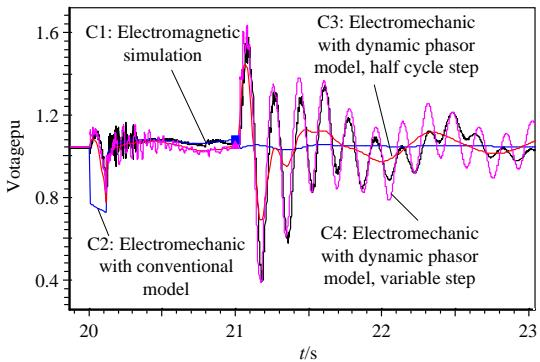  
Fig. 1 Internal fault simulation curves