# Real-time simulation for detailed wind turbine model based on heterogeneous computing

Bing Li, Haoran Zhao ∗, Yibao Jiang, Linghan Meng

School of Electrical Engineering, Shandong University, Jinan 250061, China

# A R T I C L E I N F O

Keywords:

Wind turbine

Real-time simulation

CPU-FPGA

Coupling dynamics

# A B S T R A C T

The deployment of sophisticated and costly large-capacity wind turbines continues to rise. It is urgent for precise real-time simulation to accurately identify and address potential problems. However, the existing solutions, which joint various simulation platforms, suffer from the disadvantages of complex architecture and high cost. This paper proposes a CPU-FPGA heterogeneous computing-based real-time simulation platform for detailed wind turbine model (DWTM). DWTM encompasses the turbine model (covering the inflow wind, aerodynamic, and mechanical dynamic), the electrical model (covering the electromagnetic transient), and the control system. The real-time operating system is introduced to guarantee the real-time performance of the turbine model and control system in the CPU. FPGA is used to perform real-time electrical model calculation. Furthermore, a general FPGA solver for electromagnetic transients is designed. It can accommodate various circuit topologies without the need for recompiling the FPGA code. Finally, the real-time simulation performance and accuracy are verified. The coupled dynamics between the turbine and electrical models are investigated under multiple power grid and wind conditions.

# 1. Introduction

With the increasing global energy demand and worsening environmental issues, the installed capacity of wind power continues to grow worldwide [1]. Wind power has promising development prospects and significant strategic implications. The large-capacity wind turbine (e.g., H260-18MW from China) is extensively adopted in newly developed wind farms. It is more expensive and complex. Therefore, more accurate simulation must be performed to identify and analyze potential issues.

Existing simplified wind turbine models usually ignore some coupled dynamics (e.g., electrical faults and tower vibration) to improve simulation efficiency [2,3]. It no longer satisfies the accurate analysis requirements of the modern large-capacity wind turbine. Therefore, it is necessary to adopt the detailed wind turbine model (DWTM). The DWTM encompasses the millisecond-level turbine model (including the inflow wind model, aerodynamic model, and mechanical dynamic model) [4] and the microsecond-level electrical model (i.e., electromagnetic transient model). It covers various system elements, including blades, hub, nacelle, tower, drive train, generator, converter, transformers, etc. The DWTM has the ability to shed light on the mechanicalelectromagnetic coupling dynamics. This feature plays a crucial role in accurately assessing performance and verifying controllers for the large-capacity wind turbine.

The real-time simulation platform of the DWTM is the basis for performing Hardware-In-the-Loop (HIL) simulation, which can improve the simulation reliability greatly [5]. In addition, it is an essential step for a comprehensive controller test. Consequently, it is urgent to develop real-time simulation platform for DWTM. However, the DWTM has complex characteristics: various types of component models, highorder system dynamics, and multi-timescale coupling dynamics [6]. The real-time simulation of DWTM faces significant challenges due to its complex characteristics.

The existing solutions still have some prominent shortcomings in the real-time simulation of DWTM. Real-time simulators such as RTDS and RT-Lab offer real-time simulation capabilities for electromagnetic transients [7]. However, lacking support for inflow wind, aerodynamic, and mechanical dynamic models hinders its direct application in DWTM real-time simulation scenario. Ref. [8] proposed a platform joined Bladed and RTDS to perform DWTM real-time simulation. Bladed is used to perform real-time simulation of the turbine model. Meanwhile, the real-time simulation of the electrical model is implemented by RTDS. The two platforms interact data through PLC (Programming Logic Controller). The hardware structure of this solution is complex, resulting in cumbersome to use. Meanwhile, the licensing fees of Bladed and RTDS are expensive, which makes it unfeasible for some laboratories to implement this solution. Building upon this work, Ref. [9]

replaces Bladed with OpenFAST [10]. The simulation platform joined OpenFAST and RTDS is implemented. This solution further avoids the licensing fee of Bladed software. But it does not bypass the obstacles brought about by the high cost of RTDS. It is promising to adopt FPGA-based scheme to replace RTDS for microsecond-level electrical model real-time simulation, with the advantages of low cost, strong parallel processing, pipeline execution, and hardware-level real-time performance [11].

Although FPGA has many important advantages in the application of electromagnetic transient real-time simulation [12]. But it also has one fatal flaw. The compilation speed of the code during its development is very slow. Assuming the FPGA code needs to be modified when the circuit topology changes. This would introduce enormous compilation time consumption that is practically unacceptable. Numerous studies have proposed FPGA-based electromagnetic transient real-time simulation schemes [13,14]. However, the previous works lack solutions for designing the general FPGA solver, which can avoid modifying the code when circuit topology changes.

To overcome the challenges associated with real-time simulation of DWTM, a novel CPU-FPGA heterogeneous computing solution is proposed in this paper. The major contributions of this paper are summarized as follows: (1) A novel CPU-FPGA heterogeneous solution is designed and implemented. This solution circumvents the issues of high cost and complex platform structures encountered in the existing joint simulation solutions. (2) A general FPGA solver for real-time electromagnetic transient simulation is designed and implemented. It overcomes the critical drawback of having to recompile the FPGA code when the circuit topology changes in existing research. In addition, the coupled phenomena between power grid faults and mechanical vibration are presented. The torsional vibration and non-torsional vibration of the turbine are investigated under different power grid conditions and wind conditions when the fault occurs. These vibration test results are valuable for the design of the load reduction controller.

The remainder of this paper is organized as follows: Section 2 presents the overall design of the heterogeneous computing-based platform. Section 3 proposes the EMT (ElectroMagnetic Transient) algorithm for the general FPGA solver. Section 4 presents the implementation of the general FPGA solver. Case studies of highly representative scenarios are carried out and analyzed in Section $^ { 5 , }$ followed by the conclusion of this work in Section 6.

# 2. Overall design of real-time simulation platform

The DWTM is composed of turbine model and electrical model. The turbine model takes into account the wind inflow, aerodynamic driver train dynamics, and the mechanical dynamics of the blade, nacelle, tower, and platform. The electrical model adopts a typical type 3 (Doubly-Fed Induction Generator, DFIG) wind turbine, considering components such as the generator, converter, transformer, and power grid to simulate the transient behavior of the electrical circuit. Besides, the control system including the main controller and VSC (Voltage Source Converter) converter is also considered. The main controller is used to perform active, reactive power control and pitch, yaw control. The VSC controller controls the grid side converter (GSC) and rotor side converter (RSC) [15]. The high-speed shaft (HSS) speed $\omega _ { \mathrm { r } }$ and electromagnetic torque $T _ { \mathrm { e } }$ interact between the turbine and the electrical models. The control system interacts control signal with the turbine and electrical models. The diagrams of DWTM and control system are shown in the upper part of Fig. 1.

The turbine model primarily focuses on the dynamics whose typical frequency range of 0–4 Hz [16]. The 5–20 ms simulation time step is sufficient for the typical frequency. However, the electromagnetic transient, due to the high-frequency dynamic up to 10 kHz of the converter, necessitates the simulation time step of 10–20 μs [17]. Additionally, in the control system, the main control needs millisecondlevel update period, while the VSC control typically operates with a calculation period of 200 μs [18].

This paper proposes a real-time simulation platform utilizing CPU-FPGA heterogeneous computing, as illustrated in the lower part of Fig. 1. With the support of the real-time operating system (RTOS), the CPU side can realize real-time computing [19]. However, existing open-source RTOS fall short in terms of clock jitter and latency benchmarks [20], limiting their support to the real-time application whose computation period is lower than 100 ms. Therefore, the realtime calculation of the turbine model and control system is feasible on the CPU. Conversely, the real-time calculation of the electrical model would not be satisfied on the CPU because of the microsecond-level period.

In this paper, the Linux-RT patch is adopted to establish a real-time environment on the CPU. The turbine model solver, main controller solver, and VSC controller solver are implemented, respectively. The turbine model solver is developed based on OpenFAST. The implementation can refer to our previous work in Ref. [9]. The main and VSC controller solvers are based on the code generated by Matlab/Simulink. Specifically, the embedded code generation functionality of Simulink is adapted to generate the corresponding code of the control system. The generated code is then integrated into our overall simulation framework. Furthermore, the simulation control module is implemented. It emphasizes precise control of the computational flow of the three solvers and the communication module with FPGA.

The real-time electrical model simulation is implemented on FPGA. The source solvers for the asynchronous machine and the ideal voltage source are developed. The development of the source solver refers to the method proposed in Ref. [21]. The network solver for power grid is developed based on the proposed algorithm in Section 3. It consists of matrix multiplication and vector addition units. The behavior of each solver is controlled by the finite state machine (FSM). Besides the two solvers mentioned above, the PWM (Pulse Width Modulation) generator is also implemented on FPGA. It receives the duty cycle data from the control system to generate modulation signals for GSC and RSC converters. Additionally, the simulation control unit is developed to perform the management of computational flow, timing, and communication unit.

The HSS speed $\omega _ { \mathrm { { r } } i }$ , electromagnetic torque $T _ { \mathrm { e } } ,$ and control signals are exchanged after each simulation time step. The 8 Gbps PCIe (Peripheral Component Interconnect Express) 3.0 high-speed connector is adopted to achieve the data exchange between CPU and FPGA. The FPGA employs PCIe IP (Intellectual Property) core provided by Xilinx, while the CPU necessitates corresponding PCIe drivers. Furthermore, the communication module also ensures time synchronization between the two computing platforms to maintain a consistent simulation timeline.

Based on the corresponding relations between the frequency and the usual simulation time step, the multi-rate simulation method is adopted in this paper. To clearly present the multi-rate simulation process, the mechanism of the proposed real-time simulation platform is shown in Fig. 2. Three simulation time steps are adopted for the turbine model, electrical model, and controllers. The time step 12.5 ms is set for the turbine model and main controller. The time step 10 μs is set for the electrical model and PWM generator. The time step 200 μs is set for the VSC controller. The first-order hold sampling method is adopted between the fast and slow time step systems. In summary, the five subsystems move forward synchronously and sample the coupling data according to their simulation time steps.

# 3. EMT algorithm toward general FPGA solver

The numerical integration method is a key consideration in electromagnetic transient simulation based on the EMTP (Electromagnetic Transient Program) method. Commonly used integration methods include the implicit trapezoidal and the backward Euler method [11]. A weighted numerical integration method can be adopted to unify

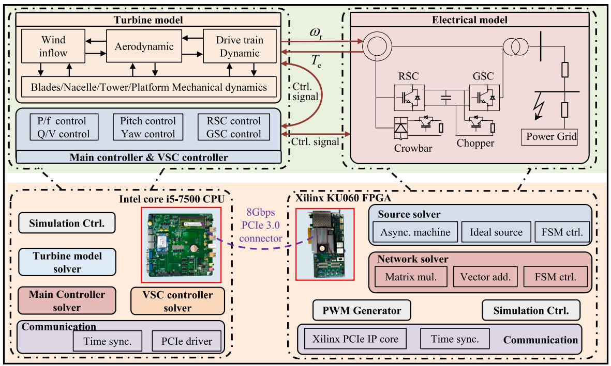  
Fig. 1. Overall design of real-time DWTM simulation platform.

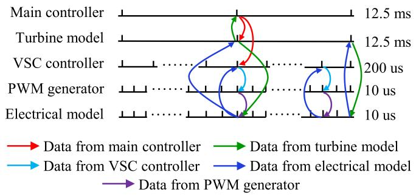  
Fig. 2. Multi-rate simulation mechanism of the real-time simulation platform.

these two methods. For a given differential equation ??, the general computational format based on weighted numerical integration is,

$$
\begin{array}{l} y _ {n + 1} = y _ {n} + h \left[ \theta f \left(y _ {n + 1}, t _ {n + 1}\right) + (1 - \theta) f \left(y _ {n}, t _ {n}\right) \right] \tag {1} \\ (1 / 2 \leq \theta \leq 1), \\ \end{array}
$$

in which, ℎ represents the time step, ?? is the weighting factor. When $\theta = 1 / 2 ,$ , the format corresponds to the implicit trapezoidal method, while $\theta = 1$ corresponds to the backward Euler method. By selecting any value of ?? from the range $( 1 / 2 - 1 ) ,$ a balance can be achieved between the accuracy of the mixed implicit trapezoidal method and the stability of the backward Euler method. In addition, the weighted numerical integration method can also enhance the generality of the general FPGA solver.

Discretization can be applied to ${ \textsc { R , L , C , R L } } ,$ and RC branches using Eq. (1). After the discretization, the branch could be represented by a parallel connection branch of the current source and equivalent resistance [22]. For example, the equivalent circuit of the capacitance branch is shown in Fig. 3. $I _ { \mathrm { h } }$ is the equivalent current source, and $G _ { \mathrm { e q } }$ is the admittance of the equivalent resistance.

The $I _ { \mathrm { h } }$ can be calculated by,

$$
I _ {\mathrm {h}} (t) = \sigma I _ {\mathrm {h}} (t - \Delta t) + \eta U (t - \Delta t), \tag {2}
$$

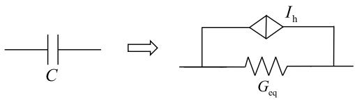  
Fig. 3. Equivalent circuit of the capacitance.

Table 1 Discrete format for branches.   

<table><tr><td>Type</td><td>Geq</td><td>σ</td><td>η</td></tr><tr><td>R</td><td>0</td><td>0</td><td>1/R</td></tr><tr><td>L</td><td>θΔt/L</td><td>1</td><td>Δt/L</td></tr><tr><td>C</td><td>C/θΔt</td><td>θ-1/θ</td><td>(2θ-1)C/θ2Δt</td></tr><tr><td>RL</td><td>θΔt/L+θΔtR</td><td>L+(1-θ)ΔtR/L+θΔtR</td><td>ΔtL/(L+ΔtR)2</td></tr><tr><td>RC</td><td>C/θΔt+RC</td><td>RC-(1-θ)Δt/θΔt+RC</td><td>-ΔtC/(\Delta tθ+RC)2</td></tr></table>

in which $I _ { h } ( t - \Delta t )$ and $U ( t - \Delta t )$ represent the historical values of the branch current and voltage, respectively, ?? is the historical current coefficient, ?? is the historical voltage coefficient. The equivalent admittance $G _ { \mathrm { { e q } } } , \sigma ,$ and ?? for various branch types are given in Table 1.

Given a circuit with ?? nodes and ?? branches. Eq. (2) can be rewritten in matrix form as,

$$
I _ {\mathrm {h}} (t) = \sigma I _ {\mathrm {h}} (t - \Delta t) + \eta U _ {\mathrm {n}} (t - \Delta t), \tag {3}
$$

in which, $I _ { \mathrm { h } } ( t )$ is the branch current vector of ?? elements, $I _ { \mathrm { h } } ( t - \Delta t )$ is the historical current vector of ?? elements, $U _ { \mathrm { n } } ( t - \Delta t )$ is the historical voltage vector of ?? elements, ?? is the ??×?? diagonal matrix of historical current coefficients, and ?? is the ?? × ?? matrix of historical voltage coefficient.

Then, the injected currents $I _ { \mathrm { n } } ( t )$ at each node are computed as follows,

$$
I _ {\mathrm {n}} (t) = M _ {1} I _ {\mathrm {h}} (t) + M _ {2} I _ {\mathrm {i n}} (\mathrm {t}), \tag {4}
$$

in which, $M _ { 1 }$ is an ?? × ?? incidence matrix representing the connections relationship between nodes and branches, which is only composed of

0 and 1. $I _ { \mathrm { i n } } ( \bf t )$ is the injected current from the asynchronous machine, $\pmb { M } _ { 2 }$ is an ??×?? incidence matrix representing the connection relationship between nodes and external injection current. Once the circuit topology is determined, $M _ { 1 }$ and $M _ { 2 }$ are also determined.

The final step is to solve the node voltage vector $U _ { \mathbf { n } } ( t )$ for the entire circuit, given by,

$$
\boldsymbol {U} _ {\mathbf {n}} (t) = \boldsymbol {Y} ^ {- 1} \boldsymbol {I} _ {\mathbf {n}} (t), \tag {5}
$$

in which, ?? is the ?? × ?? node admittance matrix. Because the converter switching state changes, ?? is time-varying. To ensure computational efficiency, all the admittance matrices can be pre-computed and stored once the circuit topology is determined.

To reduce the calculation process as much as possible, Eqs. (4) and (5) can be combined,

$$
\boldsymbol {U} _ {\mathrm {n}} (t) = \boldsymbol {Y} ^ {- 1} \boldsymbol {M} _ {1} \boldsymbol {I} _ {\mathrm {h}} + \boldsymbol {Y} ^ {- 1} \boldsymbol {M} _ {2} \boldsymbol {I} _ {\mathrm {i n}} = \boldsymbol {K} \boldsymbol {I} _ {\mathrm {h}} + \boldsymbol {L} \boldsymbol {I} _ {\mathrm {i n}}, \tag {6}
$$

The network solver can directly use Eqs. (3) and (6) to calculate the voltage and current. This improves the calculation efficiency.

# 4. Implementation of general FPGA solver

For the FPGA, one major challenge is the time consumption of compilation and debugging after FPGA code development. This process may account for up to 50% of the entire development period. This section aims to design and implement a general and optimal FPGA solver for electromagnetic transient real-time simulation. The basic idea is to hardening of the computation process.

Based on the algorithm proposed in Section 3, the computation process follows a time-loop calculation of Eqs. (3) and (6). Five classes of computation processes can be summarized.

• matrix (m × m) - vector (m × 1 multiply (Eq. (3))   
• matrix (m × n) - vector (n × 1 multiply (Eq. (3))   
• vector (m × 1) - vector (m × 1) addition (Eq. (3))   
• matrix (n × m) - vector (m × 1) multiply (Eq. (6))   
• matrix (n × n) - vector (n × 1) multiply (Eq. (6))   
• vector (n × 1) - vector (n × 1) addition (Eq. (6))

Eqs. (3) and (6) involve matrices and vectors with different dimensions. In this paper, we normalize Eqs. (3) and (6) to the same dimensional matrices.

In the data processing stage of the circuit, the parameters ??, ??, $M _ { 1 } , \ M _ { 2 } ,$ and $\bar { \pmb { Y } } ^ { - 1 }$ are processed as square matrices of dimension $d \_ =$ max(??, ??). Any surplus rows and columns are filled with zero parameters. Additionally, the initial values of $I _ { \mathbf { h } }$ and $U _ { \mathbf { n } }$ are also filled with zeros. By unifying in this way, Eqs. (3) and (6) will be re-formulated to Eqs. (7) and (8).

$$
\begin{array}{l} \left[ \begin{array}{c} I _ {\mathrm {h}} (t) \\ \mathbf {0} \end{array} \right] = \left[ \begin{array}{c c} \sigma & \mathbf {0} \\ \mathbf {0} & \mathbf {0} \end{array} \right] \left[ \begin{array}{c} I _ {\mathrm {h}} (t - \Delta t) \\ \mathbf {0} \end{array} \right] \tag {7} \\ + \left[ \begin{array}{c c} \eta & \mathbf {0} \\ \mathbf {0} & \mathbf {0} \end{array} \right] \left[ \begin{array}{c} U _ {\mathbf {n}} (t - \Delta t) \\ \mathbf {0} \end{array} \right], \\ \end{array}
$$

$$
\left[ \begin{array}{c} U _ {\mathrm {n}} (t) \\ \mathbf {0} \end{array} \right] = \left[ \begin{array}{c c} K & \mathbf {0} \\ \mathbf {0} & \mathbf {0} \end{array} \right] \left[ \begin{array}{c} I _ {\mathrm {h}} (t) \\ \mathbf {0} \end{array} \right] + \left[ \begin{array}{c c} L & \mathbf {0} \\ \mathbf {0} & \mathbf {0} \end{array} \right] \left[ \begin{array}{c} I _ {\mathrm {i n}} (\mathbf {t}) \\ \mathbf {0} \end{array} \right], \tag {8}
$$

The five types of computation processes mentioned above will be further compressed into two categories by expanding the ?? $\times n , n \times n ,$ , ?? × ?? matrices uniformly to $d \times d \colon ( 1 )$ matrix (?? × ??) - vector $( d \times d )$ multiplication, (2) vector (?? × 1) - vector $( d \times 1 )$ addition.

Through the above processing, the entire design can be abstracted as matrices operation on FPGA. The overall design of the solver is depicted in Fig. 4. Based on the idea that fully re-uses the computational resource of FPGA, the network solver consisting of three block solvers is employed. The three block solvers are named B1, B2, and B3, respectively. Fig. 4(a) shows the design of the block solvers. B1 and B2 are d-dimensional matrix–vector multiplication solvers. B3 is a vector

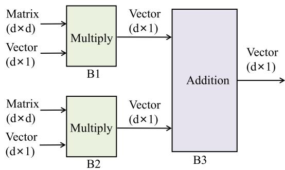  
(a) Block solver design

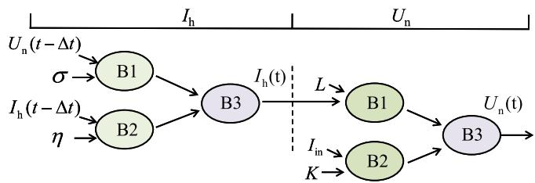  
(b) Data flow in the propped solver   
Fig. 4. FPGA solver diagram. (a) Block solver diagram. (b) Data flow of the network solver.

addition solver. There is a data dependency between Eqs. (7) and (8), resulting in the requirement of sequential computation. Therefore, the solver in Fig. 4(a) can be re-used for both Eqs. (7) and (8).

The data flow of the proposed general solver is illustrated in Fig. 4(b). Firstly, $I _ { \mathrm { h } } ( t )$ is calculated by the parallel execution of block solvers B1 and B2, followed by the vector addition calculation in B3. Then, the B1-B3 will be re-used to calculate $U _ { \mathbf { n } } ( t ) _ { : }$ , similar to the $I _ { \mathrm { h } } ( t )$ calculation process.

# 4.1. Implementation and optimization

Because the hardware resource consumption is not high, the vector addition in B3 in Fig. 4(b) is executed in full parallel to speed up the computation. The hardware resource consumption of matrix– vector multiplications in B1 and B2 is high. Therefore, the hardware optimization design of B1 and B2 is proposed in this paper.

The calculation process of B1 and B2 can be decomposed into multiple row-wise dot product operations. This computation process can fully exploit the parallel and pipeline characteristics. The optimized computation process shown in Fig. 5 is designed through optimized storage and computation flow. The matrices need to be stored in RAM (Random-Access Memory) in the FPGA. However, limited by the output ports of the block RAM (BRAM), only up to two data elements can be output within one clock cycle. Therefore, the matrix is stored in multiple RAMs column-wise separately, as shown in Fig. 5(a), ensuring that the matrix rows are output within the same clock cycle. The vector is stored in multiple registers separately for accessing all elements within one clock cycle.

The hardware scheme of matrix–vector multiplication is shown in Fig. 5(b). The multiplications of multiple elements are performed in full parallel, followed by accumulation. The accumulation operation utilizes the addition tree structure, consisting of multiple levels of addition operations, where $m = \log _ { 2 } \mathrm { d } .$ .

To perform matrix–vector multiplication more efficiently, the multiplications and accumulations operations are designed in the pipeline manner, as shown in Fig. 5(c). Once the multiplication of the first row is completed, the 1-level addition starts immediately. Meanwhile, the

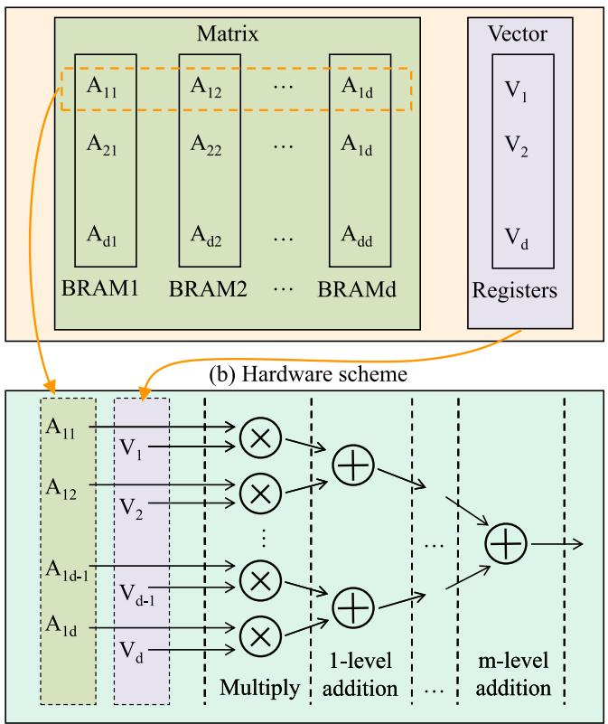  
(a) Matrix and vector partition

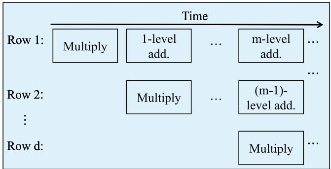  
(c) Pipeline computing   
Fig. 5. Optimal implementation of matrix–vector multiply. (a) matrix and vector partition in FPGA. (b) Addition tree-based vectors multiplication flow. (c) Pipeline-based computing flow.

multiplication of the second row starts at the same time. The computation process for the remaining rows is the same as described above. This design scheme can guarantee the least resource consumption while the output delay is not greatly affected.

# 4.2. Data flow and state control

Based on the aforementioned design, the numerical values of coefficient matrices ??, ??, ??, and ?? can be determined and stored in the SDRAM (Synchronous Dynamic Random-Access Memory) embedded the FPGA development board. When the simulation starts, the data will be read into BRAMs in FPGA. Assuming the circuit topology changes, only the data in SDRAM needs to be changed, but not need to modify the FPGA code.

To manage the timing constraints overflow and the computation sequence, two FSMs are developed. 3 states FSM1 and 5 states FSM2 are shown in Fig. 6. Initially, it enters the Idle state after power-on. Once receiving the computation command from the CPU, it transitions

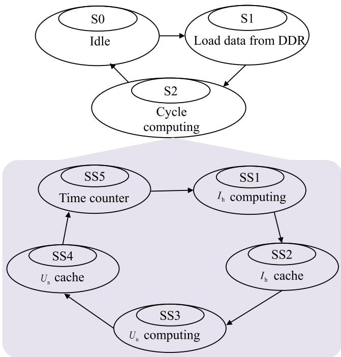  
Fig. 6. State controller for computing procedure.

to S1, in which it reads the initialization data from SDRAM, including coefficient matrices and initial current and voltage ${ \cal I } _ { \mathrm { h } } ( { \bf 0 } )$ and $U _ { \mathbf { n } } ( \mathbf { 0 } ) .$ . Subsequently, it enters the state S2, and jumps to FSM2 immediately.

FSM2 switches between these five states. Firstly, it performs the computation of $I _ { \mathbf { h } }$ and caches the results in SS2. Similarly, the computation of $U _ { \mathbf { n } }$ is performed in state SS3, and the result is cached in SS4. State SS5 is to execute global timing. Once the overall computation time reaches the set real-time simulation step, SS5 is released. And the next computation step begins. Otherwise, it remains blocked.

Based on the overall design described above, the proposed solution can adapt to different topologies. After a change in the topology, it only requires regenerating the coefficient matrices corresponding to the algorithm in the pre-processing stage without recompiling the FPGA code.

# 5. Case study

The Intel® CoreTM i5-7500 CPU and Xilinx KU060 FPGA are adopted to implement the real-time simulation platform. The Wind-PACT (WP) 1.5 MW wind turbine [23] is emulated on the platform to verify the real-time simulation performance and accuracy. The simulation results present the coupling phenomenon between the mechanical vibration and the electrical fault under various power grid conditions and wind conditions.

# 5.1. Computation performance

The computation time for the turbine model and electrical and the set time steps are shown in Table 2. The computing time means the time consumption of one simulation step, while the time-step means the set simulation time step. The average computing time of the turbine model is obtained by running the simulation 10,000 times and taking the average value. It is much smaller than the set simulation time step. Consequently, it can satisfy the basic requirement of real-time simulation. With the Linux-RT patch support, the real-time simulation of the turbine model can be implemented. On the FPGA side, deterministic computation time can be measured for every simulation

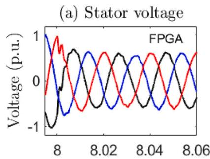

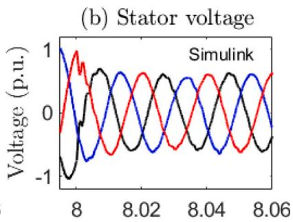

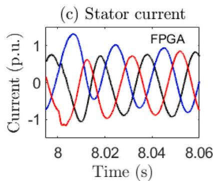

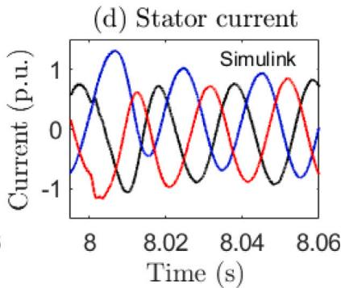  
Fig. 7. Voltage drop transient results. (a) (b) Results of stator voltage of FPGA and Simulink, respectively. (c) (d) Results of stator current of FPGA and Simulink, respectively.

Table 2 Computation time of turbine model and electrical model.   

<table><tr><td colspan="2">Turbine model</td><td colspan="2">Electrical model</td></tr><tr><td>Avg. computing time</td><td>Time-step</td><td>Computing time</td><td>Time-step</td></tr><tr><td>3.6 ms</td><td>12.5 ms</td><td>8.6 μs</td><td>10 μs</td></tr></table>

step. The computation time of the electrical model is less than the set simulation time, satisfying the requirements of real-time simulation. Under global timing control, the real-time simulation of the electrical model is implemented.

# 5.2. Accuracy verification

To validate the accuracy of the developed FPGA-based real-time simulation module, the electromagnetic transient simulation of a DFIG (Type 3) is conducted. Simulation results based on Matlab/Simulink are used as the benchmark results. In order to thoroughly validate the accuracy under different operating conditions, three-phase voltage drop fault is set, occurring at 9 s, dropping to 0.5 p.u., lasting 500 ms.

Fig. 7 shows the simulation results. The left column represents the real-time simulation results. The right column represents the simulation results of Matlab/Simulink. The generator stator voltage and current are compared, as shown in Fig. 7(a) (b) and (c) (d), respectively. The results indicate that the voltage and current values from the proposed simulator are highly consistent with the benchmark results. The relative error between them is less than 0.1%.

# 5.3. Analysis of coupling phenomena between mechanical and electrical model

To analyze the coupling dynamics between the turbine and electrical models, four scenarios are designed and simulated based on the proposed platform. The scenarios include the common faults consisting of voltage drop and short-circuit. The scenarios are summarized in Table 3. In Scenarios I and II, voltage drop and three-phase short-circuit faults occur with various power grid short-circuit levels (SCLs) at the same rated wind condition (11.5 m∖s). The SCLs are set to 60, 90,

Table 3 Scenarios definition for Coupling Analysis.   

<table><tr><td>Scenarios</td><td>Power grid conditions</td><td>Wind conditions</td></tr><tr><td>Scenario I</td><td>Voltage Drop (60/90/200 MVA)</td><td>Steady Wind 11.5 m\s</td></tr><tr><td>Scenario II</td><td>Short-Circuit (60/90/200 MVA)</td><td>Steady Wind 11.5 m\s</td></tr><tr><td>Scenario III</td><td>Voltage Drop (60 MVA)</td><td>Steady Wind (6/11.5/20 m\s)</td></tr><tr><td>scenario IV</td><td>Short-Circuit (60 MVA)</td><td>Steady Wind (6/11.5/20 m\s)</td></tr></table>

and 200 MVA, respectively. In Scenarios III and IV, voltage drop and three-phase short-circuit faults occur with various wind conditions at the same SCL (60 MVA). The wind conditions are set to low wind speed (L-wind, 6 m∖s), rated wind speed (R-wind, 11.5 m∖s), and extreme wind speed (E-wind, 20 m∖s). In all scenarios, the voltage drop occurs at 10 s, dropping to 0.3 p.u., lasting for 0.5 s. The shortcircuit fault occurs at 10 s and lasts for 8 cycles. The acceleration condition of mechanical components is analyzed as they can effectively reflect the vibration of the components. The results focus on torsional vibration (e.g., drive train) and non-torsional vibration (e.g., tower top, blade tip), respectively. Detailed theoretical analyses are provided in Appendix.

# 5.3.1. Non-torsional vibration

For non-torsional vibration, this section focuses on the vibration of the tower top and blade tip. The acceleration of the tower top in the fore-aft (vertical to the rotor plane) and side-side (parallel to the rotor plane) directions are shown in Fig. 8 and Fig. 9, respectively. Fig. 8(a) (b) show that the fore-aft acceleration amplitude is influenced by the grid conditions. It is shown that the disturbance causes severer tower fore-aft vibration when the wind turbine is connected to the weak power grid. This is because the suppression effect of the weak grid on the torque oscillation of the generator is weak. During voltage drop, the fore-aft acceleration fluctuation amplitude at the tower top is significantly larger than that during short-circuit faults (Fig. 8(b)), which is due to the longer duration of voltage drop. Fig. 8(c) (d) show

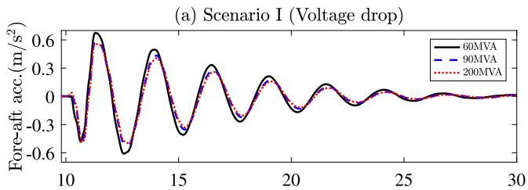

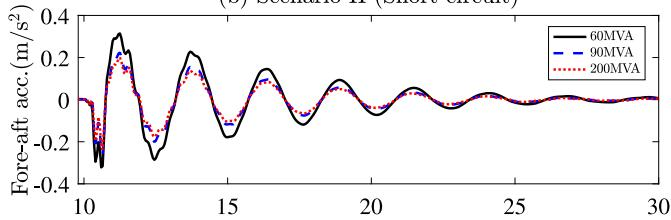  
(b) Scenario II (Short-circuit)

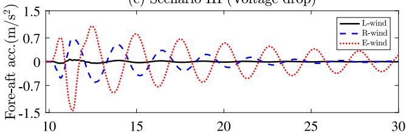  
(c) Scenario II (Voltage drop)

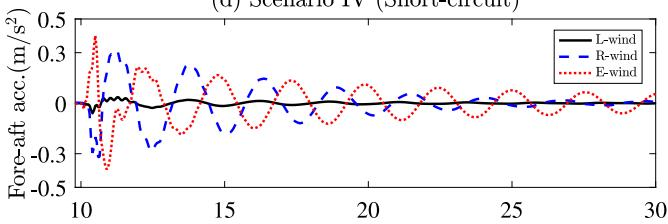  
(d) Scenario IV (Short-circuit)   
Time (s)   
Fig. 8. Acceleration of tower top fore-aft bending. (a)∼(b) Tower top fore-aft acceleration during voltage drop and short-circuit faults under various SCLs, respectively. (c)∼(d) Tower top fore-aft acceleration during voltage drop and short-circuit faults under different wind conditions, respectively.

that the fore-aft acceleration at the tower top increases with wind speed as larger aerodynamic moments are exerted on the tower top under high wind speed. The vibration amplitudes under voltage drop and short-circuit faults at different wind speeds follow a similar trend as in Fig. 8(a) (b). It is worth noting that the fore-aft acceleration trend is opposite to that of low wind speeds under extreme wind conditions. This is due to the larger pitch angle variations under extreme wind conditions, leading to inconsistent tower top vibration modes.

Fig. 9(a) (b) show that the side-side acceleration of the tower top is not significantly affected by grid conditions. Regardless of voltage drop or short-circuit faults, the fluctuation amplitude is relatively small. However, compared to the fore-aft vibration, the side-side vibration has a longer duration time, which greatly influences the fatigue of the tower. This is because the side-side vibration at the tower top is not only affected by generator torque but also induced by the partial transfer of the blade’s inertia to the side-side direction under blade pitching actions. Fig. 9(c) (d) demonstrate that the side-side acceleration amplitude at the tower top is influenced by wind speed. The higher wind speed corresponds to the larger vibration amplitude. This is due to the larger aerodynamic moments under high wind conditions, which result in greater fluctuations under the influence of blade pitching actions.

The flap-wise and edge-wise accelerations $A _ { \mathrm { f w } }$ and $A _ { \mathrm { e w } }$ at the blade tip are shown in Fig. 10 and Fig. 11, respectively. From Figs. 10(a) (b)

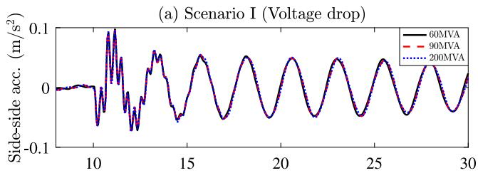

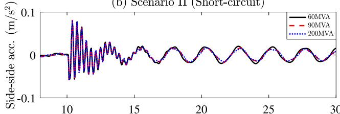  
(b)Scenario II (Short-circuit)

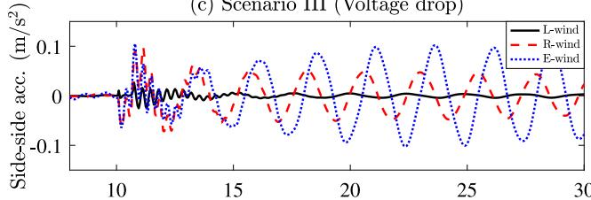  
(c)Scer ario JL(Voltage dron)

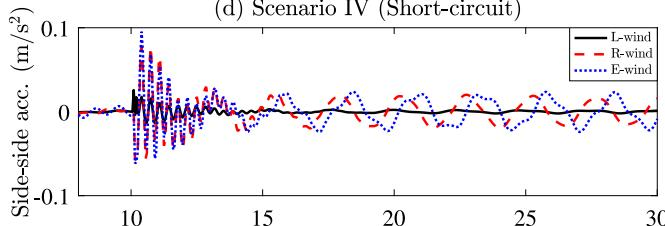  
(d)S   
Time (s)   
Fig. 9. Acceleration of tower top side-side bending. (a)∼(b) Tower top side-side acceleration during voltage drop and short-circuit faults under various SCLs, respectively. (c)∼(d) Tower top side-side acceleration during voltage drop and short-circuit faults under different wind conditions, respectively.

and 11(a) (b), it can be observed that the vibration amplitudes at the blade tip are not strongly correlated with the power grid SCL. However, the flap-wise acceleration amplitude at the blade tip is much larger than that of the edge-wise, indicating that more attention should be paid to flap-wise vibration in blade load reduction design. Furthermore, in Figs. 10(c) (d) and 11(c) (d), the steady-state values of flap-wise acceleration differ due to different pitch angles under various wind speed conditions. After the grid fault occurs, it is evident that a higher wind speed leads to larger fluctuations in both flap-wise and edge-wise accelerations. Additionally, by comparing Fig. 10(a) (c) and (b) (d), it can be observed that the short-circuit fault causes larger fluctuations in flap-wise acceleration. This is attributed to the larger fluctuation of generator torque during a short-circuit fault.

# 5.3.2. Torsional vibration

Fig. 12 shows strain gage angular acceleration $A _ { \mathrm { s g } }$ on the gearbox side of the low-speed shaft (LSS) under different scenarios. Due to the difference in duration time between voltage drop and short-circuit faults, the fluctuation duration of the acceleration in (a) (c) and (b) (d) are different. Secondly, in (a) and (b), it can be observed that the vibration amplitude and frequency are generally consistent under different power grid SCLs. However, the short-circuit fault results in a larger fluctuation amplitude than (a) because of the greater fluctuation of the electromagnetic torque under short-circuit faults. In (c) and

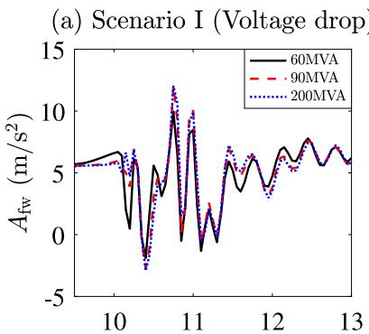

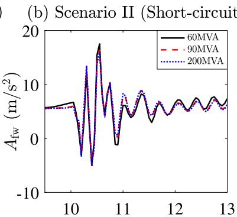

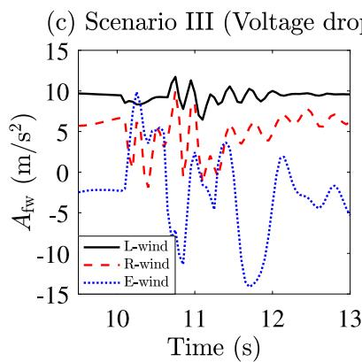

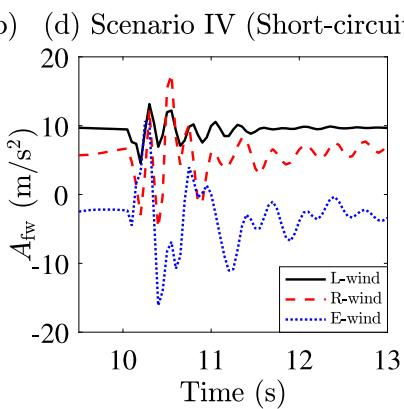  
Fig. 10. Acceleration of blade tip flap-wise. (a)∼(b) Blade tip flap-wise acceleration during voltage drop and short-circuit faults under various SCLs, respectively. (c)∼(d) Blade tip flap-wise acceleration during voltage drop and short-circuit faults under different wind conditions, respectively.

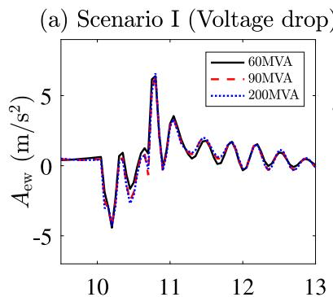

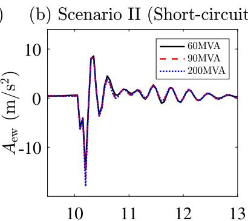

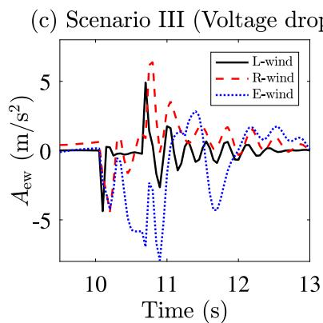

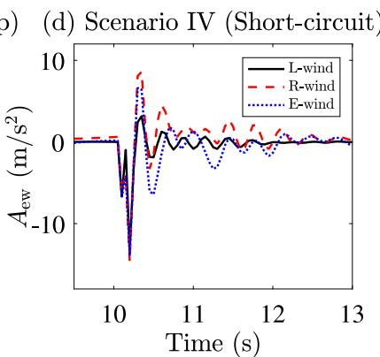  
Fig. 11. Acceleration of blade tip edge-wise. (a)∼(b) Blade tip edge-wise acceleration during voltage drop and short-circuit faults under various SCLs, respectively. (c)∼(d) Blade tip edge-wise acceleration during voltage drop and short-circuit faults under different wind conditions, respectively.

(d), it can be seen that the fluctuation amplitude of the acceleration increases as the wind speed increases under the same power grid condition, which enhances its fatigue and may lead to damage to the

drive train. These results provide new insights that the short-circuit fault and extreme wind conditions should be deeply considered when designing the load-reduction controller.

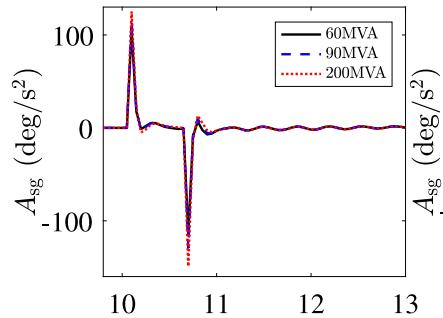  
(a) Scenario I (Voltage drop)   
(c) Scenario II (Voltage drop)

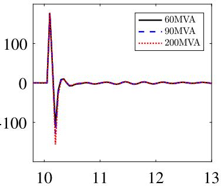  
(b) Scenario II (Short-circuit)   
(d) Scenario IV (Short-circuit)

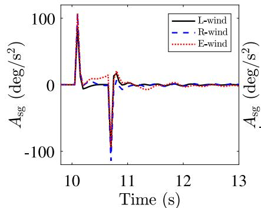

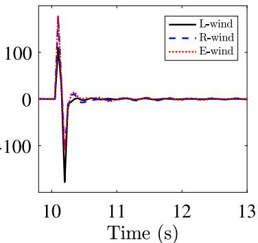  
Fig. 12. Strain gage angular acceleration of low-speed shaft. (a)∼(b) Strain gage angular acceleration during voltage drop and short-circuit faults under various SCLs, respectively. (c)∼(d) Strain gage angular acceleration during voltage drop and short-circuit faults under different wind conditions, respectively.

Fig. 13 shows the rotor azimuth angular acceleration under the four scenarios. In (a) and (b), it can be observed that the fluctuation amplitude is not influenced by the various power grid SCLs when voltage drop or short-circuit faults occur. However, the fluctuation amplitude under short-circuit is larger than that under voltage drop fault. It means that more attention must be paid to the short-circuit fault when designing load-reduction controller. In (c) and (d), the fluctuation amplitude is influenced by different wind conditions. But the distinction is relatively minor under different conditions. The dominant factor is still the grid fault condition.

# 6. Conclusion

This paper presents a novel CPU-FPGA heterogeneous computingbased solution for the real-time simulation of DWTM. In the proposed solution, the real-time simulation of turbine model and control system is implemented in the CPU supported by the RTOS. The real-time simulation of the microsecond-level electrical model is carried out in FPGA. By designing the general FPGA solver, the critical drawback of recompiling FPGA code when circuit topology changes are eliminated. The proposed solution provides an efficient and cost-effective alternative to existing joint simulation platform solutions. The non-torsional and torsional vibrations of mechanical components are studied when grid faults occur under various power grid SLC conditions and low, rated, and extreme wind conditions. The results illustrate that the high power grid SCL has the ability to suppress the vibration amplitude. Extreme wind condition has a great impact on mechanical fatigue. The vibration amplitude of the tower top is larger under the voltage drop fault, relative to the short-circuit fault. On the contrary, the vibration amplitude of the blade tip is larger under the short-circuit fault. The results provide valuable inspiration for the design of controllers aimed at mitigating vibrations and reducing loads. Future work may leverage the multi-core of CPU and pipeline ability of the FPGA to enable realtime simulation of multiple DWTM using a single hardware system. Furthermore, relative work continues to enable the real-time simulation of detailed wind farm model.

# CRediT authorship contribution statement

Bing Li: Conceptualization, Methodology, Software, Investigation, Writing – Original draft,. Haoran Zhao: Supervision, Writing – review & editing. Yibao Jiang: Validation, Investigation. Linghan Meng: Visualization.

# Declaration of competing interest

All authors disclosed no relevant relationships.

# Data availability

Data will be made available on request

# Appendix

The kinematic equation of the drivetrain is the bridge between the turbine and the electrical models. It can be expressed as follow,

$$
\left\{ \begin{array}{l} \boldsymbol {M} \ddot {\boldsymbol {x}} + \boldsymbol {C} \dot {\boldsymbol {x}} + \boldsymbol {K} \boldsymbol {x} = \boldsymbol {R} \\ \boldsymbol {x} = \left[ \theta_ {\mathrm {W T}}, \theta_ {\mathrm {G}} \right] ^ {\mathrm {T}} \\ \boldsymbol {R} = \left[ T _ {\mathrm {a}}, T _ {\mathrm {e}} \right] ^ {\mathrm {T}} \\ \boldsymbol {M} = \operatorname {d i a g} \left(J _ {\mathrm {W T}}, J _ {\mathrm {G}}\right) \end{array} \right. \tag {9}
$$

$$
\left[ \begin{array}{c} \boldsymbol {K} = \left[ \begin{array}{c c} K _ {\mathrm {W T G}} & - K _ {\mathrm {W T G}} \\ - K _ {\mathrm {W T G}} & K _ {\mathrm {W T G}} \end{array} \right] \\ \boldsymbol {C} = \left[ \begin{array}{c c} D _ {\mathrm {W T}} + d _ {\mathrm {W T G}} & - d _ {\mathrm {W T G}} \\ - d _ {\mathrm {W T G}} & D _ {\mathrm {G}} + d _ {\mathrm {W T G}} \end{array} \right] \end{array} \right.
$$

in which $\theta _ { \mathrm { W T } }$ and $\theta _ { \mathrm { G } }$ are the angular displacement of the rotor and generator, respectively, $D _ { \mathrm { W T } }$ and $D _ { \mathrm { G } }$ are the self-damping of the rotor and generator, respectively, $K _ { \mathrm { W T G } }$ is the equivalent stiffness coefficient of the shaft, $d _ { \mathrm { W T G } }$ is the equivalent damping coefficient of the shaft, $T _ { \mathrm { a } }$ and $T _ { \mathrm { e } }$ are the aerodynamic torque and electromagnetic torque, respectively.

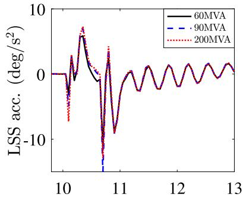  
(a) Scenario I (Voltage drop)   
(c) Scenario II (Voltage drop)

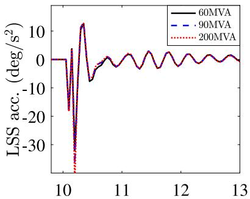  
(b) Scenario II (Short-circuit)   
(d) Scenario IV (Short-circuit)

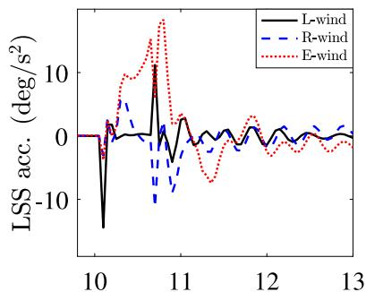  
Time (s)

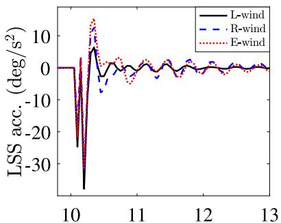  
Time (s)   
Fig. 13. Rotor azimuth angular acceleration. (a)∼(b) Rotor azimuth angular acceleration during voltage drop and short-circuit faults under various SCLs, respectively. (c)∼(d) Rotor azimuth angular acceleration during voltage drop and short-circuit faults under different wind conditions, respectively.

When the power grid fault occurs, the electromagnetic torque $T _ { \mathrm { e } }$ will fluctuate. It stimulates the periodic fluctuations of the rotor rotational speed $\dot { \theta _ { \mathrm { W T } } }$ increase and decrease. The results are shown in Fig. 13(a) (b). At the moments of fault initiation and elimination, the difference between $T _ { \mathrm { a } }$ and $T _ { \mathrm { e } }$ is large. Based on Eq. (9), the strain gage angle peaks at these moments. And it recovers quickly due to the damping of the mechanical system. Therefore, the strain gage angular acceleration of the shaft spikes at the initial and elimination moments. The results are shown in Fig. 12(a) (b).

Based on the BEM (Blade element momentum) theory, the aerodynamic load of blades can be calculated by,

$$
\left\{ \begin{array}{l} \mathrm {d} L = \frac {1}{2} \rho C _ {\mathrm {l}} W ^ {2} c \mathrm {d} r \\ \mathrm {d} D = \frac {1}{2} \rho C _ {\mathrm {d}} W ^ {2} c \mathrm {d} r, \end{array} \right. \tag {10}
$$

in which d?? and d?? are the lift and drag force, respectively, $C _ { 1 }$ and $C _ { \mathrm { d } }$ are the lift and drag coefficients, respectively, ?? is the chord length, and d?? is the length of the blade element, ?? is the relative speed which is resultant of the wind speed and the speed of the blades.

The flapwise force $Q _ { \mathrm { x b } } .$ , edgewise force $Q _ { \mathrm { y b } }$ are as follows,

$$
\left\{ \begin{array}{l} Q _ {\mathrm {x b}} = \int_ {r _ {0}} ^ {R} (\mathrm {d} L \cdot \sin I - \mathrm {d} D \cdot \cos I) \mathrm {d} r \\ Q _ {\mathrm {y b}} = \int_ {r _ {0}} ^ {R} (\mathrm {d} L \cdot \cos I + \mathrm {d} D \cdot \sin I) \mathrm {d} r, \end{array} \right. \tag {11}
$$

where ?? is the inflow angle. The relative speed ?? and inflow angle can be calculated by,

$$
\left\{ \begin{array}{l} W = \sqrt {\left[ (1 - \eta_ {\mathrm {a}}) V \right] ^ {2} + \left[ (1 + \eta_ {\mathrm {b}}) \omega r \right] ^ {2}} \\ I = \arctan \left[ \left(1 / \lambda\right) \left(1 - \eta_ {\mathrm {a}}\right) / \left(1 + \eta_ {\mathrm {b}}\right) \right] \\ \lambda = \frac {\omega r}{V}, \end{array} \right. \tag {12}
$$

in which $\eta _ { \mathrm { a } }$ and $\eta _ { \mathrm { b } }$ are the axial inducer and radial inducer, respectively.

The rotational speeds of the blades are the same as the rotor rotational speed. They are affected by electromagnetic torque oscillation. Consequently, the relative speed ?? , which is the resultant of the wind speed and the speed of the blades, will change. The fluctuation of the relative speed ?? causes the oscillation of the force in the flap and edge direction. Therefore, the flapwise and edgewise accelerations of the blade tips fluctuate when power grid fault occurs. The results are shown in Fig. 10(a) (b) and Fig. 11(a) (b), respectively.

The basic kinetics of wind turbine can be expressed by Kane’s equation of motion as follows,

$$
\left\{ \begin{array}{l} F _ {\mathrm {r}} + F _ {\mathrm {r}} ^ {*} = 0 \\ F _ {\mathrm {r}} = C (q, t) \{\ddot {q} \} \\ F _ {\mathrm {r}} ^ {*} = f (\dot {q}, q, t), \end{array} \right. \tag {13}
$$

where ??(??, ??) is the acceleration coefficient matrix, ?? ( ̇??, ??, ??) is the speed and displacement vector. This equation represents the system kinetic constructed by rigid and flexible bodies. Direct analysis is difficult with this formula. But some empirical causality can be directly adopted. One of the important causal relationships is that the fore-aft and side-side bending of the tower top are stimulated by the flap and edge motion of the blades, respectively. Based on the analysis of the flapwise and edgewise force of the blades, the acceleration amplitudes of tower top side-side and fore-aft vibration are affected by the power grid fault. The results are shown in Figs. 8(a) (b) and 9(a) (b).

The electromagnetic torque $T _ { \mathrm { e } }$ of the generator can be calculated by,

$$
T _ {\mathrm {e}} = n _ {\mathrm {p}} L _ {\mathrm {m}} \left(i _ {\mathrm {q s}} i _ {\mathrm {d r}} - i _ {\mathrm {d s}} i _ {\mathrm {q r}}\right), \tag {14}
$$

where $n _ { \mathfrak { p } }$ is the pole pair, $L _ { \mathrm { m } }$ is the equivalent mutual inductance, $i _ { \mathrm { d s } }$ and $i _ { \mathrm { q s } }$ are the stator equivalent current along the ??-axis and ??-axis, respectively, $i _ { \mathrm { d r } }$ and $i _ { \mathrm { q r } }$ are the rotor equivalent current along the ??- axis and ??-axis, respectively. The current amplitude of the generator is relative to the strength of the power grid. Consequently, the oscillation of amplitude of electromagnetic torque $T _ { \mathrm { e } }$ varies with the strength of

the power grid. The amplitude is smaller under the strong power grid condition. Therefore, under the strong power grid condition, the test results show that the fluctuation amplitudes of acceleration of the tower top, blade tip, and shaft are usually smaller than that of the weak power grid condition. However, due to the combined effect of the inflow angle ??, axial inducer $\eta _ { \mathrm { a } } \mathrm { ; }$ , and radial inducer $\eta _ { \mathrm { b } }$ during the fault period, the fluctuation of edgewise component changes little with the strength of the power grid condition. Therefore, the power grid condition less affects the tower top side-side acceleration amplitude.

Based on Eqs. (10)–(12), the relative speed ?? changes with the absolute wind speed. It means that the flapwise and edgewise forces of the blades are positively correlated to the wind speed. Therefore, under the same power grid condition, the acceleration amplitudes of the tower top and blade tip are also positively correlated to the wind speed. In addition, the aerodynamic torque $T _ { \mathrm { a } }$ is larger under high wind speed than that under low wind speed. Based on Eq. (9), under the same $T _ { \mathrm { e } }$ condition, the rotational angle of the rotor changes more rapidly under the high wind speed condition. Therefore, the acceleration $\ddot { \theta } _ { \mathrm { W T } }$ amplitude of the LSS is larger under high wind speed condition than under low wind speed condition.

# References

[1] Mena R, Godoy M, Catalán C, Viveros P, Zio E. Multi-objective two-stage stochastic unit commitment model for wind-integrated power systems: A compromise programming approach. Int J Electr Power Energy Syst 2023;152:109214.   
[2] Ouyang J, Yu J, Chen J, Zheng D, Wang J, Diao Y. A novel modeling and emergency control method of transient energy of DFIG-based wind turbine under grid fault. Int J Electr Power Energy Syst 2023;151.   
[3] Tu G, Li Y, Xiang J. Coordinated rotor speed and pitch angle control of wind turbines for accurate and efficient frequency response. IEEE Trans Power Syst 2022;37(5):3566–76.   
[4] Prajapat G, Senroy N, Kar I. Wind turbine structural modeling consideration for dynamic studies of DFIG based system. IEEE Trans Sustain Energy 2017;8(4):1463–72.   
[5] Cirio D, Conte F, Gabriele B, Gandolfi C, Rapizza S, Silvestro F. Fast frequency regulation from a wind farm-BESS unit by model predictive control: Method and hardware-in-the-loop validation. IEEE Trans Sustain Energy 2023;1–13.   
[6] Fan L, Miao Z, Shah S. Mechanism analysis of wind turbine var oscillations. IEEE Trans Ind Electron 2023;70(10):10750–4.

[7] Faruque M, Strasser T, Lauss G, Jalili-Marandi V, Forsyth P, Dufour C, et al. Real-time simulation technologies for power systems design, testing, and analysis. IEEE Power Energy Technol Syst J 2015;2:63–73.   
[8] Jia F, Cai X, Lou Y, Li Z. Interfacing technique and hardware-in-loop simulation of real-time co-simulation platform for wind energy conversion system. IET Gener Transm Distrib 2017;11(12):3030–8.   
[9] Li B, Zhao H, Gao S, Hu S. Digital real-time co-simulation platform of refined wind energy conversion system. Int J Electr Power Energy Syst 2020;117.   
[10] Wang L, Robertson A, Jonkman J, Yu Y-H. OC6 phase I: Improvements to the openfast predictions of nonlinear, low-frequency responses of a floating offshore wind turbine platform. Renew Energy 2022;187:282–301.   
[11] Chen Y, Dinavahi V. Hardware emulation building blocks for real-time simulation of large-scale power grids. IEEE Trans Ind Inf 2014;10(1):373–81.   
[12] Xu J, Wang K, Wu P, Li G. FPGA-based sub-microsecond-level real-time simulation for microgrids with a network-decoupled algorithm. IEEE Trans Power Deliv 2019;35(2):987–98.   
[13] Montano F, Ould-Bachir T, David J. An evaluation of a high-level synthesis approach to the FPGA-based submicrosecond real-time simulation of power converters. IEEE Trans Ind Electron 2018;65(1):636–44.   
[14] Duan T, Shen Z, Dinavahi V. Multi-rate mixed-solver for real-time nonlinear electromagnetic transient emulation of AC/DC networks on FPGA-MPSoC architecture. IEEE Power Energy Technol Syst J 2019;6(4):183–94.   
[15] Gao S, Zhao H, Gui Y, Zhou D, Blaabjerg F. An improved direct power control for doubly fed induction generator. IEEE Trans Power Electron 2020;36(4):4672–85.   
[16] Zivanovic M, Plaza A, Iriarte X, Carlosena A. Instantaneous amplitude and phase signal modeling for harmonic removal in wind turbines. Mech Syst Signal Proc 2023;189.   
[17] Zhou C, Wang Z, Xin H, Ju P. A P-Q coordination based model predictive control for DFIG high-voltage ride through. IEEE Trans Energy Convers 2022;37(1):254–63.   
[18] Chen L, Zhang B, Fan X. Asymmetrical fault ride-through control strategy for rotor-side converter of DFIG. IEEE Trans Energy Convers 2020;35(2):1046–53.   
[19] Barbalace A, Luchetta A, Manduchi G, Moro M, Soppelsa A, Taliercio C. Performance comparison of VxWorks, Linux, RTAI, and Xenomai in a hard real-time application. IEEE Trans Nucl Sci 2008;55(1):435–9.   
[20] Thangella R, Srikanth R, Kishore M. The idea of smart village based on internet of things. J Crit Rev 2020;7(17):1465–74.   
[21] Dinavahi V, Lin N. Parallel dynamic and transient simulation of large-scale power systems: A high performance computing solution. Springer Nature; 2022.   
[22] Haginomori E, Koshiduka T, Arai J, Ikeda H. Power system transient analysis: Teory and practice using simulation programs (ATP-EMTP). John Wiley & Sons; 2016.   
[23] Dykes KL, Rinker J. Windpact reference wind turbines. Tech, rep., National Renewable Energy Lab.(NREL), Golden, CO (United States); 2018.