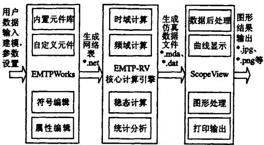
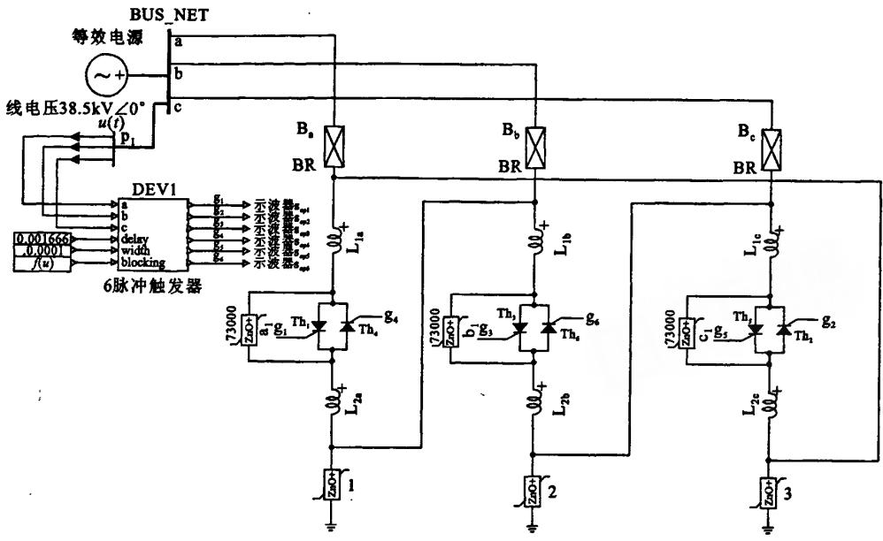
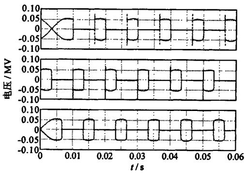
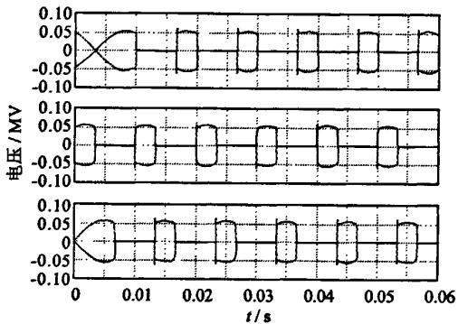
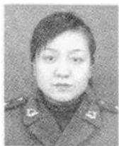

# 图形化电磁暂态仿真软件 EMTP-RV 及其应用

曹玉胜，陈允平

（武汉大学电气工程学院，武汉430072）

摘要：为在电力行业中推广基于Windows平台的新一代图形化电磁暂态仿真工具EMTP-RV(Restructured Version)，以便能高效研究电力系统及装置的动态行为，详细说明了该软件包的3个组成部分：EMTP-RV核心计算引擎、EMTPWorks图形化编辑界面和ScopeView可视化数据处理程序；描述了其主要元器件模型的基本功能；通过对1台 $35\mathrm{kV},100\mathrm{MVA}$ 静止无功补偿器(SVC)三相阀组动态开关过程的建模和仿真，演示了EMTP-RV的友好界面和强大功能。结果表明，EMTP-RV有效简化了电力系统中暂态过程的研究工作，为复杂电力系统的仿真提供了有力支持。

关键词：电磁暂态；软件仿真；开关暂态；EMTP；SVC；ScopoView

中图分类号：TM743；TM86

文献标志码：A

文章编号：1003-6520(2007)07-0154-05

# Application of EMTP-RV Graphic Software of Electromagnetic Transient Simulation

CAO Yu-sheng, CHEN Yun-ping

(School of Electrical Engineering, Wuhan University, Wuhan 430072, China)

Abstract: In order to introduce how to use EMTP-RV (Restructured Version), a new generation Windows-platform-based graphic software of electromagnetic transient simulation which is developed by EMTP-DCG (Development Coordination Group), and to efficiently research and simulate the dynamic processes of power system and its apparatuses, this paper elaborates the basic features of three components of the software package: EMTP-RV core computation engine, graphical user interface EMTPWorks and signal post-processing program ScopeView. Meanwhile, the libraries which include most important device models are depicted. A $35\mathrm{kV}$ , 100 MVA Static Var Compensator simulation model was constructed to simulate the switching processes of its three-phase thyristors. The intuitive and user-friendly Graphical User Interface and powerful computation engine of EMTP-RV is vividly demonstrated by the modeling and simulation processes of SVC. The results of simulation proved that EMTP-RV can be effectively used to simplify the research task of electromagnetic transient simulations in power system, and provide powerful aid to power engineers on the simulation of complicated power system. Its wide application will benefit the development of whole power industry.

Key words: electromagnetic transients; software simulation; switch transients; EMTP; SVC; ScopeView

# 0 引言

现代电力系统是集发电、输电、配电和用电为一体的复杂非线性网络系统。对其物理本质的研究涉及到 $1\mu \mathrm{s} \sim 1\mathrm{h}$ 的动态过程。为保证实际运行的电力系统安全稳定性，不便采用在线物理试验的方法对电力系统的动态行为进行研究。目前主要利用电力系统仿真软件离线计算法对电力系统及装置的动态行为进行仿真研究。

根据需要研究的动态过程作用时间长短，电力系统暂态过程主要分为机电暂态过程和电磁暂态过程两大类。一般把 $>1\mathrm{ms}$ 的动态过程归类为机电暂态过程，它包含电力系统的次同步振荡、电力系统暂

态稳定、发电机组控制过程、潮流和短路等物理过程，常用PSS/E[1]，Simpow，Eurostag，BPA，PowerWorldSimulator，POWERTECHDSA，PSASP等机电类仿真软件进行研究。而把 $<  1\mathrm{ms}$ 的动态过程归类为电磁暂态过程，它包含电力线行波现象、开关暂态、谐波、雷击过电压、电抗器和变压器饱和、电力电子开关状态转换、气体放电等物理过程，常用EMTP/ATP[2-5]、PSCAD/EMTDC等电磁类仿真软件进行研究。部分软件象NETOMAC[6]、DlgSILENT、SimPowerSystems同时具有电磁和机电类动态过程的仿真能力[7,8]。

本文介绍的EMTP-RV（Restructured Version)[9]是基于Windows平台的新一代图形化电磁类仿真软件，它是对经典电磁暂态工具EMTP的重新构造。在介绍其基本功能和组成的基础上，通过对1台 $35\mathrm{kV}$ ，100MVA静止无功补偿器(SVC)三相阀组动态开关过程的建模和仿真，演示EMTP-

RV的友好界面和强大功能。

# 1 EMTP-RV 组成结构

从1960年加拿大H.W.Dommel教授进行电磁暂态分析程序的研究工作开始[2]，到现在EMTP已经经历了近半个世纪的发展。目前最新版本EMTP-RV是由EMTP开发协作组(EMTP-DCG：EMTP Development Coordination Group)负责开发与维护的，是对早期DOS版本EMTP的Windows图形化重构。重构的EMTP-RV使用面向对象的编程模式，根据所处理对象的不同分为EMTP-RV核心数据处理引擎、EMTPWorks图形化编辑界面和ScopView可视化数据处理程序3个不同部分。

图1按照数据处理流程展示了EMTP-RV的3个组成部分间的相互关系。EMTPWorks提供给用户一个图形化的建模环境，它将使用者用图形模块搭建的系统模型转换为EMTP-RV计算引擎可识别的网络表*.NET文件。EMTP-RV计算引擎则根据读入的网络表*.NET文件，分析网络拓扑结构，解析元器件模型，构成系统计算矩阵并按给定的条件进行仿真，最后将仿真结果写入二进制的数据文件*.mda和相关ASCII文本绘图文件*.m。可视化数据处理程序 ScopeView对EMTP-RV计算引擎输出的数据做进一步加工处理，最终以多组彩色曲线图的形式显示仿真结果。这3个组成部分为用户提供了一个完善的集成开发环境，同时，各部分又有其相对独立的不同特征。

EMTPWorks 为创建复杂电网络模型提供了一个直观且功能强大的图形化编辑界面。它支持以拖放 (Drag and Drop) 方式添加电气元件; 元件连接可选单相或三相信号连线的方式; 元件和信号均被视为具有属性的对象, 可随时对其特征属性进行编辑; 内置的符号编辑器可用于编辑元件的图形标识。EMTPWorks 提供无限层次子网络的封装功能: 用户可将一部分子电路封装起来, 用特定的符号表示, 并以子模块嵌套的方式构建大规模的电网络模型。对于常用的电气设备模型, EMTPWorks 提供了丰富的元件库可供选择, 并能按照用户需要对库中的元件进行修改; EMTPWorks 提供自定义元件编辑功能, 可以方便地对现有元件库进行扩展。

EMTP-RV 核心计算引擎使用最新 Fortran-95 标准编写, 具有非常快的运算速度和较高的存储器利用率。新的网络方程稀疏矩阵表述形式使它可以处理巨型网络, 消除了对网络拓扑结构的限制, 并提供对插件模型的接口功能; 非线性模型求解方法的改进极大提高了计算收敛速度, 同时消除对网络拓

  
图1 EMTP-RV组织结构图  
Fig.1 Framework of EMTP-RV

扑的限制。对同一网络模型，它提供频域、时域、稳态和统计分析4种可选计算模式；还能够自动初始化稳态求解过程，并可提供稳态模型的谐波求解。其开放的体系结构允许用户使用自定义的复杂模型，并对现有的专用工具箱进行扩展。

ScopeView 可视化数据处理程序能够对 Matlab、Comtrade 和 EMTP-RV 格式的数据文件进行处理。它提供了基本的图形缩放、叠印、多列和多页图形显示功能；能够动态跟踪显示光标所在处数据值，显示节选图形区域内的最大值、最小值、均值和有效值。内建的函数编辑器可以对数据进行后处理，实现从简单的加减乘除类算术运算到复杂的离散傅立叶变换、谐波分析等函数功能。支持线性和指数形式的坐标轴表示，并能方便地使用属性页编辑显示曲线的标题、坐标轴标签、显示线型和图例等属性。能够将当前显示模式和数据处理过程保存为模版，方便今后载入对多组数据进行处理。支持 Windows 剪贴板功能，能够将图形拷贝到其他程序进行处理；并可使用 Matlab binary、Comtrade、pdf、jpg、png、eps 等多种图形格式导出显示数据，供其他程序进一步进行处理。

# 2 EMTP-RV主要元件库和功能

EMTP-RV 可以用来对雷电冲击波、开关浪涌、暂态过电压、绝缘配合、电力电子和 FACTS 装置[10]、通用控制系统[11]、电能质量、电容器组切换、串并联谐振、铁磁谐振、电机启动、不平衡系统稳态分析、分布式网络和发电[12]、次同步谐振、电力系统保护[13]等多方面的问题进行仿真研究。它多方面的应用离不开丰富的元件库支持。EMTP-RV 的元件分为内置元件、内置封装组件和用户自定义元件 3 大类型。内置元件是由 EMTP-RV 支持的基本功能模块, 具有独立的数学模型并可直接被 EMTP 识别。内置封装组件是由 EMTP-RV 内置元件相互连接组成的子功能模块封装后形成的, 提供了常用设备的模型表示。用户自定义元件是用户根据自己

的需要用内置元件自行搭建的模型，或是直接通过动态连接库 DLL 提供的用户功能模块。各种元件根据功能不同按元件库分类存储。EMTP-RV 目前提供了 22 个元件库供用户使用，以 *.clf 文件的形式保存在 Libs 文件夹内。主要元件库如下：

① advanced. clf: 提供包括 STATCOM、SVC、可变负荷模型等一系列电力电子设备模型。  
$②$ RLC branches.cf:提供电阻R、电容C、电感L和它们相互组合而成一系列RLC电力设备。  
$③$ control.cf:包含比较器、增益、延迟、积分、微分、采样、保持、加法器等基本控制元件的元件库。  
$④$ control functions.clf:支持常用控制算法，包含PI、PID、PWM、PLL等控制算法实现。  
⑤ control of machies. clf: 这是包含多种励磁调节器和调速器在内的设备库。  
⑥ flip flops. clf: 各种 D、J-K、S-R 和 T 触发器模型库。  
⑦ hvdc.clf: 收集了常用的 6 脉冲和 12 脉冲触发高压直流应用的控制信号发生装置。  
$⑧$ lines.clf:各种传输线和电缆模型的集合。  
⑨machines.clf: 包含同步机、异步机、直流电机、永磁电机、双相感应电机在内的电机模型库。   
⑩ meters. clf: 集合了各种电压、电流和控制信号输出测量元件。  
① meters periodic. clf: 用于测量电压、电流有效值和有功、无功输出等周期量的元件集合。   
② nonlinear.clf: 提供了 SiC 和 ZnO 避雷器、时变电阻、非线性电阻和电感等非线性元件。  
③ phasors. clf: 提供极坐标系的加减乘除、旋转、坐标变换等矢量运算功能。  
④ sources. clf: 各种交直流标准电流源、电压源和脉冲电流源、电压源模型库。  
⑤ switches. clf: 包含断路器、放电间隙、二极管、晶闸管等类型的开关元件库。  
⑥ transformations. clf: Park 变换、谐波分析等常用数学变换库。  
⑦transformers.clf:包含多种类型和不同连接方式的电力变压器模型。

这些内置元件基本涵盖了电力系统常用的设备模型，为用户搭建复杂系统模型进行仿真提供了丰富的选择和有力的支持；对于元件库内的每一种设备模型，EMTP-RV 提供了详尽的联机文档说明，指导用户正确使用和设置模型参数。

# 3 SVC三相阀组动态开关过程的建模和仿真

在 $35\mathrm{kV},100\mathrm{MVA}$ 静止无功补偿器(SVC)的

研制过程中，需对晶闸管控制的电抗器（TCR）回路作详细的电磁暂态仿真计算[14-16]，以确定晶闸管阀组在动态切换过程中所承受的过电压，并选择合适的ZnO避雷器加以保护。作为保护整定计算，选取系统最大运行电压38.5kV作为电压源电势。在确定TCR回路的拓扑结构以后，使用EMTPWorks绘出带避雷器保护TCR回路的系统结构，见图2。EMTPWorks下的建模过程即为绘制系统结构图的过程：在创建新的设计文件后，从相应的元件库中取出合适的元件，相互连接并设置合理的参数，即完成建模的工作。

图2中TCR回路采用三角形连接，每支臂的电感等分为 $\mathbf{L}_1(\mathbf{L}_{1a},\mathbf{L}_{1b},\mathbf{L}_{1c})$ 和 $\mathbf{L}_2(\mathbf{L}_{2a},\mathbf{L}_{2b},\mathbf{L}_{2c})$ 两部分串连于晶闸管阀组的两侧；晶闸管阀组由理想晶闸管 $\mathrm{T_{h1}}\sim \mathrm{T_{h6}}$ 两两组合反并联而成。使用ZnO避雷器 $\mathbf{a}_1,\mathbf{b}_1,\mathbf{c}_1$ 保护阀组不受过电压损害，使用ZnO避雷器1、2、3限制进入TCR回路的浪涌电压。电压源SOURCE_NETWORK用于模拟TCR回路所在的电网络。断路器 $\mathrm{BR(B_a,B_b,B_c)}$ 用于切合电压源和TCR回路。6脉冲触发器DEV1提供了触发6个晶闸管所需的脉冲信号（其width输入控制触发脉冲的宽度，delay输入控制晶闸管的触发角，blocking输入用于屏蔽触发脉冲输出），其a、b、c端子为触发同步参考信号输入端。电压测量元件 $\mathfrak{p}_1$ 为6脉冲触发器DEV1提供所需的同步参考信号；使用控制信号测量元件 $\mathbf{s}_{\mathrm{ep1}}\sim \mathbf{s}_{\mathrm{ep6}}$ 观测DEV1的触发脉冲输出；使用常数单元为DEV1提供width和delay信号输入；使用函数单元为DEV1提供blocking信号输入，其函数表达式为 $t\geqslant t_0$ ，即当仿真时间 $t$ 大于常数 $t_0$ 时刻时阻断DEV1触发脉冲输出。

选取仿真步长为 $1\mu \mathrm{s}$ ，仿真时间为60ms，通过设置不同的delay值，可得到不同触发角度下晶闸管两端的电压波形。使用EMTP-RV提供的Exclude/Include功能选项，可方便投入或切除避雷器元件。图3和图4分别给出了无避雷器和避雷器保护两种情况下晶闸管两端的电压波形。

仿真时取DEV1触发延迟时间为 $1.667\mathrm{ms}$ ，对应晶闸管触发角为 $120^{\circ}$ 。图3和图4中正向晶闸管 $\mathbf{T}_{\mathrm{h}1}, \mathbf{T}_{\mathrm{h}2}, \mathbf{T}_{\mathrm{h}3}$ 两端的电压用实线表示，反相晶闸管 $\mathbf{T}_{\mathrm{b}4}, \mathbf{T}_{\mathrm{b}5}, \mathbf{T}_{\mathrm{b}6}$ 两端的电压用虚线表示。TCR回路阀组两端的电压峰值出现在晶闸管由导通向关断状态转换的时刻。对比图3和图4，加装避雷器后，晶闸管两端峰值电压从图3中所示的 $110.03\mathrm{kV}$ 降到图4中所示的 $62.29\mathrm{kV}$ ，可见避雷器为晶闸管提供了有效的保护。

以上的示例仅演示了EMTP-RV这一强大图

  
图2 带避雷器保护TCR回路的系统结构图

  
Fig.2 Schematic of arrester protected TCR circuit   
图3 无避雷器保护时阀组电压波形

Fig.3 Voltage waveform over thyristors without arrester 形化电磁暂态仿真工具很小的一部分功能，更多的功能可参考其随机安装的26个示例程序。常用的电力系统暂态仿真计算问题如多相PI等值线路、铁磁谐振、异步电机启动、STATCOM、SVC、风电、二次重击穿、雷击过电压、电缆传输模型，EMTP-RV都提供了演示程序，可供使用者作为出发点，迅速切入自己的工作。

# 4结论

EMTP-RV 作为新一代 Windows 平台下的电磁暂态仿真工具, 有效简化了电力工作者对系统中暂态过程研究的建模工作, 扩展了对系统中暂态现象研究的广度和深度, 为复杂电力系统的仿真提供了有力的支持。

# 参考文献

[1]江全元，彭旭东，张宝星.PSS/E——一种先进的电力系统分析

  
图4避雷器保护下阀组电压波形  
Fig. 4 Voltage waveform over thyristors with arrester仿真软件[J]. 高电压技术, 2005, 31(1): 60-63.

JIANG Quan-yuan, PENG Xu-dong, ZHANG Bao-xing. PSS/E-an advanced software package for power system analysis and simulation[J]. High Voltage Engineering, 2005, 31(1): 60-63.   
[2] Hermann W Dommel. EMTP theory book [M]. Portland, Oregon, USA: Bonneville Power Administration, 1986.   
[3]项玲，胡敏强，郑建勇.运用EMTP预测变电所接地网雷电暂态效应[J].高电压技术，2005,31(6):69-73.  
XIANG Ling, HU Min-qiang, ZHENG Jian-yong. EMTP in lightning transient simulation of substations grounding grid[J]. High Voltage Engineering, 2005, 31(6): 69-73.   
[4] 曹祥麟. EMTP 在特高压交流输电研究中的应用[J]. 高电压技术, 2006, 32(7): 64-68.  
CAO Xiang-lin. Application of EMTP in the research of UHV AC power transmission[J]. High Voltage Engineering, 2006, 32(7): 64-68.   
[5] 韩丽娜, 杨志坚, 李虎. 电磁暂态程序 EMTP 在电力系统的应用[J]. 广东输电与变电技术, 2006, 7(2):19-22.  
HAN Li-na, YANG Zhi-jian, LI hu. Application of electromagnetic transient program in the power system[J]. Guangdong

Power Transmission Technology, 2006,7(2):19-22.   
[6] 韩祯祥, 张琦, 徐政. 一个大型集成化的电力系统仿真计算软件——NETOMAC[J]. 电力系统自动化, 1997, 21(9):47-50. HAN Zhen-xiang, ZHANG Qi, XU Zheng. An integrated software package for power system simulation and computation—NETOMAC[J]. Automation of Electric Power Systems, 1997, 21(9):47-50.  
[7] 李广凯, 李庚银. 电力系统仿真软件综述[J]. 电气电子教学学报, 2005, 27(3):61-65  
LI Guang-kai, LI Geng-yin. The summary of power system simulation software[J]. Journal of Electrical & Electronic Engineering Education, 2005, 27(3):61-65.  
[8] 钱鑫, 李 疨, 施 围. 电力系统仿真计算软件介绍[J]. 继电器, 2001, 30(1):43-47. QIAN Xin, LI Hu, SHI Wei. Simulation software in power system[J]. Relay, 2001, 30(1):43-47.  
[9] EMTP-DCG. EMTP-RV: powerful, user-friendly transients analysis software[OL][2006-07-01]. http://www.emtp.com/services/pdf/bro_emtp_final.pdf.   
[10] Yongan Deng, Sood V K, Lopes L. STATCOM model in EMTP RV using hysteresis current controlled voltage source converter (VSC)[C]. Electrical and Computer Engineering, Saskatoon Inn Saskatoon, Saskatchewan, Canadian: IEEE, 2005.   
[11] Fengquan Zhou, GBza Joos, Chad Abbey, et al. Optimal State Control for CSI Superconducting Magnetic Energy Storage System[C]. Power System Technology, PowerCon 2004. Singapore: IEEE, 2004.   
[12] Chad Abbey, Giza Jobs. A doubly-fed induction machine and energy storage system for wind power generation[C]. Electrical and Computer Engineering. Oakes Foyer, Ontario, Canada

an: IEEE, 2004.   
[13] Sood V K, Amin R, Salam M. EMTP RV-based study of solid-state fault current limiter for distribution systems[C]. Power India Conference, Grand, New Delhi, India: IEEE, 2006.   
[14]雷赛衡，鲁铁成，张博，等.配电网无功补偿电容器组串联电抗器的选择[J].高电压技术，2004,30(10)：29-31.LEISai-heng，LU Tie-cheng，ZHANGBo，et al.Selection of series reactors in reactive compensation capacitors device in power distribution networks[J].High Voltage Engineering, 2004，30(10)：29-31.   
[15] 林海雪. 静止无功补偿装置在输电系统中的应用[J]. 电力设备, 2005, 6(10): 17-20. LIN Hai-xue. SVC applications in power transmission systems [J]. Electrical Equipment, 2005, 6(10): 17-20.  
[16] 苏建设, 陈 陈. 配网中消弧线圈的可控硅调节电抗器参数设计[J]. 电力自动化设备, 2002, 22(12):35-39. SU Jian-she, CHEN Chen. Parameter design of petersen-coil's TCR in distribution systems[J]. Electric Power Automation Equipment, 2002, 22(12):35-39.

  
曹玉胜

Ph.D. CAO Yu-sheng

曹玉胜 1976-，男，博士生，主要从事电力系统自动控制、灵活交流输电系统、有源滤波、电力电子应用等方面的研究。E-mail:c03261998@163.com

陈允平 1945一，男，教授，博导，主要从事电力系统继电保护、高电压技术、电力系统运行及自动化方面的研究。

收稿日期 2006-07-22

编辑陈蔓

# （上接第114页）

[10] 原青云, 武占成, 杨洁, 等. 静电放电和方波 EMP 对微电子器件的效应[J]. 高电压技术, 2006, 32(6): 47-50. YUAN Qing-yun, WU Zhan-cheng, YANG Jie, et al. Research on effects of ESD and square-wave EMP on microelectronic device [J]. High Voltage Engineering, 2006, 32(6): 47-50.  
[11] 杨洁. 微电子器件电磁脉冲作用效应及失效模式分析[D]. 石家庄：军械工程学院，2005. YANG Jie. Function effect and invalid mode analysis of electromagnetic pulse to microelectronic devices[D]. Shijiazhuang: Shijiazhuang Mechanical Engineering College, 2005.  
[12] Jie Yang, Shanghe Liu, Shiliang Yang, et al. The EMP research on sensitive ports of silicon transistors [C]. 6th International Symposium on Test and Measurement. Dalian, China, 2005(3): 2060-2062.   
[13] 杨洁, 刘尚合, 原青云, 等. 微电子器件方波 EMP 注入敏感端对的试验研究[J]. 军械工程学院学报, 2004, 16(6): 1-3. YANG Jie, LIU Shang-he, YUAN Qing-yun, et al. Experimental research on square - wave EMP sensitive ports of microelectronic device[J]. Journal of Ordnance Engineering College, 2004, 16(6): 1-3.  
[14] 杨洁，祁树锋，刘红兵，等. 硅三极管对静电放电最敏感端对的试验研究[C]. 中国物理学会第13届静电科学年会. 石家庄，2006：290-292. YANG Jie, QI Shu-feng, LIU Hong-bing, et al. Test research on the most sensitive ports of silicon dynatron to ESD[C], Chinese Physics Acad 13th Electrostatics Science Symposium. Shi-jiazhuang, 2006: 290-292.

[15]涂延林，马峰，黄能斌.电子工业静电防护技术[M].西安，陕西科学技术出版社，1994.  
[16] 高光渤, 李学信. 半导体器件可靠性物理[M]. 北京: 科学出版社. 1987.  
[17] 孙延林. 电子工业静电控制技术[M]. 北京：电子工业出版社，1995.  
[18] Sten Hellström. ESD-The scourge of Electronics [M]. Berlin, Springer-Verlag Berlin Heidelberg, 1998.   
[19] 庄奔琪. 微电子器件应用可靠性技术[M]. 北京：电子工业出版社，1996.  
[20] 王长河. ESD 和 EMP 对微波晶体管损伤机理研究 [R]. 石家庄: 中国电子科技集团公司第十三研究所. 2005.  
[21] Robert F. Pierret. 半导体器件基础[M]. 北京：电子工业出版社，2004.  
Robert F. Pierret. Semiconductor device fundamentals [M]. Beijing: Electronic Industries Publishing Company, 2004.

  
杨洁

Ph.D. YANG Jie

杨洁 1980一，女，博士生，研究方向为武器系统与运用工程，目前从事微电子器件的电磁脉冲各种效应的研究。电话：87994354；E-mail: yangjij@sina.com

收稿日期 2006-08-11

编辑 曹昭君