# Modal decoupling of overhead transmission lines using real and constant matrices: Influence of the line length

Pablo Torrez Caballero a , Eduardo C. Marques Costa b,⇑ , Sérgio Kurokawa

a Unesp – Univ. Estadual Paulista, Faculdade de Engenharia de IlhaSolteira – FEIS, Departamento de EngenhariaElétrica, IlhaSolteira, SP, Brazil b Universidade de São Paulo – USP, Escola Politécnica, Departamento de Engenharia de Energia e Automação Elétricas – PEA, São Paulo, SP, Brazil

# a r t i c l e i n f o

Article history:

Received 2 April 2017

Received in revised form 3 May 2017

Accepted 10 May 2017

Keywords:

Transmission line modeling

Electromagnetic transients

Modal analysis

Transmission line theory

# a b s t r a c t

The Clarke’s matrix is a well-known real and constant transformation matrix used for modal transformation in three-phase transmission lines modeling. Although modal analysis has been widely discussed in the technical literature on power system modeling, a new content is approached in this research proving that the approximation using an exact and constant modal transformation matrix depends on both the frequency-dependent parameters and transmission line’s length. As an important conclusion, the approach using the Clarke’s matrix leads to more accurate results considering long transmission lines. There are two methods for modal decoupling in power systems modeling. The first uses only a single constant and real transformation matrix during the entire modeling/simulation routine. The second uses the frequency-dependent transformation matrix for parameters decoupling into the propagation modes and the Clarke’s matrix for mode-to-phase transformation of voltage and current values during simulations. The accuracy of these two modeling/simulation processes are evaluated, in the time and frequency domains, based on results obtained from a reference routine that employs the exact frequencydependent matrix in modal transformations and numerical transforms for simulation in the time domain. The proposed analysis proves that the accuracy of both methods varies with the line length during electromagnetic transient simulations that leads to peak errors up to approximately 10%. The influence of the line length in modal analysis techniques was not approached in previous references on power system modeling, which represents the original contribution of this paper.

 2017 Elsevier Ltd. All rights reserved.

# 1. Introduction

Modal analysis techniques are widely applied in power systems modeling [1–4]. In this context, a coupled multiphase system can be decoupled into propagation modes that can be modeled separately as individual single-phase systems. Modal transformations are successively applied during the modeling and simulation routines to convert line parameters, voltages and currents from the phase domain to modal domain and vice versa [5]. These transformations are carried out by using modal transformation matrices, which are usually frequency-dependent due to frequency effect on the line parameters. However, depending on the line geometry and system characteristics, several approximations can be achieved in order to produce constant modal transformation matrices, e.g.: symmetrical components, Karrenbauer, Clarke and others. The modal decoupling theory represents an essential tool

in power systems modeling for analysis of insulation coordination, electromagnetic compatibility, protection and general design of transmission lines.

Transmission line models for simulation of electromagnetic transients are usually presented in the technical literature into two categories: distributed- or lumped-parameters models. The first is developed directly from the frequency-dependent distributed parameters of the line and using modal decoupling, where each propagation mode is represented as an independent two-port circuit and simulation results are obtained in the time domain from numerical transforms [6]. The second category is also based on modal decoupling, where each propagation mode is represented as a single-phase line by electric circuit approach and the frequency effect on the line parameters is included directly in the time domain by means of fitting techniques [3,4,7].

The two modeling techniques present advantages and restrictions that were well established in the literature on transmission line modeling [1,5]. However, some important issues should be emphasized for an appropriate understanding of the proposed analysis. Although the distributed-parameters models show a great

accuracy for a wide range of frequencies, i.e., for any of electromagnetic transient in power systems, since a switching up to a very fast steep-front impulse (atmospheric impulse), these frequencydomain models have several limitations for inclusion of nonlinear and time-varying events during simulations [8,9]. On the other hand, lumped-parameters models are versatile in the inclusion of time-varying elements during time-domain simulations (e.g. corona effect, non-linear loads and fault occurrences) [3,4]. However, the multiconductor line modeling by lumped elements presents some numerical errors due to the numerical solution of the differential equations and requires a real and constant modal transformation matrix for voltage and current transformation from the modal domain to the phase domain. The use of a real and constant matrix instead the frequency-dependent modal matrix, which is calculated directly from the admittance and impedance matrices, represents a valid approximation only for transmission lines with vertical symmetry plane. Thus, some errors are expected from such approximation, which were also evaluated in the technical literature [2]. Alternative techniques were also proposed for reduction of these errors, based on the alternation in the use of the exact and Clarke’s matrices during the modeling and simulation process [5].

In this context, an additional and original analysis is proposed for evaluation of possible errors in the transmission line modeling, using modal techniques, as a function of the line length. Eventual errors in the frequency domain are further analyzed in the time domain by means of electromagnetic transient simulations, i.e., in terms of wave shape, voltage and current peaks which power systems are subject during the occurrence of a steep-front impulse.

# 2. Three-phase line models using modal analysis

The modal decoupling consists into decouple a three-phase transmission line into three independent propagation modes, which can be represented as three single-phase lines. In this context, the differential equations of a multiconductor line are introduced as follows [2]:

$$
\frac {d \left[ V _ {p h} \right]}{d x} = - [ Z ] \left[ I _ {p h} \right] \tag {1}
$$

$$
\frac {d \left[ I _ {p h} \right]}{d x} = - [ Y ] \left[ V _ {p h} \right] \tag {2}
$$

Terms [Z] and [Y] are the impedance and admittance matrices of the line, respectively. The phase voltages and currents are in vectors $[ V _ { p h } ]$ and $[ I _ { p h } ]$ , respectively. The solution of Eqs. (1) and (2) is not a trivial procedure because the impedance and admittance matrices have mutual terms, i.e., phases of the multiconductor line are coupled by mutual terms.

By differentiating (1) and (2) and substituting the first derivatives back into the second derivatives, the following expressions are obtained:

$$
\frac {d ^ {2} \left[ V _ {p h} \right]}{d x ^ {2}} = [ Z ] [ Y ] \left[ V _ {p h} \right] = \left[ S _ {V} \right] \left[ V _ {p h} \right] \tag {3}
$$

$$
\frac {d ^ {2} \left[ I _ {p h} \right]}{d x ^ {2}} = [ Y ] [ Z ] \left[ I _ {p h} \right] = \left[ S _ {I} \right] \left[ I _ {p h} \right] \tag {4}
$$

Since [Z] and [Y] are symmetrical, the product [Z][Y] and [Y][Z], in Eqs. (3) and (4), respectively, are defined as $[ S _ { V } ]$ and $\left[ S _ { I } \right]$ that are also transposed each other:

$$
\left[ S _ {V} \right] = \left[ S _ {i} \right] ^ {\prime} \tag {5}
$$

However, $[ S _ { V } ]$ and $[ S _ { I } ]$ are not symmetrical.

Due to relationship $( 5 ) , [ S _ { V } ]$ and SI share the same polynomial characteristic and consequently have the same eigenvalues ½k-. Nonetheless, a matrix and its transpose do not have the same eigenvectors. Thus, the matrix with eigenvalues k is related to $[ S _ { V } ]$ and ½SI- through the eigenvectors $[ T _ { V } ]$ and $[ T _ { I } ] \mathrm { . }$ :

$$
[ \lambda ] = [ T _ {V} ] ^ {- 1} [ S _ {V} ] [ T _ {V} ] = [ T _ {V} ] ^ {- 1} [ Z ] [ Y ] [ T _ {V} ] \tag {6}
$$

$$
[ \lambda ] = [ T _ {I} ] ^ {- 1} [ S _ {I} ] [ T _ {I} ] = [ T _ {I} ] ^ {- 1} [ Y ] [ Z ] [ T _ {I} ] \tag {7}
$$

Isolating the products Z Y and Y Z from (6) and (7) and substituting them in (3) and (4), the following expressions are obtained:

$$
\frac {d ^ {2} \left[ T _ {V} \right] ^ {- 1} \left[ V _ {p h} \right]}{d x ^ {2}} = [ \lambda ] \left[ T _ {V} \right] ^ {- 1} \left[ V _ {p h} \right] \equiv \frac {d ^ {2} \left[ V _ {m} \right]}{d x ^ {2}} = [ \lambda ] \left[ V _ {m} \right] \tag {8}
$$

$$
\frac {d ^ {2} \left[ T _ {I} \right] ^ {- 1} \left[ I _ {p h} \right]}{d x ^ {2}} = [ \lambda ] \left[ T _ {I} \right] ^ {- 1} \left[ I _ {p h} \right] \equiv \frac {d ^ {2} \left[ I _ {m} \right]}{d x ^ {2}} = [ \lambda ] \left[ I _ {m} \right] \tag {9}
$$

From Eqs. (8) and (9), the voltages and currents in the modal domain are identified and can be expressed as:

$$
\left[ V _ {m} \right] = \left[ T _ {V} \right] ^ {- 1} \left[ V _ {p h} \right] \tag {10}
$$

$$
[ I _ {m} ] = [ T _ {l} ] ^ {- 1} [ I _ {p h} ] \tag {11}
$$

Defining Eqs. (10) and (11) from (1) and (2):

$$
\frac {d \left[ V _ {m} \right]}{d x} = - \left[ T _ {V} \right] ^ {- 1} [ Z ] \left[ T _ {I} \right] \left[ I _ {m} \right] \tag {12}
$$

$$
\frac {d \left[ I _ {m} \right]}{d x} = - \left[ T _ {I} \right] ^ {- 1} [ Y ] \left[ T _ {V} \right] \left[ V _ {m} \right] \tag {13}
$$

The modal impedance matrix $[ Z _ { m } ]$ and modal admittance matrix $\left[ Y _ { m } \right]$ are defined:

$$
[ Z _ {m} ] = [ T _ {V} ] ^ {- 1} [ Z ] [ T _ {I} ] \tag {14}
$$

$$
[ Y _ {m} ] = [ T _ {I} ] ^ {- 1} [ Y ] [ T _ {V} ] \tag {15}
$$

The transformation matrices $[ T _ { I } ]$ and $[ T _ { V } ]$ in Eqs. (10)–(15) vary with the frequency because Y and Z are also frequency dependent. The relationship of the transformation matrices is expressed [4]:

$$
\left[ T _ {V} \right] ^ {- 1} = \left[ T _ {I} \right] ^ {T} \tag {16}
$$

The modal matrices $[ Z _ { m } ]$ and $\left[ Y _ { m } \right]$ are diagonal and are calculated as a function of the frequency. Since the modal matrices are diagonal, each propagation mode is completely decoupled from each other and can be represented as a single-phase transmission line. This way, the phase-mode-phase conversion during modeling and simulation routines can be described in Fig. 1.

# 3. Single-phase line representation

As described in the previous section, the solution of multiconductor line Eqs. (1) and (2) is possible from the line decoupling into n independent propagation modes. This way, each mode can be modeled as a single-phase line using several techniques based on the representation by distributed parameters in the frequency domain or by lumped parameters in the time domain. As the goal of the proposed analysis is to evaluate the accuracy in the use of modal techniques as a function of the line length, the line representation by two-port circuit is the most accurate method for modeling the propagation modes without errors in the electrical parameters representation [2,5]. The frequency-domain equations

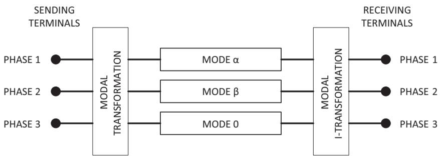  
Fig. 1. Modal and phase representations in transmission line modeling.

of the two-port circuit for a single-phase line with length l are expressed in (17).

$$
\left[ \begin{array}{l} V _ {s} \\ I _ {s} \end{array} \right] = \left[ \begin{array}{c c} \cosh (\Gamma l) & - Z _ {c} \operatorname {s e n h} (\Gamma l) \\ \frac {1}{Z _ {c}} \operatorname {s e n h} (\Gamma L) & - \cosh (\Gamma l) \end{array} \right] \left[ \begin{array}{l} V _ {r} \\ I _ {r} \end{array} \right] \tag {17}
$$

The propagation function C and the impedance characteristic $Z _ { c }$ are functions of Y and Z that are frequency dependent, as expressed in (18) and (19).

$$
\Gamma = \sqrt {Y Z} \tag {18}
$$

$$
Z _ {c} = \sqrt {\frac {\bar {Z}}{\bar {Y}}} \tag {19}
$$

Voltages and currents are calculated for each propagation mode in the frequency domain using Eq. (17) and then converted to the phase domain using Eqs. (10) and (11) [5]. Since voltages and currents are known in the frequency domain at both terminals of the line, the time domain results are obtained by means of numerical Laplace transform [6].

The entire modeling and simulation process is described in the flowchart in Fig. 2.

The computational routine in Fig. 2 shows the process of line decoupling using modal transformation to the final results in the time domain. Initially, the transformation matrix is calculated from the frequency-dependent values of admittance and impedance. The line decoupling is carried out using the frequency-dependent transformation matrices, without any approximation using a constant and real matrix [5]. The following step is to model the propagation modes using the two-port representation. Finally, the results are converted back to the phase domain using the exact or an approximated transformation matrix, which depends of the line model considered, a further the frequency-domain currents and voltages are converted to the time domain using numerical Laplace transform.

# 4. Modal transformation matrices

The exact transformation matrix is obtained from the frequency-dependent impedance and admittance matrices of the transmission line. Thus, the exact transformation matrix varies for each frequency value. There are various methods to calculate the eigenvalues and eigenvectors for calculation of the modal transformation matrix, as described in the Section 2, for example: Newton-Raphson method, Schur and Cholesky decompositions and others [1,2,10].

Line models that are developed directly in the time domain are usually based on the modal transformation using real and constant matrices. Since the line model is implemented directly in the time domain, numerical transforms are not required and the modal

decoupling is carried out by using a real and constant transformation matrix. A well-known real and constant matrix is the Clarke’s matrix.

$$
\left[ T _ {I} \right] = \left[ T _ {\text {C l a r k e}} \right] = \left[ \begin{array}{c c c} \frac {2}{\sqrt {6}} & 0 & \frac {1}{\sqrt {3}} \\ - \frac {1}{\sqrt {6}} & \frac {1}{\sqrt {2}} & \frac {1}{\sqrt {3}} \\ - \frac {1}{\sqrt {6}} & - \frac {1}{\sqrt {2}} & \frac {1}{\sqrt {3}} \end{array} \right] \tag {20}
$$

For an untransposed three-phase line with the ground wires already reduced, the line impedance and admittance matrices have the following structures:

$$
[ Z ] = \left[ \begin{array}{l l l} Z _ {1 1} & Z _ {1 2} & Z _ {1 3} \\ Z _ {1 2} & Z _ {2 2} & Z _ {2 3} \\ Z _ {1 3} & Z _ {2 3} & Z _ {3 3} \end{array} \right] \tag {21}
$$

$$
[ Y ] = \left[ \begin{array}{l l l} Y _ {1 1} & Y _ {1 2} & Y _ {1 3} \\ Y _ {1 2} & Y _ {2 2} & Y _ {2 3} \\ Y _ {1 3} & Y _ {2 3} & Y _ {3 3} \end{array} \right] \tag {22}
$$

By applying the Clarke’s transformation matrix (20) to decouple the impedance (21) using the Eq. (14), the modal impedance matrix $[ Z _ { m } ]$ is obtained:

$$
\left[ Z _ {m} \right] = \left[ \begin{array}{l l l} Z _ {\alpha} & Z _ {\alpha \beta} & Z _ {\alpha 0} \\ Z _ {\alpha \beta} & Z _ {\beta} & Z _ {\beta 0} \\ Z _ {\alpha 0} & Z _ {\beta 0} & Z _ {0} \end{array} \right] \tag {23}
$$

If the three-phase line is characterized by a vertical symmetry plane, the mutual impedance $Z _ { 1 2 }$ is equal to $Z _ { 1 3 }$ and $Z _ { 2 2 }$ is similar to $Z _ { 3 3 } .$ . Consequently, modal impedances $Z _ { \alpha \beta }$ and $Z _ { \beta 0 }$ are null:

$$
\left[ Z _ {m} \right] = \left[ \begin{array}{c c c} Z _ {\alpha} & 0 & Z _ {\alpha 0} \\ 0 & Z _ {\beta} & 0 \\ Z _ {\alpha 0} & 0 & Z _ {0} \end{array} \right] \tag {24}
$$

The b-component is an exact mode because there is no coupling with a and 0.

The self impedance terms are approximately the same for nontransposed overhead transmission lines whereas the mutual impedance terms present small variations in the entire frequency range considered during electromagnetic transient simulations in power systems. In this context, $ { \mathrm { i f } } Z _ { 1 1 }$ is similar to $Z _ { 2 2 }$ and $Z _ { 1 2 }$ is similar to $Z _ { 2 3 } ,$ the modal term $Z _ { \infty }$ can be neglected and the quasi-modes a and 0 can be also considered as exact propagation modes [10].

The statements on the similarity of self parameters of nontransposed transmission lines are demonstrated from a typical 440-kV line (Fig. 3). The self and mutual parameters of the line are calculated with a constant soil resistivity of 1000 O m. The frequency effect and displacement current are usually neglected in the electromagnetic transients analysis on power systems that uses the Carson’s series for calculation of the earth-return impe-

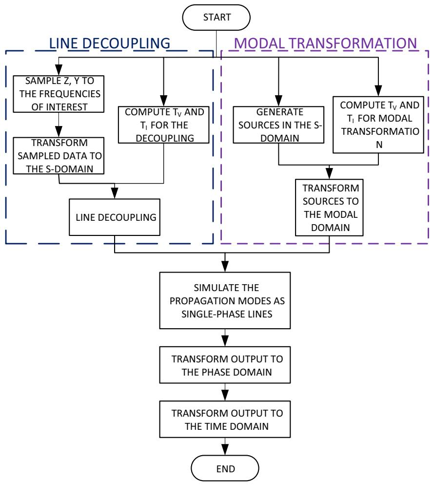  
Fig. 2. Computational algorithm for line modeling using modal analysis.

dance, as well established in the technical literature on transmission line modeling [4,9–11].

The ground wires are implicitly considered in [Z] and [Y] by means of a ground wire reduction process [11].

Fig. 4 compares the self resistance as a function of the frequency obtained from the parameters of the transmission line in Fig. 3.

Some variations are observed in the self resistance profile only from frequencies above 10 kHz, as described in Fig. 4b.

Fig. 5 shows the self inductance profile of the three phases of the transmission line illustrated in Fig. 3.

Such as in the self resistance, Fig. 5 shows that the self inductance profile of phases 2 and 3, which have the same distance from the soil, is similar through the entire frequency range analyzed. On the other hand, phase 1 shows discrete variations, compared to self inductances of the phases 2 and 3, at frequencies higher than 10 kHz, as shown in details in Fig. 5b.

Even with some differences at frequencies higher than 10 kHz, the frequency-dependent self impedances of the three-phases are almost similar. Ideally, if the line decoupling process was exact, the coupling impedance $Z _ { \infty }$ should be null.

The frequency-dependent mutual impedances are described in terms of resistance and inductance in Figs. 6 and 7. The frequency-dependent mutual resistance is resulted from the earth-return current through the soil and depends of the soil conductivity. The mutual resistance profiles of the three phases of the non-transposed line are described in Fig. 6. The mutual resistance 2-3 presents some differences if compared to 1-3 and 1-2 that can be neglected for the entire frequency range. Thus, the mutual resis-

tance profiles 2-3, 1-2 and 1-3 are practically the same, as described in Fig. 6.

Fig. 7 shows that there is a practically constant difference in the mutual inductance between phases 2-3 and phases 1-2. As a consequence, the impedance coupling $Z _ { \infty 0 }$ is not null. This difference in the mutual terms is amplified with the increment of frequency that leads to more evident errors at high frequencies [2,5,10].

However, the influence of high frequencies in the transfer function of the line is reduced because the line itself works as a lowpass filter [12]. In this context, the approach by using the Clarke’s matrix should have a better performance for long transmission lines.

# 5. Modal decoupling routines

The line modeling and transient simulations directly in the time domain require some attention in order to avoid errors in the modal decoupling. The technical literature on transmission line modeling presents a few references that suggest some procedures to improve the accuracy in line models in the time domain based on modal techniques. An efficient technique proposes to alternate the use of the exact frequency-dependent transformation matrix, obtained from the Newton-Raphson method, and the Clarke’s matrix, i.e., the frequency-dependent transformation matrix is used only during the modal decoupling into the propagation modes whereas the mode-to-phase transformation of the voltage and current values is carried out using the approach by the Clarke’s matrix [5]. This methodology is illustrated in Fig. 2, where line modeling/

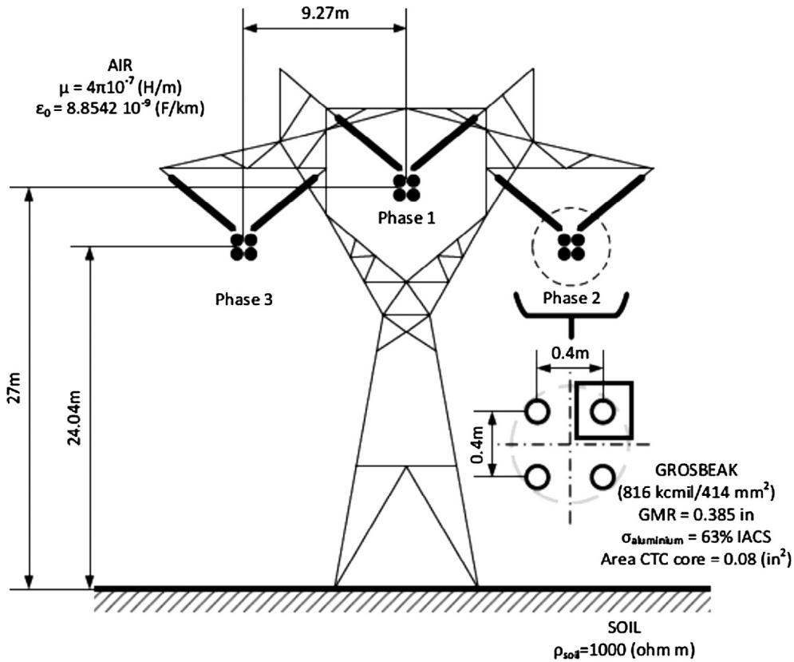  
Fig. 3. Three-phase transmission line with vertical symmetry.

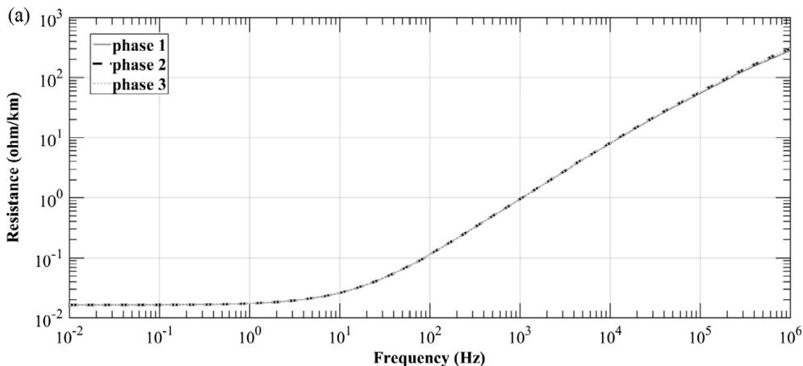

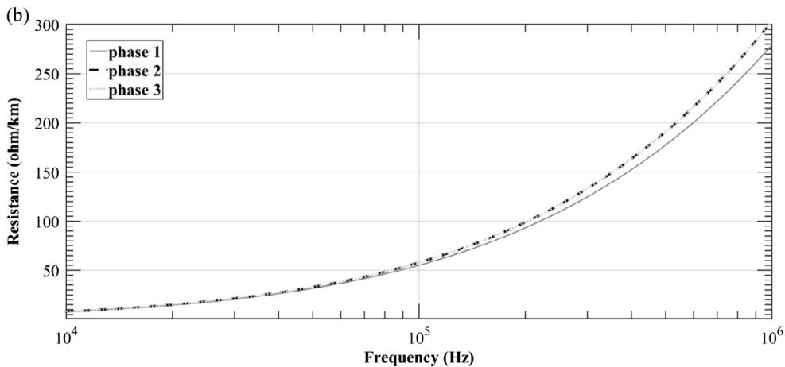  
Fig. 4. Self resistance of the non-transposed transmission line with vertical symmetry.

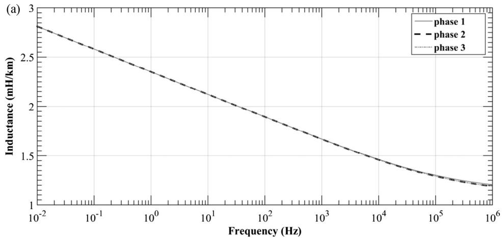

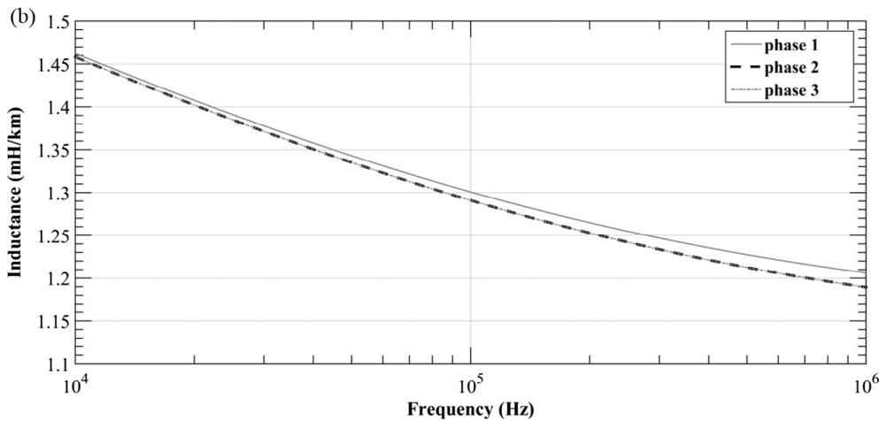  
Fig. 5. Self inductance of the non-transposed transmission line with vertical symmetry.

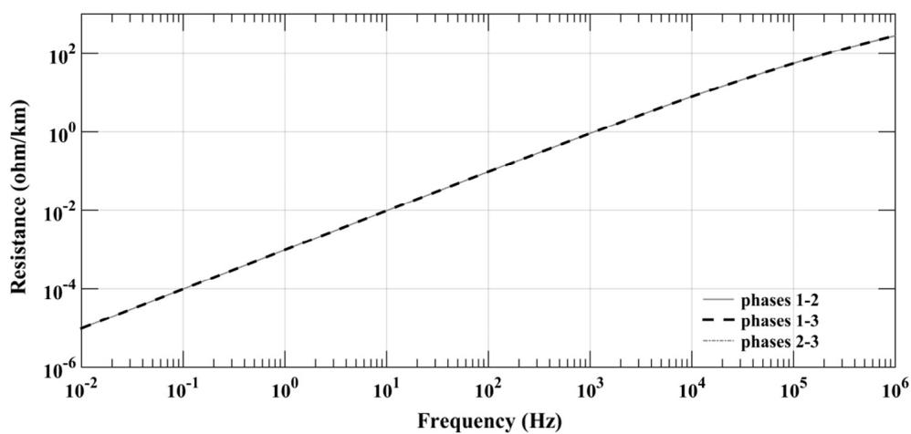  
Fig. 6. Mutual resistance of the non-transposed transmission line with vertical symmetry.

simulation is demonstrated into a flowchart that describes two threads: line decoupling and (voltages and currents) modal transformation. In this context, different transformation matrices can be used for each thread, as shown in Table 1.

The exact routine, denominated in Table 1, is usually approached in the reference literature for line models in the frequency domain by using numerical transforms [8]. The

conventional routine describes the modeling/simulation procedure applied in line models using fitting techniques for inclusion of the frequency effect on the line parameters directly in the time domain [3,4]. Finally, the denominated mixed routine represents the corrected method applied to mitigate the modal decoupling errors because of the use of a constant and real transformation matrix during the entire modeling and simulation process, as previous

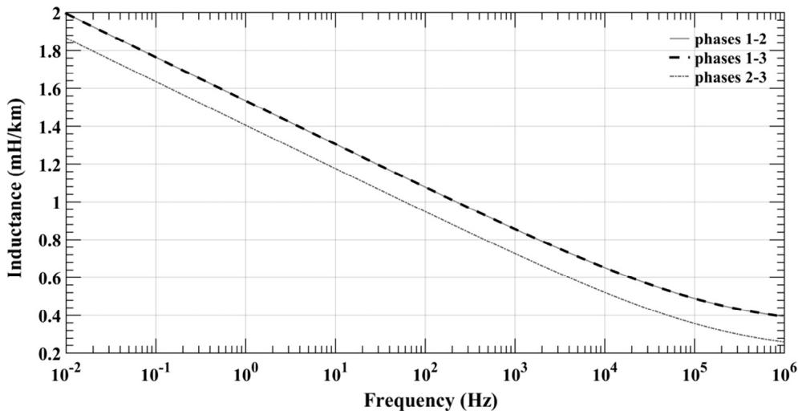  
Fig. 7. Mutual inductance of the non-transposed transmission line with vertical symmetry.

Table 1 Modal techniques.   

<table><tr><td>Routine</td><td>Line decoupling</td><td>Modal transformation</td></tr><tr><td>Exact</td><td>Frequency-dependent matrix</td><td>Frequency-dependent matrix</td></tr><tr><td>Conventional</td><td>Clarke&#x27;s matrix</td><td>Clarke&#x27;s matrix</td></tr><tr><td>Mixed</td><td>Frequency-dependent matrix</td><td>Clarke&#x27;s matrix</td></tr></table>

described. These three procedures will be evaluated in this paper for a variable line length.

# 6. Performance of line models using modal analysis

The use of the Clarke’s matrix as a modal transformation matrix is widely approached in the technical literature on three-phase line modeling directly in the time domain. Several references show that the accuracy of the line modeling depends on the system characteristics, such as if the line is transposed or not or if there is a vertical symmetry plane [1,2,5,10].

The analysis of the line length in the modeling based on modal decoupling is carried out by using the three procedures indicated in Table 1. Each mode is represented as a two-port circuit as a function of the frequency-dependent modal parameters, as described in Eq. (17). The time-domain simulations are obtained by using inverse Laplace transforms. The electromagnetic transients are simulated in a non-transposed transmission line from a steepfront impulse with 1.2 ms of wave front and 50 ms of tail (atmospheric impulse) that is applied at the sending end [13,14]. This input signal is represented by the voltage source U(t) and the

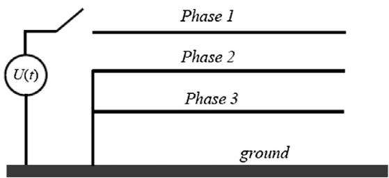  
Fig. 8. Open-circuit test.

switch S, as indicated in Fig. 8. The transient voltage peak at the receiving end of the phase 1 is simulated varying the line length from 10 up to 1100 km. The line configuration with the phases 2 and 3 grounded at the sending end and the three phases opened at the receiving end is a well-established standard configuration for validation of transmission line models in the technical literature on power systems modeling [3–5].

The 1.2/50 ms voltage impulse represents in the frequency domain a frequency scan that covers the entire frequency range in the proposed analysis, from 0.01 Hz to 1 MHz, as analyzed in Figs. 4–7. Thus, the variations observed in the frequency domain can be also evaluated in the time domain from electromagnetic transient simulations using the three modeling/simulation techniques in Table 1. Simulations are carried out with a length step of 10 km per simulation and a maximum error is calculated from the voltage peaks obtained using the Conventional and Mixed routines, where the reference values for the error calculation are obtained from the exact routine that uses the frequencydependent matrix in the line decoupling and calculation of voltage and current values in the frequency and time domains. The percentage error is calculated following the Eq. (25).

$$
\% \text {Error} _ {\text {model}} = 100 \left| \frac {\left| \text {peak} _ {\text {model}} \right| - \left| \text {peak} _ {\text {exact}} \right|}{\left| \text {peak} _ {\text {exact}} \right|} \right| \tag{25}
$$

Fig. 9 shows the percentage error of the conventional and mixed routines as a function of the line length. The routine using the frequency-dependent matrix in the line parameters decoupling and the Clarke’s matrix for calculation of the voltages and currents (mixed routine) points a constant error with variation of the line length. On the other hand, the conventional routine (using only the approach by the Clarke’s matrix) presents major errors in the modeling and simulation of short transmission lines from approximately 150 up to 300 km.

The two routines have a similar performance only for long transmission lines, with more than 800 km. The voltage transient at the receiving end at phases 1 and 2 are described in Fig. 10, for a transmission line with 250 km that represents the length which major errors are observed in Fig. 9.

The solid curve in Fig. 10 represents the reference result based on the modeling and simulation processes using the exact frequency-dependent transformation matrix. In this case, the procedure that alternates the use of exact and Clarke’s matrices implies errors of 8% whereas the conventional procedure error is approximately 9.5%.

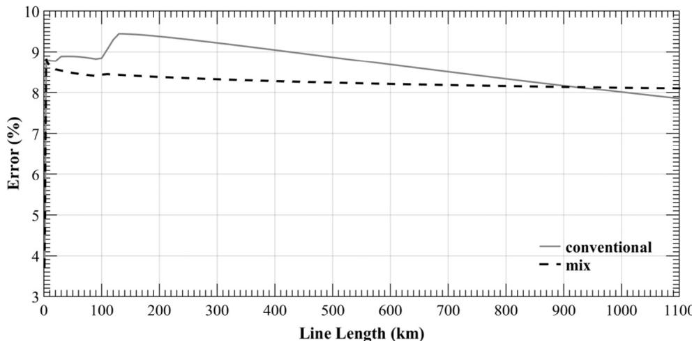  
Fig. 9. Percentage error as a function of the line length.

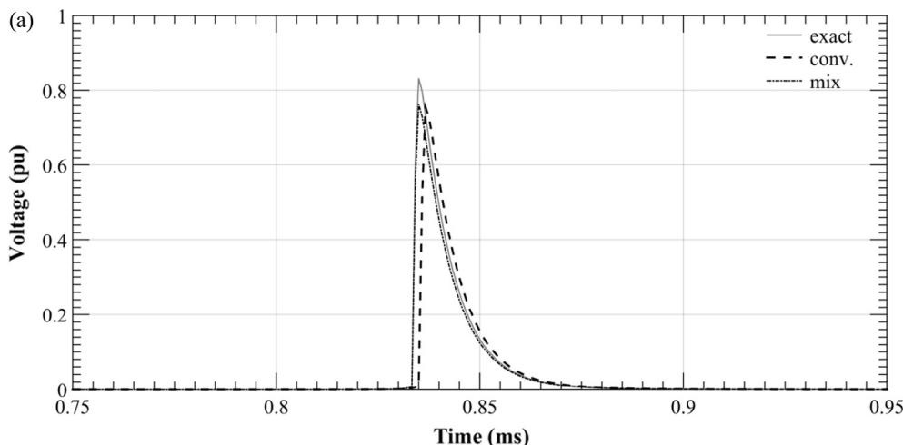

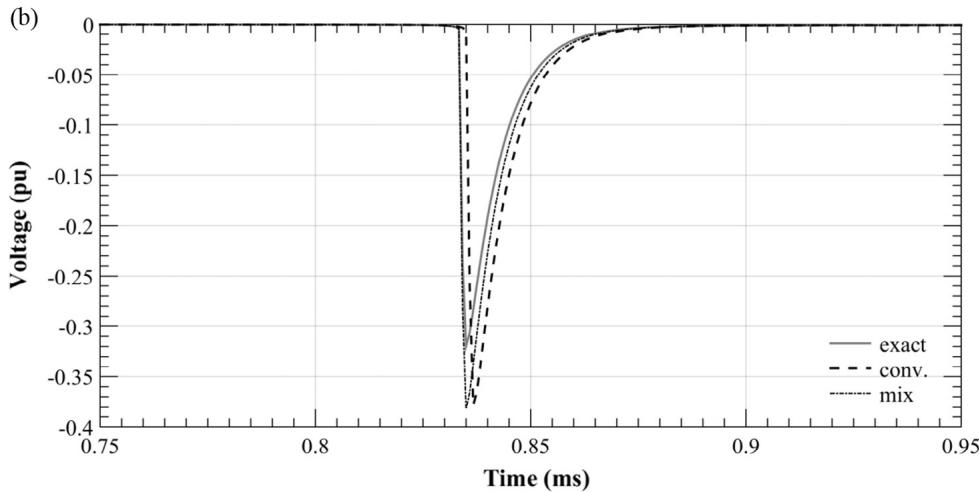  
Fig. 10. Voltage transient at the receiving end of the line with length of 250 km: phases 1 (a) and 2 (b).   
Fig. 9 shows that the conventional and mixed routines provide similar results for transmission lines with length of approximately 950 km. The voltage transients at the receiving ends of the phases 1 and 2 are shown in Fig. 11.   
Fig. 11 shows that the voltage transients obtained from the conventional and mixed routines are similar, since the two curves are practically overlapped. Simulations in Figs. 10 and 11 confirm the percentage error profiles in Fig. 9.

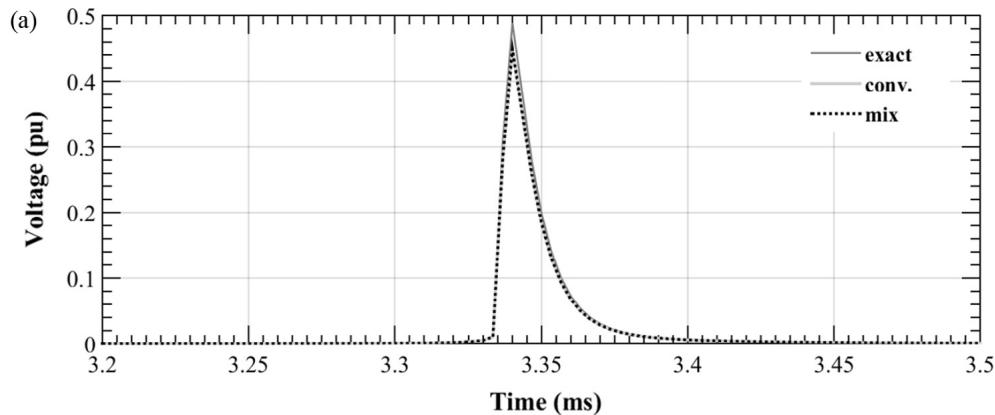

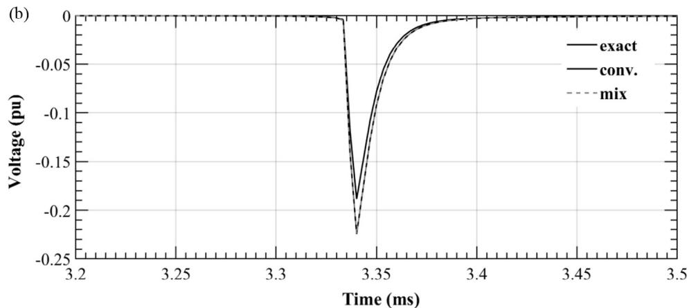  
Fig. 11. Voltage transient at the receiving end of the line with length of 950 km: phases 1 (a) and 2 (b).

# 7. Conclusions

The use of real and constant modal transformation matrices is necessary for transmission line modeling in the time domain. The use of modal analysis in power systems modeling has been widely approached in the technical literature. However, the impact of the transmission line length in the modal decoupling was not even mentioned in previous references. In this context, this research provides a complementary analysis in power systems modeling by using modal analysis.

A preliminary analysis was carried out on the electrical parameters of a non-transposed line with vertical symmetry plane. Major variations among the phases are observed at high frequencies in the self parameters whereas the mutual parameters, more specifically the mutual inductance, show variations through the entire frequency range. These variations lead to errors during the modal decoupling which consequentially result in errors in the time domain during electromagnetic transient simulations.

The mixed routine was previously proposed as a correction procedure for transmission line models based on modal decoupling. This modeling technique shows a constant percentage error of no more than 8% for non-transposed transmission lines with length from 10 km up to 1100 km. On the other hand, the entitled conventional routine, by using the Clarke’s approach in the entire modeling/simulation process, shows major errors during modeling and transient simulation of short non-transposed lines.

The literature on transmission line modeling describes that the approach using the Clarke’s matrix is accurate for transmission lines with vertical symmetry or ideally transposed. The same approach for non-transposed lines with vertical symmetry implies in more significant errors during parameters calculation of the propagation modes (modal decoupling). The preliminary analysis

in the frequency domain shows that the self parameters have major errors at high frequencies whereas variations in the mutual parameters are practically constant in the frequency analysis. The asymmetry in the impedance and admittance matrices, typical of non-transposed lines, leads to inaccuracies in the line decoupling that result in remaining mutual terms in the modal matrices $[ Z _ { m } ]$ and $[ \mathsf { Y } _ { m } ] .$ , denominated quasi-modes, which are directly related to the errors in the electromagnetic transient simulations in the time domain.

Another important conclusion is that the mixed routine represents a more efficient correction procedure on the conventional routine for transmission lines up to 1000 km. The correction procedure (mixed routine) shows to be less effective for long nontransposed lines, with lengths above 1100 km.

# Acknowledgements

São Paulo Research Foundation – FAPESP (Proc. 14/17051-0).

# References

[1] Dommel HW. Digital computer solution of electromagnetic transients in single-and multiphase networks. IEEE Trans Power Appar Syst 1969;PAS-88 (4):388–99.   
[2] Wedepohl LM, Nguyen HV. Frequency-dependent transformation matrices for untransposed transmission lines using newton-raphson method. IEEE Trans Power Syst 1996;11(3):1538–46.   
[3] Kurokawa S, Yamanaka FNR, do Prado AJ, Pissolato J. Inclusion of the frequency effect in the lumped parameters transmission line model: state space formulation. Electr Power Syst Res 2009;79(7):1155–63.   
[4] Caballero PT, Costa ECM, Kurokawa S. Frequency-dependent multiconductor line model based on the Bergeron method. Electr Power Syst Res 2015;127:314–22.

[5] Costa ECM, Kurokawa S, Pinto AJG, Kordi B, Pissolato J. Simplified computational routine to correct the modal decoupling in transmission lines and power systems modelling. IET Sci Meas Technol 2013;7(1):7–15.   
[6] Gómez G, Uribe FA. The numerical Laplace transform: an accurate technique for analysing of electromagnetic transients on power system devices. Int J Electr Power Energy Syst 2009;31(2–3):119–23.   
[7] Deschrijver D, Haegeman B, Dhaene T. Orthonormal vector fitting: a robust macromodeling tool for rational approximation of frequency domain responses. IEEE Trans Adv Packag 2007;30(2):216–25.   
[8] Moreno P, Gómez P, Nareno JL, Guardado LJ. Frequency domain transient analysis of electrical networks including non-linear conditions. Int J Electr Power Energy Syst 2005;27(2):139–56.   
[9] Dávila M, Naredo JL, Moreno P, Gutiérrez JA. The effects of non-uniformities and frequency dependence of line parameters on electromagnetic surge propagation. Int J Electr Power Energy Syst 2006;28(3):151–7.

[10] Tavares MC, Pissolato J, Portela CM. Mode domain multiphase transmission line model-use in transient studies. IEEE Trans Power Deliv 1999;14 (4):1533–44.   
[11] Kurokawa S, Pissolato J, Tavares MC, Portela CM, Prado AJ. Behavior of overhead transmission line parameters on the presence of ground wires. IEEE Trans Power Deliv 2005;20(2):1669–76.   
[12] Araújo ARJ, Kurokawa S, Shinoda AA, Costa ECM. Mitigation of erroneous oscillations in electromagnetic transient simulations using analogue filter theory. IET Sci Meas Technol 2017;11:41–8.   
[13] IEC 60060-1. High-voltage test techniques – part 1: general definitions and test requirements, 2nd ed.; 2009–2010.   
[14] Cigré Working Group 01 (Lightning) of Study Committee 33 (overvoltages and insulation coordination): guide to procedures for estimating the lightning performance of transmission lines; 1991.