# Electromagnetic Transient (EMT) Simulation Algorithms for Evaluation of Large-Scale Extreme Fast Charging Systems (T&D Models)

Suman Debnath , Senior Member, IEEE, and Jongchan Choi , Member, IEEE

Abstract—Simulation of high-fidelity models of extreme fast charging (XFC) systems and large-area power grids with many XFCs can be time consuming in traditional simulators. Traditional simulators use a single method of discretization for all the components that results in imposing a large computational burden of inverting a large matrix as well as increased computations related to single method of discretization (that is typically a trapezoidal method). To overcome the problem of simulating large-area power grids with many XFCs, in this paper, advanced numerical simulation algorithms are applied for the first time together to reduce the dimension of matrix inversion. The algorithms include numerical stiffness-based segregation, time constant-based segregation, clustering and aggregation on differential algebraic equations (DAEs), and multi-order integration approaches. These algorithms apply multiple discretization algorithms rather than a single discretization algorithm that further reduces the computational burden. The approaches mentioned here have resulted in speed-up of up to 18x in the simulation of a single distribution system with 15 XFCs and of up to 271x in the simulation of a transmission-distribution system with 300 XFCs in multiple distribution feeders with respect to conventional simulators (like power systems computer aided design [PSCAD]).

Index Terms—Electromagnetic transient simulation, EMT, electric vehicle chargers, EV chargers, extreme fast charging, XFC, transmission-distribution grids.

# I. INTRODUCTION

T HE trend towards increased electrification of transportation is expected to impose increased power electronicsbased loads on the power grid. These loads are increasing in

Manuscript received 20 September 2021; revised 1 February 2022, 3 May 2022, and 4 August 2022; accepted 4 September 2022. Date of publication 10 October 2022; date of current version 21 August 2023. This work was supported by the Laboratory Directed Research and Development Program of Oak Ridge National Laboratory, managed by UT-Battelle, LLC, with the U.S. Department of Energy, under Contract DE-AC05-00OR22725. This manuscript has been authored by UT-Battelle, LLC under Contract No. DE-AC05-00OR22725 with the U.S. Department of Energy. The United States Government retains and the publisher, by accepting the article for publication, acknowledges that the United States Government retains a non-exclusive, paidup, irrevocable, world-wide license to publish or reproduce the published form of this manuscript, or allow others to do so, for United States Government purposes. The Department of Energy will provide public access to these results of federally sponsored research in accordance with the DOE Public Access Plan (http://energy.gov/downloads/doepublic-access-plan). Paper no. TPWRS-01502-2021. (Corresponding author: Suman Debnath.)

The authors are with the Oak Ridge National Laboratory, Knoxville, TN 37932 USA (e-mail: suman2k42000@gmail.com; choij1@ornl.gov).

Color versions of one or more figures in this article are available at https://doi.org/10.1109/TPWRS.2022.3212639.

Digital Object Identifier 10.1109/TPWRS.2022.3212639

power rating as the transition happens from the traditional L1/L2 chargers (in range of 10s kW) to extreme fast chargers (XFCs) that can charge electric vehicles (EVs) within 10 minutes. The typical range of the XFCs can be 400 kW or higher (e.g., 1 MW). The higher power range is needed to be delivered to medium or heavy duty EVs to charge the batteries in less than 30 minutes [1].

With greater penetration of power electronics based resources in the grid, it is anticipated that high-fidelity electromagnetic transient (EMT) dynamic models of the power grid will be necessary. This requirement has been raised by the analyses of recent events in California [2], [3], [4]. The recent events (unbalanced faults on the power grid during fire incidents) in California led to utility-scale photovoltaic (PV) plants, and distributed energy resources (DERs) in some cases like in [4], to disconnect from the power grid. The latter case of DERs disconnecting from the grid highlighted the need for detailed transmission-distribution grid models. As XFCs are integrated into the grid, high-fidelity EMT dynamic models of transmission-distribution grids with XFCs are needed. This includes use of switched system models to represent power electronics to capture the high-frequency transients observed during these faults. The high-frequency transients have led to disconnections. However, the simulation of such models is extremely time consuming. For example, the simulation of a small portion of the power grid in Electric Reliability Council of Texas (ERCOT) or in Australian Energy Market Operator (AEMO) regions have required 2 − 3 hours [5], [6], [7]. This compares to the order of half hour needed to simulate much larger grids like Western Interconnection (WI) grid in transient stability simulators. This deficiency highlights the need for advanced simulation algorithms in EMT simulators to speed-up simulations, while preserving the accuracy of simulations. The deficiencies in existing simulators to study future power grids with high-penetration of power electronics have also been discussed in detail in [7]. Some of the deficiencies include the homogeneous use of numerical simulation algorithms in the entire system being simulated. The homogeneous use of numerical simulation algorithms includes the use of one discretization algorithm (like the trapezoidal method) for the entire system, the inversion of single matrix upon discretization for the entire system, among others. The increased presence of power electronics in the power grid and the corresponding unique characteristics like switched system (present in power electronics) has not been considered while designing the existing simulators. The deficiencies indicate the need for

significant research in improving the simulation algorithms (including numerical simulation algorithms) used in EMT simulators.

There have been a few research in use of high-performance computing (HPC) algorithms to speed-up EMT simulations using increased computing resources [8], [9]. There have also been several numerical simulation algorithms researched upon to speed-up EMT simulations. These methods can increase the speed of simulation and scale the size of the system that can be studied in simulations without needing HPC resources. Additional speed-up and scalability of EMT simulations will need incorporation of numerical simulation algorithms with HPC techniques. Some of the numerical simulation algorithms include numerical stiffness-based hybrid discretization [10] that has been applied to several power electronics resources as well as in power electronics-based grid studies [11], Kron’s reduction of linear equations [12] that has been applied to transient stability (TS) analysis of power grids [13] as well as to microgrids [12], variants of Kron’s reduction like nested fast and simultaneous simulation [14] that has been applied to power electronics resources [15] and in power electronics-based grid studies [14], low-rank approximation based network solver [16], among others. Some of the algorithms like in [14], [12], [13], and [16] are more applicable to nodal method of solving power system dynamics that result in linear equations. The other algorithms like the one presented in [15] and [10] are not optimized for simulation of both power electronics and power grids in larger system studies. These methods are not directly applicable to power grids with power electronics present in them. In this paper, the state-space approach is taken to solving power system dynamics to enable application of different types and orders of solvers that can reduce the computational burden (as compared to use of single order and type of discretization used in previous papers). This approach is more suitable for studying power grids with power electronics and can further speed-up the simulation. Moreover, based on existing literature surveyed, it appears there are no large-scale XFC systems’ models that have been developed.

The contribution of this paper are discussed briefly. In this paper, the detailed high-fidelity EMT dynamic models of individual XFC system and multiple XFC stations in distribution grid are developed, and multiple XFC stations in multiple distribution grids that are connected to different buses in a small transmission grid are developed. Advanced numerical simulation algorithms like numerical stiffness-based hybrid discretization [10], time constant-based segregation, clustering and aggregation on differential algebraic equations (DAEs), and multi-order integration approaches are applied to these models together for the first time. These algorithms and the locations of their application are explained in this paper. While the first three algorithms split the matrix that needs to be inverted from a large matrix to much smaller matrices, the multi-order algorithm reduces the computational burden of applying higher-order integration approaches in the complete system. The stability analysis of the partitioning approach to apply each type of algorithm is evaluated to provide an understanding of boundary definitions and advantages or limitations of the proposed algorithms.

# II. SCENARIOS DESCRIPTION AND SYSTEM CONFIGURATION

The circuit architectures of XFC systems, multiple XFC stations in distribution grid, and multiple XFC stations in multiple distribution grids that are connected to different buses in the transmission grid are explained in this section.

# A. XFC System Description

The XFC system considered in this paper consists of a direct current (dc)-dc boost converter that connects to the alternating current (ac) grid through a two-level three-phase inverter, and a filter. The control system in XFC station consists of a dcdc converter that controls the active power flow and a dc-ac inverter that controls dc-link voltage and reactive power sent to ac grid. There is an additional inner loop in the dc-ac inverter that performs the dq current control. The XFC system is shown in Fig. 1.

# B. Multiple XFC Systems in an XFC Station

Each individual XFC station may comprise of multiple XFC systems. The number of XFC systems connected through a single transformer are 3, which can be increased to the number that may be present in a charging station. The XFC station’s configuration is shown in Fig. 2.

# C. Distribution Grid With Multiple XFC Stations

An example case-study with 5 XFC stations is considered in this paper. The XFC stations are connected through 5 different distribution feeders to the transmission grid. The overview of the distribution grid with the XFC stations is shown in Fig. 3. In this case-study, there is a total of 15 XFC systems.

# D. Scenario: Transmission Grid - Multiple Distribution Grids With Multiple XFC Stations

IEEE 9-bus test system was utilized to develop the highfidelity models of a transmission and distribution system for the simulation in this paper. IEEE 9-bus system is a transmission system consisting of three generators, three transformers, three constant PQ loads (approximately 100 MW each), and six transmission lines. To structure a transmission and distribution system, the three PQ loads in the 9-bus system were replaced with 20 distribution grids that include 5 XFC stations (15 XFC systems) in each. The nominal voltage of the transmission and distribution system is 230 kV and 34.5 kV, respectively. This system is shown in Fig. 4. Similarly, an additional scenario with IEEE 118-bus test system is considered with some of the PQ loads replaced with XFC systems. A total of 10 distribution grids that include 5 XFC stations (15 XFC systems) in each are considered in the upgraded IEEE 118-bus test system.

# III. EMT MODELS

The EMT dynamic models of individual components and systems are briefly described in this section. The models are represented by DAEs.

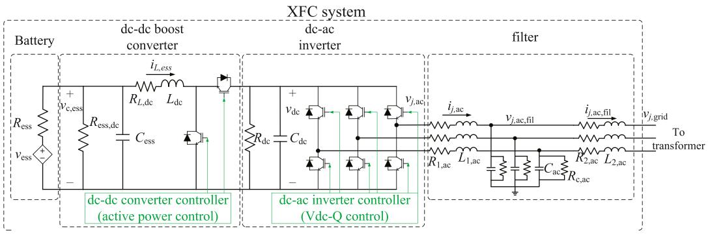  
Fig. 1. XFC system.

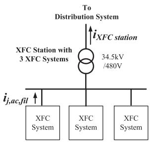  
Fig. 2. XFC station.

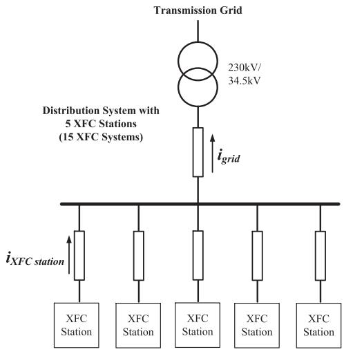  
Fig. 3. XFC stations connected to a distribution grid.

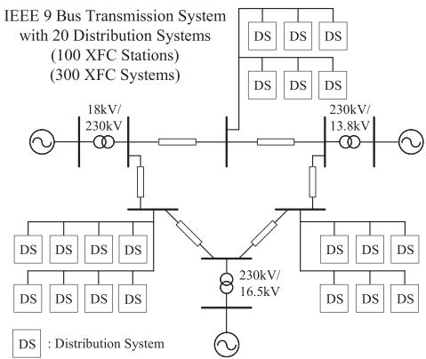  
Fig. 4. Transmission-distribution grid with very large number of XFC stations.

# A. Model: XFC System

The dynamics of the $k ^ { \mathrm { { t h } } }$ XFC system are represented by the switched system model. The system is shown in Fig. 1 with the variables and constants shown in the figure. The dynamics can be modeled using DAEs as provided below.

$$
C _ {\text {e s s}} \frac {\mathrm {d} v _ {c , \text {e s s}} ^ {k}}{\mathrm {d} t} = - \left(\frac {1}{R _ {\text {e s s}}} + \frac {1}{R _ {\text {e s s , d c}}}\right) v _ {c, \text {e s s}} ^ {k} - i _ {L, \text {e s s}} ^ {k} + \frac {V _ {\text {e s s}} ^ {k}}{R _ {\text {e s s}}},
$$

$$
\begin{array}{l} L _ {\mathrm {d c}} \frac {\mathrm {d} i _ {L , \text {e s s}} ^ {k}}{\mathrm {d} t} = - R _ {L, \mathrm {d c}} i _ {L, \text {e s s}} ^ {k} + v _ {c, \text {e s s}} ^ {k} - v _ {\mathrm {d c}} ^ {k} \left\{S _ {2, \mathrm {d c}} ^ {k} \left(1 - S _ {1, \mathrm {d c}} ^ {k}\right) \right. \\ \left. + \left(1 - S _ {2, \mathrm {d c}} ^ {k}\right) \left(1 - S _ {1, \mathrm {d c}} ^ {k}\right) \operatorname {s g n} \left(i _ {L, \text {e s s}} ^ {k}\right) \right\}, \\ \end{array}
$$

$$
\begin{array}{l} C _ {\mathrm {d c}} \frac {\mathrm {d} v _ {\mathrm {d c}} ^ {k}}{\mathrm {d} t} = - \frac {v _ {\mathrm {d c}} ^ {k}}{R _ {\mathrm {d c}}} + i _ {L, \text {e s s}} ^ {k} \left\{S _ {2, \mathrm {d c}} ^ {k} \left(1 - S _ {1, \mathrm {d c}} ^ {k}\right) \right. \\ \left. + \left(1 - S _ {2, \mathrm {d c}} ^ {k}\right) \left(1 - S _ {1, \mathrm {d c}} ^ {k}\right) \operatorname {s g n} \left(i _ {L, \text {e s s}} ^ {k}\right) \right\} \\ - i _ {j, \mathrm {a c}} ^ {k} \left\{S _ {1, j, \mathrm {a c}} ^ {k} \left(1 - S _ {2, j, \mathrm {a c}} ^ {k}\right) + \left(1 - S _ {2, j, \mathrm {a c}} ^ {k}\right) \right. \\ \times \left(1 - S _ {1, j, \mathrm {a c}} ^ {k}\right) \operatorname {s g n} \left(- i _ {j, \mathrm {a c}} ^ {k}\right) \}, \\ \end{array}
$$

$$
\begin{array}{l} L _ {1, \mathrm {a c}} \frac {\mathrm {d} i _ {j , \mathrm {a c}} ^ {k}}{\mathrm {d} t} = - R _ {1, \mathrm {a c}} i _ {j, \mathrm {a c}} ^ {k} + \frac {v _ {\mathrm {d c}} ^ {k}}{2} \left\{S _ {1, j, \mathrm {a c}} ^ {k} \left(1 - S _ {2, j, \mathrm {a c}} ^ {k}\right) \right. \\ - S _ {2, j, \mathrm {a c}} ^ {k} \left(1 - S _ {1, j, \mathrm {a c}} ^ {k}\right) \\ - \left(1 - S _ {2, j, \mathrm {a c}} ^ {k}\right) \left(1 - S _ {1, j, \mathrm {a c}} ^ {k}\right) \\ \left. \left(2 \operatorname {s g n} \left(i _ {j, \mathrm {a c}} ^ {k}\right) - 1\right) \right\} - v _ {j, \mathrm {a c}, \mathrm {f i l}} ^ {k}, \\ \end{array}
$$

$$
\begin{array}{l} C _ {\mathrm {a c}} \frac {\mathrm {d} v _ {j , \mathrm {a c} , \mathrm {f i l}} ^ {k}}{\mathrm {d} t} = - \frac {v _ {j , \mathrm {a c} , \mathrm {f i l}} ^ {k}}{R _ {c , \mathrm {a c}}} + i _ {j, \mathrm {a c}} ^ {k} - i _ {j, \mathrm {a c}, \mathrm {f i l}} ^ {k}, \\ L _ {2, \mathrm {a c}} \frac {\mathrm {d} i _ {j , \mathrm {a c} , \mathrm {f i l}} ^ {k}}{\mathrm {d} t} = - R _ {2, \mathrm {a c}} i _ {j, \mathrm {a c}, \mathrm {f i l}} ^ {k} + v _ {j, \mathrm {a c}, \mathrm {f i l}} ^ {k} - v _ {j, \mathrm {g r i d}} ^ {s}. \tag {1} \\ \end{array}
$$

The sgn function is discussed in [10].

# B. Model: Multiple XFC Systems in an XFC Station

The dynamics of the transformer connecting to multiple XFC systems shown in Fig. 2 can be modeled using DAEs as provided below.

$$
\begin{array}{l} v _ {j, \mathrm {g r i d}} ^ {\mathrm {p} (\mathrm {s})} = \frac {n _ {\mathrm {s}}}{n _ {\mathrm {p}}} v _ {j, \mathrm {g r i d}} ^ {\mathrm {p}}, \\ L _ {\mathrm {l s}} \frac {\mathrm {d} \sum_ {k} i _ {j , \mathrm {a c} , \mathrm {f i l}} ^ {k}}{\mathrm {d} t} + L _ {\mathrm {l p}} ^ {(\mathrm {s})} \frac {\mathrm {d} i _ {j , \mathrm {g r i d}} ^ {\mathrm {p} (\mathrm {s})}}{\mathrm {d} t} = - R _ {\mathrm {l s}} \sum_ {k} i _ {j, \mathrm {a c}, \mathrm {f i l}} ^ {k} \\ \end{array}
$$

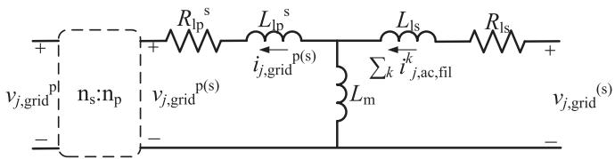  
Fig. 5. Transformer model using classical approach.

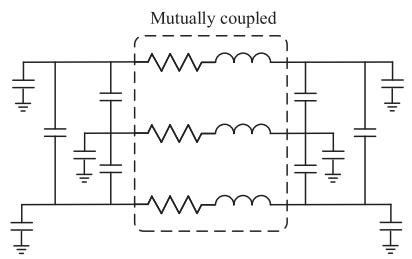  
Fig. 6. Distribution line pi-section model.

$$
\begin{array}{l} - R _ {\mathrm {l p}} ^ {\mathrm {(s)}} i _ {j, \mathrm {g r i d}} ^ {\mathrm {p (s)}} + v _ {j, \mathrm {g r i d}} ^ {\mathrm {s}} - \frac {n _ {\mathrm {s}}}{n _ {\mathrm {p}}} v _ {j, \mathrm {g r i d}} ^ {\mathrm {p}}, \\ L _ {\mathrm {m}} ^ {\mathrm {s}} \frac {\mathrm {d} \sum_ {k} i _ {j , \mathrm {a c} , \mathrm {f i l}} ^ {k}}{\mathrm {d} t} - \left(L _ {\mathrm {l p}} ^ {\mathrm {s}} + L _ {\mathrm {m}} ^ {\mathrm {s}}\right) \frac {\mathrm {d} i _ {j , \mathrm {g r i d}} ^ {\mathrm {p (s)}}}{\mathrm {d} t} = \frac {n _ {\mathrm {s}}}{n _ {\mathrm {p}}} v _ {j, \mathrm {g r i d}} ^ {\mathrm {p}} \\ + R _ {\mathrm {l p}} ^ {\mathrm {s}} i _ {j, \text {g r i d}} ^ {\mathrm {p} (\mathrm {s})}. \tag {2} \\ \end{array}
$$

The transformer is modeled using the pi-section classical approach as shown in Fig. 5.

# C. Model: Distribution Grid With Multiple XFC Stations

Each 3-phase line in the distribution grid shown in Fig. 3 is modeled using pi-section model shown in Fig. 6. The dynamics of the distribution line are represented by DAEs.

# D. Model: Transmission Grid - Multiple Distribution Grids With Large Number of XFC Stations

The transmission grid model is based on the standard IEEE 9-bus model in PSCAD using library components. For the transmission line in the standard system, three different types of line model were developed that included the PI section model, the Bergeron model, and the frequency dependent line model. These models were compared during fault case studies. The comparison of PI section model with respect to frequency dependent line model has been shown in [17]. It was identified that frequency dependent line model provided the most accurate representation to capture high-fidelity transient dynamics. The high-fidelity transient dynamics are expected with the presence of power electronics resources in the grid. The model that used Bergeron’s model produced similar results to the model that used frequency dependent line model. As the Bergeron’s model produced similar results as the frequency-dependent model in these studies, the Bergeron’s line model described in [18] has been modeled and used in this paper. The model is developed based on the implementation described in [18].

# IV. SIMULATION ALGORITHMS FOR SPEED-UP

The simulation algorithms applied to the models of XFC systems, XFC stations, and distribution grids with XFC stations developed in Section III are explained in this section.

# A. Numerical Stiffness & Time-Constant: XFC System

The DAEs representing the dynamics of a single XFC system, as described by (1) can be segregated based on numerical stiffness to stiff DAEs and non-stiff DAEs. This process is similar to the one applied in [10]. Numerical stiffness is observed in the DAEs representing the dynamics of the inductor currents of the dc-dc boost converter $( i _ { L , \mathrm { { e s s } } } )$ , the ac-side inverter currents $( i _ { j , \mathrm { a c } } )$ , and filter voltages and currents $( v _ { j , \mathrm { a c , f i l } }$ and $i _ { j , \mathrm { a c , f i l } } .$ respectively). The DAEs representing the dynamics of the other states in the XFC system like the dc-dc converter capacitor voltages $( v _ { c , \mathrm { { e s s } } }$ and $v _ { \mathrm { d c } } )$ are non-stiff. The DAEs with stiff property are discretized using stiff-decay discretization algorithms like backward Euler and the DAEs with non-stiff property are discretized using non-stiff discretization algorithms like forward Euler. The first-order discretization algorithms are used here as a small time-step is needed to represent the switching behavior of the XFC system. The segregation applied here is stable based on the time constant separating the non-stiff DAEs from stiff DAEs, as has been shown as a sufficient criteria for stability of the segregation in [10]. The non-linearity in the sgn function is represented by the hysteresis relaxation technique [10] to enhance the stability of this segregation.

# B. DAEs Clustering, Aggregation, & Reduction Algorithm: Multiple XFC Systems in a XFC Station

Grouping similar dynamics together, the DAEs representing the dynamics can be aggregated and reduced in size. The grouping of the similar dynamics can be achieved through cluster analysis, which is not the focus of this work and will be considered in future. The aggregated DAEs will be computed to provide inputs to the individual DAEs representing the dynamics of each group. Thereafter, the individual DAEs will be computed. In this process, a large matrix that is obtained from the discretization of the complete DAE is not required to be inverted. Only smaller matrices obtained from the discretization of individual DAEs representing the group’s dynamics is needed. This approach reduces the computational burden of large matrix inversion upon discretization of the DAEs. This process proposed here is similar to the application of Kron’s reduction on linear equations.

This approach is applied to the DAEs representing the dynamics of multiple XFC systems in a XFC station. The DAEs representing the dynamics of XFC systems are similar and can be aggregated. The dynamics of states in the filter of the XFC system described in (1) are aggregated across different XFC systems in a XFC station (shown in Fig. 2), resulting in the following DAEs:

$$
\begin{array}{l} L _ {1, \mathrm {a c}} \frac {\mathrm {d} \sum_ {k} i _ {j , \mathrm {a c}} ^ {k}}{\mathrm {d} t} = - R _ {1, \mathrm {a c}} \sum_ {k} i _ {j, \mathrm {a c}} ^ {k} + \sum_ {k} \frac {v _ {\mathrm {d c}} ^ {k}}{2} \\ \times \left\{S _ {1, j, \mathrm {a c}} ^ {k} \left(1 - S _ {2, j, \mathrm {a c}} ^ {k}\right) \right. \\ \end{array}
$$

$$
\begin{array}{l} - S _ {2, j, \mathrm {a c}} ^ {k} \left(1 - S _ {1, j, \mathrm {a c}} ^ {k}\right) \\ - \left(1 - S _ {2, j, \mathrm {a c}} ^ {k}\right) \left(1 - S _ {1, j, \mathrm {a c}} ^ {k}\right) \\ \left. \times \left(2 \operatorname {s g n} \left(i _ {j, \mathrm {a c}} ^ {k}\right) - 1\right) \right\} - \sum_ {k} v _ {j, \mathrm {a c}, \mathrm {f i l}} ^ {k}, \\ \end{array}
$$

$$
C _ {\mathrm {a c}} \frac {\mathrm {d} \sum_ {k} v _ {j , \mathrm {a c} , \mathrm {f i l}} ^ {k}}{\mathrm {d} t} = - \frac {\sum_ {k} v _ {j , \mathrm {a c} , \mathrm {f i l}} ^ {k}}{R _ {c , \mathrm {a c}}} + \sum_ {k} i _ {j, \mathrm {a c}} ^ {k} - \sum_ {k} i _ {j, \mathrm {a c}, \mathrm {f i l}} ^ {k},
$$

$$
\begin{array}{l} L _ {2, \mathrm {a c}} \frac {\mathrm {d} \sum_ {k} i _ {j , \mathrm {a c} , \mathrm {f i l}} ^ {k}}{\mathrm {d} t} = - R _ {2, \mathrm {a c}} \sum_ {k} i _ {j, \mathrm {a c}, \mathrm {f i l}} ^ {k} + \sum_ {k} v _ {j, \mathrm {a c}, \mathrm {f i l}} ^ {k} \\ - N. v _ {j, \text {g r i d}} ^ {\mathrm {s}}. \tag {3} \\ \end{array}
$$

Solving the DAEs in (2) and $( 3 ) , v _ { j , \mathrm { g r i d } } ^ { s } [ k ]$ is determined and sent as an input to individual DAEs representing the dynamics of each XFC system described in (1). The DAEs in (2) and (3) are discretized using algorithms with stiff-decay property as the states can not be adequately separated from the states in (1) that showed stiffness in the DAEs representing their dynamics. They are discretized using a first-order discretization (backward Euler) as a small time-step is used to represent the switching behavior. The inputs to the discretized DAEs in (2) and (3) are the voltages generated at the terminals of individual XFC system’s inverter at the $( k - 1 ) ^ { \mathrm { t h } }$ instant that are given by,

$$
\begin{array}{l} v _ {j, \mathrm {a c}} ^ {k} [ k - 1 ] = \frac {v _ {\mathrm {d c}} ^ {k} [ k - 1 ]}{2} \left\{S _ {1, j, \mathrm {a c}} ^ {k} [ k - 2 ] \left(1 - S _ {2, j, \mathrm {a c}} ^ {k} [ k - 2 ]\right) \right. \\ - S _ {2, j, \mathrm {a c}} ^ {k} [ k - 2 ] (1 - S _ {1, j, \mathrm {a c}} ^ {k} [ k - 2 ]) \\ \left. - \left(1 - S _ {2, j, \mathrm {a c}} ^ {k} [ k - 2 ]\right) \left(1 - S _ {1, j, \mathrm {a c}} ^ {k} [ k - 2 ]\right)\right) \\ \left. \times \left(2 \operatorname {s g n} \left(i _ {j, \mathrm {a c}} ^ {k} [ k - 1 ]\right) - 1\right) \right\}. \tag {4} \\ \end{array}
$$

The discretization time-step considered here is h and $( k - 1 ) ^ { \mathrm { t f } }$ instant means at time $t = ( k - 1 ) h$ . There is a one time-step delay introduced in the input to the discretized DAEs in $( 2 ) \AA - \displaystyle ( 3 )$ . The time-step delay is analyzed later in Section VI. The overview of this process is shown later in Fig. 7 in the dashed box. The “Multiple XFC Systems in an XFC Station” is the solution of the aggregated system across different XFC systems in a XFC station that interacts with the individual “XFC System”.

# C. Distribution Grid With Multiple XFC Stations

The DAEs representing the dynamics of multiple distribution lines connected to the XFC stations are formed. A second-order discretization is applied to these DAEs. A symmetrical discretization and higher order discretization algorithm (like the trapezoidal integration method) is applied here to enable use of higher time-steps as compared to the smaller time-steps needed to represent switching behavior in XFC stations. As the size of the DAEs increase with a larger number of distribution lines, Kron’s reduction may be applied. Kron’s reduction is applied to solving linear system of equations of the form $A \mathbf { x } = \mathbf { b } ,$ , where A is an $N \times N$ x bmatrix, is a N x1 vector, and is a Nx1 vector. The x bapplication of this reduction technique results in reduced matrix inversion requirements by splitting the matrix A as described in detail in [12].

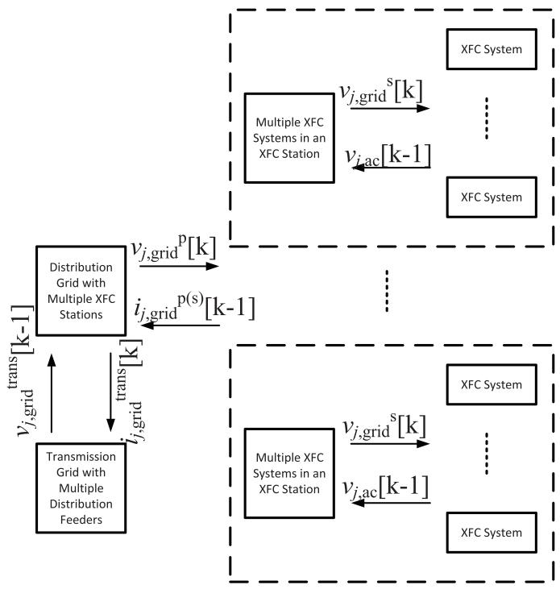  
Fig. 7. Overview of simulation algorithm to simulate large-scale XFCs in grids.

The solution of the discretized DAEs representing the dynamics of multiple distribution lines connected to the XFC stations generates the voltage at the primary-side of the transformer, $v _ { j , \mathrm { g r i d } } ^ { \mathrm { p } } [ k ]$ . This voltage is fed to the XFC station model. From the XFC station model, the currents $i _ { j , \mathrm { g r i d } } ^ { \mathrm { p ( s ) } } [ k - 1 ]$ j,grid are fed from the previous time-step to the discretized DAEs representing the dynamics of distribution grid. Although the trapezoidal discretization of the multiple distribution lines connected to the XFC station requires currents at $k ^ { \mathrm { { t h } } }$ and $( k - 1 ) ^ { \mathrm { t h } }$ instants, there is an approximation made here. The approximation is discussed in Section VI.

# D. Transmission Grid - Multiple Distribution Grids With Large Number of XFC Stations

Each distribution grid with multiple XFC stations is represented as a current source in the transmission grid model. The voltage measured at the node connecting the distribution grid to the transmission grid in the transmission grid model is fed to the distribution grid model. As both the transmission grid and the distribution grid models are being discretized using trapezoidal integration, there is an approximation made here. While the voltage at the transmission grid is measured from the previous instant and fed to the distribution grid model in the current instant, the current is measured at the present instant from the distribution grid model and fed in to the transmission grid model. This approximation holds good if the leakage inductance of the transformer connecting the distribution grid to the transmission grid and the inductance of the distribution line connected to the transformer produces a sufficient smoothing time constant

to inhibit the numerical noise that may be generated from the delayed data exchange.

# E. Overview of Simulation Algorithm

The simulation algorithm to simulate transmissiondistribution grids with multiple XFC stations is summarized in Fig. 7. The modular approach presented here enables scalability of the number XFC models considered.

# V. SIMULATION RESULTS

The simulation models based on advanced algorithms described in Section IV are developed in Fortran and integrated within PSCAD. These algorithms are applied to the systems in two different scenarios: (i) Distribution grid with multiple XFC stations, and (ii) Transmission-distribution grid with multiple XFC stations. These scenarios are described in Sections II-C and II-D, respectively. In these scenarios, the time-step of simulation is 1 μs to compare the advanced simulation algorithm with PSCAD, which only allows a single time-step of simulation. In future, application of multiple time-steps will be considered.

# A. Scenario 1: Distribution Grid With Multiple XFC Stations

Three different use cases are considered in this scenario to evaluate the accuracy of the proposed simulation algorithms. They include: (i) steady-state operation of XFCs, (ii) dynamic operation of XFCs through a step-change in power, and (iii) change in distribution grid voltage. The latter use case mimics faults in distribution grids and/or transmission grids.

Some of the states in the model from the simulation of use case-(i) are provided in Fig. 8. The figures compare the states obtained from baseline simulation model to the advanced simulation model. While the baseline simulation model is developed based on the semiconductor switching devices and passive elements present in the PSCAD library, the advanced simulation model is based on application of the proposed simulation algorithm. The comparison of the states in Fig. 8 shows similarity between the results generated from the advanced simulation model to the baseline simulation model, which highlights the accuracy of the proposed simulation algorithm to simulate distribution grid with multiple XFC stations. The states shown include dc-dc converter inductor current, dc-link voltage in one XFC inverter, and filter capacitor voltages in one XFC inverter. This observation has also been observed in use cases (ii) and (iii), as may be noted from Figs. 9-10. Minor differences are observed like the small differences observed in the dc-link voltage in Fig. 9. The errors measured in the different states in the simulation model indicate less than 5% in all states. The speed-up observed is up to 18x when comparing the developed simulation algorithm to the baseline model.

# B. Scenario 2: Transmission-Distribution Grid With Large Number of XFC Stations

Three different use cases are considered in the transmissiondistribution scenario with IEEE 9-bus test system to evaluate the application of the proposed simulation algorithms. They include:

$$
\begin{array}{l} \text {B a s i l e M o d e l - v _ {d c} (t o p)} \quad \text {B a s i l e M o d e l - i _ {L , e s s} (b o t t o m)} \\ \text {- - - A v i n d a r e d M o d e l - v _ {d c} (t o p)} \quad \text {- - - A v i n d a r e d M o d e l - i _ {L , e s s} (b o t t o m)} \end{array}
$$

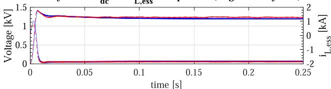  
Steady-state- Vdc and iL.essComparison (single XFC system)   
(a)

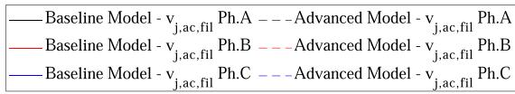  
Steady-state - v. Comparison (single XFC system)

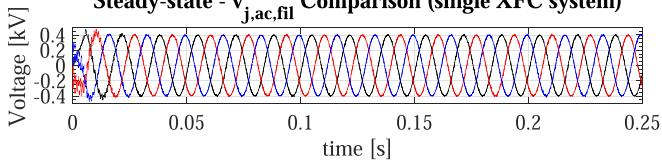

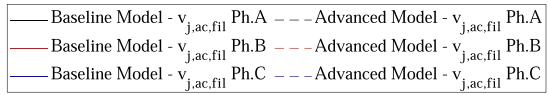

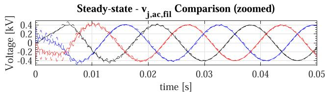  
(b)   
Fig. 8. Comparison of the simulations of distribution grid with multiple XFC stations based on proposed simulation algorithm and on PSCAD in steady-state: (a) dc-dc converter inductor current and dc-link voltage in inverter in one XFC, (b) filter capacitor voltages in inverter in one XFC (longer duration simulation results on the top and zoomed version in the bottom).

(i) steady-state operation of XFCs, (ii) dynamic operation of the XFCs through a step-change in the power consumed by a few XFCs, and (iii) fault in transmission line. In first use case, the comparison with baseline simulation is shown. The baseline simulations are extremely slow and hence, are used to validate the proposed simulation algorithm to simulate the transmissiondistribution scenario in one of the use cases. The rest of the use cases are simulated using advanced simulation algorithm to showcase the need for transmission-distribution grid models that may be useful for individual XFC station design as well as for planning transmission/distribution grid upgrades.

Some of the states in the models from the simulation of use case-(i) are shown in Fig. 11. The comparison of the states simulated using baseline in PSCAD and the proposed simulation algorithm indicates less than 5% error. The speed-up observed during this test case is 271x.

The simulation results from step change in power in 90 XFC systems out of the 300 XFC systems are shown in Fig. 12. The dc-link voltage and the inductor current changes are similar to the observed variations during step change in the distribution

$$
\begin{array}{l} \text {B a s i n e M o d e l - v _ {d c} (t o p)} \quad \text {B a s i n e M o d e l - i _ {L , e s s} (b o t t o m)} \\ \text {- - - - - A v i d a n c e M o d e l - v _ {d c} (t o p)} \quad \text {- - - - - A v i d a n c e M o d e l - i _ {L , e s s} (b o t t o m)} \end{array}
$$

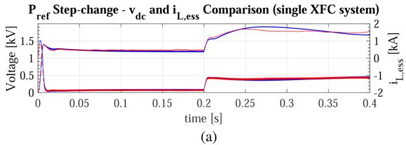

$$
\begin{array}{l} \text {B a s i l e M o d e l - v} _ {\mathrm {j}, \mathrm {a c}, \mathrm {f i l}} \quad \text {P h . A} \quad - - - \text {A n d v e n c e d M o d e l - v} _ {\mathrm {j}, \mathrm {a c}, \mathrm {f i l}} \quad \text {P h . A} \\ \text {B a s i l e M o d e l - v} _ {\mathrm {j}, \mathrm {a c}, \mathrm {f i l}} \quad \text {P h . B} \quad - - - \text {A n d v e n c e d M o d e l - v} _ {\mathrm {j}, \mathrm {a c}, \mathrm {f i l}} \quad \text {P h . B} \\ \text {B a s i l e M o d e l - v} _ {\mathrm {j}, \mathrm {a c}, \mathrm {f i l}} \quad \text {P h . C} \quad - - - \text {A n d v e n c e d M o d e l - v} _ {\mathrm {j}, \mathrm {a c}, \mathrm {f i l}} \quad \text {P h . C} \end{array}
$$

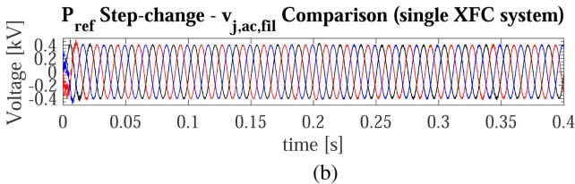  
Fig. 9. Comparison of the simulations of distribution grid with multiple XFC stations based on proposed simulation algorithm and on PSCAD during step-change in power in XFCs: (a) dc-dc converter inductor current and dc-link voltage in inverter in one XFC, (b) filter capacitor voltages in inverter in one XFC.

grid scenario in Section V-A, as may be noted in Fig. 12(a). The variation in the distribution grid voltage at the node connected to the transmission grid are shown in Fig. 12(b). The variation in grid voltage shows the need for using transmission-distribution grid models that can improve the understanding of interactions between the distribution and transmission grids. For example, as may be observed in Fig. 13(a), the dc-link voltage show variations in the XFC system that does not observe a step change of power. These variations are observed due to the variations observed in the grid voltage that is reflected in the XFC system’s filter voltage (as may be observed in Fig. 13(b)). This result indicates the value of analyzing high-fidelity models of transmission-distribution grids that can enable the developer/owner to better understand the design needs in a power electronics system (like XFC system considered in this paper). Analyzing high-fidelity models of transmission-distribution grids can also be an enabler for the grid planners to understand the impact of variations in XFC systems on the transmission grid (and design upgrades, if needed).

The simulation results from a line-to-line fault (at t = 0.08 s) in transmission grid are shown in Fig. 14. The results shown in Fig. 14 show the ac-side voltages and currents in the distribution grid. The applied numerical simulation algorithms do not result in numerical instability in the simulation of the advanced simulation models during these fault case studies, as may be noted in the simulation results shown in Fig. 14.

Another test case considered is an upgraded IEEE 118-bus test system with 150 XFC systems in total. A step change of power is considered in this case and the corresponding ac-side currents and active power in one of the distribution grid is shown in

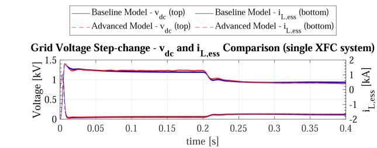  
(a)

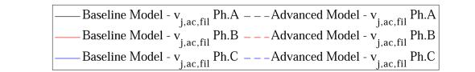

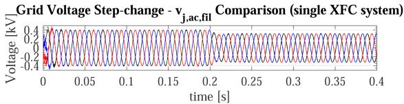  
(b)

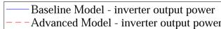

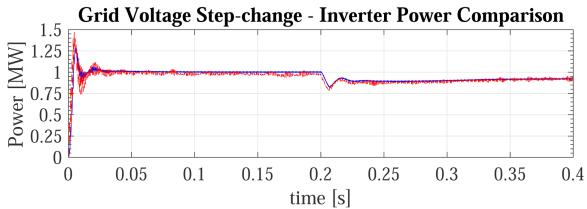  
  
Fig. 10. Comparison of the simulations of distribution grid with multiple XFC stations based on proposed simulation algorithm and on PSCAD during change in grid voltage: (a) dc-dc converter inductor current and dc-link voltage in inverter in one XFC, (b) filter capacitor voltages in inverter in one XFC, (c) active power from one XFC.

Fig. 15. In the figure, the simulation results are shown from both the baseline and advanced models. The simulation results show similarity in the results with less than 5% errors. The speed-up observed in this simulation is 80x.

The time taken to simulate various test systems and the corresponding speed-up observed using the proposed simulation algorithms for XFC systems are summarized in Table I. The speed-up in various cases can be observed in the table.

# VI. DISCUSSION: STABILITY LIMITS

The stability of the proposed advanced simulation algorithms is analyzed here. The stability limits of the numerical stiffnessbased hybrid discretization is explained in [10] and is not repeated here. The stability of the DAEs clustering and aggregation and the associated time-delay is analyzed here.

Without loss of generality, let there be m similar individual DAEs that are clustered and aggregated to interact with an individual similar DAE and an external DAE. The aggregated DAEs are combined with the external DAE to form a combined DAE. There is a time delay in the data exchange between the combined DAE and an individual similar DAE. This is similar to the case with m individual XFC systems that interacts with the connected

TABLE I SUMMARY OF SIMULATION TIMES TAKEN   

<table><tr><td>Test Case</td><td>Baseline (Hrs)</td><td>Proposed (Hrs)</td><td>Speed-Up</td></tr><tr><td>Distribution grid with 15 XFC systems simulated for 0.2 s</td><td>0.25</td><td>0.0144</td><td>17.88</td></tr><tr><td>Transmission (IEEE 9-bus)-distribution grid with 300 XFC systems simulated for 0.25 s</td><td>57.926</td><td>0.213</td><td>271.95</td></tr><tr><td>Transmission (IEEE 118-bus)-distribution grid with 150 XFC systems simulated for 0.2 s</td><td>13.1</td><td>0.16</td><td>81.875</td></tr></table>

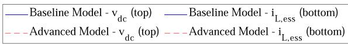

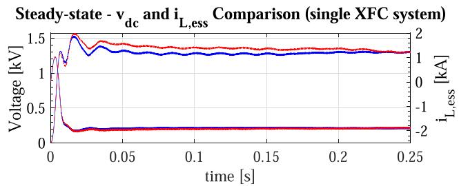  
(a)

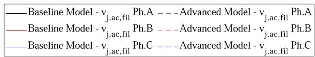

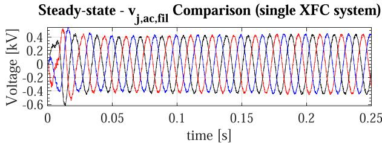  
  
Fig. 11. Comparison of the simulations of transmission grid with 9 buses and with multiple XFC stations based on proposed simulation algorithm and on PSCAD: (a) dc-dc converter inductor current and dc-link voltage in inverter in one XFC, (b) filter capacitor voltages in inverter in one XFC.

transformer, with the dynamics of the m individual XFC systems representing the individual DAEs and the transformer dynamics representing the external DAE.

Any given m similar DAEs may be represented by

$$
\dot {\mathbf {x}} _ {l} = \mathbf {f} \left(\mathbf {x} _ {l}, \mathbf {y}, \mathbf {u} _ {l}, t\right), \forall l \in \{1, 2, 3,.., m \}, \tag {5}
$$

where l, , and l are the states in the similar DAEs, states x y ufrom the external DAE interacting with the m similar individual DAEs, and inputs in the m similar individual DAEs, respectively. The external DAE may be represented by

$$
\dot {\mathbf {x}} = \mathbf {g} (\mathbf {x}, \mathbf {y}, \mathbf {u}, t), \tag {6a}
$$

$$
\mathbf {x} = \left(\mathbf {x} _ {\mathrm {a}}, \mathbf {x} _ {\mathrm {b}}\right), \tag {6b}
$$

$$
\mathbf {x} _ {\mathrm {a}} = A C \mathbf {x} _ {\text {a l l}}, \tag {6c}
$$

$$
\mathbf {x} _ {\text {a l l}} = \left(\mathbf {x} _ {1} ^ {\mathrm {T}}, \dots , \mathbf {x} _ {m} ^ {\mathrm {T}}\right) ^ {\mathrm {T}}, \tag {6d}
$$

where is the input vector to the external DAE, is the states u xvector in the external DAE, a is a subset of states vector in the xexternal DAE that is dependent upon all l, b is the remaining

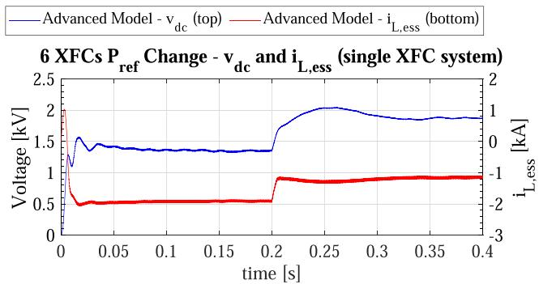  
(a)

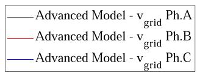

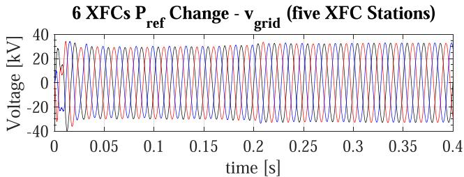  
(b)   
Fig. 12. Simulation results from an XFC station in the transmission grid with 9 buses and with step change in power: (a) dc-dc converter inductor current and dc-link voltage in inverter in one XFC, (b) distribution grid voltage at the node connecting to the transmission grid.

states in the states vector in the external DAE, and A and C are matrices that relates $\mathbf { x } _ { \mathrm { a } }$ to $\mathbf { x } _ { l } .$ . The matrix C is a linear operator x xon the relation that results in

$$
\begin{array}{l} C \left(\mathbf {f} (\mathbf {x} _ {1}, \mathbf {y}, \mathbf {u} _ {1}, t) ^ {\mathrm {T}}, \dots , \mathbf {f} (\mathbf {x} _ {m}, \mathbf {y}, \mathbf {u} _ {m}, t) ^ {\mathrm {T}}\right) ^ {\mathrm {T}} \\ = \mathbf {f} \left(C \mathbf {x} _ {\text {a l l}}, C \mathbf {y}, C \mathbf {y} _ {\mathrm {u}}, t\right), \tag {7} \\ \end{array}
$$

where

$$
\mathbf {y} _ {\mathrm {u}} [ k ] = \left(\mathbf {u} _ {1} [ k ] ^ {\mathrm {T}}, \dots .., \mathbf {u} _ {m} [ k ] ^ {\mathrm {T}}\right) ^ {\mathrm {T}}. \tag {8}
$$

Discretizing the DAEs in (5)-(6) using backward Euler with a time-step h, the following discretized models are obtained

$$
\mathbf {x} _ {l} [ k ] = \mathbf {x} _ {l} [ k - 1 ] + h \left\{\mathbf {f} \left(\mathbf {x} _ {l} [ k ], \mathbf {y} [ k ], \mathbf {u} _ {l} [ k ], k. h\right) \right\}, \tag {9a}
$$

$$
\mathbf {x} [ k ] = \mathbf {x} [ k - 1 ] + h \left\{\mathbf {g} \left(\mathbf {x} [ k ], \mathbf {y} [ k ], \mathbf {u} [ k ], k. h\right) \right\}, \tag {9b}
$$

$$
\mathbf {x} [ k ] = \left(\mathbf {x} _ {\mathrm {a}} [ k ] ^ {\mathrm {T}}, \mathbf {x} _ {\mathrm {b}} [ k ] ^ {\mathrm {T}}\right) ^ {\mathrm {T}}, \tag {9c}
$$

$$
\mathbf {x} _ {\mathrm {a}} [ k ] = A C \mathbf {x} _ {\text {a l l}} [ k ]. \tag {9d}
$$

Advanced Model $^ - \mathrm { \Delta v } _ { \mathrm { d c } }$ (top） Advanced Model $\mathrm { \bf \cdot _ { i _ { L , e s s } } }$ (bottom)

$1 4 \ \mathrm { X F C s } \ \mathbf { P } _ { \mathrm { r e f } } \ \mathrm { N o } \ \mathrm { C h a n g e } \ - \mathbf { v _ { d c } } \ \mathrm { a n d } \ \mathbf { i } _ { \mathrm { L , e s s } } \ ( \mathrm { s i n g l e } \ \mathrm { X F C } \ \mathrm { s y s t e m } )$   
(a)   
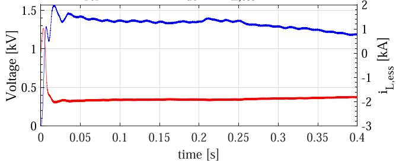  
Advanced Model $\mathrm { \mathrm { ~ - ~ } v } _ { \mathrm { j , a c , f i l } }$ Ph.A Advanced Model-Vjac.fl Ph.B Advanced Model - v Vj.ac.fil Ph.C

14 XFCs $\mathbf { P _ { r e f } }$ No Change $\mathbf { \nabla } \cdot \mathbf { v } _ { \mathbf { j } , \mathbf { a c } , \mathbf { f i l } }$ (single XFC system)   
(b)   
Fig. 13. Simulation results from an XFC station in the transmission grid with 9 buses without a step change in power: (a) dc-dc converter inductor current and dc-link voltage in inverter in one XFC, and (b) filter capacitor voltages in inverter in one XFC.   
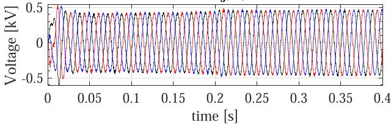  
Detailed model -v Ph.A Vgrid Detailed model - v Ph.B grid Detailed model - v Vgrid Ph.C

The equations in (9) do not incorporate the DAE clustering and aggregation approach. These equations are solved in every timestep to determine the states l, , and . Substituting (6d), (9a), and (7) in (9d) results in

$$
\mathbf {x} _ {\mathrm {a}} [ k ] = \mathbf {x} _ {\mathrm {a}} [ k - 1 ] + h A \mathbf {f} \left(\mathbf {x} _ {\mathrm {c}} [ k ], C \mathbf {y} [ k ], C \mathbf {y} _ {\mathrm {u}} [ k ], k. h\right), \tag {10}
$$

where

$$
\begin{array}{l} \mathbf {x} _ {\mathrm {c}} [ k ] = C \mathbf {x} _ {\text {a l l}} [ k ] \\ = \mathbf {x} _ {\mathrm {c}} [ k - 1 ] + h \mathbf {f} \left(\mathbf {x} _ {\mathrm {c}} [ k ], C \mathbf {y} [ k ], C \mathbf {y} _ {\mathrm {u}} [ k ], k. h\right). \tag {11} \\ \end{array}
$$

With the DAE clustering and aggregation approach, the similar DAEs in (5) are grouped together and can be represented by

$$
\dot {\mathbf {x}} _ {\mathrm {c}} = \mathbf {f} \left(\mathbf {x} _ {\mathrm {c}}, C \mathbf {y}, C \mathbf {y} _ {\mathrm {u}}, t\right), \tag {12a}
$$

$$
\mathbf {x} _ {\mathrm {a}} = A \mathbf {x} _ {\mathrm {c}}, \tag {12b}
$$

$$
\dot {\mathbf {x}} = \mathbf {g} (\mathbf {x}, \mathbf {y}, \mathbf {u}, t). \tag {12c}
$$

Discretizing (12) using backward Euler with a time-step h and considering the time-delay in the input signal in the DAE aggregating and clustering algorithm, the following discretized models are obtained

$$
\tilde {\mathbf {x}} _ {\mathrm {c}} [ k ] = \tilde {\mathbf {x}} _ {\mathrm {c}} [ k - 1 ] + h \left\{\mathbf {f} \left(\tilde {\mathbf {x}} _ {\mathrm {c}} [ k ], C \tilde {\mathbf {y}} [ k ], C \mathbf {y} _ {\mathrm {u}} [ k - 1 ], k. h\right) \right\}, \tag {13a}
$$

$$
\tilde {\mathbf {x}} _ {\mathrm {a}} [ k ] = A \tilde {\mathbf {x}} _ {\mathrm {c}} [ k ], \tag {13b}
$$

$\mathbf { L } \mathbf { - t o } \mathbf { - } \mathbf { L } \mathbf { \int a u l t \ ( A B ) } \mathbf { - v } _ { \mathbf { \alpha } \mathbf { \alpha } _ { \mathbf { \alpha } \mathbf { \alpha } \mathbf { \hat { d } } } }$   
(a)   
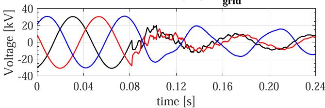  
Detailed model - i igrid Ph.A   
Detailedmodel-i Ph.B grid   
Detailed model -i Ph.C grid

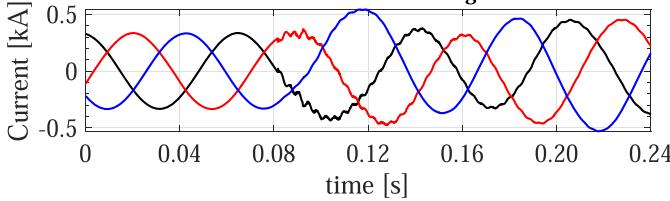  
L-to-L fault (AB) - igrid   
(b)   
Fig. 14. Simulation results from a line-to-line fault condition in transmission grid with 9 buses: (a) ac-side voltages in the distribution grid, and (b) ac-side currents in the distribution grid.

$$
\tilde {\mathbf {x}} [ k ] = \tilde {\mathbf {x}} [ k - 1 ] + h \left\{\mathbf {g} \left(\tilde {\mathbf {x}} [ k ], \tilde {\mathbf {y}} [ k ], \mathbf {u} [ k ], k. h\right) \right\}. \tag {13c}
$$

Similar application of the backward Euler on (5) with the DAE aggregating and clustering algorithm results in

$$
\tilde {\mathbf {x}} _ {l} [ k ] = \tilde {\mathbf {x}} _ {l} [ k - 1 ] + h \left\{\mathbf {f} \left(\tilde {\mathbf {x}} _ {l} [ k ], \tilde {\mathbf {y}} [ k ], \mathbf {u} _ {l} [ k ], k. h\right) \right\}. \tag {14}
$$

In the DAE aggregating and clustering algorithm, (13) is solved first to determine ˜ and ˜. Thereafter, ˜ is substituted in (14) to x ydetermine l at every time-step.

xDefine δ l $[ k ] = \tilde { \mathbf { x } } _ { l } [ k ] - \mathbf { x } _ { l } [ k ]$ and $\delta { \bf x } [ k ] = \tilde { { \bf x } } [ k ] - { \bf x } [ k ]$ . Subx x x x xstituting (9), (13), and (14) in the definition results in

$$
\delta \mathbf {x} _ {l} [ k ] = \delta \mathbf {x} _ {l} [ k - 1 ] + h \delta \mathbf {f} _ {l} [ k ] - h \Delta \mathbf {f} _ {l} [ k ], \tag {15a}
$$

$$
\delta \mathbf {x} [ k ] = \delta \mathbf {x} [ k - 1 ] + h \delta \mathbf {g} [ k ] - h \Delta \mathbf {g} [ k ], \tag {15b}
$$

where

$$
\begin{array}{l} \delta \mathbf {f} _ {l} [ k ] = \mathbf {f} (\tilde {\mathbf {x}} _ {l} [ k ], \tilde {\mathbf {y}} [ k ], \mathbf {u} _ {l} [ k ], k. h) \\ - \mathbf {f} \left(\mathbf {x} _ {l} [ k ], \tilde {\mathbf {y}} [ k ], \mathbf {u} _ {l} [ k ], k. h\right), \tag {16a} \\ \end{array}
$$

$$
\begin{array}{l} \Delta \mathbf {f} _ {l} [ k ] = \mathbf {f} (\mathbf {x} _ {l} [ k ], \mathbf {y} [ k ], \mathbf {u} _ {l} [ k ], k. h) \\ - \mathbf {f} \left(\mathbf {x} _ {l} [ k ], \tilde {\mathbf {y}} [ k ], \mathbf {u} _ {l} [ k ], k. h\right), \tag {16b} \\ \end{array}
$$

$$
\begin{array}{l} \delta \mathbf {g} [ k ] = \mathbf {g} (\tilde {\mathbf {x}} [ k ], \tilde {\mathbf {y}} [ k ], \mathbf {u} [ k ], k. h) \\ - \mathbf {g} (\mathbf {x} [ k ], \tilde {\mathbf {y}} [ k ], \mathbf {u} [ k ], k. h), \tag {16c} \\ \end{array}
$$

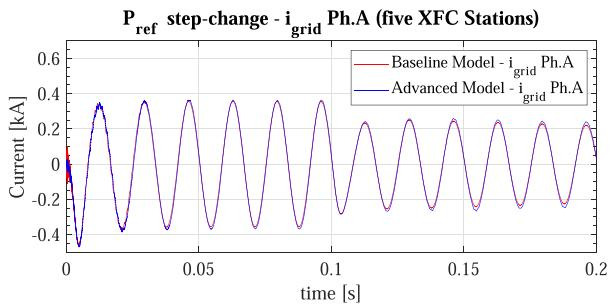  
(a)

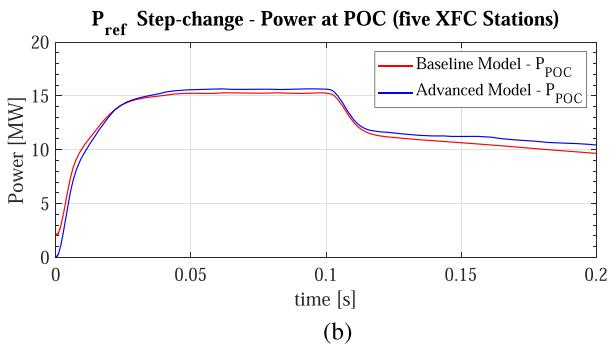  
Fig. 15. Comparison of the simulations from a step change in active power to XFC systems in transmission grid with 118 buses: (a) phase-a ac-side current in one of the distribution grids, and (b) active power in the same distribution grid.

$$
\begin{array}{l} \Delta \mathbf {g} [ k ] = \mathbf {g} (\mathbf {x} [ k ], \mathbf {y} [ k ], \mathbf {u} [ k ], k. h) \\ - \mathbf {g} (\mathbf {x} [ k ], \tilde {\mathbf {y}} [ k ], \mathbf {u} [ k ], k. h). \tag {16d} \\ \end{array}
$$

Defining an energy function $\tilde { E } [ k ]$ as follows:

$$
\tilde {E} [ k ] = \sum_ {l} \| \delta \mathbf {x} _ {l} [ k ] \| ^ {2} + \| \delta \mathbf {x} [ k ] \| ^ {2}. \tag {17}
$$

The change in the energy function is given by

$$
\begin{array}{l} \tilde {E} [ k ] - \tilde {E} [ k - 1 ] \\ = \sum_ {l} \| \delta \mathbf {x} _ {l} [ k ] \| ^ {2} + \| \delta \mathbf {x} [ k ] \| ^ {2} \\ - \sum_ {l} \| \delta \mathbf {x} _ {l} [ k - 1 ] \| ^ {2} - \| \delta \mathbf {x} [ k - 1 ] \| ^ {2}, \\ = \sum_ {l} \left(\delta \mathbf {x} _ {l} [ k ] + \delta \mathbf {x} _ {l} [ k - 1 ]\right) ^ {\mathrm {T}} \left(\delta \mathbf {x} _ {l} [ k ] - \delta \mathbf {x} _ {l} [ k - 1 ]\right) \\ + \left(\delta \mathbf {x} [ k ] + \delta \mathbf {x} [ k - 1 ]\right) ^ {\mathrm {T}} \left(\delta \mathbf {x} [ k ] - \delta \mathbf {x} [ k - 1 ]\right). \tag {18} \\ \end{array}
$$

Substituting $\delta { \bf x } _ { l } [ k - 1 ] , \delta { \bf x } _ { l } [ k ] - \delta { \bf x } _ { l } [ k - 1 ] , \delta { \bf x } [ k - 1 ]$ , and $\delta { \bf x } [ k ] - \delta { \bf x } [ k - 1 ]$ x x xfrom (15) in (18), the following is obtained

$$
\begin{array}{l} \tilde {E} [ k ] - \tilde {E} [ k - 1 ] \\ = \sum_ {l} \left(2 \delta \mathbf {x} _ {l} [ k ] - h \delta \mathbf {f} _ {l} [ k ] + h \Delta \mathbf {f} _ {l} [ k ]\right) ^ {\mathrm {T}} \left(h \delta \mathbf {f} _ {l} [ k ] - h \Delta \mathbf {f} _ {l} [ k ]\right) \\ + \left(2 \delta \mathbf {x} [ k ] - h \delta \mathbf {g} [ k ] + h \Delta \mathbf {g} [ k ]\right) ^ {\mathrm {T}} \left(h \delta \mathbf {g} [ k ] - h \Delta \mathbf {g} [ k ]\right) \\ = h \sum_ {l} \left(2 \delta \mathbf {x} _ {l} [ k ] ^ {\mathrm {T}} \delta \mathbf {f} _ {l} [ k ] - h ^ {2} \| \delta \mathbf {f} _ {l} [ k ] - \Delta \mathbf {f} _ {l} [ k ] \| ^ {2}\right) \\ \end{array}
$$

$$
\begin{array}{l} + 2 h \delta \mathbf {x} [ k ] ^ {\mathrm {T}} \delta \mathbf {g} [ k ] - h ^ {2} \| \delta \mathbf {g} [ k ] - \Delta \mathbf {g} [ k ] \| ^ {2} \\ - \sum_ {l} \left(2 h \Delta \mathbf {f} _ {l} [ k ] ^ {\mathrm {T}} \delta \mathbf {x} _ {l} [ k ]\right) - 2 h \Delta \mathbf {g} [ k ] ^ {\mathrm {T}} \delta \mathbf {x} [ k ] \tag {19} \\ \end{array}
$$

If the DAEs in $( 5 ) \AA { - } ( 6 \mathrm { a } )$ are dissipative, then based on [10], the terms $\delta \mathbf { x } _ { l } [ k ] ^ { \mathrm { T } } \delta \mathbf { f } _ { l } [ k ] \leq 0$ and $\delta \mathbf { x } [ k ] ^ { \mathrm { T } } \delta \mathbf { g } [ k ] \leq 0$ . If the terms $\Delta \mathbf { f } _ { l } [ k ]$ and $\Delta \mathbf { g } [ k ]$ f x gare very small with respect to the simulation f gtime-step h, then $\begin{array} { r } { \tilde { E } [ k ] - \tilde { E } [ k - 1 ] \leq 0 \forall k } \end{array}$ . That is, the discretetime system given by (15) and (16) is globally asymtotically stable with the Lyapunov function $\tilde { E } [ k ]$ . Since the system in (9) is stable (with application of the stiff decay discretization algorithm of backward Euler), DAE clustering and aggregating algorithm introduced in (13) and (14) is also stable. The conditions under which $\Delta \mathbf { g } [ k ]$ is small with respect to h include $\frac { \partial \mathbf { g } } { \partial \mathbf { y } }$ is small or $\delta \mathbf { y }$ is small. The conditions under which $\Delta \mathbf { f } _ { l } [ k ]$ yis small with respect to h include $\frac { \partial \mathbf { f } _ { l } } { \partial \mathbf { y } }$ is small or $\delta \mathbf { y }$ is small.

In this paper,  is (s)abc,grid. $\mathbf { v } _ { a b c , \mathrm { g r i d } } ^ { ( \mathrm { s } ) } .$ The variation of the $\delta \mathbf { y }$ in this y v ywork is small if the leakage inductance of the transformer is a sufficiently small value. The small value of the leakage inductance minimizes the variations observed in $v _ { j , \mathrm { g r i d } } ^ { ( \mathrm { s } ) }$ in (2). A small value of leakage inductance is typically observed in a distribution transformer. And, the dissipative property of the DAEs in (1) and (2) can be verified, providing the stability to the DAE clustering and aggregation algorithm applied. Hence, the DAE clustering and aggregation algorithm is shown to be stable. A similar analysis can be extended to the multi-order discretization approach considered in this paper and the corresponding single time-step delay in transmitting the currents generated from the XFC stations to the distribution grid model. The analysis leads to the need for slow variation in the distribution line’s terminal capacitor voltage with respect to the variation in the current generated from XFC stations. One approach to reduce the rapid change in the voltage is through introduction of a very small capacitor (≈ 20 nF) at the terminal of the distribution line. And, finally, there is a single time-step delay in transmitting the voltages measured at the transmission grid node to the model of the distribution grid connected at the node. This delay will not introduce numerical instability as long as the inductance of the power transformer and connected line in the distribution grid is a sufficiently large value with respect to the time-step h considered.

The discretization time-step chosen to simulate the power grids with XFC systems will depend upon the switching frequency, time constants associated with the states of the DAEs representing the dynamics of the power grid with XFC systems, time constants associated with the control systems, and control time-steps. The algorithms used to generate switching signals and patterns to turn ON/OFF the semiconductor devices in the XFC systems, algorithms used to switch control modes within XFC systems, and power electronics architectures will also play a role in identifying the time-step used in simulations.

The scalability of the proposed algorithms is evaluated on IEEE 118 bus transmission grid model with three different test cases: (i) 300 XFC systems, (ii) 1500 XFC systems, and (iii)

3000 XFC systems. The existing loads in the IEEE 118 bus transmission grid model are replaced with the distribution grid with XFC systems described in this paper. Based on the proposed simulation algorithms, these systems can be simulated and is observed to show results as expected. However, the corresponding baseline models in PSCAD were not able to be simulated due to an overflow error, which is related to the memory limits in a single core for the simulator. This showcases the scalability aspect of the proposed simulation algorithm.

# VII. CONCLUSION

Advanced simulations algorithms that include numerical stiffness-based hybrid discretization, time constant based segregation, DAEs clustering and aggregation, and multi-order discretization methods have been applied to reduce the computational complexity of simulating large-scale XFC systems. These algorithms have been applied to a distribution grid with 15 XFCs that have shown up to 18x improvement in simulation. The accuracy of the proposed algorithm is compared with a baseline model of the XFC systems in PSCAD that have shown less than 5% errors in all states. Another scenario of transmission-distribution grid with 300 XFCs was also developed and evaluated. The speed-up observed is 271x and the errors are than 5%. The ability to successfully scale the implementation of the algorithms from a distribution grid model to a transmission-distribution grid model indicates the capability of the algorithms to scale. The stability of the proposed algorithms has been discussed in the paper.

# REFERENCES

[1] K. A. Walkowicz, A. L. Meintz, and J. T. Farrell, “R&D insights for extreme fast charging of medium- and heavy-duty vehicles: Insights from the nrel commercial vehicles and extreme fast charging research needs workshop, Aug. 27–28, 2019,” Nat. Renewable Energy Lab., Golden, CO, USA, Tech. Rep. NREL/TP-5400-75705, 2020.   
[2] NERC, “1,200 MW fault induced solar photovoltaic resource interruption disturbance report,” North Amer. Electric Rel. Corporation, Atlanta, GA, USA, Tech. Rep., 2017. [Online]. Available: https://www.nerc.com/ pa/rrm/ea/1200_MW_Fault_Induced_Solar_Photovoltaic_Resource_/ 1200_MW_Fault_Induced_Solar_Photovoltaic_Resource_Interruption_ Final.pdf   
[3] NERC, “900 MW fault induced solar photovoltaic resource interruption disturbance report,” North Amer. Electric Rel. Corporation, Atlanta, GA, Tech. Rep., 2018. [Online]. Available: https://www.nerc.com/pa/rrm/ea/ October%209%202017%20Canyon%202%20Fire%20Disturbance% 20Report/900%20MW%20Solar%20Photovoltaic%20Resource% 20Interruption%20Disturbance%20Report.pdf   
[4] NERC, “April and May 2018 Fault induced solar photovoltaic resource interruption disturbance report,” North Amer. Electric Rel. Corporation, Atlanta, GA, Tech. Rep., 2019. [Online]. Available: https: //www.nerc.com/pa/rrm/ea/April_May_2018_Fault_Induced_Solar PV_Resource_Int/April_May_2018_Solar_PV_Disturbance_Report.pdf   
[5] A. Dissanayaka, J. Wiebe, and A. Isaacs, “Panhandle and south texas stability and system strength assessment,” ERCOT, Austin, TX, USA, Tech. Rep., 2018. [Online]. Available: https://www.ercot.com/files/ docs/2018/04/19/Panhandle_and_South_Texas_Stability_and_System_ Strength_Assessment_March....pdf   
[6] R. de Silva, “Review of AEMO’s PSCAD modelling of the power system in south Australia,” Power Systems Consultants Report, Tech. Rep., 2017.   
[7] S. Debnath et al., “High penetration power electronics grid: Modeling and simulation gap analysis,” OAK Ridge Nat. Lab., Tech. Rep. ORNL/TM-2020/1580, 2020.

[8] S. Subedi et al., “Review of methods to accelerate electromagnetic transient simulation of power systems,” IEEE Access, vol. 9, pp. 89714–89731, 2021.   
[9] F. Li et al., “Review of real-time simulation of power electronics,” J. Modern Power Syst. Clean Energy, vol. 8, no. 4, pp. 796–808, Jul. 2020.   
[10] S. Debnath and M. Chinthavali, “Numerical-stiffness-based simulation of mixed transmission systems,” IEEE Trans. Ind. Electron., vol. 65, no. 12, pp. 9215–9224, Dec. 2018.   
[11] J. Sun, S. Debnath, M. Saeedifard, and P. Marthi, “Real-time electromagnetic transient simulation of multi-terminal hvdc-ac grids based on gpu,” IEEE Trans. Ind. Electron., vol. 68, no. 8, pp. 7002–7011, Aug. 2021.   
[12] A. Floriduz, M. Tucci, S. Riverso, and G. Ferrari-Trecate, “Approximate Kron reduction methods for electrical networks with applications to plugand-play control of AC islanded microgrids,” IEEE Trans. Control Syst. Technol., vol. 27, no. 6, pp. 2403–2416, Nov. 2019.   
[13] F. Dörfler and F. Bullo, “Spectral analysis of synchronization in a lossless structure-preserving power network model,” in Proc. First IEEE Int. Conf. Smart Grid Commun., 2010, pp. 179–184.   
[14] K. Strunz and E. Carlson, “Nested fast and simultaneous solution for timedomain simulation of integrative power-electric and electronic systems,” IEEE Trans. Power Del., vol. 22, no. 1, pp. 277–287, Jan. 2007.   
[15] U. N. Gnanarathna, A. M. Gole, and R. P. Jayasinghe, “Efficient modeling of modular multilevel HVDC converters (MMC) on electromagnetic transient simulation programs,” IEEE Trans. Power Del., vol. 26, no. 1, pp. 316–324, Jan. 2011.   
[16] L. Zhang, B. Wang, X. Zheng, W. Shi, P. R. Kumar, and L. Xie, “A hierarchical low-rank approximation based network solver for emt simulation,” IEEE Trans. Power Del., vol. 36, no. 1, pp. 280–288, Feb. 2021.   
[17] S. Debnath and J. Sun, “Fidelity requirements with fast transients from VSC-HVDC,” in Proc. 44th Annu. Conf. IEEE Ind. Electron. Soc., 2018, pp. 6007–6014.   
[18] H. W. Dommel, “Digital computer solution of electromagnetic transients in single-and multiphase networks,” IEEE Trans. Power App. Syst., vol. PAS-88, no. 4, pp. 388–399, Apr. 1969.

Suman Debnath (Senior Member, IEEE) received the bachelor’s and master’s degrees in electrical engineering from the Indian Institute of Technology, Madras, India, in 2010, and the Ph.D. degree in electrical engineering from Purdue University, West Lafayette, IN, USA, in 2015. He is currently a R&D staff with Oak Ridge National Laboratory, Knoxville, TN, USA. His research interests mainly include applied mathematics for high-fidelity modeling and advanced simulation algorithms for electromagnetic transient [EMT] simulation, optimal control, and de-

sign of power electronics-dominated power grids that include renewable (PV, wind), HVdc systems, high-power drives, energy storage system, electric vehicle charging, among others.

Jongchan Choi (Member, IEEE) received the Ph.D. degree in electrical and computer engineering from the Ohio State University, Columbus, OH, USA and the M.S. and B.S. degrees in electrical engineering from Inha University, Incheon, South Korea. He is currently an Associate R&D staff with Oak Ridge National Laboratory, Knoxville, TN, USA. His research interests include modeling, simulation, operation, and control of transmission or distribution grids with high penetration of power electronics-based energy resources. His research focuses on advanced simulation

algorithm for electromagnetic transient (EMT) simulation.