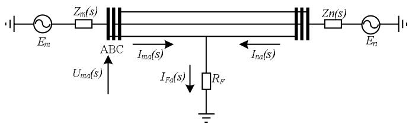
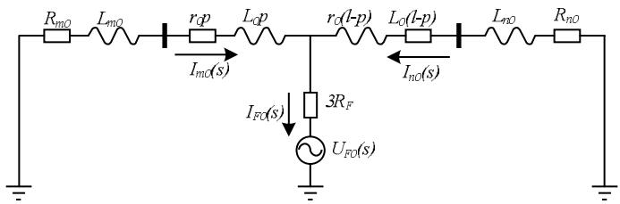
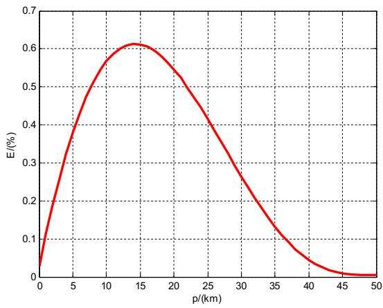

# A NOVEL DISTANCE PROTECTION ALGORITHM IN FREQUENCY DOMAIN BASED ON PARAMETER IDENTIFICATION

J.L. SUONAN *, Y. ZHONG†, G.B. SONG‡

\*School of Electrical Engineering, Xi'an Jiaotong University, China Email: suonan@263.net † School of Electrical Engineering, Xi'an Jiaotong University, China Email: zhongying@stu.xjtu.edu.cn ‡ School of Electrical Engineering, Xi'an Jiaotong University, China Email: song.gb@mail.xjtu.edu.cn

Keywords: distance protection, overreach action, parameter identification, matrix pencil algorithm, R-L model

# Abstract

In this paper, a novel distance protection algorithm in frequency domain is introduced. Based on the R-L model of transmission lines, this algorithm is derived from the linear equations which are obtained in fault condition network and 0-module network for single-phase-to-earth fault. Considering that transformers usually ground directly in high voltage power systems, a linear equation with three coefficients is deduced based on the inductive 0-sequence system impedance Theoretical analysis and simulation results prove that the algorithm is accurate when faults happen at the remote terminal and it will get a positive fault distance error when faults happen around the remote terminal. This phenomenon shows that the algorithm effectively prevents overreach action of distance relays. Meanwhile, this algorithm has a high ability of anti-resistance and is expected to form a new distance protection.

# 1 Introduction

Modern power systems have been increasingly large and complex. Voltage classes and transmission capacities of transmission lines improve and grow continuously that requires distance relays to be more excellent. However, the resistance in fault loop circuits will influence distance relay's performance greatly, especially for single-phase-to-earth fault

Conventional distance relays [1, 2] can only solve two variables by using fundamental frequency data in post-fault waveforms. They commonly suppose that currents in fault point and that in measuring point have the same phase. However, this hypothesis will cause great fault distance error when faults happen at the remote terminal with high resistance to ground. Moreover, the computed distance error usually inclines to be negative, which leads distance relay to overreach. Both zero-sequence reactance relay [3, 4] and negative-sequence reactance relay [5] improve the performance of distance relays in some degree. However, the hypothesis of these literatures that the current distribute factor is real does not always stand. This is the essential problem that leads the distance relay to overreach. Other methods,

such as method of fault component distance relay [6], method of utilizing travelling wave [7] and method of computing the lowest voltage location along the transmission line [8], are also not able to resolve the overreach problem in essence.

Based on parameter identification, Literature [9] and [10] suggest an accurate fault location algorithm using one terminal data in time domain and in frequency domain, respectively. By taking fault distance, fault resistance, equivalent resistance and inductance of opposite system as unknown variables, a non-linear equation is deduced from the analysis of fault network and fault component network. By solving the non-linear equation, the fault distance is obtained. However, since the equation is non-linear, its solution needs iterative method and has the problem of multiple solutions. Besides, they have low computational efficiency. Therefore, both methods can not be applied to distance protection algorithm.

Referred to the analytical method of literature [9], for single-phase-to-earth fault, a novel distance protection algorithm based on parameter identification of solving linear equations is presented in this paper. The core idea of the algorithm is to assume 0-sequence impedance after fault point was an inductance. Taking fault distance, fault resistance and equivalent inductance of opposite system as unknown variables, a linear equation with three coefficients is introduced from the analysis of fault condition network and 0-module network. Base on the relationship between the three variables and the three coefficients, the fault distance is easily solved. Meanwhile, the solution of the linear equation is unique, avoiding multi-solution problem when solving nonlinear equation. To avoid additional error brought by numerical differentiation in time domain, the distance protection algorithm is introduced in frequency domain in this paper. Since accurate fundamental frequency phasors can not be extracted by DFT (Discrete Fourier Transformation) due to the inference of DC offset component in post-fault waveforms a new frequency extraction method, namely matrix pencil algorithm [11], is introduced in this paper. Not only the fundamental frequency component, but also the DC offset component during the transient period will be accurately extracted, which fits perfectly for the distance protection algorithm proposed in this paper. At last, both theoretical analysis and simulation results prove the distance protection algorithm is accurate when faults happen at the remote

terminal and gets a positive fault distance error when faults happen around the remote terminal. The algorithm can effectively prevent overreach phenomenon and is prospects to form a new distance relay.

# 2 Fundamental principle of distance protection algorithm

# 2.1 Derivation of the distance protection algorithm

According to the superposition theorem, fault network is composed of load component network and fault component network. As to single-phase-to-earth faults (here we take phase-A-to-earth fault as an example) in transmission lines, take 0-module network as fault component network. In this paper, we use Clark transformation matrix as phase-module transformation matrix.

Figure 1(a) and Figure 1(b) show equivalent circuit of fault network and 0-module component network of double end power system in R-L model. Distance measuring equipment is supposed to be set in terminal $m$ .

  
(a) equivalent circuit of fault network for single-phase-to-earth fault

  
(b) equivalent circuit of 0-module component network   
Figure 1: equivalent circuit of fault condition in power system

In Figure 1(a), the voltage of phase A at terminal $m$ can be written as

$$
U _ {m a} (s) = \left[ I _ {m a} (s) + K _ {z} \cdot 3 I _ {m 0} (s) \right] z _ {1} p + I _ {F a} (s) R _ {F} \tag {1}
$$

$$
K _ {z} = \frac {z _ {0} - z _ {1}}{3 z _ {1}}, z _ {1} = r _ {1} + s L _ {1}, z _ {0} = r _ {0} + s L _ {0}
$$

Where $K_{z}$ is 0-sequence compensation factor for impedance; $U_{ma}(s)$ and $I_{ma}(s)$ are complex amplitude of fault voltage and current of phase A at terminal $m$ , respectively; $I_{m0}(s)$ is complex amplitude of 0-module current at terminal $m$ ; $r_{1}, L_{1}, r_{0}, L_{0}$ are mode 1 and mode 0 resistance and inductance per unit length, respectively; $I_{Fa}(s)$ and $I_{F0}(s)$ are complex amplitude of fault current and 0-module current at fault point, respectively; $p$ is the fault distance.

In Figure 1(b), $R_{m0}, L_{m0}, R_{n0}$ and $L_{n0}$ are source parameters of mode 0. In this paper, suppose 0-sequence impedance after fault point is an inductance, namely $R_{n0}' = R_{n0} + (l - p)r_0 = 0$ .

According to Figure 1(b) and the hypothesis above, the relationship between $I_{Fa}(s)$ and $I_{m0}(s)$ can be expressed as

$$
\begin{array}{l} I _ {F a} (s) = 3 I _ {F 0} (s) \\ = 3 \left(I _ {m 0} (s) + I _ {n 0} (s)\right) \tag {2} \\ = 3 \dot {I} _ {m 0} (s) K _ {0} (s) \\ \end{array}
$$

$$
K _ {0} (s) = \frac {Z _ {m 0} ^ {\prime} + s L _ {n 0} ^ {\prime}}{s L _ {n 0} ^ {\prime}} = \frac {\left(Z _ {m 0} + z _ {0} p\right) + s \left(L _ {n 0} + (l - p) L _ {0}\right)}{s \left(L _ {n 0} + (l - p) L _ {0}\right)}.
$$

Where $K_{0}(s)$ is the reciprocal of complex amplitude of 0-sequence current distribute factor in terminal $m$ ; $Z_{m0}$ is 0-sequence source impedance in terminal $m$ ; $l$ is the length of the transmission line.

By substituting $I_{Fa}(s)$ in equation (2) into equation (1), we can get

$$
\begin{array}{r l} U _ {m a} (s) & = \\ & \left[ I _ {m a} (s) + K _ {z} \cdot 3 I _ {m 0} (s) \right] z _ {1} p + 3 I _ {m 0} (s) K _ {0} (s) R _ {F} \end{array} \tag {3}
$$

Besides,

$$
\begin{array}{l} K _ {0} (s) R _ {F} = \frac {Z _ {m 0} ^ {\prime} + s L _ {n 0} ^ {\prime}}{s L _ {n 0} ^ {\prime}} R _ {F} \\ = \frac {\left(R _ {m 0} + s L _ {m 0} + r _ {0} p + s L _ {0} p\right) + s \left(L _ {n 0} + (l - p) L _ {0}\right)}{s \left(L _ {n 0} + (l - p) L _ {0}\right)} R _ {F} \tag {4} \\ = \frac {\left(R _ {m 0} + r _ {0} p\right) R _ {F} + s \left(L _ {m 0} + L _ {n 0} + L _ {0} l\right) R _ {F}}{s \left(\left(l - p\right) L _ {0} + L _ {n 0}\right)} \\ \end{array}
$$

For convenience, we define

$$
\left\{ \begin{array}{l} R _ {\Sigma} = \left(R _ {m 0} + r _ {0} p\right) R _ {F} \\ L _ {\Sigma} = \left(L _ {m 0} + L _ {n 0} + L _ {0} l\right) R _ {F} \\ L _ {\Sigma} ^ {\prime} = (l - p) L _ {0} + L _ {n 0} \end{array} \right. \tag {5}
$$

By substituting equation (4) and (5) into equation (3), the following expression is obtained

$$
s L _ {\Sigma} ^ {\prime} U _ {m a} (s) = s I ^ {\prime} (s) p L _ {\Sigma} ^ {\prime} + \left(R _ {\Sigma} + s L _ {\Sigma}\right) \cdot 3 I _ {m 0} (s) \tag {6}
$$

$$
\begin{array}{l} I ^ {\prime} (s) = \left[ I _ {m a} (s) + K _ {R} \cdot 3 I _ {m 0} (s) \right] r _ {1} \\ + \left[ I _ {m a} (s) + K _ {L} \cdot 3 I _ {m 0} (s) \right] s L _ {1}. \\ \end{array}
$$

Where $K_{R}$ is 0-sequence compensation factor for resistance; $K_{L}$ is 0-sequence compensation factor for inductance.

Divided by $L_{\Sigma}^{\prime}$ to both side of the equal sign, equation (6) is transformed to

$$
s U _ {m a} (s) = s I ^ {\prime} (s) p + \frac {3 R _ {\Sigma}}{L _ {\Sigma} ^ {\prime}} I _ {m 0} (s) + \frac {3 L _ {\Sigma}}{L _ {\Sigma} ^ {\prime}} s I _ {m 0} (s) \tag {7}
$$

Namely,

$$
s U _ {m a} (s) = s I ^ {\prime} (s) x _ {1} + I _ {m 0} (s) x _ {2} + s I _ {m 0} (s) x _ {3} \tag {8}
$$

Parameters $x_{1} \sim x_{3}$ in equation (8) are three coefficients of the linear equation. The relationship between these three coefficients and the three unknown variables: fault distance $p$ , fault transition resistance $R_{F}$ and the real time equivalent inductance of opposite system parameter $L_{n0}$ is as follows

$$
\left\{ \begin{array}{l} p = x 1 \\ L _ {n 0} = \left(x _ {3} / x _ {2}\right) \left(R _ {m 0} + r _ {0} p\right) - \left(L _ {m 0} + L _ {0} l\right) \\ R _ {F} = \left\{x _ {2} \left[ (l - p) L _ {0} + L _ {n 0} \right] \right\} / \left[ 3 \left(R _ {m 0} + r _ {0} p\right) \right] \end{array} \right. \tag {9}
$$

Source parameters in terminal $m$ , $R_{m0}$ and $L_{m0}$ , can be calculated in real time (please see the method in literature [9]), so they are known quantities in equation (9).

By solving equation (8), we can get the three coefficients. Then using the relationship as equation (9) shows, we can get the three unknown variables.

As we know, one real equation can work out one coefficient at most. Since three coefficients are needed to be solved in equation (8), at least three real equations are needed. Because fundamental component based equation (8) is a complex one, which can be decomposed to two real equations, while DC offset component based is a real one, thus the fundamental component and one DC offset component are needed in order to solve the three coefficients of equation (8). Meanwhile, the fundamental component and the DC offset component usually exist in the fault transient period [9]. Therefore, the solution of equation (8) is unique and easy to work out.

# 2.2 Data processing procedure

The data processing procedure of the algorithm in this paper is simple, as shown below.

(1) Extract complex amplitude of A-phase-voltage, A-phase-current and 0-module-current in terminal $m$ . Take the sampling points of voltage and current, and then extract the fundamental component and DC offset components by utilizing matrix pencil algorithm (described in section 4).   
(2) Solve the three coefficients of the linear equation. Take the parameters in step (1) to compose a series of equations according to equation (8) and then solve the linear equation set.   
(3) Solve fault distance. Substitute the coefficients solved in step (2) into equation (9) and the fault distance will be obtained at last.   
(4) Judge the distance relay to act or not. Compare the fault distance obtained in step (3) with the action zone of the relay. If it falls in the action zone, the relay acts; if not, the relay does not act.

# 3 System error analysis of the distance protection algorithm

The hypothesis that 0-sequence impedance after fault point is an inductance will inevitably brings system error to the

distance protection algorithm. Here the system error expression is deduced when the transmission line is in no-load operating condition.

The accurate fault location equation is as follows

$$
\begin{array}{r l} U _ {m a} (s) & = \left(I _ {m a} (s) + K _ {Z} \cdot 3 I _ {m 0} (s)\right) z _ {1} p \\ & + 3 I _ {m 0} (s) R _ {F} \cdot K (s) \end{array} \tag {10}
$$

$$
K (s) = \frac {Z _ {\sum 0} (s)}{Z _ {n 0} ^ {\prime} (s)} = \frac {Z _ {m 0} ^ {\prime} (s) + Z _ {n 0} ^ {\prime} (s)}{Z _ {n 0} ^ {\prime} (s)}
$$

Where $K(s)$ is the reciprocal of complex amplitude of actual 0-sequence current distribute factor in terminal $m$ ; $Z_{m0}^{\prime}(s)$ and $Z_{n0}^{\prime}(s)$ are impedance in front of fault point and behind fault point, respectively; $p$ is the actual fault distance.

Here the distance protection algorithm is rewritten as follows

$$
\begin{array}{r l} U _ {m a} (s) & = \left(I _ {m a} (s) + K _ {Z} \cdot 3 I _ {m 0} (s)\right) z _ {1} p _ {1} \\ & + 3 I _ {m 0} (s) R _ {F} \cdot K _ {1} (s) \end{array} \tag {11}
$$

Where $K_{z}$ is 0-sequence compensation factor for impedance; $p_{l}$ is the computed value of fault distance of the protection algorithm; $K_{l}(s)$ is the same as $K_{0}(s)$ in equation (2).

Define a function $F$

$$
\begin{array}{r l} F (p, R _ {n 0} ^ {\prime}) & = U _ {m a} (s) - \left(I _ {m a} (s) + K _ {Z} \cdot 3 I _ {m 0} (s)\right) z _ {1} p \\ & - 3 I _ {m 0} (s) R _ {F} \cdot K (s) \end{array} \tag {12}
$$

Where $p$ and $R_{n0}^{\prime}$ are two variables; $p$ is the actual fault distance; $R_{n0}^{\prime}$ is 0-sequence resistance after fault point; $K(s)$ is the same as equation (10).

Expand function $F$ at point $(p = p_1, R_{n0}^{\prime} = 0)$ and neglect the higher orders. Then, we have the equation

$$
\begin{array}{r l} F (p, R _ {n 0} ^ {\prime}) & = \\ F (p _ {1}, 0) + \frac {\partial F}{\partial p} (p - p _ {1}) + \frac {\partial F}{\partial R _ {n 0} ^ {\prime}} (R _ {n 0} ^ {\prime} - 0) \end{array} \tag {13}
$$

Where,

$$
\begin{array}{r l} F (p _ {1}, 0) & = U _ {m a} (s) - \left(I _ {m a} (s) + K _ {Z} \cdot 3 I _ {m 0} (s)\right) z _ {1} p _ {1} \\ & - 3 I _ {m 0} (s) R _ {F} \cdot K _ {1} (s) \end{array} \tag {14}
$$

According to equations (10) and (11), we get

$$
\left\{ \begin{array}{l} F (p, R _ {n 0} ^ {\prime}) = 0 \\ F (p _ {1}, 0) = 0 \end{array} \right. \tag {15}
$$

Substitute equation (15) into equation (14) and put the element $(p - p_{l})$ to the left side of the equal sign

$$
p _ {1} - p = \frac {\left(\partial F / \partial R _ {n 0} ^ {\prime}\right)}{\left(\partial F / \partial p\right)} \cdot R _ {n 0} ^ {\prime} \tag {16}
$$

By substituting equation (13) into equation (16), we can get the system error function of the distance protection algorithm

$$
p _ {1} - p = \frac {- K _ {R _ {F}} \cdot Z _ {m 0} ^ {\prime}}{1 + K _ {R _ {F}} \cdot \left(z _ {0} Z _ {n 0} ^ {\prime} + s L _ {0} \cdot Z _ {m 0} ^ {\prime}\right)} \cdot R _ {n 0} ^ {\prime} \tag {17}
$$

$$
K _ {R _ {F}} = \frac {3 I _ {m 0} (s) \cdot R _ {F}}{\left(I _ {m a} (s) + K _ {Z} 3 I _ {m 0} (s)\right) z _ {1} \left(Z _ {n 0} ^ {\prime}\right) ^ {2}}
$$

Where $K_{R_F}$ is a coefficient associated with the transition resistance.

Meanwhile, transformed by Clark transformation matrix, $I_{F1}(s), I_{F2}(s)$ and $I_{F0}(s)$ meet the following equation

$$
I _ {F 1} (s) = 2 I _ {F 0} (s), I _ {F 2} (s) = 0 \tag {18}
$$

Where $I_{F1}(s)$ , $I_{F2}(s)$ and $I_{F0}(s)$ are 1-module current, 2-module current and 0-module current at fault point, respectively.

In terms of the phase-module transformation matrix, when the transmission line is in no-load operation, we get

$$
\begin{array}{l} I _ {m a} (s) = I _ {m 1} (s) + I _ {m 2} (s) + I _ {m 0} (s) \\ = C _ {1} (s) I _ {F 1} (s) + C _ {2} (s) I _ {F 2} (s) + C _ {0} (s) I _ {F 0} (s) \tag {19} \\ = \left(2 C _ {1} (s) + C _ {0} (s)\right) I _ {F 0} (s) \\ \end{array}
$$

$$
C _ {1} (s) = \frac {Z _ {n 1} (s) + z _ {1} (l - p)}{Z _ {m 1} (s) + Z _ {n 1} (s) + z _ {1} l}, C _ {0} (s) = \frac {Z _ {n 0} (s) + z _ {0} (l - p)}{Z _ {m 0} (s) + Z _ {n 0} (s) + z _ {0} l}
$$

Where $C_{l}(s)$ and $C_0(s)$ are complex amplitude of 1-module and 0-module current distribute factor in terminal $m$ , respectively.

Therefore,

$$
\begin{array}{l} \frac {I _ {m 0} (s)}{I _ {m a} (s) + K _ {Z} 3 I _ {m 0} (s)} = \frac {1}{\frac {I _ {m a} (s)}{I _ {m 0} (s)} + 3 K _ {Z}} \\ = \frac {1}{\frac {2 C _ {1} (s) + C _ {0} (s)}{C _ {0} (s)} + 3 K _ {Z}} \\ \end{array}
$$

Substitute equation (20) into $K_{RF}$ , we get

$$
K _ {R F} = \frac {3 R _ {F}}{\left(\frac {2 C _ {1} (s) + C _ {0} (s)}{C _ {0} (s)} + 3 K _ {Z}\right) z _ {1} \left(Z _ {n 0} ^ {\prime}\right) ^ {2}} \tag {21}
$$

In terms of equation (17) and (21), we can easily get the system error of the distance protection algorithm.

# 4 The principle of matrix pencil algorithm

The fundamental component and a DC offset component are needed in order to solve equation (8). However, both of them can not be attained accurately by DFT because of the inference in transient period. Here, a component extracting method in frequency domain, namely matrix pencil algorithm, is introduced. It can accurately extract fundamental

component and DC offset components in post-fault waveforms.

Response signals in linear systems can be expressed as the sum of a series of exponential functions. Suppose the signal is composed of $M$ subsignals, we have

$$
y _ {k} = \sum_ {m = 1} ^ {M} R _ {m} e ^ {s _ {m} k T _ {s}}; k = 0, 1, \dots , N - 1 \tag {22}
$$

$$
R _ {m} = A _ {m} e ^ {j \theta_ {m}}, s _ {m} = - \alpha_ {m} + j \omega_ {m}
$$

where $y_{k}$ is the $k$ -th sampling point; $T_{s}$ is the sampling interval; $N$ is the total number of sampling points; $R_{m}$ is the complex amplitude of $m$ -th subsignal; $A_{m}$ is the amplitude of $m$ -th subsignal; $\theta_{m}$ is the phase theta of $m$ -th subsignal; $s_{m}$ is the $m$ -th complex frequency; $\alpha_{m}$ is the attenuation factor of $m$ -th subsignal; $\omega_{m}$ is the angular frequency of $m$ -th subsignal.

Define $z_{m} = e^{s_{m}T_{s}}$ , then equation (22) is transformed to

$$
y _ {k} = \sum_ {m = 1} ^ {M} R _ {m} z _ {m} ^ {k}; k = 0, 1, \dots , N - 1 \tag {23}
$$

Here, two Hankel matrix, $Y_{1}$ and $Y_{2}$ , are defined as follows

$$
\begin{array}{l} Y _ {1} = \left[ \begin{array}{c c c c} y _ {0} & y _ {1} & \dots & y _ {L - 1} \\ y _ {1} & y _ {2} & \dots & y _ {L} \\ \vdots & \vdots & & \vdots \\ y _ {N - L} & y _ {N - L + 1} & \dots & y _ {N - 1} \end{array} \right] _ {(N - L + 1) \times L}, \\ Y _ {2} = \left[ \begin{array}{c c c c} y _ {1} & y _ {2} & \dots & y _ {L} \\ y _ {2} & y _ {3} & \dots & y _ {L + 1} \\ \vdots & \vdots & & \vdots \\ y _ {N - L + 1} & y _ {N - L + 2} & \dots & y _ {N} \end{array} \right] _ {(N - L + 1) \times L}. \\ \end{array}
$$

Where $L$ is a pencil parameter and is useful in eliminating effects of noise in the data, which is set between $N/3$ and $N/2$ typically.

Through singular value decomposition (SVD), $Y_{l}$ is decomposed into

$$
Y _ {1} = U \sum V ^ {T} \tag {24}
$$

where $U$ is a $(N - L + 1)\times (N - L + 1)$ orthogonal matrix, whose column vectors are eigenvectors of matrix $Y_{I}Y_{I}^{T}$ ; $V$ is a $L\times L$ orthogonal matrix, whose column vectors are eigenvectors of matrix $Y_{I}^{T}Y_{I}$ ; $\Sigma$ is a $(N - L + 1)\times L$ diagonal matrix, whose diagonal elements are the singular values and ranged in descending order.

To a signal out of noises, matrix $Y_{l}$ will have $M$ non-zero singular values. Once influenced by noises, some non-zero singular values may turn into small singular values. In this condition, we regard the maximum singular value in matrix $\Sigma$ as $\sigma_{\max}$ and set a precision $p$ . If singular values $\sigma_{i} / \sigma_{\max} > p$ stands, the $i$ -th subsignal is seen as an effective one. Otherwise, the $i$ -th subsignal is treated as a noise. The maximum subscript of singular values is taken as $M$ . In this way, the order of signal is determined [12].

According to literature [13], $z_{m}$ is the generalized eigenvalue of matrix pair $[Y_{1}, Y_{2}]$ , namely

$$
\left(Y _ {1} ^ {+} Y _ {2} - z _ {m} I\right) r _ {m} = [ \mathbf {0} ] \tag {25}
$$

Where $Y_{I}^{+}$ is the Moore-Penrose pseudo-inverse matrix of $Y_{I}$ ; $r_{m}$ is the generalized eigenvector corresponded to $z_{m}$ ;

Thus, $z_{m}$ can be worked out according to equation (25). In addition, $\alpha_{m}$ and $\omega_{m}$ can be solved as follows

$$
- \alpha_ {m} + j \omega_ {m} = \left(\ln z _ {m}\right) / T _ {s}; m = 1, 2, \dots , M \tag {26}
$$

In terms of equation (23), $R_{m}$ can be solved in least square method as the following equation

$$
\left[ \begin{array}{c} y _ {0} \\ y _ {1} \\ \vdots \\ y _ {N - 1} \end{array} \right] = \left[ \begin{array}{c c c c} 1 & 1 & \dots & 1 \\ z _ {1} & z _ {2} & \dots & z _ {M} \\ \vdots & \vdots & & \vdots \\ z _ {1} ^ {N - 1} & z _ {2} ^ {N - 1} & \dots & z _ {M} ^ {N - 1} \end{array} \right] \left[ \begin{array}{c} R _ {1} \\ R _ {2} \\ \vdots \\ R _ {M} \end{array} \right] \tag {27}
$$

Moreover, the amplitude $A_{m}$ , the phase theta $\theta_{m}$ , the attenuation factor $\alpha_{m}$ and the angular frequency $\omega_{m}$ can be solved using equation (28).

$$
\left\{ \begin{array}{l} A _ {m} = \left| R _ {m} \right|; \\ \theta_ {m} = \arctan \left(\operatorname {I m} \left(R _ {m}\right) / \operatorname {R e} \left(R _ {m}\right)\right); \\ \alpha_ {m} = - \operatorname {R e} \left(\ln z _ {m}\right) / T _ {s}; \\ \omega_ {m} = \operatorname {I m} \left(\ln z _ {m}\right) / T _ {s} 。 \end{array} \right. \tag {28}
$$

# 5 Simulation results

Tests have been conducted using the Electromagnetic Transient Program (EMTP). Here, $110\mathrm{kV}$ power system is considered. Because of the limitation of the model adopted by the algorithm in this paper, the distributed capacitance of the transmission line is ignored. The system fault model for EMTP simulation is shown in Figure 1(a). The detailed simulation parameters are listed as below

The length of transmission line $l = 50 \, \text{km}$ ;

The source parameters at terminal $m$ :

$L_{m0} = 11.6\mathrm{mH}, L_{ml} = 30.8\mathrm{mH}$

The source parameters at terminal $n$ :

$L_{n0} = 23.1\mathrm{mH}, L_{nl} = 61.6\mathrm{mH}$

The transmission line parameters:

$r_{l} = 0.105\Omega /\mathrm{km},L_{l} = 1.258\mathrm{mH / km}$

$r_0 = 0.315\Omega /\mathrm{km},L_0 = 3.774\mathrm{mH / km};$

The voltages of source generators:

$$
E _ {m} = 1. 0 5 \angle 0 ^ {\circ}, E _ {n} = 1. 0 0 \angle - 3 0 ^ {\circ}.
$$

The sampling rate is $10\mathrm{kHz}$

The time window for sampling data is $10\mathrm{ms}$ long.

<table><tr><td rowspan="2">fault distance /(km)</td><td rowspan="2">transient resistance /(Ω)</td><td colspan="3">computed fault distance/(km)</td></tr><tr><td>(1)</td><td>(2)</td><td>(3)</td></tr><tr><td rowspan="4">10</td><td>10</td><td>11.32</td><td>10.11</td><td>9.97</td></tr><tr><td>20</td><td>11.13</td><td>10.19</td><td>9.97</td></tr><tr><td>50</td><td>10.79</td><td>10.37</td><td>9.97</td></tr><tr><td>100</td><td>10.83</td><td>10.57</td><td>9.97</td></tr></table>

Table 1: simulation results of different distance protection algorithms   

<table><tr><td rowspan="4">20</td><td>10</td><td>22.10</td><td>19.92</td><td>20.03</td></tr><tr><td>20</td><td>21.85</td><td>19.86</td><td>20.03</td></tr><tr><td>50</td><td>20.65</td><td>19.73</td><td>20.02</td></tr><tr><td>100</td><td>20.07</td><td>19.60</td><td>20.02</td></tr><tr><td rowspan="4">30</td><td>10</td><td>32.42</td><td>29.41</td><td>30.18</td></tr><tr><td>20</td><td>31.90</td><td>29.01</td><td>30.18</td></tr><tr><td>50</td><td>29.56</td><td>28.20</td><td>30.17</td></tr><tr><td>100</td><td>28.12</td><td>27.42</td><td>30.17</td></tr><tr><td rowspan="4">40</td><td>10</td><td>41.57</td><td>37.69</td><td>40.50</td></tr><tr><td>20</td><td>39.87</td><td>36.29</td><td>40.50</td></tr><tr><td>50</td><td>35.32</td><td>33.65</td><td>40.49</td></tr><tr><td>100</td><td>32.37</td><td>31.39</td><td>40.49</td></tr><tr><td rowspan="4">50</td><td>10</td><td>42.21</td><td>36.34</td><td>50.01</td></tr><tr><td>20</td><td>33.53</td><td>29.53</td><td>50.00</td></tr><tr><td>50</td><td>20.31</td><td>18.07</td><td>50.00</td></tr><tr><td>100</td><td>11.76</td><td>9.56</td><td>50.00</td></tr></table>

Here, three different distance protection algorithms are compared in Table 1, and they are measurement impedance algorithm [1] (1), differential equation algorithm [2] (2) and frequency-domain based distance protection algorithm(3) described in this paper.

According to the simulation results in Table 1, the computed fault distance of both measurement impedance algorithm and differential equation algorithm are smaller than the real fault distance when faults happen at the remote terminal. Thus, these distance relays will easily overreach. However, the algorithm depicted in this paper is accurate when faults happen at the remote terminal. Moreover, the computed value of fault distance of the proposed algorithm is greater than the actual fault distance when faults happen around the remote terminal, which means it can effectively avoid overreach phenomenon. In the meantime, the algorithm has a high ability of anti-resistance all over the transmission line.

As to $110\mathrm{kv}$ transmission lines and above, the neutral point of transformers in power systems usually grounds directly. Thus, when faults happen at the remote terminal, 0-sequence impedance of power system turns into leakage impedance of transformers. As resistance component in the transformer leakage impedance is very small and often negligible, the leakage impedance can usually be seen as a pure inductance component. Therefore, $R_{n0}^{\prime} = 0$ , the hypothesis stands. The system error is 0 according to equation (17), as is demonstrated in Table 1.

However, in some cases, owing to the different winding forms and connection modes of transformers, resistance component in $Z_{n0}^{\prime}$ can not be neglected, namely $R_{n0}^{\prime} > 0$ . The hypothesis does not stand. In order to test the algorithm in this condition, the error of computed fault distance $E$ is defined as:

$$
E = \frac{\text{computed loc - actual loc}}{\text{line length}}\times 100\%
$$

Taking $R_{n0} = 0.89\Omega$ (the zero-impedance angular is 83 degree) into the simulation parameters in $110\mathrm{kv}$ power system, Figure 2 shows the curve of $E$ when faults happen along the transmission line according to equation (17). The transition resistance is $50\Omega$ . And note that $p$ , $R_F$ and $Z_{n0}$ are known variables at the moment.

Figure 2: the curve of $E$ when faults happen along the transmission line   
  
Figure 2 illustrates that $E > 0$ when faults happen in a wide range around the remote terminal. This means the computed fault distance of the algorithm is greater than the actual fault distance. This phenomenon ensures the distance relay will not overreach.

# 6 Conclusions

In this paper, a novel distance protection algorithm in frequency domain has been developed. The algorithm has the following characteristics:

(1) It is a method of solving linear equations in frequency domain. Because of the abundant frequency components during the fault transient period, the solution of the linear equations is unique and is easily to be solved.   
(2) The algorithm is accurate when faults happen at the remote terminal. Moreover, the algorithm has a positive error phenomenon when faults happen around the remote terminal, which will effectively avoid overreach action.   
(3) This algorithm has a high ability of anti-resistance and is free from the influence in transient period.

Finally, it should be pointed out that the proposed algorithm is based on R-L model of transmission lines, and a further research should be carried out to cater for long EHV transmission lines. In addition, High performance transformers, optical transformer for example, is needed since the algorithm relies on abundant transient components from power system.

# Acknowledgements

This work is supported by the National Science Foundation of China (Grant No. 51037005), National Basic Research Program of China (Grant No. 2009CB219704)

# References

[1] T. Takagi, Y. Yamakosi, M. Yamaura, R. Kondow, T. Matsushima. "Development of a new type fault locator using the one terminal voltage and current data", IEEE Trans. PAS, vol. PAS-101, no.8, pp. 2892-2898, (1982).   
[2] Q.S. Yang, I.F. Morison. "Microprocessor based algorithm for high resistance earth-fault distance protection", IEE Proc. Generat. Transm. Distrib, vol.130, no.11, pp. 306-310, (1983).   
[3] C.J. Fan, H.P. Yu, W.Y. Yu. "Ability Analysis of Zero-sequence Reactance Relay Against Transient Resistance", Electric Power Automation Equipment, vol.21, no.10, pp. 1-10, (2001).   
[4] B. Wang, X.Z. Dong, Q.Z. Bo. “Zero-sequence Reactance Relay Application in Ultra- high-voltage AC Transmission Lines”, Automation of Electric Power Systems, vol.32, no.4, pp. 46-50, (2008).   
[5] B. Wang, X.Z. Dong, Q.Z. Bo. “Analysis and Improvement of Zero-sequence Reactance Relay With Application in Ultra-high-voltage Long AC Transmission Lines”, Transactions of China Electrotechnical Society, vol.23, no.12, pp. 60-64, (2008).   
[6] J. L. Suonan, F.M. He, Z.B. Jiao. "Research on the Characteristics of Distance Element Based on the Power-frequency Voltage and Current Variation", Proceedings of the CSEE, vol.30, no.28, pp. 59-65, (2010).   
[7] Y.Z. Ge, X.Z. Dong, X.L. Dong. “Traveling Wave-Based Distance Protection With Fault Location Part one Theory and Technology”, Automation of Electric Power Systems, vol.26, no.6, pp. 34-40, (2002)   
[8] S.M. Xue, J.L. He, Y.L. Li. "Distance protection based on Bergeron Model for UHV transmission lines", Relay, vol.33, no.19, pp. 1-4, (2005).   
[9] J.L. Suonan, J. Qi, F.F. Chen. "An accurate fault location algorithm for transmission lines based on R-L model parameter identification", Electric Power Systems Research, vol.76, no.1-3, pp.17-24, (2005).   
[10] X.N. Kang, J.L. Suonan. "Frequency Domain Method of Fault Location Based on Parameter Identification Using One Terminal Data", Proceeding of the CSEE, vol.25, no.2, pp. 22-27, (2005).   
[11] J. L. Suonan, L. Wang, J. D. Xia, S. E. He. "Harmonic analysis of fault signal in UHV AC transmission line", High voltage engineering, vol.36, no.1, pp.37-43, (2010).   
[12] Y. Hua, T. K. Sarkar. "Matrix pencil method for estimating parameters of exponentially damped/undamped sinusoids in noise", IEEE Trans on Signal Processing, vol.38, no.5, pp.814-824, (1991).   
[13] Y. Hua, T. K. Sarkar. "On SVD for estimating generalized eigenvalues of singular matrix pencil in noise", IEEE Trans on Signal Processing, vol.39, no.4, pp.892-900, (1991).