# 基于虚拟阻抗补偿的 PMSG 恒导纳建模方法

史一博，刘崇茹

(新能源电力系统国家重点实验室(华北电力大学)，北京市 昌平区 102206)

# Fixed-admittance Modeling Method of PMSG Based on Compensation of Impedance

SHI Yibo, LIU Chongru*

(State Key Laboratory of Alternate Electrical Power System with Renewable Energy Sources (North China Electric Power

University), Changping District, Beijing 102206, China)

ABSTRACT: The permanent magnet generator system has a complex structure and a large number of nodes. In the real-time electromagnetic transient simulation, if the traditional modeling method is used, the calculation of the system admittance matrix will be too complicated, resulting in a serious limitation of the simulation scale. Therefore, this paper proposes a fixed-admittance modeling method of permanent magnet synchronous generator (PMSG) based on virtual impedance compensation. This method is based on the traditional generator model, and the generator admittance matrix is fixed by compensating the virtual impedance on the rotor. The impedance parameters are optimized with the goal of minimizing the transient error. By combining the constant admittance model of voltage source converter, a complete constant admittance model of PMSG can be established and electromagnetic transient simulation can be performed, thus saving a lot of computing resources. Simulation experiments show that the model has high simulation accuracy, and can be used in discrete hardware simulation platforms such as FPGA, with good applicability.

KEY WORDS: fixed-admittance model; compensation of impedance; permanent magnet synchronous generator

摘要：永磁直驱风力发电系统结构复杂、节点数多，在进行电磁暂态实时仿真时，若采用传统建模方法会因系统导纳矩阵计算过于复杂导致仿真规模严重受限。该文提出一种基于虚 拟 阻 抗 补 偿 的 永 磁 同 步 发 电 机 (permanent magnetsynchronous generator，PMSG)恒导纳建模方法，该方法基于传统发电机模型，通过在转子上补偿虚拟阻抗的方式使发电机导纳矩阵固定，并以暂态误差最小为目标，对阻抗参数进行优化设计；再通过结合换流器的伴随离散电路模型，可建立 PMSG 完整恒导纳模型并进行电磁暂态仿真，能够节省大量的计算资源。仿真试验证明，该模型具有较高的仿真精度，并且可以用于 FPGA 等离散化硬件仿真平台上，具有良好的适用性。

关键词：恒导纳模型；虚拟阻抗补偿；永磁同步电机

# 0 引言

随着我国“2030 碳达峰、2060 碳中和”目标的提出，新能源发电进入快速发展建设阶段[1-3]。永磁直驱风力发电机对环境污染小、发电成本相对较低[4-6]。由于省去了齿轮箱，采用全功率变换器，永磁 同 步 发 电 机 (permanent magnet synchronousgenerator，PMSG)具有效率高、对风速变化适应力强等特点[7]，逐渐成为风力发电的主流。

风力发电机由于定转子系统耦合关系复杂，并且除了电路磁链还涉及到转子力矩的物理部分，因此目前主流的仿真模型仍然是相域(phase domain，PD)模型[8-9]、转子坐标系模型[10-12]和电压后电抗(voltage-behind-reactance，VBR)模型[13]等。

文献[8]提出的PD模型是一种常用的发电机模型。PD 模型基于原始的电压磁链耦合公式[14]表示三相的电压电流关系，参数以物理变量和相位坐标表示[15]，可以直接接入电网进行计算。

转子坐标系模型是通过派克变换将 PD 模型变为同步速旋转坐标系得到的模型，派克变换将定子三相绕组转换为定子 dq 绕组，因此该模型也简称dq 模型。该模型广泛应用于电磁暂态程序如PSCAD[12]和 Simulink[15]中。

此外，文献[13]提出的 VBR 模型也是一种常用的发电机模型。VBR 最早由 S. D. Pekarek 等提出，其核心思想是基于 PD 模型表示出电机出口端电压电流关系进行简化计算，其本质仍然是类似 PD 模型的三相坐标系仿真，与 PD模型没有本质区别。

目前，工程上一个永磁直驱风电场往往包含几

十台风力发电机，单台发电机组包含发电机和换流器等设备，结构复杂，节点数多[16]。在进行电磁暂态实时仿真时，如果采用 PD模型、VBR 模型等传统变导纳矩阵建模方法，会导致导纳矩阵求逆计算过于困难[17]，消耗大量计算资源且系统仿真规模严重受限，难以进行大规模新能源电力系统电磁暂态仿真[18-20]。因此有必要考虑模型的恒导纳方法，将网络导纳矩阵固定进行简化计算。

恒导纳是一种建模方法，常用于绝缘栅双极晶体管(insulate-gate bipolar transistor，IGBT)等电力电子器件电磁暂态仿真建模[21-23]；在建立数学模型时采用等值近似，将原本会因为元件状态变化的导纳固定下来，以达到简化计算的效果。目前电力电子器件恒导纳模型主要包括：伴随离散电路模型(associated discrete circuit，ADC)模型[24]、附加支路模型[25]、负电阻补偿模型[26]等，相关成果已经被广泛应用在 RTDS、RT-LAB 等实时仿真平台。

本文在 PD 模型的基础上提出一种基于虚拟阻抗补偿的 PMSG 恒导纳模型。通过在发电机转子侧添加阻抗，补偿导纳矩阵的时变部分使发电机导纳矩阵恒定；在换流器侧应用电力电子开关的伴随离散电路模型，使换流器导纳矩阵恒定。在此基础上，可建立起 PMSG 完整恒导纳模型并进行电磁暂态计算，避免计算过程中的导纳矩阵求逆，能够节省大量仿真资源。

# 1 PMSG 电磁暂态模型

传统永磁直驱风力发电机组由风力机、发电机、机网侧换流器、网侧滤波器及控制部分组成，整体机组拓扑如图 1 所示。图中， $V _ { \mathrm { w i n d } }$ 为风速，ω为转速，Te、I、U 分别为转矩电流和电压。

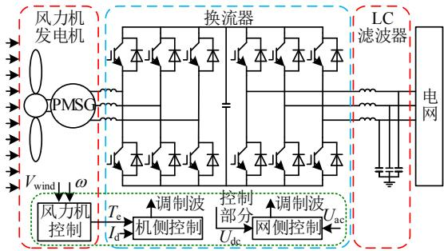  
图1 永磁直驱风力发电机的拓扑结构  
Fig. 1 Topology of PMSG

# 1.1 风力机模型

永磁直驱风机的风力机部分不存在齿轮箱和高速轴，风力机直连发电机[27]。风速与捕获的机械

功率存在对应关系，因此可以简化成分段函数。

当风速未达额定风速时，风力机处在最大功率点跟踪(maximum power point tracking，MPPT)控制阶段，风力机功率与风速成三次方关系。

当风速达到额定风速时，风力机处在变桨距控制阶段，风力机捕获的机械功率等于额定功率。

风力机机械功率曲线如图 2 所示。 $P _ { \mathrm { { M } } }$ 为电机功率。

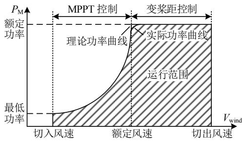  
图2 风力机机械功率曲线  
Fig. 2 Wind turbine mechanical power curve

# 1.2 换流器模型

目前比较经典的电力电子开关电磁暂态模型有双值电阻模型[28]、LC 等效模型[28]、ADC 模型[25]等，此外专家学者还提出负电阻补偿模型[26]、附加支路模型[26]等新型开关模型。ADC 模型是目前应用最为广泛的开关模型，广泛应用在 RTDS、RT-LAB 等实时仿真平台。

ADC 模型的主要思路是将开关导通等效为电感支路，关断等效为电容与电阻的串联支路。等效模型如图 3所示。通过选取电路参数，使梯形法离散后电路模型的等效导纳相等，即开关变化不影响电路导纳。离散后的差分电路为等效电导并联等效电流源的诺顿形式。

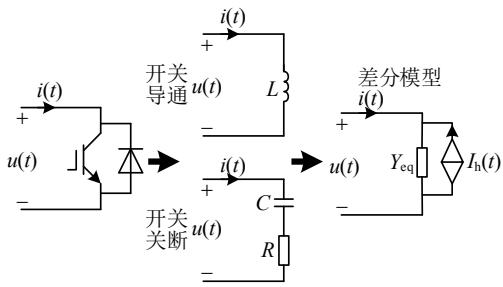  
图3 伴随离散电路模型  
Fig. 3 Typical associated discrete circuit model

ADC 模型等效参数如下：

$$
\left\{ \begin{array}{l} Y _ {\mathrm {e q}} = \frac {\Delta t}{2 L} = \frac {2 C}{2 C R + \Delta t} \\ I _ {\mathrm {h}} (t) = \left\{ \begin{array}{l l} - i (t - \Delta t) - Y _ {\mathrm {e q}} u (t - \Delta t), & \text {o n} \\ (1 - 2 R Y _ {\mathrm {e q}}) i (t - \Delta t) + Y _ {\mathrm {e q}} u (t - \Delta t), & \text {o f f} \end{array} \right. \end{array} \right. \tag {1}
$$

式中： $Y _ { \mathrm { e q } }$ 、 $I _ { \mathrm { h } } ( t )$ 分别为离散后电路模型的等效导纳和等效电流源；Δt 为离散步长；L、R、C 为等效电路参数；u(t-Δt)、i(t-Δt)为离散时间内上一步长电压电流量。

换流器机侧采用零d轴电流控制与最优转矩控制，网侧采用定直流电压控制与定交流电压控制。

# 1.3 发电机仿真模型

目前常用的发电机电磁暂态仿真模型主要有PD 模型[9,29]和 $d q$ 模型[30] 2 种，VBR 模型与 PD 模型没有本质区别，不再赘述[13,31-33]。

PD 模型是基于真实物理变量和静止坐标轴的电压电流耦合模型，电压方程如下[34]：

$$
\left[ \begin{array}{l} \boldsymbol {u} _ {\mathrm {a b c}} \\ \boldsymbol {u} _ {d q} \end{array} \right] = \left[ \begin{array}{l l} \boldsymbol {r} _ {\mathrm {s}} & \\ & \boldsymbol {r} _ {\mathrm {r}} \end{array} \right] \left[ \begin{array}{l} - \boldsymbol {i} _ {\mathrm {a b c}} \\ \boldsymbol {i} _ {d q} \end{array} \right] + p \left[ \begin{array}{l} \boldsymbol {\lambda} _ {\mathrm {a b c}} \\ \boldsymbol {\lambda} _ {d q} \end{array} \right] \tag {2}
$$

其中：

$$
\left\{ \begin{array}{l} \boldsymbol {r} _ {\mathrm {s}} = \operatorname {d i a g} \left(r _ {\mathrm {s}}, r _ {\mathrm {s}}, r _ {\mathrm {s}}\right) \\ \boldsymbol {r} _ {\mathrm {r}} = \operatorname {d i a g} \left(r _ {d}, r _ {q}\right) \end{array} \right. \tag {3}
$$

$$
\left\{ \begin{array}{l} \boldsymbol {f} _ {\mathrm {a b c}} = \left[ \begin{array}{l} f _ {\mathrm {a}} \\ f _ {\mathrm {b}} \\ f _ {\mathrm {c}} \end{array} \right] \\ \boldsymbol {f} _ {d q} = \left[ \begin{array}{l} f _ {d} \\ f _ {q} \end{array} \right] \end{array} \right. \tag {4}
$$

式(4)中的 f 可以为电压 u、电流 i 或者磁链λ。永磁直驱发电机模型中无励磁绕组，因此在磁链方程中需要补偿永磁体磁链。磁链方程如下：

$$
\left[ \begin{array}{l} \boldsymbol {\lambda} _ {\mathrm {a b c}} \\ \boldsymbol {\lambda} _ {d q} \end{array} \right] = \left[ \begin{array}{l l} \boldsymbol {L} _ {\mathrm {s s}} & \boldsymbol {L} _ {\mathrm {s r}} \\ \boldsymbol {L} _ {\mathrm {r s}} & \boldsymbol {L} _ {\mathrm {r r}} \end{array} \right] \left[ \begin{array}{l} - \boldsymbol {i} _ {\mathrm {a b c}} \\ \boldsymbol {i} _ {d q} \end{array} \right] + \left[ \begin{array}{l} \boldsymbol {\lambda} _ {\mathrm {a b c m}} \\ \boldsymbol {\lambda} _ {d q \mathrm {m}} \end{array} \right] \tag {5}
$$

式中： $L _ { \mathrm { s s } }$ 、 $\pmb { L } _ { \mathrm { { r r } } }$ 为定转子绕组自感； $\pmb { L } _ { \mathrm { s r } }$ 、 $\pmb { L } _ { \mathrm { r s } }$ 为定转子绕组互感。

$d q$ 模型是应用派克变换，将 PD模型从三相静止坐标系转换为同步速旋转坐标系得到的模型。电压方程如下：

$$
\left[ \begin{array}{l} \boldsymbol {u} _ {d q 0} \\ \boldsymbol {u} _ {d q} \end{array} \right] = \left[ \begin{array}{l l} \boldsymbol {r} _ {\mathrm {s}} & \\ & \boldsymbol {r} _ {\mathrm {r}} \end{array} \right] \left[ \begin{array}{l} \boldsymbol {i} _ {d q 0} \\ \boldsymbol {i} _ {d q} \end{array} \right] + p \left[ \begin{array}{l} \boldsymbol {\lambda} _ {d q 0} \\ \boldsymbol {\lambda} _ {d q} \end{array} \right] + \left[ \begin{array}{l} \boldsymbol {S} \\ \end{array} \right] \tag {6}
$$

其中：

$$
\boldsymbol {S} = \left[ \begin{array}{l} - \omega_ {\mathrm {r}} \lambda_ {q} \\ \omega_ {\mathrm {r}} \lambda_ {d} \end{array} \right] \tag {7}
$$

磁链方程如下：

$$
\left[ \begin{array}{l} \boldsymbol {\lambda} _ {d q 0} \\ \boldsymbol {\lambda} _ {d q} \end{array} \right] = \left[ \begin{array}{l l} \boldsymbol {L} _ {d q 0 \mathrm {s s}} & \boldsymbol {L} _ {d q 0 \mathrm {s r}} \\ \boldsymbol {L} _ {d q 0 \mathrm {r s}} & \boldsymbol {L} _ {d q 0 \mathrm {r r}} \end{array} \right] \left[ \begin{array}{l} \boldsymbol {i} _ {d q 0} \\ \boldsymbol {i} _ {d q} \end{array} \right] + \left[ \begin{array}{l} \boldsymbol {\lambda} _ {d q 0 \mathrm {m}} \\ \boldsymbol {\lambda} _ {d q \mathrm {m}} \end{array} \right] \tag {8}
$$

# 2 发电机恒导纳模型

# 2.1 发电机模型处理

在暂态仿真计算中，用 ADC 模型能使换流器的导纳矩阵恒定。如果用某种方法将发电机的导纳矩阵固定，则整个风电机组导纳矩阵固定，方便暂态模型的建立和仿真[35-36]。

首先将发电机模型整理为电磁暂态计算程序(electromagnetic transient program，EMTP)标准外部网络接口的格式[37-39]，表示出机端电压和电流关系。对发电机电压方程式(2)应用隐式梯形法离散化，可得：

$$
\left\{ \begin{array}{l} \boldsymbol {\lambda} _ {\mathrm {a b c}} (t) = \frac {\Delta t}{2} \left(\boldsymbol {u} _ {\mathrm {a b c}} (t) + \boldsymbol {u} _ {\mathrm {a b c}} (t - \Delta t) + \boldsymbol {r} _ {\mathrm {s}} \boldsymbol {i} _ {\mathrm {a b c}} (t) + \right. \\ \quad \left. \boldsymbol {r} _ {\mathrm {s}} \boldsymbol {i} _ {\mathrm {a b c}} (t - \Delta t)\right) + \boldsymbol {\lambda} _ {\mathrm {a b c}} (t - \Delta t) \\ \boldsymbol {\lambda} _ {d q} (t) = \frac {\Delta t}{2} \left(- \boldsymbol {r} _ {\mathrm {r}} \boldsymbol {i} _ {d q} (t) - \boldsymbol {r} _ {\mathrm {r}} \boldsymbol {i} _ {d q} (t - \Delta t)\right) + \boldsymbol {\lambda} _ {d q} (t - \Delta t) \end{array} \right. \tag {9}
$$

式中 Δt 为离散仿真步长。

将发电机磁链方程式(5)代入(9)消去磁链项并简化整理可得定子出口端三相电压：

$$
\boldsymbol {u} _ {\mathrm {a b c}} (t) = - \left(\boldsymbol {r} _ {\mathrm {s}} + \frac {2}{\Delta t} \boldsymbol {L} _ {\mathrm {s s}} (t)\right) \boldsymbol {i} _ {\mathrm {a b c}} (t) + \frac {2}{\Delta t} \boldsymbol {L} _ {\mathrm {s r}} (t) \boldsymbol {i} _ {d q} (t) + \boldsymbol {e} _ {\mathrm {s h}} (t) \tag {10}
$$

其中，定子电压历史量 $e _ { \mathrm { s h } } ( t )$ 为

$$
\begin{array}{l} \boldsymbol {e} _ {\mathrm {s h}} (t) = - \left(\boldsymbol {r} _ {\mathrm {s}} - \frac {2}{\Delta t} \boldsymbol {L} _ {\mathrm {s s}} (t - \Delta t)\right) \boldsymbol {i} _ {\mathrm {a b c}} (t - \Delta t) - \\ \frac {2}{\Delta t} \boldsymbol {L} _ {\mathrm {s r}} (t - \Delta t) \boldsymbol {i} _ {d q} (t - \Delta t) - \boldsymbol {u} _ {\mathrm {a b c}} (t - \Delta t) + \\ \frac {2}{\Delta t} \lambda_ {\mathrm {a b c m}} (t) - \frac {2}{\Delta t} \lambda_ {\mathrm {a b c m}} (t - \Delta t) \tag {11} \\ \end{array}
$$

转子阻尼绕组电流可表示为

$$
\boldsymbol {i} _ {d q} (t) = \left(\boldsymbol {r} _ {\mathrm {r}} + \frac {2}{\Delta t} \boldsymbol {L} _ {\mathrm {r r}}\right) ^ {- 1} \left(\frac {2}{\Delta t} \boldsymbol {L} _ {\mathrm {r s}} (t) \boldsymbol {i} _ {\mathrm {a b c}} (t) - \boldsymbol {e} _ {\mathrm {r h}} (t)\right) \tag {12}
$$

其中，转子电压历史量 $e _ { \mathrm { r h } } ( t )$ 为

$$
\boldsymbol {e} _ {\mathrm {r h}} (t) = \left(\boldsymbol {r} _ {\mathrm {r}} - \frac {2}{\Delta t} \boldsymbol {L} _ {\mathrm {r r}}\right) \boldsymbol {i} _ {d q} (t - \Delta t) + \frac {2}{\Delta t} \boldsymbol {L} _ {\mathrm {r s}} (t - \Delta t) \boldsymbol {i} _ {\mathrm {a b c}} (t - \Delta t) \tag {13}
$$

将转子电流式(12)代入(10)，可得永磁同步发电机外部网络接口电压：

$$
\boldsymbol {u} _ {\mathrm {a b c}} (t) = - \boldsymbol {r} _ {\mathrm {e q}} (t) \boldsymbol {i} _ {\mathrm {a b c}} (t) + \boldsymbol {e} _ {\mathrm {h}} (t) \tag {14}
$$

式中 $r _ { \mathrm { e q } } ( t )$ 为阻抗矩阵，可表示为

$$
\boldsymbol {r} _ {\mathrm {e q}} (t) = \boldsymbol {r} _ {\mathrm {s}} + \frac {2}{\Delta t} \boldsymbol {L} _ {\mathrm {s s}} (t) - \frac {4}{\Delta t ^ {2}} \boldsymbol {L} _ {\mathrm {s r}} (t) \left(\boldsymbol {r} _ {\mathrm {r}} + \frac {2}{\Delta t} \boldsymbol {L} _ {\mathrm {r r}}\right) ^ {- 1} \boldsymbol {L} _ {\mathrm {r s}} (t) \tag {15}
$$

历史电压源 $e _ { \mathrm { h } } ( t ) ^ { \flat }$ 表示为

$$
\boldsymbol {e} _ {\mathrm {h}} (t) = - \frac {2}{\Delta t} \boldsymbol {L} _ {\mathrm {s r}} (t) \left(\boldsymbol {r} _ {\mathrm {r}} + \frac {2}{\Delta t} \boldsymbol {L} _ {\mathrm {r r}}\right) ^ {- 1} \boldsymbol {e} _ {\mathrm {r h}} (t) + \boldsymbol {e} _ {\mathrm {s h}} (t) \tag {16}
$$

综上所述，永磁同步发电机外部网络接口的离散模型推导完成，外部网络接口式(14)中的 ${ \pmb u } _ { \mathrm { a b c } }$ 、$i _ { \mathrm { a b c } }$ 为发电机端电压及流出的电流， $e _ { \mathrm { h } }$ 为历史电动势，与上一步长电路参数有关，也与这一步长的θ值有关。

# 2.2 阻抗矩阵整理

由阻抗矩阵 $r _ { \mathrm { e q } } ( t )$ 公式可知，等效阻抗矩阵 $r _ { \mathrm { e q } } ( t )$ 由 3 个部分组成：定子阻抗矩阵 $r _ { \mathrm { s } } .$ 、定子电感矩阵项 $( 2 / \Delta t ) { \cal L } _ { \mathrm { s s } } ( t )$ 及三重矩阵乘积项 $- ( 4 / \Delta t ^ { 2 } ) L _ { \mathrm { s r } } ( t ) [ r _ { \mathrm { r } } +$ $( 2 / \Delta t )  { L _ { \mathrm { r r } } }  { \boldsymbol { \mathrm { I } } } ^ { - 1 }  { \boldsymbol { L } } _ { \mathrm { r s } } ( t )$ 。对于同步机而言，阻抗矩阵 $r _ { \mathrm { e q } } ( t )$ 的第 2 项和第 3 项皆与转子位置角θ有关。

$d q$ 轴磁化阻抗 $Z _ { \mathrm { m } d }$ 和 $Z _ { \mathrm m q }$ 可表示为

$$
\left\{ \begin{array}{l} Z _ {\mathrm {m} d} = \frac {2}{\Delta t} L _ {\mathrm {m} d} \\ Z _ {\mathrm {m} q} = \frac {2}{\Delta t} L _ {\mathrm {m} q} \end{array} \right. \tag {17}
$$

$d q$ 轴阻尼绕组阻抗 $Z _ { \mathrm { l } d }$ 和 $Z _ { \mathrm { l } q }$ 如下：

$$
\left\{ \begin{array}{l} Z _ {1 d} = r _ {d} + \frac {2}{\Delta t} L _ {1 d} \\ Z _ {1 q} = r _ {q} + \frac {2}{\Delta t} L _ {1 q} \end{array} \right. \tag {18}
$$

定义定子漏磁阻抗 $Z _ { \mathrm { l s } }$ 如下：

$$
Z _ {\mathrm {l s}} = r _ {\mathrm {s}} + \frac {2}{\Delta t} L _ {\mathrm {l s}} \tag {19}
$$

定义 $d q$ 轴等效阻抗 $Z _ { d }$ 和 $Z _ { q }$ 如下：

$$
Z _ {d} = \left(Z _ {\mathrm {m d}} ^ {- 1} + Z _ {1 d} ^ {- 1}\right) ^ {- 1} = \frac {Z _ {\mathrm {m d}} Z _ {1 d}}{Z _ {1 d} + Z _ {\mathrm {m d}}} \tag {20}
$$

$$
\boldsymbol {M} _ {d} = \left[ \begin{array}{c c c} \sin \theta \sin \theta & \sin \theta \sin (\theta - 1 2 0 ^ {\circ}) & \sin \theta \sin (\theta + 1 2 0 ^ {\circ}) \\ \sin (\theta - 1 2 0 ^ {\circ}) \sin \theta & \sin (\theta - 1 2 0 ^ {\circ}) \sin (\theta - 1 2 0 ^ {\circ}) & \sin (\theta - 1 2 0 ^ {\circ}) \sin (\theta + 1 2 0 ^ {\circ}) \\ \sin (\theta + 1 2 0 ^ {\circ}) \sin \theta & \sin (\theta + 1 2 0 ^ {\circ}) \sin (\theta + 1 2 0 ^ {\circ}) & \sin (\theta + 1 2 0 ^ {\circ}) \sin (\theta + 1 2 0 ^ {\circ}) \end{array} \right] \tag {25}
$$

同理，q 轴部分写为

$$
\boldsymbol {L} _ {\mathrm {s r q}} \left(\boldsymbol {r} _ {\mathrm {r q}} + \frac {2}{\Delta t} \boldsymbol {L} _ {\mathrm {r r q}}\right) ^ {- 1} \frac {2}{3} \boldsymbol {L} _ {\mathrm {r s q}} = \left[ \begin{array}{c} L _ {\mathrm {m q}} \cos \theta \\ L _ {\mathrm {m q}} \cos (\theta - 1 2 0 ^ {\circ}) \\ L _ {\mathrm {m q}} \cos (\theta + 1 2 0 ^ {\circ}) \end{array} \right] \left(Z _ {\mathrm {l q}} + Z _ {\mathrm {m q}}\right) ^ {- 1} \frac {2}{3} \left[ \begin{array}{c} L _ {\mathrm {m q}} \cos \theta \\ L _ {\mathrm {m q}} \cos (\theta - 1 2 0 ^ {\circ}) \\ L _ {\mathrm {m q}} \cos (\theta + 1 2 0 ^ {\circ}) \end{array} \right] ^ {\mathrm {T}} = \frac {2}{3} \frac {L _ {\mathrm {m q}} ^ {2}}{Z _ {\mathrm {l q}} + Z _ {\mathrm {m q}}} \boldsymbol {M} _ {q} \tag {26}
$$

$$
\boldsymbol {M} _ {q} = \left[ \begin{array}{c c c} \cos \theta \cos \theta & \cos \theta \cos (\theta - 1 2 0 ^ {\circ}) & \cos \theta \cos (\theta + 1 2 0 ^ {\circ}) \\ \cos (\theta - 1 2 0 ^ {\circ}) \cos \theta & \cos (\theta - 1 2 0 ^ {\circ}) \cos (\theta - 1 2 0 ^ {\circ}) & \cos (\theta - 1 2 0 ^ {\circ}) \cos (\theta + 1 2 0 ^ {\circ}) \\ \cos (\theta + 1 2 0 ^ {\circ}) \cos \theta & \cos (\theta + 1 2 0 ^ {\circ}) \cos (\theta - 1 2 0 ^ {\circ}) & \cos (\theta + 1 2 0 ^ {\circ}) \cos (\theta + 1 2 0 ^ {\circ}) \end{array} \right] \tag {27}
$$

因此，等效电阻矩阵式(15)中的三重矩阵相乘部分即为 d、q 轴2 个矩阵的相加。

将整理后的三重矩阵乘积项代入阻抗矩阵式(15)，可得：

$$
\boldsymbol {r} _ {\mathrm {e q}} (t) = \left[ \begin{array}{l l l} r _ {1 1} & r _ {1 2} & r _ {1 3} \\ r _ {2 1} & r _ {2 2} & r _ {2 3} \\ r _ {3 1} & r _ {3 2} & r _ {3 3} \end{array} \right] = \left[ \begin{array}{c c c} r _ {\mathrm {s}} & & \\ & r _ {\mathrm {s}} & \\ & & r _ {\mathrm {s}} \end{array} \right] +
$$

$$
Z _ {q} = \left(Z _ {\mathrm {m} q} ^ {- 1} + Z _ {\mathrm {l} q} ^ {- 1}\right) ^ {- 1} = \frac {Z _ {\mathrm {m} q} Z _ {\mathrm {l} q}}{Z _ {\mathrm {l} q} + Z _ {\mathrm {m} q}} \tag {21}
$$

将式(15)中的第 3 项，三重矩阵相乘部分 $\pmb { L } _ { \mathrm { s r } } ( t )$ ·$[ { \pmb r } _ { \mathrm { r } } + ( 2 / \Delta t ) { \pmb L } _ { \mathrm { r r } } ] ^ { - 1 } { \pmb L } _ { \mathrm { r s } } ( t )$ 分解为 d、q 轴两部分：

$$
\boldsymbol {L} _ {\mathrm {s r}} (t) \left(\boldsymbol {r} _ {\mathrm {r}} + \frac {2}{\Delta t} \boldsymbol {L} _ {\mathrm {r r}}\right) ^ {- 1} \boldsymbol {L} _ {\mathrm {r s}} (t) = \left[ \begin{array}{l l} \boldsymbol {L} _ {\mathrm {s r d}} & \boldsymbol {L} _ {\mathrm {s r q}} \end{array} \right] \left( \begin{array}{c c} \boldsymbol {r} _ {\mathrm {r d}} & \\ & \boldsymbol {r} _ {\mathrm {r q}} \end{array} \right) +
$$

$$
\frac {2}{\Delta t} \left[ \begin{array}{l l} \boldsymbol {L} _ {\mathrm {r r d}} & \\ & \boldsymbol {L} _ {\mathrm {r r q}} \end{array} \right] ^ {- 1} \frac {2}{3} \left[ \begin{array}{l} \boldsymbol {L} _ {\mathrm {r s d}} \\ \boldsymbol {L} _ {\mathrm {r s q}} \end{array} \right] = \boldsymbol {L} _ {\mathrm {s r d}} \left(\boldsymbol {r} _ {\mathrm {r d}} + \frac {2}{\Delta t} \boldsymbol {L} _ {\mathrm {r r d}}\right) ^ {- 1}.
$$

$$
\frac {2}{3} \boldsymbol {L} _ {\mathrm {r s} d} + \boldsymbol {L} _ {\mathrm {s r} q} \left(\boldsymbol {r} _ {\mathrm {r} q} + \frac {2}{\Delta t} \boldsymbol {L} _ {\mathrm {r r} q}\right) ^ {- 1} \frac {2}{3} \boldsymbol {L} _ {\mathrm {r s} q} \tag {22}
$$

将式(22)中的 d 轴逆矩阵改写为

$$
\begin{array}{l} \left(\boldsymbol {r} _ {\mathrm {r d}} + \frac {2}{\Delta t} \boldsymbol {L} _ {\mathrm {r r d}}\right) ^ {- 1} = \left(r _ {d} + \frac {2}{\Delta t} L _ {\mathrm {l d}} + \frac {2}{\Delta t} L _ {\mathrm {m d}}\right) ^ {- 1} = \\ \left(Z _ {\mathrm {l d}} + Z _ {\mathrm {m d}}\right) ^ {- 1} \tag {23} \\ \end{array}
$$

将式(22)中 d轴部分写为

$$
\boldsymbol {L} _ {\mathrm {s r d}} \left(\boldsymbol {r} _ {\mathrm {r d}} + \frac {2}{\Delta t} \boldsymbol {L} _ {\mathrm {r r d}}\right) ^ {- 1} \frac {2}{3} \boldsymbol {L} _ {\mathrm {r s d}} = \left[ \begin{array}{c} L _ {\mathrm {m d}} \sin \theta \\ L _ {\mathrm {m d}} \sin (\theta - 1 2 0 ^ {\circ}) \\ L _ {\mathrm {m d}} \sin (\theta + 1 2 0 ^ {\circ}) \end{array} \right].
$$

$$
\left(Z _ {\mathrm {l d}} + Z _ {\mathrm {m d}}\right) ^ {- 1} \frac {2}{3} \left[ \begin{array}{c} L _ {\mathrm {m d}} \sin \theta \\ L _ {\mathrm {m d}} \sin (\theta - 1 2 0 ^ {\circ}) \\ L _ {\mathrm {m d}} \sin (\theta + 1 2 0 ^ {\circ}) \end{array} \right] ^ {\mathrm {T}} =
$$

$$
\frac {2}{3} \frac {L _ {\mathrm {m d}} ^ {2}}{Z _ {\mathrm {l d}} + Z _ {\mathrm {m d}}} \boldsymbol {M} _ {d} \tag {24}
$$

其中：

$$
\boldsymbol {M} _ {d} = \left[ \begin{array}{c c c} \sin \theta \sin \theta & \sin \theta \sin (\theta - 1 2 0 ^ {\circ}) & \sin \theta \sin (\theta + 1 2 0 ^ {\circ}) \\ \sin (\theta - 1 2 0 ^ {\circ}) \sin \theta & \sin (\theta - 1 2 0 ^ {\circ}) \sin (\theta - 1 2 0 ^ {\circ}) & \sin (\theta - 1 2 0 ^ {\circ}) \sin (\theta + 1 2 0 ^ {\circ}) \\ \sin (\theta + 1 2 0 ^ {\circ}) \sin \theta & \sin (\theta + 1 2 0 ^ {\circ}) \sin (\theta + 1 2 0 ^ {\circ}) & \sin (\theta + 1 2 0 ^ {\circ}) \sin (\theta + 1 2 0 ^ {\circ}) \end{array} \right] \tag {25}
$$

$$
\left. \begin{array}{c} \sin \theta \sin \left(\theta + 1 2 0 ^ {\circ}\right) \\ \sin \left(\theta - 1 2 0 ^ {\circ}\right) \sin \left(\theta + 1 2 0 ^ {\circ}\right) \\ \sin \left(\theta + 1 2 0 ^ {\circ}\right) \sin \left(\theta + 1 2 0 ^ {\circ}\right) \end{array} \right] \tag {25}
$$

$$
= \left[ \begin{array}{c c c} r _ {1 1} & r _ {1 2} & r _ {1 3} \\ r _ {2 1} & r _ {2 2} & r _ {2 3} \\ r _ {3 1} & r _ {3 2} & r _ {3 3} \end{array} \right] = \left[ \begin{array}{c c c} r _ {\mathrm {s}} & & \\ & r _ {\mathrm {s}} & \\ & & r _ {\mathrm {s}} \end{array} \right] +
$$

$$
\frac {2}{\Delta t} \boldsymbol {L} _ {\mathrm {s s}} (t) - \frac {4}{\Delta t ^ {2}} \left(\frac {2}{3} \frac {L _ {\mathrm {m d}} ^ {2}}{Z _ {\mathrm {l d}} + Z _ {\mathrm {m d}}} \boldsymbol {M} _ {d} + \right.
$$

$$
\left. \frac {2}{3} \frac {L _ {m q} ^ {2}}{Z _ {l Q} + Z _ {m q}} M _ {q}\right) \tag {28}
$$

对式(28)应用三角函数与和差化积，可将 $r _ { \mathrm { e q } } ( t )$ 化简为时不变部分 $r _ { \mathrm { e q 0 } } ( t )$ 加上时变部分 $r _ { \mathrm { e q t } } ( t )$ 的形式，可表示为：

$$
\left\{ \begin{array}{l} \boldsymbol {r} _ {\mathrm {e q 0}} (t) = \left[ \begin{array}{c c c} Z _ {\mathrm {l s}} + \frac {1}{3} Z _ {\mathrm {a}} & - \frac {1}{6} Z _ {\mathrm {a}} & - \frac {1}{6} Z _ {\mathrm {a}} \\ - \frac {1}{6} Z _ {\mathrm {a}} & Z _ {\mathrm {l s}} + \frac {1}{3} Z _ {\mathrm {a}} & - \frac {1}{6} Z _ {\mathrm {a}} \\ - \frac {1}{6} Z _ {\mathrm {a}} & - \frac {1}{6} Z _ {\mathrm {a}} & Z _ {\mathrm {l s}} + \frac {1}{3} Z _ {\mathrm {a}} \end{array} \right] \\ Z _ {\mathrm {a}} = Z _ {d} + Z _ {q} \end{array} \right. \tag {29}
$$

$$
\begin{array}{l} r _ {\mathrm {e q t}} (t) = \frac {1}{3} \left(Z _ {q} - Z _ {d}\right) \cdot \\ \left[ \begin{array}{c c c} \cos (2 \theta) & \cos [ 2 (\theta - 6 0 ^ {\circ}) ] & \cos [ 2 (\theta + 6 0 ^ {\circ}) ] \\ \cos [ 2 (\theta - 6 0 ^ {\circ}) ] & \cos [ 2 (\theta - 1 2 0 ^ {\circ}) ] & \cos (2 \theta) \\ \cos [ 2 (\theta + 6 0 ^ {\circ}) ] & \cos (2 \theta) & \cos [ 2 (\theta + 1 2 0 ^ {\circ}) ] \end{array} \right] \tag {30} \\ \end{array}
$$

式中： $\theta$ 为转子位置角； $Z _ { \mathrm { l s } }$ 为定子漏磁阻抗； $Z _ { d }$ 、$Z _ { q }$ 为 $d q$ 轴等效阻抗。

# 2.3 虚拟阻抗补偿

对于常规的永磁同步发电机，阻抗矩阵时变部分 $r _ { \mathrm { e q t } } ( t )$ 式(30)前的系数 $Z _ { q } - Z _ { d }$ 是非零的， $Z _ { d }$ 和 $Z _ { q }$ 不相等令发电机三相端口内部导纳矩阵时变[40]。

为能够补偿发电机阻抗矩阵的动态变化，考虑在计算中添加虚拟阻抗的方式；同时考虑到永磁同步发电机往往是 d 轴阻尼绕组阻抗小于 $q$ 轴，因此在 $q$ 轴补偿虚拟阻抗 $Z _ { \mathrm { l } q 2 }$ 。通过给定虚拟阻抗 $Z _ { \mathrm { l } q 2 }$ 的参数，令 $d q$ 轴等效阻抗 $Z _ { d }$ 和 $Z _ { q }$ 相等，则 $r _ { \mathrm { e q } } ( t )$ 中的时变量系数为零，可以消除导纳矩阵的时变部分[41-42]。补偿后发电机模型相比原本发电机模型，机器参数相似，导纳矩阵固定，阻尼特性略有不同。

虚拟阻抗 $Z _ { \mathrm { l } q 2 }$ 由电阻与电抗组成，定义电阻为$r _ { q 2 }$ ，电抗为 $L _ { \mathrm { l } q 2 }$ ，则公式如下：

$$
Z _ {1 q 2} = r _ {q 2} + \frac {2}{\Delta t} L _ {1 q 2} \tag {31}
$$

用 $Z _ { q ^ { * } }$ 来表示补偿后发电机模型的 q 轴等效离散次暂态阻抗，则 $Z _ { q ^ { * } }$ 满足：

$$
Z _ {q ^ {*}} = Z _ {d} = \left(Z _ {\mathrm {m} q} ^ {- 1} + Z _ {1 q} ^ {- 1} + Z _ {1 q 2} ^ {- 1}\right) ^ {- 1} \tag {32}
$$

在模型中离散次暂态阻抗仅取决于发电机的机器参数和离散时间步长。补偿后的 d 轴 q 轴阻抗相同 $Z _ { q ^ { * } } = Z _ { d }$ 。

添加的虚拟阻抗 $Q _ { 2 }$ 通过将极点添加到相应的传递函数来改变 $q$ 轴阻抗，影响发电机阻尼特性[43]。并且通过该方法补偿导致的误差集中在较高频率处，在较低频率处二者阻尼特性相似[44]。

为了使误差限制在较高的频率，添加的极点时间常数应放置在比用户指定频率 $f _ { \mathrm r }$ 高约十倍的位置，即：

$$
\tau_ {q 2} \leq \frac {1}{2 \pi \times 1 0 f _ {\mathrm {r}}} \tag {33}
$$

此外，由文献[43]可知，相应的时间常数也可计算为

$$
\tau_ {q 2} = \frac {L _ {1 q 2}}{r _ {q 2}} + \frac {1}{r _ {q 2}} \left(L _ {\mathrm {m} q} ^ {- 1} + L _ {1 q} ^ {- 1}\right) ^ {- 1} \tag {34}
$$

分析式(33)、(34)可知，通过改变补偿阻抗的电抗 $L _ { \mathrm { l } q 2 }$ ，可以改变误差的频率范围，将补偿虚拟阻抗的误差限制在较高频率。

将发电机方程式(14)改写为导纳方程形式即可得到同步发电机的恒导纳模型，可表示为

$$
\left\{ \begin{array}{l} \boldsymbol {i} _ {\mathrm {a b c}} (t) = \boldsymbol {i} _ {\mathrm {h}} (t) - \boldsymbol {Y} _ {\mathrm {e q}} \boldsymbol {v} _ {\mathrm {a b c}} (t) \\ \boldsymbol {Y} _ {\mathrm {e q}} (t) = \left(\boldsymbol {r} _ {\mathrm {e q 0}} (t)\right) ^ {- 1} \\ \boldsymbol {i} _ {\mathrm {h}} (t) = \boldsymbol {Y} _ {\mathrm {e q}} (t) \boldsymbol {e} _ {\mathrm {h}} (t) \end{array} \right. \tag {35}
$$

发电机元件的导纳矩阵 $Y _ { \mathrm { e q } }$ 是个满阵，矩阵中非对角项代表了三相之间的耦合关系，在物理关系上表示的是定转子绕组间的互感。

# 2.4 补偿阻抗的影响

在转子上添加虚拟阻抗对于模型的影响可以等效为在 $q$ 轴添加 1 个阻尼绕组。转子阻尼绕组对电磁暂态的影响可以通过后文的仿真实验证明，对机电暂态的影响则大部分是通过转子运动方程中的阻尼系数体现[45]。机电暂态过程往往以秒为单位，在电磁暂态的时间尺度下补偿阻抗对机电暂态的影响可以忽略不计。

在发电机稳态或小扰动运行的过程中，转子侧阻尼绕组电流一直维持一个相当小的参数。4 节仿真验证部分的永磁同步电机稳态定转子电流如图 4所示。阻尼绕组电流 $I _ { d }$ 和 $I _ { q }$ 为定子电流峰值的0.5%左右，流过补偿阻抗的电流为 $I _ { q 2 }$ ， $I _ { q 2 }$ 为定子电流峰值的 0.1%左右。补偿阻抗引起的额外能量损失在$1 0 ^ { - 6 } \mathrm { { p u } }$ 数量级，对发电机模型的影响极小。

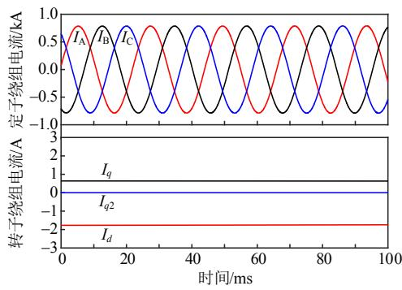  
图4 定转子电流  
Fig. 4 Stator current and rotor current

此外，特征根分析也可以用来计算系统的动态性能，验证虚拟阻抗对系统的影响。首先将发电机模型的电压磁链方程进行整理，表示成状态空间表达式的形式，状态变量为各个绕组的电流 i。

$$
\frac {\mathrm {d} \boldsymbol {i}}{\mathrm {d} t} = \left[ \begin{array}{l l} \boldsymbol {A} _ {1 1} & \boldsymbol {A} _ {1 2} \\ \boldsymbol {A} _ {2 1} & \boldsymbol {A} _ {2 2} \end{array} \right] \left[ \begin{array}{l} \boldsymbol {i} _ {\mathrm {a b c}} \\ \boldsymbol {i} _ {d q} \end{array} \right] + \left[ \begin{array}{l l l l} \boldsymbol {B} _ {1 1} & \boldsymbol {B} _ {1 2} & & \\ \boldsymbol {B} _ {2 1} & \boldsymbol {B} _ {2 2} & & \\ & & \boldsymbol {B} _ {3 3} & \boldsymbol {B} _ {3 4} \\ & & \boldsymbol {B} _ {4 3} & \boldsymbol {B} _ {4 4} \end{array} \right] \left[ \begin{array}{l} \frac {\mathrm {d} \boldsymbol {\lambda} _ {\mathrm {a b c m}}}{\mathrm {d} t} \\ \frac {\mathrm {d} \boldsymbol {\lambda} _ {d q \mathrm {m}}}{\mathrm {d} t} \\ \boldsymbol {u} _ {\mathrm {a b c}} \\ \boldsymbol {u} _ {d q} \end{array} \right] \tag {39}
$$

可整理出状态空间系统矩阵A的4个子矩阵方程分别为

$$
\left\{ \begin{array}{l} A _ {1 1} = \left(L _ {\mathrm {s s}} - L _ {\mathrm {s r}} L _ {\mathrm {r r}} ^ {- 1} L _ {\mathrm {r s}}\right) ^ {- 1} \left(- r _ {\mathrm {s}} - \frac {\mathrm {d} L _ {\mathrm {s s}}}{\mathrm {d} t} + L _ {\mathrm {s r}} L _ {\mathrm {r r}} ^ {- 1} \frac {\mathrm {d} L _ {\mathrm {r s}}}{\mathrm {d} t}\right) \\ A _ {1 2} = \left(L _ {\mathrm {s s}} - L _ {\mathrm {s r}} L _ {\mathrm {r r}} ^ {- 1} L _ {\mathrm {r s}}\right) ^ {- 1} \cdot \\ \left(- L _ {\mathrm {s r}} L _ {\mathrm {r r}} ^ {- 1} r _ {\mathrm {r}} + \frac {\mathrm {d} L _ {\mathrm {s r}}}{\mathrm {d} t} - L _ {\mathrm {s r}} L _ {\mathrm {r r}} ^ {- 1} \frac {\mathrm {d} L _ {\mathrm {r r}}}{\mathrm {d} t}\right) \\ A _ {2 1} = \left(L _ {\mathrm {r r}} - L _ {\mathrm {r s}} L _ {\mathrm {s s}} ^ {- 1} L _ {\mathrm {s r}}\right) ^ {- 1} \cdot \\ \left(- L _ {\mathrm {r s}} L _ {\mathrm {s s}} ^ {- 1} r _ {\mathrm {s}} - L _ {\mathrm {r s}} L _ {\mathrm {s s}} ^ {- 1} \frac {\mathrm {d} L _ {\mathrm {s s}}}{\mathrm {d} t} + \frac {\mathrm {d} L _ {\mathrm {r s}}}{\mathrm {d} t}\right) \\ A _ {2 2} = \left(L _ {\mathrm {r r}} - L _ {\mathrm {r s}} L _ {\mathrm {s s}} ^ {- 1} L _ {\mathrm {s r}}\right) ^ {- 1} \left(- r _ {\mathrm {r}} + L _ {\mathrm {r s}} L _ {\mathrm {s s}} ^ {- 1} \frac {\mathrm {d} L _ {\mathrm {s r}}}{\mathrm {d} t} - \frac {\mathrm {d} L _ {\mathrm {r r}}}{\mathrm {d} t}\right) \end{array} \right. \tag {40}
$$

补偿虚拟阻抗之后在转子侧相当于多了一个绕组，系统矩阵 A 由 5×5 增加到 6×6。代入 4 节中给出的永磁同步电机参数可计算出系统矩阵 A的特征根。如表 1 所示。

表1 系统矩阵A 特征根  
Table 1 The eigenvalue of system matrix   

<table><tr><td>模型</td><td>PD 模型</td><td>恒导纳模型</td></tr><tr><td>特征根1</td><td>0.334 34</td><td>0.334 37</td></tr><tr><td>特征根2</td><td>-1.081</td><td>-1.081</td></tr><tr><td>特征根3</td><td>-8.803</td><td>-8.803</td></tr><tr><td>特征根4</td><td>-75.94</td><td>-75.94</td></tr><tr><td>特征根5</td><td>-254.72</td><td>-254.68</td></tr><tr><td>特征根6</td><td>—</td><td>-7831.1</td></tr></table>

系统矩阵特征根代表系统在 s域的极点，靠近虚轴的主导极点决定系统的动态性能，换而言之系统矩阵 A 最靠近虚轴的特征根决定系统的动态性能。比主导极点实部大 6 倍以上的其他零极点影响均可忽略[46]。

添加虚拟阻抗仅在离虚轴非常远的位置添加1 个闭环极点，对其他极点的位置几乎没有影响。主导极点的实部几乎没有变化，因此添加补偿对系统的影响非常小，可以忽略不记。

# 3 永磁直驱机组恒导纳模型

# 3.1 PMSG 模块交互

传统永磁直驱风力发电机组由风力机、发电机、机网侧换流器及控制部分组成，电路上还包括平波电抗、直流侧电容、LC 滤波器等元件。每个模块都有不同的作用，风力机捕获风能，将风能转换为发电机转子动能。发电机将动能转换为三相电源输出，机网侧换流器将发电机产生的交流电进行整流逆变和传输。

PMSG 模型也是按照不同的模块搭建整体的模型。其中风力机模块输入量为当前风速，输出量为风力机捕获的机械功率。发电机模块输入当前机械功率，输出当前转子转速、电磁转矩等参数，并与换流器模块存在电气接口。换流器模块输入量为12 个电力电子开关的驱动信号，并与外部网络和发电机存在电气连接。机侧控制采用零 d 轴电流控制与最优转矩控制；网侧控制采用定直流电压控制与定交流电压控制。

换流器机侧通过平波电抗与发电机相连接，直流侧通过电容连接上下桥臂，网侧通过 LC 滤波器与电网相连接，电感和电容采用梯形积分法离散。电网等效为有内阻的电压源，同样采用梯形积分法离散。

风力发电机组拓扑结构展开后如图 5 所示。机组共计 14 个节点，28 条支路，黑色为节点，红色为支路。除发电机支路电压电流方向特别指定之外，其他支路离散电源方向皆与电路给定方向相反。

对每个节点应用 KCL 方程并整理可以写出PMSG的节点导纳公式：

$$
\left\{ \begin{array}{l} \boldsymbol {Y} \boldsymbol {u} _ {\mathrm {n}} (t) = \boldsymbol {i} _ {\mathrm {h}} (t) \\ \boldsymbol {u} _ {\mathrm {n}} (t) = \boldsymbol {Y} ^ {- 1} \boldsymbol {i} _ {\mathrm {h}} (t) \end{array} \right. \tag {41}
$$

$$
\boldsymbol {u} _ {\mathrm {n}} = \left[ \begin{array}{c} u _ {1} \\ u _ {2} \\ \vdots \\ u _ {1 4} \end{array} \right] \tag {42}
$$

由于导纳矩阵固定，在模型计算前进行一次矩阵求逆预处理并输入，每个步长调用计算即可。高阶矩阵求逆计算转换为矩阵乘法的线性运算，大大减少仿真时的计算量。

# 3.2 PMSG 算法逻辑

在进行模型搭建和应用时需要考虑 PMSG 模块的算法逻辑问题。程序的一次电路部分中，历史

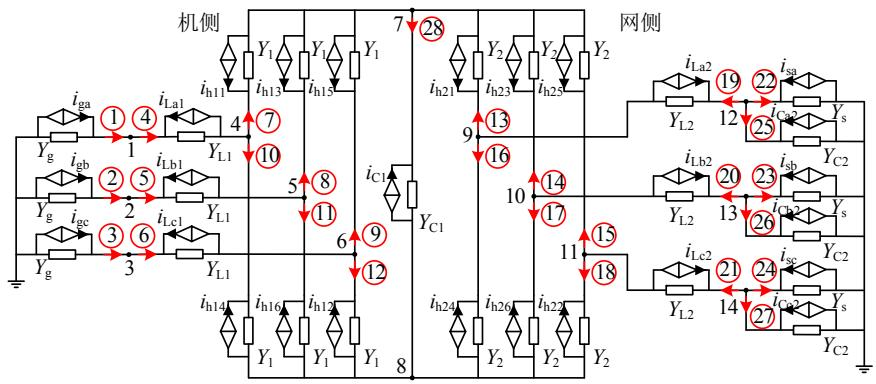  
图5 永磁直驱风力发电机组的离散化电路模型  
Fig. 5 Discretized circuit model of PMSG

电流源 ${ i _ { \mathrm { h } } } ( t )$ 计算需要上一步长的电压电流量与当前步长的转子角θ。电机暂态过程中转速变化量很小，可用上一步长的机械转矩和电磁转矩预测当前步长的转子转速，再用转速计算转子角，预测公式如下：

$$
\left\{ \begin{array}{l} \frac {\mathrm {d} \omega (t - \Delta t)}{\mathrm {d} t} = \frac {P}{J} \left(T _ {\mathrm {m}} - T _ {\mathrm {e}} (t - \Delta t)\right) \\ \omega (t) \approx \omega (t - \Delta t) + \Delta t \frac {\mathrm {d} \omega (t - \Delta t)}{\mathrm {d} t} \end{array} \right. \tag {43}
$$

计算出历史电流源 ${ i _ { \mathrm { h } } } ( t )$ 后用导纳矩阵计算当前步长的节点电压，随后计算当前步长支路电流，最后更新历史电流源。

程序的二次控制部分中，网侧控制需要通过锁相环、派克变换和内外环控制最后得到触发脉冲；机侧则不需要锁相环，发电机模块可以输出转子角0。电磁暂态算法逻辑如图6所示。

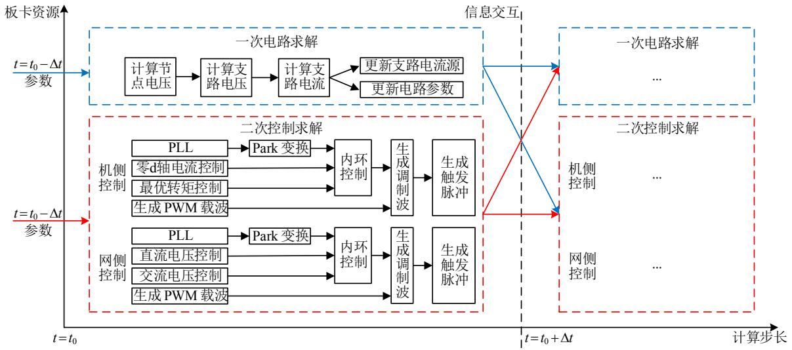  
图6 永磁直驱风力发电机组的电磁暂态算法逻辑  
Fig. 6 Electromagnetic transient logic of PMSG

# 4 仿真验证

# 4.1 仿真系统

为了测试所提发电机单机恒导纳模型和PMSG机组恒导纳模型在暂态工况下的精度，本文在Matlab 平台上分别对发电机单机接负载和 PMSG完整机组接负载两种情况下的对称及不对称故障进行仿真实验，对比其他未经简化的发电机模型的响应情况。

设置仿真步长为 10 μs，仿真系统参数如表 2所示。

表 2 永磁同步发电机参数  
Table 2 The parameters of the PMSG   

<table><tr><td>参数</td><td>数值</td><td>参数</td><td>数值</td></tr><tr><td>额定转速/(r/min)</td><td>225</td><td>定子绕组电阻/pu</td><td>0.0017</td></tr><tr><td>额定机械转矩/(kN·m)</td><td>84.88</td><td>定子绕组漏抗/pu</td><td>0.0364</td></tr><tr><td>额定定子频率/Hz</td><td>30</td><td>d轴同步电抗/pu</td><td>0.55</td></tr><tr><td>额定定子电流有效值/A</td><td>1673.5</td><td>q轴同步电抗/pu</td><td>1.11</td></tr><tr><td>额定转子磁链有效值/Wb</td><td>2.11</td><td>d轴阻尼绕组电阻/pu</td><td>0.055</td></tr><tr><td>额定线电压有效值/V</td><td>690</td><td>q轴阻尼绕组电阻/pu</td><td>0.183</td></tr><tr><td>额定相电压有效值/V</td><td>398.4</td><td>d轴阻尼绕组电抗/pu</td><td>0.62</td></tr><tr><td>极对数</td><td>8</td><td>q轴阻尼绕组电抗/pu</td><td>1.175</td></tr></table>

注：发电机型号为 WT2000-D103。

# 4.2 发电机恒导纳模型

发电机恒导纳模型结构为发电机机侧不经过换流器，直接并入网络，机端接阻感性负载。

# 4.2.1 稳态及小扰动

仿真实验的切负荷扰动为机端负荷参数突然减至一半，扰动发生时间为 0.02s，持续时间为 0.1s。其中稳态正常运行与突然单机切负荷波形如图 7所示。

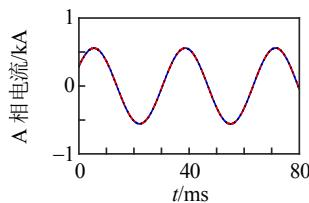  
(a) 稳态下机端 A 相电流

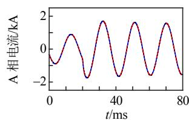  
(b) 切负荷时机端 A 相电流

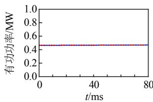  
(c) 稳态下机端有功功率

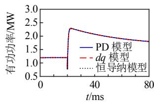  
(d) 切负荷时机端有功功率   
图7 单机接负载的稳态及小扰动波形图  
Fig. 7 Steady state and load shedding waveform diagram of generator

图 7(a)、(c)分别为发电机稳态运行情况下机端A相电流和发电机有功功率；图 7(b)、(d)分别为发电机突然切负荷情况下机端 A 相电流和发电机有功功率。

由于没有换流器的机侧控制，发电机输出功率受到负荷影响，无法保持在额定情况下运行。在切负荷时输出功率会有变化，最后稳定在下一个平衡点下。由曲线可以看出在稳态和小扰动时采用虚拟阻抗补偿的发电机模型仿真精度较高，与未经过近似的精确模型仿真结果拟合程度较高。

# 4.2.2 对称及不对称故障

仿真实验的对称故障设置为机端三相短路接地和 A 相单相短路接地故障。故障发生时间为0.01s，故障持续时间为 0.1s。其中对称及不对称短路故障波形如图 8 所示。

图 8(a)、(e)分别为 A 相单相短路接地的 A 相电流和电磁转矩，图 8(c)、(g)分别为两图中曲线放大；图 8(b)、(f)分别为三相短路接地的 A相电流和电磁转矩，图 8(d)、(h)分别为两图中曲线放大。

由图 8 可知，在单相短路接地和三相短路接地

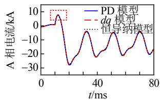  
(a) 单相短路接地 A 相电流

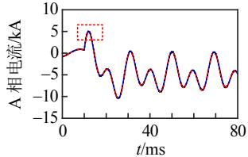  
(b) 三相短路接地 A 相电流

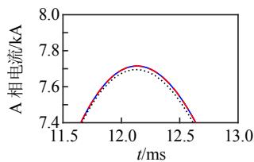  
(c) 图(a)中红框放大

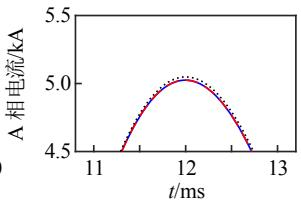  
(d) 图(b)中红框放大

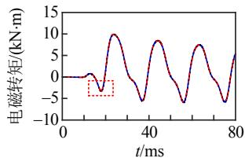  
(e) 单相短路接地电磁转矩

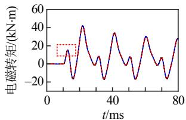  
(f) 三相短路接地电磁转矩

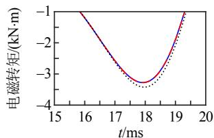  
(g) 图(e)中红框放大

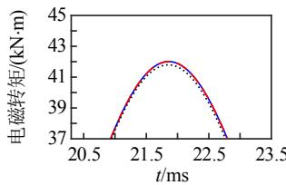  
(h) 图(f)中红框放大  
图8 单机接负载的故障波形图  
Fig. 8 Fault waveform diagram of generator

的故障中，采用虚拟阻抗补偿的发电机模型仍然有较高的仿真精度。与 PD模型和 dq 模型等未经过计算近似的精确仿真模型相比，误差不超过 1%的数量级。

# 4.3 PMSG 恒导纳模型

# 4.3.1 稳态及小扰动

本节测试发电机经过换流器并网的完整PMSG机组在稳态运行和机端切负荷情况下的波形。仿真实验的切负荷扰动为机端突然切一半负荷，扰动发生时间为 0.01s，持续时间为 0.1s。其中稳态正常运行与突然单机切负荷波形如图 9所示。

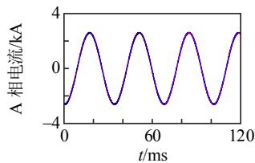  
(a) 稳态下机端 A 相电流

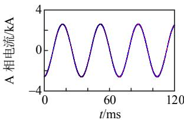  
(b) 切负荷时机端 A 相电流

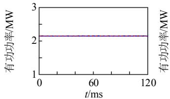  
(c) 稳态下机端有功功率

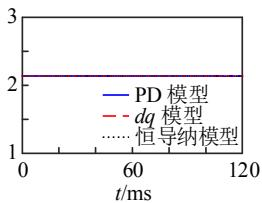  
(d) 切负荷时机端有功功率   
图 9 单机接负载的稳态及小扰动波形图  
Fig. 9 Steady state and load shedding waveform diagram of generator

图 9(a)、(c)分别为发电机稳态运行情况下机端A相电流和发电机有功功率；图 9(b)、(d)分别为发电机突然切负荷情况下机端 A 相电流和发电机有功功率。

完整 PMSG机组由于存在换流器的控制，网侧对机侧的影响较小，发电机运行状态基本不受负荷波动的影响。在切负荷时输出功率基本不会有变化。由曲线可以看出在稳态和小扰动时采用虚拟阻抗补偿的发电机模型仿真精度较高，与未经过近似的精确模型仿真结果拟合程度较高。

# 4.3.2 对称及不对称故障

由于在实际工程中发电机安置在塔架上，换流器安置在塔架附近，因此发电机机端出现故障的概率非常小，故障多发生在换流器网侧出口端线路上。该仿真实验的故障设置在换流器网侧出口端，发生 A相单相短路接地和三相短路接地故障。故障发生时间为 0.02s，故障持续时间为 0.1s。其中对称及不对称短路故障波形如图 10 所示。

图 10(a)、(c)分别为换流器网侧发生 A 相单相短路接地时，发电机机端 A相电流和发电机有功功

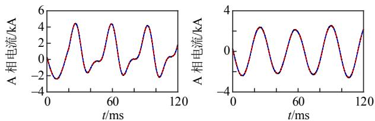  
(a) 单相短路接地机端 A 相电流  
(b) 三相短路接地机端 A 相电流

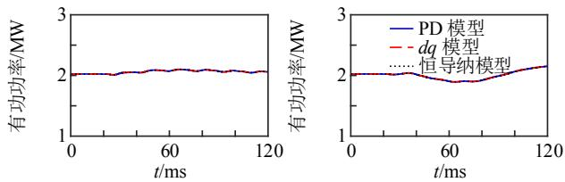  
(c) 单相短路接地发电机有功   
(d) 三相短路接地发电机有功   
图10 PMSG接负载的故障波形图  
Fig. 10 Fault waveform diagram of PMSG

率；图 10(b)、(d)分别为换流器网侧发生三相短路接地时，发电机机端 A相电流和发电机有功功率。

由图 10 可知，当 PMSG 换流器网侧发生故障时，由于换流器存在整流和逆变环节，网侧的故障对机侧影响相对较小，发电机曲线波动和畸变很小。同时在这种情况下采用虚拟阻抗补偿的发电机模型仍然有较高的仿真精度，与 PD模型、dq 模型仿真结果拟合程度较高。

# 4.4 结果分析

仿真误差及仿真时间如表 3 所示，其中仿真误差采用的是 A相电流误差，仿真时间采用恒导纳模型仿真时间占 PD模型仿真时间占比。

表3 模型结果分析  
Table 3 Model results analysis   

<table><tr><td>模型</td><td>故障类型</td><td>误差/%</td><td>时间占比/%</td></tr><tr><td rowspan="4">发电机仿真</td><td>稳态</td><td>0.0017</td><td>56.235</td></tr><tr><td>小扰动</td><td>0.0120</td><td>56.117</td></tr><tr><td>不对称故障</td><td>0.3329</td><td>57.038</td></tr><tr><td>对称故障</td><td>2.3461</td><td>60.317</td></tr><tr><td rowspan="4">PMSG仿真</td><td>稳态</td><td>0.0015</td><td>47.536</td></tr><tr><td>小扰动</td><td>0.0090</td><td>48.742</td></tr><tr><td>不对称故障</td><td>0.0247</td><td>48.310</td></tr><tr><td>对称故障</td><td>0.0469</td><td>49.582</td></tr></table>

采用 PD 模型的仿真在每个步长需要进行节点导纳矩阵的求逆，随着阶数的增加需要占用更多计算资源[47]，若采用恒导纳模型则只需要在第 1个步长对节点导纳矩阵求逆 1 次，后面每个步长调用即可，能够节省大量仿真资源。

在单个发电机组的稳态、小扰动及故障电磁暂态仿真时，采用恒导纳模型仿真时间平均占 PD 模型仿真时间的 57%，即 PD模型有 43%的运算时间和运算资源都用在对节点导纳矩阵的逐步长求逆。

同理，在完整永磁直驱机组的稳态、小扰动及故障仿真时，恒导纳模型平均节约的时间达到了52%。这是由于完整模型节点导纳矩阵阶数更多，求逆的时间也更多，所提模型节省时间也更多。

# 5 结论

本文通过在发电机转子侧补偿虚拟阻抗的方式将发电机导纳矩阵恒定，结合换流器的 ADC 模型，提出一种 PMSG机组的恒导纳模型；并且针对暂态误差最小设置虚拟阻抗参数优化方法。通过与PD 模型、dq 模型等发电机精确模型进行仿真对比得到以下结论：

1）本文所提发电机恒导纳模型在离散仿真计算时能将每个步长动态变化的导纳矩阵固定下来，在每次仿真前预处理，每个步长调用即可。  
2）通过结合换流器的恒导纳模型，可建立起整个 PMSG 风力发电机的恒导纳模型并进行电磁暂态计算，能够节省大量仿真资源。  
3）通过特征根分析和仿真验证，证明添加的虚拟阻抗对发电机模型动态性能的影响很小。特征根分析证明了添加虚拟阻抗在频域下添加了一个离虚轴极远的闭环极点，该极点与虚轴的距离是主导极点距离的数万倍；并且主导极点在频域下的距离基本没有改变。仿真验证证明了在对称及不对称故障下该模型与精确模型的拟合程度较高。  
4）通过与其他数学模型的仿真验证，证明采用恒导纳模型能大幅度减少仿真的运行时间、节省大量仿真资源。在仿真单个发电机稳态、小扰动及暂态故障时，平均能节省 43%的运行时间和仿真资源，仿真完整永磁同步机组时效果更好，能减少50%以上。

本文所提模型可以用在大规模风场实时仿真程序中，风场规模越大，节省的计算资源越多。并且所提模型可用于如FPGA等离散化并行硬件仿真平台上，具有良好的适用性。但是虚拟阻抗的参数需要根据不同的发电机参数进行调整。

# 参考文献

[1] 田世明，栾文鹏，张东霞，等．能源互联网技术形态与关键技术[J]．中国电机工程学报，2015，35(14)：3482-3494  
TIAN Shiming，LUAN Wenpeng，ZHANG Dongxia，et al ． Technical forms and key technologies on energy internet[J]．Proceedings of the CSEE，2015，35(14)： 3482-3494 (in Chinese)   
[2] 张显，史连军．中国电力市场未来研究方向及关键技术[J]．电力系统自动化，2020，44(16)：1-11．  
ZHANG Xian，SHI Lianjun．Future research areas and key technologies of electricity market in China[J]．Automation of Electric Power Systems， 2020 ， 44(16) ： 1-11 (in Chinese)   
[3] WU Enbang，GUO Zheng．The effects of clean energy development on China's carbon dioxide emissions control[C]//2018 IEEE International Conference on Smart Energy Grid Engineering．Oshawa，ON，Canada：IEEE， 2018   
[4] 陈振宇．大型风力发电系统多目标优化控制研究[D]北京：华北电力大学，2018

CHEN Zhenyu ． Research on wind turbine generator system multi-objective optimization control[D]．Beijing： North China Electric Power University ， 2018 (in Chinese)．   
[5] 舒印彪，张智刚，郭剑波，等．新能源消纳关键因素分析及解决措施研究[J]．中国电机工程学报，2017，37(1)：1-8  
SHU Yinbiao，ZHANG Zhigang，GUO Jianbo，et al Study on key factors and solution of renewable energy accommodation[J]．Proceedings of the CSEE，2017， 37(1)：1-8 (in Chinese)   
[6] FEMIN V，PETRA I，MATHEW S，et al．Econoenvironmental dispatch solutions for power systems integrated with renewable energy resources[C]//2020 International Conference and Utility Exhibition on Energy ，Environment and Climate Change (ICUE) Pattaya，Thailand：IEEE，2020：1-7   
[7] MIAO Lu，GAO Haixiang，YI Yang，et al．Influence of off-shore wind farm on power system small-signal stability[C]//2019 IEEE 8th International Conference on Advanced Power System Automation and Protection Xi'an，China：IEEE，2019   
[8] MARTI J R，LOUIE K W，A phase-domain synchronous generator model including saturation effects[J]． IEEE Transactions on Power Systems，1997，12(1)：222-229   
[9] RAFIAN M ， LAUGHTON M A ． Determination ofsynchronous-machine phase-co-ordinate parameters [J]Proceedings of the Institution of Electrical Engineers，1976，123(8)：818-824  
[10] BRANDWAJN V．Synchronous generator models for the simulation of electromagnetic transients[D]．Vancouver： University of British Columbia，1977   
[11] LAUW H K，SCCOTT MEYER W．Universal machine modeling for the representation of rotating electric machinery in an electromagnetic transients program [J] IEEE Transactions on Power Apparatus and Systems， 1982，PAS-101(6)：1342-1351   
[12] GOLE A M，MENZIES R W，TURANLI H M，et al Improved interfacing of electrical machine models to electromagnetic transients programs[J]．IEEE Transactions on Power Apparatus and Systems，1984，PAS-103(9)： 2446-2451   
[13] WANG Liwei ， JATSKEVICH J ． A voltage-behind-reactance synchronous machine model for the EMTP-typesolution[J]．IEEE Transactions on Power Systems，2006，21(4)：1539-1549  
[14] DOMMEL H W，EMTP theory book，microtran powersystem analysis corporation[M] ． Vancouver ： BritishColumbia，1992  
[15] Simulink Dynamic System Simulation Software—Users

Manual，MathWorks，Natick，MA，2012  
[16] WASYNCZUK O，SUDHOFF S D．Automated state model generation algorithm for power circuits and systems[J]．IEEE Transactions on Power Systems，1996， 11(4)：1951-1956   
[17] CAO Xianglin，KURITA A，MITSUMA H，et al Improvements of numerical stability of electromagnetic transient simulation by use of phase-domain synchronous machine models[J]．Electrical Engineering in Japan， 1999，128(3)：53-62   
[18] DEHKORDI A B，GOLE A M，MAGUIRE T L Permanent magnet synchronous machine model for real-time simulation[C]//International Conference on Power Systems Transients．Montreal，Canada：IEEE， 2005   
[19] HOLLMAN J A ， MARTI J R ． Real time networksimulation with PC-Cluster[J] ． IEEE Transactions onPower Systems，2003，18(2)：563-569．  
[20] WANG Liwei，JATSKEVICH J，DINAVAHI V，et al Methods of interfacing rotating machine models in transient simulation programs[J]．IEEE Transactions on Power Delivery，2010，25(2)：891-903   
[21] 徐晋，汪可友，李国杰，等．基于响应匹配的电力电子换流器恒导纳建模[J]．中国电机工程学报，2019，39(13)：3879-3888XU Jin，WANG Keyou，LI Guojie，et al．Fixed-admittancemodeling of power electronic converters usingresponse-matching technique[J] ． Proceedings of theCSEE，2019，39(13)：3879-3888(in Chinese)  
[22] 曹阳，顾伟，柳伟，等．基于交叉初始化的换流器参数 化恒导纳模型[J]．中国电机工程学报，2021，41(10)： 3518-3527 CAO Yang，GU Wei，LIU Wei，et al．A parameterized fixed-admittance model of converters based on cross initialization[J]．Proceedings of the CSEE．2021，41(10)： 3518-3527 (in Chinese)   
[23] CHAPARIHA M，WANG Liwei，JATSKEVICH J，et al Constant-parameter RL-branch equivalent circuit for interfacing AC machine models in state-variable-based simulation packages[J]．IEEE Transactions on Energy Conversion，2012，27(3)：634-645   
[24] HUI S Y R，CHRISTOPOULOS C．A discrete approach to the modeling of power electronic switching networks [J] IEEE Transactions on Power Electronics，1990，5(4)： 398-403   
[25] 侯延琦，刘崇茹，王鑫艳，等．IGBT开关模块的附加支路恒导纳模型[J]．中国电机工程学报，2023，43(6)：2381-2391HOU Yanqi，LIU Chongru，WANG Xinyan，et alAdditional-branches fixed-admittance model of IGBT

switching module[J]．Proceedings of the CSEE，2023，43(6)：2381-2391 (in Chinese)  
[26] 侯延琦，刘崇茹，郑乐，等．基于负电阻补偿的 VSC恒导纳建模方法[J]．中国电机工程学报，2022，42(19)：6985-6994HOU Yanqi ， LIU Chongru ， ZHENG Le ， et alFixed-admittance modeling method of voltage sourceconverter based on compensation of negative resistance[J]．Proceedings of the CSEE，2022，42(19)：6985-6994(in Chinese)  
[27] WU Bin，LANG Yongqiang，ZARGARI N，et al．Power conversion and control of wind energy systems [M] Piscataway：John Wiley & Sons，2011   
[28] 徐晋，汪可友，李国杰．电力电子设备及含电力电子设备电力系统实时仿真研究综述[J]．电力系统自动化，2022，46(10)：3-17XU Jin，WANG Keyou，LI Guojie．Review of real-timesimulation of power electronic devices and power systemsintegrated with power electronic devices[J]．Automationof Electric Power Systems ，2022 ， 46(10)： 3-17 (inChinese)  
[29] MUTHUMUNI D，MCLAREN P G，DIRKS E，et al A synchronous machine model to analyze internal faults[C]//Conference Record of the 2001 IEEE Industry Applications Conference ． Thirty-Sixth IAS Annual Meeting 2001．Chicago，IL，USA：IEEE，2001   
[30] SUBRAMANIAM P，MALIK O P．Digital simulation of a synchronous generator in direct-phase quantities [J] Proceedings of the Institution of Electrical Engineers， 1971，118(1)：153-160   
[31] WANG Liwei，JATSKEVICH J，DINAVAHI V，et al， Methods of interfacing rotating machine models in transient simulation programs[J]．IEEE Transactions on Power Delivery，2010，25(2)：891-903   
[32] PEKAREK S D，WASYNCZUK O，HEGNER H J．An efficient and accurate model for the simulation and analysis of synchronous machine/converter systems [J] IEEE Transactions on Energy Conversion，1998，13(1)： 42-48   
[33] WANG Liwei，JATSKEVICH J，DOMMEL H W，Re-examination of synchronous machine modelingtechniques for electromagnetic transient simulations [J]IEEE Transactions on Power Systems，2007，22(3)：1221-1230  
[34] New S M ． Model from Tokyo Electric[EB/OL] http://www.jaug.jp/~atp/index-e.htm   
[35] SANGIOVANNI-VINCENTELLI A，CHEN L K，CHUAL O．A new tearing approach-node tearing nodal analysis[C]//IEEE International Symposium on Circuits andSystems．IEEE，1977：143-147

[36] TOMIM M A，MARTÍ J R，DE RYBEL T，et al．MATE network tearing techniques for multiprocessor solution of large power system networks[C]//IEEE PES General Meeting．Minneapolis，MN，USA：IEEE，2010   
[37] MARTÍ J R，LINARES L R，HOLLMAN J A，et al OVNI：Integrated software/hardware solution for real-time simulation of large power systems [C]//Proceedings of the 14th PSCC．Sevilla，2002，2：1-7   
[38] CHAN K W．Parallel algorithms for direct solution of large sparse power system matrix equations[J] ． IEE Proceedings-Generation，Transmission and Distribution， 2001，148(6)：615-622   
[39] KRON G．A method to solve very large physical systems in easy stages[J]．Transactions of the IRE Professional Group on Circuit Theory，1953，PGCT-2：71-90   
[40] TOMIM M A．Parallel computation of large power system networks using the multi-area Thévenin equivalents [D] Vancouver：The University of British Columbia，2009   
[41] KRON G．Diakoptics：piecewise solution of large-scale systems[M]．London：Macdonald & Co，1963   
[42] MARTI J R，LINARES L R，CALVINO J，et al．OVNI： an object approach to real-time power system simulators[C]//POWERCON'98 ． 1998 International Conference on Power System Technology．Proceedings (Cat．No．98EX151)．Beijing，China：IEEE，1998   
[43] KRAUSE P C，WASYNCZUK O，SUDHOFF S D Analysis of electric machinery and drive systems [M] Piscataway：IEEE Press，2002   
[44] PEKAREK S D，WALTERS E A．An accurate method of neglecting dynamic saliency of synchronous machines in power electronic based systems[J]．IEEE Transactions on

Energy Conversion，1999，14(4)：1177-1183  
[45] 汤涌．简化同步电机模型中的运动方程[J]．电网技术，2007，31(10)：28-31TANG Yong．A discussion about equations of motion ofsimplified synchronous machine models[J]．Power SystemTechnology，2007，31(10)：28-31 (in Chinese)  
[46] 胡寿松．自动控制原理[M]．4版．北京：科学出版社，2001HU Shousong．Automatic control theory[M]．4th edBeijing：Science Press，2001 (in Chinese)  
[47] 张繁，何明亮．基于 FPGA 实现快速矩阵求逆算法[J] 通信技术，2020，53(2)：318-321 ZHANG Fan，HE Mingliang．Implementation of fast matrix inversion algorithm based on FPGA [J] Communications Technology，2020，53(2)：318-321 (in Chinese)

  
史一博

在线出版日期：2023-05-15。

收稿日期：2023-03-10。

作者简介：

史一博(1998)，男，硕士研究生，主要从事永磁直驱风机与 FPGA 方向的研究工作，Shi_YB_prc@qq.com；

* 通信作者：刘崇茹(1977)，女，博士，教授，博士生导师，主要从事交直流混合系统分析与仿真、运行与控制等方向的研究工作，chongru.liu@ncepu.edu.cn。

(实习编辑 李璇)

# Fixed-admittance Modeling Method of PMSG Based on Compensation of Impedance

SHI Yibo, LIU Chongru*

( State Key Laboratory of Alternate Electrical Power System with Renewable Energy Sources

(North China Electric Power University)

KEY WORDS: fixed-admittance model; compensation of impedance; permanent magnet synchronous generator

The permanent magnet generator system has gradually become the mainstream of wind power generation, which has a complex structure and a large number of nodes. In the real-time electromagnetic transient simulation, if the traditional modeling method is used, the calculation of the system admittance matrix

will be too complicated, resulting in a serious limitation of the simulation scale.

Therefore, this paper proposes a fixed-admittance modeling method of permanent magnet synchronous generator (PMSG) based on virtual impedance compensation, as shown in Fig. 1.

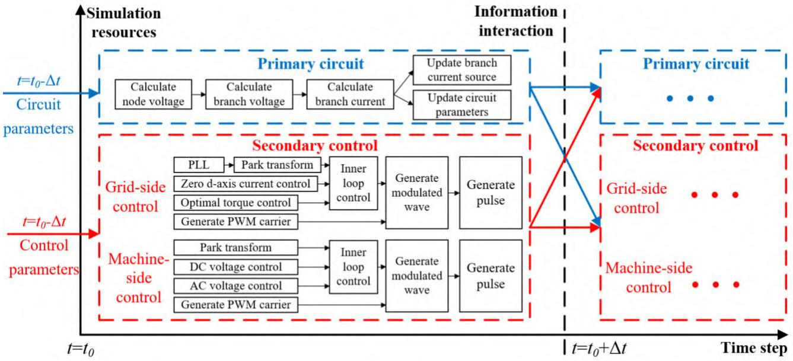  
Fig. 1 Electromagnetic transient logic of PMSG

Traditional permanent magnet direct drive wind turbine generator is composed of wind turbine, generator, grid side converter, grid side filter and control part. In transient simulation calculations, the ADC model enables the conductance matrix of the converter to be kept constant. If the conductance matrix of the generator is fixed in some way, the conductance matrix of the entire wind turbine is fixed, facilitating the creation and simulation of the transient model.

The mathematical modelling reveals that there are time-varying variables in the generator's admittance matrix. In order to be able to compensate for the dynamic changes in the generator impedance matrix, a virtual impedance $Z _ { \mathrm { l Q } 2 }$ is added to the calculation, which eliminates the time-varying part of the admittance matrix

by giving the parameters of the virtual impedance $Z _ { \mathrm { l Q } 2 }$ . The compensated generator model has similar machine parameters, a fixed admittance matrix and slightly different damping characteristics compared to the original generator model.

The virtual impedance $Z _ { \mathrm { l Q } 2 }$ are optimized with the goal of minimizing the transient error. By combining the constant admittance model of voltage source converter, a complete constant admittance model of PMSG can be established and electromagnetic transient simulation can be performed, thus saving a lot of computing resources.

Simulation experiments show that the model has high simulation accuracy, and can be used in discrete hardware simulation platforms such as FPGA, with good applicability