# 直驱风力发电单元的电磁暂态半隐式延迟解耦与仿真方法

姚蜀军，刘刚，曾子文，庞博涵，汪燕

(华北电力大学，北京市 昌平区 102206)

# Electromagnetic Transient Semi-implicit Latency Decoupling and Simulation Technology for Direct-drive Wind Power Generation Unit

YAO Shujun, LIU Gang, ZENG Ziwen, PANG Bohan, WANG Yan*

(North China Electric Power University, Changping District, Beijing 102206, China)

ABSTRACT: Due to the large scale of existing wind farms, the number of wind turbines and the difficulty of modeling and simulation of wind turbines, the efficiency of electromagnetic transient simulation (EMT) of wind farms is low. In order to solve the above problems, a fine-grained decoupling and parallel simulation method for direct-drive wind power generation unit was proposed based on the semi-implicit latency decoupling (SILDP) method to realize efficient EMT of direct-drive wind power generation unit. Firstly, based on the matrix splitting principle, the direct-drive wind power generation unit was divided into several subsystems according to the state variables. The SILDP was used to decouple the time delay between different state variables of direct-drive wind power generation unit. Based on the SILDP recursive scheme, the decoupling model of direct-drive wind power generation unit was constructed, the characteristics of the model were analyzed, and the calculation sequence and process were designed. The simulation results showed that the proposed method not only improved the calculation efficiency of EMT of direct-drive wind power generation unit, but also took into account the high simulation accuracy.

KEY WORDS: wind power generation unit; direct-drive wind turbine; electromagnetic transient simulation; semi-implicit latency decoupling; parallel computing

摘要：由于现有风电场规模大，所含风机数量多，同时风机自身建模与仿真难度高，因此风电场电磁暂态仿真效率低下。针对以上问题，该文基于半隐式延迟解耦原理提出一种直驱风力发电单元的细粒度解耦与并行仿真方法，以实现直驱风力发电单元高效电磁暂态仿真。首先利用矩阵分裂原

理，按照状态变量进行分组，并将直驱风力发电单元分解为多个子系统。采用半隐式延迟解耦方法实现直驱风力发电单元不同状态变量组之间的时间延迟解耦。基于半隐式延迟解耦递推格式，构建了直驱风力发电单元的解耦模型，并分析了该模型的特点，设计了计算时序和流程。实际算例仿真结果表明，该文方法在提高直驱风力发电单元电磁暂态仿真的计算效率的基础上还兼顾了较高的仿真精度。

关键词：风力发电单元；直驱风机；电磁暂态仿真；半隐式延迟解耦；并行计算

# 0 引言

为实现我国 2030 年碳达峰、2060 年碳中和的目标，采用新能源发电是必经之路之一[1-3]。作为新能源发电的一种，风力发电具有发电成本相对较低、技术成熟的优点，能减少对环境的污染[4-6]。风电场含有大量换流器，对电网带来了诸多稳定性问题[7-9]，电磁暂态仿真是研究其动态特性的重要手段。然而，风电场中包含大量风机及电力电子设备，开关动作频繁，导致其仿真精度与效率难以兼顾。为调和风电场模型的详细程度及扩大电网仿真规模之间的矛盾，需要研究兼顾效率和准确性的风电场电磁暂态仿真方法。

风电场中的换流器一般为两电平的 VSC 换流器。针对 VSC 电磁暂态仿真详细模型效率低下的问题，文献[10]提出了 VSC 的平均值模型，该方法虽提高了电磁暂态仿真速度，但未涉及 VSC 的内部特征。文献[11]提出动态谐波域法，文献[12]提出状态空间平均法，文献[13]提出了广义状态空间平均法，文献[14-18]提出了多频段时间尺度变换法，

并建立了 VSC 换流器的多频段时间尺度变换模型。以上仿真方法均采用傅里叶变换，模型精度随着谐波阶数的增加而增加。由于硬件条件限制，实际工程为了提高计算效率，仅能考虑少数阶次谐波，导致模型的谐波截断误差大，精度难以满足要求。

文献[19]为减小仿真规模，利用分网解耦并行的方法，通过长输电线解耦分割，将大系统分解为多个小系统。但该方法需选取长度满足要求的传输线实现分网，解耦灵活性受限。文献[20-21]对系统中单个电感和电容的计算采用一步延时，实现电力电子装置不同变换级之间的解耦。该方法本质为前向欧拉法，不仅仿真精度不高，而且存在开关动作时的非状态量突变引起的数值振荡问题。文献[22]为提升仿真速度提出了指数积分法的 CPU/GPU 混合仿真算法，通过 GPU 并行计算风电场电磁暂态仿真中的高维数矩阵。文献[23]提出了细粒度电路划分方法，并利用 GPU 来实现大规模仿真计算。以上仿真方法虽通过 GPU 实现并行计算，但未涉及风力发电单元的解耦。

对风电场进行集中等值建模可以降低仿真规模提高仿真速度。文献[24]将风电场等值建模归纳为以下 3 种：单机表征法、风速分群多机等值法和机群划分多机等值法。文献[25]提出逐点聚合法，将风机排列位置与其他分群指标分开考虑，提出一种逐点消去的风机聚合法，以获取等值机的参数和完整的风电场等值模型。以上等值处理在仿真分析时拟合效果好，但是由于无法涵盖所有的运行工况以及风电场的内部故障，限制了模型适用范围，影响仿真精度[26]。此外，在实际运用中，风电场虽然可采用集中等值建模减少风机的数量，但是当大规模交直流系统中存在多个风电场时，系统中等值后的风机依然不是一个小的数目，仍然面临着如何提高风力发电单元的仿真效率问题。

文献[27]提出半隐式延迟解耦电磁暂态仿真方法(semi-implicit latency decoupling and parallelingtechnology，SILDP)并将其应用于交流电网的分网与并行。文献[28]将该方法应用到单端口子模块MMC。本文将其应用于直驱风力发电单元的高效电磁暂态仿真的研究。首先利用矩阵分裂原理，按照半隐式延迟解耦法对状态变量进行分组，从而将直驱风力发电单元分解为多个子系统。然后，对子系统间实现半步时延解耦，并给出解耦状态变量间

的递推格式，构建直驱风力发电单元的解耦模型，分析了解耦模型的特点，设计了计算时序和流程。最后在 PSCAD/EMTDC 中构建仿真算例，验证本文方法的准确性和有效性。

# 1 风电场结构及等效拓扑

# 1.1 风电场的拓扑结构

风力发电系统通过风力发电机将风能转化为风机转子动能，最后输出交流电。风力发电系统的其他部分对风机产生的交流电进行整流、逆变和传输，如图 1所示。

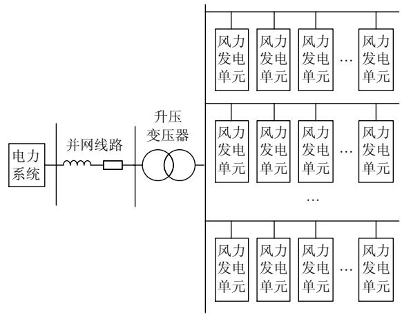  
图1 风力发电系统的拓扑结构  
Fig. 1 Topological structure of wind power generation system

# 1.2 直驱风力发电单元拓扑结构

直驱风力发电机、背靠背换流器、LC/LCL 滤波器、变压器和集电线路构成一个完整直驱风力发电单元，图 2 是直驱风力发电单元的拓扑。

文献[29]详细介绍了直驱风机的数学模型，详见附录 A。

# 2 直驱风力发电单元半隐式延迟解耦

文献[27]提出了半隐式延迟解耦法，并给出了在交流系统分网中的应用。由于该方法具有普适性，本文将其应用于直驱风力发电单元的解耦。

# 2.1 VSC 换流器的解耦方法

下面首先分析单个 VSC 换流器的解耦方法。VSC 换流器电路结构如图 3(a)所示。图 3 中， $\mathrm { T } _ { 1 } { \sim } \mathrm { T } _ { 6 }$ 为各桥臂 IGBT； $\mathrm { D } _ { 1 } { \sim } \mathrm { D } _ { 6 }$ 为各桥臂反并联二极管；$i _ { 1 } { \sim } i _ { 6 }$ 为各桥臂电流； $L _ { \mathrm { a } } , L _ { \mathrm { b } }$ 和 $L _ { \mathrm { c } }$ 为交流侧各相电感；C 为直流侧电容(不接地)； $i _ { \mathrm { a } } , ~ i _ { \mathrm { b } }$ 和 $i _ { \mathrm { c } }$ 为交流侧电流；$U _ { c }$ 为直流侧电容电压； $u _ { \mathrm { a } } , ~ u _ { \mathrm { b } }$ 和 $u _ { \mathrm { c } }$ 为交流侧输入电压； $i _ { \mathrm { d } }$ 为直流侧电流。

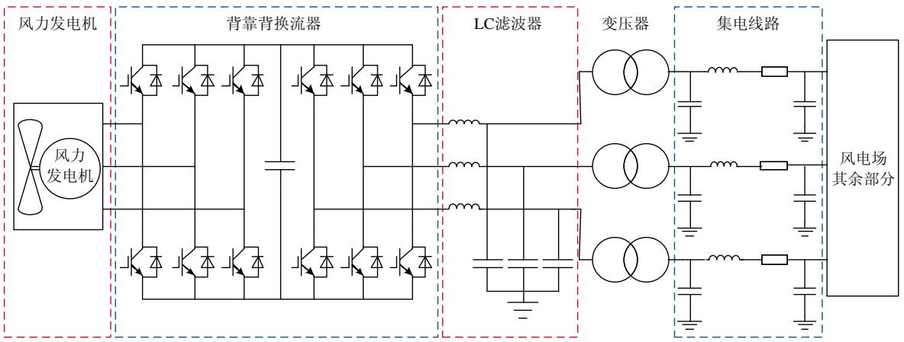  
图 2 直驱风力发电单元拓扑结构

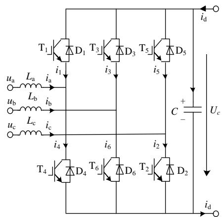  
Fig. 2 Topology of direct-drive wind power generation unit   
(a) 电路结构

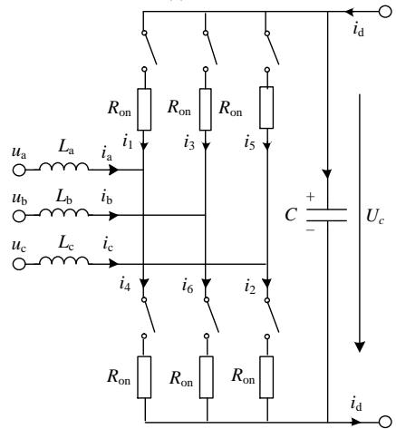  
(b) 等效电路  
图3 VSC 等效电路图  
Fig. 3 Diagram of VSC equivalent circuit diagram

每个 IGBT 与其反并联二极管构成一个开关组 IGBT//VD，引入描述开关组状态的开关函数，定义为

$$
S _ {n} = \left\{ \begin{array}{l l} 1, & \text {上 桥 臂 导 通} \\ 0, & \text {上 桥 臂 关 断} \end{array} \right. \tag {1}
$$

式中 n=a，b，c。

正常运行时，同一相的上、下桥臂交替导通，

下桥臂的开关函数可以描述为 1- ${ - } S _ { n ^ { \circ } }$ 。设每个桥臂导通电阻 $R _ { \mathrm { o n } } ~ ( R _ { \mathrm { o n } } { = } 0 . 0 1 \Omega )$ ，得到图 3(a)的计及导通损耗的开关函数等效电路，如图 3(b)所示。

根据 KVL 与 KCL，可得图 3(b)中以电感电流和电容电压为状态变量的状态方程：

$$
\left\{ \begin{array}{l} L _ {\mathrm {a}} \frac {\mathrm {d} i _ {\mathrm {a}}}{\mathrm {d} t} - L _ {\mathrm {b}} \frac {\mathrm {d} i _ {\mathrm {b}}}{\mathrm {d} t} = - R _ {\mathrm {o n}} \left(i _ {\mathrm {a}} - i _ {\mathrm {b}}\right) - \\ \quad \quad \quad \quad \quad \quad \quad \quad \quad \quad \quad \quad \quad \quad \quad \quad \quad \quad \quad \quad \quad \quad \quad \quad \quad \quad \quad \left(S _ {\mathrm {a}} - S _ {\mathrm {b}}\right) U _ {\mathrm {c}} + \left(u _ {\mathrm {a}} - u _ {\mathrm {b}}\right) \\ L _ {\mathrm {b}} \frac {\mathrm {d} i _ {\mathrm {b}}}{\mathrm {d} t} - L _ {\mathrm {c}} \frac {\mathrm {d} i _ {\mathrm {c}}}{\mathrm {d} t} = - R _ {\mathrm {o n}} \left(i _ {\mathrm {b}} - i _ {\mathrm {c}}\right) - \\ \quad \quad \quad \quad \quad \quad \quad \quad \quad \quad \quad \quad \quad \quad \quad \quad \quad \left(S _ {\mathrm {b}} - S _ {\mathrm {c}}\right) U _ {\mathrm {c}} + \left(u _ {\mathrm {b}} - u _ {\mathrm {c}}\right) \\ L _ {\mathrm {c}} \frac {\mathrm {d} i _ {\mathrm {c}}}{\mathrm {d} t} - L _ {\mathrm {a}} \frac {\mathrm {d} i _ {\mathrm {a}}}{\mathrm {d} t} = - R _ {\mathrm {o n}} \left(i _ {\mathrm {c}} - i _ {\mathrm {a}}\right) - \\ \quad \quad \quad \quad \quad \quad \quad \quad \quad \quad \quad \quad \quad \left(S _ {\mathrm {c}} - S _ {\mathrm {a}}\right) U _ {\mathrm {c}} + \left(u _ {\mathrm {c}} - u _ {\mathrm {a}}\right) \\ C \frac {\mathrm {d} U _ {\mathrm {c}}}{\mathrm {d} t} = S _ {\mathrm {a}} i _ {\mathrm {a}} + S _ {\mathrm {b}} i _ {\mathrm {b}} + S _ {\mathrm {c}} i _ {\mathrm {c}} + i _ {\mathrm {d}} \end{array} \right. (2)
$$

将式(2)写作状态空间形式为

$$
\left[ \begin{array}{c c c c} L _ {\mathrm {a}} & - L _ {\mathrm {b}} & & \\ & L _ {\mathrm {b}} & - L _ {\mathrm {c}} \\ - L _ {\mathrm {a}} & & L _ {\mathrm {c}} \\ \hline & & & C \end{array} \right] \left[ \begin{array}{c} \frac {\mathrm {d} i _ {\mathrm {a}}}{\mathrm {d} t} \\ \frac {\mathrm {d} i _ {\mathrm {b}}}{\mathrm {d} t} \\ \frac {\mathrm {d} i _ {\mathrm {c}}}{\mathrm {d} t} \\ \frac {\mathrm {d} U _ {c}}{\mathrm {d} t} \end{array} \right] =
$$

$$
\left[ \begin{array}{c c c c} - R _ {\mathrm {o n}} & R _ {\mathrm {o n}} & & - k _ {\mathrm {u a b}} \\ & - R _ {\mathrm {o n}} & R _ {\mathrm {o n}} & - k _ {\mathrm {u b c}} \\ R _ {\mathrm {o n}} & & - R _ {\mathrm {o n}} & - k _ {\mathrm {u c a}} \\ \hline k _ {\mathrm {i a}} & k _ {\mathrm {i b}} & k _ {\mathrm {i c}} & \\ \end{array} \right] \left[ \begin{array}{l} i _ {\mathrm {a}} \\ i _ {\mathrm {b}} \\ i _ {\mathrm {c}} \\ U _ {c} \end{array} \right] + \left[ \begin{array}{l} u _ {\mathrm {a}} - u _ {\mathrm {b}} \\ u _ {\mathrm {b}} - u _ {\mathrm {c}} \\ u _ {\mathrm {c}} - u _ {\mathrm {a}} \\ i _ {\mathrm {d}} \end{array} \right] \tag {3}
$$

式中： $k _ { \mathrm { u a b } } { = } S _ { \mathrm { a } } { - } S _ { \mathrm { b } } ; k _ { \mathrm { u b c } } { = } S _ { \mathrm { b } } { - } S _ { \mathrm { c } } ; k _ { \mathrm { u c a } } { = } S _ { \mathrm { c } } { - } S _ { \mathrm { a } } ; k _ { \mathrm { i a } } { = } S _ { \mathrm { a } }$ $k _ { \mathrm { i b } } { = } S _ { \mathrm { b } } ; k _ { \mathrm { i c } } { = } S _ { \mathrm { c } } \circ$ 。

根据半隐式延迟解耦法对式(3)分裂可得：

$$
\begin{array}{l} \left[ \begin{array}{c c c c} L _ {\mathrm {a}} & - L _ {\mathrm {b}} & & \\ & L _ {\mathrm {b}} & - L _ {\mathrm {c}} \\ - L _ {\mathrm {a}} & & L _ {\mathrm {c}} \\ \hline & & & C \end{array} \right] \left[ \begin{array}{c} \frac {\mathrm {d} i _ {\mathrm {a}}}{\mathrm {d} t} \\ \frac {\mathrm {d} i _ {\mathrm {b}}}{\mathrm {d} t} \\ \frac {\mathrm {d} i _ {\mathrm {c}}}{\mathrm {d} t} \\ \frac {\mathrm {d} U _ {c}}{\mathrm {d} t} \end{array} \right] = \\ \left[ \begin{array}{c c c c} - R _ {\mathrm {o n}} & R _ {\mathrm {o n}} & & \\ & - R _ {\mathrm {o n}} & R _ {\mathrm {o n}} & \\ R _ {\mathrm {o n}} & & - R _ {\mathrm {o n}} & \\ & & & \end{array} \right] \left[ \begin{array}{l} i _ {\mathrm {a}} \\ i _ {\mathrm {b}} \\ i _ {\mathrm {c}} \\ U _ {c} \end{array} \right] + \\ \left[ \begin{array}{c c c} & & - k _ {\mathrm {u a b}} \\ & & - k _ {\mathrm {u b c}} \\ & & - k _ {\mathrm {u c a}} \\ k _ {\mathrm {i a}} & k _ {\mathrm {i b}} & k _ {\mathrm {i c}} \end{array} \right] \left[ \begin{array}{l} i _ {\mathrm {a}} \\ i _ {\mathrm {b}} \\ i _ {\mathrm {c}} \\ U _ {c} \end{array} \right] + \left[ \begin{array}{l} u _ {\mathrm {a}} - u _ {\mathrm {b}} \\ u _ {\mathrm {b}} - u _ {\mathrm {c}} \\ u _ {\mathrm {c}} - u _ {\mathrm {a}} \\ i _ {\mathrm {d}} \end{array} \right] \tag {4} \\ \end{array}
$$

进一步，对式(4)进行半步时延，可得其差分方程为

$$
\begin{array}{l} \left[ \begin{array}{c c c c} L _ {\mathrm {a}} & - L _ {\mathrm {b}} & \\ & L _ {\mathrm {b}} & - L _ {\mathrm {c}} \\ - L _ {\mathrm {a}} & & L _ {\mathrm {c}} \\ \hline & & C \end{array} \right] \left[ \begin{array}{l} \left(i _ {\mathrm {a}} ^ {n + 1 / 2} - i _ {\mathrm {a}} ^ {n - 1 / 2}\right) \\ \left(i _ {\mathrm {b}} ^ {n + 1 / 2} - i _ {\mathrm {b}} ^ {n - 1 / 2}\right) \\ \left(i _ {\mathrm {c}} ^ {n + 1 / 2} - i _ {\mathrm {c}} ^ {n - 1 / 2}\right) \\ \hline \left(U _ {c} ^ {n + 1} - U _ {c} ^ {n}\right) \end{array} \right] = \\ \left[ \begin{array}{c c c c} - R _ {\mathrm {o n}} & R _ {\mathrm {o n}} & & \\ & - R _ {\mathrm {o n}} & R _ {\mathrm {o n}} & \\ R _ {\mathrm {o n}} & & - R _ {\mathrm {o n}} & \\ \dots \dots \dots \dots \dots \dots \dots \dots \dots \dots \dots \dots \dots \dots \dots \dots \dots \dots \dots \dots \dots \dots \dots \dots \dots \dots \dots \dots \dots \dots \dots \dots \dots \dots \dots \dots \dots \dots \dots \dots \dots \dots \dots \dots \dots \dots \dots \dots \dots \dots \end{array} \right] \left[ \begin{array}{l} i _ {\mathrm {a}} ^ {n + 1 / 2} + i _ {\mathrm {a}} ^ {n - 1 / 2} \\ i _ {\mathrm {b}} ^ {n + 1 / 2} + i _ {\mathrm {b}} ^ {n - 1 / 2} \\ i _ {\mathrm {c}} ^ {n + 1 / 2} + i _ {\mathrm {c}} ^ {n - 1 / 2} \\ U _ {c} ^ {n + 1} + U _ {c} ^ {n} \end{array} \right] \frac {\Delta t}{2} + \\ \left[ \begin{array}{c c c} & & - k _ {\mathrm {u a b}} \\ & & - k _ {\mathrm {u b c}} \\ & & - k _ {\mathrm {u c a}} \\ \dots \dots \dots \dots \dots \dots \dots \dots \dots \dots \dots \dots \dots \dots \dots \dots \dots \dots \dots \dots \dots \dots \dots \dots \dots \dots \dots \dots \dots \dots \dots \dots \dots \dots \dots \dots \dots \dots \dots \dots \dots \dots \dots \dots \dots \dots \dots \dots \dots \dots \end{array} \right] \left[ \begin{array}{l} i _ {\mathrm {a}} ^ {n + 1 / 2} \\ i _ {\mathrm {b}} ^ {n + 1 / 2} \\ i _ {\mathrm {c}} ^ {n + 1 / 2} \\ U _ {c} ^ {n} \end{array} \right] \Delta t + \left[ \begin{array}{l} u _ {\mathrm {a}} ^ {n} - u _ {\mathrm {b}} ^ {n} \\ u _ {\mathrm {b}} ^ {n} - u _ {\mathrm {c}} ^ {n} \\ u _ {\mathrm {c}} ^ {n} - u _ {\mathrm {a}} ^ {n} \\ i _ {\mathrm {d}} ^ {n + 1 / 2} \end{array} \right] \Delta t \tag {5} \\ \end{array}
$$

由式(5)得到电感电流和电容电压的半隐式延迟解耦递推格式，详见附录 B。

根据上述推导，可以得到 VSC 的解耦和半步时延模型，如图 4 所示。

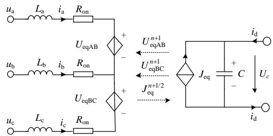  
图4 VSC 解耦电路图  
Fig. 4 VSC decoupling circuit diagram

图 4 中各受控源表达式详见附录 B.1。

# 2.2 背靠背换流器解耦方法

背靠背换流器简化电路如图 5 所示，左右两侧分别为机侧换流器和网侧换流器，相应的物理量分别用下标 k (k=1、2)表示。

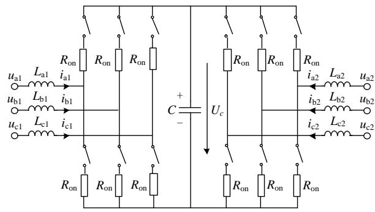  
图5 背靠背换流器等效拓扑图  
Fig. 5 equivalent circuit diagram of back-back converter

类比 2.1 节推导可得背靠背换流器的解耦和半步时延模型，如图 6 所示。

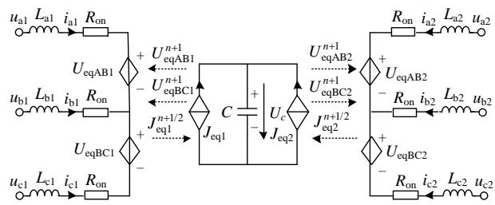  
图6 背靠背换流器解耦电路图  
Fig. 6 Decoupling circuit diagram of back-back converter

图6中各受控源和相关状态量的半隐式延迟解耦递推格式详见附录 C。

# 2.3 LC/LCL 滤波器解耦方法

LC 滤波器和与其相连的电感(或变压器)一起构成 LCL 电路，其拓扑结构如图 7所示。

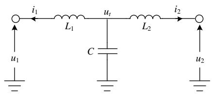  
图7 LCL 滤波器电路图  
Fig. 7 Diagram of LCL filter circuit

对LCL滤波器可用文献[27]中的T型分网组合元件进行解耦，文献[27]已给出详细推导过程，此处仅列出解耦结果。LCL 滤波器的解耦和半步时延模型如图 8所示。

相关状态量的半隐式延迟解耦递推格式详见附录 D。

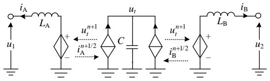  
图8 LCL 滤波器解耦电路图  
Fig. 8 Decoupling circuit diagram of LCL filter

# 2.4 集电线路解耦方法

风力发电单元内部集电线路采用π型等效电路模型，如图 9 所示。

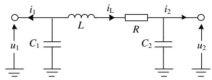  
图9 π型等效电路  
Fig. 9 π-type equivalent circuit of line

同样的，文献[27]给出了π型线路半隐式延迟解耦模型的详细推导，此处仅列出解耦结果，集电线路的解耦和半步时延模型如图 10 所示。

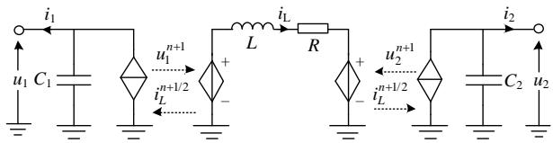  
图10 线路的π型解耦电路图  
Fig. 10 Decoupling circuit diagram of π-type line

相关状态量的半隐式延迟解耦递推格式详见附录 E。

# 2.5 直驱风力发电单元的解耦电路图

将上述直驱风力发电单元各部分解耦模型进行拼接，可以得到直驱风力发电单元的整体解耦模型，如图 11 所示。可以看到应用半隐式延迟解耦法，不仅实现了直驱风力发电单元间的解耦，而且还能实现单个发电单元内部设备之间的进一步解耦。从而将大规模风电场的电磁暂态仿真分解成多个小的子系统，既可实现系统分解从而降低计算规模，又可实现解耦子系统间的并行计算。两者能够极大提高仿真的计算效率。

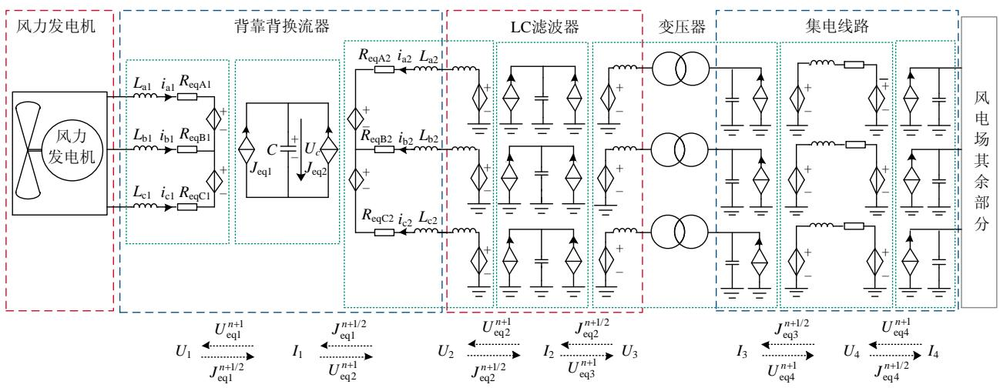  
图11 直驱风力发电单元解耦电路图  
Fig. 11 Decoupling circuit diagram of direct-drive wind power generation unit

# 3 直驱风力发电单元快速解耦并行计算方法

# 3.1 计算时序

将图 11 所示的直驱风力发电单元解耦模型的子系统按受控电压源和受控电流源分为 U 和 I 两组。仿真时交替求解两组受控源，每次求解组 U和组 I 时错开半个时步，组内各子系统并行求解。计算时序如图 12 所示。

# 3.2 计算流程

根据计算时序，可得计算步骤如下：

1）数据初始化(读输入系统数据，生成系统导

纳矩阵并进行 LU 分解，存储 IGBT 开关状态组合与受控源对应系数等)并对直驱风力发电单元中各状态变量进行分组。

2）设当前时刻为 $t ^ { n } { } _ { ; }$ ，根据上半时步的状态变量组 U 并行计算含有电感电流子系统内各受控电压源的值 $U _ { \mathrm { e q } } ^ { n }$ ，并计算系统内其他节点 tn 时刻的电压。  
3）时刻前进半个时步至 $t ^ { n + 1 / 2 }$ ，根据半隐式延迟解耦递推式，并行求解状态变量组 I。  
4）根据上半时步的状态变量组 I并行计算含有电容电压子系统内各受控电流源的值 $J _ { \mathrm { e q } } ^ { n + 1 / 2 }$ eq ，并计算系统内其他节点 $t ^ { n + 1 / 2 }$ 时刻的电流。

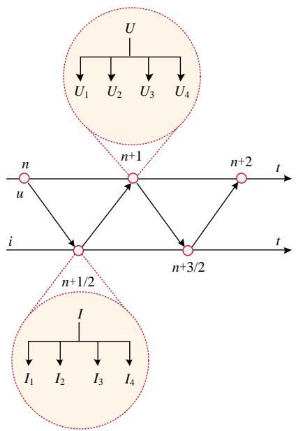  
图12 计算时序示意图  
Fig. 12 Schematic diagram of calculation sequence

5）时刻前进半个时步至 $t ^ { n + 1 }$ ，根据半隐式延迟解耦递推式，并行求解状态变量组 U。返回步骤 2），进行下一轮计算，直至仿真时刻结束。

相应的计算流程如图 13所示。

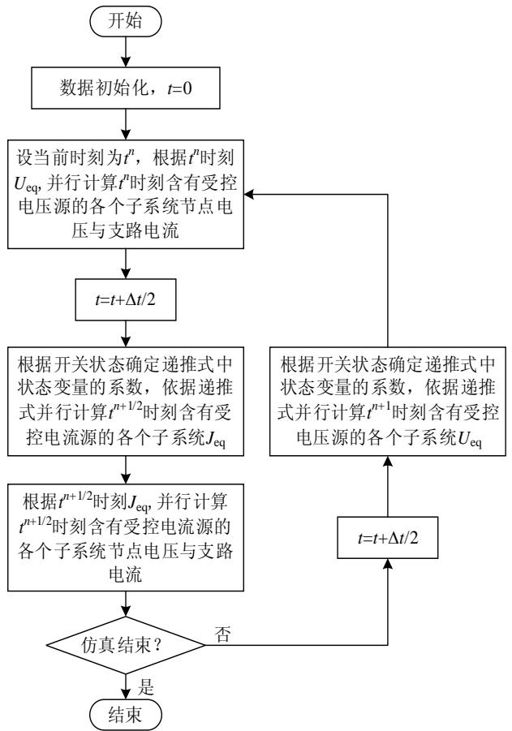  
图13 直驱风力发电单元快速解耦算法流程图  
Fig. 13 direct-drive wind power generation unit fast decoupling algorithm flow chart

# 4 模型特点分析

相比于现有的风电场仿真建模方法，本文提出的风电场半隐式延迟解耦模型的发电单元各部分解耦，既可拆分风电场减小仿真规模，又可实现子系统之间的并行计算，此外还有以下特点：

1）系统导纳矩阵恒定。开关状态的变化仅改变受控源 $U _ { \mathrm { e q } } \setminus J _ { \mathrm { e q } }$ 和对应的控制系数 $k _ { \mathrm { u } } , \ k _ { \mathrm { i } } \circ$ 。换流器等效电路的电阻 $R _ { \mathrm { o n } }$ 为定值，计算过程中开关状态改变时不需要重新形成系统导纳矩阵以及 LU 重分解，进一步提高计算效率，减少计算时间。  
2）模型考虑了换流器的开关导通损耗和内部动态特性，具有与详细模型近似的仿真精度。动态相量模型和平均值模型则无法计及设备的内部特性。传统的开关函数模型虽计及设备内部开关过程，但未计及换流器损耗。  
3）本模型解耦时采用的中心积分形式，其面积在电磁暂态仿真尺度下与隐式梯形积分的面积等效，因此本模型与详细模型的精度相仿。考虑非状态变量的突变，常规仿真算法(如隐式梯形法)为避免引起数值振荡，在换流器开关动作时通常将积分方法改成后退欧拉法。而本模型对系统的状态变量(电感电流和电容电压)进行分组和延时，解耦的状态变量间不会由于开关动作而突变，无需在开关动作时切换积分形式，可以始终保持解耦形式的一致。

# 5 算例验证

本文将直驱风力发电单元详细模型与本文模型的算例结果进行对比，验证本文所提等效解耦模型的仿真精度以及效率。仿真模型在 PSCAD/EMTDC 中搭建，测试所采用的 PC 机配置为 Intel(Core) 8 核(8 线程) i7-9700K 3.70GHz。仿真系统拓扑如图 14 所示，IGBT 开关组导通电阻为 0.01Ω，关断电阻为 $1 0 ^ { 6 } \Omega$ ，系统其他参数如表 1 所示。

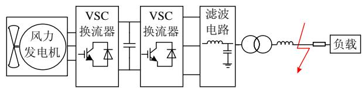  
图14 测试系统  
Fig. 14 Test system

本文算例中直驱风机设置桨距角为恒定值，对叶尖速比进行控制来实现最大风能跟踪控制。机侧换流器和网侧换流器均采用双闭环控制，其中机侧

表1 仿真系统参数  
Table 1 Simulation system parameters   

<table><tr><td>参数</td><td>取值</td></tr><tr><td>风机额定电压幅值/kV</td><td>0.69</td></tr><tr><td>风机额定容量/MVA</td><td>3</td></tr><tr><td>风力发电机数量</td><td>1</td></tr><tr><td>风速/m/s</td><td>8</td></tr><tr><td>风机等效电阻/Ω</td><td>0.5</td></tr><tr><td>直流侧电容/mF</td><td>50</td></tr><tr><td>换流器等效电感/mH</td><td>1</td></tr><tr><td>滤波器电容/mF</td><td>10</td></tr><tr><td>滤波器电感/mH</td><td>1</td></tr><tr><td>线路等效电阻/Ω</td><td>1</td></tr><tr><td>线路等效电感/mH</td><td>1</td></tr><tr><td>短路电阻/Ω</td><td>0.01</td></tr></table>

换流器外环为有功功率环，内环为电流环。网侧换流器外环为直流电压环和无功功率环，内环为电流环。算例未考虑高低电压穿越期间的控制。

仿真包括稳态和暂态仿真，仿真时间设置如下：总仿真时长为 1s，系统从 0 时刻开始启动，电源上升时间为 0.03s；0.5s 时网侧线路发生三相接地短路故障，0.55s 时故障切除；0.8s 时网侧线路发生A相接地短路故障，0.85s 时故障切除；随后系统运行至仿真结束。

# 5.1 仿真精度对比

本节分别对比风电单元详细模型和本文所提

解耦模型不同电气量的仿真精度，并计算两者波形的均方根相对误差(均方根相对误差的计算公式详见附录 F)。分别对仿真步长为 1μs，2μs，5μs 三种情况进行仿真精度对比。图 15 的仿真步长设置为1μs，开关频率设置为 20kHz。由于 0.4s 直流侧电容电压上升后保持稳定，因此画图区间取 0.4s 至1s。图 15(a)—(f)分别为故障点 A相电压，故障点 B相电压，故障点(左侧)A 相电流、网侧出口有功功率、网侧出口无功功率和直流侧电容电压的误差情况。

表2列出了设置不同仿真步长下相关风力发电单元各电气量的 2-范数误差情况。

通过图 15 和表 2 可知，系统各电气量的波形都与详细模型波形吻合，因此本文提出的模型在稳态与暂态情况下都具备很高的仿真精度，能够保证直驱风力发电单元仿真的准确性。

# 5.2 仿真效率对比

本节分别对比换流器取不同开关频率和不同风力发电单元个数时风电场详细模型及本文所提解耦方法的 CPU 仿真用时和加速比。将风力发电机单元的状态变量的求解任务分配至CPU的核心，分别验证半隐式延迟解耦方法采用串行和并行方式时的计算效率。本节算例中默认选取开关频率20kHz，仿真步长为 1μs，仿真总时长设置为 1s。

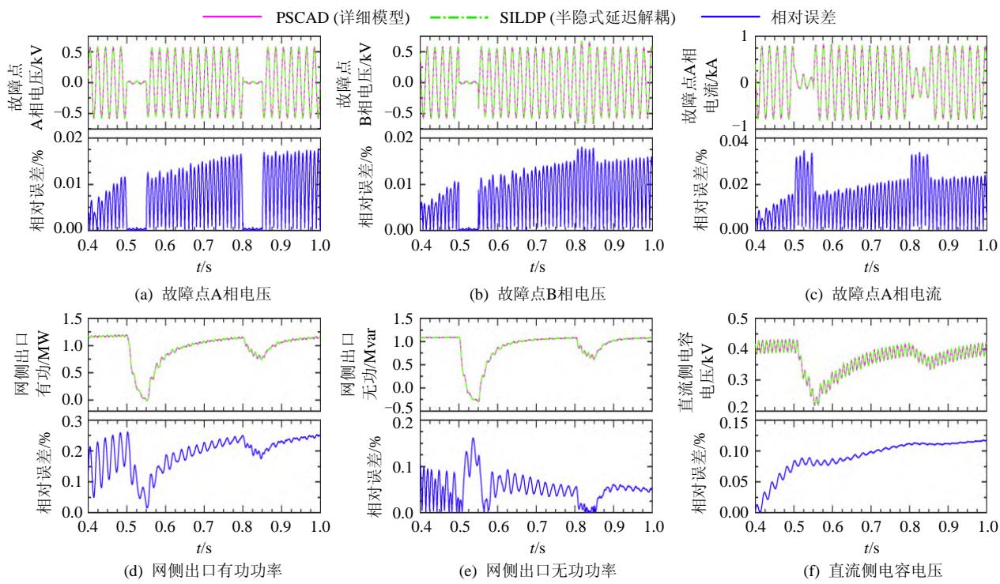  
图15 仿真精度对比  
Fig. 15 Comparison of simulation results

表2 误差情况表  
Table 2 Error situation table   
%   

<table><tr><td>电气量名称</td><td>1μs</td><td>2μs</td><td>5μs</td></tr><tr><td>故障点A相电压</td><td>0.009</td><td>0.019</td><td>0.050</td></tr><tr><td>故障点B相电压</td><td>0.009</td><td>0.019</td><td>0.049</td></tr><tr><td>故障点A相电流</td><td>0.015</td><td>0.033</td><td>0.086</td></tr><tr><td>网侧出口有功功率</td><td>0.199</td><td>0.418</td><td>1.022</td></tr><tr><td>网侧出口无功功率</td><td>0.059</td><td>0.125</td><td>0.312</td></tr><tr><td>直流侧电容电压</td><td>0.010</td><td>0.020</td><td>0.053</td></tr></table>

表 3 表示不同开关频率下两种模型的 CPU 用时和加速比。表 4 表示仿真不同风力发电单元个数时的 CPU 用时和加速比。

表 3 CPU 时间对比(采用不同开关频率)  
Table 3 CPU time comparison (different switching frequencies)   
表 4 CPU 时间对比(采用不同风力发电单元个数)  

<table><tr><td rowspan="2">开关频率/kHz</td><td colspan="3">仿真耗时/s</td><td rowspan="2">串行加速比</td><td rowspan="2">并行加速比</td></tr><tr><td>PSCAD(详细模型)</td><td>解耦模型串行</td><td>解耦模型并行</td></tr><tr><td>2</td><td>7.08</td><td>4.26</td><td>4.47</td><td>1.66</td><td>1.58</td></tr><tr><td>5</td><td>7.84</td><td>4.20</td><td>4.39</td><td>1.87</td><td>1.79</td></tr><tr><td>10</td><td>9.21</td><td>4.14</td><td>4.36</td><td>2.22</td><td>2.11</td></tr><tr><td>20</td><td>11.33</td><td>4.23</td><td>4.38</td><td>2.68</td><td>2.59</td></tr></table>

Table 4 CPU time comparison (different number of power generation units)   

<table><tr><td rowspan="2">风电单 元个数</td><td colspan="3">仿真耗时/s</td><td rowspan="2">串行 加速比</td><td rowspan="2">并行 加速比</td></tr><tr><td>PSCAD (详细模型)</td><td>解耦模 型串行</td><td>解耦模 型并行</td></tr><tr><td>1</td><td>7.08</td><td>4.26</td><td>4.47</td><td>1.66</td><td>1.58</td></tr><tr><td>5</td><td>70.38</td><td>19.90</td><td>13.48</td><td>3.54</td><td>5.22</td></tr><tr><td>10</td><td>231.54</td><td>40.86</td><td>21.72</td><td>5.67</td><td>10.66</td></tr><tr><td>50</td><td>9647.37</td><td>216.67</td><td>74.92</td><td>44.53</td><td>128.77</td></tr><tr><td>100</td><td>52 498.80</td><td>481.42</td><td>117.63</td><td>109.05</td><td>446.30</td></tr><tr><td>200</td><td>约60h</td><td>1084.24</td><td>256.92</td><td>199.22</td><td>840.73</td></tr></table>

通过以上各表可以看出，本文所提解耦模型在不同开关频率及不同发电单元个数的情况下都可以提高仿真速度。对于单个风力发电单元，解耦模型对于提高仿真速度提升不明显，但逐渐增加风力发电单元的个数时，采用解耦模型能极大提升仿真速度，且解耦并行计算相对于解耦串行计算提升更大。在本算例中，若采用核心数更高的 CPU、GPU或现场可编程逻辑门阵列(field programmable gatearray，FPGA)计算，仿真速度提升将会更加明显。

# 6 结论

本文根据半隐式延迟解耦电磁暂态仿真方法，

建立了直驱风力发电单元整体解耦模型，并给出了快速解耦算法流程。通过比较PSCAD仿真结果，验证了本文方法的准确性与高效性，本文结论如下：

1）具有很高的计算效率。本文方法开关状态的变化仅反映在受控源 $U _ { \mathrm { e q } } \cdot$ 、 $J _ { \mathrm { e q } }$ 和对应的控制系数$k _ { \mathrm { u } } .$ 、 $k _ { \mathrm { i } }$ 中。换流器开关动作时导纳矩阵不发生变化，而传统方法导纳矩阵发生变化需要每次进行 LU 分解，计算效率低下。  
2）开关动作时，本文解耦算法无需切换，可以保持解耦形式的一致，因此可以保持风电场仿真并行的一致性。  
3）风力发电单元之间以及单元内部的解耦和并行计算，可有效解决风电场规模大、风机数量多带来的超高阶线性方程组求解难题。  
4）在实际运用中，一个风电场往往采用集中等值方法建模为多台风机。然而，当大规模交直流系统中存在多个风电场时，系统中的等值风机数目依然很多，仍然面临着如何提高风力发电单元的仿真效率问题。本文方法提供了一个有效的解决途径。

# 参考文献

[1] 田世明，栾文鹏，张东霞，等．能源互联网技术形态与关键技术[J]．中国电机工程学报，2015，35(14)：3482-3494TIAN Shiming，LUAN Wenpeng，ZHANG Dongxia，etal ． Technical forms and key technologies on energyinternet[J]．Proceedings of the CSEE，2015，35(14)：3482-3494(in Chinese)  
[2] 张显，史连军．中国电力市场未来研究方向及关键技术[J]．电力系统自动化，2020，44(16)：1-11ZHANG Xian，SHI Lianjun．Future research areas and keytechnologies of electricity market in China[J]．Automationof Electric Power Systems ， 2020 ， 44(16) ： 1-11(inChinese)  
[3] WU Enbang，GUO Zheng．The effects of clean energy development on China's carbon dioxide emissions control[C]//Proceedings of 2018 IEEE International Conference on Smart Energy Grid Engineering．Oshawa： IEEE，2018   
[4] 陈振宇．大型风力发电系统多目标优化控制研究[D]北京：华北电力大学(北京)，2018CHEN Zhenyu ． Research on wind turbine generatorsystem multi-objective optimization control[D]．Beijing：North China Electric Power University (Beijing)，2018(inChinese)  
[5] 舒印彪，张智刚，郭剑波，等．新能源消纳关键因素分

析及解决措施研究[J]．中国电机工程学报，2017，37(1)：1-8．  
SHU Yinbiao，ZHANG Zhigang，GUO Jianbo，et alStudy on key factors and solution of renewable energyaccommodation[J]．Proceedings of the CSEE，2017，37(1)：1-8(in Chinese)  
[6] FEMIN V，PETRA I，MATHEW S，et al．Econoenvironmental dispatch solutions for power systems integrated with renewable energy resources[C]// Proceedings of 2020 International Conference and Utility Exhibition on Energy，Environment and Climate Change Pattaya：IEEE，2020：1-7   
[7] LI Guanliang，HU Xiaocen，LI Yaguo，et al．Influences of large scale wind farm centralized access on power system voltage stability[C]//Proceedings of the IEEE 5th Information Technology and Mechatronics Engineering Conference．Chongqing：IEEE，2020：1395-1399   
[8] MIAO Lu，GAO Haixiang，YI Yang，et al．Influence of off-shore wind farm on power system small-signal stability[C]//Proceedings of the IEEE 8th International Conference on Advanced Power System Automation and Protection．Xi'an：IEEE，2019   
[9] VERMA A，MISHRA S，GIDWANI L，et al．Study of harmonics and transient stability on a doubly fed induction generator based wind farm[C]//Proceedings of the 2nd International Conference on Power and Embedded Drive Control．Chennai：IEEE，2019：427-431   
[10] TENG Song，LI Guangkai，SONG Xinli，et al．A novel method for VSC-HVDC electromechanical transient modeling and simulation[C]//Proceedings of 2012 Power Engineering and Automation Conference．Wuhan，China： IEEE，2012：1-4   
[11] MAZHARI S M，KOUHSARI S M，RAMIREZ A，et alInterfacing transient stability and extended harmonicdomain for dynamic harmonic analysis of powersystems[J]．IET Generation，Transmission & Distribution，2016，10(11)：2720-2730  
[12] ROJAS S，GENSIOR A．Prediction of the average value of state variables for modulated power converters considering the modulation and measuring method[J] IEEE Transactions on Industrial Electronics，2016，63(8)： 5209-5220   
[13] LIU Xiao，CRAMER A M，PAN Fei．Generalized average method for time-invariant modeling of inverters[J]．IEEE Transactions on Circuits and Systems I：Regular Papers， 2017，64(3)：740-751   
[14] 汪燕，姚蜀军，林芝茂，等．一种基于多频段动态相量的 LCC 换流器电磁暂态建模方法研究[J]．中国电机工程学报，2020，40(17)：5644-5652WANG Yan，YAO Shujun，LIN Zhimao，et al．A modeling

method for LCC electromagnetic transient simulation based on multi frequency band dynamic phasor[J] Proceedings of the CSEE，2020，40(17)：5644-5652(in Chinese)   
[15] 刘博宁，姚蜀军，张慧媛，等．多频段–动态相量法电磁暂态仿真研究[J]．中国电机工程学报，2019，39(19)：5772-5781  
LIU Boning，YAO Shujun，ZHANG Huiyuan，et al．A research on multi-frequency band dynamic phasor for electromagnetic transients simulation[J]．Proceedings of the CSEE，2019，39(19)：5772-5781(in Chinese)   
[16] 姚蜀军，屈秋梦，蔡焱蒙，等．基于多频段动态相量法的MMC换流器建模方法[J]．中国电机工程学报，2020，40(18)：5932-5941  
YAO Shujun，QU Qiumeng，CAI Yanmeng，et al Research of modeling method of modular multilevel converter based on multi-frequency bands dynamic phasor[J]．Proceedings of the CSEE，2020，40(18)： 5932-5941(in Chinese)   
[17] LI Yupeng，SHU Dewu，SHI Fan，et al．A multi-rateco-simulation of combined phasor-domain andtime-domain models for large-scale wind farms[J]．IEEETransactions on Energy Conversion ， 2020 ， 35(1) ：324-335  
[18] YAO Shujun，BAO Mingran，HU Ya'nan，et al．Modeling for VSC-HVDC electromechanical transient based on dynamic phasor method[C]//Proceedings of the 2nd IET Renewable Power Generation Conference．Beijing：IEEE， 2013：1-4   
[19] 曹斌，王立强，赵永飞，等．基于 PSCAD/EMTDC 的大规模新能源并网电磁暂态并行仿真[J]．中国电力，2020，53(11)：154-161  
CAO Bin，WANG Liqiang，ZHAO Yongfei，et al Electromagnetic transient parallel simulation of large-scale new energy grid connection based on PSCAD/EMTDC[J]．Electric Power，2020，53(11)： 154-161(in Chinese)   
[20] KATO T，INOUE K，FUKUTANI T，et al．Multirate analysis method for a power electronic system by circuit partitioning[J]．IEEE Transactions on Power Electronics， 2009，24(12)：2791-2802   
[21] LIN Ning，DINAVAHI V．Variable time-stepping modular multilevel converter model for fast and parallel transient simulation of multiterminal DC Grid[J] ． IEEE Transactions on Industrial Electronics，2019，66(9)： 6661-6670   
[22] 刘君陶．基于指数积分方法的电磁暂态仿真 GPU 并行算法[D]．天津：天津大学，2018  
LIU Juntao．GPU based parallel algorithm of exponential integration method for electromagnetic transient

simulation[D] ． Tianjin ： Tianjin University ， 2018(inChinese)  
[23] LIN Ning，DINAVAHI V，Exact nonlinear micromodeling for fine-grained parallel EMT simulation of MTDC grid interaction with wind farm[J] ． IEEE Transactions on Industrial Electronics，2019，66(8)：6427-6436   
[24] 丁茂生，王辉，舒兵成，等．含风电场的多直流送出电网电磁暂态仿真建模[J]．电力系统保护与控制，2015，43(23)：63-70  
DING Maosheng，WANG Hui，SHU Bingcheng，et al Electromagnetic transient simulation model of multi-send HVDC system with wind plants[J] ． Power System Protection and Control，2015，43(23)：63-70(in Chinese)   
[25] 周佩朋，李光范，孙华东，等．基于频域阻抗分析的直驱风电场等值建模方法[J]．中国电机工程学报，2020，40(S1)：84-90  
ZHOU Peipeng，LI Guangfan，SUN Huadong，et al Equivalent modeling method of PMSG wind farm based on frequency domain impedance analysis[J]．Proceedings of the CSEE，2020，40(S1)：84-90(in Chinese)   
[26] 徐政，屠卿瑞，管敏渊，等．柔性直流输电系统[M]北京：机械工业出版社，2013：14-19  
XU Zheng，TU Qingrui，GUAN Minyuan，et al．FlexibleDC power transmission system[M]．Beijing：MechanicalIndustry Press，2013：14-19(in Chinese)  
[27] 姚蜀军，庞博涵，吴国旸，等．半隐式延迟解耦电磁暂态并行仿真方法(一)：原理及交流分网与并行[J]．中国电机工程学报，2022，42(7)：2486-2497  
YAO Shujun，PANG Bohan，WU Guoyang，et al．A method of parallel computing for electromagnetic transient simulation based on semi-implicit latency decoupling technology (part I)：theory and AC network partitioning and parallel[J]．Proceedings of the CSEE， 2022，42(7)：2486-2497(in Chinese)   
[28] 姚蜀军，庞博涵，曾子文，等．半隐式延迟解耦电磁暂态仿真方法(二)：单端口子模块MMC通用解耦与快速仿真[J]．中国电机工程学报，2022，42(13)：4775-4785YAO Shujun，PANG Bohan，ZHENG Ziwen，et alSemi-implicit latency decoupling technology basedelectromagnetic transient simulation—part Ⅱ：generaldecoupling and fast simulation for single-port sub-moduleMMC[J]．Proceedings of the CSEE，2022，42(13)：4775-4785(in Chinese)  
[29] 朱志凌，董存，陈宁，等．新能源发电建模与并网仿真技术[M]．北京：中国水利水电出版社，2018：55-57ZHU Zhiling，DONG Cun，CHEN Ning，et al．Modelingand simulation for grid integration of renewable energygeneration[M]．Beijing：China Water & Power Press，2018：55-57(in Chinese)

# 附录A 直驱风机的数学模型

取转子永磁体极中心线为 d 轴，逆时针方向超前 90°电角度为 $q$ 轴。直驱风机在 $d q$ 坐标系下的数学模型为

$$
\left\{ \begin{array}{l} u _ {d} = R _ {\mathrm {s}} i _ {d} + \frac {\mathrm {d} \psi_ {d}}{\mathrm {d} t} - \omega_ {\mathrm {g}} \psi_ {q} \\ u _ {q} = R _ {\mathrm {s}} i _ {q} + \frac {\mathrm {d} \psi_ {q}}{\mathrm {d} t} + \omega_ {\mathrm {g}} \psi_ {d} \\ 0 = r _ {\mathrm {D}} i _ {\mathrm {D}} + \frac {\mathrm {d} \psi_ {\mathrm {D}}}{\mathrm {d} t} \\ 0 = r _ {\mathrm {Q}} i _ {\mathrm {Q}} + \frac {\mathrm {d} \psi_ {\mathrm {Q}}}{\mathrm {d} t} \end{array} \right. \tag {A1}
$$

其中

$$
\left\{ \begin{array}{l} \psi_ {d} = \left(x _ {1} + x _ {\mathrm {m} d}\right) i _ {d} + x _ {\mathrm {m} d} i _ {\mathrm {D}} + \psi_ {\mathrm {m}} \\ \psi_ {q} = \left(x _ {1} + x _ {\mathrm {m} q}\right) i _ {q} + x _ {\mathrm {m} q} i _ {\mathrm {Q}} \\ \psi_ {\mathrm {D}} = x _ {\mathrm {m} d} i _ {d} + x _ {\mathrm {1 D}} i _ {\mathrm {D}} + \psi_ {\mathrm {m}} \\ \psi_ {\mathrm {Q}} = x _ {\mathrm {m} q} i _ {q} + x _ {\mathrm {1 Q}} i _ {\mathrm {Q}} \end{array} \right. \tag {A2}
$$

式中： $u _ { d } . $ 、 $u _ { q }$ 为定子电压 $d$ 轴和 $q$ 轴分量； $i _ { d } ,$ 、 $i _ { q }$ 为电枢电流d轴和 $q$ 轴的分量； $\psi _ { d }$ 、 $\psi _ { q }$ 为定子磁链d轴和 $q$ 轴分量；$\psi _ { \mathrm { { D } } }$ $\psi _ { \mathrm { Q } }$ 为转子阻尼绕组磁链； $r _ { \mathrm { D } } .$ $r _ { \mathrm { Q } }$ 为转子阻尼绕组电阻； $i _ { \mathrm { D } } , \ i _ { \mathrm { Q } }$ 为转子阻尼绕组电流； $x _ { \mathrm { m } d } ,$ 、 $x _ { \mathrm { m } q }$ 为同步反应电抗；， $x _ { \mathrm { 1 D } } \cdot$ 、 $x _ { 1 0 }$ 为阻尼绕组漏抗； $R _ { \mathrm { s } }$ 为电枢绕组电阻； $\omega _ { \mathrm { g } }$ 为转子转速； $x _ { 1 }$ 为定子绕组漏抗； $\psi _ { \mathrm { m } }$ 为永磁磁链。

电磁转矩方程与转子运动方程分别为：

$$
T _ {\mathrm {e}} = \frac {3}{2} p \left[ \psi_ {\mathrm {m}} i _ {q} + i _ {d} i _ {q} \left(x _ {d} - x _ {q}\right) \right] \tag {A3}
$$

$$
\left\{ \begin{array}{r l} \frac {1}{p} T _ {\mathrm {J}} \frac {\mathrm {d} \omega_ {\mathrm {g}}}{\mathrm {d} t} & = T _ {\mathrm {m}} - T _ {\mathrm {e}} \\ \frac {\mathrm {d} \theta}{\mathrm {d} t} & = \omega_ {\mathrm {g}} \end{array} \right. \tag {A4}
$$

式中： $T _ { \mathrm { m } }$ 为风轮机械转矩； $T _ { \mathrm { e } }$ 为发电机电磁转矩； $p$ 为极对数； $T _ { \mathrm { { J } } }$ 为转子惯性时间常数；θ为转子角位移。

# 附录B VSC 换流器半隐式延迟解耦递推格式

VSC半隐式延迟解耦递推格式：

$$
\left[ \begin{array}{c c c} L _ {\mathrm {a}} + \frac {R _ {\mathrm {o n}}}{2} \Delta t & - (L _ {\mathrm {b}} + \frac {R _ {\mathrm {o n}}}{2} \Delta t) \\ & L _ {\mathrm {b}} + \frac {R _ {\mathrm {o n}}}{2} \Delta t & - (L _ {\mathrm {c}} + \frac {R _ {\mathrm {o n}}}{2} \Delta t) \\ - (L _ {\mathrm {a}} + \frac {R _ {\mathrm {o n}}}{2} \Delta t) & & L _ {\mathrm {c}} + \frac {R _ {\mathrm {o n}}}{2} \Delta t \end{array} \right] \left[ \begin{array}{l} i _ {\mathrm {a}} ^ {n + 1 / 2} \\ i _ {\mathrm {b}} ^ {n + 1 / 2} \\ i _ {\mathrm {c}} ^ {n + 1 / 2} \end{array} \right] =
$$

$$
\left[ \begin{array}{c c c} L _ {\mathrm {a}} - \frac {R _ {\mathrm {o n}}}{2} \Delta t & - (L _ {\mathrm {b}} - \frac {R _ {\mathrm {o n}}}{2} \Delta t) \\ & L _ {\mathrm {b}} - \frac {R _ {\mathrm {o n}}}{2} \Delta t & - (L _ {\mathrm {c}} - \frac {R _ {\mathrm {o n}}}{2} \Delta t) \\ - (L _ {\mathrm {a}} - \frac {R _ {\mathrm {o n}}}{2} \Delta t) & & L _ {\mathrm {c}} - \frac {R _ {\mathrm {o n}}}{2} \Delta t \end{array} \right] \left[ \begin{array}{l} i _ {\mathrm {a}} ^ {n - 1 / 2} \\ i _ {\mathrm {b}} ^ {n - 1 / 2} \\ i _ {\mathrm {c}} ^ {n - 1 / 2} \end{array} \right] -
$$

$$
\left[ \begin{array}{l} U _ {\mathrm {e q A B}} ^ {n} \\ U _ {\mathrm {e q B C}} ^ {n} \\ U _ {\mathrm {e q C A}} ^ {n} \end{array} \right] \Delta t + \left[ \begin{array}{l} u _ {\mathrm {a}} ^ {n} - u _ {\mathrm {b}} ^ {n} \\ u _ {\mathrm {b}} ^ {n} - u _ {\mathrm {c}} ^ {n} \\ u _ {\mathrm {c}} ^ {n} - u _ {\mathrm {a}} ^ {n} \end{array} \right] \Delta t \tag {B1}
$$

$$
U _ {c} ^ {n + 1} = \frac {C U _ {c} ^ {n} + J _ {\mathrm {e q}} ^ {n + 1 / 2} \Delta t + i _ {\mathrm {d}} ^ {n + 1 / 2} \Delta t}{C} \tag {B2}
$$

其中， $U _ { \mathrm { e q A B } } = k _ { \mathrm { u a b } } U _ { c } , U _ { \mathrm { e q B C } } = k _ { \mathrm { u b c } } U _ { c } , J _ { \mathrm { e q } } = k _ { \mathrm { i a } } i _ { \mathrm { a } } + k _ { \mathrm { i b } } i _ { \mathrm { b } } + k _ { \mathrm { i c } } i _ { \mathrm { c } } \circ$

附录C 背靠背换流器半隐式延迟解耦递推格式

背靠背换流器各受控源：

$$
\left\{ \begin{array}{l} U _ {\mathrm {e q A B k}} = \left(S _ {\mathrm {a k}} - S _ {\mathrm {b k}}\right) U _ {c} \\ U _ {\mathrm {e q B C k}} = \left(S _ {\mathrm {b k}} - S _ {\mathrm {c k}}\right) U _ {c} \\ J _ {\mathrm {e q k}} = S _ {\mathrm {a k}} i _ {\mathrm {a k}} + S _ {\mathrm {b k}} i _ {\mathrm {b k}} + S _ {\mathrm {c k}} i _ {\mathrm {c k}} \end{array} \right. \tag {C1}
$$

背靠背半隐式延迟解耦递推格式：

$$
\begin{array}{l} \left[ \begin{array}{c c c} L _ {\mathrm {a k}} + \frac {R _ {\mathrm {o n}}}{2} \Delta t & - \left(L _ {\mathrm {b k}} + \frac {R _ {\mathrm {o n}}}{2} \Delta t\right) & \\ & L _ {\mathrm {b k}} + \frac {R _ {\mathrm {o n}}}{2} \Delta t & - \left(L _ {\mathrm {c k}} + \frac {R _ {\mathrm {o n}}}{2} \Delta t\right) \\ - \left(L _ {\mathrm {a k}} + \frac {R _ {\mathrm {o n}}}{2} \Delta t\right) & & L _ {\mathrm {c k}} + \frac {R _ {\mathrm {o n}}}{2} \Delta t \end{array} \right] \left[ \begin{array}{l} i _ {\mathrm {a k}} ^ {n + 1 / 2} \\ i _ {\mathrm {b k}} ^ {n + 1 / 2} \\ i _ {\mathrm {c k}} ^ {n + 1 / 2} \end{array} \right] = \\ \left[ \begin{array}{c c c} L _ {\mathrm {a k}} - \frac {R _ {\mathrm {o n}}}{2} \Delta t & - (L _ {\mathrm {b k}} - \frac {R _ {\mathrm {o n}}}{2} \Delta t) \\ & L _ {\mathrm {b k}} - \frac {R _ {\mathrm {o n}}}{2} \Delta t & - (L _ {\mathrm {c k}} - \frac {R _ {\mathrm {o n}}}{2} \Delta t) \\ - (L _ {\mathrm {a k}} - \frac {R _ {\mathrm {o n}}}{2} \Delta t) & & L _ {\mathrm {c k}} - \frac {R _ {\mathrm {o n}}}{2} \Delta t \end{array} \right] \left[ \begin{array}{l} i _ {\mathrm {a k}} ^ {n - 1 / 2} \\ i _ {\mathrm {b k}} ^ {n - 1 / 2} \\ i _ {\mathrm {c k}} ^ {n - 1 / 2} \end{array} \right] - \\ \left[ \begin{array}{l} U _ {\mathrm {e q A B k}} ^ {n} \\ U _ {\mathrm {e q B C k}} ^ {n} \\ U _ {\mathrm {e q C A k}} ^ {n} \end{array} \right] \Delta t + \left[ \begin{array}{l} u _ {\mathrm {a k}} ^ {n} - u _ {\mathrm {b k}} ^ {n} \\ u _ {\mathrm {b k}} ^ {n} - u _ {\mathrm {c k}} ^ {n} \\ u _ {\mathrm {c k}} ^ {n} - u _ {\mathrm {a k}} ^ {n} \end{array} \right] \Delta t (C2) \\ U _ {c} ^ {n + 1} = \frac {C U _ {c} ^ {n} + J _ {\mathrm {e q} 1} ^ {n + 1 / 2} \Delta t + J _ {\mathrm {e q} 2} ^ {n + 1 / 2} \Delta t}{C} (C3) \\ \end{array}
$$

附录D LCL 滤波器半隐式延迟解耦递推格式

LCL 滤波器半隐式延迟解耦递推格式：

$$
\left\{ \begin{array}{l} i _ {1} ^ {n + 1 / 2} = \frac {L _ {1} i _ {1} ^ {n - 1 / 2} + u _ {t} ^ {n} \Delta t - u _ {1} ^ {n} \Delta t}{L _ {1}} \\ i _ {2} ^ {n + 1 / 2} = \frac {L _ {2} i _ {2} ^ {n - 1 / 2} + u _ {t} ^ {n} \Delta t - u _ {2} ^ {n} \Delta t}{L _ {2}} \\ u _ {t} ^ {n + 1} = \frac {C u _ {t} ^ {n} - i _ {1} ^ {n + 1 / 2} \Delta t - i _ {2} ^ {n + 1 / 2} \Delta t}{C} \end{array} \right. \tag {D1}
$$

附录E 集电线路半隐式延迟解耦递推格式

π型线路半隐式延迟解耦递推格式：

$$
\left\{ \begin{array}{l} i _ {L} ^ {n + 1 / 2} = \frac {\left(\frac {L}{\Delta t} - \frac {R}{2}\right) i _ {L} ^ {n - 1 / 2} + u _ {1} ^ {n} - u _ {2} ^ {n}}{\left(\frac {L}{\Delta t} + \frac {R}{2}\right)} \\ u _ {1} ^ {n + 1} = \frac {C _ {1} u _ {1} ^ {n} - i _ {L} ^ {n + 1 / 2} \Delta t - i _ {1} ^ {n + 1 / 2} \Delta t}{C _ {1}} \\ u _ {2} ^ {n + 1} = \frac {C _ {2} u _ {2} ^ {n} + i _ {L} ^ {n + 1 / 2} \Delta t - i _ {2} ^ {n + 1 / 2} \Delta t}{C _ {2}} \end{array} \right. \tag {E1}
$$

附录F 均方根相对误差的计算公式

相对误差公式为

$$
E (\%) = \frac {\left| \hat {x} - x \right|}{r (x)} 100 \% \tag{F1}
$$

式中：x和 xˆ 分别为不采用和采用半隐式延迟解耦法得到的n维向量；n为仿真总时间节点数；r(x)为均方根。

  
姚蜀军

在线出版日期：2022-05-05。

收稿日期：2021-05-14。

作者简介：

姚蜀军(1973)，男，副教授，硕士生导师，主要从事电力系统运行与控制、直流输电、电磁暂态仿真和建模等方面的研究工作，yaoshujun@ncepu.edu.cn；

刘刚(1998)，男，硕士研究生，主要从事电磁暂态建模与仿真方面的研究工作；

曾子文(1997)，男，硕士研究生，主要从事风电场建模与仿真方面的研究工作，412083486@qq.com；

庞博涵(1997)，男，硕士研究生，主要从事电磁暂态建模与仿真方面的研究工作；

*通信作者：汪燕(1970)，女，讲师，研究方向为电力系统运行与控制，电路理论分析，电磁暂态仿真等，wangyan@ncepu.edu.cn。

(实习编辑 张文鑫)

# Electromagnetic transient Semi-implicit Latency Decoupling and Simulation Technology for Direct-drive Wind Power Generation Unit

YAO Shujun, LIU Gang, ZENG Ziwen, PANG Bohan, WANG Yan*

(North China Electric Power University)

KEY WORDS: wind power generation unit; direct-drive wind turbine; electromagnetic transient simulation; semi-implicit latency decoupling; parallel computing

Wind farms contain a large number of wind turbines and power electronic equipment, and frequent switching actions make it difficult to balance simulation accuracy and efficiency. In order to reconcile the contradiction between the detail level of the wind farm model and the simulation scale, it is necessary to study the electromagnetic transient simulation method of the wind farm that takes into account the efficiency and accuracy. Therefore, it is necessary to study efficient wind power generation unit electromagnetics transient simulation model. This article focuses on the research of direct-drive wind power generation unit.

In this paper, the semi-implicit latency decoupling and paralleling technology (SILDP) is applied to the research of direct-drive wind power generation unit, and proposed a decoupling and fast simulation method with simple decoupling circuit, constant admittance matrix, easy parallel and high simulation efficiency.

In this paper, a semi implicit delay decoupling model of direct-drive wind power generation unit are constructed by using matrix splitting and delay technique. The direct-drive wind power generation unit and decoupling circuit diagram are shown in Fig. 1 and Fig. 2 respectively.

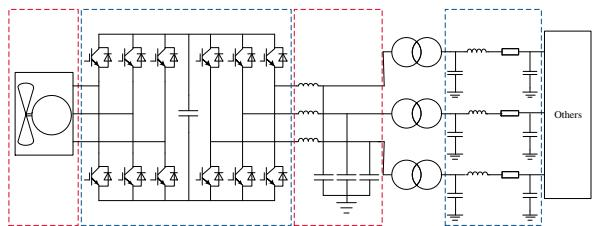

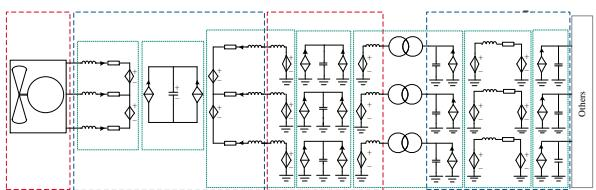  
Fig. 1 Topology of direct-drive wind power generation unit   
Fig. 2 Decoupling circuit diagram of direct-drive wind power generation unit

The decoupling model of direct-drive wind power

generation unit is implemented by C++ programming and compared with the simulation results of detailed model in PSCAD/EMTDC. The CPU used in the test is Intel (core) 8core i7-9700K, and the simulation step is 1μs.The simulation results (Fig. 3 and Table 1) show that the model proposed in this paper has high simulation accuracy.

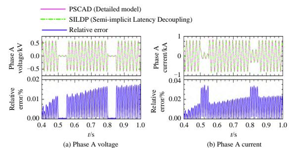

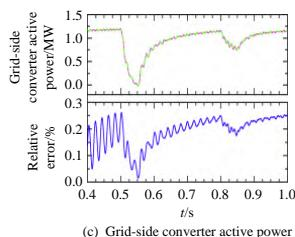

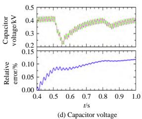  
Fig. 3 Comparison of simulation results

Table 1 Total CPU time comparison between different number of different power generation units   

<table><tr><td rowspan="2">VSC numbers</td><td colspan="3">CPU time/s</td><td rowspan="2">Speedup ratio 1</td><td rowspan="2">Speedup ratio 2</td></tr><tr><td>PSCAD</td><td>Serial computing</td><td>Parallel computing</td></tr><tr><td>1</td><td>7.08</td><td>4.26</td><td>4.47</td><td>1.66</td><td>1.58</td></tr><tr><td>5</td><td>70.38</td><td>19.90</td><td>13.48</td><td>3.54</td><td>5.22</td></tr><tr><td>10</td><td>231.54</td><td>40.86</td><td>21.72</td><td>5.67</td><td>10.66</td></tr><tr><td>50</td><td>9647.37</td><td>216.67</td><td>74.92</td><td>44.53</td><td>128.77</td></tr><tr><td>100</td><td>52 498.80</td><td>481.42</td><td>108.12</td><td>109.05</td><td>446.30</td></tr><tr><td>200</td><td>60hour+</td><td>1084.24</td><td>256.92</td><td>199.22</td><td>840.73</td></tr></table>

It can be seen from the above table that the decoupling model can improve the simulation speed in the case of different power generation units. For a single wind power unit, the decoupling model is not obvious to increase the simulation speed, but when the number of wind power units is increased, the decoupling model can greatly improve the simulation speed.