DOI：10.13334/j.0258-8013.pcsee.200338 文章编号：0258-8013 (2020) 24-7980-10 中图分类号：TM 46

# 模块化多电平换流器的高效电磁暂态仿真方法研究

连攀杰，刘文焯，汤涌，杨泽栋，郁舒雁，李霞

(电网安全与节能国家重点实验室(中国电力科学研究院有限公司)，北京市 海淀区 100192)

# Research on Efficient Electromagnetic Transient Simulation Method of Modular Multilevel Converter

LIAN Panjie, LIU Wenzhuo, TANG Yong, YANG Zedong, YU Shuyan, LI Xia (State Key Laboratory of Power Grid Safety and Energy Conservation (China Electric Power Research Institute), Haidian District, Beijing 100192, China)

ABSTRACT: The large number of sub-modules for modular multilevel converters (MMCs) results in low simulation efficiency, which is not suitable for full electromagnetic transient simulation analysis of large power systems. This article optimized the MMC model equivalent method and the ranking algorithm in three aspects: 1) Used a flexible switching algorithm to discretely simulate the MMC model, while maintaining high-precision simulations to avoid numerical oscillations, ensured the accuracy of the model, further reduced the number of internal nodes, and accelerated model calculation; 2) Studied the nearest level control of MMC to reduce unnecessary sequencing, and proposed “an incomplete sub-module capacitor voltage sequencing algorithm for bidirectional heap sequencing”, to speed up model calculation; 3) The virtual diode was used to achieve accurate simulation when the MMC was locked, which improve the simulation accuracy of the MMC in the case of the lock. Finally, combined with typical examples of Matlab and PSCAD to test, it verified the accuracy and efficiency of the improved electromagnetic transient simulation method.

KEY WORDS: modular multilevel converter (MMC); electromagnetic transients; flexible switching algorithm; capacitor voltage sequencing; the algorithm of bidirectional heap sequencing

摘要：针对模块化多电平换流器(modular multilevel converter，MMC)的子模块数量众多造成的仿真效率低下、不适用于大型电力系统全电磁暂态仿真的问题，从 3 个方面对 MMC 模型等效方式和排序算法进行优化：1）采用灵活切换算法对

MMC模型离散化仿真，在保持高精度仿真的同时避免数值振荡，确保模型准确无误，并进一步削减内部节点数量，加速模型计算；2）研究 MMC 最近电平逼近控制机理，减少不必要的排序，提出一种“基于双向堆排序的电容电压排序算法”，加快模型计算速度；3）采用虚拟二极管的方式实现MMC闭锁时精确仿真，提高MMC在闭锁情况下仿真的精确度。最后，结合 Matlab 和 PSCAD 典型算例进行测试，验证文中所提高效电磁暂态仿真方法的精确性和高效性。

关键词：模块化多电平换流器；电磁暂态；灵活切换算法；电容电压排序；双向堆排序算法

## 0 引言

柔性直流输电技术的可控性好、运行方式灵活、适应性强，为新能源的高效利用和电网发展带来革命性的变化[1-3]。目前，柔性直流输电工程采用的电压源换流器的主要包括两电平换流器、二极管钳位型三电平换流器和模块化多电平换流器[4](modular multilevel converter，MMC)。MMC 电路高度集成化，便于选择不同的子模块数量以适应不同的功率和电压要求，具有波形质量高、故障处理能力强、阶跃电压低和避免动态均压等优势，在柔性直流输电中得到了广泛的应用和发展，是未来直流输电领域的重要发展方向。

基于MMC的柔性直流电磁暂态仿真模型对大型交直流混联系统稳定性分析、故障分析、控制保护策略设计与验证等工程前期设计和研究系统特性的影响重大，需在电力系统建模和仿真中重点考虑。针对不同的实际需求，存在不同的 MMC电磁暂态仿真模型，分为基于器件级的详细模型[5]、受控源的通用电磁暂态模型[6-7]、平均值模型[8]和基于戴维南等效的高效模型[9-12]。不同的模型具有不同的精度和计算速度及应用场景。大量电力电子器件的存在严重影响着 MMC 的仿真运算效率，导致详细模型和基于受控源的电磁暂态通用模型计算速度慢，不适于大规模电力系统的电磁暂态仿真。平均值模型计算速度快；但无法模拟子模块充放电特性，进行外特性分析的准确性也与子模块电容值密切相关[8]，适用范围同样有限。

文献[9]首次提出 MMC 戴维南模型，在保证精度的前提下大大提升了计算速度。文献[10-11]在此基础上，分别从等效模型和均压算法两方面改进，对戴维南模型进一步提速，但模型仿真精度有所降低。

排序均压控制是维持 MMC 各个子模块电容电压平衡、保证 MMC 正常运行的必要手段[12]。针对子模块数量众多造成排序次数多、增加控制运算量的难点[13-14]，文献[15]将子模块进行分组排序，文献[16]采用希尔排序法进一步提升计算效率，但分组排序与传统排序相比，排序过程繁琐，且降低了排序精度，对子模块电容电压的均衡效果产生了不利影响。文献[17]在开关关断电阻无穷大且使用梯形积分法离散化电容的前提下，提出了一种线性排序算法，有效减少了排序运算量，但工程实用性还有待确认。文献[18]以避免投入组和退出组为目的，对快速排序算法进行改进，提出排序结果再利用的方式排列电容电压，但该算法在一定概率下计算量与传统方法相同。

如何在保证MMC戴维南模型高仿真精度的同时，提高模型的计算速度，使之更适用于大规模交直流电网全电磁暂态仿真分析，是本文研究的重点内容。文章在戴维南等效模型的基础上，从 3个方面对 MMC 仿真方法进行优化：1）通过灵活切换算法离散化 MMC 模型，确保计算准确无振荡，并基于嵌套快速同时求解法对桥臂电感支路进行等效，进一步削减 MMC内部节点数量，降低导纳阵规模；2）分析最近电平逼近控制策略，在完全不影响子模块电容电压均衡效果的基础上，提出一种基于双向堆排序的不完全排序算法；3）针对 MMC闭锁后的等效模型与桥臂电流方向有关，采用虚拟二极管的方式实现 MMC 闭锁时精确仿真，解决二极管的插值问题。最后，结合 MATLAB 和 PSCAD典型算例进行测试，验证本文所提高效电磁暂态仿真方法的精确性和快速性。

## 1 MMC 戴维南高效模型

## 1.1 MMC 经典戴维南模型

MMC 戴维南模型由文献[9]首次提出，其核心思想是建立单个子模块的戴维南模型，再利用子模块串联关系代数叠加。以半桥结构为例，简述 MMC戴维南模型的等效原理。

IGBT 及其反向并联的二级管可等效为一个可变电阻，对应图 1 中 $R _ { 1 }$ 和 $R _ { 2 }$ ，由开关状态取值 $R _ { \mathrm { O N } }$ 或 $R _ { \mathrm { O F F } ^ { \circ } } \ R _ { \mathrm { C } } , \ u _ { \mathrm { C } }$ 分别为子模块电容的等效电阻和等效电压。根据拓扑结构求子模块的等效电阻 $R _ { \mathrm { s m e q } } ^ { i } ( t )$ 和等效电压 $u _ { \mathrm { s m e q } } ^ { i } ( t )$ ，再由子模块串联结构求全部子模块的等效模型，如式(1)、(2)。

$$
u _ { \mathrm { a l l \_ s m e q } } ( t ) = \sum _ { i = 1 } ^ { N } u _ { \mathrm { s m e q } } ^ { i } ( t )\tag{1}
$$

$$
R _ { \mathrm { a l l \_ s m e q } } ( t ) = \sum _ { i = 1 } ^ { N } R _ { \mathrm { s m e q } } ^ { i } ( t )\tag{2}
$$

式中： $u _ { \mathrm { a l l \_ s m e q } } ( t )$ 1 $R _ { \mathrm { a l l \_ s m e q } } ( t )$ 为全部子模块的等效电压和等效电阻；N 为单个桥臂包含的子模块数目。

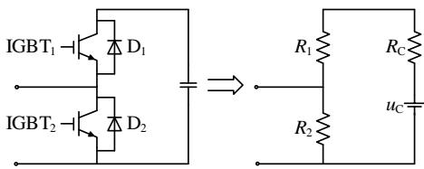  
图 1 MMC 子拓扑结构等效  
Fig. 1 MMC sub-topology equivalent

## 1.2 MMC仿真离散化算法的灵活切换

在实现 MMC 电磁暂态仿真过程中，需对子模块电容支路和桥臂电感支路进行离散化[19]。隐式梯形法的计算准确度高，绝大部分文献采用隐式梯形法离散化子模块电容支路，却带来非状态量数值振荡的风险。当 MMC 各桥臂投入的子模块数量变化引起网络结构突变时，隐式梯形法递推式中包含上一步的非状态变量，可能导致非状态量在真解附近不正常地摇摆，发生电磁暂态仿真中的数值振荡[20]。文献[10]采用后退欧拉法离散化子模块电容支路，使用的历史项与上一步非状态量无关，能够避免数值振荡问题，但由于完全抛弃了上一步非状态量，计算精度降低，工程实用性还有待考证。

后退欧拉法精度低，而隐式梯形法能够引起“数值振荡”。为同时满足 MMC 模型对高精度和避免“数值振荡”的需求，充分发挥后退欧拉法和隐式梯形法各自优势，本文在 MMC 仿真中采用灵活切换算法：

$$
C \cdot \frac { u _ { \mathrm { C } } ( t ) - u _ { \mathrm { C } } ( t - \Delta t ) } { \Delta t } { = } \frac { ( 1 { + } \alpha ) i _ { \mathrm { C } } ( t ) { + } ( 1 { - } \alpha ) i _ { \mathrm { C } } ( t { - } \Delta t ) } { 2 }\tag{3}
$$

$$
L \cdot \frac { i _ { \mathrm { L } } ( t ) - i _ { \mathrm { L } } ( t - \Delta t ) } { \Delta t } { = } \frac { ( 1 { + } \alpha ) u _ { \mathrm { L } } ( t ) { + } ( 1 { - } \alpha ) u _ { \mathrm { L } } ( t { - } \Delta t ) } { 2 }\tag{4}
$$

式中：C、L 分别为子模块电容和桥臂电感值；t为仿真步长； $u _ { \mathrm { C } } ( t )$ 、 $u _ { \mathrm { L } } ( t )$ 分别为当前时刻电容和电感两端的电压值； $u _ { \mathrm { C } } ( t - \Delta t )$ 、 $u _ { \mathrm { L } } ( t - \Delta t )$ 分别为上一仿真时刻电容和电感两端的电压值；同理， $i _ { \mathrm { C } } ( t )$ 、iC(t  t)、 $i _ { \mathrm { L } } ( t )$ $i _ { \mathrm { L } } ( t - \Delta t )$ 分别为对应时刻流过电容或电感的电流值；为离散化算法，取 0 为隐式梯形法，取 1为后退欧拉法[1]。

在MMC仿真每一步进行网络结构突变的判断和操作，判别 MMC 各桥臂投入子模块的数量是否发生变化，若各桥臂投入的子模块数量不改变，采用隐式梯形积分法保留上一步非状态量，保证MMC高效模型的高精度和稳定性。若任意桥臂投入子模块的数量变化，则切换为后退欧拉法以避开非状态量的突变时刻值，避免上一步非状态变量对后续仿真的冲击。通过改变的值灵活切换离散算法，在保证 MMC高精度仿真的同时，消除数值振荡。

## 1.3 桥臂戴维南等效模型

诸多文献基于 PSCAD 平台研究 MMC 等效模型，仅对桥臂中全部子模块进行等效，得到桥臂子模块的等效模型后再外接桥臂电感。

实际上，桥臂电感与桥臂子模块等效模型串联，电感电流即为桥臂电流，因此基于嵌套快速同时求解法，可将整个桥臂等效为一个戴维南模型。

桥臂的等效电压 $u _ { \mathrm { a r m e q } } ( t )$ 为全部子模块的等效电压和桥臂电感的等效电压之和，桥臂的等效电阻$R _ { \mathrm { a r m e q } } ( t )$ 为全部子模块的等效电阻和桥臂电感的等效电阻之和，即：

$$
u _ { \mathrm { a r m e q } } ( t ) { = } u _ { \mathrm { a l l \_ s m e q } } ( t ) { + } u _ { \mathrm { L } } ( t )\tag{5}
$$

$$
R _ { \mathrm { a r m e q } } ( t ) { = } R _ { \mathrm { a l l { \_ } s m e q } } ( t ) { + } R _ { \mathrm { L } } ( t )\tag{6}
$$

式中 $u _ { \mathrm { L } } ( t )$ 、 $R _ { \mathrm { L } } ( t )$ 分别为桥臂电感支路离散化后的戴维南等效电压和等效电阻。上述方法简单有效，在完全不降低 MMC 高效模型仿真精度的同时，消去图 2 内部节点 AP、AN、BP、BN、CP、CN 后，使得节点导纳阵从 11 阶降为 5 阶，提高了模型计算速度。图 2 中“\*”表示节点导纳阵中的自导纳或互导纳非零。

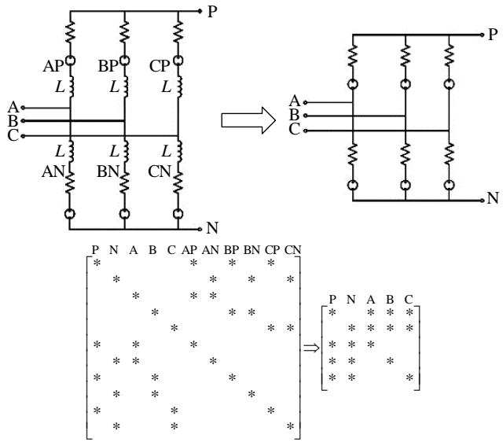  
图 2 MMC 导纳阵降阶示意图  
Fig. 2 Schematic diagram of MMC admittance array reduction

## 2 基于双向堆排序的不完全排序算法

## 2.1 最近电平逼近控制与排序均压算法实质分析

最近电平逼近控制(nearest level control，NLC)策略结合排序均压算法具有动态性能好，实现简单等优势。其基本原理如图 3 所示：由调制模块确定t 时刻需投入的子模块数量 n(t)，并对同一桥臂内的子模块电容电压进行排序，最后根据桥臂电流 $i _ { \mathrm { a r m } }$ 的方向选择不同的子模块投入。图 3中 ROUND 表示按照“四舍五入”原则进行取整。

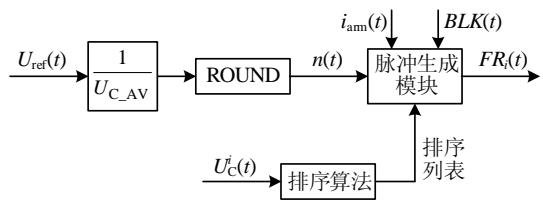  
图3 基于NLC的MMC 电容电压平衡算法原理图  
Fig. 3 Schematic diagram of MMC capacitor voltage balance algorithm based on NLC

值得注意的是，在电容电压平衡算法中排序的目的是确定前 n(t)个电容电压最大(小)的子模块的编号，不需要对筛选出来的 n(t)个子模块电压内部排序，也不用对未筛选出来的 $N - n ( t )$ 个电容电压排序。因此，对整个桥臂的子模块电容电压进行严格全排序是没有必要的。本文借助“TOP-K”问题的思想，充分节约不必要的排序计算，提出一种“基于双向堆排序的电容电压排序算法”。

## 2.2 基于双向堆排序的电容电压排序算法

“TOP-K”问题是指如何从大量源数据中获取最大(最小)的 K个数据，这与基于 NLC 的 MMC子模块电容电压排序目标完全一致。堆排序算法是解决“TOP-K”问题的经典算法，能够充分利用子模块电容电压的比较结果，发挥“堆”的特点，快速定位需要的子模块编号[21]。

图 4 为“堆”结构示意图，堆中的节点按照完全二叉树的形式构建。二叉树最顶端的节点为根节点。若一个节点下面与两个节点相连，则称该节点为下面两个节点的父节点，下面连接的两个节点为该节点的子节点。以图 4 为例，节点 0 为根节点，节点 3 是节点 7、8 的父节点，节点 7、8 是节点 3的子节点。

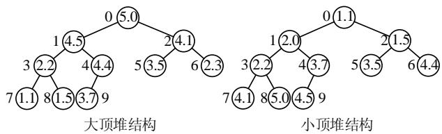  
图4 “堆”结构示意图  
Fig. 4 “Heap” structure diagram

将 MMC 中的子模块等效为堆结构中的节点：子模块电容电压值对应节点中的元素，子模块编号对应节点编号，以此构建 MMC 子模块“堆”。根据性质不同可分为大顶堆和小顶堆，以 MMC 子模块大顶堆为例，需满足 2 个特性：

1）每个父节点的子模块编号对应的电容电压值都不小于它下面的2个子节点的子模块编号对应的电容电压值。

2）根节点的子模块编号对应的电容电压值是大顶堆中所有子模块电容电压中的最大值。

筛选n(t)个最大的子模块电压和筛选 $N - n ( t )$ 个最小的子模块电容电压是等效的，可以灵活调整堆的结构和性质，进一步降低排序次数。因此，本文提出一种基于双向堆排序的电容电压排序算法，在不改变电容电压平衡效果的同时，充分避免不必要的排序。算法原理如下：

1）根据电流 $i _ { \mathrm { a r m } }$ 方向和调制模块输出的 n(t)进行判断，确定 MMC 子模块“堆”的性质及规模。分为以下 4 种情形：

①若 $i _ { \mathrm { a r m } } { \geq } 0 , n ( t ) < N / 2$ ，则取 n(t)个子模块编号，构建元素数量为 n(t)的大顶堆。

②若 $i _ { \mathrm { a r m } } { \geq } 0 , n ( t ) \geq N / 2$ ，则取 $N / 2 - n ( t )$ 个子模块编号，构建元素数量 $N / 2 - n ( t )$ 的小顶堆。

③若 $i _ { \mathrm { a r m } } { < } 0 , n ( t ) { < } N / 2$ ，则取 n(t)个子模块编

号，构建元素数量为 n(t)的小顶堆。

④若 $i _ { \mathrm { a r m } } { < } 0 , n ( t ) \ge N / 2$ ，则取 $N / 2 - n ( t )$ 个子模块编号，构建元素数量 $N / 2 - n ( t )$ 的大顶堆。

2）针对建立的大(小)顶堆结构，调整“堆”中的子模块编号，确保堆中的子模块编号指向的电容电压满足“堆”的性质。

以 MMC 子模块大顶堆为例，首先按照完全二叉树的结构，将子模块等效为节点，依次填入子模块编号；其次从堆中最后填入的子模块开始进行判断，左右子节点取较大的子模块电容电压值与父节点编号对应的子模块电容电压值比较，若子节点最大的电容电压值大于父节点中的电容电压值，则交换两个节点中的子模块编号；最后依照上述判断原则，从左至右、从下到上调整每一个父节点编号及其对应的子节点编号，最终使得构建的 MMC子模块“堆”满足大顶堆的两个特性。

3）将其余的子模块编号指向的电压依次与堆 顶根节点子模块编号指向的电压相比较。

若构建的堆为 MMC 子模块大顶堆，根节点子模块编号指向的电容电压值为最大值，则其余的子模块编号指向的电压分别与根节点子模块编号指向的电压比较，若比根节点电压大，则不进行处理；若比根节点电压小，则将该编号替换为根节点编号，再调整大顶堆的结构，满足大顶堆的性质。

同理，若构建的堆为 MMC 子模块小顶堆，则将剩余子模块编号指向的电压依次与根节点子模块编号指向的电压比较，在该编号指向的电压大于根节点编号指向的电压的情况下，将该编号替换为根节点子模块编号，再调整小顶堆的结构，恢复小顶堆的性质。

## 4）确定投入的子模块。

若需投入的子模块数量 $n ( t ) < N / 2$ ，则投入最终生成的大(小)顶堆中的所有子模块编号。

若需投入的子模块数量 $n ( t ) { \geq } N / 2$ ，则投入最终生成的大(小)顶堆之外剩余所有子模块的编号。

5）根据确定的子模块编号，生成相应的 IGBT触发信号，投入对应的 n(t)个子模块。

基于双向堆排序的电容电压排序算法，根据每一步的导通模块数量 $n ( t )$ 时时调整 MMC 子模块堆的规模和性质，利用“堆”的结构快速区分“堆”内子模块和“堆”外子模块，直接确定投入的子模块编号，而不对所有子模块进行全排序。双向选择则进一步降低了“堆”结构的规模，减少了排序次数，最大程度地减少运算量，提高MMC 高效模型的计算速度。

## 3 MMC高精度闭锁仿真

上述高效模型和均压算法能够实现MMC在解锁状态下精准快速仿真。当 MMC处于启动阶段或发生故障时，需将全部子模块或部分桥臂的子模块闭锁，全控型器件处于关断状态。在二极管的不控整流作用下，MMC 子模块状态与 $i _ { \mathrm { a r m } }$ 方向相关。MMC 单桥臂全部子模块的等效电阻和等效电压实际值如表 1所示：

表1 闭锁状态下单桥臂全部子模块等效参数的实际值  
Tab. 1 Actual value of equivalent parameters of all sub-modules of single bridge arm in the blocked state
<table><tr><td>条件</td><td>等效电阻</td><td>等效电压</td></tr><tr><td> $\dot { \iota } _ { \mathrm { a r m } } > 0$ </td><td> $N ( R _ { \mathrm { o f f } } / / ( R _ { \mathrm { o n } } + R _ { \mathrm { C } } ) )$ </td><td> $\frac { R _ { \mathrm { o f f } } } { R _ { \mathrm { o n } } + R _ { C } + R _ { \mathrm { o f f } } } { \cdot } \sum _ { i = 1 } ^ { N } u _ { \mathrm { C } } ^ { i }$ </td></tr><tr><td> $i _ { \mathrm { a r m } } { \le } 0$ </td><td> $N ( R _ { \mathrm { o n } } / / ( R _ { \mathrm { o f f } } + R _ { \mathrm { C } } ) )$ </td><td> $\frac { R _ { \mathrm { o n } } } { R _ { \mathrm { o n } } + R _ { C } + R _ { \mathrm { o f f } } } { \cdot } \sum _ { i = 1 } ^ { N } u _ { \mathrm { C } } ^ { i }$ </td></tr></table>

不同的桥臂电流方向对应不同的等效模式。电磁暂态仿真软件往往采用定步长仿真算法，若不考虑二极管插值作用，等效模式只能在仿真步长整数倍的时间点改变并进行后续计算，将产生大量的畸变点，严重影响 MMC电磁暂态仿真的精确性。文献[22]利用 PSCAD程序中自带的二极管进行插值，提出了一种改进的 MMC 桥臂等效模型，但此方法增加了求解电路的维度，且等效精度欠佳。

为更精确模拟 MMC 闭锁状态，本文采用虚拟二极管的方式。如图 5所示，在投入全部子模块的同时，每个桥臂中均调用两个虚拟二极管，一个为正向串联虚拟二极管 $\mathrm { D } _ { 1 } ,$ ，一个为反向并联虚拟二极管 $\mathbf { D } _ { 2 }$ ，采用表 2 所示的导通电阻和关断电阻。

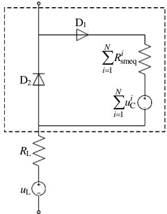  
图 5 MMC 单个桥臂等效结构图  
Fig. 5 MMC single bridge arm equivalent structure diagram

表2 闭锁状态下虚拟二级管参数的取值  
Tab. 2 The value of the virtual diode parameters in the blocked state
<table><tr><td>二极管编号</td><td> $R _ { \mathrm { o n } }$ </td><td> $R _ { \mathrm { o f f } }$ </td></tr><tr><td> $\mathrm { D } _ { 1 }$ </td><td> $1 0 ^ { - 6 }$ </td><td> $N ( R _ { \mathrm { o f f } } + R _ { \mathrm { C } } )$ </td></tr><tr><td> $\mathrm { D } _ { 2 }$ </td><td> $N R _ { \mathrm { o n } }$ </td><td> $1 0 ^ { 9 }$ </td></tr></table>

$\mathrm { D } _ { 1 }$ 的导通电阻应取 0，但取 0 后会导致导纳矩阵奇异，需额外增加计算量，亦可能造成错误的矩阵求逆结果。为了保证计算的稳定性，设置导通电阻为 $1 \mu \Omega _ { \circ } \textrm { D } _ { 2 }$ 的关断电阻应取无穷大，在仿真中使用 1G 模拟无穷大。因此，采用虚拟二极管后的 MMC 闭锁等效电阻和等效电压如表 3 所示。其中， $R _ { \mathrm { i n } } = R _ { \mathrm { o n } } / / ( R _ { \mathrm { o n } } + R _ { \mathrm { o f f } } + R _ { \mathrm { C } } ) \ll R _ { \mathrm { o f f } } , R _ { \mathrm { o f f } } / ( R _ { \mathrm { o n } } + R _ { \mathrm { C } } +$ $R _ { \mathrm { o f f } } ) \approx 1$

表3 采用虚拟二极管后单桥臂全部子模块的等效参数值  
Tab. 3 Equivalent parameter value of all submodules of single bridge arm after using virtual diode
<table><tr><td>条件</td><td>等效电阻</td><td>等效电压</td></tr><tr><td> $i _ { \mathrm { a r m } } > 0$ </td><td> $1 0 ^ { - 6 } + N ( R _ { \mathrm { o f f } } / / ( R _ { \mathrm { o n } } + R _ { \mathrm { C } } ) )$ </td><td> $\frac { R _ { \mathrm { o f f } } } { R _ { \mathrm { o n } } + R _ { C } + R _ { \mathrm { o f f } } } { \cdot } \sum _ { i = 1 } ^ { N } u _ { \mathrm { C } } ^ { i }$  M</td></tr><tr><td> $\dot { l } _ { \mathrm { a r m } } { \le } 0$ </td><td> $N ( R _ { \mathrm { o n } } / / ( R _ { \mathrm { o f f } } + R _ { \mathrm { C } } + R _ { \mathrm { i n } } ) )$ </td><td> $\frac { R _ { \mathrm { o n } } } { R _ { \mathrm { o n } } + R _ { \mathrm { C } } + R _ { \mathrm { o f f } } } . \frac { R _ { \mathrm { o f f } } } { R _ { \mathrm { o n } } + R _ { \mathrm { C } } + R _ { \mathrm { o f f } } }$ </td></tr></table>

对比表 1 和3 中的等效参数值，本文在不增加内部节点的同时，通过正确设置二极管参数，对闭锁状态的处理误差极小。

值得注意的是，针对 MMC 闭锁瞬间可能进行的插值运算，为保证闭锁初始时刻计算正确，避免插值错误，本文在 MMC 解锁时虽不投入虚拟二极管，但需保留虚拟二极管的更新历史变量函数。即不调用二极管插值函数和闭锁等效模型的同时，根据 $i _ { \mathrm { a r m } }$ 方向每一步更新虚拟二极管的历史变量。

若 $i _ { \mathrm { a r m } } { \le } 0$ ，则根据表4更新历史变量，若 $i _ { \mathrm { a r m } } > 0$ 则根据表 5更新历史变量。通过合理设置虚拟二极管参数和时时更新历史变量，能够实现 MMC在任意闭锁时刻的高精度仿真，并将通过仿真算例验证上述处理方式的精确性。

表4 虚拟二极管历史变量更新方式A  
Tab. 4 Virtual diode state variable update method A
<table><tr><td>二极管编号</td><td>开关状态</td><td>电压</td><td>电流</td></tr><tr><td> $\mathrm { D } _ { 1 }$ </td><td>关断</td><td> $u _ { \mathrm { a r m } } ( t ) - u _ { \mathrm { L } } ( t ) - \sum _ { i = 1 } ^ { N } u _ { \mathrm { C } } ^ { i } ( t )$ </td><td>0</td></tr><tr><td> $\mathrm { D } _ { 2 }$ </td><td>导通</td><td> $u _ { \mathrm { L } } ( t ) - u _ { \mathrm { a r m } } ( t )$ </td><td> $- i _ { \mathrm { a r m } } ( t )$ </td></tr></table>

表5 虚拟二极管历史变量更新方式B

Tab. 5 Virtual diode state variable update method B
<table><tr><td>二极管编号</td><td>开关状态</td><td> $\mathbb { E } \mathbb { E }$ </td><td>电流</td></tr><tr><td> $\mathrm { D } _ { 1 }$ </td><td>导通</td><td> $u _ { \mathrm { a r m } } ( t ) - u _ { \mathrm { L } } ( t ) - \sum _ { i = 1 } ^ { N } u _ { \mathrm { C } } ^ { i } ( t )$ </td><td> $i _ { \mathrm { a r m } } ( t )$ </td></tr><tr><td> $\mathrm { D } _ { 2 }$ </td><td>关断</td><td> $u _ { \mathrm { L } } ( t ) - u _ { \mathrm { a r m } } ( t )$ </td><td>0</td></tr></table>

## 4 仿真验证

为验证本文提出的MMC高效电磁暂态仿真方法的精确性和高效性，在由中国电力科学研究院独立研制开发的 PSModel(Power System Model)电磁暂态仿真软件中，基于文章提出的 MMC 高效电磁暂态仿真方法开发了 MMC 高效模型，简称 PSModel高效模型。利用 Matlab 和 PSCAD/EMTDC 搭建相应的 MMC测试系统，比较 PSModel高效模型的精确度和速度。

## 4.1 模型准确性测试

在Matlab中搭建如图6所示的5电平MMC双端详细模型，采用 2s 的定仿真步长进行仿真，设置工况：0.4sMMC 逆变侧解锁，0.5s整流侧解锁，1s 直流线路发生接地故障，1.005s MMC 闭锁。参数如附录表 A1 所示。

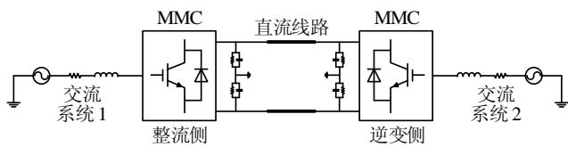  
图 6 双端 MMC-HVDC 测试系统  
Fig. 6 Double-ended MMC-HVDC test system

同理，在 PSModel 中搭建完全一致的测试系统，设置同样的工况，仿真时间和步长也完全一致。将电流电压波形曲线与 Matlab 详细模型比较。

PSModel 高效模型与 Matlab 详细模型的整流侧 B 相交流电压、A相上桥臂电流、直流电压和直流电流如图 7 所示。其中红色曲线是 PSModel 高效模型的计算波形，蓝色曲线是 Matlab详细模型的计算波形。

对比结果可知，PSModel 高效模型与 Matlab详细模型在各种模式下的计算结果误差都很小。为更清晰比较 PSModel 高效模型的仿真精度，表 6 统计了 PSModel 各波形与 Matlab 详细模型波形的最大误差。PSModel 高效模型闭锁误差在 0.02%以内，能够实现 MMC 的高精度闭锁仿真。MMC 正常运行时仿真误差小于基于后退欧拉法等效模型仿真精度误差 0.18%[10]。

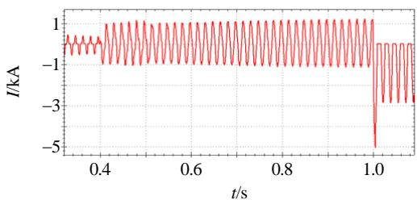  
(a) A相上桥臂电流

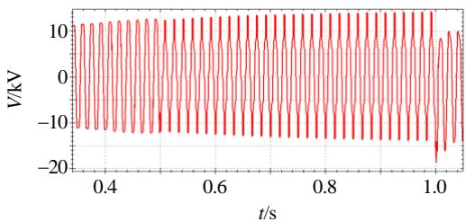  
(b) B相交流电压

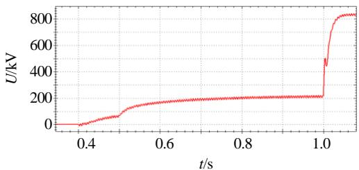  
(c) 直流电压

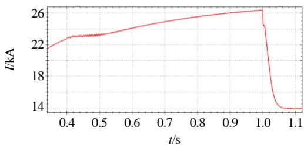  
(d) 直流电流  
图 7 5 电平 MMC 波形对比图

Fig. 7 5-level MMC waveform comparison chart  
表 6 仿真误差对比  
Tab. 6 Simulation error comparison
<table><tr><td>物理量</td><td>闭锁误差/%</td><td>运行误差/%</td></tr><tr><td>交流侧电压</td><td>0.0080</td><td>0.022</td></tr><tr><td>交流侧电流</td><td>0.0170</td><td>0.119</td></tr><tr><td>直流侧电压</td><td>0.0060</td><td>0.114</td></tr><tr><td>直流侧电流</td><td>0.0001</td><td>0.061</td></tr></table>

为验证 PSModel 高效模型在保持高精度仿真的同时，能够消除数值振荡。在 PSCAD 中使用基于梯形法的MMC戴维南等效模型，搭建电平数为201的双端系统，参数如附录表 A2 所示，并使用PSModel 高效模型搭建同样系统。分别使用 5 和20s 的仿真步长。

图 8(a)为 PSCAD 整流侧直流电压，红色为采用 5s 时仿真结果，蓝色为采用 20s 时的仿真结果，当仿真步长为 20s 时，PSCAD 计算中出现了数值振荡；图 8(b)为 PSModel 整流侧直流电压，红色为 5s 仿真结果，蓝色为 20s 仿真结果；图 8(c)进一步对比 PSCAD 和 PSModel 在 $2 0 \mu \mathrm { s }$ 时的整流侧直流电压，黑色是 PSModel 波形，红色是 PSCAD波形，可见 PSModel 高效模型计算稳定，没有出现类似于 PSCAD 的数值振荡。图 8(d)为 C 相上桥臂投入子模块的数量发生了改变，导致网络结构变化。图 8(e)展现了 PSModel 高效模型中在网络结构变化的取值。

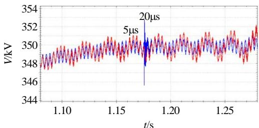  
(a) PSCAD不同步长下的直流电压

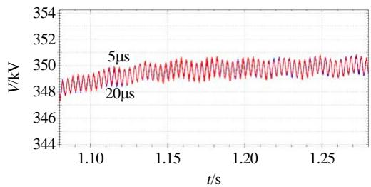  
(b) PSModel不同步长下的直流电压

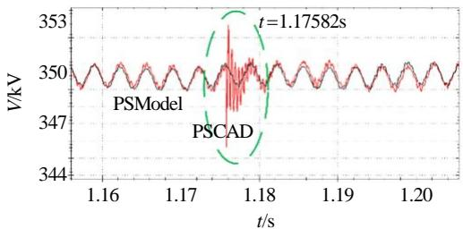  
(c) 同一步长下 PSCAD 与 PSModel 的直流电压

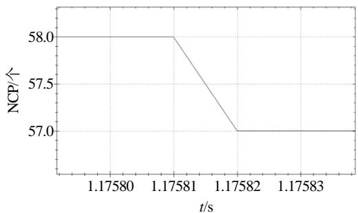  
(d) C相上桥臂导通子模块数量

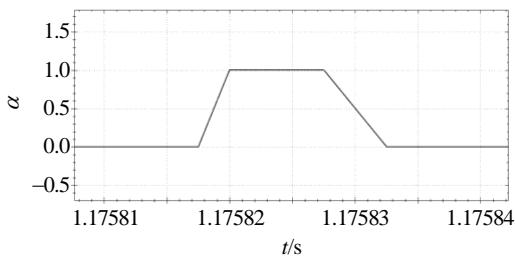  
(e) PSModel 中  取值  
图 8 201 个电平双端 MMC-HVDC 系统波形对比图  
Fig. 8 201 level double-ended MMC-HVDC system waveform comparison chart

由仿真结果可知，PSModel 模型灵活改变积分算法，在网络结构变化后使用后退欧拉法，有效地避免了数值振荡。

对比 Matlab 5 电平双端测试系统和 PSCAD201 电平测试系统计算结果，可以得出结论：PSModel 高效模型精度高的同时能避免数值振荡，对步长具有更好的适应性，完全能够满足大电网电磁暂态仿真对精度的要求。

## 4.2 模型速度测试

为测试 PSModel 高效模型的计算速度，采用Intel i7-6500 CPU(主频为 2.5GHz)做计算对比，对照 使 用 的 PSCAD/EMTDC 的 版 本 为 4.6.0.0Professional。

在 PSCAD/EMTDC 中使用 MMC 经典戴维南等效模型，搭建图 6 所示的双端 MMC-HVDC 三相开环测试系统，参数设置如附录 A中表 A3 所示。$R _ { \mathrm { o n } }$ 为 0.01， $R _ { \mathrm { o f f } }$ 为 1M，排序算法为快速排序算法。利用 PSModel 高效模型，在 PSModel 中搭建控制系统与拓扑结构完全一样的测试系统。以 401个电平为例，采用 $1 0 \mu \mathrm { s }$ 的仿真步长，对比典型电压电流波形。

PSModel 高效模型与 PSCAD 等效模型的整流侧 B 相上桥臂电流、直流电压和直流电流如图 9所示。其中红色曲线是 PSModel 计算波形，蓝色曲线是 PSCAD 计算波形。在此测试中，PSModel 高效模型与PSCAD戴维南等效模型仿真结果基本重合。

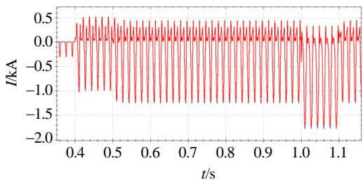  
(a) B 相上桥臂电流

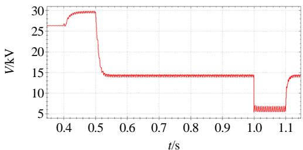  
(b) 直流电压

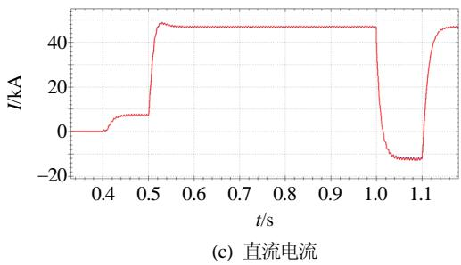  
图9 401 电平MMC 整流侧波形对比图  
Fig. 9 401-level MMC rectifier side waveform comparison chart

为了测试文章所提桥臂等效模型和排序算法的提速效果，在上述双端测试系统中，分别使用PSCAD 戴维南等效模型、PSModel 等效模型(经典快速排序算法)和 PSModel 高效模型(双向堆不完全排序算法)，采用 10s 仿真步长，计算子模块数量为 4、10、40、100、200、300、400、800 情形，仿真时长为 1.5s。表 7为 MMC 测试系统仿真用时，定义加速比 1 为 PSCAD 等效模型仿真用时与PSModel 等效模型的比，定义加速比 2 为 PSCAD等效模型仿真用时与 PSModel 高效模型的比。

对比PSCAD模型和PSModel等效模型(传统全排算法)的仿真时长和加速比，在排序算法一致时，消去 MMC内部节点，使用桥臂戴维南等效模型能提升 MMC模型的计算速度；对比 PSModel 等效模型和本文提出的 PSModel 高效模型的仿真时长，电容电压排序算法对 MMC 模型的计算速度影响很大，基于双向堆排序的不完全电容电压排序算法能够有效地提升 MMC 等效模型的计算速度。在保持MMC 等效模型精度不变的前提下，PSModel 高效模型与 PSCAD 模型相比，计算速度显著提升，并且随着子模块数量的增多，这种提速效果越明显，更适用于实际 MMC 系统的仿真计算。

表 7 MMC 测试系统仿真用时  
Tab. 7 The simulation time of MMC test system
<table><tr><td rowspan="2">子模块 数/个</td><td colspan="3">仿真用时/s</td><td rowspan="2">1</td><td rowspan="2">加速比 加速比 2</td></tr><tr><td>PSCAD 等效模型</td><td>PSModel等效模型 (传统排序算法)</td><td>PSModel 高效模型</td></tr><tr><td>4</td><td>8.44</td><td>1.93</td><td>1.59</td><td>4.37</td><td>5.31</td></tr><tr><td>10</td><td>12.13</td><td>2.85</td><td>2.61</td><td>4.26</td><td>4.65</td></tr><tr><td>40</td><td>20.81</td><td>8.82</td><td>4.55</td><td>2.36</td><td>4.57</td></tr><tr><td>100</td><td>49.04</td><td>35.41</td><td>8.80</td><td>1.38</td><td>5.57</td></tr><tr><td>200</td><td>132.62</td><td>83.25</td><td>17.39</td><td>1.59</td><td>7.63</td></tr><tr><td>300</td><td>296.93</td><td>186.31</td><td>28.99</td><td>1.59</td><td>10.24</td></tr><tr><td>400</td><td>576.01</td><td>347.19</td><td>39.92</td><td>1.66</td><td>14.43</td></tr><tr><td>800</td><td>2215.02</td><td>1609.28</td><td>91.71</td><td>1.38</td><td>24.15</td></tr></table>

## 5 结论

针对MMC在子模块数量众多时电磁暂态仿真效率低下，难以适用于大型交直流电力系统全电磁暂态仿真分析的难题，本文从 3 个方面对 MMC 的等效方式和排序算法进行优化，在保证 MMC模型高仿真精度的同时，显著提升了计算速度。

1）基于灵活切换算法离散化 MMC 模型，协调了“数值振荡”与 MMC模型高精度之间的矛盾，确保模型计算准确无误；并基于嵌套快速同时求解法对桥臂电感支路进行等效，进一步削减内部节点数量，降低导纳阵规模，提高了仿真速度。

2）对 MMC 最近电平逼近控制策略进行了深入分析，挖掘不必要的排序计算，在不降低子模块电容电压均衡效果的基础上，提出了“基于双向堆排序的不完全电容电压排序算法”，对模型进一步提速。

3）针对 MMC 闭锁后的等效模型与桥臂电流方向有关，采用虚拟二极管的方式实现 MMC闭锁时精确仿真，解决二极管的插值问题，提高了 MMC在闭锁情况下仿真的精确度。

对比测试结果表明，本文提出的上述算法改进，相比 PSCAD 内置的 MMC 戴维南等效模型具有较大的优势，能够应用于大电网全电磁暂态仿真计算。

## 参考文献

[1] 刘文焯，汤涌，侯俊贤，等．考虑任意重事件发生的多步变步长电磁暂态仿真算法[J]．中国电机工程学报，2009，29(34)：9-15Liu Wenzhuo，Tang Yong，Hou Junxian，et al．Simulationalgorithm for multi variable-step electromagnetic transientconsidering multiple events[J]．Proceedings of the CSEE，2009，29(34)：9-15(in Chinese)

[2] 姚良忠，吴婧，王志冰，等．未来高压直流电网发展形态分析[J]．中国电机工程学报，2014，34(34)：6007-6020Yao Liangzhong，Wu Jing，Wang Zhibing，et al．Patternanalysis of future HVDC grid development[J]Proceedings of the CSEE，2014，34(34)：6007-6020(inChinese)

[3] Chen Yanfei，Moreno R，Strbac G，et al．Coordination strategies for securing AC/DC flexible transmission networks with renewables[J]．IEEE Transactions on Power Systems，2018，33(6)：6309-6320．

[4] Xu Feng，Xu Zheng，Zheng Huan，et al．A tripole HVDCsystem based on modular multilevel converters[J]．IEEETransactions on Power Delivery，2014，29(4)：1683-1691

[5] 钱照明，张军明，盛况．电力电子器件及其应用的现状和发展[J]．中国电机工程学报，2014，34(29)：5149-5161．Qian Zhaoming，Zhang Junming，Sheng Kuang．Statusand development of power semiconductor devices and itsapplications[J]．Proceedings of the CSEE，2014，34(29)：5149-5161(in Chinese)

[6] Xu Jianzhong，Zhao Chengyong，Liu Wenjing，et al Accelerated model of modular multilevel converters in PSCAD/EMTDC[C]//2013 IEEE Power & Energy Society General Meeting．Vancouver，BC，Canada：IEEE，2013．

[7] 赵成勇．柔性直流输电建模和仿真技术[M]．北京：中国电力出版社，2014：83-97Zhao Chengyong ． Flexible HVDC modeling andsimulation technology[M]．Beijing：China Electric PowerPress，2014：83-97(in Chinese)

[8] 王成山，彭克，孙绪江，等．分布式发电系统电力电子控制器通用建模方法[J]．电力系统自动化，2012，36(18)：122-127Wang Chengshan，Peng Ke，Sun Xujiang，et al．Universalmodeling method of power electronics controller fordistributed generation system[J]．Automation of ElectricPower Systems，2012，36(18)：122-127(in Chinese)

[9] Gnanarathna U N，Gole A M，Jayasinghe R P．Efficient modeling of modular multilevel HVDC converters (MMC) on electromagnetic transient simulation programs[J]．IEEE Transactions on Power Delivery， 2011，26(1)：316-324

[10] 许建中．模块化多电平换流器电磁暂态高效建模方法研究[D]．北京：华北电力大学，2014Xu Jianzhong．Research on the electromagnetic tansientefficient modelling method of modular multilevelconverter[D] ． Beijing ： North China Electric PowerUniversity，2014(in Chinese)

[11] 石璐，李嘉龙，赵成勇，等．双半桥与并联全桥子模块混合MMC均压与直流故障控制研究[J]．中国电机工程学报，2018，38(21)：6411-6419Shi Lu，Li Jialong，Zhao Chengyong，et al．Research oncontrol method of voltage balance and DC fault clearanceof hybrid MMC composed of D-HBSM and P-FBSM[J]Proceedings of the CSEE，2018，38(21)：6411-6419(inChinese)

[12] Wang Tao，Lin Hua，Wang Zhe，et al．A fast selection algorithm based on binary numbers for capacitor voltage balance in modular multilevel converter[C]//2018 IEEE Applied Power Electronics Conference and Exposition (APEC)．San Antonio，TX，USA：IEEE，2018

[13] Filbà-martínez À ，Busquets-Monge S，Bordonau J

Modulation and capacitor voltage balancing control of multilevel NPC dual active bridge DC-DC converters[J] IEEE Transactions on Industrial Electronics，2020，67(4)： 2499-2510

[14] 苟鑫，卢继平，刘加林，等．一种基于子模块投入优先级的模块化多电平换流器电容电压均衡控制策略[J]．中国电机工程学报，2019，39(24)：7299-7310Gou Xin，Lu Jiping，Liu Jialin，et al．A capacitor voltagebalancing control method for modular multilevel converterbased on insertion priority of the sub-modules[J]Proceedings of the CSEE，2019，39(24)：7299-7310(inChinese)

[15] 李国庆，王威儒，辛业春，等．模块化多电平换流器子模块分组排序调制策略[J]．高电压技术，2018，44(7)：2107-2114Li Guoqing，Wang Weiru，Xin Yechun，et al．Sub-modulegrouping modulation strategy of modular multilevelconverter[J]．High Voltage Engineering，2018，44(7)：2107-2114(in Chinese)

[16] 何智鹏，许建中，苑宾，等．采用质因子分解法与希尔排序算法的 MMC 电容均压策略[J]．中国电机工程学报，2015，35(12)：2980-2988He Zhipeng，Xu Jianzhong，Yuan Bin，et al．A capacitorvoltage balancing strategy adopting prime factorizationmethod and shell sorting algorithm for modular multilevelconverter[J]．Proceedings of the CSEE，2015，35(12)：2980-2988(in Chinese)

[17] 徐义良，赵禹辰，赵成勇，等．适用于梯形法 MMC 等效模型的线性排序均压算法[J]．中国电机工程学报，2017，37(16)：4747-4757Xu Yiliang，Zhao Yuchen，Zhao Chengyong，et al．A linearranking algorithm for trapezoidal rule based MMCequivalent models[J]．Proceedings of the CSEE，2017，37(16)：4747-4757(in Chinese)

[18] 粟时平，魏新伟，牛鼎，等．模块化多电平换流器电容电压改进排序平衡方法[J]．中国电机工程学报，2017，37(13)：3874-3882Su Shiping ， Wei Xinwei ， Niu Ding ， et al ． Amodified-sorting balancing method of capacitor voltagefor modular multilevel converter[J]．Proceedings of theCSEE，2017，37(13)：3874-3882(in Chinese)

[19] 徐政．柔性直流输电系统[M]．北京：机械工业出版社，2000：378-379Xu Zheng．Flexible DC power transmission system[M]Beijing：Mechanical Industry Press，2000：378-379(inChinese)

[20] Dommel H W．电力系统电磁暂态计算理论[M]．李永庄，林集明，曾昭华，译．北京：水利电力出版社，1991：14-17Dommel H W ． Theory of electromagnetic transient

calculation of power system[M]．Li Yongzhuang，LinJiming，Zeng Zhaohua，Trans. Beijing：Water PowerPress，1991：14-17(in Chinese)

[21] Grammatikakis M D，Liesche S．Priority queues and sorting methods for parallel simulation[J] ． IEEE Transactions on Software Engineering，2000，26(5)： 401-422

[22] 唐庚，徐政，刘昇．改进式模块化多电平换流器快速仿真方法[J]．电力系统自动化，2014，38(24)：56-61，85Tang Geng，Xu Zheng，Liu Sheng．Improved fast modelof the modular multilevel converter[J]．Automation ofElectric Power Systems，2014，38(24)：56-61，85(inChinese)

## 附录 A

表A1 仿真算例背景数据  
Tab. A1 Simulation parameters
<table><tr><td>参数</td><td>数值</td><td>参数</td><td>数值</td></tr><tr><td>交流电网电压/kV</td><td>20</td><td>桥臂电感/mH</td><td>3.6</td></tr><tr><td>交流电网等值电阻/Ω</td><td>5</td><td>子模块电容/mF</td><td>12</td></tr><tr><td>交流系统等值电感/mH</td><td>3.6</td><td>子模块电压/kV</td><td>5</td></tr><tr><td>直流母线电压/kV</td><td>20</td><td>直流侧电容器/uF</td><td>500</td></tr></table>

表A2 仿真算例背景数据

Tab. A2 Simulation parameters
<table><tr><td>参数</td><td>数值</td><td>参数</td><td>数值</td></tr><tr><td>交流电网电压/kV</td><td>525</td><td>桥臂电感/mH</td><td>50</td></tr><tr><td>交流电网等值电阻/Ω</td><td>0.1542</td><td>子模块电容/mF</td><td>10</td></tr><tr><td>交流系统等值电感/mH</td><td>9.8</td><td>子模块电压/kV</td><td>1.75</td></tr><tr><td>直流母线电压/kV</td><td>350</td><td>直流侧电容器/uF</td><td>25</td></tr></table>

表 A3 仿真算例背景数据

Tab. A3 Simulation parameters
<table><tr><td>参数</td><td>数值</td><td>参数</td><td>数值</td></tr><tr><td>交流电网电压/kV</td><td>20</td><td>桥臂电感/mH</td><td>3.6</td></tr><tr><td>交流电网等值电阻/Ω</td><td>5</td><td>子模块电容/mF</td><td>12</td></tr><tr><td>交流系统等值电感/mH</td><td>3.6</td><td>子模块电压/kV</td><td>0.05</td></tr><tr><td>直流母线电压/kV</td><td>20</td><td>直流侧电容器/uF</td><td>500</td></tr></table>

在线出版日期：2020-07-03。

收稿日期：2020-03-12。

连攀杰

作者简介：

连攀杰(1994)，男，博士研究生，研究方向为电磁暂态仿真技术，1225601442@qq.com；

刘文焯(1972)，男，硕士，高级工程师，研究方向为电力系统仿真与分析技术、相关软件开发工作等，liuwzh@epri.ac.cn；

汤涌(1959)，男，博士，教授级高级工程师，博士生导师，研究方向为电力系统仿真分析与稳定控制。

(责任编辑 吕鲜艳)

# Research on Efficient Electromagnetic Transient Simulation Method of Modular Multilevel Converter

LIAN Panjie, LIU Wenzhuo, TANG Yong, YANG Zedong, YU Shuyan, LI Xia

(China Electric Power Research Institute)

KEY WORDS: modular multilevel converter (MMC); electromagnetic transients; flexible switching algorithm; capacitor voltage sequencing; the algorithm of bidirectional heap sequencing

The flexible DC electromagnetic transient simulation model based on the modular multilevel converter (MMC) has a major impact on the early stage design of large-scale AC/DC hybrid system stability analysis, fault analysis, control protection strategy design and verification. However, with the increase in the number of sub-modules in MMC, the existing equivalent model simulation efficiency is low, which is not suitable for large-scale power system full electromagnetic transient simulation.

Based on the MMC Thevenin equivalent model, this article optimizes the MMC model equivalent method and sorting algorithm from the following three aspects:

The article uses the following discretization formula to discretize the inductance and capacitance branches, and ensures the calculation of the MMC model is accurate through flexible switching algorithms. And based on the nested fast simultaneous solution method, the inductance branch of the bridge arm is equivalent to achieve the goal of reducing the number of internal nodes of the MMC and reducing the size of the admittance array;

$$
C \cdot \frac { u _ { \mathrm { c } } ( t ) - u _ { \mathrm { c } } ( t - \Delta t ) } { \Delta t } = \frac { ( 1 + \alpha ) i _ { \mathrm { c } } ( t ) + ( 1 - \alpha ) i _ { \mathrm { c } } ( t - \Delta t ) } { 2 }\tag{1}
$$

$$
L \cdot \frac { i _ { \mathrm { L } } ( t ) - i _ { \mathrm { L } } ( t - \Delta t ) } { \Delta t } = \frac { ( 1 + \alpha ) u _ { \mathrm { L } } ( t ) + ( 1 - \alpha ) u _ { \mathrm { L } } ( t - \Delta t ) } { 2 }\tag{2}
$$

Then the nearest level control(NLC) is analyzed and unnecessary ranking calculations are mined. Using the structure of the “heap” shown in Fig. 1, the sub modules in the “heap” and the sub modules outside the “heap” are quickly distinguished. On the premise of not reducing the sub-module capacitor voltage balancing effect, an incomplete sorting algorithm based on bidirectional stack sorting is proposed to further speed

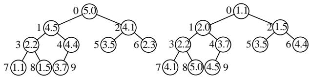  
Big top of the heap structure  
Small heap of top structure  
Fig. 1 "Heap" structure diagram

up the MMC model.

Finally, the equivalent model after MMC blocking is related to the current direction of the bridge arm. The virtual diode is used to achieve accurate simulation when MMC is locked, and the problem of diode interpolation is solved.

In order to verify the accuracy and efficiency of the MMC efficient electromagnetic transient simulation method proposed in this paper, the PSModel efficient model is developed on the PSModel (power system model) electromagnetic transient simulation software platform. Then we use MATLAB and PSCAD / EMTDC to build the corresponding test system, and compare the accuracy and speed of PSModel efficient model.

Tab. 1 shows the high accuracy of the PSModel efficient model. Tab. 2 shows the fast calculation speed of the PSModel high-efficiency model. The comparison test results show that the above-mentioned algorithm improvements proposed in this paper have greater advantages than the MMC Thevenin equivalent model built in PSCAD, and can be applied to the full electromagnetic transient simulation calculation of large power grids.

Tab. 1 Simulation error comparison
<table><tr><td>Electrical quantity</td><td>Blocking error/%</td><td>Error when unlocking/%</td></tr><tr><td> $U _ { \mathrm { a c } }$ </td><td>0.0080</td><td>0.022</td></tr><tr><td> $I _ { \mathrm { a c } }$ </td><td>0.0170</td><td>0.119</td></tr><tr><td> $U _ { \mathrm { d c } }$ </td><td>0.0060</td><td>0.114</td></tr><tr><td> $\underline { { I _ { \mathrm { d c } } } }$ </td><td>0.0001</td><td>0.061</td></tr></table>

Tab. 2 The simulation time of MMC test system
<table><tr><td rowspan="2">Number of sub-modules</td><td colspan="3">Simulation time/s</td></tr><tr><td>PSCAD</td><td>PSModel equivalent model</td><td>PSModel</td></tr><tr><td></td><td></td><td>equivalent model (traditional sorting algorithm) efficient model</td><td></td></tr><tr><td>4 10</td><td>8.44</td><td>1.93</td><td>1.59</td></tr><tr><td>40</td><td>12.13</td><td>2.85</td><td>2.61</td></tr><tr><td>100</td><td>20.81</td><td>8.82</td><td>4.55</td></tr><tr><td>200</td><td>49.04</td><td>35.41</td><td>8.80</td></tr><tr><td>300</td><td>132.62</td><td>83.25</td><td>17.39</td></tr><tr><td></td><td>296.93</td><td>186.31</td><td>28.99</td></tr><tr><td>400</td><td>576.01</td><td>347.19</td><td>39.92</td></tr><tr><td>800</td><td>2215.02</td><td>1609.28</td><td>91.71</td></tr></table>