# 变流器并列运行系统中非特征谐波环流分析及其抑制方法

胡应宏 1 ，邓春 1 ，王劲松 1 ，李雨 1 ，谢小荣 2 ，刘少宇 3 ，刁嘉 4 ，任佳佳 5

(1．华北电力科学研究院有限责任公司，北京市 西城区 100045；

2．清华大学 电机系，北京市 海淀区 100084；

3．国网冀北电力有限公司，北京市 西城区 100045；

4．国网新源张家口风光储示范电站有限公司，河北省 张家口市 075001；

5．哈尔滨工业大学 电气工程及自动化学院，黑龙江省 哈尔滨市 150001）

# Analysis on Non-Characteristic Harmonic Circulating Current in Parallel Inverter System and Its Suppression Measures

HU Yinghong1 , DENG Chun1 , WANG Jinsong1 , LI Yu1 , XIE Xiaorong2 , LIU Shaoyu3 , DIAO Jia4 , REN Jiajia5

(1. North China Electric Power Research Institute Co., Ltd., Xicheng District, Beijing 100045, China;

2. Dept. of Electrical Engineering, Tsinghua University, Haidian District, Beijing 100084,China; 3. State Grid Jibei Electric

Power Co., Ltd., Xicheng District, Beijing 100045, China; 4. State Grid Xinyuan Zhangjiakou Wind Photovoltaic Storage and

Transmission Pilot Power Station Co., Ltd., Zhangjiakou 075001, Hebei Province, China; 5. School of Electrical Engineering &

Automation, Haerbin Institute of Technology, Haerbin 150001, Heilongjiang Province, China)

ABSTRACT: In Jibei power grid, non-characteristic harmonic circulating current appeared several times and a fault occurred in parallel converters in a 500 kV station. Taking this fault as an example, recorded fault data were analyzed, finding out non-characteristic harmonic circulating current existing in several parallel converters. Analysis of relationship between the problem and parallel converter topology indicated that the problem was liable to appear in cascaded H-bridge multilevel converters. Reappearance of the phenomenon was realized with electromagnetic transient simulation. Simulation results showed validity of the proposed conclusion. Finally, countermeasures were proposed to solve the problem.

KEY WORDS: converter; parallel operation; non-characteristic harmonic circulating current; power electronics

摘要：冀北电网中，先后出现了变流器的非特征次谐波环流问题。某500 kV变电站变流器并联运行时发生了一次故障，以该故障为例，通过分析变流器故障录波数据，发现多台变流器并列运行容易发生非特征谐波环流。通过分析环流与变流器拓扑结构之间的关系，得出级联 H 桥多电平变流器更容易发生非特征谐波环流；然后，通过电磁暂态仿真复现了故障现象，仿真结果验证了所得结论的正确性。最后，提出了解决非特征次谐波环流的措施。

关键词：变流器；并列运行；非特征次谐波环流；电力电子

DOI：10.13335/j.1000-3673.pst.2016.07.035

# 0 引言

随着 FACTS 技术、新能源的迅速发展，变流器在电力系统中的并网运行，在数量和容量上都呈现快速增长的态势，但由此也带来了变流器之间环流的问题[1-3]。文献[4]通过并联逆变器具有相同的特性，即相同的输出阻抗、电压幅值与相位来实现功率分配来避免环流问题。文献[5]提出一种基于瞬时电流控制的电流权重分配控制方式，允许不同额定容量逆变器并联运行，通过在每个逆变器控制器中增加一个电路实现按额定容量分配功率。针对变流器的小信号模型建模、并联系统环流抑制以及改进滤波器应用等也有广泛研究[6-11]。针对模块化多电平拓扑结构存在的内部环流，文献[12-14]从不同的角度设计了环流抑制控制器，显著降低了内部环流。已有的谐波环流，主要是针对变流器的特征次谐波的环流，在电气距离上较近，此种类型的环流对象确定，环流频率固定，在治理措施上较易采取措施，已有成功治理此类环流的案例。但针对区域之间的环流，也就是非特征次谐波环流，存在环流对象不确定、环流频率也不固定的问题，在治理措

施上，较难采用已有策略，故有必要对多变流器或区域之间的非特征次环流作进一步的研究。

2015年5月3日冀北电网某变电站并联运行的变流器其中一台保护动作跳闸。7 月，再次在 2 个风电场之间发现了类似现象，分析其波形发现 2 台变流器在保护动作前电流波形都存在较大的谐波分量，而升压变压器高压侧不存在明显的谐波电流。多个风电场运行时也会产生类似谐波电流环流现象。本文结合本次故障现象，从变流器的拓扑结构、运行机理分析了多台变流器并联运行时产生非特征次谐波环流的原因，指出级联 H桥结构最容易产生非特征次谐波环流，并进一步分析风电场并列运行时也存在谐波环流的风险。最后，提出了解决多台变流器并联运行时非特征次谐波环流的解决措施。

# 1 非特征次谐波环流案例及原因分析

# 1.1 变流器故障情况

冀北电网某变电站低压侧，2 台35 kV变流器(7 号变流器和 8 号变流器)通过一台 35 kV/66 kV变压器连接到 66 kV母线，2 台变流器并列运行。2015 年某日，8 号变流器保护动作跳闸。故障发生前，7 号、8 号变流器各承担一半的负载电流，跳闸时刻8号变流器输出电流及变流器升压变压器高压侧电流波形如图 1 所示。其中，保护动作前升压变压器 A 相电流及 8 号变流器 A 相电流放大波形如图 1(c)和图 1(d)所示。

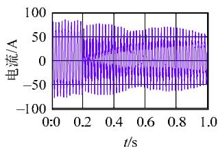  
(a)升压变高压侧电流

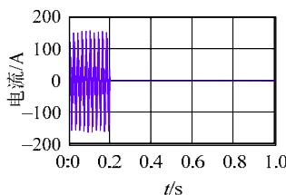  
(b)8号变流器电流波形

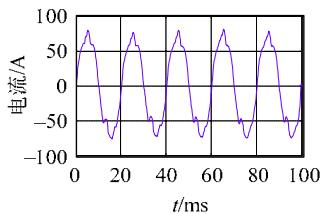  
(c)升压变高压侧电流放大图

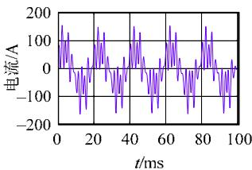  
(d)8号变流器电流波形放大图   
图1 保护动作时刻相关电流波形  
Fig. 1 Current waveforms when protection acted

由图 1 可以看出：跳闸前 66 kV 母线电流中高次谐波含量较少，而 8号变流器的高次谐波含量较大，由此可以判断，高次谐波在 7号与 8 号之间环流；在 8 号变流器跳闸后，66 kV电流谐波含量减少，7 号变流器的谐波含量也随着减少，环流消失。

对发生环流的电流进行快速傅里叶变换(fast fouriertransform，FFT)，得到的 66 kV 和 35 kV 电流频谱如图2所示，可以看出在66 kV在720 Hz含量较小，而 8 号在该处含量较大，达到了 60%，可以确定该频率电流在7号与8号之间发生了环流。7号与8号变流器采用级联 H 桥的拓扑结构，谐波环流会导致阀组内直流侧电压不平衡，从而引起保护动作。

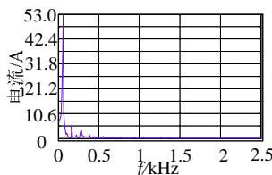  
(a) 升压变高压侧电流频谱

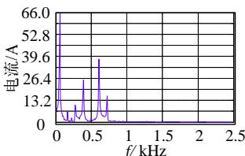  
(b) 8号变流器电流频谱   
图2 保护动作时刻相关电流频谱  
Fig. 2 Spectrum of output current when protection acted

某日，河北省张家口市某风电场也发生了类似问题，风机在没有出力的情况下，风场出口电流含有大量非特征次谐波，电流波形如图 3 所示。该现象并非偶发现象，故需要对其进行深一步研究。

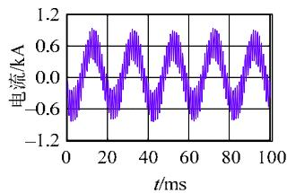  
(a)发生故障A相电流

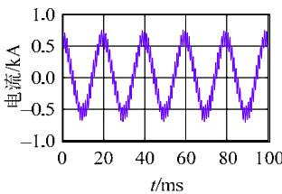  
(b)发生故障B相电流   
图3 张家口市某风电场电流波形  
Fig. 3 Current waveforms of a wind farm in Zhangjiakou

# 1.2 变流器故障原因分析

以 2 台变流器并列运行为例，来分析产生谐波环流的原因，7 号与 8 号 2 台变流器并列运行示意图如图 4 所示，其中 ${ \bf S } _ { 1 } { - } { \bf S } _ { 4 }$ 为 A 相桥臂的开关器件， $U _ { \mathrm { d c } }$ 为直流电压，C 为对地电容。

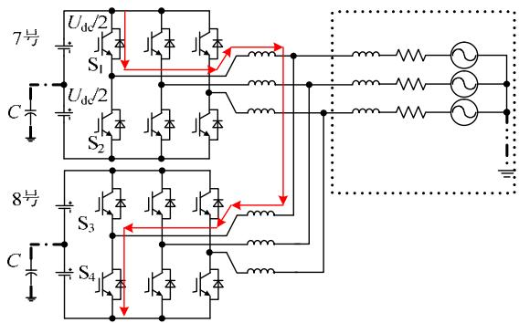  
图4 2 台变流器并列运行示意图  
Fig. 4 Schematic of two paralleled converters

变流器含有丰富的高次谐波，谐波的相位差，由某一区域内多台变流器特性叠加而成，谐波含量非常丰富。当系统较弱，且两区域或 2 台之间变流器的谐波存在相位差，则会在两者变流器中形成环

流。为简化分析，以调制产生的载波的特征谐波为例，来分析开关频率次谐波环流，SPWM 与触发波形如图 5 所示。

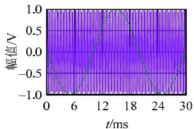  
(a) SPWM示意图

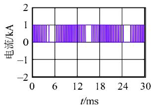  
(b)触发脉冲S波形  
图 5 SPWM 示意图与触发波形  
Fig. 5 Schematic of SPWM and trigger pulses

由于载波和调制波都具有周期性，对输出电压波形进行分析通常采用双重傅里叶级数来进行分析，对单桥臂输出电压进行双重傅里叶分析，三角载波为

$$
u _ {\mathrm {c a r}} = \left\{ \begin{array}{l} \frac {2 \omega_ {\mathrm {c}} t}{\pi} - 2 k \pi , - \frac {\pi}{2} + 2 k \pi <   \omega_ {\mathrm {c}} t + \theta_ {\mathrm {c}} <   \frac {\pi}{2} + 2 k \pi \\ - \frac {2 \omega_ {\mathrm {c}} t}{\pi} + 2 k \pi , \frac {\pi}{2} + 2 k \pi <   \omega_ {\mathrm {c}} t + \theta_ {\mathrm {c}} <   \frac {3 \pi}{2} + 2 k \pi \end{array} \right. \tag {1}
$$

式中： $\omega _ { \mathrm { c } }$ 为载波的角频率；c为载波的相位。

去除零序分量后的桥臂输出的谐波分量为

$$
\begin{array}{l} u _ {\mathrm {o}} (t) = \sum_ {n = 1} ^ {\infty} [ A _ {0 n} \cos (n y) + B _ {0 n} \sin (n y) ] + \\ \sum_ {m = 1} ^ {\infty} \left[ A _ {m 0} \cos (m x) + B _ {m 0} \sin (m x) \right] + \\ \sum_ {m = 1} ^ {\infty} \sum_ {n = \pm 1} ^ {\pm \infty} \left[ A _ {m n} \cos (m x + n y) + B _ {m n} \sin (m x + n y) \right] \tag {2} \\ \end{array}
$$

式 中 ： jA mn mnB  $A _ { _ { m n } } + \mathrm { j } B _ { _ { m n } } = \frac { 1 } { 2 \pi ^ { 2 } } \int \int u _ { _ { \mathrm { p } } } ( t ) \mathrm { e } ^ { \mathrm { j } ( m \omega _ { c } t + n \omega _ { r } t ) } \mathrm { d } ( \omega _ { \mathrm { c } } t ) \cdot$ 2 2π

d( ) t ； $u _ { \mathrm { p } }$ 为调制后输出的方波电压； $\omega _ { \mathrm { r } }$ 和r分别为参考波的角频率和相位。

开关器件频率为500 Hz情况下相应输出电压频谱如图 6 所示，在直流电压和参考波都为理想情况下，变流器输出也含有高次谐波，也就是特征次谐波。该谐波的相位和幅值由参考波与载波幅值和相位共同决定，而参考波的幅值和相位又与控制器参数、工作点密切相关，故高次谐波的相位与幅值，由变流器的控制器参数，工作点以及载波相位共同决定。

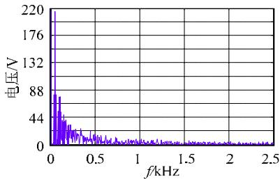  
图 6 输出电压频谱图  
Fig. 6 Spectrum of output voltage

在理想情况下，2 台变流器工作状态相同，参考波与三角载波相位完全相同，即变流器触发脉冲相位及宽度完全相同，使得变流器输出谐波相位也相同，所示变流器此时处于相同的工作状态，不存在谐波环流。但由于 2台变流器的个体差异，比如开机时间不完全一致等，导致三角载波相位不一致，引起触发脉冲相位不一致，最终造成 2 台变流器相同位置的 IGBT 导通时间不同步，使得设备之间出现环流通路，具体示意图如图3红色箭头所示，即使是同厂家、同一型号的变流器也会出现类似的现象，导致谐波环流。

在最恶劣情况下，两变流器载波相位相差180。在一个载波周期内，当 7 号变流器的 A 相上桥臂 $\mathbf { S } _ { 1 }$ 开通，使得 7 号变流器的 A 相输出为正电压时，7 号变流器 A 相电流增大。而此时，8 号变流器的 A 相下桥臂 $\mathrm { \bf S } _ { 4 }$ 开通，导致 8 号变流器 A相输出为负电压，其 A 相电流减小。在这种情况下，7 号与 8 号变流器的电流脉动相位相反，从而在 7 号变流器与 8 号变流器中形成了由连接电抗、直流电容和中性点组成的电流环路。当系统短路容量较小的情况下，变流器的环路为低阻抗通道，从而使得非特征次谐波分量在连接电抗上产生了谐波环流，而此时的系统侧谐波电流较小。通常情况下，变流器的连接电抗较小，使得变流器与变流器之间的回路阻抗较小，导致并联变流器出现大幅、高频的谐波环流，也就是非特征次谐波环流，影响变流器的安全运行。

# 1.3 环流现象与拓扑结构的关系

两电平三相情况下，三相电流之和为零，在一开关周期内对直流侧电压没有影响，完全由变流器的直流电容、工作状态、载波的相位、控制器参数决定，处于线性工作区，呈现的环流电流频率较高、且幅值较小。而在级联 H桥拓扑结构上，会出现不同变流器同相之间的电容充放电现象，造成直流电压不稳，导致控制器饱和、调制器的超调，失去对电流的控制，造成了变流器工作于非线性区，产生其他非特征次谐波。通常情况下，级联 H桥拓扑结构的变流器容量较大，导致相应的非特征次谐波环流也较大，因此，尤其要注意非特征次谐波环流。在级联 H 桥拓扑结构发现非特征次谐波环流情况下，电气距离越近，线路阻抗越低，则越容易发生频率越高谐波环流；相反，电气距离越远，线路阻抗越大，则越容易发生频率较低的谐波环流。当非特征次谐波环流频率较低时，变流器一般能较好地控制谐波特性，并且变电站一般具有 5、7 次谐波

的滤波器支路，能够在一定程度上避免低次谐波环流的发生。

# 2 变流器非特征次谐波环流仿真分析

# 2.1 逆变器并联运行仿真

为验证故障原因分析的准确性，对 2 台变流器并联运行情况进行仿真分析。IGBT 开关频率取6.4 kHz，系统电压 380 V，连接电抗 $3 { \times } 1 0 ^ { - 3 } \mathrm { H }$ 。得到的仿真波形如图7所示。由图7(a)—(c)可以看出，7 号、8 号变流器存在很大的谐波电流，而系统侧不存在明显的谐波电流，与故障情况一致，为非特征次谐波环流。由图 7(d)可知，2 台变流器电流脉动相位相反，从而导致谐波环流的出现，与上述分析结论一致。

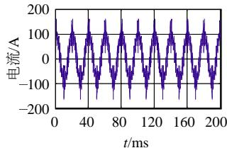  
(a) 7号变流器A相电流波形

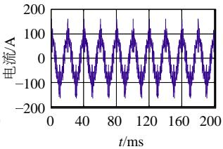  
(b) 8号变流器A相电流波形

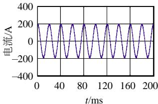  
(c) 系统侧A相电流波形

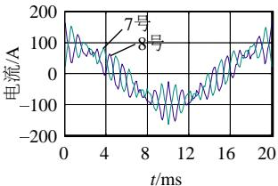  
(d) 7号与8号变流器电流波形对比   
图7 非特征次谐波环流仿真波形  
Fig. 7 Simulation waveforms of non-characteristic harmonic circulating current

通过对电流频谱和相位分析来验证2台变流器之间存在环流现象，两者的频率与相位如图8所示，两者的高次谐波电流相位相反，幅值相同。

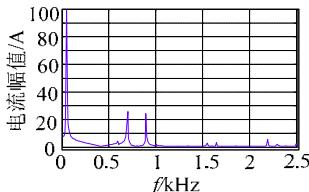  
(a)7号变流器电流频谱

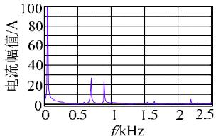  
(b)8号变流器电流频谱

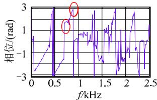  
(c)7号变流器电流相位

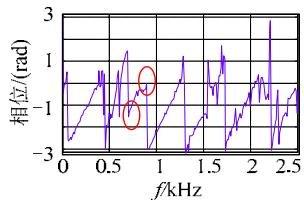  
(d)8号变流器电流相位   
图8 非特征次谐波环流频谱  
Fig. 8 Spectrum of non-characteristic harmonic circulating current

# 2.2 风机并联运行仿真

根据以往数据统计，多个风场并列运行也容易产生谐振，其原因与两变流器并列运行情况相似。风机并列时，由于直流电压波动、死区、控制器参数、运行工况等条件，引起非特征次谐波环流的出现。对 2 台风机并列运行的情况进行仿真分析，图 9 为 2 台风机定子电流波形，从图 9可以看出，2 个风场定子电流存在非特征次谐波环流。

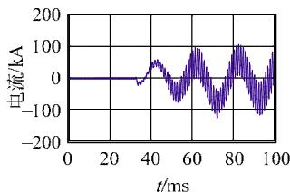  
(a)风机1定子电流波形图

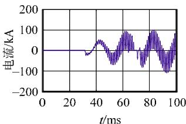  
(b)风机2定子电流波形图  
图9 风机非特征次谐波环流仿真波形  
Fig. 9 Simulation waveforms of non-characteristic harmonic circulating current in DFIG

# 3 防止并联运行变流器谐波环流的措施

根据非特征次谐波的产生的原因及特点，解决并联运行变流器非特征次谐波环流，主要通过各种手段减小谐波电流幅值的大小，使其对直流电压的影响降低，可以采取以下几方面限制的措施。

# 3.1 采用高通滤波的方法

在变流器输出出口处，增加高通滤波器，将非特征次谐波滤除，避免相互之间的环流，得到的仿真波形如图 10 所示。从图 10 可以看出，通过增加高通滤波器，有效减小了变流器之间的环流和非特征次谐波。但是在使用高通滤波器时，应注意变流器特性，避免由于增加了高通滤波后，改变系统阶数，从而导致改变控制系统原有的特性。

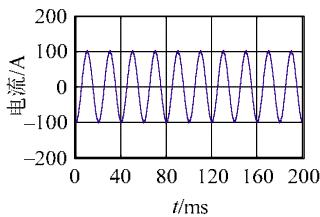  
(a)7号变流器A相电流

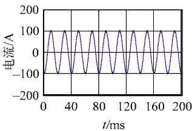  
(b)8号变流器A相电流   
图10 采用高通滤波器后的变流器电流波形  
Fig. 10 Current waveforms of converter with high-pass filter

# 3.2 加大电抗值

增大连接电抗值，可以减小谐波电流幅值，取电抗为 5 mH，其仿真波形如图 11 所示。从图 11可以看出，增大电抗可以有效降低谐波环流幅值。

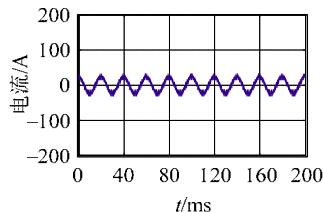  
(a)7号变流器A相电流

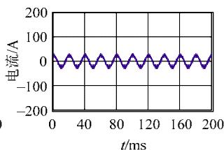  
(b)8号变流器A相电流   
图11 增大电抗后变流器电流波形  
Fig. 11 Current waveforms of converter after inductance increased

但增大电抗会导致大电抗占用较大的无功容量，降低直流侧电压利用率和设备容量。

# 3.3 提高开关频率

提高 IGBT 开关频率可以减小载波周期，那么在一个载波周期内 2 台变流器电流变化较小，产生的不一致现象就会减轻，从而减小谐波环流幅值。取开关频率 12.8 kHz，得到的仿真波形如图 12 所示。但这种方法存在开关热应力增加、损耗增加、散热困难的缺点。

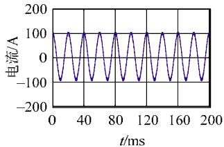  
(a)7号变流器A相电流

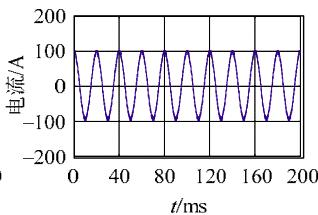  
(b)8号变流器A相电流   
图12 提高电源频率后的变流器电流波形  
Fig. 12 Current waveforms of converter after switching frequency increased

# 3.4 采用不同的控制器参数

根据谐波相位与控制器参数有关的特点，2 台变流器分别采用不同的控制器，得到的仿真波形如图 13 所示。但采用不同控制器，使得控制器一致性差，变流器性能受到影响，同时给设备维护带来麻烦。

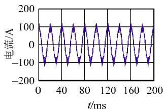  
(a)7号变流器A相电流

  
(b)8号变流器A相电流   
图13 采用不同控制器参数变流器电流波形  
Fig. 13 Current waveforms of converter with different control parameters

# 3.5 采用不同的开关频率

根据双重傅里叶变换，当采用不同开关频率时，谐波相位会有所差别，所以能减小谐波电流环流，分别采用开关频率为 6.45 kHz 和 6.35 kHz，得到的仿真波形如图 14 所示，该方法与采用不同控

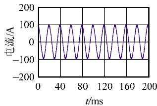  
(a)7号变流器A相电流

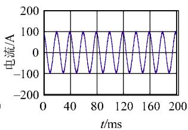  
(b)8号变流器A相电流   
图14 采用不同开关频率的变流器电流波形  
Fig. 14 Current waveforms of converter with different switching frequencies

制器参数存在的缺点一样。

# 3.6 减小谐波相位差

如利用 PLL 锁相信息对载波信号进行对齐，可使载波信号相位相同，从而减小谐波环流的产生。其仿真波形如图 15 所示。从仿真波形可以看出，当工作状态一致时，谐波电流变化相同，但该方法只适合于理想情况。

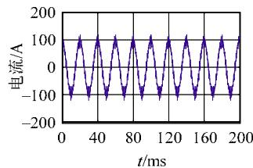  
(a)7号变流器A相电流

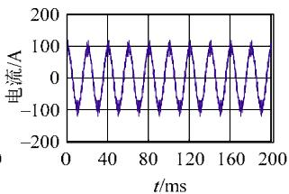  
(b)8号变流器A相电流   
图15 采用PLL 锁相的变流器电流波形  
Fig. 15 Current waveforms of converter with PLL

通过以上分析，采用高通滤波、加大电抗值、提高开关频率、采用不同的控制参数或开关频率都会对非特征次谐波环流有一定的抑制作用。但加大电抗值、提高开关频率、采用不同的控制参数或开关频率都存在一定的问题，只能在一定程度上减小谐波电流环流的概率，不能根本上解决非特征次谐波环流，同时会对设备性能产生影响。而采用高通滤波器的方法从非特征次谐波环流的根本上解决问题，又不会对变流器性能产生影响，因此推荐采用高通滤波器的方式解决多台变流器并联非特征次谐波环流的问题。

# 4 结论

本文通过对冀北某变电站并联运行变流器保护动作原因的分析，指出了导致并联运行变流器跳闸的主要原因是非特征次谐波环流；通过故障录波数据分析与仿真结果验证了指出原因的正确性，分析了非特征次谐波环流与变流器拓扑结构之间的关系，指出级联 H桥拓扑结构尤其要注意非特征次谐波环流。并根据相似的产生机理，指出风电场之间同样存在非特征次谐波环流的风险，应被广泛引起注意。最后，对多种解决多台变流器并联运行非

特征次谐波环流的解决措施进行了仿真与比较，并推荐采用在变流器出口处增加高通滤波器的方法，其在不影响变流器性能的情况下，解决变流器并联非特征次谐波环流问题，可以提高各种类型变流器设备并联运行的可靠性。

# 参考文献

[1] 刘其辉，贺益康，赵仁德．变速恒频风力发电系统最大风能追踪控制[J]．电力系统自动化，2003，27(20)：62-67  
Liu Qihui，He Yikang，Zhao Rende．The maximal wind-energy tracing control of a variable-speed constant-frequency wind-power generation system[J]．Automation of Electric Power Systems，2003， 27(20)：62-67(in Chinese)   
[2] 王兆安，杨君，刘进军．谐波抑制和无功功率补偿[M]．北京：机械工业出版社，2006：39-40．  
[3] 栗然，卢云，刘会兰，等．双馈风电场经串补并网引起次同步振荡机理分析[J]．电网技术，2013，37(11)：3073-3079  
Li Ran，Lu Yun，Liu Huilan，et al．Mechanism analysis on sub-synchronous oscillation caused by grid-integration of doubly fed wind power generation system via series compensation[J]．Power System Technology，2013，37(11)：3073-3079(in Chinese)．   
[4] 吕志鹏，盛万兴，蒋雯倩，等．具备电压稳定和环流抑制能力的分频下垂控制器[J]．中国电机工程学报，2013，33(36)：1-9．  
Lü Zhipeng，Sheng Wanxing，Jiang Wenqian，et al．Frequency dividing droop controllers with the function of voltage stabilization and circulation control[J]．Proceedings of the CSEE，2013，33(36)： 1-9(in Chinese)   
[5] Wu T F，Wu Y E，Hsieh H M，et al．Current weighting distribution control strategy for multi-inverter systems to achieve current sharing[J]．IEEE Transactions on Power Electronics，2007，22(1)： 160-168．   
[6] 高范强，王平，李耀华，等．基于时变相量小信号模型的逆变器并联控制系统分析与设计[J]．中国电机工程学报，2011，31(33)：75-84．  
Gao Fanqiang，Wang Ping，Li Yaohua，et al．Analysis and design of for paralleled inverter system based on the small signal model using time-varying phasor[J]．Proceedings of the CSEE，2011，31(33)： 75-84(in Chinese)   
[7] 吕志鹏，罗安，蒋雯倩，等．多逆变器环境微网环流控制新方法[J]．电工技术学报，2012，27(1)：40-47  
Lü Zhipeng，Luo An，Jiang Wenqian，et al．New circulation controlmethod for micro-grid with multi-inverter micro sources[J]Transactions of China Electrotechnical Society，2012，27(1)：40-47(inChinese)  
[8] Tuladhar A，Jin H，Unger T，et al．Parallel operation of single phase inverter modules with no control interconnections[C]//IEEE Applied

Power Electronics Conference．American：IEEE，1997：94-100  
[9] 姚玮，高明智，陈敏，等．可调阻抗无互联线并联逆变器的控制方法[J]．电力电子技术，2007，41(9)：21-23  
Yao Wei，Gao Mingzhi，Chen Min，et al．An improved droop methodwith the adjustment of output impedance for wireless paralleloperation of inverters[J]．Power Electronics，2007，41(9)：21-23(inChinese)．  
[10] 王要强，吴凤江，孙力，等．带LCL 输出滤波器的并网逆变器控制策略研究[J]．中国电机工程学报，2011，31(12)：34-39  
Wang Yaoqiang，Wu Fengjiang，Sun Li，et al．Control strategy for grid-connected inverter with an LCL output filter[J]．Proceedings of the CSEE，2011，31(12)：34-39(in Chinese)   
[11] 王斯然，吕征宇．LCL 型并网逆变器中重复控制方法研究[J]．中国电机工程学报，2010，30(27)：69-75．  
Wang Siran，Lü Zhengyu．Research on repetitive control method applied to grid-connected inverter with LCL filter[J]．Proceedings of the CSEE，2010，30(27)：69-75(in Chinese)   
[12] 周月宾，江道灼，郭捷，等．模块化多电平换流器子模块电容电压波动与内部环流分析[J]．中国电机工程学报，2012，32(24)：8-14  
Zhou Yuebin，Jiang Daozhuo，Guo Jie，et al．Analysis of sub-module capacitor voltage ripples and circulating currents in modular multilevel converters[J]．Proceedings of the CSEE，2012，32(24)： 8-14(in Chinese)．   
[13] Angquist L，Antonopoulos A，Siemaszko D．Inner control of modular multilevel converters-an approach using open-loop estimation of stored energy[C]//International Power Electronics Conference (IPEC) Sapporo，Japan：Institute of Electrical and Electronics Engineers，2010： 1579-1585．   
[14] 屠卿瑞，徐政，管敏渊，等．模块化多电平换流器环流抑制控制器设计[J]．电力系统自动化，2010，34(18)：57-61  
Tu Qingrui，Xu Zheng，Guan Minyuan，et al．Design of circulating current suppressing controllers for modular multilever converter[J] Automation of Electric Power Systems，2010，34(18)：57-61(in Chinese)．

  
胡应宏

收稿日期：2015-08-25。

作者简介：

胡应宏(1981)，男，博士后，高级工程师，研究方向为新能源并网稳定与控制；E-mail：factshu@163.com；

邓春(1971)，男，硕士，高级工程师，目前主要从事高压设备诊断与测试、管理工作；

王劲松(1972)，男，硕士，高级工程师，目前

主要从事电机诊断与测试、管理工作。

（责任编辑 徐梅）