# A Fixed-Admittance Algorithm for the FPGA-Based Microsecond-Level Nonlinear Real-Time Simulation of the Hybrid DCCB

Hang Su, Jin Xu, Member, IEEE, Jianqi Zhou, Zhiping Qi, Jianghua Yu, and Keyou Wang, Member, IEEE

Abstract—The hybrid high-voltage DC circuit breaker (DCCB) is equipment with the typical nonlinear response in fault-clearing. As an alternative or prior step to drive and control system testing, it is necessary to perform real-time simulations of the DCCB, which improves safety compared to circuit experiments. The response of equipment containing nonlinear components, represented by the DCCB, is more complex, with time scales of milliseconds or even microseconds. The key to realizing nonlinear real-time simulation is to efficiently and accurately solve circuits with nonlinear/time-varying components. In this paper, the concept of "virtual component" is proposed to keep the admittance matrix constant in nonlinear simulation by performing equivalent circuit transformations on a small number of nonlinear components in the network, thus effectively improving the simulation efficiency. Compared to traditional nonlinear methods, the virtual-component-based electromagnetic transient (VC-EMT) method avoids network decoupling, multiple iterations, and solves the compensation hysteresis. The results show that the VC-EMT method realizes accurate and efficient real-time simulation of 500kV/25kA DCCB with a maximum error of less than 0.5% at 1μs time step.

Index Terms—Real-time simulation, Nonlinear systems, DC circuit breaker, Fixed-admittance, Virtual component

# I. INTRODUCTION

HE hybrid high-voltage DC circuit breaker (DCCB) as the most ideal and fastest solution for clearing fault current and isolating faulted lines in flexible DC transmission systems [1]-[2], is the equipment with the typical nonlinear and fast dynamic response [3], which puts forward new requirements for nonlinear simulation in accuracy and efficiency.

During fault-clearing, the DCCB goes through high current transfer and shutoff, establishment, and maintenance of

Manuscript received May 19, 2024; revised October 23, 2024; accepted December 2023, 2024. This work was supported in part by the National Key R&D Program of China (2022YFE0105200), in part by State Grid Zhejiang Electric Power Company Science and Technology Program (5211JX230004), and in part by Anhui Key Research and Development Program 2023, Yangtze River Delta Science and Technology Cooperation Project (2023i11020005).

Hang Su, Jin Xu, Keyou Wang (Corresponding author, e-mail: wangkeyou@sjtu.edu.cn) are with the Ministry of Education, Key Laboratory of Control of Power Transmission and Conversion, Shanghai Jiao Tong University, Shanghai 200240, China.

Jianqi Zhou is with the State Grid Jiaxing Power Supply Company, Jiaxing 314033, China.

Zhiping Qi and Jianghua Yu are with the Hekai Electric Company, Heifei 231131, China.

overvoltage, and energy dissipation in milliseconds. The electromagnetic transients (EMT) are characterized as follows:

1) Nonlinear response: The metal oxide varistor (MOV) of the DCCB is a typical nonlinear component, with its equivalent parameters varying after the voltages greater than the turn-on threshold. It will also experience overshoots and oscillations during fault-clearing.

2) High stress of voltage and current: The low impedance of the system leads to a rapid rise in the short-circuit current (generally in about kA/ms). In addition, due to the large absolute value of the voltage and current as well as the short commutation process (generally about tens to hundreds of microseconds), the stress can be up to kA/μs or kV/μs.

To accurately describe and reappear the EMT of the DCCB, the researchers carried out in-depth analysis and modeling: [4] proposes an equivalent model of the DCCB test circuit, [5]-[6] propose a variety of MOV dynamic models with high accuracy and simple parameter acquisition. The similarity of the above works is the construction of behavioral models including linear and nonlinear circuits based on RLC components and their stray parameters, and the accuracy of the models has been demonstrated by circuit experiments [7].

As key equipment for clearing critical faults such as short circuits, DCCB's high-voltage and large-current fault test conditions are highly hazardous to both equipment and personnel. In addition, conducting short-circuit fault tests requires high hardware and experimental sites, and the number of qualified test sites is far from meeting the test demand. Therefore, it is difficult to carry out a power-in-the-loop (PIL) test on DCCB, and a hardware-in-the-loop (HIL) test is required as an auxiliary method. DCCB real-time simulation technology can help real-time simulators to simulate the nonlinear dynamic process of DCCB on the real-time scale and support HIL tests on DCCB control and protection systems with real physical signal interactions, which cannot be realized by adopting off-line platforms such as PSCAD/EMTDC and other non-real-time simulation. Therefore, it is necessary to conduct real-time simulation research on DCCB.

For real-time simulation of nonlinear systems containing time-varying components, more detailed studies related to electric machines [8], transformers [9], and converters [10] have been conducted. But very rarely about the DCCB, preliminary explorations have been carried out in [11]. The biggest challenge in the real-time simulation of DCCB is to simulate more complex EMT using smaller step sizes while ensuring that the solution is accurate and efficient. Considering the low proportion of nonlinear/time-varying components in

the circuits, to improve efficiency, nonlinear specialized methods are generally not used for such circuits but are solved by modifying linear methods [12]. There are mainly three types of modification methods:

1) Current source substitution method (CSS) [13]-[14]: The nonlinear component is equated to a nonlinear current source in parallel with a linear component, and the nonlinear response is simulated by adjusting the nonlinear current source. The shortcoming is that compensation has a hysteresis, leading to non-negligible errors when the component changes rapidly.   
2) Compensation method [15]-[17]: The network is split into a linear subnetwork and a nonlinear subnetwork, and the two subnetwork responses are solved separately, and then the combined response is obtained by iteration. In real-time simulation, iteration may increase the solution time and limit the minimum step size.   
3) Piecewise linear method [18]-[19]: The nonlinear curve is approximated by multiple linear intervals, and the switching of different intervals is realized by modifying the admittance matrix. As a switching method, the admittance matrix must be adjusted when the operating point is out of the interval. If the identification or adjustment process is not handled properly, the values may be numerically unstable.

Therefore, applying the above methods to the DCCB real-time simulation may be limited in terms of accuracy, efficiency, or stability. In this paper, a virtual-component-based electromagnetic transient (VC-EMT) nonlinear simulation method is proposed. It has the following advantages:

1) High accuracy: While realizing nonlinear real-time simulation with high accuracy in the microsecond level step, it also avoids compensation hysteresis in traditional methods. Comparison with PSCAD shows that the maximum error of the simulation result is within 0.5% at 1μs time step.   
2) High efficiency: Due to the virtual component, the admittance matrix is constant and unaffected by the variation of nonlinear/time-varying components. The algorithm avoids iterations by converting the matrix LU decomposition into an algebraic operation on the history current sources. Parallel optimization further reduces the execution time of each loop.

This paper applies the VC-EMT method to a 500kV/25kA Hybrid DCCB real-time simulation with a step in 1 μs. The sections are organized as follows: in Section 2, the topology, modeling, and simulation of the DCCB are summarized and discussed; in Section 3, the concept of "virtual component" is elaborately described; in Section 4, the application of the VC-EMT method to the DCCB simulation is presented; in Section 5, the results of the DCCB real-time simulation are shown to verify the accuracy and efficiency of the proposed method; and finally, a conclusion is given in Section 6.

# II. REVIEW AND DISCUSSION OF HYBRID HIGH-VOLTAGE DCCB NONLINEAR MODELING AND SIMULATION

# A. Operation and Nonlinear Modeling of the Hybrid DCCB

The hybrid DCCB mainly consists of the mechanical fast circuit breaker, power electronic submodule, and MOV, and the typical topology is shown in Fig. 1, which presents multiple branches in parallel and multiple submodules in cascade. The three parallel branches are called the main branch, transfer

branch, and absorber branch, respectively. The transfer branch and absorber branch are connected in parallel to form a stack, and each stack consists of cascaded diode full-bridge submodules SMt (as shown in Fig. 1(b)) and a MOV in parallel.

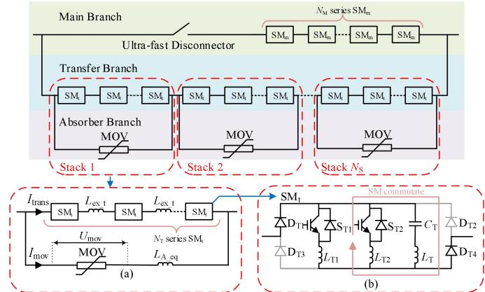  
Fig. 1. The typical topology and equivalent circuit of the Hybrid DCCB. (a) Stack, (b) Diode full-bridge submodule

As shown in Fig. 2, the fault-clearing operation of the DCCB includes the current rising stage, snubber charging stage, absorbing stage, and oscillation stage, which include two SM commutation processes and two branch commutation processes. The MOV absorbs energy from the beginning of the second branch commutation. All operations are completed within a few milliseconds, in which the duration of the commutation is about tens to hundreds of microseconds.

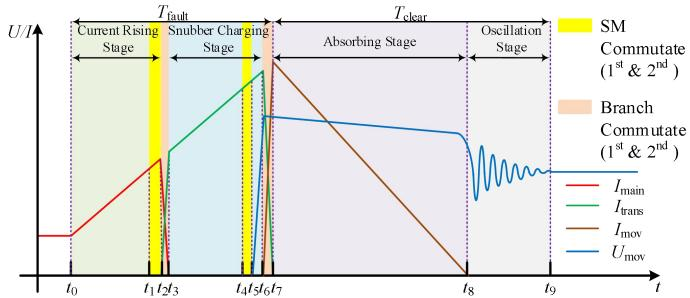  
Fig. 2. Operation and the response of the Hybrid DCCB during the fault.

In order to show the effect of stray parameters on the nonlinear response of the MOV during the fault-clearing process, the [20] proposes an improved nonlinear model for the MOV, as shown in Fig. 3. In the second branch commutation process and absorbing stage, the improved model equates the MOV to a series nonlinear RL circuit. In the oscillation stage, the MOV is modeled as a parallel RC circuit.

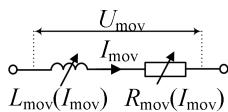

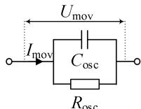  
  
Fig. 3. The improved nonlinear model for the MOV. (a) The second branch commutation process and absorbing stage, (b) The oscillation stage

# B. Discussion of the Hybrid DCCB Nonlinear Simulation

The offline software is widely used to simulate DCCB, such as EMTP-RV and PSCAD/EMTDC. To simplify the construction of the network equations, all of the above software uses the nodal analysis method (NAM) as the framework [21].

The EMT simulation can be expressed as the following generalized matrix equation:

$$
\boldsymbol {G} _ {\mathbf {n}} \cdot \boldsymbol {V} _ {\mathbf {n}} (t) = \boldsymbol {M} \cdot \left[ \boldsymbol {I} _ {\mathbf {h}} (t) + \boldsymbol {I} _ {\text {i n j}} (t) \right] \tag {1}
$$

where $G _ { \bf n }$ denotes the matrix of equivalent admittance, M denotes the correlation matrix, $V _ { \mathbf { n } } ( t )$ denotes the nodal voltage vector, $I _ { \mathrm { h } } ( t )$ denotes the history current source vector, and $I _ { \mathrm { i n j } } ( t )$ denotes the injected current source vector.

In EMT simulations, the equivalent admittance of the resistor is related to the component parameters only. The equivalent admittance of the inductor and capacitor is also related to the simulation step $\Delta t$ and the numerical integration method. Since the FPGA generally adopts a fixed-step operation mode in real-time simulation, this means that the change of circuit parameters during the simulation will lead to the change of $G _ { \bf n }$ simultaneously. Different from offline simulations where the accuracy can be improved by iteration, dealing with the change of $G _ { \bf n }$ in real-time simulations is more tricky due to the time and resource constraints. There are two classical methods:

1) Real-time update of the $\mathbf { { G } _ { n } } \mathbf { { : } }$ High-dimensional matrix LU decomposition will increase solution time, so it is difficult to achieve real-time simulation at the microsecond level.   
2) Pre-storage of ${ \bf { \Gamma } } G _ { \bf { n } } \mathrm { { : } }$ When the circuit parameters change non-periodically, unpredictably, and continuously, such as the DCCB clearing fault, it will bring a huge storage demand. Moreover, frequent switching of the $G _ { \bf n }$ can easily generate numerical stability problems. The interpolation and iteration are needed to suppress non-realistic numerical oscillations.

It can be seen that the classical methods mentioned above are inconvenient to be applied in nonlinear real-time simulation. On the contrary, if we keep the $G _ { \mathfrak { n } }$ constant, whether the component parameters are changed or not. It will avoid updating the admittance matrix in the real-time simulation and improve efficiency. This method has been used in the real-time simulation of the power electronic converter. Therefore, keeping the admittance matrix constant is the key to realizing the small-step real-time simulation of nonlinear circuits.

# III. VIRTUAL COMPONENT AND IT-BASED ELECTROMAGNETIC TRANSIENT NONLINEAR SIMULATION METHOD

In this section, the "virtual component" is proposed, which is used to perform equivalent circuit transformations on a small number of nonlinear components in the circuits. The key innovation is to convert the time-varying admittance matrix in the nonlinear simulation to a constant matrix, thus improving the simulation efficiency. The derivation of the Norton equivalent circuit is performed including nonlinear resistors, inductors, and capacitors. Principles of parameter optimization and nonlinear simulation solution steps are also discussed.

# A. Virtual Component and Virtual Admittance Exposition

The virtual component and its virtual admittance are the key points to realize the nonlinear simulation of constant admittance. For ease of understanding, the concise nonlinear system shown in Fig. 4(a) is used as an example. It consists of a voltage source $U _ { \mathrm { d c } } ,$ a nonlinear resistor $R _ { \mathrm { n o n l i n e a r } } ( t )$ , and a linear resistor $R _ { \mathrm { l i n e a r } }$ . The nonlinear resistor $R _ { \mathrm { n o n l i n e a r } } ( t )$ forms a nonlinear sub-network, and $U _ { \mathrm { d c } }$ and $R _ { \mathrm { l i n e a r } }$ form a linear sub-network. In nonlinear simulation, the changing resistance of $R _ { \mathrm { n o n l i n e a r } }$ changes the nonlinear branch admittance, and

updating the admittance matrix causes difficulties in simulation. If an equivalent system with the same response as Fig. 4(a) and constant admittance matrix can be constructed, then it will create great convenience for nonlinear simulation.

The constructed equivalent system is shown in Fig. 4(b), with the addition of a switch that is disconnected in parallel with $R _ { \mathrm { n o n l i n e a r } }$ compared to the original system shown in Fig. $4 ( \mathrm { a } )$ . Since the added switch is disconnected, the current flowing through the branch of the additional switch is zero, thus ensuring that the original system (Fig. 4(a)) and the equivalent system (Fig. 4(b)) are equivalent and respond consistently in the simulation. At the same time, since the additional switch does not exist in the original system and is artificially constructed for simulation convenience, it can also be called a virtual component. Similarly, the additional switch branch is called a virtual branch. The process of converting the two systems is called "virtual construction".

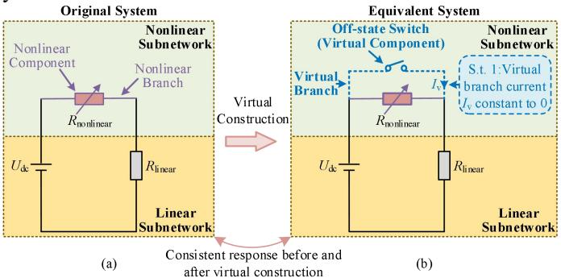  
Fig. 4. Diagrams of virtual constructions and virtual components (a) Original system, (b) Equivalent system

On the basis of ensuring consistent response, the equivalent system shown in Fig. 4(b) also needs to satisfy the constraint that the admittance matrix is constant. The EMT simulation needs to first convert the equivalent system shown in Fig. 4(b) into a Norton equivalent circuit as shown in Fig. 6(a). The Norton equivalent circuit for each component consists of equivalent admittance and history current sources connected in parallel. The equivalent admittance of $R _ { \mathrm { n o n l i n e a r } } ( t )$ is defined as $Y _ { \mathrm { n } } ( t )$ , and the equivalent admittance of the off-state switch (virtual component) is defined as $Y _ { \mathrm { v } } ( t )$ . If the equivalent admittance of the nonlinear Norton sub-network is required to be constant, according to the circuit theorem, the sum of $Y _ { \mathrm { n } } ( t )$ and $Y _ { \mathrm { v } } ( t )$ needs to be constant at all times, as shown in (2):

$$
Y _ {\mathrm {n}} (t) + Y _ {\mathrm {v}} (t) = Y _ {\mathrm {c}} \tag {2}
$$

where $Y _ { \mathrm { c } }$ is a constant, and since both $Y _ { \mathrm { n } } ( t )$ and $Y _ { \mathrm { v } } ( t )$ are nonnegative, $Y _ { \mathrm { c } }$ also needs to satisfy the (3):

$$
Y _ {\mathrm {c}} \geq \max  \left\{Y _ {\mathrm {n}} (t), Y _ {\mathrm {v}} (t) \right\} \tag {3}
$$

The meaning of (2) and (3) can be expressed more intuitively in Fig. 5. In Fig. 5(a), the nonlinear admittance $Y _ { \mathrm { n } } ( t )$ varies with time t according to the yellow curve and reaches the maximum value $Y _ { \mathrm { n } } ( t _ { 2 } )$ at the time $t _ { 2 } .$ Then a constant $Y _ { \mathrm { c } }$ greater than $Y _ { \mathrm { n } } ( t _ { 2 } )$ can be set, labeled on the top horizontal green line in Fig. 5(a). The distance of each point on the yellow curve from the top green line is $Y _ { \mathrm { v } } ,$ and the distance from the bottom is $Y _ { \mathrm { n } } .$ Taking the time of t1 as an example, $Y _ { \mathrm { v } } ( t _ { 1 } )$ and $Y _ { \mathrm { n } } ( t _ { 1 } )$ are labeled in Fig. ${ 5 ( \mathrm { a ) } }$ . Further, the curve of $Y _ { \mathrm { v } }$ with time can be re-plotted on the black curve of Fig. 5(b) based on Fig. 5(a). It should be noted that the blue shaded outline within Fig. 5(a) and (b) are the same.

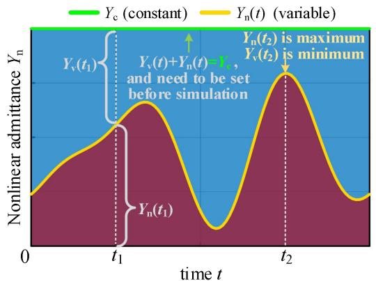  
(a)

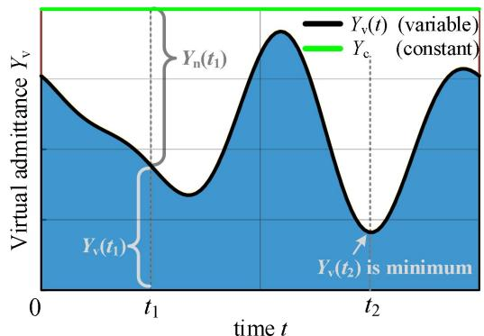  
  
Fig. 5. Diagrams of nonlinear admittance and virtual admittance (a) Nonlinear admittance ${ \overline { { Y } } } _ { \mathrm { n } } , ( \mathrm { b } )$ Virtual admittance Yv

Before simulation, $Y _ { \mathrm { c } }$ needs to be set based on the predicted variation interval of $Y _ { \mathrm { n } } ( t )$ and (3). When $Y _ { \mathrm { n } } ( t )$ varies in the simulation, adjusting $Y _ { \mathrm { v } } ( t )$ according to (2) ensures that the nonlinear Norton subnetwork admittance of Fig. 6(a) is constant at $Y _ { \mathrm { { c } . } }$ . Further, Fig. 6(a) can be simplified according to the circuit theorem, and the result is shown in Fig. 6(b). The constant $Y _ { \mathrm { c } }$ is renamed as the "combined admittance" according to its physical meaning.

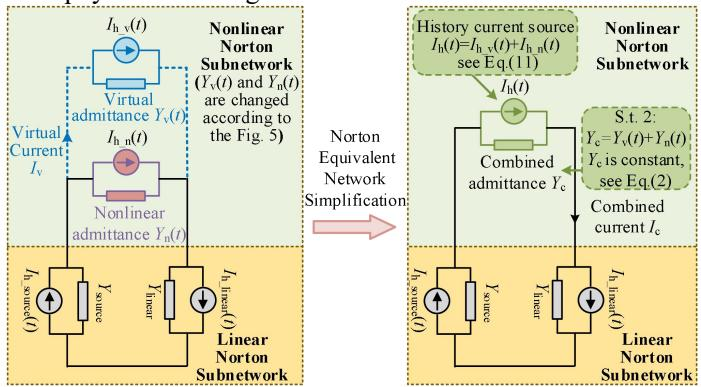  
(a)   
Fig. 6. Norton circuit of the equivalent system and its simplified form (a) Unsimplified, (b) Simplified.

The virtual construction of the original system containing a nonlinear inductor or nonlinear capacitor is done similarly as in Fig. 4. The steps are still to add the virtual component (a disconnected switch in parallel with the nonlinear component) and then set the $Y _ { \mathrm { c } }$ according to (2) and (3). For circuits with multiple nonlinear components, the virtual construction can be

treated separately. When the number of nonlinear components in a circuit is small, the virtual construction has limited changes, and effects on the system should be limited and avoidable.

The technical characteristics of the "virtual component" and "virtual admittance" $Y _ { \mathrm { v } }$ proposed in this paper are briefly described as follows:

1) Parallel: The "virtual component" is connected in parallel in the branch where the nonlinear component is located.   
2) Virtual current Iv is zero (s.t. 1 in Fig. 4(b)): The consistent response of the original system (Fig. 4(a)) and the equivalent system (Fig. 4(b)) presupposes that the "virtual component" is disconnected. That is, no matter how the branch voltage of the "virtual component" changes, the "virtual branch" current $I _ { \mathrm { v } }$ is constant to zero.   
3) Admittances are supplementary (s.t. 2 in Fig. 6(b)): To ensure that the combined admittance is constant at $Y _ { \mathrm { c } , }$ the "virtual admittance" $Y _ { \mathrm { v } } ( t )$ needs to be adjusted in the simulation according to the variation of the "nonlinear admittance" $Y _ { \mathrm { n } } ( t )$ , like the example illustrated in Fig. 5. $Y _ { \mathrm { v } } ( t )$ and $Y _ { \mathrm { n } } ( t )$ are supplementary, and the sum of them is always equal to $Y _ { \mathrm { { c } } } .$

# B. Equivalent Admittance Construction of Nonlinear

# Components and Virtual Components

The equivalent admittance includes the nonlinear admittance $Y _ { \mathrm { n } } ( t )$ for simulating nonlinear response and the virtual admittance $Y _ { \mathrm { v } } ( t )$ for simulating disconnection.

According to (2), the $Y _ { \mathrm { v } } ( t )$ should be supplementary to the $Y _ { \mathrm { n } } ( t )$ , and $Y _ { \mathrm { n } } ( t )$ is obtained by substituting the voltage or current at the time t into the parameter function or lookup table (LUT) of the nonlinear component. The combined admittance $Y _ { \mathrm { c } }$ is a constant and needs to be set larger than the maximum value of $Y _ { \mathrm { n } } ( t )$ , which is easy to predict before simulation.

The backward Euler method is suitable for modeling systems containing nonlinear components because the history current source equation contains only state variables and is simple to compute. The backward Euler method does not cause atypical numerical oscillations when the non-state variables change abruptly. So the $Y _ { \mathrm { n } } ( t )$ and $Y _ { \mathrm { v } } ( t )$ of nonlinear resistors, nonlinear inductors, and nonlinear capacitors will be derived by the backward Euler method.

# 1) Nonlinear resistor:

The nonlinear resistor is a non-dynamic component and the electrical response is expressed by an algebraic equation. For the time-varying nonlinear resistor $R ( t )$ , the equivalent admittance can be expressed as follows:

$$
\left\{ \begin{array}{l} Y _ {\mathrm {n} _ {-} \mathrm {R}} (t) = 1 / R (t) \\ Y _ {\mathrm {v} _ {-} \mathrm {R}} (t) = Y _ {\mathrm {c} _ {-} \mathrm {R}} - Y _ {\mathrm {n} _ {-} \mathrm {R}} (t) \end{array} \right. \tag {4}
$$

where $Y _ { \mathrm { n } \_ \mathrm { R } } , \ Y _ { \mathrm { v } \_ \mathrm { R } } ,$ and $Y _ { \mathrm { c } \mathrm { ~ R ~ } }$ denote the nonlinear, virtual, and combined admittance of the nonlinear resistor, respectively.

# 2) Nonlinear inductor:

The nonlinear inductor is a dynamic component and the electrical response is expressed by a differential equation. For the time-varying nonlinear inductor $L ( t )$ , its branch voltage UL(t) can be expressed as follows:

$$
U _ {\mathrm {L}} (t) = \frac {\mathrm {d} \varphi (t)}{\mathrm {d} t} = L (t) \frac {\mathrm {d I}}{\mathrm {d} t} + I (t) \frac {\mathrm {d L}}{\mathrm {d} t} \tag {5}
$$

where $\varphi ( t )$ denotes the nonlinear inductor flux at the time t.

If the nonlinear inductor L is related to the branch current, i.e., $\scriptstyle { L = f _ { \mathrm { L } } ( I ) }$ , then (5) can be organized as follows:

$$
U _ {\mathrm {L}} (t) = L _ {\mathrm {e q}} (I, t) \frac {\mathrm {d I}}{\mathrm {d} t} \tag {6}
$$

where $L _ { \mathrm { e q } } ( I , t ) { = } f _ { \mathrm { L } } ( I ) { + } I ( t ) f _ { \mathrm { L } } ^ { \mathrm { ~ , ~ } } ( I ) .$ .

Thus, for the equivalent inductor $L _ { \mathrm { e q } } \ ( I , t )$ , the equivalent admittance can be expressed as follows:

$$
\left\{ \begin{array}{l} Y _ {\mathrm {n} _ {-} \mathrm {L}} (t) = \Delta t / L _ {\mathrm {e q}} (I, t) \\ Y _ {\mathrm {v} _ {-} \mathrm {L}} (t) = Y _ {\mathrm {c} _ {-} \mathrm {L}} - Y _ {\mathrm {n} _ {-} \mathrm {L}} (t) \end{array} \right. \tag {7}
$$

where $Y _ { \mathrm { n } \_ \mathrm { L } } , \ Y _ { \mathrm { v } \_ \mathrm { L } } .$ , and $Y _ { \mathrm { c } \mathrm { ~ I ~ } }$ L denote the nonlinear, virtual, and combined admittance of the nonlinear inductor, respectively.

# 3) Nonlinear capacitor:

The nonlinear capacitor is a dynamic component and the electrical response is expressed by a differential equation as well. For the time-varying nonlinear capacitor $C ( t ) ,$ , its branch current $I \mathrm { c } ( t )$ can be expressed as follows:

$$
I _ {\mathrm {C}} (t) = \frac {\mathrm {d} Q (t)}{\mathrm {d} t} = C (t) \frac {\mathrm {d} U}{\mathrm {d} t} + U (t) \frac {\mathrm {d} C}{\mathrm {d} t} \tag {8}
$$

where Q(t) denotes the nonlinear capacitor charge at the time t.

If the nonlinear capacitor C is related to the branch voltage, i. $\mathsf { e } . , C { = } f _ { \mathrm { C } } \left( U \right)$ , then (8) can be organized as follows:

$$
I _ {\mathrm {C}} (t) = C _ {\mathrm {e q}} (U, t) \frac {\mathrm {d} U}{\mathrm {d} t} \tag {9}
$$

where $C _ { \mathrm { e q } } ( U , t ) { = } f _ { \mathrm { C } } \left( U \right) { + } U ( t ) f _ { \mathrm { C } } ^ { \mathrm { ~ , ~ } } ( U ) .$ .

Thus, for the equivalent capacitor $C _ { \mathrm { e q } } ( U , t )$ , the equivalent admittance can be expressed as follows:

$$
\left\{ \begin{array}{l} Y _ {\mathrm {n} _ {-} \mathrm {C}} (t) = C _ {\mathrm {e q}} (U, t) / \Delta t \\ Y _ {\mathrm {v} _ {-} \mathrm {C}} (t) = Y _ {\mathrm {c} _ {-} \mathrm {C}} - Y _ {\mathrm {n} _ {-} \mathrm {C}} (t) \end{array} \right. \tag {10}
$$

where $Y _ { \mathrm { n } \_ \mathrm { C } , \ F _ { \mathrm { v } \_ \mathrm { C } } } .$ and $Y _ { \mathrm { c } \_ \mathrm { C } }$ denote the nonlinear, virtual, and combined admittance of the nonlinear capacitor, respectively.

# C. History Current Source Construction of Nonlinear Components and Virtual Components

Since the nonlinear and virtual components are connected in parallel, the history current source $I _ { \mathrm { h } } ( t )$ can be expressed as the sum of the history current source $I _ { \mathrm { h } \ \mathrm { n } } ( t )$ of the nonlinear component and the history current source $I _ { \mathrm { h \_ v } } ( t )$ of the virtual component as follows:

$$
I _ {\mathrm {h}} (t) = I _ {\mathrm {h} \cdot \mathrm {n}} (t) + I _ {\mathrm {h} \cdot \mathrm {v}} (t) \tag {11}
$$

The historical current source for the nonlinear component $I _ { \mathrm { h } \ \mathrm { n } } ( t )$ derived using the backward Euler method is as follows:

$$
\left\{ \begin{array}{l} I _ {\mathrm {h} - \mathrm {n} - \mathrm {R}} (t) = 0 \\ I _ {\mathrm {h} - \mathrm {n} - \mathrm {L}} (t) = I _ {\mathrm {n} - \mathrm {L}} (t - \Delta t) \\ I _ {\mathrm {h} - \mathrm {n} - \mathrm {C}} (t) = - U _ {\mathrm {n} - \mathrm {C}} (t - \Delta t) Y _ {\mathrm {n} - \mathrm {C}} (t) \end{array} \right. \tag {12}
$$

where $I _ { \mathrm { h ~ n ~ R } } ( t ) , I _ { \mathrm { h ~ } , \mathrm { n ~ L } } ( t )$ , and $I _ { \mathrm { h ~ \underline { { ~ } } n ~ } , \mathbf { C } } ( t )$ denote the history current source of the nonlinear component at the time t, which includes nonlinear resistor, inductor, and capacitor, respectively.

According to Fig. 4(b), the "virtual branch" needs to be in the disconnected state, which requires that the "virtual current" Iv is always zero. The equation construction of the $I _ { \mathrm { h \_ v } } ( t )$ can be discussed separately depending on whether the virtual branch voltage varies.

1) Scenario 1: Constant virtual branch voltage

It is an ideal case that the virtual branch voltages at time t and time $t \mathrm { - } \Delta t$ are equal, i.e., ${ U _ { \mathrm { v } } ( t ) { = } } { U _ { \mathrm { v } } ( t { - } \Delta t ) }$ . For the Norton system shown in Fig. 6(a), with a constant virtual branch voltage, if the virtual admittance at time t is $Y _ { \mathrm { v } } ( t )$ , the virtual current $I _ { \mathrm { v } } ( t )$ can be made equal to 0 by simply letting $I _ { \mathrm { h \_ v } } ( t )$ equal the following equation.

$$
I _ {\mathrm {h} \mathrm {v}} (t) = - Y _ {\mathrm {v}} (t) U _ {\mathrm {v}} (t - \Delta t) \tag {13}
$$

2) Scenario 2: Variable virtual branch voltage:

This is a more general situation in EMT simulations. When the virtual branch voltage changes significantly within a time step, e.g. during a DC short circuit fault. In the case of a significant difference between $U _ { \mathrm { v } } ( t )$ and ${ \cal U } _ { \mathrm { v } } ( t { - } \Delta t { ) }$ , the deviation between $I _ { \mathrm { v } } ( t )$ and 0 will be non-negligible if $I _ { \mathrm { h \_ v } } ( t )$ continues to be updated using (13), which results in errors shown in Table I.

TABLE I   
ANALYSIS OF ERRORS CAUSED BY VIRTUAL CURRENT INJECTION  

<table><tr><td rowspan="2">Branch voltage change</td><td rowspan="2">Virtual current Iv</td><td colspan="3">Simulation results compared to theory parameters</td><td rowspan="2">Suppressor compensation required</td></tr><tr><td>Rnonlinear</td><td>Lnonlinear</td><td>Cnonlinear</td></tr><tr><td>Increase</td><td>Positive</td><td>Smaller</td><td>Smaller</td><td>Larger</td><td>Negative</td></tr><tr><td>Decrease</td><td>Negative</td><td>Larger</td><td>Larger</td><td>Smaller</td><td>Positive</td></tr></table>

As shown in Table I, the change in virtual branch voltage will cause an error between the simulation and the theory values of the nonlinear components. The voltage increase will inject a positive virtual current. This will result in the simulated value of the nonlinear resistor and inductor being smaller than the theoretical value, and the simulated value of the nonlinear capacitor being larger than the theoretical value. Decreasing the voltage will result in the opposite error. The errors of nonlinear resistors and inductors follow the opposite trend of the voltage change, while the errors of nonlinear capacitors follow the trend of the voltage change.

To eliminate the errors caused by the virtual current, $I _ { \mathrm { h \_ v } } ( t )$ should also include a virtual current suppressor in addition to (13). The virtual current suppressor should be connected in parallel to the virtual admittance in the form of a controlled current source, which facilitates integration with the rest of the Norton equivalent network.

With the addition of the suppressor in (13), the expression of $I _ { \mathrm { h \_ v } } ( t )$ applies for the case of Uv variation is shown as follows:

$$
I _ {\mathrm {h} _ {-} \mathrm {v}} (t) = - Y _ {\mathrm {v}} (t) U _ {\mathrm {v}} (t - \Delta t) + I _ {\mathrm {v} _ {-} \text {d a m p}} (t) \tag {14}
$$

where $I _ { \mathrm { v } \_ \mathrm { d a m p } } ( t )$ denotes the output of the virtual current suppressor at the time t, and the input of the suppressor is the last step virtual currents $I _ { \mathrm { v } } ( t { - } \Delta t )$ . According to Table I, the compensation required is opposite in polarity to the $I _ { \mathrm { v } } ,$ so the suppressor is expressed as follows:

$$
I _ {\mathrm {v} \_ \text {d a m p}} (t) = - k _ {\mathrm {d}} (t) I _ {\mathrm {v}} (t - \Delta t) \tag {15}
$$

wh e r e $k _ { \mathrm { d } } ( t )$ denotes the damping coefficient at time $t , \ k _ { \mathrm { d } }$ is updated in each simulation step according to the function $f _ { \mathrm { d a m p } } .$

$$
k _ {\mathrm {d}} (t) = f _ {\text {d a m p}} \left(Y _ {\mathrm {v}} (t)\right) \tag {16}
$$

where the damping function $f _ { \mathrm { d a m p } }$ takes $Y _ { \mathrm { v } } ( t )$ as the independent variable and needs to be set before the simulation, and the setting principles are discussed in Section III. D.

The virtual current $I _ { \mathrm { v } } ( t { - } \Delta t )$ in (15) can be calculated as follows:

$$
I _ {\mathrm {v}} (t - \Delta t) = Y _ {\mathrm {v}} (t - \Delta t) U _ {\mathrm {v}} (t - \Delta t) + I _ {\mathrm {h} _ {- \mathrm {v}}} (t - \Delta t) \tag {17}
$$

where $\begin{array} { r } { Y _ { \mathrm { v } } ( t - \Delta t ) , ~ U _ { \mathrm { v } } ( t - \Delta t ) . } \end{array}$ , and $I _ { \mathrm { h \_ v } } ( t - \Delta t )$ denote the virtual admittance, the virtual branch voltage, and the history current source of the virtual component at the time (t-Δt), respectively.

The comparison shows that (13) is a special case of (14), which corresponds to the case where $k _ { \mathrm { d } } ( t )$ is always set to zero. So it is confirmed that (14) is a general form of $I _ { \mathrm { h \_ v } } ( t )$ .

Substituting (14) and (12) into (11), and organizing the history current source $I _ { \mathrm { h } } ( t )$ to the unified form as follows:

$$
I _ {\mathrm {h}} (t) = \alpha (t) U _ {\mathrm {b}} (t - \Delta t) + \beta (t) I _ {\mathrm {b}} (t - \Delta t) + \gamma (t) \tag {18}
$$

where $a ( t )$ denotes the branch voltage coefficient, $\beta ( t )$ denotes the branch current coefficient, and $\gamma ( t )$ denotes the suppression term. In addition, the $I _ { \mathrm { h } } ( t )$ of the linear component can also be organized in the form of (18).

TABLE II EQUIVALENT ADMITTANCE AND HISTORY CURRENT SOURCE COEFFICIENTS FOR LINEAR AND NONLINEAR COMPONENTS   

<table><tr><td>Type</td><td>Equivalent admittance</td><td>α(t)</td><td>β(t)</td><td>γ(t)</td></tr><tr><td>Rlinear</td><td>1/R</td><td>0</td><td>0</td><td>0</td></tr><tr><td>Llinear</td><td>Δt/L</td><td>0</td><td>1</td><td>0</td></tr><tr><td>Clinear</td><td>C/Δt</td><td>-C/Δt</td><td>0</td><td>0</td></tr><tr><td>Rnonlinear</td><td>Yc_R</td><td>-Yv_R(t)-kd(t)Yv_R(t-Δt)</td><td>0</td><td>-kd(t)Ih_v_R(t-Δt)</td></tr><tr><td>Lnonlinear</td><td>Yc_L</td><td>-Yv_L(t)-kd(t)Yv_L(t-Δt)</td><td>1</td><td>-kd(t)Ih_v_L(t-Δt)</td></tr><tr><td>Cnonlinear</td><td>Yc_C</td><td>-Yc_C-kd(t)Yv_C(t-Δt)</td><td>0</td><td>-kd(t)Ih_v_C(t-Δt)</td></tr></table>

The equivalent admittance and history current source coefficients are shown in Table II, where the $Y _ { \mathrm { c } \_ \mathrm { R } } , Y _ { \mathrm { c } \_ \mathrm { L } } .$ and $Y _ { \mathrm { c } \_ \mathrm { C } }$ are derived in $( 4 ) , ( 7 ) ,$ , and (10), respectively. In Table II, the equivalent admittance is constant for all types of components, which ensures a constant $\mathbf { G } _ { \mathbf { n } } .$ . Each simulation loop only needs to execute the algebraic operation of the history current source, avoiding the $G _ { \mathrm { n } }$ recalculation and iteration. Therefore, the complexity of the proposed method is not affected by the dimension of the $G _ { \mathfrak { n } }$ and is only related to the number of nonlinear components contained in the system, which changes linearly.

# D. Combined Admittance and Suppressor Optimal Settings

In order to avoid the potential influence of virtual components on the dynamics of the nonlinear system, it is necessary to carefully set the combined admittance $Y _ { \mathrm { c } }$ in the Norton equivalent circuits and damping coefficients function $f _ { \mathrm { d a m p } }$ of the virtual components before the simulation.

The circuit has been analyzed and simulated from a discrete state space perspective in [22], which is suitable for EMT simulation and dynamic stability analysis.

According to stability theory, the eigenvalues of the discrete state matrix A determine the transient response of the system. In general, each eigenvalue corresponds to an oscillation mode. When the modulus of eigenvalue is zero, it can be assumed that the correlated oscillation mode has a negligible effect on the system.

For discrete state matrix A of the nonlinear systems, the eigenvalue of the new oscillation mode $\lambda _ { \mathrm { v } }$ of the virtual component can be shifted to the origin nearly as possible by adjusting the parameters of the $Y _ { \mathrm { c } }$ and $k _ { \mathrm { d } }$ while minimizing the change of the original eigenvalue of the system. The parameter adjustment should follow the following principles:

1) The modulus of $\lambda _ { \mathrm { v } }$ should be adjusted to approaching 0, which can reduce the change in the dynamic characteristics of the system brought by the new oscillation mode.   
2) If principle 1 cannot be realized, the damping ratio of $\lambda _ { \mathrm { v } }$

can be adjusted to approaching 1, which makes the new modes introduced by the virtual components decay quickly.

The discrete state space model for the nonlinear systems can be constructed by referring to [22]. Specifically, selecting the history current source vector $I _ { \mathrm { h } } ( t )$ as the state variable, the injected current source vector $I _ { \mathrm { i n j } } ( t )$ as the input variable, the branch voltage vector $U _ { \mathbf { b } } ( t )$ , and the branch current vector $I _ { \mathbf { b } } ( t )$ as the output variables:

$$
\left\{ \begin{array}{l} I _ {\mathrm {h}} (t + \Delta t) = A I _ {\mathrm {h}} (t) + B I _ {\mathrm {i n j}} (t) \\ \left[ \begin{array}{l} U _ {\mathrm {b}} (t) \\ I _ {\mathrm {b}} (t) \end{array} \right] = C I _ {\mathrm {h}} (t) + D I _ {\mathrm {i n j}} (t) \end{array} \right. \tag {19}
$$

In (19), the update of the $I _ { \mathrm { h } } ( t { + } \Delta t )$ is regarded as the state equation, and the calculation of $U _ { \mathbf { b } } ( t )$ and $I _ { \mathbf { b } } ( t )$ is regarded as the output equation. Matrix $\pmb { A }$ is the discrete state matrix, B is the input matrix, C is the output matrix, and D is the feed-forward matrix, defined as follows:

$$
\left\{ \begin{array}{l} \boldsymbol {A} = \boldsymbol {B} = \boldsymbol {M} _ {\alpha} \boldsymbol {K} + \boldsymbol {M} _ {\beta} \boldsymbol {L} \\ \boldsymbol {C} = \boldsymbol {D} = \left[ \begin{array}{l l} \boldsymbol {K} & \boldsymbol {L} \end{array} \right] ^ {T} \end{array} \right. \tag {20}
$$

where matrices $M _ { \mathfrak { a } } , M _ { \mathfrak { b } } , K ,$ , and L are defined as follows:

$$
\left\{ \begin{array}{l} \boldsymbol {M} _ {\alpha} = \operatorname {d i a g} \left(\left[ \begin{array}{l l l l} \alpha_ {1} & \alpha_ {2} & \dots & \alpha_ {\mathbf {n}} \end{array} \right]\right) \\ \boldsymbol {M} _ {\beta} = \operatorname {d i a g} \left(\left[ \begin{array}{l l l l} \beta_ {1} & \beta_ {2} & \dots & \beta_ {\mathbf {n}} \end{array} \right]\right) \\ \boldsymbol {K} = - \boldsymbol {M} ^ {\mathrm {T}} \boldsymbol {G} _ {\text {i n v}} \boldsymbol {M} \\ \boldsymbol {L} = - \boldsymbol {Y} _ {\mathrm {e q}} \boldsymbol {M} ^ {\mathrm {T}} \boldsymbol {G} _ {\text {i n v}} \boldsymbol {M} + \boldsymbol {I} \end{array} \right. \tag {21}
$$

where $M _ { \mathbf { a } }$ and $M _ { \mathfrak { p } }$ are the diagonal matrices of branch voltage and current coefficients based on Table II, M denotes the correlation matrix, $\mathbf { G } _ { \mathbf { i n v } }$ denotes the inverse matrix of $G _ { \mathfrak { n } } ,$ I denotes the unit diagonal matrix, and $Y _ { \mathrm { e q } }$ denotes the diagonal matrix of equivalent admittance.

# E. The VC-EMT Nonlinear Simulation Method

Drawing on (18) and (19), we can split the simulation loop for nonlinear circuits into two steps. The vector $I _ { \mathrm { h } } ( t )$ and the vector $I _ { \mathrm { i n j } } ( t )$ are first solved by algebraic operations, and then the vector $U _ { \mathbf { b } } ( t )$ and the vector $I _ { \mathbf { b } } ( t )$ are solved by matrix operations.

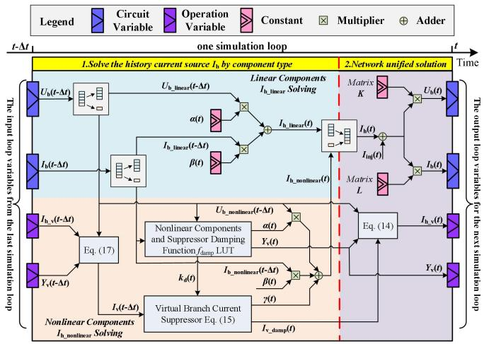  
Fig. 7. The flow chart of the VC-EMT method in one simulation loop.

The flow chart of the VC-EMT method in one simulation loop is shown in Fig. 7. It has four loop variables including two

circuit variables, which are branch voltage vector $U _ { \mathbf { b } }$ and branch current vector $I _ { \mathbf { b } } ,$ and two operation variables, which are the virtual component history current source vector $I _ { \mathbf { h } _ { - } \mathbf { v } }$ and the virtual admittance vector $Y _ { \mathbf { v } } .$

The VC-EMT method consists of two main steps (separated by red dashed lines in Fig. 7). The first step calculates the history current sources separately according to the component whether is linear or nonlinear, referring to (18) and Table II. It should be noted that the coefficient $a ( t )$ is related to the $k _ { \mathrm { d } } ( t )$ and $Y _ { \mathrm { v } } ( t ) ,$ , all of which need to be updated in each loop using a LUT approach. The LUT includes the nonlinear behavioral model and the suppressor damping function $f _ { \mathrm { d a m p } }$ . The second step unified solves the network according to (19), and the matrices K and L are constant, which avoids the delay caused by decoupling.

Compared to traditional NAM-based simulation frameworks that serially solve for the voltage currents of nodes and branches as well as the historical current sources, the flow chart of the VC-EMT method is more compact and more parallel. The history current sources of linear components $I _ { \mathrm { h \_ l i n e a r } } ( t )$ and the nonlinear component ${ \cal I } _ { \mathrm { h } }$ _nonlinear(t) are solved in parallel, as are solutions of branch voltage $U _ { \mathbf { b } } ( t )$ and branch current $I _ { \mathbf { b } } ( t )$ . This is ideal for FPGA solvers to reduce the execution time of a single simulation cycle.

# F. Applicability and Compatibility of the VC-EMT Method

The VC-EMT method is suitable for systems containing a small number of nonlinear components, which ensures that the simulation parameter configurations are acceptable in terms of workload and difficulty of implementation. Due to the "virtual admittance" being constructed and derived on the components level, the VC-EMT method has no strict restrictions on the topology of the applicable system. As long as the parameters of the virtual component including the combined admittance $Y _ { \mathrm { c } }$ and the damping function of $k _ { \mathrm { d } }$ are set appropriately, it is theoretically applicable to almost all systems. As the smallest unit of the circuit, the virtual components can be flexibly connected to other modules to simulate the nonlinear response.

In addition, the VC-EMT simulation method has good compatibility. The solution process of the VC-EMT method is compact but retains the core parts of the NAM framework. When integrating with the system-level EMTP methods, only the history current source calculation link for nonlinear components needs to be added according to Table II. Also, the optimizations and applications for the traditional EMT method are applicable to the VC-EMT method.

# IV. APPLICATION OF THE VC-EMT METHOD IN DCCB AND ITS REAL-TIME SIMULATION IMPLEMENTATION

# A. Virtual Construction on the MOV of the DCCB

The topology and equivalent circuit of the 500 kV/25 kA hybrid DCCB is shown in Fig. 1. The model of the MOV is shown in Fig. 3. Its response has been tested by hardware experiments in [20], which will be used as a data source for the nonlinear LUT required for the virtual construction. The MOV equivalent model parameters versus current are shown in Fig. ${ \mathbf 8 } ( \mathrm { a } )$ . Since the $R _ { \mathrm { m o v } }$ and $L _ { \mathrm { m o v } }$ are in series, the $Y _ { \mathrm { n } }$ of the MOV can be calculated integrally as in Fig. 8(b). Other parameters are shown in Table III.

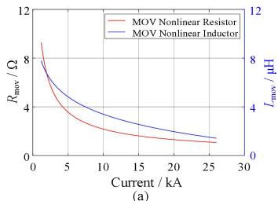

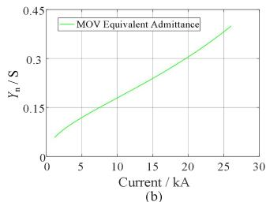  
Fig. 8. The MOV nonlinear equivalent model parameters. (a) MOV nonlinear resistance and inductance, (b) MOV nonlinear equivalent admittance $Y _ { \mathrm { n } } .$

PARAMETERS OF THE 500 KV/25 KA HYBRID DCCB   

<table><tr><td>Parameter</td><td>Symbol</td><td>Value</td></tr><tr><td>Rated voltage</td><td>Udc</td><td>500 kV</td></tr><tr><td>Rated current</td><td>Idc</td><td>5 kA</td></tr><tr><td>Number of SMm in series on the main branch</td><td>NM</td><td>8</td></tr><tr><td>Number of SMt in series per stack</td><td>NT</td><td>64</td></tr><tr><td>Number of stacks in series</td><td>NS</td><td>5</td></tr><tr><td>Submodule SMm external stray inductance</td><td>Lex_m</td><td>2.5 μH</td></tr><tr><td>Submodule SMt external stray inductance</td><td>Lex_t</td><td>0.3125 μH</td></tr><tr><td>Absorber branch equivalent inductance</td><td>LA_eq</td><td>14 μH</td></tr><tr><td>Submodule SMm internal stray inductance</td><td>LM1, LM2</td><td>1 μH</td></tr><tr><td>Submodule SMm capacitance</td><td>CM</td><td>200 μF</td></tr><tr><td>Submodule SMt internal stray inductance</td><td>LT1, LT2</td><td>1 μH</td></tr><tr><td>Submodule SMt capacitance</td><td>CT</td><td>300 μF</td></tr><tr><td>Submodule SMtIGBT threshold voltage</td><td>Uh_IGBT</td><td>0.50 V</td></tr><tr><td>Submodule SMtIGBT equivalent resistance</td><td>RIGBT</td><td>0.58 mΩ</td></tr><tr><td>MOV threshold voltage</td><td>Uhmov</td><td>130 kV</td></tr><tr><td>MOV voltage limiting rate</td><td>λ</td><td>1.6</td></tr></table>

According to Fig. 8(b), the maximum of the $Y _ { \mathrm { n } }$ is about 0.39, and the minimum is about 0.06, so the $Y _ { \mathrm { c } }$ is set to 0.4.

The virtual current suppressor damping function $f _ { \mathrm { d a m p } }$ of the MOV needs to be set according to the eigenvalues of the discrete state matrix A.

The eigenvalues of the virtual construction system at $Y _ { \mathrm { { n } } } =$ 0.15, i.g. $Y _ { \mathrm { v } } = 0 . 2 5$ are discussed as an example. As Fig. $9 ( \mathrm { a } )$ shows, compared to the original system, the virtual component introduces two new eigenvalues $\lambda _ { \mathrm { v l } }$ and $\lambda _ { \mathrm { v } 2 }$ when no damper is added (i.e., $k _ { \mathrm { d } }$ is always set to zero). To ensure that the dynamics of the virtual construction system and the original system are consistent, $\lambda _ { \mathrm { v l } }$ and $\lambda _ { \mathrm { v } 2 }$ need to be adjusted. As Fig. 9(b) shows, keeping $Y _ { \mathrm { n } }$ constant, if $k _ { \mathrm { d } }$ is increased, λv1 and $\lambda _ { \mathrm { v } 2 }$ will first move towards the real axis, then $\lambda _ { \mathrm { v l } }$ will move towards the unit circle, and $\lambda _ { \mathrm { v } 2 }$ will move towards the origin. When $k _ { \mathrm { d } }$ is increased to 1.67, λv1 and $\lambda _ { \mathrm { v } 2 }$ will coincide with the eigenvalues of the original system $\lambda _ { 0 1 }$ and $\lambda _ { \mathbf { o } 2 } ,$ , respectively, while the rest of the eigenvalues are basically the same as the original system. The impact of virtual construction on the system was successfully avoided.

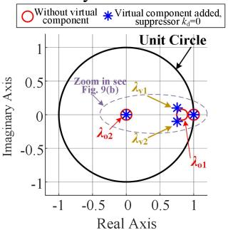  
(@)

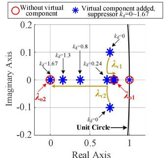  
  
Fig. 9. Comparison of the eigenvalue of the virtual construction system and the original system when $\begin{array} { r } { Y _ { \mathrm { n } } { = } 0 . 1 \dot { 5 } , Y _ { \mathrm { v } } { = } 0 . 2 5 . } \end{array}$ . (a)When $k _ { \mathrm { d } } { = } 0 ,$ , (b) The trajectory of $\lambda _ { \mathrm { v 1 } }$ and λv2 as kd changes from 0 to 1.67.

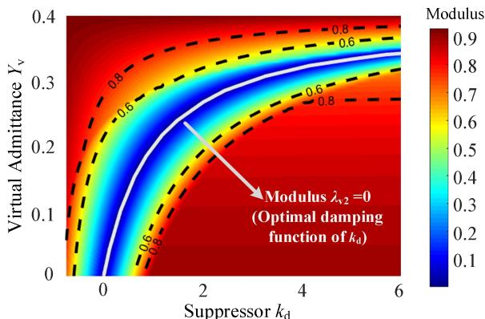  
Fig. 10. The modulus of λv2 and the damping function of kd when $Y _ { \mathrm { c } } = 0 . 4 .$ .

When Yn varies between 0.06 and 0.4, Yv varies between 0.34 and 0. The discrete state matrix A is analyzed in the $Y _ { \mathrm { v } } - k _ { \mathrm { d } }$ plane using a similar approach as in Fig. 9. The scan results of the modulus of $\lambda _ { \mathrm { v } 2 }$ in the $Y _ { \mathrm { v } } - k _ { \mathrm { d } }$ plane are shown in Fig. 10.

According to Principle 1 in Section III. D, kd is regarded as the optimal damping when the modulus of $\lambda _ { \mathrm { v } 2 }$ is 0, as shown in the gray line of Fig. 10, i.g. the damping function set for $k _ { \mathrm { d } } .$ The damping coefficient $k _ { \mathrm { d } } ( t )$ is adjusted according to the damping function in each simulation loop.

After confirming the LUT of the MOV and the optimal damping function, the matrices $G _ { \mathrm { i n v } } , K ,$ and L of the virtual constructed network can be calculated according to (21), which are all constants in the nonlinear real-time simulation.

# B. Implementation in the FPGA-Based Real-Time Simulation Platform

The FPGA-based real-time simulation platform is shown in Fig. 11(a). The NI PXIe chassis is equipped with an FPGA module (NI PXIe-7975R) and CPU module (NI PXIe-8135), which simulate DCCB topology and protect logic separately. Besides, the platform also includes a host PC, an I/O module, an oscilloscope, and other external devices. The operation settings and connections of the platform are shown in Fig. 11(b). The DCCB topology is compiled and simulated on the FPGA module in 1μs steps with the VC-EMT method shown in Fig. 7. The FPGA module is operating at the frequency of 160 MHz.

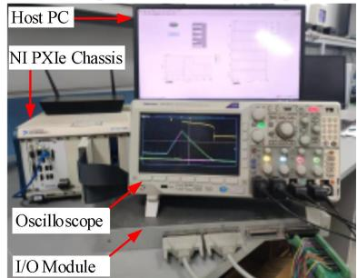

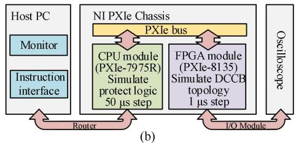  
(a)   
Fig. 11. The FPGA-Based real-time simulation platform. (a) Hardware photograph, (b) Operation settings and connections

# V. THE DCCB REAL-TIME SIMULATION RESULTS

In this section, a 500 kV/25 kA DCCB will be simulated on a real-time simulation platform using the VC-EMT method. The real-time simulation results of the VC-EMT method will be evaluated in terms of accuracy and efficiency, respectively.

# A. The DCCB Test Systems and Fault Clearing Scenarios

The testing system is shown in Fig. 12, where $U _ { \mathrm { d c } }$ is 500kV and $L _ { \mathrm { f } }$ is 150 mH. The simulation process is described as follows: the DCCB runs in non-fault mode before 50.0 ms; at 50.0 ms, a line-to-ground fault with $R _ { \mathrm { f a u l t } } { = } 0 . 7 5 \Omega$ takes place at the DC side of the system; at 53.0 ms, the DCCB recognizes the fault and starts the first commutation; at 56.0 ms the second commutation takes place, and then it enters the absorbing and oscillation stage.

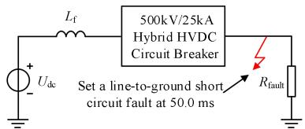  
Fig. 12. The diagram of the 500kV/25kA DCCB testing system

# B. Accuracy Validation of the DCCB Real-Time Simulation

The accuracy of the real-time simulation results is evaluated by taking PSCAD/EMTDC (Ver.4.6.0) as a benchmark, in which PSCAD/EMTDC adopts the same topology and parameters as the real-time simulation. Fig. 13 shows the simulation results of the DCCB for the fault-clearing process, the second commutation process, and the oscillation stage, respectively. Fig. 13 (a), (b), and (c) show the real-time results using the VC-EMT simulation method. Fig. 13 (d), (e), and (f) show the results using the PSCAD, which are considered as benchmarks. The voltage and current waveforms of each branch and MOV demonstrate the high accuracy of the VC-EMT simulation method. Compared to PSCAD, the maximum error is less than 0.5% when the time step is 1 μs.

During the second branch commutation process, the voltage of the MOV $U _ { \mathrm { m o v } }$ changes rapidly, resulting in a non-negligible virtual current $I _ { \mathrm { v } } .$ Fig. 14 shows a comparison of the simulation results for this process with 1 μs step. The results of the VC-EMT method and PSCAD are basically consistent. The results of the CSS method have obvious errors because Iv is not effectively suppressed (as shown in the red line in Fig. 14(c)), and the $I _ { \mathrm { v } }$ is caused by the compensation lag. The VC-EMT method effectively suppresses the $I _ { \mathrm { v } }$ to stabilize at 0 by adding a suppressor, which significantly improves the accuracy (as shown in the green line in Fig. 14(c)). The MOV voltage increases in this stage, and according to Table I, without damping compensation will make the actual equivalent parameter of the nonlinear component smaller than the theory values, leading to the shortening of the commutation process, which is also proved in Fig. 14(a) and (b).

While changing the maximum value of the short-circuit fault current $I _ { \mathrm { f a u l t \_ m a x } } ,$ the $U _ { \mathrm { d c } }$ is kept at 500 kV and the $U _ { \mathrm { t h \_ m o v } }$ is kept at 130 kV. The EMT of the IGBT and the MOV during the second commutation process when set $I _ { \mathrm { f a u l t \_ m a x } }$ to 24.45kA, 16.76kA, and 10.91kA, are shown in Fig. 15 and 16. It should be noted that the process label at the top of Fig. 15 and 16 is based on the results in which $I _ { \mathrm { f a u l t \_ m a x } } { = } 2 4 . 4 5 \mathrm { k A }$ and the rest cases are similar.

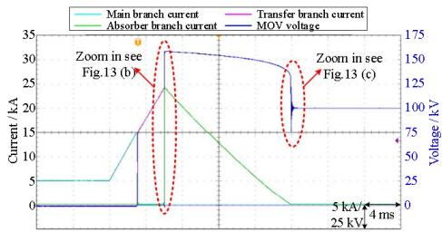  
(a) DCCB fault-clearing process (VC-EMT method in real-time)

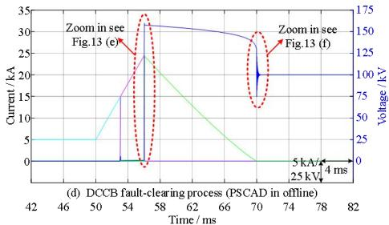

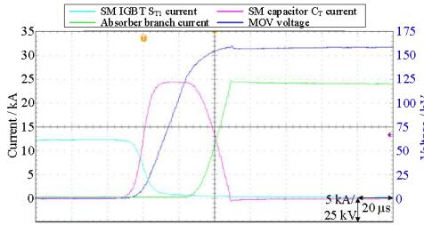

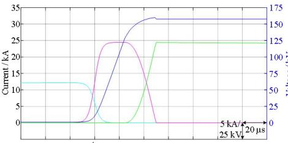  
(b)DCCB 2dcommutationprocess(VC-EMTmethod inreal-time)   
(e) DCCB 2"d commutation process (PSCAD in offline) 55.9655.98 56.00 56.02 56.04 56.06 56.08 56.10 56.12 56.14 56.16 Time/ms

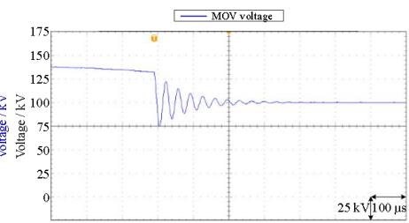

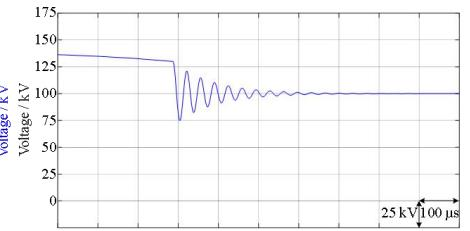  
(c) MOV oscillation voltage (VC-EMT method in real-time)   
(f) MOV oscillation voltage (PS CAD in offline) 69.769.869.97070.170.270.370.470.570.670.7 Time/ms

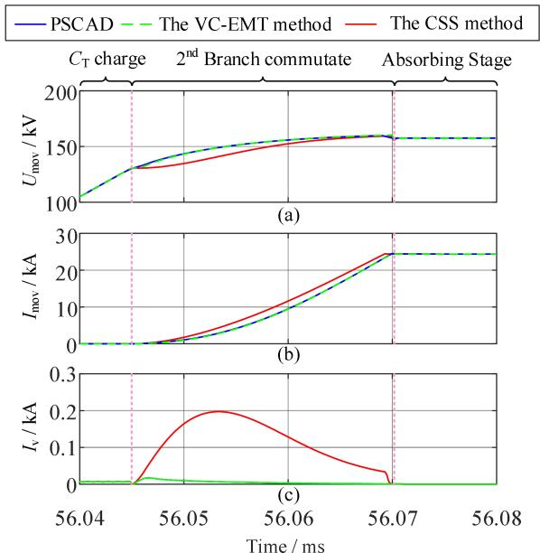  
Fig. 13. The comparison of the DCCB simulation results. (a) fault-clearing full process (VC-EMT in real-time), (b) The $2 ^ { \mathrm { n d } }$ commutation process (VC-EMT in real-time), (c) MOV oscillation voltage (VC-EMT in real-time), (d) fault-clearing full process (PSCAD in offline), (e) The $2 ^ { \mathrm { n d } }$ commutation process (PSCAD in offline), (f) MOV oscillation voltage (PSCAD in offline).   
Fig. 14. Comparison of virtual current suppression. (a) MOV voltage $U _ { \mathrm { m o v } , } ( { \mathsf { b } } )$ MOV current $\bar { I } _ { \mathrm { m o v } , \mathrm { ( c ) } }$ Virtual current of MOV Iv

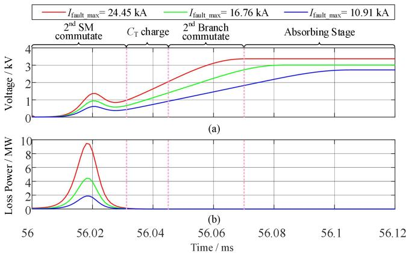  
Fig. 15. The EMT of the IGBT ST1 during the second commutation process. (a) SM IGBT ST1 voltage, (b) SM IGBT ST1 loss power.

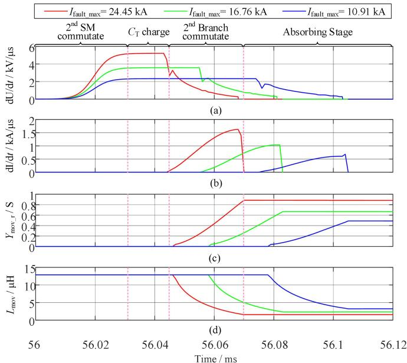  
Fig. 16. The EMT of the MOV during the second commutation process. (a) Voltage stress, (b) Current stress, (c) Nonlinear $R _ { \mathrm { m o v } }$ admittance (d) Nonlinear $L _ { \mathrm { m o v } }$ inductance.

As shown in Fig. 15, as the $I _ { \mathrm { f a u l t \_ m a x } }$ increases, the voltage and the loss power of the IGBT $\mathbf { S } _ { \mathrm { T 1 } }$ increase. The second SM and branch commutation processes are about tens of microseconds. The voltage peaks are caused by stray inductances $L _ { \mathrm { T 1 } }$ and $L _ { \mathrm { T 2 } } ,$ and correspond to the loss power maximum at the moment.

As shown in Fig. 16, the MOV voltage stress and current stress increase as the ${ I _ { \mathrm { f a u l t \_ m a x } } }$ increases. Meanwhile, the second branch commutation process will start earlier but for a shorter span. For one fault scenario, the MOV voltage stress increases during the SM commutation process remains stable during the $C _ { \mathrm { T } }$ charging, and decreases during the branch commutation process. The MOV current stress increases and then decreases after the MOV is turned on. The admittance of $R _ { \mathrm { m o v } }$ is shown in Fig. 16(c), and the $L _ { \mathrm { m o v } }$ of the MOV during the second commutation process is shown in Fig. 16(d).

# C. Ef iciency Comparison of the DCCB Real-Time Simulation

The same DCCB is simulated in real-time with a 1 μs step by the VC-EMT method, the CSS method, and the Compensation method, respectively. Which, the VC-EMT method adopts a discrete state-space-based parallel framework as shown in Fig. 7, the CSS method adopts a traditional NAM-based serial framework, and the Compensation method adopts an iterative framework.

TABLE IV EXECUTION TIME OF THE DCCB REAL-TIME SIMULATION   

<table><tr><td>Method</td><td>Execution time / ticks</td><td>Maximum supported compilation frequency</td></tr><tr><td>VC-EMT method</td><td>650 ns /104 ticks</td><td>160 MHz</td></tr><tr><td>CSS method</td><td>1150 ns / 138 ticks</td><td>120 MHz</td></tr><tr><td>Compensation method</td><td>4280 ns / 428 ticks</td><td>100 MHz</td></tr></table>

As shown in Table IV, the execution time of the Compensation method is significantly higher than the other two methods, which indicates that the non-iterative framework can effectively reduce the execution time. Although both are non-iterative frameworks, the VC-EMT method reduces the execution time by 43.5% compared to the CSS method, which is achieved by optimizing the solution process in parallel. The execution time of the VC-EMT method is as low as 650 ns, which achieves a similar level as solving the linear system. The execution time of the solution of the VC-EMT method is less than 1 μs, which ensures the real-time performance of the simulation. Since the execution time of both the CSS method and the Compensation method is longer than 1 μs, which indicates that the traditional methods are unable to simulate in real-time with 1 μs steps. In addition, the VC-EMT method increases the maximum supported compilation frequency, which helps to perform more computational steps in the same time duration.

TABLE V RESOURCE CONSUMPTION OF THE DCCB REAL-TIME SIMULATION   

<table><tr><td>Method</td><td>Flip-flop (63550 in total)</td><td>LUT (254200 in total)</td><td>RAM lock (795 in total)</td><td>DSP 48 (1540 in total)</td></tr><tr><td>VC-EMT method</td><td>46.4%</td><td>29.1%</td><td>11.7%</td><td>15.6%</td></tr><tr><td>CSS method</td><td>47.3%</td><td>27.8%</td><td>11.1%</td><td>16.2%</td></tr><tr><td>Compensation method</td><td>55.2%</td><td>36.9%</td><td>13.4%</td><td>20.3%</td></tr></table>

As shown in Table V, the resource consumption of the VC-EMT method and the CSS method are similar, because the computation of the virtual admittance and the virtual current suppressor added by the VC-EMT method are algebraic operations, and the computation added by a small number of nonlinear components is negligible. The higher consumption of the Compensation method is due to the sub-network decoupling and iteration in the network solution.

Comprehensively analyzing Fig. 14 and the results in Tables IV and V, the VC-EMT method proves to be effective in improving the simulation efficiency by reducing the solution time while improving the simulation accuracy while keeping the computational resource consumption basically the same.

# VI. CONCLUSION

To improve the nonlinear simulation efficiency, this paper proposes the concept of "virtual component" to keep the admittance matrix constant by circuit equivalent transformation.

Based on the derivation of the Norton equivalent of nonlinear and virtual components, the VC-EMT method is proposed and used for 500kV/25kA Hybrid DCCB real-time simulation. The real-time simulation results have demonstrated that the VC-EMT method can accurately simulate the nonlinear response of a 500kV/25kA DCCB in real-time at 1μs step size. The comparison shows that the VC-EMT method improves the simulation accuracy by using a virtual current suppressor, and improves the simulation efficiency by constant admittance matrix and parallel optimization.

# REFERENCES

[1] X. Guo, J. Zhu, Q. Zeng, H. Xiao and T. Wei, "Research on a Multiport Parallel Type Hybrid Circuit Breaker for HVDC Grids: Modeling and Design," CSEE Journal of Power and Energy Systems, vol. 9, no. 5, pp. 1732-1742, September 2023.   
[2] L. Zhang et al., "Modeling, control, and protection of modular multilevel converter-based multi-terminal HVDC systems: A review," CSEE Journal of Power and Energy Systems, vol. 3, no. 4, pp. 340-352, Dec. 2017.   
[3] F. Mohammadi et al., "HVDC Circuit Breakers: A Comprehensive Review," IEEE Transactions on Power Electronics, vol. 36, no. 12, pp. 13726-13739, Dec. 2021.   
[4] Z. Dongye, L. Qi, B. Ji, X. Wei and X. Cui, "Circuit Model with Current Interruption for Hybrid High Voltage DC Circuit Breakers to Achieve Precise Current Experiments," CSEE Journal of Power and Energy Systems, vol. 8, no. 4, pp. 1250-1260, July 2022.   
[5] P. Pinceti and M. Giannettoni, "A simplified model for zinc oxide surge arresters," IEEE Transactions on Power Delivery, vol. 14, no. 2, pp. 393-398, April 1999.   
[6] IEEE Working Group 3. 4. 11, "Modeling of metal oxide surge arresters," IEEE Transactions on Power Delivery, vol. 7, no. 1, pp. 302-309, Jan. 1992.   
[7] X. Han, W. Sima, M. Yang, L. Li, T. Yuan and Y. Si, "Transient Characteristics Under Ground and Short-Circuit Faults in a ±500kV MMC-Based HVDC System With Hybrid DC Circuit Breakers," IEEE Transactions on Power Delivery, vol. 33, no. 3, pp. 1378-1387, June 2018.   
[8] B. Jandaghi and V. Dinavahi, "Real-Time HIL Emulation of Faulted Electric Machines Based on Nonlinear MEC Model," IEEE Transactions on Energy Conversion, vol. 34, no. 3, pp. 1190-1199, Sept. 2019.   
[9] J. Liu and V. Dinavahi, "Nonlinear Magnetic Equivalent Circuit-Based Real-Time Sen Transformer Electromagnetic Transient Model on FPGA for HIL Emulation," IEEE Transactions on Power Delivery, vol. 31, no. 6, pp. 2483-2493, Dec. 2016.   
[10] C. Liu, R. Ma, H. Bai, Z. Li, F. Gechter and F. Gao, "FPGA-Based Real-Time Simulation of High-Power Electronic System With Nonlinear IGBT Characteristics," IEEE Journal of Emerging and Selected Topics in Power Electronics, vol. 7, no. 1, pp. 41-51, March 2019.   
[11] N. Lin and V. Dinavahi, "Detailed Device-Level Electrothermal Modeling of the Proactive Hybrid HVDC Breaker for Real-Time Hardware-in-the-Loop Simulation of DC Grids," IEEE Transactions on Power Electronics, vol. 33, no. 2, pp. 1118-1134, Feb. 2018.   
[12] N. R. Watson, Power Systems Electromagnetic Transients Simulation, Institution of Engineering and Technology, 2002.   
[13] M. Gole, Power Systems Transient Simulation, Course Notes, University of Manitoba, 1998.   
[14] H. W. Dommel, "Transformer Models in the Simulation of Electromagnetic Transients," Proceedings of the 5th Power Systems Computing Conference, Cambridge, England, Sept. 1975, Paper 3.1/4.   
[15] B. Bruned, J. Mahseredjian, S. Dennetière, J. Michel, M. Schudel and N. Bracikowski, "Compensation Method for Parallel and Iterative Real-Time Simulation of Electromagnetic Transients," IEEE Transactions on Power Delivery, vol. 38, no. 4, pp. 2302-2310, Aug. 2023.   
[16] B. Asghari and V. Dinavahi, "Real-Time Nonlinear Transient Simulation Based on Optimized Transmission Line Modeling," IEEE Transactions on Power Systems, vol. 26, no. 2, pp. 699-709, May 2011.   
[17] Y. Chen and V. Dinavahi, "An Iterative Real-Time Nonlinear Electromagnetic Transient Solver on FPGA," IEEE Transactions on Industrial Electronics, vol. 58, no. 6, pp. 2547-2555, June 2011.

[18] K. Yamamura and R. Kaneko, "Finding all solutions of piecewise-linear resistive circuits using the simplex method," IEEE Transactions on Circuits and Systems I: Fundamental Theory and Applications, vol. 50, no. 1, pp. 160-165, Jan. 2003.   
[19] A. Tatematsu and T. Noda, "Three-Dimensional FDTD Calculation of Lightning-Induced Voltages on a Multiphase Distribution Line With the Lightning Arresters and an Overhead Shielding Wire," IEEE Transactions on Electromagnetic Compatibility, vol. 56, no. 1, pp. 159-167, Feb. 2014.   
[20] Z. Dongye, L. Qi, K. Liu, X. Wei, F. Lu and X. Cui, "Overvoltage Estimation by Stray Inductances During Turn-off of a 500 kV/25 kA DC Circuit Breaker," IEEE Transactions on Power Electronics, vol. 36, no. 7, pp. 7400-7406, July 2021.   
[21] H. W. Dommel and W. S. Meyer, "Computation of electromagnetic transients," Proceedings of the IEEE, vol. 62, no. 7, pp. 983–993, Jul. 1974.   
[22] J. Xu, K. Wang, P. Wu and G. Li, "FPGA-Based Sub-Microsecond-Level Real-Time Simulation for Microgrids With a Network-Decoupled Algorithm," IEEE Transactions on Power Delivery, vol. 35, no. 2, pp. 987-998, Apr. 2020.

Jianghua Yu received the M.S degree in electrical engineering from Hefei University of Technology, Hefei, China, in 2011.

He is currently working as a R&D Director of 400MW pumped storage power plant generating circuit breaker and working toward the Ph.D. degree in Anhui University. His research interests include short-circuit fault rapid identification and fast-switching technology.

Keyou Wang (S’05-M’09) received the B.S. and M.S. degrees in electrical engineering from Shanghai Jiao Tong University, Shanghai, China, in 2001 and 2004, respectively, and the Ph.D. degree from the Missouri S&T (formerly University of Missouri-Rolla) in 2008.

He is currently a Professor and Vice Department Chair of Electrical Engineering at Shanghai Jiao Tong University. His research interests include power system dynamics and stability, renewable energy integration, and converter dominated power systems. He serves as an Associate Editor of Protection and Control of Modern

Power System, and CSEE Journal of Power and Energy Systems.

Hang Su received the B.S. degree in electrical engineering from Central South University, Changsha, China, in 2018, and the M.S. degree from Shanghai Jiao Tong University, Shanghai, China, in 2021. He is currently working toward the Ph.D. degree in Shanghai Jiao Tong University.

His research interests include power electronic system modeling, real-time simulation, and power system stability analysis.

Jin Xu (M’21) received the B.S. degree in electrical engineering from Sichuan University, Chengdu, China, in 2013, and the Ph.D. degree from Shanghai Jiao Tong University, Shanghai, China, in 2019.

He is currently an assistant professor at Shanghai Jiao Tong University. His research interests include power system stability analysis, power electronic modeling, and real-time simulation.

Jianqi Zhou received the B.S. degree in electrical engineering from Shandong University, Jinan, China, in 1988.

He is currently the Deputy Chief Engineer of State Grid Jiaxing Power Supply Company. His research interests include smart grid, smart energy, smart city, distribution network planning, etc.

Zhiping Qi received the M.S. degree in mechanical engineering from Shanghai Jiao Tong University, Shanghai, China, in 2015.

He is currently working as a senior engineer of circuit breaker R&D. His research interests include R&D and design of medium and high voltage fast circuit breakers.